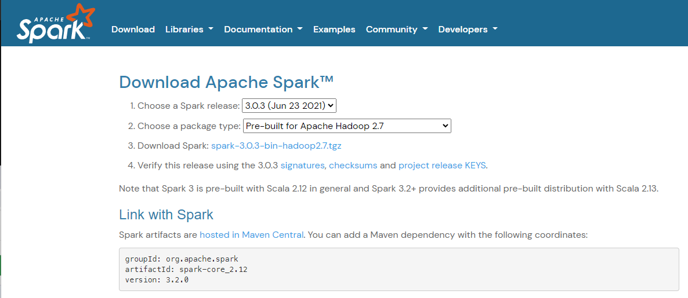
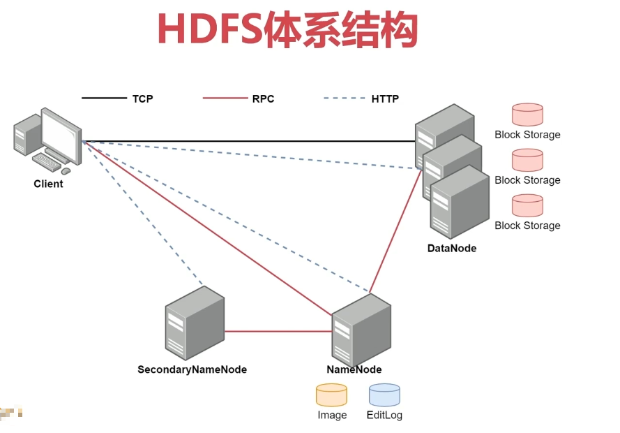
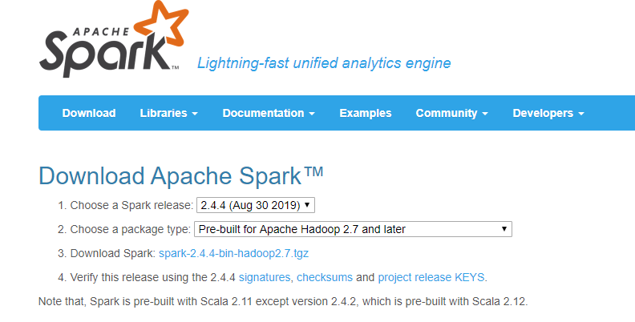

# BigData实战

[返回列表](https://github.com/EmonCodingBackEnd/backend-tutorial)

[TOC]

# The Hadoop Ecosystem


# 一、基础软件安装

## 1、安装ZooKeeper（CDH版）

### 1.1、ZooKeeper单节点（CDH版）

1. 下载

官网地址： https://zookeeper.apache.org/index.html

下载地址： https://mirrors.tuna.tsinghua.edu.cn/apache/zookeeper/

版本3.5.5带来的坑：https://blog.csdn.net/jiangxiulilinux/article/details/96433560

> wget -cP /usr/local/src/ https://mirrors.tuna.tsinghua.edu.cn/apache/zookeeper/zookeeper-3.7.0/apache-zookeeper-3.7.0-bin.tar.gz --no-check-certificate

这里以cdh版学习：

**注意**：无法避开收费墙下载，暂时无解

2. 创建安装目录

```bash
[emon@emon ~]$ mkdir /usr/local/ZooKeeper
```

3. 解压安装

```bash
[emon@emon ~]$ tar -zxvf /usr/local/src/zookeeper-3.4.5-cdh5.16.2.tar.gz -C /usr/local/ZooKeeper/
```

**说明：**如果发生错误：

> gzip: stdin: decompression OK, trailing garbage ignored
>
> tar: Child returned status 2
> tar: Error is not recoverable: exiting now

**解决方案：**
先`gunzip *.tar.gz`
再`tar xvf *.tar`
也可以使用`tar xvf *.tar -C 自定义目录`指定解压位置。
若文件为`.tgz`格式，用`mv`命令转成`.tar.gz`。

4. 创建软连接

```bash
[emon@emon ~]$ ln -snf /usr/local/ZooKeeper/zookeeper-3.4.5-cdh5.16.2/ /usr/local/zoo
```

5. 配置环境变量

在`/etc/profile.d`目录创建`zoo.sh`文件：

```bash
[emon@emon ~]$ sudo vim /etc/profile.d/zoo.sh
export ZK_HOME=/usr/local/zoo
export PATH=$ZK_HOME/bin:$PATH
```

使之生效：

```bash
[emon@emon ~]$ source /etc/profile
```

6. 目录规划

```bash
[emon@emon ~]$ mkdir -p /usr/local/zoo/{data,logs}
```

7. 配置文件

- 复制`zoo_sample.cfg`到`zoo.cfg`

```bash
[emon@emon ~]$ cp /usr/local/zoo/conf/zoo_sample.cfg /usr/local/zoo/conf/zoo.cfg
```

- 编辑`zoo.cfg`文件

```bash
[emon@emon ~]$ vim /usr/local/zoo/conf/zoo.cfg 
```

```bash
# [修改]
dataDir=/tmp/zookeeper => dataDir=/usr/local/zoo/data
# [新增]
dataLogDir=/usr/local/zoo/logs
# [新增]修改默认的8080端口，该选项在3.5.5之后才需要配置
admin.serverPort=8090
```

8. 启动与停止

- 启动（端口号2181）

```bash
[emon@emon ~]$ zkServer.sh start
```

- 校验

```bash
[emon@emon ~]$ jps
44611 QuorumPeerMain
```

- 停止

```bash
[emon@emon ~]$ zkServer.sh stop
```

- 状态

```bash
[emon@emon ~]$ zkServer.sh status
```

9. 连接

- 访问8090端口的服务【版本3.5.5开始支持】

```bash
# 比如
http://192.168.1.116:8090/commands/stat
```

- 远程连接

```bash
[emon@emon ~]$ zkCli.sh -server 192.168.1.116:2181
```

- 本地连接

```bash
[emon@emon ~]$ zkCli.sh
```

- 退出（在链接成功后，使用命令quit退出）

```bash
[zk: localhost:2181(CONNECTED) 0] quit
```


### 1.2、ZooKeeper集群（CDH版）

- Zookeeper角色
  - leader：领导者
    - 集群中只有一个leader
    - 参与leader选举，有投票权
  - follower：跟随者
    - 参与leader选举，有投票权
  - observer：观察者
    - 不参与leader选举，没有投票权

#### 1.2.1、Zookeeper集群规划

| 机器名 | IP1-家庭      | IP2-公司   | 部署内容 |
| ------ | ------------- | ---------- | -------- |
| emon   | 192.168.1.116 | 10.0.0.116 |          |
| emon2  | 192.168.1.117 | 10.0.0.117 |          |
| emon3  | 192.168.1.118 | 10.0.0.118 |          |

#### 1.2.2、前置安装

1. 配置SSH免密登录

<font color="red">每一台服务器都需要配置免密登录。</font>

[配置SSH免密登录](https://github.com/EmonCodingBackEnd/backend-tutorial/blob/master/tutorials/BigData/BigDataInAction.md#532%E5%89%8D%E7%BD%AE%E5%AE%89%E8%A3%85)

2. JDK安装

<font color="red">每一台服务器都需要安装JDK。</font>

[安装JDK](https://github.com/EmonCodingBackEnd/backend-tutorial/blob/master/tutorials/Linux/LinuxInAction.md#1安装jdk)

3. 安装Zookeeper

<font color="red">每一台服务器都需要安装Zookeeper。</font>

[安装ZooKeeper](https://github.com/EmonCodingBackEnd/backend-tutorial/blob/master/tutorials/BigData/BigDataInAction.md#1%E5%AE%89%E8%A3%85zookeepercdh%E7%89%88)

#### 1.2.3、配置

<font color="red">每一台服务器都需要配置，且配置内容一样。</font>

<font color="red">仅emon这个主服务器执行如下命令。</font>

- 复制`zoo_sample.cfg`到`zoo.cfg`

```
[emon@emon ~]$ cp /usr/local/zoo/conf/zoo_sample.cfg /usr/local/zoo/conf/zoo.cfg
```

- 配置`zoo.cfg`文件

```bash
[emon@emon ~]$ vim /usr/local/zoo/conf/zoo.cfg 
# [修改]
dataDir=/tmp/zookeeper => dataDir=/usr/local/zoo/data
# [新增]
dataLogDir=/usr/local/zoo/logs
# [新增]修改默认的8080端口，该选项在3.5.5之后才需要配置
admin.serverPort=8090
# [新增]
server.1=emon:2888:3888
server.2=emon2:2888:3888
server.3=emon3:2888:3888
```

- 配置`myid`

配置ASCII编码格式的服务编号，服务启动时，会通过数据目录`dataDir`下的`myid`文件识别出服务编号。

```bash
# 注意，这里主机名对应的myid编号，是要和zoo.cfg中配置的server.x对应上，否则集群启动报错！
[emon@emon ~]$ echo 1 > /usr/local/zoo/data/myid
[emon@emon2 ~]$ echo 2 > /usr/local/zoo/data/myid
[emon@emon3 ~]$ echo 3 > /usr/local/zoo/data/myid
```

#### 1.2.4、启动与停止

1. 启动与停止

- 启动（端口号2181）

```bash
[emon@emon ~]$ zkServer.sh start
[emon@emon2 ~]$ zkServer.sh start
[emon@emon3 ~]$ zkServer.sh start
```

- 校验

```bash
[emon@emon ~]$ jps
44611 QuorumPeerMain
```

- 停止

```bash
[emon@emon ~]$ zkServer.sh stop
[emon@emon2 ~]$ zkServer.sh stop
[emon@emon3 ~]$ zkServer.sh stop
```

- 状态

```bash
[emon@emon ~]$ zkServer.sh status
[emon@emon2 ~]$ zkServer.sh status
[emon@emon3 ~]$ zkServer.sh status
```


## 2、安装kafka（外部ZK）

### 2.1、Kafka单节点

1. 下载

官网地址：http://kafka.apache.org/

下载地址：http://kafka.apache.org/downloads

```bash
[emon@emon ~]$ wget -cP /usr/local/src/ https://archive.apache.org/dist/kafka/2.5.0/kafka_2.12-2.5.0.tgz
```

2. 创建安装目录

```bash
[emon@emon ~]$ mkdir /usr/local/Kafka
```

3. 解压安装

```bash
[emon@emon ~]$ tar -zxvf /usr/local/src/kafka_2.12-2.5.0.tgz -C /usr/local/Kafka/
```

4. 创建软连接

```bash
[emon@emon ~]$ ln -snf /usr/local/Kafka/kafka_2.12-2.5.0/ /usr/local/kafka
```

5. 配置环境变量

在`/etc/profile.d`目录创建`kafka.sh`文件：

```bash
[emon@emon ~]$ sudo vim /etc/profile.d/kafka.sh
export KAFKA_HOME=/usr/local/kafka
export PATH=$KAFKA_HOME/bin:$PATH
```

使之生效：

```bash
[emon@emon ~]$ source /etc/profile
```

6. 目录规划

```bash
[emon@emon ~]$ mkdir -p /usr/local/kafka/logs
```

7. 配置文件

- 编辑`server.properties`配置文件

```bash
[emon@emon ~]$ vim /usr/local/kafka/config/server.properties 
```

```bash
# [修改]
log.dirs=/tmp/kafka-logs => log.dirs=/usr/local/kafka/logs
# [修改]
zookeeper.connect=localhost:2181=>zookeeper.connect=emon:2181
```

8. 编写启动停止脚本

- 启动脚本

```bash
[emon@emon ~]$ vim /usr/local/kafka/kafkaStart.sh
```

```bash
# 启动kafka
/usr/local/kafka/bin/kafka-server-start.sh -daemon /usr/local/kafka/config/server.properties
```

- 停止脚本

```bash
[emon@emon ~]$ vim /usr/local/kafka/kafkaStop.sh
```

```bash
# 关闭kafka
/usr/local/kafka/bin/kafka-server-stop.sh
```

- 修改可执行权限

```bash
[emon@emon ~]$ chmod u+x /usr/local/kafka/kafkaStart.sh 
[emon@emon ~]$ chmod u+x /usr/local/kafka/kafkaStop.sh 
```

9. 启动与停止

- 启动

```bash
[emon@emon ~]$ /usr/local/kafka/kafkaStart.sh
```

- 停止

```bash
[emon@emon ~]$ /usr/local/kafka/kafkaStop.sh
```

10. 创建`topic`

- 创建

```bash
[emon@emon ~]$ kafka-topics.sh --create --bootstrap-server emon:9092 --replication-factor 1 --partitions 1 --topic test
# 命令执行结果
Created topic test.
```

- 查看topic列表

```bash
[emon@emon ~]$ kafka-topics.sh --list --bootstrap-server emon:9092
# 命令执行结果
test
```

- 查看单个topic详情

```bash
[emon@emon ~]$ kafka-topics.sh --describe --bootstrap-server emon:9092 --topic test
# 命令执行结果
Topic: test	PartitionCount: 1	ReplicationFactor: 1	Configs: segment.bytes=1073741824
	Topic: test	Partition: 0	Leader: 0	Replicas: 0	Isr: 0
```

11. 测试生产者消费者

- 生产者

```bash
# 打开生产者命令行模式
[emon@emon ~]$ kafka-console-producer.sh --bootstrap-server emon:9092 --topic test
```

- 消费者

```bash
# 打开消费者命令模式
[emon@emon ~]$ kafka-console-consumer.sh --bootstrap-server emon:9092 --topic test --from-beginning
```

- 查看topic的偏移量

```bash
[emon@emon ~]$ kafka-run-class.sh kafka.tools.GetOffsetShell --broker-list emon:9092 --topic test
# 命令执行结果
test:0:59134
```


### 2.2、Kafka集群

1. 目录规划

```bash
[emon@emon ~]$ mkdir -pv /usr/local/kafka/{logs9092,logs9093,logs9094}
```

2. 第一个节点

- 复制属性文件

```bash
[emon@emon ~]$ cp /usr/local/kafka/config/server.properties /usr/local/kafka/config/server-9092.properties
```

- 配置

```bash
[emon@emon ~]$ vim /usr/local/kafka/config/server-9092.properties 
```

```bash
# [不变]
broker.id=0
# [修改]
log.dirs=/tmp/kafka-logs => log.dirs=/usr/local/kafka/logs9092
# [新增]
listeners=PLAINTEXT://:9092
# [修改]
zookeeper.connect=localhost:2181=>zookeeper.connect=emon:2181
```

3. 第二个节点

- 复制属性文件

```bash
[emon@emon ~]$ cp /usr/local/kafka/config/server.properties /usr/local/kafka/config/server-9093.properties
```

- 配置

```bash
[emon@emon ~]$ vim /usr/local/kafka/config/server-9093.properties 
```

```bash
# [不变]
broker.id=1
# [修改]
log.dirs=/tmp/kafka-logs => log.dirs=/usr/local/kafka/logs9093
# [新增]
listeners=PLAINTEXT://:9093
# [修改]
zookeeper.connect=localhost:2181=>zookeeper.connect=emon:2181
```

4. 第三个节点

- 复制属性文件

```bash
[emon@emon ~]$ cp /usr/local/kafka/config/server.properties /usr/local/kafka/config/server-9094.properties
```

- 配置

```bash
[emon@emon ~]$ vim /usr/local/kafka/config/server-9094.properties 
```

```bash
# [不变]
broker.id=2
# [修改]
log.dirs=/tmp/kafka-logs => log.dirs=/usr/local/kafka/logs9094
# [新增]
listeners=PLAINTEXT://:9094
# [修改]
zookeeper.connect=localhost:2181=>zookeeper.connect=emon:2181
```

5. 启动与停止

- 启动

```bash
[emon@emon ~]$ /usr/local/kafka/bin/kafka-server-start.sh -daemon /usr/local/kafka/config/server-9092.properties
[emon@emon ~]$ /usr/local/kafka/bin/kafka-server-start.sh -daemon /usr/local/kafka/config/server-9093.properties
[emon@emon ~]$ /usr/local/kafka/bin/kafka-server-start.sh -daemon /usr/local/kafka/config/server-9094.properties
```

- 停止

```bash
# 关闭kafka
[emon@emon ~]$ /usr/local/kafka/bin/kafka-server-stop.sh
```

6. 创建`topic`

- 创建

```bash
[emon@emon ~]$ kafka-topics.sh --create --bootstrap-server emon:9092,emon:9093,emon:9094 --replication-factor 3 --partitions 1 --topic tests
# 命令执行结果
Created topic tests.
```

- 查看`topic`列表

```bash
[emon@emon ~]$ kafka-topics.sh --list --bootstrap-server emon:9092
```

- 查看单个`topic`详情

```bash
[emon@emon ~]$ kafka-topics.sh --describe --bootstrap-server emon:9092 --topic tests
# 命令执行结果
Topic: tests	PartitionCount: 1	ReplicationFactor: 3	Configs: segment.bytes=1073741824
	Topic: tests	Partition: 0	Leader: 0	Replicas: 0,2,1	Isr: 0,2,1
```

7. 测试生产者消费者

- 生产者

```bash
# 打开生产者命令行模式
[emon@emon ~]$ kafka-console-producer.sh --bootstrap-server emon:9092 --topic tests
```

- 消费者

```bash
# 打开消费者命令模式
[emon@emon ~]$ kafka-console-consumer.sh --bootstrap-server emon:9092 --topic tests --from-beginning
```


## 3、安装Scala

[Scala安装教程](https://github.com/EmonCodingBackEnd/backend-tutorial/blob/master/tutorials/Scala/ScalaInAction.md)


## 4、安装Spark

### 4.1、Spark编译安装（外部HDFS+外部Yarn）

目录规划：

| 目录                           | 作用               |
| ------------------------------ | ------------------ |
| /usr/local/spark/custom/lib    | jar库文件          |
| /usr/local/spark/custom/shell  | 脚本文件           |
| /usr/local/spark/custom/source | 存放源码资源的目录 |


1. 下载源码

官网地址：http://spark.apache.org/

下载地址：http://spark.apache.org/downloads.html

各个版本：https://archive.apache.org/dist/spark/




```bash
[emon@emon ~]$ wget -cP /usr/local/src/ https://dlcdn.apache.org/spark/spark-3.0.3/spark-3.0.3.tgz --no-check-certificate
```

2. 创建解压目录

```bash
[emon@emon ~]$ mkdir /usr/local/Spark
```

3. 解压

```bash
[emon@emon ~]$ tar -zxvf /usr/local/src/spark-3.0.3.tgz -C /usr/local/Spark/
```

4. 编译

参考文档：https://spark.apache.org/docs/3.0.3/building-spark.html

> Spark源码编译的3大方式：
>
> 1、Maven编译
>
> 2、SBT编译
>
> 3、打包编译make-distribution.sh
>
> 切记：不同版本的Spark对环境的依赖不同，比如Spark3.0.3的版本依赖Maven3.6.3，JDK8和Scala2.12；具体参考官网！

- 切换目录

```bash
[emon@emon ~]$ cd /usr/local/Spark/spark-3.0.3/
```

- 编辑`pom.xml`内容

```bash
# 在<repositories>元素最后一行
[emon@emon spark-3.0.3]$ vim pom.xml 
```

```xml
    <!--引入cdh的仓库，确保maven的镜像是放开cloudera的-->
    <repository>
        <id>cloudera</id>
        <url>https://repository.cloudera.com/artifactory/cloudera-repos</url>
    </repository>
```

- 编译之前查看

```bash
[emon@emon spark-3.0.3]$ ./dev/make-distribution.sh --help
+++ dirname ./dev/make-distribution.sh
++ cd ./dev/..
++ pwd
+ SPARK_HOME=/usr/local/Spark/spark-3.0.3
+ DISTDIR=/usr/local/Spark/spark-3.0.3/dist
+ MAKE_TGZ=false
+ MAKE_PIP=false
+ MAKE_R=false
+ NAME=none
+ MVN=/usr/local/Spark/spark-3.0.3/build/mvn
+ ((  1  ))
+ case $1 in
+ exit_with_usage
+ set +x
make-distribution.sh - tool for making binary distributions of Spark

usage:
make-distribution.sh [--name] [--tgz] [--pip] [--r] [--mvn <mvn-command>] <maven build options>
See Spark's "Building Spark" doc for correct Maven options.
```

- 启动编译

命令要求：基于`Maven 3.6.3`、`Java 8`、`Scala 2.12`

```bash
[emon@emon spark-3.0.3]$ ./dev/make-distribution.sh --name 2.6.0-cdh5.16.2 --tgz -Phive -Phive-thriftserver -Pyarn -Phadoop-2.7 -Dhadoop.version=2.6.0-cdh5.16.2
```

命令解释：

`--name`：指定编译后打包的名字，名称组成规则是 spark版本+bin+name，比如 `spark-3.0.3-bin-2.6.0-cdh5.16.2`

`--tgz`：编译后是一个tgz包

`-Phadoop-2.7`：表示使用hadoop-2.7这个profile

`-Dhadoop.version`：指定hadoop的具体版本是`2.6.0-cdh5.16.2`

`-Pyarn`：可运行在yarn上

`-Phive`：指定hive

编译问题：

问题1：

> Client.scala:298: value setRolledLogsIncludePattern is not a member of org.apache.hadoop.yarn.api.records.LogAggregationContext

原因：Spark3.x对hadoop2.x支持有问题，需要手动修改源码：

https://github.com/apache/spark/pull/16884/files

问题2：如果有jar依赖找不到，请检查maven的资源库中，清理掉XXX.pom.lastUpdated重试。

- 编译成功

编译成功后，可以看到打包后的文件：spark-3.0.3-bin-2.6.0-cdh5.16.2.tgz

转存该文件并退出编译目录：

```bash
[emon@emon spark-3.0.3]$ mv spark-3.0.3-bin-2.6.0-cdh5.16.2.tgz /usr/local/src/
[emon@emon spark-3.0.3]$ cd
```

5. 解压安装

```bash
[emon@emon ~]$ tar -zxvf /usr/local/src/spark-3.0.3-bin-2.6.0-cdh5.16.2.tgz -C /usr/local/Spark/
```

6. 创建软连接

```bash
[emon@emon ~]$ ln -snf /usr/local/Spark/spark-3.0.3-bin-2.6.0-cdh5.16.2/ /usr/local/spark
```

7. 配置环境变量

在`/etc/profile.d`目录创建`spark.sh`文件：

```bash
[emon@emon ~]$ sudo vim /etc/profile.d/spark.sh
export SPARK_HOME=/usr/local/spark
export PATH=$SPARK_HOME/bin:$PATH
# 避免spark on yarn时When running with master 'yarn' either HADOOP_CONF_DIR or YARN_CONF_DIR must be set in the environment.
export HADOOP_CONF_DIR=$HADOOP_HOME/etc/hadoop
```

使之生效：

```
[emon@emon ~]$ source /etc/profile
```

8. 测试

前提条件：Hadoop启动，YARN服务启动，`HADOOP_CONF_DIR`或`YARN_CONF_DIR`环境变量已成功配置。

- 样例测试

```bash
[emon@emon ~]$ spark-submit --class org.apache.spark.examples.SparkPi --master yarn /usr/local/spark/examples/jars/spark-examples*.jar 2
```

- 自定义测试

  - [依赖项目](git@github.com:EmonCodingBackEnd/backend-spark-learning.git)
  - 上传自定义jar
  
  `git clone git@github.com:EmonCodingBackEnd/backend-spark-learning.git`并打包`spark-ss`模块，上传jar到spark：
  
  ```bash
  scp spark-ss-1.0-SNAPSHOT.jar emon@emon:/usr/local/spark/custom/lib
  ```
  
  - 模拟9527端口发送数据
  
  ```bash
  # 命令回车后会进入输入状态，输入内容回车即可
  nc -lk 9527
  ```
  
  - 执行
  
  ```bash
  [emon@emon ~]$ spark-submit --class com.coding.bigdata.ss.NetworkWordCountApp --master yarn /usr/local/spark/custom/lib/spark-ss-1.0-SNAPSHOT.jar 2
  ```
  
  - 在nc窗口输入内容，比如： a,a,a,b,b,c 之后回车，可以在执行窗口看到输出的统计结果。
  
  
  
  


## 5、安装Hadoop

目录规划：

| 目录                            | 作用                       |
| ------------------------------- | -------------------------- |
| /usr/local/hadoop/tmp           | 存放hadoop的hdfs数据的目录 |
| /usr/local/hadoop/custom/data   | 测试数据                   |
| /usr/local/hadoop/custom/lib    | jar库文件                  |
| /usr/local/hadoop/custom/shell  | 脚本文件                   |
| /usr/local/hadoop/custom/source | 存放spark等等源码的目录    |
|                                 |                            |

### 5.1、Hadoop伪分布式集群（CDH5版）

#### 5.1.0、依赖环境

已配置IP：[配置网络](https://github.com/EmonCodingBackEnd/backend-tutorial/blob/master/tutorials/Linux/LinuxInAction.md#21%E9%85%8D%E7%BD%AE%E7%BD%91%E7%BB%9C)

已设置hostname：[修改主机名](https://github.com/EmonCodingBackEnd/backend-tutorial/blob/master/tutorials/Linux/LinuxInAction.md#13%E4%BF%AE%E6%94%B9%E4%B8%BB%E6%9C%BA%E5%90%8D)

已配置SSH免密登录（emon到emon、emon1和emon2的免密登录）：[配置SSH免密登录](https://github.com/EmonCodingBackEnd/backend-tutorial/blob/master/tutorials/BigData/BigDataInAction.md#1%E9%85%8D%E7%BD%AEssh%E5%85%8D%E5%AF%86%E7%99%BB%E5%BD%95)

已安装JDK：[安装JDK](https://github.com/EmonCodingBackEnd/backend-tutorial/blob/master/tutorials/Linux/LinuxInAction.md#1%E5%AE%89%E8%A3%85jdk)

#### 5.1.1、安装

1. 下载

Hadoop生态圈的软件下载地址：

https://archive.cloudera.com/cdh5/cdh/5/  （已无法下载）

**注意**：无法避开收费墙下载，暂时无解

2. 创建安装目录

```bash
[emon@emon ~]$ mkdir /usr/local/Hadoop
```

3. 解压安装

```bash
[emon@emon ~]$ tar -xzvf /usr/local/src/hadoop-2.6.0-cdh5.16.2.tar.gz -C /usr/local/Hadoop/
```

- hadoop软件包常见目录说明

  - `bin`： hadoop客户端命令

  - `etc/hadoop`： hadoop相关的配置文件存放目录

  - `sbin`： 启动hadoop相关进程的脚本

  - `share`： 常用例子

4. 创建软连接

```bash
[emon@emon ~]$ ln -snf /usr/local/Hadoop/hadoop-2.6.0-cdh5.16.2/ /usr/local/hadoop
```

5. 配置环境变量

```bash
[emon@emon ~]$ sudo vim /etc/profile.d/hadoop.sh
export HADOOP_HOME=/usr/local/hadoop
export PATH=$HADOOP_HOME/bin:$HADOOP_HOME/sbin:$PATH
```

使之生效：

```
[emon@emon ~]$ source /etc/profile
```

#### 5.1.2、配置

##### 1.HDFS配置

- 确保JAVA_HOME指定到JDK8，查看配置

```bash
[emon@emon ~]$ vim /usr/local/hadoop/etc/hadoop/hadoop-env.sh 
```

可以看到`export JAVA_HOME=${JAVA_HOME}`，所以，如果JAVA_HOME环境变量是正确的即可。

- 配置`core-site.xml`

```bash
# 在打开的文件中<configuration>节点内添加属性
[emon@emon ~]$ vim /usr/local/hadoop/etc/hadoop/core-site.xml 
```

```xml
<configuration>
    <property>
        <name>fs.defaultFS</name>
		<value>hdfs://emon:8020</value>
    </property>
</configuration>
```

- 配置`hdfs-site.xml`

```bash
# 修改副本数量
[emon@emon ~]$ vim /usr/local/hadoop/etc/hadoop/hdfs-site.xml 
```

```xml
<configuration>
    <property>
        <name>dfs.replication</name>
        <value>1</value>
    </property>
    <property>
        <name>hadoop.tmp.dir</name>
        <value>/usr/local/hadoop/tmp</value>
    </property>
</configuration>
```

- 修改从节点

```bash
[emon@emon ~]$ vim /usr/local/hadoop/etc/hadoop/slaves 
```

```bash
#localhost
emon
```

**注意**：emon是主机名，可以在`/etc/hosts`配置，比如：`192.168.1.116   emon`

2. 启动HDFS

- 格式化HDFS文件系统：第一次执行的时候一定要格式化文件系统，不要重复执行。

```bash
[emon@emon ~]$ hdfs namenode -format
```

```bash
STARTUP_MSG: Starting NameNode
STARTUP_MSG:   user = emon
STARTUP_MSG:   host = emon/192.168.1.116
STARTUP_MSG:   args = [-format]
STARTUP_MSG:   version = 2.6.0-cdh5.16.2
STARTUP_MSG:   classpath =......
......省略......
21/12/26 19:24:01 INFO namenode.NameNode: Caching file names occuring more than 10 times
21/12/26 19:24:01 INFO snapshot.SnapshotManager: Loaded config captureOpenFiles: false, skipCaptureAccessTimeOnlyChange: false, snapshotDiffAllowSnapRootDescendant: true
21/12/26 19:24:01 INFO util.GSet: Computing capacity for map cachedBlocks
21/12/26 19:24:01 INFO util.GSet: VM type       = 64-bit
21/12/26 19:24:01 INFO util.GSet: 0.25% max memory 889 MB = 2.2 MB
21/12/26 19:24:01 INFO util.GSet: capacity      = 2^18 = 262144 entries
21/12/26 19:24:01 INFO namenode.FSNamesystem: dfs.namenode.safemode.threshold-pct = 0.9990000128746033
21/12/26 19:24:01 INFO namenode.FSNamesystem: dfs.namenode.safemode.min.datanodes = 0
21/12/26 19:24:01 INFO namenode.FSNamesystem: dfs.namenode.safemode.extension     = 30000
21/12/26 19:24:01 INFO metrics.TopMetrics: NNTop conf: dfs.namenode.top.window.num.buckets = 10
21/12/26 19:24:01 INFO metrics.TopMetrics: NNTop conf: dfs.namenode.top.num.users = 10
21/12/26 19:24:01 INFO metrics.TopMetrics: NNTop conf: dfs.namenode.top.windows.minutes = 1,5,25
21/12/26 19:24:01 INFO namenode.FSNamesystem: Retry cache on namenode is enabled
21/12/26 19:24:01 INFO namenode.FSNamesystem: Retry cache will use 0.03 of total heap and retry cache entry expiry time is 600000 millis
21/12/26 19:24:01 INFO util.GSet: Computing capacity for map NameNodeRetryCache
21/12/26 19:24:01 INFO util.GSet: VM type       = 64-bit
21/12/26 19:24:01 INFO util.GSet: 0.029999999329447746% max memory 889 MB = 273.1 KB
21/12/26 19:24:01 INFO util.GSet: capacity      = 2^15 = 32768 entries
21/12/26 19:24:01 INFO namenode.FSNamesystem: ACLs enabled? false
21/12/26 19:24:01 INFO namenode.FSNamesystem: XAttrs enabled? true
21/12/26 19:24:01 INFO namenode.FSNamesystem: Maximum size of an xattr: 16384
21/12/26 19:24:01 INFO namenode.FSImage: Allocated new BlockPoolId: BP-1296725921-192.168.1.116-1640517841222
21/12/26 19:24:01 INFO common.Storage: Storage directory /usr/local/hadoop/tmp/dfs/name has been successfully formatted.
21/12/26 19:24:01 INFO namenode.FSImageFormatProtobuf: Saving image file /usr/local/hadoop/tmp/dfs/name/current/fsimage.ckpt_0000000000000000000 using no compression
21/12/26 19:24:01 INFO namenode.FSImageFormatProtobuf: Image file /usr/local/hadoop/tmp/dfs/name/current/fsimage.ckpt_0000000000000000000 of size 321 bytes saved in 0 seconds .
21/12/26 19:24:01 INFO namenode.NNStorageRetentionManager: Going to retain 1 images with txid >= 0
21/12/26 19:24:01 INFO util.ExitUtil: Exiting with status 0
21/12/26 19:24:01 INFO namenode.NameNode: SHUTDOWN_MSG: 
/************************************************************
SHUTDOWN_MSG: Shutting down NameNode at emon/192.168.1.116
************************************************************/
```

- 启动HDFS

```bash
[emon@emon ~]$ /usr/local/hadoop/sbin/start-dfs.sh 
```

```bash
21/12/26 19:25:51 WARN util.NativeCodeLoader: Unable to load native-hadoop library for your platform... using builtin-java classes where applicable
Starting namenodes on [emon]
emon: starting namenode, logging to /usr/local/Hadoop/hadoop-2.6.0-cdh5.16.2/logs/hadoop-emon-namenode-emon.out
emon: starting datanode, logging to /usr/local/Hadoop/hadoop-2.6.0-cdh5.16.2/logs/hadoop-emon-datanode-emon.out
Starting secondary namenodes [0.0.0.0]
0.0.0.0: starting secondarynamenode, logging to /usr/local/Hadoop/hadoop-2.6.0-cdh5.16.2/logs/hadoop-emon-secondarynamenode-emon.out
21/12/26 19:26:06 WARN util.NativeCodeLoader: Unable to load native-hadoop library for your platform... using builtin-java classes where applicable
```

**说明**：启动日志参见`/usr/local/hadoop/logs`

- 验证1

```bash
[emon@emon hadoop]$ jps
28930 Jps
28456 DataNode
28137 NameNode
28812 SecondaryNameNode
```

- 验证2

**注意**：确保防火墙停止，或者50070端口是放开的！

```bash
[emon@emon ~]$ sudo firewall-cmd --state
not running
```

访问地址：http://repo.emon.vip:50070

- 验证3

```bash
# 执行一个PI求解的任务
[emon@emon ~]$ hadoop jar /usr/local/hadoop/share/hadoop/mapreduce/hadoop-mapreduce-examples-2.6.0-cdh5.16.2.jar pi 2 3
```

3. 停止HDFS

```bash
[emon@emon ~]$ /usr/local/hadoop/sbin/stop-dfs.sh
```

4. 另外一种启动方式

> start-dfs.sh = 
>
> ​					hadoop-daemons.sh start namenode
>
> ​					hadoop-daemons.sh start datanode
>
> ​					hadoop-daemons.sh start secondarynamenode

> stop-dfs.sh = 
>
> ​					hadoop-daemons.sh stop namenode
>
> ​					hadoop-daemons.sh stop datanode
>
> ​					hadoop-daemons.sh stop secondarynamenode

```bash
[emon@emon ~]$ /usr/local/hadoop/sbin/hadoop-daemon.sh start namenode
[emon@emon ~]$ /usr/local/hadoop/sbin/hadoop-daemon.sh start datanode

[emon@emon ~]$ /usr/local/hadoop/sbin/hadoop-daemon.sh stop datanode
[emon@emon ~]$ /usr/local/hadoop/sbin/hadoop-daemon.sh stop namenode
```

##### 2.YARN配置

1. 配置

- 配置`mapred-site.xml`

```bash
[emon@emon ~]$ cp /usr/local/hadoop/etc/hadoop/mapred-site.xml.template /usr/local/hadoop/etc/hadoop/mapred-site.xml
[emon@emon ~]$ vim /usr/local/hadoop/etc/hadoop/mapred-site.xml
```

```xml
<configuration>
    <property>
        <name>mapreduce.framework.name</name>
        <value>yarn</value>
    </property>
</configuration>
```

- 配置`yarn-site.xml`

```bash
[emon@emon ~]$ vim /usr/local/hadoop/etc/hadoop/yarn-site.xml 
```

```xml
<configuration>

<!-- Site specific YARN configuration properties -->
    <property>
        <name>yarn.nodemanager.aux-services</name>
        <value>mapreduce_shuffle</value>
    </property>
    <!-- 配置该属性为了解决错误 Caused by: java.io.IOException: Exceeded MAX_FAILED_UNIQUE_FETCHES; bailing-out. -->
    <property>
        <name>yarn.nodemanager.local-dirs</name>
        <value>/usr/local/hadoop/tmp/nm-local-dir</value>        
    </property>
</configuration>
```

2. 启动

- 启动YARN

```bash
[emon@emon ~]$ /usr/local/hadoop/sbin/start-yarn.sh 
```

```bash
starting yarn daemons
starting resourcemanager, logging to /usr/local/Hadoop/hadoop-2.6.0-cdh5.16.2/logs/yarn-emon-resourcemanager-emon.out
emon: starting nodemanager, logging to /usr/local/Hadoop/hadoop-2.6.0-cdh5.16.2/logs/yarn-emon-nodemanager-emon.out
```

**说明：**启动日志参见`/usr/local/hadoop/logs`

- 验证1

```bash
[emon@emon hadoop]$ jps
29632 Jps
28456 DataNode
28137 NameNode
29001 ResourceManager
29483 NodeManager
28812 SecondaryNameNode
```

- 验证2

访问地址：http://repo.emon.vip:8088

3. 停止YARN

```bash
[emon@emon ~]$ /usr/local/hadoop/sbin/stop-yarn.sh 
```

4. 另外一种方式

> start-yarn.sh=
>
> ​					yarn-daemon.sh start resourcemanager
>
> ​					yarn-daemon.sh start nodemanager

> stop-yarn.sh=
>
> ​					yarn-daemon.sh stop resourcemanager
>
> ​					yarn-daemon.sh stop nodemanager

### 5.2、Hadoop集群（CDH5版）

#### 5.2.0、依赖环境

已配置IP：[配置网络](https://github.com/EmonCodingBackEnd/backend-tutorial/blob/master/tutorials/Linux/LinuxInAction.md#21%E9%85%8D%E7%BD%AE%E7%BD%91%E7%BB%9C)

已设置hostname：[修改主机名](https://github.com/EmonCodingBackEnd/backend-tutorial/blob/master/tutorials/Linux/LinuxInAction.md#13%E4%BF%AE%E6%94%B9%E4%B8%BB%E6%9C%BA%E5%90%8D)

已配置SSH免密登录（emon到emon、emon1和emon2的免密登录）：[配置SSH免密登录](https://github.com/EmonCodingBackEnd/backend-tutorial/blob/master/tutorials/BigData/BigDataInAction.md#1%E9%85%8D%E7%BD%AEssh%E5%85%8D%E5%AF%86%E7%99%BB%E5%BD%95)

已安装JDK：[安装JDK](https://github.com/EmonCodingBackEnd/backend-tutorial/blob/master/tutorials/Linux/LinuxInAction.md#1%E5%AE%89%E8%A3%85jdk)

已配置集群内时间同步服务：[集群内时间同步服务](https://github.com/EmonCodingBackEnd/backend-tutorial/blob/master/tutorials/BigData/BigDataInAction.md#2%E9%9B%86%E7%BE%A4%E5%86%85%E6%97%B6%E9%97%B4%E5%90%8C%E6%AD%A5%E6%9C%8D%E5%8A%A1)

#### 5.2.1、集群规划

- 节点情况
  - HDFS
    - NN：NameNode
    - DN：DataNode
  - YARN
    - RM：ResourceManager
    - NM：NodeManager

| 机器名 | IP1-家庭      | IP2-公司   | 部署内容       |
| ------ | ------------- | ---------- | -------------- |
| emon   | 192.168.1.116 | 10.0.0.116 | NN、DN、RM、NM |
| emon2  | 192.168.1.117 | 10.0.0.117 | DN、NM         |
| emon3  | 192.168.1.118 | 10.0.0.118 | DN、NM         |

- hostname配置情况

```bash
[emon@emon ~]$ sudo vim /etc/hosts
192.168.1.116 emon
192.168.1.117 emon2
192.168.1.118 emon3
```

```bash
[emon@emon2 ~]$ sudo vim /etc/hosts
192.168.1.116 emon
192.168.1.117 emon2
192.168.1.118 emon3
```

```bash
[emon@emon3 ~]$ sudo vim /etc/hosts
192.168.1.116 emon
192.168.1.117 emon2
192.168.1.118 emon3
```

#### 5.2.2、前置安装

##### 1.配置SSH免密登录

<font color="red">每一台服务器都需要配置免密登录。</font>

- 检查SSH keys是否存在：（每一台服务器都需要做）

```bash
[emon@emon ~]$ ls -a ~/.ssh
```

- 如果不存在，生成SSH keys：（每一台服务器都需要做）

```bash
[emon@emon ~]$ ssh-keygen -t rsa -b 4096 -C "[邮箱]"
Generating public/private rsa key pair.
Enter file in which to save the key (/home/emon/.ssh/id_rsa):`[默认]` 
Created directory '/home/emon/.ssh'.
Enter passphrase (empty for no passphrase): `[输入口令，其他用户切换到emon会提示输入]`
Enter same passphrase again: `[确认口令]`
Your identification has been saved in /home/emon/.ssh/id_rsa.
Your public key has been saved in /home/emon/.ssh/id_rsa.pub.
The key fingerprint is:
SHA256:IRg9u6Ha0s6oUfHDqGjS2Tn4UWS+kRO2mDYyWP9wjHQ liming20110711@163.com
The key's randomart image is:
+---[RSA 4096]----+
|    ..           |
|     oo          |
|  o o Eo.        |
| o B @o= .       |
|. = %.XoS        |
|.+ B.O.+         |
|=.++= o          |
|o.o+oo           |
|...o+            |
+----[SHA256]-----+
```

- 拷贝emon服务器公钥到其他服务器：（仅emon服务器需要做）

```bash
[emon@emon ~]$ ssh-copy-id -i ~/.ssh/id_rsa.pub emon
[emon@emon ~]$ ssh-copy-id -i ~/.ssh/id_rsa.pub emon2
[emon@emon ~]$ ssh-copy-id -i ~/.ssh/id_rsa.pub emon3
```

- 验证从emon服务器登录到emon、emon2、emon3免密登录

```bash
[emon@emon ~]$ ssh emon
[emon@emon ~]$ ssh emon2
[emon@emon ~]$ ssh emon3
```

##### 2.集群内时间同步服务

1. 安装

<font color="red">每一台服务器都需要安装ntp。</font>

- 检查是否已安装

```bash
[emon@emon ~]$ yum list ntp
```

- 如果未安装，则安装

```bash
[emon@emon ~]$ sudo yum install -y ntp
```

2. 配置服务端

<font color="red">仅emon服务器配置。</font>

- 配置`ntp.conf`

```bash
[emon@emon ~]$ sudo vim /etc/ntp.conf 
```

```bash
# [新增]
logfile /var/log/ntpd.log
# [备注]如下两行配置完全未变动，只是想记录下这个是事件同步服务归属集群网段的配置
restrict 127.0.0.1
restrict ::1
# [修改]去掉默认的server的4个配置，增加阿里云时间同步服务同步
#server 0.centos.pool.ntp.org iburst
#server 1.centos.pool.ntp.org iburst
#server 2.centos.pool.ntp.org iburst
#server 3.centos.pool.ntp.org iburst
server ntp1.aliyun.com
server ntp2.aliyun.com
server ntp3.aliyun.com
# 当所有授时服务都不可用时，采用本机作为授时服务
server 127.0.0.1
fudge 127.0.0.1 stratum 10
```

**授时服务**：可以在 https://www.ntppool.org/zone/asia 查看更多授时服务

- 同步时间

```bash
[emon@emon ~]$ sudo ntpdate -u ntp1.aliyun.com
# 命令行输出信息
20 Jan 13:56:45 ntpdate[119191]: adjust time server 120.25.115.20 offset 0.003865 sec
```

- 开启ntp服务

```bash
[emon@emon ~]$ sudo systemctl start ntpd
```

- 查看服务状态

```bash
[emon@emon ~]$ sudo systemctl status ntpd
```

- 关闭服务命令

```bash
[emon@emon ~]$ sudo systemctl stop ntpd
```

- 设置为开机自动启动

```bash
[emon@emon ~]$ sudo systemctl enable ntpd
# 校验设置结果
[emon@emon ~]$ sudo systemctl is-enabled ntpd
# 命令行输出信息，enabled表示已经设置开机自启成功
enabled
```

- 查看状态

```bash
[emon@emon ~]$ ntpstat
# 命令行输出信息
synchronised to NTP server (120.25.115.20) at stratum 3
   time correct to within 27 ms
   polling server every 64 s
# 注意，以上成功的信息，是在服务启动5-10分钟后才有同步成功的信息，否则是   
unsynchronised
  time server re-starting
   polling server every 8 s  
```

3. 配置客户端

<font color="red">仅emon服务器之外的服务器配置（比如这里的emon2和emon3）。</font>

- 配置`ntp.conf`

```bash
[emon@emon ~]$ sudo vim /etc/ntp.conf 
```

```bash
# [新增]
logfile /var/log/ntpd.log
# [修改]去掉默认的server的4个配置，指定到emon服务器
#server 0.centos.pool.ntp.org iburst
#server 1.centos.pool.ntp.org iburst
#server 2.centos.pool.ntp.org iburst
#server 3.centos.pool.ntp.org iburst
server emon
```

- 开启ntp服务

```bash
[emon@emon ~]$ sudo systemctl start ntpd
```

- 设置为开机自动启动

```bash
[emon@emon ~]$ sudo systemctl enable ntpd
```

- 查看状态

```bash
[emon@emon2 ~]$ ntpstat
```

##### 3.安装Hadoop

<font color="red">每一台服务器都需要安装Hadoop。</font>

[安装Hadoop](https://github.com/EmonCodingBackEnd/backend-tutorial/blob/master/tutorials/BigData/BigDataInAction.md#5%E5%AE%89%E8%A3%85hadoop)

#### 5.2.3、配置

<font color="red">每一台服务器都需要配置，且配置内容一样。</font>

##### 1.HDFS配置

- 配置`hadoop-env.sh`

确保JAVA_HOME指定到JDK8，查看配置

```bash
[emon@emon ~]$ vim /usr/local/hadoop/etc/hadoop/hadoop-env.sh 
```

可以看到`export JAVA_HOME=${JAVA_HOME}`，所以，如果JAVA_HOME环境变量是正确的即可。

- 配置`core-site.xml`

```bash
# 在打开的文件中<configuration>节点内添加属性
[emon@emon ~]$ vim /usr/local/hadoop/etc/hadoop/core-site.xml 
```

```xml
<configuration>
    <property>
        <name>fs.defaultFS</name>
		<value>hdfs://emon:8020</value>
    </property>
</configuration>
```

- 配置`hdfs-site.xml`

```bash
# 修改副本数量，由于默认副本系统是3，也可以不用修改了
[emon@emon ~]$ vim /usr/local/hadoop/etc/hadoop/hdfs-site.xml 
```

```xml
<configuration>
    <property>
        <name>dfs.namenode.name.dir</name>
        <value>/usr/local/hadoop/tmp/dfs/name</value>
    </property>
    <property>
        <name>dfs.datanode.data.dir</name>
        <value>/usr/local/hadoop/tmp/dfs/data</value>
    </property>
</configuration>
```

##### 2.YARN配置

- 配置`mapred-site.xml`

```bash
[emon@emon ~]$ cp /usr/local/hadoop/etc/hadoop/mapred-site.xml.template /usr/local/hadoop/etc/hadoop/mapred-site.xml
[emon@emon ~]$ vim /usr/local/hadoop/etc/hadoop/mapred-site.xml
```

```xml
<configuration>
    <property>
        <name>mapreduce.framework.name</name>
        <value>yarn</value>
    </property>
</configuration>
```

- 配置`yarn-site.xml`

```bash
[emon@emon ~]$ vim /usr/local/hadoop/etc/hadoop/yarn-site.xml 
```

```xml
<configuration>

<!-- Site specific YARN configuration properties -->
    <property>
        <name>yarn.nodemanager.aux-services</name>
        <value>mapreduce_shuffle</value>
    </property>
    <!-- 配置该属性为了解决错误 Caused by: java.io.IOException: Exceeded MAX_FAILED_UNIQUE_FETCHES; bailing-out. -->
    <property>
        <name>yarn.nodemanager.local-dirs</name>
        <value>/usr/local/hadoop/tmp/nm-local-dir</value>        
    </property>
    <property>
        <name>yarn.resourcemanager.hostname</name>
        <value>emon</value>
    </property>
</configuration>
```

##### 2.节点配置

- `slaves`

```bash
[emon@emon ~]$ vim /usr/local/hadoop/etc/hadoop/slaves 
```

```bash
#localhost
emon
emon2
emon3
```


#### 5.2.4、格式化与启动

<font color="red">仅emon这个主服务器执行如下命令。</font>

##### 1.格式化HDFS

- 格式化HDFS文件系统：第一次执行的时候一定要格式化文件系统，不要重复执行。

```bash
[emon@emon ~]$ hdfs namenode -format
# 或者
[emon@emon ~]$ hadoop namenode -format
```

```bash
DEPRECATED: Use of this script to execute hdfs command is deprecated.
Instead use the hdfs command for it.

21/12/26 17:38:12 INFO namenode.NameNode: STARTUP_MSG: 
/************************************************************
STARTUP_MSG: Starting NameNode
STARTUP_MSG:   user = emon
STARTUP_MSG:   host = emon/192.168.1.116
STARTUP_MSG:   args = [-format]
STARTUP_MSG:   version = 2.6.0-cdh5.16.2
STARTUP_MSG:   classpath =......
......省略......
21/12/26 17:38:12 INFO namenode.NameNode: Caching file names occuring more than 10 times
21/12/26 17:38:12 INFO snapshot.SnapshotManager: Loaded config captureOpenFiles: false, skipCaptureAccessTimeOnlyChange: false, snapshotDiffAllowSnapRootDescendant: true
21/12/26 17:38:12 INFO util.GSet: Computing capacity for map cachedBlocks
21/12/26 17:38:12 INFO util.GSet: VM type       = 64-bit
21/12/26 17:38:12 INFO util.GSet: 0.25% max memory 889 MB = 2.2 MB
21/12/26 17:38:12 INFO util.GSet: capacity      = 2^18 = 262144 entries
21/12/26 17:38:12 INFO namenode.FSNamesystem: dfs.namenode.safemode.threshold-pct = 0.9990000128746033
21/12/26 17:38:12 INFO namenode.FSNamesystem: dfs.namenode.safemode.min.datanodes = 0
21/12/26 17:38:12 INFO namenode.FSNamesystem: dfs.namenode.safemode.extension     = 30000
21/12/26 17:38:12 INFO metrics.TopMetrics: NNTop conf: dfs.namenode.top.window.num.buckets = 10
21/12/26 17:38:12 INFO metrics.TopMetrics: NNTop conf: dfs.namenode.top.num.users = 10
21/12/26 17:38:12 INFO metrics.TopMetrics: NNTop conf: dfs.namenode.top.windows.minutes = 1,5,25
21/12/26 17:38:12 INFO namenode.FSNamesystem: Retry cache on namenode is enabled
21/12/26 17:38:12 INFO namenode.FSNamesystem: Retry cache will use 0.03 of total heap and retry cache entry expiry time is 600000 millis
21/12/26 17:38:12 INFO util.GSet: Computing capacity for map NameNodeRetryCache
21/12/26 17:38:12 INFO util.GSet: VM type       = 64-bit
21/12/26 17:38:12 INFO util.GSet: 0.029999999329447746% max memory 889 MB = 273.1 KB
21/12/26 17:38:12 INFO util.GSet: capacity      = 2^15 = 32768 entries
21/12/26 17:38:12 INFO namenode.FSNamesystem: ACLs enabled? false
21/12/26 17:38:12 INFO namenode.FSNamesystem: XAttrs enabled? true
21/12/26 17:38:12 INFO namenode.FSNamesystem: Maximum size of an xattr: 16384
21/12/26 17:38:12 INFO namenode.FSImage: Allocated new BlockPoolId: BP-2013064118-192.168.1.116-1640511492651
21/12/26 17:38:12 INFO common.Storage: Storage directory /usr/local/Hadoop/hadoop-2.6.0-cdh5.16.2/tmp/dfs/name has been successfully formatted.
21/12/26 17:38:12 INFO namenode.FSImageFormatProtobuf: Saving image file /usr/local/Hadoop/hadoop-2.6.0-cdh5.16.2/tmp/dfs/name/current/fsimage.ckpt_0000000000000000000 using no compression
21/12/26 17:38:12 INFO namenode.FSImageFormatProtobuf: Image file /usr/local/Hadoop/hadoop-2.6.0-cdh5.16.2/tmp/dfs/name/current/fsimage.ckpt_0000000000000000000 of size 320 bytes saved in 0 seconds .
21/12/26 17:38:12 INFO namenode.NNStorageRetentionManager: Going to retain 1 images with txid >= 0
21/12/26 17:38:12 INFO util.ExitUtil: Exiting with status 0
21/12/26 17:38:12 INFO namenode.NameNode: SHUTDOWN_MSG: 
/************************************************************
SHUTDOWN_MSG: Shutting down NameNode at emon/192.168.1.116
************************************************************/
```

##### 2.启动HDFS与停止

- 启动

```bash
[emon@emon ~]$ /usr/local/hadoop/sbin/start-dfs.sh 
```

- 验证1

```bash
# jps查看进程
[emon@emon ~]$ jps
14707 Jps
13909 NameNode
14232 DataNode
14589 SecondaryNameNode
# 查看hdfs路径
[emon@emon ~]$ hadoop fs -ls  /
# 上传文件
[emon@emon ~]$ hadoop fs -put /usr/local/hadoop/README.txt /
```

**说明：**执行上传文件时如果报错：

>21/12/26 17:42:50 INFO hdfs.DFSClient: Exception in createBlockOutputStream
>java.io.IOException: Bad connect ack with firstBadLink as 192.168.1.118:50010

请检查emon2和emon3是否防火墙已关闭！`[emon@emon2 ~]$]$ sudo systemctl status firewalld`

- 验证2

http://repo.emon.vip:50070

- 停止

```bash
[emon@emon ~]$ /usr/local/hadoop/sbin/stop-dfs.sh 
```


##### 3.启动YARN与停止

```bash
[emon@emon ~]$ /usr/local/hadoop/sbin/start-yarn.sh
```

- 验证1

```bash
[emon@emon Hadoop]$ jps
19472 SecondaryNameNode
20480 NodeManager
18792 NameNode
19115 DataNode
19998 ResourceManager
20846 Jps
```

- 验证2

http://repo.emon.vip:8088

- 验证3

```bash
# 执行一个PI求解的任务
[emon@emon ~]$ hadoop jar /usr/local/hadoop/share/hadoop/mapreduce/hadoop-mapreduce-examples-2.6.0-cdh5.16.2.jar pi 2 3
```

- 停止

```bash
[emon@emon ~]$ /usr/local/hadoop/sbin/stop-yarn.sh
```

##### 4.启动停止顺序

遵循：先启动的后停止，后启动的先停止！

启动HDFS->启动YARN

停止YARN->停止HDFS


### 5.3、Hadoop伪分布式集群（Apache3版）



#### 5.3.0、依赖环境

已配置IP：[配置网络](https://github.com/EmonCodingBackEnd/backend-tutorial/blob/master/tutorials/Linux/LinuxInAction.md#21%E9%85%8D%E7%BD%AE%E7%BD%91%E7%BB%9C)

已设置hostname：[修改主机名](https://github.com/EmonCodingBackEnd/backend-tutorial/blob/master/tutorials/Linux/LinuxInAction.md#13%E4%BF%AE%E6%94%B9%E4%B8%BB%E6%9C%BA%E5%90%8D)

已配置SSH免密登录（emon到emon、emon1和emon2的免密登录）：[配置SSH免密登录](https://github.com/EmonCodingBackEnd/backend-tutorial/blob/master/tutorials/BigData/BigDataInAction.md#1%E9%85%8D%E7%BD%AEssh%E5%85%8D%E5%AF%86%E7%99%BB%E5%BD%95)

已安装JDK：[安装JDK](https://github.com/EmonCodingBackEnd/backend-tutorial/blob/master/tutorials/Linux/LinuxInAction.md#1%E5%AE%89%E8%A3%85jdk)

#### 5.3.1、安装

1. 下载

最新发行版下载页面：https://hadoop.apache.org/releases.html

历史发行版下载页面：https://archive.apache.org/dist/hadoop/common/

```bash
[emon@emon ~]$ wget -cP /usr/local/src/ https://archive.apache.org/dist/hadoop/common/hadoop-3.3.1/hadoop-3.3.1.tar.gz
```

2. 创建安装目录

```bash
[emon@emon ~]$ mkdir /usr/local/Hadoop
```

3. 解压安装

```bash
[emon@emon ~]$ tar -zxvf /usr/local/src/hadoop-3.3.1.tar.gz -C /usr/local/Hadoop/
```

- hadoop软件包常见目录说明

  - `bin`： hadoop客户端命令


  - `etc/hadoop`： hadoop相关的配置文件存放目录


  - `sbin`： 启动hadoop相关进程的脚本


  - `share`： 常用例子

4. 创建软连接

```bash
# 注意：如果ln -s命令，在软连接存在时会导致软连接路径下产生一个无效软连接；-snf会移除旧的
[emon@emon ~]$ ln -snf /usr/local/Hadoop/hadoop-3.3.1/ /usr/local/hadoop
```

5. 配置环境变量

```bash
[emon@emon ~]$ sudo vim /etc/profile.d/hadoop.sh
export HADOOP_HOME=/usr/local/hadoop
export PATH=$HADOOP_HOME/bin:$HADOOP_HOME/sbin:$PATH
```

使之生效：

```bash
[emon@emon ~]$ source /etc/profile
```

#### 5.3.2、配置

##### 1.HDFS配置

- 配置`hadoop-env.sh`

```
[emon@emon ~]$ vim /usr/local/hadoop/etc/hadoop/hadoop-env.sh 
```

```bash
# [新增]
export JAVA_HOME=${JAVA_HOME}
# [新增]
export HADOOP_LOG_DIR=${HADOOP_HOME}/logs
```

- 配置`core-site.xml`

```bash
# 在打开的文件中<configuration>节点内添加属性
[emon@emon ~]$ vim /usr/local/hadoop/etc/hadoop/core-site.xml 
```

```xml
<configuration>
    <property>
        <name>fs.defaultFS</name>
		<value>hdfs://emon:8020</value>
    </property>
    <property>
        <name>hadoop.tmp.dir</name>
        <value>/usr/local/hadoop/tmp</value>
    </property>
</configuration>
```

- 配置`hdfs-site.xml`

```bash
# 修改副本数量
[emon@emon ~]$ vim /usr/local/hadoop/etc/hadoop/hdfs-site.xml 
```

```xml
<configuration>
    <property>
        <name>dfs.replication</name>
        <value>1</value>
    </property>
</configuration>
```

##### 2.YARN配置

1. 配置

- 配置`mapred-site.xml`

```bash
[emon@emon ~]$ vim /usr/local/hadoop/etc/hadoop/mapred-site.xml
```

```xml
<configuration>
    <property>
        <name>mapreduce.framework.name</name>
        <value>yarn</value>
    </property>
</configuration>
```

- 配置`yarn-site.xml`

```bash
[emon@emon ~]$ vim /usr/local/hadoop/etc/hadoop/yarn-site.xml 
```

```xml
<configuration>

<!-- Site specific YARN configuration properties -->
    <property>
        <name>yarn.nodemanager.aux-services</name>
        <value>mapreduce_shuffle</value>
    </property>
    <!-- 白名单 -->
    <property>
    	<name>yarn.nodemanager.env-whitelist</name> 
        <value>JAVA_HOME,HADOOP_COMMON_HOME,HADOOP_HDFS_HOME,HADOOP_CONF_DIR,CLASSPATH_PREPEND_DISTCACHE,HADOOP_YARN_HOME,HADOOP_MAPRED_HOME</value>
    </property>
</configuration>
```

##### 3.节点配置

- `workers`

```bash
[emon@emon ~]$ vim /usr/local/hadoop/etc/hadoop/workers 
```

```bash
#localhost
emon
```

#### 5.3.3、格式化与启动停止

##### 1.HDFS格式化

- 格式化HDFS文件系统：第一次执行的时候一定要格式化文件系统，不要重复执行。

```bash
[emon@emon ~]$ hdfs namenode -format
```

```bash
WARNING: /usr/local/hadoop/logs does not exist. Creating.
2022-01-18 18:20:30,042 INFO namenode.NameNode: STARTUP_MSG: 
/************************************************************
STARTUP_MSG: Starting NameNode
STARTUP_MSG:   host = emon/10.0.0.116
STARTUP_MSG:   args = [-format]
STARTUP_MSG:   version = 3.3.1
STARTUP_MSG:   classpath =......
......省略......
2022-01-18 18:20:31,481 INFO namenode.NameNode: Caching file names occurring more than 10 times
2022-01-18 18:20:31,486 INFO snapshot.SnapshotManager: Loaded config captureOpenFiles: false, skipCaptureAccessTimeOnlyChange: false, snapshotDiffAllowSnapRootDescendant: true, maxSnapshotLimit: 65536
2022-01-18 18:20:31,488 INFO snapshot.SnapshotManager: SkipList is disabled
2022-01-18 18:20:31,494 INFO util.GSet: Computing capacity for map cachedBlocks
2022-01-18 18:20:31,494 INFO util.GSet: VM type       = 64-bit
2022-01-18 18:20:31,495 INFO util.GSet: 0.25% max memory 1.0 GB = 2.7 MB
2022-01-18 18:20:31,495 INFO util.GSet: capacity      = 2^18 = 262144 entries
2022-01-18 18:20:31,502 INFO metrics.TopMetrics: NNTop conf: dfs.namenode.top.window.num.buckets = 10
2022-01-18 18:20:31,502 INFO metrics.TopMetrics: NNTop conf: dfs.namenode.top.num.users = 10
2022-01-18 18:20:31,502 INFO metrics.TopMetrics: NNTop conf: dfs.namenode.top.windows.minutes = 1,5,25
2022-01-18 18:20:31,506 INFO namenode.FSNamesystem: Retry cache on namenode is enabled
2022-01-18 18:20:31,506 INFO namenode.FSNamesystem: Retry cache will use 0.03 of total heap and retry cache entry expiry time is 600000 millis
2022-01-18 18:20:31,508 INFO util.GSet: Computing capacity for map NameNodeRetryCache
2022-01-18 18:20:31,508 INFO util.GSet: VM type       = 64-bit
2022-01-18 18:20:31,509 INFO util.GSet: 0.029999999329447746% max memory 1.0 GB = 326.7 KB
2022-01-18 18:20:31,509 INFO util.GSet: capacity      = 2^15 = 32768 entries
2022-01-18 18:20:31,536 INFO namenode.FSImage: Allocated new BlockPoolId: BP-823583849-10.0.0.116-1642501231529
2022-01-18 18:20:31,563 INFO common.Storage: Storage directory /usr/local/hadoop/tmp/dfs/name has been successfully formatted.
2022-01-18 18:20:31,599 INFO namenode.FSImageFormatProtobuf: Saving image file /usr/local/hadoop/tmp/dfs/name/current/fsimage.ckpt_0000000000000000000 using no compression
2022-01-18 18:20:31,742 INFO namenode.FSImageFormatProtobuf: Image file /usr/local/hadoop/tmp/dfs/name/current/fsimage.ckpt_0000000000000000000 of size 399 bytes saved in 0 seconds .
2022-01-18 18:20:31,767 INFO namenode.NNStorageRetentionManager: Going to retain 1 images with txid >= 0
2022-01-18 18:20:31,796 INFO namenode.FSNamesystem: Stopping services started for active state
2022-01-18 18:20:31,796 INFO namenode.FSNamesystem: Stopping services started for standby state
2022-01-18 18:20:31,806 INFO namenode.FSImage: FSImageSaver clean checkpoint: txid=0 when meet shutdown.
2022-01-18 18:20:31,806 INFO namenode.NameNode: SHUTDOWN_MSG: 
/************************************************************
SHUTDOWN_MSG: Shutting down NameNode at emon/10.0.0.116
************************************************************/
```

##### 2.启动与停止

- 启动

```bash
[emon@emon ~]$ start-all.sh 
# 命令行输出信息
WARNING: Attempting to start all Apache Hadoop daemons as emon in 10 seconds.
WARNING: This is not a recommended production deployment configuration.
WARNING: Use CTRL-C to abort.
Starting namenodes on [emon]
Starting datanodes
Starting secondary namenodes [emon]
Starting resourcemanager
Starting nodemanagers
```

- 停止

```bash
[emon@emon ~]$ stop-all.sh 
WARNING: Stopping all Apache Hadoop daemons as emon in 10 seconds.
WARNING: Use CTRL-C to abort.
Stopping namenodes on [emon]
Stopping datanodes
Stopping secondary namenodes [emon]
Stopping nodemanagers
Stopping resourcemanager
```

- 验证

```bash
[emon@emon ~]$ jps
# 命令行输出信息
115706 NameNode
116051 DataNode
116438 SecondaryNameNode
116671 ResourceManager
116990 NodeManager
117343 Jps
```

- 验证hdfs

**注意**：确保防火墙停止，或者9870端口是放开的！

```bash
[emon@emon ~]$ sudo firewall-cmd --state
not running
```

访问地址：http://emon:9870

可以看到 [Live Nodes](http://emon:9870/dfshealth.html#tab-datanode) 有一个DN节点

- 验证yarn

**注意**：确保防火墙停止，或者8088端口是放开的！

```bash
[emon@emon ~]$ sudo firewall-cmd --state
not running
```

访问地址：http://emon:8088


### 5.4、Hadoop分布式集群（Apache3版）

#### 5.4.0、依赖环境

已配置IP：[配置网络](https://github.com/EmonCodingBackEnd/backend-tutorial/blob/master/tutorials/Linux/LinuxInAction.md#21%E9%85%8D%E7%BD%AE%E7%BD%91%E7%BB%9C)

已设置hostname：[修改主机名](https://github.com/EmonCodingBackEnd/backend-tutorial/blob/master/tutorials/Linux/LinuxInAction.md#13%E4%BF%AE%E6%94%B9%E4%B8%BB%E6%9C%BA%E5%90%8D)

已配置SSH免密登录（emon到emon、emon1和emon2的免密登录）：[配置SSH免密登录](https://github.com/EmonCodingBackEnd/backend-tutorial/blob/master/tutorials/BigData/BigDataInAction.md#1%E9%85%8D%E7%BD%AEssh%E5%85%8D%E5%AF%86%E7%99%BB%E5%BD%95)

已安装JDK：[安装JDK](https://github.com/EmonCodingBackEnd/backend-tutorial/blob/master/tutorials/Linux/LinuxInAction.md#1%E5%AE%89%E8%A3%85jdk)

已配置集群内时间同步服务：[集群内时间同步服务](https://github.com/EmonCodingBackEnd/backend-tutorial/blob/master/tutorials/BigData/BigDataInAction.md#2%E9%9B%86%E7%BE%A4%E5%86%85%E6%97%B6%E9%97%B4%E5%90%8C%E6%AD%A5%E6%9C%8D%E5%8A%A1)

#### 5.4.1、集群规划

- 节点情况
  - HDFS
    - NN：NameNode
    - SNN：SecondaryNameNode
    - DN：DataNode
  - YARN
    - RM：ResourceManager
    - NM：NodeManager

- **一主两从分布式集群规划**

| 机器名 | 角色   | IP1-家庭      | IP2-公司   | 部署内容    |
| ------ | ------ | ------------- | ---------- | ----------- |
| emon   | 主节点 | 192.168.1.116 | 10.0.0.116 | NN、SNN、RM |
| emon2  | 从节点 | 192.168.1.117 | 10.0.0.117 | DN、NM      |
| emon3  | 从节点 | 192.168.1.118 | 10.0.0.118 | DN、NM      |

#### 5.4.3、安装（仅emon服务器）

[安装Hadoop](https://github.com/EmonCodingBackEnd/backend-tutorial/blob/master/tutorials/BigData/BigDataInAction.md#531%E5%AE%89%E8%A3%85)


#### 5.4.4、配置（仅emon服务器）

##### 1.HDFS配置

- 配置`hadoop-env.sh`

```bash
[emon@emon ~]$ vim /usr/local/hadoop/etc/hadoop/hadoop-env.sh 
```

```bash
# [新增]
export JAVA_HOME=${JAVA_HOME}
# [新增]
export HADOOP_LOG_DIR=${HADOOP_HOME}/logs
```

- 配置`core-site.xml`

```bash
# 在打开的文件中<configuration>节点内添加属性
[emon@emon ~]$ vim /usr/local/hadoop/etc/hadoop/core-site.xml 
```

```xml
<configuration>
    <property>
        <name>fs.defaultFS</name>
		<value>hdfs://emon:8020</value>
    </property>
    <property>
        <name>hadoop.tmp.dir</name>
        <value>/usr/local/hadoop/tmp</value>
    </property>
</configuration>
```

- 配置`hdfs-site.xml`

```bash
# 修改副本数量
[emon@emon ~]$ vim /usr/local/hadoop/etc/hadoop/hdfs-site.xml 
```

```xml
<configuration>
    <property>
        <name>dfs.replication</name>
        <value>2</value>
    </property>
    <property>
    	<name>dfs.namenode.secondary.http-address</name>
        <value>emon:50090</value>
    </property>
</configuration>
```

##### 2.YARN配置

1. 配置

- 配置`mapred-site.xml`

```bash
[emon@emon ~]$ vim /usr/local/hadoop/etc/hadoop/mapred-site.xml
```

```xml
<configuration>
    <property>
        <name>mapreduce.framework.name</name>
        <value>yarn</value>
    </property>
</configuration>
```

- 配置`yarn-site.xml`

```bash
[emon@emon ~]$ vim /usr/local/hadoop/etc/hadoop/yarn-site.xml 
```

```xml
<configuration>

<!-- Site specific YARN configuration properties -->
    <property>
        <name>yarn.nodemanager.aux-services</name>
        <value>mapreduce_shuffle</value>
    </property>
    <!-- 白名单 -->
    <property>
    	<name>yarn.nodemanager.env-whitelist</name> 
        <value>JAVA_HOME,HADOOP_COMMON_HOME,HADOOP_HDFS_HOME,HADOOP_CONF_DIR,CLASSPATH_PREPEND_DISTCACHE,HADOOP_YARN_HOME,HADOOP_MAPRED_HOME</value>
    </property>
    <property>
        <name>yarn.resourcemanager.hostname</name>
        <value>emon</value>
    </property>
</configuration>
```

##### 3.节点配置

- `workers`

```bash
[emon@emon ~]$ vim /usr/local/hadoop/etc/hadoop/workers 
```

```bash
#localhost
emon2
emon3
```

#### 5.4.5.拷贝（到其他服务器）

- 拷贝到emon2

```bash
[emon@emon ~]$ scp -rq /usr/local/Hadoop/hadoop-3.3.1 emon@emon2:/usr/local/Hadoop/
```

- 拷贝到emon3

```bash
[emon@emon ~]$ scp -rq /usr/local/Hadoop/hadoop-3.3.1 emon@emon3:/usr/local/Hadoop/
```

- 配置emon2和emon3服务器上Hadoop环境
  - 创建软连接：参考安装Hadoop
  - 配置环境变量：参考安装Hadoop

**必须**：如果不配置，启动时会导致错误：`Error: Could not create the Java Virtual Machine`

#### 5.4.6、格式化与启动停止

##### 1.HDFS格式化

- 格式化HDFS文件系统：第一次执行的时候一定要格式化文件系统，不要重复执行。

```bash
[emon@emon ~]$ hdfs namenode -format
```

```bash
WARNING: /usr/local/hadoop/logs does not exist. Creating.
2022-01-20 16:13:07,204 INFO namenode.NameNode: STARTUP_MSG: 
/************************************************************
STARTUP_MSG: Starting NameNode
STARTUP_MSG:   host = emon/10.0.0.116
STARTUP_MSG:   args = [-format]
STARTUP_MSG:   version = 3.3.1
STARTUP_MSG:   classpath =......
......省略......
2022-01-20 16:13:08,335 INFO namenode.NameNode: Caching file names occurring more than 10 times
2022-01-20 16:13:08,340 INFO snapshot.SnapshotManager: Loaded config captureOpenFiles: false, skipCaptureAccessTimeOnlyChange: false, snapshotDiffAllowSnapRootDescendant: true, maxSnapshotLimit: 65536
2022-01-20 16:13:08,342 INFO snapshot.SnapshotManager: SkipList is disabled
2022-01-20 16:13:08,347 INFO util.GSet: Computing capacity for map cachedBlocks
2022-01-20 16:13:08,347 INFO util.GSet: VM type       = 64-bit
2022-01-20 16:13:08,347 INFO util.GSet: 0.25% max memory 1.0 GB = 2.7 MB
2022-01-20 16:13:08,347 INFO util.GSet: capacity      = 2^18 = 262144 entries
2022-01-20 16:13:08,355 INFO metrics.TopMetrics: NNTop conf: dfs.namenode.top.window.num.buckets = 10
2022-01-20 16:13:08,355 INFO metrics.TopMetrics: NNTop conf: dfs.namenode.top.num.users = 10
2022-01-20 16:13:08,355 INFO metrics.TopMetrics: NNTop conf: dfs.namenode.top.windows.minutes = 1,5,25
2022-01-20 16:13:08,361 INFO namenode.FSNamesystem: Retry cache on namenode is enabled
2022-01-20 16:13:08,361 INFO namenode.FSNamesystem: Retry cache will use 0.03 of total heap and retry cache entry expiry time is 600000 millis
2022-01-20 16:13:08,364 INFO util.GSet: Computing capacity for map NameNodeRetryCache
2022-01-20 16:13:08,364 INFO util.GSet: VM type       = 64-bit
2022-01-20 16:13:08,364 INFO util.GSet: 0.029999999329447746% max memory 1.0 GB = 326.7 KB
2022-01-20 16:13:08,364 INFO util.GSet: capacity      = 2^15 = 32768 entries
2022-01-20 16:13:08,389 INFO namenode.FSImage: Allocated new BlockPoolId: BP-1037830905-10.0.0.116-1642666388382
2022-01-20 16:13:08,409 INFO common.Storage: Storage directory /usr/local/hadoop/tmp/dfs/name has been successfully formatted.
2022-01-20 16:13:08,439 INFO namenode.FSImageFormatProtobuf: Saving image file /usr/local/hadoop/tmp/dfs/name/current/fsimage.ckpt_0000000000000000000 using no compression
2022-01-20 16:13:08,579 INFO namenode.FSImageFormatProtobuf: Image file /usr/local/hadoop/tmp/dfs/name/current/fsimage.ckpt_0000000000000000000 of size 399 bytes saved in 0 seconds .
2022-01-20 16:13:08,598 INFO namenode.NNStorageRetentionManager: Going to retain 1 images with txid >= 0
2022-01-20 16:13:08,627 INFO namenode.FSNamesystem: Stopping services started for active state
2022-01-20 16:13:08,627 INFO namenode.FSNamesystem: Stopping services started for standby state
2022-01-20 16:13:08,637 INFO namenode.FSImage: FSImageSaver clean checkpoint: txid=0 when meet shutdown.
2022-01-20 16:13:08,638 INFO namenode.NameNode: SHUTDOWN_MSG: 
/************************************************************
SHUTDOWN_MSG: Shutting down NameNode at emon/10.0.0.116
************************************************************/
```

##### 2.启动与停止

- 启动

```bash
[emon@emon ~]$ start-all.sh 
# 命令行输出信息
WARNING: Attempting to start all Apache Hadoop daemons as emon in 10 seconds.
WARNING: This is not a recommended production deployment configuration.
WARNING: Use CTRL-C to abort.
Starting namenodes on [emon]
Starting datanodes
emon3: WARNING: /usr/local/hadoop/logs does not exist. Creating.
emon2: WARNING: /usr/local/hadoop/logs does not exist. Creating.
Starting secondary namenodes [emon]
Starting resourcemanager
Starting nodemanagers
```

- 停止

```bash
[emon@emon ~]$ stop-all.sh 
WARNING: Stopping all Apache Hadoop daemons as emon in 10 seconds.
WARNING: Use CTRL-C to abort.
Stopping namenodes on [emon]
Stopping datanodes
Stopping secondary namenodes [emon]
Stopping nodemanagers
Stopping resourcemanager
```

- 验证

```bash
# emon服务器上
[emon@emon ~]$ jps
# 命令行输出信息
115706 NameNode
116438 SecondaryNameNode
116671 ResourceManager
117343 Jps
# emon2服务器上
[emon@emon2 ~]$ jps
8400 Jps
8174 DataNode
8286 NodeManager
# emon3服务器上
[emon@emon3 ~]$ jps
8294 DataNode
8374 NodeManager
8536 Jps
```

- 验证hdfs

**注意**：确保防火墙停止，或者9870端口是放开的！

```bash
[emon@emon ~]$ sudo firewall-cmd --state
not running
```

访问地址：http://emon:9870

可以看到 [Live Nodes](http://emon:9870/dfshealth.html#tab-datanode) 有两个DN节点

- 验证yarn

**注意**：确保防火墙停止，或者8088端口是放开的！

```bash
[emon@emon ~]$ sudo firewall-cmd --state
not running
```

访问地址：http://emon:8088


### 5.7、Hadoop注意事项

#### 5.7.1、Hadoop的客户端节点

1.在实际工作中不建议直接连接集群中的节点来操作集群，直接把集群中的节点暴露给普通开发人员是不安全的。

2.建议在业务及其上安装Hadoop，这样就可以在业务机器上操作Hadoop集群了，此机器就称为是Hadoop的客户端节点。

3.Hadoop的客户端节点是没有数量限制的。

4.拷贝一份主节点的hadoop安装目录，即可作为客户端；不要启动，仅作为命令依赖。

#### 5.7.2、HDFS特性

hdfs不适合小文件存储。

### 5.8、Hadoop环境切换

**备注**：如果`/usr/local/hadoop/etc/hadoop/slaves`配置了主机名，但主机名在`/etc/hosts`定义为`127.0.0.1  emon`会有本地可以查看文件内容，但JavaAPI无法执行open出hdfs文件内容的问题；但如果主机名要配置为`192.168.1.116    emon`这样时，在公司和家里切换麻烦，写了如下切换的脚本。

```bash
[emon@emon ~]$ vim bin/switchHadoopIP.sh 
```

```bash
#!/bin/bash

source /home/emon/bin/switchHosts.sh

if [ $? -ne 0 ]; then
    echo -e "\e[1;31m 失败！\e[0m"
    exit 0
else
    echo -e "\e[1;34m 成功！\e[0m"
fi

# 启动或停止hadoop函数
function mgr() {
    cmd=$1
    startOrStop=$2
    nodeName=$3
    echo -e "\e[1;34m 开始执行命令 $cmd $startOrStop $nodeName \e[0m"
    if [ -n $nodeName ]; then
        $cmd $startOrStop $nodeName
    elif [ -n $startOrStop ]; then
        $cmd $startOrStop
    else
        $cmd
    fi
    result=$?
    if [ $result -ne 0 ]; then
        echo -e "\e[1;31m 执行命令 $cmd $startOrStop $nodeName 失败！\e[0m"
        exit 0;
    else
        echo -e "\e[1;34m 执行命令 $cmd $startOrStop $nodeName 成功！\e[0m"
    fi
}

mgr /usr/local/hadoop/sbin/hadoop-daemon.sh stop namenode

mgr /usr/local/hadoop/sbin/hadoop-daemon.sh stop datanode

sleep 3

mgr /usr/local/hadoop/sbin/hadoop-daemon.sh start namenode

mgr /usr/local/hadoop/sbin/hadoop-daemon.sh start datanode

sleep 5

mgr /usr/local/hadoop/sbin/stop-yarn.sh

mgr /usr/local/hadoop/sbin/start-yarn.sh

echo -e "\e[1;32m 成功启动Hadoop HDFS，对应环境 " $ENV_NAME"("$ENV_VALUE")\e[0m"
```

- 切换到house环境

```bash
[emon@emon ~]$ ~/bin/switchHadoopIP.sh house
```

- 切换到company环境

```bash
[emon@emon ~]$ ~/bin/switchHadoopIP.sh company
```

### 5.9、Hadoop学习碰到的问题

- 问题1

  - 问题描述

  ```tex
  [ERROR] method:org.apache.hadoop.util.Shell.getWinUtilsPath(Shell.java:425)
  Failed to locate the winutils binary in the hadoop binary path
  java.io.IOException: Could not locate executable null\bin\winutils.exe in the Hadoop binaries.
  ```

  - 问题原因

  原因：window本地无法获取hadoop的配置

  - 解决办法

  下载： https://archive.apache.org/dist/hadoop/core/hadoop-2.6.0/ 并解压到本地 【废弃】

  下载： https://github.com/srccodes/hadoop-common-2.2.0-bin/tree/master/bin 并解压到本地

  ```bash
  # dirPathOfBinParent 是指 hadoop-common-2.2.0-bin 解压后的包含bin的那个目录路径
  System.setProperty("hadoop.home.dir", "dirPathOfBinParent");
  ```

- 问题2

  - 问题描述

  ```bash
  Exception in thread "main" java.lang.UnsatisfiedLinkError: org.apache.hadoop.io.nativeio.NativeIO$Windows.access0(Ljava/lang/String;I)Z
  ```

  - 问题原因

  ```tex
  出现原因：在新版本的windows系统中，会取消部分文件，某些功能无法支持。本地的NativeIO无法写入，我们需要再写一个NativeIO的类，放入代码片段的包中；
  ```

  - 解决办法

  **留白留白留白留白留白**


## 6、安装Hive

### 6.0、依赖环境

- JDK8
- Hadoop3

### 6.1、安装Hive（CDH5版）

#### 6.1.1、基本安装

1. 下载

Hadoop生态圈的软件下载地址：

https://archive.cloudera.com/cdh5/cdh/5/ （已无法下载）

**注意**：无法避开收费墙下载，暂时无解

2. 创建安装目录

```bash
[emon@emon ~]$ mkdir /usr/local/Hive
```

3. 解压安装

```bash
[emon@emon ~]$ tar -zxvf /usr/local/src/hive-1.1.0-cdh5.16.2.tar.gz -C /usr/local/Hive/
```

4. 创建软连接

```bash
[emon@emon ~]$ ln -snf /usr/local/Hive/hive-1.1.0-cdh5.16.2/ /usr/local/hive
```

5. 配置环境变量

```
[emon@emon ~]$ sudo vim /etc/profile.d/hive.sh
export HIVE_HOME=/usr/local/hive
export PATH=$HIVE_HOME/bin:$PATH
```

使之生效：

```bash
[emon@emon ~]$ source /etc/profile
```

#### 6.1.2、配置

##### 1.配置

- `hive-env.sh`

```bash
[emon@emon ~]$ cp /usr/local/hive/conf/hive-env.sh.template /usr/local/hive/conf/hive-env.sh
[emon@emon ~]$ vim /usr/local/hive/conf/hive-env.sh
```

```bash
# [修改]
HADOOP_HOME=/usr/local/hadoop
```

- `hive-site.xml`

```bash
[emon@emon ~]$ vim /usr/local/hive/conf/hive-site.xml
```

```xml
<?xml version="1.0" encoding="UTF-8"?>
<?xml-stylesheet type="text/xsl" href="configuration.xsl"?>
<configuration>
    <property>
        <name>javax.jdo.option.ConnectionURL</name>
		<value>jdbc:mysql://emon:3306/hivedb?createDatabaseIfNotExist=true</value>
    </property>
    <property>
        <name>javax.jdo.option.ConnectionDriverName</name>
		<value>com.mysql.jdbc.Driver</value>
    </property>
    <property>
        <name>javax.jdo.option.ConnectionUserName</name>
		<value>flyin</value>
    </property>
    <property>
        <name>javax.jdo.option.ConnectionPassword</name>
		<value>Flyin@123</value>
    </property>
</configuration>
```

- 拷贝mysql驱动包到`$HIVE_HOME/lib`目录

```bash
[emon@emon ~]$ cp /usr/local/src/mysql-connector-java-5.1.27-bin.jar /usr/local/hive/lib/
```

##### 2.启动hive命令行

```sql
# 进入CLI
[emon@emon ~]$ hive
......
Logging initialized using configuration in jar:file:/usr/local/Hive/hive-1.1.0-cdh5.16.2/lib/hive-common-1.1.0-cdh5.16.2.jar!/hive-log4j.properties
WARNING: Hive CLI is deprecated and migration to Beeline is recommended.
hive> show databases;
OK
default
hive> create database test_db;
OK
Time taken: 0.12 seconds
hive> show databases;
OK
default
test_db
```

##### 3.MySQL库情况

```sql
[emon@emon ~]$ mysql -uflyin -pFlyin@123 -hemon
mysql> show databases;
+--------------------+
| Database           |
+--------------------+
| information_schema |
| architectdb        |
| flyindb            |
| hivedb             |
| mysql              |
| performance_schema |
| sys                |
+--------------------+
7 rows in set (0.01 sec)

mysql> use hivedb;
Reading table information for completion of table and column names
You can turn off this feature to get a quicker startup with -A

Database changed
mysql> show tables;
+--------------------+
| Tables_in_hivedb   |
+--------------------+
| cds                |
| database_params    |
| dbs                |
| func_ru            |
| funcs              |
| global_privs       |
| part_col_stats     |
| partitions         |
| roles              |
| sds                |
| sequence_table     |
| serdes             |
| skewed_string_list |
| tab_col_stats      |
| tbls               |
| version            |
+--------------------+
16 rows in set (0.00 sec)

mysql> select * from dbs where name='default' \G;
*************************** 1. row ***************************
          DB_ID: 1
           DESC: Default Hive database
DB_LOCATION_URI: hdfs://0.0.0.0:8020/user/hive/warehouse
           NAME: default
     OWNER_NAME: public
     OWNER_TYPE: ROLE
1 row in set (0.00 sec)
```

### 6.2、安装Hive（Apache版）

#### 6.2.1、基本安装

1. 下载

最新发行版下载页面：https://hive.apache.org/downloads.html

历史发行版下载页面：https://archive.apache.org/dist/hive/ 或者 https://dlcdn.apache.org/hive/

```bash
[emon@emon ~]$ wget -cP /usr/local/src/ https://dlcdn.apache.org/hive/hive-3.1.2/apache-hive-3.1.2-bin.tar.gz --no-check-certificate
```

2. 创建安装目录

```bash
[emon@emon ~]$ mkdir /usr/local/Hive
```

3. 解压安装

```bash
[emon@emon ~]$ tar -zxvf /usr/local/src/apache-hive-3.1.2-bin.tar.gz -C /usr/local/Hive/
```

4. 创建软连接

```bash
[emon@emon ~]$ ln -snf /usr/local/Hive/apache-hive-3.1.2-bin/ /usr/local/hive
```

5. 配置环境变量

```bash
[emon@emon ~]$ sudo vim /etc/profile.d/hive.sh
export HIVE_HOME=/usr/local/hive
export PATH=$HIVE_HOME/bin:$PATH
```

使之生效：

```bash
[emon@emon ~]$ source /etc/profile
```

#### 6.2.2、配置

##### 1.配置与初始化

- `hive-env.sh`

```bash
[emon@emon ~]$ cp /usr/local/hive/conf/hive-env.sh.template /usr/local/hive/conf/hive-env.sh
[emon@emon ~]$ vim /usr/local/hive/conf/hive-env.sh
```

```bash
# [修改]
HADOOP_HOME=/usr/local/hadoop
```

- `hive-site.xml`

```bash
[emon@emon ~]$ cp /usr/local/hive/conf/hive-default.xml.template /usr/local/hive/conf/hive-site.xml
[emon@emon ~]$ vim /usr/local/hive/conf/hive-site.xml
```

```xml
<?xml version="1.0" encoding="UTF-8"?>
<?xml-stylesheet type="text/xsl" href="configuration.xsl"?>
<configuration>
  <property>
    <name>javax.jdo.option.ConnectionURL</name>
	<value>jdbc:mysql://emon:3306/hivedb?createDatabaseIfNotExist=true</value>
  </property>
  <property>
    <name>javax.jdo.option.ConnectionDriverName</name>
    <value>com.mysql.jdbc.Driver</value>
  </property>
  <property>
    <name>javax.jdo.option.ConnectionUserName</name>
    <value>flyin</value>
  </property>
  <property>
    <name>javax.jdo.option.ConnectionPassword</name>
    <value>Flyin@123</value>
  </property>
  <property>
    <name>hive.querylog.location</name>
    <value>/usr/local/hive/tmp/querylog</value>
  </property>
  <property>
    <name>hive.exec.local.scratchdir</name>
    <value>/usr/local/hive/tmp/scratchdir</value>
  </property>
  <property>
    <name>hive.downloaded.resources.dir</name>
    <value>/usr/local/hive/tmp/resources</value>
  </property>
</configuration>
```

- 拷贝mysql驱动包到`$HIVE_HOME/lib`目录

```bash
[emon@emon ~]$ cp /usr/local/src/mysql-connector-java-5.1.27-bin.jar /usr/local/hive/lib/
```

- 修改Hadoop集群的`core-site.xml`文件，集群每个节点都需要，纯客户端节点不需要修改

```bash
[emon@emon ~]$ vim /usr/local/hadoop/etc/hadoop/core-site.xml 
```

```xml
<!--增加，避免使用beeline连接hive的时候报错；注意emon是hadoop的用户，也是beeline使用时指定的用户-->
    <property>
        <name>hadoop.proxyuser.emon.hosts</name>
        <value>*</value>
    </property>
    <property>
        <name>hadoop.proxyuser.emon.groups</name>
        <value>*</value>
    </property>
```

**说明**：复制该配置到Hadoop集群的其他节点。**注意**：要重启集群。

- 初始化Metastore

```bash
[emon@emon ~]$ schematool -dbType mysql -initSchema
# 命令行输出信息
SLF4J: Class path contains multiple SLF4J bindings.
SLF4J: Found binding in [jar:file:/usr/local/Hive/apache-hive-3.1.2-bin/lib/log4j-slf4j-impl-2.10.0.jar!/org/slf4j/impl/StaticLoggerBinder.class]
SLF4J: Found binding in [jar:file:/usr/local/Hadoop/hadoop-3.3.1/share/hadoop/common/lib/slf4j-log4j12-1.7.30.jar!/org/slf4j/impl/StaticLoggerBinder.class]
SLF4J: See http://www.slf4j.org/codes.html#multiple_bindings for an explanation.
SLF4J: Actual binding is of type [org.apache.logging.slf4j.Log4jLoggerFactory]
Metastore connection URL:	 jdbc:mysql://emon:3306/hivedb?createDatabaseIfNotExist=true
Metastore Connection Driver :	 com.mysql.jdbc.Driver
Metastore connection User:	 flyin
Starting metastore schema initialization to 3.1.0
Initialization script hive-schema-3.1.0.mysql.sql
......一大段空白......
Initialization script completed
schemaTool completed
```

##### 2.启动hive命令行【旧，hive1.x开始支持】

```bash
# 进入CLI
[emon@emon ~]$ hive
......
Logging initialized using configuration in jar:file:/usr/local/Hive/apache-hive-3.1.2-bin/lib/hive-common-3.1.2.jar!/hive-log4j2.properties Async: true
Hive Session ID = c8c20879-6c99-48d2-9130-532798bed484
Hive-on-MR is deprecated in Hive 2 and may not be available in the future versions. Consider using a different execution engine (i.e. spark, tez) or using Hive 1.X releases.
hive> show databases;
OK
default
Time taken: 0.751 seconds, Fetched: 1 row(s)
hive> exit;
```

##### 3.MySQL库情况

在初始化Metastore之后，MySQL库产生了`hivedb`库和74张表。

```mysql
[emon@emon ~]$ mysql -uflyin -pFlyin@123 -hemon
mysql> show databases;
+--------------------+
| Database           |
+--------------------+
| information_schema |
| architectdb        |
| flyindb            |
| hivedb             |
| metastoredb        |
| mysql              |
| performance_schema |
| sparkdb            |
| sys                |
+--------------------+
9 rows in set (0.00 sec)
mysql> use hivedb;
Reading table information for completion of table and column names
You can turn off this feature to get a quicker startup with -A

Database changed
mysql> select * from dbs \G;
*************************** 1. row ***************************
          DB_ID: 1
           DESC: Default Hive database
DB_LOCATION_URI: hdfs://emon:8020/user/hive/warehouse
           NAME: default
     OWNER_NAME: public
     OWNER_TYPE: ROLE
      CTLG_NAME: hive
1 row in set (0.00 sec)

ERROR: 
No query specified
```

##### 4.启动beeline命令行

- 启动hiveserver2

```bash
[emon@emon ~]$ hiveserver2 
# 命令行输出信息
SLF4J: Class path contains multiple SLF4J bindings.
SLF4J: Found binding in [jar:file:/usr/local/HBase/hbase-1.2.0-cdh5.16.2/lib/slf4j-log4j12-1.7.5.jar!/org/slf4j/impl/StaticLoggerBinder.class]
SLF4J: Found binding in [jar:file:/usr/local/Hadoop/hadoop-3.3.1/share/hadoop/common/lib/slf4j-log4j12-1.7.30.jar!/org/slf4j/impl/StaticLoggerBinder.class]
SLF4J: See http://www.slf4j.org/codes.html#multiple_bindings for an explanation.
SLF4J: Actual binding is of type [org.slf4j.impl.Log4jLoggerFactory]
2022-01-29 18:50:24: Starting HiveServer2
SLF4J: Class path contains multiple SLF4J bindings.
SLF4J: Found binding in [jar:file:/usr/local/Hive/apache-hive-3.1.2-bin/lib/log4j-slf4j-impl-2.10.0.jar!/org/slf4j/impl/StaticLoggerBinder.class]
SLF4J: Found binding in [jar:file:/usr/local/Hadoop/hadoop-3.3.1/share/hadoop/common/lib/slf4j-log4j12-1.7.30.jar!/org/slf4j/impl/StaticLoggerBinder.class]
SLF4J: See http://www.slf4j.org/codes.html#multiple_bindings for an explanation.
SLF4J: Actual binding is of type [org.apache.logging.slf4j.Log4jLoggerFactory]
Hive Session ID = d6e8c178-5e30-4317-b86b-8d3176b345c4
Hive Session ID = 9ff5771c-0f55-4436-88a6-76d955d4bb3c
Hive Session ID = a82e3870-bf7d-46a6-a778-5a197fbcf39a
Hive Session ID = 857e29d3-2f66-444c-8093-f721f4a9e626
# 说明，看到4个Session ID才算启动成功，才可以去连接；而且，从输出2个到4个Session ID要等待几十秒。
```

- 连接

```bash
[emon@emon ~]$ beeline -u jdbc:hive2://localhost:10000
# 连接失败，注意：User: emon is not allowed to impersonate anonymous 是由于Hadoop的core-site.xml配置问题。
Connecting to jdbc:hive2://localhost:10000
2022-01-29 18:53:33,871 INFO jdbc.Utils: Supplied authorities: localhost:10000
2022-01-29 18:53:33,872 INFO jdbc.Utils: Resolved authority: localhost:10000
2022-01-29 18:53:33,991 WARN jdbc.HiveConnection: Failed to connect to localhost:10000
Error: Could not open client transport with JDBC Uri: jdbc:hive2://localhost:10000: Failed to open new session: java.lang.RuntimeException: org.apache.hadoop.ipc.RemoteException(org.apache.hadoop.security.authorize.AuthorizationException): User: emon is not allowed to impersonate anonymous (state=08S01,code=0)
Beeline version 2.3.7 by Apache Hive
# 确保Hadoop的core-site.xml配置过并重启后，再试！
[emon@emon ~]$ beeline -u jdbc:hive2://localhost:10000 -n emon
Connecting to jdbc:hive2://localhost:10000
2022-01-29 19:11:05,769 INFO jdbc.Utils: Supplied authorities: localhost:10000
2022-01-29 19:11:05,770 INFO jdbc.Utils: Resolved authority: localhost:10000
Connected to: Apache Hive (version 3.1.2)
Driver: Hive JDBC (version 2.3.7)
Transaction isolation: TRANSACTION_REPEATABLE_READ
Beeline version 2.3.7 by Apache Hive
0: jdbc:hive2://localhost:10000> 
# 使用主机名访问
[emon@emon ~]$ beeline -u jdbc:hive2://emon:10000 -n emon
```

### 6.9、Hive学习碰到的问题（配对CDH5）

- 问题1

  - 如果在hive命令行执行卡主，一定要看hive日志，默认`/tmp/${user.name}`，比如我这里的`/tmp/emon`目录下

  ```bash
  [emon@emon ~]$ tailf /tmp/emon/hive.log
  ```

- 问题2

  - 问题描述

  ```bash
  # 如果碰到如下问题，请修改mysql中hive数据库的编码
  hive> create table helloworld(id int, name string) row format delimited fields terminated by '\t';
  FAILED: Execution Error, return code 1 from org.apache.hadoop.hive.ql.exec.DDLTask. MetaException(message:An exception was thrown while adding/validating class(es) : Row size too large. The maximum row size for the used table type, not counting BLOBs, is 65535. This includes storage overhead, check the manual. You have to change some columns to TEXT or BLOBs
  com.mysql.jdbc.exceptions.jdbc4.MySQLSyntaxErrorException: Row size too large. The maximum row size for the used table type, not counting BLOBs, is 65535. This includes storage overhead, check the manual. You have to change some columns to TEXT or BLOBs
  ```

  - 问题原因

  编码问题导致的 **Row size too large**

  - 解决办法

  ```bash
  # 修改mysql中hive对应数据库编码，这里是 hivedb
  mysql> alter database hivedb character set latin1;
  Query OK, 1 row affected (0.00 sec)
  
  mysql> flush privileges;
  Query OK, 0 rows affected (0.00 sec)
  
  ```

  >还没完，如果已经碰到了上面的错误，在后续级联删除hive库时，会碰到卡主的情况，日志显示错误：
  >
  >Specified key was too long; max key length is 3072 bytes
  >
  >怎么办？
  
  第一步：在mysql命令行下，检查hive对应数据库中的tbls表：
  
  ```sql
  mysql> show create table tbls;
  ```
  
  如果发现编码还是`utf8mb4_unicode_ci`，而不是`latin1`，那就是原因了。
  
  第二步：删除hive对应数据库重新创建
  
  ```sql
  mysql> create database hivedb character set latin1;
  ```
  
  OK！

## 7、安装Flume

### 7.1、安装（CDH5版）

1. 下载

**注意**：无法避开收费墙下载，暂时无解

2. 创建安装目录

```bash
[emon@emon ~]$ mkdir /usr/local/Flume
```

3. 解压安装

```bash
[emon@emon ~]$ tar -zxvf /usr/local/src/flume-ng-1.6.0-cdh5.16.2.tar.gz -C /usr/local/Flume/
```

**特殊说明**：如下提示，对该包解压无需关注，不影响使用。

> gzip: stdin: decompression OK, trailing garbage ignored
> apache-flume-1.6.0-cdh5.16.2-bin/bin/
> apache-flume-1.6.0-cdh5.16.2-bin/bin/flume-ng.cmd
> apache-flume-1.6.0-cdh5.16.2-bin/bin/flume-ng
> apache-flume-1.6.0-cdh5.16.2-bin/bin/flume-ng.ps1
> tar: Child returned status 2
> tar: Error is not recoverable: exiting now

4. 创建软连接

```bash
[emon@emon ~]$ ln -snf /usr/local/Flume/apache-flume-1.6.0-cdh5.16.2-bin/ /usr/local/flume
```

5. 配置环境变量

在`/etc/profile.d`目录创建`flume.sh`文件：

```
[emon@emon ~]$ sudo vim /etc/profile.d/flume.sh
export FLUME_HOME=/usr/local/flume
export PATH=$FLUME_HOME/bin:$PATH
```

使之生效：

```
[emon@emon ~]$ source /etc/profile
```

6. 目录规划

```bash
[emon@emon ~]$ mkdir /usr/local/flume/config
```

7. 配置文件

- 复制`flume-env.sh.template `到`flume-env.sh`

```bash
[emon@emon ~]$ cp /usr/local/flume/conf/flume-env.sh.template /usr/local/flume/conf/flume-env.sh
```

- 编辑`flume-env.sh`

```bash
[emon@emon ~]$ vim /usr/local/flume/conf/flume-env.sh
```

```bash
# [新增]
export JAVA_HOME=${JAVA_HOME}
```

### 7.2、安装Flume（Apache版）

1. 下载

最新发行版下载页面：https://flume.apache.org/download.html

历史发行版下载页面：http://archive.apache.org/dist/flume/

```bash
[emon@emon ~]$ wget -cP /usr/local/src/ https://dlcdn.apache.org/flume/1.9.0/apache-flume-1.9.0-bin.tar.gz --no-check-certificate
```

2. 创建安装目录

```bash
[emon@emon ~]$ mkdir /usr/local/Flume
```

3. 解压安装

```bash
[emon@emon ~]$ tar -zxvf /usr/local/src/apache-flume-1.9.0-bin.tar.gz -C /usr/local/Flume/
```

4. 创建软连接

```bash
[emon@emon ~]$ ln -snf /usr/local/Flume/apache-flume-1.9.0-bin/ /usr/local/flume
```

5. 配置环境变量

在`/etc/profile.d`目录创建`flume.sh`文件：

```bash
[emon@emon ~]$ sudo vim /etc/profile.d/flume.sh
export FLUME_HOME=/usr/local/flume
export PATH=$FLUME_HOME/bin:$PATH
```

使之生效：

```bash
[emon@emon ~]$ source /etc/profile
```

6. 目录规划

```bash
[emon@emon ~]$ mkdir /usr/local/flume/config
```

7. 配置文件

- 复制`flume-env.sh.template`到`flume-env.sh`

```bash
[emon@emon ~]$ cp /usr/local/flume/conf/flume-env.sh.template /usr/local/flume/conf/flume-env.sh
```

- 编辑`flume-env.sh`

```bash
[emon@emon ~]$ vim /usr/local/flume/conf/flume-env.sh
```

```bash
# [新增]
export JAVA_HOME=${JAVA_HOME}
```


### 7.3、配置示例（配对CDH5）

- 示例1：netcat=>控制台

  - 配置

  ```bash
  [emon@emon ~]$ vim /usr/local/flume/config/example.conf
  ```

  ```bash
  # example.conf: A single-node Flume configuration
  
  # Name the components on this agent
  a1.sources = r1
  a1.sinks = k1
  a1.channels = c1
  
  # Describe/configure the source
  a1.sources.r1.type = netcat
  a1.sources.r1.bind = 0.0.0.0
  a1.sources.r1.port = 44444
  
  # Use a channel which buffers events in memory
  a1.channels.c1.type = memory
  # a1.channels.c1.capacity = 1000
  # a1.channels.c1.transactionCapacity = 100
  
  # Describe the sink
  a1.sinks.k1.type = logger
  
  # Bind the source and sink to the channel，特别注意第一个是channles第二个是channel不一样
  a1.sources.r1.channels = c1
  a1.sinks.k1.channel = c1
  ```

  - 启动

  ```bash
  [emon@emon ~]$ /usr/local/flume/bin/flume-ng agent --conf $FLUME_HOME/conf --conf-file $FLUME_HOME/config/example.conf --name a1 -Dflume.root.logger=INFO,console
  ```

  - 测试

  ```bash
  [emon@emon ~]$ telnet localhost 44444
  Trying ::1...
  Connected to localhost.
  Escape character is '^]'.
  lm
  OK
  ```

  写入后，查看`flume-ng`的启动窗口输出情况。

- 示例2：文件=>hdfs

  - 配置

  ```bash
  [emon@emon ~]$ vim /usr/local/flume/config/flume-exec-hdfs.conf 
  ```

  ```bash
  #define agent
  exec-hdfs-agent.sources = exec-source
  exec-hdfs-agent.channels = exec-memory-channel
  exec-hdfs-agent.sinks = hdfs-sink
  
  #define source
  exec-hdfs-agent.sources.exec-source.type = exec
  exec-hdfs-agent.sources.exec-source.command = tail -F /usr/local/flume/config/flumedata.log
  exec-hdfs-agent.sources.exec-source.shell = /bin/sh -c
  
  #define channel
  exec-hdfs-agent.channels.exec-memory-channel.type = memory
  
  #define sink
  exec-hdfs-agent.sinks.hdfs-sink.type = hdfs
  exec-hdfs-agent.sinks.hdfs-sink.hdfs.path = hdfs://emon:8020/data/flume/tail
  exec-hdfs-agent.sinks.hdfs-sink.hdfs.fileType = DataStream
  exec-hdfs-agent.sinks.hdfs-sink.hdfs.writeFormat = Text
  exec-hdfs-agent.sinks.hdfs-sink.hdfs.batchSize = 10
  
  #bind source and sink to channel
  exec-hdfs-agent.sources.exec-source.channels = exec-memory-channel
  exec-hdfs-agent.sinks.hdfs-sink.channel = exec-memory-channel
  ```

  - 准备文件`flumedata.log`

  ```bash
  [emon@emon ~]$ touch /usr/local/flume/config/flumedata.log 
  ```

  - 启动

  ```bash
  [emon@emon ~]$ /usr/local/flume/bin/flume-ng agent --conf $FLUME_HOME/conf --conf-file $FLUME_HOME/config/flume-exec-hdfs.conf --name exec-hdfs-agent -Dflume.root.logger=INFO,console
  ```

  - 测试

  ```bash
  [emon@emon ~]$ echo aaa >> /usr/local/flume/config/flumedata.log 
  ```

  - 验证

  ```bash
  # 查看hdfs文件
  [emon@emon ~]$ hadoop fs -ls -R /data/flume/
  ```

- 示例3：文件夹=>hdfs

  - 配置

  ```bash
  [emon@emon ~]$ vim /usr/local/flume/config/flume-spooling.conf
  ```

  ```bash
  #define agent
  spooling-hdfs-agent.sources = spooling-source
  spooling-hdfs-agent.channels = spooling-memory-channel
  spooling-hdfs-agent.sinks = hdfs-sink
  
  #define source
  spooling-hdfs-agent.sources.spooling-source.type = spooldir
  spooling-hdfs-agent.sources.spooling-source.spoolDir = /usr/local/flume/config/spool_data
  #先不要添加这句话，后续添加
  #spooling-hdfs-agent.sources.spooling-source.ignorePattern = ^(.)*\\.txt$
  
  #defing channel
  spooling-hdfs-agent.channels.spooling-memory-channel.type = memory
  
  #define sink
  spooling-hdfs-agent.sinks.hdfs-sink.type = hdfs
  spooling-hdfs-agent.sinks.hdfs-sink.hdfs.path = hdfs://emon:8020/data/flume/spooling
  spooling-hdfs-agent.sinks.hdfs-sink.hdfs.fileType = CompressedStream
  spooling-hdfs-agent.sinks.hdfs-sink.hdfs.codeC = org.apache.hadoop.io.compress.GzipCodec
  spooling-hdfs-agent.sinks.hdfs-sink.hdfs.filePrefix = events-
  #表示不以大小为滚动标准
  spooling-hdfs-agent.sinks.hdfs-sink.hdfs.rollSize = 0
  spooling-hdfs-agent.sinks.hdfs-sink.rollCount = 1000000
  spooling-hdfs-agent.sinks.hdfs-sink.rollInterval = 30
  
  #bind source and sink to channel
  spooling-hdfs-agent.sources.spooling-source.channels = spooling-memory-channel
  spooling-hdfs-agent.sinks.hdfs-sink.channel = spooling-memory-channel
  ```

  - 准备文件夹

  ```bash
  # 文件被put到hdfs后，文件会被重命名带 .COMPLETED 后缀
  [emon@emon ~]$ mkdir /usr/local/flume/config/spool_data
  ```

  - 启动

  ```bash
  [emon@emon ~]$ /usr/local/flume/bin/flume-ng agent --conf $FLUME_HOME/conf --conf-file $FLUME_HOME/config/flume-spooling.conf --name spooling-hdfs-agent -Dflume.root.logger=INFO,console
  ```

  - 测试

  ```bash
  [emon@emon ~]$ echo "this is a test for flume spool" >> /usr/local/flume/config/1.log 
  [emon@emon ~]$ echo "this is a test for flume spool" >> /usr/local/flume/config/2.txt
  ```

  - 验证

  ```bash
  # 查看hdfs文件
  [emon@emon ~]$ hadoop fs -ls -R /data/flume/
  ```

- 示例4：增量到hdfs【优秀】

  - 配置

  ```bash
  [emon@emon ~]$ vim /usr/local/flume/config/taildir-memory-logger.conf
  ```

  ```bash
  a1.sources = r1
  a1.channels = c1
  a1.sinks = k1
  
  #define source
  a1.sources.r1.type = TAILDIR
  a1.sources.r1.channels = c1
  a1.sources.r1.positionFile = /usr/local/flume/config/taildir_data/taildir_position.json
  a1.sources.r1.filegroups = f1 f2
  
  a1.sources.r1.filegroups.f1 = /usr/local/flume/config/taildir_data/test1/example.log
  a1.sources.r1.headers.f1.headerKey1 = value1
  
  a1.sources.r1.filegroups.f2 = /usr/local/flume/config/taildir_data/test2/.*log.*
  a1.sources.r1.headers.f2.headerKey1 = value2
  a1.sources.r1.headers.f2.headerKey2 = value2-2
  
  a1.sources.r1.fileHeader = true
  
  #Use a channel which buffers events in memory
  a1.channels.c1.type = memory
  a1.channels.c1.capacity = 1000
  a1.channels.c1.transactionCapacity = 100
  
  #Describe the sink
  a1.sinks.k1.type = logger
  
  #Bind the source and sink to the channel
  a1.sources.r1.channels = c1
  a1.sinks.k1.channel = c1
  ```

  - 准备

  ```bash
  [emon@emon ~]$ mkdir -p /usr/local/flume/config/taildir_data/{test1,test2}
  ```

  - 启动

  ```bash
  [emon@emon ~]$ /usr/local/flume/bin/flume-ng agent --conf $FLUME_HOME/conf --conf-file $FLUME_HOME/config/taildir-memory-logger.conf --name a1 -Dflume.root.logger=INFO,console
  ```

  - 测试

  ```bash
  [emon@emon ~]$ echo aaa >> /usr/local/flume/config/taildir_data/test1/example.log
  [emon@emon ~]$ echo bbb >> /usr/local/flume/config/taildir_data/test1/example.log
  [emon@emon ~]$ echo 111 >> /usr/local/flume/config/taildir_data/test2/1.log
  [emon@emon ~]$ echo 222 >> /usr/local/flume/config/taildir_data/test2/2.log
  ```

  写入后，查看`flume-ng`的启动窗口输出情况。

- 示例5：一个具有自定义拦截器功能的测试

  - 配置1：flume01.conf

  ```bash
  [emon@emon ~]$ vim /usr/local/flume/config/flume01.conf
  ```
  
  ```bash
  # Name the components on this agent
  a1.sources = r1
  a1.channels = c1 c2
  a1.sinks = k1 k2
  
  # Describe/configure the source
  a1.sources.r1.type = netcat
  a1.sources.r1.bind = emon
  a1.sources.r1.port = 44444
  
  a1.sources.r1.interceptors = i1
  a1.sources.r1.interceptors.i1.type = com.coding.bigdata.flume.DomainInterceptor$Builder
  
  a1.sources.r1.selector.type = multiplexing
  a1.sources.r1.selector.header = type
  a1.sources.r1.selector.mapping.imooc = c1
  a1.sources.r1.selector.mapping.other = c2
  
  # Use a channel which buffers events in memory
  a1.channels.c1.type = memory
  a1.channels.c2.type = memory
  
  # Describe the sink
  a1.sinks.k1.type = avro
  a1.sinks.k1.hostname = emon
  a1.sinks.k1.port = 44445
  
  a1.sinks.k2.type = avro
  a1.sinks.k2.hostname = emon
  a1.sinks.k2.port = 44446
  
  # Bind the source and sink to the channel
  a1.sources.r1.channels = c1 c2
  a1.sinks.k1.channel = c1
  a1.sinks.k2.channel = c2
  ```
  
  - 配置2：flume02.conf
  
  ```bash
  [emon@emon ~]$ vim /usr/local/flume/config/flume02.conf
  ```
  
  ```bash
  a2.sources = r1
  a2.channels = c1
  a2.sinks = k1
  
  # Describe/configure the source
  a2.sources.r1.type = avro
  a2.sources.r1.bind = emon
  a2.sources.r1.port = 44445
  
  # Use a channel which buffers events in memory
  a2.channels.c1.type = memory
  
  # Describe the sink
  a2.sinks.k1.type = logger
  
  # Bind the source and sink to the channel
  a2.sources.r1.channels = c1
  a2.sinks.k1.channel = c1
  ```
  
  - 配置3：flume03.conf
  
  ```bash
  [emon@emon ~]$ vim /usr/local/flume/config/flume03.conf
  ```
  
  ```bash
  a3.sources = r1
  a3.channels = c1
  a3.sinks = k1
  
  # Describe/configure the source
  a3.sources.r1.type = avro
  a3.sources.r1.bind = emon
  a3.sources.r1.port = 44446
  
  # Use a channel which buffers events in memory
  a3.channels.c1.type = memory
  
  # Describe the sink
  a3.sinks.k1.type = logger
  
  # Bind the source and sink to the channel
  a3.sources.r1.channels = c1
  a3.sinks.k1.channel = c1
  ```
  
  - 准备
  
  ```bash
  # 上传自定义拦截器的jar到 /usr/local/flume/lib 目录
  ```
  
  - 启动：先启动flume02.conf->flume03.conf->flume01.conf，必须flue01在后面，flume02和flume03的先后数据没关系
  
  ```bash
  [emon@emon ~]$ /usr/local/flume/bin/flume-ng agent --conf $FLUME_HOME/conf --conf-file $FLUME_HOME/config/flume02.conf --name a2 -Dflume.root.logger=INFO,console
  [emon@emon ~]$ /usr/local/flume/bin/flume-ng agent --conf $FLUME_HOME/conf --conf-file $FLUME_HOME/config/flume03.conf --name a3 -Dflume.root.logger=INFO,console
  
  [emon@emon ~]$ /usr/local/flume/bin/flume-ng agent --conf $FLUME_HOME/conf --conf-file $FLUME_HOME/config/flume01.conf --name a1 -Dflume.root.logger=INFO,console
  ```
  
  - 测试
  
  ```bash
  [emon@emon ~]$ telnet localhost 44444
  Trying ::1...
  Connected to localhost.
  Escape character is '^]'.
  OK
  imooc.com
  OK
  test.com
  ```
  
  写入后，查看`flume-ng`的启动窗口输出情况。


- 示例5：netcat=>kafka

  - 配置：flume-kafka.conf

  ```bash
  [emon@emon ~]$ vim /usr/local/flume/config/flume-kafka.conf
  ```
  
  ```bash
  # example.conf: A single-node Flume configuration
  
  # Name the components on this agent
  a1.sources = r1
  a1.sinks = k1
  a1.channels = c1
  
  # Describe/configure the source
  a1.sources.r1.type = netcat
  a1.sources.r1.bind = 0.0.0.0
  a1.sources.r1.port = 44444
  
  # Use a channel which buffers events in memory
  a1.channels.c1.type = memory
  # a1.channels.c1.capacity = 1000
  # a1.channels.c1.transactionCapacity = 100
  
  # Describe the sink
  a1.sinks.k1.type = org.apache.flume.sink.kafka.KafkaSink
  a1.sinks.k1.kafka.topic = test
  a1.sinks.k1.kafka.bootstrap.servers = emon:9092
  a1.sinks.k1.kafka.flumeBatchSize = 20
  a1.sinks.k1.kafka.producer.acks = 1
  a1.sinks.k1.kafka.producer.linger.ms = 1
  #a1.sinks.k1.kafka.producer.compression.type = snappy
  
  # Bind the source and sink to the channel
  a1.sources.r1.channels = c1
  a1.sinks.k1.channel = c1
  ```
  
  - 准备

  ```bash
  # 打开kafka消费者
  [emon@emon ~]$ kafka-console-consumer.sh --bootstrap-server emon:9092 --topic test --from-beginning
  ```
  
  - 启动
  
  ```bash
  [emon@emon ~]$ /usr/local/flume/bin/flume-ng agent --conf $FLUME_HOME/conf --conf-file $FLUME_HOME/config/flume-kafka.conf --name a1 -Dflume.root.logger=INFO,console
  ```
  
    - 测试
  
  ```bash
  [emon@emon ~]$ telnet localhost 44444
  Trying ::1...
  Connected to localhost.
  Escape character is '^]'.
  testflume01
  ```
  
   写入后，查看`flume-ng`的启动窗口输出情况和`kafka消费者`窗口情况。`flume-ng`不会变化，但会转发消息到`kafka消费者`窗口。


7. 测试生产者消费者

- 生产者

```bash
# 打开生产者命令行模式
[emon@emon ~]$ kafka-console-producer.sh --bootstrap-server emon:9092 --topic tests
```

- 消费者

```bash
# 打开消费者命令模式
[emon@emon tests-0]$ kafka-console-consumer.sh --bootstrap-server emon:9092 --topic tests --from-beginning
```


## 8、安装HBase（外部ZK+外部HDFS+CDH）

1. 下载

**注意**：无法避开收费墙下载，暂时无解

2. 创建安装目录

```bash
[emon@emon ~]$ mkdir /usr/local/HBase
```

3. 解压安装

```bash
[emon@emon ~]$ tar -zxvf /usr/local/src/hbase-1.2.0-cdh5.16.2.tar.gz -C /usr/local/HBase/
```

4. 创建软连接

```bash
[emon@emon ~]$ ln -snf /usr/local/HBase/hbase-1.2.0-cdh5.16.2/ /usr/local/hbase
```

5. 配置环境变量

在`/etc/profile.d`目录创建`hbase.sh`文件：

```bash
[emon@emon ~]$ sudo vim /etc/profile.d/hbase.sh
export HBASE_HOME=/usr/local/hbase
export PATH=$HBASE_HOME/bin:$PATH
```

使之生效：

```bash
[emon@emon ~]$ source /etc/profile
```

6. 目录规划

```bash
[emon@emon ~]$ mkdir -p /usr/local/hbase/tmp
```

7. 配置文件

- 配置`hbase-env.sh`

```bash
[emon@emon ~]$ vim /usr/local/hbase/conf/hbase-env.sh 
```

```bash
# [新增]
export JAVA_HOME=/usr/local/java
# [新增]
export HBASE_MANAGES_ZK=false
```

- 配置`hbase-site.xml`

```bash
[emon@emon ~]$ vim /usr/local/hbase/conf/hbase-site.xml 
```

```xml
<configuration>
    <!--Temporary directory on the local filesystem-->
    <property>
    	<name>hbase.tmp.dir</name>
        <value>/usr/local/hbase/tmp</value>
    </property>
    <!-- hbase数据存放的目录，若用本地目录，必须带上file://,否则hbase启动不起来 -->
    <property>
        <name>hbase.rootdir</name>
        <value>hdfs://emon:8020/hbase</value>
        <!--<value>file:///usr/local/hbase/data</value>-->
    </property>
    <!-- 此处必须为true，不然hbase仍用自带的zk，若启动了外部的zookeeper，会导致冲突，hbase启动不起来 -->
    <property>
        <name>hbase.cluster.distributed</name>
        <value>true</value>
    </property>
    <!-- zk的位置，如果是zk集群采用 emon,emon2,emon3 形式配置 -->
    <property>
        <name>hbase.zookeeper.quorum</name>
        <value>emon</value>
    </property>
</configuration>
```

8. 启动与停止

- 启动（端口号60010）

```bash
[emon@emon ~]$ start-hbase.sh
```

验证1：

```bash
[emon@emon ~]$ jps
10849 HRegionServer
10703 HMaster
```

验证2：

http://emon:60010/

- 停止

```bash
[emon@emon ~]$ stop-hbase.sh 
```

- 进入hbase命令行

```bash
[emon@emon ~]$ hbase shell
```

- 退出hbase命令行

```bash
hbase(main):014:0> exit
```


## 50、安装HBase（外部ZK）

1. 下载

官网地址：https://hbase.apache.org/

下载地址：https://hbase.apache.org/downloads.html

```bash
[emon@emon ~]$ wget -cP /usr/local/src/ https://mirrors.tuna.tsinghua.edu.cn/apache/hbase/2.2.1/hbase-2.2.1-bin.tar.gz
```

2. 创建安装目录

```bash
[emon@emon ~]$ mkdir /usr/local/HBase
```

3. 解压安装

```bash
[emon@emon ~]$ tar -zxvf /usr/local/src/hbase-2.2.1-bin.tar.gz -C /usr/local/HBase/
```

4. 创建软连接

```bash
[emon@emon ~]$ ln -snf /usr/local/HBase/hbase-2.2.1/ /usr/local/hbase
```

5. 配置环境变量

在`/etc/profile.d`目录创建`hbase.sh`文件：

```
[emon@emon ~]$ sudo vim /etc/profile.d/hbase.sh
export PATH=/usr/local/hbase/bin:$PATH
```

使之生效：

```
[emon@emon ~]$ source /etc/profile
```

6. 目录规划

```bash
[emon@emon ~]$ mkdir -p /usr/local/hbase/data
```

7. 配置文件

- 配置使用外部的`zookeeper`

```bash
[emon@emon ~]$ vim /usr/local/hbase/conf/hbase-env.sh 
```

```bash
# [修改]
export HBASE_MANAGES_ZK=true => export HBASE_MANAGES_ZK=false
```

- 配置`hbase-site.xml`

```bash
[emon@emon ~]$ vim /usr/local/hbase/conf/hbase-site.xml
```

```xml
<configuration>
    <!-- hbase数据存放的目录，若用本地目录，必须带上file://,否则hbase启动不起来 -->
    <property>
        <name>hbase.rootdir</name>
        <value>file:///usr/local/hbase/data</value>
    </property>

    <!-- zk的位置 -->
    <property>
        <name>hbase.zookeeper.quorum</name>
        <value>localhost</value>
        <description>the pos of zk</description>
    </property>

    <!-- 此处必须为true，不然hbase仍用自带的zk，若启动了外部的zookeeper，会导致冲突，hbase启动不起来 -->
    <property>
        <name>hbase.cluster.distributed</name>
        <value>true</value>
    </property>
</configuration>
```

8. 启动与停止

- 启动（端口号16000）

```bash
[emon@emon ~]$ start-hbase.sh 
```

- 停止

```bash
[emon@emon ~]$ stop-hbase.sh 
```

- 进入hbase命令行

```bash
[emon@emon ~]$ hbase shell
```

- 退出hbase命令行

```bash
hbase(main):014:0> exit
```


## 51、安装Spark

### 51.1、基本安装

1. 下载

官网地址：http://spark.apache.org/

下载地址：http://spark.apache.org/downloads.html

各个版本：https://archive.apache.org/dist/spark/



```bash
[emon@emon ~]$ wget -cP /usr/local/src/ https://mirrors.tuna.tsinghua.edu.cn/apache/spark/spark-2.4.4/spark-2.4.4-bin-hadoop2.7.tgz
```

2. 创建安装目录

```bash
[emon@emon ~]$ mkdir /usr/local/Spark
```

3. 解压安装

```bash
[emon@emon ~]$ tar -zxvf /usr/local/src/spark-2.4.4-bin-hadoop2.7.tgz -C /usr/local/Spark/
```

4. 创建软连接

```bash
[emon@emon ~]$ ln -snf /usr/local/Spark/spark-2.4.4-bin-hadoop2.7/ /usr/local/spark
```

5. 配置环境变量

在`/etc/profile.d`目录创建`spark.sh`文件：

```bash
[emon@emon ~]$ sudo vim /etc/profile.d/spark.sh
export SPARK_HOME=/usr/local/spark
export PATH=$SPARK_HOME/bin:$PATH
```

使之生效：

```
[emon@emon ~]$ source /etc/profile
```

6. 修改日志级别（推荐使用默认的WARN）

- 复制

```bash
[emon@emon ~]$ cp /usr/local/spark/conf/log4j.properties.template /usr/local/spark/conf/log4j.properties
```

- 编辑

```bash
[emon@emon ~]$ vim /usr/local/spark/conf/log4j.properties
```

比如，调整为INFO级别：

```bash
log4j.logger.org.apache.spark.repl.Main=INFO
```

### 51.2、local模式

- 进入local模式

```bash
emon@emon ~]$ spark-shell 
19/10/05 19:06:45 WARN NativeCodeLoader: Unable to load native-hadoop library for your platform... using builtin-java classes where applicable
Using Spark's default log4j profile: org/apache/spark/log4j-defaults.properties
Setting default log level to "WARN".
To adjust logging level use sc.setLogLevel(newLevel). For SparkR, use setLogLevel(newLevel).
Spark context Web UI available at http://emon:4040
Spark context available as 'sc' (master = local[*], app id = local-1570273742184).
Spark session available as 'spark'.
Welcome to
      ____              __
     / __/__  ___ _____/ /__
    _\ \/ _ \/ _ `/ __/  '_/
   /___/ .__/\_,_/_/ /_/\_\   version 2.4.4
      /_/
         
Using Scala version 2.11.12 (Java HotSpot(TM) 64-Bit Server VM, Java 1.8.0_171)
Type in expressions to have them evaluated.
Type :help for more information.

scala> 
```

- jps查看JAVA进程

```bash
[emon@emon ~]$ jps
60273 Jps
60202 SparkSubmit
15854 jar
```

- 查看60202进程下端口，访问4040端口

```bash
[emon@emon ~]$ sudo netstat -tnlp|grep 60202
tcp6       0      0 :::4040                 :::*                    LISTEN      60202/java          
tcp6       0      0 192.168.1.116:37676     :::*                    LISTEN      60202/java          
tcp6       0      0 192.168.1.116:32793     :::*                    LISTEN      60202/java 
```

http://192.168.1.116:4040

- 退出local模式

```bash
scala> :quit
```

### 51.2、Standalone模式


# 二、各组件常用命令

## 1、hdfs常用命令

- 查看文件

```bash
[emon@emon ~]$ hadoop fs -ls /
```

- 查看文件2

```bash
# 如果写入文件时不指定 /，等于于写入了 /user/emon
[emon@emon ~]$ hadoop fs -ls 
# 等效于
[emon@emon ~]$ hadoop fs -ls /user/emon
```

- 递归查看文件

```bash
[emon@emon ~]$ hadoop fs -ls -R /hdfsapi/test
```

- 存放文件

```bash
[emon@emon ~]$ echo "this is a test txt" > test.txt 
[emon@emon ~]$ hadoop fs -put test.txt /
```

- 查看文件内容

```bash
[emon@emon ~]$ hadoop fs -cat /test.txt
或者
[emon@emon ~]$ hadoop fs -text /test.txt
```

- 从本地拷贝文件到hdfs

```bash
[emon@emon ~]$ echo "this is a copy txt" > copy.txt
[emon@emon ~]$ hadoop fs -copyFromLocal copy.txt /
```

- 从本地移动文件到hdfs

```bash
[emon@emon ~]$ echo "this is a move txt" > move.txt
[emon@emon ~]$ hadoop fs -moveFromLocal move.txt /
```

- 获取文件

```bash
[emon@emon ~]$ hadoop fs -get /move.txt
```

- 创建目录

```bash
[emon@emon ~]$ hadoop fs -mkdir /hdfs-test
# 递归创建
[emon@emon ~]$ hadoop fs -mkdir -p /wordcount/input
```

- 移动文件到目录或改名

```bash
[emon@emon ~]$ hadoop fs -mv /test.txt /hdfs-test
```

- 拷贝文件到新文件

```bash
[emon@emon ~]$ hadoop fs -cp /hdfs-test/test.txt /hdfs-test/test.txt.bak
```

- 合并文件

```bash
# 把hdfs的/hdfs-test目录下所有文件合并到本地目录下t.txt文件中
[emon@emon ~]$ hadoop fs -getmerge /hdfs-test ./t.txt
```

- 删除文件

```bash
[emon@emon ~]$ hadoop fs -rm /copy.txt
Deleted /copy.txt
```

- 删除空目录

```bash
# 仅能删除空目录
[emon@emon ~]$ hadoop fs -rmdir /hdfs-test
```

- 删除目录

```bash
[emon@emon ~]$ hadoop fs -rmr /hdfs-test
rmr: DEPRECATED: Please use 'rm -r' instead.
Deleted /hdfs-test
```

## 2、hive

**基本概念定义**

| 符号   | 含义        |
| ------ | ----------- |
| hive>  | hive命令行  |
| mysql> | mysql命令行 |


### 2.1、Hive数据抽象/结构

- database：HDFS一个目录
  - table：HDFS一个目录
    - data：文件
    - partition：分桶，HDFS一个目录
      - data：文件
      - bucket：分桶，HDFS一个目录


### 2.2、数据定义语言（DDL）

**DDL：Hive Data Definition Language**

#### 2.2.1、数据库操作

- 清屏

```sql
hive (default)> !clear;
```

- 创建数据库

语法格式：

```sql
CREATE [REMOTE] (DATABASE|SCHEMA) [IF NOT EXISTS] database_name
  [COMMENT database_comment]
  [LOCATION hdfs_path]
  [MANAGEDLOCATION hdfs_path]
  [WITH DBPROPERTIES (property_name=property_value, ...)];
```

示例1：使用默认hdfs路径

```sql
hive> create database if not exists hive;
```

```bash
mysql> select * from dbs where name='hive' \G;
*************************** 1. row ***************************
          DB_ID: 6
           DESC: NULL
DB_LOCATION_URI: hdfs://0.0.0.0:8020/user/hive/warehouse/hive.db
           NAME: hive
     OWNER_NAME: emon
     OWNER_TYPE: USER
1 row in set (0.00 sec)
```

示例2：指定hdfs路径

```sql
hive> create database if not exists hive2 location '/test/location';
```

```sql
mysql> select * from dbs where name='hive2' \G;
*************************** 1. row ***************************
          DB_ID: 7
           DESC: NULL
DB_LOCATION_URI: hdfs://0.0.0.0:8020/test/location
           NAME: hive2
     OWNER_NAME: emon
     OWNER_TYPE: USER
1 row in set (0.00 sec)
```

示例3：

```sql
hive> create database if not exists hive3 with dbproperties('creator'='lm');
```

```sql
hive> desc database extended hive3;
OK
hive3		hdfs://0.0.0.0:8020/user/hive/warehouse/hive3.db	emon	USER	{creator=lm}
Time taken: 0.019 seconds, Fetched: 1 row(s)
```

- 删除数据库

语法格式：

```sql
DROP (DATABASE|SCHEMA) [IF EXISTS] database_name [RESTRICT|CASCADE];
```

示例1：如果数据库有表，会报错无法删除 `message:Database test_db is not empty. One or more tables exist`

```sql
hive (default)> drop database if exists hive3;
```

示例2：如果数据库有表，可以级联删除，而不会报错！

```sql
hive (test_db)> drop database if exists test_db cascade;
```

- 查看所有数据库

语法格式：

```sql
SHOW (DATABASES|SCHEMAS) [LIKE 'identifier_with_wildcards'];
```

示例1：

```sql
hive (default)> show databases;
```

示例2：

```sql
hive (default)> show databases like 'hive*';
```

- 查询数据库详情

语法格式：

```sql
DESCRIBE DATABASE [EXTENDED] db_name;
```

示例1：默认

```sql
hive> desc database hive3;
OK
hive3		hdfs://0.0.0.0:8020/user/hive/warehouse/hive3.db	emon	USER	
Time taken: 0.026 seconds, Fetched: 1 row(s)
```

示例2：显示扩展信息

```sql
hive> desc database extended hive3;
OK
hive3		hdfs://0.0.0.0:8020/user/hive/warehouse/hive3.db	emon	USER	{creator=lm}
Time taken: 0.019 seconds, Fetched: 1 row(s)
```

- 设置显示当前库

```sql
hive> set hive.cli.print.current.db;
hive.cli.print.current.db=false
hive> set hive.cli.print.current.db=true;
hive (default)> 
```


#### 2.2.2、表操作

- 创建表

语法格式：

```sql

CREATE [TEMPORARY] [EXTERNAL] TABLE [IF NOT EXISTS] [db_name.]table_name    -- (Note: TEMPORARY available in Hive 0.14.0 and later)
  [(col_name data_type [column_constraint_specification] [COMMENT col_comment], ... [constraint_specification])]
  [COMMENT table_comment]
  [PARTITIONED BY (col_name data_type [COMMENT col_comment], ...)]
  [CLUSTERED BY (col_name, col_name, ...) [SORTED BY (col_name [ASC|DESC], ...)] INTO num_buckets BUCKETS]
  [SKEWED BY (col_name, col_name, ...)                  -- (Note: Available in Hive 0.10.0 and later)]
     ON ((col_value, col_value, ...), (col_value, col_value, ...), ...)
     [STORED AS DIRECTORIES]
  [
   [ROW FORMAT row_format] 
   [STORED AS file_format]
     | STORED BY 'storage.handler.class.name' [WITH SERDEPROPERTIES (...)]  -- (Note: Available in Hive 0.6.0 and later)
  ]
  [LOCATION hdfs_path]
  [TBLPROPERTIES (property_name=property_value, ...)]   -- (Note: Available in Hive 0.6.0 and later)
  [AS select_statement];   -- (Note: Available in Hive 0.5.0 and later; not supported for external tables)
 
CREATE [TEMPORARY] [EXTERNAL] TABLE [IF NOT EXISTS] [db_name.]table_name
  LIKE existing_table_or_view_name
  [LOCATION hdfs_path];
 
data_type
  : primitive_type
  | array_type
  | map_type
  | struct_type
  | union_type  -- (Note: Available in Hive 0.7.0 and later)
 
primitive_type
  : TINYINT
  | SMALLINT
  | INT
  | BIGINT
  | BOOLEAN
  | FLOAT
  | DOUBLE
  | DOUBLE PRECISION -- (Note: Available in Hive 2.2.0 and later)
  | STRING
  | BINARY      -- (Note: Available in Hive 0.8.0 and later)
  | TIMESTAMP   -- (Note: Available in Hive 0.8.0 and later)
  | DECIMAL     -- (Note: Available in Hive 0.11.0 and later)
  | DECIMAL(precision, scale)  -- (Note: Available in Hive 0.13.0 and later)
  | DATE        -- (Note: Available in Hive 0.12.0 and later)
  | VARCHAR     -- (Note: Available in Hive 0.12.0 and later)
  | CHAR        -- (Note: Available in Hive 0.13.0 and later)
 
array_type
  : ARRAY < data_type >
 
map_type
  : MAP < primitive_type, data_type >
 
struct_type
  : STRUCT < col_name : data_type [COMMENT col_comment], ...>
 
union_type
   : UNIONTYPE < data_type, data_type, ... >  -- (Note: Available in Hive 0.7.0 and later)
 
row_format
  : DELIMITED [FIELDS TERMINATED BY char [ESCAPED BY char]] [COLLECTION ITEMS TERMINATED BY char]
        [MAP KEYS TERMINATED BY char] [LINES TERMINATED BY char]
        [NULL DEFINED AS char]   -- (Note: Available in Hive 0.13 and later)
  | SERDE serde_name [WITH SERDEPROPERTIES (property_name=property_value, property_name=property_value, ...)]
 
file_format:
  : SEQUENCEFILE
  | TEXTFILE    -- (Default, depending on hive.default.fileformat configuration)
  | RCFILE      -- (Note: Available in Hive 0.6.0 and later)
  | ORC         -- (Note: Available in Hive 0.11.0 and later)
  | PARQUET     -- (Note: Available in Hive 0.13.0 and later)
  | AVRO        -- (Note: Available in Hive 0.14.0 and later)
  | JSONFILE    -- (Note: Available in Hive 4.0.0 and later)
  | INPUTFORMAT input_format_classname OUTPUTFORMAT output_format_classname
 
column_constraint_specification:
  : [ PRIMARY KEY|UNIQUE|NOT NULL|DEFAULT [default_value]|CHECK  [check_expression] ENABLE|DISABLE NOVALIDATE RELY/NORELY ]
 
default_value:
  : [ LITERAL|CURRENT_USER()|CURRENT_DATE()|CURRENT_TIMESTAMP()|NULL ] 
 
constraint_specification:
  : [, PRIMARY KEY (col_name, ...) DISABLE NOVALIDATE RELY/NORELY ]
    [, PRIMARY KEY (col_name, ...) DISABLE NOVALIDATE RELY/NORELY ]
    [, CONSTRAINT constraint_name FOREIGN KEY (col_name, ...) REFERENCES table_name(col_name, ...) DISABLE NOVALIDATE 
    [, CONSTRAINT constraint_name UNIQUE (col_name, ...) DISABLE NOVALIDATE RELY/NORELY ]
    [, CONSTRAINT constraint_name CHECK [check_expression] ENABLE|DISABLE NOVALIDATE RELY/NORELY ]
```

语法说明：

`EXTERNAL`：外部表，默认是内部表

示例1：

```sql
hive (default)> create table emp(
empno int,
ename string,
job string,
mgr int,
hiredate string,
sal double,
comm double,
deptno int
) row format delimited fields terminated by '\t';
```

示例2：

```sql
hive (default)> create table dept(
deptno int,
dname string,
loc string
) row format delimited fields terminated by '\t';
```

示例3：

```sql
hive (default)> create table emp1 as select * from emp;
```

示例4：

```sql
hive (default)> create table emp2 as select empno, ename, job, deptno from emp;
```

示例5：外部表

```sql
hive (default)> create external table emp_external(
empno int,
ename string,
job string,
mgr int,
hiredate string,
sal double,
comm double,
deptno int
) row format delimited fields terminated by '\t'
location '/external/emp';
```

示例6：外部表，带分区

```sql
hive (default)> create external table trackinfo(
ip string,
url string,
sessionId string,    
time string,
country string,
province string,
city string,
pageId string
) partitioned by (day string)
row format delimited fields terminated by '\t'
location '/project/trackinfo';
```

- 修改表名字

语法格式：

```sql
ALTER TABLE table_name RENAME TO new_table_name;
```

示例1：

```sql
hive (default)> alter table emp rename to emp2;
```

- 删除表

语法格式：

```sql
DROP TABLE [IF EXISTS] table_name [PURGE];     -- (Note: PURGE available in Hive 0.14.0 and later)
```

语法说明：

> 内部表删除：HDFS上的数据被删除，并且MySQL中对应的Meta也被删除
>
> 外部表删除：仅删除MySQL中对应的Meta，但不会删除HDFS上的数据

示例1：

```sql
hive> drop table if exists emp;
```

- 查询表详情

语法格式：

```sql
DESCRIBE [EXTENDED|FORMATTED] 
  table_name[.col_name ( [.field_name] | [.'$elem$'] | [.'$key$'] | [.'$value$'] )* ];
                                        -- (Note: Hive 1.x.x and 0.x.x only. See "Hive 2.0+: New Syntax" below)
```

示例1

```sql
hive> desc emp;
```

示例2：查看详情

```sql
hive> desc extended emp;
```

示例3：格式化查询详情

```sql
hive (default)> desc formatted emp;
```

**说明**：格式化查询时，输出内容中`# Detailed Table Information`信息包含的`Table Type`的值含义如下：

| 字段                                   | 含义   |
| -------------------------------------- | ------ |
| Table Type:         	MANAGED_TABLE  | 内部表 |
| Table Type:         	EXTERNAL_TABLE | 外部表 |

### 2.3、数据操作语言之创建（DML）

**Hive Data Manipulation Language**

数据准备：注意，分隔符是`\t`，使用`cat -A file`时应该可以看到`^I`字符表示的tab，如果不是，导入时会出现NULL数据。

```bash
[emon@emon ~]$ vim /usr/local/hadoop/custom/data/emp.txt 
```

```tex
7369	SMITH	CLERK	7902	1980-12-17	800.00		20
7499	ALLEN	SALESMAN	7698	1981-2-20	1600.00	300.00	30
7521	WARD	SALESMAN	7698	1981-2-22	1250.00	500.00	30
7566	JONES	MANAGER	7839	1981-4-2	2975.00		20
7654	MARTIN	SALESMAN	7698	1981-9-28	1250.00	1400.00	30
7698	BLAKE	MANAGER	7839	1981-5-1	2850.00		30
7782	CLARK	MANAGER	7839	1981-6-9	2450.00		10
7788	SCOTT	ANALYST	7566	1987-4-19	3000.00		20
7839	KING	PRESIDENT		1981-11-17	5000.00		10
7844	TURNER	SALESMAN	7698	1981-9-8	1500.00	0.00	30
7876	ADAMS	CLERK	7788	1987-5-23	1100.00		20
7900	JAMES	CLERK	7698	1981-12-3	950.00		30
7902	FORD	ANALYST	7566	1981-12-3	3000.00		20
7934	MILLER	CLERK	7782	1982-1-23	1300.00		10
8888	HIVE	PROGRAM	7839	1988-1-23	10300.00		
```

```sql
[emon@emon ~]$ vim /usr/local/hadoop/custom/data/dept.txt 
```

```sql
10	ACCOUNTING	NEW YORK
20	RESEARCH	DALLAS
30	SALES	CHICAGO
40	OPERATIONS	BOSTON
```

- 加载文件到表

语法格式：

```sql
LOAD DATA [LOCAL] INPATH 'filepath' [OVERWRITE] INTO TABLE tablename [PARTITION (partcol1=val1, partcol2=val2 ...)]
```

语法说明：

`local`：本地系统，如果没有local那么就是指的HDFS的路径。

`overwrite`：是否数据覆盖，如果没有那么就是数据追加。

示例1：

```sql
hive (default)> load data local inpath '/usr/local/hadoop/custom/data/emp.txt' overwrite into table emp;
hive (default)> load data local inpath '/usr/local/hadoop/custom/data/dept.txt' overwrite into table dept;
```

示例2：

```sql
# 注意，HDFS文件被使用后会删除
hive (default)> load data inpath 'hdfs://emon:8020/data/emp.txt' overwrite into table emp;
```

示例3：加载到带分区的表

```sql
# 注意，HDFS文件被使用后会删除
hive (default)> load data inpath 'hdfs://emon:8020/project/input/etl' overwrite into table trackinfo partition(day='2013-07-21');
```

- 基于查询覆盖已存在表数据

语法格式：

```sql
INSERT OVERWRITE TABLE tablename1 [PARTITION (partcol1=val1, partcol2=val2 ...) [IF NOT EXISTS]] select_statement1 FROM from_statement;
INSERT INTO TABLE tablename1 [PARTITION (partcol1=val1, partcol2=val2 ...)] select_statement1 FROM from_statement;
```

示例1：table必须先存在

```sql
hive (default)> insert overwrite table emp1 if not exists select * from emp;
```

示例2：table必须先存在

```sql
hive (default)> insert into table emp1 select * from emp;
```

示例3：

```sql
hive> insert overwrite table trackinfo_province_stat partition(day='2013-07-21')
select province,count(*) as cnt from trackinfo where day='2013-07-21' group by province;
```

- 基于查询写数据到本地或者HDFS文件系统

语法格式：

```sql
INSERT OVERWRITE [LOCAL] DIRECTORY directory1
  [ROW FORMAT row_format] [STORED AS file_format] (Note: Only available starting with Hive 0.11.0)
  SELECT ... FROM ...
```

示例1：

```sql
hive (default)> insert overwrite local directory '/tmp/hive/' row format delimited fields terminated by '\t' select empno, ename, sal, deptno from emp;
```


### 2.4、数据查询语言（DQL）

**Hive Data Query Language**

- 查询

语法格式：

```sql
[WITH CommonTableExpression (, CommonTableExpression)*]    (Note: Only available starting with Hive 0.13.0)
SELECT [ALL | DISTINCT] select_expr, select_expr, ...
  FROM table_reference
  [WHERE where_condition]
  [GROUP BY col_list]
  [ORDER BY col_list]
  [CLUSTER BY col_list
    | [DISTRIBUTE BY col_list] [SORT BY col_list]
  ]
 [LIMIT [offset,] rows]
```

示例1：

```sql
hive> select * from emp;
```

示例2：

```sql
hive> select ename, empno, deptno from emp where deptno=10 limit 1;
```

示例3：

```sql
hive> select deptno, avg(sal) avg_sal from emp group by deptno having avg_sal>2000;
```

示例4：

```sql
hive> select e.empno, e.ename, e.sal, e.deptno from emp e join dept d on e.deptno=d.deptno;
```

示例5：对带分区的表，指定查询分区

```sql
hive> select * from trackinfo where day='2013-07-21' limit 5;
```

- 执行计划

语法格式：

```sql
EXPLAIN [EXTENDED|CBO|AST|DEPENDENCY|AUTHORIZATION|LOCKS|VECTORIZATION|ANALYZE] query
```

示例1：

```sql
hive> explain select e.empno, e.ename, e.sal, e.deptno from emp e join dept d on e.deptno=d.deptno;
```

示例2：

```sql
hive> explain extended select e.empno, e.ename, e.sal, e.deptno from emp e join dept d on e.deptno=d.deptno;
```

