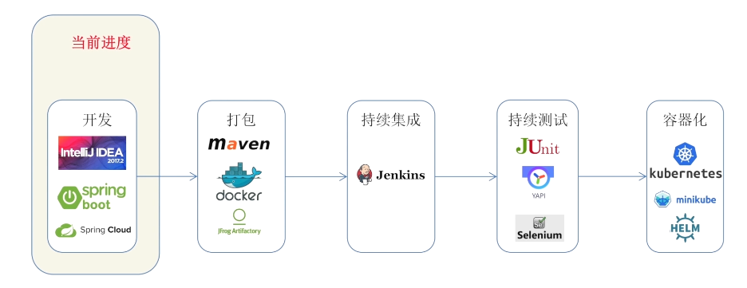

# DevOps实践

[返回列表](https://github.com/EmonCodingBackEnd/backend-tutorial)

[TOC]

# 序一、DevOps

DevOps：Development和Operations的组合词

CI/CD：持续集成/持续交付（或持续部署）


## 1、互联网公司如何进行持续集成


## 2、互联网公司如何进行持续部署

### 2.1、常见自动化部署方法


### 2.2、如何测试部署的效果

- 蓝绿发布


- 金丝雀发布


- 功能开关


## 3、敏捷项目管理架构

工具Jira：https://www.atlassian.com/software/jira

- Release：发布，单位为月
  - Sprint：冲刺，单位为周
    - Issue：问题
      - Epic：史诗：比如，我们在双十一要上一个促销活动！
      - Story：用户故事：产品经理
      - Task：任务：开发
      - Bug：故障：测试


每日站会：

- Scrum Master主持
- 建议每日早上举行
- 每人回答3个问题
  - 昨天做了什么
  - 今天要做什么
  - 有什么问题，需要什么帮助

## 4、在开发工具里集成Jira插件

- IDEA插件：Jira Integration


## 5、Gitflow VS 主干开发分支模型

### 5.1、什么是Gitflow以及特性

Gitflow是一种分支开发模型，来源于Vincent Driessen的文章：“A successful Git branching model"

- Master
- Develop
- Release
- Feature
- Hotfix

Gitflow适用场景

- 软件本身对稳定性要求高
- 团队少量资深研发，多数初，中级研发
- 开源项目

### 5.2、什么是主干开发模式以及特性

功能开关适用于主干开发：

```java
if (FeatureManager.isFeatureEnabled("NewLoginForm")) {
    openNewLoginForm();
} else {
    openOldLoginForm();
}
```

主干开发分支模型适用场景：

- 软件本身迭代较快
- 团队中级，资深研发较多，初级研发较少
- 互联网产品


# 一、开发一个Spring Boot应用



## 1、项目整体架构图


## 2、服务链路追踪


- Docker方式启动Zipkin服务

```bash
[emon@emon ~]$ docker run --name zipkin -d -p 9411:9411 openzipkin/zipkin
```

http://emon:9411/


# 二、打包

## 1、搭建Maven私服


### 1.1、Maven私服介绍

- 作用
  - 代理Maven中央仓库，加速Maven依赖下载
  - 作为本地缓存服务所有公司开发者
- 主流开源工具
  - JFrog Artifactory开源版
  - Nexus


### 1.2、搭建JFrog Artifactory OSS开源版

- 使用Docker

```docker
[emon@emon ~]$ docker run --name artifactory-oss-6.18.1 -d -p 8083:8081 docker.bintray.io/jfrog/artifactory-oss:6.18.1
```

http://emon:8083/

用户名密码：admin/password ==> 登录后被强制修改，修改结果：admin/admin123

- 使用安装包

https://jfrog.com/open-source/


- 如何使用JFrog？

第一步：访问 http://emon:8083

第二步：点击左侧Artifacts==>右侧页面点击Set Me Up==>弹出页点击Generate Maven Settings==>Generate Settings

第三步：Download Snippet

```bash
# 把生成的Settings保存上去
[emon@emon ~]$ vim .m2/settings.xml
```

### 1.3、从私服下载jar

```bash
# admin后面的是API Key获取方式：登录JFrog==>右上角Welcome,admin下拉==>Edit Profile==>输入密码后Unlock==>下拉点击设置图标按钮生成；或者生成过直接复制！
[emon@emon ~]$ curl -u admin:AKCp8krAbJnpHRmCxRwQyh2t58cC6Hn6zURWKFwMaHGKvG7LP7FHRzLVuMBsEYdGaGBFLpYVW http://emon:8083/artifactory/libs-release-local/com/coding/devops/notebook-service/1.0/notebook-service-1.0.jar --output notebook-service-1.0.jar
```


# 三、持续集成


## 1、搭建Jenkins

### 1.1、Jenkins介绍

- Jenkins

  - Project项目
  - Build构建
  - Workspace工作空间
    - 构建任务的实际工作目录
      - 存储代码
      - 中间临时文件

  - Credentials凭据
    - 用于管理用户的敏感信息
      - 用户名、密码
      - SSH Key
      - 证书


### 1.2、搭建Jenkins

- 使用Docker

注意，在hub.docker.com上搜索jenkins时，点击官方版本后看到提示：

DEPRECATED; use "jenkins/jenkins:lts" instead

```bash
# 创建宿主机挂载点
[emon@emon ~]$ mkdir /usr/local/dockerv/jenkins_home
# -v /usr/local/dockerv/jenkins_home:/var/jenkins_home 指定宿主机目录为Jenkins工作目录
# -v /etc/localtime:/etc/localtime 让容器使用和服务器同样的时间设置
# -v /usr/local/maven:/usr/local/maven 映射宿主机的maven
# -v /usr/local/java:/usr/local/java 映射宿主机的java
# 也可以使用 jenkins/jenkins:lts-centos7-jdk8 镜像
[emon@emon ~]$ docker run --name jenkins -d -p 8080:8080 -p 50000:50000 -v /usr/local/dockerv/jenkins_home:/var/jenkins_home -v /etc/localtime:/etc/localtime -v /usr/local/maven:/usr/local/maven -v /usr/local/java:/usr/local/java jenkins/jenkins:lts
```

- 查看密码

```bash
[emon@emon ~]$ docker exec -it jenkins cat /var/jenkins_home/secrets/initialAdminPassword
# 命令行输出结果
a3ada16670124943be3412fa7400c7f2
```

访问：http://emon:8080

安装推荐的插件==>创建用户：jenkins/jenkins123

- 重启Jenkins

http://emon:8080/restart


### 1.3、常用插件安装与环境配置

#### 1.3.1、常用插件安装

- Git

- Artifactory：需额外安装
- Pipeline
- Jira：需额外安装
- Ansible：需额外安装
- Kubernetes：需额外安装

- [ SonarQube Scanner](https://plugins.jenkins.io/sonar)

安装完成后，点击【安装完成后重启Jenkins】，触发重启操作。

#### 1.3.2、环境配置

##### Global Tool Configuration（全局工具配置）

- 配置JDK

配置路径：Manage Jenkins==>Global Tool Configuration==>JDK==>勾掉自动安装==>

JDK别名=java

JAVA_HOME=/usr/local/java

- 配置Maven

配置路径：Manage Jenkins==>Global Tool Configuration==>Maven==>勾掉自动安装==>

JDK别名=maven

MAVEN_HOME=/usr/local/maven

##### Configure System（系统配置）

- 全局属性==>环境变量

配置路径：Manage Jenkins==>Configure System==>勾选环境变量==>添加键值对列表==>

JAVA_HOME=/usr/local/java

MAVEN_HOME=/usr/local/maven

PATH+EXTRA=$MAVEN_HOME/bin:$JAVA_HOME/bin

- 配置JFrog

配置路径：Manage Jenkins==>Configure System==>JFrog==>Add JFrog Platform Instance==>

Instance Id=artifactory-oss

JFrog Platform URL=http://172.17.0.1:8083/artifactory

Default Deployer Credentials配置：

Username=admin

Password=admin123


### 1.4、Jenkins持续集成流水线介绍

#### 1.4.1、Jenkins项目类型

- Jenkins项目类型
  - Freestyle项目
  - Maven项目
  - Pipeline项目（流水线）
  - 外部任务调用


#### 1.4.2、Jenkins持续集成流水线优点

- Pipeline as Code（流水线即代码，代码可存储于git仓库）
- 不依赖于流水线任务的运行环境（不绑定Jenkins Slave节点）
- 和第三方集成更加容易（接口调用）


#### 1.4.3、Jenkins持续集成流水线语法

- Scripted脚本式
  - 可使用任意Groovy脚本实现功能，非常灵活
  - 学习成本低，易于推广
- Declarative声明式
  - 通过预制的标签进行结构化的编写
  - 功能受限，但更加标准化


### 1.5、脚本式流水线

```groovy
node { // 工作节点
    def mvnHome
    stage('Pull source code') {// 定义步骤
        git 'https://github.com/EmonCodingBackEnd/backend-devops-learning.git'
        mvnHome = tool 'maven'
    }
    dir('notebook-service') { // 切换工作目录
        stage('Maven build') {
            sh '''
            mvn deploy // 执行Maven命令
            '''
        }
    }
}
```


### 1.6、声明式流水线

```groovy
pipeline { // 起点
    agent { docker 'maven:3-alpine'} // 指定Agent
    stages {
        stage('Example Build') { // 执行阶段
            steps {
                sh 'mvn -B clean verify' // 执行Maven命令
            }
        }
    }
}
```


## 2、Jenkins集成Artifactory


### 2.1、JFrog Artifactory介绍

- Artifactory是知名的制品库管理工具，用于统一管理多语言包的依赖和制品，提供Maven私服和制品库的功能。
- 由于Nexus主要用于依赖管理，而缺乏对制品的管理，包括权限，MD5检查，构建信息等等，互利网或大型企业逐渐使用Artifactory替代Nexus，进行统一依赖管理，和制品库管理。

### 2.2、Jenkins集成步骤

- 安装Jenkins Artifactory插件
- 配置Artifactory插件
- 配置Artifactory credentials
- 在流水线中使用Artifactory进行依赖下载，制品上传

### 2.3、配置凭据

配置路径：Manage Jenkins==>ManageCredentials==>左上角凭据下拉选择System（系统）==>下拉选择全局凭据（unrestricted）==>添加凭据==>


### 2.4、Pipeline流水线中引入Artifactory的Stage

```groovy
        //Maven 构建，制品上传到 Artifactory
        stage('Maven build'){
            def server = Artifactory.newServer url: "http://172.17.0.1:8083/artifactory", credentialsId: 'artifactory-oss-apikey'
            def rtMaven = Artifactory.newMavenBuild()

            rtMaven.tool = 'maven' // Tool name from Jenkins configuration
            rtMaven.deployer releaseRepo: 'libs-release-local', snapshotRepo: 'libs-snapshot-local', server: server

            //收集构建信息
            def buildInfo = Artifactory.newBuildInfo()
            // server.publishBuildInfo buildInfo
            rtMaven.run pom: 'pom.xml', goals: 'deploy -Dmaven.test.skip=true', buildInfo: buildInfo

            server.publishBuildInfo buildInfo
        }
```


## 3、Jenkins集成Jira【略过】


### 3.1、Jira介绍

- Jira是业界知名的需求管理工具
- Jira可以用于管理敏捷项目的需求追踪，任务管理，项目进度，报表等功能，适合敏捷开发团队进行使用。

### 3.2、Jenkins集成步骤

- 安装Jenkins Jira插件
- 配置Jira credentials
- 配置Jira插件
- 提交代码时，管理Jira任务ID
- 在构建结果中查看任务ID

## 4、Jenkins集成Sonarqube


### 4.1、Sonarqube介绍

- Sonarqube是知名的开源源代码扫描工具。

- 用于软件项目的源代码扫描，识别代码的质量，漏洞，重复率等问题，提升代码的质量。
- 原理：
  - 通过建立本地的扫描规则库对源代码进行扫描，如果命中规则则创建一个issue，提升开发者进行修复。

### 4.2、搭建Sonarqube

- 使用Docker

```bash
[emon@emon ~]$ docker run --name sonarqube -d -p 9000:9000 library/sonarqube:lts
```

访问：http://emon:9000

用户名密码：admin/admin ==> 登录后被提示修改密码：admin/admin123


## 5、Jenkins集成YAPI

### 5.1、YAPI介绍

- YAPI是去哪儿开源的接口自动化测试工具： https://github.com/YMFE/yapi
- YAPI是高效、易用、功能强大的API管理平台，旨在为开发、产品、测试人员提供更优雅的接口管理服务。开源帮助开发者轻松创建、发布、维护API。

## 6、Jenkins基础Selenium


### 6.1、Selenium介绍

- Selenium是成熟的UI自动测试工具项目： https://www.selenium.dev
- Selenium项目
  - WebDriver - 驱动浏览器进行模拟测试
  - IDE - 通过页面点击进行测试脚本的录制
  - Grid - 支持跨平台，多个浏览器并行测试


# 四、持续测试


## 1、Ansible简介

### 1.1、Ansible介绍

Ansible是新出现的自动化运维工具，基于Python开发，集合了众多运维工具（puppet、chef、func、fabric）的优点，实现了匹配系统配置、批量程序部署、批量运行命令等功能。

Ansible是基于paramiko开发的，并且基于模块化工作，本身没有批量部署的能力。真正具有批量部署的是Ansible所运行的模块，Ansible只是提供一种框架。Ansible不需要在远程主机上安装Client/Agents，因为它们是基于ssh来和远程主机通讯的。

Ansible目前已经被红帽官方收购，是自动化运维工具中大家认可度最高的，并且上手容易，学习简单。是每位运维工程师必须掌握的技能之一。

### 1.2、Ansible的优点

- 部署简单，只需要在主控端部署Ansible环境，被控端无需做任何操作；
- 默认使用SSH协议对设备进行管理；
- 有大量常规运维操作模块，可以实现日常绝大部分操作；
- 配置简单、功能强大、扩展性强；
- 支持API及自定义模块，可通过Python轻松扩展；
- 通过Playbooks（剧本）来定制强大的配置、状态管理；
- 轻量级、无需在客户端安装Agent，更新时，只需要在操作机上进行一次更新即可；
- 提供一个功能强大、操作型强的Web管理界面和REST API接口――AWX平台。

- 通过Ansible Galaxy可获取开源社区共享的Playbook，避免重复造车轮。

### 1.3、Ansible架构图


上图中我们看到的主要模块如下：

- Ansible：Ansible核心程序。
- HostInventory：记录由Ansible管理的主机信息，包括端口、密码、IP等。
- Playbooks：“剧本“YAML格式文件，多个任务定义在一个文件中，定义主机需要调用哪些模块来完成的功能。
- CoreModules：核心模块，主要操作是通过调用核心模块来完成管理任务。
- CustomModules：自定义模块，完成核心模块无法完成的功能，支持多种语言。
- ConnectionPlugins：连接插件，Ansible和Host通信使用。


### 1.4、Ansible的核心概念

- Control node：控制节点
  - Ansible安装的机器，你可以运行命令和playbook。
  - 任何安装了Python的机器都能安装Ansible，-laptops，shared desktops，and servers。
  - 但不能用Windows machine作为控制节点。
- Managed nodes：受管控节点
  - 使用Ansible管控的设备，机器
  - 受管控节点也被称之为`hosts`
  - Ansible不安装在受管控节点
- Inventory：库存表
  - 受管控节点的列表。
  - 库存表文件也叫做`hostfile`。你的库存文件可以指定受管控机器的IP。
  - 库存表也可以管理节点，创建分组，编译多机操作。
- Modules：模块
  - Ansible通过模块来执行特定命令。
  - 每个模块有特定的用处。
  - 你可以在一个任务中调用某个模块，也可以在playbook中调用多个模块。
- Tasks：任务
  - Ansible中的任务单元，可以在任务中执行一个ad-hoc命令。
- Playbooks：剧本
  - 任务的编排脚本，用于定期的批量部署一系列的任务。Playbooks可以包含和任务一样的变量内容。
  - 用YAML编写，易于编写，共享。


## 2、Ansible任务执行

### 2.1、Ansible任务执行模式

Ansible系统由控制主机对被管节点的操作方式可分为两类：`adhoc`和`playbook`：

- ad-hoc模式（点对点模式）

使用单个模块，支持批量执行单条命令。ad-hoc命令是一种可以快速输入的命令，而且不需要保存起来的命令。就相当于bash中的一句话shell。

- playbook模式（剧本模式）

该模式是Ansible主要管理方式，也是Ansible功能强大的关键所在。playbook通过多个task集合完成一类功能，如Web服务的安装部署、数据库服务器的批量备份等。可以简单地把palybook理解为通过组合多条ad-hoc操作的配置文件。

### 2.2、Ansible执行流程


简单理解就是Ansible在运行时，首先读取`ansible.cfg`中的配置，根据规则获取`Inventory`中的管理主机列表，并行的在这些主机中执行配置的任务，最后等待执行返回的结果。


### 2.3、Ansible命令执行过程

1. 加载自己的配置文件，默认`/etc/ansible/ansible.cfg`；
2. 查找对应的主机配置文件，找到要执行的主机或者组；
3. 加载自己对应的模块文件，如command；
4. 通过ansible将模块或命令生成对应的临时py文件（python脚本），并将该文件传输至远程服务器；
5. 对应执行用户的家目录的`.ansible/tmp/XXX/XXX.PY`文件；
6. 给文件+x执行权限；
7. 执行并返回结果；
8. 删除临时py文件，`sleep 0`退出；

## 3、Ansible配置详解

### 3.1、Ansible安装方式

Ansible安装常用两种方式，`yum安装`和`pip程序安装`。

#### 3.1.1、使用pip（python的包管理模块）安装

首先，我们需要安装一个Python3.8以上版本的包，安装完成以后，则直接使用`pip`命令安装ansible即可：

```bash
[emon@emon ~]$ pip3 install ansible
```

#### 3.1.2、使用yum安装【推荐】

yum安装是我们很熟悉的安装方式了。我们需要先安装一个epel-release包，再安装我们的ansible即可。

```bash
[emon@emon ~]$ sudo yum install -y epel-release
[emon@emon ~]$ sudo yum install -y ansible
```

### 3.2、Ansible程序结构

安装目录如下（yum安装）：

| 目录                                      | 说明          |
| ----------------------------------------- | ------------- |
| /etc/ansible/                             | 配置文件目录  |
| /usr/bin/                                 | 执行文件目录  |
| /usr/lib/pythonX.X/site-packages/ansible/ | Lib库依赖目录 |
| /usr/share/doc/ansible-X.X.X/             | Help文档目录  |
| /usr/share/man/man1/                      | Man文档目录   |

### 3.3、Ansible配置文件查找顺序

Ansible与我们其他的服务在这一点上有很大不同，这里的配置文件查找是从多个地方找的，顺序如下：

1. 检查环节变量`ANSIBLE_CONFIG`指向的路径文件（export ANSIBLE_CONFIG=/etc/ansible/ansible.cfg）；
2. `~/.ansible.cfg`，检查当前目录下的ansible.cfg配置文件；
3. `/etc/ansible/ansible.cfg`检查etc目录的配置文件

### 3.4、Ansible配置文件

Ansible的配置文件为`/etc/ansible/ansible.cfg`，ansible有许多参数，下面我们列出一些常见的参数：

```ini
inventory = /etc/ansible/hosts	#这个参数表示资源清单inventory文件的位置
library = /usr/share/ansible	#指向存放Ansible模块的目录，支持多个目录方式，只要用冒号（：）隔开就可以
forks = 5						#并发连接数，默认为5
sudo_user = root				#设置默认执行命令的用户
remote_port = 22				#指定连接被管节点的管理端口，默认为22端口，建议修改，能够更加安全
host_key_checking = False		#设置是否检查SSH主机的密钥，值为True/False。关闭后第一次连接不会提示配置实例
timeout = 60					#设置SSH连接的超时时间，单位为秒
log_path = /var/log/ansible.log	#指定一个存储ansible日志的文件（默认不记录日志）
```

### 3.5、Ansible主机清单

在配置文件中，我们提到了资源清单，这个清单就是我们的主机清单，里面保存的是一些ansible需要连接管理的主机列表。我们可以来看看他的定义方式：

```bash
1、 直接指明主机地址或主机名：
	## green.example.com#
	# blue.example.com#
	# 192.168.100.1
	# 192.168.100.10
2、 定义一个主机组[组名]把地址或主机名加进去
	[mysql_test]
	192.168.253.159
	192.168.253.160
	192.168.253.153
```

需要注意的是，这里的组成员可以使用通配符来匹配，这样对于一些标准化的管理来说就很轻松方便了。

我们可以根据实际情况来配置我们的主机列表，具体操作如下：

```bash
[emon@emon ~]$ sudo mkdir /etc/ansible
[emon@emon ~]$ sudo vim /etc/ansible/hosts
```

```ini
[web]
emon2
emon3
```

以下是Hosts部分中经常用到的变量部分：

| 变量                         | 含义                                                         |
| ---------------------------- | ------------------------------------------------------------ |
| ansible_ssh_host             | 用于指定被管理的主机的真实IP                                 |
| ansible_ssh_port             | 用于指定连接到被管理主机的ssh端口号，默认是22                |
| ansible_ssh_user             | ssh连接时默认使用的用户名                                    |
| ansible_ssh_pass             | ssh连接时的密码                                              |
| ansible_sudo_pass            | 使用sudo连接用户时的密码                                     |
| ansible_sudo_exec            | 如果sudo命令不在默认路径，需要指定sudo命令路径               |
| ansible_ssh_private_key_file | 秘钥文件路径，秘钥文件如果不想使用ssh-agent管理时可以使用此选项 |
| ansible_shell_type           | 目标系统的shell的类型，默认sh                                |
| ansible_connection           | SSH 连接的类型：local , ssh , paramiko，在ansible1.2之前默认是paramiko ，后来智能选择，优先使用基于ControlPersist 的ssh |
| ansible_python_interpreter   | 用来指定python解释器的路径，默认为/usr/bin/python 同样可以指定ruby 、perl的路径 |
| `ansible_*_interpreter`      | 其他解释器路径，用法与ansible_python_interpreter类似，这里"*"可以是ruby或perl等其它语言 |

## 4、Ansible常用命令

### 4.1、ansible命令集

```bash
# -1不是-l
[emon@emon ~]$ ls -1 /usr/local/python3/bin/ansible*
# 命令行输出结果，其中 AD-hoc：表示临时命令模式
/usr/local/python3/bin/ansible # Ansible AD-Hoc临时命令执行工具，常用于临时命令的执行
/usr/local/python3/bin/ansible-config 
/usr/local/python3/bin/ansible-connection
/usr/local/python3/bin/ansible-console # Ansible基于Linux Console界面可与用户交互的命令执行工具
/usr/local/python3/bin/ansible-doc # Ansible模块功能查看工具
/usr/local/python3/bin/ansible-galaxy # 下载/上传优秀代码或Roles模块的官网平台，基于网络的
/usr/local/python3/bin/ansible-inventory
/usr/local/python3/bin/ansible-playbook # Ansible定制自动化的任务集编排工具
/usr/local/python3/bin/ansible-pull # Ansible远程执行命令的工具，拉取配置而非推送配置（使用较少，海量机器时使用，对运维的架构能力要求较高）
/usr/local/python3/bin/ansible-test
/usr/local/python3/bin/ansible-vault # Ansible文件加密工具
```

其中，我们比较常用的是`ansible`和`ansible-playbook`命令。

### 4.2、ansible-doc命令

ansible-doc命令常用于获取模块信息及其使用帮助，一般用法如下：

```bash
ansible-doc -l # 获取全部模块的信息
ansible-doc -s MOD_NAME # 获取指定模块的使用帮助
ansible-doc -h # 获取ansible-doc命令的全部用法
```

- 比如，以mysql_user模块为例

```bash
[emon@emon ~]$ ansible-doc -s mysql_user
```

### 4.3、ansible命令详解

- 命令的具体格式如下：

```bash
ansible <host-pattern> [-f forks] [-m module_name] [-a args]
```

也可以通过`ansible -h`来查看帮助，下面列出一些常用选项并解释含义：

```bash
-a MODULE_ARGS # 模块的参数，如果执行默认COMMAND的模块，即是命令参数，如：date、pwd等等
-k, --ask-pass # ask for SSH password。登录密码，提示输入SSH密码而不是假设基于秘钥的验证，小写的k
-b, --become # 以权限提升执行命令，配合-K输入提升时所需的密码
-K, --ask-become-pass # 请求权限提升时输入密码，大写的K

-f FORKS # 并行任务数，默认为5
-i INVENTORY # 指定主机清单的路径，默认为 `/etc/ansible/hosts`
--list-hosts # 查看有哪些主机组

-m MODULE_NAME # 执行模块的名字，默认使用command模块，所以如果是只执行单一命令可以不用-m参数
-o # 压缩输出，尝试将所有结果在一行输出，一般针对收集工具使用
-v # 查看详细信息，同时支持-vvv和-vvvv可查看更详细信息

-T TIMEOUT # 连接时指定ssh默认超时时间，默认为10s，也可以在配置文件中修改
-u REMOTE_USER # 连接时所用的远程用户，默认为当前用户
```

### 4.4、Ansible配置公私钥

上面我们已经提到过Ansible是基于SSH协议实现的，所以其配置公私钥的方式与SSH协议的方式相同，具体操作步骤如下：

1. 生成私钥

```bash
[emon@emon ~]# ssh-keygen
```

2. 向主机分发公钥

```bash
[emon@emon ~]# ssh-copy-id -i root@emon2
[emon@emon ~]# ssh-copy-id -i root@emon3
```

这样的话，就可以实现无密码登录。

如果提示没有ssh-copy-id命令，可以安装：

```bash
yum -y install openssh-clientsansible
```

## 5、Ansible常用模块

### 5.1、主机连通性测试

使用`ansible web -m ping`命令来进行主机连通性测试，效果如下：

```bash
[emon@emon ~]#  ansible web -m ping
emon3 | SUCCESS => {
    "ansible_facts": {
        "discovered_interpreter_python": "/usr/bin/python"
    },
    "changed": false,
    "ping": "pong"
}
emon2 | SUCCESS => {
    "ansible_facts": {
        "discovered_interpreter_python": "/usr/bin/python"
    },
    "changed": false,
    "ping": "pong"
}
```

### 5.2、command模块

这个模块可以直接在远程主机上执行命令，并将结果返回本主机。

- 举例如下：

```bash
# -b -K 表示提升权限执行，K是大写字母
[emon@emon ~]$ ansible web -m command -a 'ss -ntl' -b -K
emon3 | CHANGED | rc=0 >>
State      Recv-Q Send-Q Local Address:Port               Peer Address:Port              
LISTEN     0      100    127.0.0.1:25                       *:*                  
LISTEN     0      128          *:22                       *:*                  
LISTEN     0      100      [::1]:25                    [::]:*                  
LISTEN     0      128       [::]:22                    [::]:*                  
emon2 | CHANGED | rc=0 >>
State      Recv-Q Send-Q Local Address:Port               Peer Address:Port              
LISTEN     0      100    127.0.0.1:25                       *:*                  
LISTEN     0      128          *:22                       *:*                  
LISTEN     0      100      [::1]:25                    [::]:*                  
LISTEN     0      128       [::]:22                    [::]:* 
```

命令模块接受命令名称，后面是空格分隔的列表参数。给定的命令将在所有选定的节点上执行。它不会通过shell进行处理，比如$HOME和操作如"<",">","|",";","&"工作（需要使用（shell）模块实现这些功能）。注意，该命令不支持`|`管道命令。

下面来看一看该模块下常用的几个命令：

> chdir # 在执行命令之前，先切换到该目录
>
> executable # 切换shell来执行命令，需要使用命令的绝对路径
>
> free_form # 要执行的Linux指令，一般使用Ansible的-a参数代替
>
> creates # 一个文件名，当这个文件存在，则该命令不找一下，可以用来做判断
>
> removes # 一个文件名，这个文件不存在，则该命令不执行

下面我们来看看这些命令的执行效果：

```bash
# 在emon2上创建目录
[root@emon2 ~]# mkdir /data/abc

# 先切换到/data/目录，再执行“ls”命令
[emon@emon ~]$ ansible web -m command -a 'chdir=/data/ ls'
# 如果指定目录存在，则不执行命令
[emon@emon ~]$ ansible web -m command -a 'creates=/data/ ls'
emon2 | SUCCESS | rc=0 >>
skipped, since /data/ existsDid not run command since '/data/' exists
emon3 | CHANGED | rc=0 >>
bin
# 如果指定目录不存在，则不执行命令
[emon@emon ~]$ ansible web -m command -a 'removes=/data/ ls'
emon2 | CHANGED | rc=0 >>
bin
emon3 | SUCCESS | rc=0 >>
skipped, since /data/ does not existDid not run command since '/data/' does not exist
```

### 5.3、shell模块

shell模块可以在远程主机上调用shell解释器运行命令，支持shell的各种功能，例如管道等。

```bash
[emon@emon ~]$ ansible web -m shell -a 'cat /etc/passwd|grep "emon"'
emon3 | CHANGED | rc=0 >>
daemon:x:2:2:daemon:/sbin:/sbin/nologin
emon:x:1000:1000:Web Site User:/home/emon:/bin/bash
emon2 | CHANGED | rc=0 >>
daemon:x:2:2:daemon:/sbin:/sbin/nologin
emon:x:1000:1000:Web Site User:/home/emon:/bin/bash

[emon@emon ~]$ ansible web -m shell -a 'ss -ntl' -b -K
```

只要是我们的shell命令，都可以通过这个模块在远程主机上运行。

### 5.4、copy模块

这个模块用于将文件复制到远程主机，同时支持给定内容生成文件和修改权限等。

其相关选项如下：

> src #被复制到远程主机的本地文件。可以是绝对路径，也可以是相对路径。如果路径是一个目录，则会递归复制，用法类似于"rsync"
>
> content #用于替换"src"，可以直接指定文件的值
>
> dest # 必选项，将源文件复制到远程主机的绝对路径
>
> backup # 当文件内容发生改变后，在覆盖之前把源文件备份，备份文件包含时间信息
>
> directory_mode # 递归设定目录的权限，默认为系统默认权限
>
> force # 当目标主机包含该文件，但内容不同时，设置为"yes"，表示强制覆盖；设置为"no"，表示目标主机的目标位置不存在该文件才复制。默认为"yes"
>
> others # 所有的file模块中的选项都可以在这里使用

用法举例如下：

- 复制文件

```bash
[emon@emon ~]$ ansible web -m copy -a 'src=~/notebook-service-1.0.jar dest=~/'
```

- 给定内容生成文件，并指定权限

```bash
[emon@emon ~]$ ansible web -m copy -a 'content="hello world!\n" dest=~/test.txt mode=666'
```

- 关于覆盖

我们把文件的内容修改一下，然后选择覆盖备份：

```bash
[emon@emon ~]$ ansible web -m copy -a 'content="hello world!\ngood!" backup=yes dest=~/test.txt mode=666'
# 查看一下
[emon@emon ~]$ ansible web -m shell -a 'ls -l ~/|grep test'
emon3 | CHANGED | rc=0 >>
-rw-rw-rw-. 1 emon emon       18 3月  20 23:49 test.txt
-rw-rw-rw-. 1 emon emon       13 3月  20 23:45 test.txt.71549.2022-03-20@23:49:21~
emon2 | CHANGED | rc=0 >>
-rw-rw-rw-. 1 emon emon       18 3月  20 23:49 test.txt
-rw-rw-rw-. 1 emon emon       13 3月  20 23:45 test.txt.121900.2022-03-20@23:49:35~
```

### 5.5、file模块

该模块主要用于设置文件的属性，比如创建文件、创建链接文件、删除文件等。

下面是一些常见命令：

> force # 需要在两种情况下强制创建软连接，一种是源文件不存在，但之后会建立的情况下；另一种是目标软链接已存在，需要先取消之前的软链接，然后创建新的软链接，有两个选项：yes|no
>
> group # 定义文件/目录的属组。后面可以加上`mode`：定义文件/目录的权限
>
> owner # 定义文件/目录的属主。后面必须跟上`path`：定义文件/目录的路径
>
> recurse # 递归设置文件的属性，只对目录有效，后面跟上`src`：被链接的源文件路径，只应用于`state=link`的情况
>
> dest # 被链接到的路径，只应用于`state=link`的情况
>
> state # 状态，有以下选项：
>
> > directory：如果目录不存在，就创建目录
> >
> > file：即使文件不存在，也不会被创建
> >
> > link：创建软链接
> >
> > hard：创建硬链接
> >
> > touch：如果文件不存在，则会创建一个新的文件，如果文件或目录已存在，则更新其最后修改时间
> >
> > absent：删除目录、文件或者取消链接文件

- 创建目录

```bash
[emon@emon ~]$ ansible web -m file -a 'path=~/data/app state=directory'
```

- 创建链接文件

```bash
# 效果：bbb.jpg -> aaa.jpg 
[emon@emon ~]$ ansible web -m file -a 'path=~/data/bbb.jpg force=yes src=aaa.jpg state=link'
```

- 删除文件

```bash
[emon@emon ~]$ ansible web -m file -a 'path=~/data/a state=absent'
```

### 5.6、fetch模块

该模块用于从远程某主机获取（复制）文件到本地。

有两个选项：

> dest：用来存放文件的目录
>
> src：在远程拉取的文件，并且必须是一个file，不能是目录

- 复制远端文件到本地

```bash
[emon@emon ~]$ ansible web -m fetch -a 'src=~/test.txt dest=~/data'
# 查看结果
[emon@emon ~]$ tree data
data
├── emon2
│?? └── home
│??     └── emon
│??         └── test.txt
└── emon3
    └── home
        └── emon
            └── test.txt
```

### 5.7、cron模块

该模块适用于管理`cron`计划任务的。

其使用的语法跟我们的`crontab`文件中的语法一致，同时，可以指定以下选项：

> day： 日应该运行的工作（`1-31,*,*/2`）
>
> hour：小时（`0-23,*,*/2`）
>
> minute：分支（`0-59,*,*/2`）
>
> mouth：月（`1-12,*,*/2`）
>
> weekday：周（`0-6 for Sunday-Saturday`）
>
> job：指明运行的命令是什么
>
> name：定时任务描述
>
> reboot：任务在重启时运行，不建议使用，建议使用special_time
>
> special_time：特殊的时间范围，参数：reboot（重启时），annually（每年），monthly（每月），weekly（每周），daily（每天），hourly（每小时）
>
> state：指定状态，present表示添加定时任务，也是默认设置，absent表示删除定时任务
>
> user：以哪个用户的身份执行

- 添加计划任务

```bash
[emon@emon ~]$ ansible web -m cron -a 'name="ntp update every 5 min" minute=*/5 job="/usr/sbin/ntpdate 172.17.0.1 &> /dev/null"'
# 查看结果
[emon@emon ~]$ ansible web -m shell -a 'crontab -l'
emon2 | CHANGED | rc=0 >>
#Ansible: ntp update every 5 min
*/5 * * * * /usr/sbin/ntpdate 172.17.0.1 &> /dev/null
emon3 | CHANGED | rc=0 >>
#Ansible: ntp update every 5 min
*/5 * * * * /usr/sbin/ntpdate 172.17.0.1 &> /dev/null
```

- 删除计划任务

如果我们的计划任务添加错误，想要删除的话，则执行以下操作：

```bash
# 注意，相同命令，带上state=absent就是删除定时任务了
[emon@emon ~]$ ansible web -m cron -a 'name="ntp update every 5 min" minute=*/5 job="/usr/sbin/ntpdate 172.17.0.1 &> /dev/null" state=absent'
# 查看结果
[emon@emon ~]$ ansible web -m shell -a 'crontab -l'
emon2 | CHANGED | rc=0 >>

emon3 | CHANGED | rc=0 >>
```

### 5.8、yum模块

顾名思义，该模块主要用于软件的安装。

其选项如下：

> name：所安装的包的名称
>
> state：present-安装，latest-安装最新的，absent-卸载软件。
>
> update_cache：强制更新yum的缓存
>
> conf_file：指定远程yum安装时所依赖的配置文件（安装本地已有的包）。
>
> disable_pgp_check：是否禁止GPG checking，只用于present or latest
>
> disablerepo：临时禁止使用的yum库。只用于安装或更新时。
>
> enablerepo：临时使用的yum库。只用于安装或更新时。

- 安装一个包测试

```bash
# 查看目标机器是否有该包
[emon@emon ~]$ ansible web -m shell -a 'yum list epel-release'
# 安装
[emon@emon ~]$ ansible web -m yum -a 'name=epel-release state=present' -b -K
```

- 安装htop后，再卸载

```bash
# 安装
[emon@emon ~]$ ansible web -m yum -a 'name=htop state=present' -b -K
# 卸载
[emon@emon ~]$ ansible web -m yum -a 'name=htop state=absent' -b -K
```

### 5.9、service模块

该模块用于服务程序的管理。

其主要选项如下：

> arguments：命令行提供额外的参数
>
> enabled：设置开机启动
>
> name：服务名称
>
> runlevel：开机启动的级别，一般不用指定。
>
> sleep：在重启服务的过程中，是否等待。如在服务关闭以后再等待2秒再启动。（定义在剧本中。）
>
> state：有四种状态，分别为：started-启动服务，stopped-停止服务，restarted-重启服务，reloaded-重载配置

- 开启服务并设置自启动

```bash
[emon@emon ~]$ ansible web -m service -a 'name=docker state=started enabled=true' -b -K
```

- 关闭服务并取消自启动

```bash
[emon@emon ~]$ ansible web -m service -a 'name=docker state=stopped enabled=false' -b -K
```

### 5.10、user模块

该模块主要是用来管理用户账号。

其主要选项如下：

> comment：用户的描述信息
>
> createhome：是否创建家目录
>
> force：在使用state=absent时，行为与userdel -force一致
>
> group：指定基本组
>
> groups：指定附加组，如果指定为（groups=）表示删除所有组
>
> home：指定用户家目录
>
> move_home：如果设置为home=时，试图将用户主目录移动到指定的目录
>
> name：指定用户名
>
> non_unique：该选项允许改变非唯一的用户ID值
>
> password：指定用户密码
>
> remove：在使用state=absent时，行为是与userdel -remove一致
>
> shell：指定默认shell
>
> state：设置账号状态，不指定为创建，指定值为absent表示删除。
>
> system：当创建一个用户，设置这个用户是系统用户。这个设置不能更改现有用户
>
> uid：指定用户的uid

- 添加一个用户并指定其uid

```bash
[emon@emon ~]$ ansible web -m user -a 'name=keer uid=11111' -b -K
# 查看结果
[emon@emon ~]$ ansible web -m shell -a 'cat /etc/passwd|grep keer'
emon2 | CHANGED | rc=0 >>
keer:x:11111:11111::/home/keer:/bin/bash
emon3 | CHANGED | rc=0 >>
keer:x:11111:11111::/home/keer:/bin/bash
```

- 删除用户

```bash
[emon@emon ~]$ ansible web -m user -a 'name=keer state=absent' -b -K
# 查看结果
[emon@emon ~]$ ansible web -m shell -a 'cat /etc/passwd|grep keer'
emon2 | FAILED | rc=1 >>
non-zero return code
emon3 | FAILED | rc=1 >>
non-zero return code
```

### 5.11、group模块

该模块主要用于添加或删除组。

常用的选项如下：

> gid：设置组的GID号
>
> name：指定组的名称
>
> state：指定组的状态，默认为创建，设置为absent为删除
>
> system：设置值为yes，表示创建为系统组。

- 创建组

```bash
[emon@emon ~]$ ansible web -m group -a 'name=songuo gid=12222' -b -K
# 查看结果
[emon@emon ~]$ ansible web -m shell -a 'cat /etc/group|grep 12222'
emon2 | CHANGED | rc=0 >>
songuo:x:12222:
emon3 | CHANGED | rc=0 >>
songuo:x:12222:
```

- 删除组

```bash
[emon@emon ~]$ ansible web -m group -a 'name=songuo state=absent' -b -K
# 查看结果
[emon@emon ~]$ ansible web -m shell -a 'cat /etc/group|grep 12222'
emon3 | FAILED | rc=1 >>
non-zero return code
emon2 | FAILED | rc=1 >>
non-zero return code
```

### 5.12、script模块

该模块用于将本机的脚本在贝管理端的机器上运行。

该模块直接指定脚本的路径即可，我们通过例子来看一看到底如何使用的：

首先，我们写一个脚本，并给其加上执行权限：

```bash
[emon@emon ~]$ vim /tmp/df.sh
```

```bash
#!/bin/bash

date >> /tmp/disk_total.log
df -lh >> /tmp/disk_total.log
```

```bash
[emon@emon ~]$ chmod +x /tmp/df.sh
```

然后，我们直接运行命令来实现在被管理端执行该脚本：

```bash
[emon@emon ~]$ ansible web -m script -a '/tmp/df.sh'
# 查看结果
[emon@emon ~]$ ansible web -m shell -a 'cat /tmp/disk_total.log'
emon3 | CHANGED | rc=0 >>
2022年 03月 21日 星期一 13:19:04 CST
文件系统                 容量  已用  可用 已用% 挂载点
devtmpfs                 898M     0  898M    0% /dev
tmpfs                    910M     0  910M    0% /dev/shm
tmpfs                    910M   26M  885M    3% /run
tmpfs                    910M     0  910M    0% /sys/fs/cgroup
/dev/mapper/centos-root   30G   71M   30G    1% /
/dev/mapper/centos-usr    89G  7.0G   83G    8% /usr
/dev/loop0               4.4G  4.4G     0  100% /media/cdrom
/dev/mapper/centos-home   10G   97M  9.9G    1% /home
/dev/mapper/centos-tmp   5.0G   33M  5.0G    1% /tmp
/dev/sda1               1014M  150M  865M   15% /boot
/dev/mapper/centos-var    10G  1.8G  8.3G   18% /var
tmpfs                    182M     0  182M    0% /run/user/0
tmpfs                    182M     0  182M    0% /run/user/1000
emon2 | CHANGED | rc=0 >>
2022年 03月 21日 星期一 13:19:04 CST
文件系统                 容量  已用  可用 已用% 挂载点
devtmpfs                 898M     0  898M    0% /dev
tmpfs                    910M     0  910M    0% /dev/shm
tmpfs                    910M   18M  893M    2% /run
tmpfs                    910M     0  910M    0% /sys/fs/cgroup
/dev/mapper/centos-root   30G   71M   30G    1% /
/dev/mapper/centos-usr    89G  9.0G   80G   11% /usr
/dev/loop0               4.4G  4.4G     0  100% /media/cdrom
/dev/sda1               1014M  150M  865M   15% /boot
/dev/mapper/centos-home   10G   97M  9.9G    1% /home
/dev/mapper/centos-var    10G  2.0G  8.0G   20% /var
/dev/mapper/centos-tmp   5.0G   96M  4.9G    2% /tmp
tmpfs                    182M     0  182M    0% /run/user/0
tmpfs                    182M     0  182M    0% /run/user/1000
```

可以卡粗，已经执行成功！

### 5.13、setup模块

该模块主要用于收集信息，是通过调用facts组件来实现的。

facts组件是Ansible用于采集被管机器设备信息的一个功能，我们可以使用setup模块查看机器的所有facts信息，可以使用filter来查看指定信息。整个facts信息被包装在一个JSON格式的数据结构中，ansible_facts是最上层的值。

facts就是变量，内建变量。每个主机的各种信息，cpu颗数、内存大小等。会存在facts中的某个变量中。调用后返回很多对应主机的信息，在后面的操作中可以根据不同的信息来做不同的操作。如redhat系列用yum安装，而debian系列用apt安装软件。

- 查看信息

我们可以直接用命令获取到变量的值，具体我们来看看例子：

```bash
# 查看内存
[emon@emon ~]$ ansible web -m setup -a 'filter="*mem*"'
emon2 | SUCCESS => {
    "ansible_facts": {
        "ansible_memfree_mb": 524,
        "ansible_memory_mb": {
            "nocache": {
                "free": 1462,
                "used": 357
            },
            "real": {
                "free": 524,
                "total": 1819,
                "used": 1295
            },
            "swap": {
                "cached": 0,
                "free": 5116,
                "total": 5119,
                "used": 3
            }
        },
        "ansible_memtotal_mb": 1819,
        "discovered_interpreter_python": "/usr/bin/python"
    },
    "changed": false
}
emon3 | SUCCESS => {
    "ansible_facts": {
        "ansible_memfree_mb": 386,
        "ansible_memory_mb": {
            "nocache": {
                "free": 1431,
                "used": 388
            },
            "real": {
                "free": 386,
                "total": 1819,
                "used": 1433
            },
            "swap": {
                "cached": 0,
                "free": 5117,
                "total": 5119,
                "used": 2
            }
        },
        "ansible_memtotal_mb": 1819,
        "discovered_interpreter_python": "/usr/bin/python"
    },
    "changed": false
}
# 使用free -m方式查询对比下
[emon@emon ~]$ ansible web -m shell -a 'free -m'
emon2 | CHANGED | rc=0 >>
              total        used        free      shared  buff/cache   available
Mem:           1819         259         522          15        1037        1369
Swap:          5119           3        5116
emon3 | CHANGED | rc=0 >>
              total        used        free      shared  buff/cache   available
Mem:           1819         268         384          23        1166        1344
Swap:          5119           2        5117
```

- 保存信息

我们的setup模块还有一个很好用的功能就是可以保存我们所筛选的信息至我们的主机上，同时，文件名为我们被管制的主机的IP，这样方便我们知道是哪台机器出的问题。

```bash
[emon@emon ~]$ ansible web -m setup -a 'filter="*mem*"' --tree /tmp/facts
[emon@emon ~]$ ls /tmp/facts/|cat
emon2
emon3
[emon@emon ~]$ cat /tmp/facts/emon2|jq .
{
  "ansible_facts": {
    "ansible_memfree_mb": 520,
    "ansible_memory_mb": {
      "nocache": {
        "free": 1461,
        "used": 358
      },
      "real": {
        "free": 520,
        "total": 1819,
        "used": 1299
      },
      "swap": {
        "cached": 0,
        "free": 5116,
        "total": 5119,
        "used": 3
      }
    },
    "ansible_memtotal_mb": 1819,
    "discovered_interpreter_python": "/usr/bin/python"
  },
  "changed": false
}
```

## 6、Ansible Playbook

### 6.1、Ansible Playbook介绍

Playbooks与adhoc相比，是一种完全不同的运用ansible的方式，类似于saltstack的state状态文件。ad-hoc无法持久使用，playbook可以持久使用。

Playbook是由一个或多个play组成的列表，play的主要功能在于将事先归并为一组的主机装扮成事先通过ansible中的task定义好的角色。从根本上来讲，所谓的task无非是调用ansible的一个module。将多个play组织在一个playbook中，即可以让它们联合起来按事先编排的机制完成某一个任务。

### 6.2、Playbook核心元素

- Hosts：执行的远程主机列表
- Tasks：任务集
- Variables：内置变量或自定义变量在playbook中调用
- Templates：模板，即使用模板语法的文件，比如配置文件等
- Handlers和notity结合使用，由特定条件出发的操作，满足条件方才执行，否则不执行
- Taggs：标签，指定某条任务执行，用于选择运行playbook中的部分代码


### 6.3、Playbook语法

playbook使用yaml语法格式，后缀可以是yaml，也可以是yml。

- 在单一一个playbook文件中，可以连续三个连子号（`---`）区分多个play。还有选择性的连续三个点号（`...`）用来表示play的结尾，也可以省略。

- 次行开始正常写playbook的内容，一般都会写上描述该playbook的功能。

- 使用#号注释代码。
- 缩进必须统一，不能空格和tab混用。
- 缩进的级别也必须是一致的，同样的缩进代表同样的级别，程序判别配置的级别是通过缩进结合换行实现的。
- YAML文件内容和Linux系统大小写判断方式保持一致，是区分大小写的，`k/v`的值均需大小写敏感。
- `k/v`的值可同行写也可以换行写。同行使用`:`分隔。
- `v`可以是一个字符串，也可以是一个列表
- 一个完整的代码块功能需要最少元素包括：`name:task`


### 6.4、一个简单的示例

```yaml
---								# 固定格式
- hosts: 192.168.1.31			# 定义需要执行的主机
  remote_user: root				# 远程用户
  vars:							# 定义变量
    http_port: 8088				# 变量

  tasks:						# 定义一个任务的开始
    - name: create new file		# 定义任务的名称
      file: name=/tmp/playtest.txt state=touch	# 调用模块，具体要做的事情
    - name: create new user
      user: name=test02 system=yes shell=/sbin/nologin
    - name: install package
      yum: name=httpd
    - name: config httpd
      template: src=./httpd.conf dest=/etc/httpd/conf/httpd.conf
      notify:								# 定义执行一个动作（action）让handlers来引用执行，与handlers配合使用
        - restart apache					# notify要执行的动作，这里必须与handlers中的name定义内容一致
    - name: copy index.html
      copy: src=/var/www/html/index.html dest/var/www/html/index.html
    - name: start https
      service: name=httpd state=started
  handlers:									# 处理器：对应tasks中notify定义的action触发执行相应的处理动作
    - name: restart apache					# 要与notify定义的内容相同
      service: name=httpd state=restarted	# 触发要执行的动作
```

### 6.5、Playbook的运行方式

通过`ansible-playbook`命令运行

格式：`ansible-playbook <filename.yml> ... [options]`

> -C, --check # 只检测可能会发生的改变，但不真正执行该操作
>
>  --list-hosts # 列出运行任务的主机
>
>  --list-tags  # 列出playbook文件中定义的所有的tags
>
>  --list-tasks # 列出playbook文件中定义的所有的tasks
>
>  --skip-tags SKIP_TAGS # 跳过指定的tags
>
> -f # 指定并发数，默认为5个
>
> -t # 指定playbook中定义的tags运行，运行某个或者多个tags。
>
> -v # 显示过程 -vv或者-vvv更详细

### 6.6、几个例子

#### 6.6.1、ping命令

```bash
[emon@emon ~]$ vim ansibledata/ping-playbook.yml
```

```yaml
- hosts: web
  remote_user: emon
  vars:
    http_port: 80
    max_clients: 200
  tasks:
    - name: ping
      ping:
```

```bash
[emon@emon ~]$ ansible-playbook ansibledata/ping-playbook.yml
# 命令行输出结果
PLAY [web] ****************************************************************************************************

TASK [Gathering Facts] ****************************************************************************************
ok: [emon2]
ok: [emon3]

TASK [ping] ***************************************************************************************************
ok: [emon2]
ok: [emon3]

PLAY RECAP ****************************************************************************************************
emon2                      : ok=2    changed=0    unreachable=0    failed=0    skipped=0    rescued=0    ignored=0   
emon3                      : ok=2    changed=0    unreachable=0    failed=0    skipped=0    rescued=0    ignored=0
```

#### 6.6.2、playbook的引用

- 编写playbook

```bash
[emon@emon ~]$ vim ansibledata/loop-playbook.yml
```

```yaml
- hosts: web
  remote_user: emon
  tasks:
    - debug:
        msg: "{{ item }}"
      loop: "{{ groups['all'] }}"
```

```bash
[emon@emon ~]$ vim ansibledata/import-playbook.yml
```

```yaml
- name: Include a play after another play
  import_playbook: loop-playbook.yml

- hosts: web
  remote_user: emon
  tasks:
    - debug:
        msg: "Main entrance of import"
      loop: "{{ groups['all'] }}"
```

- 执行

```bash
[emon@emon ~]$ ansible-playbook ansibledata/import-playbook.yml 
```

#### 6.6.3、如何使用变量


# 五、无


# 六、容器化


# 九十、各种软件的容器化部署

## 1、MySQL

### 1.1、单机

```bash
# /usr/local/dockerv/mysql_home 目录会自动创建
$ docker run --name=mysql \
-e MYSQL_ROOT_HOST=%.%.%.% -e MYSQL_ROOT_PASSWORD=root123 \
-v /usr/local/dockerv/mysql/log:/var/log/mysql \
-v /usr/local/dockerv/mysql/dada:/var/lib/mysql \
-v /usr/local/dockerv/mysql/conf:/etc/mysql \
-p 3306:3306 -d mysql/mysql-server:5.7
```

### 1.2、主从

#### 1.2.1、主

1：启动

```bash
# /usr/local/dockerv/mysql_home 目录会自动创建
$ docker run --name=mysql-master \
-e MYSQL_ROOT_HOST=%.%.%.% -e MYSQL_ROOT_PASSWORD=root123 \
-v /usr/local/dockerv/mysql-master/log:/var/log/mysql \
-v /usr/local/dockerv/mysql-master/data:/var/lib/mysql \
-v /usr/local/dockerv/mysql-master/conf:/etc/mysql \
-p 3307:3306 -d mysql/mysql-server:5.7
```

2：配置

```bash
$ vim /usr/local/dockerv/mysql-master/conf/my.cnf
```

```bash
[mysqld]
#========主从复制设置========
#开启二进制日志功能
log-bin=mysql-bin
#设置使用的二进制日志格式（mixed,statement,row）
binlog_format=row
# 对于binlog_format = ROW模式时，减少记录日志的内容，只记录受影响的列
binlog_row_image = minimal
#设置server_id，同一局域网中需要唯一
server_id=1

#二进制日志过期清理时间。默认值为0，表示不自动清理。
expire_logs_days=7
# 每个日志文件大小
max_binlog_size = 100m
# binlog缓存大小
binlog_cache_size = 4m
# 最大binlog缓存大小
max_binlog_cache_size = 512m

# 在主服务器上允许写入数据，仅对普通用户生效，若限制root请使用super_read_only
read_only=0
#指定不需要同步的数据库名称
binlog_ignore_db = information_schema
binlog_ignore_db = mysql
binlog_ignore_db = performance_schema
binlog_ignore_db = sys
```

33：重启

```bash
$ docker restart mysql-master
```

4：进入mysql-master容器

```bash
$ docker exec -it mysql-master /bin/bash
```

在mysql-master容器内创建数据同步用户。

```bash
bash-4.2# mysql -uroot -proot123
mysql> create user 'repl'@'%' identified by 'repl123';
mysql> grant replication slave on *.* to 'repl'@'%';
show master status;
+------------------+----------+--------------+-------------------------------------------------+-------------------+
| File             | Position | Binlog_Do_DB | Binlog_Ignore_DB                                | Executed_Gtid_Set |
+------------------+----------+--------------+-------------------------------------------------+-------------------+
| mysql-bin.000001 |      595 |              | information_schema,mysql,performance_schema,sys |                   |
+------------------+----------+--------------+-------------------------------------------------+-------------------+
1 row in set (0.00 sec)
```

#### 1.2.2、从

1：启动

```bash
# /usr/local/dockerv/mysql_home 目录会自动创建
$ docker run --name=mysql-slave \
-e MYSQL_ROOT_HOST=%.%.%.% -e MYSQL_ROOT_PASSWORD=root123 \
-v /usr/local/dockerv/mysql-slave/log:/var/log/mysql \
-v /usr/local/dockerv/mysql-slave/data:/var/lib/mysql \
-v /usr/local/dockerv/mysql-slave/conf:/etc/mysql \
-p 3308:3306 -d mysql/mysql-server:5.7
```

2：配置

```bash
$ vim /usr/local/dockerv/mysql-slave/conf/my.cnf
```

```bash
[mysqld]
#========主从复制设置========
#开启二进制日志功能
log-bin=mysql-bin
#设置使用的二进制日志格式（mixed,statement,row）
binlog_format=row
# 对于binlog_format = ROW模式时，减少记录日志的内容，只记录受影响的列
binlog_row_image = minimal
#设置server_id，同一局域网中需要唯一
server_id=2

#二进制日志过期清理时间。默认值为0，表示不自动清理。
expire_logs_days=7
# 每个日志文件大小
max_binlog_size = 100m
# binlog缓存大小
binlog_cache_size = 4m
# 最大binlog缓存大小
max_binlog_cache_size = 512m

# 在从服务器上禁止任何用户写入任何数据，仅对普通用户生效，若限制root请使用super_read_only
read_only = 1

#指定不需要同步的数据库名称
replicate_ignore_db = information_schema
replicate_ignore_db = mysql
replicate_ignore_db = performance_schema
replicate_ignore_db = sys
relay_log = mysql-relay-bin
# 作为从库时生效，想进行级联复制，则需要此参数
log_slave_updates = on
#这两个参数会将master.info和relay.info保存在表中，默认是Myisam引擎
master_info_repository = TABLE
relay_log_info_repository = TABLE
```

3：重启

```bash
$ docker restart mysql-slave
```

4：进入mysql-slave容器

```bash
$ docker exec -it mysql-slave /bin/bash
bash-4.2# mysql -uroot -proot123
```

5：在mysql-slave中配置主从复制

```bash
# 注意：MASTER_LOG_FILE和MASTER_LOG_POS是在主库通过 show master status 得到的
mysql> change master to \
master_host='192.168.200.116', \
master_port=3307, \
master_user='repl', \
master_password='repl123', \
MASTER_LOG_FILE='mysql-bin.000001', \
MASTER_LOG_POS=595; \
mysql> start slave;
mysql> show slave status \G
```

#### 1.2.3、验证

- 登录主容器

```bash
$ docker exec -it mysql-master /bin/bash
bash-4.2# mysql -uroot -proot123
mysql> create database db0;
mysql> use db0;
mysql> create table user(id int,name varchar(20),age tinyint);
mysql> insert into user values(1,'emon',28);
mysql> select * from user;
+------+------+------+
| id   | name | age  |
+------+------+------+
|    1 | emon |   28 |
+------+------+------+
1 row in set (0.00 sec)
```

- 登录从库

```bash
$ docker exec -it mysql-slave /bin/bash
bash-4.2# mysql -uroot -proot123
mysql> select * from db0.user;
+------+------+------+
| id   | name | age  |
+------+------+------+
|    1 | emon |   28 |
+------+------+------+
1 row in set (0.00 sec)
```


## 2、Redis

- redis配置文件下载地址：https://redis.io/docs/manual/config/

```bash
# 下载redis.conf
$ wget -cP /usr/local/dockerv/redis_home/ https://raw.githubusercontent.com/redis/redis/5.0/redis.conf
# 备份redis.conf
$ cp /usr/local/dockerv/redis_home/redis.conf /usr/local/dockerv/redis_home/redis.conf.bak
```

- 调整配置文件

```bash
$ vim /usr/local/dockerv/redis_home/redis.conf
```

```bash
# [修改]
bind 127.0.0.1
==>
bind 0.0.0.0
# [修改] 默认yes，开启保护模式，限制为本地访问
protected-mode yes
==>
protected-mode no
# [修改] 默认弄，改为yes意为开启aof持久化
appendonly no
==>
appendonly yes
# [增加] 开启访问密码
requirepass redis123
```

- 启动

```bash
$ docker run --name=redis \
-v /usr/local/dockerv/redis_home/data:/data \
-v /usr/local/dockerv/redis_home/redis.conf:/etc/redis/redis.conf \
-p 6379:6379 -d redis:5.0 \
redis-server /etc/redis/redis.conf
```

- docker命令行访问

```bash
$ docker exec -it redis redis-cli
```

## 3、Zookeeper

- 启动

```bash
$ docker run --name zoo --restart always -p 2181:2181 -d zookeeper:3.6.3
```

- 连接

```bash
$ docker exec -it zoo zkCli.sh
# 退出
[zk: localhost:2181(CONNECTED) 1] quit
```

## zkui

- 制作镜像并启动

```bash
# 制作zkui镜像
$ mkdir /usr/local/zkui
$ cd /usr/local/zkui/
$ git clone https://github.com/DeemOpen/zkui.git
$ cd zkui
# 确保本地登录了docker hub
# 修改 vim Makefile 中 publish 一段
# ==================================
publish:
    docker tag $(NAME):$(VERSION) $(NAME):$(VERSION)
    docker tag $(NAME):$(VERSION) $(NAME):latest
    docker tag $(NAME):$(VERSION) $(NAME):latest
    docker push $(NAME)
==>
HUB_NAME = rushing/zkui
publish:
    docker tag $(NAME):$(VERSION) $(HUB_NAME):$(VERSION)
    docker tag $(NAME):$(VERSION) $(HUB_NAME):latest
    docker push $(HUB_NAME):$(VERSION)
    docker push $(HUB_NAME)
# ==================================
$ make build
$ make publish


# admin/manager 读写账号；appconfig/appconfig 普通用户
$ docker run -d --name zkui -p 9090:9090 -e ZK_SERVER=192.168.200.116:2181 rushing/zkui
# 可查看实际配置
$ docker exec -it zkui /bin/bash
```

- 登录访问

http://repo.emon.vip:9090

## 4、xxl-job-admin

文档地址：https://www.xuxueli.com/xxl-job/

- 创建依赖数据库

脚本地址：https://github.com/xuxueli/xxl-job/blob/master/doc/db/tables_xxl_job.sql

指定版本脚本地址：https://github.com/xuxueli/xxl-job/blob/2.3.0/doc/db/tables_xxl_job.sql

- 启动

```bash
# 请确保先执行数据库脚本，创建了xxl_job库和表
# 如需自定义 mysql 等配置，可通过 "-e PARAMS" 指定，参数格式 PARAMS="--key=value  --key2=value2" ；
# 配置项参考文件：https://github.com/xuxueli/xxl-job/blob/master/xxl-job-admin/src/main/resources/application.properties
# 如需自定义 JVM内存参数 等配置，可通过 "-e JAVA_OPTS" 指定，参数格式 JAVA_OPTS="-Xmx512m" ；
$ docker run --name xxl-job-admin \
-e PARAMS="--spring.datasource.url=jdbc:mysql://192.168.200.116:3306/xxl_job?useUnicode=true&characterEncoding=UTF-8&autoReconnect=true&serverTimezone=Asia/Shanghai --spring.datasource.username=root --spring.datasource.password=root123" \
-v /usr/local/dockerv/xxl-job-admin:/data/applogs \
-p 8790:8080 -d xuxueli/xxl-job-admin:2.3.0
```

- 登录访问

http://repo.emon.vip:8790/xxl-job-admin

账号密码：

admin/123456

## 5、sentinel-dashboard

- 下载

```bash
$ mkdir /usr/local/sentinel-dashboard && cd /usr/local/sentinel-dashboard/
$ wget https://github.com/alibaba/Sentinel/releases/download/1.8.4/sentinel-dashboard-1.8.4.jar
# 备注：如下使用的不是官方版，因为官方默认不支持限流规则持久化！！！
$ vim Dockerfile
```

```dockerfile
FROM openjdk:8-jre
MAINTAINER 问秋 liming2011071@163.com

COPY sentinel-dashboard-1.8.0-zookeeper.jar sentinel-dashboard.jar

ENTRYPOINT ["java", "-jar", "/sentinel-dashboard.jar"]
```

- 制作镜像

```bash
$ docker build -t rushing/sentinel-dashboard:ds-1.8.0 .
$ docker push rushing/sentinel-dashboard:ds-1.8.0
```

- 运行

```bash
$ docker run --name sentinel \
-e JAVA_TOOL_OPTIONS="-Dserver.port=8791 -Dcsp.sentinel.dashboard.server=localhost:8791 -Dproject.name=sentinel-dashboard -Ddatasource.provider=zookeeper -Ddatasource.provider.zookeeper.server-addr=192.168.200.116:2181" \
-p 8791:8791 -d rushing/sentinel-dashboard:ds-1.8.0
```

- 登录访问

http://repo.emon.vip:8791

账号密码：

sentinel/sentinel


## 6、Elasticsearch

- 创建网络（同一网络的services互相连接）

```bash
$ docker network create esnet
```

- 启动

```bash
$ docker run --name es --net esnet -p 9200:9200 -p 9300:9300 -e "discovery.type=single-node" -d elasticsearch:7.17.5
```


## 7、MongoDB

### 7.1、普通启动

```bash
# /usr/local/dockerv/mongo 目录会自动创建
$ docker run --name mongo \
-e MONGO_INITDB_ROOT_USERNAME=root \
-e MONGO_INITDB_ROOT_PASSWORD=root123 \
-v /usr/local/dockerv/mongo/data/:/data/db \
-p 27017:27017 \
-d mongo:5.0.11
```

### 7.2、配置文件启动

- 生成keyFile

```bash
$ mkdir -pv /usr/local/dockerv/mongo/conf
$ openssl rand -base64 128 > /usr/local/dockerv/mongo/conf/keyFile
# 复制集对keyFile的要求是：
# 1-以base64编码集中的字符进行编写，即字符串只能包含a-z,A-Z,+,/，=
# 2-长度不能够超过1000字节
# 3-权限最多到600
$ chmod 600 /usr/local/dockerv/mongo/conf/keyFile
```

- 创建配置文件

```bash
$ vim /usr/local/dockerv/mongo/conf/27017.conf
```

```bash
# 端口，默认27017，MongoDB的默认服务TCP端口
port=27017
# 远程连接要指定ip，不然无法连接；0.0.0.0表示不限制ip访问，并开启对应端口
bind_ip=0.0.0.0
# 日志文件
logpath=/usr/local/dockerv/mongo/log/27017.log
# 数据文件存放目录，默认： /data/db/
dbpath=/usr/local/dockerv/mongo/data/27017/
# 日志追加
logappend=true
# 启动的进程ID
pidfilepath=/usr/local/dockerv/mongo/data/27017/27017.pid
# 如果为true，以守护程序的方式启动，即在后台运行
fork=false
# oplog窗口大小
oplogSize=5120
# 复制集名称
replSet=emon
# 复制集认证文件
keyFile=/usr/local/dockerv/mongo/conf/keyFile
```

- 启动

```bash
# /usr/local/dockerv/mongo 目录会自动创建
$ docker run --name mongo \
-e MONGO_INITDB_ROOT_USERNAME=root
-e MONGO_INITDB_ROOT_PASSWORD=root123
-v /usr/local/dockerv/mongo/conf/:/etc/mongo
-d mongo:5.0.11
--config /etc/mongo/27017.conf
```

## 8、JFrog Artifactory

### 8.1、6版本

- 创建volume

```bash
$ docker volume create artifactory
```

- 启动

```bash
$ docker run --name artifactory \
-v artifactory:/var/opt/jfrog/artifactory \
-p 8082:8081 \
-d releases-docker.jfrog.io/jfrog/artifactory-oss:6.23.42
```

- 登录

http://emon:8082/

用户名密码：admin/password ==> 登录后被强制修改，修改结果：admin/admin123


### 8.2、7版本

- 创建目录并赋权

```bash
$ mkdir -pv /usr/local/dockerv/jfrog/artifactory/var/etc
$ touch /usr/local/dockerv/jfrog/artifactory/var/etc/system.yaml
$ chown -R 1030:1030 /usr/local/dockerv/jfrog/artifactory/var
```

- 启动

```bash
$ docker run --name artifactory \
-v /usr/local/dockerv/jfrog/artifactory/var:/var/opt/jfrog/artifactory \
-p 8081:8081 -p 8082:8082 \
-d releases-docker.jfrog.io/jfrog/artifactory-oss:7.41.12
```

- 登录

http://emon:8082/

用户名密码：admin/password ==> 登录后被强制修改，修改结果：admin/Admin5%123

Base URL：http://repo.emon.vip
