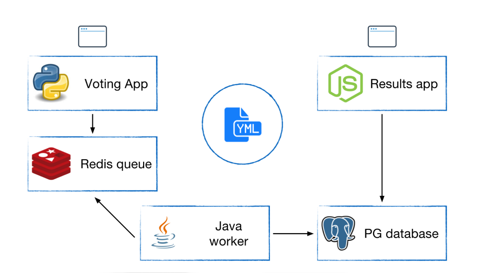

# Docker实践

[返回列表](https://github.com/EmonCodingBackEnd/backend-tutorial)

[TOC]

# 序一、Vagrant的安装与使用

Vagrant官网： https://developer.hashicorp.com/vagrant/install

## 1 Vagrant 是什么？

- **核心功能**：由 HashiCorp 开发的工具，用于快速创建和配置轻量级、可复用的虚拟开发环境。
- **依赖技术**：基于 VirtualBox、VMware、Hyper-V 等虚拟机管理程序，或 Docker 容器。
- **核心文件**：通过 `Vagrantfile` 定义虚拟机配置（如操作系统、网络、共享目录等）。

## 2 典型使用场景

1. **统一开发环境**
   - 团队共享相同的开发环境配置，避免“在我机器上能运行”的问题。
   - 示例：通过 `vagrant up` 一键启动预装 Python/Node.js/数据库的虚拟机。
2. **多环境测试**
   - 快速创建不同操作系统（Ubuntu/CentOS/Windows）的实例，测试跨平台兼容性。
3. **持续集成（CI）**
   - 在 CI 流程中自动启动虚拟机运行测试任务。
4. **快速原型开发**
   - 结合 Provisioning（如 Ansible、Shell 脚本）自动部署应用依赖。

## 3 安装

```bash
% brew tap hashicorp/tap
% brew install hashicorp/tap/hashicorp-vagrant
```

## 4 常用命令

### 4.1 Vagrant的常用命令

| 命令                               | 命令执行结果状态 | 解释                                     |
| ---------------------------------- | ---------------- | ---------------------------------------- |
| `vagrant --version/vagrant -v`     |                  | 查看当前版本                             |
| `vagrant box list`                 |                  | 查看本地已下载的镜像列表                 |
| `vagrant box add`                  |                  | 添加镜像到本地仓库（如 `rockylinux/9`）  |
| `vagrant box remove < name >`      |                  | 删除本地镜像                             |
| `vagrant box update`               |                  | 更新本地镜像到最新版本                   |
| `vagrant init`                     |                  | 生成默认的 Vagrantfile（需手动指定镜像） |
| `vagrant init < boxes >`           |                  | 生成 Vagrantfile 并指定默认镜像          |
| `vagrant init <box名称> <镜像URL>` |                  | 指定镜像名称及下载地址                   |
| `vagrant up`                       | running          | 启动虚拟机                               |
| `vagrant ssh`                      |                  | ssh登录虚拟机                            |
| `vagrant suspend`                  | saved            | 挂起虚拟机                               |
| `vagrant resume`                   | running          | 唤醒虚拟机                               |
| `vagrant halt`                     | poweroff         | 关闭虚拟机                               |
| `vagrant reload`                   | running          | 重启虚拟机                               |
| `vagratn status`                   | running          | 查看虚拟机状态                           |
| `vagrant destroy [name\|id]`       |                  | 删除虚拟机，如果是default可以省略id      |
| `vagrant provision`                |                  | 重新运行配置脚本（如 Ansible）           |

特殊说明：vagrant up是一个万能命令，可以对saved/poweroff状态的虚拟机唤醒。

- vagrant box 示例

```bash
# 添加官方 Ubuntu 20.04 镜像
vagrant box add ubuntu/focal64
# 从本地文件添加镜像（如 centos.box）
vagrant box add centos7 /path/to/centos.box
# 列出所有本地镜像
vagrant box list
```

- vagrant init 示例

```bash
# 初始化项目并指定镜像（本地已存在 ubuntu/focal64）
vagrant init ubuntu/focal64
# 初始化项目并指定镜像 URL（自动下载）
vagrant init centos/7 https://example.com/centos7.box
# 生成 Vagrantfile 并指定默认镜像
vagrant init rockylinux/9 --box-version 5.0.0
```

### 4.2 Vagrant Plugin的常用命令

| 命令                                  | 解释           |
| ------------------------------------- | -------------- |
| vagrant plugin install < pluginName > | 安装插件       |
| vagrant plugin list                   | 查看安装的插件 |
| vagrant plugin uninstall              | 卸载插件       |
| vagrant plugin help                   | 查看命令用法   |

## 5、Vagrant的使用

### 5.1、使用VirtualBox创建虚拟机

#### 第一步：启动virtualbox

virtualbox安装后启动！

#### 第二步：下载镜像box

如何查询各种boxes：https://portal.cloud.hashicorp.com/vagrant/discover

下载地址：https://app.vagrantup.com/centos/boxes/7

根据使用的Vagrant是VirtualBox还是VMWare，选择`virtualbox`或者`vmware_desktop ` 类型的 provider下载！

下载后本地安装：

```bash
# 若是从本地加载，可以 vagrant box add CentOS/7 CentOS-7-x86_64-Vagrant-2004_01.VMwareFusion.box
$ vagrant box add rockylinux/9 
==> box: Loading metadata for box 'rockylinux/9'
    box: URL: https://vagrantcloud.com/api/v2/vagrant/rockylinux/9
This box can work with multiple providers! The providers that it
can work with are listed below. Please review the list and choose
the provider you will be working with.

1) libvirt
2) virtualbox
3) vmware_desktop

Enter your choice: vmware_desktop
Invalid choice. Try again: 3 
==> box: Adding box 'rockylinux/9' (v5.0.0) for provider: vmware_desktop (arm64)
    box: Downloading: https://vagrantcloud.com/rockylinux/boxes/9/versions/5.0.0/providers/vmware_desktop/arm64/vagrant.box
Progress: 4% (Rate: 1123k/s, Estimated time remaining: 0:13:42)
```

#### 第三步：初始化项目Vagrantfile

- 规划一个目录，作为Vagrant虚拟机目录，比如：Vagrant/centos7

如果尚未看到Vagrantfile，初始化配置Vagrantfile

```bash
$ vagrant init rockylinux/9 --box-version 5.0.0
```

- 编辑Vagrantfile

```bash
$ vim Vagrantfile
```

```bash
Vagrant.configure("2") do |config|
  config.vm.box = "centos/7"
end
```

#### 第四步：启动虚拟机

运行 `vagrant up`，Vagrant 会根据 `Vagrantfile` 中的配置创建虚拟机。

```bash
$ vagrant up
# 指定virtualbox这个provider【推荐】；特别说明：默认也是 virtualbox
$ vagrant up --provider virtualbox
```


### 5.2 使用VMWare创建虚拟机

#### 第一步：安装VMWare provider插件vmware-desktop

1. 下载VMWare-utility

https://www.vagrantup.com/docs/providers/vmware/vagrant-vmware-utility

下载后，双击安装！

2. 下载VMWare-desktop查看

```bash
$ vagrant plugin install vagrant-vmware-desktop
# 命令行输出结果
Installing the 'vagrant-vmware-desktop' plugin. This can take a few minutes...
Installed the plugin 'vagrant-vmware-desktop (3.0.1)'!
```

3. 安装VMWare并启动

双击VMWare安装后，启动！

#### 第二步：下载box

如何查询各种boxes：https://app.vagrantup.com/boxes/search

下载地址：https://app.vagrantup.com/centos/boxes/7

根据使用的Vagrant是VirtualBox还是VMWare，选择`virtualbox`或者`vmware_desktop ` 类型的 provider下载！

下载后本地安装：

```bash
# 如果不是为了`vagrant add box boxesname boxespath`可以不下载。
vagrant box add CentOS/7 CentOS-7-x86_64-Vagrant-2004_01.VMwareFusion.box
```

#### 第三步：Vagrantfile

- 规划一个目录，作为Vagrant虚拟机目录，比如：Vagrant/centos7

如果尚未看到Vagrantfile，初始化配置Vagrantfile

```bash
vagrant init
# 或者指定boxes【推荐】
vagrant init centos/7
```

- 编辑Vagrant

```bash
$ vim Vagrantfile
```

```bash
Vagrant.configure("2") do |config|
  config.vm.box = "centos/7"
end
```

#### 第四步：初始化机器

```bash
# 指定vmware_desktop这个provider【推荐】
vagrant up --provider vmware_desktop
```


### 5.3 Vagrant虚拟机访问

### 5.3.1 通过vagrant ssh命令

```bash
$ vagrant ssh
[vagrant@localhost ~]$ pwd
/home/vagrant
```

### 5.3.2 通过XShell工具

#### 1.查看vagrant的ssh配置

```bash
$ vagrant ssh-config
# 命令行输出结果
Host default
  HostName 127.0.0.1
  User vagrant
  Port 2222
  UserKnownHostsFile /dev/null
  StrictHostKeyChecking no
  PasswordAuthentication no
  IdentityFile D:/SharedWorkspace/Vagrant/centos7/.vagrant/machines/default/virtualbox/private_key
  IdentitiesOnly yes
  LogLevel FATAL
```

可以看到：

- HostName 127.0.0.1
- Port 2222
- IdentityFile D:/SharedWorkspace/Vagrant/centos7/.vagrant/machines/default/virtualbox/private_key

#### 2.XShell连接


点击确定后登陆，首次登陆，会提示输入密码；这时，输入密码： vagrant 即可！

#### 3.切换到root

```bash
# 密码是 vagrant
[vagrant@localhost ~]$ su - root
Password: 
Last login: Fri Mar 11 07:45:14 UTC 2022 on pts/0
[root@localhost ~]# 
```

# 序二、Docker Desktop的安装与使用【不推荐】

1. 下载

下载地址：https://docs.docker.com/desktop/windows/install/

2. 安装

在Windows上双击安装，安装后根据提示重启电脑。

3. 解决WSL 2 installation is incomplete问题

打开Docker Desktop时提示：


首先，确保如下功能已勾选：


如果以勾选，并且WSL确实有下载，那么尝试更新WSL：

1：以管理员身份启动 powershell

2：执行

```bash
wsl --update
```

3：重启wsl【开启后，会导致VMWare启动失败：VMware Workstation 与 Device/Credential Guard 不兼容。】

```bash
net stop LxssManager
net start LxssManager
```

安装Docker Desktop后，也会默认启用【启用或关闭Windows功能】=>【虚拟化平台】，也会导致如上VMWare启动失败问题。

同时，【服务】=>【HV主机服务】也建议关闭！

# 一、Docker的安装与配置

## 1、安装

[查看官方CentOS安装Docker教程](https://docs.docker.com/engine/install/centos/)

### 1.0、删除旧版Docker

```bash
sudo yum remove docker \
                  docker-client \
                  docker-client-latest \
                  docker-common \
                  docker-latest \
                  docker-latest-logrotate \
                  docker-logrotate \
                  docker-engine
# 必要时：清理yum安装的新版本docker
yum remote -y docker* container-selinux
```

如果yum报告说以上安装包未安装，未匹配，未删除任何安装包，活码环境干净，没有历史遗留旧版安装。

### 1.1、安装要求

	安装Docker的基本要求如下：

- Dockr只支持64位的CPU架构的计算机，目前不支持32位CPU
- 建议系统的Linux内核版本为3.10及以上
- Linux内核需要开启cgroups和namespace功能
- 对于非Linux内核的平台，如Microsoft Windows和OS X，需要安装使用Boot2Docker工具

### 1.2、CentOS环境下安装Docker

	Docker目前只能运行在64位平台上，并且要求内核版本不低于3.10，实际上内核版本越新越好，过低的内核版本容易造成功能不稳定。
	
	用户可以通过如下命令检查自己的内核版本详细信息：

```shell
[emon@emon ~]$ uname -a
Linux emon 3.10.0-862.el7.x86_64 #1 SMP Fri Apr 20 16:44:24 UTC 2018 x86_64 x86_64 x86_64 GNU/Linux
[emon@emon ~]$ cat /proc/version
Linux version 3.10.0-862.el7.x86_64 (builder@kbuilder.dev.centos.org) (gcc version 4.8.5 20150623 (Red Hat 4.8.5-28) (GCC) ) #1 SMP Fri Apr 20 16:44:24 UTC 2018
```

1. 安装需要的软件包，yum-util提供yum-config-manager功能，另外两个是devicemapper驱动依赖的

```shell
[emon@emon ~]$ sudo yum install -y yum-utils device-mapper-persistent-data lvm2
```

2. 设置yum源

```shell
[emon@emon ~]$ sudo yum-config-manager --add-repo https://download.docker.com/linux/centos/docker-ce.repo
```

3. 可以查看所有仓库中所有docker版本，并选择安装特定的版本

```shell
[emon@emon ~]$ yum list docker-ce --showduplicates |sort -r
```

4. 安装docker

```shell
# 安装最新
# $ sudo yum install -y docker-ce
# 安装指定版本
# $ sudo yum install -y docker-ce-18.06.3.ce 【一个使用了很久的版本】
# $ sudo yum install -y docker-ce-19.03.15
$ sudo yum install -y docker-ce-20.10.24
# $ sudo yum install -y docker-ce-23.0.6
# $ sudo yum install -y docker-ce-24.0.9
# $ sudo yum install -y docker-ce-25.0.5
# $ sudo yum install -y docker-ce-26.1.4
```

5. 启动

```shell
[emon@emon ~]$ sudo systemctl start docker
```

6. 验证安装

```shell
[emon@emon ~]$ sudo docker version
[emon@emon ~]$ sudo docker info
[emon@emon ~]$ sudo docker run hello-world
```

> 说明：如果docker info有提示：
> WARNING: bridge-nf-call-iptables is disabled
> WARNING: bridge-nf-call-ip6tables is disabled

解决办法：

```bash
[emon@emon2 ~]$ sudo vim /etc/sysctl.conf 
```

```bash
net.bridge.bridge-nf-call-ip6tables = 1
net.bridge.bridge-nf-call-iptables = 1
```

使之生效：

```bash
[emon@emon2 ~]$ sudo sysctl -p
```

无需重启，此时docker info就看不到此报错了。

### 1.3、配置docker加速器

- 配置

  - DaoCloud

  采用 DaoCloud: https://www.daocloud.io/ 提供的Docker加速器。

  登录DaoCloud，找到小火箭图标，根据说明操作：

  ```bash
  [emon@emon ~]$ curl -sSL https://get.daocloud.io/daotools/set_mirror.sh | sh -s http://f1361db2.m.daocloud.io
  docker version >= 1.12
  {"registry-mirrors": ["https://mirror.baidubce.com","http://f1361db2.m.daocloud.io"]}
  Success.
  You need to restart docker to take effect: sudo systemctl restart docker
  ```

  - 阿里云

  登录阿里开发者平台： https://promotion.aliyun.com/ntms/act/kubernetes.html#industry

  点击【镜像搜索】按钮，自动跳转到控制台的镜像搜索，根据提示注册并登录：

  在左侧【镜像工具】中选择【镜像加速器】，右边是生成的加速地址：比如我的：`https://pyk8pf3k.mirror.aliyuncs.com`，执行命令配置上即可：

  `daemon.json`文件是一个JSON格式的文件，包含键值对来设置Docker守护进程的参数。以下是一些常见的配置项：

  - daemon.json文件结构

    - graph设置docker数据目录：选择比较大的分区（如果这里是根目录就不需要配置了，默认为/var/lib/docker）

    - data-root: Docker数据目录，默认为/var/lib/docker。

      > 版本docker-ce-23.0.6以下用 graph 而不是 data-root
      >
      > 版本docker-ce-23.0.6及以上，graph -> data-root，否则报错Active: failed (Result: start-limit

    - exec-root: Docker执行状态文件的存储路径，默认为/var/run/docker。

    - exec-opts：设置cgroup driver（默认是cgroupfs，不推荐设置systemd）

      > 比如：  `"exec-opts": ["native.cgroupdriver=cgroupfs"],`

    - log-driver: Docker日志驱动类型，默认为json-file。

    - log-level: Docker日志记录级别，如debug、info、warn、error、fatal。

    - insecure-registries: 可以通过HTTP连接的镜像仓库地址。

    - registry-mirrors: 镜像仓库加速地址。

    - storage-driver: Docker存储驱动类型，推荐overlay2。

    - live-restore: 是否启用“实时恢复”功能，允许Docker在更新或重启时不终止运行中的容器。
    - debug：开启调试，若启动失败，可以在 /var/log/messages 查看原因

  ```bash
  sudo tee /etc/docker/daemon.json <<-'EOF'
  {
    "registry-mirrors": ["https://pyk8pf3k.mirror.aliyuncs.com","https://dockerproxy.com","https://mirror.baidubce.com","https://docker.nju.edu.cn","https://docker.mirrors.sjtug.sjtu.edu.cn","https://docker.mirrors.ustc.edu.cn"],
    "graph": "/var/lib/docker",
    "exec-opts": ["native.cgroupdriver=cgroupfs"],
    "insecure-registries": ["emon:5080"]
  }
  EOF
  ```

  说明：

  1. 阿里云加速器
  2. DockerProxy代理加速
  3. 百度云Mirror
  4. 南京大学
  5. 上海交通大学
  6. USTC

- 查看

```bash
[emon@emon ~]$ sudo cat /etc/docker/daemon.json 
{"registry-mirrors": ["http://f1361db2.m.daocloud.io"]}
```

- 重启

```bash
[emon@emon ~]$ sudo systemctl restart docker
```

### 1.4、配置docker代理服务器

若加速器不好使，请使用代理服务器，前提是能科学上网，这里推荐一个：Aurora

- 安装了Aurora后，通过【设置】=>【网络和 Internet】=>【代理】=>【手动设置代理】（发现是开启的）=>编辑，查看代理地址。


点击编辑后，看到的代理配置：


其中127.0.0.1可以更换为其他网卡地址（比如VMware Network Adapter VMnet8）：192.168.32.1


- 配置Docker代理

```bash
$ mkdir -p /etc/systemd/system/docker.service.d
$ vim /etc/systemd/system/docker.service.d/proxy.conf
```

```bash
[Service]
Environment="HTTP_PROXY=http://192.168.32.1:29290"
Environment="HTTPS_PROXY=http://192.168.32.1:29290"
Environment="NO_PROXY=127.0.0.1,localhost,192.168.32.116"
```

- 重启Docker并查看代理配置情况

```bash
$ systemctl daemon-reload && systemctl restart docker
$ systemctl show --property=Environment docker
Environment=HTTP_PROXY=http://192.168.32.1:29290 HTTPS_PROXY=http://192.168.32.1:29290
```

## 2、配置Docker服务

### 2.1、推荐通过配置sudo的方式：

	不推荐docker服务启动后，修改/var/run/docker.sock文件所属组为dockerroot，然后为某个user添加附加组dockerroot方式，使得docker命令在user登录后可以执行。

```shell
[emon@emon ~]$ sudo visudo
```

	找到`## Allow root to run any commands anywhere`这样的标识，在下方配置：

```shell
# 备注：如果已经赋予了ALL的操作权限，就没必要配置如下了
emon    ALL=(ALL)       PASSWD:/usr/bin/docker
```


### 2.2、配置alias

配置永久的alias：

```shell
# 如果是root用户安装的，不需要带sudo命令
[emon@emon ~]$ vim ~/.bashrc
alias docker="sudo /usr/bin/docker"
alias dockerpsf="sudo /usr/bin/docker ps --format \"table{{.ID}}\t{{.Names}}\t{{.Status}}\t{{.Image}}\t{{.RunningFor}}\t{{.Ports}}\""
alias dockerps="sudo /usr/bin/docker ps --format \"table{{.ID}}\t{{.Status}}\t{{.Names}}\""
```

使之生效：

```shell
[emon@emon ~]$ source ~/.bashrc
```

使用示例：

```shell
[emon@emon ~]$ docker images
[sudo] emon 的密码：
REPOSITORY          TAG                 IMAGE ID            CREATED             SIZE
```

## 3、基本信息查看

### 3.1、查看Docker的基本信息

```shell
[emon@emon ~]$ docker info
Containers: 0
 Running: 0
 Paused: 0
 Stopped: 0
Images: 0
Server Version: 18.06.3-ce
Storage Driver: overlay2
 Backing Filesystem: xfs
 Supports d_type: true
 Native Overlay Diff: true
Logging Driver: json-file
Cgroup Driver: cgroupfs
Plugins:
 Volume: local
 Network: bridge host macvlan null overlay
 Log: awslogs fluentd gcplogs gelf journald json-file logentries splunk syslog
Swarm: inactive
Runtimes: runc
Default Runtime: runc
Init Binary: docker-init
containerd version: 468a545b9edcd5932818eb9de8e72413e616e86e
runc version: a592beb5bc4c4092b1b1bac971afed27687340c5
init version: fec3683
Security Options:
 seccomp
  Profile: default
Kernel Version: 3.10.0-1062.el7.x86_64
Operating System: CentOS Linux 7 (Core)
OSType: linux
Architecture: x86_64
CPUs: 4
Total Memory: 4.743GiB
Name: emon
ID: GN4G:MRL4:3LOQ:IHZP:CXV6:TE33:WSIG:FAYD:4UBO:3VU6:VBAZ:5I5I
Docker Root Dir: /var/lib/docker
Debug Mode (client): false
Debug Mode (server): false
Registry: https://index.docker.io/v1/
Labels:
Experimental: false
Insecure Registries:
 127.0.0.0/8
Registry Mirrors:
 http://c018e274.m.daocloud.io/
Live Restore Enabled: false
```

### 3.2、查看Docker版本

```shell
[emon@emon ~]$ docker version
Client:
 Version:           18.06.3-ce
 API version:       1.38
 Go version:        go1.10.3
 Git commit:        d7080c1
 Built:             Wed Feb 20 02:26:51 2019
 OS/Arch:           linux/amd64
 Experimental:      false

Server:
 Engine:
  Version:          18.06.3-ce
  API version:      1.38 (minimum version 1.12)
  Go version:       go1.10.3
  Git commit:       d7080c1
  Built:            Wed Feb 20 02:28:17 2019
  OS/Arch:          linux/amd64
  Experimental:     false
```

## 4、升级Docker

### 4.1、卸载低版本Docker

- 查看Docker版本

```bash
$ rpm -qa|grep docker
docker-ce-18.06.3.ce-3.el7.x86_64
```

- 查看已安装镜像

```bash
$ docker images
```

- 查看镜像存放路径

```bash
$ docker inspect <image_name>|grep HostsPath
```

> Linux系统下，Docker默认存储路径是`/var/lib/docker`

- 删除Docker

```bash
$ yum list docker*
$ yum remove docker*
```

> 注：不删除`/var/lib/docker`目录就不会删除已安装的镜像和容器。

### 4.2、安装高版本Docker

```bash
$ yum install -y docker-ce-20.10.24
$ systemctl enable docker && systemctl start docker
```


# 二、Docker的架构和底层技术

## 1、Docker Platform

- Docker提供了一个开发，打包，运行app的平台
- 把app和底层infrastructure隔离开来

|         Docker Platform          |
| :------------------------------: |
|           Application            |
|          Docker Engine           |
| Infrastructure(physical/virtual) |

### 1.1、Docker Engine

- 后台进程（dockerd）
- REST API Server
- CLI接口（docker）


查看Docker后台进程：

```bash
[vagrant@localhost ~]$ ps -ef|grep docker
root      1952     1  0 02:02 ?        00:00:00 /usr/bin/dockerd -H fd:// --containerd=/run/containerd/containerd.sock
```


## 2、Docker Architecture


## 3、底层技术支持

- Namespaces：做隔离pid，net，ipc，mnt，uts
- Control groups：做资源限制
- Union file systems：Container和image的分层


# 三、镜像

## 1、什么是Image

- 文件和meta data的集合（root filesystem）
- 分层的，并且每一层都可以添加改变，删除文件，成为一个新的image
- 不同的image可以共享相同的layer
- Image本身是read-only的


## 2、获取镜像

- 获取Docker Hub镜像
  - 镜像是运行容器的前提，官方的Docker Hub网站已经提供了数十万个镜像供开放下载。
  - 命令格式： `docker pull NAME[:TAG]` 其中，NAME是镜像仓库的名称（用来区分镜像），TAG是镜像的标签（往往用来表示版本信息）。通常情况下，描述一个镜像需要包括`名称+标签`信息。
  - 如果不指定TAG，默认选择latest标签，这会下载仓库中最新版本的镜像。

```shell
# 等效于 docker pull registry.hub.docker.com/ubuntu:14.04
[emon@emon ~]$ docker pull ubuntu:14.04
# 我喜欢的centos
[emon@emon ~]$ docker pull centos:7
```

- 获取其他服务器镜像

```shell
[emon@emon ~]$ docker pull hub.c.163.com/public/ubuntu:14.04
```

### 2.1、案例：DIY一个Base Image

#### 2.1.1、体验hello-world镜像

```bash
[emon@emon ~]$ docker pull hello-world
[emon@emon ~]$ docker image ls
[emon@emon ~]$ docker run hello-world
```

#### 2.1.2、DIY hello-world镜像

1：安装C语言编译工具

```bash
[emon@emon ~]$ sudo yum install -y gcc glibc-static
```

2：创建hello.c文件并编译

```bash
[emon@emon ~]$ mkdir dockerdata/hello-world
[emon@emon ~]$ cd dockerdata/hello-world/
[emon@emon hello-world]$ vim hello.c
```

```c
#include<stdio.h>

int main()
{
    printf("hello docker\n");
}
```

```bash
[emon@emon hello-world]$ gcc -static hello.c -o hello
[emon@emon hello-world]$ ls
hello  hello.c
[emon@emon hello-world]$ ./hello 
hello docker
```

3：编写Dockerfile

```bash
[emon@emon hello-world]$ vim Dockerfile
```

```dockerfile
FROM scratch
ADD hello /
CMD ["/hello"]
```

```bash
# rushing-dockerhub用户名； .-当前目录寻找Dockerfile
[emon@emon hello-world]$ docker build -t rushing/hello-world .
# 命令行输出结果
Sending build context to Docker daemon  865.3kB
Step 1/3 : FROM scratch
 ---> 
Step 2/3 : ADD hello /
 ---> 340544a0099c
Step 3/3 : CMD ["/hello"]
 ---> Running in 1ae3095100d9
Removing intermediate container 1ae3095100d9
 ---> 72b24c24801b
Successfully built 72b24c24801b
Successfully tagged rushing/hello-world:latest
```

4：查看

- 查看image

```bash
[emon@emon hello-world]$ docker image ls|grep rushing
rushing/hello-world   latest              72b24c24801b        25 seconds ago      861kB
```

- 查看image的分层

```bash
[emon@emon hello-world]$ docker history 72b24c24801b
IMAGE               CREATED             CREATED BY                                      SIZE                COMMENT
72b24c24801b        2 minutes ago       /bin/sh -c #(nop)  CMD ["/hello"]               0B                  
340544a0099c        2 minutes ago       /bin/sh -c #(nop) ADD file:e7f35cd45d6ae73c7⋯   861kB 
```

5：运行

```bash
[emon@emon hello-world]$ docker run rushing/hello-world
# 命令行输出结果
hello docker
```


## 3、查看镜像

- 使用`docker images`命令列出镜像

```shell
[emon@emon ~]$ docker images
# 或者
[emon@emon ~]$ docker image ls
```

- 列名解析：

| 列名       | 释义                                                         |
| ---------- | ------------------------------------------------------------ |
| REPOSITORY | 来自于哪个仓库，比如ubuntu仓库用来保存ubuntu系列基础镜像     |
| TAG        | 镜像的标签信息，比如14.04、latest用来标注不同的版本信息。标签只是标记，不标识镜像内容 |
| IMAGE ID   | 镜像的ID（唯一标识镜像），比如ubuntu:14.04的唯一标志是 971bb384a50a |
| CREATED    | 创建时间，说明镜像最后的更新时间                             |
| SIZE       | 镜像大小，优秀的镜像往往体积比较小                           |

- 命令支持的选项

| 参数名称                | 参数作用                                                     |
| ----------------------- | ------------------------------------------------------------ |
| -a, --all=true\|false   | 列出所有的镜像文件（包括临时文件），默认为否                 |
| --digests=true\|false   | 列出镜像的数字摘要值，默认为否                               |
| -f, --filter=[]         | 过滤列出的镜像，如dangling=true只显示没有被使用的镜像；也可以指定带有特定标注的镜像等 |
| --format="TEMPLATE"     | 控制输出格式，例如`.ID`代表ID信息，`.Repository`代表仓库信息等 |
| --no-trunc=true\|false  | 对输出结果中太长的部分是否进行截断，如镜像的ID信息，默认为是 |
| -q, --quiet=true\|false | 仅输出ID信息，默认为否                                       |

	其中，对输出结果进行控制的选项如-f, --filter=[]、--no-trunc=true|false、-q, --quiet=true|false等，对大部分子命令都支持。

## 4、为镜像添加标签Tag

	为了方便在后续工作中使用特定镜像，还可以使用`docker tag`命令来为本地镜像任意添加新的标签。

```shell
[emon@emon ~]$ docker tag centos:7 centos:7.8
[emon@emon ~]$ docker images
REPOSITORY          TAG                 IMAGE ID            CREATED             SIZE
centos              7                   b5b4d78bc90c        2 days ago          203MB
centos              7.8                 b5b4d78bc90c        2 days ago          203MB
```

## 5、使用`inspect`命令查看镜像详细信息

```shell
[emon@emon ~]$ docker inspect centos:7
```

## 6、搜寻镜像

	使用docker search命令可以搜索远端仓库中共享的镜像，默认搜索官方仓库中的镜像。支持的参数主要包括：

| 参数名称                          | 参数作用                                                     |
| --------------------------------- | ------------------------------------------------------------ |
| --filter=is-automated=true\|false | 仅显示自动创建的镜像，默认为否                               |
| --no-trunc=true\|false            | 输出信息不截断显示，默认为否                                 |
| --filter=stars=3                  | 指定仅显示评价为指定星级以上的镜像，默认为0，即输出所有镜像。 |
| --filter=is-official=true         | 仅查询官方镜像                                               |

示例：

```shell
[emon@emon ~]$ docker search --filter=stars=3 --filter=is-official=true nginx
```

## 7、删除镜像

- 使用标签删除镜像，命令格式： `docker rmi IMAGE [IMAGE...]`，其中IMAGE可以是标签或者ID

```shell
[emon@emon ~]$ docker rmi centos:7.8
[emon@emon ~]$ docker images
REPOSITORY          TAG                 IMAGE ID            CREATED             SIZE
centos              7                   b5b4d78bc90c        2 days ago          203MB
```

- 使用镜像ID（或者部分ID串前缀）删除镜像

```shell
[emon@emon ~]$ docker rmi -f b5b4d78bc90c
```

	命令含义：会先尝试删除所有指向该镜像的标签，然后删除该镜像文件本身。哪怕基于该镜像启动了容器，也会删除镜像。但不影响容器。

- 批量删除满足条件的镜像

```bash
[emon@emon harbor]$ docker rmi $(docker images goharbor/* -q)
```

## 8、创建镜像

	创建镜像的方法主要有三种：基于已有镜像的容器创建、基于本地模板导入、基于Dockerfile创建。

### 8.1、基于已有镜像的容器创建【不推荐】

<span style="color:red;font-weight:bold;">不会把外部挂载的资源打包到镜像</span>

该方法主要是使用docker commit命令；等效命令：docker container commit

命令格式为`docker commit [OPTIONS] CONTAINTER [REPOSITORY[:TAG]]`，主要选项包括：

| 参数名称         | 参数作用                                                     |
| ---------------- | ------------------------------------------------------------ |
| -a, --author=""  | 作者信息                                                     |
| -c, --change=[]  | 提交的试试执行Dockerfile指令，包括CMD\|ENTRYPOINT\|ENV\|EXPOSE\|LABEL\|ONBUILD\|USER\|VOLUME\|WORKDIR等 |
| -m, --message="" | 提交信息                                                     |
| -p, --pause=true | 提交时暂停容器运行                                           |

1. 首先，启动一个镜像，并在其中进行修改操作，例如创建一个test文件，之后推出：

```shell
[emon@emon ~]$ docker run -it ubuntu:14.04 /bin/bash
root@fe1aa9bd8460:/# touch test
root@fe1aa9bd8460:/# exit
```

记住容器的ID为 fe1aa9bd8460。

此时，该容器跟原ubuntu:14.04镜像相比，已经发生了变化，可以使用`docker commit`命令提交未一个新的镜像。提交时可以使用ID或者名称来指定容器：

```shell
[emon@emon ~]$ docker commit -m "Added a new file" -a "Emon" fe1aa9bd8460 test:0.0.1
```

### 8.2、基于本地模板导入

用户也可以直接从一个操作系统模板文件导入一个镜像，主要使用`docker import`命令。

命令格式为`docker import [OPTIONS] file|URL| - [REPOSITORY[:TAG]]`

### 8.3、基于Dockerfile创建【推荐】

docker build命令；等效命令：docker image build

1：创建目录

```bash
[emon@emon ~]$ mkdir docker-centos-vim
[emon@emon ~]$ cd docker-centos-vim/
```

2：创建Dockerfile

```bash
[emon@emon docker-centos-vim]$ vim Dockerfile 
```

```dockerfile
FROM centos:7
RUN yum install -y vim
```

3：创建镜像

```bash
# -t 指定repository名称为 rushing/centos-vim:latest 其中rushing是dockerhub用户名； .-当前目录寻找Dockerfile
[emon@emon docker-centos-vim]$ docker build -t rushing/centos-vim .
```


## 9、存出和载入镜像

用户可以使用`docker save`和`docker load`命令来存出和载入镜像。

### 9.1、存出镜像

```shell
[emon@emon ~]$ docker save -o test_0.0.1.tar test:0.0.1
```

说明：由于是通过sudo使用的docker命令，这里到处的镜像属于root用户；该镜像可以分发给其他人导入。

### 9.2、载入镜像

```shell
[emon@emon ~]$ docker load --input test_0.0.1.tar 
```

或者，使用root用户执行：

```shell
[root@emon ~]# docker load < /home/emon/test_0.0.1.tar 
```

或者，使用非root如下执行：

```shell
[emon@emon ~]$ sudo bash -c "chown emon.emon test_0.0.1.tar;docker load < test_0.0.1.tar"
```

说明：直接使用docker load命令，非root用户有权限限制：

```shell
[emon@emon ~]$ docker load < test_0.0.1.tar 
-bash: test_0.0.1.tar: 权限不够
```

## 10、上传镜像

以使用docker push命令上传镜像到仓库，默认上传到Docker Hub官方仓库（需要登录）。命令格式为：

`docker push NAME[:TAG] | [REGISTRY_HOST[:REGISTRY_PORT]/]NAME[:TAG]`

用户在Docker Hub网站注册后可以上传自制的镜像。例如用户user上传本地的test:latest镜像，可以先添加新的标签user/test:latest，然后用docker push命令上传镜像；

**请确保自己在 [Docker Hub](https://hub.docker.com/) 上有注册的用户，并把user替换为自己的用户名**

1. 打标签

```shell
[emon@emon ~]$ docker tag test:0.0.1 rushing/test:0.0.1
```

2. 登录 Docker Hub

```shell
[emon@emon ~]$ docker login
```

3. 上传

```shell
[emon@emon ~]$ docker push rushing/test:0.0.1
```


## 11、构建自己的docker私服

- 创建docker私服

访问：https://hub.docker.com/

访问registry私服文档：https://docs.docker.com/registry/spec/api/#listing-repositories

搜索：registry，找到官方提供的registry，用来存储和发布docker image。

```bash
[emon@emon ~]$ docker run -d -p 5000:5000 --restart always --name registry registry:2
```

- 私服安全控制

对文件 `/etc/docker/daemon.json` 追加 `insecure-registries`内容

```bash
{
  "registry-mirrors": ["https://pyk8pf3k.mirror.aliyuncs.com"],
  "insecure-registries": ["emon:5000"]
}
```

对文件 `/lib/systemd/system/docker.service` 追加`EnvironmentFile`：

```bash
# 在ExecStart后面一行追加
EnvironmentFile=-/etc/docker/daemon.json
```

重启Docker服务：

```bash
[emon@emon hello-world]$ sudo systemctl daemon-reload
[emon@emon hello-world]$ sudo systemctl restart docker
```

- 对DIY的hello-world镜像，重新编译成新的镜像：

```bash
# 注意：这里是 rushing ==> emon:5000
[emon@emon hello-world]$ docker build -t emon:5000/hello-world .
[emon@emon hello-world]$ docker images | grep hello
# 命令行输出结果
emon:5000/hello-world      latest              da65ce820d2d        29 seconds ago      861kB
```

- 上传到本地docker私服

```bash
[emon@emon hello-world]$ docker push emon:5000/hello-world
# 命令行输出结果
The push refers to repository [emon:5000/hello-world]
da4136101ba6: Pushed 
latest: digest: sha256:77042e6c954be4845eaf2181e4c7cb6d51441fb00cf2c45513b1040cb68f5d32 size: 527
```

- 验证私服

访问：http://emon:5000/v2/_catalog

- 删除本地helle-world的image，并从私服pull下来

```bash
[emon@emon ~]$ docker rmi < imageId >
[emon@emon ~]$ docker pull emon:5000/hello-world
```

## 12、镜像私服Harbor【推荐】

1. 下载地址

https://github.com/goharbor/harbor/releases

```bash
[emon@emon ~]$ wget -cP /usr/local/src/ https://github.com/goharbor/harbor/releases/download/v2.2.4/harbor-offline-installer-v2.2.4.tgz
```

2. 创建解压目录

```bash
# 创建Harbor解压目录
[emon@emon ~]$ mkdir /usr/local/Harbor
# 创建Harbor的volume目录
[emon@emon ~]$ mkdir /usr/local/dockerv/harbor_home
```

3. 解压

```bash
# 推荐v2.2.4版本，更高版本比如2.3和2.4有docker-compose down -v ==> down-compose up -d时postgresql服务启动不了的bug，数据库重启失败！
[emon@emon ~]$ tar -zxvf /usr/local/src/harbor-offline-installer-v2.2.4.tgz -C 
/usr/local/Harbor/
[emon@emon ~]$ ls /usr/local/Harbor/harbor
common.sh  harbor.v2.2.4.tar.gz  harbor.yml.tmpl  install.sh  LICENSE  prepare
```

4. 创建自签名证书【参考实现，建议走正规渠道的CA证书】【缺少证书无法浏览器登录】

- 创建证书存放目录

```bash
[emon@emon ~]$ mkdir /usr/local/Harbor/cert && cd /usr/local/Harbor/cert
```

- 创建CA根证书

```bash
# 其中C是Country，ST是State，L是local，O是Origanization，OU是Organization Unit，CN是common name(eg, your name or your server's hostname)
[emon@emon cert]$ openssl req -newkey rsa:4096 -nodes -sha256 -keyout ca.key -x509 -days 3650 -out ca.crt \
-subj "/C=CN/ST=ZheJiang/L=HangZhou/O=HangZhou emon Technologies,Inc./OU=IT emon/CN=emon"
# 命令行输出结果
Generating a 4096 bit RSA private key
...........................................................................................................................................................................................................................++
.............................................................................................++
writing new private key to 'ca.key'
-----
# 查看结果
[emon@emon cert]$ ls
ca.crt  ca.key
```

- 生成一个证书签名，设置访问域名为 emon

```bash
[emon@emon cert]$ openssl req -newkey rsa:4096 -nodes -sha256 -keyout emon.key -out emon.csr \
-subj "/C=CN/ST=ZheJiang/L=HangZhou/O=HangZhou emon Technologies,Inc./OU=IT emon/CN=emon"
# 命令行输出结果
Generating a 4096 bit RSA private key
......................................................................................................................................................................................++
.....................++
writing new private key to 'emon.key'
-----
# 查看结果
[emon@emon cert]$ ls
ca.crt  ca.key  emon.csr  emon.key
```

- 生成主机的证书

```bash
[emon@emon cert]$ openssl x509 -req -days 3650 -in emon.csr -CA ca.crt -CAkey ca.key -CAcreateserial -out emon.crt
# 命令行输出结果
Signature ok
subject=/C=CN/ST=ZheJiang/L=HangZhou/O=HangZhou emon Technologies,Inc./OU=IT emon/CN=emon
Getting CA Private Key
# 查看结果
[emon@emon cert]$ ls
ca.crt  ca.key  ca.srl  emon.crt  emon.csr  emon.key
```

5. 编辑配置

```bash
[emon@emon ~]$ cp /usr/local/Harbor/harbor/harbor.yml.tmpl /usr/local/Harbor/harbor/harbor.yml
[emon@emon ~]$ vim /usr/local/Harbor/harbor/harbor.yml
```

```yaml
# 修改
# hostname: reg.mydomain.com
hostname: emon
# 修改
  # port: 80
  port: 5080
# 修改
# https:
  # https port for harbor, default is 443
  # port: 443
  # The path of cert and key files for nginx
  # certificate: /your/certificate/path
  # private_key: /your/private/key/path
  # 修改：注意，这里不能使用软连接目录 /usr/loca/harbor替换/usr/local/Harbor/harbor-2.4.2
  # 否则会发生证书找不到错误：FileNotFoundError: [Errno 2] No such file or directory: 
  certificate: /usr/local/Harbor/cert/emon.crt
  private_key: /usr/local/Harbor/cert/emon.key
# 修改
# data_volume: /data
data_volume: /usr/local/dockerv/harbor_home
```

6. 安装

```bash
# 安装时，确保 /usr/bin/docker-compose 存在，否则会报错：? Need to install docker-compose(1.18.0+) by yourself first and run this script again.
[emon@emon ~]$ sudo /usr/local/Harbor/harbor/install.sh --with-chartmuseum --with-trivy
# 查看服务状态
[emon@emon harbor]$ docker-compose ps
# 命令行输出结果
      Name                     Command                  State                           Ports                     
------------------------------------------------------------------------------------------------------------------
chartmuseum         ./docker-entrypoint.sh           Up (healthy)                                                 
harbor-core         /harbor/entrypoint.sh            Up (healthy)                                                 
harbor-db           /docker-entrypoint.sh 96 13      Up (healthy)                                                 
harbor-jobservice   /harbor/entrypoint.sh            Up (healthy)                                                 
harbor-log          /bin/sh -c /usr/local/bin/ ...   Up (healthy)   127.0.0.1:1514->10514/tcp                     
harbor-portal       nginx -g daemon off;             Up (healthy)                                                 
nginx               nginx -g daemon off;             Up (healthy)   0.0.0.0:5080->8080/tcp, 0.0.0.0:5443->8443/tcp
redis               redis-server /etc/redis.conf     Up (healthy)                                                 
registry            /home/harbor/entrypoint.sh       Up (healthy)                                                 
registryctl         /home/harbor/start.sh            Up (healthy)                                                 
trivy-adapter       /home/scanner/entrypoint.sh      Up (healthy)
```

8. 登录

访问：http://emon:5080 （会被跳转到http://emon:5443）

用户名密码： admin/Harbor12345

harbor数据库密码： root123

登录后创建了用户：emon/Emon@123

9. 修改配置重启

```bash
[emon@emon ~]$ cd /usr/local/Harbor/harbor/
[emon@emon harbor]$ docker-compose down -v
# 如果碰到 postgresql 服务不是UP状态，导致登录提示：核心服务不可用。 请执行下面命令（根据data_volume配置调整路径），这个是该版本的bug。目前，v2.2.4版本可以正确重启，无需删除pg13
# [emon@emon harbor]$ sudo rm -rf /usr/local/dockerv/harbor_home/database/pg13
[emon@emon harbor]$ docker-compose up -d
```

10. 私服安全控制

对文件 `/etc/docker/daemon.json` 追加 `insecure-registries`内容：

```bash
[emon@emon ~]$ sudo vim /etc/docker/daemon.json
```

```bash
{
  "registry-mirrors": ["https://pyk8pf3k.mirror.aliyuncs.com"],
  "insecure-registries": ["emon:5080"]
}
```

对文件 `/lib/systemd/system/docker.service` 追加`EnvironmentFile`：

```bash
[emon@emon ~]$ sudo vim /lib/systemd/system/docker.service 
```

```bash
# 在ExecStart后面一行追加
EnvironmentFile=-/etc/docker/daemon.json
```

重启Docker服务：

```bash
[emon@emon hello-world]$ sudo systemctl daemon-reload
[emon@emon hello-world]$ sudo systemctl restart docker
```

10. 推送镜像

登录harbor后，先创建devops-learning项目，并创建emon用户。

```bash
# 打标签
[emon@emon ~]$ docker tag openjdk:8-jre emon:5080/devops-learning/openjdk:8-jre
# 登录，登录后信息存储在用户目录下的 .docker/config.json
[emon@emon ~]$ docker login -u emon -p Emon@123 emon:5080
# 上传镜像
[emon@emon ~]$ docker push emon:5080/devops-learning/openjdk:8-jre
# 退出登录
[emon@emon ~]$ docker logout emon:5080
```


# 四、容器

	简单来说，容器是镜像的一个运行实例。所不同的是，镜像是静态的只读文件，而容器带有运行时需要的
可写层。如果认为虚拟机是模拟运行的一整套操作系统（包括内核、应用运行态环境和其他系统环境）和跑在上面的应用，那么Docker容器就是独立运行的一个（或一组）应用，以及它们必需的运行环境。

## 1、什么是Container

- 通过Image创建（Copy）

- 在Image layer之上建立一个container layer（可读写）
- 类比面向对象：类和实例
- Image负责app的存储和分发，Container负责运行app


## 2、查看容器

### 2.1、基本用法

- 命令格式： `docker ps [OPTIIONS]`

| 选项名      | 默认值 | 描述                                                         |
| ----------- | ------ | ------------------------------------------------------------ |
| --all,-a    | false  | 是否显示所有容器（默认仅显示运行中的容器）                   |
| --filter,-f |        | 根据过滤的条件过滤输出结果                                   |
| --format    |        | 使用模板输出格式良好的结果                                   |
| --last,-n   | -1     | 显示最后创建的n个容器（包含所有状态的容器）                  |
| --latest,-l | false  | 显示最后创建的容器（包含所有状态的容器）                     |
| --no-trunc  | false  | 不截断输出                                                   |
| --quiet,-q  | false  | 仅仅显示ID列                                                 |
| --size,-s   | false  | 显示文件大小（容器增量大小和容器虚拟大小（容器真实大小+依赖的镜像大小）） |

- 显示正在运行的容器

```shell
[emon@emon ~]$ docker ps
# 或者
[emon@emon ~]$ docker container ls
```

- 显示所有状态的容器（7种状态：created|restarting|runnning|removing|paused|exited|dead)

```shell
[emon@emon ~]$ docker ps -a
# 或者
[emon@emon ~]$ docker container ls -a
```

- 显示最后被创建的n个容器（不限状态）

```shell
[emon@emon ~]$ docker ps -n 1
```

- 显示最后被创建的容器（不限状态）

```shell
[emon@emon ~]$ docker ps -l
```

- 显示完整输出（正在运行状态的）

```shell
[emon@emon ~]$ docker ps --no-trunc
```

- 只显示容器ID（正在运行状态的）

```shell
[emon@emon ~]$ docker ps -q
```

- 显示容器文件大小（正在运行状态的，该命令显示容器真实大小和容器的虚拟大小=(容器真实大小+容器镜像大小)）

```shell
[emon@emon ~]$ docker ps -s
```

### 2.2、高级用法

如果容器数量过多，或者想排除干扰容器，可以通过--filter或者-f选项，过滤需要显示的容器。

| 过滤条件 | 描述                                                         |
| -------- | ------------------------------------------------------------ |
| id       | 容器ID                                                       |
| label    | label=<key>或者label=<key>=<value>                           |
| status   | 支持的状态值有：created/restarting/running/removing/paused/exited/dead |
| health   | starting/healthy/unhealthy/none 基于健康检查状态过滤容器     |

条件很多，但万变不离其宗，只需要记住以下3条准则：

1. 选项后跟的都是键值对key=value(可不带引号)，如果有多个过滤条件，就多次使用filter选项。例如：

```shell
docker ps --filter id=a1b2c3 --filter name=festive_pasteur
```

2. 相同条件之间的关系是或，不同条件之间的关系是与。例如：

```shell
docker ps --filter name=festive --filter name=pasteur --filter status=running
```

以上过滤条件会找出name包含festive或者pasteur并且status为running的容器。

3. id和name，支持正则表达式，使用起来非常灵活。例如：

```shell
docker ps --filter name=^/festive_pasteur$
```

精确匹配name为festive_pasteur的容器。注意，容器实际名称，开头是由一个正斜线/，可用docker inspect一看便知。

```shell
docker ps --filter name=.*festive_pasteur.*
```

匹配name包含festive_pasteur的容器，和--filter name=festive_pasteur效果一致

最后，列举一个复杂点的例子，用于清理名称包含festive_pasteur，且状态为exited或dead的容器，如下：

```shell
docker rm $(docker ps -q --filter name=.*festive_pasteur.* --filter status=exited --filter status=dead 2>/dev/null)
```

如果是非root用户，要使用如下命令：

```shell
docker rm $(sudo bash -c "docker ps -q --filter name=.*festive_pasteur.* --filter status=exited --filter status=dead 2>/dev/null")
```

### 2.3、Format格式化显示

如果想要自定义显示容器字段，可以用格式化选项 -format。

| 占位符      | 描述                                                         |
| ----------- | ------------------------------------------------------------ |
| .ID         | 容器ID                                                       |
| .Image      | ImageID                                                      |
| .Command    | 启动容器的命令                                               |
| .CreatedAt  | 容器创建的时间                                               |
| .RunningFor | 自从容器创建后流逝的时间                                     |
| .Ports      | 暴露的端口                                                   |
| .Status     | 容器占用的磁盘大小                                           |
| .Names      | 容器的名称                                                   |
| .Labels     | 容器所有被分配的标签                                         |
| .Label      | 容器某个指定标签的值，比如：'{{.Label "com.docker.swarm.cpu"}}' |
| .Mounts     | 容器挂载的卷标名称                                           |
| .Networks   | attached到容器时的网络名称                                   |

1. 当使用了--format选项，那么ps命令只会输出template中指定的内容：

```shell
[emon@emon ~]$ docker ps --format "{{.ID}}:{{.Command}}"
```

2. 如果想带上表格列头，需要在telplate中加上table：

```shell
[emon@emon ~]$ docker ps --format "table{{.ID}}:{{.Command}}"
```

3. 一个比较好用的格式

```bash
[emon@emon ~]$ docker ps --format "table{{.ID}}\t{{.Names}}\t{{.Status}}\t{{.Image}}\t{{.RunningFor}}\t{{.Ports}}"
```

[更多用法](https://www.cnblogs.com/fuyuteng/p/8847331.html)


## 3、创建容器

### 3.1、常规命令

- 新建容器

```shell
[emon@emon ~]$ docker create -it --name centos7.8 centos:7
```

使用docker create命令创建的容器处于停止状态，可以使用docker start命令来启动。

- 启动容器

```shell
[emon@emon ~]$ docker start <container_id|container_name>
```

- 新建并启动容器：守护态运行(Daemonized)【推荐的启动方式】

```bash
[emon@emon ~]$ docker run -itd --name centos7.8 centos:7 [/bin/bash]
```

- 新建并启动容器：非守护态运行

```bash
[emon@emon ~]$ docker run -it --name centos7.8 centos:7 [/bin/bash]
```

这种运行方式，用户可以按Ctrl+d或者输入exit命令来退出容器：

TIPS：退出时，使用[Ctrl+D]，这样会结束docker当前线程，容器结束，可以使用[Ctrl+P+Q]退出而不是终止容器。

### 3.2、创建容器遇到IPv4错误问题（虚拟机可达但服务不可达的原因）

<span style="color:red;font-weight:bold;">虚拟机恢复到某个快照后会出现虚拟机可达（可telnet通），但其上的docker服务不可达（不可telnet通）的情况，此时ping都是通的，也是这个ipv4转发的原因！</span>

如果创建容器时，发现如下错误的处理办法：

`WARNING: IPv4 forwarding is disabled. Networking will not work.`

```bash
# 检查
[emon@emon ~]$ sudo sysctl -a|grep net.ipv4.ip_forward
# 配置
[emon@emon ~]$ sudo vim /etc/sysctl.conf
net.ipv4.ip_forward=1
# 使之生效
[emon@emon ~]$ sudo sysctl -p
# 重启网络
[emon@emon ~]$ sudo systemctl restart network
```

### 3.3、容器资源限制

- 限定内存

```bash
# 指定分配内存200M（隐含200M的Swap，共400M）
[emon@emon ~]$ docker run --memory=200M rushing/ubuntu-stress --vm 1 --verbose
# 指定分配内存200M（隐含200M的Swap，共400M），指定使用内存500M
[emon@emon ~]$ docker run --memory=200M rushing/ubuntu-stress --vm 1 --verbose --vm-bytes 500M
```

- 限定CPU

```bash
# 设置cpu使用权重，如下test1占用10，test2占用5；如果cpu共享情况下，会按照2:1分配
[emon@emon ~]$ docker run --cpu-shares=10 --name=test1 rushing/ubuntu-stress --cpu 2
[emon@emon ~]$ docker run --cpu-shares=5 --name=test2 rushing/ubuntu-stress --cpu 1
```

### 3.4、虚拟机挂起并恢复后docker网络问题

- 查看设备状态

```bash
$ nmcli device status
```

- 临时unmanaged

```bash
$ nmcli device set xxx managed no
```

- 永久unmanaged

```bash
$ vim /etc/NetworkManager/conf.d/99-unmanaged-devices.conf
```

```bash
[keyfile]
unmanaged-devices=interface-name:docker*;interface-name:veth*;interface-name:br-*;interface-name:vmnet*;interface-name:vboxnet*;interface-name:cni0;interface-name:cali*;interface-name:flannel*
```

- 重启NetworkManager

```bash
$ systemctl restart NetworkManager
```

### 3.5、创建容器失败Operation not permitted

docker 容器启动报错Failed to create thread: Operation not permitted (1)

解决办法：启动容器时增加选项 `docker run --privileged=true` 即可！

## 4、终止容器

可以使用docker stop来终止一个运行中的容器。该命令的格式为docker stop [-t|--time[=10]][CONTAINER...]。

首先向容器发送SIGTERM信号，等待一段超时时间（默认为10秒）后，再发送SIGKILL信号来终止容器：

```shell
[emon@emon ~]$ docker stop <container_id|container_name>
```

[docker kill 命令会直接发送SIGKILL信号来强制终止容器。]

此外，当Docker容器中指定的应用终结时，容器也会自动终止。

此外，docker restart命令会将一个运行态的容器先终止，然后再重新启动它：

```shell
[emon@emon ~]$ docker restart <container_id|container_name>
```

## 5、进入容器

在使用-d参数时，容器启动后会进入后台，用户无法看到容器中的信息，也无法进行操作。

这个时候如果需要进入容器进行操作，有多种方法，包括使用官方的attach或exec命令，以及第三方的nsenter工具等。

### 5.1、attach命令

- attach命令（连接后执行exit会停止容器）【过时方式】

attach是Docker自带的命令，命令格式为：

docker attach [--detach-keys[=[]]][--no-stdin] [--sig-proxy[=true]] CONTAINER

| 选项名             | 默认值 | 描述                                                |
| ------------------ | ------ | --------------------------------------------------- |
| --detach-keys[=[]] |        | 指定退出attach模式的快捷键序列，默认是Ctrl-p Ctrl-q |
| --no-stdin         | false  | 是否关闭标准输入                                    |
| --sig-proxy        | true   | 是否代理收到的系统信号给应用进程                    |

```shell
[emon@emon ~]$ docker attach <container_id|container_name>
```

但是使用attach命令有时候不方便。当多个窗口同时用attach命令连接到同一个容器的时候，所有窗口都会同步显示。当某个窗口因命令阻塞时，其他窗口也无法执行操作了。

### 5.2、exec命令

- exec命令（连接后执行exit，并不会停止容器）【推荐方式】

 Docker从1.3.0版本起提供了一个更加方便的exec命令，可以在容器内直接执行任意命令。该命令的基本格式为

docker exec [-d| --detach][--detach-keys[=[]]]	[-i| --interactive] [--privileged][-t| --tty] [-u| --user[=USER]] CONTAINER COMMAND [ARG...]

| 选项名           | 默认值 | 描述                         |
| ---------------- | ------ | ---------------------------- |
| -i,--interactive | false  | 打开标准输入接受用户输入命令 |
| --privileged     | false  | 是否给执行命令以高权限       |
| -t,--tty         | false  | 分配伪终端，默认为false      |
| -u,--user        |        | 执行命令的用户名或者ID       |

- 进入容器

```shell
[emon@emon ~]$ docker exec -it <container_id|container_name> /bin/bash
```

- 还可以执行其他命令

```bash
[emon@emon ~]$ docker exec -it <container_id|container_name> ip addr
```


### 5.3、使用nsenter工具

暂略

### 5.4、docker cp

```bash
$ docker cp a1870eec1273:/usr/local/openjdk-8/lib/security/java.security java.security
$ docker cp java.security a1870eec1273:/usr/local/openjdk-8/lib/security/java.security
```


## 6、删除容器

可以使用docker rm 命令来删除处于终止或退出状态的容器，命令格式为：

docker rm [-f|--force][-l|--link] [-v|--volumes] CONTAINER [CONTAINER...]。

| 选项名       | 默认值 | 描述                               |
| ------------ | ------ | ---------------------------------- |
| -f,--force   | false  | 是否强行终止并删除一个运行中的容器 |
| -l,--link    | false  | 删除容器的连接，但保留容器         |
| -v,--volumes | false  | 删除容器挂载的数据卷               |

- 查看并删除停止状态的容器

1. 查看停止状态的容器

```shell
[emon@emon ~]$ docker ps -q -f status=exited
```

2. 删除停止状态的容器

```shell
[emon@emon ~]$ docker rm <container_id|container_name>
```

3. 删除所有停止状态的容器

```bash
[emon@emon ~]$ docker rm $(docker ps -aq --filter status=exited)
# 或者
[emon@emon ~]$ docker rm $(docker container ls -f "status=exited" -q)
```

4. 删除停止状态的容器，并删除其volume（备注：如果是启动时指定的-v，并不会被删除）

```bash
[emon@emon ~]$ docker rm -v <container_id|container_name>
```


- 删除运行状态的容器

1. 查看运行状态的容器

```shell
[emon@emon ~]$ docker ps -q
或者
[emon@emon ~]$ docker ps -q --filter status=running
```

2. 删除运行状态的容器

```shell
[emon@emon ~]$ docker rm -f 3aa0487c2904
```

## 7、导入和导出容器

某些时候，需要将容器从一个系统迁移到另外一个系统，此时可以使用Docker的导入和导出功能。这也是Docker自身提供的一个重要特性。

### 7.1、导出容器

导出容器是指导出一个已经创建的容器到一个文件，不管此时这个容器是否处于运行状态，可以使用docker export命令，该命令的格式为：

docker export [-o|--output[=""]] CONTAINER。

其中，可以通过-o选项来指定导出的tar文件名，也可以直接通过重定向来实现。

1. 查看容器

```shell
[emon@emon ~]$ docker ps -qa
```

2. 导出容器文件

```shell
[emon@emon ~]$ docker export -o test_for_centos.tar 7fcaad938106
```

之后，可将导出的tar文件传输到其他机器上，然后再通过导入命令导入到系统中，从而实现容器的迁移。

### 7.2、导入容器

导出的文件又可以使用docker import命令导入变成镜像，该命令格式为：

docker import [-c|--change[=[]]][-m|--message[=MESSAGE]] file|URL|-[REPOSITORY[:TAG]]

用户可以通过-c, --change=[]选项在导入的同时执行对容器进行修改的Dockerfile指令。

```shell
[emon@emon ~]$ docker import test_for_centos.tar centos:7-test
```

注意：导入容器后，体现为镜像，需要启动才会出现到docker ps -qa列表中。

## 8、查看容器日志

- 命令格式： `docker logs [OPTIONS]` <container_id|container_name>

| 选项名          | 默认值 | 描述                                                         |
| --------------- | ------ | ------------------------------------------------------------ |
| --details       |        | 显示更多的信息                                               |
| -f,--follow     |        | 跟踪实时日志                                                 |
| --since string  |        | 显示自某个timestamp之后的日志，或相对时间，如42m（即42分钟） |
| --tail string   |        | 从日志末尾显示多少行日志，默认是all                          |
| -t,--timestamps |        | 显示时间戳                                                   |
| --until string  |        | 显示自某个timestamp之前的日志，或者相对时间，如42m（即42分钟） |

- 查看指定时间后的日志，只显示最后100行

```bash
docker logs -f -t --since="2021-02-17" --tail=100 <container_id|container_name>
```

- 查看最近30分钟的日志

```bash
docker logs --since 30 <container_id|container_name>
```

- 查看某个时间之后的日志

```bash
docker logs -t --since="2021-02-17T13:05:30" <container_id|container_name>
```

- 实时查看

```bash
docker logs -f <container_id|container_name>
```

- 普通查看

```bash
docker logs <container_id|container_name>
```


## 9、使用inspect命令查看容器详细信息

```bash
[emon@emon ~]$ docker inspect <container_id|container_name>
```

## 10、更新容器

- 设置容器自动重启（在docker重启时）

```bash
docker update <container_id|container_name> --restart=always
```

## 11、查看容器port

- 查看容器的port

```bash
$ docker port <container_id|container_name>
```

# 五、Dockerfile语法梳理及最佳实践

[Docker reference](https://docs.docker.com/engine/reference/builder/)

## 1、关键字讲解

### 1.1、关键字：FROM

```dockerfile
# 制作base image
FROM scratch
```

```dockerfile
# 使用base image
FROM centos:7
```

```dockerfile
# 使用base image的latest
FROM ubuntu
```

### 1.2、关键字：LABEL

- 添加镜像的元数据（如维护者、版本）。
- 示例

```dockerfile
LABEL maintainer="rushing@163.com"
LABEL version="1.0"
LABEL description="This is description"
```

说明：

- Metadata不可少！

### 1.3、关键字：RUN

```dockerfile
# 反斜线换行
RUN yum update && yum install -y vim \
    python-dev
RUN /bin/bash -c 'source $HOME/.bashrc;echo $HOME'
```

说明：

每一次RUN命令，都会生成新的一层！

为了美观，复杂的RUN请用反斜线换行！

避免无用分层，合并多条命令成一行！

### 1.4、关键字：WORKDIR

在 Dockerfile 中，`WORKDIR` 指令用于**设置容器内的工作目录**（用户登录容器后自动切换到该目录），后续的指令（如 `RUN`、`CMD`、`COPY`、`ADD`）默认在此目录下执行。以下是它的核心作用、用法及注意事项：

**核心作用**

1. **定义操作路径**
   所有后续指令的**相对路径**均基于 `WORKDIR` 指定的目录。
2. **简化路径管理**
   避免在指令中频繁使用绝对路径，提高 Dockerfile 的可读性和可维护性。
3. **自动创建目录**
   如果目录不存在，Docker 会自动创建。

```dockerfile
# 创建根目录下test文件夹
WORKDIR /root
WORKDIR <目录路径>
```

```dockerfile
# 如果没有会自动创建test目录
WORKDIR /test
WORKDIR demo
# 输出结果应该是 /test/demo
RUN pwd
```

说明：

- 用WORKDIR，不要用RUN cd！
- 尽量使用绝对目录！

### 1.5、关键字：ADD and COPY

```dockerfile
# 把hello文件添加到/目录
ADD hello /
```

```dockerfile
# 添加到根目录并解压
ADD test.tar.gz /
```

```dockerfile
WORKDIR /root
# 会创建不存在的文件夹，结果：/root/test/hello
ADD hello test/
```

```dockerfile
WORKDIR /root
# 会创建不存在的文件夹，结果：/root/test/hello
COPY hello test/
```

说明：

- 大部分情况，COPY优于ADD！

- ADD除了COPY还有额外功能（解压）！
- 添加远程文件/目录请使用curl或者wget！

### 1.6、关键字：ENV

- 设置环境变量（可被后续指令或容器运行时使用）。
- 示例

```dockerfile
# 设置常量
ENV MYSQL_VERSION 5.6
ENV JAVA_HOME /usr/lib/jvm/java-11
# 引用常量
RUN apt-get install -y mysql-server="${MYSQL_VERSION}" \
	&& rm -rf /var/lib/apt/lists/*
```

说明：

- 尽量使用ENV增加可维护性！

### 1.7、关键字：VOLUME and EXPOSE

存储和网络。

### 1.8、RUN vs CMD vs ENTRYPOINT

- RUN：执行命令并创建新的 IMAGE Layer

- CMD：设置容器启动后**默认执行的命令和参数**
  - 容器启动时默认执行的命令
  - 如果docker run指定了其他命令，CMD命令被忽略
  - 如果定义了多个CMD，只有最后一个会执行

- ENTRYPOINT：设置容器启动时运行的命令

  - `ENTRYPOINT` 定义固定命令，`CMD` 定义默认参数。
  
  - 定义容器启动时的入口命令（`CMD` 的内容会作为其参数）。

    ```dockerfile
    ENTRYPOINT ["java", "-jar"]
    CMD ["app.jar"]
    ```
  
  - 让容器以应用程序或者服务的形式运行
  
  - 不会被忽略，一定被执行
  
  - 最佳实践：写一个shell脚本作为entrypoint
  
  ```dockerfile
  COPY docker-entrypoint.sh /usr/local/bin/
  ENTRYPOINT [ "docker-entrypoint.sh" ]
  
  EXPOSE 27017
  CMD [ "mongod" ]
  ```

#### 1.8.1、ENTRYPOINT之Shell格式

```bash
[emon@emon ~]$ mkdir -pv ~/dockerdata/entrypoint_shell
[emon@emon ~]$ cd ~/dockerdata/entrypoint_shell/
[emon@emon entrypoint_shell]$ vim Dockerfile
```

```dockerfile
FROM centos:7
ENV name Docker
ENTRYPOINT echo "hello $name"
```

```bash
[emon@emon entrypoint_shell]$ docker build -t rushing/centos-entrypoint-shell .
[emon@emon entrypoint_shell]$ docker run rushing/centos-entrypoint-shell
hello Docker
```

#### 1.8.2、ENTRYPOINT之Exec格式

```bash
[emon@emon ~]$ mkdir -pv ~/dockerdata/entrypoint_exec
[emon@emon ~]$ cd ~/dockerdata/entrypoint_exec/
[emon@emon entrypoint_exec]$ vim Dockerfile
```

```dockerfile
FROM centos:7
ENV name Docker
ENTRYPOINT [ "bin/bash", "-c", "echo hello $name" ]
```

```bash
[emon@emon entrypoint_exec]$ docker build -t rushing/centos-entrypoint-exec .
[emon@emon entrypoint_exec]$ docker run rushing/centos-entrypoint-exec
hello Docker
```

#### 1.8.3、CMD之Shell

```bash
[emon@emon ~]$ mkdir -pv ~/dockerdata/cmd_shell
[emon@emon ~]$ cd ~/dockerdata/cmd_shell/
[emon@emon cmd_shell]$ vim Dockerfile
```

```dockerfile
FROM centos:7
ENV name Docker
CMD echo "hello $name"
```

```bash
[emon@emon cmd_shell]$ docker build -t rushing/centos-cmd-shell .
[emon@emon cmd_shell]$ docker run rushing/centos-cmd-shell
hello Docker
# 如果指定 /bin/bash 时，会覆盖CMD语句执行
[emon@emon cmd_shell]$ docker run rushing/centos-cmd-shell /bin/bash
```

#### 1.8.4、CMD之Exec

```bash
[emon@emon ~]$ mkdir -pv ~/dockerdata/cmd_exec
[emon@emon ~]$ cd ~/dockerdata/cmd_exec/
[emon@emon cmd_exec]$ vim Dockerfile
```

```dockerfile
FROM centos:7
ENV name Docker
CMD [ "bin/bash", "-c", "echo hello $name" ]
```

```bash
[emon@emon cmd_exec]$ docker build -t rushing/centos-cmd-exec .
[emon@emon cmd_exec]$ docker run rushing/centos-cmd-exec
hello Docker
```


### 1.9、Shell和Exec格式

- Shell格式

```dockerfile
RUN apt-get install -y vim
CMD echo "hello docker"
ENTRYPOINT echo "hello docker"
```

- Exec格式

```dockerfile
RUN [ "apt-get", "install", "-y", "vim" ]
CMD [ "/bin/echo", "hello docker" ]
ENTRYPOINT [ "/bin/echo", "hello docker" ]
```

### 1.10 USER

- 作用：切换运行命令的用户（提升安全性）。
- 示例

```do
USER nobody
```

### 1.11 EXPOSE

- 声明容器监听的端口（需通过 `docker run -p` 实际映射到宿主机）。
- 示例

```dockerfile
EXPOSE 80/tcp
```

### 1.12 VOLUME

- 定义容器数据卷挂载点（用于持久化数据）。会自动创建目录。
- 示例

```dockerfile
VOLUME /var/lib/mysql
```

### 1.13 ARG

​	允许在 Dockerfile 中声明变量，为后续步骤（如 `RUN`、`COPY`）提供动态值。

​	可以为变量设置默认值，当未通过 `--build-arg` 覆盖时生效。

```dockerfile
ARG <变量名>[=<默认值>]
```

## 2、案例

参考示例：https://github.com/docker-library/mysql

### 2.1、案例：flask-demo服务镜像

1：创建目录

```bash
[emon@emon ~]$ mkdir dockerdata/flask-demo
[emon@emon ~]$ cd dockerdata/flask-demo/
```

2：编写内容

- 创建app.py

```bash
[emon@emon flask-demo]$ vim app.py
```

```python
from flask import Flask
app = Flask(__name__)

@app.route('/')
def hello():
    return "hello docker"

if __name__ == '__main__':
    app.run(
        host='0.0.0.0',
        port=5000,
        debug=True
    )
```

- 安装flask

```bash
[emon@emon flask-demo]$ pip3 install flask
```

- 运行

```bash
[emon@emon flask-demo]$ python3 app.py
```

3：创建Dockerfile

```bash
[emon@emon flask-demo]$ vim Dockerfile
```

```dockerfile
FROM python:2.7
LABEL maintainer="emon<emon@163.com>"
RUN pip install flask
COPY app.py /app
WORKDIR /app
EXPOSE 5000
CMD ["python", "app.py"]
```

4：创建镜像

```bash
[emon@emon flask-demo]$ docker build -t rushing/flask-hello-world .
......省略......
Step 4/7 : COPY app.py /app
 ---> 5584b327f25d
Step 5/7 : WORKDIR /app
Cannot mkdir: /app is not a directory
```

可以看到Step 5/7 失败了，如何处理？

进入Step 4/7产生的镜像层：

```bash
[emon@emon flask-demo]$ docker run -it 5584b327f25d /bin/bash
root@7666f9b78e80:/# ls -l|grep app
-rw-rw-r--.   1 root root 212 Mar 13 09:52 app
```

发现app不是一个目录，而是一个文件。

调整Dockerfile内容：

```dockerfile
FROM python:2.7
LABEL maintainer="emon<emon@163.com>"
RUN pip install flask
COPY app.py /app/
WORKDIR /app
EXPOSE 5000
CMD ["python", "app.py"]
```

再次创建镜像：

```bash
[emon@emon flask-demo]$ docker build -t rushing/flask-hello-world .
```

5：运行镜像

```bash
[emon@emon flask-demo]$ docker run rushing/flask-hello-world
# 命令行输出结果
 * Serving Flask app "app" (lazy loading)
 * Environment: production
   WARNING: This is a development server. Do not use it in a production deployment.
   Use a production WSGI server instead.
 * Debug mode: on
 * Running on http://0.0.0.0:5000/ (Press CTRL+C to quit)
 * Restarting with stat
 * Debugger is active!
 * Debugger PIN: 471-935-875
```

### 2.2、案例：ubuntu-stress工具镜像

1：创建目录

```bash
[emon@emon ~]$ mkdir dockerdata/ubuntu-stress
[emon@emon ~]$ cd dockerdata/ubuntu-stress/
```

2：创建Dockerfile

```bash
[emon@emon ubuntu-stress]$ vim Dockerfile
```

```dockerfile
FROM ubuntu
RUN apt-get update && apt-get install -y stress
ENTRYPOINT ["/usr/bin/stress"]
CMD []
```

3：创建镜像

```bash
[emon@emon ubuntu-stress]$ docker build -t rushing/ubuntu-stress .
```

4：运行镜像

```bash
[emon@emon ubuntu-stress]$ docker run -it rushing/ubuntu-stress --vm 1 --verbose
```

### 2.3、案例：SpringBoot执行脚本(sh)并启动服务(jar)

- Dockerfile

```dockerfile
FROM openjdk:17-jdk-slim

# 复制文件到容器
COPY add-hosts.sh /add-hosts.sh
COPY app.jar /app.jar

# 确保脚本可执行
RUN chmod +x /add-hosts.sh

# 定义 ENTRYPOINT 执行固定逻辑（先运行脚本）
ENTRYPOINT ["/bin/sh", "-c", "/add-hosts.sh && \"$@\"", "--"]

# 定义 CMD 提供默认 Java 启动命令
CMD ["java", "-jar", "/app.jar"]
```

**工作原理：**

1. **ENTRYPOINT** 部分：
   - 使用 `/bin/sh -c` 执行脚本
   - `&& \"$@\"` 表示先执行脚本，然后执行传入的命令
   - `--` 是占位符，确保 `$@` 能正确获取所有参数
2. **CMD** 部分：
   - 提供默认的 `java -jar /app.jar` 命令

**测试用例：**

1. **用户完全覆盖命令**：

```
docker run myapp java -jar -Dspring.profiles.active=test /app.jar
```

实际执行：

```
/add-hosts.sh && java -jar -Dspring.profiles.active=test /app.jar
```

1. **使用默认命令**：

```
docker run myapp
```

实际执行：

```
/add-hosts.sh && java -jar /app.jar
```

**关键点说明：**

- `\"$@\"` 确保能正确处理带空格和特殊字符的参数
- `--` 是 shell 的特殊参数，表示"选项结束"，后面的内容都视为参数
- 这种写法既保证了脚本总是先执行，又允许用户完全覆盖 Java 命令

**替代方案（更简洁）：**

如果你不需要支持复杂的参数传递，可以简化成：

```
ENTRYPOINT ["/bin/sh", "-c", "/add-hosts.sh && exec java -jar /app.jar $@", "--"]
CMD []
```

这样：

- `docker run myapp` 会执行默认命令
- `docker run myapp -Dspring.profiles.active=test` 会把参数附加到默认命令后

# 六、网络：端口映射与容器互联

## 1、网络的基础知识

### 1.1、网络的分类

- 单机
  - Bridge Network
  - Host Network
  - None Network
- 多机
  - Overlay Network

### 1.2、网络的分层


### 1.3、公有IP和私有IP

- Public IP：互联网上的唯一标识，可以访问internet
- Private IP：不可在互联网上使用，仅供机构内部使用

| 类别 | 网段                         | 示例           |
| ---- | ---------------------------- | -------------- |
| A类  | 10.0.0.0--10.255.255.255     | 10.0.0.0/8     |
| B类  | 172.16.0.0--172.31.255.255   | 172.16.0.0/12  |
| C类  | 192.168.0.0--192.168.255.255 | 192.168.0.0/16 |

### 1.4、网络地址转换NAT


### 1.5、ping和telnet以及wireshark

- ping(ICMP)：验证IP的可达性
- telnet：验证服务的可用性
- wireshark：抓包工具


## 2、Linux网络命名空间

### 2.1、docker的网络命名空间

启动一个容器作为演示环境：

```bash
# 创建并启动容器
[emon@emon ~]$ docker run -d --name test1 busybox /bin/sh -c "while true; do sleep 3600; done"
# 查看容器
[emon@emon ~]$ docker ps 
CONTAINER ID        IMAGE               COMMAND                  CREATED             STATUS              PORTS               NAMES
c77a3a22a9b8        busybox             "/bin/sh -c 'while t⋯"   49 seconds ago      Up 48 seconds                           test1
# 进入容器
[emon@emon ~]$ docker exec -it c77a3a22a9b8 /bin/sh
# 输入命令 ip a （等效ip addr）
/ # ip a
1: lo: <LOOPBACK,UP,LOWER_UP> mtu 65536 qdisc noqueue qlen 1000
    link/loopback 00:00:00:00:00:00 brd 00:00:00:00:00:00
    inet 127.0.0.1/8 scope host lo
       valid_lft forever preferred_lft forever
96: eth0@if97: <BROADCAST,MULTICAST,UP,LOWER_UP,M-DOWN> mtu 1500 qdisc noqueue 
    link/ether 02:42:ac:11:00:02 brd ff:ff:ff:ff:ff:ff
    inet 172.17.0.2/16 brd 172.17.255.255 scope global eth0
       valid_lft forever preferred_lft forever
```

如上，ip a展示的结果，就是test1这个容器的网络命名空间。


再启动一个容器：

```bash
[emon@emon ~]$ docker run -d --name test2 busybox /bin/sh -c "while true; do sleep 3600; done"
# 查看test2容器的网络命名空间
[emon@emon ~]$ docker exec -it b966b6ee1664 ip a
```

### 2.2、linux的网络命名空间

#### 如何添加两个命名空间？

- 查看网络命名空间列表

```bash
[emon@emon ~]$ sudo ip netns list
```

- 添加网络命名空间

```bash
[emon@emon ~]$ sudo ip netns add test1
[emon@emon ~]$ sudo ip netns add test2
```

- 查看某个网络命名空间详情

```bash
[emon@emon ~]$ sudo ip netns exec test1 ip a
# 命令行输出结果
1: lo: <LOOPBACK> mtu 65536 qdisc noop state DOWN group default qlen 1000
    link/loopback 00:00:00:00:00:00 brd 00:00:00:00:00:00
[emon@emon ~]$ sudo ip netns exec test1 ip link
# 命令行输出结果
1: lo: <LOOPBACK> mtu 65536 qdisc noop state DOWN mode DEFAULT group default qlen 1000
    link/loopback 00:00:00:00:00:00 brd 00:00:00:00:00:00
```

- 唤醒lo

```bash
[emon@emon ~]$ sudo ip netns exec test1 ip link set dev lo up
[emon@emon ~]$ sudo ip netns exec test1 ip link
1: lo: <LOOPBACK,UP,LOWER_UP> mtu 65536 qdisc noqueue state UNKNOWN mode DEFAULT group default qlen 1000
    link/loopback 00:00:00:00:00:00 brd 00:00:00:00:00:00
```

#### 如何打通两个命名空间？

- 宿主机添加veth pair

```bash
# 在宿主机生成veth pair
[emon@emon ~]$ sudo ip link add veth-test1 type veth peer name veth-test2
# 查看宿主机ip link，可以看到veth-test1和veth-test2
[emon@emon ~]$ sudo ip link

# 添加veth-test1到test1命名空间
[emon@emon ~]$ sudo ip link set veth-test1 netns test1
# 查看test1命名空间下的ip link
[emon@emon ~]$ sudo ip netns exec test1 ip link

# 添加veth-test2到test2命名空间
[emon@emon ~]$ sudo ip link set veth-test2 netns test2
# 查看test2命名空间下的ip link
[emon@emon ~]$ sudo ip netns exec test2 ip link

# 再次查看宿主机ip link，看不到veth-test1和veth-test2
[emon@emon ~]$ sudo ip link
```

图解：


- 为命名空间test1和test2添加IP地址

```bash
# 为test1命名空间上的veth-test1添加IP地址
[emon@emon ~]$ sudo ip netns exec test1 ip addr add 192.168.1.1/24 dev veth-test1
# 为test2命名空间上的veth-test2添加IP地址
[emon@emon ~]$ sudo ip netns exec test2 ip addr add 192.168.1.2/24 dev veth-test2

# 唤醒test1上的veth-test1
[emon@emon ~]$ sudo ip netns exec test1 ip link set dev veth-test1 up
# 唤醒test2上的veth-test2
[emon@emon ~]$ sudo ip netns exec test2 ip link set dev veth-test2 up

# ==================================================
# 查看test1和test2的ip link
[emon@emon ~]$ sudo ip netns exec test1 ip link
# 命令行输出结果
1: lo: <LOOPBACK,UP,LOWER_UP> mtu 65536 qdisc noqueue state UNKNOWN mode DEFAULT group default qlen 1000
    link/loopback 00:00:00:00:00:00 brd 00:00:00:00:00:00
101: veth-test1@if100: <BROADCAST,MULTICAST,UP,LOWER_UP> mtu 1500 qdisc noqueue state UP mode DEFAULT group default qlen 1000
    link/ether fa:6e:7e:58:57:03 brd ff:ff:ff:ff:ff:ff link-netnsid 1
[emon@emon ~]$ sudo ip netns exec test2 ip link
# 命令行输出结果
1: lo: <LOOPBACK> mtu 65536 qdisc noop state DOWN mode DEFAULT group default qlen 1000
    link/loopback 00:00:00:00:00:00 brd 00:00:00:00:00:00
100: veth-test2@if101: <BROADCAST,MULTICAST,UP,LOWER_UP> mtu 1500 qdisc noqueue state UP mode DEFAULT group default qlen 1000
    link/ether fe:ca:9f:29:72:0b brd ff:ff:ff:ff:ff:ff link-netnsid 0
    
# 查看test1和test2的ip a
[emon@emon ~]$ sudo ip netns exec test1 ip a
# 命令行输出结果
1: lo: <LOOPBACK,UP,LOWER_UP> mtu 65536 qdisc noqueue state UNKNOWN group default qlen 1000
    link/loopback 00:00:00:00:00:00 brd 00:00:00:00:00:00
    inet 127.0.0.1/8 scope host lo
       valid_lft forever preferred_lft forever
    inet6 ::1/128 scope host 
       valid_lft forever preferred_lft forever
101: veth-test1@if100: <BROADCAST,MULTICAST,UP,LOWER_UP> mtu 1500 qdisc noqueue state UP group default qlen 1000
    link/ether fa:6e:7e:58:57:03 brd ff:ff:ff:ff:ff:ff link-netnsid 1
    inet 192.168.1.1/24 scope global veth-test1
       valid_lft forever preferred_lft forever
    inet6 fe80::f86e:7eff:fe58:5703/64 scope link 
       valid_lft forever preferred_lft forever
[emon@emon ~]$ sudo ip netns exec test2 ip a
# 命令行输出结果
1: lo: <LOOPBACK> mtu 65536 qdisc noop state DOWN group default qlen 1000
    link/loopback 00:00:00:00:00:00 brd 00:00:00:00:00:00
100: veth-test2@if101: <BROADCAST,MULTICAST,UP,LOWER_UP> mtu 1500 qdisc noqueue state UP group default qlen 1000
    link/ether fe:ca:9f:29:72:0b brd ff:ff:ff:ff:ff:ff link-netnsid 0
    inet 192.168.1.2/24 scope global veth-test2
       valid_lft forever preferred_lft forever
    inet6 fe80::fcca:9fff:fe29:720b/64 scope link 
       valid_lft forever preferred_lft forever
       
# 从test1连通test2验证
[emon@emon ~]$ sudo ip netns exec test1 ping 192.168.1.2
```

## 3、Docker网络

### 3.1、Docker网络类型列表

- 查看Docker网络列表

```bash
[emon@emon ~]$ sudo docker network ls
NETWORK ID          NAME                DRIVER              SCOPE
4350d5c6e428        bridge              bridge              local
4913d65f0331        host                host                local
5dddd8fbaae8        none                null                local
# 查看bridge详细信息中的 Containers 属性包含的容器信息
[emon@emon ~]$ sudo docker network inspect bridge
```

- 安装网络工具

```bash
[emon@emon ~]$ sudo yum install -y bridge-utils
[emon@emon ~]$ brctl show
bridge name	bridge id		STP enabled	interfaces
docker0		8000.02426f6e5033	no		veth3950c82
										veth4b7c084
```

说明：有两对veth，对应两个容器，通过docker0这个bridge连接起来。拓扑图如下：

### 3.2、Docker网络之bridge

#### 容器间互相访问拓扑图


#### 容器如何访问的外网？


#### 容器间通过默认的birdge来link

- 删除并重新创建test2，把test2通过link方式连接到test1容器

```bash
[emon@emon ~]$ docker rm -f test2
[emon@emon ~]$ docker run -d --name test2 --link test1 busybox /bin/sh -c "while true; do sleep 3600; done"
# 可以通过test1的名称连通
[emon@emon ~]$ docker exec -it test2 /bin/sh
/ # ping test1
PING test1 (172.17.0.2): 56 data bytes
64 bytes from 172.17.0.2: seq=0 ttl=64 time=0.056 ms
```

- 复原test2

```bash
[emon@emon ~]$ docker rm -f test2
[emon@emon ~]$ docker run -d --name test2 busybox /bin/sh -c "while true; do sleep 3600; done"
```

#### 容器间通过自定义的bridge来link

- 创建新的bridge

```bash
[emon@emon ~]$ docker network create -d bridge my-bridge
```

- 创建容器并指定到新建的bridge

```bash
[emon@emon ~]$ docker run -d --name test3 --network my-bridge busybox /bin/sh -c "while true; do sleep 3600; done"
# 查看容器与bridge绑定关系
[emon@emon ~]$ brctl show
bridge name	bridge id		STP enabled	interfaces
br-1c371c5eabde		8000.02426de4ab41	no		veth911f9ea
docker0		8000.02426f6e5033	no		veth3950c82
										veth4b7c084
# 查看my-bridge详细信息中的 Containers 属性包含的容器信息
[emon@emon ~]$ sudo docker network inspect my-bridge
```

- 调整已有容器test2连接到my-bridge

```bash
[emon@emon ~]$ docker network connect my-bridge test2
# 查看my-bridge详细信息中的 Containers 属性包含的容器信息；发现test2仍旧和bridge保持连接
[emon@emon ~]$ sudo docker network inspect bridge
# 查看my-bridge详细信息中的 Containers 属性包含的容器信息；发现test2也连接到my-bridge了
[emon@emon ~]$ sudo docker network inspect my-bridge
```

- 如果两个容器连接到自定义bridge，可以通过name来ping通对方

```bash
[emon@emon ~]$ docker exec -it test3 /bin/sh
/ # ping test2
PING test2 (172.18.0.3): 56 data bytes
64 bytes from 172.18.0.3: seq=0 ttl=64 time=0.058 ms

[emon@emon ~]$ docker exec -it test2 /bin/sh
/ # ping test3
PING test3 (172.18.0.2): 56 data bytes
64 bytes from 172.18.0.2: seq=0 ttl=64 time=0.053 ms
```


### 3.3、容器的端口映射

- 创建一个nginx的容器

```docker
[emon@emon ~]$ docker run --name web -d -p 80:80 nginx
```


### 3.4、Docker网络之none

初始化环境：

```bash
# 清理容器
[emon@emon ~]$ docker rm -f $(docker ps -qa)
# 清理自定义bridge
[emon@emon ~]$ docker network rm my-bridge

[emon@emon ~]$ docker network ls
NETWORK ID          NAME                DRIVER              SCOPE
4350d5c6e428        bridge              bridge              local
4913d65f0331        host                host                local
5dddd8fbaae8        none                null                local
[emon@emon ~]$ docker ps
CONTAINER ID        IMAGE               COMMAND             CREATED             STATUS              PORTS               NAMES
```

- 创建容器基于none

```bash
[emon@emon ~]$ docker run -d --name test1 --network none busybox /bin/sh -c "while true; do sleep 3600; done"
# 查看网络none的详情
[emon@emon ~]$ docker network inspect none
# 查看test1的网络命名空间
[emon@emon ~]$ docker exec -it test1 /bin/sh
/ # ip a 查看得到：孤立的容器
1: lo: <LOOPBACK,UP,LOWER_UP> mtu 65536 qdisc noqueue qlen 1000
    link/loopback 00:00:00:00:00:00 brd 00:00:00:00:00:00
    inet 127.0.0.1/8 scope host lo
       valid_lft forever preferred_lft forever
```

### 3.5、Docker网络之host

初始化环境：

```bash
# 清理容器
[emon@emon ~]$ docker rm -f $(docker ps -qa)

[emon@emon ~]$ docker network ls
NETWORK ID          NAME                DRIVER              SCOPE
4350d5c6e428        bridge              bridge              local
4913d65f0331        host                host                local
5dddd8fbaae8        none                null                local
[emon@emon ~]$ docker ps
CONTAINER ID        IMAGE               COMMAND             CREATED             STATUS              PORTS               NAMES
```

- 创建容器基于host

```bash
[emon@emon ~]$ docker run -d --name test1 --network host busybox /bin/sh -c "while true; do sleep 3600; done"
# 查看网络host的详情
[emon@emon ~]$ docker network inspect host
# 查看test1的网络命名空间
[emon@emon ~]$ docker exec -it test1 /bin/sh
/ # ip a 可以得知共享了宿主机器的网络命名空间
1: lo: <LOOPBACK,UP,LOWER_UP> mtu 65536 qdisc noqueue qlen 1000
    link/loopback 00:00:00:00:00:00 brd 00:00:00:00:00:00
    inet 127.0.0.1/8 scope host lo
       valid_lft forever preferred_lft forever
    inet6 ::1/128 scope host 
       valid_lft forever preferred_lft forever
2: ens33: <BROADCAST,MULTICAST,UP,LOWER_UP> mtu 1500 qdisc pfifo_fast qlen 1000
    link/ether 00:0c:29:57:cc:44 brd ff:ff:ff:ff:ff:ff
    inet 192.168.1.116/24 brd 192.168.1.255 scope global noprefixroute ens33
       valid_lft forever preferred_lft forever
    inet6 2409:8a28:cbc:b580:1d13:cc6f:fd77:6e75/64 scope global dynamic noprefixroute 
       valid_lft 86393sec preferred_lft 14393sec
    inet6 fe80::4964:c0da:32bd:1d54/64 scope link noprefixroute 
       valid_lft forever preferred_lft forever
3: docker0: <NO-CARRIER,BROADCAST,MULTICAST,UP> mtu 1500 qdisc noqueue 
    link/ether 02:42:6f:6e:50:33 brd ff:ff:ff:ff:ff:ff
    inet 172.17.0.1/16 brd 172.17.255.255 scope global docker0
       valid_lft forever preferred_lft forever
    inet6 fe80::42:6fff:fe6e:5033/64 scope link 
       valid_lft forever preferred_lft forever
```

## 4、案例：多容器复杂应用的部署演示（单机多容器版）

初始化环境：

```bash
# 清理容器
[emon@emon ~]$ docker rm -f $(docker ps -qa)

[emon@emon ~]$ docker network ls
NETWORK ID          NAME                DRIVER              SCOPE
4350d5c6e428        bridge              bridge              local
4913d65f0331        host                host                local
5dddd8fbaae8        none                null                local
[emon@emon ~]$ docker ps
CONTAINER ID        IMAGE               COMMAND             CREATED             STATUS              PORTS               NAMES
```

1：创建目录

```bash
[emon@emon ~]$ mkdir dockerdata/flask-redis
[emon@emon ~]$ cd dockerdata/flask-redis/
```

2：编写内容

- 创建app.py

```bash
[emon@emon flask-redis]$ vim app.py
```

```python
from flask import Flask
from redis import Redis
import os
import socket

app = Flask(__name__)
redis = Redis(host=os.environ.get('REDIS_HOST', '127.0.0.1'), port=6379)


@app.route('/')
def hello():
    redis.incr('hits')
    return 'Hello Container World! I have been seen %s times and my hostname is %s.\n' % (redis.get('hits'),socket.gethostname())


if __name__ == "__main__":
    app.run(host="0.0.0.0", port=5000, debug=True)
```

3：创建Dockerfile

```bash
[emon@emon flask-redis]$ vim Dockerfile
```

```dockerfile
FROM python:2.7
LABEL maintainer="emon<emon@163.com>"
COPY . /app
WORKDIR /app
RUN pip install flask redis
EXPOSE 5000
CMD ["python", "app.py"]
```

4：创建redis容器

```bash
[emon@emon flask-redis]$ docker run -d --name redis redis
```

5：创建镜像

```bash
[emon@emon flask-redis]$ docker build -t rushing/flask-redis .
```

6：运行镜像

```bash
[emon@emon flask-redis]$ docker run -d -p 5000:5000 --link redis --name flask-redis -e REDIS_HOST=redis rushing/flask-redis
# 访问容器
[emon@emon flask-redis]$ docker exec -it flask-redis /bin/bash
# 查看env
root@f37f93de0bcb:/app# env|grep REDIS_HOST
REDIS_HOST=redis
# 运行代码
root@f37f93de0bcb:/app# curl 127.0.0.1:5000
Hello Container World! I have been seen 1 times and my hostname is f37f93de0bcb.
root@f37f93de0bcb:/app# curl 127.0.0.1:5000
Hello Container World! I have been seen 2 times and my hostname is f37f93de0bcb.
root@f37f93de0bcb:/app# curl 127.0.0.1:5000

# 在宿主机器访问
[emon@emon flask-redis]$ curl 127.0.0.1:5000
Hello Container World! I have been seen 4 times and my hostname is 28bc2a8ace9e.
```


## 5、Overlay和Underlay的通俗解释

**环境准备：emon和emon2环境。两台机器上docker恢复到没有容器在运行的状态。并安装etcd集群。**

### 5.1、多机器通信（Vxlan）


- underlay：可以理解为宿主机之间的通信；
- overlay：可以理解为不同宿主机中docker容器之间的通信；

### 5.2、安装etcd集群

| 机器名 | IP1-家庭      | IP2-公司   | 部署内容     |
| ------ | ------------- | ---------- | ------------ |
| emon   | 192.168.1.116 | 10.0.0.116 | docker-node1 |
| emon2  | 192.168.1.117 | 10.0.0.117 | docker-node2 |

1：安装etcd

```bash
# emon主机安装
[emon@emon ~]$ sudo yum install -y etcd
# emon2主机安装
[emon@emon2 ~]$ sudo yum install -y etcd
```

2：修改配置

- emon宿主机：docker-node1

```bash
# 备份原配置文件并编辑
[emon@emon ~]$ sudo cp /etc/etcd/etcd.conf /etc/etcd/etcd.conf.bak
[emon@emon ~]$ sudo vim /etc/etcd/etcd.conf 
```

```properties
#[Member]
# 集群实例名称：每个机器填写自己主机名，取 hostname -s 值即可
ETCD_NAME="emon"
# 服务运行数据保存的路径，默认为 `$name}.etcd`
ETCD_DATA_DIR="/var/lib/etcd/default.etcd"
ETCD_WAL_DIR="/var/lib/etcd/default.etcd/wal"
# 用于监听其他 etcd member 连接：特别注意，ip地址不能使用主机名替代
ETCD_LISTEN_PEER_URLS="http://10.0.0.116:2380"
# 用于 etcdctl 命令连接，其中 localhost 用于本地连接
ETCD_LISTEN_CLIENT_URLS="http://10.0.0.116:2379,http://localhost:2379"

#[Clustering]
# 本地用于监听并连接其他 member 的地址
ETCD_INITIAL_ADVERTISE_PEER_URLS="http://10.0.0.116:2380"
ETCD_ADVERTISE_CLIENT_URLS="http://10.0.0.116:2379,http://localhost:2379"
# 启动集群时，使用静态连接方法，定义每个 member 主机名 endpoint
ETCD_INITIAL_CLUSTER="emon=http://10.0.0.116:2380,emon2=http://10.0.0.117:2380"
# 集群名称：用于标记集群唯一性的token
ETCD_INITIAL_CLUSTER_TOKEN="etcd-cluster"
# 表示初始化集群
ETCD_INITIAL_CLUSTER_STATE="new"
```

- emon2宿主机：docker-node2

```bash
# 备份原配置文件并编辑
[emon@emon2 ~]$ sudo cp /etc/etcd/etcd.conf /etc/etcd/etcd.conf.bak
[emon@emon2 ~]$ sudo vim /etc/etcd/etcd.conf 
```

```properties
#[Member]
# 集群实例名称：每个机器填写自己主机名，取 hostname -s 值即可
ETCD_NAME="emon2"
# 服务运行数据保存的路径，默认为 `$name}.etcd`
ETCD_DATA_DIR="/var/lib/etcd/default.etcd"
ETCD_WAL_DIR="/var/lib/etcd/default.etcd/wal"
# 用于监听其他 etcd member 连接：特别注意，ip地址不能使用主机名替代
ETCD_LISTEN_PEER_URLS="http://10.0.0.117:2380"
# 用于 etcdctl 命令连接，其中 localhost 用于本地连接
ETCD_LISTEN_CLIENT_URLS="http://10.0.0.117:2379,http://localhost:2379"

#[Clustering]
# 本地用于监听并连接其他 member 的地址
ETCD_INITIAL_ADVERTISE_PEER_URLS="http://10.0.0.117:2380"
ETCD_ADVERTISE_CLIENT_URLS="http://10.0.0.117:2379,http://localhost:2379"
# 启动集群时，使用静态连接方法，定义每个 member 主机名 endpoint
ETCD_INITIAL_CLUSTER="emon=http://10.0.0.116:2380,emon2=http://10.0.0.117:2380"
# 集群名称：用于标记集群唯一性的token
ETCD_INITIAL_CLUSTER_TOKEN="etcd-cluster"
# 表示初始化集群
ETCD_INITIAL_CLUSTER_STATE="new"
```

3：启动集群

确保emon和emon2机器能互通，且防火墙未限制！

```bash
# 启动etcd服务
[emon@emon ~]$ sudo systemctl start etcd
[emon@emon2 ~]$ sudo systemctl start etcd

# 设置开机启动
[emon@emon ~]$ sudo systemctl enable etcd
[emon@emon2 ~]$ sudo systemctl enable etcd
```

注意 , 第一台启动的etcd(master节点)(isLeader=true)会等待第二台启动之后 ,才会启动成功；在此之前会卡主。

- 查看版本

```bash
[emon@emon ~]$ etcd --version
# 命令行输出结果
etcd Version: 3.3.11
Git SHA: 2cf9e51
Go Version: go1.10.3
Go OS/Arch: linux/amd64
```

- 服务状态检测

```bash
[emon@emon ~]$ sudo systemctl status etcd
```

- 查看集群健康检测

```bash
[emon@emon ~]$ etcdctl cluster-health
# 命令行输出结果
member 122b032f3d6b6b6 is healthy: got healthy result from http://10.0.0.117:2379
member 85cea699a6c68067 is healthy: got healthy result from http://10.0.0.116:2379
```

- 查看集群所有节点

```bash
[emon@emon ~]$ etcdctl member list
# 命令行输出结果
122b032f3d6b6b6: name=emon2 peerURLs=http://10.0.0.117:2380 clientURLs=http://10.0.0.117:2379,http://localhost:2379 isLeader=false
85cea699a6c68067: name=emon peerURLs=http://10.0.0.116:2380 clientURLs=http://10.0.0.116:2379,http://localhost:2379 isLeader=true
```

- 把一台设备移除出集群，后面是集群节点号，使用list可以查看到

```bash
# 移除之后，该节点的etcd服务自动关闭
etcdctl member remove 122b032f3d6b6b6
```

- 更新一个节点

```bash
etcdctl member update 122b032f3d6b6b6
```

- 设置key=hello,value=world

```bash
etcdctl set hello world
```

- 查看key的值

```bash
etcdctl get hello
```

- 查看key列表

```bash
etcdctl ls /
```

- 查看etcdctl更多用法

```bash
etcdctl help
```

- 关闭集群

```bash
# 若需要对etcd集群进行重置，最简单的方式是关闭集群后，删除所有 etcd member 中的 ETCD_DATA_DIR 配置中定义的所有子目录。
[emon@emon ~]$ sudo systemctl stop etcd
```

4：切换IP环境

- companys切换到houses

```bash
[emon@emon ~]$ sudo sed -n 's/10.0.0/192.168.1/gp' /etc/etcd/etcd.conf
[emon@emon ~]$ sudo sed -i 's/10.0.0/192.168.1/g' /etc/etcd/etcd.conf
```

- houses切换到companys

```bash
[emon@emon ~]$ sudo sed -n 's/192.168.1/10.0.0/gp' /etc/etcd/etcd.conf
[emon@emon ~]$ sudo sed -i 's/192.168.1/10.0.0/g' /etc/etcd/etcd.conf
```

5：集群新增额外节点（临时节点）

步骤1：加入成员

```bash
etcdctl member add name=emon3 --peer-urls="http://10.0.0.118:2380"
```

步骤2：删除新节点的data目录

```bash
# 注意，在新节点服务器操作
rm -rf /var/lib/etcd/default.etcd
```

步骤3：新节点增加配置etcd.conf

注意，里面的 `ETCD_INITIAL_CLUSTER_STATE="existing"`代表已存在节点。

步骤4：启动新节点的etcd服务

```bash
systemctl start etcd
```

PS : 步骤不能错 , 所以如果有可能 , 请新加节点之后 , 集群重启一下 , 比较不容易错


### 5.3、创建overlay network

#### 重启docker服务

**重要提示**：最好emon和emon2服务器的docker版本一致！如果不一致可能导致两台机器作为docker集群时通讯格式问题！

```bash
# emon宿主机重启
[emon@emon ~]$ sudo systemctl stop docker
# 说明：如果第一次执行时，输出了类似 [1] 31966 时就没有信息了，要再试一次
[emon@emon ~]$ sudo dockerd -H tcp://0.0.0.0:2375 -H unix:///var/run/docker.sock --cluster-store=etcd://10.0.0.116:2379 --cluster-advertise=10.0.0.116:2375&

# emon2宿主机重启
[emon@emon2 ~]$ sudo systemctl stop docker
# 命令行输出结果
Warning: Stopping docker.service, but it can still be activated by:
  docker.socket
# 停止docker.socket服务
[emon@emon2 ~]$ sudo systemctl stop docker.socket
# 说明：如果第一次执行时，输出了类似 [1] 31966 时就没有信息了，要再试一次
[emon@emon2 ~]$ sudo dockerd -H tcp://0.0.0.0:2375 -H unix:///var/run/docker.sock --cluster-store=etcd://10.0.0.117:2379 --cluster-advertise=10.0.0.117:2375&
```

#### 创建overlay network

在emon宿主机上创建一个demo的overlay network

```bash
[emon@emon ~]$ sudo docker network ls 
NETWORK ID          NAME                DRIVER              SCOPE
b685c764ea40        bridge              bridge              local
4913d65f0331        host                host                local
5dddd8fbaae8        none                null                local
[emon@emon ~]$ sudo docker network create -d overlay demo
a99463bedc7d7972ed5866607212d91b88e080e6ef56b87b2c21973146db7454
[emon@emon ~]$ sudo docker network ls 
NETWORK ID          NAME                DRIVER              SCOPE
b685c764ea40        bridge              bridge              local
a99463bedc7d        demo                overlay             global
4913d65f0331        host                host                local
5dddd8fbaae8        none                null                local
[emon@emon ~]$ docker network inspect demo
[
    {
        "Name": "demo",
        "Id": "a99463bedc7d7972ed5866607212d91b88e080e6ef56b87b2c21973146db7454",
        "Created": "2022-03-15T11:33:36.272826446+08:00",
        "Scope": "global",
        "Driver": "overlay",
        "EnableIPv6": false,
        "IPAM": {
            "Driver": "default",
            "Options": {},
            "Config": [
                {
                    "Subnet": "10.0.0.0/24",
                    "Gateway": "10.0.0.1"
                }
            ]
        },
        "Internal": false,
        "Attachable": false,
        "Ingress": false,
        "ConfigFrom": {
            "Network": ""
        },
        "ConfigOnly": false,
        "Containers": {},
        "Options": {},
        "Labels": {}
    }
]
```

我们会看到在emon2上，这个demo的overlay network会被同步创建。

```bash
[emon@emon2 ~]$ sudo docker network ls
NETWORK ID     NAME      DRIVER    SCOPE
986acb0bb4f2   bridge    bridge    local
a99463bedc7d   demo      overlay   global
82cc9a054945   host      host      local
490e5622c907   none      null      local
[emon@emon2 ~]$ docker network inspect demo
[
    {
        "Name": "demo",
        "Id": "a99463bedc7d7972ed5866607212d91b88e080e6ef56b87b2c21973146db7454",
        "Created": "2022-03-15T11:33:36.272826446+08:00",
        "Scope": "global",
        "Driver": "overlay",
        "EnableIPv6": false,
        "IPAM": {
            "Driver": "default",
            "Options": {},
            "Config": [
                {
                    "Subnet": "10.0.0.0/24",
                    "Gateway": "10.0.0.1"
                }
            ]
        },
        "Internal": false,
        "Attachable": false,
        "Ingress": false,
        "ConfigFrom": {
            "Network": ""
        },
        "ConfigOnly": false,
        "Containers": {},
        "Options": {},
        "Labels": {}
    }
]
```

通过查看etcd的key-value，我们获取到，这个demo的network是通过etcd从emon同步到emon2的。

```bash
[emon@emon2 ~]$ etcdctl ls /docker
/docker/network
/docker/nodes
[emon@emon2 ~]$ etcdctl ls /docker/nodes
/docker/nodes/10.0.0.116:2375
/docker/nodes/10.0.0.117:2375
[emon@emon2 ~]$ etcdctl ls /docker/network
/docker/network/v1.0
[emon@emon2 ~]$ etcdctl ls /docker/network/v1.0
/docker/network/v1.0/ipam
/docker/network/v1.0/idm
/docker/network/v1.0/overlay
/docker/network/v1.0/network
/docker/network/v1.0/endpoint_count
/docker/network/v1.0/endpoint
[emon@emon2 ~]$ etcdctl ls /docker/network/v1.0/network
/docker/network/v1.0/network/a99463bedc7d7972ed5866607212d91b88e080e6ef56b87b2c21973146db7454
# 依赖jq输出友好json格式，安装jq：sudo yum install -y jq
[emon@emon2 ~]$ etcdctl get /docker/network/v1.0/network/a99463bedc7d7972ed5866607212d91b88e080e6ef56b87b2c21973146db7454|jq .
{
  "addrSpace": "GlobalDefault",
  "attachable": false,
  "configFrom": "",
  "configOnly": false,
  "created": "2022-03-15T11:33:36.272826446+08:00",
  "enableIPv6": false,
  "generic": {
    "com.docker.network.enable_ipv6": false,
    "com.docker.network.generic": {}
  },
  "id": "a99463bedc7d7972ed5866607212d91b88e080e6ef56b87b2c21973146db7454",
  "inDelete": false,
  "ingress": false,
  "internal": false,
  "ipamOptions": {},
  "ipamType": "default",
  "ipamV4Config": "[{\"PreferredPool\":\"\",\"SubPool\":\"\",\"Gateway\":\"\",\"AuxAddresses\":null}]",
  "ipamV4Info": "[{\"IPAMData\":\"{\\\"AddressSpace\\\":\\\"GlobalDefault\\\",\\\"Gateway\\\":\\\"10.0.0.1/24\\\",\\\"Pool\\\":\\\"10.0.0.0/24\\\"}\",\"PoolID\":\"GlobalDefault/10.0.0.0/24\"}]",
  "labels": {},
  "loadBalancerIP": "",
  "name": "demo",
  "networkType": "overlay",
  "persist": true,
  "postIPv6": false,
  "scope": "global"
}
```

### 5.4、基于overlay创建docker容器

- 在emon服务器创建容器

```bash
[emon@emon ~]$ docker run -d --name test1 --network demo busybox /bin/sh -c "while true; do sleep 3600; done"
# 命令行输出结果
0387344d96227605c6bf53376cc2db97fd345b9bc6a3f4bfe656d8d81c094c08
```

- 在emon2服务器创建容器

会提示test1容器已存在，这再次表明了emon和emon2服务器组合成了集群。

```bash
[emon@emon2 ~]$ docker run -d --name test1 --network demo busybox /bin/sh -c "while true; do sleep 3600; done"
# 命令行输出结果
/usr/bin/docker: Error response from daemon: Conflict. The container name "/test1" is already in use by container "d3701896a1dc65d50d26ffddbbb947f7a2d70c22e0daa7aed885b0f7205ea5fa". You have to remove (or rename) that container to be able to reuse that name.
See '/usr/bin/docker run --help'.
# 创建名称为test2的容器
[emon@emon2 ~]$ docker run -d --name test2 --network demo busybox /bin/sh -c "while true; do sleep 3600; done"
```

- 对比emon和emon2上容器的IP地址

```bash
# emon上容器test1的ip地址是：10.0.0.2
[emon@emon ~]$ docker exec test1 ip a
1: lo: <LOOPBACK,UP,LOWER_UP> mtu 65536 qdisc noqueue qlen 1000
    link/loopback 00:00:00:00:00:00 brd 00:00:00:00:00:00
    inet 127.0.0.1/8 scope host lo
       valid_lft forever preferred_lft forever
157: eth0@if158: <BROADCAST,MULTICAST,UP,LOWER_UP,M-DOWN> mtu 1450 qdisc noqueue 
    link/ether 02:42:0a:00:00:02 brd ff:ff:ff:ff:ff:ff
    inet 10.0.0.2/24 brd 10.0.0.255 scope global eth0
       valid_lft forever preferred_lft forever
160: eth1@if161: <BROADCAST,MULTICAST,UP,LOWER_UP,M-DOWN> mtu 1500 qdisc noqueue 
    link/ether 02:42:ac:12:00:02 brd ff:ff:ff:ff:ff:ff
    inet 172.18.0.2/16 brd 172.18.255.255 scope global eth1
       valid_lft forever preferred_lft forever

# emon2上容器test2的ip地址是：10.0.0.3
[emon@emon2 ~]$ docker exec test2 ip a
1: lo: <LOOPBACK,UP,LOWER_UP> mtu 65536 qdisc noqueue qlen 1000
    link/loopback 00:00:00:00:00:00 brd 00:00:00:00:00:00
    inet 127.0.0.1/8 scope host lo
       valid_lft forever preferred_lft forever
6: eth0@if7: <BROADCAST,MULTICAST,UP,LOWER_UP,M-DOWN> mtu 1450 qdisc noqueue 
    link/ether 02:42:0a:00:00:03 brd ff:ff:ff:ff:ff:ff
    inet 10.0.0.3/24 brd 10.0.0.255 scope global eth0
       valid_lft forever preferred_lft forever
9: eth1@if10: <BROADCAST,MULTICAST,UP,LOWER_UP,M-DOWN> mtu 1500 qdisc noqueue 
    link/ether 02:42:ac:12:00:02 brd ff:ff:ff:ff:ff:ff
    inet 172.18.0.2/16 brd 172.18.255.255 scope global eth1
       valid_lft forever preferred_lft forever
       
# 查看网络命名空间demo的详细信息
[emon@emon ~]$ sudo docker network inspect demo
......省略......
        "Containers": {
            "0387344d96227605c6bf53376cc2db97fd345b9bc6a3f4bfe656d8d81c094c08": {
                "Name": "test1",
                "EndpointID": "0085dc0851d2df72fa5f45be92afc77f624b2c6b946152a610fe1b34dbdd29fa",
                "MacAddress": "02:42:0a:00:00:02",
                "IPv4Address": "10.0.0.2/24",
                "IPv6Address": ""
            },
            "ep-7031fbe0e5201a4a55a6adb98fa3aac81ea12bb8e650ab4e14117870d9ab3315": {
                "Name": "test2",
                "EndpointID": "7031fbe0e5201a4a55a6adb98fa3aac81ea12bb8e650ab4e14117870d9ab3315",
                "MacAddress": "02:42:0a:00:00:03",
                "IPv4Address": "10.0.0.3/24",
                "IPv6Address": ""
            }
        },
......省略......

# emon上容器test1和emon2上容器test2已打通
[emon@emon ~]$ docker exec test1 ping 10.0.0.3
PING 10.0.0.3 (10.0.0.3): 56 data bytes
64 bytes from 10.0.0.3: seq=0 ttl=64 time=1.018 ms

[emon@emon ~]$ docker exec test1 ping test2
PING test2 (10.0.0.3): 56 data bytes
64 bytes from 10.0.0.3: seq=0 ttl=64 time=0.328 ms
```

### 5.5、overlay网络扩展

在创建了test1容器后，emon宿主机查看如下：

```bash
# 多了一个 docker_gwbridge
[emon@emon ~]$ docker network ls
NETWORK ID          NAME                DRIVER              SCOPE
1a1afc340c27        bridge              bridge              local
d92a2f5020c6        demo                overlay             global
c735a7979dca        docker_gwbridge     bridge              local
4913d65f0331        host                host                local
5dddd8fbaae8        none                null                local
# 一探究竟：注意 eth0和eth1
[emon@emon ~]$ docker exec test1 ip a
1: lo: <LOOPBACK,UP,LOWER_UP> mtu 65536 qdisc noqueue qlen 1000
    link/loopback 00:00:00:00:00:00 brd 00:00:00:00:00:00
    inet 127.0.0.1/8 scope host lo
       valid_lft forever preferred_lft forever
157: eth0@if158: <BROADCAST,MULTICAST,UP,LOWER_UP,M-DOWN> mtu 1450 qdisc noqueue 
    link/ether 02:42:0a:00:00:02 brd ff:ff:ff:ff:ff:ff
    inet 10.0.0.2/24 brd 10.0.0.255 scope global eth0
       valid_lft forever preferred_lft forever
160: eth1@if161: <BROADCAST,MULTICAST,UP,LOWER_UP,M-DOWN> mtu 1500 qdisc noqueue 
    link/ether 02:42:ac:12:00:02 brd ff:ff:ff:ff:ff:ff
    inet 172.18.0.2/16 brd 172.18.255.255 scope global eth1
       valid_lft forever preferred_lft forever
```

大体如下：


## 6、案例：多容器复杂应用的部署演示（多机多容器版）
### 6.1、emon2宿主机创建redis容器

```bash
[emon@emon2 ~]$ docker run -d --name redis --network demo redis
```


### 6.2、emon宿主机创建flask-redis容器

1：创建目录

```bash
[emon@emon ~]$ mkdir dockerdata/flask-redis
[emon@emon ~]$ cd dockerdata/flask-redis/
```

2：编写内容

- 创建app.py

```bash
[emon@emon flask-redis]$ vim app.py
```

```python
from flask import Flask
from redis import Redis
import os
import socket

app = Flask(__name__)
redis = Redis(host=os.environ.get('REDIS_HOST', '127.0.0.1'), port=6379)


@app.route('/')
def hello():
    redis.incr('hits')
    return 'Hello Container World! I have been seen %s times and my hostname is %s.\n' % (redis.get('hits'),socket.gethostname())


if __name__ == "__main__":
    app.run(host="0.0.0.0", port=5000, debug=True)
```

3：创建Dockerfile

```bash
[emon@emon flask-redis]$ vim Dockerfile
```

```dockerfile
FROM python:2.7
LABEL maintainer="emon<emon@163.com>"
COPY . /app
WORKDIR /app
RUN pip install flask redis
EXPOSE 5000
CMD ["python", "app.py"]
```

4：创建镜像

```bash
[emon@emon flask-redis]$ docker build -t rushing/flask-redis .
```

5：运行镜像

```bash
[emon@emon flask-redis]$ docker run -d -p 5000:5000 --link redis --name flask-redis --network demo -e REDIS_HOST=redis rushing/flask-redis
# 访问容器
[emon@emon flask-redis]$ docker exec -it flask-redis /bin/bash
# 查看env
root@f37f93de0bcb:/app# env|grep REDIS_HOST
REDIS_HOST=redis
# 运行代码
root@f37f93de0bcb:/app# curl 127.0.0.1:5000
Hello Container World! I have been seen 1 times and my hostname is f37f93de0bcb.
root@f37f93de0bcb:/app# curl 127.0.0.1:5000
Hello Container World! I have been seen 2 times and my hostname is f37f93de0bcb.
root@f37f93de0bcb:/app# curl 127.0.0.1:5000

# 在宿主机器访问
[emon@emon flask-redis]$ curl 127.0.0.1:5000
Hello Container World! I have been seen 4 times and my hostname is 28bc2a8ace9e.
```


# 七、Docker的持久化存储和数据共享


## 1、Docker持久化数据的方案

### 1.1、Volume存储位置

- 基于本地文件系统的Volume

可以在执行Docker create或Docker run时，通过-v参数将主机的目录作为容器的数据卷。这部分功能便是基于本地文件系统的volume管理。

- 基于plugin的Volume

支持第三方存储方案，比如NAS，AWS，阿里云等等。

### 1.2、Volume的类型

- 受管理的data Volume，由docker后台自动创建。
- 绑定挂在的Volume，具体挂在位置可以由用户指定。

## 2、数据持久化：Data Volume

### 2.1、不指定volume

- 查看volume

```bash
[emon@emon ~]$ docker volume ls
```

- 创建mysq容器，并查看volume

```bash
[emon@emon ~]$ docker run -d --name mysql1 -e MYSQL_ALLOW_EMPTY_PASSWORD=yes mysql
[emon@emon ~]$ docker volume ls
DRIVER              VOLUME NAME
local               97e57d5925b751eb3d8739722854a97f0e69d3370ae471a90af5e638e95dd692
[emon@emon ~]$ docker volume inspect 97e57d5925b751eb3d8739722854a97f0e69d3370ae471a90af5e638e95dd692
[
    {
        "CreatedAt": "2022-03-15T22:44:57+08:00",
        "Driver": "local",
        "Labels": null,
        "Mountpoint": "/var/lib/docker/volumes/97e57d5925b751eb3d8739722854a97f0e69d3370ae471a90af5e638e95dd692/_data",
        "Name": "97e57d5925b751eb3d8739722854a97f0e69d3370ae471a90af5e638e95dd692",
        "Options": null,
        "Scope": "local"
    }
]
[emon@emon ~]$ docker stop mysql1
[emon@emon ~]$ docker rm mysql1
# 可见volume并不会随着容器停止或删除而丢失
[emon@emon ~]$ docker volume ls
DRIVER              VOLUME NAME
local               97e57d5925b751eb3d8739722854a97f0e69d3370ae471a90af5e638e95dd692
```

- 删除volume

```bash
[emon@emon ~]$ docker volume rm 97e57d5925b751eb3d8739722854a97f0e69d3370ae471a90af5e638e95dd692
```

### 2.2、指定volume

- 创建mysql容器

```bash
[emon@emon ~]$ docker run -d -v mysql:/var/lib/mysql --name mysql1 -e MYSQL_ALLOW_EMPTY_PASSWORD=yes mysql
```

​	**权限被拒绝（Permission Denied）？**

- 添加权限标签（如 `:ro` 或 `:rw`）。

```bash
$ docker run -v /宿主机/data:/容器/data:rw nginx
```

- 对于 SELinux，使用 `:z` 或 `:Z`：

```bash
$ docker run -v /宿主机/data:/容器/data:z nginx
```

- 查看volume

```bash
[emon@emon ~]$ docker volume ls
DRIVER              VOLUME NAME
local               mysql
```

- 访问mysql服务并生成数据

```bash
[emon@emon ~]$ sudo docker exec -it mysql1 /bin/bash
# 不需要输入密码，直接回车
root@83fd8a3c376d:/# mysql -u root
mysql> create database docker;
Query OK, 1 row affected (0.01 sec)

mysql> show databases;
+--------------------+
| Database           |
+--------------------+
| docker             |
| information_schema |
| mysql              |
| performance_schema |
| sys                |
+--------------------+
5 rows in set (0.00 sec)
```

- 删除容器

```bash
[emon@emon ~]$ docker rm -f mysql1
```

- 创建容器mysql2

```bash
[emon@emon ~]$ docker run -d -v mysql:/var/lib/mysql --name mysql2 -e MYSQL_ALLOW_EMPTY_PASSWORD=yes mysql
```

- 访问mysql服务并验证docker数据库仍旧存在

```bash
[emon@emon ~]$ sudo docker exec -it mysql2 /bin/bash
# 不需要输入密码，直接回车
root@5559c6857e88:/# mysql -u root
Welcome to the MySQL monitor.  Commands end with ; or \g.
Your MySQL connection id is 8
Server version: 8.0.27 MySQL Community Server - GPL

Copyright (c) 2000, 2021, Oracle and/or its affiliates.

Oracle is a registered trademark of Oracle Corporation and/or its
affiliates. Other names may be trademarks of their respective
owners.

Type 'help;' or '\h' for help. Type '\c' to clear the current input statement.

mysql> show databases;
+--------------------+
| Database           |
+--------------------+
| docker             |
| information_schema |
| mysql              |
| performance_schema |
| sys                |
+--------------------+
5 rows in set (0.00 sec)
```

## 3、数据持久化：Bind Mouting

1：创建目录

```bash
[emon@emon ~]$ mkdir dockerdata/docker-nginx
[emon@emon ~]$ cd dockerdata/docker-nginx/
```

2：编写内容

```bash
[emon@emon docker-nginx]$ vim index.html
```

```html
<!doctype html>
<html lang="en">
<head>
  <meta charset="utf-8">

  <title>hello</title>

</head>

<body>
  <h1>Hello Docker! </h1>
</body>
</html>

```

3：创建Dockerfile

```bash
[emon@emon docker-nginx]$ vim Dockerfile 
```

```dockerfile
# this same shows how we can extend/change an existing official image from Docker Hub

FROM nginx:latest
# highly recommend you always pin versions for anything beyond dev/learn

WORKDIR /usr/share/nginx/html
# change working directory to root of nginx webhost
# using WORKDIR is prefered to using 'RUN cd /some/path'

COPY index.html index.html

# I don't have to specify EXPOSE or CMD because they're in my FROM
```

4：创建镜像

```bash
[emon@emon docker-nginx]$ docker build -t rushing/my-nginx .
```

5：运行镜像

```bash
[emon@emon docker-nginx]$ docker run -d -p 80:80 --name web rushing/my-nginx
[emon@emon docker-nginx]$ curl 127.0.0.1
<!doctype html>
<html lang="en">
<head>
  <meta charset="utf-8">

  <title>hello</title>

</head>

<body>
  <h1>Hello Docker! </h1>
</body>
</html>
```

- 验证

访问：http://emon/

6：运行镜像：指定外部volume

```bash
# 删除旧容器
[emon@emon docker-nginx]$ docker rm -f web
# 指定外部volume启动容器
[emon@emon docker-nginx]$ docker run -d -p 80:80 -v $(pwd):/usr/share/nginx/html --name web rushing/my-nginx
# 进入容器，发现和$(pwd)外部目录一样；在容器目录创建了文件touch test.txt，外部也能查看到该文件。
[emon@emon docker-nginx]$ docker exec -it web /bin/bash
root@694fca15eaa1:/usr/share/nginx/html# ls
Dockerfile  index.html
root@694fca15eaa1:/usr/share/nginx/html# touch test.txt
root@694fca15eaa1:/usr/share/nginx/html# exit
exit
[emon@emon docker-nginx]$ ls
Dockerfile  index.html  test.txt
```


## 4、开发者利器：Docker+Bind Mouting

1：创建目录

```bash
[emon@emon ~]$ mkdir dockerdata/flask-skeleton
[emon@emon ~]$ cd dockerdata/flask-skeleton/
```

2：编写内容

一个PythonFlask项目。

https://github.com/EmonCodingBackEnd/demo-docker-source01

3：创建Dockerfile

```bash
[emon@emon flask-skeleton]$ vim Dockerfile 
```

```dockerfile
FROM python:2.7
LABEL maintainer="emon<emon@163.com>"

COPY . /skeleton
WORKDIR /skeleton
RUN pip3 install -r requirements.txt
EXPOSE 5000
ENTRYPOINT ["scripts/dev.sh"]
```

4：创建镜像

```bash
[emon@emon flask-skeleton]$ docker build -t rushing/flask-skeleton .
```

5：创建容器

```bash
[emon@emon flask-skeleton]$ docker run -d -p 80:5000 -v $(pwd):/skeleton --name flask rushing/flask-skeleton
```

## 5、综合演练：WordPress部署

1：创建目录

```bash
[emon@emon ~]$ mkdir dockerdata/WordPress
[emon@emon ~]$ cd dockerdata/WordPress/
```

2：创建MySQL容器

```bash
[emon@emon WordPress]$ docker run -d --name mysql -v mysql-data:/var/lib/mysql -e MYSQL_ROOT_PASSWORD=root123 -e MYSQL_DATABASE=wordpress mysql
```

3：创建WordPress容器

```bash
[emon@emon WordPress]$ docker run -d --name wordpress -e WORDPRESS_DB_HOST=mysql:3306 -e WORDPRESS_DB_USER=root -e  WORDPRESS_DB_PASSWORD=root123 --link mysql -p 8080:80 wordpress
```


# 八、Docker Compose：单机编排

## 1、为什么诞生Docker Compose

### 1.1、多个容器的APP好难搞！

- 要从Dockerfile build image或者Dockerhub拉取image
- 要创建多个container
- 要管理这些container（启动停止删除）

所以，Docker Compose诞生了！

### 1.2、Docker Compose是什么

- Docker Compose是一个工具
- 这个工具可以通过一个yml文件定义多容器的docker应用
- 通过一条命令就可以根据yml文件的定义去创建或者管理这多个容器

## 2、docker-compose配置文件

- docker-compose.yml

  - Services
    - 一个Service代表一个container，这个container可以从dockerhub的image来创建，或者从本地的Dockerfile build出来的image来创建。
    - Service的启动类似docker run，我们可以给其指定network和volume，所以可以给service指定network和Volume的引用。
  - Networks
  - Volumes

## 3、安装docker-compose

1：下载

```bash
sudo curl -L "https://github.com/docker/compose/releases/download/1.29.2/docker-compose-$(uname -s)-$(uname -m)" -o /usr/local/bin/docker-compose
```

2：添加可执行权限

```bash
[emon@emon ~]$ sudo chmod +x /usr/local/bin/docker-compose
# 创建软连，避免安装Harbor时报错：? Need to install docker-compose(1.18.0+) by yourself first and run this script again.
[emon@emon ~]$ sudo ln -snf /usr/local/bin/docker-compose /usr/bin/docker-compose
```

3：配置alias

- 配置永久的alias

```bash
alias docker-compose="sudo /usr/local/bin/docker-compose"
```

- 使之生效

```bash
[emon@emon ~]$ source .bashrc 
```

4：测试

```bash
[emon@emon ~]$ docker-compose --version
docker-compose version 1.29.2, build 5becea4c
```

## 4、案例：docker-compose版wordpress

1：创建目录

```bash
[emon@emon ~]$ mkdir -p dockerdata/compose/wordpress
[emon@emon ~]$ cd dockerdata/compose/wordpress/
```

2：编写`docker-compose.yml`文件

```bash
[emon@emon wordpress]$ vim docker-compose.yml
```

```yaml
version: '3'

services:

  wordpress:
    image: wordpress
    ports:
      - 8080:80
    depends_on:
      - mysql
    environment:
      WORDPRESS_DB_HOST: mysql
      WORDPRESS_DB_PASSWORD: root
    networks:
      - my-bridge

  mysql:
    image: mysql:5.7
    environment:
      MYSQL_ROOT_PASSWORD: root
      MYSQL_DATABASE: wordpress
    volumes:
      - mysql-data:/var/lib/mysql
    networks:
      - my-bridge

volumes:
  mysql-data:

networks:
  my-bridge:
    driver: bridge
```

3：启动

```bash
[emon@emon wordpress]$ docker-compose -f docker-compose.yml up -d
# 或者
[emon@emon wordpress]$ docker-compose up -d
```

4：查看docker-compose启动状态

```bash
[emon@emon ~]$ docker-compose -f /home/emon/dockerdata/compose/wordpress/docker-compose.yml ps
        Name                       Command               State          Ports        
-------------------------------------------------------------------------------------
wordpress_mysql_1       docker-entrypoint.sh mysqld      Up      3306/tcp, 33060/tcp 
wordpress_wordpress_1   docker-entrypoint.sh apach ...   Up      0.0.0.0:8080->80/tcp
```

5：停止并保留服务实例，然后查看状态（注意：docker ps已经无法查看到了）

```bash
[emon@emon ~]$ docker-compose -f /home/emon/dockerdata/compose/wordpress/docker-compose.yml stop
Stopping wordpress_wordpress_1 ... done
Stopping wordpress_mysql_1     ... done
[emon@emon ~]$ docker-compose -f /home/emon/dockerdata/compose/wordpress/docker-compose.yml ps
        Name                       Command               State    Ports
-----------------------------------------------------------------------
wordpress_mysql_1       docker-entrypoint.sh mysqld      Exit 0        
wordpress_wordpress_1   docker-entrypoint.sh apach ...   Exit 0 
```

6：启动

```bash
[emon@emon ~]$ docker-compose -f /home/emon/dockerdata/compose/wordpress/docker-compose.yml start
Starting mysql     ... done
Starting wordpress ... done
```

7：停止并移除服务实例，然后查看状态（注意：docker ps已经无法查看到了）

```bash
[emon@emon ~]$ docker-compose -f /home/emon/dockerdata/compose/wordpress/docker-compose.yml down
Stopping wordpress_wordpress_1 ... done
Stopping wordpress_mysql_1     ... done
Removing wordpress_wordpress_1 ... done
Removing wordpress_mysql_1     ... done
Removing network wordpress_my-bridge
[emon@emon ~]$ docker-compose -f /home/emon/dockerdata/compose/wordpress/docker-compose.yml ps
Name   Command   State   Ports
------------------------------
```

8：其他命令

- 查看compose对应镜像

```bash
[emon@emon ~]$ docker-compose -f /home/emon/dockerdata/compose/wordpress/docker-compose.yml images
      Container         Repository    Tag       Image Id       Size  
---------------------------------------------------------------------
wordpress_mysql_1       mysql        5.7      c20987f18b13   448.3 MB
wordpress_wordpress_1   wordpress    latest   c3c92cc3dcb1   616 MB
```

- 查看日志

```bash
[emon@emon ~]$ docker-compose -f /home/emon/dockerdata/compose/wordpress/docker-compose.yml logs
```

- 进入某个服务

```bash
[emon@emon ~]$ docker-compose -f /home/emon/dockerdata/compose/wordpress/docker-compose.yml exec mysql bash
[emon@emon ~]$ docker-compose -f /home/emon/dockerdata/compose/wordpress/docker-compose.yml exec wordpress bash
```

## 5、案例：docker-compse版flask-redis

### 5.1、单个实例

1：创建目录

```bash
[emon@emon ~]$ mkdir -p dockerdata/compose/flask-redis
[emon@emon ~]$ cd dockerdata/compose/flask-redis/
```

2：编写内容

- 创建app.py

```bash
[emon@emon flask-redis]$ vim app.py
```

```python
from flask import Flask
from redis import Redis
import os
import socket

app = Flask(__name__)
redis = Redis(host=os.environ.get('REDIS_HOST', '127.0.0.1'), port=6379)


@app.route('/')
def hello():
    redis.incr('hits')
    return 'Hello Container World! I have been seen %s times and my hostname is %s.\n' % (redis.get('hits'),socket.gethostname())


if __name__ == "__main__":
    app.run(host="0.0.0.0", port=5000, debug=True)
```

3：创建Dockerfile

```bash
[emon@emon flask-redis]$ vim Dockerfile 
```

```bash
FROM python:2.7
LABEL maintainer="emon<emon@163.com>"
COPY . /app
WORKDIR /app
RUN pip install flask redis
EXPOSE 5000
CMD ["python", "app.py"]
```

4：编写`docker-compose.yml`文件

```bash
[emon@emon flask-redis]$ vim docker-compose.yml
```

```yaml
version: "3"

services:

  redis:
    image: redis

  web:
    build:
      context: .
      dockerfile: Dockerfile
    ports:
      - 8080:5000
    environment:
      REDIS_HOST: redis      
```

5：启动

```bash
[emon@emon flask-redis]$ docker-compose up
```


### 5.2、多个实例


- 修改`docker-compose.yml`

```bash
[emon@emon flask-redis]$ vim docker-compose.yml
```

```yaml
version: "3"

services:

  redis:
    image: redis

  web:
    build:
      context: .
      dockerfile: Dockerfile
#    ports:
#      - 8080:5000
    environment:
      REDIS_HOST: redis      
```

- 启动3个web实例

```bash
[emon@emon flask-redis]$ docker-compose up -d --scale web=3
# 命令行输出结果
Starting flask-redis_redis_1 ... done
Starting flask-redis_web_1   ... done
Creating flask-redis_web_2   ... done
Creating flask-redis_web_3   ... done
```

- 扩展到10个web实例

```bash
# 不需要停止，直接执行如下命令即可
[emon@emon flask-redis]$ docker-compose up -d --scale web=10
# 命令行输出结果
flask-redis_redis_1 is up-to-date
Creating flask-redis_web_4  ... done
Creating flask-redis_web_5  ... done
Creating flask-redis_web_6  ... done
Creating flask-redis_web_7  ... done
Creating flask-redis_web_8  ... done
Creating flask-redis_web_9  ... done
Creating flask-redis_web_10 ... done
```

### 5.3、HAProxy模式

1：创建目录

```bash
[emon@emon ~]$ mkdir -p dockerdata/compose/lb-scale
[emon@emon ~]$ cd dockerdata/compose/lb-scale/
```

2：编写内容

- 创建app.py

```bash
[emon@emon lb-scale]$ vim app.py
```

```python
from flask import Flask
from redis import Redis
import os
import socket

app = Flask(__name__)
redis = Redis(host=os.environ.get('REDIS_HOST', '127.0.0.1'), port=6379)


@app.route('/')
def hello():
    redis.incr('hits')
    return 'Hello Container World! I have been seen %s times and my hostname is %s.\n' % (redis.get('hits'),socket.gethostname())


if __name__ == "__main__":
    app.run(host="0.0.0.0", port=80, debug=True)
```

3：创建Dockerfile

```bash
[emon@emon lb-scale]$ vim Dockerfile
```

```bash
FROM python:2.7
LABEL maintainer="emon<emon@163.com>"
COPY . /app
WORKDIR /app
RUN pip install flask redis
EXPOSE 80
CMD [ "python", "app.py" ]
```

4：编写`docker-compose.yml`文件

```bash
[emon@emon lb-scale]$ vim docker-compose.yml
```

```yaml
version: "3"

services:

  redis:
    image: redis

  web:
    build:
      context: .
      dockerfile: Dockerfile
    environment:
      REDIS_HOST: redis

  lb:
    image: dockercloud/haproxy
    links:
      - web
    ports:
      - 8080:80
    volumes:
      - /var/run/docker.sock:/var/run/docker.sock
```

5：启动

```bash
[emon@emon lb-scale]$ docker-compose up -d --scale web=3
```

6：访问并测试负载均衡

```bash
[emon@emon lb-scale]$ curl 127.0.0.1:8080
Hello Container World! I have been seen 3 times and my hostname is 90ccc9fef955.
[emon@emon lb-scale]$ curl 127.0.0.1:8080
Hello Container World! I have been seen 4 times and my hostname is 7f0dfd6e4da5.
[emon@emon lb-scale]$ curl 127.0.0.1:8080
Hello Container World! I have been seen 5 times and my hostname is 357f9f38876b.
[emon@emon lb-scale]$ curl 127.0.0.1:8080
Hello Container World! I have been seen 6 times and my hostname is 90ccc9fef955.

[emon@emon lb-scale]$ for i in `seq 5`; do curl 127.0.0.1:8080; done
Hello Container World! I have been seen 7 times and my hostname is 7f0dfd6e4da5.
Hello Container World! I have been seen 8 times and my hostname is 357f9f38876b.
Hello Container World! I have been seen 9 times and my hostname is 90ccc9fef955.
Hello Container World! I have been seen 10 times and my hostname is 7f0dfd6e4da5.
Hello Container World! I have been seen 11 times and my hostname is 357f9f38876b.
```


## 6：案例：复杂Docker Compose演示




# 九、容器编排Swarm：多机编排

## 9.1、使用Docker的问题

- 怎么去管理这么多容器？

- 怎么能够方便的横向扩展？
- 如果容器down了，怎么能自动恢复？
- 如何去更新容器而不影响业务？
- 如何去监控追踪这些容器？
- 怎么去调度容器的创建？
- 保护隐私数据？


## 9.2、Docker Swarm Mode Architecture


## 9.3、Service和Replicas


## 9.3、创建一个三节点Swarm

- emon：初始化swarm

```bash
# 可以使用IP地址或者网络interface
[emon@emon ~]$ docker swarm init --advertise-addr=10.0.0.116
# 命令行输出结果
Swarm initialized: current node (p4p7wgokuibrd13f7g1aydfxi) is now a manager.

To add a worker to this swarm, run the following command:

    docker swarm join --token SWMTKN-1-3jk4rzfw8491m0zf9djo8n7c35ncl9u3b1byxavhq1ms81g083-9k6i7t40cffw59gtty6ad6yl4 10.0.0.116:2377

To add a manager to this swarm, run 'docker swarm join-token manager' and follow the instructions.
```

- emon2：加入worker

```bash
[emon@emon2 ~]$ docker swarm join --token SWMTKN-1-3jk4rzfw8491m0zf9djo8n7c35ncl9u3b1byxavhq1ms81g083-9k6i7t40cffw59gtty6ad6yl4 10.0.0.116:2377
# 命令行输出结果
This node joined a swarm as a worker.
```

- emon3：加入worker

```bash
[emon@emon3 ~]$ docker swarm join --token SWMTKN-1-3jk4rzfw8491m0zf9djo8n7c35ncl9u3b1byxavhq1ms81g083-9k6i7t40cffw59gtty6ad6yl4 10.0.0.116:2377
# mlh输出结果
This node joined a swarm as a worker.
```

- emon：在swarm的manager节点上查看swarm节点

```bash
# 查看swarm的节点信息
[emon@emon ~]$ docker node ls
ID                            HOSTNAME            STATUS              AVAILABILITY        MANAGER STATUS      ENGINE VERSION
p4p7wgokuibrd13f7g1aydfxi *   emon                Ready               Active              Leader              18.06.3-ce
jn5d90oue9zmwq8l9csa2ihpc     emon2               Ready               Active                                  18.06.3-ce
# 查看网络列表，注意产生了docker_gwbridge和ingress两个命名空间
[emon@emon ~]$ docker network ls
NETWORK ID          NAME                DRIVER              SCOPE
68b3c334e418        bridge              bridge              local
f99f3ea28b9c        docker_gwbridge     bridge              local
4913d65f0331        host                host                local
zu0on261vwvj        ingress             overlay             swarm
5dddd8fbaae8        none                null                local
```

- 解散swarm集群

```bash
# 解除emon3节点
[emon@emon3 ~]$ docker swarm leave
Node left the swarm.
# 解除emon2节点
[emon@emon2 ~]$ docker swarm leave
Node left the swarm.
# 查看目前情况
[emon@emon ~]$ docker node ls
ID                            HOSTNAME            STATUS              AVAILABILITY        MANAGER STATUS      ENGINE VERSION
p4p7wgokuibrd13f7g1aydfxi *   emon                Ready               Active              Leader              18.06.3-ce
jn5d90oue9zmwq8l9csa2ihpc     emon2               Down                Active                                  18.06.3-ce
r0xio3dgdcksegy5s7f8jaxjz     emon3               Down                Active                                  18.06.3-ce
# 解散emon管理节点，解散集群
[emon@emon ~]$ docker swarm leave --force
Node left the swarm.
```


## 9.4、Service的创建维护和水平扩展

- 创建一个service

```bash
[emon@emon ~]$ docker service create --name demo busybox sh -c "while true; do sleep 3600; done"
```

- 查看service

```bash
# 查看service列表
[emon@emon ~]$ docker service ls
# 查看service详情，其中demo表示serviceId或serviceName
[emon@emon ~]$ docker service ps demo
```

- 查看logs

```bash
[emon@emon ~]$ docker service logs demo
```

- 水平扩展

```bash
# 可以确保5个实例
[emon@emon ~]$ docker service scale demo=5
```

- 删除service

```bash
# 其中demo表示serviceId或serviceName
[emon@emon ~]$ docker service rm demo
```

## 9.5、swarm版wordpress

- 创建overlay

```bash
# wordpress服务需要依赖mysql服务，且是跨机器的，先创建一个overlay的网络命名空间
[emon@emon ~]$ docker network create -d overlay demo
```

- 创建MySQL的Service

```bash
[emon@emon ~]$ docker service create --name mysql --env MYSQL_ROOT_PASSWORD=root --env MYSQL_DATABASE=wordpress --network demo --mount type=volume,source=mysql-data,destination=/var/lib/mysql mysql
```

- 创建WordPress的Service

```bash
[emon@emon ~]$ docker service create --name wordpress -p 80:80 --env WORDPRESS_DB_USER=root --env WORDPRESS_DB_PASSWORD=root --env WORDPRESS_DB_HOST=mysql --network demo wordpress
```

- 访问

访问swarm的任一节点即可访问！

- 查看网络

```bash
[emon@emon ~]$ docker network ls
# 命令行输出
NETWORK ID          NAME                DRIVER              SCOPE
68b3c334e418        bridge              bridge              local
61p94kyce782        demo                overlay             swarm
f99f3ea28b9c        docker_gwbridge     bridge              local
4913d65f0331        host                host                local
zu0on261vwvj        ingress             overlay             swarm
5dddd8fbaae8        none                null                local
```


## 9.6、集群服务间通信之Routing Mesh


- 创建名为whoami的Service

```bash
[emon@emon ~]$ docker service create --name whoami -p 8000:8000 --network demo -d jwilder/whoami
# 发现在emon机器
[emon@emon ~]$ docker service ps whoami
ID                  NAME                IMAGE                   NODE                DESIRED STATE       CURRENT STATE           ERROR               PORTS
wjm68kk7gdrk        whoami.1            jwilder/whoami:latest   emon                Running             Running 6 minutes ago                       
```

- 创建名为client的Service

```bash
[emon@emon ~]$ docker service create --name client -d --network demo busybox sh -c "while true; do sleep 3600; done"
# 发现在emon2机器
[emon@emon ~]$ docker service ps client
ID                  NAME                IMAGE               NODE                DESIRED STATE       CURRENT STATE           ERROR               PORTS
pazc25bkf58y        client.1            busybox:latest      emon2               Running             Running 3 minutes ago
```

- 在client去ping一下whoami发现可以通

```bash
[emon@emon2 ~]$ docker exec -it a671f0eb5e4c sh
/ # ping whoami
PING whoami (10.0.0.19): 56 data bytes
64 bytes from 10.0.0.19: seq=0 ttl=64 time=0.098 ms
64 bytes from 10.0.0.19: seq=1 ttl=64 time=0.064 ms
```

- 增加whoami到2个实例

```bash
[emon@emon ~]$ docker service scale whoami=2
```


# 九十九、其他

- 查看docker占用空间

```bash
sudo du -sh /var/lib/docker
```

- 清理docker的`/var/lib/docker`目录

如果碰到问题：no space left on device

```bash
docker system prune -a -f
```

- 清理docker的volume

```bash
# 清理单个
docker volume rm < VOLUME NAME >
# 或者清理很多：如果volume不再被容器占用，才会被清理
docker volume prune
```

- 查看docker磁盘使用情况

```bash
[emon@emon ~]$ docker system df
# 命令行输出结果
TYPE                TOTAL               ACTIVE              SIZE                RECLAIMABLE
Images              4                   4                   1.852GB             0B (0%)
Containers          4                   1                   149.2MB             149.2MB (99%)
Local Volumes       4                   1                   2.584GB             758MB (29%)
Build Cache         0                   0                   0B                  0B
```

- 清理

```bash
# 清理docker无用数据：会清理停止的容器，但不会清理镜像
[emon@emon ~]$ docker system prune
# 清理docker无用数据：会清理停止的容器，也会清理镜像
[emon@emon ~]$ docker system prune -a
```

## 99.1、查看容器的资源使用情况统计

- 查看所有运行中的容器

```bash
$ docker stats 
```

- 查看某些个运行中的容器

```bash
$ docker stats nginx
```


