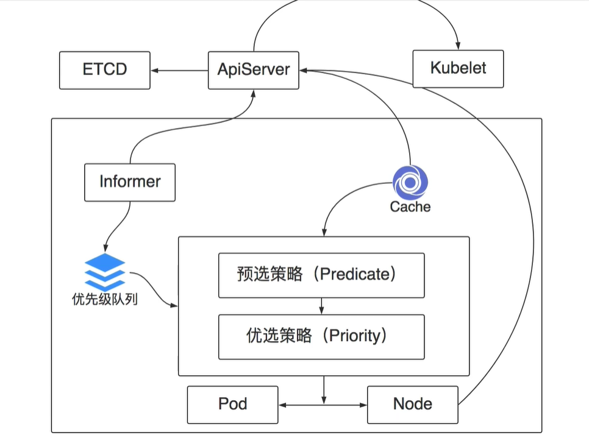
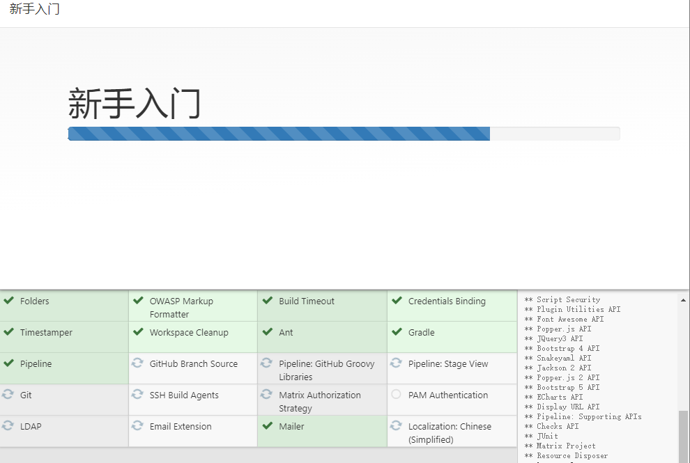

# Kubernetes实践

[返回列表](https://github.com/EmonCodingBackEnd/backend-tutorial)

[TOC]

# 一、Kubeadmin安装K8S V1.20

单点版本：https://blog.csdn.net/Josh_scott/article/details/121961369?utm_medium=distribute.pc_relevant.none-task-blog-2~default~baidujs_title~default-0.pc_relevant_default&spm=1001.2101.3001.4242.1&utm_relevant_index=3


高可用版本：https://blog.csdn.net/qq_16538827/article/details/120175489


Kubeadm是一个K8s部署工具，提供kubeadm init和kubeadm join，用于快速部署Kubernetes集群。

## 1、基础环境准备

### 1.1、服务器规划

| 机器名 | 系统类型  | IP地址          | 内存 | 部署内容 |
| ------ | --------- | --------------- | ---- | -------- |
| emon   | CentOS7.7 | 192.168.200.116 | >=2G | master   |
| emon2  | CentOS7.7 | 192.168.200.117 | >=2G | worker   |
| emon3  | CentOS7.7 | 192.168.200.118 | >=2G | worker   |

### 1.2、系统设置（所有节点）

#### 1.2.1、主机名

主机名必须每个节点都不一样（建议命名规范：数字+字母+中划线组合，不要包含其他特殊字符）。

```bash
# 查看主机名
$ hostname
# 设置主机名：注意修改为具体的主机名
$ hostnamectl set-hostname emon
```

#### 1.2.2、本地DNS

配置host，使得所有节点之间可以通过hostname互相访问。

```bash
$ vim /etc/hosts
```

```bash
192.168.200.116 emon
192.168.200.117 emon2
192.168.200.118 emon3
```

#### 1.2.3、安装依赖包

```bash
# 更新yum
$ yum update -y
# 安装依赖包
$ yum install -y socat conntrack ipvsadm ipset jq sysstat curl iptables libseccomp yum-utils
```

#### 1.2.4、关闭防火墙、重置iptables、关闭swap、关闭selinux和dnsmasq

```bash
# 关闭防火墙
$ systemctl stop firewalld && systemctl disable firewalld

# 设置iptables规则
$ iptables -F && iptables -X && iptables -F -t nat && iptables -X -t nat && iptables -P FORWARD ACCEPT

# 关闭swap
$ swapoff -a
# 去掉swap开机启动
$ sed -i '/swap/s/^\(.*\)$/#\1/g' /etc/fstab

# 关闭selinux
$ setenforce 0
# 防止重启恢复
$ sed -i 's/^SELINUX=enforcing$/SELINUX=disabled/' /etc/selinux/config

# 关闭dnsmasq（否则可能导致docker容器无法解析域名）：如果没有该启动单元，可以忽略！
$ systemctl stop dnsmasq && systemctl disable dnsmasq
```

#### 1.2.5、系统参数设置

```bash
# 制作配置文件
$ cat > /etc/sysctl.d/kubernetes.conf <<EOF
net.bridge.bridge-nf-call-ip6tables = 1
net.bridge.bridge-nf-call-iptables = 1
net.ipv4.ip_nonlocal_bind = 1
net.ipv4.ip_forward = 1
vm.swappiness = 0
vm.overcommit_memory = 1
EOF
# 生效文件
$ sysctl -p /etc/sysctl.d/kubernetes.conf
```

> 如果执行sysctl -p报错：
>
> > sysctl: cannot stat /proc/sys/net/bridge/bridge-nf-call-ip6tables: 没有那个文件或目录
> >
> > sysctl: cannot stat /proc/sys/net/bridge/bridge-nf-call-iptables: 没有那个文件或目录
>
> 临时方案！无需重启！
>
> > modprobe br_netfilter
>
> 永久方案！重启后生效！
>
> > cat > /etc/rc.sysinit << EOF
> > #!/bin/bash
> > for file in /etc/sysconfig/modules/*.modules ; do
> > [ -x $file ] && $file
> > done
> > EOF
> > cat > /etc/sysconfig/modules/br_netfilter.modules << EOF
> > modprobe br_netfilter
> > EOF
> > chmod 755 /etc/sysconfig/modules/br_netfilter.modules
> > lsmod |grep br_netfilter

#### 1.2.6、配置SSH免密登录（仅中转节点）

为了方便文件的copy我们选择一个中转节点（随便一个节点，可以是集群中的也可以是非集群中的），配置好跟其他所有节点的免密登录。这里选择emon节点：

```bash
# 看看是否已经存在rsa公钥
$ cat ~/.ssh/id_rsa.pub

# 如果不存在就创建一个新的
$ ssh-keygen -t rsa

# 把id_rsa.pub文件内容copy到其他机器的授权文件中
$ ssh-copy-id -i ~/.ssh/id_rsa.pub emon
$ ssh-copy-id -i ~/.ssh/id_rsa.pub emon2
$ ssh-copy-id -i ~/.ssh/id_rsa.pub emon3
```

#### 1.2.7、移除docker相关软件包（可选）

```bash
$ yum remove -y docker*
$ rm -f /etc/docker/daemon.json
$ rm -rf /var/lib/docker/
```

## 2、基础安装（所有节点）

### 2.1、安装Docker

[查看官方CentOS安装Docker教程](https://docs.docker.com/engine/install/centos/)

####  2.1.0、删除旧版Docker

```bash
sudo yum remove docker \
                  docker-client \
                  docker-client-latest \
                  docker-common \
                  docker-latest \
                  docker-latest-logrotate \
                  docker-logrotate \
                  docker-engine
# 必要时：清理yum安装的新版本docker
yum remove -y docker* container-selinux
```

如果yum报告说以上安装包未安装，未匹配，未删除任何安装包，活码环境干净，没有历史遗留旧版安装。

#### 2.1.1、CentOS环境下安装Docker

1. 安装需要的软件包，yum-util提供yum-config-manager功能，另外两个是devicemapper驱动依赖的

```shell
$ yum install -y yum-utils device-mapper-persistent-data lvm2
```

2. 设置yum源

```shell
$ yum-config-manager --add-repo https://download.docker.com/linux/centos/docker-ce.repo
```

3. 可以查看所有仓库中所有docker版本，并选择安装特定的版本

```shell
$ yum list docker-ce --showduplicates |sort -r
```

4. 安装docker

```shell
# 安装最新
# $ sudo yum install -y docker-ce
# 安装指定版本
$ yum install -y docker-ce-18.06.3.ce
```

5. 启动

```shell
$ systemctl start docker
```

6. 验证安装

```shell
$ docker version
$ docker info
$ docker run hello-world
```

#### 2.1.2、配置docker加速器

- 阿里云

登录阿里开发者平台： https://promotion.aliyun.com/ntms/act/kubernetes.html#industry

点击【镜像搜索】按钮，自动跳转到控制台的镜像搜索，根据提示注册并登录：

在左侧【镜像工具】中选择【镜像加速器】，右边是生成的加速地址：比如我的：`https://pyk8pf3k.mirror.aliyuncs.com`，执行命令配置上即可：

```bash
# - registry-mirrors：加速器地址
# - graph: 设置docker数据目录：选择比较大的分区（如果这里是根目录就不需要配置了，默认为/var/lib/docker）
# - exec-opts: 设置cgroup driver（默认是cgroupfs，不推荐设置systemd）
# - insecure-registries：设置私服可信地址
tee /etc/docker/daemon.json <<-'EOF'
{
  "registry-mirrors": ["https://pyk8pf3k.mirror.aliyuncs.com"],
  "graph": "/var/lib/docker",
  "exec-opts": ["native.cgroupdriver=cgroupfs"],
  "insecure-registries": ["192.168.32.116:5080"]
}
EOF
```

- 查看

```bash
$ cat /etc/docker/daemon.json 
```

- 重启

```bash
$ systemctl enable docker && systemctl restart docker
```

### 2.2、安装kubeadm/kubelet/kubectl

#### 2.2.1、安装

1. 设置k8s源

```bash
$ cat > /etc/yum.repos.d/kubernetes.repo << EOF
[kubernetes] 
name=Kubernetes
baseurl=https://mirrors.aliyun.com/kubernetes/yum/repos/kubernetes-el7-x86_64 
enabled=1 
gpgcheck=0 
repo_gpgcheck=0 
gpgkey=https://mirrors.aliyun.com/kubernetes/yum/doc/yum-key.gpg https://mirrors.aliyun.com/kubernetes/yum/doc/rpm-package-key.gpg 
EOF
$ yum update
```

2.  安装kubeadm/kubelet/kubectl

```bash
$ yum install -y kubelet-1.20.15 kubeadm-1.20.15 kubectl-1.20.15
# 在 kubeadm init 后 join 命令，kubelet服务会启动，这里不需要手工启动，但需要加入开机启动！！！
$ systemctl enable kubelet
```


## 3、部署Kubernetes Mater（仅master节点）

### 3.1、kubeadm init

```bash
# 在Master上执行，由于默认拉取镜像地址 k8s.gcr.io 国内无法访问，这里指定阿里云镜像仓库地址。
# 执行该步骤之前，也可以执行 kubeadm config images pull 预下载镜像
$ kubeadm init \
--apiserver-advertise-address=192.168.200.116 \
--image-repository registry.aliyuncs.com/google_containers \
--kubernetes-version v1.20.0 \
--service-cidr=10.233.0.0/16 \
--pod-network-cidr=10.200.0.0/16

# 使用 kubectl 工具（Master&&Node节点）
$ mkdir -p $HOME/.kube 
$ sudo cp -i /etc/kubernetes/admin.conf $HOME/.kube/config 
$ sudo chown $(id -u):$(id -g) $HOME/.kube/config

# 【二选一】如果是root用户，可以使用如下配置替换上面：（与上面二选一）
export KUBECONFIG=/etc/kubernetes/admin.conf

# 【临时】无需执行，仅做记录参考
# Then you can join any number of worker nodes by running the following on each as root:
kubeadm join 192.168.200.116:6443 --token jqgqm7.ax7b938u5xheiu6d \
    --discovery-token-ca-cert-hash sha256:882f6812169b4103fcae6065975c3cb231184cd4950301b7fcc5f769ddd265cb
```

### 3.2、安装网络插件-calico（仅master节点）

#### 3.2.1、切换目录

```bash
$ cd
$ mkdir -pv /root/k8s_soft/k8s_v1.20.15 && cd /root/k8s_soft/k8s_v1.20.15
```

这部分我们部署kubernetes的网络查件 CNI。

文档地址：https://docs.projectcalico.org/getting-started/kubernetes/self-managed-onprem/onpremises

#### 3.2.2、下载文件与配置调整

文档中有两个配置，50以下节点和50以上节点，它们的主要区别在于这个：typha。
当节点数比较多的情况下，Calico 的 Felix组件可通过 Typha 直接和 Etcd 进行数据交互，不通过 kube-apiserver，降低kube-apiserver的压力。大家根据自己的实际情况选择下载。
下载后的文件是一个all-in-one的yaml文件，我们只需要在此基础上做少许修改即可。

```bash
# 下载calico.yaml文件
# $ curl https://projectcalico.docs.tigera.io/manifests/calico.yaml -O 会加载最新版本，对K8S版本V1.20.15不再适合。
$ curl https://docs.projectcalico.org/v3.20/manifests/calico.yaml -O
```

修改IP自动发现

> 当kubelet的启动参数中存在--node-ip的时候，以host-network模式启动的pod的status.hostIP字段就会自动填入kubelet中指定的ip地址。

修改前：

```bash
- name: IP
  value: "autodetect"
```

修改后：

```bash
- name: IP
  valueFrom:
    fieldRef:
      fieldPath: status.hostIP
```

修改CIDR

修改前：

```bash
# - name: CALICO_IPV4POOL_CIDR
#   value: "192.168.0.0/16"
```

修改后（修改成你自己的value，我这里是10.200.0.0/16）

```bash
- name: CALICO_IPV4POOL_CIDR
  value: "10.200.0.0/16"
```

#### 3.2.3、执行安装

```bash
# 生效之前查看
$ kubectl get nodes
NAME   STATUS     ROLES                  AGE     VERSION
emon   NotReady   control-plane,master   5m31s   v1.20.15
# 使之生效
$ kubectl apply -f calico.yaml
# 查看node
$ kubectl get nodes
NAME    STATUS     ROLES                  AGE    VERSION
emon    Ready      control-plane,master   7m2s   v1.20.15
# 查看pod
$ kubectl get po -n kube-system
NAME                                       READY   STATUS    RESTARTS   AGE
calico-kube-controllers-577f77cb5c-g78c7   1/1     Running   0          13h
calico-node-hxvx8                          1/1     Running   0          13h
coredns-7f89b7bc75-8ks6f                   1/1     Running   0          14h
coredns-7f89b7bc75-kfdbm                   1/1     Running   0          14h
etcd-emon                                  1/1     Running   0          14h
kube-apiserver-emon                        1/1     Running   0          14h
kube-controller-manager-emon               1/1     Running   0          14h
kube-proxy-f2r8l                           1/1     Running   0          14h
kube-scheduler-emon                        1/1     Running   0          14h

# ===== 等待加入一个worker节点进来之后，再查看下面信息，否则会看到pending，因为找不到合适的节点部署pod =====
# 查看pod信息
$ kubectl get po -n kube-system
NAME                                       READY   STATUS     RESTARTS   AGE
calico-kube-controllers-858c9597c8-ktgcf   0/1     Pending    0          7s
calico-node-4282z                          0/1     Init:0/3   0          7s
coredns-7f89b7bc75-5262d                   0/1     Pending    0          5m30s
coredns-7f89b7bc75-tf6tl                   0/1     Pending    0          5m30s
etcd-emon                                  1/1     Running    0          5m45s
kube-apiserver-emon                        1/1     Running    0          5m45s
kube-controller-manager-emon               1/1     Running    0          5m45s
kube-proxy-vwxmm                           1/1     Running    0          5m30s
kube-scheduler-emon                        1/1     Running    0          5m45s
# ===================================================================================================
# 过几分钟再次查看
$ kubectl get po -n kube-system
NAME                                       READY   STATUS    RESTARTS   AGE
calico-kube-controllers-858c9597c8-ktgcf   1/1     Running   0          6m9s
calico-node-4282z                          1/1     Running   0          6m9s
calico-node-xjwc4                          1/1     Running   0          5m4s
coredns-7f89b7bc75-5262d                   1/1     Running   0          11m
coredns-7f89b7bc75-tf6tl                   1/1     Running   0          11m
etcd-emon                                  1/1     Running   0          11m
kube-apiserver-emon                        1/1     Running   0          11m
kube-controller-manager-emon               1/1     Running   0          11m
kube-proxy-mcwts                           1/1     Running   0          5m4s
kube-proxy-vwxmm                           1/1     Running   0          11m
kube-scheduler-emon                        1/1     Running   0          11m
# 再次查看node
$ kubectl get nodes
NAME    STATUS   ROLES                  AGE     VERSION
emon    Ready    control-plane,master   12m     v1.20.15
emon2   Ready    <none>                 5m21s   v1.20.15
```

### 3.3、加入节点到集群（仅worker节点）

```bash
# 如下是kubeadm init执行成功后，得到的日志
......省略......
[addons] Applied essential addon: CoreDNS
[addons] Applied essential addon: kube-proxy

Your Kubernetes control-plane has initialized successfully!

To start using your cluster, you need to run the following as a regular user:

  mkdir -p $HOME/.kube
  sudo cp -i /etc/kubernetes/admin.conf $HOME/.kube/config
  sudo chown $(id -u):$(id -g) $HOME/.kube/config

Alternatively, if you are the root user, you can run:

  export KUBECONFIG=/etc/kubernetes/admin.conf

You should now deploy a pod network to the cluster.
Run "kubectl apply -f [podnetwork].yaml" with one of the options listed at:
  https://kubernetes.io/docs/concepts/cluster-administration/addons/

Then you can join any number of worker nodes by running the following on each as root:

kubeadm join 192.168.200.116:6443 --token bizkzu.r7xeo57jugvd2ia3 \
    --discovery-token-ca-cert-hash sha256:2ab2809af3d7ea7b684e1dcdea1859b226ec8b9185a82a56344aade4d3000f99
```


## 4、安装ingress-nginx（仅master节点）

### 4.1、切换目录

```bash
$ cd
$ mkdir -pv /root/k8s_soft/k8s_v1.20.15 && cd /root/k8s_soft/k8s_v1.20.15
```

### 4.2、下载文件与配置调整【暂未启用】

```bash
# 下载
curl https://raw.githubusercontent.com/kubernetes/ingress-nginx/controller-v1.3.0/deploy/static/provider/cloud/deploy.yaml -O
```

修改kind模式 Deployment ==> DaemonSet

```yaml
#kind: Deployment 根据ingress-nginx-controller找到该处并修改
kind: DaemonSet
metadata:
  labels:
    app.kubernetes.io/component: controller
    app.kubernetes.io/instance: ingress-nginx
    app.kubernetes.io/name: ingress-nginx
    app.kubernetes.io/part-of: ingress-nginx
    app.kubernetes.io/version: 1.3.0
  name: ingress-nginx-controller
```

第二处修改：增加

```bash
# 找到nginx-ingress-controller这个containers，增加nodeSelector属性
	spec:
      nodeSelector:
        app: ingress
      containers:
      - args:
        - /nginx-ingress-controller
```


### 4.3、安装ingress-nginx

- 安装插件（master节点）

```bash
# 由于mandatory.yaml添加了 nodeSelector，对node进行了label选择，这里必须添加标签，否则：
# Warning  FailedScheduling  6m19s  default-scheduler  0/2 nodes are available: 2 node(s) didn't match Pod's node affinity.
$ kubectl label node emon2 app=ingress

# ===== 镜像下载一直是老大难问题，先下载吧 beg =====【仅worker节点下载镜像即可】
# 查看所需镜像
$ grep image ingress-nginx.yaml
# 手工下载所需镜像：注意第一个镜像本来应该是 k8s.gcr.io/defaultbackend-amd64:1.5
$ docker pull registry.cn-hangzhou.aliyuncs.com/liuyi01/defaultbackend-amd64:1.5
$ docker pull quay.io/kubernetes-ingress-controller/nginx-ingress-controller:0.23.0
# 对第一个镜像重新打标签才能使用
# 下载不可访问的镜像
$ docker tag registry.cn-hangzhou.aliyuncs.com/liuyi01/defaultbackend-amd64:1.5 k8s.gcr.io/defaultbackend-amd64:1.5
# ===== 镜像下载一直是老大难问题，先下载吧 end =====

# 配置资源
$ kubectl apply -f ingress-nginx.yaml
# 查看
$ kubectl get all -n ingress-nginx -o wide
```

### 4.4、测试服务

#### 4.4.1、ingress-demo.yaml配置

```bash
$ vim ingress-demo.yaml
```

```yaml
#deploy
apiVersion: apps/v1
kind: Deployment
metadata:
  name: tomcat-demo
spec:
  selector:
    matchLabels:
      app: tomcat-demo
  replicas: 1
  template:
    metadata:
      labels:
        app: tomcat-demo
    spec:
      containers:
      - name: tomcat-demo
        image: registry.cn-hangzhou.aliyuncs.com/liuyi01/tomcat:8.0.51-alpine
        ports:
        - containerPort: 8080
---
#service
apiVersion: v1
kind: Service
metadata:
  name: tomcat-demo
spec:
  ports:
  - port: 80
    protocol: TCP
    targetPort: 8080
  selector:
    app: tomcat-demo

---
#ingress
#old version: extensions/v1beta1
apiVersion: networking.k8s.io/v1
kind: Ingress
metadata:
  name: tomcat-demo
spec:
  rules:
  - host: tomcat.mooc.com
    http:
      paths:
      - path: /
        pathType: Prefix
        backend:
          service:
            name: tomcat-demo
            port:
              number: 80
```

配置资源生效：

```bash
# 应用资源：仅创建并使用，可调整为 create -> apply  具有使用和创建并使用的效果
$ kubectl create -f ingress-demo.yaml
# 查看发现ingress启动在emon3上
$ kubectl get po -n ingress-nginx -o wide
# 查看ingress-demo的pod状态
$ kubectl get pod -o wide

# 配置本地DNS：访问emon3的DNS
$ vim /etc/hosts
192.168.200.118 tomcat.mooc.com
192.168.200.118 api.mooc.com

# 访问
http://tomcat.mooc.com # 看到正常tomcat界面
http://api.mooc.com # 看到 default backend - 404

# 删除资源
$ kubectl delete -f ingress-demo.yaml
```

#### 4.4.2、ingress-nginx.yaml

```yaml
apiVersion: v1
kind: Namespace
metadata:
  name: ingress-nginx

---

apiVersion: apps/v1
kind: Deployment
metadata:
  name: default-http-backend
  labels:
    app.kubernetes.io/name: default-http-backend
    app.kubernetes.io/part-of: ingress-nginx
  namespace: ingress-nginx
spec:
  replicas: 1
  selector:
    matchLabels:
      app.kubernetes.io/name: default-http-backend
      app.kubernetes.io/part-of: ingress-nginx
  template:
    metadata:
      labels:
        app.kubernetes.io/name: default-http-backend
        app.kubernetes.io/part-of: ingress-nginx
    spec:
      terminationGracePeriodSeconds: 60
      containers:
        - name: default-http-backend
          # Any image is permissible as long as:
          # 1. It serves a 404 page at /
          # 2. It serves 200 on a /healthz endpoint
          image: k8s.gcr.io/defaultbackend-amd64:1.5
          livenessProbe:
            httpGet:
              path: /healthz
              port: 8080
              scheme: HTTP
            initialDelaySeconds: 30
            timeoutSeconds: 5
          ports:
            - containerPort: 8080
          resources:
            limits:
              cpu: 10m
              memory: 20Mi
            requests:
              cpu: 10m
              memory: 20Mi

---
apiVersion: v1
kind: Service
metadata:
  name: default-http-backend
  namespace: ingress-nginx
  labels:
    app.kubernetes.io/name: default-http-backend
    app.kubernetes.io/part-of: ingress-nginx
spec:
  ports:
    - port: 80
      targetPort: 8080
  selector:
    app.kubernetes.io/name: default-http-backend
    app.kubernetes.io/part-of: ingress-nginx

---

kind: ConfigMap
apiVersion: v1
metadata:
  name: nginx-configuration
  namespace: ingress-nginx
  labels:
    app.kubernetes.io/name: ingress-nginx
    app.kubernetes.io/part-of: ingress-nginx

---

kind: ConfigMap
apiVersion: v1
metadata:
  name: tcp-services
  namespace: ingress-nginx
  labels:
    app.kubernetes.io/name: ingress-nginx
    app.kubernetes.io/part-of: ingress-nginx

---

kind: ConfigMap
apiVersion: v1
metadata:
  name: udp-services
  namespace: ingress-nginx
  labels:
    app.kubernetes.io/name: ingress-nginx
    app.kubernetes.io/part-of: ingress-nginx

---

apiVersion: v1
kind: ServiceAccount
metadata:
  name: nginx-ingress-serviceaccount
  namespace: ingress-nginx
  labels:
    app.kubernetes.io/name: ingress-nginx
    app.kubernetes.io/part-of: ingress-nginx

---
apiVersion: rbac.authorization.k8s.io/v1
kind: ClusterRole
metadata:
  name: nginx-ingress-clusterrole
  labels:
    app.kubernetes.io/name: ingress-nginx
    app.kubernetes.io/part-of: ingress-nginx
rules:
  - apiGroups:
      - ""
    resources:
      - configmaps
      - endpoints
      - nodes
      - pods
      - secrets
    verbs:
      - list
      - watch
  - apiGroups:
      - ""
    resources:
      - nodes
    verbs:
      - get
  - apiGroups:
      - ""
    resources:
      - services
    verbs:
      - get
      - list
      - watch
  - apiGroups:
      - "extensions"
    resources:
      - ingresses
    verbs:
      - get
      - list
      - watch
  - apiGroups:
      - ""
    resources:
      - events
    verbs:
      - create
      - patch
  - apiGroups:
      - "extensions"
    resources:
      - ingresses/status
    verbs:
      - update

---
apiVersion: rbac.authorization.k8s.io/v1
kind: Role
metadata:
  name: nginx-ingress-role
  namespace: ingress-nginx
  labels:
    app.kubernetes.io/name: ingress-nginx
    app.kubernetes.io/part-of: ingress-nginx
rules:
  - apiGroups:
      - ""
    resources:
      - configmaps
      - pods
      - secrets
      - namespaces
    verbs:
      - get
  - apiGroups:
      - ""
    resources:
      - configmaps
    resourceNames:
      # Defaults to "<election-id>-<ingress-class>"
      # Here: "<ingress-controller-leader>-<nginx>"
      # This has to be adapted if you change either parameter
      # when launching the nginx-ingress-controller.
      - "ingress-controller-leader-nginx"
    verbs:
      - get
      - update
  - apiGroups:
      - ""
    resources:
      - configmaps
    verbs:
      - create
  - apiGroups:
      - ""
    resources:
      - endpoints
    verbs:
      - get

---
apiVersion: rbac.authorization.k8s.io/v1
kind: RoleBinding
metadata:
  name: nginx-ingress-role-nisa-binding
  namespace: ingress-nginx
  labels:
    app.kubernetes.io/name: ingress-nginx
    app.kubernetes.io/part-of: ingress-nginx
roleRef:
  apiGroup: rbac.authorization.k8s.io
  kind: Role
  name: nginx-ingress-role
subjects:
  - kind: ServiceAccount
    name: nginx-ingress-serviceaccount
    namespace: ingress-nginx

---
apiVersion: rbac.authorization.k8s.io/v1
kind: ClusterRoleBinding
metadata:
  name: nginx-ingress-clusterrole-nisa-binding
  labels:
    app.kubernetes.io/name: ingress-nginx
    app.kubernetes.io/part-of: ingress-nginx
roleRef:
  apiGroup: rbac.authorization.k8s.io
  kind: ClusterRole
  name: nginx-ingress-clusterrole
subjects:
  - kind: ServiceAccount
    name: nginx-ingress-serviceaccount
    namespace: ingress-nginx

---

apiVersion: apps/v1
# 第一处：调整 Deployment ==> DaemonSet
kind: DaemonSet
metadata:
  name: nginx-ingress-controller
  namespace: ingress-nginx
  labels:
    app.kubernetes.io/name: ingress-nginx
    app.kubernetes.io/part-of: ingress-nginx
spec:
  selector:
    matchLabels:
      app.kubernetes.io/name: ingress-nginx
      app.kubernetes.io/part-of: ingress-nginx
  template:
    metadata:
      labels:
        app.kubernetes.io/name: ingress-nginx
        app.kubernetes.io/part-of: ingress-nginx
      annotations:
        prometheus.io/port: "10254"
        prometheus.io/scrape: "true"
    spec:
      serviceAccountName: nginx-ingress-serviceaccount
      hostNetwork: true
      nodeSelector:
        app: ingress
      containers:
        - name: nginx-ingress-controller
          # 第二处：调整 0.19.0 ==> 0.23.0
          image: quay.io/kubernetes-ingress-controller/nginx-ingress-controller:0.23.0
          args:
            - /nginx-ingress-controller
            - --default-backend-service=$(POD_NAMESPACE)/default-http-backend
            - --configmap=$(POD_NAMESPACE)/nginx-configuration
            - --tcp-services-configmap=$(POD_NAMESPACE)/tcp-services
            - --udp-services-configmap=$(POD_NAMESPACE)/udp-services
            - --publish-service=$(POD_NAMESPACE)/ingress-nginx
            - --annotations-prefix=nginx.ingress.kubernetes.io
          securityContext:
            capabilities:
              drop:
                - ALL
              add:
                - NET_BIND_SERVICE
            # www-data -> 33
            runAsUser: 33
          env:
            - name: POD_NAME
              valueFrom:
                fieldRef:
                  fieldPath: metadata.name
            - name: POD_NAMESPACE
              valueFrom:
                fieldRef:
                  fieldPath: metadata.namespace
          ports:
            - name: http
              containerPort: 80
            - name: https
              containerPort: 443
          livenessProbe:
            failureThreshold: 3
            httpGet:
              path: /healthz
              port: 10254
              scheme: HTTP
            initialDelaySeconds: 10
            periodSeconds: 10
            successThreshold: 1
            timeoutSeconds: 1
          readinessProbe:
            failureThreshold: 3
            httpGet:
              path: /healthz
              port: 10254
              scheme: HTTP
            periodSeconds: 10
            successThreshold: 1
            timeoutSeconds: 1

---
```

## 5、集群冒烟测试（在主节点emon操作）

### 5.0、网络环境切换后k8s网络不通小妙招

```bash
# 如果发现冒烟测试不通，再尝试
$ systemctl restart NetworkManager
```

### 5.1、创建nginx ds

```bash
 # 写入配置
$ cat > nginx-ds.yml <<EOF
apiVersion: v1
kind: Service
metadata:
  name: nginx-ds
  labels:
    app: nginx-ds
spec:
  type: NodePort
  selector:
    app: nginx-ds
  ports:
  - name: http
    port: 80
    targetPort: 80
---
apiVersion: apps/v1
kind: DaemonSet
metadata:
  name: nginx-ds
spec:
  selector:
    matchLabels:
      app: nginx-ds
  template:
    metadata:
      labels:
        app: nginx-ds
    spec:
      containers:
      - name: my-nginx
        image: nginx:1.19
        ports:
        - containerPort: 80
EOF

# 创建ds
$ kubectl apply -f nginx-ds.yml
```

### 5.2、检查各种ip连通性

```bash
# 检查各 Node 上的 Pod IP 连通性
$ kubectl get pods -o wide

# 在每个worker节点上ping pod ip
$ ping <pod-ip>

# 检查service可达性
$ kubectl get svc

# 在每个worker节点上访问服务
$ curl <service-ip>:<port>

# 在每个节点检查node-port可用性
$ curl <node-ip>:<port>
```

### 5.3、检查dns可用性

```bash
# 创建一个nginx pod
$ cat > pod-nginx.yaml <<EOF
apiVersion: v1
kind: Pod
metadata:
  name: nginx
spec:
  containers:
  - name: nginx
    image: docker.io/library/nginx:1.19
    ports:
    - containerPort: 80
EOF

# 创建pod
$ kubectl apply -f pod-nginx.yaml

# 进入pod，查看dns
$ kubectl exec nginx -it -- /bin/bash

# 查看dns配置
root@nginx:/# cat /etc/resolv.conf

# 查看名字是否可以正确解析
root@nginx:/# curl nginx-ds

# 退出测试
root@nginx:/# exit
```

### 5..4、日志功能

测试使用kubectl查看pod的容器日志

```bash
$ kubectl get pods
# 命令行输出结果
NAME             READY   STATUS    RESTARTS   AGE
nginx            1/1     Running   0          54s
nginx-ds-dkfjm   1/1     Running   0          2m54s
nginx-ds-rx6mj   1/1     Running   0          2m54s

# 查看日志
$ kubectl logs <pod-name>
```

### 5.5、Exec功能

测试kubectl的exec功能

```bash
# 查询指定标签的pod
$ kubectl get pods -l app=nginx-ds
$ kubectl exec -it <nginx-pod-name> -- nginx -v
```

### 5.6、删除配置的测试资源

```bash
$ kubectl delete -f pod-nginx.yaml
$ kubectl delete -f nginx-ds.yml
# 查看是否清理完成
$ kubectl get pods
# 命令行输出结果
No resources found in default namespace.
```

## 6、Harbor镜像私服（在emon主机root用户安装）

### 6.1、安装docker-compose

1：下载

```bash
$ curl -L "https://github.com/docker/compose/releases/download/1.29.2/docker-compose-$(uname -s)-$(uname -m)" -o /usr/local/bin/docker-compose
```

2：添加可执行权限

```bash
$ chmod +x /usr/local/bin/docker-compose
# 创建软连，避免安装Harbor时报错：? Need to install docker-compose(1.18.0+) by yourself first and run this script again.
$ ln -snf /usr/local/bin/docker-compose /usr/bin/docker-compose
```

33：测试

```bash
$ docker-compose --version
# 命令行输出结果
docker-compose version 1.29.2, build 5becea4c
```

### 6.2、安装Harbor镜像私服

Harbor镜像私服（在emon主机root用户安装）

0. 切换目录

```bash
$ cd
$ mkdir -pv /root/k8s_soft/k8s_v1.20.15 && cd /root/k8s_soft/k8s_v1.20.15
```

1. 下载地址

https://github.com/goharbor/harbor/releases

```bash
$ wget https://github.com/goharbor/harbor/releases/download/v2.2.4/harbor-offline-installer-v2.2.4.tgz
```

2. 创建解压目录

```bash
# 创建Harbor解压目录
$ mkdir /usr/local/Harbor
# 创建Harbor的volume目录
$ mkdir -p /usr/local/dockerv/harbor_home
```

3. 解压

```bash
# 推荐v2.2.4版本，更高版本比如2.3和2.4有docker-compose down -v ==> down-compose up -d时postgresql服务启动不了的bug，数据库重启失败！
$ tar -zxvf harbor-offline-installer-v2.2.4.tgz -C /usr/local/Harbor/
$ ls /usr/local/Harbor/harbor
common.sh  harbor.v2.2.4.tar.gz  harbor.yml.tmpl  install.sh  LICENSE  prepare
```

4. 创建自签名证书【参考实现，建议走正规渠道的CA证书】【缺少证书无法浏览器登录】

- 创建证书存放目录

```bash
# 切换目录
$ mkdir /usr/local/Harbor/cert && cd /usr/local/Harbor/cert
```

- 创建CA根证书

```bash
# 其中C是Country，ST是State，L是local，O是Origanization，OU是Organization Unit，CN是common name(eg, your name or your server's hostname)
$ openssl req -newkey rsa:4096 -nodes -sha256 -keyout ca.key -x509 -days 3650 -out ca.crt \
-subj "/C=CN/ST=ZheJiang/L=HangZhou/O=HangZhou emon Technologies,Inc./OU=IT emon/CN=emon"
# 查看结果
$ ls
ca.crt  ca.key
```

- 生成一个证书签名，设置访问域名为 emon

```bash
$ openssl req -newkey rsa:4096 -nodes -sha256 -keyout emon.key -out emon.csr \
-subj "/C=CN/ST=ZheJiang/L=HangZhou/O=HangZhou emon Technologies,Inc./OU=IT emon/CN=emon"
# 查看结果
$ ls
ca.crt  ca.key  emon.csr  emon.key
```

- 生成主机的证书

```bash
$ openssl x509 -req -days 3650 -in emon.csr -CA ca.crt -CAkey ca.key -CAcreateserial -out emon.crt
# 查看结果
$ ls
ca.crt  ca.key  ca.srl  emon.crt  emon.csr  emon.key
```

5. 编辑配置

```bash
$ cp /usr/local/Harbor/harbor/harbor.yml.tmpl /usr/local/Harbor/harbor/harbor.yml
$ vim /usr/local/Harbor/harbor/harbor.yml
```

```yaml
# 修改
# hostname: reg.mydomain.com
hostname: 192.168.200.116
# 修改
  # port: 80
  port: 5080
# 修改
https:
  # https port for harbor, default is 443
  port: 5443
  # The path of cert and key files for nginx
  # certificate: /your/certificate/path
  # private_key: /your/private/key/path
  # 修改：注意，这里不能使用软连接目录 /usr/loca/harbor替换/usr/local/Harbor/harbor-2.2.4
  # 否则会发生证书找不到错误：FileNotFoundError: [Errno 2] No such file or directory: 
  certificate: /usr/local/Harbor/cert/emon.crt
  private_key: /usr/local/Harbor/cert/emon.key
# 修改
# data_volume: /data
data_volume: /usr/local/dockerv/harbor_home
```

6. 安装

```bash
# 安装时，确保 /usr/bin/docker-compose 存在，否则会报错：? Need to install docker-compose(1.18.0+) by yourself first and run this script again.
$ /usr/local/Harbor/harbor/install.sh --with-chartmuseum --with-trivy
# 切换目录
$  cd /usr/local/Harbor/harbor/
# 查看服务状态
$ docker-compose ps
# 命令行输出结果
      Name                     Command                  State                           Ports                     
------------------------------------------------------------------------------------------------------------------
chartmuseum         ./docker-entrypoint.sh           Up (healthy)                                                 
harbor-core         /harbor/entrypoint.sh            Up (healthy)                                                 
harbor-db           /docker-entrypoint.sh 96 13      Up (healthy)                                                 
harbor-jobservice   /harbor/entrypoint.sh            Up (healthy)                                                 
harbor-log          /bin/sh -c /usr/local/bin/ ...   Up (healthy)   127.0.0.1:1514->10514/tcp                     
harbor-portal       nginx -g daemon off;             Up (healthy)                                                 
nginx               nginx -g daemon off;             Up (healthy)   0.0.0.0:5080->8080/tcp, 0.0.0.0:5443->8443/tcp
redis               redis-server /etc/redis.conf     Up (healthy)                                                 
registry            /home/harbor/entrypoint.sh       Up (healthy)                                                 
registryctl         /home/harbor/start.sh            Up (healthy)                                                 
trivy-adapter       /home/scanner/entrypoint.sh      Up (healthy)
```

8. 登录

访问：http://192.168.200.116:5080 （会被跳转到http://192.168.200.116:5443）

用户名密码： admin/Harbor12345

harbor数据库密码： root123

登录后创建了用户：emon/Emon@123

登录后创建了命名空间：devops-learning 并将emon用户用于该命名空间

9. 修改配置重启

```bash
$ cd /usr/local/Harbor/harbor/
$ docker-compose down -v
# 如果碰到 postgresql 服务不是UP状态，导致登录提示：核心服务不可用。 请执行下面命令（根据data_volume配置调整路径），这个是该版本的bug。目前，v2.2.4版本可以正确重启，无需删除pg13
# [emon@emon harbor]$ sudo rm -rf /usr/local/dockerv/harbor_home/database/pg13
$ docker-compose up -d
```

10. 私服安全控制

- 对文件 `/etc/docker/daemon.json` 追加 `insecure-registries`内容：

```bash
$ vim /etc/docker/daemon.json
```

```bash
{
  "registry-mirrors": ["https://pyk8pf3k.mirror.aliyuncs.com"],
  "graph": "/usr/local/lib/docker",
  "exec-opts": ["native.cgroupdriver=cgroupfs"],
  "insecure-registries": ["192.168.200.116:5080"]
}
```

- 对文件 `/lib/systemd/system/docker.service` 追加`EnvironmentFile`：【可省略】

```bash
$ vim /lib/systemd/system/docker.service 
```

```bash
# 在ExecStart后面一行追加：经验证daemon.json配置了insecure-registries即可，无需这里再配置
EnvironmentFile=-/etc/docker/daemon.json
```

重启Docker服务：

```bash
$ systemctl daemon-reload
$ systemctl restart docker
```

10. 推送镜像

登录harbor后，先创建devops-learning项目，并创建emon用户。

```bash
# 下载
$ docker pull openjdk:8-jre
# 打标签
$ docker tag openjdk:8-jre 192.168.200.116:5080/devops-learning/openjdk:8-jre
# 登录
$ docker login -u emon -p Emon@123 192.168.200.116:5080
# 上传镜像
$ docker push 192.168.200.116:5080/devops-learning/openjdk:8-jre
# 退出登录
$ docker logout 192.168.200.116:5080

机器人账户：
token：  
XsttKM4zpuFWcchUmEhJErmiRRRfBu0A
```

# 二、使用Kubespray部署Kubernetes生产集群

## 1、服务器规划

| 机器名 | 系统类型  | IP地址          | 内存 | 部署内容 |
| ------ | --------- | --------------- | ---- | -------- |
| emon   | CentOS7.7 | 192.168.200.116 | >=2G | master   |
| emon2  | CentOS7.7 | 192.168.200.117 | >=2G | worker   |
| emon3  | CentOS7.7 | 192.168.200.118 | >=2G | worker   |

## 2、系统设置（所有节点）

> 注意：以下命令在root权限下执行；切换到root用户或者提升权限：```sudo -i```

### 2.1、主机名

主机名必须每个节点都不一样（建议命名规范：数字+字母+中划线组合，不要包含其他特殊字符）。

```bash
# 查看主机名
hostname
# 设置主机名：注意修改为具体的主机名
hostnamectl set-hostname emon
```

### 2.2、本地DNS

配置host，使得所有节点之间可以通过hostname互相访问。

```bash
vim /etc/hosts
```

```bash
192.168.200.116 emon
192.168.200.117 emon2
192.168.200.118 emon3
```

### 2.3、安装依赖包

```bash
# 更新yum
yum update
# 安装依赖包
yum install -y conntrack ipvsadm ipset jq sysstat curl iptables libseccomp
```

### 2.4、关闭防火墙、重置iptables、关闭swap、关闭selinux和dnsmasq

```bash
# 关闭防火墙
systemctl stop firewalld && sudo systemctl disable firewalld

# 重置iptables
iptables -F && iptables -X && iptables -F -t nat && iptables -X -t nat && iptables -P FORWARD ACCEPT

# 关闭swap
swapoff -a
# 去掉swap开机启动
sed -i '/swap/s/^\(.*\)$/#\1/g' /etc/fstab

# 关闭selinux
setenforce 0
# 防止重启恢复
sed -i 's/^SELINUX=enforcing$/SELINUX=disabled/' /etc/selinux/config

# 关闭dnsmasq（否则可能导致docker容器无法解析域名）：如果没有该启动单元，可以忽略！
systemctl stop dnsmasq && systemctl disable dnsmasq
```

### 2.5、系统参数设置

```bash
# 制作配置文件
cat > /etc/sysctl.d/kubernetes.conf <<EOF
net.bridge.bridge-nf-call-iptables=1
net.bridge.bridge-nf-call-ip6tables=1
net.ipv4.ip_nonlocal_bind=1
net.ipv4.ip_forward=1
vm.swappiness=0
vm.overcommit_memory=1
vm.panic_on_oom=0
fs.inotify.max_user_watches=89100
EOF
# 生效文件
sysctl -p /etc/sysctl.d/kubernetes.conf
```

> 如果执行sysctl -p报错：
>
> > sysctl: cannot stat /proc/sys/net/bridge/bridge-nf-call-ip6tables: 没有那个文件或目录
> >
> > sysctl: cannot stat /proc/sys/net/bridge/bridge-nf-call-iptables: 没有那个文件或目录
>
> 临时方案！无需重启！
>
> > modprobe br_netfilter
>
> 永久方案！重启后生效！
>
> > cat > /etc/rc.sysinit << EOF
> > #!/bin/bash
> > for file in /etc/sysconfig/modules/*.modules ; do
> > [ -x $file ] && $file
> > done
> > EOF
> > cat > /etc/sysconfig/modules/br_netfilter.modules << EOF
> > modprobe br_netfilter
> > EOF
> > chmod 755 /etc/sysconfig/modules/br_netfilter.modules
> > lsmod |grep br_netfilter

### 2.6、移除docker相关软件包（可选）

```bash
yum remove -y docker*
rm -f /etc/docker/daemon.json
rm -rf /var/lib/docker/
```

## 3、使用kubespray部署集群

这部分只需要在一个 **操作** 节点执行，可以是集群中的一个节点，也可以是集群之外的节点。甚至可以是你自己的笔记本电脑。我们这里使用更普遍的集群中的任意一个linux节点。

### 3.1、SSH免密登录

注意：这里是root用户！

```bash
# 看看是否已经存在rsa公钥
$ cat ~/.ssh/id_rsa.pub

# 如果不存在就创建一个新的
$ ssh-keygen -t rsa

# 把id_rsa.pub文件内容copy到其他机器的授权文件中
$ ssh-copy-id -i ~/.ssh/id_rsa.pub emon
$ ssh-copy-id -i ~/.ssh/id_rsa.pub emon2
$ ssh-copy-id -i ~/.ssh/id_rsa.pub emon3
```

### 3.2、依赖软件下载、安装

```bash
# 安装基础软件：这一步参见python编译安装，安装后自带pip
# 安装基础软件
$ yum install -y epel-release python36 python36-pip git
# 下载kubespray源码
$ wget https://github.com/kubernetes-sigs/kubespray/archive/v2.15.0.tar.gz
# 解压缩
$ tar -xvf v2.15.0.tar.gz && cd kubespray-2.15.0
# 安装requirements
$ cat requirements.txt
$ pip3.6 install -r requirements.txt

## 如果install遇到问题可以先尝试升级pip
$ pip3.6 install --upgrade pip
```

### 3.3、生成配置

项目中有一个目录是集群的基础配置，示例配置在目录inventory/sample中，我们复制一份出来作为自己集群的配置。

```bash
# copy一份demo配置，准备自定义
cp -rpf inventory/sample inventory/mycluster
```

由于kubespray给我们准备了py脚本，可以直接根据环境变量自动生成配置文件，所以我们现在只需要设定好环境变量就可以拉！

```bash
# 使用真实的hostname（否则会自动把你的hostname改成node1/node2...这种哦）
export USE_REAL_HOSTNAME=true
# 指定配置文件位置
export CONFIG_FILE=inventory/mycluster/hosts.yaml
# 定义ip列表（你的服务器内网ip地址列表，3台及以上，前两台默认为master节点）
declare -a IPS=(192.168.200.116 192.168.200.117 192.168.200.118)
# 生成配置文件
python3 contrib/inventory_builder/inventory.py ${IPS[@]}
```

### 3.4、个性化配置

配置文件都生成好了，虽然可以直接用，但并不能完全满足大家的个性化需求，比如用docker还是containerd？docker的工作目录是否用默认的/var/lib/docker？等等。当然默认的情况kubespray还会到google的官方仓库下载镜像、二进制文件，这个就需要你的服务器可以上外面的网，想上外网也需要修改一些配置。

```bash
# 定制化配置文件
# 1. 节点组织配置（这里可以调整每个节点的角色）
vim inventory/mycluster/hosts.yaml
# 2. containerd配置（教程使用containerd作为容器引擎）
vim inventory/mycluster/group_vars/all/containerd.yml
# 3. 全局配置（可以在这配置http(s)代理实现外网访问）
vim inventory/mycluster/group_vars/all/all.yml
# 4. k8s集群配置（包括设置容器运行时、svc网段、pod网段等）
vim inventory/mycluster/group_vars/k8s-cluster/k8s-cluster.yml
# 5. 修改etcd部署类型为host（默认是docker）
vim inventory/mycluster/group_vars/etcd.yml
# 6. 附加组件（ingress、dashboard等）
vim inventory/mycluster/group_vars/k8s-cluster/addons.yml
```

- `vim inventory/mycluster/group_vars/all/all.yml`

```bash
# [新增]
http_proxy: "http://192.168.200.116:8118"
# [新增]
https_proxy: "http://192.168.200.116:8118"
```

- `vim inventory/mycluster/group_vars/k8s_cluster/k8s-cluster.yml`

```yaml
# [修改]
kube_service_addresses: 10.200.0.0/16
# [修改]
kube_pods_subnet: 10.233.0.0/16
# [不变]
container_manager: docker
```

- `vim inventory/mycluster/group_vars/k8s-cluster/addons.yml`

```yaml
# [新增]
dashboard_enabled: true
# [修改]
ingress_nginx_enabled: true
```

### 3.5、一键部署

配置文件都调整好了后，就可以开始一键部署啦，不过部署过程不出意外会非常慢。

- 一键部署

```bash
# -vvvv会打印最详细的日志信息，建议开启
$ ansible-playbook -i inventory/mycluster/hosts.yaml  -b cluster.yml -vvvv
```

### 3.6、清理代理设置

清理代理设置（运行时不再需要代理，删掉代理配置即可）

##### 删除docker的http代理（在每个节点执行）

```bash
$ rm -f /etc/systemd/system/containerd.service.d/http-proxy.conf
$ systemctl daemon-reload
$ systemctl restart containerd
```

##### 删除yum代理

```bash
# 把grep出来的代理配置手动删除即可
$ grep 8118 -r /etc/yum*
```

# 三、kubernetes-the-hard-way

> 注意：以下命令在root权限下执行；切换到root用户或者提升权限：```sudo -i```

## 主要特性

- 学习: 依照github知名项目kubernetes-the-hard-way的流程，全部手动部署，深入了解集群各个组件
- 生产级高可用: 在kubernetes-the-hard-way基础上增加了各个组件的高可用方案，满足生产集群要求
- 99年永久证书，不用为证书过期烦恼
- 不依赖ansible等第三方工具
- 高可用不依赖haproxy、keepalived，采用本地代理的方式，简单优雅

## 如果是你

- 如果你想深入学习kubernetes
- 如果你喜欢二进制的运维方式
- 如果你正在部署生产环境的kubernetes

## 部署文档

## 1、基础环境准备

### 1.1、服务器规划

| 机器名 | 系统类型  | IP地址          | 内存 | 部署内容       |
| ------ | --------- | --------------- | ---- | -------------- |
| emon   | CentOS7.7 | 192.168.200.116 | >=2G | master         |
| emon2  | CentOS7.7 | 192.168.200.117 | >=2G | master、worker |
| emon3  | CentOS7.7 | 192.168.200.118 | >=2G | worker         |

### 1.2、系统设置（所有节点）

#### 1.2.1、主机名

主机名必须每个节点都不一样（建议命名规范：数字+字母+中划线组合，不要包含其他特殊字符）。

```bash
# 查看主机名
$ hostname
# 设置主机名：注意修改为具体的主机名
$ hostnamectl set-hostname emon
```

#### 1.2.2、本地DNS

配置host，使得所有节点之间可以通过hostname互相访问。

```bash
$ vim /etc/hosts
```

```bash
192.168.200.116 emon
192.168.200.117 emon2
192.168.200.118 emon3
```

#### 1.2.3、安装依赖包

```bash
# 更新yum
$ yum update -y
# 安装依赖包
$ yum install -y socat conntrack ipvsadm ipset jq sysstat curl iptables libseccomp yum-utils
```

#### 1.2.4、关闭防火墙、重置iptables、关闭swap、关闭selinux和dnsmasq

```bash
# 关闭防火墙
$ systemctl stop firewalld && systemctl disable firewalld

# 设置iptables规则
$ iptables -F && iptables -X && iptables -F -t nat && iptables -X -t nat && iptables -P FORWARD ACCEPT

# 关闭swap
$ swapoff -a
# 去掉swap开机启动
$ sed -i '/swap/s/^\(.*\)$/#\1/g' /etc/fstab

# 关闭selinux
$ setenforce 0
# 防止重启恢复
$ sed -i 's/^SELINUX=enforcing$/SELINUX=disabled/' /etc/selinux/config

# 关闭dnsmasq（否则可能导致docker容器无法解析域名）：如果没有该启动单元，可以忽略！
$ systemctl stop dnsmasq && systemctl disable dnsmasq
```

#### 1.2.5、系统参数设置

```bash
# 制作配置文件
$ cat > /etc/sysctl.d/kubernetes.conf <<EOF
net.bridge.bridge-nf-call-ip6tables = 1
net.bridge.bridge-nf-call-iptables = 1
net.ipv4.ip_nonlocal_bind = 1
net.ipv4.ip_forward = 1
vm.swappiness = 0
vm.overcommit_memory = 1
EOF
# 生效文件
$ sysctl -p /etc/sysctl.d/kubernetes.conf
```

> 如果执行sysctl -p报错：
>
> > sysctl: cannot stat /proc/sys/net/bridge/bridge-nf-call-ip6tables: 没有那个文件或目录
> >
> > sysctl: cannot stat /proc/sys/net/bridge/bridge-nf-call-iptables: 没有那个文件或目录
>
> 临时方案！无需重启！
>
> > modprobe br_netfilter
>
> 永久方案！重启后生效！
>
> > cat > /etc/rc.sysinit << EOF
> > #!/bin/bash
> > for file in /etc/sysconfig/modules/*.modules ; do
> > [ -x $file ] && $file
> > done
> > EOF
> > cat > /etc/sysconfig/modules/br_netfilter.modules << EOF
> > modprobe br_netfilter
> > EOF
> > chmod 755 /etc/sysconfig/modules/br_netfilter.modules
> > lsmod |grep br_netfilter

#### 1.2.6、配置SSH免密登录（仅中转节点）

为了方便文件的copy我们选择一个中转节点（随便一个节点，可以是集群中的也可以是非集群中的），配置好跟其他所有节点的免密登录。这里选择emon节点：

```bash
# 看看是否已经存在rsa公钥
$ cat ~/.ssh/id_rsa.pub

# 如果不存在就创建一个新的
$ ssh-keygen -t rsa

# 把id_rsa.pub文件内容copy到其他机器的授权文件中
$ ssh-copy-id -i ~/.ssh/id_rsa.pub emon
$ ssh-copy-id -i ~/.ssh/id_rsa.pub emon2
$ ssh-copy-id -i ~/.ssh/id_rsa.pub emon3
```

#### 1.2.7、移除docker相关软件包（可选）

```bash
$ yum remove -y docker*
$ rm -f /etc/docker/daemon.json
$ rm -rf /var/lib/docker/
```

### 1.3、准备k8s软件包（仅master节点emon）

#### 1.3.0、切换目录

```bash
$ cd
$ mkdir -pv k8s_soft/k8s_v1.20.2 && cd k8s_soft/k8s_v1.20.2
```

#### 1.3.1、软件包下载

在任意一个节点下载好压缩包后，复制到所有节点即可

master节点组件：kube-apiserver、kube-controller-manager、kube-scheduler、kubectl

worker节点组件：kubelet、kube-proxy

```bash
# 设定版本号
$ export VERSION=v1.20.2

# 下载master节点组件
$ wget https://storage.googleapis.com/kubernetes-release/release/${VERSION}/bin/linux/amd64/kube-apiserver
$ wget https://storage.googleapis.com/kubernetes-release/release/${VERSION}/bin/linux/amd64/kube-controller-manager
$ wget https://storage.googleapis.com/kubernetes-release/release/${VERSION}/bin/linux/amd64/kube-scheduler
$ wget https://storage.googleapis.com/kubernetes-release/release/${VERSION}/bin/linux/amd64/kubectl

# 下载worker节点组件
$ wget https://storage.googleapis.com/kubernetes-release/release/${VERSION}/bin/linux/amd64/kube-proxy
$ wget https://storage.googleapis.com/kubernetes-release/release/${VERSION}/bin/linux/amd64/kubelet

# =================================================================================================
# 下载etcd组件
$ export VERSION=v3.4.10
$ wget https://github.com/etcd-io/etcd/releases/download/${VERSION}/etcd-${VERSION}-linux-amd64.tar.gz
$ tar -zxvf etcd-${VERSION}-linux-amd64.tar.gz -C .
$ mv etcd-${VERSION}-linux-amd64/etcd* .
$ rm -rf etcd-${VERSION}-linux-amd64

# =================================================================================================
# 统一修改文件权限为可执行
$ chmod +x kube*

# 下载
$ wget https://github.com/cloudflare/cfssl/releases/download/v1.6.1/cfssl_1.6.1_linux_amd64
$ wget https://github.com/cloudflare/cfssl/releases/download/v1.6.1/cfssljson_1.6.1_linux_amd64

# 修改为可执行权限
$ chmod +x cfssl_1.6.1_linux_amd64 cfssljson_1.6.1_linux_amd64

# =================================================================================================
# 设定containerd的版本号
$ VERSION=1.4.3
# 下载压缩包
$ wget https://github.com/containerd/containerd/releases/download/v${VERSION}/cri-containerd-cni-${VERSION}-linux-amd64.tar.gz
```

#### 1.3.2、软件包分发

完成下载后，分发文件，将每个节点需要的文件scp过去

```bash
# 把master相关组件分发到master节点
$ MASTERS=(emon emon2)
for instance in ${MASTERS[@]}; do
  scp kube-apiserver kube-controller-manager kube-scheduler kubectl root@${instance}:/usr/local/bin/
done

# 把worker先关组件分发到worker节点
$ WORKERS=(emon2 emon3)
for instance in ${WORKERS[@]}; do
  scp kubelet kube-proxy root@${instance}:/usr/local/bin/
done

# 把etcd组件分发到etcd节点
$ ETCDS=(emon emon2 emon3)
for instance in ${ETCDS[@]}; do
  scp etcd etcdctl etcdutl root@${instance}:/usr/local/bin/
done
```


## 2、生成证书（仅中转节点）

如下操作，都在`/root/k8s_soft/k8s_v1.20.2`目录执行。

### 2.0、安装cfssl

- 安装cfssl

cfssl是非常好用的CA工具，我们用它来生成证书和秘钥文件 安装过程比较简单，如下：

```bash
# 加入可执行目录
$ cp cfssl_1.6.1_linux_amd64 /usr/local/bin/cfssl
$ cp cfssljson_1.6.1_linux_amd64 /usr/local/bin/cfssljson

# 验证
$ cfssl version
# 命令行输出结果
Version: 1.6.1
Runtime: go1.12.12
```

### 2.1、根证书

根证书是集群所有节点共享的，只需要创建一个 CA 证书，后续创建的所有证书都由它签名。
在任意节点（可以免密登录到其他节点）创建一个单独的证书目录，如：`mkdir pki && cd pki`

#### 根证书配置文件

```json
$ cat > ca-config.json <<EOF
{
  "signing": {
    "default": {
      "expiry": "876000h"
    },
    "profiles": {
      "kubernetes": {
        "usages": ["signing", "key encipherment", "server auth", "client auth"],
        "expiry": "876000h"
      }
    }
  }
}
EOF

$ cat > ca-csr.json <<EOF
{
  "CN": "Kubernetes",
  "key": {
    "algo": "rsa",
    "size": 2048
  },
  "names": [
    {
      "C": "US",
      "L": "Portland",
      "O": "Kubernetes",
      "OU": "CA",
      "ST": "Oregon"
    }
  ]
}
EOF
```

#### 生成证书和私钥

```bash
# 生成证书和私钥
$ cfssl gencert -initca ca-csr.json | cfssljson -bare ca
# 生成完成后会有以下文件（我们最终想要的就是ca-key.pem和ca.pem，一个秘钥，一个证书）
$ ls ca*
ca-config.json  ca.csr  ca-csr.json  ca-key.pem  ca.pem
```

### 2.2、admin客户端证书

#### admin客户端证书配置文件

```bash
$ cat > admin-csr.json <<EOF
{
  "CN": "admin",
  "key": {
    "algo": "rsa",
    "size": 2048
  },
  "names": [
    {
      "C": "CN",
      "ST": "BeiJing",
      "L": "BeiJing",
      "O": "system:masters",
      "OU": "seven"
    }
  ]
}
EOF
```

#### 生成admin客户端证书和私钥

```bash
$ cfssl gencert \
  -ca=ca.pem \
  -ca-key=ca-key.pem \
  -config=ca-config.json \
  -profile=kubernetes \
  admin-csr.json | cfssljson -bare admin

# 查看
$ ls admin*
admin.csr  admin-csr.json  admin-key.pem  admin.pem
```

### 2.3、kubelet客户端证书

Kubernetes使用一种称为Node Authorizer的专用授权模式来授权Kubelets发出的API请求。 Kubelet使用将其标识为system:nodes组中的凭据，其用户名为system：node:nodeName，接下里就给每个工作节点生成证书。

#### 生成kubelet客户端证书和私钥

```bash
# 设置你的worker节点列表
$ WORKERS=(emon2 emon3)
$ WORKER_IPS=(192.168.200.117 192.168.200.118)
# 生成所有worker节点的证书配置
$ for ((i=0;i<${#WORKERS[@]};i++)); do
cat > ${WORKERS[$i]}-csr.json <<EOF
{
  "CN": "system:node:${WORKERS[$i]}",
  "key": {
    "algo": "rsa",
    "size": 2048
  },
  "names": [
    {
      "C": "CN",
      "L": "Beijing",
      "O": "system:nodes",
      "OU": "seven",
      "ST": "Beijing"
    }
  ]
}
EOF
cfssl gencert \
  -ca=ca.pem \
  -ca-key=ca-key.pem \
  -config=ca-config.json \
  -hostname=${WORKERS[$i]},${WORKER_IPS[$i]} \
  -profile=kubernetes \
  ${WORKERS[$i]}-csr.json | cfssljson -bare ${WORKERS[$i]}
done

# 查看
$ ls emon*
emon2.csr  emon2-csr.json  emon2-key.pem  emon2.pem  emon3.csr  emon3-csr.json  emon3-key.pem  emon3.pem
```

### 2.4、kube-controller-manager客户端证书

#### kube-controller-manager客户端证书配置文件

```bash
$ cat > kube-controller-manager-csr.json <<EOF
{
    "CN": "system:kube-controller-manager",
    "key": {
        "algo": "rsa",
        "size": 2048
    },
    "names": [
      {
        "C": "CN",
        "ST": "BeiJing",
        "L": "BeiJing",
        "O": "system:kube-controller-manager",
        "OU": "seven"
      }
    ]
}
EOF
```

#### 生成kube-controller-manager客户端证书

```bash
$ cfssl gencert \
  -ca=ca.pem \
  -ca-key=ca-key.pem \
  -config=ca-config.json \
  -profile=kubernetes \
  kube-controller-manager-csr.json | cfssljson -bare kube-controller-manager
  
# 查看
$ ls -1 kube-controller-manager*
kube-controller-manager
kube-controller-manager.csr
kube-controller-manager-csr.json
kube-controller-manager-key.pem
kube-controller-manager.pem
```

### 2.5、kube-proxy客户端证书

#### kube-proxy客户端证书配置文件

```bash
$ cat > kube-proxy-csr.json <<EOF
{
  "CN": "system:kube-proxy",
  "key": {
    "algo": "rsa",
    "size": 2048
  },
  "names": [
    {
      "C": "CN",
      "ST": "BeiJing",
      "L": "BeiJing",
      "O": "k8s",
      "OU": "seven"
    }
  ]
}
EOF
```

#### 生成kube-proxy客户端证书

```bash
$ cfssl gencert \
  -ca=ca.pem \
  -ca-key=ca-key.pem \
  -config=ca-config.json \
  -profile=kubernetes \
  kube-proxy-csr.json | cfssljson -bare kube-proxy
# 查看  
$ ls -1 kube-proxy*
kube-proxy
kube-proxy.csr
kube-proxy-csr.json
kube-proxy-key.pem
kube-proxy.pem
```

### 2.6、kube-scheduler客户端证书

#### kube-scheduler客户端证书配置文件

```bash
$ cat > kube-scheduler-csr.json <<EOF
{
    "CN": "system:kube-scheduler",
    "key": {
        "algo": "rsa",
        "size": 2048
    },
    "names": [
      {
        "C": "CN",
        "ST": "BeiJing",
        "L": "BeiJing",
        "O": "system:kube-scheduler",
        "OU": "seven"
      }
    ]
}
EOF
```

#### 生成kube-scheduler客户端证书

```bash
$ cfssl gencert \
  -ca=ca.pem \
  -ca-key=ca-key.pem \
  -config=ca-config.json \
  -profile=kubernetes \
  kube-scheduler-csr.json | cfssljson -bare kube-scheduler
# 查看
ls -1 kube-scheduler*
kube-scheduler
kube-scheduler.csr
kube-scheduler-csr.json
kube-scheduler-key.pem
kube-scheduler.pem
```

### 2.7、kube-apiserver服务端证书

#### kube-apiserver服务端证书配置文件

```bash
$ cat > kubernetes-csr.json <<EOF
{
  "CN": "kubernetes",
  "key": {
    "algo": "rsa",
    "size": 2048
  },
  "names": [
    {
      "C": "CN",
      "ST": "BeiJing",
      "L": "BeiJing",
      "O": "k8s",
      "OU": "seven"
    }
  ]
}
EOF
```

#### 生成kube-apiserver服务端证书

服务端证书与客户端略有不同，客户端需要通过一个名字或者一个ip去访问服务端，所以证书必须要包含客户端所访问的名字或ip，用以客户端验证。

```bash
# apiserver的service ip地址（一般是svc网段的第一个ip）
$ KUBERNETES_SVC_IP=10.233.0.1
# 所有的master内网ip，逗号分隔（云环境可以加上master公网ip以便支持公网ip访问）：虽然118不是master，但未来可能是
$ MASTER_IPS=192.168.200.116,192.168.200.117,192.168.200.118
# 生成证书
$ cfssl gencert \
  -ca=ca.pem \
  -ca-key=ca-key.pem \
  -config=ca-config.json \
  -hostname=${KUBERNETES_SVC_IP},${MASTER_IPS},127.0.0.1,kubernetes,kubernetes.default,kubernetes.default.svc,kubernetes.default.svc.cluster,kubernetes.svc.cluster.local \
  -profile=kubernetes \
  kubernetes-csr.json | cfssljson -bare kubernetes
# 查看
$ ls -1 kubernetes*
kubernetes.csr
kubernetes-csr.json
kubernetes-key.pem
kubernetes.pem
```

### 2.8、Service Account证书

#### 配置文件

```bash
$ cat > service-account-csr.json <<EOF
{
  "CN": "service-accounts",
  "key": {
    "algo": "rsa",
    "size": 2048
  },
  "names": [
    {
      "C": "CN",
      "ST": "BeiJing",
      "L": "BeiJing",
      "O": "k8s",
      "OU": "seven"
    }
  ]
}
EOF
```

#### 生成证书

```bash
$ cfssl gencert \
  -ca=ca.pem \
  -ca-key=ca-key.pem \
  -config=ca-config.json \
  -profile=kubernetes \
  service-account-csr.json | cfssljson -bare service-account
# 查看
$ ls -1 service-account*
service-account.csr
service-account-csr.json
service-account-key.pem
service-account.pem
```

### 2.9、proxy-client证书

#### 配置文件

```bash
$ cat > proxy-client-csr.json <<EOF
{
  "CN": "aggregator",
  "key": {
    "algo": "rsa",
    "size": 2048
  },
  "names": [
    {
      "C": "CN",
      "ST": "BeiJing",
      "L": "BeiJing",
      "O": "k8s",
      "OU": "seven"
    }
  ]
}
EOF
```

#### 生成证书

```bash
$ cfssl gencert \
  -ca=ca.pem \
  -ca-key=ca-key.pem \
  -config=ca-config.json \
  -profile=kubernetes \
  proxy-client-csr.json | cfssljson -bare proxy-client
# 查看
$ ls -1 proxy-client*
proxy-client.csr
proxy-client-csr.json
proxy-client-key.pem
proxy-client.pem
```

### 2.10、分发客户端、服务端证书

#### 分发worker节点需要的证书和私钥

```bash
$ WORKERS=(emon2 emon3)
for instance in ${WORKERS[@]}; do
  scp ca.pem ${instance}-key.pem ${instance}.pem root@${instance}:~/
done
```

#### 分发master节点需要的证书和私钥

> 注意：由于下面分发的证书即包含了etcd的证书也包含了k8s主节点的证书。 所以 MASTER_IPS 中必须包含所有 `master` 节点以及 `etcd` 节点。如果没有包含所有etcd节点的证书，需要重新定义，逗号分隔

```bash
$ MASTER_IPS=192.168.200.116,192.168.200.117,192.168.200.118
OIFS=$IFS
IFS=','
for instance in ${MASTER_IPS}; do
  scp ca.pem ca-key.pem kubernetes-key.pem kubernetes.pem \
    service-account-key.pem service-account.pem proxy-client.pem proxy-client-key.pem root@${instance}:~/
done
IFS=$OIFS
```

## 3、kubernetes各组件的认证配置（仅中转节点）

>  当前位置：emon主机

kubernetes的认证配置文件，也叫kubeconfigs，用于让kubernetes的客户端定位kube-apiserver并通过apiserver的安全认证。

接下来我们一起来生成各个组件的kubeconfigs，包括controller-manager，kubelet，kube-proxy，scheduler，以及admin用户。

以下命令需要与上一节“生成证书”在同一个目录下执行。

### 3.0、切换目录

```bash
$ cd
$ mkdir -pv k8s_soft/k8s_v1.20.2 && cd k8s_soft/k8s_v1.20.2
```

### 3.1、kubelet

```bash
# 指定你的worker列表（hostname），空格分隔
$ WORKERS="emon2 emon3"
$ for instance in ${WORKERS}; do
  kubectl config set-cluster kubernetes \
    --certificate-authority=ca.pem \
    --embed-certs=true \
    --server=https://127.0.0.1:6443 \
    --kubeconfig=${instance}.kubeconfig

  kubectl config set-credentials system:node:${instance} \
    --client-certificate=${instance}.pem \
    --client-key=${instance}-key.pem \
    --embed-certs=true \
    --kubeconfig=${instance}.kubeconfig

  kubectl config set-context default \
    --cluster=kubernetes \
    --user=system:node:${instance} \
    --kubeconfig=${instance}.kubeconfig

  kubectl config use-context default --kubeconfig=${instance}.kubeconfig
done
# 查看
$ ls -1tr|tail -n 2
emon2.kubeconfig
emon3.kubeconfig
```

### 3.2、kube-proxy

```bash
kubectl config set-cluster kubernetes \
    --certificate-authority=ca.pem \
    --embed-certs=true \
    --server=https://127.0.0.1:6443 \
    --kubeconfig=kube-proxy.kubeconfig

kubectl config set-credentials system:kube-proxy \
   --client-certificate=kube-proxy.pem \
   --client-key=kube-proxy-key.pem \
   --embed-certs=true \
   --kubeconfig=kube-proxy.kubeconfig

kubectl config set-context default \
   --cluster=kubernetes \
   --user=system:kube-proxy \
   --kubeconfig=kube-proxy.kubeconfig

kubectl config use-context default --kubeconfig=kube-proxy.kubeconfig
# 查看
$ ls -1tr|tail -n 1
kube-proxy.kubeconfig
```

### 3.3、kube-controller-manager

```bash
kubectl config set-cluster kubernetes \
  --certificate-authority=ca.pem \
  --embed-certs=true \
  --server=https://127.0.0.1:6443 \
  --kubeconfig=kube-controller-manager.kubeconfig

kubectl config set-credentials system:kube-controller-manager \
  --client-certificate=kube-controller-manager.pem \
  --client-key=kube-controller-manager-key.pem \
  --embed-certs=true \
  --kubeconfig=kube-controller-manager.kubeconfig

kubectl config set-context default \
  --cluster=kubernetes \
  --user=system:kube-controller-manager \
  --kubeconfig=kube-controller-manager.kubeconfig

kubectl config use-context default --kubeconfig=kube-controller-manager.kubeconfig
# 查看
$ ls -1tr|tail -n 1
kube-controller-manager.kubeconfig
```

### 3.4、kube-scheduler

```bash
kubectl config set-cluster kubernetes \
  --certificate-authority=ca.pem \
  --embed-certs=true \
  --server=https://127.0.0.1:6443 \
  --kubeconfig=kube-scheduler.kubeconfig

kubectl config set-credentials system:kube-scheduler \
  --client-certificate=kube-scheduler.pem \
  --client-key=kube-scheduler-key.pem \
  --embed-certs=true \
  --kubeconfig=kube-scheduler.kubeconfig

kubectl config set-context default \
  --cluster=kubernetes \
  --user=system:kube-scheduler \
  --kubeconfig=kube-scheduler.kubeconfig

kubectl config use-context default --kubeconfig=kube-scheduler.kubeconfig
# 查看
ls -1tr|tail -n 1
kube-scheduler.kubeconfig
```

### 3.5、admin用户配置

为admin用户生成kubeconfig配置

```bash
kubectl config set-cluster kubernetes \
  --certificate-authority=ca.pem \
  --embed-certs=true \
  --server=https://127.0.0.1:6443 \
  --kubeconfig=admin.kubeconfig

kubectl config set-credentials admin \
  --client-certificate=admin.pem \
  --client-key=admin-key.pem \
  --embed-certs=true \
  --kubeconfig=admin.kubeconfig

kubectl config set-context default \
  --cluster=kubernetes \
  --user=admin \
  --kubeconfig=admin.kubeconfig

kubectl config use-context default --kubeconfig=admin.kubeconfig
# 查看
$ ls -1tr|tail -n 1
admin.kubeconfig
```

### 3.6、分发配置文件

#### 3.6.1、把kubelet和kube-proxy需要的kubeconfig配置分发到每个worker节点

```bash
$ WORKERS="emon2 emon3"
for instance in ${WORKERS}; do
    scp ${instance}.kubeconfig kube-proxy.kubeconfig ${instance}:~/
done
```

#### 3.6.2、把kube-controller-manager和kube-scheduler需要的kubeconfig配置分发到master节点

```bash
$ MASTERS="emon emon2"
for instance in ${MASTERS}; do
    scp admin.kubeconfig kube-controller-manager.kubeconfig kube-scheduler.kubeconfig ${instance}:~/
done
```

## 4、部署ETCD集群（所有节点）

Kubernetes组件是无状态的，并在etcd中存储集群状态。 在本小节中，我们将部署三个节点的etcd群集，并对其进行配置以实现高可用性和安全的远程访问。

### 4.0、切换目录

```bash
$ cd
```

### 4.1、配置etcd

- copy必要的证书文件

```bash
$ mkdir -p /etc/etcd /var/lib/etcd
$ chmod 700 /var/lib/etcd
$ cp ca.pem kubernetes-key.pem kubernetes.pem /etc/etcd/
```

- 配置etcd.service文件

```bash
$ ETCD_NAME=$(hostname -s)
$ ETCD_IP=192.168.200.116 # IP地址替换为具体节点IP地址
# etcd所有节点的ip地址
$ ETCD_NAMES=(emon emon2 emon3)
$ ETCD_IPS=(192.168.200.116 192.168.200.117 192.168.200.118)
$ cat <<EOF > /etc/systemd/system/etcd.service
[Unit]
Description=etcd
Documentation=https://github.com/coreos

[Service]
Type=notify
ExecStart=/usr/local/bin/etcd \\
  --name ${ETCD_NAME} \\
  --cert-file=/etc/etcd/kubernetes.pem \\
  --key-file=/etc/etcd/kubernetes-key.pem \\
  --peer-cert-file=/etc/etcd/kubernetes.pem \\
  --peer-key-file=/etc/etcd/kubernetes-key.pem \\
  --trusted-ca-file=/etc/etcd/ca.pem \\
  --peer-trusted-ca-file=/etc/etcd/ca.pem \\
  --peer-client-cert-auth \\
  --client-cert-auth \\
  --initial-advertise-peer-urls https://${ETCD_IP}:2380 \\
  --listen-peer-urls https://${ETCD_IP}:2380 \\
  --listen-client-urls https://${ETCD_IP}:2379,https://127.0.0.1:2379 \\
  --advertise-client-urls https://${ETCD_IP}:2379 \\
  --initial-cluster-token etcd-cluster-0 \\
  --initial-cluster ${ETCD_NAMES[0]}=https://${ETCD_IPS[0]}:2380,${ETCD_NAMES[1]}=https://${ETCD_IPS[1]}:2380,${ETCD_NAMES[2]}=https://${ETCD_IPS[2]}:2380 \\
  --initial-cluster-state new \\
  --data-dir=/var/lib/etcd
Restart=on-failure
RestartSec=5

[Install]
WantedBy=multi-user.target
EOF
```

### 4.2、启动etcd集群

所有etcd节点都配置好etcd.service后，启动etcd集群

```bash
# 注意：碰到卡主不要怕，所有节点都执行如下命令后，就连通了；卡是为了等待其他节点加入
$ systemctl daemon-reload && systemctl enable etcd && systemctl restart etcd
```

### 4.3、验证etcd集群

```bash
$ ETCDCTL_API=3 etcdctl member list \
  --endpoints=https://127.0.0.1:2379 \
  --cacert=/etc/etcd/ca.pem \
  --cert=/etc/etcd/kubernetes.pem \
  --key=/etc/etcd/kubernetes-key.pem
# 命令行输出结果
3bae6ef756268744, started, emon2, https://192.168.200.117:2380, https://192.168.200.117:2379, false
48fd167b46c04497, started, emon3, https://192.168.200.118:2380, https://192.168.200.118:2379, false
7d04ddf76c096e96, started, emon, https://192.168.200.116:2380, https://192.168.200.116:2379, false
```


## 5、部署kubernetes控制平面（所有master节点）

这部分我们部署kubernetes的控制平面，每个组件有多个点保证高可用。实例中我们在两个节点上部署 API Server、Scheduler 和 Controller Manager。当然你也可以按照教程部署三个节点的高可用，操作都是一致的。

> 下面的所有命令都是运行在每个master节点的，我们的实例中是 emon 和 emon2

性和安全的远程访问。

### 5.0、切换目录

```bash
$ cd
```

### 5.1、配置API Server

```bash
# 创建kubernetes必要目录
$ mkdir -p /etc/kubernetes/ssl
# 准备证书文件
$ cp ca.pem ca-key.pem kubernetes-key.pem kubernetes.pem \
    service-account-key.pem service-account.pem \
    proxy-client.pem proxy-client-key.pem \
    /etc/kubernetes/ssl/

# 配置kube-apiserver.service
# 本机内网ip
$ IP=192.168.200.116 # IP地址替换为具体节点IP地址
# apiserver实例数
$ APISERVER_COUNT=2
# etcd节点
$ ETCD_ENDPOINTS=(192.168.200.116 192.168.200.117 192.168.200.118)
# 创建 apiserver service
$ cat <<EOF > /etc/systemd/system/kube-apiserver.service
[Unit]
Description=Kubernetes API Server
Documentation=https://github.com/kubernetes/kubernetes

[Service]
ExecStart=/usr/local/bin/kube-apiserver \\
  --advertise-address=${IP} \\
  --allow-privileged=true \\
  --apiserver-count=${APISERVER_COUNT} \\
  --audit-log-maxage=30 \\
  --audit-log-maxbackup=3 \\
  --audit-log-maxsize=100 \\
  --audit-log-path=/var/log/audit.log \\
  --authorization-mode=Node,RBAC \\
  --bind-address=0.0.0.0 \\
  --client-ca-file=/etc/kubernetes/ssl/ca.pem \\
  --enable-admission-plugins=NamespaceLifecycle,NodeRestriction,LimitRanger,ServiceAccount,DefaultStorageClass,ResourceQuota \\
  --etcd-cafile=/etc/kubernetes/ssl/ca.pem \\
  --etcd-certfile=/etc/kubernetes/ssl/kubernetes.pem \\
  --etcd-keyfile=/etc/kubernetes/ssl/kubernetes-key.pem \\
  --etcd-servers=https://${ETCD_ENDPOINTS[0]}:2379,https://${ETCD_ENDPOINTS[1]}:2379,https://${ETCD_ENDPOINTS[2]}:2379 \\
  --event-ttl=1h \\
  --kubelet-certificate-authority=/etc/kubernetes/ssl/ca.pem \\
  --kubelet-client-certificate=/etc/kubernetes/ssl/kubernetes.pem \\
  --kubelet-client-key=/etc/kubernetes/ssl/kubernetes-key.pem \\
  --service-account-issuer=api \\
  --service-account-key-file=/etc/kubernetes/ssl/service-account.pem \\
  --service-account-signing-key-file=/etc/kubernetes/ssl/service-account-key.pem \\
  --api-audiences=api,vault,factors \\
  --service-cluster-ip-range=10.233.0.0/16 \\
  --service-node-port-range=30000-32767 \\
  --proxy-client-cert-file=/etc/kubernetes/ssl/proxy-client.pem \\
  --proxy-client-key-file=/etc/kubernetes/ssl/proxy-client-key.pem \\
  --runtime-config=api/all=true \\
  --requestheader-client-ca-file=/etc/kubernetes/ssl/ca.pem \\
  --requestheader-allowed-names=aggregator \\
  --requestheader-extra-headers-prefix=X-Remote-Extra- \\
  --requestheader-group-headers=X-Remote-Group \\
  --requestheader-username-headers=X-Remote-User \\
  --tls-cert-file=/etc/kubernetes/ssl/kubernetes.pem \\
  --tls-private-key-file=/etc/kubernetes/ssl/kubernetes-key.pem \\
  --v=1
Restart=on-failure
RestartSec=5

[Install]
WantedBy=multi-user.target
EOF
```


### 5.2、配置kube-controller-manager

```bash
# 准备kubeconfig配置文件
$ cp kube-controller-manager.kubeconfig /etc/kubernetes/

# 创建 kube-controller-manager.service
$ cat <<EOF > /etc/systemd/system/kube-controller-manager.service
[Unit]
Description=Kubernetes Controller Manager
Documentation=https://github.com/kubernetes/kubernetes

[Service]
ExecStart=/usr/local/bin/kube-controller-manager \\
  --bind-address=0.0.0.0 \\
  --cluster-cidr=10.200.0.0/16 \\
  --cluster-name=kubernetes \\
  --cluster-signing-cert-file=/etc/kubernetes/ssl/ca.pem \\
  --cluster-signing-key-file=/etc/kubernetes/ssl/ca-key.pem \\
  --cluster-signing-duration=876000h0m0s \\
  --kubeconfig=/etc/kubernetes/kube-controller-manager.kubeconfig \\
  --leader-elect=true \\
  --root-ca-file=/etc/kubernetes/ssl/ca.pem \\
  --service-account-private-key-file=/etc/kubernetes/ssl/service-account-key.pem \\
  --service-cluster-ip-range=10.233.0.0/16 \\
  --use-service-account-credentials=true \\
  --v=1
Restart=on-failure
RestartSec=5

[Install]
WantedBy=multi-user.target
EOF
```

### 5.3、配置kube-scheduler

```bash
# 准备kubeconfig配置文件
$ cp kube-scheduler.kubeconfig /etc/kubernetes/

# 创建 scheduler service 文件
$ cat <<EOF > /etc/systemd/system/kube-scheduler.service
[Unit]
Description=Kubernetes Scheduler
Documentation=https://github.com/kubernetes/kubernetes

[Service]
ExecStart=/usr/local/bin/kube-scheduler \\
  --authentication-kubeconfig=/etc/kubernetes/kube-scheduler.kubeconfig \\
  --authorization-kubeconfig=/etc/kubernetes/kube-scheduler.kubeconfig \\
  --kubeconfig=/etc/kubernetes/kube-scheduler.kubeconfig \\
  --leader-elect=true \\
  --bind-address=0.0.0.0 \\
  --port=0 \\
  --v=1
Restart=on-failure
RestartSec=5

[Install]
WantedBy=multi-user.target
EOF
```

### 5.4、启动服务

```bash
$ systemctl daemon-reload && systemctl enable kube-apiserver kube-controller-manager kube-scheduler
$ systemctl restart kube-apiserver kube-controller-manager kube-scheduler
```

### 5.5、服务验证

端口验证

```bash
# 各个组件的监听端口
$ netstat -tnlp
Active Internet connections (only servers)
Proto Recv-Q Send-Q Local Address           Foreign Address         State       PID/Program name    
tcp        0      0 127.0.0.1:25            0.0.0.0:*               LISTEN      17094/master        
tcp        0      0 192.168.200.116:2379    0.0.0.0:*               LISTEN      61298/etcd          
tcp        0      0 127.0.0.1:2379          0.0.0.0:*               LISTEN      61298/etcd          
tcp        0      0 192.168.200.116:2380    0.0.0.0:*               LISTEN      61298/etcd          
tcp        0      0 0.0.0.0:22              0.0.0.0:*               LISTEN      9808/sshd           
tcp6       0      0 ::1:25                  :::*                    LISTEN      17094/master        
tcp6       0      0 :::6443                 :::*                    LISTEN      61426/kube-apiserve 
tcp6       0      0 :::10252                :::*                    LISTEN      61444/kube-controll 
tcp6       0      0 :::10257                :::*                    LISTEN      61444/kube-controll 
tcp6       0      0 :::10259                :::*                    LISTEN      61457/kube-schedule 
tcp6       0      0 :::22                   :::*                    LISTEN      9808/sshd 
```


系统日志验证

```bash
# 查看系统日志是否有组件的错误日志
$ journalctl -f
```

### 5.6、配置kubectl（emon这个master节点即可）

kubectl是用来管理kubernetes集群的客户端工具，前面我们已经下载到了所有的master节点。下面我们来配置这个工具，让它可以使用。

```bash
# 创建kubectl的配置目录
$ mkdir ~/.kube/
# 把管理员的配置文件移动到kubectl的默认目录
$ cp ~/admin.kubeconfig ~/.kube/config
# 测试
$ kubectl get nodes
# 命令行输出结果：目前，正常！
No resources found
```

在执行 kubectl exec、run、logs 等命令时，apiserver 会转发到 kubelet。这里定义 RBAC 规则，授权 apiserver 调用 kubelet API。

```bash
$ kubectl create clusterrolebinding kube-apiserver:kubelet-apis --clusterrole=system:kubelet-api-admin --user kubernetes
```


## 6、部署kubernetes工作节点（所有worker节点）

这部分我们部署kubernetes的工作节点。实例中我们有两个工作节点，一个是独立的工作节点，一个是跟master在一起的节点。
在每个节点上我们会部署kubelet、kube-proxy、container runtime、cni、nginx-proxy

### 6.0、切换目录（仅中转节点）

```bash
$ cd
$ mkdir -pv k8s_soft/k8s_v1.20.2 && cd k8s_soft/k8s_v1.20.2
```

### 6.1、Container Runtime - Containerd

#### 6.1.1、软件包下载（仅中转节点）

```bash
# 设定containerd的版本号，分发到两个work节点
$ VERSION=1.4.3
WORKERS="emon2 emon3"
for instance in ${WORKERS}; do
    scp cri-containerd-cni-${VERSION}-linux-amd64.tar.gz ${instance}:~/
done
```

#### 6.1.2、整理压缩文件

下载后的文件是一个tar.gz，是一个allinone的包，包括了runc、circtl、ctr、containerd等容器运行时以及cni相关的文件，解压缩到一个独立的目录中

```bash
$ VERSION=1.4.3
# 创建解压目录
$ mkdir containerd
# 解压缩
$ tar -zxvf cri-containerd-cni-${VERSION}-linux-amd64.tar.gz -C containerd
# 复制需要的文件
$ cp containerd/etc/crictl.yaml /etc/
$ cp containerd/etc/systemd/system/containerd.service /etc/systemd/system/
$ cp -r containerd/usr /
```

#### 6.1.3、containerd配置文件

```bash
$ mkdir -p /etc/containerd
# 默认配置生成配置文件
$ containerd config default > /etc/containerd/config.toml

# 定制化配置（可选）
# 创建镜像目录
$ mkdir /usr/local/lib/containerd
$ vi /etc/containerd/config.toml
```

修改默认镜像目录（非必须）【忽略】

```bash
# 调整config.toml配置
root = "/var/lib/containerd" ==> root = "/usr/local/lib/containerd"
```

#### 6.1.4、启动containerd

```bash
$ systemctl enable containerd && systemctl restart containerd
# 检查状态
$ systemctl status containerd
```

#### 6.1.5、配置镜像加速器（已验证）

https://help.aliyun.com/document_detail/60750.html

```bash
# 备份源文件 
$ cp /etc/containerd/config.toml /etc/containerd/config.toml.bak
# 修改配置文件：搜索 registry，调整如下
$ vim /etc/containerd/config.toml
```

```toml
    [plugins."io.containerd.grpc.v1.cri".registry]
      [plugins."io.containerd.grpc.v1.cri".registry.mirrors]
        [plugins."io.containerd.grpc.v1.cri".registry.mirrors."docker.io"]
          #endpoint = ["https://registry-1.docker.io"]
          endpoint = ["https://pyk8pf3k.mirror.aliyuncs.com"]
        [plugins."io.containerd.grpc.v1.cri".registry.mirrors."192.168.200.116:5080"]
          endpoint = ["https://192.168.200.116:5443"]
      [plugins."io.containerd.grpc.v1.cri".registry.configs]
        [plugins."io.containerd.grpc.v1.cri".registry.configs."192.168.200.116:5443".tls]
          insecure_skip_verify = true
        [plugins."io.containerd.grpc.v1.cri".registry.configs."192.168.200.116:5443".auth]
          username = "admin"
          password = "Harbor12345"
```

- 重启k8s使配置生效

```bash
systemctl restart containerd
```


### 6.2、配置kubelet

#### 准备kubelet配置

```bash
$ mkdir -p /etc/kubernetes/ssl/
$ cp ${HOSTNAME}-key.pem ${HOSTNAME}.pem ca.pem ca-key.pem /etc/kubernetes/ssl/
$ cp ${HOSTNAME}.kubeconfig /etc/kubernetes/kubeconfig
$ IP=192.168.200.117 # IP地址替换为具体节点IP地址
# 写入kubelet配置文件
$ cat <<EOF > /etc/kubernetes/kubelet-config.yaml
kind: KubeletConfiguration
apiVersion: kubelet.config.k8s.io/v1beta1
authentication:
  anonymous:
    enabled: false
  webhook:
    enabled: true
  x509:
    clientCAFile: "/etc/kubernetes/ssl/ca.pem"
authorization:
  mode: Webhook
clusterDomain: "cluster.local"
clusterDNS:
  - "169.254.25.10"
podCIDR: "10.200.0.0/16"
address: ${IP}
readOnlyPort: 0
staticPodPath: /etc/kubernetes/manifests
healthzPort: 10248
healthzBindAddress: 127.0.0.1
kubeletCgroups: /systemd/system.slice
resolvConf: "/etc/resolv.conf"
runtimeRequestTimeout: "15m"
kubeReserved:
  cpu: 200m
  memory: 512M
tlsCertFile: "/etc/kubernetes/ssl/${HOSTNAME}.pem"
tlsPrivateKeyFile: "/etc/kubernetes/ssl/${HOSTNAME}-key.pem"
EOF
```

#### 配置kubelet服务

```bash
$ cat <<EOF > /etc/systemd/system/kubelet.service
[Unit]
Description=Kubernetes Kubelet
Documentation=https://github.com/kubernetes/kubernetes
After=containerd.service
Requires=containerd.service

[Service]
ExecStart=/usr/local/bin/kubelet \\
  --config=/etc/kubernetes/kubelet-config.yaml \\
  --container-runtime=remote \\
  --container-runtime-endpoint=unix:///var/run/containerd/containerd.sock \\
  --image-pull-progress-deadline=2m \\
  --kubeconfig=/etc/kubernetes/kubeconfig \\
  --network-plugin=cni \\
  --node-ip=${IP} \\
  --register-node=true \\
  --v=2
Restart=on-failure
RestartSec=5

[Install]
WantedBy=multi-user.target
EOF
```


### 6.3、配置nginx-proxy（仅在没有apiserver的节点部署：这里emon3）

nginx-proxy是一个用于worker节点访问apiserver的一个代理，是apiserver一个优雅的高可用方案，它使用kubelet的staticpod方式启动，让每个节点都可以均衡的访问到每个apiserver服务，优雅的替代了通过虚拟ip访问apiserver的方式。

> Tips: nginx-proxy 只需要在没有 apiserver 的节点部署哦~

#### 6.3.1、nginx配置文件

```bash
$ mkdir -p /etc/nginx
# master ip列表
$ MASTER_IPS=(192.168.200.116 192.168.200.117)
# 执行前请先copy一份，并修改好upstream的 'server' 部分配置
$ cat <<EOF > /etc/nginx/nginx.conf
error_log stderr notice;

worker_processes 2;
worker_rlimit_nofile 130048;
worker_shutdown_timeout 10s;

events {
  multi_accept on;
  use epoll;
  worker_connections 16384;
}

stream {
  upstream kube_apiserver {
    least_conn;
    # 如果有多个master，依次配置即可
    server ${MASTER_IPS[0]}:6443;
    server ${MASTER_IPS[1]}:6443;
  }

  server {
    listen        127.0.0.1:6443;
    proxy_pass    kube_apiserver;
    proxy_timeout 10m;
    proxy_connect_timeout 1s;
  }
}

http {
  aio threads;
  aio_write on;
  tcp_nopush on;
  tcp_nodelay on;

  keepalive_timeout 5m;
  keepalive_requests 100;
  reset_timedout_connection on;
  server_tokens off;
  autoindex off;

  server {
    listen 8081;
    location /healthz {
      access_log off;
      return 200;
    }
    location /stub_status {
      stub_status on;
      access_log off;
    }
  }
}
EOF
```

#### 6.3.2、nginx manifest

```bash
# 【特殊】：该文件夹在emon2也需要创建，nginx-proxy.yaml不需要
$ mkdir -p /etc/kubernetes/manifests/
$ cat <<EOF > /etc/kubernetes/manifests/nginx-proxy.yaml
apiVersion: v1
kind: Pod
metadata:
  name: nginx-proxy
  namespace: kube-system
  labels:
    addonmanager.kubernetes.io/mode: Reconcile
    k8s-app: kube-nginx
spec:
  hostNetwork: true
  dnsPolicy: ClusterFirstWithHostNet
  nodeSelector:
    kubernetes.io/os: linux
  priorityClassName: system-node-critical
  containers:
  - name: nginx-proxy
    image: docker.io/library/nginx:1.19
    imagePullPolicy: IfNotPresent
    resources:
      requests:
        cpu: 25m
        memory: 32M
    securityContext:
      privileged: true
    livenessProbe:
      httpGet:
        path: /healthz
        port: 8081
    readinessProbe:
      httpGet:
        path: /healthz
        port: 8081
    volumeMounts:
    - mountPath: /etc/nginx
      name: etc-nginx
      readOnly: true
  volumes:
  - name: etc-nginx
    hostPath:
      path: /etc/nginx
EOF
```


### 6.4、配置kube-proxy

#### 6.4.1、配置文件

```bash
$ mv kube-proxy.kubeconfig /etc/kubernetes/
# 创建 kube-proxy-config.yaml
$ cat <<EOF > /etc/kubernetes/kube-proxy-config.yaml
apiVersion: kubeproxy.config.k8s.io/v1alpha1
kind: KubeProxyConfiguration
bindAddress: 0.0.0.0
clientConnection:
  kubeconfig: "/etc/kubernetes/kube-proxy.kubeconfig"
clusterCIDR: "10.200.0.0/16"
mode: ipvs
EOF
```

#### 6.4.2、kube-proxy服务文件

```bash
$ cat <<EOF > /etc/systemd/system/kube-proxy.service
[Unit]
Description=Kubernetes Kube Proxy
Documentation=https://github.com/kubernetes/kubernetes

[Service]
ExecStart=/usr/local/bin/kube-proxy \\
  --config=/etc/kubernetes/kube-proxy-config.yaml
Restart=on-failure
RestartSec=5

[Install]
WantedBy=multi-user.target
EOF
```

### 6.5、启动服务

```bash
# 【特殊】：emon2不需要，仅在emon3节点非常推荐先pull下nginx镜像：crictl pull docker.io/library/nginx:1.19  再启动
$ crictl pull docker.io/library/nginx:1.19

# 在emon2和emon3节点，非常推荐先pull下pause镜像，再启动；pause镜像pull方法参见下面！！！
$ crictl pull registry.cn-hangzhou.aliyuncs.com/kubernetes-kubespray/pause:3.2
$ ctr -n k8s.io i tag  registry.cn-hangzhou.aliyuncs.com/kubernetes-kubespray/pause:3.2 k8s.gcr.io/pause:3.2

$ systemctl daemon-reload && systemctl enable kubelet kube-proxy
$ systemctl restart kubelet kube-proxy
$ journalctl -f -u kubelet
$ journalctl -f -u kube-proxy

# 截止目前结果：crictl ps emon3仅有nginx启动，emon2并无容器启动。
```

> 特殊说明：以下是个人记录的问题，后来优化了镜像拉取提前，启动后5秒之内就正常了，不再有如下2个问题！！！切记！！！
>
> 
>
> journalctl -f -u kubelet
>
> 问题一、
>
> emon2节点报错： Unable to read config path "/etc/kubernetes/manifests"
>
> 创建目录即可：mkdir -p /etc/kubernetes/manifests/
>
> 问题2、
>
> emon3节点报错：kubelet.go:2243] node "emon3" not found
>
> 命令crictl images 发现，由于镜像 pause:3.2 尚未下载启动，等待即可！
>
> 经验之谈！！！
>
> 手工下载：
>
> crictl pull docker.io/library/nginx:1.19
>
> 此时在emon3节点，看到的还是报错信息，不着急，如果网络没问题，等待接近10分钟，会发现如下：
>
> ```tex
> 4月 01 17:27:56 emon3 kubelet[60611]: E0401 17:27:56.859842   60611 kubelet.go:2243] node "emon3" not found
> 4月 01 17:27:56 emon3 kubelet[60611]: E0401 17:27:56.959939   60611 kubelet.go:2243] node "emon3" not found
> 4月 01 17:27:57 emon3 kubelet[60611]: E0401 17:27:57.060894   60611 kubelet.go:2243] node "emon3" not found
> 4月 01 17:27:59 emon3 kubelet[60611]: I0401 17:27:59.174140   60611 setters.go:86] Using node IP: "192.168.200.118"
> 4月 01 17:28:00 emon3 kubelet[60611]: E0401 17:28:00.488025   60611 kubelet.go:2163] Container runtime network not ready: NetworkReady=false reason:NetworkPluginNotReady message:Network plugin returns error: cni plugin not initialized
> 4月 01 17:28:05 emon3 kubelet[60611]: I0401 17:28:05.318879   60611 kubelet_getters.go:176] "Pod status updated" pod="kube-system/nginx-proxy-emon3" status=Running
> 4月 01 17:28:05 emon3 kubelet[60611]: E0401 17:28:05.489211   60611 kubelet.go:2163] Container runtime network not ready: NetworkReady=false reason:NetworkPluginNotReady message:Network plugin returns error: cni plugin not initialized
> 4月 01 17:28:09 emon3 kubelet[60611]: I0401 17:28:09.178972   60611 setters.go:86] Using node IP: "192.168.200.118"
> 4月 01 17:28:10 emon3 kubelet[60611]: E0401 17:28:10.490192   60611 kubelet.go:2163] Container runtime network not ready: NetworkReady=false reason:NetworkPluginNotReady message:Network plugin returns error: cni plugin not initialized
> 4月 01 17:28:15 emon3 kubelet[60611]: E0401 17:28:15.491678   60611 kubelet.go:2163] Container runtime network not ready: NetworkReady=false reason:NetworkPluginNotReady message:Network plugin returns error: cni plugin not initialized
> 4月 01 17:28:19 emon3 kubelet[60611]: I0401 17:28:19.182519   60611 setters.go:86] Using node IP: "192.168.200.118"
> 4月 01 17:28:20 emon3 kubelet[60611]: E0401 17:28:20.493213   60611 kubelet.go:2163] Container runtime network not ready: NetworkReady=false reason:NetworkPluginNotReady message:Network plugin returns error: cni plugin not initialized
> ```
>
> OK了，从头部署了3遍，都碰到该问题了，第三次发现在执行了命令：`modprobe -r br_netfilter`后或者重启系统了，该模块都不会重新加载，导致：
> sysctl -p /etc/sysctl.d/kubernetes.conf 失败。
>
> 在第三遍时，解决了该问题。部署到这一步时还是提示 node "emon3" not found，瞬间绝望！！！
>
> 抱着算了，先继续往下看视频，继续学习的想法时，过了约莫10分钟，发现OK了，然后：`crictl ps`看到启动了一个容器，6443接口被监听了！！！
>
> 真真是，唉！
>
> 学习，需要细心，也需要耐心！！！2022年04月01日，愚人节快乐！搞了前后3天，才碰巧搞定的问题，记录下！！！

### 6.6、手动下载镜像（服务器无法访问外网情况）（本安装教程已经提前下载镜像）

在每个工作节点下载pause镜像，为后面打基础！！！

```bash
$ crictl pull registry.cn-hangzhou.aliyuncs.com/kubernetes-kubespray/pause:3.2
$ ctr -n k8s.io i tag  registry.cn-hangzhou.aliyuncs.com/kubernetes-kubespray/pause:3.2 k8s.gcr.io/pause:3.2
```


## 7、网络插件-Calico（在主节点emon）

### 7.0、切换目录

```bash
$ cd
$ mkdir -pv k8s_soft/k8s_v1.20.2 && cd k8s_soft/k8s_v1.20.2
```

这部分我们部署kubernetes的网络查件 CNI。

文档地址：https://docs.projectcalico.org/getting-started/kubernetes/self-managed-onprem/onpremises

### 7.1、下载文件说明

文档中有两个配置，50以下节点和50以上节点，它们的主要区别在于这个：typha。
当节点数比较多的情况下，Calico 的 Felix组件可通过 Typha 直接和 Etcd 进行数据交互，不通过 kube-apiserver，降低kube-apiserver的压力。大家根据自己的实际情况选择下载。
下载后的文件是一个all-in-one的yaml文件，我们只需要在此基础上做少许修改即可。

```bash
# 下载calico.yaml文件
$ curl https://projectcalico.docs.tigera.io/manifests/calico.yaml -O
```

### 7.2、修改IP自动发现

> 当kubelet的启动参数中存在--node-ip的时候，以host-network模式启动的pod的status.hostIP字段就会自动填入kubelet中指定的ip地址。

修改前：

```bash
- name: IP
  value: "autodetect"
```

修改后：

```bash
- name: IP
  valueFrom:
    fieldRef:
      fieldPath: status.hostIP
```

### 7.3、修改CIDR

修改前：

```bash
# - name: CALICO_IPV4POOL_CIDR
#   value: "192.168.0.0/16"
```

修改后（修改成你自己的value，我这里是10.200.0.0/16）

```bash
- name: CALICO_IPV4POOL_CIDR
  value: "10.200.0.0/16"
```

### 7.4、使之生效

```bash
# 生效之前查看
$ kubectl get nodes
NAME    STATUS     ROLES    AGE     VERSION
emon2   NotReady   <none>   5m39s   v1.20.2
emon3   NotReady   <none>   5m35s   v1.20.2
# 使之生效
$ kubectl apply -f calico.yaml
# 查看node
$ kubectl get nodes
NAME    STATUS     ROLES    AGE     VERSION
emon2   NotReady   <none>   4h52m   v1.20.2
emon3   NotReady   <none>   4h44m   v1.20.2
# 查看pod信息
$ kubectl get po -n kube-system
NAME                                       READY   STATUS     RESTARTS   AGE
calico-kube-controllers-858c9597c8-lm45b   0/1     Pending    0          42s
calico-node-cnt7b                          0/1     Init:0/3   0          42s
calico-node-l7xgf                          0/1     Init:0/3   0          42s
nginx-proxy-emon3                          1/1     Running    0          4h44m
# ===================================================================================================
# 过几分钟再次查看
$ kubectl get po -n kube-system
NAME                                       READY   STATUS    RESTARTS   AGE
calico-kube-controllers-858c9597c8-lm45b   1/1     Running   0          3m32s
calico-node-cnt7b                          1/1     Running   0          3m32s
calico-node-l7xgf                          1/1     Running   0          3m32s
nginx-proxy-emon3                          1/1     Running   0          4h47m
# 再次查看node
$ kubectl get nodes
NAME    STATUS   ROLES    AGE     VERSION
emon2   Ready    <none>   4h56m   v1.20.2
emon3   Ready    <none>   4h48m   v1.20.2
```


## 8、DNS插件-CoreDNS（在主节点emon）

这部分我们部署kubernetes的DNS插件 - CoreDNS。

在早期的版本中dns组件以pod形式独立运行，为集群提供dns服务，所有的pod都会请求同一个dns服务。
从kubernetes 1.18版本开始NodeLocal DnsCache功能进入stable状态。
NodeLocal DNSCache通过daemon-set的形式运行在每个工作节点，作为节点上pod的dns缓存代理，从而避免了iptables的DNAT规则和connection tracking。极大提升了dns的性能。

### 8.0、切换目录

```bash
$ cd
$ mkdir -pv k8s_soft/k8s_v1.20.2 && cd k8s_soft/k8s_v1.20.2
```

### 8.1、部署CoreDNS

```bash
# 设置 coredns 的 cluster-ip
$ COREDNS_CLUSTER_IP=10.233.0.10
# 下载coredns配置all-in-one（addons/coredns.yaml）：参考下面的 coredns.yaml文件
$ vim coredns.yaml
# 替换cluster-ip
$ sed -i "s/\${COREDNS_CLUSTER_IP}/${COREDNS_CLUSTER_IP}/g" coredns.yaml
# 创建 coredns
$ kubectl apply -f coredns.yaml
# 查看pod
$ kubectl get po -n kube-system
```


### 8.2、部署NodeLocal DNSCache

```bash
# 设置 coredns 的 cluster-ip
$ COREDNS_CLUSTER_IP=10.233.0.10
# 下载nodelocaldns配置all-in-one(addons/nodelocaldns.yaml)：参考下面的 nodelocaldns.yaml文件
$ vim nodelocaldns.yaml
# 替换cluster-ip
$ sed -i "s/\${COREDNS_CLUSTER_IP}/${COREDNS_CLUSTER_IP}/g" nodelocaldns.yaml
# 创建 nodelocaldns
$ kubectl apply -f nodelocaldns.yaml
# 查看pod
$ kubectl get po -n kube-system
```


### 8.3、验证

```bash
# 查看pod信息
$ kubectl get po -n kube-system
NAME                                       READY   STATUS    RESTARTS   AGE
calico-kube-controllers-858c9597c8-vdc7n   1/1     Running   0          6m57s
calico-node-4qz8m                          1/1     Running   0          6m57s
calico-node-q5x6w                          1/1     Running   0          6m57s
coredns-84646c885d-ghjsk                   1/1     Running   0          116s
coredns-84646c885d-plqbz                   1/1     Running   0          116s
nginx-proxy-emon3                          1/1     Running   0          12m
nodelocaldns-72nns                         1/1     Running   0          62s
nodelocaldns-n6fqj                         1/1     Running   0          62s

# 此时，emon2启动的容器如下：
$ crictl ps
CONTAINER           IMAGE               CREATED             STATE               NAME                ATTEMPT             POD ID
c48922e60a868       90f9d984ec9a3       4 minutes ago       Running             node-cache          0                   5ed3cb8b8d249
54c7c7c3ad922       67da37a9a360e       5 minutes ago       Running             coredns             0                   33d271c6a6f5b
95f0d92df2c56       7a71aca7b60fc       9 minutes ago       Running             calico-node         0                   75a971d7d731d
# 此时，emon3启动的容器如下：
$ crictl ps
CONTAINER           IMAGE               CREATED             STATE               NAME                      ATTEMPT             POD ID
af46c12946807       90f9d984ec9a3       4 minutes ago       Running             node-cache                0                   a9de1d50e76d1
4a58b042b9887       67da37a9a360e       5 minutes ago       Running             coredns                   0                   0202b404f9e97
cd668919ab62b       c0c6672a66a59       9 minutes ago       Running             calico-kube-controllers   0                   f1a7cbc5c54c5
28ae265580655       7a71aca7b60fc       9 minutes ago       Running             calico-node               0                   1f0c2fc445512
acb35f522c6d6       f0b8a9a541369       17 minutes ago      Running             nginx-proxy               0                   0c96cb3f33875
```

- 其他验证

```bash
# 查看pod分布详情
$ kubectl get po -n kube-system -o wide
NAME                                       READY   STATUS    RESTARTS   AGE   IP                NODE    NOMINATED NODE   READINESS GATES
calico-kube-controllers-858c9597c8-vdc7n   1/1     Running   0          16m   10.200.161.1      emon3   <none>           <none>
calico-node-4qz8m                          1/1     Running   0          16m   192.168.200.117   emon2   <none>           <none>
calico-node-q5x6w                          1/1     Running   0          16m   192.168.200.118   emon3   <none>           <none>
coredns-84646c885d-ghjsk                   1/1     Running   0          11m   10.200.161.2      emon3   <none>           <none>
coredns-84646c885d-plqbz                   1/1     Running   0          11m   10.200.108.65     emon2   <none>           <none>
nginx-proxy-emon3                          1/1     Running   0          21m   192.168.200.118   emon3   <none>           <none>
nodelocaldns-72nns                         1/1     Running   0          10m   192.168.200.117   emon2   <none>           <none>
nodelocaldns-n6fqj                         1/1     Running   0          10m   192.168.200.118   emon3   <none>           <none>
```


**官方文档地址**

**coredns官方文档**：https://coredns.io/plugins/kubernetes/
**NodeLocal DNSCache**：https://kubernetes.io/docs/tasks/administer-cluster/nodelocaldns/


**coredns.yaml**

```yaml
---
apiVersion: v1
kind: ConfigMap
metadata:
  name: coredns
  namespace: kube-system
  labels:
      addonmanager.kubernetes.io/mode: EnsureExists
data:
  Corefile: |
    .:53 {
        errors
        health {
            lameduck 5s
        }
        ready
        kubernetes cluster.local in-addr.arpa ip6.arpa {
          pods insecure
          fallthrough in-addr.arpa ip6.arpa
        }
        prometheus :9153
        forward . /etc/resolv.conf {
          prefer_udp
        }
        cache 30
        loop
        reload
        loadbalance
    }
---
apiVersion: v1
kind: ServiceAccount
metadata:
  name: coredns
  namespace: kube-system
  labels:
    addonmanager.kubernetes.io/mode: Reconcile
---
apiVersion: rbac.authorization.k8s.io/v1
kind: ClusterRole
metadata:
  labels:
    kubernetes.io/bootstrapping: rbac-defaults
    addonmanager.kubernetes.io/mode: Reconcile
  name: system:coredns
rules:
  - apiGroups:
      - ""
    resources:
      - endpoints
      - services
      - pods
      - namespaces
    verbs:
      - list
      - watch
  - apiGroups:
      - ""
    resources:
      - nodes
    verbs:
      - get
---
apiVersion: rbac.authorization.k8s.io/v1
kind: ClusterRoleBinding
metadata:
  annotations:
    rbac.authorization.kubernetes.io/autoupdate: "true"
  labels:
    kubernetes.io/bootstrapping: rbac-defaults
    addonmanager.kubernetes.io/mode: EnsureExists
  name: system:coredns
roleRef:
  apiGroup: rbac.authorization.k8s.io
  kind: ClusterRole
  name: system:coredns
subjects:
  - kind: ServiceAccount
    name: coredns
    namespace: kube-system
---
apiVersion: v1
kind: Service
metadata:
  name: coredns
  namespace: kube-system
  labels:
    k8s-app: kube-dns
    kubernetes.io/name: "coredns"
    addonmanager.kubernetes.io/mode: Reconcile
  annotations:
    prometheus.io/port: "9153"
    prometheus.io/scrape: "true"
spec:
  selector:
    k8s-app: kube-dns
  clusterIP: ${COREDNS_CLUSTER_IP}
  ports:
    - name: dns
      port: 53
      protocol: UDP
    - name: dns-tcp
      port: 53
      protocol: TCP
    - name: metrics
      port: 9153
      protocol: TCP
---
apiVersion: apps/v1
kind: Deployment
metadata:
  name: "coredns"
  namespace: kube-system
  labels:
    k8s-app: "kube-dns"
    addonmanager.kubernetes.io/mode: Reconcile
    kubernetes.io/name: "coredns"
spec:
  replicas: 2
  strategy:
    type: RollingUpdate
    rollingUpdate:
      maxUnavailable: 0
      maxSurge: 10%
  selector:
    matchLabels:
      k8s-app: kube-dns
  template:
    metadata:
      labels:
        k8s-app: kube-dns
      annotations:
        seccomp.security.alpha.kubernetes.io/pod: 'runtime/default'
    spec:
      priorityClassName: system-cluster-critical
      nodeSelector:
        kubernetes.io/os: linux
      serviceAccountName: coredns
      tolerations:
        - key: node-role.kubernetes.io/master
          effect: NoSchedule
      affinity:
        podAntiAffinity:
          requiredDuringSchedulingIgnoredDuringExecution:
          - topologyKey: "kubernetes.io/hostname"
            labelSelector:
              matchLabels:
                k8s-app: kube-dns
        nodeAffinity:
          preferredDuringSchedulingIgnoredDuringExecution:
          - weight: 100
            preference:
              matchExpressions:
              - key: node-role.kubernetes.io/master
                operator: In
                values:
                - ""
      containers:
      - name: coredns
        image: "docker.io/coredns/coredns:1.6.7"
        imagePullPolicy: IfNotPresent
        resources:
          # TODO: Set memory limits when we've profiled the container for large
          # clusters, then set request = limit to keep this container in
          # guaranteed class. Currently, this container falls into the
          # "burstable" category so the kubelet doesn't backoff from restarting it.
          limits:
            memory: 170Mi
          requests:
            cpu: 100m
            memory: 70Mi
        args: [ "-conf", "/etc/coredns/Corefile" ]
        volumeMounts:
        - name: config-volume
          mountPath: /etc/coredns
        ports:
        - containerPort: 53
          name: dns
          protocol: UDP
        - containerPort: 53
          name: dns-tcp
          protocol: TCP
        - containerPort: 9153
          name: metrics
          protocol: TCP
        securityContext:
          allowPrivilegeEscalation: false
          capabilities:
            add:
            - NET_BIND_SERVICE
            drop:
            - all
          readOnlyRootFilesystem: true
        livenessProbe:
          httpGet:
            path: /health
            port: 8080
            scheme: HTTP
          timeoutSeconds: 5
          successThreshold: 1
          failureThreshold: 10
        readinessProbe:
          httpGet:
            path: /ready
            port: 8181
            scheme: HTTP
          timeoutSeconds: 5
          successThreshold: 1
          failureThreshold: 10
      dnsPolicy: Default
      volumes:
        - name: config-volume
          configMap:
            name: coredns
            items:
            - key: Corefile
              path: Corefile
```


**nodelocaldns.yaml**

```bash
---
apiVersion: v1
kind: ConfigMap
metadata:
  name: nodelocaldns
  namespace: kube-system
  labels:
    addonmanager.kubernetes.io/mode: EnsureExists

data:
  Corefile: |
    cluster.local:53 {
        errors
        cache {
            success 9984 30
            denial 9984 5
        }
        reload
        loop
        bind 169.254.25.10
        forward . ${COREDNS_CLUSTER_IP} {
            force_tcp
        }
        prometheus :9253
        health 169.254.25.10:9254
    }
    in-addr.arpa:53 {
        errors
        cache 30
        reload
        loop
        bind 169.254.25.10
        forward . ${COREDNS_CLUSTER_IP} {
            force_tcp
        }
        prometheus :9253
    }
    ip6.arpa:53 {
        errors
        cache 30
        reload
        loop
        bind 169.254.25.10
        forward . ${COREDNS_CLUSTER_IP} {
            force_tcp
        }
        prometheus :9253
    }
    .:53 {
        errors
        cache 30
        reload
        loop
        bind 169.254.25.10
        forward . /etc/resolv.conf
        prometheus :9253
    }
---
apiVersion: apps/v1
kind: DaemonSet
metadata:
  name: nodelocaldns
  namespace: kube-system
  labels:
    k8s-app: kube-dns
    addonmanager.kubernetes.io/mode: Reconcile
spec:
  selector:
    matchLabels:
      k8s-app: nodelocaldns
  template:
    metadata:
      labels:
        k8s-app: nodelocaldns
      annotations:
        prometheus.io/scrape: 'true'
        prometheus.io/port: '9253'
    spec:
      priorityClassName: system-cluster-critical
      serviceAccountName: nodelocaldns
      hostNetwork: true
      dnsPolicy: Default  # Don't use cluster DNS.
      tolerations:
      - effect: NoSchedule
        operator: "Exists"
      - effect: NoExecute
        operator: "Exists"
      containers:
      - name: node-cache
        image: "registry.cn-hangzhou.aliyuncs.com/kubernetes-kubespray/dns_k8s-dns-node-cache:1.16.0"
        resources:
          limits:
            memory: 170Mi
          requests:
            cpu: 100m
            memory: 70Mi
        args: [ "-localip", "169.254.25.10", "-conf", "/etc/coredns/Corefile", "-upstreamsvc", "coredns" ]
        securityContext:
          privileged: true
        ports:
        - containerPort: 53
          name: dns
          protocol: UDP
        - containerPort: 53
          name: dns-tcp
          protocol: TCP
        - containerPort: 9253
          name: metrics
          protocol: TCP
        livenessProbe:
          httpGet:
            host: 169.254.25.10
            path: /health
            port: 9254
            scheme: HTTP
          timeoutSeconds: 5
          successThreshold: 1
          failureThreshold: 10
        readinessProbe:
          httpGet:
            host: 169.254.25.10
            path: /health
            port: 9254
            scheme: HTTP
          timeoutSeconds: 5
          successThreshold: 1
          failureThreshold: 10
        volumeMounts:
        - name: config-volume
          mountPath: /etc/coredns
        - name: xtables-lock
          mountPath: /run/xtables.lock
      volumes:
        - name: config-volume
          configMap:
            name: nodelocaldns
            items:
            - key: Corefile
              path: Corefile
        - name: xtables-lock
          hostPath:
            path: /run/xtables.lock
            type: FileOrCreate
      # Minimize downtime during a rolling upgrade or deletion; tell Kubernetes to do a "force
      # deletion": https://kubernetes.io/docs/concepts/workloads/pods/pod/#termination-of-pods.
      terminationGracePeriodSeconds: 0
  updateStrategy:
    rollingUpdate:
      maxUnavailable: 20%
    type: RollingUpdate
---
apiVersion: v1
kind: ServiceAccount
metadata:
  name: nodelocaldns
  namespace: kube-system
  labels:
    addonmanager.kubernetes.io/mode: Reconcile
```


## 9、集群冒烟测试（在主节点emon操作）

### 9.0、网络环境切换后k8s网络不通小妙招

```bash
# 如果发现冒烟测试不通，再尝试
$ systemctl restart NetworkManager
```

### 9.1、创建nginx ds

```bash
 # 写入配置
$ cat > nginx-ds.yml <<EOF
apiVersion: v1
kind: Service
metadata:
  name: nginx-ds
  labels:
    app: nginx-ds
spec:
  type: NodePort
  selector:
    app: nginx-ds
  ports:
  - name: http
    port: 80
    targetPort: 80
---
apiVersion: apps/v1
kind: DaemonSet
metadata:
  name: nginx-ds
spec:
  selector:
    matchLabels:
      app: nginx-ds
  template:
    metadata:
      labels:
        app: nginx-ds
    spec:
      containers:
      - name: my-nginx
        image: nginx:1.19
        ports:
        - containerPort: 80
EOF

# 创建ds
$ kubectl apply -f nginx-ds.yml
```

### 9.2、检查各种ip连通性

```bash
# 检查各 Node 上的 Pod IP 连通性
$ kubectl get pods -o wide

# 在每个worker节点上ping pod ip
$ ping <pod-ip>

# 检查service可达性
$ kubectl get svc

# 在每个worker节点上访问服务
$ curl <service-ip>:<port>

# 在每个节点检查node-port可用性
$ curl <node-ip>:<port>
```

### 9.3、检查dns可用性

```bash
# 创建一个nginx pod
$ cat > pod-nginx.yaml <<EOF
apiVersion: v1
kind: Pod
metadata:
  name: nginx
spec:
  containers:
  - name: nginx
    image: docker.io/library/nginx:1.19
    ports:
    - containerPort: 80
EOF

# 创建pod
$ kubectl apply -f pod-nginx.yaml

# 进入pod，查看dns
$ kubectl exec nginx -it -- /bin/bash

# 查看dns配置
root@nginx:/# cat /etc/resolv.conf

# 查看名字是否可以正确解析
root@nginx:/# curl nginx-ds

# 退出测试
root@nginx:/# exit
```

### 9.4、日志功能

测试使用kubectl查看pod的容器日志

```bash
$ kubectl get pods
# 命令行输出结果
NAME             READY   STATUS    RESTARTS   AGE
nginx            1/1     Running   0          54s
nginx-ds-dkfjm   1/1     Running   0          2m54s
nginx-ds-rx6mj   1/1     Running   0          2m54s

# 查看日志
$ kubectl logs <pod-name>
```

### 9.5、Exec功能

测试kubectl的exec功能

```bash
# 查询指定标签的pod
$ kubectl get pods -l app=nginx-ds
$ kubectl exec -it <nginx-pod-name> -- nginx -v
```

### 9.6、删除配置的测试资源

```bash
$ kubectl delete -f pod-nginx.yaml
$ kubectl delete -f nginx-ds.yml
# 查看是否清理完成
$ kubectl get pods
# 命令行输出结果
No resources found in default namespace.
```


# 四、Docker的安装与配置（在emon主机root用户安装）

## 1、安装Docker

[查看官方CentOS安装Docker教程](https://docs.docker.com/engine/install/centos/)

## 1.0、删除旧版Docker

```bash
sudo yum remove docker \
                  docker-client \
                  docker-client-latest \
                  docker-common \
                  docker-latest \
                  docker-latest-logrotate \
                  docker-logrotate \
                  docker-engine
# 必要时：清理yum安装的新版本docker
yum remote -y docker* container-selinux
```

如果yum报告说以上安装包未安装，未匹配，未删除任何安装包，活码环境干净，没有历史遗留旧版安装。

### 1.1、安装要求

安装Docker的基本要求如下：

- Dockr只支持64位的CPU架构的计算机，目前不支持32位CPU
- 建议系统的Linux内核版本为3.10及以上
- Linux内核需要开启cgroups和namespace功能
- 对于非Linux内核的平台，如Microsoft Windows和OS X，需要安装使用Boot2Docker工具

### 1.2、CentOS环境下安装Docker

	Docker目前只能运行在64位平台上，并且要求内核版本不低于3.10，实际上内核版本越新越好，过低的内核版本容易造成功能不稳定。
	
	用户可以通过如下命令检查自己的内核版本详细信息：

```shell
$ uname -a
Linux emon 3.10.0-862.el7.x86_64 #1 SMP Fri Apr 20 16:44:24 UTC 2018 x86_64 x86_64 x86_64 GNU/Linux
$ cat /proc/version
Linux version 3.10.0-862.el7.x86_64 (builder@kbuilder.dev.centos.org) (gcc version 4.8.5 20150623 (Red Hat 4.8.5-28) (GCC) ) #1 SMP Fri Apr 20 16:44:24 UTC 2018
```

1. 安装需要的软件包，yum-util提供yum-config-manager功能，另外两个是devicemapper驱动依赖的

```shell
$ yum install -y yum-utils device-mapper-persistent-data lvm2
```

2. 设置yum源

```shell
$ yum-config-manager --add-repo https://download.docker.com/linux/centos/docker-ce.repo
```

3. 可以查看所有仓库中所有docker版本，并选择安装特定的版本

```shell
$ yum list docker-ce --showduplicates |sort -r
```

4. 安装docker

```shell
# 安装最新
# $ sudo yum install -y docker-ce
# 安装指定版本
$ yum install -y docker-ce-18.06.3.ce
```

5. 启动

```shell
$ systemctl start docker
```

6. 验证安装

```shell
$ docker version
$ docker info
$ docker run hello-world
```

> 说明：如果docker info有提示：
> WARNING: bridge-nf-call-iptables is disabled
> WARNING: bridge-nf-call-ip6tables is disabled

解决办法：

```bash
$ vim /etc/sysctl.conf 
```

```bash
net.bridge.bridge-nf-call-ip6tables = 1
net.bridge.bridge-nf-call-iptables = 1
```

使之生效：

```bash
$ sysctl -p
```

无需重启，此时docker info就看不到此报错了。

### 1.3、配置docker加速器

- 配置

  - DaoCloud

  采用 DaoCloud: https://www.daocloud.io/ 提供的Docker加速器。

  登录DaoCloud，找到小火箭图标，根据说明操作：

  ```bash
  $ curl -sSL https://get.daocloud.io/daotools/set_mirror.sh | sh -s http://f1361db2.m.daocloud.io
  docker version >= 1.12
  {"registry-mirrors": ["http://f1361db2.m.daocloud.io"]}
  Success.
  You need to restart docker to take effect: sudo systemctl restart docker
  ```

  - 阿里云

  登录阿里开发者平台： https://promotion.aliyun.com/ntms/act/kubernetes.html#industry

  点击【镜像搜索】按钮，自动跳转到控制台的镜像搜索，根据提示注册并登录：

  在左侧【镜像工具】中选择【镜像加速器】，右边是生成的加速地址：比如我的：`https://pyk8pf3k.mirror.aliyuncs.com`，执行命令配置上即可：

  ```bash
  # - registry-mirrors：加速器地址
  # - graph: 设置docker数据目录：选择比较大的分区（我这里是根目录就不需要配置了，默认为/var/lib/docker）
  # - exec-opts: 设置cgroup driver（默认是cgroupfs，不推荐设置systemd）
  # - insecure-registries：设置私服可信地址
  tee /etc/docker/daemon.json <<-'EOF'
  {
    "registry-mirrors": ["https://pyk8pf3k.mirror.aliyuncs.com"],
    "graph": "/usr/local/lib/docker",
    "exec-opts": ["native.cgroupdriver=cgroupfs"],
    "insecure-registries": ["192.168.200.116:5080"]
  }
  EOF
  ```

- 查看

```bash
$ cat /etc/docker/daemon.json 
```

- 重启

```bash
$ systemctl enable docker && systemctl restart docker
# 删掉旧的存储位置
$ rm -rf /var/lib/docker/
```


## 2、安装docker-compose

1：下载

```bash
$ curl -L "https://github.com/docker/compose/releases/download/1.29.2/docker-compose-$(uname -s)-$(uname -m)" -o /usr/local/bin/docker-compose
```

2：添加可执行权限

```bash
$ chmod +x /usr/local/bin/docker-compose
# 创建软连，避免安装Harbor时报错：? Need to install docker-compose(1.18.0+) by yourself first and run this script again.
$ ln -snf /usr/local/bin/docker-compose /usr/bin/docker-compose
```

33：测试

```bash
$ docker-compose --version
# 命令行输出结果
docker-compose version 1.29.2, build 5becea4c
```

# 五、Harbor镜像私服（在emon主机root用户安装）

0. 切换目录

```bash
$ cd
$ mkdir -pv k8s_soft/k8s_v1.20.2 && cd k8s_soft/k8s_v1.20.2
```

1. 下载地址

https://github.com/goharbor/harbor/releases

```bash
$ wget https://github.com/goharbor/harbor/releases/download/v2.2.4/harbor-offline-installer-v2.2.4.tgz
```

2. 创建解压目录

```bash
# 创建Harbor解压目录
$ mkdir /usr/local/Harbor
# 创建Harbor的volume目录
$ mkdir -p /usr/local/dockerv/harbor_home
```

3. 解压

```bash
# 推荐v2.2.4版本，更高版本比如2.3和2.4有docker-compose down -v ==> down-compose up -d时postgresql服务启动不了的bug，数据库重启失败！
$ tar -zxvf harbor-offline-installer-v2.2.4.tgz -C /usr/local/Harbor/
$ ls /usr/local/Harbor/harbor
common.sh  harbor.v2.2.4.tar.gz  harbor.yml.tmpl  install.sh  LICENSE  prepare
```

4. 创建自签名证书【参考实现，建议走正规渠道的CA证书】【缺少证书无法浏览器登录】

- 创建证书存放目录

```bash
# 切换目录
$ mkdir /usr/local/Harbor/cert && cd /usr/local/Harbor/cert
```

- 创建CA根证书

```bash
# 其中C是Country，ST是State，L是local，O是Origanization，OU是Organization Unit，CN是common name(eg, your name or your server's hostname)
$ openssl req -newkey rsa:4096 -nodes -sha256 -keyout ca.key -x509 -days 3650 -out ca.crt \
-subj "/C=CN/ST=ZheJiang/L=HangZhou/O=HangZhou emon Technologies,Inc./OU=IT emon/CN=emon"
# 查看结果
$ ls
ca.crt  ca.key
```

- 生成一个证书签名，设置访问域名为 emon

```bash
$ openssl req -newkey rsa:4096 -nodes -sha256 -keyout emon.key -out emon.csr \
-subj "/C=CN/ST=ZheJiang/L=HangZhou/O=HangZhou emon Technologies,Inc./OU=IT emon/CN=emon"
# 查看结果
$ ls
ca.crt  ca.key  emon.csr  emon.key
```

- 生成主机的证书

```bash
$ openssl x509 -req -days 3650 -in emon.csr -CA ca.crt -CAkey ca.key -CAcreateserial -out emon.crt
# 查看结果
$ ls
ca.crt  ca.key  ca.srl  emon.crt  emon.csr  emon.key
```

5. 编辑配置

```bash
$ cp /usr/local/Harbor/harbor/harbor.yml.tmpl /usr/local/Harbor/harbor/harbor.yml
$ vim /usr/local/Harbor/harbor/harbor.yml
```

```yaml
# 修改
# hostname: reg.mydomain.com
hostname: 192.168.200.116
# 修改
  # port: 80
  port: 5080
# 修改
https:
  # https port for harbor, default is 443
  port: 5443
  # The path of cert and key files for nginx
  # certificate: /your/certificate/path
  # private_key: /your/private/key/path
  # 修改：注意，这里不能使用软连接目录 /usr/loca/harbor替换/usr/local/Harbor/harbor-2.2.4
  # 否则会发生证书找不到错误：FileNotFoundError: [Errno 2] No such file or directory: 
  certificate: /usr/local/Harbor/cert/emon.crt
  private_key: /usr/local/Harbor/cert/emon.key
# 修改
# data_volume: /data
data_volume: /usr/local/dockerv/harbor_home
```

6. 安装

```bash
# 安装时，确保 /usr/bin/docker-compose 存在，否则会报错：? Need to install docker-compose(1.18.0+) by yourself first and run this script again.
$ /usr/local/Harbor/harbor/install.sh --with-chartmuseum --with-trivy
# 切换目录
$  cd /usr/local/Harbor/harbor/
# 查看服务状态
$ docker-compose ps
# 命令行输出结果
      Name                     Command                  State                           Ports                     
------------------------------------------------------------------------------------------------------------------
chartmuseum         ./docker-entrypoint.sh           Up (healthy)                                                 
harbor-core         /harbor/entrypoint.sh            Up (healthy)                                                 
harbor-db           /docker-entrypoint.sh 96 13      Up (healthy)                                                 
harbor-jobservice   /harbor/entrypoint.sh            Up (healthy)                                                 
harbor-log          /bin/sh -c /usr/local/bin/ ...   Up (healthy)   127.0.0.1:1514->10514/tcp                     
harbor-portal       nginx -g daemon off;             Up (healthy)                                                 
nginx               nginx -g daemon off;             Up (healthy)   0.0.0.0:5080->8080/tcp, 0.0.0.0:5443->8443/tcp
redis               redis-server /etc/redis.conf     Up (healthy)                                                 
registry            /home/harbor/entrypoint.sh       Up (healthy)                                                 
registryctl         /home/harbor/start.sh            Up (healthy)                                                 
trivy-adapter       /home/scanner/entrypoint.sh      Up (healthy)
```

8. 登录

访问：http://192.168.200.116:5080 （会被跳转到http://192.168.200.116:5443）

用户名密码： admin/Harbor12345

harbor数据库密码： root123

登录后创建了用户：emon/Emon@123

9. 修改配置重启

```bash
$ cd /usr/local/Harbor/harbor/
$ docker-compose down -v
# 如果碰到 postgresql 服务不是UP状态，导致登录提示：核心服务不可用。 请执行下面命令（根据data_volume配置调整路径），这个是该版本的bug。目前，v2.2.4版本可以正确重启，无需删除pg13
# [emon@emon harbor]$ sudo rm -rf /usr/local/dockerv/harbor_home/database/pg13
$ docker-compose up -d
```

10. 私服安全控制

- 对文件 `/etc/docker/daemon.json` 追加 `insecure-registries`内容：

```bash
$ vim /etc/docker/daemon.json
```

```bash
{
  "registry-mirrors": ["https://pyk8pf3k.mirror.aliyuncs.com"],
  "graph": "/usr/local/lib/docker",
  "exec-opts": ["native.cgroupdriver=cgroupfs"],
  "insecure-registries": ["emon:5080"]
}
```

- 对文件 `/lib/systemd/system/docker.service` 追加`EnvironmentFile`：【可省略】

```bash
$ vim /lib/systemd/system/docker.service 
```

```bash
# 在ExecStart后面一行追加：经验证daemon.json配置了insecure-registries即可，无需这里再配置
EnvironmentFile=-/etc/docker/daemon.json
```

重启Docker服务：

```bash
$ sudo systemctl daemon-reload
$ sudo systemctl restart docker
```

10. 推送镜像

登录harbor后，先创建devops-learning项目，并创建emon用户。

```bash
# 下载
$ docker pull openjdk:8-jre
# 打标签
$ docker tag openjdk:8-jre 192.168.200.116:5080/devops-learning/openjdk:8-jre
# 登录
$ docker login -u emon -p Emon@123 192.168.200.116:5080
# 上传镜像
$ docker push 192.168.200.116:5080/devops-learning/openjdk:8-jre
# 退出登录
$ docker logout 192.168.200.116:5080

机器人账户：
token：  
XsttKM4zpuFWcchUmEhJErmiRRRfBu0A
```

# 六、Kubernetes的服务发现


## 0、切换目录

```bash
$ cd
$ mkdir -pv k8s_soft/k8s_v1.20.2 && cd k8s_soft/k8s_v1.20.2
```

## 1、安装ingress-nginx

- 安装插件（master节点）

```bash
# 由于mandatory.yaml添加了 nodeSelector，对node进行了label选择，这里必须添加标签，否则：
# Warning  FailedScheduling  6m19s  default-scheduler  0/2 nodes are available: 2 node(s) didn't match Pod's node affinity.
$ kubectl label node emon3 app=ingress

# 配置资源
$ kubectl apply -f mandatory.yaml
# 查看
$ kubectl get all -n ingress-nginx
```

- 关于镜像：建议先下载，后执行上面的命令（worker节点）

```bash
# 镜像下载一直是老大难问题，先下载吧
# 查看所需镜像
$ grep image mandatory.yaml
# 手工下载所需镜像：注意第一个镜像本来应该是 k8s.gcr.io/defaultbackend-amd64:1.5
$ crictl pull registry.cn-hangzhou.aliyuncs.com/liuyi01/defaultbackend-amd64:1.5
$ crictl pull quay.io/kubernetes-ingress-controller/nginx-ingress-controller:0.19.0
# 对第一个镜像重新打标签才能使用
$ ctr -n k8s.io i tag registry.cn-hangzhou.aliyuncs.com/liuyi01/defaultbackend-amd64:1.5 k8s.gcr.io/defaultbackend-amd64:1.5
```

## 2、测试服务

### 2.1、ingress-demo.yaml配置

```yaml
#deploy
apiVersion: apps/v1
kind: Deployment
metadata:
  name: tomcat-demo
spec:
  selector:
    matchLabels:
      app: tomcat-demo
  replicas: 1
  template:
    metadata:
      labels:
        app: tomcat-demo
    spec:
      containers:
      - name: tomcat-demo
        image: registry.cn-hangzhou.aliyuncs.com/liuyi01/tomcat:8.0.51-alpine
        ports:
        - containerPort: 8080
---
#service
apiVersion: v1
kind: Service
metadata:
  name: tomcat-demo
spec:
  ports:
  - port: 80
    protocol: TCP
    targetPort: 8080
  selector:
    app: tomcat-demo

---
#ingress
#old version: extensions/v1beta1
apiVersion: networking.k8s.io/v1
kind: Ingress
metadata:
  name: tomcat-demo
spec:
  rules:
  - host: tomcat.mooc.com
    http:
      paths:
      - path: /
        pathType: Prefix
        backend:
          service:
            name: tomcat-demo
            port:
              number: 80
```

配置资源生效：

```bash
# 应用资源：仅创建并使用，可调整为 create -> apply  具有使用和创建并使用的效果
$ kubectl create -f ingress-demo.yaml
# 查看发现ingress启动在emon3上
$ kubectl get po -n ingress-nginx -o wide
# 查看ingress-demo的pod状态
$ kubectl get pod -o wide

# 配置本地DNS：访问emon3的DNS
$ vim /etc/hosts
192.168.200.118 tomcat.mooc.com
192.168.200.118 api.mooc.com

# 访问
http://tomcat.mooc.com # 看到正常tomcat界面
http://api.mooc.com # 看到 default backend - 404

# 删除资源
$  kubectl delete -f ingress-demo.yaml
```


## 99、配置附件

### 99.1、mandatory.yaml

```yaml
apiVersion: v1
kind: Namespace
metadata:
  name: ingress-nginx

---

apiVersion: apps/v1
kind: Deployment
metadata:
  name: default-http-backend
  labels:
    app.kubernetes.io/name: default-http-backend
    app.kubernetes.io/part-of: ingress-nginx
  namespace: ingress-nginx
spec:
  replicas: 1
  selector:
    matchLabels:
      app.kubernetes.io/name: default-http-backend
      app.kubernetes.io/part-of: ingress-nginx
  template:
    metadata:
      labels:
        app.kubernetes.io/name: default-http-backend
        app.kubernetes.io/part-of: ingress-nginx
    spec:
      terminationGracePeriodSeconds: 60
      containers:
        - name: default-http-backend
          # Any image is permissible as long as:
          # 1. It serves a 404 page at /
          # 2. It serves 200 on a /healthz endpoint
          image: k8s.gcr.io/defaultbackend-amd64:1.5
          livenessProbe:
            httpGet:
              path: /healthz
              port: 8080
              scheme: HTTP
            initialDelaySeconds: 30
            timeoutSeconds: 5
          ports:
            - containerPort: 8080
          resources:
            limits:
              cpu: 10m
              memory: 20Mi
            requests:
              cpu: 10m
              memory: 20Mi

---
apiVersion: v1
kind: Service
metadata:
  name: default-http-backend
  namespace: ingress-nginx
  labels:
    app.kubernetes.io/name: default-http-backend
    app.kubernetes.io/part-of: ingress-nginx
spec:
  ports:
    - port: 80
      targetPort: 8080
  selector:
    app.kubernetes.io/name: default-http-backend
    app.kubernetes.io/part-of: ingress-nginx

---

kind: ConfigMap
apiVersion: v1
metadata:
  name: nginx-configuration
  namespace: ingress-nginx
  labels:
    app.kubernetes.io/name: ingress-nginx
    app.kubernetes.io/part-of: ingress-nginx

---

kind: ConfigMap
apiVersion: v1
metadata:
  name: tcp-services
  namespace: ingress-nginx
  labels:
    app.kubernetes.io/name: ingress-nginx
    app.kubernetes.io/part-of: ingress-nginx

---

kind: ConfigMap
apiVersion: v1
metadata:
  name: udp-services
  namespace: ingress-nginx
  labels:
    app.kubernetes.io/name: ingress-nginx
    app.kubernetes.io/part-of: ingress-nginx

---

apiVersion: v1
kind: ServiceAccount
metadata:
  name: nginx-ingress-serviceaccount
  namespace: ingress-nginx
  labels:
    app.kubernetes.io/name: ingress-nginx
    app.kubernetes.io/part-of: ingress-nginx

---
apiVersion: rbac.authorization.k8s.io/v1
kind: ClusterRole
metadata:
  name: nginx-ingress-clusterrole
  labels:
    app.kubernetes.io/name: ingress-nginx
    app.kubernetes.io/part-of: ingress-nginx
rules:
  - apiGroups:
      - ""
    resources:
      - configmaps
      - endpoints
      - nodes
      - pods
      - secrets
    verbs:
      - list
      - watch
  - apiGroups:
      - ""
    resources:
      - nodes
    verbs:
      - get
  - apiGroups:
      - ""
    resources:
      - services
    verbs:
      - get
      - list
      - watch
  - apiGroups:
      - "extensions"
    resources:
      - ingresses
    verbs:
      - get
      - list
      - watch
  - apiGroups:
      - ""
    resources:
      - events
    verbs:
      - create
      - patch
  - apiGroups:
      - "extensions"
    resources:
      - ingresses/status
    verbs:
      - update

---
apiVersion: rbac.authorization.k8s.io/v1
kind: Role
metadata:
  name: nginx-ingress-role
  namespace: ingress-nginx
  labels:
    app.kubernetes.io/name: ingress-nginx
    app.kubernetes.io/part-of: ingress-nginx
rules:
  - apiGroups:
      - ""
    resources:
      - configmaps
      - pods
      - secrets
      - namespaces
    verbs:
      - get
  - apiGroups:
      - ""
    resources:
      - configmaps
    resourceNames:
      # Defaults to "<election-id>-<ingress-class>"
      # Here: "<ingress-controller-leader>-<nginx>"
      # This has to be adapted if you change either parameter
      # when launching the nginx-ingress-controller.
      - "ingress-controller-leader-nginx"
    verbs:
      - get
      - update
  - apiGroups:
      - ""
    resources:
      - configmaps
    verbs:
      - create
  - apiGroups:
      - ""
    resources:
      - endpoints
    verbs:
      - get

---
apiVersion: rbac.authorization.k8s.io/v1
kind: RoleBinding
metadata:
  name: nginx-ingress-role-nisa-binding
  namespace: ingress-nginx
  labels:
    app.kubernetes.io/name: ingress-nginx
    app.kubernetes.io/part-of: ingress-nginx
roleRef:
  apiGroup: rbac.authorization.k8s.io
  kind: Role
  name: nginx-ingress-role
subjects:
  - kind: ServiceAccount
    name: nginx-ingress-serviceaccount
    namespace: ingress-nginx

---
apiVersion: rbac.authorization.k8s.io/v1
kind: ClusterRoleBinding
metadata:
  name: nginx-ingress-clusterrole-nisa-binding
  labels:
    app.kubernetes.io/name: ingress-nginx
    app.kubernetes.io/part-of: ingress-nginx
roleRef:
  apiGroup: rbac.authorization.k8s.io
  kind: ClusterRole
  name: nginx-ingress-clusterrole
subjects:
  - kind: ServiceAccount
    name: nginx-ingress-serviceaccount
    namespace: ingress-nginx

---

apiVersion: apps/v1
kind: Deployment
metadata:
  name: nginx-ingress-controller
  namespace: ingress-nginx
  labels:
    app.kubernetes.io/name: ingress-nginx
    app.kubernetes.io/part-of: ingress-nginx
spec:
  replicas: 1
  selector:
    matchLabels:
      app.kubernetes.io/name: ingress-nginx
      app.kubernetes.io/part-of: ingress-nginx
  template:
    metadata:
      labels:
        app.kubernetes.io/name: ingress-nginx
        app.kubernetes.io/part-of: ingress-nginx
      annotations:
        prometheus.io/port: "10254"
        prometheus.io/scrape: "true"
    spec:
      serviceAccountName: nginx-ingress-serviceaccount
      hostNetwork: true
      nodeSelector:
        app: ingress
      containers:
        - name: nginx-ingress-controller
          image: quay.io/kubernetes-ingress-controller/nginx-ingress-controller:0.19.0
          args:
            - /nginx-ingress-controller
            - --default-backend-service=$(POD_NAMESPACE)/default-http-backend
            - --configmap=$(POD_NAMESPACE)/nginx-configuration
            - --tcp-services-configmap=$(POD_NAMESPACE)/tcp-services
            - --udp-services-configmap=$(POD_NAMESPACE)/udp-services
            - --publish-service=$(POD_NAMESPACE)/ingress-nginx
            - --annotations-prefix=nginx.ingress.kubernetes.io
          securityContext:
            capabilities:
              drop:
                - ALL
              add:
                - NET_BIND_SERVICE
            # www-data -> 33
            runAsUser: 33
          env:
            - name: POD_NAME
              valueFrom:
                fieldRef:
                  fieldPath: metadata.name
            - name: POD_NAMESPACE
              valueFrom:
                fieldRef:
                  fieldPath: metadata.namespace
          ports:
            - name: http
              containerPort: 80
            - name: https
              containerPort: 443
          livenessProbe:
            failureThreshold: 3
            httpGet:
              path: /healthz
              port: 10254
              scheme: HTTP
            initialDelaySeconds: 10
            periodSeconds: 10
            successThreshold: 1
            timeoutSeconds: 1
          readinessProbe:
            failureThreshold: 3
            httpGet:
              path: /healthz
              port: 10254
              scheme: HTTP
            periodSeconds: 10
            successThreshold: 1
            timeoutSeconds: 1

---
```

# 七、Namespace

## 0、切换目录

```bash
$ mkdir -pv /root/dockerdata/deep-in-kubernetes/1-namespace
$ cd /root/dockerdata/deep-in-kubernetes/1-namespace/
```

## 1、创建命名空间

- 创建yaml

```bash
vim namespace-dev.yaml
```

```yaml
apiVersion: v1
kind: Namespace
metadata:
  name: dev
```

- 应用yaml

```bash
$ kubectl create -f namespace-dev.yaml
# 查看命名空间
$ kubectl get namespaces
```

## 2、部署服务到命名空间

- 创建yaml

```bash
$ vim web-dev.yaml
```

```yaml
#deploy
apiVersion: apps/v1
kind: Deployment
metadata:
  name: sbt-web-demo
  namespace: dev
spec:
  selector:
    matchLabels:
      app: sbt-web-demo
  replicas: 1
  template:
    metadata:
      labels:
        app: sbt-web-demo
    spec:
      containers:
      - name: sbt-web-demo
        image: 192.168.200.116:5080/devops-learning/springboot-web-demo:latest
        ports:
        - containerPort: 8080
---
#service
apiVersion: v1
kind: Service
metadata:
  name: sbt-web-demo
  namespace: dev
spec:
  ports:
  - port: 80
    protocol: TCP
    targetPort: 8080
  selector:
    app: sbt-web-demo
  type: ClusterIP

---
#ingress
apiVersion: networking.k8s.io/v1
kind: Ingress
metadata:
  name: sbt-web-demo
  namespace: dev
spec:
  rules:
  - host: sbt-dev.emon.vip
    http:
      paths:
      - path: /
        pathType: Prefix
        backend:
          service: 
            name: sbt-web-demo
            port:
              number: 80
```

- 部署

如果部署成功，可访问：

http://sbt-dev.emon.vip/hello?name=emon

```bash
$ kubectl create -f web-dev.yaml
# 查看dev命名空间下内容
$ kubectl get all -n dev
# 查看deploy详情
$ kubectl get deploy sbt-web-demo -o yaml -n dev
```

## 3、命名空间特性

### 3.1、命名空间下通过服务名的访问规则

- 同一个命名空间下的pod通过服务名可以互相访问
- 不同命名空间下的pod通过服务名不可以互相访问

```bash
$ kubectl get pods -o wide
NAME                                      READY   STATUS    RESTARTS   AGE   IP               NODE    NOMINATED NODE   READINESS GATES
k8s-springboot-web-demo-7689b896d-pz9mh   1/1     Running   0          71m   10.200.108.119   emon2   <none>           <none>
tomcat-demo-54cbbcffdb-z9jl5              1/1     Running   0          22m   10.200.161.18    emon3   <none>           <none>

$ kubectl get pods -n dev
NAME                            READY   STATUS    RESTARTS   AGE
sbt-web-demo-756b64bb8b-qqp5x   1/1     Running   0          26m

# 查看解析规则：请注意 search default.svc.cluster.local 和 search dev.svc.cluster.local 的区别
$ kubectl exec -it k8s-springboot-web-demo-7689b896d-pz9mh -- cat /etc/resolv.conf
search default.svc.cluster.local svc.cluster.local cluster.local
nameserver 169.254.25.10
options ndots:5
$ kubectl exec -it sbt-web-demo-756b64bb8b-qqp5x -n dev -- cat /etc/resolv.conf
search dev.svc.cluster.local svc.cluster.local cluster.local
nameserver 169.254.25.10
options ndots:5
```

### 3.2、命名空间下通过IP的访问规则

- 不同命名空间下的service和pod通过IP是可以互相访问

```bash
$ kubectl get svc
NAME                      TYPE        CLUSTER-IP      EXTERNAL-IP   PORT(S)   AGE
k8s-springboot-web-demo   ClusterIP   10.233.31.78    <none>        80/TCP    11h
kubernetes                ClusterIP   10.233.0.1      <none>        443/TCP   3d22h
tomcat-demo               ClusterIP   10.233.60.100   <none>        80/TCP    14m
$ kubectl get svc -n dev
NAME           TYPE        CLUSTER-IP      EXTERNAL-IP   PORT(S)   AGE
sbt-web-demo   ClusterIP   10.233.175.91   <none>        80/TCP    29m

# dev命名空间下pod可以访问default命名空间下的tomcat-demo服务IP是通的
$ kubectl exec -it sbt-web-demo-756b64bb8b-qqp5x bash -n dev
# dev命名空间下pod访问default命名空间下的tomcat-demo的pods的IP也通
root@sbt-web-demo-756b64bb8b-qqp5x:/# wget 10.233.60.100
root@sbt-web-demo-756b64bb8b-qqp5x:/# wget 10.200.161.18:8080
```

## 4、调整用户的默认命名空间

- 备份`.kube/config`

```bash
$ cp .kube/config .kube/config.bak
```

- 调整admin用户的默认命名空间

```bash
# 设置上下文参数：写入并更新文件
$ kubectl config set-context ctx-dev \
  --cluster=kubernetes \
  --user=admin \
  --namespace=dev \
  --kubeconfig=/root/.kube/config
# 设置默认上下文
$ kubectl config use-context ctx-dev --kubeconfig=/root/.kube/config

# 复原
$ cp .kube/config.bak .kube/config
$ kubectl config use-context default --kubeconfig=/root/.kube/config


# 查看当前默认命名空间
$ kubectl config get-contexts
CURRENT   NAME      CLUSTER      AUTHINFO   NAMESPACE
*         default   kubernetes   admin 
```

## 5、命名空间划分方式

- 按环境划分：dev、test、prod
- 按团队划分
- 自定义多级划分
  - 第一级：环境
  - 第二级：团队

# 八、Resources

## 0、切换目录

```bash
$ mkdir -pv /root/dockerdata/deep-in-kubernetes/2-resource
$ cd /root/dockerdata/deep-in-kubernetes/2-resource
```

## 1、初识

- CPU
- GPU
- 内存
- 持久化存储


## 2、核心设计

- Requests：请求的资源
- Limits：限制的资源

## 3、部署服务

- 创建一个部署

```bash
$ vim web-dev.yaml
```

```yaml
#deploy
apiVersion: apps/v1
kind: Deployment
metadata:
  name: sbt-web-demo
  namespace: dev
spec:
  selector:
    matchLabels:
      app: sbt-web-demo
  replicas: 1
  template:
    metadata:
      labels:
        app: sbt-web-demo
    spec:
      containers:
      - name: sbt-web-demo
        image: 192.168.200.116:5080/devops-learning/k8s-springboot-web-demo:latest
        ports:
        - containerPort: 8080
        resources:
          requests:
            memory: 100Mi
            # 1核心的CPU=1000m
            cpu: 100m
          limits:
            memory: 100Mi
            cpu: 200m
---
#service
apiVersion: v1
kind: Service
metadata:
  name: sbt-web-demo
  namespace: dev
spec:
  ports:
  - port: 80
    protocol: TCP
    targetPort: 8080
  selector:
    app: sbt-web-demo
  type: ClusterIP

---
#ingress
apiVersion: networking.k8s.io/v1
kind: Ingress
metadata:
  name: sbt-web-demo
  namespace: dev
spec:
  rules:
  - host: sbt-dev.emon.vip
    http:
      paths:
      - path: /
        pathType: Prefix
        backend:
          service: 
            name: sbt-web-demo
            port:
              number: 80
```

- 部署

```bash
$ kubectl apply -f web-dev.yaml
# 查看dev命名空间下内容
$ kubectl get all -n dev
# 查看nodes
$ kubectl get nodes -n dev
# 查看节点上可用资源
$ kubectl describe node emon2 -n dev
```

## 4、Requests&Limits的设置与安全等级

- Requests==Limits：安全等级最高
- 不设置（不建议）
- Limits > Requests：比较可靠

### 4.0、创建test命名空间用于演示

```bash
$ kubectl create ns test
```

### 4.1、创建LimitRange：限制Pod和Container的内存和CPU

- 创建LimitRange

```bash
$ vim limits-test.yaml
```

```yaml
apiVersion: v1
kind: LimitRange
metadata:
  name: test-limits
spec:
  limits:
    - max:
        cpu: 4000m
        memory: 2Gi
      min:
        cpu: 100m
        memory: 100Mi
      maxLimitRequestRatio:
        cpu: 3
        memory: 2
      type: Pod
    - default:
        cpu: 300m
        memory: 200Mi
      defaultRequest:
        cpu: 200m
        memory: 100Mi
      max:
        cpu: 2000m
        memory: 1Gi
      min:
        cpu: 100m
        memory: 100Mi
      maxLimitRequestRatio:
        cpu: 5
        memory: 4
      type: Container
```

- 应用LimitRange

```bash
$ kubectl create -f limits-test.yaml -n test
# 查看test命名空间下的limits
$ kubectl describe limits -n test
Name:       test-limits
Namespace:  test
Type        Resource  Min    Max  Default Request  Default Limit  Max Limit/Request Ratio
----        --------  ---    ---  ---------------  -------------  -----------------------
Pod         memory    100Mi  2Gi  -                -              2
Pod         cpu       100m   4    -                -              3
Container   cpu       100m   2    200m             300m           5
Container   memory    100Mi  1Gi  100Mi            200Mi          4
```

### 4.2、测试LimitRange

- 创建一个部署

```bash
$ vim web-test.yaml
```

```yaml
#deploy
apiVersion: apps/v1
kind: Deployment
metadata:
  name: sbt-web-demo
  namespace: test
spec:
  selector:
    matchLabels:
      app: sbt-web-demo
  replicas: 1
  template:
    metadata:
      labels:
        app: sbt-web-demo
    spec:
      containers:
      - name: sbt-web-demo
        image: 192.168.200.116:5080/devops-learning/k8s-springboot-web-demo:latest
        ports:
        - containerPort: 8080
```

- 部署

```bash
$ kubectl apply -f web-test.yaml
# 查看dev命名空间下内容
$ kubectl get all -n test
# 查看部署
$ kubectl get deploy -n test
# 查看部署详情
$ kubectl get deploy -n test sbt-web-demo -o yaml
# 查看pods详情
$ kubectl get pods -n test sbt-web-demo-756b64bb8b-pmvmd -o yaml
```

- 调整部署资源

```bash
$ vim web-test.yaml
```

```yaml
#deploy
apiVersion: apps/v1
kind: Deployment
metadata:
  name: sbt-web-demo
  namespace: test
spec:
  selector:
    matchLabels:
      app: sbt-web-demo
  replicas: 1
  template:
    metadata:
      labels:
        app: sbt-web-demo
    spec:
      containers:
      - name: sbt-web-demo
        image: 192.168.200.116:5080/devops-learning/k8s-springboot-web-demo:latest
        ports:
        - containerPort: 8080
        # LimitRange超过限定
        resources:
          requests:
            memory: 100Mi
            # 1核心的CPU=1000m
            cpu: 100m
          limits:
            memory: 1000Mi
            cpu: 2000m
```

- 刷新部署

```bash
$ kubectl apply -f web-test.yaml
# 查看dev命名空间下内容
$ kubectl get all -n test
# 查看部署
$ kubectl get deploy -n test
# 查看部署状态
$ kubectl describe deploy -n test sbt-web-demo
# 查看部署详情：可以看到 message: 'pods "sbt-web-demo-dcc47d586-7wwbz" is forbidden: 
$ kubectl get deploy -n test sbt-web-demo -o yaml
# 查看pods详情
$ kubectl get pods -n test sbt-web-demo-756b64bb8b-pmvmd -o yaml
```


### 4.3、创建ResourceQuota：限制其他资源总量

#### 4.3.1、创建pod以及CPU与内存总配额

- 创建pod以及CPU与内存总配额

```bash
$ vim compute-resource.yaml
```

```yaml
apiVersion: v1
kind: ResourceQuota
metadata:
  name: resource-quota
spec:
  hard:
    pods: 4
    requests.cpu: 2000m
    requests.memory: 4Gi
    limits.cpu: 4000m
    limits.memory: 8Gi
```

#### 4.3.2、创建其他资源总配额

- 创建其他资源总配额

```bash
$ vim object-count.yaml
```

```yaml
apiVersion: v1
kind: ResourceQuota
metadata:
  name: object-counts
spec:
  hard:
    configmaps: 10
    persistentvolumeclaims: 4
    replicationcontrollers: 20
    secrets: 10
    services: 10
```

#### 4.3.3、应用与查看配额

```bash
$ kubectl apply -f compute-resource.yaml -n test
$ kubectl apply -f object-count.yaml -n test

$ kubectl get quota -n test
NAME             AGE   REQUEST                                                                                                      LIMIT
object-counts    77s   configmaps: 1/10, persistentvolumeclaims: 0/4, replicationcontrollers: 0/20, secrets: 1/10, services: 0/10   
resource-quota   83s   pods: 1/4, requests.cpu: 1/2, requests.memory: 500Mi/4Gi                                                     limits.cpu: 2/4, limits.memory: 1000Mi/8Gi
```

### 4.4、测试ResourceQuota

- 创建一个部署

```bash
$ vim web-test.yaml
```

```yaml
#deploy
apiVersion: apps/v1
kind: Deployment
metadata:
  name: sbt-web-demo
  namespace: test
spec:
  selector:
    matchLabels:
      app: sbt-web-demo
  replicas: 5
  template:
    metadata:
      labels:
        app: sbt-web-demo
    spec:
      containers:
      - name: sbt-web-demo
        image: 192.168.200.116:5080/devops-learning/k8s-springboot-web-demo:latest
        ports:
        - containerPort: 8080
        resources:
          requests:
            memory: 100Mi
            # 1核心的CPU=1000m
            cpu: 100m
          limits:
            memory: 100Mi
            cpu: 200m
```

- 部署

```bash
$ kubectl apply -f web-test.yaml
# 查看部署
$ kubectl get deploy -n test
# 查看部署详情
$ kubectl get deploy -n test sbt-web-demo -o yaml
# 查看quota
$ kubectl describe quota resource-quota -n test
Name:            resource-quota
Namespace:       test
Resource         Used    Hard
--------         ----    ----
limits.cpu       2600m   4
limits.memory    1300Mi  8Gi
pods             4       4
requests.cpu     1300m   2
requests.memory  800Mi   4Gi
```

## 4.5、Pod驱逐 - Eviction

### 4.5.1、常见驱逐策略配置

```bash
# 如果内存小于1.5Gi且持续1m30s以上
--eviction-soft=memory.availabel<1.5Gi
--eviction-soft-grace-period=memory.availabel=1m30s
# 如果内存小于100Mi或者磁盘小于1Gi或者inodes不足5%，立即驱逐
--eviction-hard=memory.availabel<100Mi,nodefs.availabel<1Gi,nodefs.inodesFree<5%
```

- 磁盘紧缺时处理逻辑

  - 删除死掉的pod、容器

  - 删除没用的镜像
  - 按优先级、资源占用情况驱逐pod

- 内存紧缺

  - 驱逐不可靠的pod
  - 驱逐基本可靠的pod
  - 驱逐可靠的pod

# 九、Label


## 9.0、切换目录

```bash
$ mkdir -pv /root/dockerdata/deep-in-kubernetes/3-label
$ cd /root/dockerdata/deep-in-kubernetes/3-label
```


## 9.1、演示标签的作用

- 创建一个部署

```bash
$ vim web-dev.yaml
```

```yaml
#deploy
apiVersion: apps/v1
kind: Deployment
metadata:
  name: sbt-web-demo
  namespace: dev
spec:
  selector:
    matchLabels:
      # 本 deploy只负责具有标签 app=sbt-web-demo 标签的pod
      app: sbt-web-demo
    matchExpressions:
      - {key: group, operator: In, values: [dev, test]}
  replicas: 1
  # 本 deploy 根据如下配置创建pod
  template:
    metadata:
      labels:
        group: dev
        app: sbt-web-demo
    spec:
      containers:
      - name: sbt-web-demo
        image: 192.168.200.116:5080/devops-learning/k8s-springboot-web-demo:latest
        ports:
        - containerPort: 8080
      # 选择指定 node 部署该 pod
      nodeSelector:
        disktype: ssd
---
#service
apiVersion: v1
kind: Service
metadata:
  name: sbt-web-demo
  namespace: dev
spec:
  ports:
  # service端口，即k8s中服务之间的访问端口
  - port: 80
    protocol: TCP
    # pod （也就是容器）端口
    targetPort: 8080
  selector:
    # 发现 app=sbt-web-demo 标签的pod
    app: sbt-web-demo
  type: ClusterIP

---
#ingress
apiVersion: networking.k8s.io/v1
kind: Ingress
metadata:
  name: sbt-web-demo
  namespace: dev
spec:
  rules:
  - host: sbt-dev.emon.vip
    http:
      paths:
      - path: /
        # 匹配类型：Prefix-前缀匹配，还有Exact-精确匹配
        pathType: Prefix
        backend:
          service: 
            name: sbt-web-demo
            port:
              number: 80
```

- 部署

```bash
$ kubectl apply -f web-dev.yaml
# 根据标签过滤pod
$ kubectl get pods -l group=dev -n dev
```

# 十、健康检查――高可用的守护者

## 10.0、切换目录

```bash
$ mkdir -pv /root/dockerdata/deep-in-kubernetes/4-health-check
$ cd /root/dockerdata/deep-in-kubernetes/4-health-check
```

## 10.1、CMD方式【SpringBoot不适用】

- 创建部署文件

```bash
$ vim web-dev-cmd.yaml
```

```bash
#deploy
apiVersion: apps/v1
kind: Deployment
metadata:
  name: sbt-web-demo
  namespace: dev
spec:
  selector:
    matchLabels:
      app: sbt-web-demo
  replicas: 1
  template:
    metadata:
      labels:
        app: sbt-web-demo
    spec:
      containers:
        - name: sbt-web-demo
          image: 192.168.200.116:5080/devops-learning/k8s-springboot-web-demo:latest
          ports:
            - containerPort: 8080
          # 存活状态检查
          livenessProbe:
            exec:
              command:
                - /bin/sh
                - -c
                - ps -ef|grep java|grep -v grep
            # pod 创建10s后启动第一次探测
            initialDelaySeconds: 10
            # 每隔10s启动一次探测
            periodSeconds: 10
            # 超时时间3s
            timeoutSeconds: 3
            # 成功1次即表示容器健康
            successThreshold: 1
            # 连续5次失败，则判定容器不健康，默认3次
            failureThreshold: 5
```


## 10.2、HTTP方式

- 创建部署文件

```bash
$ vim web-dev-http.yaml
```

```yaml
#deploy
apiVersion: apps/v1
kind: Deployment
metadata:
  name: sbt-web-demo
  namespace: dev
spec:
  selector:
    matchLabels:
      app: sbt-web-demo
  replicas: 1
  template:
    metadata:
      labels:
        app: sbt-web-demo
    spec:
      containers:
        - name: sbt-web-demo
          image: 192.168.200.116:5080/devops-learning/k8s-springboot-web-demo:latest
          ports:
            - containerPort: 8080
          # 存活状态检查
          livenessProbe:
            httpGet:
              path: /actuator/health/liveness
              port: 8080
              scheme: HTTP
            # pod 创建10s后启动第一次探测
            initialDelaySeconds: 10
            # 每隔10s启动一次探测
            periodSeconds: 10
            # 超时时间3s
            timeoutSeconds: 3
            # 成功1次即表示容器健康
            successThreshold: 1
            # 连续5次失败，则判定容器不健康，默认3次
            failureThreshold: 5
          # 就绪状态检查
          readinessProbe:
            httpGet:
              path: /actuator/health/readiness
              port: 8080
			  scheme: HTTP
            initialDelaySeconds: 10
            periodSeconds: 10
            timeoutSeconds: 3
```

- 部署

```bash
$ kubectl apply -f web-dev-cmd.yaml
# 查看pods列表
$ kubectl get pods -o wide -n dev
# 查看pods详情：多了Liveness 和 Readiness
$ kubectl describe pods sbt-web-demo-7cfcdddcc5-7ht6x -n dev
```

## 10.3、TCP方式【SpringBoot不适用】

- 创建部署文件

```bash
$ vim web-dev-tcp.yaml
```

```bash
#deploy
apiVersion: apps/v1
kind: Deployment
metadata:
  name: sbt-web-demo
  namespace: dev
spec:
  selector:
    matchLabels:
      app: sbt-web-demo
  replicas: 1
  template:
    metadata:
      labels:
        app: sbt-web-demo
    spec:
      containers:
        - name: sbt-web-demo
          image: 192.168.200.116:5080/devops-learning/k8s-springboot-web-demo:latest
          ports:
            - containerPort: 8080
          # 存活状态检查
          livenessProbe:
            tcpSocket:
              port: 8080
            # pod 创建10s后启动第一次探测
            initialDelaySeconds: 10
            # 每隔10s启动一次探测
            periodSeconds: 10
            # 超时时间3s
            timeoutSeconds: 3
            # 成功1次即表示容器健康
            successThreshold: 1
            # 连续5次失败，则判定容器不健康，默认3次
            failureThreshold: 5
```

# 十一、Scheduler



## 11.0、切换目录

```bash
$ mkdir -pv /root/dockerdata/deep-in-kubernetes/5-scheduler
$ cd /root/dockerdata/deep-in-kubernetes/5-scheduler
```

## 11.1、节点调度

- 创建部署文件

```bash
$ vim web-dev-node.yaml
```

```yaml
apiVersion: apps/v1
kind: Deployment
metadata:
  name: sbt-web-demo-node
  namespace: dev
spec:
  selector:
    matchLabels:
      app: sbt-web-demo-node
  replicas: 1
  template:
    metadata:
      labels:
        app: sbt-web-demo-node
    spec:
      containers:
        - name: sbt-web-demo-node
          image: 192.168.200.116:5080/devops-learning/k8s-springboot-web-demo:latest
          ports:
            - containerPort: 8080
      # 亲和性
      affinity:
        # 节点亲和性
        nodeAffinity:
          # 必须满足
          requiredDuringSchedulingIgnoredDuringExecution:
            nodeSelectorTerms:
              - matchExpressions:
                  - key: beta.kubernetes.io/arch
                    operator: In
                    values:
                      - amd64
          # 最好满足
          preferredDuringSchedulingIgnoredDuringExecution:
            - weight: 1
              preference:
                matchExpressions:
                  - key: disktype
                    operator: NotIn
                    values:
                      - ssd
```

- 部署

```bash
# 查看节点标签详情：发现emon2具有 disktype=ssd 标签
$ kubectl get node --show-labels
NAME    STATUS   ROLES    AGE     VERSION   LABELS
emon2   Ready    <none>   4d19h   v1.20.2   app=ingress,beta.kubernetes.io/arch=amd64,beta.kubernetes.io/os=linux,disktype=ssd,kubernetes.io/arch=amd64,kubernetes.io/hostname=emon2,kubernetes.io/os=linux
emon3   Ready    <none>   4d19h   v1.20.2   app=ingress,beta.kubernetes.io/arch=amd64,beta.kubernetes.io/os=linux,kubernetes.io/arch=amd64,kubernetes.io/hostname=emon3,kubernetes.io/os=linux

$ kubectl apply -f web-dev-node.yaml
# 查看pod部署到的节点：发现pod部署到了emon3节点
$ kubectl get pods -o wide -n dev
# 命令行输出结果
NAME                                 READY   STATUS    RESTARTS   AGE     IP              NODE    NOMINATED NODE   READINESS GATES
sbt-web-demo-node-74bdc75d4f-mhrfw   1/1     Running   0          1s      10.200.161.23   emon3   <none>           <none>
```

## 11.2、pod调度

- 创建部署文件

```bash
$ vim web-dev-pod.yaml
```

```bash
apiVersion: apps/v1
kind: Deployment
metadata:
  name: sbt-web-demo-pod
  namespace: dev
spec:
  selector:
    matchLabels:
      app: sbt-web-demo-pod
  replicas: 1
  template:
    metadata:
      labels:
        app: sbt-web-demo-pod
    spec:
      containers:
        - name: sbt-web-demo-pod
          image: 192.168.200.116:5080/devops-learning/k8s-springboot-web-demo:latest
          ports:
            - containerPort: 8080
      # 亲和性
      affinity:
        # pod亲和性：podAntiAffinity-反亲和性
        podAffinity:
          # 必须满足：这个pod和app=sbt-web-demo的pod运行在同一个节点上
          requiredDuringSchedulingIgnoredDuringExecution:
            - labelSelector:
                matchExpressions:
                  - key: app
                    operator: In
                    values:
                      - sbt-web-demo
              topologyKey: kubernetes.io/hostname
          # 最好满足
          preferredDuringSchedulingIgnoredDuringExecution:
            - weight: 100
              podAffinityTerm:
                labelSelector:
                  matchExpressions:
                    - key: app
                      operator: In
                      values:
                        - sbt-web-demo-node
                topologyKey: kubernetes.io/hostname
```

- 部署

```bash
$ kubectl apply -f web-dev-pod.yaml
# 查看pod部署到的节点：发现pod部署到了emon2节点，因为sbt-web-demo这个pod也在emon2节点
$ kubectl get pods -o wide -n dev
# 命令行输出结果
NAME                                 READY   STATUS    RESTARTS   AGE   IP              NODE    NOMINATED NODE   READINESS GATES
sbt-web-demo-7cfcdddcc5-ll89j        1/1     Running   0          8h    10.200.108.73   emon2   <none>           <none>
sbt-web-demo-node-74bdc75d4f-srf9f   1/1     Running   0          6m    10.200.161.24   emon3   <none>           <none>
sbt-web-demo-pod-cd78fb5cf-sglbj     1/1     Running   0          3s    10.200.108.75   emon2   <none>           <none>
```

## 11.3、taint调度（污点）

- 创建部署文件

```bash
$ vim web-dev-taint.yaml
```

```bash
apiVersion: apps/v1
kind: Deployment
metadata:
  name: sbt-web-demo-taint
  namespace: dev
spec:
  selector:
    matchLabels:
      app: sbt-web-demo-taint
  replicas: 2
  template:
    metadata:
      labels:
        app: sbt-web-demo-taint
    spec:
      containers:
        - name: sbt-web-demo-taint
          image: 192.168.200.116:5080/devops-learning/k8s-springboot-web-demo:latest
          ports:
            - containerPort: 8080
      tolerations:
        - key: "gpu"
          operator: "Equal"
          value: "true"
          effect: "NoSchedule"
```

- 部署

```bash
# 添加节点的污点：NoSchedule-不要调度；PreferNoSchedule-最好不要调度；NoExecute-不要调度，并驱逐该节点上的pod
$ kubectl taint nodes emon3 gpu=true:NoSchedule

$ kubectl apply -f web-dev-taint.yaml
# 查看pod部署到的节点：虽然emon3有污点，但副本2个pod，还是上了emon3了，对其选择了容忍
$ kubectl get pods -o wide -n dev
$  kubectl get pods -o wide -n dev
NAME                                  READY   STATUS    RESTARTS   AGE     IP              NODE    NOMINATED NODE   READINESS GATES
sbt-web-demo-taint-7d69cf4fff-pq8pf   1/1     Running   0          5s      10.200.108.83   emon2   <none>           <none>
sbt-web-demo-taint-7d69cf4fff-t95cx   1/1     Running   0          5s      10.200.161.33   emon3   <none>           <none>
```

# 十二、部署策略实践

## 12.0、切换目录

```bash
$ mkdir -pv /root/dockerdata/deep-in-kubernetes/6-deployment
$ cd /root/dockerdata/deep-in-kubernetes/6-deployment
```

## 12.1、滚动部署RollingUpdate：滚动更新【默认方式】

- 创建部署文件

```bash
$ vim web-rollingupdate.yaml
```

```bash
#deploy
apiVersion: apps/v1
kind: Deployment
metadata:
  name: sbt-web-rollingupdate
  namespace: dev
spec:
  strategy: # 默认策略是RollingUpdate，滚动配置是 maxSurge:25%和 maxUnavailable:25%
    rollingUpdate:
      # 最大超出服务实例数的百分比，如果有4个服务，25%表示最多只能超出1个示例；也可以设设置为数字，比如1表示最多1个超出
      maxSurge: 25%
      # 最大不可用服务实例数的百分比，如果有4个服务，至少有3个是可用的
      maxUnavailable: 25%
    type: RollingUpdate
  selector:
    matchLabels:
      app: sbt-web-rollingupdate
  replicas: 2
  template:
    metadata:
      labels:
        app: sbt-web-rollingupdate
    spec:
      containers:
        - name: sbt-web-rollingupdate
          image: 192.168.200.116:5080/devops-learning/springboot-web-demo:latest
          ports:
            - containerPort: 8080
          resources:
            requests:
              memory: 1024Mi
              cpu: 500m
            limits:
              memory: 2048Mi
              cpu: 2000m
          livenessProbe:
            tcpSocket:
              port: 8080
            initialDelaySeconds: 20
            periodSeconds: 10
            failureThreshold: 3
            successThreshold: 1
            timeoutSeconds: 5
          readinessProbe:
            httpGet:
              path: /hello?name=test
              port: 8080
              scheme: HTTP
            initialDelaySeconds: 20
            periodSeconds: 10
            failureThreshold: 1
            successThreshold: 1
            timeoutSeconds: 5
---
#service
apiVersion: v1
kind: Service
metadata:
  name: sbt-web-rollingupdate
  namespace: dev
spec:
  ports:
    - port: 80
      protocol: TCP
      targetPort: 8080
  selector:
    app: sbt-web-rollingupdate
  type: ClusterIP

---
#ingress
# apiVersion: extensions/v1beta1
apiVersion: networking.k8s.io/v1
kind: Ingress
metadata:
  name: sbt-web-rollingupdate
  namespace: dev
spec:
  rules:
    - host: sbt-web-rollingupdate.emon.vip
      http:
        paths:
          - path: /
            pathType: Prefix
            backend:
              service:
                name: sbt-web-rollingupdate
                port:
                  number: 80
```

- 部署

如果部署成功，可访问：

http://sbt-web-rollingupdate.emon.vip/hello?name=emon
```bash
$ kubectl apply -f web-rollingupdate.yaml
# 查看pods
$ kubectl get pods -o wide -n dev
# 暂停发布
$ kubectl rollout pause deploy sbt-web-rollingupdate -n dev
# 恢复发布
$ kubectl rollout resume deploy sbt-web-rollingupdate -n dev
# 回滚发布
$ kubectl rollout undo deploy sbt-web-rollingupdate -n dev
```

## 12.2、重建部署Recreate【使用场景不多】

- 创建部署文件

```bash
$ vim web-recreate.yaml
```

```yaml
#deploy
apiVersion: apps/v1
kind: Deployment
metadata:
  name: sbt-web-recreate
  namespace: dev
spec:
  strategy:
    type: Recreate
  selector:
    matchLabels:
      app: sbt-web-recreate
  replicas: 2
  template:
    metadata:
      labels:
        app: sbt-web-recreate
    spec:
      containers:
        - name: sbt-web-recreate
          image: 192.168.200.116:5080/devops-learning/springboot-web-demo:latest
          ports:
            - containerPort: 8080
          # 存活状态检查
          livenessProbe:
            httpGet:
              path: /actuator/health/liveness
              port: 8080
              scheme: HTTP
            # pod 创建10s后启动第一次探测
            initialDelaySeconds: 10
            # 每隔10s启动一次探测
            periodSeconds: 10
            # 超时时间3s
            timeoutSeconds: 3
            # 成功1次即表示容器健康
            successThreshold: 1
            # 连续5次失败，则判定容器不健康，默认3次
            failureThreshold: 5
          # 就绪状态检查
          readinessProbe:
            httpGet:
              path: /actuator/health/readiness
              port: 8080
			  scheme: HTTP
            initialDelaySeconds: 10
            periodSeconds: 10
            timeoutSeconds: 3
---
#service
apiVersion: v1
kind: Service
metadata:
  name: sbt-web-recreate
  namespace: dev
spec:
  ports:
    - port: 80
      protocol: TCP
      targetPort: 8080
  selector:
    app: sbt-web-recreate
  type: ClusterIP

---
#ingress
# apiVersion: extensions/v1beta1
apiVersion: networking.k8s.io/v1
kind: Ingress
metadata:
  name: sbt-web-recreate
  namespace: dev
spec:
  rules:
    - host: sbt-web-recreate.emon.vip
      http:
        paths:
          - path: /
            pathType: Prefix
            backend:
              service:
                name: sbt-web-recreate
                port:
                  number: 80
```

- 部署

如果部署成功，可访问：

http://sbt-web-recreate.emon.vip/hello?name=emon

```bash
$ kubectl apply -f web-recreate.yaml
# 查看pods
$ kubectl get pods -o wide -n dev
```

## 12.3、蓝绿部署

### 12.3.1、部署V1版本

- 创建部署文件

```bash
$ vim web-bluegreen.yaml
```

```yaml
#deploy
apiVersion: apps/v1
kind: Deployment
metadata:
  name: sbt-web-bluegreen-v1.0
  namespace: dev
spec:
  strategy:
    rollingUpdate:
      maxSurge: 25%
      maxUnavailable: 25%
    type: RollingUpdate
  selector:
    matchLabels:
      app: sbt-web-bluegreen
  replicas: 2
  template:
    metadata:
      labels:
        app: sbt-web-bluegreen
        version: v1.0
    spec:
      containers:
        - name: sbt-web-bluegreen
          image: 192.168.200.116:5080/devops-learning/springboot-web-demo:v1.0
          ports:
            - containerPort: 8080
          resources:
            requests:
              memory: 1024Mi
              cpu: 500m
            limits:
              memory: 2048Mi
              cpu: 2000m
          livenessProbe:
            tcpSocket:
              port: 8080
            initialDelaySeconds: 20
            periodSeconds: 10
            failureThreshold: 3
            successThreshold: 1
            timeoutSeconds: 5
          readinessProbe:
            httpGet:
              path: /hello?name=test
              port: 8080
              scheme: HTTP
            initialDelaySeconds: 20
            periodSeconds: 10
            failureThreshold: 1
            successThreshold: 1
            timeoutSeconds: 5
```

- 创建service文件

```bash
$ vim bluegreen-service.yaml
```

```yaml
---
#service
apiVersion: v1
kind: Service
metadata:
  name: sbt-web-bluegreen
  namespace: dev
spec:
  ports:
    - port: 80
      protocol: TCP
      targetPort: 8080
  selector:
    app: sbt-web-bluegreen
    version: v1.0
  type: ClusterIP

---
#ingress
# apiVersion: extensions/v1beta1
apiVersion: networking.k8s.io/v1
kind: Ingress
metadata:
  name: sbt-web-bluegreen
  namespace: dev
spec:
  rules:
    - host: sbt-web-bluegreen.emon.vip
      http:
        paths:
          - path: /
            pathType: Prefix
            backend:
              service:
                name: sbt-web-bluegreen
                port:
                  number: 80
```

- 部署

如果部署成功，可访问：

http://sbt-web-bluegreen.emon.vip/hello?name=emon
```bash
$ kubectl apply -f web-bluegreen.yaml
$ kubectl apply -f bluegreen-service.yaml
```

### 12.3.2、部署V2版本

- 调整部署文件

```bash
# 修改V1版本几处地方
$ vim web-bluegreen.yaml
```

```bash
# 第一处：Deployment名称
name: sbt-web-bluegreen-v1.0 
==> 
name: sbt-web-bluegreen-v2.0
# 第二次：Pod标签
version: v2.0
# 第三次：镜像版本
image: 192.168.200.116:5080/devops-learning/springboot-web-demo:v1.0
==>
image: 192.168.200.116:5080/devops-learning/springboot-web-demo:v2.0
```

- 调整service文件

```bash
# 修改V1版本几处地方
$ vim bluegreen-service.yaml
```

```bash
# 第一处：匹配的pod版本
version: v1.0
==>
version: v2.0
```

- 部署

如果部署成功，可访问：

http://sbt-web-bluegreen.emon.vip/hello?name=emon

```bash
$ kubectl apply -f web-bluegreen.yaml
$ kubectl apply -f bluegreen-service.yaml
```

## 12.4、金丝雀

在蓝绿部署基础上，调整service文件，去掉version: v2.0标签，重新发布service，得到的结果就是金丝雀发布！！！

# 十三、深入Pod【未完待续】

## 13.0、切换目录

```bash
$ mkdir -pv /root/dockerdata/deep-in-kubernetes/7-pod
$ cd /root/dockerdata/deep-in-kubernetes/7-pod
```

## 13.1、设计思想

- Pod是最小调度单位
- 本质还是容器的隔离
- Pause容器

# 13.2、network

- 创建部署文件

```bash
$ vim pod-network.yaml
```

```yaml
 apiVersion: v1
kind: Pod
metadata:
  name: pod-network
spec:
  containers:
    - name: sbt-v1
      image: 192.168.200.116:5080/devops-learning/springboot-web-demo:v1.0
      ports:
        - containerPort: 8080
    - name: sbt-v2
      image: 192.168.200.116:5080/devops-learning/springboot-web-demo:v2.0
      args: [ "--server.port=8081" ]
      ports:
        - containerPort: 8081
```

- 部署

```bash
$ kubectl apply -f pod-network.yaml
$ kubectl get pods -o wide
```

# 十四、深入Ingress-Nginx

## 14.0、切换目录

```bash
$ mkdir -pv /root/dockerdata/deep-in-kubernetes/8-ingress
$ cd /root/dockerdata/deep-in-kubernetes/8-ingress
```

## 14.1、重新安装Ingress-Nginx（调整Ingress-Nginx）

安装方式：DaemonSet

安装版本：0.23.0

- 安装之前删除旧的Ingress-Nginx

```bash
# 【重点】请先删除mandatory.yaml对应的资源
$ kubectl delete -f mandatory.yaml
```

- 调整mandatory.yaml

```bash
# 然后基于第六章，调整2处
$ vim /root/dockerdata/deep-in-kubernetes/8-ingress/mandatory.yaml
```

```yaml
apiVersion: v1
kind: Namespace
metadata:
  name: ingress-nginx

---

apiVersion: apps/v1
kind: Deployment
metadata:
  name: default-http-backend
  labels:
    app.kubernetes.io/name: default-http-backend
    app.kubernetes.io/part-of: ingress-nginx
  namespace: ingress-nginx
spec:
  replicas: 1
  selector:
    matchLabels:
      app.kubernetes.io/name: default-http-backend
      app.kubernetes.io/part-of: ingress-nginx
  template:
    metadata:
      labels:
        app.kubernetes.io/name: default-http-backend
        app.kubernetes.io/part-of: ingress-nginx
    spec:
      terminationGracePeriodSeconds: 60
      containers:
        - name: default-http-backend
          # Any image is permissible as long as:
          # 1. It serves a 404 page at /
          # 2. It serves 200 on a /healthz endpoint
          image: k8s.gcr.io/defaultbackend-amd64:1.5
          livenessProbe:
            httpGet:
              path: /healthz
              port: 8080
              scheme: HTTP
            initialDelaySeconds: 30
            timeoutSeconds: 5
          ports:
            - containerPort: 8080
          resources:
            limits:
              cpu: 10m
              memory: 20Mi
            requests:
              cpu: 10m
              memory: 20Mi

---
apiVersion: v1
kind: Service
metadata:
  name: default-http-backend
  namespace: ingress-nginx
  labels:
    app.kubernetes.io/name: default-http-backend
    app.kubernetes.io/part-of: ingress-nginx
spec:
  ports:
    - port: 80
      targetPort: 8080
  selector:
    app.kubernetes.io/name: default-http-backend
    app.kubernetes.io/part-of: ingress-nginx

---

kind: ConfigMap
apiVersion: v1
metadata:
  name: nginx-configuration
  namespace: ingress-nginx
  labels:
    app.kubernetes.io/name: ingress-nginx
    app.kubernetes.io/part-of: ingress-nginx

---

kind: ConfigMap
apiVersion: v1
metadata:
  name: tcp-services
  namespace: ingress-nginx
  labels:
    app.kubernetes.io/name: ingress-nginx
    app.kubernetes.io/part-of: ingress-nginx

---

kind: ConfigMap
apiVersion: v1
metadata:
  name: udp-services
  namespace: ingress-nginx
  labels:
    app.kubernetes.io/name: ingress-nginx
    app.kubernetes.io/part-of: ingress-nginx

---

apiVersion: v1
kind: ServiceAccount
metadata:
  name: nginx-ingress-serviceaccount
  namespace: ingress-nginx
  labels:
    app.kubernetes.io/name: ingress-nginx
    app.kubernetes.io/part-of: ingress-nginx

---
apiVersion: rbac.authorization.k8s.io/v1
kind: ClusterRole
metadata:
  name: nginx-ingress-clusterrole
  labels:
    app.kubernetes.io/name: ingress-nginx
    app.kubernetes.io/part-of: ingress-nginx
rules:
  - apiGroups:
      - ""
    resources:
      - configmaps
      - endpoints
      - nodes
      - pods
      - secrets
    verbs:
      - list
      - watch
  - apiGroups:
      - ""
    resources:
      - nodes
    verbs:
      - get
  - apiGroups:
      - ""
    resources:
      - services
    verbs:
      - get
      - list
      - watch
  - apiGroups:
      - "extensions"
    resources:
      - ingresses
    verbs:
      - get
      - list
      - watch
  - apiGroups:
      - ""
    resources:
      - events
    verbs:
      - create
      - patch
  - apiGroups:
      - "extensions"
    resources:
      - ingresses/status
    verbs:
      - update

---
apiVersion: rbac.authorization.k8s.io/v1
kind: Role
metadata:
  name: nginx-ingress-role
  namespace: ingress-nginx
  labels:
    app.kubernetes.io/name: ingress-nginx
    app.kubernetes.io/part-of: ingress-nginx
rules:
  - apiGroups:
      - ""
    resources:
      - configmaps
      - pods
      - secrets
      - namespaces
    verbs:
      - get
  - apiGroups:
      - ""
    resources:
      - configmaps
    resourceNames:
      # Defaults to "<election-id>-<ingress-class>"
      # Here: "<ingress-controller-leader>-<nginx>"
      # This has to be adapted if you change either parameter
      # when launching the nginx-ingress-controller.
      - "ingress-controller-leader-nginx"
    verbs:
      - get
      - update
  - apiGroups:
      - ""
    resources:
      - configmaps
    verbs:
      - create
  - apiGroups:
      - ""
    resources:
      - endpoints
    verbs:
      - get

---
apiVersion: rbac.authorization.k8s.io/v1
kind: RoleBinding
metadata:
  name: nginx-ingress-role-nisa-binding
  namespace: ingress-nginx
  labels:
    app.kubernetes.io/name: ingress-nginx
    app.kubernetes.io/part-of: ingress-nginx
roleRef:
  apiGroup: rbac.authorization.k8s.io
  kind: Role
  name: nginx-ingress-role
subjects:
  - kind: ServiceAccount
    name: nginx-ingress-serviceaccount
    namespace: ingress-nginx

---
apiVersion: rbac.authorization.k8s.io/v1
kind: ClusterRoleBinding
metadata:
  name: nginx-ingress-clusterrole-nisa-binding
  labels:
    app.kubernetes.io/name: ingress-nginx
    app.kubernetes.io/part-of: ingress-nginx
roleRef:
  apiGroup: rbac.authorization.k8s.io
  kind: ClusterRole
  name: nginx-ingress-clusterrole
subjects:
  - kind: ServiceAccount
    name: nginx-ingress-serviceaccount
    namespace: ingress-nginx

---

apiVersion: apps/v1
# 第一处：调整 Deployment ==> DaemonSet
kind: DaemonSet
metadata:
  name: nginx-ingress-controller
  namespace: ingress-nginx
  labels:
    app.kubernetes.io/name: ingress-nginx
    app.kubernetes.io/part-of: ingress-nginx
spec:
  selector:
    matchLabels:
      app.kubernetes.io/name: ingress-nginx
      app.kubernetes.io/part-of: ingress-nginx
  template:
    metadata:
      labels:
        app.kubernetes.io/name: ingress-nginx
        app.kubernetes.io/part-of: ingress-nginx
      annotations:
        prometheus.io/port: "10254"
        prometheus.io/scrape: "true"
    spec:
      serviceAccountName: nginx-ingress-serviceaccount
      hostNetwork: true
      nodeSelector:
        app: ingress
      containers:
        - name: nginx-ingress-controller
          # 第二处：调整 0.19.0 ==> 0.23.0
          image: quay.io/kubernetes-ingress-controller/nginx-ingress-controller:0.23.0
          args:
            - /nginx-ingress-controller
            - --default-backend-service=$(POD_NAMESPACE)/default-http-backend
            - --configmap=$(POD_NAMESPACE)/nginx-configuration
            - --tcp-services-configmap=$(POD_NAMESPACE)/tcp-services
            - --udp-services-configmap=$(POD_NAMESPACE)/udp-services
            - --publish-service=$(POD_NAMESPACE)/ingress-nginx
            - --annotations-prefix=nginx.ingress.kubernetes.io
          securityContext:
            capabilities:
              drop:
                - ALL
              add:
                - NET_BIND_SERVICE
            # www-data -> 33
            runAsUser: 33
          env:
            - name: POD_NAME
              valueFrom:
                fieldRef:
                  fieldPath: metadata.name
            - name: POD_NAMESPACE
              valueFrom:
                fieldRef:
                  fieldPath: metadata.namespace
          ports:
            - name: http
              containerPort: 80
            - name: https
              containerPort: 443
          livenessProbe:
            failureThreshold: 3
            httpGet:
              path: /healthz
              port: 10254
              scheme: HTTP
            initialDelaySeconds: 10
            periodSeconds: 10
            successThreshold: 1
            timeoutSeconds: 1
          readinessProbe:
            failureThreshold: 3
            httpGet:
              path: /healthz
              port: 10254
              scheme: HTTP
            periodSeconds: 10
            successThreshold: 1
            timeoutSeconds: 1

---
```

- 部署

```bash
$  kubectl apply -f mandatory.yaml

# 查看deploy的部署信息
$ kubectl get ds -n ingress-nginx
# 查看pods
$ kubectl get pods -n ingress-nginx -o wide
# 获取 ConfigMap 配置列表
$ kubectl get cm -n ingress-nginx
# 命令行输出结果
NAME                              DATA   AGE
ingress-controller-leader-nginx   0      3d21h
kube-root-ca.crt                  1      3d21h
nginx-configuration               0      3d21h
tcp-services                      1      3d21h
udp-services                      0      3d21h
# 获取 ConfigMap 配置数据情况
$ kubectl get cm -n ingress-nginx tcp-services
# 获取 ConfigMap 配置数据情况，yaml格式
$ kubectl get cm -n ingress-nginx tcp-services -o yaml
```

## 14.2、四层代理(对应cm=tcp-services）

- 创建部署文件

```bash
$ vim tcp-config.yaml
```

```yaml
apiVersion: v1
kind: ConfigMap
metadata:
  name: tcp-services
  namespace: ingress-nginx
# 配置要暴露四层代理的服务  
data:
  "30000": dev/sbt-web-demo:80
```

- 部署

如果部署成功，可访问：

http://sbt-web-bluegreen.emon.vip/hello?name=emon

http://sbt-web-bluegreen.emon.vip:30000/hello?name=emon

```bash
# =====在master节点所在服务器=====
$ kubectl apply -f tcp-config.yaml
# 查看服务的yaml详情
$ kubectl get svc -n dev sbt-web-demo -o yaml

# =====在 nginx-ingress-controller 节点所在服务器=====
# 查看 nginx-ingress-controller 所在服务器是否有30000端口暴露出来
$ netstat -tnlp|grep 30000

# 查看 nginx-ingress-controller 容器ID
$ crictl ps|grep nginx-ingress-controller 
# 进入 nginx-ingress-controller 容器
$ crictl exec -it <containerId> /bin/bash
# 查看在容器内nginx实际配置文件位置为 /etc/nginx/nginx.conf
www-data@emon3:/etc/nginx$ more /etc/nginx/nginx.conf
```

## 14.3、Ingress-Nginx配置文件

### 14.3.1、基本专属配置演示

- 创建部署文件

data的可配置下参考：https://kubernetes.github.io/ingress-nginx/user-guide/nginx-configuration/configmap/

```bash
$ vim nginx-config.yaml
```

```yaml
kind: ConfigMap
apiVersion: v1
metadata:
  name: nginx-configuration
  namespace: ingress-nginx
  labels:
    app: ingress-nginx
data:
  proxy-body-size: "64m"
  proxy-read-timeout: "180"
  proxy-send-timeout: "180"
```

- 部署

```bash
# 配置后可在 nginx-ingress-controller 容器中对应的nginx配置文件查看到
$ kubectl apply -f nginx-config.yaml
```

### 14.3.2、全局配置

- 创建部署文件

```bash
$ vim custom-header-global.yaml
```

```yaml
apiVersion: v1
kind: ConfigMap
data:
  # ingress-nginx/custom-headers:表示把 ingress-nginx 下面的名字为 custom-headers 的配置内容引入作为header设置
  proxy-set-headers: "ingress-nginx/custom-headers"
metadata:
  name: nginx-configuration
  namespace: ingress-nginx
  labels:
    app.kubernetes.io/name: ingress-nginx
    app.kubernetes.io/part-of: ingress-nginx
---
apiVersion: v1
kind: ConfigMap
data:
  X-Different-Name: "true"
  X-Request-Start: t=${msec}
  X-Using-Nginx-Controller: "true"
metadata:
  name: custom-headers
  namespace: ingress-nginx
```

- 部署

```bash
$ kubectl apply -f custom-header-global.yaml
```

### 14.3.3、专属配置

- 创建部署文件

```bash
$ vim custom-header-spec-ingress.yaml
```

```yaml
# apiVersion: extensions/v1beta1
apiVersion: networking.k8s.io/v1
kind: Ingress
metadata:
  annotations:
    nginx.ingress.kubernetes.io/configuration-snippet: |
      more_set_headers "Request-Id: $req_id";
  name: sbt-web-demo
  namespace: dev
# 该配置仅在 sbt-dev.emon.vip 下生效
spec:
  rules:
    - host: sbt-dev.emon.vip
      http:
        paths:
          - path: /
            pathType: Prefix
            backend:
              service:
                name: sbt-web-demo
                port:
                  number: 80
```

- 部署

```bash
$ kubectl apply -f custom-header-spec-ingress.yaml
```

### 14.3.4、自定义Nginx模板（调整Ingress-Nginx）

参考：https://kubernetes.github.io/ingress-nginx/user-guide/nginx-configuration/custom-template/

- 调整mandatory.yaml

```bash
# 然后基于 14.1 ，调整2处
$ vim /root/dockerdata/deep-in-kubernetes/8-ingress/mandatory.yaml
```

```yaml
apiVersion: v1
kind: Namespace
metadata:
  name: ingress-nginx

---

apiVersion: apps/v1
kind: Deployment
metadata:
  name: default-http-backend
  labels:
    app.kubernetes.io/name: default-http-backend
    app.kubernetes.io/part-of: ingress-nginx
  namespace: ingress-nginx
spec:
  replicas: 1
  selector:
    matchLabels:
      app.kubernetes.io/name: default-http-backend
      app.kubernetes.io/part-of: ingress-nginx
  template:
    metadata:
      labels:
        app.kubernetes.io/name: default-http-backend
        app.kubernetes.io/part-of: ingress-nginx
    spec:
      terminationGracePeriodSeconds: 60
      containers:
        - name: default-http-backend
          # Any image is permissible as long as:
          # 1. It serves a 404 page at /
          # 2. It serves 200 on a /healthz endpoint
          image: k8s.gcr.io/defaultbackend-amd64:1.5
          livenessProbe:
            httpGet:
              path: /healthz
              port: 8080
              scheme: HTTP
            initialDelaySeconds: 30
            timeoutSeconds: 5
          ports:
            - containerPort: 8080
          resources:
            limits:
              cpu: 10m
              memory: 20Mi
            requests:
              cpu: 10m
              memory: 20Mi

---
apiVersion: v1
kind: Service
metadata:
  name: default-http-backend
  namespace: ingress-nginx
  labels:
    app.kubernetes.io/name: default-http-backend
    app.kubernetes.io/part-of: ingress-nginx
spec:
  ports:
    - port: 80
      targetPort: 8080
  selector:
    app.kubernetes.io/name: default-http-backend
    app.kubernetes.io/part-of: ingress-nginx

---

kind: ConfigMap
apiVersion: v1
metadata:
  name: nginx-configuration
  namespace: ingress-nginx
  labels:
    app.kubernetes.io/name: ingress-nginx
    app.kubernetes.io/part-of: ingress-nginx

---

kind: ConfigMap
apiVersion: v1
metadata:
  name: tcp-services
  namespace: ingress-nginx
  labels:
    app.kubernetes.io/name: ingress-nginx
    app.kubernetes.io/part-of: ingress-nginx

---

kind: ConfigMap
apiVersion: v1
metadata:
  name: udp-services
  namespace: ingress-nginx
  labels:
    app.kubernetes.io/name: ingress-nginx
    app.kubernetes.io/part-of: ingress-nginx

---

apiVersion: v1
kind: ServiceAccount
metadata:
  name: nginx-ingress-serviceaccount
  namespace: ingress-nginx
  labels:
    app.kubernetes.io/name: ingress-nginx
    app.kubernetes.io/part-of: ingress-nginx

---
apiVersion: rbac.authorization.k8s.io/v1
kind: ClusterRole
metadata:
  name: nginx-ingress-clusterrole
  labels:
    app.kubernetes.io/name: ingress-nginx
    app.kubernetes.io/part-of: ingress-nginx
rules:
  - apiGroups:
      - ""
    resources:
      - configmaps
      - endpoints
      - nodes
      - pods
      - secrets
    verbs:
      - list
      - watch
  - apiGroups:
      - ""
    resources:
      - nodes
    verbs:
      - get
  - apiGroups:
      - ""
    resources:
      - services
    verbs:
      - get
      - list
      - watch
  - apiGroups:
      - "extensions"
    resources:
      - ingresses
    verbs:
      - get
      - list
      - watch
  - apiGroups:
      - ""
    resources:
      - events
    verbs:
      - create
      - patch
  - apiGroups:
      - "extensions"
    resources:
      - ingresses/status
    verbs:
      - update

---
apiVersion: rbac.authorization.k8s.io/v1
kind: Role
metadata:
  name: nginx-ingress-role
  namespace: ingress-nginx
  labels:
    app.kubernetes.io/name: ingress-nginx
    app.kubernetes.io/part-of: ingress-nginx
rules:
  - apiGroups:
      - ""
    resources:
      - configmaps
      - pods
      - secrets
      - namespaces
    verbs:
      - get
  - apiGroups:
      - ""
    resources:
      - configmaps
    resourceNames:
      # Defaults to "<election-id>-<ingress-class>"
      # Here: "<ingress-controller-leader>-<nginx>"
      # This has to be adapted if you change either parameter
      # when launching the nginx-ingress-controller.
      - "ingress-controller-leader-nginx"
    verbs:
      - get
      - update
  - apiGroups:
      - ""
    resources:
      - configmaps
    verbs:
      - create
  - apiGroups:
      - ""
    resources:
      - endpoints
    verbs:
      - get

---
apiVersion: rbac.authorization.k8s.io/v1
kind: RoleBinding
metadata:
  name: nginx-ingress-role-nisa-binding
  namespace: ingress-nginx
  labels:
    app.kubernetes.io/name: ingress-nginx
    app.kubernetes.io/part-of: ingress-nginx
roleRef:
  apiGroup: rbac.authorization.k8s.io
  kind: Role
  name: nginx-ingress-role
subjects:
  - kind: ServiceAccount
    name: nginx-ingress-serviceaccount
    namespace: ingress-nginx

---
apiVersion: rbac.authorization.k8s.io/v1
kind: ClusterRoleBinding
metadata:
  name: nginx-ingress-clusterrole-nisa-binding
  labels:
    app.kubernetes.io/name: ingress-nginx
    app.kubernetes.io/part-of: ingress-nginx
roleRef:
  apiGroup: rbac.authorization.k8s.io
  kind: ClusterRole
  name: nginx-ingress-clusterrole
subjects:
  - kind: ServiceAccount
    name: nginx-ingress-serviceaccount
    namespace: ingress-nginx

---

apiVersion: apps/v1
kind: DaemonSet
metadata:
  name: nginx-ingress-controller
  namespace: ingress-nginx
  labels:
    app.kubernetes.io/name: ingress-nginx
    app.kubernetes.io/part-of: ingress-nginx
spec:
  selector:
    matchLabels:
      app.kubernetes.io/name: ingress-nginx
      app.kubernetes.io/part-of: ingress-nginx
  template:
    metadata:
      labels:
        app.kubernetes.io/name: ingress-nginx
        app.kubernetes.io/part-of: ingress-nginx
      annotations:
        prometheus.io/port: "10254"
        prometheus.io/scrape: "true"
    spec:
      serviceAccountName: nginx-ingress-serviceaccount
      hostNetwork: true
      nodeSelector:
        app: ingress
	  # 第一处：调整 Deployment ==> DaemonSet
      volumes:
        - name: nginx-template-volume
          configMap:
            name: nginx-template
            items:
            - key: nginx.tmpl
              path: nginx.tmpl
      containers:
        - name: nginx-ingress-controller
          image: quay.io/kubernetes-ingress-controller/nginx-ingress-controller:0.23.0
          # 第二处：增加 volumeMounts
          volumeMounts:
            - mountPath: /etc/nginx/template
              name: nginx-template-volume
              readOnly: true
          args:
            - /nginx-ingress-controller
            - --default-backend-service=$(POD_NAMESPACE)/default-http-backend
            - --configmap=$(POD_NAMESPACE)/nginx-configuration
            - --tcp-services-configmap=$(POD_NAMESPACE)/tcp-services
            - --udp-services-configmap=$(POD_NAMESPACE)/udp-services
            - --publish-service=$(POD_NAMESPACE)/ingress-nginx
            - --annotations-prefix=nginx.ingress.kubernetes.io
          securityContext:
            capabilities:
              drop:
                - ALL
              add:
                - NET_BIND_SERVICE
            # www-data -> 33
            runAsUser: 33
          env:
            - name: POD_NAME
              valueFrom:
                fieldRef:
                  fieldPath: metadata.name
            - name: POD_NAMESPACE
              valueFrom:
                fieldRef:
                  fieldPath: metadata.namespace
          ports:
            - name: http
              containerPort: 80
            - name: https
              containerPort: 443
          livenessProbe:
            failureThreshold: 3
            httpGet:
              path: /healthz
              port: 10254
              scheme: HTTP
            initialDelaySeconds: 10
            periodSeconds: 10
            successThreshold: 1
            timeoutSeconds: 1
          readinessProbe:
            failureThreshold: 3
            httpGet:
              path: /healthz
              port: 10254
              scheme: HTTP
            periodSeconds: 10
            successThreshold: 1
            timeoutSeconds: 1

---
```

- 部署之前先创建ConfigMap

```bash
# 查看 nginx-ingress-controller 的pods
$ kubectl get pods -n ingress-nginx|grep nginx-ingress-controller
# 命令行输出结果
nginx-ingress-controller-68tms          1/1     Running   0          49m

# 从容器中拷贝出或向容器拷贝入文件
$ kubectl cp nginx-ingress-controller-68tms:/etc/nginx/template/nginx.tmpl -n ingress-nginx nginx.tmpl

# 创建ConfigMap
$ kubectl create cm nginx-template --from-file nginx.tmpl -n ingress-nginx
# 查看ConfigMap
$ kubectl get cm -n ingress-nginx nginx-template
# 查看ConfigMap的yaml描述
$ kubectl get cm -n ingress-nginx nginx-template -o yaml
```

- 部署

```bash
# 使调整生效
$ kubectl apply -f mandatory.yaml
# 查看deploy的部署信息
$ kubectl get ds -n ingress-nginx
# 查看pods
$ kubectl get pods -n ingress-nginx -o wide

# 修改 ConfigMap 配置
$ kubectl edit cm -n ingress-nginx nginx-template
# 搜索并调整 types_hash_max_size 的值为 4096

# 查找 nginx-ingress-controller 这个pods，并进入该容器
$ kubectl get pods -n ingress-nginx -o wide|grep nginx-ingress-controller
# 命令行输出结果
nginx-ingress-controller-mswq2          1/1     Running   0          96s

# 进入容器查看
$ kubectl exec -it nginx-ingress-controller-mswq2 -n ingress-nginx -- bash
# 在容器内查看 types_hash_max_size 的值是否正确：验证得到4096，但宿主机的nginx.tmpl不变，切记！区分！
www-data@emon3:/etc/nginx$ more /etc/nginx/template/nginx.tmpl 
```

## 14.4、Https证书：配置tls（调整Ingress-Nginx）

### 14.4.0、切换目录

```bash
$ mkdir -pv /root/dockerdata/deep-in-kubernetes/8-ingress/tls
$ cd /root/dockerdata/deep-in-kubernetes/8-ingress/tls
```

### 14.4.1、配置tls与验证

- 生成证书

```bash
$ openssl req -x509 -nodes -days 3650 -newkey rsa:2048 -keyout emon.key -out emon.crt \
-subj "/C=CN/ST=ZheJiang/L=HangZhou/O=HangZhou emon Technologies,Inc./OU=IT emon/CN=*.emon.vip"
```

- 创建secret

```bash
$ kubectl create secret tls emon-tls --key emon.key --cert emon.crt -n dev
# 查看secret
$ kubectl get secret emon-tls -n dev
$ kubectl get secret emon-tls -o yaml -n dev
```

- 配置证书，调整mandatory.yaml

```bash
# 然后基于 14.3.4 ，调整1处
$ vim /root/dockerdata/deep-in-kubernetes/8-ingress/mandatory.yaml
```

```yaml
# 第一处调整结果：指定证书
            - --annotations-prefix=nginx.ingress.kubernetes.io
            - --default-ssl-certificate=dev/emon-tls
```

- 配置Ingress

```bash
$ vim web-ingress.yaml
```

```yaml
#ingress
# apiVersion: extensions/v1beta1
apiVersion: networking.k8s.io/v1
kind: Ingress
metadata:
  name: sbt-web-demo
  namespace: dev
spec:
  rules:
    - host: sbt-dev.emon.vip
      http:
        paths:
          - path: /
            pathType: Prefix
            backend:
              service:
                name: sbt-web-demo
                port:
                  number: 80
  tls:
    - hosts:
        - sbt-dev.emon.vip
      secretName: emon-tls
```

- 部署

如果部署成功，可访问：

https://sbt-dev.emon.vip/hello?name=emon

```bash
# 配置Ingress
$ kubectl apply -f web-ingress.yaml
$ kubectl apply -f ../nginx-ingress-controller.yaml

# 查看deploy的部署信息
$ kubectl get ds -n ingress-nginx
# 查看pods
$ kubectl get pods -n ingress-nginx -o wide
```

## 14.5、Session保持

### 14.5.0、切换目录

```bash
$ mkdir -pv /root/dockerdata/deep-in-kubernetes/8-ingress/session
$ cd /root/dockerdata/deep-in-kubernetes/8-ingress/session
```

### 14.5.1、多版本环境准备

目标：一个域名访问的pods有多种，得到的结果也有多种！！！

- 创建yaml

```bash
$ vim web-dev.yaml
```

```yaml
#deploy
apiVersion: apps/v1
kind: Deployment
metadata:
  name: sbt-web-demo-v1
  namespace: dev
spec:
  selector:
    matchLabels:
      app: sbt-web-demo
  replicas: 1
  template:
    metadata:
      labels:
        app: sbt-web-demo
        version: v1.0
    spec:
      containers:
      - name: sbt-web-demo
        image: 192.168.200.116:5080/devops-learning/springboot-web-demo:v1.0
        ports:
        - containerPort: 8080
---
apiVersion: apps/v1
kind: Deployment
metadata:
  name: sbt-web-demo-v2
  namespace: dev
spec:
  selector:
    matchLabels:
      app: sbt-web-demo
  replicas: 1
  template:
    metadata:
      labels:
        app: sbt-web-demo
        version: v1.0
    spec:
      containers:
      - name: sbt-web-demo
        image: 192.168.200.116:5080/devops-learning/springboot-web-demo:v2.0
        ports:
        - containerPort: 8080
---
#service
apiVersion: v1
kind: Service
metadata:
  name: sbt-web-demo
  namespace: dev
spec:
  ports:
  - port: 80
    protocol: TCP
    targetPort: 8080
  selector:
    app: sbt-web-demo
  type: ClusterIP

---
#ingress
apiVersion: networking.k8s.io/v1
kind: Ingress
metadata:
  name: sbt-web-demo
  namespace: dev
spec:
  rules:
  - host: sbt-dev.emon.vip
    http:
      paths:
      - path: /
        pathType: Prefix
        backend:
          service: 
            name: sbt-web-demo
            port:
              number: 80
  tls:
    - hosts:
        - sbt-dev.emon.vip
      secretName: emon-tls
```

- 部署

如果部署成功，可访问：

https://sbt-dev.emon.vip/hello?name=emon

```bash
$ kubectl apply -f web-dev.yaml
# 查看dev命名空间下内容
$ kubectl get all -n dev
# 查看deploy详情
$ kubectl get deploy sbt-web-demo -o yaml -n dev
```

- 说明

由于两台服务版本不一致，访问时会反复出现不同的内容：
https://sbt-dev.emon.vip/hello?name=emon

### 14.5.2、如何让session保持？

- 创建Ingress文件

```bash
$ vim ingress-session.yaml
```

```yaml
#ingress
apiVersion: networking.k8s.io/v1
kind: Ingress
metadata:
  annotations:
    # 启用会话保持
    nginx.ingress.kubernetes.io/affinity: cookie
    nginx.ingress.kubernetes.io/session-cookie-hash: sha1
    nginx.ingress.kubernetes.io/session-cookie-name: route
  name: sbt-web-demo
  namespace: dev
spec:
  rules:
  - host: sbt-dev.emon.vip
    http:
      paths:
      - path: /
        pathType: Prefix
        backend:
          service: 
            name: sbt-web-demo
            port:
              number: 80
  tls:
    - hosts:
        - sbt-dev.emon.vip
      secretName: emon-tls
```

- 部署

部署成功后，再次访问发现不再反复了，因为请求里面带有名称为route的cookie保持了Session！！！

https://sbt-dev.emon.vip/hello?name=emon

```bash
$ kubectl apply -f ingress-session.yaml
```

## 14.6、流量控制

### 14.6.0、切换目录

```bash
$ mkdir -pv /root/dockerdata/deep-in-kubernetes/8-ingress/canary
$ cd /root/dockerdata/deep-in-kubernetes/8-ingress/canary
```

### 14.6.1、限流环境准备

- 创建canary命名空间

```bash
$ kubectl create ns canary
```

- 创建部署文件A

```bash
$ vim web-canary-a.yaml
```

```yaml
#deploy
apiVersion: apps/v1
kind: Deployment
metadata:
  name: web-canary-a
  namespace: canary
spec:
  strategy:
    rollingUpdate:
      maxSurge: 25%
      maxUnavailable: 25%
    type: RollingUpdate
  selector:
    matchLabels:
      app: web-canary-a
  replicas: 1
  template:
    metadata:
      labels:
        app: web-canary-a
    spec:
      containers:
        - name: web-canary-a
          image: 192.168.200.116:5080/devops-learning/springboot-web-demo:v1.0
          ports:
            - containerPort: 8080
          livenessProbe:
            tcpSocket:
              port: 8080
            initialDelaySeconds: 20
            periodSeconds: 10
            failureThreshold: 3
            successThreshold: 1
            timeoutSeconds: 5
          readinessProbe:
            httpGet:
              path: /hello?name=test
              port: 8080
              scheme: HTTP
            initialDelaySeconds: 20
            periodSeconds: 10
            failureThreshold: 1
            successThreshold: 1
            timeoutSeconds: 5
---
#service
apiVersion: v1
kind: Service
metadata:
  name: web-canary-a
  namespace: canary
spec:
  ports:
    - port: 80
      protocol: TCP
      targetPort: 8080
  selector:
    app: web-canary-a
  type: ClusterIP
```

- 部署A

```bash
$ kubectl apply -f web-canary-a.yaml
```

- 创建部署文件B

```bash
$ vim web-canary-b.yaml
```

```yaml
#deploy
apiVersion: apps/v1
kind: Deployment
metadata:
  name: web-canary-b
  namespace: canary
spec:
  strategy:
    rollingUpdate:
      maxSurge: 25%
      maxUnavailable: 25%
    type: RollingUpdate
  selector:
    matchLabels:
      app: web-canary-b
  replicas: 1
  template:
    metadata:
      labels:
        app: web-canary-b
    spec:
      containers:
        - name: web-canary-b
          image: 192.168.200.116:5080/devops-learning/springboot-web-demo:v2.0
          ports:
            - containerPort: 8080
          livenessProbe:
            tcpSocket:
              port: 8080
            initialDelaySeconds: 20
            periodSeconds: 10
            failureThreshold: 3
            successThreshold: 1
            timeoutSeconds: 5
          readinessProbe:
            httpGet:
              path: /hello?name=test
              port: 8080
              scheme: HTTP
            initialDelaySeconds: 20
            periodSeconds: 10
            failureThreshold: 1
            successThreshold: 1
            timeoutSeconds: 5
---
#service
apiVersion: v1
kind: Service
metadata:
  name: web-canary-b
  namespace: canary
spec:
  ports:
    - port: 80
      protocol: TCP
      targetPort: 8080
  selector:
    app: web-canary-b
  type: ClusterIP
```

- 部署B

```yaml
$ kubectl apply -f web-canary-b.yaml
```

### 14.6.2、ingress-common.yaml

- 创建部署文件

```bash
$ vim ingress-common.yaml
```

```yaml
#ingress
# apiVersion: extensions/v1beta1
apiVersion: networking.k8s.io/v1
kind: Ingress
metadata:
  name: web-canary-a
  namespace: canary
spec:
  rules:
    - host: canary.emon.vip
      http:
        paths:
          - path: /
            pathType: Prefix
            backend:
              service:
                name: web-canary-a
                port:
                  number: 80
```

- 部署

部署成功后，访问：全部是v1.0版本的应答

https://sbt-dev.emon.vip/hello?name=emon

```bash
$ kubectl apply -f ingress-common.yaml
```

### 14.6.3、分流Ingress：ingress-weight.yaml

- 创建部署文件

```bash
$ vim ingress-common.yaml
```

```yaml
#ingress
# apiVersion: extensions/v1beta1
apiVersion: networking.k8s.io/v1
kind: Ingress
metadata:
  name: web-canary-b
  namespace: canary
  annotations:
    nginx.ingress.kubernetes.io/canary: "true"
    nginx.ingress.kubernetes.io/canary-weight: "90"
spec:
  rules:
    - host: canary.emon.vip
      http:
        paths:
          - path: /
            pathType: Prefix
            backend:
              service:
                name: web-canary-b
                port:
                  number: 80
```

- 部署

部署成功后，访问：发现有大概率是v2.0版本的应答

https://sbt-dev.emon.vip/hello?name=emon

```bash
$ kubectl apply -f ingress-common.yaml
```

### 14.6.4、定向流量控制：ingress-cookie.yaml

- 创建部署文件

```bash
$ vim ingress-cookie.yaml
```

```yaml
#ingress
# apiVersion: extensions/v1beta1
apiVersion: networking.k8s.io/v1
kind: Ingress
metadata:
  name: web-canary-b
  namespace: canary
  annotations:
    nginx.ingress.kubernetes.io/canary: "true"
    nginx.ingress.kubernetes.io/canary-by-cookie: "web-canary"
spec:
  rules:
    - host: canary.emon.vip
      http:
        paths:
          - path: /
            pathType: Prefix
            backend:
              service:
                name: web-canary-b
                port:
                  number: 80
```

- 部署

部署成功后，访问：未设置cookies时应答v1.0，设置cookie信息web-canary=always后，应答v2.0

https://sbt-dev.emon.vip/hello?name=emon

```bash
$ kubectl apply -f ingress-cookie.yaml
```

### 14.6.5、定向流量控制：ingress-header.yaml

- 创建部署文件

```bash
$ vim ingress-header.yaml
```

```yaml
#ingress
# apiVersion: extensions/v1beta1
apiVersion: networking.k8s.io/v1
kind: Ingress
metadata:
  name: web-canary-b
  namespace: canary
  annotations:
    nginx.ingress.kubernetes.io/canary: "true"
    nginx.ingress.kubernetes.io/canary-by-header: "web-canary"
spec:
  rules:
    - host: canary.emon.vip
      http:
        paths:
          - path: /
            pathType: Prefix
            backend:
              service:
                name: web-canary-b
                port:
                  number: 80

```

- 部署

部署成功后，访问：未设置cookies时应答v1.0，设置header信息web-canary=always后，应答v2.0

`curl -H 'web-canary:always' http://canary.emon.vip/hello?name=emon`

```bash
$ kubectl apply -f ingress-header.yaml
```

### 14.6.6、定向流量控制：ingress-compose.yaml

- 创建部署文件

```bash
$ vim  ingress-compose.yaml
```

```yaml
#ingress
# apiVersion: extensions/v1beta1
apiVersion: networking.k8s.io/v1
kind: Ingress
metadata:
  name: web-canary-b
  namespace: canary
  annotations:
    nginx.ingress.kubernetes.io/canary: "true"
    nginx.ingress.kubernetes.io/canary-by-header: "web-canary"
    nginx.ingress.kubernetes.io/canary-by-cookie: "web-canary"
    nginx.ingress.kubernetes.io/canary-weight: "90"
spec:
  rules:
    - host: canary.emon.vip
      http:
        paths:
          - path: /
            pathType: Prefix
            backend:
              service:
                name: web-canary-b
                port:
                  number: 80
```

- 部署

控制优先级：header>cookie>权重

```bash
$ kubectl apply -f ingress-compose.yaml
```

# 十五、共享存储【未完待续】

# 十六、StatefulSet【未完待续】

# 十七、K8S中的日志处理

在部署完成后 虽然我们能正常的运行我们的服务了 。 但是我们查看日志却是一个很麻烦的事情 ， 我们只能去容器当中查看已经打印好的日志 。这很明显非常的不友好 ， 而且容器中的日志肯定要定时删除的 。 不利于我们日后去查找对应的日志。

目前很主流的是elk的解决方案 ， 但是 l 却有很多不同 这里我使用的是 aliyun的 log-pilot

[log-pilot 官方文档](https://github.com/AliyunContainerService/log-pilot) 这上面有很详细的解释 以及 log-pilot 的优点。

[log-pilot阿里云帮助中心](https://help.aliyun.com/document_detail/208235.html?spm=5176.21213303.J_6704733920.7.312153c9dHMU2p&scm=20140722.S_help%40%40%E6%96%87%E6%A1%A3%40%40208235.S_0%2Bos.ID_208235-RL_logDASpilot-LOC_helpmain-OR_ser-V_2-P0_0)

## 17.0、切换目录

```bash
$ mkdir -pv /root/k8s_soft/k8s_v1.20.15
$ cd/root/k8s_soft/k8s_v1.20.15
```

## 17.1、创建命名空间

```bash
# 创建 drill 命名空间，表示训练的空间
$ kubectl create ns drill
```

## 17.2、创建外部ES服务【忽略】

特殊说明：如果集群网络到ES服务器可直达，该服务可省略！！！

```bash
$ vim external-es.yaml
```

```yaml
apiVersion: v1
kind: Service
metadata:
  name: external-es
  namespace: drill
spec:
  ports:
  - port: 80
---
apiVersion: v1
kind: Endpoints
metadata:
  # 和 svc 相同的名称
  name: external-es
  namespace: drill
subsets:
  - addresses:
    # es 端口
    - ip: 192.168.1.66
    # 还要指定端口号
    ports:
    - port: 9200
```

```bash
$ kubectl apply -f external-es.yaml
# 查看
$ kubectl get all -n drill
```

## 17.3、创建log-pilot

官方不支持ES7版本，使用这个重新构造镜像使用。

https://gitee.com/Rushing0711/log-pilot

或者：

https://github.com/40kuai/log-pilot/tree/filebeat7.x 【推荐】

对应镜像：dockerhub：heleicool/log-pilot:7.x-filebeat

个人备份：dockerhub：rushing/log-pilot:7.x-filebeat

```bash
$ vim log-pilot.yaml
```

```yaml
apiVersion: apps/v1
kind: DaemonSet
metadata:
  name: log-pilot
  labels:
    app: log-pilot
  # 设置期望部署的namespace
  namespace: kube-system
spec:
  selector:
    matchLabels:
      app: log-pilot
  updateStrategy:
    type: RollingUpdate
  template:
    metadata:
      labels:
        app: log-pilot
      annotations:
        scheduler.alpha.kubernetes.io/critical-pod: ''
    spec:
      # 是否允许部署到Master节点上
      tolerations:
      - key: node-role.kubernetes.io/master
        effect: NoSchedule
      containers:
      - name: log-pilot
        # 版本请参考https://github.com/AliyunContainerService/log-pilot/releases
        # image: registry.cn-hangzhou.aliyuncs.com/acs/log-pilot:0.9.7-filebeat
        # image: 192.168.200.116:5080/devops-learning/log-pilot:0.9.7-filebeat-7.6.1
        # image: heleicool/log-pilot:7.x-filebeat
        image: rushing/log-pilot:7.x-filebeat
        resources:
          limits:
            memory: 500Mi
          requests:
            cpu: 200m
            memory: 200Mi
        env:
          - name: "NODE_NAME"
            valueFrom:
              fieldRef:
                fieldPath: spec.nodeName
          - name: "LOGGING_OUTPUT"
            value: "elasticsearch"
          # 请确保集群到ES网络可达
          - name: "ELASTICSEARCH_HOSTS"
            value: "192.168.1.66:9200"
          # 配置ES访问权限
          #- name: "ELASTICSEARCH_USER"
          #  value: "{es_username}"
          #- name: "ELASTICSEARCH_PASSWORD"
          #  value: "{es_password}"
        volumeMounts:
        - name: sock
          mountPath: /var/run/docker.sock
        - name: root
          mountPath: /host
          readOnly: true
        - name: varlib
          mountPath: /var/lib/filebeat
        - name: varlog
          mountPath: /var/log/filebeat
        - name: localtime
          mountPath: /etc/localtime
          readOnly: true
        livenessProbe:
          failureThreshold: 3
          exec:
            command:
            - /pilot/healthz
          initialDelaySeconds: 10
          periodSeconds: 10
          successThreshold: 1
          timeoutSeconds: 2
        securityContext:
          capabilities:
            add:
            - SYS_ADMIN
      terminationGracePeriodSeconds: 30
      volumes:
      - name: sock
        hostPath:
          path: /var/run/docker.sock
      - name: root
        hostPath:
          path: /
      - name: varlib
        hostPath:
          path: /var/lib/filebeat
          type: DirectoryOrCreate
      - name: varlog
        hostPath:
          path: /var/log/filebeat
          type: DirectoryOrCreate
      - name: localtime
        hostPath:
          path: /etc/localtime
```

```bash
$ kubectl apply -f log-pilot.yaml
# 查看
$ kubectl get po -n kube-system

# 查看日志确认是否部署完成生效
$ kubectl logs -f log-pilot-27p5w -n kube-system
# 命令行输出结果
......省略......
time="2022-04-13T13:57:53+08:00" level=debug msg="9c4e8aa84be485d59706f4dc84951324ba0500bd16d253fea8f7cc2d749ffbf9 has not log config, skip" 
```

## 17.4、部署服务查看日志

```bash
$ vim web-drill.yaml
```

```yaml
#deploy
apiVersion: apps/v1
kind: Deployment
metadata:
  name: sbt-web-demo
  namespace: drill
spec:
  selector:
    matchLabels:
      app: sbt-web-demo
  replicas: 1
  template:
    metadata:
      labels:
        app: sbt-web-demo
    spec:
      containers:
        - name: sbt-web-demo
          image: 192.168.200.116:5080/devops-learning/springboot-web-demo:vlog
          ports:
            - containerPort: 8080
          env:
            # 1、stdout为约定关键字，表示采集标准输出日志
            # 2、配置标准输出日志采集到ES的catalina索引下
            - name: aliyun_logs_catalina
              value: "stdout"
            # 1、配置采集容器内文件日志，支持通配符
            # 2、配置该日志采集到ES的access索引下
            - name: aliyun_logs_access
              value: "/home/saas/devops/k8s-demo/logs/*.log"
          # 容器内文件日志路径需要配置emptyDir
          volumeMounts:
            - name: log-volume
              mountPath: /home/saas/devops/k8s-demo/logs
      volumes:
        - name: log-volume
          emptyDir: {}
---
#service
apiVersion: v1
kind: Service
metadata:
  name: sbt-web-demo
  namespace: drill
spec:
  ports:
    - port: 80
      protocol: TCP
      targetPort: 8080
  selector:
    app: sbt-web-demo
  type: ClusterIP

---
#ingress
apiVersion: networking.k8s.io/v1
kind: Ingress
metadata:
  name: sbt-web-demo
  namespace: drill
spec:
  rules:
    - host: sbt-drill.emon.vip
      http:
        paths:
          - path: /
            pathType: Prefix
            backend:
              service:
                name: sbt-web-demo
                port:
                  number: 80
```

```bash
$ kubectl apply -f web-drill.yaml
# 查看
$ kubectl get po -n drill
```

## 17.5、Kibana

- 通过cerebro插件查看ES索引：地址需要替换cerebro地址和ES地址

http://192.168.1.66:9000/#/overview?host=http:%2F%2F192.168.1.66:9200

- 在Kibana创建索引

【Management】==>【Kibana】==>【Index Patterns】==>access-*

【Management】==>【Kibana】==>【Index Patterns】==>catalina-*

- 在Kibana查看

【Discover】==>【选择刚创建的Index Patterns】查看

# 十八、K8S中的监控kubectl top

kubectl top 是基础命令，但是需要部署配套的组件才能获取到监控值。

- 1.8以上：部署 [metrics-server](https://github.com/kubernetes-sigs/metrics-server)

0：切换目录

```bash
$ cd
$ mkdir -pv /root/k8s_soft/k8s_v1.20.15 && cd /root/k8s_soft/k8s_v1.20.15
```


1：下载

```bash
$ wget https://github.com/kubernetes-sigs/metrics-server/releases/download/v0.6.1/components.yaml -O metrics-server-v0.6.1.yaml

$ vim metrics-server-v0.6.1.yaml
# 配置metrics-server-v0.6.1.yaml，跳过证书
# 找到 - --metric-resolution=15s 在其后添加
- --kubelet-insecure-tls
```

2：安装

```bash
# ===== 如果是containerd容器 =====
$ crictl pull registry.cn-hangzhou.aliyuncs.com/google_containers/metrics-server:v0.6.1
$ ctr -n k8s.io i tag  registry.cn-hangzhou.aliyuncs.com/google_containers/metrics-server:v0.6.1 k8s.gcr.io/metrics-server/metrics-server:v0.6.1

# ===== 如果是docker容器 =====
$ docker pull registry.cn-hangzhou.aliyuncs.com/emon-k8s/metrics-server:v0.6.1
$ docker tag registry.cn-hangzhou.aliyuncs.com/emon-k8s/metrics-server:v0.6.1 k8s.gcr.io/metrics-server/metrics-server:v0.6.1

$ kubectl apply -f metrics-server-v0.6.1.yaml
```

3：测试

```bash
# 查看节点的使用情况
$ kubectl top node
# 查看pod的使用情况
$ kubectl top pod
# 查看具体pod使用情况，--containers可以显示pod内所有的container
$ kubectl top pod nginx --containers
```


# 九十、Containerd全面上手实践

## 90.1、ctr命令讲解

containerd提供的工具

```bash
# 查看ctr命令帮助
$ ctr -h
# 查看镜像操作帮助
$ ctr i -h
# 查看镜像列表
$ ctr i ls
# 查看指定命令空间下镜像列表
$ ctr -n default i ls
# 下载镜像
$ ctr i pull docker.io/library/redis:alpine
# 查看命名空间帮助
$ ctr ns -h
# 查看命名空间
$ ctr ns ls
# 启动容器，指定容器ID
$ ctr run -t -d docker.io/library/redis:alpine redis
# 查看容器列表
$ ctr c ls
# 查看容器任务列表
$ ctr t ls
# 停掉容器任务
$ ctr t kill redis
# 删除容器任务（不是容器）
$ ctr t rm redis
# 删除容器
$ ctr c rm redis
```

## 90.2、crictl

k8s提供的工具

```bash
# 查看crictl命令帮助
$ crictl -h
# 查看镜像
$ crictl images
# 查看pod
$ crictl pods
```

## 90.3、kubectl

```bash
# 查看客户端和服务器侧版本信息
$ kubectl version
# 以group/version的格式显示服务器侧所支持的API版本
$ kubectl api-versions
# 显示资源文档信息
$ kubectl explain < xxx >
$ kubectl explain svc
$ kubectl explain svc.spec
$ kubectl explain svc

# 取得确认对象信息列表
$ kubectl get < xxx >
# 显示node的信息
$ kubectl get nodes -o wide

# 列出namespace信息
$ kubectl get namespaces
# 命令行输出结果
NAME              STATUS   AGE
default           Active   45h
kube-node-lease   Active   45h
kube-public       Active   45h
kube-system       Active   45h

# 列出deployment信息
$ kubectl get deployment -n ingress-nginx


# 取得确认对象的详细信息
$ kubectl describe < xxx > < xxx >
# 描述node详细信息
$ kubectl describe node emon2
# 获取node对应yaml详情
$ kubectl get node emon2 -o yaml
# 列出某一个pod详细信息：-n指定命名空间
$ kubectl describe pod ingress-nginx-admission-patch-kpnds -n ingress-nginx
# 列出某一个deployment详细信息
$ kubectl describe deployment ingress-nginx-controller -n ingress-nginx

# 取得pod中容器的log信息
$ kubectl logs < xxx >
$ kubectl logs nginx-ds-tbtkz

# 在容器中执行一条命令
$ kubectl exec < xxx >
# 进入pods
$ kubectl exec -it nginx-ingress-controller-82mlt -n ingress-nginx -- bash
# 不进入直接执行命令
$ kubectl exec -it nginx-ds-tbtkz -- nginx -v

# 从容器中拷贝出或向容器拷贝入文件
$ kubectl cp nginx-ingress-controller-82mlt:/etc/nginx/template/nginx.tmpl -n ingress-nginx nginx.tmpl
# Attach到一个运行中的容器上
$ kubectl attach

# 查看某个命名空间所有信息
$ kubectl get all -n ingress-nginx
# 查看某个命名空间下指定类型信息
$ kubectl get po,svc -n kube-system -o wide
# 配置资源
$ kubectl apply -f < xxx.yaml >
# 删除资源
$ kubectl delete -f < xxx.yaml >
# 给节点打标签
$ kubectl label nodes emon2 disktype=ssd
# 查看节点上的标签
$ kubectl get nodes emon2 --show-labels
# 查看所有节点上的标签列表，按标签分组
$ kubectl get nodes --show-labels
# 删除标签：注意标签名后面跟上 - 表示删除
$ kubectl label node emon2 disktype-

# 查看默认命名空间下所有资源
$ kubectl get all
# 查看指定命名空间下所有资源
$ kubectl get all -n kube-system
# 查看集群秘钥
$ kubectl get secret -n default
# 创建秘钥：注意emon.key和emon.crt要存在
$ kubectl create secret tls emon-tls --key emon.key --cert emon.crt -n default
# 删除秘钥
$ kubectl delete secret emon-tls -n default
# 查看deploy对应yaml详情
$ kubectl get deploy k8s-springboot-web-demo -o yaml
# 编辑deploy
$ kubectl edit deploy sbt-web-demo -n dev
# 查看quota列表
$ kubectl get quota -n test
# 查看quota
$ kubectl describe quota resource-quota -n test
# 根据标签过滤pod
$ kubectl get pods -l group=dev -n dev
$ kubectl get pods -l 'group in (dev,test)' -n dev
# 查询所有命名空间中的pods
$ kubectl get pods -A
# 查询所有命名空间中的svc
$ kubectl get svc -A
# 查询所有命名空间中的deploy
$ kubectl get deploy -A
# 查看当前默认命名空间
$ kubectl config get-contexts

# 添加节点的污点：NoSchedule-不要调度；PreferNoSchedule-最好不要调度；NoExecute-不要调度，并驱逐该节点上的pod
$ kubectl taint nodes emon3 gpu=true:NoSchedule
# 查看污点
$ kubectl describe nodes emon3
# 删除污点
$ kubectl taint nodes emon3 gpu=true:NoSchedule-

# 重新部署
$ kubectl replace --force -f course-service.yaml

# 查看 DaemonSet 部署列表
$ kubectl get ds -n ingress-nginx
# 导出 nginx-ingress-controller 的yaml描述文件
$ kubectl get ds -n ingress-nginx nginx-ingress-controller -o yaml > nginx-ingress-controller.yaml

# 获取 ConfigMap 配置列表
$ kubectl get cm -n ingress-nginx
# 获取 ConfigMap 配置数据情况
$ kubectl get cm -n ingress-nginx tcp-services
# 获取 ConfigMap 配置数据情况，yaml格式
$ kubectl get cm -n ingress-nginx tcp-services -o yaml
# 修改 ConfigMap 配置
$ kubectl edit cm -n ingress-nginx nginx-template

# 查看所有的api-versions
$ kubectl api-versions

# 查看集群状态
kubectl version --short=true 查看客户端及服务端程序版本信息
kubectl cluster-info 查看集群信息

# 创建资源对象
kubectl run name --image=(镜像名) --replicas=(备份数) --port=(容器要暴露的端口) --labels=(设定自定义标签)
kubectl create -f **.yaml  陈述式对象配置管理方式
kubectl apply -f **.yaml  声明式对象配置管理方式（也适用于更新等）

# 查看资源对象
kubectl delete [pods/services/deployments/...] name 删除指定资源对象
kubectl delete [pods/services/deployments/...] -l key=value -n kube-system  删除kube-system下指定标签的资源对象
kubectl delete [pods/services/deployments/...] --all -n kube-system 删除kube-system下所有资源对象
kubectl delete [pods/services/deployments/...] source_name --force --grace-period=0 -n kube-system 强制删除Terminating的资源对象
kubectl delete -f xx.yaml
kubectl apply -f xx.yaml --prune -l <labels>(一般不用这种方式删除)
kubectl delete rs rs_name --cascade=fale(默认删除控制器会同时删除其管控的所有Pod对象，加上cascade=false就只删除rs)

# 查看ingress配置
$ kubectl get ing -n lishi-recruitment

# kubctl如何把文件拷贝出来？
#语法： kubectl cp <some-namespace>/<some-pod>:/path /local/path
# 假如命名空间是 nbms，容器名称是 nbms-admin
$ kubectl cp nbms/nbms-admin-xxxxx:/home/app/logs -c nbms-admin .
```

- iptables

```bash
# 可以通过 iptables-save 命令打印出当前节点的 iptables 规则
$ iptables-save
```

## 90.4、kubeadm如何加入节点

```bash
# 1. 重新生成新的token:
[root@host1 flannel]# kubeadm  token create
W0514 10:44:17.973722   26813 configset.go:202] WARNING: kubeadm cannot validate component configs for API groups [kubelet.config.k8s.io kubeproxy.config.k8s.io]
38lqh5.w6csafdt0cqkxz4e
[root@host1 flannel]# kubeadm  token list
TOKEN                     TTL         EXPIRES                     USAGES                   DESCRIPTION                                                EXTRA GROUPS
38lqh5.w6csafdt0cqkxz4e   23h         2021-05-15T10:44:17+08:00   authentication,signing   <none>                                                     system:bootstrappers:kubeadm:default-node-token

# 2. 获取ca证书sha256编码hash值:
[root@host1 flannel]# openssl x509 -pubkey -in /etc/kubernetes/pki/ca.crt | openssl rsa -pubin -outform der 2>/dev/null | openssl dgst -sha256 -hex | sed 's/^.* //'
84b0d7e02994966eb529731e85809f451f81efbb802a8d2f113ac8ce42770a5d


# 3. 节点加入集群:
  kubeadm join 10.0.0.17:6443 --token 38lqh5.w6csafdt0cqkxz4e --discovery-token-ca-cert-hash sha256:84b0d7e02994966eb529731e85809f451f81efbb802a8d2f113ac8ce42770a5d
# 几秒钟后，您应该注意到kubectl get nodes在主服务器上运行时输出中的此节点。


# 上面的方法比较繁琐，一步到位：
kubeadm token create --print-join-command

# 第二种方法：
token=$(kubeadm token generate)
kubeadm token create $token --print-join-command --ttl=0	#--ttl=0,表示永不失效
```

## 90.5、kubeadm如何删除节点

```bash
kubeadm reset -f
modprobe -r ipip
lsmod
rm -rf ~/.kube/
rm -rf /etc/kubernetes/
rm -rf /etc/systemd/system/kubelet.service.d
rm -rf /etc/systemd/system/kubelet.service
rm -rf /usr/bin/kube*
rm -rf /etc/cni
rm -rf /opt/cni
rm -rf /var/lib/etcd
rm -rf /var/etcd
yum clean all
yum remove kube*
```

## 90.6、查看kubeadm搭建集群的证书过期时间

```bash
cd /etc/kubernetes/pki/ && for i in $(ls *.crt); do echo "===== $i ====="; openssl x509 -in $i -text -noout | grep -A 3 'Validity' ; done
```


# 九十一、科学上网

## 91.1、购买在人间

https://dashboard.zrj222.xyz/#/register?code=WQuqlN4W

登录后购买，并获取SS协议：

登录”在人间“网站 -> 左侧菜单树点击”使用文档“ -> 常见问题中“单独获取某个节点的SS/V2的协议连接” -> 复制“SS协议”下的链接地址，并在浏览器中打开，会显示出所有的地址，随便复制一个。

> 比如我的：
> ss://Y2hhY2hhMjAtaWV0Zi1wb2x5MTMwNTpiZmU5NmVlNS0xZWU5LTRhN2EtYmEyZS1kZWQwZmM3OTgxNDg@ngzyd-1.lovefromgelifen.xyz:30001#%F0%9F%87%AD%F0%9F%87%B0%20%E9%A6%99%E6%B8%AF-2%20%7C%20SS%20%7C%20%E5%B9%BF%E7%A7%BB
>
> 其中： ss协议的格式是：`ss://method:password@server:port`
>
> 对 `method:password`部分进行解析：
>
> Y2hhY2hhMjAtaWV0Zi1wb2x5MTMwNTpiZmU5NmVlNS0xZWU5LTRhN2EtYmEyZS1kZWQwZmM3OTgxNDg
>
> base64解码得到：
>
> chacha20-ietf-poly1305:bfe96ee5-1ee9-4a7a-ba2e-ded0fc798148
>
> 信息解读：
>
> 综上，可以得到我的ss服务信息：
>
> server: ngzyd-1.lovefromgelifen.xyz
> server_port: 30001
> password: bfe96ee5-1ee9-4a7a-ba2e-ded0fc798148 
> method: chacha20-ietf-poly1305

## 91.2、搞定shadowsocks客户端

```bash
$ yum install -y libsodium  autoconf  python36
$ pip3.6 install https://github.com/shadowsocks/shadowsocks/archive/master.zip -U
$ vim /etc/shadowsocks.json
```

```bash
{
    "server": "ngzyd-1.lovefromgelifen.xyz",
    "server_port": 30001,
    "local_address": "127.0.0.1",
    "local_port": 8118,
    "password": "bfe96ee5-1ee9-4a7a-ba2e-ded0fc798148",
    "timeout": 300,
    "method": "chacha20-ietf-poly1305",
    "workers": 1
}
```

```bash
# 启动客户端
$ nohup sslocal -c /etc/shadowsocks.json /dev/null 2>&1 &

# 验证客户端
$ curl --socks5 127.0.0.1:8118 http://httpbin.org/ip
# 测试成功：
{
  "origin": "203.175.12.131"
}
```

## 91.3、搞定本地http代理

上一步有了socks5服务，并不是直接使用，因为我们需要的是http、https代理，所以还需要部署一个代理服务，一头连接socks5服务，一端提供http、https代理

```bash
# 先下载privoxy
# 链接: https://pan.baidu.com/s/1OoM-uVpf1jyyb8dRjNDfvg?pwd=aqtf 提取码: aqtf 

$ tar -zxvf privoxy-3.0.26-stable-src.tar.gz
$ cd privoxy-3.0.26-stable
# Privoxy 强烈不建议使用 root 用户运行，所以我们使用 useradd privoxy 新建一个用户.
$ useradd privoxy
$ autoheader && autoconf
$ ./configure
$ make && make install

# 配置
$ vi /usr/local/etc/privoxy/config
listen-address 0.0.0.0:8118   # 8118 是默认端口，不用改，下面会用到
forward-socks5t / 127.0.0.1:8118 . # 这里的端口写 shadowsocks 的本地端口（注意最后那个 . 不要漏了

# 启动
$ privoxy --user privoxy /usr/local/etc/privoxy/config
```

## 91.4、愉快的用起来

经过上面的转换，我们就在自己的服务器上有了一个可以提供http/https代理的服务，其他服务器想要访问外网就非常简单了，直接设置两个环境变量就好：

```bash
$ export http_proxy=http://192.168.200.1:8118
$ export https_proxy=http://192.168.200.1:8118
# 测试
$ curl www.google.com
```

# 九十二、比科学上网更科学的上网

https://www.kchuhai.com/report/view-6052.html

谷歌云：https://console.cloud.google.com

- 如何下载一个 k8s 镜像？

```bash
# 前提是浏览器能科学上网，登录谷歌云，并激活 cloud shell，然后在cloud shell下操作
$ docker pull k8s.gcr.io/metrics-server/metrics-server:v0.6.1
$ docker login --username=18767188240 --password aliyunk8s123 registry.cn-hangzhou.aliyuncs.com
$ docker tag k8s.gcr.io/metrics-server/metrics-server:v0.6.1 registry.cn-hangzhou.aliyuncs.com/emon-k8s/metrics-server:v0.6.1
$ docker push registry.cn-hangzhou.aliyuncs.com/emon-k8s/metrics-server:v0.6.1
```


# 九十五、安装其他依赖环境

## 1、安装Git

1. 检查安装情况

```bash
$ yum list git|tail -n 2
可安装的软件包
git.x86_64                       1.8.3.1-13.el7                        CentOS7.5
```

2. 下载

下载地址：  https://www.kernel.org/pub/software/scm/git/

```bash
$ wget -cP /usr/local/src/ https://mirrors.edge.kernel.org/pub/software/scm/git/git-2.42.0.tar.gz
```

3. 依赖检查与安装

```bash
$ yum list gettext-devel openssl-devel perl-CPAN perl-devel zlib-devel gcc gcc-c+ curl-devel expat-devel perl-ExtUtils-MakeMaker perl-ExtUtils-CBuilder cpio
$ yum install -y gettext-devel openssl-devel perl-CPAN perl-devel zlib-devel gcc gcc-c+ curl-devel expat-devel perl-ExtUtils-MakeMaker perl-ExtUtils-CBuilder cpio
```

4. 创建解压目录

```bash
$ mkdir /usr/local/Git
```

5. 解压

```bash
$ tar -zxvf /usr/local/src/git-2.42.0.tar.gz -C /usr/local/Git/
```

6. 执行配置脚本，并编译安装

- 切换目录并执行脚本

```bash
$ cd /usr/local/Git/git-2.42.0/
$ ./configure --prefix=/usr/local/Git/git2.42.0
```

- 编译

```bash
$ make
```

- 安装

```bash
$ make install
$ cd
$ ls /usr/local/Git/git2.42.0/
bin  libexec  share
```

7. 创建软连接

```bash
$ ln -snf /usr/local/Git/git2.42.0/ /usr/local/git
```

8. 配置环境变量

```bash
$ vim /etc/profile.d/git.sh
```

```bash
export GIT_HOME=/usr/local/git
export GIT_EDITOR=vim
export PATH=$GIT_HOME/bin:$PATH
```

使之生效：

```bash
$ source /etc/profile
```

9. 设置账户信息

```bash
$ git config --global user.name "emon"
$ git config --global user.email "[邮箱]"
```

10. 配置SSH信息

- 检查SSH keys是否存在：

```bas
$ ls -a ~/.ssh/
.  ..  known_hosts
```

- 如果不存在，生成SSH keys：

```bash
$ ssh-keygen -t rsa -b 4096 -C "[邮箱]"
Generating public/private rsa key pair.
Enter file in which to save the key (/home/emon/.ssh/id_rsa): `[默认]`
Enter passphrase (empty for no passphrase): `[输入口令，其他用户切换到emon会提示输入]`
Enter same passphrase again: `[确认口令]`
Your identification has been saved in /home/emon/.ssh/id_rsa.
Your public key has been saved in /home/emon/.ssh/id_rsa.pub.
The key fingerprint is:
SHA256:+hdO9yUj/Cm0IAaJcUqkPgXNY50lXZFIkdKZH7LhKIs liming20110711@163.com
The key's randomart image is:
+---[RSA 4096]----+
|  .+...*+Boo     |
|   oB =.X o      |
|  .o.* = = .     |
| . .+ + o .      |
|  o. o .S  .     |
|  E..  .o + = o .|
|      .. + = = = |
|       .  o o +  |
|        ..   .   |
+----[SHA256]-----+
```

- 拷贝公钥到GitHub上【需要有GitHub账户才可以配置】

```bash
$ cat ~/.ssh/id_rsa.pub
```

拷贝了公钥，打开GitHub配置SSH keys的页面： https://github.com/settings/keys 【Settings->SSH and GPG keys->New SSH key->写入Title，粘贴Key】

| Title           | Key                |
| --------------- | ------------------ |
| centos-emon-rsa | 【刚才拷贝的公钥】 |

点击Add SSH key，确定添加。

- 验证SSH连接

```bash
$ ssh -T git@github.com
The authenticity of host 'github.com (13.250.177.223)' can't be established.
RSA key fingerprint is SHA256:nThbg6kXUpJWGl7E1IGOCspRomTxdCARLviKw6E5SY8.
RSA key fingerprint is MD5:16:27:ac:a5:76:28:2d:36:63:1b:56:4d:eb:df:a6:48.
Are you sure you want to continue connecting (yes/no)? yes
Warning: Permanently added 'github.com,13.250.177.223' (RSA) to the list of known hosts.
Enter passphrase for key '/home/emon/.ssh/id_rsa': `[生成SSH keys时设置的口令]`
Hi Rushing0711! You've successfully authenticated, but GitHub does not provide shell access.
$ ls -a ~/.ssh/
.  ..  id_rsa  id_rsa.pub  known_hosts
```

11. 校验

```bash
$ git --version
git version 2.42.0
```

## 2、安装JDK

1. 检查是否已安装

```bash
$ rpm -qa|grep jdk
```

2. 下载

下面的下载地址，可以通过ORACLE官网下载页，登录后获取：

官网下载页地址： http://www.oracle.com/technetwork/java/javase/downloads/index.html

```bash
$ wget -cP /usr/local/src/ http://111.1.50.18/files/3104000006BC77D6/download.oracle.com/otn-pub/java/jdk/8u171-b11/512cd62ec5174c3487ac17c61aaa89e8/jdk-8u251-linux-x64.tar.gz
```

3. 创建安装目录

```bash
$ mkdir /usr/local/Java
```

4. 解压安装

```bash
$ tar -zxvf /usr/local/src/jdk-8u251-linux-x64.tar.gz -C /usr/local/Java/
```

5. 创建软连接

```bash
$ ln -snf /usr/local/Java/jdk1.8.0_251/ /usr/local/java
```

6. 配置环境变量

在`/etc/profile.d`目录创建`jdk.sh`文件：

```bash
$ vim /etc/profile.d/jdk.sh
```

```bash
export JAVA_HOME=/usr/local/java
export CLASSPATH=.:$JAVA_HOME/jre/lib/rt.jar:$JAVA_HOME/lib/dt.jar:$JAVA_HOME/lib/tools.jar
export PATH=$JAVA_HOME/bin:$PATH
```

使之生效：

```bash
$ source /etc/profile
```

7. 校验

```bash
$ java -version
java version "1.8.0_171"
Java(TM) SE Runtime Environment (build 1.8.0_171-b11)
Java HotSpot(TM) 64-Bit Server VM (build 25.171-b11, mixed mode)
```

## 3、安装Maven

1. 下载

下载地址获取页面： https://maven.apache.org/download.cgi

```bash
$ wget -cP /usr/local/src/ https://dlcdn.apache.org/maven/maven-3/3.8.6/binaries/apache-maven-3.8.6-bin.tar.gz
```

2. 创建安装目录

```bash
$ mkdir /usr/local/Maven
```

3. 解压安装

```bash
$ tar -zxvf /usr/local/src/apache-maven-3.8.6-bin.tar.gz -C /usr/local/Maven/
```

4. 创建软连接

```bash
$ ln -snf /usr/local/Maven/apache-maven-3.8.6/ /usr/local/maven
```

5. 配置环境变量

在`/etc/profile.d`目录创建`mvn.sh`文件：

```bash
$ vim /etc/profile.d/mvn.sh
```

```bash
export M2_HOME=/usr/local/maven
export PATH=$M2_HOME/bin:$PATH
```

使之生效：

```bash
$ source /etc/profile
```

6. 校验

```bash
$ mvn -v
```

7. 配置

- 创建repo存放目录

```bash
$ mkdir /usr/local/maven/repository
```

- 配置存放repo

  ```bash
  $ vim /usr/local/maven/conf/settings.xml 
  ```

  - 配置`localRepository`【多用户访问不建议配置】

  ```xml
    <!-- localRepository
     | The path to the local repository maven will use to store artifacts.
     |
     | Default: ${user.home}/.m2/repository
    <localRepository>/path/to/local/repo</localRepository>
    -->
    <localRepository>/usr/local/maven/repository</localRepository>
  ```

  **说明：**需要修改`/usr/local/maven/repository`为`jenkins`用户权限。

  > $ sudo chown jenkins.jenkins /usr/local/maven/repository
  
  - 配置`mirror`
  
  ```xml
    <mirrors>
      <!-- mirror
       | Specifies a repository mirror site to use instead of a given repository. The repository that
       | this mirror serves has an ID that matches the mirrorOf element of this mirror. IDs are used
       | for inheritance and direct lookup purposes, and must be unique across the set of mirrors.
       |
      <mirror>
        <id>mirrorId</id>
        <mirrorOf>repositoryId</mirrorOf>
        <name>Human Readable Name for this Mirror.</name>
        <url>http://my.repository.com/repo/path</url>
      </mirror>
       -->
      <mirror>
          <id>nexus</id>
          <mirrorOf>*,!cloudera</mirrorOf>
          <name>nexus maven</name>
          <url>http://maven.aliyun.com/nexus/content/groups/public</url>
          <!--<url>http://localhost:8081/repository/maven-public/</url>-->
      </mirror>
    </mirrors>
  ```

## 4、Zookeeper单节点（Apache版）

1. 下载

官网地址： https://zookeeper.apache.org/index.html

下载地址： https://mirrors.tuna.tsinghua.edu.cn/apache/zookeeper/

```bash
$ wget -cP /usr/local/src/ https://mirrors.tuna.tsinghua.edu.cn/apache/zookeeper/zookeeper-3.5.9/apache-zookeeper-3.5.9-bin.tar.gz --no-check-certificate
```

2. 创建安装目录

```bash
$ mkdir /usr/local/ZooKeeper
```

3. 解压安装

```bash
$ tar -zxvf /usr/local/src/apache-zookeeper-3.5.9-bin.tar.gz -C /usr/local/ZooKeeper/
```

4. 创建软连接

```bash
$ ln -snf /usr/local/ZooKeeper/apache-zookeeper-3.5.9-bin/ /usr/local/zoo
```

5. 配置环境变量

在`/etc/profile.d`目录创建`zoo.sh`文件：

```bash
$ sudo vim /etc/profile.d/zoo.sh
```

```bash
export ZK_HOME=/usr/local/zoo
export PATH=$ZK_HOME/bin:$PATH
```

使之生效：

```bash
$ source /etc/profile
```

6. 配置文件

- 复制`zoo_sample.cfg`到`zoo.cfg`

```bash
$ cp /usr/local/zoo/conf/zoo_sample.cfg /usr/local/zoo/conf/zoo.cfg
```

- 编辑`zoo.cfg`文件

```bash
$ vim /usr/local/zoo/conf/zoo.cfg
```

```bash
# [修改]
dataDir=/tmp/zookeeper => dataDir=/usr/local/zoo/data
```

7. 启动与停止

- 启动（端口号2181）

```bash
$ zkServer.sh start
```

- 校验

```bash
$ jps
44611 QuorumPeerMain
```

- 停止

```bash
$ zkServer.sh stop
```

- 状态

```bash
$ zkServer.sh status
```

8. 连接

- 远程链接

```bash
$ zkCli.sh -server emon:2181
```

- 本地连接

```bash
$ zkCli.sh
```

- 退出（连接成功后，使用命令quit退出）

```bash
[zk: localhost:2181(CONNECTED) 0] quit
```

- 查看根节点下内容

```bash
[zk: localhost:2181(CONNECTED) 1] ls /
```

- 创建节点test并存储数据hello

```bash
[zk: localhost:2181(CONNECTED) 2] create /test hello
```

- 查看节点test内容

```bash
[zk: localhost:2181(CONNECTED) 6] get /test
# 命令行输出结果
hello
```

- 删除节点

```bash
# 递归删除
[zk: localhost:2181(CONNECTED) 7] deleteall /test
# 普通删除
[zk: localhost:2181(CONNECTED) 7] delete /test
```

## 5、Maven仓库预留位置


## 6、搭建Jenkins

### 6.1、安装

#### 6.1.1、使用Docker

注意，在hub.docker.com上搜索jenkins时，点击官方版本后看到提示：

DEPRECATED; use "jenkins/jenkins:lts" instead

```bash
# 创建宿主机挂载点
$ mkdir /usr/local/dockerv/jenkins_home
# 调整jenkins_home目录的属主，避免问题：
# touch: cannot touch '/var/jenkins_home/copy_reference_file.log': Permission denied
# Can not write to /var/jenkins_home/copy_reference_file.log. Wrong volume permissions?
# $ chown -R 1000:1000 /usr/local/dockerv/jenkins_home/
# -v /usr/local/dockerv/jenkins_home:/var/jenkins_home 指定宿主机目录为Jenkins工作目录
# -v /etc/localtime:/etc/localtime 让容器使用和服务器同样的时间设置
# -v /usr/local/maven:/usr/local/maven 映射宿主机的maven
# -v /usr/local/java:/usr/local/java 映射宿主机的java
# 也可以使用 jenkins/jenkins:lts-centos7-jdk8 镜像
$ docker run --name jenkins --user=root \
-d -p 8080:8080 -p 50000:50000 \
-v /usr/local/dockerv/jenkins_home:/var/jenkins_home \
-v /etc/localtime:/etc/localtime \
-v /usr/local/maven:/usr/local/maven \
-v /usr/local/java:/usr/local/java \
-v /root/jenkins:/root/jenkins \
-v /usr/bin/docker:/bin/docker -v /var/run/docker.sock:/var/run/docker.sock \
-v /usr/local/bin/kubectl:/usr/local/bin/kubectl \
jenkins/jenkins:lts
```

#### 6.1.2、使用docker-compose

```bash
# 创建宿主机挂载点
$ mkdir /usr/local/dockerv/jenkins_home
# 创建docker-compose目录
$ mkdir /usr/local/Jenkins
$ vim /usr/local/Jenkins/docker-compose.yml
```

```yaml
version: '3'
services:
  jenkins:
    image: 'jenkins/jenkins:lts'
    container_name: jenkins
    restart: always
    user: root
    ports:
      - 80:8080
      - 50000:50000
    environment:
      TZ: Asia/Shanghai
    volumes:
      - '/usr/local/dockerv/jenkins_home:/var/jenkins_home'
      - '/etc/localtime:/etc/localtime'
      - '/usr/local/maven:/usr/local/maven'
      - '/usr/local/java:/usr/local/java'
      - '/root/jenkins:/root/jenkins'
      - '/usr/bin/docker:/bin/docker'
      - '/var/run/docker.sock:/var/run/docker.sock'
```

```bash
# 后台启动
$ docker-compose -f /usr/local/Jenkins/docker-compose.yml up -d
# 停止
$ docker-compose -f /usr/local/Jenkins/docker-compose.yml down -v
# 重启：建议走down -v再up -d，二部是restart
$ docker-compose -f /usr/local/Jenkins/docker-compose.yml restart
```

- 查看密码

```bash
$ docker exec -it jenkins cat /var/jenkins_home/secrets/initialAdminPassword
# 命令行输出结果
b273ae2aadaf491e834d1fce52b90e65
```

- 解决jenkins容器访问宿主机docker报错

> 错误：docker: error while loading shared libraries: libltdl.so.7: cannot open shared object file: No such file or directory
>
> 解决：
>
> $ docker exec -it jenkins /bin/bash
>
> 在打开的命令行中，执行命令安装：
>
> root@eab33185950a:/# apt-get update && apt-get install -y libltdl7
>
> 顺便执行下harbor登录，避免脚本中登录：
>
> root@eab33185950a:/# docker login -u emon -p Emon@123 192.168.200.116:5080


#### 6.1.3、war安装【推荐】

官网地址：https://www.jenkins.io/

快速安装：

1. 下载war

```bash
# 创建jenkins安装目录
$ mkdir /usr/local/Jenkins/
$ wget https://get.jenkins.io/war-stable/2.332.2/jenkins.war -O /usr/local/Jenkins/jenkins-2.332.2.war
```

2. 编写启动脚本

- jenkins.sh

```bash
$ vim /usr/local/Jenkins/jenkins.sh
```

```bash
#!/bin/bash
JAVA_HOME=/usr/local/java
JENKINS_WAR_NAME=jenkins-2.332.2.war
JENKINS_WAR=/usr/local/Jenkins/${JENKINS_WAR_NAME}
JENKINS_LOG=/usr/local/Jenkins/jenkins.log
pid=$(ps -ef | grep ${JENKINS_WAR_NAME} | grep -v 'grep' | awk '{print $2}' | wc -l)
if [ "$1" = "start" ]; then
  if [ $pid -gt 0 ]; then
    echo 'jenkins is running...'
  else
    echo 'jenkins is starting...'
    nohup $JAVA_HOME/bin/java -jar -Dorg.jenkinsci.plugins.gitclient.Git.timeOut=60 ${JENKINS_WAR} --enable-future-java --httpPort=8080 &>>${JENKINS_LOG} &
  fi
elif [ "$1" = "stop" ]; then
  pid=$(ps -ef | grep ${JENKINS_WAR_NAME} | grep -v grep | awk '{print $2}')
  if [ -z $pid ]; then
    echo 'jenkins has stoped'
  else
    exec echo $pid | xargs kill -9
    echo 'jenkins is stop...'
  fi
else
  echo "Please input like this:"./jenkins.sh start" or "./jenkins stop""
fi
```

```bash
$ chmod u+x /usr/local/Jenkins/jenkins.sh
```

- 创建systemd的service服务文件

```bash
$ vim /usr/lib/systemd/system/jenkins.service
```

```bash
[Unit]
Description=Jenkins
After=network.target

[Service]
Type=forking
ExecStart=/usr/local/Jenkins/jenkins.sh start
ExecReload=
ExecStop=/usr/local/Jenkins/jenkins.sh stop
PrivateTmp=false
User=root
Group=root

[Install]
WantedBy=multi-user.target
```

- 加载服务并设置开机启动

```bash
$ systemctl daemon-reload && systemctl enable jenkins && systemctl start jenkins
```

- 查看初始密码

```bash
$ cat /root/.jenkins/secrets/initialAdminPassword
dd56c6ccb54a48c285f3f40546726bfb
```

#### 6.1.4、安装推荐插件

访问：http://emon:8080

输出初始密码并安装推荐插件！



- 创建用户

访问：http://emon:8080

安装推荐的插件==>创建用户：jenkins/jenkins123

- 重启Jenkins

http://emon:8080/restart


### 6.2、环境配置

#### 6.2.1、常用插件安装

- Git Parameter

安装完成后，点击【安装完成后重启Jenkins】，触发重启操作。

#### 6.2.2、环境配置

##### Global Tool Configuration（全局工具配置）【war安装可忽略】

- 配置JDK

配置路径：Manage Jenkins==>Global Tool Configuration==>JDK==>勾掉自动安装==>

JDK别名=java1.8

JAVA_HOME=/usr/local/java

- 配置Maven

配置路径：Manage Jenkins==>Global Tool Configuration==>Maven==>勾掉自动安装==>

JDK别名=maven3.6.3

MAVEN_HOME=/usr/local/maven

##### Configure System（系统配置）

- 全局属性==>环境变量

配置路径：Manage Jenkins==>Configure System==>全局属性==>勾选环境变量==>添加键值对列表==>

JAVA_HOME=/usr/local/java

M2_HOME=/usr/local/maven

PATH+EXTRA=$M2_HOME/bin:$JAVA_HOME/bin

注意：

1：M2_HOME 环境变量名字是固定的，不允许写其他的变量名; 标识Maven在系统内的家目录；

2：PATH+EXTRA 引用上面Maven家目录，变量名固定，不能更改。

3：如果需要其他变量，比如npm，可以如下：

PATH+EXTRA=$M2_HOME/bin:$JAVA_HOME/bin:/root/.nvm/versions/node/v12.22.12/bin

其他的类似配置。


### 6.3、Pipeline任务演示

- 创建脚本目录

```bash
$ mkdir -pv /root/jenkins/script
```

#### 6.3.1、创建env检查脚本

- 创建脚本文件

```bash
$ vim /root/jenkins/script/check-env.sh
```

```bash
#!/bin/bash

# 校验依赖的Pipeline环境变量是否已定义
BUILD_TYPE_SCOPE=(
"mvn"
"npm"
)
if [ "${BUILD_TYPE}" == "" ];then
    echo "env 'BUILD_TYPE' is not set, the support value is mvn or npm"
    exit 1
elif [[ ! "${BUILD_TYPE_SCOPE[@]}" =~ "${BUILD_TYPE}" ]];then 
    echo "env 'BUILD_TYPE' must in mvn or npm"
    exit 1
fi
# 确定制作镜像的工作目录
if [ "${BUILD_BASE_DIR}" == "" ];then
    echo "env 'BUILD_BASE_DIR' is not set"
    exit 1
fi
# 覆盖默认的${JOB_NAME}【可选】
if [ "${BUILD_JOB_NAME}" == "" ];then
    echo "env 'BUILD_JOB_NAME' is not set, use default value '${JOB_NAME}'"
fi
# 镜像的资源目录，如果不存在，则使用项目根目录下的k8s目录替代【可选】
if [ "${K8S_DIR}" == "" ];then
    if [ "${MODULE}" == "" ];then
        K8S_DIR=${WORKSPACE}/k8s
    else
        K8S_DIR=${WORKSPACE}/${MODULE}/k8s
    fi 
    echo "env 'K8S_DIR' is not set, use default value '$K8S_DIR'"
fi

# 如果是mvn类型，必须指定MODULE
if [ "${BUILD_TYPE}" == "mvn" ];then
    # 打包镜像时使用的模块
    if [ "${MODULE}" == "" ];then
        echo "env 'MODULE' is not set"
        exit 1
    fi
fi
# 镜像仓库地址
if [ "${IMAGE_REPO}" == "" ];then
    echo "env 'IMAGE_REPO' is not set"
    exit 1
fi


# 服务发布后，暴露出来的域名
if [ "${HOST}" == "" ];then
    echo "env 'HOST' is not set, if you need it, please set!"
fi
echo "env.HOST=$HOST"
# 服务发布使用的命名空间 default/drill/dev/test/prod 等等
if [ "${NS}" == "" ];then
    NS="default"
    echo "env 'NS' is not set, use default"
fi
echo "env.NS=$NS"
# 如果不指定，默认使用 web.yaml 否则使用指定的配置文件发布k8s服务
if [ "${DEPLOY_YAML}" == "" ];then
    DEPLOY_YAML="web.yaml"
    echo "env 'DEPLOY_YAML' is not set, use web.yaml"
fi
echo "env.DEPLOY_YAML=$DEPLOY_YAML"


# 初始化参数
# 准备镜像制作文件，镜像的资源目录，如果不存在，则使用项目根目录下的k8s目录替代；如果也不存在，则退出！
if [ ! -d ${K8S_DIR} ];then
    echo "env 'K8S_DIR' is not exists, please ensure k8s dir in your project"
    exit 1
fi

DEPLOY_NAME=${JOB_NAME}
if [ -f "${K8S_DIR}/job_name_copy_to_build_dist" ];then
    echo "file job_name_copy_to_build_dist exists in ${K8S_DIR}, enable custom resource copy"
    if [ "${BUILD_JOB_NAME}" == "" ];then
        BUILD_JOB_NAME=${K8S_DIR##*/}
        echo "env 'BUILD_JOB_NAME' is not set, but file job_name_build_dist is exists, set BUILD_JOB_NAME=$BUILD_JOB_NAME'"
    fi
    DEPLOY_NAME=${BUILD_JOB_NAME}
    if [ -z "${DEPLOY_NAME}" ];then
        DEPLOY_NAME=${K8S_DIR##*/}
    fi
fi

# 确定制作镜像的工作目录
DOCKER_DIR=${BUILD_BASE_DIR}/${JOB_NAME}
# 覆盖默认的${JOB_NAME}
if [ -n "${BUILD_JOB_NAME}" ];then
    DOCKER_DIR=${BUILD_BASE_DIR}/${BUILD_JOB_NAME}
fi
if [ ! -d ${DOCKER_DIR} ];then
    mkdir -p ${DOCKER_DIR}
fi
echo "docker workspace: ${DOCKER_DIR}"

# 存放项目编译结果的目录，默认在构建镜像所在的目录
WEB_ROOT=$DOCKER_DIR
if [ -n "${BUILD_DIST}" ];then
    WEB_ROOT=$DOCKER_DIR/$BUILD_DIST
fi
echo "web root in the image will be:"$WEB_ROOT

# 确定Jenkins中模块的位置
JENKINS_DIR=${WORKSPACE}/${MODULE}
echo "jenkins workspace: ${JENKINS_DIR}"
```

#### 6.3.2、创建资源收集脚本

- 创建脚本文件

```bash
$ vim /root/jenkins/script/collect-resource.sh
```

```bash
#!/bin/bash

ENTRY_PATH=$(pwd)
ENTRY_BASE_PATH=$(dirname "$WORKSPACE")
SCRIPT_BASE_PATH=$(dirname "$0")
echo "==========开始执行collect-resource.sh脚本：ENTRY_PATH=$ENTRY_PATH, WORKSPACE=$WORKSPACE, ENTRY_BASE_PATH=$ENTRY_BASE_PATH, SCRIPT_BASE_PATH=$SCRIPT_BASE_PATH=========="
source $SCRIPT_BASE_PATH/check-env.sh

# 校验资源是否存在
if [ "${BUILD_TYPE}" == "mvn" ];then
    # 判断目标jar是否存在
    if [ ! -f ${JENKINS_DIR}/target/*.jar ];then
        echo "target jar file not found ${JENKINS_DIR}/target/*.jar"
        exit 1
    fi
elif [ "${BUILD_TYPE}" == "npm" ];then    
    # 判断目标dist目录是否包含内容
    if [ ! "$(ls -A ${JENKINS_DIR}dist)" ];then
        echo "content is empty in dir ${JENKINS_DIR}dist"
        exit 1
    fi
fi


# 清理制作镜像的工作目录
echo "==========切换目录到：${DOCKER_DIR}=========="
cd ${DOCKER_DIR}

echo "copy k8s resource from $K8S_DIR to $DOCKER_DIR"
cp -rv ${K8S_DIR}/* .

if [ "${BUILD_TYPE}" == "mvn" ];then
    mkdir -p $WEB_ROOT
    cp ${JENKINS_DIR}/target/*.jar $WEB_ROOT
elif [ "${BUILD_TYPE}" == "npm" ];then
    if [ -f job_name_copy_to_build_dist ];then
        for line in `cat job_name_copy_to_build_dist`
        do
            array=(`echo $line | tr '' ' '`)
            JOB_NAME=${array[0]}
            BUILD_DIST=${array[1]}
            JENKINS_DIR=${ENTRY_BASE_PATH}/$JOB_NAME
            WEB_ROOT=$DOCKER_DIR/$BUILD_DIST
            echo "JOB_NAME=$JOB_NAME, BUILD_DIST=$BUILD_DIST, JENKINS_DIR=$JENKINS_DIR, WEB_ROOT=$WEB_ROOT"

            if [ -d "${JENKINS_DIR}/dist" ];then
                echo "cp -rv $JENKINS_DIR/dist/* $WEB_ROOT"
                mkdir -p $WEB_ROOT
                cp -rv $JENKINS_DIR/dist/* $WEB_ROOT
            else
                echo "dir $JENKINS_DIR/dist does not exists, ignore copy!!!"
            fi
        done
    else
        mkdir -p $WEB_ROOT
        cp -rv ${JENKINS_DIR}dist/* $WEB_ROOT
    fi
fi

# 保存本次执行进度
echo "collect-resource" > ${DOCKER_DIR}/PROGRESS
```

#### 6.3.3、创建镜像构造脚本

- 创建脚本文件

```bash
$ vim /root/jenkins/script/build-image.sh
```

```bash
#!/bin/bash

ENTRY_PATH=$(pwd)
ENTRY_BASE_PATH=$(dirname "$WORKSPACE")
SCRIPT_BASE_PATH=$(dirname "$0")
echo "==========开始执行build-image.sh脚本：ENTRY_PATH=$ENTRY_PATH, WORKSPACE=$WORKSPACE, ENTRY_BASE_PATH=$ENTRY_BASE_PATH, SCRIPT_BASE_PATH=$SCRIPT_BASE_PATH=========="
source $SCRIPT_BASE_PATH/check-env.sh

echo "==========切换目录到：${DOCKER_DIR}=========="
cd ${DOCKER_DIR}

# 开始制作并上传镜像文件
VERSION=`date +%Y%m%d%H%M%S`
#IMAGE_NAME=192.168.200.116:5080/devops-learning/${JOB_NAME}:${VERSION}
IMAGE_NAME=${IMAGE_REPO}/${JOB_NAME}:${VERSION}

echo "building image: ${IMAGE_NAME}"
#docker login -u emon -p Emon@123 192.168.200.116:5080
docker build -t ${IMAGE_NAME} .

docker push ${IMAGE_NAME}

# 上传后删除本地镜像
docker rmi ${IMAGE_NAME}

# 保存本次镜像名称
echo "${IMAGE_NAME}" > ${DOCKER_DIR}/IMAGE

# 保存本次执行进度
echo "build-image" > ${DOCKER_DIR}/PROGRESS
```

#### 6.3.4、创建k8s模板脚本

- 简单模板

```bash
$ mkdir -pv /root/jenkins/script/template
$ vim /root/jenkins/script/template/web.yaml
```

```yaml
#deploy
apiVersion: apps/v1
kind: Deployment
metadata:
  name: {{name}}
  namespace: {{ns}}
spec:
  selector:
    matchLabels:
      app: {{name}}
  replicas: 1
  template:
    metadata:
      labels:
        app: {{name}}
    spec:
      containers:
      - name: {{name}}
        image: {{image}}
        ports:
        - containerPort: 8080
---
#service
apiVersion: v1
kind: Service
metadata:
  name: {{name}}
  namespace: {{ns}}
spec:
  ports:
  - port: 80
    protocol: TCP
    targetPort: 8080
  selector:
    app: {{name}}
  type: ClusterIP

---
#ingress
#apiVersion: extensions/v1beta1
apiVersion: networking.k8s.io/v1
kind: Ingress
metadata:
  name: {{name}}
  namespace: {{ns}}
spec:
  rules:
  - host: {{host}}
    http:
      paths:
      - path: /
        pathType: Prefix
        backend:
          service:
            name: {{name}}
            port:
              number: 80
```

- SpringBoot模板【该模板放到项目中根目录的k8s目录下使用，这里仅仅是保存一下】

```yaml
# web-custom.yaml 或者 k8s-deploy-drill.yaml 或其他名字
#deploy
apiVersion: apps/v1
kind: Deployment
metadata:
  name: {{name}}
  namespace: {{ns}}
spec:
  selector:
    matchLabels:
      app: {{name}}
  replicas: 1
  template:
    metadata:
      labels:
        app: {{name}}
    spec:
      containers:
        - name: {{name}}
          image: {{image}}
          ports:
            - containerPort: 38751
          resources:
            requests:
              memory: 768Mi
              # 1核心的CPU=1000m
              cpu: 700m
            limits:
              memory: 1024Mi
              cpu: 1000m
          # 存活状态检查
          livenessProbe:
            httpGet:
              path: /actuator/health/liveness
              port: 38751
              scheme: HTTP
            # pod 创建10s后启动第一次探测
            initialDelaySeconds: 50
            # 每隔10s启动一次探测
            periodSeconds: 10
            # 超时时间3s
            timeoutSeconds: 3
            # 成功1次即表示容器健康
            successThreshold: 1
            # 连续5次失败，则判定容器不健康，默认3次
            failureThreshold: 5
          # 就绪状态检查
          readinessProbe:
            httpGet:
              path: /actuator/health/readiness
              port: 38751
              scheme: HTTP
            initialDelaySeconds: 50
            periodSeconds: 10
            timeoutSeconds: 3
          env:
            - name: JAVA_TOOL_OPTIONS
              value: "-Xmx768m -Xms768m -Xmn256m -Xss228k -XX:MetaspaceSize=256m -Djasypt.encryptor.password=EbfYkLpulv58S2mFmXzmyJMXoaxZTDK7 -Dspring.profiles.active=uat"
            # 1、stdout为约定关键字，表示采集标准输出日志
            # 2、配置标准输出日志采集到ES的catalina索引下
            - name: aliyun_logs_catalina
              value: "stdout"
            # 1、配置采集容器内文件日志，支持通配符
            # 2、配置该日志采集到ES的access索引下
            - name: aliyun_logs_access
              value: "/home/saas/huiba/gaia/huiba-gaia-admin/logs/*.log"
          # 容器内文件日志路径需要配置emptyDir
          volumeMounts:
            - name: log-volume
              mountPath: /home/saas/huiba/gaia/huiba-gaia-admin/logs
      volumes:
        - name: log-volume
          emptyDir: { }
---
#service
apiVersion: v1
kind: Service
metadata:
  name: {{name}}
  namespace: {{ns}}
spec:
  ports:
    - port: 80
      protocol: TCP
      targetPort: 38751
  selector:
    app: {{name}}
  type: ClusterIP

---
#ingress
#apiVersion: extensions/v1beta1
#kind: Ingress
#metadata:
#  name: {{name}}
#  namespace: {{ns}}
#spec:
#  rules:
#    - host: {{host}}
#      http:
#        paths:
#          - path: /
#            pathType: Prefix
#            backend:
#              serviceName: {{name}}
#              servicePort: 80
```


#### 6.3.5、创建k8s部署脚本

```bash
$ vim /root/jenkins/script/deploy.sh
```

```bash
#!/bin/bash

ENTRY_PATH=$(pwd)
ENTRY_BASE_PATH=$(dirname "$WORKSPACE")
SCRIPT_BASE_PATH=$(dirname "$0")
echo "==========开始执行deploy.sh脚本：ENTRY_PATH=$ENTRY_PATH, WORKSPACE=$WORKSPACE, ENTRY_BASE_PATH=$ENTRY_BASE_PATH, SCRIPT_BASE_PATH=$SCRIPT_BASE_PATH=========="
source $SCRIPT_BASE_PATH/check-env.sh

# 打印出BASH_DIR路径
BASH_DIR=$(dirname "${BASH_SOURCE[0]}")
echo "BASH_DIR=${BASH_DIR}"

# 为模板脚本准备变量
name=${DEPLOY_NAME}
image=$(cat ${DOCKER_DIR}/IMAGE)
host=${HOST}
ns=${NS}

echo "deploying ... name: ${name}, image: ${image}, host: ${host}, ns: ${ns}, deploy_yaml: ${DEPLOY_YAML}"

# 如果是默认模板，从模板库拷贝；否则认为是项目提供了，在项目的k8s目录下，已存在
if [ "${DEPLOY_YAML}" == "web.yaml" ];then
    rm -f ${DOCKER_DIR}/${DEPLOY_YAML}
    cp ${BASH_DIR}/template/web.yaml ${DOCKER_DIR}
fi

sed -i "s,{{name}},${name},g" ${DOCKER_DIR}/${DEPLOY_YAML}
sed -i "s,{{image}},${image},g" ${DOCKER_DIR}/${DEPLOY_YAML}
sed -i "s,{{host}},${host},g" ${DOCKER_DIR}/${DEPLOY_YAML}
sed -i "s,{{ns}},${ns},g" ${DOCKER_DIR}/${DEPLOY_YAML}

echo "kubectl apply -f ${DOCKER_DIR}/${DEPLOY_YAML}"
kubectl apply -f ${DOCKER_DIR}/${DEPLOY_YAML}

# 打印本次部署的web.yaml内容
echo "web.yaml content as follows:"
cat ${DOCKER_DIR}/${DEPLOY_YAML}

# 健康检查
echo "begin health check..."
success=0
count=60
IFS=","
sleep 5
while [ ${count} -gt 0 ]
do
    replicas=$(kubectl -n ${ns} get deploy ${name} -o go-template='{{.status.replicas}},{{.status.updatedReplicas}},{{.status.readyReplicas}},{{.status.availableReplicas}}')
    echo "replicas: ${replicas}"
    arr=(${replicas})
    if [ "${arr[0]}" == "${arr[1]}" -a "${arr[1]}" == "${arr[2]}" -a "${arr[2]}" == "${arr[3]}" ];then
        echo "health check success!"
        success=1
        break
    fi
    ((count--))
    sleep 2
done

if [ ${success} -ne 1 ];then
    echo "health check failed!"
    exit 1
fi

# 保存本次执行进度
echo "deploy" > ${DOCKER_DIR}/PROGRESS
```


#### 6.3.3、创建Pipeline script任务

Jenkins登录==>新建任务==>输入名称 k8s-springboot-web-demo 然后选择“流水线”类型==>点击确定创建成功！

- Git分支配置：如果下面使用到${params.BRANCH}，这里需要配置，否则不需要【非必须】


- Pipeline script【SpringBoot项目示例】

```bash
node {
    env.BUILD_TYPE="mvn"
    // 确定制作镜像的工作目录
    env.BUILD_BASE_DIR = "/root/jenkins/build_workspace"
    
    // 打包镜像时使用的模块
    env.MODULE = "huiba-gaia-admin/huiba-gaia-admin-server"
    // 镜像仓库地址
    env.IMAGE_REPO = "gaia-e2-01-registry.cn-shanghai.cr.aliyuncs.com/lishi"
    
	// 服务发布后，暴露出来的域名
    env.HOST = "gyls.gaiaworks.cn"
    // 服务发布使用的命名空间 default/drill/dev/test/prod 等等
    env.NS = "lishi-recruitment"
    // 如果不指定，默认使用 web.yaml 否则使用指定的配置文件发布k8s服务
    env.DEPLOY_YAML = "k8s-deploy-uat.yaml"
    
    stage('Preparation') {
        sh 'printenv'
        // git 'git@github.com:EmonCodingBackEnd/backend-devops-learning.git'
        // git branch: "${params.BRANCH}", url: 'git@github.com:EmonCodingBackEnd/backend-devops-learning.git'
        git branch: "develop", url: 'http://git.ishanshan.com/huiba-backend/huiba-gaia.git'
    }
    
    stage('Maven Build') {
        sh "mvn -pl ${MODULE} -am clean package -Dmaven.test.skip=true"
    }
    
    stage('Collect Resource'){
        sh "/root/jenkins/script/collect-resource.sh"
    }
    
    stage('Build Image') {
        sh "/root/jenkins/script/build-image.sh"
    }
    
    stage('Deploy') {
        sh "/root/jenkins/script/deploy.sh"
    }
}
```

- Pipeline script【Vue项目示例】

```bash
// 常规单项目，可选项都不必填写；如果需要多个项目的编译结果打入同一个镜像，可选项的配置可以做到这一点；示例代码即是这种复杂情况！
node {
    env.BUILD_TYPE="npm"
    // 确定制作镜像的工作目录
    env.BUILD_BASE_DIR = "/root/jenkins/build_workspace"
    // 镜像的资源目录，如果不存在，则使用项目根目录下的k8s目录替代【可选】
    env.K8S_DIR = "/root/jenkins/k8s/gaia-web"
    
    // 打包镜像时使用的模块
    env.MODULE = ""
    // 镜像仓库地址
    env.IMAGE_REPO = "gaia-e2-01-registry.cn-shanghai.cr.aliyuncs.com/lishi"
    
	// 服务发布后，暴露出来的域名
    env.HOST = "gyls.gaiaworks.cn"
    // 服务发布使用的命名空间 default/drill/dev/test/prod 等等
    env.NS = "lishi-recruitment"
    // 如果不指定，默认使用 web.yaml 否则使用指定的配置文件发布k8s服务
    env.DEPLOY_YAML = "k8s-deploy-uat.yaml"
    
    stage('Preparation') {
        sh 'printenv'
        // git 'git@github.com:EmonCodingBackEnd/backend-devops-learning.git'
        // git branch: "${params.BRANCH}", url: 'git@github.com:EmonCodingBackEnd/backend-devops-learning.git'
        git branch: "develop", url: 'http://git.ishanshan.com/huiba-frontend/huiba-gaia-web.git'
    }
    
    stage('Npm Install') {
        sh "npm install"
    }
    
    stage('Npm Build') {
        sh "npm run build:prod"
    }
    
    stage('Collect Resource'){
        sh "/root/jenkins/script/collect-resource.sh"
    }
    
    stage('Build Image') {
        sh "/root/jenkins/script/build-image.sh"
    }
    
    stage('Deploy') {
        sh "/root/jenkins/script/deploy.sh"
    }
}
```


#### 6.3.4、创建Pipeline script from SCM任务


### 6.3.5、多项目共享镜像的配置

在部署K8S服务时，前端项目有多个，我这里是管理台端和手机端，这两个需要部署到同一个域名下，所以需要打包到同一个镜像下。

管理台项目：huiba-scrm-web

手机端项目：huiba-scrm-h5

- 创建共享项目配置的文件夹

```bash
$ mkdir -pv /root/jenkins/k8s
```

- 创建huiba-scrm-web和huiba-scrm-h5的文件夹

```bash
$ mkdir -pv /root/jenkins/k8s/gaia-web
```

- 创建Dockerfile

```bash
$ vim /root/jenkins/k8s/gaia-web/Dockerfile
```

```dockerfile
# FROM 192.168.200.116:5080/devops-learning/nginx:1.21
FROM nginx:1.21
MAINTAINER 问秋 liming2011071@163.com

COPY mgr/ /usr/share/nginx/html/mgr
COPY h5/ /usr/share/nginx/html/h5
COPY dockerfiles/default.conf /etc/nginx/conf.d/default.conf
```

- 创建k8s-deploy-uat.yaml

```bash
$ vim /root/jenkins/k8s/gaia-web/k8s-deploy-uat.yaml
```

```yaml
# web-custom.yaml 或者 k8s-deploy-drill.yaml 或其他名字
#deploy
apiVersion: apps/v1
kind: Deployment
metadata:
  name: {{name}}
  namespace: {{ns}}
spec:
  selector:
    matchLabels:
      app: {{name}}
  replicas: 1
  template:
    metadata:
      labels:
        app: {{name}}
    spec:
      containers:
        - name: {{name}}
          image: {{image}}
          ports:
            - containerPort: 8808
          resources:
            requests:
              memory: 100Mi
              # 1核心的CPU=1000m
              cpu: 100m
            limits:
              memory: 300Mi
              cpu: 300m
#          # 存活状态检查
#          livenessProbe:
#            httpGet:
#              path: /actuator/health/liveness
#              port: 8808
#              scheme: HTTP
#            # pod 创建10s后启动第一次探测
#            initialDelaySeconds: 35
#            # 每隔10s启动一次探测
#            periodSeconds: 10
#            # 超时时间3s
#            timeoutSeconds: 3
#            # 成功1次即表示容器健康
#            successThreshold: 1
#            # 连续5次失败，则判定容器不健康，默认3次
#            failureThreshold: 5
#          # 就绪状态检查
#          readinessProbe:
#            httpGet:
#              path: /actuator/health/readiness
#              port: 8808
#              scheme: HTTP
#            initialDelaySeconds: 30
#            periodSeconds: 10
#            timeoutSeconds: 3
#          env:
#            - name: JAVA_TOOL_OPTIONS
#              value: "-Xmx512m -Xms512m -Xmn256m -Xss228k -XX:MetaspaceSize=256m -Djasypt.encryptor.password=EbfYkLpulv58S2mFmXzmyJMXoaxZTDK7 -Dspring.profiles.active=uat"
#            # 1、stdout为约定关键字，表示采集标准输出日志
#            # 2、配置标准输出日志采集到ES的catalina索引下
#            - name: aliyun_logs_catalina
#              value: "stdout"
#            # 1、配置采集容器内文件日志，支持通配符
#            # 2、配置该日志采集到ES的access索引下
#            - name: aliyun_logs_access
#              value: "/home/saas/huiba/gaia/huiba-gaia-admin/logs/*.log"
#          # 容器内文件日志路径需要配置emptyDir
#          volumeMounts:
#            - name: log-volume
#              mountPath: /home/saas/huiba/gaia/huiba-gaia-admin/logs
#      volumes:
#        - name: log-volume
#          emptyDir: { }

---
#service
apiVersion: v1
kind: Service
metadata:
  name: {{name}}
  namespace: {{ns}}
spec:
  ports:
    - port: 80
      protocol: TCP
      targetPort: 8808
  selector:
    app: {{name}}
  type: ClusterIP

---
#ingress
apiVersion: extensions/v1beta1
kind: Ingress
metadata:
  name: {{name}}
  namespace: {{ns}}
spec:
  rules:
    - host: {{host}}
      http:
        paths:
          - path: /
            pathType: Prefix
            backend:
              serviceName: {{name}}
              servicePort: 80
```

- 创建job_name_copy_to_build_dist

**默认的列分隔符是`\001`，在linux输入是Ctrl+V和Ctrl+A等效于`\001`，该分隔符显示为^A**

该文件对于多个项目打包一个镜像时，收集资源的自定义配置。如下内容表示：

huiba-gaia-web项目的输出结果，收集到gaia-web/mgr目录；

huiba-gaia-h5项目的输出结果，收集到gaia-web/h5目录；

**mgr和h5目录必须存在**

```bash
$ vim /root/jenkins/k8s/gaia-web/job_name_copy_to_build_dist
```

```bash
huiba-gaia-web^Amgr
huiba-gaia-h5^Ah5
```

- 创建dockerfiles文件及其内容

```bash
$ mkdir -pv /root/jenkins/k8s/gaia-web/dockerfiles
$ vim /root/jenkins/k8s/gaia-web/dockerfiles/default.conf
```

```nginx
proxy_cache_path /tmp/nginx levels=1:2 keys_zone=my_zone:200m inactive=3d;

server {
    listen 8808;
    server_name localhost gyls.gaiaworks.cn;
    proxy_cache_key "$scheme$proxy_host$request_uri";
    access_log  /var/log/nginx/scrm.access.log  main;
    error_log  /var/log/nginx/scrm.error.log  error;

    location ~ .*\.txt$ {
          root /home/saas/huiba/scrm/huiba-scrm-web/webroot/;
    }

    location ^~ /mg/ {
            rewrite ^/(.*)$  /wx.html last;
    }
    location /wx.html {
        #root html/dist;
        root /usr/share/nginx/html/h5/;
        index wx.html wx.htm;
    }
    location ^~ /h5/ {
            rewrite ^/(.*)$  /index.html last;
    }
    location /index.html {
        #root html/dist;
        root /usr/share/nginx/html/h5/;
        index index.html index.htm;
    }
    location /hs/ {
        #rewrite ^/(.*)$  /index.html last;
        alias /usr/share/nginx/html/h5/;
        index index.html index.htm;
        try_files $uri $uri/ /hs/index.html;
    }

    location ^~ /static {
        #root html/h5create;
        root /usr/share/nginx/html/mgr/;
        index index.html index.htm;
    }

    location ^~ /m {
        if ($request_uri ~* /static/(js|css|fonts|img)) {
            rewrite /m/(.*?)/static/(.*) /static/$2 last;
        }
        #root   html/h5create;
        root /usr/share/nginx/html/mgr/;
        default_type text/html;
        # access_by_lua_file lua/h5auth_access.lua;
        # header_filter_by_lua_file lua/h5auth_header.lua;
        #content_by_lua_block {
            #local r = require('read_static')
            #r.readStaticRoot("/h5.html")
        #}
    }

    location ^~ /api/hbscrm/ {
      # add_header Access-Control-Allow-Origin *;
      # add_header Access-Control-Allow-Methods 'GET, POST, OPTIONS';
      #add_header Access-Control-Allow-Headers 'DNT,X-Mx-ReqToken,Keep-Alive,User-Agent,X-Requested-With,If-Modified-Since,Cache-Control,Content-Type,Authorization';
    
      #if ($request_method = 'OPTIONS') {
      #    return 204;
      #}
    
          proxy_set_header X-Forwarded-For $proxy_add_x_forwarded_for;
      proxy_set_header X-Forwarded-Proto  $scheme;
      #proxy_set_header Host $host;
      proxy_set_header X-Real-IP $remote_addr;
          proxy_pass http://huiba-gaia-gateway;
          proxy_http_version 1.1;
      proxy_read_timeout 7200s;
      proxy_set_header Upgrade $http_upgrade;
      proxy_set_header Connection "upgrade";
    }

    location ^~ /jsapi/pay/ {
        proxy_set_header X-Forwarded-For $proxy_add_x_forwarded_for;
        proxy_set_header X-Forwarded-Proto  $scheme;
        #proxy_set_header Host $host;
        proxy_set_header X-Real-IP $remote_addr;
        proxy_pass http://huiba-gaia-gateway/api/hbscrm/huiba-scrm-game-provider/jsapi/pay/;
    }

    location ^~ /jsapi/ {
        proxy_set_header X-Forwarded-For $proxy_add_x_forwarded_for;
        proxy_set_header X-Forwarded-Proto  $scheme;
        #proxy_set_header Host $host;
        proxy_set_header X-Real-IP $remote_addr;
        proxy_pass http://huiba-gaia-gateway/api/hbscrm/huiba-scrm-game-provider/;
    }

    location / {
        rewrite ^/(.*)$  /mgr/scrm.html last;
    }
    location ^~ /mgr/ {
        #rewrite ^/(.*)$  /index.html last;
        root /usr/share/nginx/html/;
        index index.html index.htm;
        add_header Access-Control-Allow-Origin *;
    }
    location ^~ /yd/ {
        #rewrite ^/(.*)$  /index.html last;
        root /home/saas/huiba/scrm/huiba-scrm-mall-web/webroot/;
        index index.html index.htm;
        add_header Access-Control-Allow-Origin *;
    }
    location ^~ /wecom/ {
        proxy_set_header X-Forwarded-For $proxy_add_x_forwarded_for;
        proxy_set_header X-Forwarded-Proto  $scheme;
        proxy_set_header X-Real-IP $remote_addr;
        proxy_pass http://huiba-wecom-helper-inner/;
    }
    location ^~ /eurekaweb/ {
        proxy_set_header X-Forwarded-For $proxy_add_x_forwarded_for;
        proxy_set_header X-Forwarded-Proto  $scheme;
        proxy_set_header X-Real-IP $remote_addr;
        proxy_pass http://huiba-gaia-eureka/;
    }
    location ^~ /eureka/ {
        proxy_set_header X-Forwarded-For $proxy_add_x_forwarded_for;
        proxy_set_header X-Forwarded-Proto  $scheme;
        proxy_set_header X-Real-IP $remote_addr;
        proxy_pass http://huiba-gaia-eureka;
    }

   location ^~ /gimg {
      proxy_set_header X-Forwarded-Proto $scheme;
      proxy_set_header X-Forwarded-For $proxy_add_x_forwarded_for;
      proxy_set_header Host $host;
      proxy_set_header X-Real-IP $remote_addr;
      proxy_pass http://huiba-gimg;
   }
   location ^~ /gimg/img/ {
      proxy_cache my_zone;
      add_header X-Proxy-Cache $upstream_cache_status;
      add_header 'Access-Control-Allow-Headers' 'X-Requested-With';
      add_header 'Access-Control-Allow-Origin' '*';
      proxy_set_header X-Forwarded-Proto $scheme;
      proxy_set_header X-Forwarded-For $proxy_add_x_forwarded_for;
      proxy_set_header Host $host;
      proxy_set_header X-Real-IP $remote_addr;
      proxy_pass http://huiba-gimg;
   }

   location ^~ /gimg/upload {
      add_header 'Access-Control-Allow-Headers' 'X-Requested-With';
      add_header 'Access-Control-Allow-Origin' '*';
      add_header Access-Control-Allow-Methods POST;
      if ($request_method = 'OPTIONS') {
        return 204;
      }
      proxy_set_header X-Forwarded-Proto $scheme;
      proxy_set_header X-Forwarded-For $proxy_add_x_forwarded_for;
      proxy_set_header Host $host;
      proxy_set_header X-Real-IP $remote_addr;
      proxy_pass http://huiba-gimg;
   }

   location ^~ /gimg/user/upload {
      add_header 'Access-Control-Allow-Headers' 'X-Requested-With';
      add_header 'Access-Control-Allow-Origin' '*';
      add_header Access-Control-Allow-Methods POST;
      if ($request_method = 'OPTIONS') {
        return 204;
      }
      proxy_set_header X-Forwarded-Proto $scheme;
      proxy_set_header X-Forwarded-For $proxy_add_x_forwarded_for;
      proxy_set_header Host $host;
      proxy_set_header X-Real-IP $remote_addr;
      proxy_pass http://huiba-gimg;
   }
}
```


