# Docker实践

[返回列表](https://github.com/EmonCodingBackEnd/backend-tutorial)

[TOC]

# 序一、Vagrant的安装与使用

## 1、Vagrant是什么

Vagrant是构建在虚拟化技术之上的虚拟机运行环境管理工具。

- 建立和删除虚拟机
- 配置虚拟机运行参数
- 管理虚拟机运行状态
- 自动化配置和安装开发环境
- 打包和分发虚拟机运行环境

- Vagrant的运行，需要依赖某项具体的虚拟化技术
  - VirtualBox
  - VMWare


### 1.1、个人角度优势

- 跨平台
- 可移动
- 自动化部署无需人工参与
- 面试加分项

### 1.2公司角度

- 减少人力培训成本
- 统一开发环境

VAGRANT+Virtualbox/VMWare+ubuntu/CentOS=目标环境

## 2、Vagrant适用范围

- 开发环境
- 项目配置比较复杂


## 3、Window安装Vagrant

1. 下载

下载地址：https://www.vagrantup.com/downloads

2. 安装

双击安装，安装后提示重启计算机，重启即可！

3. 查看版本

```bash
$ vagrant --version
Vagrant 2.2.19
$ vagrant -v
Vagrant 2.2.19
```

4. 修改Vagrant box保存路径

add box的时候默认保存在用户文件夹下的`.vagrant.d`目录，通过设置VAGRANT_HOME环境变量可以改变默认位置。

VAGRANT_HOME = `D:\SharedWorkspace\.vagrant.d`

## 4、Vagrant的使用

### 4.1、使用VirtualBox创建虚拟机

#### 第一步：启动virtualbox

virtualbox安装后启动！

#### 第二步：下载box

如何查询各种boxes：https://app.vagrantup.com/boxes/search

下载地址：https://app.vagrantup.com/centos/boxes/7

根据使用的Vagrant是VirtualBox还是VMWare，选择`virtualbox`或者`vmware_desktop ` 类型的 provider下载！

下载后本地安装：

```bash
# 如果不是为了`vagrant add box boxesname boxespath`可以不下载。
vagrant box add CentOS/7 CentOS-7-x86_64-Vagrant-2004_01.VMwareFusion.box
```

#### 第三步：Vagrantfile

- 规划一个目录，作为Vagrant虚拟机目录，比如：Vagrant/centos7

如果尚未看到Vagrantfile，初始化配置Vagrantfile

```bash
vagrant init
# 或者指定boxes【推荐】
vagrant init centos/7
```

- 编辑Vagrantfile

```bash
$ vim Vagrantfile
```

```bash
Vagrant.configure("2") do |config|
  config.vm.box = "centos/7"
end
```

#### 第四步：初始化机器

```bash
$ vagrant up
# 指定virtualbox这个provider【推荐】；特别说明：默认也是 virtualbox
$ vagrant up --provider virtualbox
```


### 4.2、使用VMWare创建虚拟机

#### 第一步：安装VMWare provider插件vmware-desktop

1. 下载VMWare-utility

https://www.vagrantup.com/docs/providers/vmware/vagrant-vmware-utility

下载后，双击安装！

2. 下载VMWare-desktop查看

```bash
$ vagrant plugin install vagrant-vmware-desktop
# 命令行输出结果
Installing the 'vagrant-vmware-desktop' plugin. This can take a few minutes...
Installed the plugin 'vagrant-vmware-desktop (3.0.1)'!
```

3. 安装VMWare并启动

双击VMWare安装后，启动！

#### 第二步：下载box

如何查询各种boxes：https://app.vagrantup.com/boxes/search

下载地址：https://app.vagrantup.com/centos/boxes/7

根据使用的Vagrant是VirtualBox还是VMWare，选择`virtualbox`或者`vmware_desktop ` 类型的 provider下载！

下载后本地安装：

```bash
# 如果不是为了`vagrant add box boxesname boxespath`可以不下载。
vagrant box add CentOS/7 CentOS-7-x86_64-Vagrant-2004_01.VMwareFusion.box
```

#### 第三步：Vagrantfile

- 规划一个目录，作为Vagrant虚拟机目录，比如：Vagrant/centos7

如果尚未看到Vagrantfile，初始化配置Vagrantfile

```bash
vagrant init
# 或者指定boxes【推荐】
vagrant init centos/7
```

- 编辑Vagrant

```bash
$ vim Vagrantfile
```

```bash
Vagrant.configure("2") do |config|
  config.vm.box = "centos/7"
end
```

#### 第四步：初始化机器

```bash
# 指定vmware_desktop这个provider【推荐】
vagrant up --provider vmware_desktop
```


### 4.3、Vagrant虚拟机访问

### 4.3.1、通过vagrant ssh命令

```bash
$ vagrant ssh
[vagrant@localhost ~]$ pwd
/home/vagrant
```


### 4.3.2、通过XShell工具

#### 1.查看vagrant的ssh配置

```bash
$ vagrant ssh-config
# 命令行输出结果
Host default
  HostName 127.0.0.1
  User vagrant
  Port 2222
  UserKnownHostsFile /dev/null
  StrictHostKeyChecking no
  PasswordAuthentication no
  IdentityFile D:/SharedWorkspace/Vagrant/centos7/.vagrant/machines/default/virtualbox/private_key
  IdentitiesOnly yes
  LogLevel FATAL
```

可以看到：

- HostName 127.0.0.1
- Port 2222
- IdentityFile D:/SharedWorkspace/Vagrant/centos7/.vagrant/machines/default/virtualbox/private_key

#### 2.XShell连接

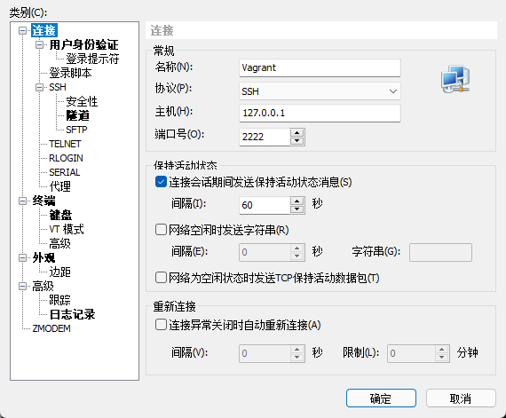


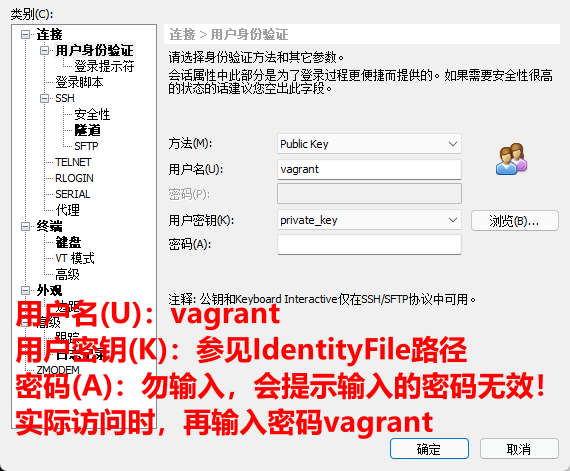

点击确定后登陆，首次登陆，会提示输入密码；这时，输入密码： vagrant 即可！

#### 3.切换到root

```bash
# 密码是 vagrant
[vagrant@localhost ~]$ su - root
Password: 
Last login: Fri Mar 11 07:45:14 UTC 2022 on pts/0
[root@localhost ~]# 
```


## 5、Vagrant的常用命令

| 命令                         | 命令执行结果状态 | 解释                                |
| ---------------------------- | ---------------- | ----------------------------------- |
| vagrant --version/vagrant -v |                  | 查看当前版本                        |
| vagrant box list             |                  | 查看目前已有的box                   |
| vagrant box add              |                  | 新增加一个box                       |
| vagrant box remove < name >  |                  | 删除指定box                         |
| vagrant init < boxes >       |                  | 初始化配置vagrantfile               |
| vagrant up                   | running          | 启动虚拟机                          |
| vagrant ssh                  |                  | ssh登录虚拟机                       |
| vagrant suspend              | saved            | 挂起虚拟机                          |
| vagrant resume               | running          | 唤醒虚拟机                          |
| vagrant halt                 | poweroff         | 关闭虚拟机                          |
| vagrant reload               | running          | 重启虚拟机                          |
| vagratn status               | running          | 查看虚拟机状态                      |
| vagrant destroy [name\|id]   |                  | 删除虚拟机，如果是default可以省略id |

特殊说明：vagrant up是一个万能命令，可以对saved/poweroff状态的虚拟机唤醒。

## 6、Vagrant Plugin命令

| 命令                                  | 解释           |
| ------------------------------------- | -------------- |
| vagrant plugin install < pluginName > | 安装插件       |
| vagrant plugin list                   | 查看安装的插件 |
| vagrant plugin uninstall              | 卸载插件       |
| vagrant plugin help                   | 查看命令用法   |


# 序二、Docker Desktop的安装与使用【不推荐】

1. 下载

下载地址：https://docs.docker.com/desktop/windows/install/

2. 安装

在Windows上双击安装，安装后根据提示重启电脑。

3. 解决WSL 2 installation is incomplete问题

打开Docker Desktop时提示：

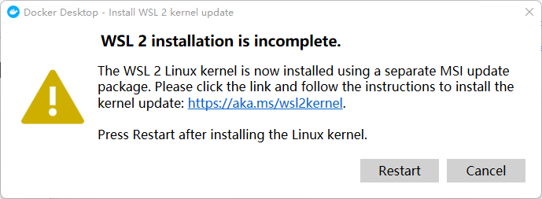


首先，确保如下功能已勾选：

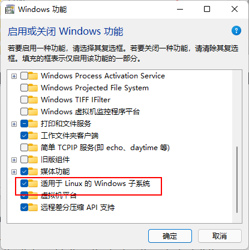

如果以勾选，并且WSL确实有下载，那么尝试更新WSL：

1：以管理员身份启动 powershell

2：执行

```bash
wsl --update
```

3：重启wsl【开启后，会导致VMWare启动失败：VMware Workstation 与 Device/Credential Guard 不兼容。】

```bash
net stop LxssManager
net start LxssManager
```

安装Docker Desktop后，也会默认启用【启用或关闭Windows功能】=>【虚拟化平台】，也会导致如上VMWare启动失败问题。

同时，【服务】=>【HV主机服务】也建议关闭！

# 一、Docker的安装与配置

## 1、安装

[查看官方CentOS安装Docker教程](https://docs.docker.com/engine/install/centos/)

## 1.0、删除旧版Docker

```bash
sudo yum remove docker \
                  docker-client \
                  docker-client-latest \
                  docker-common \
                  docker-latest \
                  docker-latest-logrotate \
                  docker-logrotate \
                  docker-engine
```

如果yum报告说以上安装包未安装，未匹配，未删除任何安装包，活码环境干净，没有历史遗留旧版安装。

### 1.1、安装要求

	安装Docker的基本要求如下：

- Dockr只支持64位的CPU架构的计算机，目前不支持32位CPU
- 建议系统的Linux内核版本为3.10及以上
- Linux内核需要开启cgroups和namespace功能
- 对于非Linux内核的平台，如Microsoft Windows和OS X，需要安装使用Boot2Docker工具

### 1.2、CentOS环境下安装Docker

	Docker目前只能运行在64位平台上，并且要求内核版本不低于3.10，实际上内核版本越新越好，过低的内核版本容易造成功能不稳定。
	
	用户可以通过如下命令检查自己的内核版本详细信息：

```shell
[emon@emon ~]$ uname -a
Linux emon 3.10.0-862.el7.x86_64 #1 SMP Fri Apr 20 16:44:24 UTC 2018 x86_64 x86_64 x86_64 GNU/Linux
[emon@emon ~]$ cat /proc/version
Linux version 3.10.0-862.el7.x86_64 (builder@kbuilder.dev.centos.org) (gcc version 4.8.5 20150623 (Red Hat 4.8.5-28) (GCC) ) #1 SMP Fri Apr 20 16:44:24 UTC 2018
```

1. 安装需要的软件包，yum-util提供yum-config-manager功能，另外两个是devicemapper驱动依赖的

```shell
[emon@emon ~]$ sudo yum install -y yum-utils device-mapper-persistent-data lvm2
```

2. 设置yum源

```shell
[emon@emon ~]$ sudo yum-config-manager --add-repo https://download.docker.com/linux/centos/docker-ce.repo
```

3. 可以查看所有仓库中所有docker版本，并选择安装特定的版本

```shell
[emon@emon ~]$ yum list docker-ce --showduplicates |sort -r
```

4. 安装docker

```shell
# 安装最新
[emon@emon ~]$ sudo yum install -y docker-ce
# 安装指定版本
[emon@emon ~]$ sudo yum install -y docker-ce-18.06.3.ce
```

5. 启动

```shell
[emon@emon ~]$ sudo systemctl start docker
```

6. 验证安装

```shell
[emon@emon ~]$ sudo docker version
[emon@emon ~]$ sudo docker info
[emon@emon ~]$ sudo docker run hello-world
```

> 说明：如果docker info有提示：
> WARNING: bridge-nf-call-iptables is disabled
> WARNING: bridge-nf-call-ip6tables is disabled

解决办法：

```bash
[emon@emon2 ~]$ sudo vim /etc/sysctl.conf 
```

```bash
net.bridge.bridge-nf-call-ip6tables = 1
net.bridge.bridge-nf-call-iptables = 1
```

使之生效：

```bash
[emon@emon2 ~]$ sudo sysctl -p
```

无需重启，此时docker info就看不到此报错了。

### 1.3、配置docker加速器

- 配置

  - DaoCloud

  采用 DaoCloud: https://www.daocloud.io/ 提供的Docker加速器。

  登录DaoCloud，找到小火箭图标，根据说明操作：

  ```bash
  [emon@emon ~]$ curl -sSL https://get.daocloud.io/daotools/set_mirror.sh | sh -s http://f1361db2.m.daocloud.io
  docker version >= 1.12
  {"registry-mirrors": ["http://f1361db2.m.daocloud.io"]}
  Success.
  You need to restart docker to take effect: sudo systemctl restart docker
  ```

  - 阿里云

  登录阿里开发者平台： https://promotion.aliyun.com/ntms/act/kubernetes.html#industry

  点击【镜像搜索】按钮，自动跳转到控制台的镜像搜索，根据提示注册并登录：

  在左侧【镜像中心】中选择【镜像加速器】，右边是生成的加速地址：比如我的：`https://pyk8pf3k.mirror.aliyuncs.com`，执行命令配置上即可：

  ```bash
  sudo tee /etc/docker/daemon.json <<-'EOF'
  {
    "registry-mirrors": ["https://pyk8pf3k.mirror.aliyuncs.com"]
  }
  EOF
  ```

- 查看

```bash
[emon@emon ~]$ sudo cat /etc/docker/daemon.json 
{"registry-mirrors": ["http://f1361db2.m.daocloud.io"]}
```

- 重启

```bash
[emon@emon ~]$ sudo systemctl restart docker
```

## 2、配置Docker服务

### 2.1、推荐通过配置sudo的方式：

	不推荐docker服务启动后，修改/var/run/docker.sock文件所属组为dockerroot，然后为某个user添加附加组dockerroot方式，使得docker命令在user登录后可以执行。

```shell
[emon@emon ~]$ sudo visudo
```

	找到`## Allow root to run any commands anywhere`这样的标识，在下方配置：

```shell
# 备注：如果已经赋予了ALL的操作权限，就没必要配置如下了
emon    ALL=(ALL)       PASSWD:/usr/bin/docker
```


### 2.2、配置alias

	配置永久的alias：

```shell
[emon@emon ~]$ vim .bashrc
alias docker="sudo /usr/bin/docker"
alias dockerpsf="sudo /usr/bin/docker ps --format \"table{{.ID}}\t{{.Names}}\t{{.Status}}\t{{.Image}}\t{{.RunningFor}}\t{{.Ports}}\""
```

使之生效：

```shell
[emon@emon ~]$ source .bashrc
```

使用示例：

```shell
[emon@emon ~]$ docker images
[sudo] emon 的密码：
REPOSITORY          TAG                 IMAGE ID            CREATED             SIZE
```

## 3、基本信息查看

### 3.1、查看Docker的基本信息

```shell
[emon@emon ~]$ docker info
Containers: 0
 Running: 0
 Paused: 0
 Stopped: 0
Images: 0
Server Version: 18.06.3-ce
Storage Driver: overlay2
 Backing Filesystem: xfs
 Supports d_type: true
 Native Overlay Diff: true
Logging Driver: json-file
Cgroup Driver: cgroupfs
Plugins:
 Volume: local
 Network: bridge host macvlan null overlay
 Log: awslogs fluentd gcplogs gelf journald json-file logentries splunk syslog
Swarm: inactive
Runtimes: runc
Default Runtime: runc
Init Binary: docker-init
containerd version: 468a545b9edcd5932818eb9de8e72413e616e86e
runc version: a592beb5bc4c4092b1b1bac971afed27687340c5
init version: fec3683
Security Options:
 seccomp
  Profile: default
Kernel Version: 3.10.0-1062.el7.x86_64
Operating System: CentOS Linux 7 (Core)
OSType: linux
Architecture: x86_64
CPUs: 4
Total Memory: 4.743GiB
Name: emon
ID: GN4G:MRL4:3LOQ:IHZP:CXV6:TE33:WSIG:FAYD:4UBO:3VU6:VBAZ:5I5I
Docker Root Dir: /var/lib/docker
Debug Mode (client): false
Debug Mode (server): false
Registry: https://index.docker.io/v1/
Labels:
Experimental: false
Insecure Registries:
 127.0.0.0/8
Registry Mirrors:
 http://c018e274.m.daocloud.io/
Live Restore Enabled: false
```

### 3.2、查看Docker版本

```shell
[emon@emon ~]$ docker version
Client:
 Version:           18.06.3-ce
 API version:       1.38
 Go version:        go1.10.3
 Git commit:        d7080c1
 Built:             Wed Feb 20 02:26:51 2019
 OS/Arch:           linux/amd64
 Experimental:      false

Server:
 Engine:
  Version:          18.06.3-ce
  API version:      1.38 (minimum version 1.12)
  Go version:       go1.10.3
  Git commit:       d7080c1
  Built:            Wed Feb 20 02:28:17 2019
  OS/Arch:          linux/amd64
  Experimental:     false
```


# 二、Docker的架构和底层技术

## 1、Docker Platform

- Docker提供了一个开发，打包，运行app的平台
- 把app和底层infrastructure隔离开来

|         Docker Platform          |
| :------------------------------: |
|           Application            |
|          Docker Engine           |
| Infrastructure(physical/virtual) |

### 1.1、Docker Engine

- 后台进程（dockerd）
- REST API Server
- CLI接口（docker）

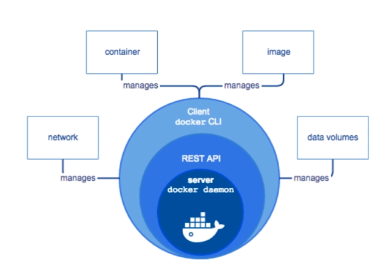

查看Docker后台进程：

```bash
[vagrant@localhost ~]$ ps -ef|grep docker
root      1952     1  0 02:02 ?        00:00:00 /usr/bin/dockerd -H fd:// --containerd=/run/containerd/containerd.sock
```


## 2、Docker Architecture

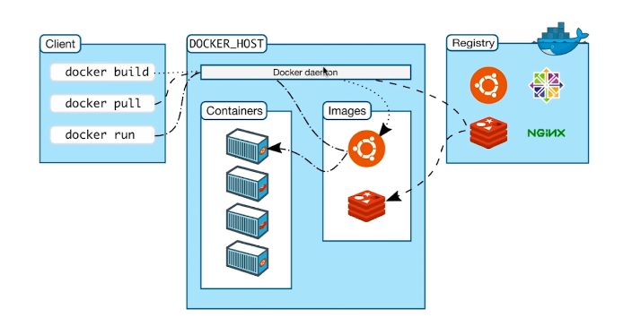

## 3、底层技术支持

- Namespaces：做隔离pid，net，ipc，mnt，uts
- Control groups：做资源限制
- Union file systems：Container和image的分层


# 三、镜像

## 1、什么是Image

- 文件和meta data的集合（root filesystem）
- 分层的，并且每一层都可以添加改变，删除文件，成为一个新的image
- 不同的image可以共享相同的layer
- Image本身是read-only的


## 2、获取镜像

- 获取Docker Hub镜像
  - 镜像是运行容器的前提，官方的Docker Hub网站已经提供了数十万个镜像供开放下载。
  - 命令格式： `docker pull NAME[:TAG]` 其中，NAME是镜像仓库的名称（用来区分镜像），TAG是镜像的标签（往往用来表示版本信息）。通常情况下，描述一个镜像需要包括`名称+标签`信息。
  - 如果不指定TAG，默认选择latest标签，这会下载仓库中最新版本的镜像。

```shell
# 等效于 docker pull registry.hub.docker.com/ubuntu:14.04
[emon@emon ~]$ docker pull ubuntu:14.04
# 我喜欢的centos
[emon@emon ~]$ docker pull centos:7
```

- 获取其他服务器镜像

```shell
[emon@emon ~]$ docker pull hub.c.163.com/public/ubuntu:14.04
```

### 2.1、案例：DIY一个Base Image

#### 2.1.1、体验hello-world镜像

```bash
[emon@emon ~]$ docker pull hello-world
[emon@emon ~]$ docker image ls
[emon@emon ~]$ docker run hello-world
```

#### 2.1.2、DIY hello-world镜像

1：安装C语言编译工具

```bash
[emon@emon ~]$ sudo yum install -y gcc glibc-static
```

2：创建hello.c文件并编译

```bash
[emon@emon ~]$ mkdir dockerdata/hello-world
[emon@emon ~]$ cd dockerdata/hello-world/
[emon@emon hello-world]$ vim hello.c
```

```c
#include<stdio.h>

int main()
{
    printf("hello docker\n");
}
```

```bash
[emon@emon hello-world]$ gcc -static hello.c -o hello
[emon@emon hello-world]$ ls
hello  hello.c
[emon@emon hello-world]$ ./hello 
hello docker
```

3：编写Dockerfile

```bash
[emon@emon hello-world]$ vim Dockerfile
```

```dockerfile
FROM scratch
ADD hello /
CMD ["/hello"]
```

```bash
# rushing-dockerhub用户名； .-当前目录寻找Dockerfile
[emon@emon hello-world]$ docker build -t rushing/hello-world .
# 命令行输出结果
Sending build context to Docker daemon  865.3kB
Step 1/3 : FROM scratch
 ---> 
Step 2/3 : ADD hello /
 ---> 340544a0099c
Step 3/3 : CMD ["/hello"]
 ---> Running in 1ae3095100d9
Removing intermediate container 1ae3095100d9
 ---> 72b24c24801b
Successfully built 72b24c24801b
Successfully tagged rushing/hello-world:latest
```

4：查看

- 查看image

```bash
[emon@emon hello-world]$ docker image ls|grep rushing
rushing/hello-world   latest              72b24c24801b        25 seconds ago      861kB
```

- 查看image的分层

```bash
[emon@emon hello-world]$ docker history 72b24c24801b
IMAGE               CREATED             CREATED BY                                      SIZE                COMMENT
72b24c24801b        2 minutes ago       /bin/sh -c #(nop)  CMD ["/hello"]               0B                  
340544a0099c        2 minutes ago       /bin/sh -c #(nop) ADD file:e7f35cd45d6ae73c7…   861kB 
```

5：运行

```bash
[emon@emon hello-world]$ docker run rushing/hello-world
# 命令行输出结果
hello docker
```


## 3、查看镜像

- 使用`docker images`命令列出镜像

```shell
[emon@emon ~]$ docker images
# 或者
[emon@emon ~]$ docker image ls
```

- 列名解析：

| 列名       | 释义                                                         |
| ---------- | ------------------------------------------------------------ |
| REPOSITORY | 来自于哪个仓库，比如ubuntu仓库用来保存ubuntu系列基础镜像     |
| TAG        | 镜像的标签信息，比如14.04、latest用来标注不同的版本信息。标签只是标记，不标识镜像内容 |
| IMAGE ID   | 镜像的ID（唯一标识镜像），比如ubuntu:14.04的唯一标志是 971bb384a50a |
| CREATED    | 创建时间，说明镜像最后的更新时间                             |
| SIZE       | 镜像大小，优秀的镜像往往体积比较小                           |

- 命令支持的选项

| 参数名称                | 参数作用                                                     |
| ----------------------- | ------------------------------------------------------------ |
| -a, --all=true\|false   | 列出所有的镜像文件（包括临时文件），默认为否                 |
| --digests=true\|false   | 列出镜像的数字摘要值，默认为否                               |
| -f, --filter=[]         | 过滤列出的镜像，如dangling=true只显示没有被使用的镜像；也可以指定带有特定标注的镜像等 |
| --format="TEMPLATE"     | 控制输出格式，例如`.ID`代表ID信息，`.Repository`代表仓库信息等 |
| --no-trunc=true\|false  | 对输出结果中太长的部分是否进行截断，如镜像的ID信息，默认为是 |
| -q, --quiet=true\|false | 仅输出ID信息，默认为否                                       |

	其中，对输出结果进行控制的选项如-f, --filter=[]、--no-trunc=true|false、-q, --quiet=true|false等，对大部分子命令都支持。

## 4、为镜像添加标签Tag

	为了方便在后续工作中使用特定镜像，还可以使用`docker tag`命令来为本地镜像任意添加新的标签。

```shell
[emon@emon ~]$ docker tag centos:7 centos:7.8
[emon@emon ~]$ docker images
REPOSITORY          TAG                 IMAGE ID            CREATED             SIZE
centos              7                   b5b4d78bc90c        2 days ago          203MB
centos              7.8                 b5b4d78bc90c        2 days ago          203MB
```

## 5、使用`inspect`命令查看镜像详细信息

```shell
[emon@emon ~]$ docker inspect centos:7
```

## 6、搜寻镜像

	使用docker search命令可以搜索远端仓库中共享的镜像，默认搜索官方仓库中的镜像。支持的参数主要包括：

| 参数名称                          | 参数作用                                                     |
| --------------------------------- | ------------------------------------------------------------ |
| --filter=is-automated=true\|false | 仅显示自动创建的镜像，默认为否                               |
| --no-trunc=true\|false            | 输出信息不截断显示，默认为否                                 |
| --filter=stars=3                  | 指定仅显示评价为指定星级以上的镜像，默认为0，即输出所有镜像。 |

示例：

```shell
[emon@emon ~]$ docker search --filter=is-automated=true --filter=stars=3 nginx
```

## 7、删除镜像

- 使用标签删除镜像，命令格式： `docker rmi IMAGE [IMAGE...]`，其中IMAGE可以是标签或者ID

```shell
[emon@emon ~]$ docker rmi centos:7.8
[emon@emon ~]$ docker images
REPOSITORY          TAG                 IMAGE ID            CREATED             SIZE
centos              7                   b5b4d78bc90c        2 days ago          203MB
```

- 使用镜像ID（或者部分ID串前缀）删除镜像

```shell
[emon@emon ~]$ docker rmi -f b5b4d78bc90c
```

	命令含义：会先尝试删除所有指向该镜像的标签，然后删除该镜像文件本身。哪怕基于该镜像启动了容器，也会删除镜像。但不影响容器。

## 8、创建镜像

	创建镜像的方法主要有三种：基于已有镜像的容器创建、基于本地模板导入、基于Dockerfile创建。

### 8.1、基于已有镜像的容器创建【不推荐】

该方法主要是使用docker commit命令；等效命令：docker container commit

命令格式为`docker commit [OPTIONS] CONTAINTER [REPOSITORY[:TAG]]`，主要选项包括：

| 参数名称         | 参数作用                                                     |
| ---------------- | ------------------------------------------------------------ |
| -a, --author=""  | 作者信息                                                     |
| -c, --change=[]  | 提交的试试执行Dockerfile指令，包括CMD\|ENTRYPOINT\|ENV\|EXPOSE\|LABEL\|ONBUILD\|USER\|VOLUME\|WORKDIR等 |
| -m, --message="" | 提交信息                                                     |
| -p, --pause=true | 提交时暂停容器运行                                           |

1. 首先，启动一个镜像，并在其中进行修改操作，例如创建一个test文件，之后推出：

```shell
[emon@emon ~]$ docker run -it ubuntu:14.04 /bin/bash
root@fe1aa9bd8460:/# touch test
root@fe1aa9bd8460:/# exit
```

记住容器的ID为 fe1aa9bd8460。

此时，该容器跟原ubuntu:14.04镜像相比，已经发生了变化，可以使用`docker commit`命令提交未一个新的镜像。提交时可以使用ID或者名称来指定容器：

```shell
[emon@emon ~]$ docker commit -m "Added a new file" -a "Emon" fe1aa9bd8460 test:0.0.1
```

### 8.2、基于本地模板导入

用户也可以直接从一个操作系统模板文件导入一个镜像，主要使用`docker import`命令。

命令格式为`docker import [OPTIONS] file|URL| - [REPOSITORY[:TAG]]`

### 8.3、基于Dockerfile创建【推荐】

docker build命令；等效命令：docker image build

1：创建目录

```bash
[emon@emon ~]$ mkdir docker-centos-vim
[emon@emon ~]$ cd docker-centos-vim/
```

2：创建Dockerfile

```bash
[emon@emon docker-centos-vim]$ vim Dockerfile 
```

```dockerfile
FROM centos:7
RUN yum install -y vim
```

3：创建镜像

```bash
# -t 指定repository名称为 rushing/centos-vim:latest 其中rushing是dockerhub用户名； .-当前目录寻找Dockerfile
[emon@emon docker-centos-vim]$ docker build -t rushing/centos-vim .
```


## 9、存出和载入镜像

用户可以使用`docker save`和`docker load`命令来存出和载入镜像。

### 9.1、存出镜像

```shell
[emon@emon ~]$ docker save -o test_0.0.1.tar test:0.0.1
```

说明：由于是通过sudo使用的docker命令，这里到处的镜像属于root用户；该镜像可以分发给其他人导入。

### 9.2、载入镜像

```shell
[emon@emon ~]$ docker load --input test_0.0.1.tar 
```

或者，使用root用户执行：

```shell
[root@emon ~]# docker load < /home/emon/test_0.0.1.tar 
```

或者，使用非root如下执行：

```shell
[emon@emon ~]$ sudo bash -c "chown emon.emon test_0.0.1.tar;docker load < test_0.0.1.tar"
```

说明：直接使用docker load命令，非root用户有权限限制：

```shell
[emon@emon ~]$ docker load < test_0.0.1.tar 
-bash: test_0.0.1.tar: 权限不够
```

## 10、上传镜像

以使用docker push命令上传镜像到仓库，默认上传到Docker Hub官方仓库（需要登录）。命令格式为：

`docker push NAME[:TAG] | [REGISTRY_HOST[:REGISTRY_PORT]/]NAME[:TAG]`

用户在Docker Hub网站注册后可以上传自制的镜像。例如用户user上传本地的test:latest镜像，可以先添加新的标签user/test:latest，然后用docker push命令上传镜像；

**请确保自己在 [Docker Hub](https://hub.docker.com/) 上有注册的用户，并把user替换为自己的用户名**

1. 打标签

```shell
[emon@emon ~]$ docker tag test:0.0.1 rushing/test:0.0.1
```

2. 登录 Docker Hub

```shell
[emon@emon ~]$ docker login
```

3. 上传

```shell
[emon@emon ~]$ docker push rushing/test:0.0.1
```


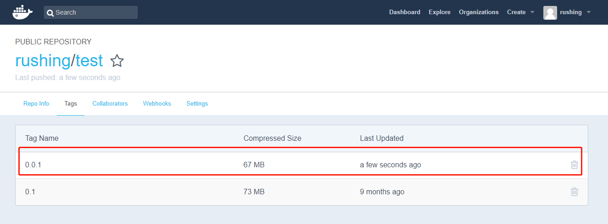


## 11、构建自己的docker私服

- 创建docker私服

访问：https://hub.docker.com/

访问registry私服文档：https://docs.docker.com/registry/spec/api/#listing-repositories

搜索：registry，找到官方提供的registry，用来存储和发布docker image。

```bash
[emon@emon ~]$ docker run -d -p 5000:5000 --restart always --name registry registry:2
```

- 私服安全控制

对文件 `/etc/docker/daemon.json` 追加 `insecure-registries`内容

```bash
{
  "registry-mirrors": ["https://pyk8pf3k.mirror.aliyuncs.com"],
  "insecure-registries": ["emon:5000"]
}
```

对文件 `/lib/systemd/system/docker.service` 追加`EnvironmentFile`：

```bash
# 在EnvironmentFile后面一行追加
EnvironmentFile=-/etc/docker/daemon.json
```

重启Docker服务：

```bash
[emon@emon hello-world]$ sudo systemctl daemon-reload
[emon@emon hello-world]$ sudo systemctl restart docker
```

- 对DIY的hello-world镜像，重新编译成新的镜像：

```bash
# 注意：这里是 rushing ==> emon:5000
[emon@emon hello-world]$ docker build -t emon:5000/hello-world .
[emon@emon hello-world]$ docker images | grep hello
# 命令行输出结果
emon:5000/hello-world      latest              da65ce820d2d        29 seconds ago      861kB
```

- 上传到本地docker私服

```bash
[emon@emon hello-world]$ docker push emon:5000/hello-world
# 命令行输出结果
The push refers to repository [emon:5000/hello-world]
da4136101ba6: Pushed 
latest: digest: sha256:77042e6c954be4845eaf2181e4c7cb6d51441fb00cf2c45513b1040cb68f5d32 size: 527
```

- 验证私服

访问：http://emon:5000/v2/_catalog

- 删除本地helle-world的image，并从私服pull下来

```bash
[emon@emon ~]$ docker rmi < imageId >
[emon@emon ~]$ docker pull emon:5000/hello-world
```


# 四、容器

	简单来说，容器是镜像的一个运行实例。所不同的是，镜像是静态的只读文件，而容器带有运行时需要的
可写层。如果认为虚拟机是模拟运行的一整套操作系统（包括内核、应用运行态环境和其他系统环境）和跑在上面的应用，那么Docker容器就是独立运行的一个（或一组）应用，以及它们必需的运行环境。

## 1、什么是Container

- 通过Image创建（Copy）

- 在Image layer之上建立一个container layer（可读写）
- 类比面向对象：类和实例
- Image负责app的存储和分发，Container负责运行app

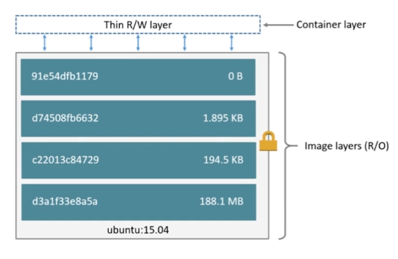


## 2、查看容器

### 2.1、基本用法

- 命令格式： `docker ps [OPTIIONS]`

| 选项名      | 默认值 | 描述                                                         |
| ----------- | ------ | ------------------------------------------------------------ |
| --all,-a    | false  | 是否显示所有容器（默认仅显示运行中的容器）                   |
| --filter,-f |        | 根据过滤的条件过滤输出结果                                   |
| --format    |        | 使用模板输出格式良好的结果                                   |
| --last,-n   | -1     | 显示最后创建的n个容器（包含所有状态的容器）                  |
| --latest,-l | false  | 显示最后创建的容器（包含所有状态的容器）                     |
| --no-trunc  | false  | 不截断输出                                                   |
| --quiet,-q  | false  | 仅仅显示ID列                                                 |
| --size,-s   | false  | 显示文件大小（容器增量大小和容器虚拟大小（容器真实大小+依赖的镜像大小）） |

- 显示正在运行的容器

```shell
[emon@emon ~]$ docker ps
# 或者
[emon@emon ~]$ docker container ls
```

- 显示所有状态的容器（7种状态：created|restarting|runnning|removing|paused|exited|dead)

```shell
[emon@emon ~]$ docker ps -a
# 或者
[emon@emon ~]$ docker container ls -a
```

- 显示最后被创建的n个容器（不限状态）

```shell
[emon@emon ~]$ docker ps -n 1
```

- 显示最后被创建的容器（不限状态）

```shell
[emon@emon ~]$ docker ps -l
```

- 显示完整输出（正在运行状态的）

```shell
[emon@emon ~]$ docker ps --no-trunc
```

- 只显示容器ID（正在运行状态的）

```shell
[emon@emon ~]$ docker ps -q
```

- 显示容器文件大小（正在运行状态的，该命令显示容器真实大小和容器的虚拟大小=(容器真实大小+容器镜像大小)）

```shell
[emon@emon ~]$ docker ps -s
```

### 2.2、高级用法

如果容器数量过多，或者想排除干扰容器，可以通过--filter或者-f选项，过滤需要显示的容器。

| 过滤条件 | 描述                                                         |
| -------- | ------------------------------------------------------------ |
| id       | 容器ID                                                       |
| label    | label=<key>或者label=<key>=<value>                           |
| status   | 支持的状态值有：created/restarting/running/removing/paused/exited/dead |
| health   | starting/healthy/unhealthy/none 基于健康检查状态过滤容器     |

条件很多，但万变不离其宗，只需要记住以下3条准则：

1. 选项后跟的都是键值对key=value(可不带引号)，如果有多个过滤条件，就多次使用filter选项。例如：

```shell
docker ps --filter id=a1b2c3 --filter name=festive_pasteur
```

2. 相同条件之间的关系是或，不同条件之间的关系是与。例如：

```shell
docker ps --filter name=festive --filter name=pasteur --filter status=running
```

以上过滤条件会找出name包含festive或者pasteur并且status为running的容器。

3. id和name，支持正则表达式，使用起来非常灵活。例如：

```shell
docker ps --filter name=^/festive_pasteur$
```

精确匹配name为festive_pasteur的容器。注意，容器实际名称，开头是由一个正斜线/，可用docker inspect一看便知。

```shell
docker ps --filter name=.*festive_pasteur.*
```

匹配name包含festive_pasteur的容器，和--filter name=festive_pasteur效果一致

最后，列举一个复杂点的例子，用于清理名称包含festive_pasteur，且状态为exited或dead的容器，如下：

```shell
docker rm $(docker ps -q --filter name=.*festive_pasteur.* --filter status=exited --filter status=dead 2>/dev/null)
```

如果是非root用户，要使用如下命令：

```shell
docker rm $(sudo bash -c "docker ps -q --filter name=.*festive_pasteur.* --filter status=exited --filter status=dead 2>/dev/null")
```

### 2.3、Format格式化显示

如果想要自定义显示容器字段，可以用格式化选项 -format。

| 占位符      | 描述                                                         |
| ----------- | ------------------------------------------------------------ |
| .ID         | 容器ID                                                       |
| .Image      | ImageID                                                      |
| .Command    | 启动容器的命令                                               |
| .CreatedAt  | 容器创建的时间                                               |
| .RunningFor | 自从容器创建后流逝的时间                                     |
| .Ports      | 暴露的端口                                                   |
| .Status     | 容器占用的磁盘大小                                           |
| .Names      | 容器的名称                                                   |
| .Labels     | 容器所有被分配的标签                                         |
| .Label      | 容器某个指定标签的值，比如：'{{.Label "com.docker.swarm.cpu"}}' |
| .Mounts     | 容器挂载的卷标名称                                           |
| .Networks   | attached到容器时的网络名称                                   |

1. 当使用了--format选项，那么ps命令只会输出template中指定的内容：

```shell
[emon@emon ~]$ docker ps --format "{{.ID}}:{{.Command}}"
```

2. 如果想带上表格列头，需要在telplate中加上table：

```shell
[emon@emon ~]$ docker ps --format "table{{.ID}}:{{.Command}}"
```

3. 一个比较好用的格式

```bash
[emon@emon ~]$ docker ps --format "table{{.ID}}\t{{.Names}}\t{{.Status}}\t{{.Image}}\t{{.RunningFor}}\t{{.Ports}}"
```

[更多用法](https://www.cnblogs.com/fuyuteng/p/8847331.html)


## 3、创建容器

### 3.1、常规命令

- 新建容器

```shell
[emon@emon ~]$ docker create -it --name centos7.8 centos:7
```

使用docker create命令创建的容器处于停止状态，可以使用docker start命令来启动。

- 启动容器

```shell
[emon@emon ~]$ docker start <container_id|container_name>
```

- 新建并启动容器：守护态运行(Daemonized)【推荐的启动方式】

```bash
[emon@emon ~]$ docker run -itd --name centos7.8 centos:7 [/bin/bash]
```

- 新建并启动容器：非守护态运行

```bash
[emon@emon ~]$ docker run -it --name centos7.8 centos:7 [/bin/bash]
```

这种运行方式，用户可以按Ctrl+d或者输入exit命令来退出容器：

TIPS：退出时，使用[Ctrl+D]，这样会结束docker当前线程，容器结束，可以使用[Ctrl+P+Q]退出而不是终止容器。

**异常情况：**

如果创建容器时，发现如下错误的处理办法：

`WARNING: IPv4 forwarding is disabled. Networking will not work.`

```bash
# 检查
[emon@emon ~]$ sudo sysctl -a|grep net.ipv4.ip_forward
# 配置
[emon@emon ~]$ sudo vim /etc/sysctl.conf
net.ipv4.ip_forward=1
# 使之生效
[emon@emon ~]$ sudo sysctl -p
# 重启网络
[emon@emon ~]$ sudo systemctl restart network
```

### 3.2、容器资源限制

- 限定内存

```bash
# 指定分配内存200M（隐含200M的Swap，共400M）
[emon@emon ~]$ docker run --memory=200M rushing/ubuntu-stress --vm 1 --verbose
# 指定分配内存200M（隐含200M的Swap，共400M），指定使用内存500M
[emon@emon ~]$ docker run --memory=200M rushing/ubuntu-stress --vm 1 --verbose --vm-bytes 500M
```

- 限定CPU

```bash
# 设置cpu使用权重，如下test1占用10，test2占用5；如果cpu共享情况下，会按照2:1分配
[emon@emon ~]$ docker run --cpu-shares=10 --name=test1 rushing/ubuntu-stress --cpu 2
[emon@emon ~]$ docker run --cpu-shares=5 --name=test2 rushing/ubuntu-stress --cpu 1
```


## 4、终止容器

可以使用docker stop来终止一个运行中的容器。该命令的格式为docker stop [-t|--time[=10]][CONTAINER...]。

首先向容器发送SIGTERM信号，等待一段超时时间（默认为10秒）后，再发送SIGKILL信号来终止容器：

```shell
[emon@emon ~]$ docker stop <container_id|container_name>
```

[docker kill 命令会直接发送SIGKILL信号来强制终止容器。]

此外，当Docker容器中指定的应用终结时，容器也会自动终止。

此外，docker restart命令会将一个运行态的容器先终止，然后再重新启动它：

```shell
[emon@emon ~]$ docker restart <container_id|container_name>
```

## 5、进入容器

在使用-d参数时，容器启动后会进入后台，用户无法看到容器中的信息，也无法进行操作。

这个时候如果需要进入容器进行操作，有多种方法，包括使用官方的attach或exec命令，以及第三方的nsenter工具等。

### 5.1、attach命令

- attach命令（连接后执行exit会停止容器）【过时方式】

attach是Docker自带的命令，命令格式为：

docker attach [--detach-keys[=[]]][--no-stdin] [--sig-proxy[=true]] CONTAINER

| 选项名             | 默认值 | 描述                                                |
| ------------------ | ------ | --------------------------------------------------- |
| --detach-keys[=[]] |        | 指定退出attach模式的快捷键序列，默认是Ctrl-p Ctrl-q |
| --no-stdin         | false  | 是否关闭标准输入                                    |
| --sig-proxy        | true   | 是否代理收到的系统信号给应用进程                    |

```shell
[emon@emon ~]$ docker attach <container_id|container_name>
```

但是使用attach命令有时候不方便。当多个窗口同时用attach命令连接到同一个容器的时候，所有窗口都会同步显示。当某个窗口因命令阻塞时，其他窗口也无法执行操作了。

### 5.2、exec命令

- exec命令（连接后执行exit，并不会停止容器）【推荐方式】

 Docker从1.3.0版本起提供了一个更加方便的exec命令，可以在容器内直接执行任意命令。该命令的基本格式为

docker exec [-d| --detach][--detach-keys[=[]]]	[-i| --interactive] [--privileged][-t| --tty] [-u| --user[=USER]] CONTAINER COMMAND [ARG...]

| 选项名           | 默认值 | 描述                         |
| ---------------- | ------ | ---------------------------- |
| -i,--interactive | false  | 打开标准输入接受用户输入命令 |
| --priveleged     | false  | 是否给执行命令以高权限       |
| -t,--tty         | false  | 分配伪终端，默认为false      |
| -u,--user        |        | 执行命令的用户名或者ID       |

- 进入容器

```shell
[emon@emon ~]$ docker exec -it <container_id|container_name> /bin/bash
```

- 还可以执行其他命令

```bash
[emon@emon ~]$ docker exec -it <container_id|container_name> ip addr
```


### 5.3、使用nsenter工具

暂略

## 6、删除容器

可以使用docker rm 命令来删除处于终止或退出状态的容器，命令格式为：

docker rm [-f|--force][-l|--link] [-v|--volumes] CONTAINER [CONTAINER...]。

| 选项名       | 默认值 | 描述                               |
| ------------ | ------ | ---------------------------------- |
| -f,--force   | false  | 是否强行终止并删除一个运行中的容器 |
| -l,--link    | false  | 删除容器的连接，但保留容器         |
| -v,--volumes | false  | 删除容器挂载的数据卷               |

- 查看并删除停止状态的容器

1. 查看停止状态的容器

```shell
[emon@emon ~]$ docker ps -q -f status=exited
```

2. 删除停止状态的容器

```shell
[emon@emon ~]$ docker rm <container_id|container_name>
```

3. 删除所有停止状态的容器

```bash
[emon@emon ~]$ docker rm $(docker ps -aq --filter status=exited)
# 或者
[emon@emon ~]$ docker rm $(docker container ls -f "status=exited" -q)
```


- 删除运行状态的容器

1. 查看运行状态的容器

```shell
[emon@emon ~]$ docker ps -q
或者
[emon@emon ~]$ docker ps -q --filter status=running
```

2. 删除运行状态的容器

```shell
[emon@emon ~]$ docker rm -f 3aa0487c2904
```

## 7、导入和导出容器

某些时候，需要将容器从一个系统迁移到另外一个系统，此时可以使用Docker的导入和导出功能。这也是Docker自身提供的一个重要特性。

### 7.1、导出容器

导出容器是指导出一个已经创建的容器到一个文件，不管此时这个容器是否处于运行状态，可以使用docker export命令，该命令的格式为：

docker export [-o|--output[=""]] CONTAINER。

其中，可以通过-o选项来指定导出的tar文件名，也可以直接通过重定向来实现。

1. 查看容器

```shell
[emon@emon ~]$ docker ps -qa
```

2. 导出容器文件

```shell
[emon@emon ~]$ docker export -o test_for_centos.tar 7fcaad938106
```

之后，可将导出的tar文件传输到其他机器上，然后再通过导入命令导入到系统中，从而实现容器的迁移。

### 7.2、导入容器

导出的文件又可以使用docker import命令导入变成镜像，该命令格式为：

docker import [-c|--change[=[]]][-m|--message[=MESSAGE]] file|URL|-[REPOSITORY[:TAG]]

用户可以通过-c, --change=[]选项在导入的同时执行对容器进行修改的Dockerfile指令。

```shell
[emon@emon ~]$ docker import test_for_centos.tar centos:7-test
```

注意：导入容器后，体现为镜像，需要启动才会出现到docker ps -qa列表中。

## 8、查看容器日志

- 命令格式： `docker logs [OPTIONS]` <container_id|container_name>

| 选项名          | 默认值 | 描述                                                         |
| --------------- | ------ | ------------------------------------------------------------ |
| --details       |        | 显示更多的信息                                               |
| -f,--follow     |        | 跟踪实时日志                                                 |
| --since string  |        | 显示自某个timestamp之后的日志，或相对时间，如42m（即42分钟） |
| --tail string   |        | 从日志末尾显示多少行日志，默认是all                          |
| -t,--timestamps |        | 显示时间戳                                                   |
| --until string  |        | 显示自某个timestamp之前的日志，或者相对时间，如42m（即42分钟） |

- 查看指定时间后的日志，只显示最后100行

```bash
docker logs -f -t --since="2021-02-17" --tail=100 <container_id|container_name>
```

- 查看最近30分钟的日志

```bash
docker logs --since 30 <container_id|container_name>
```

- 查看某个时间之后的日志

```bash
docker logs -t --since="2021-02-17T13:05:30" <container_id|container_name>
```

- 实时查看

```bash
docker logs -f <container_id|container_name>
```

- 普通查看

```bash
docker logs <container_id|container_name>
```


## 9、使用inspect命令查看容器详细信息

```bash
[emon@emon ~]$ docker inspect <container_id|container_name>
```

# 五、Dockerfile语法梳理及最佳实践

[Docker reference](https://docs.docker.com/engine/reference/builder/)

## 1、关键字讲解

### 1.1、关键字：FROM

```dockerfile
# 制作base image
FROM scratch
```

```dockerfile
# 使用base image
FROM centos:7
```

```dockerfile
# 使用base image的latest
FROM ubuntu
```

### 1.2、关键字：LABEL

```dockerfile
LABEL maintainer="rushing@163.com"
LABEL version="1.0"
LABEL description="This is description"
```

说明：

- Metadata不可少！

### 1.3、关键字：RUN

```dockerfile
# 反斜线换行
RUN yum update && yum install -y vim \
    python-dev
RUN /bin/bash -c 'source $HOME/.bashrc;echo $HOME'
```

说明：

每一次RUN命令，都会生成新的一层！

为了美观，复杂的RUN请用反斜线换行！

避免无用分层，合并多条命令成一行！

### 1.4、关键字：WORKDIR

```dockerfile
# 创建根目录下test文件夹
WORKDIR /root
```

```dockerfile
# 如果没有会自动创建test目录
WORKDIR /test
WORKDIR demo
# 输出结果应该是 /test/demo
RUN pwd
```

说明：

- 用WORKDIR，不要用RUN cd！
- 尽量使用绝对目录！

### 1.5、关键字：ADD and COPY

```dockerfile
# 把hello文件添加到/目录
ADD hello /
```

```dockerfile
# 添加到根目录并解压
ADD test.tar.gz /
```

```dockerfile
WORKDIR /root
# 会创建不存在的文件夹，结果：/root/test/hello
ADD hello test/
```

```dockerfile
WORKDIR /root
# 会创建不存在的文件夹，结果：/root/test/hello
COPY hello test/
```

说明：

- 大部分情况，COPY优于ADD！

- ADD除了COPY还有额外功能（解压）！
- 添加远程文件/目录请使用curl或者wget！

### 1.6、关键字：ENV

```doc
# 设置常量
ENV MYSQL_VERSION 5.6
# 引用常量
RUN apt-get install -y mysql-server="${MYSQL_VERSION}" \
	&& rm -rf /var/lib/apt/lists/*
```

说明：

- 尽量使用ENV增加可维护性！

### 1.7、关键字：VOLUME and EXPOSE

存储和网络。

### 1.8、RUN vs CMD vs ENTRYPOINT

- RUN：执行命令并创建新的 IMAGE Layer

- CMD：设置容器启动后默认执行的命令和参数
  - 容器启动时默认执行的命令
  - 如果docker run指定了其他命令，CMD命令被忽略
  - 如果定义了多个CMD，只有最后一个会执行

- ENTRYPOINT：设置容器启动时运行的命令

  - 让容器以应用程序或者服务的形式运行
  - 不会被忽略，一定被执行
  - 最佳实践：写一个shell脚本作为entrypoint

  ```dockerfile
  COPY docker-entrypoint.sh /usr/local/bin/
  ENTRYPOINT [ "docker-entrypoint.sh" ]
  
  EXPOSE 27017
  CMD [ "mongod" ]
  ```


#### 1.8.1、ENTRYPOINT之Shell格式

```bash
[emon@emon ~]$ mkdir -pv ~/dockerdata/entrypoint_shell
[emon@emon ~]$ cd ~/dockerdata/entrypoint_shell/
[emon@emon entrypoint_shell]$ vim Dockerfile
```

```dockerfile
FROM centos:7
ENV name Docker
ENTRYPOINT echo "hello $name"
```

```bash
[emon@emon entrypoint_shell]$ docker build -t rushing/centos-entrypoint-shell .
[emon@emon entrypoint_shell]$ docker run rushing/centos-entrypoint-shell
hello Docker
```

#### 1.8.2、ENTRYPOINT之Exec格式

```bash
[emon@emon ~]$ mkdir -pv ~/dockerdata/entrypoint_exec
[emon@emon ~]$ cd ~/dockerdata/entrypoint_exec/
[emon@emon entrypoint_exec]$ vim Dockerfile
```

```dockerfile
FROM centos:7
ENV name Docker
ENTRYPOINT [ "bin/bash", "-c", "echo hello $name" ]
```

```bash
[emon@emon entrypoint_exec]$ docker build -t rushing/centos-entrypoint-exec .
[emon@emon entrypoint_exec]$ docker run rushing/centos-entrypoint-exec
hello Docker
```

#### 1.8.3、CMD之Shell

```bash
[emon@emon ~]$ mkdir -pv ~/dockerdata/cmd_shell
[emon@emon ~]$ cd ~/dockerdata/cmd_shell/
[emon@emon cmd_shell]$ vim Dockerfile
```

```dockerfile
FROM centos:7
ENV name Docker
CMD echo "hello $name"
```

```bash
[emon@emon cmd_shell]$ docker build -t rushing/centos-cmd-shell .
[emon@emon cmd_shell]$ docker run rushing/centos-cmd-shell
hello Docker
# 如果指定 /bin/bash 时，会覆盖CMD语句执行
[emon@emon cmd_shell]$ docker run rushing/centos-cmd-shell /bin/bash
```

#### 1.8.4、CMD值Exec

```bash
[emon@emon ~]$ mkdir -pv ~/dockerdata/cmd_exec
[emon@emon ~]$ cd ~/dockerdata/cmd_exec/
[emon@emon cmd_exec]$ vim Dockerfile
```

```dockerfile
FROM centos:7
ENV name Docker
CMD [ "bin/bash", "-c", "echo hello $name" ]
```

```bash
[emon@emon cmd_exec]$ docker build -t rushing/centos-cmd-exec .
[emon@emon cmd_exec]$ docker run rushing/centos-cmd-exec
hello Docker
```


### 1.9、Shell和Exec格式

- Shell格式

```dockerfile
RUN apt-get install -y vim
CMD echo "hello docker"
ENTRYPOINT echo "hello docker"
```

- Exec格式

```dockerfile
RUN [ "apt-get", "install", "-y", "vim" ]
CMD [ "/bin/echo", "hello docker" ]
ENTRYPOINT [ "/bin/echo", "hello docker" ]
```


## 2、案例

参考示例：https://github.com/docker-library/mysql

### 2.1、案例：flask-demo服务镜像

1：创建目录

```bash
[emon@emon ~]$ mkdir dockerdata/flask-demo
[emon@emon ~]$ cd dockerdata/flask-demo/
```

2：编写内容

- 创建app.py

```bash
[emon@emon flask-demo]$ vim app.py
```

```python
from flask import Flask
app = Flask(__name__)

@app.route('/')
def hello():
    return "hello docker"

if __name__ == '__main__':
    app.run(
        host='0.0.0.0',
        port=5000,
        debug=True
    )
```

- 安装flask

```bash
[emon@emon flask-demo]$ pip3 install flask
```

- 运行

```bash
[emon@emon flask-demo]$ python3 app.py
```

3：创建Dockerfile

```bash
[emon@emon flask-demo]$ vim Dockerfile
```

```dockerfile
FROM python:2.7
LABEL maintainer="emon<emon@163.com>"
RUN pip install flask
COPY app.py /app
WORKDIR /app
EXPOSE 5000
CMD ["python", "app.py"]
```

4：创建镜像

```bash
[emon@emon flask-demo]$ docker build -t rushing/flask-hello-world .
......省略......
Step 4/7 : COPY app.py /app
 ---> 5584b327f25d
Step 5/7 : WORKDIR /app
Cannot mkdir: /app is not a directory
```

可以看到Step 5/7 失败了，如何处理？

进入Step 4/7产生的镜像层：

```bash
[emon@emon flask-demo]$ docker run -it 5584b327f25d /bin/bash
root@7666f9b78e80:/# ls -l|grep app
-rw-rw-r--.   1 root root 212 Mar 13 09:52 app
```

发现app不是一个目录，而是一个文件。

调整Dockerfile内容：

```dockerfile
FROM python:2.7
LABEL maintainer="emon<emon@163.com>"
RUN pip install flask
COPY app.py /app/
WORKDIR /app
EXPOSE 5000
CMD ["python", "app.py"]
```

再次创建镜像：

```bash
[emon@emon flask-demo]$ docker build -t rushing/flask-hello-world .
```

5：运行镜像

```bash
[emon@emon flask-demo]$ docker run rushing/flask-hello-world
# 命令行输出结果
 * Serving Flask app "app" (lazy loading)
 * Environment: production
   WARNING: This is a development server. Do not use it in a production deployment.
   Use a production WSGI server instead.
 * Debug mode: on
 * Running on http://0.0.0.0:5000/ (Press CTRL+C to quit)
 * Restarting with stat
 * Debugger is active!
 * Debugger PIN: 471-935-875
```

### 2.2、案例：ubuntu-stress工具镜像

1：创建目录

```bash
[emon@emon ~]$ mkdir dockerdata/ubuntu-stress
[emon@emon ~]$ cd dockerdata/ubuntu-stress/
```

2：创建Dockerfile

```bash
[emon@emon ubuntu-stress]$ vim Dockerfile
```

```dockerfile
FROM ubuntu
RUN apt-get update && apt-get install -y stress
ENTRYPOINT ["/usr/bin/stress"]
CMD []
```

3：创建镜像

```bash
[emon@emon ubuntu-stress]$ docker build -t rushing/ubuntu-stress .
```

4：运行镜像

```bash
[emon@emon ubuntu-stress]$ docker run -it rushing/ubuntu-stress --vm 1 --verbose
```


# 六、网络

## 6.1、网络的基础知识

### 6.1.1、网络的分类

- 单机
  - Bridge Network
  - Host Network
  - None Network
- 多机
  - Overlay Network

### 6.1.2、网络的分层

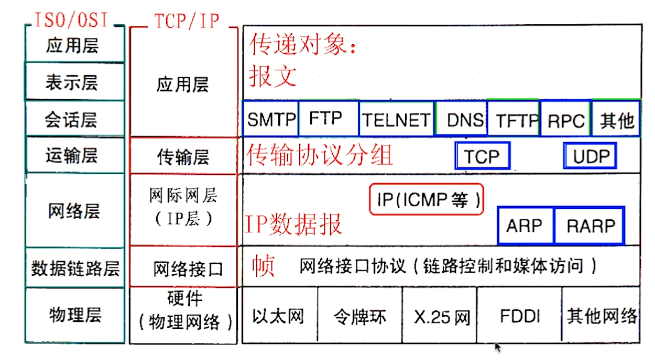

### 6.1.3、公有IP和私有IP

- Public IP：互联网上的唯一标识，可以访问internet
- Private IP：不可在互联网上使用，仅供机构内部使用

| 类别 | 网段                         | 示例           |
| ---- | ---------------------------- | -------------- |
| A类  | 10.0.0.0--10.255.255.255     | 10.0.0.0/8     |
| B类  | 172.16.0.0--172.31.255.255   | 172.16.0.0/12  |
| C类  | 192.168.0.0--192.168.255.255 | 192.168.0.0/16 |

### 6.1.4、网络地址转换NAT


### 6.1.5、ping和telnet以及wireshark

- ping(ICMP)：验证IP的可达性
- telnet：验证服务的可用性
- wireshark：抓包工具


## 6.2、Linux网络命名空间

### 6.2.1、docker的网络命名空间

启动一个容器作为演示环境：

```bash
# 创建并启动容器
[emon@emon ~]$ docker run -d --name test1 busybox /bin/sh -c "while true; do sleep 3600; done"
# 查看容器
[emon@emon ~]$ docker ps 
CONTAINER ID        IMAGE               COMMAND                  CREATED             STATUS              PORTS               NAMES
c77a3a22a9b8        busybox             "/bin/sh -c 'while t…"   49 seconds ago      Up 48 seconds                           test1
# 进入容器
[emon@emon ~]$ docker exec -it c77a3a22a9b8 /bin/sh
# 输入命令 ip a （等效ip addr）
/ # ip a
1: lo: <LOOPBACK,UP,LOWER_UP> mtu 65536 qdisc noqueue qlen 1000
    link/loopback 00:00:00:00:00:00 brd 00:00:00:00:00:00
    inet 127.0.0.1/8 scope host lo
       valid_lft forever preferred_lft forever
96: eth0@if97: <BROADCAST,MULTICAST,UP,LOWER_UP,M-DOWN> mtu 1500 qdisc noqueue 
    link/ether 02:42:ac:11:00:02 brd ff:ff:ff:ff:ff:ff
    inet 172.17.0.2/16 brd 172.17.255.255 scope global eth0
       valid_lft forever preferred_lft forever
```

如上，ip a展示的结果，就是test1这个容器的网络命名空间。


再启动一个容器：

```bash
[emon@emon ~]$ docker run -d --name test2 busybox /bin/sh -c "while true; do sleep 3600; done"
# 查看test2容器的网络命名空间
[emon@emon ~]$ docker exec -it b966b6ee1664 ip a
```

### 6.2.2、linux的网络命名空间

#### 如何添加两个命名空间？

- 查看网络命名空间列表

```bash
[emon@emon ~]$ sudo ip netns list
```

- 添加网络命名空间

```bash
[emon@emon ~]$ sudo ip netns add test1
[emon@emon ~]$ sudo ip netns add test2
```

- 查看某个网络命名空间详情

```bash
[emon@emon ~]$ sudo ip netns exec test1 ip a
# 命令行输出结果
1: lo: <LOOPBACK> mtu 65536 qdisc noop state DOWN group default qlen 1000
    link/loopback 00:00:00:00:00:00 brd 00:00:00:00:00:00
[emon@emon ~]$ sudo ip netns exec test1 ip link
# 命令行输出结果
1: lo: <LOOPBACK> mtu 65536 qdisc noop state DOWN mode DEFAULT group default qlen 1000
    link/loopback 00:00:00:00:00:00 brd 00:00:00:00:00:00
```

- 唤醒lo

```bash
[emon@emon ~]$ sudo ip netns exec test1 ip link set dev lo up
[emon@emon ~]$ sudo ip netns exec test1 ip link
1: lo: <LOOPBACK,UP,LOWER_UP> mtu 65536 qdisc noqueue state UNKNOWN mode DEFAULT group default qlen 1000
    link/loopback 00:00:00:00:00:00 brd 00:00:00:00:00:00
```

#### 如何打通两个命名空间？

- 宿主机添加veth pair

```bash
# 在宿主机生成veth pair
[emon@emon ~]$ sudo ip link add veth-test1 type veth peer name veth-test2
# 查看宿主机ip link，可以看到veth-test1和veth-test2
[emon@emon ~]$ sudo ip link

# 添加veth-test1到test1命名空间
[emon@emon ~]$ sudo ip link set veth-test1 netns test1
# 查看test1命名空间下的ip link
[emon@emon ~]$ sudo ip netns exec test1 ip link

# 添加veth-test2到test2命名空间
[emon@emon ~]$ sudo ip link set veth-test2 netns test2
# 查看test2命名空间下的ip link
[emon@emon ~]$ sudo ip netns exec test2 ip link

# 再次查看宿主机ip link，看不到veth-test1和veth-test2
[emon@emon ~]$ sudo ip link
```

图解：

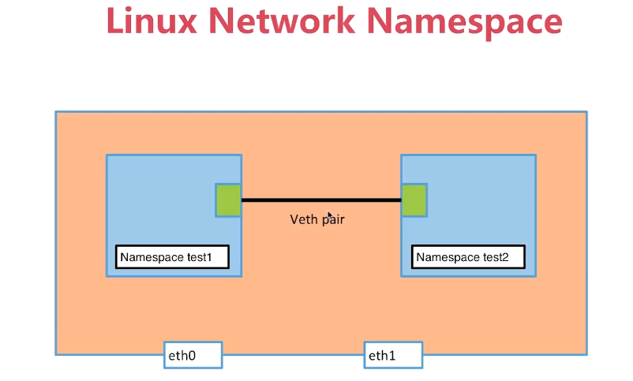


- 为命名空间test1和test2添加IP地址

```bash
# 为test1命名空间上的veth-test1添加IP地址
[emon@emon ~]$ sudo ip netns exec test1 ip addr add 192.168.1.1/24 dev veth-test1
# 为test2命名空间上的veth-test2添加IP地址
[emon@emon ~]$ sudo ip netns exec test2 ip addr add 192.168.1.2/24 dev veth-test2

# 唤醒test1上的veth-test1
[emon@emon ~]$ sudo ip netns exec test1 ip link set dev veth-test1 up
# 唤醒test2上的veth-test2
[emon@emon ~]$ sudo ip netns exec test2 ip link set dev veth-test2 up

# ==================================================
# 查看test1和test2的ip link
[emon@emon ~]$ sudo ip netns exec test1 ip link
# 命令行输出结果
1: lo: <LOOPBACK,UP,LOWER_UP> mtu 65536 qdisc noqueue state UNKNOWN mode DEFAULT group default qlen 1000
    link/loopback 00:00:00:00:00:00 brd 00:00:00:00:00:00
101: veth-test1@if100: <BROADCAST,MULTICAST,UP,LOWER_UP> mtu 1500 qdisc noqueue state UP mode DEFAULT group default qlen 1000
    link/ether fa:6e:7e:58:57:03 brd ff:ff:ff:ff:ff:ff link-netnsid 1
[emon@emon ~]$ sudo ip netns exec test2 ip link
# 命令行输出结果
1: lo: <LOOPBACK> mtu 65536 qdisc noop state DOWN mode DEFAULT group default qlen 1000
    link/loopback 00:00:00:00:00:00 brd 00:00:00:00:00:00
100: veth-test2@if101: <BROADCAST,MULTICAST,UP,LOWER_UP> mtu 1500 qdisc noqueue state UP mode DEFAULT group default qlen 1000
    link/ether fe:ca:9f:29:72:0b brd ff:ff:ff:ff:ff:ff link-netnsid 0
    
# 查看test1和test2的ip a
[emon@emon ~]$ sudo ip netns exec test1 ip a
# 命令行输出结果
1: lo: <LOOPBACK,UP,LOWER_UP> mtu 65536 qdisc noqueue state UNKNOWN group default qlen 1000
    link/loopback 00:00:00:00:00:00 brd 00:00:00:00:00:00
    inet 127.0.0.1/8 scope host lo
       valid_lft forever preferred_lft forever
    inet6 ::1/128 scope host 
       valid_lft forever preferred_lft forever
101: veth-test1@if100: <BROADCAST,MULTICAST,UP,LOWER_UP> mtu 1500 qdisc noqueue state UP group default qlen 1000
    link/ether fa:6e:7e:58:57:03 brd ff:ff:ff:ff:ff:ff link-netnsid 1
    inet 192.168.1.1/24 scope global veth-test1
       valid_lft forever preferred_lft forever
    inet6 fe80::f86e:7eff:fe58:5703/64 scope link 
       valid_lft forever preferred_lft forever
[emon@emon ~]$ sudo ip netns exec test2 ip a
# 命令行输出结果
1: lo: <LOOPBACK> mtu 65536 qdisc noop state DOWN group default qlen 1000
    link/loopback 00:00:00:00:00:00 brd 00:00:00:00:00:00
100: veth-test2@if101: <BROADCAST,MULTICAST,UP,LOWER_UP> mtu 1500 qdisc noqueue state UP group default qlen 1000
    link/ether fe:ca:9f:29:72:0b brd ff:ff:ff:ff:ff:ff link-netnsid 0
    inet 192.168.1.2/24 scope global veth-test2
       valid_lft forever preferred_lft forever
    inet6 fe80::fcca:9fff:fe29:720b/64 scope link 
       valid_lft forever preferred_lft forever
       
# 从test1连通test2验证
[emon@emon ~]$ sudo ip netns exec test1 ping 192.168.1.2
```

## 6.3、Docker网络

### 6.3.1、Docker网络类型列表

- 查看Docker网络列表

```bash
[emon@emon ~]$ sudo docker network ls
NETWORK ID          NAME                DRIVER              SCOPE
4350d5c6e428        bridge              bridge              local
4913d65f0331        host                host                local
5dddd8fbaae8        none                null                local
# 查看bridge详细信息中的 Containers 属性包含的容器信息
[emon@emon ~]$ sudo docker network inspect bridge
```

- 安装网络工具

```bash
[emon@emon ~]$ sudo yum install -y bridge-utils
[emon@emon ~]$ brctl show
bridge name	bridge id		STP enabled	interfaces
docker0		8000.02426f6e5033	no		veth3950c82
										veth4b7c084
```

说明：有两对veth，对应两个容器，通过docker0这个bridge连接起来。拓扑图如下：

### 6.3.2、Docker网络之bridge

#### 容器间互相访问拓扑图


#### 容器如何访问的外网？

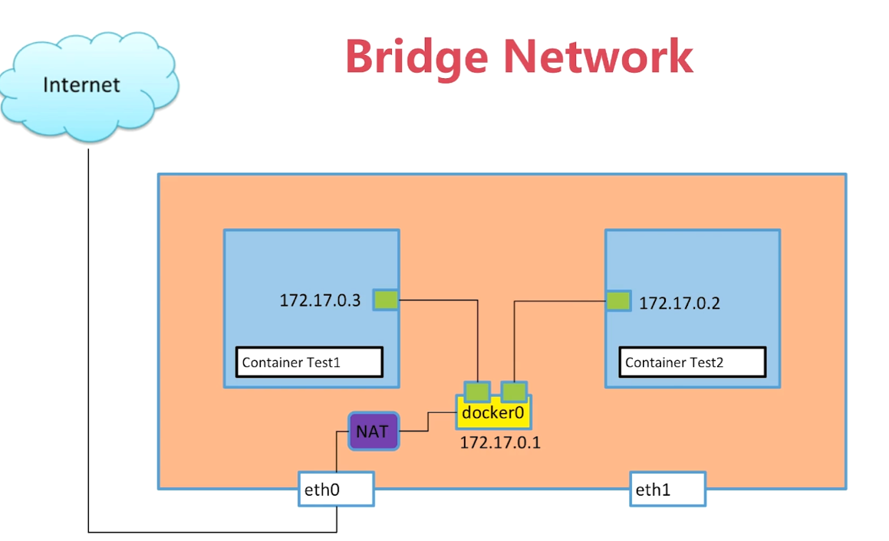


#### 容器间通过默认的birdge来link

- 删除并重新创建test2，把test2通过link方式连接到test1容器

```bash
[emon@emon ~]$ docker rm -f test2
[emon@emon ~]$ docker run -d --name test2 --link test1 busybox /bin/sh -c "while true; do sleep 3600; done"
# 可以通过test1的名称连通
[emon@emon ~]$ docker exec -it test2 /bin/sh
/ # ping test1
PING test1 (172.17.0.2): 56 data bytes
64 bytes from 172.17.0.2: seq=0 ttl=64 time=0.056 ms
```

- 复原test2

```bash
[emon@emon ~]$ docker rm -f test2
[emon@emon ~]$ docker run -d --name test2 busybox /bin/sh -c "while true; do sleep 3600; done"
```

#### 容器间通过自定义的bridge来link

- 创建新的bridge

```bash
[emon@emon ~]$ docker network create -d bridge my-bridge
```

- 创建容器并指定到新建的bridge

```bash
[emon@emon ~]$ docker run -d --name test3 --network my-bridge busybox /bin/sh -c "while true; do sleep 3600; done"
# 查看容器与bridge绑定关系
[emon@emon ~]$ brctl show
bridge name	bridge id		STP enabled	interfaces
br-1c371c5eabde		8000.02426de4ab41	no		veth911f9ea
docker0		8000.02426f6e5033	no		veth3950c82
										veth4b7c084
# 查看my-bridge详细信息中的 Containers 属性包含的容器信息
[emon@emon ~]$ sudo docker network inspect my-bridge
```

- 调整已有容器test2连接到my-bridge

```bash
[emon@emon ~]$ docker network connect my-bridge test2
# 查看my-bridge详细信息中的 Containers 属性包含的容器信息；发现test2仍旧和bridge保持连接
[emon@emon ~]$ sudo docker network inspect bridge
# 查看my-bridge详细信息中的 Containers 属性包含的容器信息；发现test2也连接到my-bridge了
[emon@emon ~]$ sudo docker network inspect my-bridge
```

- 如果两个容器连接到自定义bridge，可以通过name来ping通对方

```bash
[emon@emon ~]$ docker exec -it test3 /bin/sh
/ # ping test2
PING test2 (172.18.0.3): 56 data bytes
64 bytes from 172.18.0.3: seq=0 ttl=64 time=0.058 ms

[emon@emon ~]$ docker exec -it test2 /bin/sh
/ # ping test3
PING test3 (172.18.0.2): 56 data bytes
64 bytes from 172.18.0.2: seq=0 ttl=64 time=0.053 ms
```


### 6.3.3、容器的端口映射

- 创建一个nginx的容器

```docker
[emon@emon ~]$ docker run --name web -d -p 80:80 nginx
```


### 6.3.4、Docker网络之none

初始化环境：

```bash
# 清理容器
[emon@emon ~]$ docker rm -f $(docker ps -qa)
# 清理自定义bridge
[emon@emon ~]$ docker network rm my-bridge

[emon@emon ~]$ docker network ls
NETWORK ID          NAME                DRIVER              SCOPE
4350d5c6e428        bridge              bridge              local
4913d65f0331        host                host                local
5dddd8fbaae8        none                null                local
[emon@emon ~]$ docker ps
CONTAINER ID        IMAGE               COMMAND             CREATED             STATUS              PORTS               NAMES
```

- 创建容器基于none

```bash
[emon@emon ~]$ docker run -d --name test1 --network none busybox /bin/sh -c "while true; do sleep 3600; done"
# 查看网络none的详情
[emon@emon ~]$ docker network inspect none
# 查看test1的网络命名空间
[emon@emon ~]$ docker exec -it test1 /bin/sh
/ # ip a 查看得到：孤立的容器
1: lo: <LOOPBACK,UP,LOWER_UP> mtu 65536 qdisc noqueue qlen 1000
    link/loopback 00:00:00:00:00:00 brd 00:00:00:00:00:00
    inet 127.0.0.1/8 scope host lo
       valid_lft forever preferred_lft forever
```

### 6.3.5、Docker网络之host

初始化环境：

```bash
# 清理容器
[emon@emon ~]$ docker rm -f $(docker ps -qa)

[emon@emon ~]$ docker network ls
NETWORK ID          NAME                DRIVER              SCOPE
4350d5c6e428        bridge              bridge              local
4913d65f0331        host                host                local
5dddd8fbaae8        none                null                local
[emon@emon ~]$ docker ps
CONTAINER ID        IMAGE               COMMAND             CREATED             STATUS              PORTS               NAMES
```

- 创建容器基于host

```bash
[emon@emon ~]$ docker run -d --name test1 --network host busybox /bin/sh -c "while true; do sleep 3600; done"
# 查看网络host的详情
[emon@emon ~]$ docker network inspect host
# 查看test1的网络命名空间
[emon@emon ~]$ docker exec -it test1 /bin/sh
/ # ip a 可以得知共享了宿主机器的网络命名空间
1: lo: <LOOPBACK,UP,LOWER_UP> mtu 65536 qdisc noqueue qlen 1000
    link/loopback 00:00:00:00:00:00 brd 00:00:00:00:00:00
    inet 127.0.0.1/8 scope host lo
       valid_lft forever preferred_lft forever
    inet6 ::1/128 scope host 
       valid_lft forever preferred_lft forever
2: ens33: <BROADCAST,MULTICAST,UP,LOWER_UP> mtu 1500 qdisc pfifo_fast qlen 1000
    link/ether 00:0c:29:57:cc:44 brd ff:ff:ff:ff:ff:ff
    inet 192.168.1.116/24 brd 192.168.1.255 scope global noprefixroute ens33
       valid_lft forever preferred_lft forever
    inet6 2409:8a28:cbc:b580:1d13:cc6f:fd77:6e75/64 scope global dynamic noprefixroute 
       valid_lft 86393sec preferred_lft 14393sec
    inet6 fe80::4964:c0da:32bd:1d54/64 scope link noprefixroute 
       valid_lft forever preferred_lft forever
3: docker0: <NO-CARRIER,BROADCAST,MULTICAST,UP> mtu 1500 qdisc noqueue 
    link/ether 02:42:6f:6e:50:33 brd ff:ff:ff:ff:ff:ff
    inet 172.17.0.1/16 brd 172.17.255.255 scope global docker0
       valid_lft forever preferred_lft forever
    inet6 fe80::42:6fff:fe6e:5033/64 scope link 
       valid_lft forever preferred_lft forever
```

## 6.4、案例：多容器复杂应用的部署演示

初始化环境：

```bash
# 清理容器
[emon@emon ~]$ docker rm -f $(docker ps -qa)

[emon@emon ~]$ docker network ls
NETWORK ID          NAME                DRIVER              SCOPE
4350d5c6e428        bridge              bridge              local
4913d65f0331        host                host                local
5dddd8fbaae8        none                null                local
[emon@emon ~]$ docker ps
CONTAINER ID        IMAGE               COMMAND             CREATED             STATUS              PORTS               NAMES
```

1：创建目录

```bash
[emon@emon ~]$ mkdir dockerdata/flask-redis
[emon@emon ~]$ cd dockerdata/flask-redis/
```

2：编写内容

- 创建app.py

```bash
[emon@emon flask-redis]$ vim app.py
```

```python
from flask import Flask
from redis import Redis
import os
import socket

app = Flask(__name__)
redis = Redis(host=os.environ.get('REDIS_HOST', '127.0.0.1'), port=6379)


@app.route('/')
def hello():
    redis.incr('hits')
    return 'Hello Container World! I have been seen %s times and my hostname is %s.\n' % (redis.get('hits'),socket.gethostname())


if __name__ == "__main__":
    app.run(host="0.0.0.0", port=5000, debug=True)
```

3：创建Dockerfile

```bash
[emon@emon flask-redis]$ vim Dockerfile
```

```dockerfile
FROM python:2.7
LABEL maintainer="emon<emon@163.com>"
COPY . /app
WORKDIR /app
RUN pip install flask redis
EXPOSE 5000
CMD ["python", "app.py"]
```

4：创建redis容器

```bash
[emon@emon flask-redis]$ docker run -d --name redis redis
```

5：创建镜像

```bash
[emon@emon flask-redis]$ docker build -t rushing/flask-redis .
```

6：运行镜像

```bash
[emon@emon flask-redis]$ docker run -d -p 5000:5000 --link redis --name flask-redis -e REDIS_HOST=redis rushing/flask-redis
# 访问容器
[emon@emon flask-redis]$ docker exec -it flask-redis /bin/bash
# 查看env
root@f37f93de0bcb:/app# env|grep REDIS_HOST
REDIS_HOST=redis
# 运行代码
root@f37f93de0bcb:/app# curl 127.0.0.1:5000
Hello Container World! I have been seen 1 times and my hostname is f37f93de0bcb.
root@f37f93de0bcb:/app# curl 127.0.0.1:5000
Hello Container World! I have been seen 2 times and my hostname is f37f93de0bcb.
root@f37f93de0bcb:/app# curl 127.0.0.1:5000

# 在宿主机器访问
[emon@emon flask-redis]$ curl 127.0.0.1:5000
Hello Container World! I have been seen 4 times and my hostname is 28bc2a8ace9e.
```


## 6.5、Overlay和Underlay的通俗解释

**环境准备：emon和emon2环境。两台机器上docker恢复到没有容器在运行的状态。并安装etcd集群。**

### 6.5.1、多机器通信（Vxlan）

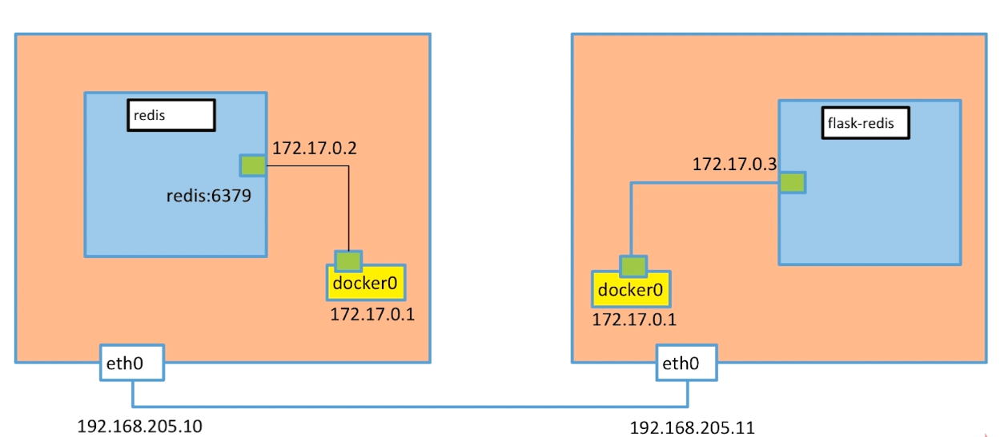

- underlay：可以理解为宿主机之间的通信；
- overlay：可以理解为不同宿主机中docker容器之间的通信；

### 6.5.2、安装etcd集群

| 机器名 | IP1-家庭      | IP2-公司   | 部署内容     |
| ------ | ------------- | ---------- | ------------ |
| emon   | 192.168.1.116 | 10.0.0.116 | docker-node1 |
| emon2  | 192.168.1.117 | 10.0.0.117 | docker-node2 |

1：安装etcd

```bash
# emon主机安装
[emon@emon ~]$ sudo yum install -y etcd
# emon2主机安装
[emon@emon2 ~]$ sudo yum install -y etcd
```

2：修改配置

- emon宿主机：docker-node1

```bash
# 备份原配置文件并编辑
[emon@emon ~]$ sudo cp /etc/etcd/etcd.conf /etc/etcd/etcd.conf.bak
[emon@emon ~]$ sudo vim /etc/etcd/etcd.conf 
```

```properties
#[Member]
# 每个机器填写自己主机名，取 hostname -s 值即可
ETCD_NAME="emon"
# 服务运行数据保存的路径，默认为 `$name}.etcd`
ETCD_DATA_DIR="/var/lib/etcd/default.etcd"
ETCD_WAL_DIR="/var/lib/etcd/default.etcd/wal"
# 用于监听其他 etcd member 连接：特别注意，ip地址不能使用主机名替代
ETCD_LISTEN_PEER_URLS="http://10.0.0.116:2380"
# 用于 etcdctl 命令连接，其中 localhost 用于本地连接
ETCD_LISTEN_CLIENT_URLS="http://10.0.0.116:2379,http://localhost:2379"

#[Clustering]
# 本地用于监听并连接其他 member 的地址
ETCD_INITIAL_ADVERTISE_PEER_URLS="http://10.0.0.116:2380"
ETCD_ADVERTISE_CLIENT_URLS="http://10.0.0.116:2379,http://localhost:2379"
# 启动集群时，使用静态连接方法，定义每个 member 主机名 endpoint
ETCD_INITIAL_CLUSTER="emon=http://10.0.0.116:2380,emon2=http://10.0.0.117:2380"
# 用于标记集群唯一性的token
ETCD_INITIAL_CLUSTER_TOKEN="etcd-cluster"
# 表示初始化集群
ETCD_INITIAL_CLUSTER_STATE="new"
```

- emon2宿主机：docker-node2

```bash
# 备份原配置文件并编辑
[emon@emon2 ~]$ sudo cp /etc/etcd/etcd.conf /etc/etcd/etcd.conf.bak
[emon@emon2 ~]$ sudo vim /etc/etcd/etcd.conf 
```

```properties
#[Member]
# 每个机器填写自己主机名，取 hostname -s 值即可
ETCD_NAME="emon2"
# 服务运行数据保存的路径，默认为 `$name}.etcd`
ETCD_DATA_DIR="/var/lib/etcd/default.etcd"
ETCD_WAL_DIR="/var/lib/etcd/default.etcd/wal"
# 用于监听其他 etcd member 连接：特别注意，ip地址不能使用主机名替代
ETCD_LISTEN_PEER_URLS="http://10.0.0.117:2380"
# 用于 etcdctl 命令连接，其中 localhost 用于本地连接
ETCD_LISTEN_CLIENT_URLS="http://10.0.0.117:2379,http://localhost:2379"

#[Clustering]
# 本地用于监听并连接其他 member 的地址
ETCD_INITIAL_ADVERTISE_PEER_URLS="http://10.0.0.117:2380"
ETCD_ADVERTISE_CLIENT_URLS="http://10.0.0.117:2379,http://localhost:2379"
# 启动集群时，使用静态连接方法，定义每个 member 主机名 endpoint
ETCD_INITIAL_CLUSTER="emon=http://10.0.0.116:2380,emon2=http://10.0.0.117:2380"
# 用于标记集群唯一性的token
ETCD_INITIAL_CLUSTER_TOKEN="etcd-cluster"
# 表示初始化集群
ETCD_INITIAL_CLUSTER_STATE="new"
```

3：启动集群

```bash
# 启动etcd服务
[emon@emon ~]$ sudo systemctl start etcd
[emon@emon2 ~]$ sudo systemctl start etcd

# 设置开机启动
[emon@emon ~]$ sudo systemctl enable etcd
[emon@emon2 ~]$ sudo systemctl enable etcd
```

注意 , 第一台启动的etcd(master节点)(isLeader=true)会等待第二台启动之后 ,才会启动成功；在此之前会卡主。

- 查看版本

```bash
[emon@emon ~]$ etcd --version
# 命令行输出结果
etcd Version: 3.3.11
Git SHA: 2cf9e51
Go Version: go1.10.3
Go OS/Arch: linux/amd64
```

- 服务状态检测

```bash
[emon@emon ~]$ sudo systemctl status etcd
```

- 查看集群健康检测

```bash
[emon@emon ~]$ etcdctl cluster-health
# 命令行输出结果
member 122b032f3d6b6b6 is healthy: got healthy result from http://10.0.0.117:2379
member 85cea699a6c68067 is healthy: got healthy result from http://10.0.0.116:2379
```

- 查看集群所有节点

```bash
[emon@emon ~]$ etcdctl member list
# 命令行输出结果
122b032f3d6b6b6: name=emon2 peerURLs=http://10.0.0.117:2380 clientURLs=http://10.0.0.117:2379,http://localhost:2379 isLeader=false
85cea699a6c68067: name=emon peerURLs=http://10.0.0.116:2380 clientURLs=http://10.0.0.116:2379,http://localhost:2379 isLeader=true
```

- 把一台设备移除出集群，后面是集群节点号，使用list可以查看到

```bash
# 移除之后，该节点的etcd服务自动关闭
etcdctl member remove 122b032f3d6b6b6
```

- 更新一个节点

```bash
etcdctl member update 122b032f3d6b6b6
```

- 设置key=hello,value=world

```bash
etcdctl set hello world
```

- 查看key的值

```bash
etcdctl get hello
```

- 查看key列表

```bash
etcdctl ls /
```

- 关闭集群

```bash
# 若需要对etcd集群进行重置，最简单的方式是关闭集群后，删除所有 etcd member 中的 ETCD_DATA_DIR 配置中定义的所有子目录。
[emon@emon ~]$ sudo systemctl stop etcd
```


4：切换IP环境

- companys切换到houses

```bash
[emon@emon ~]$ sudo sed -n 's/10.0.0/192.168.1/gp' /etc/etcd/etcd.conf
[emon@emon ~]$ sudo sed -i 's/10.0.0/192.168.1/g' /etc/etcd/etcd.conf
```

- houses切换到companys

```bash
[emon@emon ~]$ sudo sed -n 's/192.168.1/10.0.0/gp' /etc/etcd/etcd.conf
[emon@emon ~]$ sudo sed -i 's/192.168.1/10.0.0/g' /etc/etcd/etcd.conf
```

5：集群新增额外节点（临时节点）

步骤1：加入成员

```bash
etcdctl member add name=emon3 --peer-urls="http://10.0.0.118:2380"
```

步骤2：删除新节点的data目录

```bash
# 注意，在新节点服务器操作
rm -rf /var/lib/etcd/default.etcd
```

步骤3：新节点增加配置etcd.conf

注意，里面的 `ETCD_INITIAL_CLUSTER_STATE="existing"`代表已存在节点。

步骤4：启动新节点的etcd服务

```bash
systemctl start etcd
```

PS : 步骤不能错 , 所以如果有可能 , 请新加节点之后 , 集群重启一下 , 比较不容易错


### 6.5.3、创建overlay network

#### 重启docker服务

```bash
# emon宿主机重启
[emon@emon ~]$ sudo systemctl stop docker
# 说明：如果第一次执行时，输出了类似 [1] 31966 时就没有信息了，要再试一次
[emon@emon ~]$ sudo dockerd -H tcp://0.0.0.0:2375 -H unix:///var/run/docker.sock --cluster-store=etcd://10.0.0.116:2379 --cluster-advertise=10.0.0.116:2375&

# emon2宿主机重启
[emon@emon2 ~]$ sudo systemctl stop docker
# 命令行输出结果
Warning: Stopping docker.service, but it can still be activated by:
  docker.socket
# 停止docker.socket服务
[emon@emon2 ~]$ sudo systemctl stop docker.socket
# 说明：如果第一次执行时，输出了类似 [1] 31966 时就没有信息了，要再试一次
[emon@emon2 ~]$ sudo dockerd -H tcp://0.0.0.0:2375 -H unix:///var/run/docker.sock --cluster-store=etcd://10.0.0.117:2379 --cluster-advertise=10.0.0.117:2375&
```

#### 创建overlay network

在emon宿主机上创建一个demo的overlay network

```bash
[emon@emon ~]$ sudo docker network ls 
NETWORK ID          NAME                DRIVER              SCOPE
b685c764ea40        bridge              bridge              local
4913d65f0331        host                host                local
5dddd8fbaae8        none                null                local
[emon@emon ~]$ sudo docker network create -d overlay demo
a99463bedc7d7972ed5866607212d91b88e080e6ef56b87b2c21973146db7454
[emon@emon ~]$ sudo docker network ls 
NETWORK ID          NAME                DRIVER              SCOPE
b685c764ea40        bridge              bridge              local
a99463bedc7d        demo                overlay             global
4913d65f0331        host                host                local
5dddd8fbaae8        none                null                local
[emon@emon ~]$ docker network inspect demo
[
    {
        "Name": "demo",
        "Id": "a99463bedc7d7972ed5866607212d91b88e080e6ef56b87b2c21973146db7454",
        "Created": "2022-03-15T11:33:36.272826446+08:00",
        "Scope": "global",
        "Driver": "overlay",
        "EnableIPv6": false,
        "IPAM": {
            "Driver": "default",
            "Options": {},
            "Config": [
                {
                    "Subnet": "10.0.0.0/24",
                    "Gateway": "10.0.0.1"
                }
            ]
        },
        "Internal": false,
        "Attachable": false,
        "Ingress": false,
        "ConfigFrom": {
            "Network": ""
        },
        "ConfigOnly": false,
        "Containers": {},
        "Options": {},
        "Labels": {}
    }
]
```

我们会看到在emon2上，这个demo的overlay network会被同步创建。

```bash
[emon@emon2 ~]$ sudo docker network ls
NETWORK ID     NAME      DRIVER    SCOPE
986acb0bb4f2   bridge    bridge    local
a99463bedc7d   demo      overlay   global
82cc9a054945   host      host      local
490e5622c907   none      null      local
[emon@emon2 ~]$ docker network inspect demo
[
    {
        "Name": "demo",
        "Id": "a99463bedc7d7972ed5866607212d91b88e080e6ef56b87b2c21973146db7454",
        "Created": "2022-03-15T11:33:36.272826446+08:00",
        "Scope": "global",
        "Driver": "overlay",
        "EnableIPv6": false,
        "IPAM": {
            "Driver": "default",
            "Options": {},
            "Config": [
                {
                    "Subnet": "10.0.0.0/24",
                    "Gateway": "10.0.0.1"
                }
            ]
        },
        "Internal": false,
        "Attachable": false,
        "Ingress": false,
        "ConfigFrom": {
            "Network": ""
        },
        "ConfigOnly": false,
        "Containers": {},
        "Options": {},
        "Labels": {}
    }
]
```

通过查看etcd的key-value，我们获取到，这个demo的network是通过etcd从emon同步到emon2的。

```bash
[emon@emon2 ~]$ etcdctl ls /docker
/docker/network
/docker/nodes
[emon@emon2 ~]$ etcdctl ls /docker/nodes
/docker/nodes/10.0.0.116:2375
/docker/nodes/10.0.0.117:2375
[emon@emon2 ~]$ etcdctl ls /docker/network
/docker/network/v1.0
[emon@emon2 ~]$ etcdctl ls /docker/network/v1.0
/docker/network/v1.0/ipam
/docker/network/v1.0/idm
/docker/network/v1.0/overlay
/docker/network/v1.0/network
/docker/network/v1.0/endpoint_count
/docker/network/v1.0/endpoint
[emon@emon2 ~]$ etcdctl ls /docker/network/v1.0/network
/docker/network/v1.0/network/a99463bedc7d7972ed5866607212d91b88e080e6ef56b87b2c21973146db7454
# 依赖jq输出友好json格式，安装jq：sudo yum install -y jq
[emon@emon2 ~]$ etcdctl get /docker/network/v1.0/network/a99463bedc7d7972ed5866607212d91b88e080e6ef56b87b2c21973146db7454|jq .
{
  "addrSpace": "GlobalDefault",
  "attachable": false,
  "configFrom": "",
  "configOnly": false,
  "created": "2022-03-15T11:33:36.272826446+08:00",
  "enableIPv6": false,
  "generic": {
    "com.docker.network.enable_ipv6": false,
    "com.docker.network.generic": {}
  },
  "id": "a99463bedc7d7972ed5866607212d91b88e080e6ef56b87b2c21973146db7454",
  "inDelete": false,
  "ingress": false,
  "internal": false,
  "ipamOptions": {},
  "ipamType": "default",
  "ipamV4Config": "[{\"PreferredPool\":\"\",\"SubPool\":\"\",\"Gateway\":\"\",\"AuxAddresses\":null}]",
  "ipamV4Info": "[{\"IPAMData\":\"{\\\"AddressSpace\\\":\\\"GlobalDefault\\\",\\\"Gateway\\\":\\\"10.0.0.1/24\\\",\\\"Pool\\\":\\\"10.0.0.0/24\\\"}\",\"PoolID\":\"GlobalDefault/10.0.0.0/24\"}]",
  "labels": {},
  "loadBalancerIP": "",
  "name": "demo",
  "networkType": "overlay",
  "persist": true,
  "postIPv6": false,
  "scope": "global"
}
```

### 6.5.4、基于overlay创建docker容器

```bash
[emon@emon ~]$ docker run -d --name test1 --network demo busybox /bin/sh -c "while true; do sleep 3600; done"
```

# 七、仓库


# 八、数据管理


# 九、端口映射与容器互联


