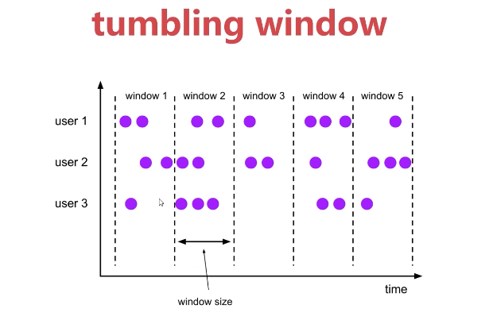

#  Flink实战

[返回列表](https://github.com/EmonCodingBackEnd/backend-tutorial)

[TOC]

# 一、安装

[安装Spark](https://github.com/EmonCodingBackEnd/backend-tutorial/blob/master/tutorials/BigData/BigDataInAction.md#4%E5%AE%89%E8%A3%85spark)


# 二、快速了解Flink

## 2.1、什么是FLink

Apache Flink是一个开源的分布式、高性能、高可用，准确的流处理框架。

- 分布式：表示Flink程序开源运行在很多台机器上；
- 高性能：表示Flink处理性能比较高；
- 高可用：表示Flink支持程序的自动重启机制；
- 准确的：表示Flink可以保证处理数据的准确性。

Flink支持流处理和批处理，虽然我们刚才说了Flink是一个流处理框架，但是它也支持批处理。其实对对于Flink而言，它是一个流处理框架，批处理只是流处理的一个极限特例而已。


左边是数据源，从这里面可以看出来，这些数据是实时产生的一些日志，或者是数据库、文件系统、KV存储系统中的数据。

中间是Flink，负责对数据进行处理。

右边是目的地，Flink可以将计算好的数据输出到其他应用中，或者存储系统中。

## 2.2、Flink架构图

下面我们来看一下Flink的架构图。


首先图片最下面表示Flink的一些部署模式，支持Local和集群（Standalone，YARN），也支持在云上部署。

往上一层是Flink的核心，分布式的流处理引擎。

再往上面是Flink的API和类库。

主要有两大块API，DataStream API和DataSet API，分别做流处理和批处理。

针对DataStream API这块，支持复杂事件处理，和table操作，其实也是支持SQL操作的。

针对DataSet API，支持FlinkML机器学习，Gelly图计算，table操作，这块也是支持SQL操作的。

其实从这可以看出来，Flink也是有自己的生态圈的，里面包含了实时计算、离线计算、机器学习、图计算、Table和SQL计算等等。

所以说它和Spark还是有点像的，不过它们两个的底层计算引擎是有本质区别的。


## 2.3、Flink三大核心组件

- Data Source：数据源（负责接收数据）
- Transformations：算子（负责对数据进行处理）
- Data Sink：输出组件（负责把计算好的数据输出到其他存储介质中）


## 2.4、Flink的流处理与批处理

记下来我们来分析一下Flink这个计算引擎的核心内容。

- 在大数据处理领域，批处理和流处理一般被认为是两种不同的任务，一个大数据框架一般会被设计为只能处理其中一种任务。

例如Storm只支持流处理任务，而MapReduce、Spark只支持批处理任务。Spark Streaming是Spark之上支持流处理任务的子系统，看似是一个特例，其实并不是——Spark Streaming采用了一种micro-batch的架构，就是把输入的数据流切分成细粒度的batch，并为每一个batch提交一个批处理的Spark任务，所以Spark Streaming本质上执行的还是批处理任务，和Storm这种流式的数据处理方式是完全不同的。

- Flink通过灵活的执行引擎，能够同时支持批处理和流处理

在执行引擎这一层，流处理系统与批处理系统最大的不同在于节点之间的数据传输方式。

对于一个流处理系统，其节点间数据传输的标准模型是：当一条数据被处理完成后，序列化到缓存中，然后立刻通过网络传输到下一个节点，由下一个节点继续处理。

这就是典型的一条一条处理。

而对于一个批处理系统，其节点间数据传输的标准模型是：当一条数据被处理完成后，序列化到缓存中，并不会立刻通过网络传输到下一个节点，当缓存写满的时候，就持久化到本地硬盘上，当所有数据都被处理完成后，才开始将处理后的数据通过网络传输到下一个节点。

这两种数据传输模式是两个极端，对应的是流处理系统对低延迟的要求和批处理系统对高吞吐量的要求Flink的执行引擎采用了一种十分灵活的方式，同时支持了这两种传输模型。

Flink以固定的缓存块为单位进行网络数据传输，用户可以通过缓存块超时值指定缓存块的传输时机。如果缓存块的超时值为0，则Flink的数据传输方式类似前面所说的流处理系统的标准模型，此时系统可以获得最低的处理延迟。

如果缓存块的超时值为无限大，则Flink的数据传输方式类似前面所说的批处理系统的标准模型，此时系统可以火鹅最高的吞吐量。

这样就比较灵活了，其实底层还是流失计算模型，批处理只是一个极限特例而已。

看一下这个图中显示的三种数据传输模型。


第一个：一条一条处理；

第二个：一批一批处理；

第三个：按照缓存块进行处理，缓存块可以无限小，也可以无限大，这样就可以同时支持流处理和批处理了。

## 2.5、Storm VS SparkStreaming VS Flink

接下来我们来对比一下目前大数据领域中的三种实时计算引擎。

| 产品     | Storm         | SparkStreaming | Flink        |
| -------- | ------------- | -------------- | ------------ |
| 模型     | Native        | Micro-Batching | Native       |
| 产品     | Storm         | SparkStreaming | Flink        |
| 语义     | At-least-once | Exactly-once   | Exactly-once |
| 容错机制 | Ack           | Checkpoint     | Checkpoint   |
| 状态管理 | 无            | 基于DStream    | 基于操作     |
| 延时     | Low           | Medium         | Low          |
| 吞吐量   | Low           | High           | High         |

解释：

Native：表示来一条数据处理一条数据；

Mirco-Batch：表示划分小批，一小批一小批的处理数据；

组合式：表示是基础API，例如实现一个求和操作都需要写代码实现，比较麻烦，代码量会比较多；

声明式：表示提供的是封装后的高阶函数，例如filter、count等函数，可以直接使用，比较方便，代码量比较少。

## 2.6、实时计算框架如何选择

1：需要关注流数据是否需要进行状态管理；

2：消息语义是否有特殊要求At-least-once或者Exectly-once；

3：小型独立的项目，需要低延迟的场景，建议使用Storm；

4：如果项目中已经使用了Spark，并且秒级别的实时处理可以满足需求，建议使用SparkStreaming；

5：要求消息语义为Exectly-once，数据量较大，要求高吞吐低延迟，需要进行状态管理，建议选择Flink。


# 三、Flink快速上手使用

## 3.1、Flink任务日志

使用on yarn模式提交Flink任务时，在任务执行中，点击对应任务的Tracking UI列的ApplicationMaster，可以打开Flink界面。

操作路径：在yarn的web界面([http://emon:8088](http://emon:8088/)) ==> 点击对应任务的ApplicationMaster链接（任务执行完成后只能看到history链接）==>点击查看。

如果是history链接，点击进去是看不到flink内容的。

如何解决？开启Flink HistoryServer进程。

任意选择一个服务器开启，选择集群内的节点或者Flink的客户端节点都可以。

下面我们就在这个Flink的客户端节点上启动Flink的historyserver进程。

**说明**：该配置基于Hadoop的MapReduce任务日志配置，请先确保MapReduce的任务日志配置OK！

- `flink-conf.yml`

```bash
[emon@emon ~]$ vim /usr/local/flink/conf/flink-conf.yaml 
```

```yaml
# [新增]
#jobmanager.archive.fs.dir: hdfs:///completed-jobs/
jobmanager.archive.fs.dir: hdfs://emon:8020/tmp/logs/flink-jobs/
# [新增]
#historyserver.web.address: 0.0.0.0
historyserver.web.address: emon
# [新增]
#historyserver.web.port: 8082
historyserver.web.port: 8082
# [新增]
#historyserver.archive.fs.dir: hdfs:///completed-jobs/
historyserver.archive.fs.dir: hdfs://emon:8020/tmp/logs/flink-jobs/
# [新增]
#historyserver.archive.fs.refresh-interval: 10000
historyserver.archive.fs.refresh-interval: 10000
```

注意：在哪个节点上启动Flink的historyserver进程，`historyserver.web.address`的值里面就指定哪个节点的主机名信息。

- 确保日志目录存在

由于不是在根目录(hdfs://emon:8020/)下创建日志目录，需要确保目录已存在。

```bash
# 如果日志目录不存在，启动时会报错
[emon@emon ~]$ hdfs dfs -mkdir -p hdfs://emon:8020/tmp/logs/flink-jobs
```

- 启动

```bash
[emon@emon ~]$ /usr/local/flink/bin/historyserver.sh start
# 命令行输出结果
Starting historyserver daemon on host emon.
```

- 验证

```bash
# 其他进程忽略显示，看到如下进程表示Flink的HistoryServer启动成功
[emon@emon ~]$ jps
13682 HistoryServer
```

访问：

http://emon:8082/#/overview

- 停止

```bash
[emon@emon ~]$ /usr/local/flink/bin/historyserver.sh stop
# 命令行输出结果
Stopping historyserver daemon (pid: 13682) on host emon.
```


## 3.2、Flink核心API


Flink中提供了4中不同层次的API，每种API在简洁和易表达之间有自己的权衡，适用于不同的场景。目前上面3个会用得比较多。

- 低级API（Stateful Stream Processing）：提供了对时间和状态的细粒度控制，简洁性和易用性较差，主要应用在一些复杂事件处理逻辑上。
- 核心API（DataStream/DataSet API）：主要提供了针对流数据和批数据的处理，是针对低级API进行了一些封装，提供了filter、sum、max、min等高级函数，简单易用，所以这些API在工作中应用还是比较广泛的。
- Table API：一般与DataSet或者DataStream紧密关联，可以通过一个DataSet或DataStream创建出一个Table，然后再使用类似于filter，join，或者select这种操作。最后还可以将一个Table对象转换成DataSet或者DataStream。
- SQL：Flink的SQL底层是基于Apache Calcite，Apache Calcite实现了标准的SQL，使用起来比其他API更加灵活，因为可以直接使用SQL语句。Table API和SQL可以很容易地结合在一起使用，因为它们都返回Table对象。

针对这些API我们主要学习下面这些：


下面首先来看一下DataStream API：

### 3.2.1、DataStream API

DataStream API主要分为3块：DataSource、Transformation、DataSink。

DataSource是程序的输入数据源。

Transformation是具体的操作，它对一个或多个输入数据源进行计算处理，例如map、flatMap和filter等操作。

DataSink是程序的输出，它可以把Transformation处理之后的数据输出到指定的存储介质中。

### 3.2.2、DataStream API之DataSource

DataSource是程序的输入数据源，Flink提供了大量内置的DataSource，也支持自定义DataSource，不过目前Flink提供的这些已经足够我们正常使用了。

Flink提供的内置输入数据源：包括基于Socket、基于Collection。

还有就是Flink还提供了一批Connectors，可以实现读取第三方数据源。

| Flink内置             | Apache Bahir |
| --------------------- | ------------ |
| Kafka                 | ActiveMQ     |
| Kinesis Streams       | Netty        |
| RabbitMQ              |              |
| NiFi                  |              |
| Twitter Streaming API |              |
| Google PubSub         |              |

Flink内置：表示Flink中默认自带的。

Apache Bahir：表示需要添加这个依赖包之后才能使用。

当程序出现错误时，Flink的容错机制能恢复并继续运行程序，这种错误包括机器故障、网络故障、程序故障等。

针对Flink提供的常用数据源接口，如果程序开启了checkpoint快照机制，Flink可以提供这些容错性保证。

| DataSource | 容错保证     | 备注                   |
| ---------- | ------------ | ---------------------- |
| DataSource | ad most once |                        |
| Collection | exactly once |                        |
| Kafka      | exactly once | 需要使用0.10及以上版本 |


### 3.2.3、DataStream API之Transformation

transformation是Flink程序的计算算子，负责对数据进行处理，Flink提供了大量的算子，其实Flink中的大部分算子的使用和spark中算子的使用是一样的，下面我们来看一下：

| 算子            | 解释                                                 |
| --------------- | ---------------------------------------------------- |
| map             | 输入一个元素进行处理，返回一个元素                   |
| flatMap         | 输入一个元素进行处理，可以返回多个元素               |
| filter          | 对数据进行过滤，符合条件的数据会被留下               |
| keyBy           | 根据key分组，相同key的数据会进入同一个分区           |
| reduce          | 对当前元素和上一次的结果进行聚合操作                 |
| aggregations    | sum(),min(),max()等                                  |
| union           | 合并多个流，多个流的数据类型必须一致                 |
| connect         | 只能连接两个流，两个流的数据类型可以不同             |
| split           | 根据规则把一个数据流切分为多个流                     |
| shuffle         | random 随机分区                                      |
| rebalance       | rebalance 对数据集进行再平衡，重新分区，消除数据倾斜 |
| rescale         | 重分区                                               |
| broadcast       | 广播分区                                             |
| partitionCustom | custom partition 自定义分区                          |


### 3.2.4、DataStream API之DataSink

DataSink是输出组件，负责把计算好的数据输出到其他存储介质中。

Flink支持把流数据输出到文件中，不过在实际工作中这种场景不多，因为流数据处理之后一般会存储到一些消息队列里面，或者数据库里面，很少会保存到文件中的。

还有就是print，直接打印，这个其实我们已经用过很多次了，这种用法主要是在测试的时候使用的，方便查看输出的结果信息。

Flink提供了一批Connectors，可以实现输出到第三方目的地。

| Flink内置         | Apache Bahir |
| ----------------- | ------------ |
| Kafka             | ActiveMQ     |
| Cassandra         | Flume        |
| Kinesis Streams   | Redis        |
| Elasticsearch     | Akka         |
| Hadoop FileSystem |              |
| RabbitMQ          |              |


针对Sink的这些connector，我们在实际工作中最常用的是Kafka、redis。

针对Flink提供的常用Sink组件，可以提供这些容错性保证：

| DataSink | 容错保证                     | 备注                                                         |
| -------- | ---------------------------- | ------------------------------------------------------------ |
| Redis    | at least once                |                                                              |
| Kafka    | at least once / exactly once | Kafka0.9和0.10提供at least once，Kafka0.11及以上提供exactly once |


> 注意：Redis Sink是在Bahir这个依赖包中，所以在pom.xml中需要添加对应的依赖。


### 3.2.5、DataSet API

DataSet API主要可以分为3块来分析：DataSource、Transformation、Sink。

DataSource是程序的数据源输入。

Transformation是具体的操作，它对一个或多个输入数据源进行计算处理，例如map、flatMap、filter等操作。

DataSink是程序的输出，它可以把Transformation处理之后的数据输出到指定的存储介质中。


### 3.2.6、DataSet API之DataSource

针对DataSet批处理而言，其实最多的就是读取HDFS中的文件数据，所以在这里我们主要介绍两个DataSource组件。

- 基于集合

fromCollection(Collection)，主要是为了方便测试使用。它的用法和DataStreamAPI中的用法一样，我们已经用过很多次了。

- 基于文件

readTextFile(path)，读取hdfs中的数据文件。这个前面我们也使用过了。


### 3.2.7、DataSet API之Transformation

| 算子         | 解释                                   |
| ------------ | -------------------------------------- |
| map          | 输入一个元素进行处理，返回一个元素     |
| mapPartition | 类似map，一次处理一个分区的数据        |
| flatMap      | 输入一个元素进行处理，可以返回多个元素 |
| filter       | 对数据进行过滤，符合条件的数据会被留下 |
| reduce       | 对当前元素和上一次的结果进行聚合操作   |
| aggregate    | sum(),min(),max()等                    |
| distinct     | 返回数据集中去重后的元素·              |
| join         | 内连接，可以连接两份数据集             |
| outerJoin    | 外连接                                 |
| cross        | 获取两个数据集的笛卡尔积               |
| union        | 返回多个数据集的总和，数据类型需要一直 |
| first-n      | 获取集合中的前N个元素                  |


### 3.2.8、Table API&SQL

> 注意：Table API和SQL现在还处于活跃开发阶段，还没有完全实现Flink中所有的特性。不是所有的[Table API, SQL]和[流, 批]的组合都是支持的。

Table API和SQL的由来：

Flink针对标准的流处理和批处理提供了两种关系型API，Table API和SQL。Table API允许用户以一种很直观的方式进行select、filter和join操作。Flink SQL基于Apache Calcite实现标准SQL。针对批处理和流处理可以提供相同的处理语义和结果。

Flink Table API、SQL和Flink的DataStream API、DataSet API是紧密联系在一起的。

Table API和SQL是一种关系型API，用户可以像操作MySQL数据库表一样的操作数据，而不需要写代码，更不需要手工的对代码进行调优。另外，SQL作为一个非程序员可操作的语言，学习成本很低，如果一个系统提供SQL支持，将很容易被用户接受。


### 3.2.9、DataStream、DataSet和Table之间的互相转换

Table API和SQL可以很容易的和DataStream和DataSet程序集成到一块。通过TableEnvironment，可以把DataStream或者DataSet注册为Table，这样就可以使用Table API和SQL查询了。通过TableEnvironment也可以把Table对象转换为DataStream或者DataSet，这样就可以使用DataStream或者DataSet中的相关API了。

1：使用DataStream创建表，主要包含下面两种情况

- 使用DataStream创建view视图
- 使用DataStream创建table对象

2：使用DataSet创建表

> 注意：此时只能使用旧的执行引擎，新的Blink执行引擎不支持和DataSet转换


将Table转换为DataStream或者DataSet时，你需要指定生成的DataStream或者DataSet的数据类型，即，Table的每行数据要转换成的数据类型。通常最方便的选择是转换成Row。

以下列表概述了不同选项的功能：

Row：通过角标映射字段，支持任意数量的字段，支持null值，无类型安全（type-safe）检查。

POJO：Java中的实体类，这个实体类中的字段名称需要和Table中的字段名称保持一致，支持任意数量的字段，支持null值，有类型安全检查。

Case Class：通过角标映射字段，不支持null值，有类型安全检查。

Tuple：通过角标映射字段，Scala中限制22个字段，Java中限制25个字段，不支持null值，有类型安全检查。

Atomic Type：Table必须有一个字段，不支持null值，有类型安全检查。


3：将表转换成DataStream

流式查询的结果Table会被动态地更新，即每个新的记录到达输入流时结果就会发生变化。因此动态查询的DataStream需要对表的更新进行编码。

有几种模式可以将Table转换为DataStream。

- Append Mode：这种模式只适用于当动态表仅由Insert这种操作进行修改时（仅附加），之前添加的数据不会被更新。
- Retract Mode：可以始终使用此模式，它使用一个Boolean标志来编码Insert和Delete更改。


4：将表转换成DataSet


# 四、Flink高级进阶之路

## 4.1、Flink中的Window和Time详解

### 4.1.1、Window（窗口）

- Window是一种可以把无界数据切割为有界数据块的手段
- Window可以是时间驱动的【Time Window】（例如：每30秒），或者数据驱动的【Count Window】（例如：每100个元素）

滚动窗口：



滑动窗口：


Window类型汇总：


### 4.1.2、案例：Window的应用

- 滚动窗口

```scala
// 表示滚动窗口的窗口大小为10秒，对每10秒内的数据进行聚合计算
timeWindow(Time.seconds(10))
// 表示滚动窗口的大小是5个元素，也就是当窗口中填满5个元素的时候，就会对窗口进行计算了
countWindow(5)
```

- 滑动窗口

```scala
// 表示滑动窗口的窗口大小为10秒，滑动间隔5秒，就是每隔5秒计算前10秒
timeWindow(Time.seconds(10),Time.seconds(5))
// 表示滑动窗口的窗口大小是5个元素，滑动的间隔为1个元素，也就是说每新增1个元素就会对前面5个元素计算一次
countWindow(5,1)
```

### 4.1.3、Window聚合

- 增量聚合：窗口中每进入一条数据，就进行一次计算
  - 代表函数：reduce()、aggregate()、sum()、min()、max()


- 全量聚合：等属于窗口的数据到齐，才开始进行聚合计算【可以实现对窗口内的数据进行排序等需求】
  - 代表函数：apply(windowFunction)、process(processWindowFunction)；processWindowFunction比windowFunction提供了更多的上下文信息。


### 4.1.4、Time

- Event Time：事件产生的时间，通常由事件中的时间戳描述

- Ingestion time：事件进入Flink的时间
- Processing Time：事件被处理时当前系统的时间


### 4.1.5、Time案例分析

- 原始日志：2026-01-01 10:00:01 INFO executor.Executor:Finished task in state 0.0
- 日志数据进入Flink的时间是：2026-01-01 20:00:01
- 日志数据到达Window处理的时间是：2026-01-01 20:00:02

如果我们想要统计每分钟内接口调用失败的错误日志个数使用哪个时间才有意义？

原始日志时间。

Flink中Time类型默认是ProcessingTime，可以修改如下：

```scala
env.setStreamTimeCharacteristc(TimeCharacteristic.EventTime)
// 或者：
env.setStreamTimeCharacteristc(TimeCharacteristic.IngestionTime)
```


## 4.2、Flink中的Watermark深入剖析

### 4.2.1、Watermark

当我们使用EventTime处理流数据的时候会遇到数据乱序的问题，流处理从数据产生，到流经是Source，再到具体的算子，中间是有一个过程和时间的。虽然大部分情况下，传输到算子的数据都是按照数据产生的时间顺序来的，但是也不排除由于网络延迟等原因，导致乱序的产生，特别是使用Kafka的时候，多个分区之间的数据无法保证有序。

所以在进行Window计算的时候，我们又不能无限期地等下去，必须要有一个机制来保证一个特定的时间后，必须触发Window去进行计算了。

**这个特别的机制就是Watermark**。

使用Watermark+EventTime处理乱序数据。Watermark可以翻译为水位线。

### 4.2.2、有序数据流的Watermark


in order：有序的数据流，从左往右。

方块代表的是具体的数据，方块里面的数字代表的是数据产生的时间。

w(11)：表示watermark的值为11，此时表示11之前的数据都到了，可以进行计算了。

w(20)：表示watermark的值为20，此时表示20之前的数据都到了，可以进行计算了。


### 4.2.3、无序数据流的Watermark


out of order：无序的数据流。

w(11)：此时表示11之前的数据都到了，可以对11之前的数据进行计算了，大于11的数据暂时不计算。

w(17)：此时表示17之前的数据都到了，可以对17之前的数据进行计算了，大于17的数据暂时不计算。


### 4.2.4、多并行度数据流的Watermark


注意：在多并行度的情况下，Watermark会有一个对齐机制，这个对齐机制会取所有Channel中最小的Watermark，图中的14和29这两个Watermark，最终取值为14。这样才不会漏掉数据。


### 4.2.5、Watermark的生成方式

通常情况下，在接收到Source的数据后，应该立刻生成Watermark，但是也可以在使用Map或者Filter操作之后，再生成Watermark。

Watermark的生成方式有两种：

- With Periodic Watermarks

周期性触发Watermark的生成和发送。

每隔N秒自动向流里面注入一股Watermark，时间间隔由 `ExecutionConfig.setAutoWatermarkInterval` 决定，现在新版本的Flink默认是 `200ms`。之前默认是 `100ms`。

可以定义一个最大允许乱序的时间，这种比较常用。

- WIth Punctuated Watermarks

基于某些事件触发Watermark的生成和发送。

基于事件向流里面注入一个Watermark，每一个元素都有机会判断是否生成一个Watermark。


### 4.2.6、案例：乱序数据处理

需求分析：

通过socket模拟产生数据，数据的格式为：0001,1790820682000

其中1790820682000是数据产生的时间，也就是EventTime；然后使用map函数对数据进行处理，把数据转换为tuple2的形式。接着再调用`assignTimestampsAndWatermarks`方法抽取timestamp并生成Watermark。

接着再调用Window打印信息来验证Window被触发的时机。最后验证乱序数据的处理方式。


### 4.2.7、通过数据跟踪观察Watermark

在这里重点查看Watermark和Timestamp的时间，通过数据的输出来确定Window的触发时机。

首先我们开启Socket，输入第一条数据。

```bash
[emon@emon ~]$ nc -lk 9000
0001,1790820682000
```

输出的内容：

```tex
key:0001,eventTime:[1790820682000|2026-10-01 10:11:22],currentMaxTimestamp:[1790820682000|2026-10-01 10:11:22],currentWatermark:[1790820672000|2026-10-01 10:11:12]
```

为了查看方便，我们把输出内容汇总到表格中：

| key  | EventTime           | CurrentMaxTimeStamp | Watermark           |
| ---- | ------------------- | ------------------- | ------------------- |
| 0001 | 1790820682000       | 1790820682000       | 1790820672000       |
|      | 2026-10-01 10:11:22 | 2026-10-01 10:11:22 | 2026-10-01 10:11:12 |

此时，Watermark的时间，已经落后于 currentMaxTimestamp 10 秒了，我们继续输入。

```bash
[emon@emon ~]$ nc -lk 9000
0001,1790820686000
```

此时，输出内容如下：

```tex
key:0001,eventTime:[1790820686000|2026-10-01 10:11:26],currentMaxTimestamp:[1790820686000|2026-10-01 10:11:26],currentWatermark:[1790820676000|2026-10-01 10:11:16]
```

我们再次汇总：

| key  | EventTime           | CurrentMaxTimeStamp | Watermark           |
| ---- | ------------------- | ------------------- | ------------------- |
| 0001 | 1790820682000       | 1790820682000       | 1790820672000       |
|      | 2026-10-01 10:11:22 | 2026-10-01 10:11:22 | 2026-10-01 10:11:12 |
| 0001 | 1790820686000       | 1790820686000       | 1790820676000       |
|      | 2026-10-01 10:11:26 | 2026-10-01 10:11:26 | 2026-10-01 10:11:16 |

继续输入。

```bash
[emon@emon ~]$ nc -lk 9000
0001,1790820692000
```

输出内容如下：

```text
key:0001,eventTime:[1790820692000|2026-10-01 10:11:32],currentMaxTimestamp:[1790820692000|2026-10-01 10:11:32],currentWatermark:[1790820682000|2026-10-01 10:11:22]
```

汇总结果如下：

| key  | EventTime                                        | CurrentMaxTimeStamp | Watermark                                        |
| ---- | ------------------------------------------------ | ------------------- | ------------------------------------------------ |
| 0001 | 1790820682000                                    | 1790820682000       | 1790820672000                                    |
|      | <font color='red'>**2026-10-01 10:11:22**</font> | 2026-10-01 10:11:22 | 2026-10-01 10:11:12                              |
| 0001 | 1790820686000                                    | 1790820686000       | 1790820676000                                    |
|      | 2026-10-01 10:11:26                              | 2026-10-01 10:11:26 | 2026-10-01 10:11:16                              |
| 0001 | 1790820692000                                    | 1790820692000       | 1790820682000                                    |
|      | 2026-10-01 10:11:32                              | 2026-10-01 10:11:32 | <font color='red'>**2026-10-01 10:11:22**</font> |

到这里，Window仍然没有被触发，此时Watermark的时间已经等于第一条数据的EventTime了。那么Window到底什么时候被触发呢？我们再次输入。

```bash
[emon@emon ~]$ nc -lk 9000
0001,1790820693000
```

输出内容如下：

```tex
key:0001,eventTime:[1790820693000|2026-10-01 10:11:33],currentMaxTimestamp:[1790820693000|2026-10-01 10:11:33],currentWatermark:[1790820683000|2026-10-01 10:11:23]
```

汇总结果如下：

| key  | EventTime                                        | CurrentMaxTimeStamp | Watermark                                        |
| ---- | ------------------------------------------------ | ------------------- | ------------------------------------------------ |
| 0001 | 1790820682000                                    | 1790820682000       | 1790820672000                                    |
|      | <font color='red'>**2026-10-01 10:11:22**</font> | 2026-10-01 10:11:22 | 2026-10-01 10:11:12                              |
| 0001 | 1790820686000                                    | 1790820686000       | 1790820676000                                    |
|      | 2026-10-01 10:11:26                              | 2026-10-01 10:11:26 | 2026-10-01 10:11:16                              |
| 0001 | 1790820692000                                    | 1790820692000       | 1790820682000                                    |
|      | 2026-10-01 10:11:32                              | 2026-10-01 10:11:32 | 2026-10-01 10:11:22                              |
| 0001 | 1790820693000                                    | 1790820693000       | 1790820683000                                    |
|      | 2026-10-01 10:11:33                              | 2026-10-01 10:11:33 | <font color='red'>**2026-10-01 10:11:23**</font> |

Window仍然没有触发，此时，我们的数据已经发到 2026-10-01 10:11:33 了，根据EventTime来算，最早的数据已经过去了11s了，Window还没有开始计算，那么到底什么时候会触发Window呢？

我们再次增加1s，输入：

```bash
[emon@emon ~]$ nc -lk 9000
0001,1790820694000
```

输出内容如下：

注意：此时窗口执行了。

```tex
key:0001,eventTime:[1790820694000|2026-10-01 10:11:34],currentMaxTimestamp:[1790820694000|2026-10-01 10:11:34],currentWatermark:[1790820684000|2026-10-01 10:11:24]
```

窗口触发后执行的结果：

<font color='red'>*(0001),1,2026-10-01 10:11:22,2026-10-01 10:11:22,2026-10-01 10:11:21,2026-10-01 10:11:24*</font>

汇总结果如下：

| key  | EventTime                                        | CurrentMaxTimeStamp | Watermark                                        | Window_start_time                      | Window_end_time                        |
| ---- | ------------------------------------------------ | ------------------- | ------------------------------------------------ | -------------------------------------- | -------------------------------------- |
| 0001 | 1790820682000                                    | 1790820682000       | 1790820672000                                    |                                        |                                        |
|      | <font color='red'>**2026-10-01 10:11:22**</font> | 2026-10-01 10:11:22 | 2026-10-01 10:11:12                              |                                        |                                        |
| 0001 | 1790820686000                                    | 1790820686000       | 1790820676000                                    |                                        |                                        |
|      | 2026-10-01 10:11:26                              | 2026-10-01 10:11:26 | 2026-10-01 10:11:16                              |                                        |                                        |
| 0001 | 1790820692000                                    | 1790820692000       | 1790820682000                                    |                                        |                                        |
|      | 2026-10-01 10:11:32                              | 2026-10-01 10:11:32 | 2026-10-01 10:11:22                              |                                        |                                        |
| 0001 | 1790820693000                                    | 1790820693000       | 1790820683000                                    |                                        |                                        |
|      | 2026-10-01 10:11:33                              | 2026-10-01 10:11:33 | 2026-10-01 10:11:23                              |                                        |                                        |
| 0001 | 1790820694000                                    | 1790820694000       | 1790820684000                                    |                                        |                                        |
|      | 2026-10-01 10:11:34                              | 2026-10-01 10:11:34 | <font color='red'>**2026-10-01 10:11:24**</font> | <font color='red'>**[10:11:21**</font> | <font color='red'>**10:11:24)**</font> |

到这里，我们做一个说明。

Window的触发机制，是先按照自然时间将Window划分，如果Window大小是3s，那么1min内会把Window划分为如下的形式（左闭右开的区间）。

```tex
[00:00:00,00:00:03)
[00:00:03,00:00:06)
[00:00:06,00:00:09)
[00:00:09,00:00:12)
[00:00:12,00:00:15)
[00:00:15,00:00:18)
[00:00:18,00:00:21)
[00:00:21,00:00:24)
[00:00:24,00:00:27)
[00:00:27,00:00:30)
[00:00:30,00:00:33)
[00:00:33,00:00:36)
[00:00:36,00:00:39)
[00:00:39,00:00:42)
[00:00:42,00:00:45)
[00:00:45,00:00:48)
[00:00:51,00:00:54)
[00:00:54,00:00:57)
[00:00:57,00:01:00)
......
```

Window的设定无关数据本身，而是系统定义好了的。

输入的数据，根据自身的EventTime，将数据划分到不同的Window中，如果Window中有数据，则当Watermark时间>=EventTime时，就符合了Window触发的条件了，最终决定Window触发，还是由数据本身的EventTime所属Window中的window_end_time决定。

上面的测试中，最后一条数据到达后，其水位线（Watermark）已经上升至10:11:24，正好是最早的一条记录所在Window的window_end_time，所以Window就被触发了。

为了验证Window的触发机制，我们继续输入数据：

```bash
[emon@emon ~]$ nc -lk 9000
0001,1790820696000
```

输出内容如下：

```tex
key:0001,eventTime:[1790820696000|2026-10-01 10:11:36],currentMaxTimestamp:[1790820696000|2026-10-01 10:11:36],currentWatermark:[1790820686000|2026-10-01 10:11:26]
```

汇总结果如下：

| key  | EventTime                                        | CurrentMaxTimeStamp | Watermark                                        | Window_start_time | Window_end_time |
| ---- | ------------------------------------------------ | ------------------- | ------------------------------------------------ | ----------------- | --------------- |
| 0001 | 1790820682000                                    | 1790820682000       | 1790820672000                                    |                   |                 |
|      | 2026-10-01 10:11:22                              | 2026-10-01 10:11:22 | 2026-10-01 10:11:12                              |                   |                 |
| 0001 | 1790820686000                                    | 1790820686000       | 1790820676000                                    |                   |                 |
|      | <font color='red'>**2026-10-01 10:11:26**</font> | 2026-10-01 10:11:26 | 2026-10-01 10:11:16                              |                   |                 |
| 0001 | 1790820692000                                    | 1790820692000       | 1790820682000                                    |                   |                 |
|      | 2026-10-01 10:11:32                              | 2026-10-01 10:11:32 | 2026-10-01 10:11:22                              |                   |                 |
| 0001 | 1790820693000                                    | 1790820693000       | 1790820683000                                    |                   |                 |
|      | 2026-10-01 10:11:33                              | 2026-10-01 10:11:33 | 2026-10-01 10:11:23                              |                   |                 |
| 0001 | 1790820694000                                    | 1790820694000       | 1790820684000                                    |                   |                 |
|      | 2026-10-01 10:11:34                              | 2026-10-01 10:11:34 | 2026-10-01 10:11:24                              | 10:11:21          | 10:11:24        |
| 0001 | 1790820696000                                    | 1790820696000       | 1790820686000                                    |                   |                 |
|      | 2026-10-01 10:11:36                              | 2026-10-01 10:11:36 | <font color='red'>**2026-10-01 10:11:26**</font> |                   |                 |

此时，Watermark时间虽然已经等于第二天数据的时间，但是由于其没有达到第二天数据所在Window的结束时间，所以Window并没有被触发。那么，第二条数据所在的Window时间区间如下。

```tex
[00:00:24,00:00:27)
```

也就是说，我们必须输入一个10:11:37的数据，第二条数据所在的Window才会被触发，我们继续输入。

```bash
[emon@emon ~]$ nc -lk 9000
0001,1790820697000
```

输出内容如下：

```tex
key:0001,eventTime:[1790820697000|2026-10-01 10:11:37],currentMaxTimestamp:[1790820697000|2026-10-01 10:11:37],currentWatermark:[1790820687000|2026-10-01 10:11:27]
```

窗口触发后执行的结果：

<font color='red'>*(0001),1,2026-10-01 10:11:26,2026-10-01 10:11:26,2026-10-01 10:11:24,2026-10-01 10:11:27*</font>

汇总结果如下：

| key  | EventTime                                        | CurrentMaxTimeStamp | Watermark                                        | Window_start_time                      | Window_end_time                        |
| ---- | ------------------------------------------------ | ------------------- | ------------------------------------------------ | -------------------------------------- | -------------------------------------- |
| 0001 | 1790820682000                                    | 1790820682000       | 1790820672000                                    |                                        |                                        |
|      | 2026-10-01 10:11:22                              | 2026-10-01 10:11:22 | 2026-10-01 10:11:12                              |                                        |                                        |
| 0001 | 1790820686000                                    | 1790820686000       | 1790820676000                                    |                                        |                                        |
|      | <font color='red'>**2026-10-01 10:11:26**</font> | 2026-10-01 10:11:26 | 2026-10-01 10:11:16                              |                                        |                                        |
| 0001 | 1790820692000                                    | 1790820692000       | 1790820682000                                    |                                        |                                        |
|      | 2026-10-01 10:11:32                              | 2026-10-01 10:11:32 | 2026-10-01 10:11:22                              |                                        |                                        |
| 0001 | 1790820693000                                    | 1790820693000       | 1790820683000                                    |                                        |                                        |
|      | 2026-10-01 10:11:33                              | 2026-10-01 10:11:33 | 2026-10-01 10:11:23                              |                                        |                                        |
| 0001 | 1790820694000                                    | 1790820694000       | 1790820684000                                    |                                        |                                        |
|      | 2026-10-01 10:11:34                              | 2026-10-01 10:11:34 | 2026-10-01 10:11:24                              | 10:11:21                               | 10:11:24                               |
| 0001 | 1790820696000                                    | 1790820696000       | 1790820686000                                    |                                        |                                        |
|      | 2026-10-01 10:11:36                              | 2026-10-01 10:11:36 | 2026-10-01 10:11:26                              |                                        |                                        |
| 0001 | 1790820697000                                    | 1790820697000       | 1790820687000                                    |                                        |                                        |
|      | 2026-10-01 10:11:37                              | 2026-10-01 10:11:37 | <font color='red'>**2026-10-01 10:11:27**</font> | <font color='red'>**[10:11:24**</font> | <font color='red'>**10:11:27)**</font> |

此时，我们已经看到，Window的触发要符合以下几个条件。

1：Watermark时间>=window_end_time。

2：在[window_start_time,window_end_time)区间中有数据存在（注意是左闭右开的区间）。

同时满足了以上2个条件，Window才会触发。

### 4.2.8、Watermark+EventTime处理乱序数据

**程序不需要重启，接着4.2.7继续**

我们上面的测试，数据都是按照时间顺序递增的，现在，我们输入一些乱序的数据，看看Watermark集合EventTime机制，是如何处理乱序数据的。

在上面的基础上再输入两行数据。

```bash
[emon@emon ~]$ nc -lk 9000
0001,1790820699000
0001,1790820691000
```

输出内容如下：

```bash
key:0001,eventTime:[1790820699000|2026-10-01 10:11:39],currentMaxTimestamp:[1790820699000|2026-10-01 10:11:39],currentWatermark:[1790820689000|2026-10-01 10:11:29]
key:0001,eventTime:[1790820691000|2026-10-01 10:11:31],currentMaxTimestamp:[1790820699000|2026-10-01 10:11:39],currentWatermark:[1790820689000|2026-10-01 10:11:29]
```

汇总结果如下：

| key  | EventTime           | CurrentMaxTimeStamp                              | Watermark                                        | Window_start_time | Window_end_time |
| ---- | ------------------- | ------------------------------------------------ | ------------------------------------------------ | ----------------- | --------------- |
| 0001 | 1790820682000       | 1790820682000                                    | 1790820672000                                    |                   |                 |
|      | 2026-10-01 10:11:22 | 2026-10-01 10:11:22                              | 2026-10-01 10:11:12                              |                   |                 |
| 0001 | 1790820686000       | 1790820686000                                    | 1790820676000                                    |                   |                 |
|      | 2026-10-01 10:11:26 | 2026-10-01 10:11:26                              | 2026-10-01 10:11:16                              |                   |                 |
| 0001 | 1790820692000       | 1790820692000                                    | 1790820682000                                    |                   |                 |
|      | 2026-10-01 10:11:32 | 2026-10-01 10:11:32                              | 2026-10-01 10:11:22                              |                   |                 |
| 0001 | 1790820693000       | 1790820693000                                    | 1790820683000                                    |                   |                 |
|      | 2026-10-01 10:11:33 | 2026-10-01 10:11:33                              | 2026-10-01 10:11:23                              |                   |                 |
| 0001 | 1790820694000       | 1790820694000                                    | 1790820684000                                    |                   |                 |
|      | 2026-10-01 10:11:34 | 2026-10-01 10:11:34                              | 2026-10-01 10:11:24                              | 10:11:21          | 10:11:24        |
| 0001 | 1790820696000       | 1790820696000                                    | 1790820686000                                    |                   |                 |
|      | 2026-10-01 10:11:36 | 2026-10-01 10:11:36                              | 2026-10-01 10:11:26                              |                   |                 |
| 0001 | 1790820697000       | 1790820697000                                    | 1790820687000                                    |                   |                 |
|      | 2026-10-01 10:11:37 | 2026-10-01 10:11:37                              | 2026-10-01 10:11:27                              | 10:11:24          | 10:11:27        |
| 0001 | 1790820699000       | 1790820699000                                    | 1790820689000                                    |                   |                 |
|      | 2026-10-01 10:11:39 | 2026-10-01 10:11:39                              | 2026-10-01 10:11:29                              |                   |                 |
| 0001 | 1790820691000       | 1790820699000                                    | 1790820689000                                    |                   |                 |
|      | 2026-10-01 10:11:31 | <font color='red'>**2026-10-01 10:11:39**</font> | <font color='red'>**2026-10-01 10:11:29**</font> |                   |                 |

可以看到，虽然我们输入了一个10:11:31的数据，但是currentMaxTimestamp和Watermark都没变。此时，按照我们上面提到的公式。

1：watermark时间>=window_end_time

2：在[window_start_time,window_end_time)中有数据存在

Watermark时间(10:11:29)<window_end_time(10:11:33)，因此不能触发Window。

备注：`10:11:33`的依据是数据`2026-10-01 10:11:32`在`[00:00:30,00:00:33)`区间。

那如果我们再次输入一条10:11:43的数据，此时Watermark时间会上升到10:11:33，这时的Window一定就会触发了，我们试一试，继续输入内容。

```bash
[emon@emon ~]$ nc -lk 9000
0001,1790820703000
```

输出内容如下：

```tex
key:0001,eventTime:[1790820703000|2026-10-01 10:11:43],currentMaxTimestamp:[1790820703000|2026-10-01 10:11:43],currentWatermark:[1790820693000|2026-10-01 10:11:33]
```

窗口触发后执行的结果：

<font color='red'>*(0001),2,2026-10-01 10:11:31,2026-10-01 10:11:32,2026-10-01 10:11:30,2026-10-01 10:11:33*</font>

汇总结果如下：

| key  | EventTime                                        | CurrentMaxTimeStamp | Watermark           | Window_start_time                      | Window_end_time                        |
| ---- | ------------------------------------------------ | ------------------- | ------------------- | -------------------------------------- | -------------------------------------- |
| 0001 | 1790820682000                                    | 1790820682000       | 1790820672000       |                                        |                                        |
|      | 2026-10-01 10:11:22                              | 2026-10-01 10:11:22 | 2026-10-01 10:11:12 |                                        |                                        |
| 0001 | 1790820686000                                    | 1790820686000       | 1790820676000       |                                        |                                        |
|      | 2026-10-01 10:11:26                              | 2026-10-01 10:11:26 | 2026-10-01 10:11:16 |                                        |                                        |
| 0001 | 1790820692000                                    | 1790820692000       | 1790820682000       |                                        |                                        |
|      | <font color='red'>**2026-10-01 10:11:32**</font> | 2026-10-01 10:11:32 | 2026-10-01 10:11:22 |                                        |                                        |
| 0001 | 1790820693000                                    | 1790820693000       | 1790820683000       |                                        |                                        |
|      | 2026-10-01 10:11:33                              | 2026-10-01 10:11:33 | 2026-10-01 10:11:23 |                                        |                                        |
| 0001 | 1790820694000                                    | 1790820694000       | 1790820684000       |                                        |                                        |
|      | 2026-10-01 10:11:34                              | 2026-10-01 10:11:34 | 2026-10-01 10:11:24 | 10:11:21                               | 10:11:24                               |
| 0001 | 1790820696000                                    | 1790820696000       | 1790820686000       |                                        |                                        |
|      | 2026-10-01 10:11:36                              | 2026-10-01 10:11:36 | 2026-10-01 10:11:26 |                                        |                                        |
| 0001 | 1790820697000                                    | 1790820697000       | 1790820687000       |                                        |                                        |
|      | 2026-10-01 10:11:37                              | 2026-10-01 10:11:37 | 2026-10-01 10:11:27 | 10:11:24                               | 10:11:27                               |
| 0001 | 1790820699000                                    | 1790820699000       | 1790820689000       |                                        |                                        |
|      | 2026-10-01 10:11:39                              | 2026-10-01 10:11:39 | 2026-10-01 10:11:29 |                                        |                                        |
| 0001 | 1790820691000                                    | 1790820699000       | 1790820689000       |                                        |                                        |
|      | <font color='red'>**2026-10-01 10:11:31**</font> | 2026-10-01 10:11:39 | 2026-10-01 10:11:29 |                                        |                                        |
| 0001 | 1790820703000                                    | 1790820703000       | 1790820693000       |                                        |                                        |
|      | 2026-10-01 10:11:43                              | 2026-10-01 10:11:43 | 2026-10-01 10:11:33 | <font color='red'>**[10:11:30**</font> | <font color='red'>**10:11:33)**</font> |

这里我们可以看到，窗口中有2个数据，10:11:31和10:11:32，但是没有10:11:33的数据，原因是窗口是一个前闭后开的区间，10:11:33的数据是属于[10:11:33,10:11:36)这个窗口的。

上边的结果，已经表明，对于迟到的数据，Flink可以通过Watermark来实现处理一定范围内的乱序数据。那么对于“迟到（late element）”太久的数据，Flink是怎么处理的呢？


### 4.2.9、Late Element（延迟数据）的处理方式

**程序需要重启，重新开始**

#### 1：丢弃（默认）

针对延迟太久的数据有3种处理方案。

1：丢弃（默认）

我们输入一个乱序很多的（其实只要Event Time<Watermark时间）数据来测试一下：

输入2行内容。

```bash
[emon@emon ~]$ nc -lk 9000
0001,1790820690000
0001,1790820703000
```

输出内容如下：

```tex
key:0001,eventTime:[1790820690000|2026-10-01 10:11:30],currentMaxTimestamp:[1790820690000|2026-10-01 10:11:30],currentWatermark:[1790820680000|2026-10-01 10:11:20]
key:0001,eventTime:[1790820703000|2026-10-01 10:11:43],currentMaxTimestamp:[1790820703000|2026-10-01 10:11:43],currentWatermark:[1790820693000|2026-10-01 10:11:33]
```

<font color='red'>*(0001),1,2026-10-01 10:11:30,2026-10-01 10:11:30,2026-10-01 10:11:30,2026-10-01 10:11:33*</font>

汇总结果如下：

| key  | EventTime                                        | CurrentMaxTimeStamp | Watermark                                        | Window_start_time                      | Window_end_time                        |
| ---- | ------------------------------------------------ | ------------------- | ------------------------------------------------ | -------------------------------------- | -------------------------------------- |
| 0001 | 1790820690000                                    | 1790820690000       | 1790820689000                                    |                                        |                                        |
|      | <font color='red'>**2026-10-01 10:11:30**</font> | 2026-10-01 10:11:30 | 2026-10-01 10:11:20                              |                                        |                                        |
| 0001 | 1790820703000                                    | 1790820703000       | 1790820693000                                    |                                        |                                        |
|      | 2026-10-01 10:11:43                              | 2026-10-01 10:11:43 | <font color='red'>**2026-10-01 10:11:33**</font> | <font color='red'>**[10:11:30**</font> | <font color='red'>**10:11:33)**</font> |

注意：此时watermark是2026-10-01 10:11:13


下面我们再输入几个EventTime小于Watermark的时间。

```bash
[emon@emon ~]$ nc -lk 9000
0001,1790820690000
0001,1790820691000
0001,1790820692000
```

输出内容如下：

```tex
key:0001,eventTime:[1790820690000|2026-10-01 10:11:30],currentMaxTimestamp:[1790820703000|2026-10-01 10:11:43],currentWatermark:[1790820693000|2026-10-01 10:11:33]
key:0001,eventTime:[1790820691000|2026-10-01 10:11:31],currentMaxTimestamp:[1790820703000|2026-10-01 10:11:43],currentWatermark:[1790820693000|2026-10-01 10:11:33]
key:0001,eventTime:[1790820692000|2026-10-01 10:11:32],currentMaxTimestamp:[1790820703000|2026-10-01 10:11:43],currentWatermark:[1790820693000|2026-10-01 10:11:33]
```

注意：此时并没有触发Window。因为输入的数据所在的窗口已经执行过了，Flink默认对这些迟到的数据的处理方案就是丢弃。


#### 2：allowedLateness指定允许数据延迟的时间

**程序需要重启，重新开始**

在某些情况下，我们希望对迟到的数据再提供一个宽容的时间。

Flink提供了allowedLateness方法可以实现对迟到的数据设置一个延迟时间，在指定延迟时间内到达的数据还是可以触发Window执行的。

添加一行代码，如下：

```scala
    waterMarkStream.keyBy(0)
      // 按照消息的EventTime分配窗口，和调用TimeWindow效果一样
      .window(TumblingEventTimeWindows.of(Time.seconds(3)))
      // 允许数据迟到2秒
      .allowedLateness(Time.seconds(2))
      // 使用全量聚合的方式处理Window中的数据
```

下面我们来验证一下，输入2行内容。

```bash
[emon@emon ~]$ nc -lk 9000
0001,1790820690000
0001,1790820703000
```

输出内容如下：

```tex
key:0001,eventTime:[1790820690000|2026-10-01 10:11:30],currentMaxTimestamp:[1790820690000|2026-10-01 10:11:30],currentWatermark:[1790820680000|2026-10-01 10:11:20]
key:0001,eventTime:[1790820703000|2026-10-01 10:11:43],currentMaxTimestamp:[1790820703000|2026-10-01 10:11:43],currentWatermark:[1790820693000|2026-10-01 10:11:33]
```

<font color='red'>*(0001),1,2026-10-01 10:11:30,2026-10-01 10:11:30,2026-10-01 10:11:30,2026-10-01 10:11:33*</font>

正常触发Window，没什么问题。


汇总结果如下：

| key  | EventTime                                        | CurrentMaxTimeStamp | Watermark                                        | Window_start_time                      | Window_end_time                        |
| ---- | ------------------------------------------------ | ------------------- | ------------------------------------------------ | -------------------------------------- | -------------------------------------- |
| 0001 | 1790820690000                                    | 1790820690000       | 1790820689000                                    |                                        |                                        |
|      | <font color='red'>**2026-10-01 10:11:30**</font> | 2026-10-01 10:11:30 | 2026-10-01 10:11:20                              |                                        |                                        |
| 0001 | 1790820703000                                    | 1790820703000       | 1790820693000                                    |                                        |                                        |
|      | 2026-10-01 10:11:43                              | 2026-10-01 10:11:43 | <font color='red'>**2026-10-01 10:11:33**</font> | <font color='red'>**[10:11:30**</font> | <font color='red'>**10:11:33)**</font> |

此时Watermark是2026-10-01 10:11:33，那么现在我们再输入几条EventTime<Watermark的数据验证一下效果，输入3行内容。

```bash
[emon@emon ~]$ nc -lk 9000
0001,1790820690000
0001,1790820691000
0001,1790820692000
```

输出内容如下：

```
key:0001,eventTime:[1790820690000|2026-10-01 10:11:30],currentMaxTimestamp:[1790820703000|2026-10-01 10:11:43],currentWatermark:[1790820693000|2026-10-01 10:11:33]
(0001),2,2026-10-01 10:11:30,2026-10-01 10:11:30,2026-10-01 10:11:30,2026-10-01 10:11:33
key:0001,eventTime:[1790820691000|2026-10-01 10:11:31],currentMaxTimestamp:[1790820703000|2026-10-01 10:11:43],currentWatermark:[1790820693000|2026-10-01 10:11:33]
(0001),3,2026-10-01 10:11:30,2026-10-01 10:11:31,2026-10-01 10:11:30,2026-10-01 10:11:33
key:0001,eventTime:[1790820692000|2026-10-01 10:11:32],currentMaxTimestamp:[1790820703000|2026-10-01 10:11:43],currentWatermark:[1790820693000|2026-10-01 10:11:33]
(0001),4,2026-10-01 10:11:30,2026-10-01 10:11:32,2026-10-01 10:11:30,2026-10-01 10:11:33
```

在这里看到每条数据都触发了Window执行。

| key  | EventTime           | CurrentMaxTimeStamp | Watermark                                        | Window_start_time                      | Window_end_time                        |
| ---- | ------------------- | ------------------- | ------------------------------------------------ | -------------------------------------- | -------------------------------------- |
| 0001 | 1790820690000       | 1790820690000       | 1790820689000                                    |                                        |                                        |
|      | 2026-10-01 10:11:30 | 2026-10-01 10:11:30 | 2026-10-01 10:11:20                              |                                        |                                        |
| 0001 | 1790820703000       | 1790820703000       | 1790820693000                                    |                                        |                                        |
|      | 2026-10-01 10:11:43 | 2026-10-01 10:11:43 | 2026-10-01 10:11:33                              | [10:11:30                              | 10:11:33)                              |
| 0001 | 1790820690000       | 1790820703000       | 1790820693000                                    |                                        |                                        |
|      | 2026-10-01 10:11:30 | 2026-10-01 10:11:43 | <font color='red'>**2026-10-01 10:11:33**</font> | <font color='red'>**[10:11:30**</font> | <font color='red'>**10:11:33)**</font> |
| 0001 | 1790820691000       | 1790820703000       | 1790820693000                                    |                                        |                                        |
|      | 2026-10-01 10:11:31 | 2026-10-01 10:11:43 | <font color='red'>**2026-10-01 10:11:33**</font> | <font color='red'>**[10:11:30**</font> | <font color='red'>**10:11:33)**</font> |
| 0001 | 1790820692000       | 1790820703000       | 1790820693000                                    |                                        |                                        |
|      | 2026-10-01 10:11:32 | 2026-10-01 10:11:43 | <font color='red'>**2026-10-01 10:11:33**</font> | <font color='red'>**[10:11:30**</font> | <font color='red'>**10:11:33)**</font> |

我们再输入1条数据，把Watermark调整到10:11:34。

```bash
[emon@emon ~]$ nc -lk 9000
0001,1790820704000
```

输出内容如下：

```bash
key:0001,eventTime:[1790820704000|2026-10-01 10:11:44],currentMaxTimestamp:[1790820704000|2026-10-01 10:11:44],currentWatermark:[1790820694000|2026-10-01 10:11:34]
```

| key  | EventTime           | CurrentMaxTimeStamp | Watermark           | Window_start_time | Window_end_time |
| ---- | ------------------- | ------------------- | ------------------- | ----------------- | --------------- |
| 0001 | 1790820690000       | 1790820690000       | 1790820689000       |                   |                 |
|      | 2026-10-01 10:11:30 | 2026-10-01 10:11:30 | 2026-10-01 10:11:20 |                   |                 |
| 0001 | 1790820703000       | 1790820703000       | 1790820693000       |                   |                 |
|      | 2026-10-01 10:11:43 | 2026-10-01 10:11:43 | 2026-10-01 10:11:33 | [10:11:30         | 10:11:33)       |
| 0001 | 1790820690000       | 1790820703000       | 1790820693000       |                   |                 |
|      | 2026-10-01 10:11:30 | 2026-10-01 10:11:43 | 2026-10-01 10:11:33 |                   |                 |
| 0001 | 1790820691000       | 1790820703000       | 1790820693000       |                   |                 |
|      | 2026-10-01 10:11:31 | 2026-10-01 10:11:43 | 2026-10-01 10:11:33 | [10:11:30         | 10:11:33)       |
| 0001 | 1790820692000       | 1790820703000       | 1790820693000       |                   |                 |
|      | 2026-10-01 10:11:32 | 2026-10-01 10:11:43 | 2026-10-01 10:11:33 | [10:11:30         | 10:11:33)       |
| 0001 | 1790820704000       | 1790820704000       | 1790820694000       |                   |                 |
|      | 2026-10-01 10:11:44 | 2026-10-01 10:11:44 | 2026-10-01 10:11:34 |                   |                 |

此时，把Watermark上升到了10:11:34，我们再输入几条EventTime<Watermark的数据验证一下效果，输入3行内容。

```bash
[emon@emon ~]$ nc -lk 9000
0001,1790820690000
0001,1790820691000
0001,1790820692000
```

输出内容如下：

```tex
key:0001,eventTime:[1790820690000|2026-10-01 10:11:30],currentMaxTimestamp:[1790820704000|2026-10-01 10:11:44],currentWatermark:[1790820694000|2026-10-01 10:11:34]
(0001),5,2026-10-01 10:11:30,2026-10-01 10:11:32,2026-10-01 10:11:30,2026-10-01 10:11:33
key:0001,eventTime:[1790820691000|2026-10-01 10:11:31],currentMaxTimestamp:[1790820704000|2026-10-01 10:11:44],currentWatermark:[1790820694000|2026-10-01 10:11:34]
(0001),6,2026-10-01 10:11:30,2026-10-01 10:11:32,2026-10-01 10:11:30,2026-10-01 10:11:33
key:0001,eventTime:[1790820692000|2026-10-01 10:11:32],currentMaxTimestamp:[1790820704000|2026-10-01 10:11:44],currentWatermark:[1790820694000|2026-10-01 10:11:34]
(0001),7,2026-10-01 10:11:30,2026-10-01 10:11:32,2026-10-01 10:11:30,2026-10-01 10:11:33
```

发现输入的3行数据都触发了Window的执行。

我们再输入1行数据，把Watermark调整到10:11:35。

```bash
[emon@emon ~]$ nc -lk 9000
0001,1790820705000
```

输出内容如下：

```bash
key:0001,eventTime:[1790820705000|2026-10-01 10:11:45],currentMaxTimestamp:[1790820705000|2026-10-01 10:11:45],currentWatermark:[1790820695000|2026-10-01 10:11:35]
```

此时，Watermark上升到了10:11:35。


我们再输入几条EventTime<Watermark的数据验证一下效果，输入3条数据。

```bash
[emon@emon ~]$ nc -lk 9000
0001,1790820690000
0001,1790820691000
0001,1790820692000
```

输出内容如下：

```tex
key:0001,eventTime:[1790820690000|2026-10-01 10:11:30],currentMaxTimestamp:[1790820705000|2026-10-01 10:11:45],currentWatermark:[1790820695000|2026-10-01 10:11:35]
key:0001,eventTime:[1790820691000|2026-10-01 10:11:31],currentMaxTimestamp:[1790820705000|2026-10-01 10:11:45],currentWatermark:[1790820695000|2026-10-01 10:11:35]
key:0001,eventTime:[1790820692000|2026-10-01 10:11:32],currentMaxTimestamp:[1790820705000|2026-10-01 10:11:45],currentWatermark:[1790820695000|2026-10-01 10:11:35]
```

发现这几条数据都没有触发Window。

- 分析一下：

当Watermark等于10:11:33的时候，正好是window_end_time，所以会触发[10:11:30~10:11:33)的WIndow执行。

当窗口执行过后，我们再输入[10:11:30~10:11:33)这个WIndow内的数据会发现Window是可以被触发的。

当Watermark提升到10:11:34的时候，我们输入[10:11:30~10:11:33)这个Window内的数据会发现Window也是可以被触发的。

当Watermark提升到10:11:35的时候，我们输入[10:11:30~10:11:33)这个Window内的数据会发现Window不会被触发了。

由于我们在前面设置了allowedLateness(Time.seconds(2))，因此可以允许延迟在2s内的数据继续触发Window执行。所以当Watermark是10:11:34的时候可以触发Window，但是10:11:34的时候就不行了。

- 总结如下：

对于此窗口而言，允许2秒的迟到数据，即第一次触发是在 **Watermark>=window_end_time** 时

第二次（或多次）触发的条件是 **Watermark < window_end_time + allowedLateness**  时间内，这个窗口有Late数据到达时。

当Watermark等于10:11:34的时候，我们输入EventTime为10:11:30、10:11:31、10:11:32的数据的时候，是可以触发的，因为这些数据的window_end_time都是10:11:33，也就是10:11:34（Watermark时间）<10:11:33+2为true。

但是当Watermark等于10:11:35的时候，我们再输入EventTime为10:11:30、10:11:31、10:11:32的数据的时候，这些数据的window_end_time都是10:11:33，此时，10:11:35（Watermark时间）<10:11:33+2为false了，所以最终这些数据迟到的时间太久了，就不会再触发Window的执行操作了。


#### 3：sideOutputLateData收集知道的数据

**程序需要重启，重新开始**

通过sideOutputLateData函数可以把迟到的数据统一收集，统一处理，方便后期排查问题。

需要先调整代码：

```scala
    // 保存被丢弃的数据：第一步
    val outputTag = new OutputTag[Tuple2[String, Long]]("late-data") {}

    val resStream: DataStream[String] = waterMarkStream.keyBy(0)
      // 按照消息的EventTime分配窗口，和调用TimeWindow效果一样
      .window(TumblingEventTimeWindows.of(Time.seconds(3)))
      // 保存被丢弃的数据：第二步
      .sideOutputLateData(outputTag)
      // 使用全量聚合的方式处理Window中的数据

// ==================================================

	// 保存被丢弃的数据：第三步。把迟到的数据取出来，暂时打印到控制台，实际工作中可以选择存储到其它存储介质中，例如：redis，kafka
    val sideOutput = resStream.getSideOutput(outputTag)
    sideOutput.print()
```

我们来输入一些数据验证一下，输入2行数据。

```bah
[emon@emon ~]$ nc -lk 9000
0001,1790820690000
0001,1790820703000
```

输出内容如下：

```tex
key:0001,eventTime:[1790820690000|2026-10-01 10:11:30],currentMaxTimestamp:[1790820690000|2026-10-01 10:11:30],currentWatermark:[1790820680000|2026-10-01 10:11:20]
key:0001,eventTime:[1790820703000|2026-10-01 10:11:43],currentMaxTimestamp:[1790820703000|2026-10-01 10:11:43],currentWatermark:[1790820693000|2026-10-01 10:11:33]
(0001),1,2026-10-01 10:11:30,2026-10-01 10:11:30,2026-10-01 10:11:30,2026-10-01 10:11:33
```

此时，Window被触发执行了，此时Watermark是10:11:33。

下面我们再输入几条EventTime小于Watermark的数据测试一下，输入3行数据。

```bash
[emon@emon ~]$ nc -lk 9000
0001,1790820690000
0001,1790820691000
0001,1790820692000
```

输出内容如下：

```tex
key:0001,eventTime:[1790820690000|2026-10-01 10:11:30],currentMaxTimestamp:[1790820703000|2026-10-01 10:11:43],currentWatermark:[1790820693000|2026-10-01 10:11:33]
(0001,1790820690000)
key:0001,eventTime:[1790820691000|2026-10-01 10:11:31],currentMaxTimestamp:[1790820703000|2026-10-01 10:11:43],currentWatermark:[1790820693000|2026-10-01 10:11:33]
(0001,1790820691000)
key:0001,eventTime:[1790820692000|2026-10-01 10:11:32],currentMaxTimestamp:[1790820703000|2026-10-01 10:11:43],currentWatermark:[1790820693000|2026-10-01 10:11:33]
(0001,1790820692000)
```

此时，针对这几条迟到的数据，都通过sideOutputLateData保存到了outputTag中。

### 4.2.10、多并行度下的Watermark应用

前面在代码中设置了并行度为1.

env.setParallelism(1);

如果这里不设置的话，代码在IDEA中运行的时候会默认读取本机CPU数量来设置并行度，把代码中并行度的代码注释掉。

```scala
    // 设置使用数据产生的时间：EventTime
    env.setStreamTimeCharacteristic(TimeCharacteristic.EventTime)
    // 设置全局并行度为1
    // env.setParallelism(1)
    // 设置自动周期性的产生Watermark，默认值为200毫秒
    env.getConfig.setAutoWatermarkInterval(200)
```

然后在输出内容前面加上线程ID信息。

```scala
              // 计算当前的Watermark，为了打印出来，方便观察数据，没有别的作用
              currentWatermark = currentMaxTimestamp - 10000L
              val threadId = Thread.currentThread().getId
              // 此println语句仅仅是为了在学习阶段观察数据的变化
              println("threadId:" + threadId +
                ",key:" + ele._1
                + ",eventTime:[" + ele._2 + "|" + sdf.format(ele._2) + "]"
                + ",currentMaxTimestamp:[" + currentMaxTimestamp + "|" + sdf.format(currentMaxTimestamp) + "]"
                + ",currentWatermark:[" + currentWatermark + "|" + sdf.format(currentWatermark) + "]"
              )
```

输入如下7行内容。

```bash
[emon@emon ~]$ nc -lk 9000
0001,1790820682000
0001,1790820686000
0001,1790820692000
0001,1790820693000
0001,1790820694000
0001,1790820695000
0001,1790820697000
```

输出内容如下：

```tex
threadId:81,key:0001,eventTime:[1790820682000|2026-10-01 10:11:22],currentMaxTimestamp:[1790820682000|2026-10-01 10:11:22],currentWatermark:[1790820672000|2026-10-01 10:11:12]
threadId:82,key:0001,eventTime:[1790820686000|2026-10-01 10:11:26],currentMaxTimestamp:[1790820686000|2026-10-01 10:11:26],currentWatermark:[1790820676000|2026-10-01 10:11:16]
threadId:91,key:0001,eventTime:[1790820692000|2026-10-01 10:11:32],currentMaxTimestamp:[1790820692000|2026-10-01 10:11:32],currentWatermark:[1790820682000|2026-10-01 10:11:22]
threadId:95,key:0001,eventTime:[1790820693000|2026-10-01 10:11:33],currentMaxTimestamp:[1790820693000|2026-10-01 10:11:33],currentWatermark:[1790820683000|2026-10-01 10:11:23]
threadId:93,key:0001,eventTime:[1790820694000|2026-10-01 10:11:34],currentMaxTimestamp:[1790820694000|2026-10-01 10:11:34],currentWatermark:[1790820684000|2026-10-01 10:11:24]
threadId:97,key:0001,eventTime:[1790820695000|2026-10-01 10:11:35],currentMaxTimestamp:[1790820695000|2026-10-01 10:11:35],currentWatermark:[1790820685000|2026-10-01 10:11:25]
threadId:99,key:0001,eventTime:[1790820697000|2026-10-01 10:11:37],currentMaxTimestamp:[1790820697000|2026-10-01 10:11:37],currentWatermark:[1790820687000|2026-10-01 10:11:27]
```

发现Window没有被触发，因为此时，这7条数据都是被不同的线程处理的，每个线程都有一个Watermark。

因为在多并行度的情况下，Watermark对齐机制会取所有Channel最小的Watermark，但是我们现在默认有12个并行度（取自本机CPU核心数），这7条数据都被不同的线程所处理，到现在还没获取到最小的Watermark，所以Window无法被触发执行。


下面我们来验证一下，把代码中的并行度设置为2。

```scala
    // 设置使用数据产生的时间：EventTime
    env.setStreamTimeCharacteristic(TimeCharacteristic.EventTime)
    // 设置全局并行度为2
    env.setParallelism(2)
    // 设置自动周期性的产生Watermark，默认值为200毫秒
    env.getConfig.setAutoWatermarkInterval(200)
```

输入如下内容。

```bash
[emon@emon ~]$ nc -lk 9000
0001,1790820690000
0001,1790820703000
0001,1790820708000
```

输出内容：

<font color='red'>**threadId:71**</font>,key:0001,eventTime:[1790820690000|2026-10-01 10:11:30],currentMaxTimestamp:[1790820690000|2026-10-01 10:11:30],currentWatermark:[1790820680000|<font color='red'>**2026-10-01 10:11:20**</font>]
<font color='red'>**threadId:70**</font>key:0001,eventTime:[1790820703000|2026-10-01 10:11:43],currentMaxTimestamp:[1790820703000|2026-10-01 10:11:43],currentWatermark:[1790820693000|<font color='red'>**2026-10-01 10:11:33**</font>]
<font color='red'>**threadId:71**</font>,key:0001,eventTime:[1790820708000|2026-10-01 10:11:48],currentMaxTimestamp:[1790820708000|2026-10-01 10:11:48],currentWatermark:[1790820698000|2026-10-01 10:11:38]
<font color='red'>**(0001),1,2026-10-01 10:11:30,2026-10-01 10:11:30,2026-10-01 10:11:30,2026-10-01 10:11:33**</font>


此时会发现，当第3条数据输入完成以后，[10:11:30,10:11:33)这个Window触发了。

前两条数据输入之后，获取到的最小Watermark是10:11:20，这个时候对应的Window中没有数据。

第3条数据输入之后，获取到的最小Watermark是10:11:33，这个时候对应的窗口就是[10:11:30,10:11:33)，所以就触发了。


### 4.2.11、Watermark案例总结

Flink应该如何设置最大乱序时间？

- 这个要结合自己的业务以及数据情况去设置。如果 OutOfOrderness 设置的太小，而自身数据发送时由于网络等原因导致乱序或者迟到太多，那么最终的结果就是会有很多数据被丢弃，对数据的正确性影响太大。
- 对于严重乱序的数据，需要严格统计数据最大延迟时间，才能最大程度保证计算数据的准确度，延迟时间设置太小会影响数据准确性，延迟时间设置太大不仅影响数据的实时性，更会加重Flink作业的负担，不是对EventTime要求特别严格的数据，尽量不要采用EventTime方式来处理。

## 4.3、Flink的并行度（Parallelism)

### 4.3.1、并行度

- 一个Flink任务由多个组件组成（DataSource、Transformation和DataSink）
- 一个组件由多个并行的实例（线程）来执行，一个组件的并行实例（线程）数目就被称为该组件的并行度

### 4.3.2、TaskManager与Slot

1：Flink中每一个TaskManager都是一个JVM进程，它可能会在独立的线程上执行一个或多个subtask；

2：为了控制一个TaskManager能接收多少个task，TaskManager通过task slot来进行控制（一个TaskManager至少有一个slot）；

3：每个task slot表示TaskManager拥有资源的一个固定大小的子集。**假如一个TaskManager有三个slot，那么它会将其管理的内存分成三份给各个slot**（注：这里不会涉及CPU的隔离，slot仅仅用来隔离task的受管理内存）；

4：可以通过调整task slot的数量去自定义subtask之间的隔离方式。如果一个TaskManager一个slot时，那么每个task group运行在独立的JVM中。而当一个TaskManager多个slot时，多个subtask可以共同享有一个JVM，而在同一个JVM进程中的task将共享TCP连接和心跳消息，也可能共享数据集和数据结构，从而减少每个task的负载。

见下图：


1：默认情况下，Flink允许子任务共享slot，即使它们是不同任务的子任务（前提是它们来自同一个job）。这样的结果是，一个slot可以保存作业的整个管道。

2：Task Slot是静态的概念，是指TaskManager具有的并发执行能力，可以通过参数taskmanager.numberOfTaskSlots进行配置；而并行度parallelism是动态的概念，即TaskManager运行程序时实际使用的并发能力，可以通过参数parallelism.default进行配置。

见下图：


### 4.3.3、并行度的设置

- Flink任务的并行度可以通过4个层面来设置：优先级依次降低！
  - Operator Level（算子层面）
  - Execution Environment Level（执行环境层面）
  - Client Level（客户端层面）
  - System Level（系统层面）

#### 1：算子层面

```scala
wordCount.print().setParallelism(1)
```

#### 2：执行环境层面

```scala
// 设置全局并行度为2
env.setParallelism(2)
```

#### 3：客户端层面

并行度可以在客户端提交Job时设定，通过-p参数指定并行度。

```bash
flink run -p 10 WordCount-java.jar
```

#### 4：系统层面

在系统层面可以通过设置flink-conf.yaml文件中的parallelism.default属性来指定所有执行环境的默认并行度。

```yaml
parallelism.default: 1
```

### 4.3.4、并行度案例分析

举例：如果总共有3个TaskManager，每一个TaskManager中分配了3个TaskSlot，也就是每个TaskManager可以接收3个task，这样我们总共可以接收9个Task Slot。


#### 1：并行度为1

如果我们设置parallelism.default=1，那么当程序运行时9个TaskSlot将只有1个运行，8个都会处于空闲状态，所以要学会合理设置并行度！


#### 2：并行度为2

如果我们设置parallelism.default=2，那么当程序运行时9个TaskSlot将只有2个运行，7个都会处于空闲状态，所以要学会合理设置并行度！


#### 3：并行度为9

最大可设置9个并行度，因为只有9个Slot。


#### 4：Transformation并行度9，但sink并行度为1


## 4.4、Flink之Kafka Connector专题

### 4.4.1、Kafka-Connector

- Kafka可以作为Flink的DataSource和DataSink
- Kafka中的Partition机制和Flink的并行度深度结合

### 4.4.2、Kafka Consumer消费策略设置

- setStartFromGroupOffsets()【默认消费策略】
- setStartFromEarliest()或者setStartFromLatest()
- setStartFromTimestamp(...)


### 4.4.3、Kafka Consumer的容错

如何开启Checkpoint？

```scala
env.enableCheckpointing(5000)
```

- 执行Checkpoint时，State数据保存在哪？
  - MemoryStateBackend【系统默认】
  - FsStateBackend
  - RocksDBStateBackend【推荐】

### 4.4.4、Kafka Consumer Offset自动提交

针对Job是否开启Checkpoint来区分：

如果Checkpoint关闭时：通过参数enable.auto.commit和auto.commit.interval.ms控制。

如果Checkpoint开启时：执行Checkpoint的时候才会提交offset。


### 4.4.5、Flink中Kafka Producer的使用

### 4.4.6、Flink中Kafka Producer的容错

- 如果Flink开启了Checkpoint，针对FlinkKafkaProducer可以提供EXACTLY_ONCE的语义保证；
- 可以通过semantic参数来指定三种不同的语义
  - Semantic.NONE
  - Semantic.AT_LEAST_ONCE【默认】
  - Semantic.EXACTLY_ONCE


## 4.5、SparkStreaming快速上手


