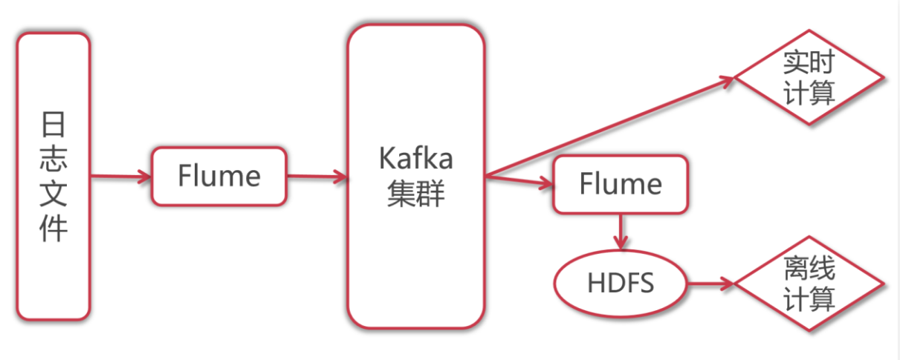

# Flume实战

[返回列表](https://github.com/EmonCodingBackEnd/backend-tutorial)

[TOC]

# 一、安装

[安装Flume](https://github.com/EmonCodingBackEnd/backend-tutorial/blob/master/tutorials/BigData/BigDataInAction.md#7%E5%AE%89%E8%A3%85flume)

# 二、Flume详解

## 2.1、什么是Flume

Flume是一个高可用，高可靠，分布式的海量日志采集、聚合和传输的系统，能够有效的收集、聚合、移动大量的日志数据。

通俗一点来说就是Flume是一个很靠谱、很方便、很强的日志采集工具。

## 2.2、Flume的三大核心组件

- Source：数据源

  - > 通过Source组件可以指定让Flume读取哪里的数据，然后将数据传递给后面的channel
    >
    > Flume内置支持读取很多种数据源，基于文件、基于目录、基于TCP\UDP端口、基于HTTP、Kafka等等，也支持自定义！

  - 挑选几个常用的说明下

    - > Exec Source：实现文件监控，可以实时监控文件中的新增内容，类似于Linux中的tail -f效果。需要注意`tail -F`和`tail -f`的区别：
      >
      > `tail -F`等同于-follow=name --retry，根据文件名进行追踪，并保持重试，即该文件被删除或改名后，如果再次创建相同的文件名，会继续追踪。
      >
      > `tail -f`等同于-follow=descriptor，根据文件描述符进行追踪，当文件改名或者被删除，追踪停止。

    - >  NetCat TCP/UDP Source：采集指定端口（tcp、udp）的数据。

    - > Spooling Directory Source：采集文件夹里新增的文件。

    - > Kafka Source：从Kafka消息队列中采集数据。

- Channel：临时存储数据的管道

  - > 接受Source发出的数据，临时存储
    >
    > Channel的类型有很多：内存、文件、内存+文件、JDBC等

  - 挑选几个常用的说明下

    - > Memory Channel：使用内存作为数据存储

    - > File Channel：使用文件来作为数据的存储

    - > Spillable Memory Channel：使用内存和文件作为数据存储，即先存储到内存中，如果内存中数据达到阈值再flush到文件中。

- Sink：目的地

  - > 从Channel中读取数据并存储到指定目的地
    >
    > Sink的表现形式：控制台、HDFS、Kafka等
    >
    > 注意：Channel中的数据直到进入目的地才会被删除，当Sink写入失败后，可以自动重写，不会造成数据丢失。

  - 常用的Sink组件

    - > Logger Sink：将数据作为日志处理

    - > HDFS Sink：将数据传输到HDFS中

    - > Kafka Sink：将数据发送到Kafka消息队列中


## 2.3、Flume的使用示例

**说明**：示例文件命名规则是`sourceType-channelType-sinkType`，比如：`netcat-memory-logger`.

**说明2**：flume运行环境Hadoop，请保证在具有Hadoop的客户端或Hadoop节点上执行。

### 2.3.1、示例1：netcat->memory->logger

- 配置

```bash
[emon@emon ~]$ vim /home/emon/bigdata/flume/shell/config/netcat-memory-logger.conf 
```

```properties
# example.conf: A single-node Flume configuration

# Name the components on this agent
a1.sources = r1
a1.sinks = k1
a1.channels = c1

# Describe/configure the source
a1.sources.r1.type = netcat
a1.sources.r1.bind = 0.0.0.0
a1.sources.r1.port = 44444

# Describe the sink
a1.sinks.k1.type = logger

# Use a channel which buffers events in memory
a1.channels.c1.type = memory
a1.channels.c1.capacity = 1000
a1.channels.c1.transactionCapacity = 100

# Bind the source and sink to the channel
a1.sources.r1.channels = c1
a1.sinks.k1.channel = c1
```

- 前台启动【测试用】

```bash
[emon@emon ~]$ flume-ng agent --conf /usr/local/flume/conf --conf-file /home/emon/bigdata/flume/shell/config/netcat-memory-logger.conf --name a1 -Dflume.root.logger=INFO,console
```

- 后台启动【不推荐】

```bash
[emon@emon ~]$ nohup flume-ng agent --conf /usr/local/flume/conf --conf-file /home/emon/bigdata/flume/shell/config/netcat-memory-logger.conf --name a1 -Dflume.root.logger=INFO,LOGFILE &
```

**说明**：`-Dflume.root.logger=INFO.LOGFILE`是`$FLUME_HOME/conf/log4j.properties`的默认值，可以省略！根据配置，日志`logs`文件会在命令执行时所在目录生成！

- 查看启动信息

```bash
[emon@emon ~]$ jps -m
```

- 验证

```bash
[emon@emon ~]$ telnet emon 44444
```

输入数据并回车，可以看到`flume-ng`终端可以看到对应输出！

- Supervisor管理服务运行【生产用】【推荐】

```bash
[emon@emon ~]$ vim supervisor.d/flume-netcat-memory-logger.ini
```

```ini
[program:flume-netcat-memory-logger]
command=/usr/local/flume/bin/flume-ng agent --conf /usr/local/flume/conf --conf-file /home/emon/bigdata/flume/shell/config/netcat-memory-logger.conf --name a1 -Dflume.root.logger=INFO,console
directory=/usr/local/flume/config
autostart=false                 ; 在supervisord启动的时候也自动启动
startsecs=10                    ; 启动10秒后没有异常退出，就表示进程正常启动了，默认为1秒
autorestart=true                ; 程序退出后自动重启,可选值：[unexpected,true,false]，默认为unexpected，表示进程意外杀死后才重启
startretries=3                  ; 启动失败自动重试次数，默认是3
user=emon                       ; 用哪个用户启动进程，默认是root
priority=70                     ; 进程启动优先级，默认999，值小的优先启动
redirect_stderr=true            ; 把stderr重定向到stdout，默认false
stdout_logfile_maxbytes=20MB    ; stdout 日志文件大小，默认50MB
stdout_logfile_backups = 20     ; stdout 日志文件备份数，默认是10
environment=JAVA_HOME="/usr/local/java"
stdout_logfile=/home/emon/bigdata/flume/shell/config/netcat-memory-logger.log    ; stdout 日志文件，需要注意当指定目录不存在时无法正常启动，所以需要手动创建目录（supervisord 会自动创建日志文件）
stopasgroup=true                ;默认为false,进程被杀死时，是否向这个进程组发送stop信号，包括子进程
killasgroup=true                ;默认为false，向进程组发送kill信号，包括子进程
```

```bash
# 加载最新配置文件
[emon@emon ~]$ sudo supervisorctl update
# 查看被管控的服务
[emon@emon ~]$ sudo supervisorctl status
# 启动
[emon@emon ~]$ sudo supervisorctl start flume-netcat-memory-logger
# 重启
[emon@emon ~]$ sudo supervisorctl restart flume-netcat-memory-logger
# 停止
[emon@emon ~]$ sudo supervisorctl stop flume-netcat-memory-logger
```

### 2.3.2、示例2：采集文件内容上传至HDFS

需求：采集目录中已有的文件内容，存储到HDFS。

- 配置

```bash
[emon@emon ~]$ mkdir /home/emon/bigdata/flume/shell/config/spooldirFileHdfs
[emon@emon ~]$ vim /home/emon/bigdata/flume/shell/config/spooldirFileHdfs/spooldir-file-hdfs.conf
```

```properties
# Name the components on this agent
a1.sources = r1
a1.sinks = k1
a1.channels = c1

# Describe/configure the source
a1.sources.r1.type = spooldir
a1.sources.r1.spoolDir = /home/emon/bigdata/flume/shell/config/spooldirFileHdfs/spooldir
a1.sources.r1.fileHeader = true

# Describe the sink
a1.sinks.k1.type = hdfs
a1.sinks.k1.hdfs.path = hdfs://emon:8020/flume/spooldirFileHdfs
a1.sinks.k1.hdfs.filePrefix = events-
a1.sinks.k1.hdfs.fileSuffix	= .log
a1.sinks.k1.hdfs.fileType = DataStream
a1.sinks.k1.hdfs.writeFormat = Text
a1.sinks.k1.hdfs.rollInterval = 3600
# 128M
a1.sinks.k1.hdfs.rollSize = 134217728
a1.sinks.k1.hdfs.rollCount = 0

# Use a channel which buffers events in memory
a1.channels.c1.type = file
a1.channels.c1.checkpointDir = /home/emon/bigdata/flume/shell/config/spooldirFileHdfs/checkpoint
a1.channels.c1.dataDirs = /home/emon/bigdata/flume/shell/config/spooldirFileHdfs/data

# Bind the source and sink to the channel
a1.sources.r1.channels = c1
a1.sinks.k1.channel = c1
```

- 初始化数据

```bash
[emon@emon ~]$ mkdir /home/emon/bigdata/flume/shell/config/spooldirFileHdfs/{spooldir,checkpoint,data}
[emon@emon ~]$ vim /home/emon/bigdata/flume/shell/config/spooldirFileHdfs/spooldir/class1.dat
```

```tex
jack    18  male
jessic  20  female
tom 17  male
```

- 启动

```bash
[emon@emon ~]$ flume-ng agent --conf /usr/local/flume/conf --conf-file /home/emon/bigdata/flume/shell/config/spooldirFileHdfs/spooldir-file-hdfs.conf --name a1 -Dflume.root.logger=INFO,console
```

**说明**：启动后`class1.dat`会被处理，并修改文件名为`class1.dat.COMPLETED`，之后不会再扫描该文件。

### 2.3.3、示例3：采集网站日志上传至HDFS

需求：

- 将A和B两台机器实时产生的日志数据汇总到机器C中。
- 通过机器C将数据统一上传至HDFS的指定目录中。

**注意**：HDFS中的目录是按天生成的，每天一个目录。


**说明**：这里用`配置1<==>bigdata02`，`配置2<==>bigdata03`，`配置3<==>bigdata04`

- 配置1

```bash
[emon@emon ~]$ mkdir /home/emon/bigdata/flume/shell/config/execMemoryAvro1
[emon@emon ~]$ vim /home/emon/bigdata/flume/shell/config/execMemoryAvro1/exec-memory-avro.conf
```

```properties
# agent的名称是a1
# 指定source组件、channel组件和sink组件的名称
a1.sources = r1
a1.sinks = k1
a1.channels = c1

# 配置sources组件
a1.sources.r1.type = exec
a1.sources.r1.command = tail -F /home/emon/bigdata/flume/shell/config/execMemoryAvro1/access.log

# 配置sink组件
a1.sinks.k1.type = avro
a1.sinks.k1.hostname = emon
a1.sinks.k1.port = 4545

# 配置channel组件
a1.channels.c1.type = memory
a1.channels.c1.capacity = 1000
a1.channels.c1.transactionCapacity = 100

# 把组件连接起来
a1.sources.r1.channels = c1
a1.sinks.k1.channel = c1
```

- 配置2

```bash
[emon@emon ~]$ mkdir /home/emon/bigdata/flume/shell/config/execMemoryAvro2
[emon@emon ~]$ vim /home/emon/bigdata/flume/shell/config/execMemoryAvro2/exec-memory-avro.conf
```

```properties
# agent的名称是a1
# 指定source组件、channel组件和sink组件的名称
a1.sources = r1
a1.sinks = k1
a1.channels = c1

# 配置sources组件
a1.sources.r1.type = exec
a1.sources.r1.command = tail -F /home/emon/bigdata/flume/shell/config/execMemoryAvro2/access.log

# 配置sink组件
a1.sinks.k1.type = avro
a1.sinks.k1.hostname = emon
a1.sinks.k1.port = 4545

# 配置channel组件
a1.channels.c1.type = memory
a1.channels.c1.capacity = 1000
a1.channels.c1.transactionCapacity = 100

# 把组件连接起来
a1.sources.r1.channels = c1
a1.sinks.k1.channel = c1
```

- 配置3

```bash
[emon@emon ~]$ mkdir /home/emon/bigdata/flume/shell/config/avroMemoryHdfs
[emon@emon ~]$ vim /home/emon/bigdata/flume/shell/config/avroMemoryHdfs/avro-memory-hdfs.conf
```

```properties
# agent的名称是a1
# 指定source组件、channel组件和sink组件的名称
a1.sources = r1
a1.sinks = k1
a1.channels = c1

# 配置sources组件
a1.sources.r1.type = avro
a1.sources.r1.bind = 0.0.0.0
a1.sources.r1.port = 4545

# 配置sink组件
a1.sinks.k1.type = hdfs
a1.sinks.k1.hdfs.path = hdfs://emon:8020/flume/access/%Y%m%d
a1.sinks.k1.hdfs.filePrefix = access
a1.sinks.k1.hdfs.fileSuffix	= .log
a1.sinks.k1.hdfs.fileType = DataStream
a1.sinks.k1.hdfs.writeFormat = Text
a1.sinks.k1.hdfs.rollInterval = 3600
# 128M
a1.sinks.k1.hdfs.rollSize = 134217728
a1.sinks.k1.hdfs.rollCount = 0
a1.sinks.k1.hdfs.useLocalTimeStamp = true

# 配置channel组件
a1.channels.c1.type = memory
a1.channels.c1.capacity = 1000
a1.channels.c1.transactionCapacity = 100


# 把组件连接起来
a1.sources.r1.channels = c1
a1.sinks.k1.channel = c1
```

- 日志生成脚本1

```bash
[emon@emon ~]$ vim /home/emon/bigdata/flume/shell/config/execMemoryAvro1/generateAccessLog.sh
```

```bash
#!/bin/bash
# 循环向文件中生成数据
while [ "1" = "1" ]; do
    # 获取当前时间戳
    curr_time=$(date +%s)
    # 获取当前主机名
    name=$(hostname)
    echo "${name}1"_"${curr_time}" >> /home/emon/bigdata/flume/shell/config/execMemoryAvro1/access.log
    # 暂停1秒
    sleep 1
done
```

```bash
# 修改执行权限
[emon@emon ~]$ chmod u+x /home/emon/bigdata/flume/shell/config/execMemoryAvro1/generateAccessLog.sh 
```

- 日志生成脚本2

```bash
[emon@emon ~]$ vim /home/emon/bigdata/flume/shell/config/execMemoryAvro2/generateAccessLog.sh
```

```bash
#!/bin/bash
# 循环向文件中生成数据
while [ "1" = "1" ]; do
    # 获取当前时间戳
    curr_time=$(date +%s)
    # 获取当前主机名
    name=$(hostname)
    echo "${name}2"_"${curr_time}" >> /home/emon/bigdata/flume/shell/config/execMemoryAvro2/access.log
    # 暂停1秒
    sleep 1
done
```

```bash
# 修改执行权限
[emon@emon ~]$ chmod u+x /home/emon/bigdata/flume/shell/config/execMemoryAvro2/generateAccessLog.sh 
```

- 启动

```bash
# 第一步：启动配置3
[emon@emon ~]$ flume-ng agent --conf /usr/local/flume/conf --conf-file /home/emon/bigdata/flume/shell/config/avroMemoryHdfs/avro-memory-hdfs.conf --name a1 -Dflume.root.logger=INFO,console
# 第二步：启动配置1
[emon@emon ~]$ flume-ng agent --conf /usr/local/flume/conf --conf-file /home/emon/bigdata/flume/shell/config/execMemoryAvro1/exec-memory-avro.conf --name a1 -Dflume.root.logger=INFO,console
# 第三步：启动配置2
[emon@emon ~]$ flume-ng agent --conf /usr/local/flume/conf --conf-file /home/emon/bigdata/flume/shell/config/execMemoryAvro2/exec-memory-avro.conf --name a1 -Dflume.root.logger=INFO,console
# 第四步：为配置1开启日志生成
[emon@emon ~]$ sh -x /home/emon/bigdata/flume/shell/config/execMemoryAvro1/generateAccessLog.sh
# 第五步：为配置2开启日志生成
[emon@emon ~]$ sh -x /home/emon/bigdata/flume/shell/config/execMemoryAvro2/generateAccessLog.sh
```

- 停止

停止配置1=>停止配置2=>停止配置3

# 三、Flume高级组件

## 3.1、Event

Event是Flume传输数据的基本单位，也是事务的基本单位，在文本文件中，通常一行记录就是一个Event。

Event包含header和body。

- body：是采集到的那一行记录的原始内容。
- header：类型为Map<String, String>，里面可以存储一些属性信息，方便后续使用。

我们可以在Source中给每一条数据的header中增加key-value，在Chanel和Sink中使用header中的值了。

## 3.2、高级组件

- Source Interceptors：Source可以指定一个或者多个拦截器，按先后顺序依次对采集到的数据进行处理。

  - > 常见Interceptors类型：Timestamp Interceptor、Host Interceptor、Search and Replace Interceptor、Static Interceptor、Regex Extractor Interceptor等。

  - 简单介绍

    - > Timestamp Interceptor：向event中的header里面添加timestamp时间戳信息。

    - > Host Interceptor：向event中的header里面添加host属性，host的值为当前机器的主机名或者ip。

    - > Search and Replace Interceptor：根据指定的规则查询Event中的body里面的数据，然后进行替换，这个拦截器会修改event中body的值，也就是会修改原始采集到的数据内容。【修改body值】【常用】

    - > Static Interceptor：向event中的header里面添加固定的key和value。

    - > Regex Extractor Interceptor：根据指定的规则从Event中的body里面抽取数据，生成key和value，再把key和value添加到header中。【常用】

- Channel Selectors：Source发往多个Channel的策略设置。

  - > Channel Selectors类型包括：Replicating Channel Selector和Multiplexing Channel Selector，其中Replicating Channel Selector是默认的选择器，它会将Source采集过来的Event发往所有Channel。

- Sink Processors：Sink发送数据的策略设置。

  - > Sink Processors类型包括这三种：Default Sink Processor、Load balancing Sink Processor和Failover Sink Processor

  - 简单介绍

    - > Default Sink Processor是默认的，不用配置sinkgroup，就是咱们现在使用的这种最普通的形式，一个channel后面接一个sink的形式。

    - > Load balancing Sink Processor是负载均衡处理器，一个channel后面可以接多个sink，这多个sink属于一个sinkgroup，根据指定的算法进行轮询或者随机发送，减轻单个sink的压力。

    - > Failover Sink Processor是故障转移处理器，一个channel后面可以接多个sink，这多个sink属于一个sinkgroup，按照sink的优先级，默认先让优先级高的sink来处理数据，如果这个sink出现了故障，则用优先级第一点的sink处理数据，可以保障数据不丢失。

### 3.2.1、案例：对采集到的数据按天按类型分目录存储

需求：对采集到的数据按天按类型分目录存储。

原始数据格式：

```tex
video_info
{"id":"14943445328940974601","uid":"840717325115457536","lat":"53.530598","lnt":"-2.5620373","hots":0,"title":"0","status":"1","topicId":"0","end_time":"1494344570","watch_num":0,"share_num":"1","replay_url":null,"replay_num":0,"start_time":"1494344544","timestamp":1494344571,"type":"video_info"}
user_info
{"uid":"861848974414839801","nickname":"mick","usign":"","sex":1,"birthday":"","face":"","big_face":"","email":"abc@qq.com","mobile":"","reg_type":"102","last_login_time":"1494344580","reg_time":"1494344580","last_update_time":"1494344580","status":"5","is_verified":"0","verified_info":"","is_seller":"0","level":1,"exp":0,"anchor_level":0,"anchor_exp":0,"os":"android","timestamp":1494344580,"type":"user_info"}
gift_record
{"send_id":"834688818270961664","good_id":"223","video_id":"14943443045138661356","gold":"10","timestamp":1494344574,"type":"gift_record"}
```

这份数据中有三种类型的数据，视频信息、用户信息、送礼信息，数据都是json格式的，这些数据还有一个共性就是里面都有一个type字段，type字段的值代表数据类型。

当我们的直播平台正常运行时，会实时产生这些日志数据，我们希望把这些数据采集到hdfs上进行存储，并且要按照数据类型进行分目录存储，视频数据放一块、用户数据放一块、送礼数据放一块，针对这个需求配置agent的话，source使用基于文件的execsource、channel使用基于文件的channel，我们希望保证数据的完整性和准确性，sink使用hdfssink。

但注意，hdfssink中的path不能写死，首先是按照天就是需要动态获取日期，然后是因为不同类型的数据要存储到不同的目录中，也就意味着path路径中肯定要有变量，除了日期变量还有数据类型变量。

这里的数据类型的格式都是单词中间有一个下划线，但是我们的要求是目录中的单次不要出现下划线，使用驼峰的命名格式。

所以，在hdfs中最终生成的目录大致是如下这样的：

```bash
hdfs://emon:8020/moreType/20200101/videoInfo
hdfs://emon:8020/moreType/20200101/userInfo
hdfs://emon:8020/moreType/20210101/giftRecord
```

所以，整体流程如下：
`Exec Source`=>`Search and Replace Interceptor`=>`Regex Extractor Interceptor`=>`File Channel`=>`HDFS Sink`.

- 配置

```bash
[emon@emon ~]$ mkdir /home/emon/bigdata/flume/shell/config/execFileHdfs
[emon@emon ~]$ vim /home/emon/bigdata/flume/shell/config/execFileHdfs/exec-file-hdfs.conf
```

```properties
# agent的名称是a1
# 指定source组件、channel组件和sink组件的名称
a1.sources = r1
a1.sinks = k1
a1.channels = c1

# 配置sources组件
a1.sources.r1.type = exec
a1.sources.r1.command = tail -F /home/emon/bigdata/flume/shell/config/execFileHdfs/moreType.log

# 配置拦截器[多个拦截器按照顺序依次执行]
a1.sources.r1.interceptors = i1 i2 i3 i4
a1.sources.r1.interceptors.i1.type = search_replace
a1.sources.r1.interceptors.i1.searchPattern = "type":"video_info"
a1.sources.r1.interceptors.i1.replaceString = "type":"videoInfo"

a1.sources.r1.interceptors.i2.type = search_replace
a1.sources.r1.interceptors.i2.searchPattern = "type":"user_info"
a1.sources.r1.interceptors.i2.replaceString = "type":"userInfo"

a1.sources.r1.interceptors.i3.type = search_replace
a1.sources.r1.interceptors.i3.searchPattern = "type":"gift_record"
a1.sources.r1.interceptors.i3.replaceString = "type":"giftRecord"

a1.sources.r1.interceptors.i4.type = regex_extractor
a1.sources.r1.interceptors.i4.regex = "type":"(\\w+)"
a1.sources.r1.interceptors.i4.serializers = s1
a1.sources.r1.interceptors.i4.serializers.s1.name = logType

# 配置sink组件
a1.sinks.k1.type = hdfs
a1.sinks.k1.hdfs.path = hdfs://emon:8020/flume/moreType/%Y%m%d/%{logType}
a1.sinks.k1.hdfs.filePrefix = data
a1.sinks.k1.hdfs.fileSuffix	= .log
a1.sinks.k1.hdfs.fileType = DataStream
a1.sinks.k1.hdfs.writeFormat = Text
a1.sinks.k1.hdfs.rollInterval = 3600
# 128M
a1.sinks.k1.hdfs.rollSize = 134217728
a1.sinks.k1.hdfs.rollCount = 0
a1.sinks.k1.hdfs.useLocalTimeStamp = true

# 配置channel组件
a1.channels.c1.type = file
a1.channels.c1.checkpointDir = /home/emon/bigdata/flume/shell/config/execFileHdfs/checkpoint
a1.channels.c1.dataDirs = /home/emon/bigdata/flume/shell/config/execFileHdfs/data

# 把组件连接起来
a1.sources.r1.channels = c1
a1.sinks.k1.channel = c1
```

- 初始化数据

```bash
[emon@emon ~]$ mkdir /home/emon/bigdata/flume/shell/config/execFileHdfs/{checkpoint,data}
[emon@emon ~]$ vim /home/emon/bigdata/flume/shell/config/execFileHdfs/moreType.log
```

```json
{"id":"14943445328940974601","uid":"840717325115457536","lat":"53.530598","lnt":"-2.5620373","hots":0,"title":"0","status":"1","topicId":"0","end_time":"1494344570","watch_num":0,"share_num":"1","replay_url":null,"replay_num":0,"start_time":"1494344544","timestamp":1494344571,"type":"video_info"}
{"uid":"861848974414839801","nickname":"mick","usign":"","sex":1,"birthday":"","face":"","big_face":"","email":"abc@qq.com","mobile":"","reg_type":"102","last_login_time":"1494344580","reg_time":"1494344580","last_update_time":"1494344580","status":"5","is_verified":"0","verified_info":"","is_seller":"0","level":1,"exp":0,"anchor_level":0,"anchor_exp":0,"os":"android","timestamp":1494344580,"type":"user_info"}
{"send_id":"834688818270961664","good_id":"223","video_id":"14943443045138661356","gold":"10","timestamp":1494344574,"type":"gift_record"}
```

- 启动

```bash
[emon@emon ~]$ flume-ng agent --conf /usr/local/flume/conf --conf-file /home/emon/bigdata/flume/shell/config/execFileHdfs/exec-file-hdfs.conf --name a1 -Dflume.root.logger=INFO,console
```


### 3.2.2、案例：多Channel之Replicating Channel Selector


- 配置

```bash
[emon@emon ~]$ mkdir /home/emon/bigdata/flume/shell/config/netcatMemoryToLoggerAndHdfs
[emon@emon ~]$ vim /home/emon/bigdata/flume/shell/config/netcatMemoryToLoggerAndHdfs/netcat-memory-logger-hdfs.conf
```

```properties
# agent的名称是a1
# 指定source组件、channel组件和sink组件的名称
a1.sources = r1
a1.sinks = k1 k2
a1.channels = c1 c2

# 配置sources组件
a1.sources.r1.type = netcat
a1.sources.r1.bind = 0.0.0.0
a1.sources.r1.port = 44444

# 配置sink组件
a1.sinks.k1.type = logger

a1.sinks.k2.type = hdfs
a1.sinks.k2.hdfs.path = hdfs://emon:8020/flume/replicating
a1.sinks.k2.hdfs.filePrefix = data
a1.sinks.k2.hdfs.fileSuffix	= .log
a1.sinks.k2.hdfs.fileType = DataStream
a1.sinks.k2.hdfs.writeFormat = Text
a1.sinks.k2.hdfs.rollInterval = 3600
# 128M
a1.sinks.k2.hdfs.rollSize = 134217728
a1.sinks.k2.hdfs.rollCount = 0
a1.sinks.k2.hdfs.useLocalTimeStamp = true

# 配置channel组件
a1.channels.c1.type = memory
a1.channels.c1.capacity = 1000
a1.channels.c1.transactionCapacity = 100

a1.channels.c2.type = memory
a1.channels.c2.capacity = 1000
a1.channels.c2.transactionCapacity = 100

# 配置channel选择器[默认就是Replication Channel Selector]
a1.sources.r1.selector.type = replicating

# 把组件连接起来
a1.sources.r1.channels = c1 c2
a1.sinks.k1.channel = c1
a1.sinks.k2.channel = c2
```

- 启动

```bash
[emon@emon ~]$ flume-ng agent --conf /usr/local/flume/conf --conf-file /home/emon/bigdata/flume/shell/config/netcatMemoryToLoggerAndHdfs/netcat-memory-logger-hdfs.conf --name a1 -Dflume.root.logger=INFO,console
```

- 验证

```bash
[emon@emon ~]$ telnet emon 44444
```

### 3.2.3、案例：多Channel之Multiplexing Channel Selector


- 配置

```bash
[emon@emon ~]$ mkdir /home/emon/bigdata/flume/shell/config/netcatMemoryToLoggerAndHdfs2
[emon@emon ~]$ vim /home/emon/bigdata/flume/shell/config/netcatMemoryToLoggerAndHdfs2/netcat-memory-logger-hdfs.conf
```

```properties
# agent的名称是a1
# 指定source组件、channel组件和sink组件的名称
a1.sources = r1
a1.sinks = k1 k2
a1.channels = c1 c2

# 配置sources组件
a1.sources.r1.type = netcat
a1.sources.r1.bind = 0.0.0.0
a1.sources.r1.port = 44444

# 配置拦截器[多个拦截器按照顺序依次执行]
a1.sources.r1.interceptors = i1
a1.sources.r1.interceptors.i1.type = regex_extractor
a1.sources.r1.interceptors.i1.regex = "city":"(\\w+)"
a1.sources.r1.interceptors.i1.serializers = s1
a1.sources.r1.interceptors.i1.serializers.s1.name = city

# 配置sink组件
a1.sinks.k1.type = logger

a1.sinks.k2.type = hdfs
a1.sinks.k2.hdfs.path = hdfs://emon:8020/flume/multiplexing
a1.sinks.k2.hdfs.filePrefix = data
a1.sinks.k2.hdfs.fileSuffix	= .log
a1.sinks.k2.hdfs.fileType = DataStream
a1.sinks.k2.hdfs.writeFormat = Text
a1.sinks.k2.hdfs.rollInterval = 3600
# 128M
a1.sinks.k2.hdfs.rollSize = 134217728
a1.sinks.k2.hdfs.rollCount = 0
a1.sinks.k2.hdfs.useLocalTimeStamp = true

# 配置channel组件
a1.channels.c1.type = memory
a1.channels.c1.capacity = 1000
a1.channels.c1.transactionCapacity = 100

a1.channels.c2.type = memory
a1.channels.c2.capacity = 1000
a1.channels.c2.transactionCapacity = 100

# 配置channel选择器
a1.sources.r1.selector.type = multiplexing
a1.sources.r1.selector.header = city
a1.sources.r1.selector.mapping.bj = c1
a1.sources.r1.selector.default = c2

# 把组件连接起来
a1.sources.r1.channels = c1 c2
a1.sinks.k1.channel = c1
a1.sinks.k2.channel = c2
```

- 启动

```bash
[emon@emon ~]$ flume-ng agent --conf /usr/local/flume/conf --conf-file /home/emon/bigdata/flume/shell/config/netcatMemoryToLoggerAndHdfs2/netcat-memory-logger-hdfs.conf --name a1 -Dflume.root.logger=INFO,console
```

- 验证

```bash
[emon@emon ~]$ telnet emon 44444
# 命令行输入信息
{"name":"jack","age":19,"city":"bj"}
{"name":"tom","age":26,"city":"sh"}
```

### 3.2.4、案例：负载均衡


**说明**：这里用`配置1<==>bigdata04`，`配置2<==>bigdata02`，`配置3<==>bigdata03`

- 配置1

```bash
[emon@emon ~]$ mkdir /home/emon/bigdata/flume/shell/config/netcatMemoryAvro
[emon@emon ~]$ vim /home/emon/bigdata/flume/shell/config/netcatMemoryAvro/netcat-memory-avro.conf
```

```properties
# agent的名称是a1
# 指定source组件、channel组件和sink组件的名称
a1.sources = r1
a1.sinks = k1 k2
a1.channels = c1

# 配置sources组件
a1.sources.r1.type = netcat
a1.sources.r1.bind = 0.0.0.0
a1.sources.r1.port = 44444

# 配置sink组件[为了方便演示，把batch-size设置为1]
a1.sinks.k1.type = avro
a1.sinks.k1.hostname = emon
a1.sinks.k1.port = 41414
a1.sinks.k1.batch-size = 1

a1.sinks.k2.type = avro
a1.sinks.k2.hostname = emon
a1.sinks.k2.port = 41415
a1.sinks.k2.batch-size = 1

# 配置sink策略
a1.sinkgroups = g1
a1.sinkgroups.g1.sinks = k1 k2
a1.sinkgroups.g1.processor.type = load_balance
a1.sinkgroups.g1.processor.backoff = true
a1.sinkgroups.g1.processor.selector = round_robin

# 配置channel组件
a1.channels.c1.type = memory
a1.channels.c1.capacity = 1000
a1.channels.c1.transactionCapacity = 100

# 把组件连接起来
a1.sources.r1.channels = c1
a1.sinks.k1.channel = c1
a1.sinks.k2.channel = c1
```

- 配置2

```bash
[emon@emon ~]$ mkdir /home/emon/bigdata/flume/shell/config/avroMemoryHdfs1
[emon@emon ~]$ vim /home/emon/bigdata/flume/shell/config/avroMemoryHdfs1/avro-memory-hdfs.conf
```

```properties
# agent的名称是a1
# 指定source组件、channel组件和sink组件的名称
a1.sources = r1
a1.sinks = k1
a1.channels = c1

# 配置sources组件
a1.sources.r1.type = avro
a1.sources.r1.bind = 0.0.0.0
a1.sources.r1.port = 41414

# 配置sink组件[为了方便演示，把batch-size设置为1]
a1.sinks.k1.type = hdfs
a1.sinks.k1.hdfs.path = hdfs://emon:8020/flume/load_balance
a1.sinks.k1.hdfs.filePrefix = data1
a1.sinks.k1.hdfs.fileSuffix	= .log
a1.sinks.k1.hdfs.fileType = DataStream
a1.sinks.k1.hdfs.writeFormat = Text
a1.sinks.k1.hdfs.rollInterval = 3600
# 128M
a1.sinks.k1.hdfs.rollSize = 134217728
a1.sinks.k1.hdfs.rollCount = 0
a1.sinks.k1.hdfs.useLocalTimeStamp = true

# 配置channel组件
a1.channels.c1.type = memory
a1.channels.c1.capacity = 1000
a1.channels.c1.transactionCapacity = 100

# 把组件连接起来
a1.sources.r1.channels = c1
a1.sinks.k1.channel = c1
```

- 配置3
```bash
[emon@emon ~]$ mkdir /home/emon/bigdata/flume/shell/config/avroMemoryHdfs2
[emon@emon ~]$ vim /home/emon/bigdata/flume/shell/config/avroMemoryHdfs2/avro-memory-hdfs.conf
```

```properties
# agent的名称是a1
# 指定source组件、channel组件和sink组件的名称
a1.sources = r1
a1.sinks = k1
a1.channels = c1

# 配置sources组件
a1.sources.r1.type = avro
a1.sources.r1.bind = 0.0.0.0
a1.sources.r1.port = 41415

# 配置sink组件[为了方便演示，把batch-size设置为1]
a1.sinks.k1.type = hdfs
a1.sinks.k1.hdfs.path = hdfs://emon:8020/flume/load_balance
a1.sinks.k1.hdfs.filePrefix = data2
a1.sinks.k1.hdfs.fileSuffix	= .log
a1.sinks.k1.hdfs.fileType = DataStream
a1.sinks.k1.hdfs.writeFormat = Text
a1.sinks.k1.hdfs.rollInterval = 3600
# 128M
a1.sinks.k1.hdfs.rollSize = 134217728
a1.sinks.k1.hdfs.rollCount = 0
a1.sinks.k1.hdfs.useLocalTimeStamp = true

# 配置channel组件
a1.channels.c1.type = memory
a1.channels.c1.capacity = 1000
a1.channels.c1.transactionCapacity = 100

# 把组件连接起来
a1.sources.r1.channels = c1
a1.sinks.k1.channel = c1
```

- 启动

```bash
# 启动配置2
[emon@emon ~]$ flume-ng agent --conf /usr/local/flume/conf --conf-file /home/emon/bigdata/flume/shell/config/avroMemoryHdfs1/avro-memory-hdfs.conf --name a1 -Dflume.root.logger=INFO,console
# 启动配置3
[emon@emon ~]$ flume-ng agent --conf /usr/local/flume/conf --conf-file /home/emon/bigdata/flume/shell/config/avroMemoryHdfs2/avro-memory-hdfs.conf --name a1 -Dflume.root.logger=INFO,console
# 启动配置1
[emon@emon ~]$ flume-ng agent --conf /usr/local/flume/conf --conf-file /home/emon/bigdata/flume/shell/config/netcatMemoryAvro/netcat-memory-avro.conf --name a1 -Dflume.root.logger=INFO,console
# 向netcat输入
[emon@emon ~]$ telnet emon 44444
```

### 3.2.5、案例：故障转移


**说明**：这里用`配置1<==>bigdata04`，`配置2<==>bigdata02`，`配置3<==>bigdata03`

- 配置1

```bash
[emon@emon ~]$ mkdir /home/emon/bigdata/flume/shell/config/netcatMemoryAvroFailover
[emon@emon ~]$ vim /home/emon/bigdata/flume/shell/config/netcatMemoryAvroFailover/netcat-memory-avro.conf
```

```properties
# agent的名称是a1
# 指定source组件、channel组件和sink组件的名称
a1.sources = r1
a1.sinks = k1 k2
a1.channels = c1

# 配置sources组件
a1.sources.r1.type = netcat
a1.sources.r1.bind = 0.0.0.0
a1.sources.r1.port = 44444

# 配置sink组件[为了方便演示，把batch-size设置为1]
a1.sinks.k1.type = avro
a1.sinks.k1.hostname = emon
a1.sinks.k1.port = 41414
a1.sinks.k1.batch-size = 1

a1.sinks.k2.type = avro
a1.sinks.k2.hostname = emon
a1.sinks.k2.port = 41415
a1.sinks.k2.batch-size = 1

# 配置sink策略
a1.sinkgroups = g1
a1.sinkgroups.g1.sinks = k1 k2
a1.sinkgroups.g1.processor.type = failover
a1.sinkgroups.g1.processor.priority.k1 = 5
a1.sinkgroups.g1.processor.priority.k2 = 10
a1.sinkgroups.g1.processor.maxpenalty = 10000

# 配置channel组件
a1.channels.c1.type = memory
a1.channels.c1.capacity = 1000
a1.channels.c1.transactionCapacity = 100

# 把组件连接起来
a1.sources.r1.channels = c1
a1.sinks.k1.channel = c1
a1.sinks.k2.channel = c1
```

- 配置2

```bash
[emon@emon ~]$ mkdir /home/emon/bigdata/flume/shell/config/avroMemoryHdfsFailover1
[emon@emon ~]$ vim /home/emon/bigdata/flume/shell/config/avroMemoryHdfsFailover1/avro-memory-hdfs.conf
```

```properties
# agent的名称是a1
# 指定source组件、channel组件和sink组件的名称
a1.sources = r1
a1.sinks = k1
a1.channels = c1

# 配置sources组件
a1.sources.r1.type = avro
a1.sources.r1.bind = 0.0.0.0
a1.sources.r1.port = 41414

# 配置sink组件[为了方便演示，把batch-size设置为1]
a1.sinks.k1.type = hdfs
a1.sinks.k1.hdfs.path = hdfs://emon:8020/flume/failover
a1.sinks.k1.hdfs.filePrefix = data1
a1.sinks.k1.hdfs.fileSuffix	= .log
a1.sinks.k1.hdfs.fileType = DataStream
a1.sinks.k1.hdfs.writeFormat = Text
a1.sinks.k1.hdfs.rollInterval = 3600
# 128M
a1.sinks.k1.hdfs.rollSize = 134217728
a1.sinks.k1.hdfs.rollCount = 0
a1.sinks.k1.hdfs.useLocalTimeStamp = true

# 配置channel组件
a1.channels.c1.type = memory
a1.channels.c1.capacity = 1000
a1.channels.c1.transactionCapacity = 100

# 把组件连接起来
a1.sources.r1.channels = c1
a1.sinks.k1.channel = c1
```

- 配置3
```bash
[emon@emon ~]$ mkdir /home/emon/bigdata/flume/shell/config/avroMemoryHdfsFailover2
[emon@emon ~]$ vim /home/emon/bigdata/flume/shell/config/avroMemoryHdfsFailover2/avro-memory-hdfs.conf
```

```properties
# agent的名称是a1
# 指定source组件、channel组件和sink组件的名称
a1.sources = r1
a1.sinks = k1
a1.channels = c1

# 配置sources组件
a1.sources.r1.type = avro
a1.sources.r1.bind = 0.0.0.0
a1.sources.r1.port = 41415

# 配置sink组件[为了方便演示，把batch-size设置为1]
a1.sinks.k1.type = hdfs
a1.sinks.k1.hdfs.path = hdfs://emon:8020/flume/failover
a1.sinks.k1.hdfs.filePrefix = data2
a1.sinks.k1.hdfs.fileSuffix	= .log
a1.sinks.k1.hdfs.fileType = DataStream
a1.sinks.k1.hdfs.writeFormat = Text
a1.sinks.k1.hdfs.rollInterval = 3600
# 128M
a1.sinks.k1.hdfs.rollSize = 134217728
a1.sinks.k1.hdfs.rollCount = 0
a1.sinks.k1.hdfs.useLocalTimeStamp = true

# 配置channel组件
a1.channels.c1.type = memory
a1.channels.c1.capacity = 1000
a1.channels.c1.transactionCapacity = 100

# 把组件连接起来
a1.sources.r1.channels = c1
a1.sinks.k1.channel = c1
```

- 启动

```bash
# 启动配置2
[emon@emon ~]$ flume-ng agent --conf /usr/local/flume/conf --conf-file /home/emon/bigdata/flume/shell/config/avroMemoryHdfsFailover1/avro-memory-hdfs.conf --name a1 -Dflume.root.logger=INFO,console
# 启动配置3
[emon@emon ~]$ flume-ng agent --conf /usr/local/flume/conf --conf-file /home/emon/bigdata/flume/shell/config/avroMemoryHdfsFailover2/avro-memory-hdfs.conf --name a1 -Dflume.root.logger=INFO,console
# 启动配置1
[emon@emon ~]$ flume-ng agent --conf /usr/local/flume/conf --conf-file /home/emon/bigdata/flume/shell/config/netcatMemoryAvroFailover/netcat-memory-avro.conf --name a1 -Dflume.root.logger=INFO,console
# 向netcat输入
[emon@emon ~]$ telnet emon 44444
```

## 3.3、各种自定义组件


## 3.4、Flume优化及监控

### 3.4.1、Flume优化

- 调整Flume进程的内存大小，建议设置1G~2G，太小的话会导致频繁GC。

  - > 可以通过配置`vim /usr/local/flume/conf/flume-env.sh`文件的`JAVA_OPTS`属性调整。比如：
    >
    > export JAVA_OPTS="-Xms100m -Xmx2000m -Dcom.sun.management.jmxremote"
    >
    > 建议这里的Xms和Xmx设置为一样大，避免进行内存交换，内存交换也会比较消耗性能。

- 启动多个Flume进程时，建议修改配置区分日志文件。


### 3.4.2、Flume监控【缺少supervisor情况下使用】

Flume是一个单进程程序，会存在单点故障，所以需要有一个监控机制，发现Flume进程Down掉之后，需要重启

通过Shell脚本实现Flume进程监控及自动重启。

- 配置文件

```bash
[emon@emon ~]$ vim /home/emon/bigdata/flume/shell/config/monlist.conf
```

```properties
netcat-memory-logger=/home/emon/bigdata/flume/shell/config/netcat-memory-logger.sh
```

- netcat-memory-logger.sh

```bash
[emon@emon ~]$ vim /home/emon/bigdata/flume/shell/config/netcat-memory-logger.sh
```

```bash
#!/bin/bash
flume_path=/usr/local/flume
nohup flume-ng agent --conf $flume_path/conf --conf-file $flume_path/config/netcat-memory-logger.conf --name a1 -Dflume.root.logger=INFO,LOGFILE &
```

```bash
[emon@emon ~]$ chmod u+x /home/emon/bigdata/flume/shell/config/netcat-memory-logger.sh
```

- monlist.sh

```bash
[emon@emon ~]$ vim /home/emon/bigdata/flume/shell/config/monlist.sh
```

```bash
#!/bin/bash
monlist=`cat /home/emon/bigdata/flume/shell/config/monlist.conf`
echo "start check"
for item in ${monlist}
do
	# 设置字段分隔符
	OLD_IFS=$IFS
	# 以=分隔，转换为数组
	IFS="="
	# 把一行内容转成多列
	arr=(${item})
	# 获取等号左边内容
	name=${arr[0]}
	# 获取等号右边内容
	script=${arr[1]}
	echo "time is:"`date +"%Y-%m-%d %H:%M:%S"`" check "$name
	if [ `jps -m|grep $name | wc -l` -eq 0 ]; then
		# 发短信或者邮件告警
		echo `date +"%Y-%m-%d %H:%M:%S"` $name "is none"
		sh -x ${script}
	else
		echo "time is:"`date +"%Y-%m-%d %H:%M:%S"`" check "$name" is ok!"
	fi
done
```

```bash
[emon@emon ~]$ chmod u+x /home/emon/bigdata/flume/shell/config/monlist.sh
[emon@emon ~]$ sh -x /home/emon/bigdata/flume/shell/config/monlist.sh
```


# 四、Sqoop实战

## 4.1、参数说明：

### 4.1.1、Sqoop通用参数

| 选项                                 | 含义说明                               |
| ------------------------------------ | -------------------------------------- |
| --connect < jdbc-uri >               | 指定JDBC连接字符串                     |
| --connection-manager < class-name >  | 指定要使用的连接管理器类               |
| --driver < class-name >              | 指定要使用的JDBC驱动类                 |
| --hadoop-mapred-home < dir >         | 指定$HADOOP_MAPRED_HOME路径            |
| --help                               | 万能帮助                               |
| --password-file                      | 设置用于存放认证的密码信息文件的路径   |
| -P 大写字母                          | 从控制台读取输入的密码                 |
| --password < password >              | 设置认证密码                           |
| --username < username >              | 设置认证用户名                         |
| --verbose                            | 打印详细的运行信息                     |
| --connection-param-file < filename > | 可选，指定存储数据库连接参数的属性文件 |

### 4.1.2、导入功能相关参数

| 选项                              | 含义说明                                               |
| --------------------------------- | ------------------------------------------------------ |
| --append                          | 将数据追加到HDFS上一个已存在的数据集上                 |
| --as-avrodatafile                 | 将数据导入到Avro数据文件                               |
| --as-sequencefile                 | 将数据导入到SequenceFile                               |
| --as-textfile                     | 将数据导入到普通文本文件（默认）                       |
| --boundary-query < statement >    | 边界查询，用于创建分片（InputSplit）                   |
| --columns <col,col,col...>        | 从表中导出指定的一组列的数据                           |
| --delete-target-dir               | 如果指定目录存在，则先删除掉                           |
| --direct                          | 使用直接导入模式（优化导入速度）                       |
| --direct-split-size < n >         | 分隔输入stream的字节大小（在直接导入模式下）           |
| --fetch-size < n >                | 从数据库中批量读取记录数                               |
| --inline-lob-limit < n >          | 设置内联的LOB对象的大小                                |
| -m,--num-mappers < n >            | 使用n个map任务并行导入数据                             |
| -e,--query < statement >          | 导入的查询语句                                         |
| --split-by < column-name >        | 指定按照哪个列去分隔数据                               |
| --table < table-name >            | 导入的源表表名                                         |
| --target-dir < dir>               | 导入HDFS的目标路径                                     |
| --warehouse-dir < dir >           | HDFS存放表的根路径                                     |
| --where < where clause >          | 指定导出时所使用的查询条件                             |
| -z,--compress                     | 启用压缩                                               |
| --compression-codec < c >         | 指定Hadoop的codec方式（默认gzip）                      |
| --null-string < null-string >     | 如果指定列为字符串类型，使用指定字符串替换值为NULL的值 |
| --null-non-string < null-string > | 如果指定列为非字符串类型，使用指定值替换值为NULL的值   |

### 4.1.3、导出功能相关参数

| 选项                                  | 含义说明                                               |
| ------------------------------------- | ------------------------------------------------------ |
| --validate <class-name>               | 启用数据副本验证功能，仅支持单表拷贝，可以指定使用的类 |
| --validation-threshold <class-name>   | 指定验证阈所使用的类                                   |
| --driect                              | 使用直接导出模式（优化速度）                           |
| --export-dir <dir>                    | 导出过程中HDFS源路径                                   |
| -m,--num-mappers <n>                  | 使用n个map任务并行导出                                 |
| --table <table-name>                  | 导出的目的表名称                                       |
| --call <stored-proc-name>             | 导出数据调用的指定存储过程名                           |
| --update-key <col-name>               | 更新参考的列名称，多个列名使用逗号分隔                 |
| --input-null-string <null-string>     | 如果指定列为字符串类型，使用指定字符串替换值为NULL的值 |
| --input-null-non-string <null-string> | 如果指定列为非字符串类型，使用指定值替换值为NULL的值   |
| --staging-table <staging-table-name>  | 数据插入目标表之前暂存到指定表                         |
| --clear-staging-table                 | 清除工作区中临时存放的数据                             |
| --batch                               | 使用批量模式导出                                       |

## 4.2、导入（MySQL=>HDFS)

### 4.2.1、全表导入

- 创建数据库和表

```bash
# 进入MySQL命令行
[emon@emon ~]$ mysql -uflyin -pFlyin@123
```

```mysql
# 创建数据库
mysql> CREATE DATABASE IF NOT EXISTS sqoopdb DEFAULT CHARACTER SET utf8mb4 COLLATE utf8mb4_unicode_ci;
# 切换数据库
mysql> use sqoopdb;
# 创建表
mysql> create table user(id int(10),name varchar(64));
# 插入数据
mysql> insert into user(id,name) values(1,'jack');
mysql> insert into user(id,name) values(2,'tom');
mysql> insert into user(id,name) values(3,'mike');
mysql> insert into user(id, name)VALUES(NULL, 'abc');
mysql> insert into user(id, name)VALUES(5, NULL);
```

```mysql
create table user(id id(10),name varchar(64));
```

- sqoop脚本：脚本执行后会生成`user.java`

```bash
sqoop import \
--connect jdbc:mysql://emon:3306/sqoopdb?serverTimezone=UTC\&useSSL=false \
--username flyin \
--password Flyin@123 \
--table user \
--target-dir /sqoop/out1 \
--delete-target-dir \
--num-mappers 1 \
--fields-terminated-by '\t' \
--null-string '\\N' \
--null-non-string '\\N'
```

特别注意：

1. 如果userSSl=false前的&不加转义符\，会导致报错：-bash: --username: 未找到命令
2. --num-mappers默认会分配4个任务，由于user表未指定主键，map-reduce不知道依赖哪一个字段分配任务。
   1. 通过指定主键解决该问题
   2. 通过指定列 --split-by
   3. 通过指定 --num-mappers 1
3. --null-string中的`\\N`包含一个转义符`\`

### 4.2.2、查询导入

- 数据库和表依赖上面
- sqoop脚本：脚本执行后会生成`QueryResult.java`

```bash
sqoop import \
--connect jdbc:mysql://emon:3306/sqoopdb?serverTimezone=UTC\&useSSL=false \
--username flyin \
--password Flyin@123 \
--target-dir /sqoop/out2 \
--delete-target-dir \
--num-mappers 1 \
--fields-terminated-by '\t' \
--query 'select id,name from user where id>1 and $CONDITIONS'
```

说明：使用查询导入时，要指定$CONDITIONS

## 4.3、导出（HDFS=>MySQL）

### 4.3.1、普通导出

- 创建数据库和表

```bash
# 创建数据库
mysql> CREATE DATABASE IF NOT EXISTS sqoopdb DEFAULT CHARACTER SET utf8mb4 COLLATE utf8mb4_unicode_ci;
# 切换数据库
mysql> use sqoopdb;
# 创建表
mysql> create table user2(id int(10),name varchar(64));
# 添加主键
mysql> ALTER TABLE sqoopdb.user2 ADD CONSTRAINT user2_pk PRIMARY KEY (id);
```

- sqoop脚本：脚本执行后会生成`user2.java`

```bash
sqoop export \
--connect jdbc:mysql://emon:3306/sqoopdb?serverTimezone=UTC\&useSSL=false \
--username flyin \
--password Flyin@123 \
--table user2 \
--export-dir /sqoop/out2 \
--input-fields-terminated-by '\t' 
```

### 4.3.2、存在则更新，不存在则插入

- sqoop脚本：脚本执行后会生成`user.java`

```bash
sqoop export \
--connect jdbc:mysql://emon:3306/sqoopdb?serverTimezone=UTC\&useSSL=false \
--username flyin \
--password Flyin@123 \
--table user2 \
--export-dir /sqoop/out2 \
--input-fields-terminated-by '\t' \
--update-key id \
--update-mode allowinsert
```

# 五、实战：Flume集成Kafka

在实际工作中flume和kafka会深度结合使用。

1：flume采集数据，将数据实时写入kafka

2：flume从kafka中消费数据，保存到hdfs，做数据备份

下面我们就来看一个综合案例。

使用flume采集日志文件中产生的实时数据，写入到kafka中，然后再使用flume从kafka中将数据消费出来，保存到hdfs上面。

那为什么不直接使用flume将采集到的日志数据保存到hdfs上面呢？

因为中间使用kafka进行缓冲之后，后面既可以实现实时计算，又可以实现离线数据备份，最终实现离线计算，所以这一份数据就可以实现两种需求，使用起来很方便，所以在工作中一般都会这样做。




下面我们来实现一下这个功能。

其实在Flume中，针对Kafka提供的有KafkaSource和KafkaSink。

- KafkaSource是从Kafka中读取数据；

- KafkaSink是向Kafka中写入数据。

所以针对我们目前这个架构，主要就是配置Flume的Agent。

需要配置两个Agent：

第一个Agent负责实时采集日志文件，将采集到的数据写入Kafka中；

第二个Agent负责从Kafka中读取数据，将数据写入HDFS中进行备份。

针对第一个Agent：

source：ExecSource，使用tail -F监控日志文件即可；

channel：MemoryChannel

sink：KafkaSink

针对第二个Agent：

source：KafkaSource

channel：MemoryChannel

sink：HdfsSink

这里面这些组件其实只有KafkaSource和KafkaSink我们没有使用过，其他的组件都已经用过了。

### 5.1、配置日志到Kafka

文件名：`exec-memory-kafka.conf`

- 配置

```bash
[emon@emon ~]$ mkdir /home/emon/bigdata/flume/shell/config/execMemoryKafka
[emon@emon ~]$ vim /home/emon/bigdata/flume/shell/config/execMemoryKafka/exec-memory-kafka.conf
```

```bash
# agent的名称是a1
# 指定source组件、channel组件和sink组件的名称
a1.sources = r1
a1.sinks = k1
a1.channels = c1

# 配置sources组件
a1.sources.r1.type = exec
a1.sources.r1.command = tail -F /

# 配置sink组件
a1.sinks.k1.type = logger

a1.sinks.k2.type = hdfs
a1.sinks.k2.hdfs.path = hdfs://emon:8020/flume/replicating
a1.sinks.k2.hdfs.filePrefix = data
a1.sinks.k2.hdfs.fileSuffix	= .log
a1.sinks.k2.hdfs.fileType = DataStream
a1.sinks.k2.hdfs.writeFormat = Text
a1.sinks.k2.hdfs.rollInterval = 3600
# 128M
a1.sinks.k2.hdfs.rollSize = 134217728
a1.sinks.k2.hdfs.rollCount = 0
a1.sinks.k2.hdfs.useLocalTimeStamp = true

# 配置channel组件
a1.channels.c1.type = memory
a1.channels.c1.capacity = 1000
a1.channels.c1.transactionCapacity = 100

a1.channels.c2.type = memory
a1.channels.c2.capacity = 1000
a1.channels.c2.transactionCapacity = 100

# 配置channel选择器[默认就是Replication Channel Selector]
a1.sources.r1.selector.type = replicating

# 把组件连接起来
a1.sources.r1.channels = c1 c2
a1.sinks.k1.channel = c1
a1.sinks.k2.channel = c2
```

