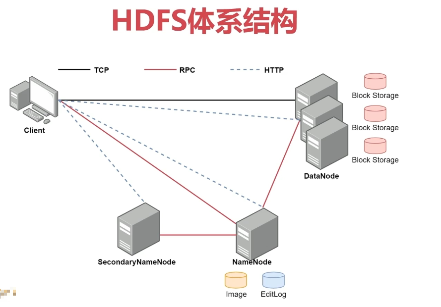
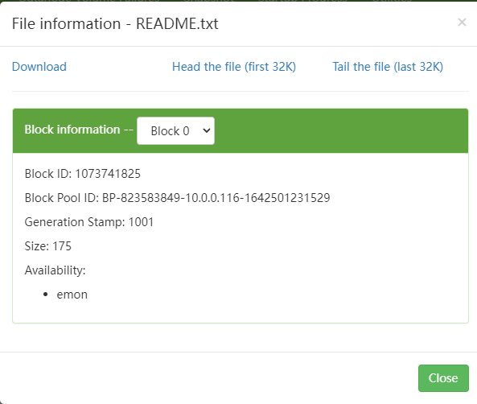
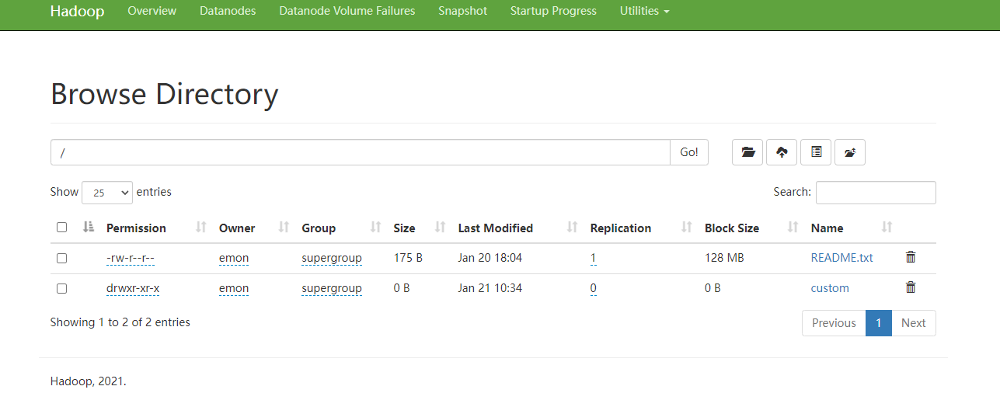

# Hadoop实战

[返回列表](https://github.com/EmonCodingBackEnd/backend-tutorial)

[TOC]

# 一、HDFS命令

# 二、HDFS核心进程剖析

## 2.1、HDFS体系结构



HDFS支持主从结构，主节点称为 NameNode，是因为主节点上运行的有NameNode进程，NameNode支持多个。

从节点称为DataNode，是因为从节点上面运行的有DataNode进程，DataNode支持多个。

HDFS中还包含一个SecondaryNameNode进程，这个进程从字面意思上看像是第二个NameNode的意思，但并不是。

简单理解如下：

公司BOSS：NameNode

秘书：SecondaryNameNode

员工：DataNode

## 2.2、初识NameNode

NameNode是整个文件系统的管理节点。

它主要维护着整个文件系统的文件目录树，`文件/目录的信息`和`每个文件对应的数据块列表`，并且还负责接收用户的操作请求。

- 文件/目录的信息：表示文件/目录的一些基本信息，所有者 属组 修改时间 文件大小等信息。
- 每个文件对应的数据块列表：如果一个文件太大，那么在集群中存储的时候会对文件进行切割，这个时候就类似于会给文件分成一块一块的，存储到不同机器上面。所以HDFS还要记录一下一个文件到底被分了多少块，每一块都在什么地方存储着。

### 2.2.1、NameNode中包含的文件

NameNode主要包括以下文件：

- edits：操作日志文件【事务文件】，这里面会实时记录用户的所有操作。

- fsimage

  - >元数据镜像文件，存储某一时刻NameNode内存中的元数据信息，就类似是定时做了一个快照操作。
    >
    >【这里的元数据信息是指文件目录树、文件/目录的信息、每个文件对应的数据块列表】

- seed_txid

  - > 是存放transactionId的文件，format之后是0，它代表的是namenode里面的edits_*文件的尾数，namenode重启的时候会按照seen_txid的数字，顺序从头跑edits_0000001~到seen_txid的数字。如果根据对应的seen_txid无法加载到对应的文件，NameNode进行将不会完成启动以保护数据一致性。

- VERSION：保存了集群的版本信息

以上这些文件的存储路径是由hdfs-default.xml中的`dfs.namenode.name.dir`属性控制的，hdfs.default.xml在`${HADOOP_HOME}/share/hadoop/hdfs/hadoop-hdfs-3.3.1.jar`这个jar包中。该文件包含了HDFS相关的所有默认参数，这些默认参数可以被`hdfs-site.xml`配置文件覆盖同名参数。

最终，存储路径的值是：`${hadoop.tmp.dir}/dfs/name`

进入该目录：

```bash
[emon@emon ~]$ cd /usr/local/hadoop/tmp/dfs/name
[emon@emon name]$ ls
current  in_use.lock
[emon@emon name]$ cd current
```

`in_use.lock`在namenode启动后产生的，停止后会删除该文件。表示锁定！

```bash
[emon@emon name]$ ll current/
总用量 3140
-rw-rw-r--. 1 emon emon      42 1月  18 18:31 edits_0000000000000000001-0000000000000000002
-rw-rw-r--. 1 emon emon      42 1月  20 10:31 edits_0000000000000000003-0000000000000000004
-rw-rw-r--. 1 emon emon 1048576 1月  20 10:31 edits_0000000000000000005-0000000000000000005
-rw-rw-r--. 1 emon emon      42 1月  20 11:19 edits_0000000000000000006-0000000000000000007
-rw-rw-r--. 1 emon emon 1048576 1月  20 11:19 edits_0000000000000000008-0000000000000000008
-rw-rw-r--. 1 emon emon      42 1月  20 17:52 edits_0000000000000000009-0000000000000000010
-rw-rw-r--. 1 emon emon     530 1月  21 09:55 edits_0000000000000000011-0000000000000000018
-rw-rw-r--. 1 emon emon     695 1月  21 10:55 edits_0000000000000000019-0000000000000000028
-rw-rw-r--. 1 emon emon    3934 1月  21 11:55 edits_0000000000000000029-0000000000000000077
-rw-rw-r--. 1 emon emon      42 1月  21 12:55 edits_0000000000000000078-0000000000000000079
-rw-rw-r--. 1 emon emon    3048 1月  21 13:55 edits_0000000000000000080-0000000000000000117
-rw-rw-r--. 1 emon emon      88 1月  21 14:55 edits_0000000000000000118-0000000000000000120
-rw-rw-r--. 1 emon emon 1048576 1月  21 14:55 edits_inprogress_0000000000000000121
-rw-rw-r--. 1 emon emon     689 1月  21 13:55 fsimage_0000000000000000117
-rw-rw-r--. 1 emon emon      62 1月  21 13:55 fsimage_0000000000000000117.md5
-rw-rw-r--. 1 emon emon     689 1月  21 14:55 fsimage_0000000000000000120
-rw-rw-r--. 1 emon emon      62 1月  21 14:55 fsimage_0000000000000000120.md5
-rw-rw-r--. 1 emon emon       4 1月  21 14:55 seen_txid
-rw-rw-r--. 1 emon emon     214 1月  20 17:50 VERSION
```

如何查看fsimage文件？

```bash
# 转换到xml文件查看
[emon@emon current]$ hdfs oiv -p XML -i fsimage_0000000000000000117 -o fsimage117.xml
```

如何查看edits文件？

```bash
# 转换到xml文件查看
[emon@emon current]$ hdfs oev -i edits_0000000000000000001-0000000000000000002 -o edits.xml
```

## 2.3、SecondaryNameNode

- SecondaryNameNode主要负责定期的把edits文件中的内容合并到fsimage中。
- 这个合并操作成为checkpoint，在合并的时候会对edits中的内容进行转换，生成新的内容保存到fsimage文件中。

注意：NameNode的HA架构中没有SecondaryNameNode进程，文件合并操作会由standby NameNode负责实现，所以在Hadoop集群中，SecondaryNameNode进行并不是必须的。

所以，在2.X版本SecondaryNameNode是必须的，但3.X的版本不是必须的了。

## 2.4、DataNode介绍

- 提供真实文件数据的存储服务。
- HDFS会按照固定的大小，顺序对文件进行划分并编号，划分好的每一个块称一个Block，HDFS默认Block大小是128MB。
- Block块是HDFS读写数据的基本单位，不管你的文件是文本文件，还是视频或者音频文件，对HDFS而言都是字节。

### 2.4.1、存储路径

和NameNode一样，DataNode的存储目录也可以在`hdfs-site.xml`配置文件覆盖`hdfs.default.xml`中的同名参数。

最终路径是：`${hadoop.tmp.dir}/dfs/data`

```bash
[emon@emon ~]$ cd /usr/local/hadoop/tmp/dfs/data/
[emon@emon data]$ ls
current  in_use.lock
[emon@emon data]$ cd current/
[emon@emon current]$ ls
BP-823583849-10.0.0.116-1642501231529  VERSION
[emon@emon current]$ cd BP-823583849-10.0.0.116-1642501231529/current/finalized/subdir0/subdir0/
[emon@emon subdir0]$ pwd
# 命令行输出信息
/usr/local/hadoop/tmp/dfs/data/current/BP-823583849-10.0.0.116-1642501231529/current/finalized/subdir0/subdir0
```

`in_use.lock`在datanode启动后产生的，停止后会删除该文件。表示锁定！

```bash
[emon@emon subdir0]$ ll
总用量 16
-rw-rw-r--. 1 emon emon 175 1月  20 18:04 blk_1073741825
-rw-rw-r--. 1 emon emon  11 1月  20 18:04 blk_1073741825_1001.meta
-rw-rw-r--. 1 emon emon  22 1月  21 22:17 blk_1073741843
-rw-rw-r--. 1 emon emon  11 1月  21 22:17 blk_1073741843_1019.meta
```

这里面有很多block块，具体块对应的文件信息，可以查看：http://emon:9870 ==> Utilities ==> Browse the file system ==> 点击具体文件查看块的信息！



> 注意：这里的.meta文件也是做校验用的。

在块目录下，blk文件可直接查看内容：

```bash
[emon@emon subdir0]$ cat blk_1073741825
For the latest information about Hadoop, please visit our website at:

   http://hadoop.apache.org/

and our wiki, at:

   https://cwiki.apache.org/confluence/display/HADOOP/
```

> 注意：这个block中的文件内容可能只是一个文件的一部分，如果你的文件较大，就会分为多个block存储，默认一个hadoop3中一个block的大小为128M。根据字节进行截取，截取到的128M就是一个block。如果文件大小没默认的block块大那最终就只有一个block。

HDFS中，如果一个文件小于一个数据块的大小，那么并不会占用整个数据块的存储空间。



Size是实际大小，Block Size是文件的最大块大小。
