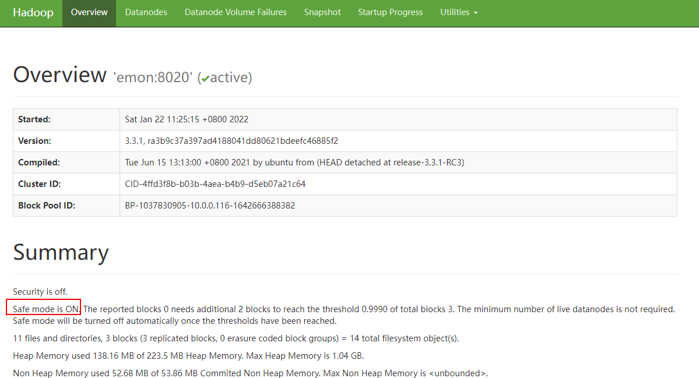
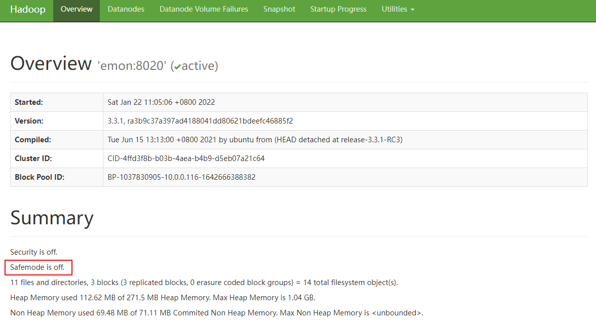
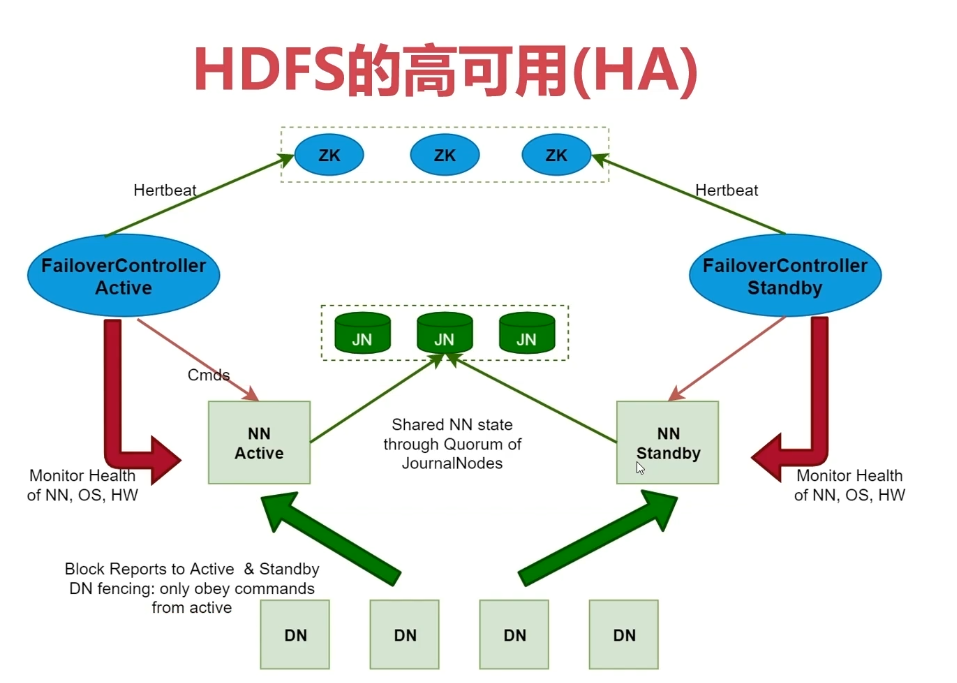
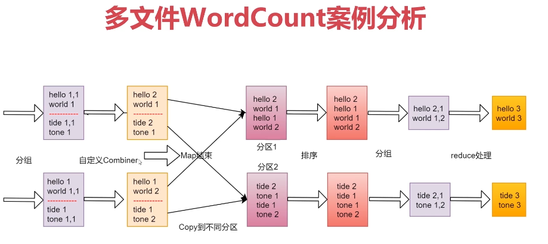
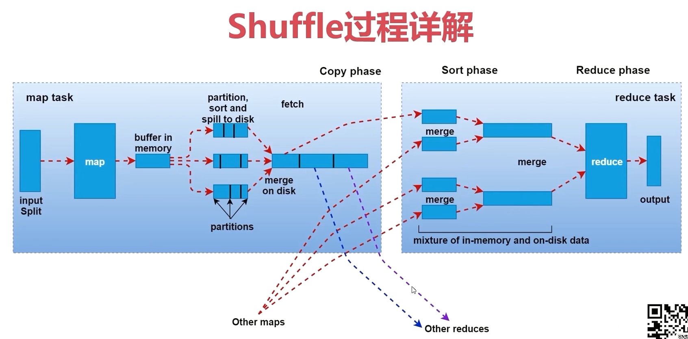
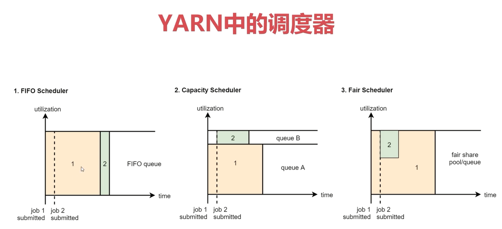
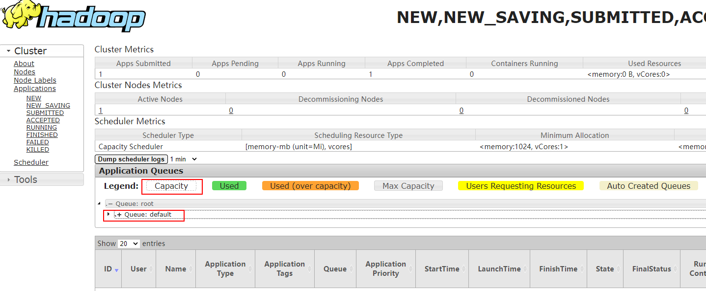

# Hadoop实战

[返回列表](https://github.com/EmonCodingBackEnd/backend-tutorial)

[TOC]

# 一、HDFS命令

# 二、HDFS详解

## 2.1、HDFS体系结构分析


HDFS支持主从结构，主节点称为 NameNode，是因为主节点上运行的有NameNode进程，NameNode支持多个。

从节点称为DataNode，是因为从节点上面运行的有DataNode进程，DataNode支持多个。

HDFS中还包含一个SecondaryNameNode进程，这个进程从字面意思上看像是第二个NameNode的意思，但并不是。

简单理解如下：

公司BOSS：NameNode

秘书：SecondaryNameNode

员工：DataNode

### 2.1.1、NameNode介绍

NameNode是整个文件系统的管理节点。

它主要维护着整个文件系统的文件目录树，`文件/目录的信息`和`每个文件对应的数据块列表`，并且还负责接收用户的操作请求。

- 文件/目录的信息：表示文件/目录的一些基本信息，所有者 属组 修改时间 文件大小等信息。
- 每个文件对应的数据块列表：如果一个文件太大，那么在集群中存储的时候会对文件进行切割，这个时候就类似于会给文件分成一块一块的，存储到不同机器上面。所以HDFS还要记录一下一个文件到底被分了多少块，每一块都在什么地方存储着。

### 2.1.2、NameNode包含的文件

NameNode主要包括以下文件：

- edits：操作日志文件【事务文件】，这里面会实时记录用户的所有操作。

- fsimage

  - >元数据镜像文件，存储某一时刻NameNode内存中的元数据信息，就类似是定时做了一个快照操作。
    >
    >【这里的元数据信息是指文件目录树、文件/目录的信息、每个文件对应的数据块列表】

- seed_txid

  - > 是存放transactionId的文件，format之后是0，它代表的是namenode里面的edits_*文件的尾数，namenode重启的时候会按照seen_txid的数字，顺序从头跑edits_0000001~到seen_txid的数字。如果根据对应的seen_txid无法加载到对应的文件，NameNode进行将不会完成启动以保护数据一致性。

- VERSION：保存了集群的版本信息

以上这些文件的存储路径是由hdfs-default.xml中的`dfs.namenode.name.dir`属性控制的，hdfs.default.xml在`${HADOOP_HOME}/share/hadoop/hdfs/hadoop-hdfs-3.3.1.jar`这个jar包中。该文件包含了HDFS相关的所有默认参数，这些默认参数可以被`hdfs-site.xml`配置文件覆盖同名参数。

最终，存储路径的值是：`${hadoop.tmp.dir}/dfs/name`

进入该目录：

```bash
[emon@emon ~]$ cd /usr/local/hadoop/tmp/dfs/name
[emon@emon name]$ ls
current  in_use.lock
[emon@emon name]$ cd current
```

`in_use.lock`在namenode启动后产生的，停止后会删除该文件。表示锁定！

```bash
[emon@emon name]$ ll current/
总用量 3140
-rw-rw-r--. 1 emon emon      42 1月  18 18:31 edits_0000000000000000001-0000000000000000002
-rw-rw-r--. 1 emon emon      42 1月  20 10:31 edits_0000000000000000003-0000000000000000004
-rw-rw-r--. 1 emon emon 1048576 1月  20 10:31 edits_0000000000000000005-0000000000000000005
-rw-rw-r--. 1 emon emon      42 1月  20 11:19 edits_0000000000000000006-0000000000000000007
-rw-rw-r--. 1 emon emon 1048576 1月  20 11:19 edits_0000000000000000008-0000000000000000008
-rw-rw-r--. 1 emon emon      42 1月  20 17:52 edits_0000000000000000009-0000000000000000010
-rw-rw-r--. 1 emon emon     530 1月  21 09:55 edits_0000000000000000011-0000000000000000018
-rw-rw-r--. 1 emon emon     695 1月  21 10:55 edits_0000000000000000019-0000000000000000028
-rw-rw-r--. 1 emon emon    3934 1月  21 11:55 edits_0000000000000000029-0000000000000000077
-rw-rw-r--. 1 emon emon      42 1月  21 12:55 edits_0000000000000000078-0000000000000000079
-rw-rw-r--. 1 emon emon    3048 1月  21 13:55 edits_0000000000000000080-0000000000000000117
-rw-rw-r--. 1 emon emon      88 1月  21 14:55 edits_0000000000000000118-0000000000000000120
-rw-rw-r--. 1 emon emon 1048576 1月  21 14:55 edits_inprogress_0000000000000000121
-rw-rw-r--. 1 emon emon     689 1月  21 13:55 fsimage_0000000000000000117
-rw-rw-r--. 1 emon emon      62 1月  21 13:55 fsimage_0000000000000000117.md5
-rw-rw-r--. 1 emon emon     689 1月  21 14:55 fsimage_0000000000000000120
-rw-rw-r--. 1 emon emon      62 1月  21 14:55 fsimage_0000000000000000120.md5
-rw-rw-r--. 1 emon emon       4 1月  21 14:55 seen_txid
-rw-rw-r--. 1 emon emon     214 1月  20 17:50 VERSION
```

如何查看fsimage文件？

```bash
# 转换到xml文件查看
[emon@emon current]$ hdfs oiv -p XML -i fsimage_0000000000000000117 -o fsimage117.xml
```

如何查看edits文件？

```bash
# 转换到xml文件查看
[emon@emon current]$ hdfs oev -i edits_0000000000000000001-0000000000000000002 -o edits.xml
```

### 2.1.3、SecondaryNameNode

- SecondaryNameNode主要负责定期的把edits文件中的内容合并到fsimage中。
- 这个合并操作成为checkpoint，在合并的时候会对edits中的内容进行转换，生成新的内容保存到fsimage文件中。

注意：NameNode的HA架构中没有SecondaryNameNode进程，文件合并操作会由standby NameNode负责实现，所以在Hadoop集群中，SecondaryNameNode进行并不是必须的。

所以，在2.X版本SecondaryNameNode是必须的，但3.X的版本不是必须的了。

### 2.1.4、DataNode介绍

- 提供真实文件数据的存储服务。
- HDFS会按照固定的大小，顺序对文件进行划分并编号，划分好的每一个块称一个Block，HDFS默认Block大小是128MB。
- Block块是HDFS读写数据的基本单位，不管你的文件是文本文件，还是视频或者音频文件，对HDFS而言都是字节。

### 2.1.5、DataNode包含的文件

DataNode需要关注的文件有如下：

- blk

  - > 位置：/usr/local/hadoop/tmp/dfs/data/current/BP-823583849-10.0.0.116-1642501231529/current/finalized/subdir0/subdir0

- VERSION

和NameNode一样，DataNode的存储目录也可以在`hdfs-site.xml`配置文件覆盖`hdfs.default.xml`中的同名参数。

最终路径是：`${hadoop.tmp.dir}/dfs/data`

```bash
[emon@emon ~]$ cd /usr/local/hadoop/tmp/dfs/data/
[emon@emon data]$ ls
current  in_use.lock
[emon@emon data]$ cd current/
[emon@emon current]$ ls
BP-823583849-10.0.0.116-1642501231529  VERSION
[emon@emon current]$ cd BP-823583849-10.0.0.116-1642501231529/current/finalized/subdir0/subdir0/
[emon@emon subdir0]$ pwd
# 命令行输出信息
/usr/local/hadoop/tmp/dfs/data/current/BP-823583849-10.0.0.116-1642501231529/current/finalized/subdir0/subdir0
```

`in_use.lock`在datanode启动后产生的，停止后会删除该文件。表示锁定！

```bash
[emon@emon subdir0]$ ll
总用量 16
-rw-rw-r--. 1 emon emon 175 1月  20 18:04 blk_1073741825
-rw-rw-r--. 1 emon emon  11 1月  20 18:04 blk_1073741825_1001.meta
-rw-rw-r--. 1 emon emon  22 1月  21 22:17 blk_1073741843
-rw-rw-r--. 1 emon emon  11 1月  21 22:17 blk_1073741843_1019.meta
```

这里面有很多block块，具体块对应的文件信息，可以查看：http://emon:9870 ==> Utilities ==> Browse the file system ==> 点击具体文件查看块的信息！


> 注意：这里的.meta文件也是做校验用的。

在块目录下，blk文件可直接查看内容：

```bash
[emon@emon subdir0]$ cat blk_1073741825
For the latest information about Hadoop, please visit our website at:

   http://hadoop.apache.org/

and our wiki, at:

   https://cwiki.apache.org/confluence/display/HADOOP/
```

> 注意：这个block中的文件内容可能只是一个文件的一部分，如果你的文件较大，就会分为多个block存储，默认一个hadoop3中一个block的大小为128M。根据字节进行截取，截取到的128M就是一个block。如果文件大小没默认的block块大那最终就只有一个block。

HDFS中，如果一个文件小于一个数据块的大小，那么并不会占用整个数据块的存储空间。


Size是实际大小，Block Size是文件的最大块的大小。

另外，在DataNode的数据目录下面的current目录中有一个VERSION文件。这个文件和NameNode里面的VERSION文件相似，对比如下：
**NameNode下的VERSION文件**：

```bash
[emon@emon ~]$ cat /usr/local/hadoop/tmp/dfs/name/current/VERSION 
#Sat Jan 22 09:27:01 CST 2022
namespaceID=1685831230
clusterID=CID-8368f407-a3a6-4d9e-86eb-ed62198078e6
cTime=1642501231529
storageType=NAME_NODE
blockpoolID=BP-823583849-10.0.0.116-1642501231529
layoutVersion=-66
```

**DataNode下的VERSION文件**：

```bash
[emon@emon ~]$ cat /usr/local/hadoop/tmp/dfs/data/current/VERSION 
#Sat Jan 22 09:27:04 CST 2022
storageID=DS-5ec2332c-eff2-4ead-8f36-0aaa5a01a31e
clusterID=CID-8368f407-a3a6-4d9e-86eb-ed62198078e6
cTime=0
datanodeUuid=dd05c2ac-6668-4317-8d72-15551cf97d98
storageType=DATA_NODE
layoutVersion=-57
```

所以，NameNode不要随便格式化，因为格式化了以后VERSION里面的clusterID会变化，但是datanode的VERSION中的clusterID并不会变化，就匹配不上了。

**重点**：如果要重新格式化，需要先清空集群中每一台服务器上的`${hadoop.tmp.dir}`目录。

### 2.1.6、NameNode总结

> 注意：block块存放在哪些datanode上，只有datanode自己知道，当集群启动的时候，datanode会扫描自己节点上所有的block块信息，然后把节点和这个节点上的所有block块信息告诉给namenode。这个关系是每次重启集群都会动态加载的【这个其实就是为什么集群数据越多，启动越慢的原因】

NameNode维护了两份关系：

第一份关系：file与block list的关系，对应的关系信息存储在fsimage和edits文件中，当NameNode启动的时候会把文件中的元数据信息加载到内存中。

第二份关系：datanode与block的关系，对应的关系主要在集群启动的时候保存在内存中，当DataNode启动时会把当前节点上的Block信息和节点信息上报给NameNode。

> 注意了，NameNode启动的时候会把文件中的元数据信息加载到内存中，然后每一个文件的元数据信息会占用150字节的内存空间，这个是恒定的，和文件大小没关系。这也是HDFS不适合存储小文件的原因。不管大文件还是小文件，一个文件的元数据信息在NameNode中都会占用150字节，NameNode节点的内存是有限的，所以它的存储能力也是有限的，如果我们存储了一堆都是几KB的小文件，最后发现NameNode内存占满了，确实存储了很多文件，但是文件的总体大小确很小，这样就失去了HDFS存在的价值。


## 2.2、HDFS高级

### 2.2.1、HDFS的回收站

HDFS会为每一个用户创建一个回收站目录：`/user/用户名/.Trash/`，每一个被用户在Shell命令行删除的文件/目录，会进入到对应的回收站目录中，在回收站中的数据都有一个生存周期，也就是当回收站中的文件/目录在一段时间之内没有被用户恢复的话，HDFS就会自动的把这个文件/目录彻底删除，之后，用户就永远也找不回这个文件/目录了。

默认情况下HDFS的回收站是没有开启的，需要通过一个配置来开启，在`core-site.xml`中添加如下配置，value的单位是分钟，1440分钟表示是一天的生存周期。

```xml
    <property>
        <name>fs.trash.interval</name>
        <value>1440</value>
    </property>
```

在修改配置信息之前先验证一下删除操作，显示的是直接删除掉了。

```bash
[emon@emon ~]$ hdfs dfs -rm /NOTICE.txt
Deleted /NOTICE.txt
```

停止集群 ==> 修改主节点 emon 上的回收站配置 ==> 同步到其他两个节点 ==> 启动集群：

```bash
[emon@emon ~]$ stop-all.sh 
[emon@emon ~]$ vim /usr/local/hadoop/etc/hadoop/core-site.xml 
```

```xml
<configuration>
    <property>
        <name>fs.defaultFS</name>
        <value>hdfs://emon:8020</value>
    </property>
    <property>
        <name>hadoop.tmp.dir</name>
        <value>/usr/local/hadoop/tmp</value>
    </property>
    <property>
        <name>fs.trash.interval</name>
        <value>1440</value>
    </property>
</configuration>
```

```bash
[emon@emon ~]$ scp -rq /usr/local/hadoop/etc/hadoop/core-site.xml emon@emon2:/usr/local/hadoop/etc/hadoop/
[emon@emon ~]$ scp -rq /usr/local/hadoop/etc/hadoop/core-site.xml emon@emon3:/usr/local/hadoop/etc/hadoop/
```

启动集群，再执行删除操作：

```bash
[emon@emon ~]$ hdfs dfs -rm /NOTICE.txt
2022-01-22 11:06:16,208 INFO fs.TrashPolicyDefault: Moved: 'hdfs://emon:8020/NOTICE.txt' to trash at: hdfs://emon:8020/user/emon/.Trash/Current/NOTICE.txt
```

此时看到提示信息说把删除的文件移到了指定目录中，其实就是移动到了当前用户的回收站目录。

> 注意：如果删除的文件过大，超过回收站大小的话会提示删除失败，需要指定参数 -skipTrash ，指定这个参数表示删除的文件不会进回收站。

```bash
[emon@emon ~]$ hdfs dfs -rm -skipTrash /LICENSE.txt
Deleted /LICENSE.txt
```

### 2.2.2、HDFS的安全模式

平时操作HDFS的时候，可能会遇到这个问题，特别是刚启动集群后去上传或者删除文件，会发现错误，提示NameNode处于`safe mode`。这个属于HDFS的安全模式，因为在集群每次重启的时候，HDFS都会检查集群中文件信息是否完整，例如副本是否缺少之类的信息，所以这个时间段内是不允许对集群有修改操作的，如果遇到了这种情况，可以稍等一会，等HDFS自检完毕，就会自动退出安全模式。

此时访问HDFS的web ui界面，可以看到下面的信息，on表示处于安全模式，off表示安全模式已退出。

**安全模式开启图示**：




**安全模式关闭图示**：



或者通过hdfs命令也可以查看当前的状态：

```bash
[emon@emon ~]$ hdfs dfsadmin -safemode get
Safe mode is OFF
```

如果想快速离开安全模式，可以通过命令强制离开，正常情况下建议等HDFS自检完毕，自动退出。

```bash
[emon@emon ~]$ hdfs dfsadmin -safemode leave
Safe mode is OFF
```

此时，再操作HDFS中的文件就可以了。


### 2.2.3、实战：定时上传数据至HDFS

> 需求分析：
>
> 在实际工作中会有定时上传数据到HDFS的需求，我们有一个web项目每天都会产生日志文件，日志文件的格式为access_2020-01-01+12:35.log这种格式的，每天产生一个，我们需要每天凌晨将昨天生成的日志文件上传至HDFS上，按天分目录存储，HDFS上的目录格式为20200101。
>
> 说明：根据 /usr/local/nginx/sbin/cut_my_log.sh 脚本对nginx日志进行按照每分钟切割，可以生成测试文件。

针对这个需求，我们需要开发一个shell脚本，方便定时调度执行：

第一步：我们需要获取到昨天日志文件的名称

第二步：在HDFS上面使用昨天的日期创建目录

第三步：将昨天的日志文件上传到刚创建的HDFS目录中

第四部：要考虑到脚本重跑，补数据的情况

第五步：配置crontab任务

开始开发shell脚本，脚本内容如下：

```bash
[emon@emon ~] vim /usr/local/hadoop/custom/shell/uploadLogData.sh
```

```bash
#!/bin/bash

# 获取昨天日期字符串
yesterday=$1
if [ "$yesterday" = "" ]
then
    yesterday=`date +%Y-%m-%d+%H --date="1 days ago"`
fi

# 拼接日志文件路径信息
logPath=/usr/local/nginx/logs/access.${yesterday}.log

# 将日期字符串中的 -+: 去掉，并且拼接成HDFS的路径
hdfsPath=/log/${yesterday//[-+:]/}

# 在HDFS上面创建目录
hdfs dfs -mkdir -p ${hdfsPath}

# 将数据上传到HDFS的指定目录中
hdfs dfs -put ${logPath} ${hdfsPath}
```

```bash
# -x 参数跟踪脚本执行情况
[emon@emon ~]$ sh -x /usr/local/hadoop/custom/shell/uploadLogData.sh 
# 命令行输出信息
+ yesterday=
+ '[' '' = '' ']'
++ date +%Y-%m-%d+%H '--date=1 days ago'
+ yesterday=2022-01-21+13
+ logPath=/usr/local/nginx/logs/access.2022-01-21+13.log
+ hdfsPath=/log/2022012113
+ hdfs dfs -mkdir -p /log/2022012113
+ hdfs dfs -put /usr/local/nginx/logs/access.2022-01-21+13.log /log/2022012113
put: `/log/2022012113/access.2022-01-21+13.log': File exists
[emon@emon shell]$ sh -x uploadLogData.sh 
+ yesterday=
+ '[' '' = '' ']'
++ date +%Y-%m-%d+%H '--date=1 days ago'
+ yesterday=2022-01-21+13
+ logPath=/usr/local/nginx/logs/access.2022-01-21+13.log
+ hdfsPath=/log/2022012113
+ hdfs dfs -mkdir -p /log/2022012113
+ hdfs dfs -put /usr/local/nginx/logs/access.2022-01-21+13.log /log/2022012113

[emon@emon ~]$ hdfs dfs -ls -R /log
drwxr-xr-x   - emon supergroup          0 2022-01-22 13:54 /log/2022012113
-rw-r--r--   2 emon supergroup        564 2022-01-22 13:54 /log/2022012113/access.2022-01-21+13.log
```

```bash
# 手工上传指定日志
[emon@emon ~]$ sh -x /usr/local/hadoop/custom/shell/uploadLogData.sh 2022-01-21+12
+ yesterday=2022-01-21+12
+ '[' 2022-01-21+12 = '' ']'
+ logPath=/usr/local/nginx/logs/access.2022-01-21+12.log
+ hdfsPath=/log/2022012112
+ hdfs dfs -mkdir -p /log/2022012112
+ hdfs dfs -put /usr/local/nginx/logs/access.2022-01-21+12.log /log/2022012112

[emon@emon ~]$ hdfs dfs -ls -R /log
drwxr-xr-x   - emon supergroup          0 2022-01-22 14:01 /log/2022012112
-rw-r--r--   2 emon supergroup        412 2022-01-22 14:01 /log/2022012112/access.2022-01-21+12.log
drwxr-xr-x   - emon supergroup          0 2022-01-22 13:54 /log/2022012113
-rw-r--r--   2 emon supergroup        564 2022-01-22 13:54 /log/2022012113/access.2022-01-21+13.log
```

### 2.2.4、HDFS的高可用和高扩展

NameNode节点负责接收用户的操作请求，所有的读写请求都会经过它，如果NameNode节点宕机了怎么办？



**HA部署暂略！**


# 三、MapReduce

## 3.1、多文件WordCount案例分析




## 3.2、MapReduce任务日志查看

### 3.2.1、在yarn的web界面查看日志

默认情况下，在yarn的web界面(http://emon:8088) ==> 点击对应任务的history链接 ==> 打不开链接？

原因：1、window的hosts文件中没有配置emon的解析；2、必须要启动historyserver进程，并且还要开启日志聚合功能，才能在web界面上直接查看任务对应的日志信息，因为默认情况下任务的日志是散落在nodemanager节点上的，要想查看需要找到对应的nodemanager节点上去查看，这样就很不方便，通过日志聚合功能可以把之前本来散落在nodemanager节点上的日志统一收集到hdfs上的指定目录中，这样就可以在yarn的web界面中直接查看了。

如何开启日志聚合功能？

需要通过一个配置来开启，在`yarn-site.xml`中添加如下配置：

```xml
    <!-- 开启日志聚合 -->
    <property>
        <name>yarn.log-aggregation-enable</name>
        <value>true</value>
    </property>
	<!-- 日志聚合HDFS目录 -->
	<property>
		<name>yarn.nodemanager.remote-app-log-dir</name>
		<value>/tmp/logs/emon/yarn-logs</value>
	</property>
	<!-- 日志保存时间30days,单位秒 -->
	<property>
		<name>yarn.log-aggregation.retain-seconds</name>
		<value>2592000</value>
    </property>
    <property>
        <name>yarn.log-server.url</name>
        <value>http://emon:19888/jobhistory/logs</value>
    </property>
```

停止集群 ==> 修改主节点 emon 上的`yarn-site.xml`配置 ==> 同步到其他两个节点 ==> 启动集群：

```bash
[emon@emon ~]$ stop-all.sh 
[emon@emon ~]$ vim /usr/local/hadoop/etc/hadoop/yarn-site.xml
```

```xml
<configuration>

<!-- Site specific YARN configuration properties -->
    <property>
        <name>yarn.nodemanager.aux-services</name>
        <value>mapreduce_shuffle</value>
    </property>
    <!-- 白名单 -->
    <property>
        <name>yarn.nodemanager.env-whitelist</name>
        <value>JAVA_HOME,HADOOP_COMMON_HOME,HADOOP_HDFS_HOME,HADOOP_CONF_DIR,CLASSPATH_PREPEND_DISTCACHE,HADOOP_YARN_HOME,HADOOP_MAPRED_HOME</value>
    </property>
    <!-- 开启日志聚合 -->
    <property>
        <name>yarn.log-aggregation-enable</name>
        <value>true</value>
    </property>
	<!-- 日志聚合HDFS目录 -->
	<property>
		<name>yarn.nodemanager.remote-app-log-dir</name>
		<value>/tmp/logs/emon/yarn-logs</value>
	</property>
	<!-- 日志保存时间30days,单位秒 -->
	<property>
		<name>yarn.log-aggregation.retain-seconds</name>
		<value>2592000</value>
    </property>
    <property>
        <name>yarn.log-server.url</name>
        <value>http://emon:19888/jobhistory/logs</value>
    </property>
</configuration>
```

```bash
# 如果不需要修改默认值，不需要修改
[emon@emon ~]$ vim /usr/local/hadoop/etc/hadoop/mapred-site.xml 
```

```xml
<configuration>
    <property>
        <name>mapreduce.framework.name</name>
        <value>yarn</value>
    </property>
    <!-- 历史日志 -->
    <property>
         <name>mapreduce.jobhistory.address</name>
         <value>emon:10020</value>
    </property>
    <property>
        <name>mapreduce.jobhistory.webapp.address</name>
        <value>emon:19888</value>
    </property>
</configuration>
```

```bash
[emon@emon ~]$ scp -rq /usr/local/hadoop/etc/hadoop/yarn-site.xml emon@emon2:/usr/local/hadoop/etc/hadoop/
[emon@emon ~]$ scp -rq /usr/local/hadoop/etc/hadoop/yarn-site.xml emon@emon3:/usr/local/hadoop/etc/hadoop/
[emon@emon ~]$ scp -rq /usr/local/hadoop/etc/hadoop/mapred-site.xml emon@emon2:/usr/local/hadoop/etc/hadoop/
[emon@emon ~]$ scp -rq /usr/local/hadoop/etc/hadoop/mapred-site.xml emon@emon3:/usr/local/hadoop/etc/hadoop/
```

启动集群 ==> 启动emon节点historyserver进程 ==> 启动其他节点historyserver进程。

```bash
[emon@emon ~]$ start-all.sh 
[emon@emon ~]$ mapred --daemon start historyserver
[emon@emon ~]$ jps
39843 NameNode
40196 DataNode
40824 ResourceManager
41689 Jps
41146 NodeManager
40587 SecondaryNameNode
41627 JobHistoryServer <== historserver进程
```

OK，任务日志可查看了！

另外，停止historyserver命令：

```bash
[emon@emon ~]$ mapred --daemon stop historyserver
```

### 3.2.2、命令行查看日志

从yarnweb上获取applicationId，然后执行命令：

```bash
[emon@emon ~]$ /usr/local/hadoop/bin/yarn logs -applicationId application_1642928361436_0002
```

## 3.3、停止集群任务

```bash
[emon@emon ~]$ /usr/local/hadoop/bin/yarn application -kill <applicationId>
```

```bash
# 示例
[emon@emon ~]$ /usr/local/hadoop/bin/yarn application -kill application_1643078894666_0004
2022-01-25 15:51:26,620 INFO client.DefaultNoHARMFailoverProxyProvider: Connecting to ResourceManager at /0.0.0.0:8032
Killing application application_1643078894666_0004
2022-01-25 15:51:27,919 INFO impl.YarnClientImpl: Killed application application_1643078894666_0004
```


## 3.4、Shuffle过程详解



## 3.5、性能优化

### 3.5.1、剖析小文件问题与企业级解决方案

- Hadoop的HDFS和MapReduce框架是针对大数据文件来设计的，在小文件的处理上不但效率低下，而且十分消耗内存资源。

- HDFS提供了两种类型的容器，SequenceFile和MapFile。

  - > SequenceFile是Hadoop提供的一种二进制文件，这种二进制文件直接将`<key, value>对`序列化到文件中。
    >
    > 一般对小文件可以使用这种文件合并，即将文件名作为key，文件内容作为value序列化到大文件中。
    >
    > 注意：SequenceFile需要一个合并文件的过程，文件较大，且合并后的文件将不方便查看，必须通过遍历查看每一个小文件。

  - > MapFile是排序后的SequenceFile，MapFile由两部分组成，分别是index和data。
    >
    > index作为文件的数据索引，主要记录了每个Record的key值，以及该Record在文件中的偏移位置。
    >
    > 在MapFile被访问的时候，索引文件会被加载到内存，通过索引映射关系可迅速定位到指定Record所在文件位置。


### 3.5.2、数据倾斜问题

在实际工作中，如果我们想提高MapReduce的执行效率，最直接的方法是什么呢？

我们知道MapReduce是分为Map阶段和Reduce阶段，其实提高执行效率就是提高这两个阶段的执行效率。

默认情况下Map阶段中Map任务的个数是和数据的InputSplit相关的，InputSplit的个数一般是和Block块是有关联的，所以可以认为Map任务的个数和数据的block块个数有关系，针对Map任务的个数我们一般是不需要干预的，除非是碰到海量小文件，可以考虑把小文件合并成大文件。其他情况是不需要调整的。

那就剩下Reduce阶段了，默认情况下Reduce的个数是1个，所以现在MapReduce任务的压力就集中在Reduce阶段了，如果说数据量比较大的时候，一个Reduce任务处理起来肯定是比较慢的，我们可以考虑增加Reduce任务的个数，这样就可以实现数据分流，提高计算效率了。

但是注意了，如果增加Reduce的个数，那肯定私钥对数据进行分区的，分区之后，每个分区的数据会被一个Reduce任务处理。

那么如何增加分区呢？

通过观察`job.setPartitionerClass`可以了解到，默认使用的`HashPartitioner`分区：

```bash
public class HashPartitioner<K2, V2> implements Partitioner<K2, V2> {

  public void configure(JobConf job) {}

  /** Use {@link Object#hashCode()} to partition. */
  public int getPartition(K2 key, V2 value,
                          int numReduceTasks) {
    return (key.hashCode() & Integer.MAX_VALUE) % numReduceTasks;
  }

}
```

且默认分区基数`numReduceTasks`值为1，所以分区始终是1个，可以通过：

```java
// Job对象中获取numReduceTasks数量的代码，在JobConf中国
public int getNumReduceTasks() { return getInt(JobContext.NUM_REDUCES, 1); }

// Job对象提供了修改该数量的方法
job.setNumReduceTasks(n)
```

来调整`HashPartitioner`的取模基数，增加分区数量。


增加Reduce任务个数在一定场景下是可以提高效率的，但是在某一些特殊场景下单纯增加Reduce任务个数，是无法达到质的提升的。

下面我们来分析一个场景：

假设我们有一个文件，有1000万条数据，这里面的值主要都是数值，1,2,3,4,5...，我们希望统计出来每个数字出现的次数，其实在私下我们是知道这份数据的大致情况的，这里面的1000万条数据，值为5的数据有910万条左右，剩下的9个数字一共只有90万条，那也就意味着，这份数据中，值为5个数据比较集中，或者说值为5的数据属于**倾斜的数据**，在这一份数据中，它的占比比其他数据多得多。

**这样在分区后，数据5占用了某个分区，该分区处理了1000万数据中的90%以上，会导致整个MR任务变慢！**

针对这种情况怎么办？

把倾斜的数据打散！

**数据倾斜问题**的定义：

> MapReduce程序执行时，Reduce节点大部分执行完毕，但是有一个或者几个Reduce节点运行很慢，导致整个程序时间变得很长，具体表现为：Reduce阶段一直卡着不动。

处理方法：

- 增加Reduce任务个数
- 把倾斜的数据打散


# 四、YARN资源管理模型

- Yarn主要负责集群资源的管理和调度，支持主从架构，主节点最多可以有两个，从节点可以有多个。
  - ResourceManager是主节点，主要负责集群资源的分配和管理
  - NodeMan是从节点，主要负责当前机器资源管理

- YARN主要管理内存和CPU这两种资源类型。

- NodeManager启动时会向ResourceManager注册，注册信息中包含该节点可分配的CPU和内存总量。

  - ```bash
    yarn.nodemanager.resource.memory-mb：单节点可分配的物理内存数量，默认是8MB*1024，即8G
    yarn.nodemanager.resource.cpu-vcores：单节点可分配的虚拟CPU个数，默认值是8
    ```

## 4.1、YARN中的调度器

Yarn中支持三种调度器：

- FIFO Scheduler：先进先出（First in，First out）调度策略
- Capacity Scheduler：FIFO Scheduler的多队列版本【默认】
- Fair Scheduler：多队列，多用户共享资源



在实际工作中我们一般都是使用第二种，CapacityScheduler，从hadoop2开始，CapacityScheduler也是集群中的默认调度器了。

点击 http://emon8088 进入yarn web界面，点击左侧的Scheduler可以看到集群当前调度器类型和队列数量。



下面的root是根的意思，他下面目前只有一个队列，叫default，我们之前提交的任务都会进入到这个队列中。

## 4.2、案例：YARN多资源队列配置和使用

我们的需求是这样的，希望增加2个队列，一个是online队列，一个是offline队列，然后向offline队列中提交一个mapreduce任务。

online队列里面运行实时任务，offline队列里面运行离线任务，我们现在学习的mapreduce就属于离线任务。

### 4.2.1、如何增加YARN调度器队列

停止集群 ==> 修改主节点 emon 上的YARN调度器配置 ==> 同步到其他两个节点 ==> 启动集群：

```bash
[emon@emon ~]$ stop-all.sh 
[emon@emon ~]$ vim /usr/local/hadoop/etc/hadoop/capacity-scheduler.xml 
```

```xml
<!-- 修改 -->
  <property>
    <name>yarn.scheduler.capacity.root.queues</name>
    <value>default,online,offline</value>
    <description>队列列表，多个队列之间使用逗号分隔</description>
    <!--<value>default</value>
    <description>
      The queues at the this level (root is the root queue).
    </description>-->
  </property>
<!-- 修改 -->
  <property>
    <name>yarn.scheduler.capacity.root.default.capacity</name>
    <value>60</value>
    <description>default队列60%</description>
    <!--<value>100</value>
    <description>Default queue target capacity.</description>-->
  </property>
<!-- 新增 -->
  <property>
	<name>yarn.scheduler.capacity.root.online.capacity</name>        
    <value>5</value>
    <description>online队列5%</description>
  </property>
<!-- 新增 -->
  <property>
	<name>yarn.scheduler.capacity.root.offline.capacity</name>        
    <value>35</value>
    <description>offline队列35%</description>
  </property>
<!-- 修改 -->
  <property>
    <name>yarn.scheduler.capacity.root.default.maximum-capacity</name>
    <value>60</value>
    <description>default队列可使用的资源上限.</description>
    <!--<value>100</value>
    <description>
      The maximum capacity of the default queue. 
    </description>-->
  </property>
<!-- 新增 -->
  <property>
	<name>yarn.scheduler.capacity.root.online.maximum-capacity</name>        
    <value>5</value>
    <description>online队列可使用的资源上限.</description>
  </property>
<!-- 新增 -->
  <property>
	<name>yarn.scheduler.capacity.root.offline.maximum-capacity</name>        
    <value>35</value>
    <description>offline队列可使用的资源上限.</description>
  </property>
```

```bash
[emon@emon ~]$ scp -rq /usr/local/hadoop/etc/hadoop/capacity-scheduler.xml emon@emon2:/usr/local/hadoop/etc/hadoop/
[emon@emon ~]$ scp -rq /usr/local/hadoop/etc/hadoop/capacity-scheduler.xml emon@emon3:/usr/local/hadoop/etc/hadoop/
```

**注意**：要保证每一个队列的可用内存不至于太小，而无法启动任务。

```bash
[emon@emon ~]$ tailf /usr/local/hadoop/logs/hadoop-emon-resourcemanager-emon.log 
```

```bash
2022-01-26 18:58:35,908 WARN org.apache.hadoop.yarn.server.resourcemanager.scheduler.capacity.LeafQueue: maximum-am-resource-percent is insufficient to start a single application in queue, it is likely set too low. skipping enforcement to allow at least one application to start
```


