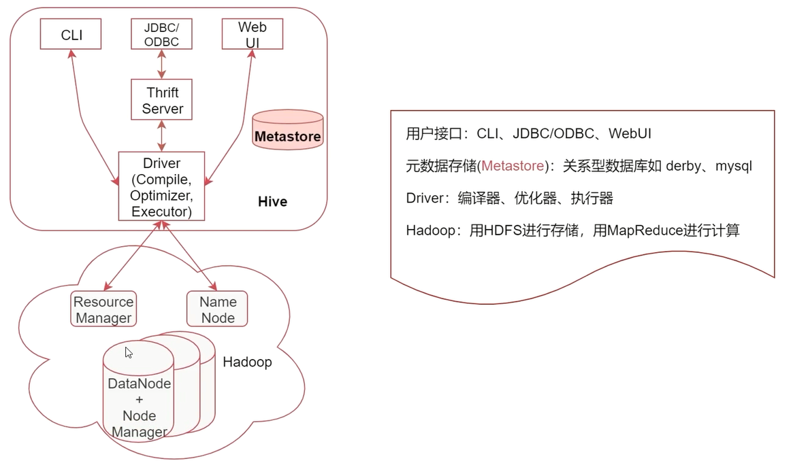

# Hive实战

[返回列表](https://github.com/EmonCodingBackEnd/backend-tutorial)

[TOC]

# 一、安装

[安装Hive](https://github.com/EmonCodingBackEnd/backend-tutorial/blob/master/tutorials/BigData/BigDataInAction.md#6%E5%AE%89%E8%A3%85hivecdh%E7%89%88)

# 二、Hive详解

## 2.1、什么是Hive

Hive是建立在Hadoop上的数据仓库基础架构。它提供了一系列的工具，可以用来进行数据提取转化加载，可以简称为ETL。

Hive定义了简单的类SQL查询语言，称为HQL，它允许熟悉SQL的用户直接查询Hadoop中的数据，同时，这个语言也允许熟悉MapReduce的开发者开发自定义的MapReduce任务来处理内建的SQL函数无法完成的复杂的分析任务。

Hive中包含的有SQL解析引擎，它会将SQL语句转译成M/R Job，然后在Hadoop中执行。

通过这里的分析我们可以了解到Hive可以通过sql查询Hadoop中的数据，并且sql底层也会转化成MapReduce任务，所以Hive是基于Hadoop的。

## 2.2、Hive的数据存储

Hive的数据存储基于Hadoop的HDFS，Hive没有专门的数据存储格式。

Hive默认可以直接加载文本文件（TextFile），还支持SequenceFile，RCFile等文件格式。

针对普通文本数据，我们在创建表时，只需要指定数据的列分隔符与行分隔符，Hive即可解析里面的数据。

## 2.3、Hive的系统架构



- 用户接口：包括CLI、JDBC/ODBC、WebGUI
  - CLI：即Shell命令行，表示我们可以通过shell命令行操作Hive
  - JDBC/ODBC：是Hive的Java操作方式，与使用传统数据库JDBC的方式类似。
- 元数据存储（Metastore）：注意，这里的存储是名词，Metastore表示是一个存储系统。Hive中的元数据包括表的相关信息，Hive会将这些元数据存储在Metastore中，目前Metastore只支持mysql、derby。
- Driver：包含 编译器、优化器、执行器。编译器、优化器、执行器可以完成Hive的查询语句从词法分析、语法分析、编译、优化以及查询计划的生成。生成的查询计划最终存储在HDFS中，并在随后由MapReduce调用执行。
- Hadoop：Hive会使用HDFS进行存储，利用MapReduce进行计算。Hive的数据存储在HDFS中，大部分的查询由MapReduce完成（特例：select * from table 不会生成MapReduce任务，如果在SQL语句后面再增加where过滤条件就会生成MapReduce任务了。）

在这里需要注意一点：从Hive2开始，其实官方就不建议默认使用MapReduce引擎了，而是建议使用Tez引擎或者是Spark引擎，不过目前一直到最新的3.x版本中MapReduce还是默认的执行引擎。

### 2.3.1、大数据计算引擎

- 第一代：MapReduce

- 第二代：Tez

  - > 它是源于MapReduce，主要和Hive结合在一起使用。

- 第三代：Spark

  - > Spark在当时属于一个划时代的产品，改变了之前基于磁盘的计算思路，而是采用内存计算。
    >
    > 注意：Spark也是支持在YARN上执行的。

- 第四代：Flink

  - > Flink是一个可以支持纯实时数据计算的计算引擎，在实时计算领域要优于Spark。
    >
    > 注意：Flink也是支持在YARN上执行的。

所以发现没有，MapReduce、Tez、Spark、Flink这些计算引擎都是支持在yarn上执行的，所以说Hadoop2中对架构的拆分是非常明智的。

### 2.3.2、Metastore

- Metastore：是Hive元数据的集中存放地。
- 元数据包括表的名字，表的列和分区及其属性，表的数据所在目录等。
- Metastore默认使用内嵌的Derby数据库作为存储引擎，推荐使用MySQL数据库作为外置存储引擎。

### 2.3.3、Hive VS MySQL

|              | Hive       | MySQL    |
| ------------ | ---------- | -------- |
| 数据存储位置 | HDFS       | 本地磁盘 |
| 数据格式     | 用户定义   | 系统决定 |
| 数据更新     | 不支持     | 支持     |
| 索引         | 有，但较弱 | 有       |
| 执行         | MapReduce  | Executor |
| 执行延迟     | 高         | 低       |
| 可扩展性     | 高         | 低       |
| 数据规模     | 大         | 小       |

### 2.3.4、数据库 VS 数据仓库

- 数据库：传统的关系型数据库主要应用在基本的事务处理，例如银行交易；支持增删改查。
- 数据仓库：主要做一些复杂的分析操作，侧重决策支持，相对数据库而言，数据仓库分析的数据规模要大得多；只支持查询。
- 数据库与数据仓库的本质区别就是 `OLTP` 与 `OLAP` 的区别。


### 2.3.5、OLTP VS OLAP

- OLTP(On-Line Transaction Processing)：操作型处理，成为联机事务处理，也可以成为面向交易的处理系统，它是针对具体业务在数据库联机的日常操作，通常对少数记录进行查询、修改。用户较为关心操作的相应时间、数据的安全性、完整性等问题。
- OLAP(On-Line Analytical Processing)：分析型处理，称为联机分析处理，一般针对某些主题历史数据进行分析，支持管理决策。


## 2.4、Hive使用前的配置

操作Hive可以在Shell命令行下操作，或者是使用JDBC代码的方式操作。

### 2.4.1、命令行方式

- hive命令
- beeline命令：需要开启 `hiveserver2` 服务

### 2.4.2、JDBC方式

启动 `hiveserver2`服务后，可通过编程方式JDBC连接到hive。

### 2.4.3、Set命令的使用

在hive命令行中可以使用`set`命令临时设置一些参数的值，其实就是临时修改`hive-site.xml`中参数的值。

不过通过set命令设置的参数只在当前会话有效，退出重新打开就无效了。

如果想要对当前机器上的当前用户有效的话可以把命令配置在`~/.hiverc`文件中。


在`hive-site.xml`中有一个参数是`hive.cli.print.current.db`，这个参数可以显示当前所在的数据库名称，默认值为 false。

```sql
hive> set hive.cli.print.current.db=true;
hive (default)> 
```

还有一个参数`hive.cli.print.header`可以控制获取结果的时候显示字段名称，这样看起来会比较清晰。

```sql
hive (default)> select * from t1;
OK
1	zs
Time taken: 1.641 seconds, Fetched: 1 row(s)

hive (default)> set hive.cli.print.header=true;

hive (default)> select * from t1;
OK
t1.id	t1.name
1	zs
Time taken: 0.138 seconds, Fetched: 1 row(s)
```

以上两个可以作为个人习惯，放入`~/.hiverc`即可！

```bash
[emon@emon ~]$ vim ~/.hiverc
set hive.cli.print.current.db=true;
set hive.cli.print.header=true;
```

### 2.4.4、hive历史操作命令

linux中有一个history命令可以查看历史操作命令，hive中也有类似功能。

hive中的历史命令会存储在当前用户目录下的 .hivehistory 目录中。

```bash
[emon@emon ~]$ tailf -10 ~/.hivehistory 
```

### 2.4.5、Hive的日志

#### 2.4.5.1、Hive的日志冲突

```bash
[emon@emon ~]$ hive
SLF4J: Class path contains multiple SLF4J bindings.
SLF4J: Found binding in [jar:file:/usr/local/HBase/hbase-1.2.0-cdh5.16.2/lib/slf4j-log4j12-1.7.5.jar!/org/slf4j/impl/StaticLoggerBinder.class]
SLF4J: Found binding in [jar:file:/usr/local/Hadoop/hadoop-3.3.1/share/hadoop/common/lib/slf4j-log4j12-1.7.30.jar!/org/slf4j/impl/StaticLoggerBinder.class]
SLF4J: See http://www.slf4j.org/codes.html#multiple_bindings for an explanation.
SLF4J: Actual binding is of type [org.slf4j.impl.Log4jLoggerFactory]
SLF4J: Class path contains multiple SLF4J bindings.
SLF4J: Found binding in [jar:file:/usr/local/Hive/apache-hive-3.1.2-bin/lib/log4j-slf4j-impl-2.10.0.jar!/org/slf4j/impl/StaticLoggerBinder.class]
SLF4J: Found binding in [jar:file:/usr/local/Hadoop/hadoop-3.3.1/share/hadoop/common/lib/slf4j-log4j12-1.7.30.jar!/org/slf4j/impl/StaticLoggerBinder.class]
SLF4J: See http://www.slf4j.org/codes.html#multiple_bindings for an explanation.
SLF4J: Actual binding is of type [org.apache.logging.slf4j.Log4jLoggerFactory]
Hive Session ID = e0884b82-ce89-4fa4-a44c-d7d9cdaf8bdf

Logging initialized using configuration in jar:file:/usr/local/Hive/apache-hive-3.1.2-bin/lib/hive-common-3.1.2.jar!/hive-log4j2.properties Async: true
Hive Session ID = 49b99f56-45ad-46d1-8552-46b7c39502fb
Hive-on-MR is deprecated in Hive 2 and may not be available in the future versions. Consider using a different execution engine (i.e. spark, tez) or using Hive 1.X releases.
hive (default)>
```

我们每次进入hive命令行时都会有这么一堆日志，看着不简洁，如何去掉？

日志显示有重复的日志依赖，这里可以Hadoop之外的日志jar引入：

```bash
SLF4J: Class path contains multiple SLF4J bindings.
SLF4J: Found binding in [jar:file:/usr/local/HBase/hbase-1.2.0-cdh5.16.2/lib/slf4j-log4j12-1.7.5.jar!/org/slf4j/impl/StaticLoggerBinder.class]
SLF4J: Found binding in [jar:file:/usr/local/Hadoop/hadoop-3.3.1/share/hadoop/common/lib/slf4j-log4j12-1.7.30.jar!/org/slf4j/impl/StaticLoggerBinder.class]
```

去掉重复的日志依赖：

```bash
[emon@emon ~]$ mv /usr/local/hive/lib/log4j-slf4j-impl-2.10.0.jar /usr/local/hive/lib/log4j-slf4j-impl-2.10.0.jar.bak
[emon@emon ~]$ mv /usr/local/hbase/lib/slf4j-log4j12-1.7.5.jar /usr/local/hbase/lib/slf4j-log4j12-1.7.5.jar.bak
```

再次进入hive命令行，就正常了：

```bash
[emon@emon ~]$ hive
Hive Session ID = 5b863280-c7f2-44e3-a0de-42805288283b

Logging initialized using configuration in jar:file:/usr/local/Hive/apache-hive-3.1.2-bin/lib/hive-common-3.1.2.jar!/hive-log4j2.properties Async: true
Hive Session ID = 938ca9dd-83d0-4122-a694-e4113b5f969d
Hive-on-MR is deprecated in Hive 2 and may not be available in the future versions. Consider using a different execution engine (i.e. spark, tez) or using Hive 1.X releases.
hive (default)>
```

#### 2.4.5.2、Hive的日志配置

- Hive的运行时日志`hive-log4j2.properties`配置

```bash
[emon@emon ~]$ cp /usr/local/hive/conf/hive-log4j2.properties.template /usr/local/hive/conf/hive-log4j2.properties
[emon@emon ~]$ vim /usr/local/hive/conf/hive-log4j2.properties
```

```properties
# [修改]
# property.hive.log.level = INFO
property.hive.log.level = WARN
# [修改]
# property.hive.log.dir = ${sys:java.io.tmpdir}/${sys:user.name}
property.hive.log.dir = /usr/local/hive/logs
```

- Hive的任务执行日志

```bash
[emon@emon ~]$ cp /usr/local/hive/conf/hive-exec-log4j2.properties.template /usr/local/hive/conf/hive-exec-log4j2.properties
[emon@emon ~]$ vim /usr/local/hive/conf/hive-exec-log4j2.properties
```

```properties
# [修改]
# property.hive.log.level = INFO
property.hive.log.level = WARN
# [修改]
# property.hive.log.dir = ${sys:java.io.tmpdir}/${sys:user.name}
property.hive.log.dir = /usr/local/hive/logs
```

# 三、Hive操作命令

## 3.0、数据准备

hive演练数据： 链接：https://pan.baidu.com/s/11dCFUjQOlAKLyZoSh8wpxg 
提取码：1111 

数据上传：下载数据解压后，上传到 `/usr/local/hive/custom/data`目录。

```bash
[emon@emon ~]$ ll -h /usr/local/hive/custom/data/hivedata/
总用量 56K
-rw-r--r--. 1 emon emon  27 1月  30 13:52 b_source.data
-rw-r--r--. 1 emon emon  27 1月  30 13:52 ex_par.data
-rw-r--r--. 1 emon emon  10 1月  30 13:52 external_table.data
-rw-r--r--. 1 emon emon  18 1月  30 13:52 partition_1.data
-rw-r--r--. 1 emon emon  27 1月  30 13:52 partition_2.data
-rw-r--r--. 1 emon emon  79 1月  30 13:52 stu2.data
-rw-r--r--. 1 emon emon  30 1月  30 13:52 stu3.data
-rw-r--r--. 1 emon emon  51 1月  30 13:52 stu.data
-rw-r--r--. 1 emon emon 123 1月  30 13:52 student.data
-rw-r--r--. 1 emon emon  39 1月  30 13:52 student_favors_2.data
-rw-r--r--. 1 emon emon  48 1月  30 13:52 student_favors.data
-rw-r--r--. 1 emon emon 246 1月  30 13:52 student_score.data
-rw-r--r--. 1 emon emon  10 1月  30 13:52 t2.data
-rw-r--r--. 1 emon emon  73 1月  30 13:52 t3.data
```

## 3.1、Hive中数据库的操作

### 3.1.1、查看数据库

- 查看数据库列表

```sql
hive (default)> show databases;
```

### 3.1.2、选择数据库

- 选择数据库

```sql
hive (default)> use default;
```

default是默认数据库，默认就在这个库里面。

咱们前面说过hive的数据都是存储在HDFS上的，那这里的default数据库在HDFS上是如何体现的？

在`hive-site.xml`中有一个参数`hive.metastore.warehouse.dir`：

```bash
# hive-site.xml的模板是hive-default.xml.template
[emon@emon ~]$ vim /usr/local/hive/conf/hive-default.xml.template 
```

```xml
  <property>
    <name>hive.metastore.warehouse.dir</name>
    <value>/user/hive/warehouse</value>
    <description>location of default database for the warehouse</description>
  </property>
```

在HDFS中的体现：

```bash
[emon@emon ~]$ hdfs dfs -ls -R /user/hive
drwxr-xr-x   - emon supergroup          0 2022-01-29 19:14 /user/hive/warehouse
drwxr-xr-x   - emon supergroup          0 2022-01-29 19:15 /user/hive/warehouse/t1
-rw-r--r--   1 emon supergroup          5 2022-01-29 19:15 /user/hive/warehouse/t1/000000_0
```

在MySQL中的体现：

```mysql
mysql> select * from dbs \G;
*************************** 1. row ***************************
          DB_ID: 1
           DESC: Default Hive database
DB_LOCATION_URI: hdfs://emon:8020/user/hive/warehouse
           NAME: default
     OWNER_NAME: public
     OWNER_TYPE: ROLE
      CTLG_NAME: hive
1 row in set (0.00 sec)

ERROR: 
No query specified
```

### 3.1.3、创建数据库

- 创建数据库

```sql
hive (default)> create database mydb1;
```

- 创建数据库并指定HDFS位置

```sql
hive (default)> create database mydb2 location '/user/hive/mydb2';
```

### 3.1.4、删除数据库

- 删除数据库

```sql
hive (default)> drop database mydb1;
```

**注意**：无法删除`default`数据库：

```sql
hive (default)> drop database default;
FAILED: Execution Error, return code 1 from org.apache.hadoop.hive.ql.exec.DDLTask. MetaException(message:Can not drop default database in catalog hive)
```

## 3.2、Hive中表的操作

### 3.2.1、创建表

- 创建表

```sql
hive (default)> create table t2(id int);
```

### 3.2.2、查看表

- 查看表

```sql
hive (default)> show tables;
```

表的元数据信息在MySQL中的体现：

```mysql
mysql> select * from tbls \G;
*************************** 1. row ***************************
            TBL_ID: 11
       CREATE_TIME: 1643520292
             DB_ID: 1
  LAST_ACCESS_TIME: 0
             OWNER: emon
        OWNER_TYPE: USER
         RETENTION: 0
             SD_ID: 11
          TBL_NAME: t2
          TBL_TYPE: MANAGED_TABLE
VIEW_EXPANDED_TEXT: NULL
VIEW_ORIGINAL_TEXT: NULL
IS_REWRITE_ENABLED:  
1 row in set (0.00 sec)

ERROR: 
No query specified
```

表字段的元数据信息在MySQL中的体现：

```mysql
mysql> select * from columns_v2 \G;
*************************** 1. row ***************************
      CD_ID: 11
    COMMENT: NULL
COLUMN_NAME: id
  TYPE_NAME: int
INTEGER_IDX: 0
1 row in set (0.00 sec)

ERROR: 
No query specified
```

### 3.2.3、查看表信息

- 查看表基本信息

```sql
hive (default)> desc t2;
```

- 查看表创建详细信息

```sql
hive (default)> show create table t2;
```

### 3.2.4、修改表名

- 修改表名

```sql
hive (default)> alter table t2 rename to t2_bak;
```

### 3.2.5、加载数据

- 加载数据

```sql
hive (default)> load data local inpath '/usr/local/hive/custom/data/hivedata/t2.data' into table t2_bak;
```

- 加载数据并覆盖表旧数据

```sql
hive (default)> load data local inpath '/usr/local/hive/custom/data/hivedata/t2.data' overwrite into table t2_bak;
```

- 加载数据之使用HDFS直接put数据

```bash
[emon@emon ~]$ hdfs dfs -put /usr/local/hive/custom/data/hivedata/t2.data /user/hive/warehouse/t2_bak/t2_bak.data
```

### 3.2.6、表增加字段及注释

- 添加字段

```sql
hive (default)> alter table t2_bak add columns(name string);
```

- 添加注释

```sql
# 注意，缩进使用的是空格，而不是tab
create table t2(
    age int comment '年龄'
) comment '测试';
```

```sql
# 执行效果
hive (default)> create table t2(
              >     age int comment '年龄'
              > ) comment '测试';
# 查看注释的编码
hive (default)> show create table t2;
OK
createtab_stmt
CREATE TABLE `t2`(
  `age` int COMMENT '??')
COMMENT '??'
......省略......
```

默认情况下，由于hive的注释在MySQL的元数据表`columns_v2`和`table_params`都是`DEFAULT CHARSET=latin1`编码，所以会显示乱码。

注释在MySQL情况：

```mysql
mysql> show create table columns_v2 \G;
*************************** 1. row ***************************
       Table: columns_v2
Create Table: CREATE TABLE `columns_v2` (
  `CD_ID` bigint(20) NOT NULL,
  `COMMENT` varchar(256) CHARACTER SET latin1 COLLATE latin1_bin DEFAULT NULL,
  `COLUMN_NAME` varchar(767) CHARACTER SET latin1 COLLATE latin1_bin NOT NULL,
  `TYPE_NAME` mediumtext,
  `INTEGER_IDX` int(11) NOT NULL,
  PRIMARY KEY (`CD_ID`,`COLUMN_NAME`),
  KEY `COLUMNS_V2_N49` (`CD_ID`),
  CONSTRAINT `COLUMNS_V2_FK1` FOREIGN KEY (`CD_ID`) REFERENCES `cds` (`CD_ID`)
) ENGINE=InnoDB DEFAULT CHARSET=latin1
1 row in set (0.00 sec)

ERROR: 
No query specified
mysql> show create table table_params \G;
*************************** 1. row ***************************
       Table: table_params
Create Table: CREATE TABLE `table_params` (
  `TBL_ID` bigint(20) NOT NULL,
  `PARAM_KEY` varchar(256) CHARACTER SET latin1 COLLATE latin1_bin NOT NULL,
  `PARAM_VALUE` mediumtext CHARACTER SET latin1 COLLATE latin1_bin,
  PRIMARY KEY (`TBL_ID`,`PARAM_KEY`),
  KEY `TABLE_PARAMS_N49` (`TBL_ID`),
  CONSTRAINT `TABLE_PARAMS_FK1` FOREIGN KEY (`TBL_ID`) REFERENCES `tbls` (`TBL_ID`)
) ENGINE=InnoDB DEFAULT CHARSET=latin1
1 row in set (0.00 sec)

ERROR: 
No query specified
```

- 解决注释乱码

修改注释在MySQL的元数据表编码：

```mysql
# 修改注释元数据表字段编码
alter table columns_v2 modify column comment varchar(256) character set utf8mb4 collate utf8mb4_unicode_ci;
alter table table_params modify column param_value mediumtext character set utf8mb4 collate utf8mb4_unicode_ci;

# 如果你的表创建了分区，还需要再执行两条命令：
alter table partition_params modify column param_value varchar(4000) character set utf8mb4 collate utf8mb4_unicode_ci;
alter table partition_keys modify column pkey_comment varchar(4000) character set utf8mb4 collate utf8mb4_unicode_ci;
```

重建表即可！

### 3.2.7、删除表

- 删除表

```sql
hive (default)> drop table t2;
```

### 3.2.8、指定列和行的分隔符

**hive数据的默认行分隔符是换行符`\n`，默认的列分隔符是`\001`，在linux输入是Ctrl+V和Ctrl+A等效于`\001`**

- 创建一张表

```sql
create table t3(
id int comment 'ID',
stu_name string comment 'name',
stu_birthday date comment 'birthday',
online boolean comment 'is online'
);
```

- 加载数据

```sql
hive (default)> load data local inpath '/usr/local/hive/custom/data/hivedata/t3.data' into table t3;
hive (default)> select * from t3;
# 命令行输出
OK
t3.id	t3.stu_name	t3.stu_birthday	t3.online
NULL	NULL	NULL	NULL
NULL	NULL	NULL	NULL
NULL	NULL	NULL	NULL
Time taken: 0.139 seconds, Fetched: 3 row(s)
```

发现都是空数据，查看t3.data数据：

```bash
[emon@emon ~]$ cat -A /usr/local/hive/custom/data/hivedata/t3.data 
1^IM-eM-<M- M-dM-8M-^I^I2020-01-01^Itrue$
2^IM-fM-^]M-^NM-eM-^[M-^[^I2020-02-01^Ifalse$
3^IM-gM-^NM-^KM-dM-:M-^T^I2020-03-01^I0$
```

并不是列的默认分隔符`\001`。

- 方法一：调整数据使用`\001`分隔数据，再次加载数据即可！
- 方法二：调整建表语句，指定表的列分隔符

```sql
create table t3_new(
id int comment 'ID',
stu_name string comment 'name',
stu_birthday date comment 'birthday',
online boolean comment 'is online'
) row format delimited 
fields terminated by '\t' 
lines terminated by '\n';
```

导入数据并验证：

```sql
hive (default)> load data local inpath '/usr/local/hive/custom/data/hivedata/t3.data' into table t3_new;
hive (default)> select * from t3_new;
# 命令行输出
OK
t3_new.id	t3_new.stu_name	t3_new.stu_birthday	t3_new.online
1	张三	2020-01-01	true
2	李四	2020-02-01	false
3	王五	2020-03-01	NULL
Time taken: 0.111 seconds, Fetched: 3 row(s)
```

## 3.3、Hive中的数据类型

- 基本数据类型：常用的有INT，STRING，BOOLEAN，DOUBLE等
- 复合数据类型：常用的有ARRAY，MAP，STRUCT等

### 3.3.1、基本数据类型

| 数据类型    | 开始支持版本 | 数据类型  | 开始支持版本 |
| ----------- | ------------ | --------- | ------------ |
| TINYINT     | ~            | TIMESTAMP | 0.8.0        |
| SMALLINT    | ~            | DATE      | 0.12.0       |
| INT/INTEGER | ~            | STRING    | ~            |
| BIGINT      | ~            | VARCHAR   | 0.12.0       |
| FLOAT       | ~            | CHAR      | 0.13.0       |
| DOUBLE      | ~            | BOOLEAN   | ~            |
| DECIMAL     | 0.11.0       |           |              |
|             |              |           |              |

### 3.3.2、复合数据类型

| 数据类型 | 开始支持版本 | 格式                             |
| -------- | ------------ | -------------------------------- |
| ARRAY    | 0.14.0       | ARRAY<data_type>                 |
| MAP      | 0.14.0       | MAP<primitive_type,data_type>    |
| STRUCT   | ~            | STRUCT<col_name : data_type,...> |
|          |              |                                  |

### 3.3.3、案例：复合数据类型的使用

#### 1.使用ARRAY字段存储用户的兴趣爱好

- 创建数据表

```sql
create table stu(
id int,
name string,
favors array<string>
) row format delimited 
fields terminated by '\t'
collection items terminated by ','
lines terminated by '\n';
```

- 加载数据

```sql
hive (default)> load data local inpath '/usr/local/hive/custom/data/hivedata/stu.data' into table stu;
```

- 查询数据

```sql
hive (default)> select id,name,favors[0] from stu;
```

#### 2.使用MAP字段存储学生考试成绩

- 创建数据表

```sql
create table stu2(
id int,
name string,
scores map<string,int>
) row format delimited 
fields terminated by '\t'
collection items terminated by ','
map keys terminated by ':'
lines terminated by '\n';
```

- 加载数据

```sql
hive (default)> load data local inpath '/usr/local/hive/custom/data/hivedata/stu2.data' into table stu2;
```

- 查询数据

```sql
hive (default)> select id,name,scores['chinese'] as ch_score,scores['math'] math_score from stu2;
```

#### 3.使用STRUCT字段存储学生地址信息

- 创建数据表

```sql
create table stu3(
id int,
name string,
address struct<home_addr:string,office_addr:string>
) row format delimited 
fields terminated by '\t'
collection items terminated by ','
lines terminated by '\n';
```

- 加载数据

```sql
hive (default)> load data local inpath '/usr/local/hive/custom/data/hivedata/stu3.data' into table stu3;
```

- 查询数据

```sql
hive (default)> select id,name,address.home_addr,address.office_addr from stu3;
```

#### 4.三种复合类型结合使用

- 创建数据表

```sql
create table student(
id int comment 'id',
name string comment 'name',
favors array<string>,
scores map<string, int>,
address struct<home_addr:string,office_addr:string>
) row format delimited 
fields terminated by '\t'
collection items terminated by ','
map keys terminated by ':'
lines terminated by '\n';
```

- 加载数据

```sql
hive (default)> load data local inpath '/usr/local/hive/custom/data/hivedata/student.data' into table student;
```

- 查询数据

```sql
hive (default)> select id,name,favors[0],scores['chinese'],address.home_addr,address.office_addr from student;
```

## 3.4、Hive中的表类型

### 3.4.1、内部表（受控表）

- Hive中的默认表类型，表数据默认存储在`warehouse`目录中。
- 在加载数据的过程中，实际数据会被移动到`warehouse`目录中。
- 删除表时，表中的数据和元数据将会被同时删除。

### 3.4.2、外部表

- 建表语句中包含`External`的表叫外部表。
- 外部表在加载数据的时候，实际数据并不会移动到`warehouse`目录中，只是与外部数据建立一个链接（映射关系）。
- 当删除一个外部表时，只删除元数据，不删除表中的数据，仅删除表和数据之间的链接。

#### 1.外部表示例

- 创建外部表：

```sql
# 如果不指定location，默认会在`warehouse`目录中
create external table external_table(
key string
)location '/user/hive/data/external';
```

- 加载数据：

```bash
hive (default)> load data local inpath '/usr/local/hive/custom/data/hivedata/external_table.data' into table external_table;
```

- 查询数据：

```sql
hive (default)> select * from external_table;
```

- 删除表，验证外部表特性：元数据会被清理，但表数据不会被删除。

```sql
hive (default)> drop table external_table;
```

- 验证HDFS中数据存在：

```bash
[emon@emon ~]$ hdfs dfs -ls -R /user/hive/data/external
```

- 验证MySQL中元数据被删除了：

```mysql
mysql> select * from tbls where tbl_name='external_table' \G;
Empty set (0.00 sec)
```

#### 2.内部表与外部表转换

- 内部表转外部表

```sql
alter table tblName set tblproperties('external'='true')
```

- 外部表转内部表

```sql
alter table tblName set tblproperties('external'='false')
```

### 3.4.3、分区表

- 分区可以理解为分类，通过分区把不同类型数据放到不同目录。
- 分区的标准就是指定分区字段，分区字段可以有一个或多个。
- 分区表的意义在于优化查询，查询时尽量利用分区字段，如果不使用欧冠分区字段，就会全表扫描，最典型的一个场景就是把天作为分区字段，查询的时候指定天。

#### 1.内部分区表示例

- 创建表

```sql
create table partition_1(
id int,
name string
)partitioned by (dt string)
row format delimited 
fields terminated by '\t';
```

- 查看表基本信息

```sql
hive (default)> desc partition_1;
OK
col_name	data_type	comment
id                  	int                 	                    
name                	string              	                    
dt                  	string              	                    
	 	 
# Partition Information	 	 
# col_name            	data_type           	comment             
dt                  	string              	                    
Time taken: 0.058 seconds, Fetched: 7 row(s)
```

- 查看待加载数据

```bash
[emon@emon ~]$ more /usr/local/hive/custom/data/hivedata/partition_1.data 
1	zhangsan
2	lisi
```

- 创建分区并加载数据

```sql
hive (default)> load data local inpath '/usr/local/hive/custom/data/hivedata/partition_1.data' into table partition_1 partition(dt='20200101');
```

- 创建分区不加载数据

```sql
hive (default)> alter table partition_1 add partition(dt='20200102');
```

- 对已存在的分区加载数据

  - 方法1

  ```sql
  hive (default)> load data local inpath '/usr/local/hive/custom/data/hivedata/partition_1.data' into table partition_1 partition(dt='20200102');
  ```

  - 方法2：通过HDFS命令直接put到`/user/hive/warehouse/partition_1/dt=20200102`目录下

- 查看当前分区表的分区详情

```sql
hive (default)> show partitions partition_1;
```

- 删除表的分区

```sql
hive (default)> alter table partition_1 drop partition(dt='20200102');
```

- 查看数据

```bash
hive (default)> select * from partition_1 where dt='20200101';
```

#### 2.多分区字段表

- 创建表

```sql
create table partition_2(
id int,
name string
)partitioned by (year int,school string)
row format delimited 
fields terminated by '\t';
```

- 查看表基本信息

```sql
hive (default)> desc partition_2;
OK
col_name	data_type	comment
id                  	int                 	                    
name                	string              	                    
year                	int                 	                    
school              	string              	                    
	 	 
# Partition Information	 	 
# col_name            	data_type           	comment             
year                	int                 	                    
school              	string              	                    
Time taken: 0.044 seconds, Fetched: 9 row(s)
```

- 查看待加载数据

```bash
[emon@emon ~]$ more /usr/local/hive/custom/data/hivedata/partition_2.data 
1	zhangsan
2	lisi
3	wangwu
```

- 创建分区并加载数据

```sql
# 导入4份数据
hive (default)> load data local inpath '/usr/local/hive/custom/data/hivedata/partition_2.data' into table partition_2 partition(year=2020,school='xk');
hive (default)> load data local inpath '/usr/local/hive/custom/data/hivedata/partition_2.data' into table partition_2 partition(year=2020,school='english');
hive (default)> load data local inpath '/usr/local/hive/custom/data/hivedata/partition_2.data' into table partition_2 partition(year=2019,school='xk');
hive (default)> load data local inpath '/usr/local/hive/custom/data/hivedata/partition_2.data' into table partition_2 partition(year=2019,school='english');
```

- 查看当前分区表的分区详情

```sql
hive (default)> show partitions partition_2;
OK
partition
year=2019/school=english
year=2019/school=xk
year=2020/school=english
year=2020/school=xk
Time taken: 0.078 seconds, Fetched: 4 row(s)
```

- 查询

```sql
# 全表扫描
hive (default)> select * from partition_2;
# 指定1个分区字段
hive (default)> select * from partition_2 where year=2019;
# 指定2个分区字段
hive (default)> select * from partition_2 where year=2019 and school='xk';
```

#### 3.外部分区表

- 创建表

```sql
create external table ex_par(
id int,
name string
)partitioned by (dt string)
row format delimited 
fields terminated by '\t'
location '/user/hive/data/ex_par';
```

- 创建分区并加载数据

```sql
hive (default)> load data local inpath '/usr/local/hive/custom/data/hivedata/ex_par.data' into table ex_par partition(dt='20200101');
```

- 删除分区

```sql
hive (default)> alter table ex_par drop partition(dt='20200101');
```

- 添加分区

```sql
hive (default)> alter table ex_par add partition(dt='20200101') location '/user/hive/data/ex_par/dt=20200101';
```

### 3.4.4、桶表

桶表是对数据进行哈希取值，然后放到不同文件中存储。

物理上，每个桶就是表（或分区）里的一个文件。

什么时候会用到桶表呢？

举个例子，针对中国的人口，主要集中河南、江苏、山东、广东、四川，其他省份就少了多了，你像西藏就三四百万，海南也挺少的，如果使用分区表，我们把省份作为分区字段，数据会集中在某几个分区，其他分区数据就不会很多，那这样对数据存储以及查询不太友好，在计算的时候会出现数据倾斜的问题，计算效率也不高，我们应该相对均匀的存放数据，从源头上解决，这个时候我们就可以采用分桶的概念了，也就是使用桶表。

- 桶表的作用
  - 数据抽样
  - 提高某些查询效率，例如join

#### 1.桶表示例

- 创建表

```sql
create table bucket_tb(
id int
)clustered by (id) into 4 buckets;
```

- 加载数据

  - 创建普通表

  ```sql
  create table b_source(id int);
  ```

  - 先加载到普通表

  ```sql
  hive (default)> load data local inpath '/usr/local/hive/custom/data/hivedata/b_source.data' into table b_source;
  ```

  - 开启桶操作

  ```bash
  hive (default)> set hive.enforce.bucketing=true;
  ```

  - 加载数据到桶表

  ```sql
  hive (default)> insert into table bucket_tb select id from b_source where id is not null;
  ```

- 查询

```sql
hive (default)> select * from bucket_tb;
```

- 抽样查询

语法`select * from bucket_tb tablesample(bucket x out of y on id);`，注意y>=x，y表示把通表中的数据随机分为多少桶，x表示取出第几桶的数据。y可以大于实际的桶数量，表示基于桶再分桶。

```sql
hive (default)> select * from bucket_tb tablesample(bucket 1 out of 4 on id);
```

### 3.4.5、视图

