# Java

[返回列表](https://github.com/EmonCodingBackEnd/backend-tutorial)

[TOC]

# 一、Java项目小贴士


## 1、Java启动参数

```bash
java -jar -Xmx512m -Xms512m -Xmn256m -Xss228k -XX:MetaspaceSize=256m -Djasypt.encryptor.password=EbfYMpI8l2puY2mFmiPUyOPDoaxZTDK8 -Dspring.profiles.active=test -javaagent:/home/saas/huiba/room/huiba-room-server/agent/skywalking-agent.jar -Xdebug -Xrunjdwp:transport=dt_socket,server=y,suspend=n,address=5005 /home/saas/huiba/room/huiba-room-server/huiba-room-provider.jar
```

**说明：**

- `-Xmx512m` 设置最大堆内存；
- `-Xms512m` 设置最小堆内存;
- `-Xmn256m` 设置年轻代（含Eden和Survivor）堆内存大小;
- `-Xss228k` 设置每个线程的堆栈大小;
- `-XX:MetaspaceSize=256m` 针对JDK8及以上版本，设置方法区（永久代）最小内存；防止项目启动触发FGC;
- `-Djasypt.encryptor.password` 系统中加密的秘钥串;
- `-Dspring.profiles.active` SpringBoot激活的环境;
- `-javaagent` SkyWalking的代理配置;
- `-Xdebug -Xrunjdwp:transport=dt_socket,server=y,suspend=n,address=5005` 项目打开远程调试，IDEA可远程访问;


## 2、IDEA远程调试

### 2.1、远程项目启动加入参数

```bash
-agentlib:jdwp=transport=dt_socket,server=y,suspend=n,address=5005
```

### 2.2、本地IDEA配置


【菜单】->【RUN】->【Edit Configurations...】 或者右上角 

可打开项目启动类的窗口：


选择【Remote】，修改红色框框中的部分，并配置如下：


点击【OK】后选择并启动`huiba-room-remote`

## 3、jce-policy问题

https://blog.csdn.net/qq_42553504/article/details/120301640

# 二、Java项目线上问题排查

Java官方工具文档：https://docs.oracle.com/javase/8/docs/technotes/tools/unix/index.html

## 1、jps命令

### 1.1、命令介绍

**jps**（Java Virtual Machine Process Status Tool)是java提供的一个显示当前所有java进程pid的命令，适合在linux/unix平台上简单查看当前java进程的一些简单情况。

```bash
[emon@emon ~]$ jps -help
usage: jps [-help]
       jps [-q] [-mlvV] [<hostid>]

Definitions:
    <hostid>:      <hostname>[:<port>]
```

### 1.2、查看java进程和启动类

```bash
# 带参数 -l 可以查询时输出应用程序 main class 的完整 package 名称或者应用程序的 jar 文件完整路径名
[emon@emon ~]$ jps -l
46592 sun.tools.jps.Jps
10913 com.install4j.runtime.launcher.UnixLauncher
111842 service-config-provider.jar
61572 org.elasticsearch.bootstrap.Elasticsearch
111228 service-eureka-provider.jar
```

## 2、jinfo命令

### 2.0、JVM参数

#### 2.0.1、标准参数

| 参数                           | 说明                                                |
| ------------------------------ | --------------------------------------------------- |
| -help                          | 输出此帮助消息                                      |
| -server                        | 选择 "server" VM                                    |
| -client                        |                                                     |
| -version                       | 输出产品版本并退出                                  |
| -showversion                   | 输出产品版本并继续                                  |
| -cp -classpath                 | <目录和 zip/jar 文件的类搜索路径>                   |
| -javaagent:< jarpath>[=<选项>] | 加载 Java 编程语言代理, 请参阅 java.lang.instrument |

#### 2.0.2、X参数：非标准化参数

| 参数    | 说明                                              |
| ------- | ------------------------------------------------- |
| -Xint   | 解释执行                                          |
| -Xcomp  | 第一次使用就编译成本地代码                        |
| -Xmixed | 混合模式，JVM自己来决定是否编译成本地代码【默认】 |

#### 2.0.3、XX参数：非标准化参数

特点：相对不稳定，主要用于JVM调优和Debug

- Boolean类型

格式：-XX:[+-]< name>表示启用或禁用name属性

| 参数                            | 说明                                                         |
| ------------------------------- | ------------------------------------------------------------ |
| -XX:+UseConcMarkSweepGC         | 启用CMS垃圾回收器                                            |
| -XX:+UseG1GC                    | 启用G1垃圾收集器                                             |
| -XX:+UseParallelGC              | 启用并行垃圾回收器                                           |
| -XX:+PrintFlagsInitial          | 打印所有的默认参数设置                                       |
| -XX:+PrintFlagsFinal            | 打印最终值，如果某个默认值被新值覆盖，显示新值               |
| -XX:+PrintCommandLineFlags      | 打印那些被新值覆盖的项                                       |
| -XX:+PrintGCDetails             | 打印GC细节                                                   |
| -XX:+HeapDumpOnOutOfMemoryError | 表示当JVM发生OOM时，自动生成DUMP文件。                       |
| -XX:+PrintTenuringDistribution  | JVM在每次新生代GC时，打印出幸存区对象的年龄分布。            |
| -XX:+UseSerialGC                | 启用串行收集器，默认不启用。会间接启用-XX:+UseSerialOldGC    |
| -XX:+UseParallelGC              | 【吞吐量优先】启用并行收集器，默认启用。Server模式下的默认收集器。会间接启动-XX:+UseParallelOldGC |
| -XX:+UseConcMarkSweepGC         | 【停顿时间优先】启用并发收集器。CMS收集器。间接打开 -XX:+UseParNewGC |
| -XX:+UseG1GC                    | 并发收集器之G1收集器                                         |

- 示例

```bash
# 查看版本时启动的进程信息，查看的信息，如果第三列是":="表示被修改过的值
$ java -XX:+PrintFlagsFinal -version
```


- 非Boolean类型

格式：-XX:< name>表示name属性的值是value

| 参数                          | 说明                                                         |
| ----------------------------- | ------------------------------------------------------------ |
| -XX:MaxGCPauseMillis=500      | GC最大的停留时间是500ms                                      |
| -XX:GCTimeRatio=19            |                                                              |
| -Xmx等价于-XX:MaxHeapSize     | 最大堆内存大小                                               |
| -Xms等价于-XX:InitialHeapSize | 初始堆内存大小                                               |
| -Xss等价于-XX:ThreadStackSize | 线程堆栈大小，默认1024K                                      |
| -XX:MetaspaceSize=256m        | 元空间初始化大小，默认在12M-20M浮动                          |
| -XX:MaxMetaspaceSize          | 元空间最大大小                                               |
| -XX:MinMetaspaceFreeRatio=40  | 当Metaspace GC之后，会计算Metaspace空闲占比；如果空闲过低，将增加 |
| -XX:MaxMetasaceFreeRatio=70   | 当Metaspace GC之后，会计算Metaspace空闲占比；如果空闲过高，将减少 |
| -XX:MinMetaspaceExpansion     | 增加元空间的时候最小增长幅度，大于332KB                      |
| -XX:MaxMetaspaceExpansion     | 增加元空间的时候最大增长幅度，大约5MB                        |
| -XX:HeapDumpPath=./           | 表示DUMP文件路径，默认`java_<pid>_<date>_<time>_heapDump.hprof` |
| -XX:MaxTenuringThreshold=15   | 新生代的对象最多经历多少次数，就会晋升到老年代。非必要条件。 |
| -XX:PretenureSizeThreshold=0  | 大于该值的参数直接在老年代分配； 0表示任何对象都不直接到老年代 |
| -XX:TargetSurvivorRatio=50    | Survivor区对象使用率，默认是50%                              |
| -XX:MaxGCPauseMillis=nnn      | 每次GC最大停顿毫秒数，默认不限制                             |
| -XX:GCTimeRatio=nnn           | 表示希望在GC花费不超过应用程序执行实际的1/(1+nnn)，nnn范围(0,100)，默认99 |
| -XX:ParallelGCThreads=4       | 表示并行收集器时，垃圾回收线程数。                           |


### 2.1、命令介绍

**jinfo**是jdk自带的命令，可以用来查看正在运行的java应用程序的扩展参数，包括Java System属性和JVM命令行参数；也可以动态的修改正在运行的JVM一些参数。当系统崩溃时，jinfo可以从core文件里面知道崩溃的Java应用程序的配置信息。

```bash
[emon@emon ~]$ jinfo
Usage:
    jinfo [option] <pid>
        (to connect to running process)
    jinfo [option] <executable <core>
        (to connect to a core file)
    jinfo [option] [server_id@]<remote server IP or hostname>
        (to connect to remote debug server)

where <option> is one of:
    -flag <name>         to print the value of the named VM flag
    -flag [+|-]<name>    to enable or disable the named VM flag
    -flag <name>=<value> to set the named VM flag to the given value
    -flags               to print VM flags
    -sysprops            to print Java system properties
    <no option>          to print both of the above
    -h | -help           to print this help message
```

- `[option]`的说明
  - `-flag <name>`输出对应名称的参数
  - `-flag [+|-]<name>`开启或关闭对应名称的参数
  - `-flag <name>=<value>` 设定对应名称的参数
  - `-flags`输出全部的参数
  - `-sysprops`输出系统属性

### 2.2、输出当前jvm进程的全部参数和系统属性

```bash
# 输出全部的参数+系统属性
$ jinfo 61572
# 输出全部的参数，仅包含被修改过值的参数
$ jinfo -flags 61572
# 输出系统属性
$ jinfo -sysprops 61572
```

### 2.3、输出对应名称的参数

- HeapDumpPath

```bash
# 查看
$ jinfo -flag HeapDumpPath 61572
# 开启
$ jinfo -flag HeapDumpPath=/tmp/61572.txt 61572
# 关闭
$ jinfo -flag HeapDumpPath 61572
```

- MaxHeapSize

```bash
$ jinfo -flag MaxHeapSize 61572
-XX:MaxHeapSize=268435456
```

- PrintGC

```bash
# 查看
$ jinfo -flag PrintGC 61572
# 开启
$ jinfo -flag +PrintGC 61572
# 关闭
$ jinfo -flag -PrintGC 61572
```

- PrintGCDetails：打印详细的GC日志

```bash
# 查看
$ jinfo -flag PrintGCDetails 61572
# 开启
$ jinfo -flag +PrintGCDetails 61572
# 关闭
$ jinfo -flag -PrintGCDetails 61572
```

- PrintGCTimeStamps：打印出每次GC发生的时间

```bash
# 查看
$ jinfo -flag PrintGCTimeStamps 61572
# 开启
$ jinfo -flag +PrintGCTimeStamps 61572
# 关闭
$ jinfo -flag -PrintGCTimeStamps 61572
```

- 其他参数

```bash
-XX:NewSize=5M
-XX:MaxNewSize=5M
-XX:InitialHeapSize=10
-XX:MaxHeapSize=10
-XX:SurvivorRatio=8
-XX:PretenureSizeThreshold=10
-XX:+UseParNewGC
-XX:+UseConcMarkSweepGC
-XX:+PrintGCDetails
-XX:+PrintGCTimeStamps
```


## 3、jstack命令

### 3.1、命令介绍

```bash
[emon@emon ~]$ jstack -h
Usage:
    jstack [-l] <pid>
        (to connect to running process)
    jstack -F [-m] [-l] <pid>
        (to connect to a hung process)
    jstack [-m] [-l] <executable> <core>
        (to connect to a core file)
    jstack [-m] [-l] [server_id@]<remote server IP or hostname>
        (to connect to a remote debug server)

Options:
    -F  to force a thread dump. Use when jstack <pid> does not respond (process is hung)
    -m  to print both java and native frames (mixed mode)
    -l  long listing. Prints additional information about locks
    -h or -help to print this help message
```

### 3.2、统计线程数

```bash
[emon@emon ~]$ jstack -l 61572 | grep "java.lang.Thread.State" | wc -l
168
```

### 3.3、查看线程详情

```bash
[emon@emon ~]$ jstack -l 61572 > 61572.log
# 统计各个线程状态数量
[emon@emon ~]$ grep java.lang.Thread.State 61572.log | awk '{print $2$3$4$5}'|sort|uniq -c
```

### 3.4、jstack得到的线程信息解读

- `prio` Java内存定义的线程的优先级。
- `os_prio` 操作系统级别的优先级。

- `tid` Java内的线程ID。
- `nid` 操作系统级别线程的线程ID。


Linux下十六进制和十进制互相转换：

```bash
# 16进制转10进制
$ printf %d 0x1b046
# 10进制转16进制
$ printf %x 110662
# 显示某个进程所有活跃的线程消耗情况。
$ top -H -p 61572
```


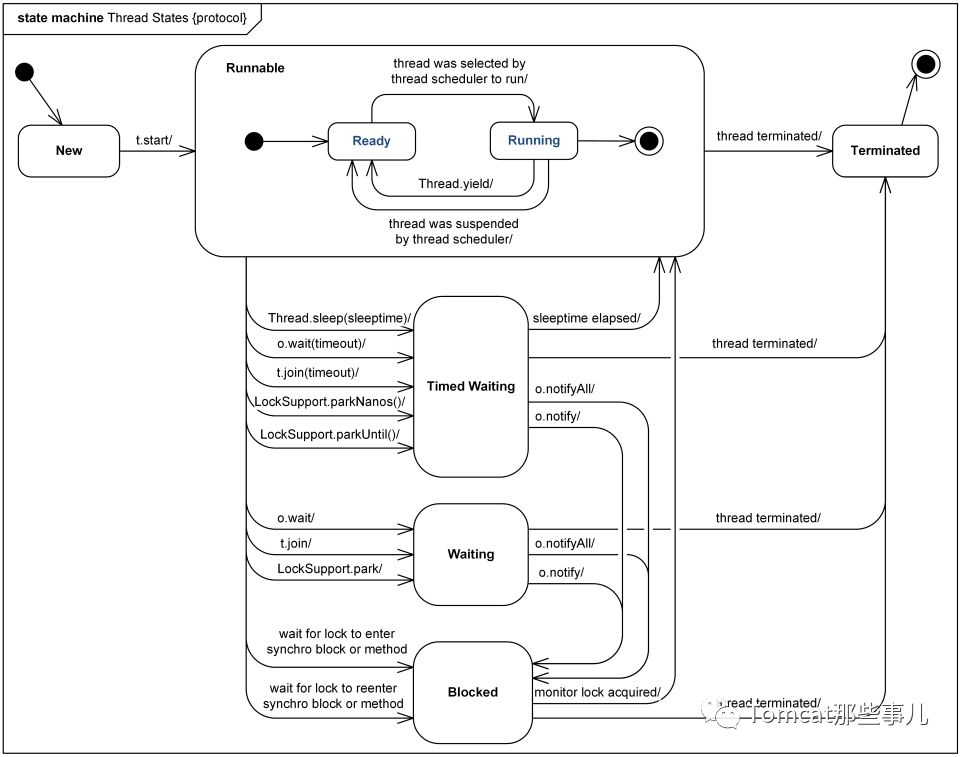

## 4、jmap命令

### 4.1、命令介绍

```bash
[emon@emon ~]$ jmap -h
Usage:
    jmap [option] <pid>
        (to connect to running process)
    jmap [option] <executable <core>
        (to connect to a core file)
    jmap [option] [server_id@]<remote server IP or hostname>
        (to connect to remote debug server)

where <option> is one of:
    <none>               to print same info as Solaris pmap
    -heap                to print java heap summary
    -histo[:live]        to print histogram of java object heap; if the "live"
                         suboption is specified, only count live objects
    -clstats             to print class loader statistics
    -finalizerinfo       to print information on objects awaiting finalization
    -dump:<dump-options> to dump java heap in hprof binary format
                         dump-options:
                           live         dump only live objects; if not specified,
                                        all objects in the heap are dumped.
                           format=b     binary format
                           file=<file>  dump heap to <file>
                         Example: jmap -dump:live,format=b,file=heap.bin <pid>
    -F                   force. Use with -dump:<dump-options> <pid> or -histo
                         to force a heap dump or histogram when <pid> does not
                         respond. The "live" suboption is not supported
                         in this mode.
    -h | -help           to print this help message
    -J<flag>             to pass <flag> directly to the runtime system
```

- `[option]`的说明
  - `-heap`显示Java堆详细信息
  - `-histo[:live]`显示堆中对象的统计信息
  - `-clstats`打印类加载器信息
  - `-finalizerinfo`显示在F-Queue队列等待Finalize线程执行finalizer方法的对象
  - `-dump:<dump-options>`生成堆转储快照
  - `-F`当使用-dump或者-histo参数没有响应时，使用该参数强制执行；对参数下的 live 子项不支持。
  - `-J<flag>` 指定传递给运行jmap的JVM的参数

### 4.2、查看进程的内存映像信息

```bash
[emon@emon ~]$ jmap 61572
Attaching to process ID 61572, please wait...
Debugger attached successfully.
Server compiler detected.
JVM version is 25.251-b08
0x000056388f640000	8K	/usr/local/Java/jdk1.8.0_251/bin/java
0x00007f2170f78000	50K	/usr/local/Java/jdk1.8.0_251/jre/lib/amd64/libmanagement.so
0x00007f2171382000	86K	/usr/lib64/libgcc_s-4.8.5-20150702.so.1
0x00007f2171598000	276K	/usr/local/Java/jdk1.8.0_251/jre/lib/amd64/libsunec.so
0x00007f21882b9000	110K	/usr/local/Java/jdk1.8.0_251/jre/lib/amd64/libnet.so
0x00007f21884d0000	91K	/usr/local/Java/jdk1.8.0_251/jre/lib/amd64/libnio.so
0x00007f21ac154000	124K	/usr/local/Java/jdk1.8.0_251/jre/lib/amd64/libzip.so
0x00007f21ac370000	60K	/usr/lib64/libnss_files-2.17.so
0x00007f21ac583000	226K	/usr/local/Java/jdk1.8.0_251/jre/lib/amd64/libjava.so
0x00007f21ac7b2000	64K	/usr/local/Java/jdk1.8.0_251/jre/lib/amd64/libverify.so
0x00007f21ac9c1000	42K	/usr/lib64/librt-2.17.so
0x00007f21acbc9000	1110K	/usr/lib64/libm-2.17.so
0x00007f21acecb000	16679K	/usr/local/Java/jdk1.8.0_251/jre/lib/amd64/server/libjvm.so
0x00007f21adebc000	2105K	/usr/lib64/libc-2.17.so
0x00007f21ae28a000	18K	/usr/lib64/libdl-2.17.so
0x00007f21ae48e000	106K	/usr/local/Java/jdk1.8.0_251/lib/amd64/jli/libjli.so
0x00007f21ae6a6000	138K	/usr/lib64/libpthread-2.17.so
0x00007f21ae8c2000	159K	/usr/lib64/ld-2.17.so
```

### 4.3、显示Java堆详细信息

```bash
[emon@emon ~]$ jmap -heap 61572
Attaching to process ID 61572, please wait...
Debugger attached successfully.
Server compiler detected.
JVM version is 25.251-b08

using parallel threads in the new generation.
using thread-local object allocation.
Concurrent Mark-Sweep GC

Heap Configuration:
   MinHeapFreeRatio         = 40
   MaxHeapFreeRatio         = 70
   MaxHeapSize              = 268435456 (256.0MB)
   NewSize                  = 89456640 (85.3125MB)
   MaxNewSize               = 89456640 (85.3125MB)
   OldSize                  = 178978816 (170.6875MB)
   NewRatio                 = 2
   SurvivorRatio            = 8
   MetaspaceSize            = 21807104 (20.796875MB)
   CompressedClassSpaceSize = 1073741824 (1024.0MB)
   MaxMetaspaceSize         = 17592186044415 MB
   G1HeapRegionSize         = 0 (0.0MB)

Heap Usage:
New Generation (Eden + 1 Survivor Space):
   capacity = 80543744 (76.8125MB)
   used     = 70528104 (67.2608413696289MB)
   free     = 10015640 (9.551658630371094MB)
   87.5649684226251% used
Eden Space:
   capacity = 71630848 (68.3125MB)
   used     = 70160536 (66.9103012084961MB)
   free     = 1470312 (1.4021987915039062MB)
   97.94737596852127% used
From Space:
   capacity = 8912896 (8.5MB)
   used     = 367568 (0.3505401611328125MB)
   free     = 8545328 (8.149459838867188MB)
   4.124001895680147% used
To Space:
   capacity = 8912896 (8.5MB)
   used     = 0 (0.0MB)
   free     = 8912896 (8.5MB)
   0.0% used
concurrent mark-sweep generation:
   capacity = 178978816 (170.6875MB)
   used     = 131186184 (125.10889434814453MB)
   free     = 47792632 (45.57860565185547MB)
   73.29704538888% used

37904 interned Strings occupying 4638792 bytes.
```

- 扩展知识：
  - -XX:NewRatio
    - 新生代(eden+2*survivor)和老年代（不包含永久区/元数据区）的比值
    - 2 表示`新生代`:`老年代`=1:2，即年轻代占堆的1/3
  - -XX:SurvivorRatio
    - 设置两个Survivor区和eden的比
    - 8表示`from`:`to`:`eden`=1:1:8，即一个Survivor占年轻代的1/10
  - JVM每次只会使用Eden和其中的一块Survivor区域来为对象服务，所以无论什么时候，总是有一块Survivor区域是空闲着的（1/3*1/10=1/30)。

### 4.4、显示堆中对象的统计信息

```bash
[emon@emon ~]$ jmap -histo:live 61572 > 61572.log
```

**拓展：**

```bash
# 统计实例最多的类，前10位；其中-n表示按照数字大小排序；-r表示相反排序；-k表示指定用来排序的列；-t指定列分隔符
jmap -histo 61572 | sort -n -r -k 2 | head -10
# 统计合计容量前10的类
jmap -histo 61572 | sort -n -r -k 3 | head -10
```

### 4.5、GC频繁时查看

```bash
$ jmap -finalizerinfo 61572
```

### 4.6、生成堆转存快照

```bash
$ jmap -dump:live,format=b,file=61572.hprof 61572
# 解析并查看转存快照的内容，解析成功后可查看： http://repo.emon.vip:7000/
$ jhat 61572.hprof
```

**说明：**以hprof二进制格式转储Java堆到指定的filename文件中。live子选项是可选的。如果指定了live子选项，堆中只有活动的对象会被转储。想要浏览heap dump，可以使用`jpofile`工具读取分析。

**强调：**该命令执行，JVM会将整个heap的信息dump写入到一个文件，heap如果比较大，会耗时久；并且执行的过程中为了保证dump的信息是可靠的，所以会暂停应用。**线上系统慎用**。

### 4.6、打印类加载器信息【比较耗费时间的一个命令】

```bash
[emon@emon ~]$ jmap -clstats 61572
Attaching to process ID 61572, please wait...
Debugger attached successfully.
Server compiler detected.
JVM version is 25.251-b08
finding class loader instances ..done.
computing per loader stat ..done.
please wait.. computing liveness.liveness analysis may be inaccurate ...
class_loader	classes	bytes	parent_loader	alive?	type

<bootstrap>	2457	4273909	  null  	live	<internal>
```

### 4.7、打印等待终结的对象信息

```bash
[emon@emon ~]$ jmap -finalizerinfo 61572
Attaching to process ID 61572, please wait...
Debugger attached successfully.
Server compiler detected.
JVM version is 25.251-b08
Number of objects pending for finalization: 0
```

**说明：**最后一行的`Number of objects pending for finalization: 0`说明当前F-QUEUE队列中并没有等待Finalize线程执行finalizer方法的对象。


## 5、jstat命令

概念：用于监控虚拟机各种运行状态信息的命令行工具，可以显示在虚拟机进程中的类装载、内存、垃圾收集、JIT编译等运行数据。

用于查询三类虚拟机信息：类装载、垃圾收集、运行期编译状况。

### 5.1、命令介绍

```bash
[emon@emon ~]$ jstat -h
-h requires an integer argument
Usage: jstat -help|-options
       jstat -<option> [-t] [-h<lines>] <vmid> [<interval> [<count>]]

Definitions:
  <option>      An option reported by the -options option
  <vmid>        Virtual Machine Identifier. A vmid takes the following form:
                     <lvmid>[@<hostname>[:<port>]]
                Where <lvmid> is the local vm identifier for the target
                Java virtual machine, typically a process id; <hostname> is
                the name of the host running the target Java virtual machine;
                and <port> is the port number for the rmiregistry on the
                target host. See the jvmstat documentation for a more complete
                description of the Virtual Machine Identifier.
  <lines>       Number of samples between header lines.
  <interval>    Sampling interval. The following forms are allowed:
                    <n>["ms"|"s"]
                Where <n> is an integer and the suffix specifies the units as 
                milliseconds("ms") or seconds("s"). The default units are "ms".
  <count>       Number of samples to take before terminating.
  -J<flag>      Pass <flag> directly to the runtime system.
```

- `option`参数选项

```bash
[emon@emon ~]$ jstat -options
-class					显示ClassLoad的相关信息；
-compiler				显示JIT编译的相关信息；
-gc						显示和gc相关的堆信息；
-gccapacity				显示各个代的容量以及使用情况；
-gccause				显示垃圾回收的相关信息（通过-gcutil），同时显示最后一次或者当前正在发生的垃圾回收的诱因；
-gcmetacapacity			显示metaspace的大小
-gcnew					显示新生代信息；
-gcnewcapacity			显示新生代大小和使用情况；
-gcold					显示老年代和永久代信息；
-gcoldcapacity			显示老年代的大小和使用情况；
-gcutil					显示垃圾收集信息；
-printcompilation		输出JIT编译的方法信息；
```

- `其他参数`
  - `-t`可以在打印的列加上Timestamp列，用于显示系统运行的时间
  - `-h`可以在周期性输出数据的时候，在指定输出多少行以后输出一次表头
  - `vmid`Virtual Machine ID（进程的pid）
  - `interval`执行每次的时间间隔，默认单位为秒(s)，可以指定为毫秒(ms)
  - `count`用于指定输出多少次记录，缺省则会一直打印

### 5.2、显示加载class的数量，以及所占用空间等信息

```bash
[emon@emon ~]$ jstat -class 61572
Loaded  Bytes  Unloaded  Bytes     Time   
 19017 33150.0       89    98.6       6.20
```

- 说明：
  - `Loaded`已经装载的类的数量
  - `Bytes`已经装载的类的字节数（单位KB）
  - `Unloaded`已经卸载的类的数量
  - `Bytes`已经卸载的类的字节数（单位KB
  - `Time`装载和卸载类所花费的时间

### 5.3、显示VM实时编译（JIT）的数量等信息

```bash
[emon@emon ~]$ jstat -compiler 61572
Compiled Failed Invalid   Time   FailedType FailedMethod
   27068      0       0   151.97          0  
```

- 说明：
  - `Compiled`编译任务执行数量
  - `Failed`编译任务执行失败数量
  - `Invalid`编译任务执行失效数量
  - `Time`编译任务消耗时间
  - `FailedType`最后一个编译失败任务的类型
  - `FailedMethod`最后一个编译失败任务所在的类及方法

### 5.4、显示gc相关的堆信息，查看gc的次数和时间

```bash
[emon@emon ~]$ jstat -gc 61572
 S0C    S1C    S0U    S1U      EC       EU        OC         OU       MC     MU    CCSC   CCSU   YGC     YGCT    FGC    FGCT     GCT   
8704.0 8704.0  0.0   442.5  69952.0  55167.5   174784.0   112815.7  104408.0 94483.6 15100.0 12222.2   8427   51.535 57645 1527.104 1578.638
```

- 说明：
  - `S0C`年轻代中第一个survivor（幸存区）的容量（KB）
  - `S1C`年轻代中第二个survivor（幸存区）的容量（KB）
  - `S0U`年轻代中第一个survivor（幸存区）目前已使用空间（KB）
  - `S1U`年轻代中第二个survivor（幸存区）目前已使用空间（KB）
  - `EC`年轻代中Eden（伊甸园）的容量（KB）
  - `EU`年轻代中Eden（伊甸园）目前已使用空间（KB）
  - `OC`Old代的容量（KB）
  - `OU`Old代目前已使用空间（KB）
  - `MC`metaspace（元空间）的容量（KB）
  - `MU`metaspace（元空间）目前已使用空间（KB）
  - `CCSC`压缩类空间大小
  - `CCSU`压缩类空间使用大小
  - `YGC`新生代中gc次数
  - `YGCT`新生代中gc所用时间（秒）
  - `FGC`堆全GC次数
  - `FGCT`从应用程序启动到采样时old代全gc所用时间（秒：s）
  - `FGCT`堆全GC用的总时间（秒）
  - `GCT`垃圾回收总消耗时间（秒）

### 5.5、显示VM内存中三代（young、old、perm）对象的使用和占用大小

```bash
[emon@emon ~]$ jstat -gccapacity 61572
 NGCMN    NGCMX     NGC     S0C   S1C       EC      OGCMN      OGCMX       OGC         OC       MCMN     MCMX      MC     CCSMN    CCSMX     CCSC    YGC    FGC 
 87360.0  87360.0  87360.0 8704.0 8704.0  69952.0   174784.0   174784.0   174784.0   174784.0      0.0 1138688.0 104408.0      0.0 1048576.0  15100.0   8431 57645
```

- 说明：

  - `NGCMN`新生代最小容量（KB）
  - `NGCMX`新生代最大容量（KB）
  - `NGC`当前新生代容量（KB）
  - `S0C`第一个幸存区大小（KB）
  - `S1C`第二个幸存区大小（KB）
  - `EC`伊甸园区的容量大小（KB）

  - `OGCMN`老年代最小容量（KB）
  - `OGCMX`老年代最大容量（KB）
  - `OGC`当前老年代大小（KB）
  - `OC`当前老年代大小（KB）
  - `MCMN`最小元数据容量（KB）

  - `MCMX`最大元数据容量（KB）
  - `MC`当前元数据空间大小（KB）
  - `CCSMN`最小压缩类空间大小
  - `CCSMX`最大压缩类空间大小
  - `CCSC`当前压缩类空间大小
  - `YGC`新生代GC次数
  - `FGC`堆全GC次数

### 5.6、metaspace中对象的信息及其占用量

```bash
[emon@emon ~]$ jstat -gcmetacapacity 61572
   MCMN       MCMX        MC       CCSMN      CCSMX       CCSC     YGC   FGC    FGCT     GCT   
       0.0  1138688.0   104408.0        0.0  1048576.0    15100.0  8437 57645 1527.104 1578.671
```

- 说明：

  - `MCMN`最小元数据容量
  - `MCMX`最大元数据容量
  - `MC`当前元数据空间大小

  - `CCSMN`最小压缩类空间大小
  - `CCSMX`最大压缩类空间大小
  - `CCSC`当前压缩类空间大小
  - `YGC`新生代GC次数
  - `FGC`堆全GC次数
  - `FGCT`堆全GC时间（秒）
  - `GCT`垃圾回收消耗总时间（秒）

### 5.7、年轻代对象的信息

```bash
[emon@emon ~]$ jstat -gcnew 61572
 S0C    S1C    S0U    S1U   TT MTT  DSS      EC       EU     YGC     YGCT  
8704.0 8704.0  240.8    0.0  6   6 4352.0  69952.0  24754.6   8438   51.570
```

- 说明：

  - `S0C`第一个幸存区大小（KB）
  - `S1C`第二个幸存区大小（KB）
  - `S0U`第一个幸存区的使用大小（KB）
  - `S1U`第二个幸存区的使用大小（KB）
  - `TT`对象在新生代存货的次数
  - `MIT`对象在新生代存活的最大次数
  - `DSS`期望的幸存区大小

  - `EC`新生代中Eden（伊甸园）的容量（KB）
  - `EU`新生代中Eden（伊甸园）目前已使用空间（KB）

  - `YGC`新生代gc次数
  - `YGCT`新生代GC消耗的时间（秒）

### 5.8、年轻代对象的信息及其占用量

```bash
[emon@emon ~]$ jstat -gcnewcapacity 61572
  NGCMN      NGCMX       NGC      S0CMX     S0C     S1CMX     S1C       ECMX        EC      YGC   FGC 
   87360.0    87360.0    87360.0   8704.0   8704.0   8704.0   8704.0    69952.0    69952.0  8439 57645
```

- 说明：

  - `NGCMN`新生代最小容量（KB）
  - `NGCMX`新生代最大容量（KB）

  - `NGC`当前新生代容量（KB）
  - `S0CMX`第一个幸存区最大大小（KB）
  - `S0C`第一个幸存区容量（KB）
  - `S1CMX`第二个幸存区最大大小（KB）
  - `S1C`第二个幸存区容量（KB）

  - `ECMX`新生代中Eden（伊甸园）的最大容量 (KB)

  - `EC`新生代中Eden（伊甸园）的容量 (KB)

  - `YGC`新生代垃圾回收次数

  - `FGC`堆垃圾回收全GC次数

### 5.9、old代对象的信息

```bash
[emon@emon ~]$ jstat -gcold 61572
   MC       MU      CCSC     CCSU       OC          OU       YGC    FGC    FGCT     GCT   
104408.0  94483.6  15100.0  12222.2    174784.0    112822.2   8440 57645 1527.104 1578.678
```

- 说明：

  - `MC`metaspace(元空间)的容量 (KB)

  - `MU`metaspace(元空间)目前已使用空间 (KB)

  - `CCSC`压缩类空间大小

  - `CCSU`压缩类空间使用大小

  - `OC`Old代的容量 (KB)

  - `OU`Old代目前已使用空间 (KB)

  - `YGC`新生代中gc次数

  - `FGC`堆全gc次数（秒）

  - `FGCT`堆全GC花费总时间（秒）

  - `GCT`系统gc用的总时间(秒)

### 5.10、old代对象的信息及其占用量

```bash
[emon@emon ~]$ jstat -gcoldcapacity 61572
   OGCMN       OGCMX        OGC         OC       YGC   FGC    FGCT     GCT   
   174784.0    174784.0    174784.0    174784.0  8448 57645 1527.104 1578.703
```

- 说明：

  - `OGCMN`Old代中初始化(最小)的大小 (KB)

  - `OGCMX`Old代的最大容量(KB)

  - `OGC`Old代当前新生成的容量 (KB)
  - `OC`Old代的容量 (KB)

  - `YGC`新生代中gc次数

  - `FGC`堆全gc次数（秒）

  - `FGCT`堆全GC花费总时间（秒）

  - `GCT`系统gc用的总时间(秒)

### 5.11 统计gc信息

```bash
[emon@emon ~]$ jstat -gcutil 61572
  S0     S1     E      O      M     CCS    YGC     YGCT    FGC    FGCT     GCT   
  0.00   3.35  71.82  64.55  90.49  80.94   8441   51.578 57645 1527.104 1578.681
```

- 说明：

  - `S0`年轻代中第一个survivor（幸存区）已使用的占当前容量百分比
  - `S1`年轻代中第二个survivor（幸存区）已使用的占当前容量百分比
  - `E`年轻代中Eden（伊甸园）已使用的占当前容量百分比
  - `O`old代已使用的占当前容量百分比
  - `M`perm代已使用的占当前容量百分比
  - `CCS`压缩类空间大小百分比
  - `YGC`新生代中gc次数
  - `YGCT`新生代中gc所用时间（秒）
  - `FGC`堆全gc次数（秒）
  - `FGCT`堆全GC花费总时间（秒）
  - `GCT`系统gc用的总时间(秒)
  
  

### 5.12、显示垃圾回收的相关信息(-gcutil)

同时显示最后一次或当前正在发生的垃圾回收的诱因。

```bash
[emon@emon ~]$ jstat -gccause 61572
  S0     S1     E      O      M     CCS    YGC     YGCT    FGC    FGCT     GCT    LGCC                 GCC                 
  4.45   0.00  65.30  64.55  90.49  80.94   8442   51.583 57645 1527.104 1578.687 Allocation Failure   No GC
```

- 说明：
  - `LGCC`最后一次GC原因
  - `GCC`当前GC原因（No GC为当前没有执行GC)

### 5.13、当前VM执行的信息

```bash
[emon@emon ~]$ jstat -printcompilation 61572
Compiled  Size  Type Method
   27069    298    1 java/util/concurrent/ThreadPoolExecutor processWorkerExit
```

- 说明：
  - `Compiled`编译任务的数目
  - `Site`方法生成的字节码的大小
  - `Type`编译类型
  - `Method`类名和方法名用来标识编译的方法。类名使用/作为一个命名空间分隔符。方法名是给定类中的方法。上述格式是由`-XX:+PrintComplation`选项进行设置的。


## 6、Alibaba开源的Java诊断工具——Arthas

Arthas（阿尔萨斯）是Alibaba开源的Java诊断工具。

### 6.1、快速安装

- 使用`arthas-boot`（推荐）

```bash
[emon@emon ~]$ curl -O https://arthas.aliyun.com/arthas-boot.jar
# 打印帮助信息
[emon@emon ~]$ java -jar arthas-boot.jar -h
# 启动
[emon@emon ~]$ java -jar arthas-boot.jar 
[INFO] arthas-boot version: 3.3.9
[INFO] Found existing java process, please choose one and input the serial number of the process, eg : 1. Then hit ENTER.
* [1]: 10913 com.install4j.runtime.launcher.UnixLauncher
  [2]: 111842 service-config-provider.jar
  [3]: 61572 org.elasticsearch.bootstrap.Elasticsearch
  [4]: 111228 service-eureka-provider.jar
2
[INFO] arthas home: /home/emon/.arthas/lib/3.3.9/arthas
[INFO] Try to attach process 111842
[INFO] Attach process 111842 success.
[INFO] arthas-client connect 127.0.0.1 3658
  ,---.  ,------. ,--------.,--.  ,--.  ,---.   ,---.                           
 /  O  \ |  .--. ''--.  .--'|  '--'  | /  O  \ '   .-'                          
|  .-.  ||  '--'.'   |  |   |  .--.  ||  .-.  |`.  `-.                          
|  | |  ||  |\  \    |  |   |  |  |  ||  | |  |.-'    |                         
`--' `--'`--' '--'   `--'   `--'  `--'`--' `--'`-----'                          
                                                                                

wiki      https://arthas.aliyun.com/doc                                         
tutorials https://arthas.aliyun.com/doc/arthas-tutorials.html                   
version   3.3.9                                                                 
pid       111842                                                                
time      2020-09-01 16:45:08                                                   

[arthas@111842]$ 
```

- 使用`as.sh`

Arthas支持在Linux/Unix?Mac等平台上一键安装，请复制一下内容，并粘贴到命令行中，敲`回车`执行即可。

```bash
[emon@emon ~]$ curl -L https://arthas.aliyun.com/install.sh | sh
```

上述命令会下载启动脚本文件`as.sh`到当前目录，你可以放在任何地方或将其加入到`$PATH`中。

可以使用`./as.sh`启动，也可以`./as.sh -h`查看更多参数信息。但也可能报错：

```bash
[emon@emon ~]$ ./as.sh 
Error: telnet is not installed. Try to use java -jar arthas-boot.jar
```

- 卸载

在Linux/Unix/Mac平台：

```bash
[emon@emon ~]$ rm -rf ~/.arthas/ ~/logs/arthas*
```

### 6.2、arthas使用

在arthas命令行模式下，可以执行如下操作：

- 基础命令

  - `help` 查看命令帮助信息
  - `echo` 打印参数，和linux里的echo命令类型

  - `grep` 匹配查找，和linux里的grep命令类型

  - `cls` 清空当前屏幕区域
  - `session` 查看当前会话的信息
  - `version` 输出当前目标Java进程所加载的Arthas版本号
  - `history` 打印命令历史
  - `quit` 退出当前Arthas客户端，其他Arthas客户端不受影响
  - `stop` 关闭Arthas服务端，所有Arthas客户端全部退出
  - `keymap` Arthas快捷键列表及自定义快捷键

- jvm相关

  - `dashboard` 展示当前进程的信息，`ctrl+c`或者输入`q`可退出。
  - `thread` 查看当前JVM的线程堆栈信息
  - `jvm` 查看当前JVM的信息
  - `sysprop` 查看和修改JVM的系统属性
  - `sysenv` 查看JVM的环境变量
  - `vmoption` 查看和修改JVM里诊断相关的option
  - `perfcounter` 查看当前JVM的Perf Counter信息


### 6.3、几个常用命令解析

- dashboard

参数说明：

| 参数名称 | 参数说明                                 |
| -------- | ---------------------------------------- |
| [i:]     | 刷新实时数据的时间间隔（ms），默认5000ms |
| [n:]     | 刷新实时数据的次数                       |

示例1：

```bash
[arthas@10913]$ dashboard -i 2000 -n 5
```

- thread

参数说明：

| 参数名称    | 参数说明                              |
| ----------- | ------------------------------------- |
| id          | 线程id                                |
| [n:]        | 指定最忙的前N个线程并打印堆栈         |
| [b]         | 找出当前阻塞其他线程的线程            |
| [i <value>] | 指定cpu占比统计的采样间隔，单位为毫秒 |

示例1：查询当前最忙的N个线程把那个打印堆栈

```bash
thread -n 3
```

示例2：查询所有线程的信息

```bash
thread
```

示例3：显示指定线程的运行堆栈

```bash
thread 1
```

示例4：找出当前阻塞其他线程的线程

```bash
thread -b
```

示例5：指定采样时间间隔

```bash
thread -n 3 -i 1000
```

示例6：查看指定状态的现场

```bash
thread --state WAITING
```


## 7、Linux命令之top命令

### 7.1、top命令简介

top命令是动态查看进程变化，监控linux的系统状况；它是常用的性能分析工具，能够实时显示系统资源各个进程占用状况，类似window的任务管理器。

- 语法

```bash
[root@emon ~]# top -h
  procps-ng version 3.3.10
Usage:
  top -hv | -bcHiOSs -d secs -n max -u|U user -p pid(s) -o field -w [cols]
```

- `-h |-v` 显示帮助或者版本信息
- `-c` 命令行显示程序名以及参数
- `-d` 启动时设置刷新时间间隔
- `-H` 设置线程模式
- `-i` 只显示活跃进程
- `-n` 显示指定数量的进程
- `-p` 显示指定PID的进程
- `-u` 显示指定用户的进程

### 7.2、视图参数含义

```bash
top - 17:09:27 up 9 days,  8:04,  1 user,  load average: 0.00, 0.02, 0.05
Tasks: 171 total,   2 running, 169 sleeping,   0 stopped,   0 zombie
%Cpu(s):  0.0 us,  0.1 sy,  0.0 ni, 99.9 id,  0.0 wa,  0.0 hi,  0.0 si,  0.0 st
KiB Mem :  4893456 total,  1122660 free,  1790328 used,  1980468 buff/cache
KiB Swap:        0 total,        0 free,        0 used.  2801780 avail Mem 

   PID USER      PR  NI    VIRT    RES    SHR S  %CPU %MEM     TIME+ COMMAND                                                                   
  1320 root      20   0  963272  25928   1692 S   0.7  0.5 170:39.59 docker-containe                                                           
     9 root      20   0       0      0      0 R   0.3  0.0  26:49.56 rcu_sched 
```

从上面的结果可以看出，top视图可以分为两部分：操作系统资源概况信息和进程信息。

我们先利用top命令进入视图，再`f`键看下全称信息，再`q`推出回到top视图。

```bash
Fields Management for window 1:Def, whose current sort field is %CPU
   Navigate with Up/Dn, Right selects for move then <Enter> or Left commits,
   'd' or <Space> toggles display, 's' sets sort.  Use 'q' or <Esc> to end!

* PID     = Process Id             nDRT    = Dirty Pages Count   
* USER    = Effective User Name    WCHAN   = Sleeping in Function
* PR      = Priority               Flags   = Task Flags <sched.h>
* NI      = Nice Value             CGROUPS = Control Groups      
* VIRT    = Virtual Image (KiB)    SUPGIDS = Supp Groups IDs     
* RES     = Resident Size (KiB)    SUPGRPS = Supp Groups Names   
* SHR     = Shared Memory (KiB)    TGID    = Thread Group Id     
* S       = Process Status         ENVIRON = Environment vars    
* %CPU    = CPU Usage              vMj     = Major Faults delta  
* %MEM    = Memory Usage (RES)     vMn     = Minor Faults delta  
* TIME+   = CPU Time, hundredths   USED    = Res+Swap Size (KiB) 
* COMMAND = Command Name/Line      nsIPC   = IPC namespace Inode 
  PPID    = Parent Process pid     nsMNT   = MNT namespace Inode 
  UID     = Effective User Id      nsNET   = NET namespace Inode 
  RUID    = Real User Id           nsPID   = PID namespace Inode 
  RUSER   = Real User Name         nsUSER  = USER namespace Inode
  SUID    = Saved User Id          nsUTS   = UTS namespace Inode 
  SUSER   = Saved User Name     
  GID     = Group Id            
  GROUP   = Group Name          
  PGRP    = Process Group Id    
  TTY     = Controlling Tty     
  TPGID   = Tty Process Grp Id  
  SID     = Session Id          
  nTH     = Number of Threads   
  P       = Last Used Cpu (SMP) 
  TIME    = CPU Time            
  SWAP    = Swapped Size (KiB)  
  CODE    = Code Size (KiB)     
  DATA    = Data+Stack (KiB)    
  nMaj    = Major Page Faults   
  nMin    = Minor Page Faults 
```

#### 7.2.1、资源概况

1：操作系统时间、登录用户、负载情况 - top

```bash
top - 17:09:27 up 9 days,  8:04,  1 user,  load average: 0.00, 0.02, 0.05
```

- `17:09:27` 当前系统时间。
- `up 9 days,  8:04,` 操作系统从开机后运行的时间，运行天时分。

- `1 user,` 当前系统有1个用户登录在线。
- `load average: 0.00, 0.02, 0.05` 系统的1、5、15分钟的平均负载。

2：运行任务概况 - tasks

```bash
Tasks: 171 total,   2 running, 169 sleeping,   0 stopped,   0 zombie
```

- `171 total` 系统当前中的进程数。
- `2 running` 系统当前运行的进程数。
- `169 sleeping` 睡眠中的进程数。

3：CPU概述：%Cpu(s)表示CPU使用百分比，按照时间占用计算，单位s

```bash
%Cpu(s):  0.0 us,  0.1 sy,  0.0 ni, 99.9 id,  0.0 wa,  0.0 hi,  0.0 si,  0.0 st
```

- `us` 用户空间占用cpu时间百分比，如果是多核，这个数值表示占用的平均百分比，可以按1进行多个统计和平均统计切换。
- `sy` 内核空间占用cpu时间百分比，后续同上。
- `ni` 用户空间改变过优先级的进程占用cpu时间百分比。
- `id` 空闲时间占用cpu的百分比。
- `wa` 等待输入输出占用cpu时间百分比。
- `hi` 硬中断占用cpu时间百分比。
- `si` 软中断占用cpu时间百分比。

时间占用百分比=该种类型操作消耗cpu时间/top刷新间隔时间。top每3s刷新一次，用户空间进程在这3秒内使用了cpu时间1.5s，那么us为50%=1.5s/3s。

4：内存概览（KB）

```bash
KiB Mem :  4893456 total,  1122660 free,  1790328 used,  1980468 buff/cache
```

- `total` 内存总量。
- `free` 内存剩余总量。
- `used` 内存使用数量。
- `buff/cached` 用于缓冲的内存数量。

5：缓冲区概况（KB）

```bash
KiB Swap:        0 total,        0 free,        0 used.  2801780 avail Mem 
```

- `total` 交换区总量。
- `free` 空闲交换区数量。
- `used` 使用交换区数量。

#### 7.2.2、进程概况

进程概况的统计是从多个维度进行展示的，其中几个比较重要的参数如下：

- `PID` 进程ID，唯一标识。
- `USER` 进程所属用户。
- `%CPU` 自上次top刷新该进程的cpu占用时间百分比。
- `%MEM` 进程消耗内存百分比。
- `TIME+` 自进程开始以来，消耗cpu时间，单位1/100s。

#### 7.2.3、top视图中交互命令

- 全局
  - `Enter/Space` 刷新视图
  - `O` 是否展示进程区域中的0值，比如%CPU是0的将全部隐藏。
  - `A` 在全屏模式和多窗口选择模式中切换。
  - `d` 设置刷新时间间隔。
  - `E` 切换内存和交换区单位。
  - `H` 开启/关闭线程模式，以线程的方式展示。
  - `k` 杀掉指定进程或者线程。
  - `Z` 改变颜色配置。
  - `q` 退出
- 概要区域
  - `1` 显示CPU平均状态/分开显示各个逻辑CPU状态。
  - `m` 切换显示内存统计的数据。
- 进程区域
  - `x` 切换高亮行的排序位置。
  - `z` 切换颜色。
  - `b` 块状标记高亮行。
  - `c` 切换显示命令/程序名和参数。
  - `f` 显示field管理。
  - `u` 按照执行用户显示进程。
  - `i` 显示所有进程或活跃的进程。
  - `n` 设置显示的进程数。

#### 7.2.4、top常用场景

```bash
# 显示某个进程所有活跃的线程消耗情况。
$ top -H -p pid
```


## 8、jvisualvm

如何为Java VisualVM安装插件？

插件地址：https://visualvm.github.io/pluginscenters.html 拷贝对应JDK版本的插件地址。

比如：

- 查看Java版本

```bash
$ java -version
java version "1.8.0_91"
Java(TM) SE Runtime Environment (build 1.8.0_91-b15)
Java HotSpot(TM) 64-Bit Server VM (build 25.91-b15, mixed mode)
```

- 找到对应版本的插件地址

得到JDK 8 Update 40 - 121（包含了版本1.8.0_91）的地址，点击后打卡页面 https://visualvm.github.io/archive/uc/8u40/updates.html 上寻找到：

Catalog URL:	https://visualvm.github.io/archive/uc/8u40/updates.xml.gz

打开 `jvisualvm` -> 【工具】 -> 【插件】 -> 【设置】 -> 【编辑】 -> 粘贴拷贝的地址，结果如下：

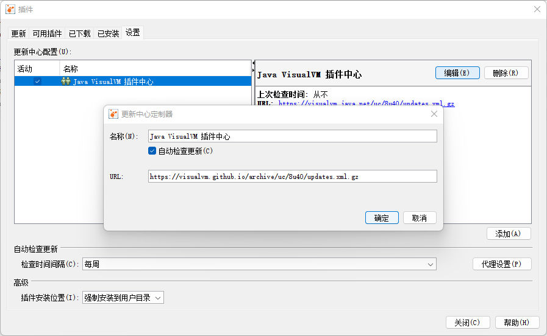

配置之后，点击【可用插件】面板，选择Visual GC 和 BTrace Workbench插件。

其他插件类似。


BTrace Workbench还需要安装如下：

https://github.com/btraceio/btrace

Windows下载：

JDK11：[btrace-v2.2.2-bin.zip](https://github.com/btraceio/btrace/releases/download/v2.2.2/btrace-v2.2.2-bin.zip)

JDK8：[btrace-bin-1.3.11.3.zip](https://github.com/btraceio/btrace/releases/download/v1.3.11.3/btrace-bin-1.3.11.3.zip)

解压并配置环境变量：

BTRACE_HOME=C:\Job\JobSoftware\btrace-v2.2.2-bin

BTRACE_HOME=C:\Job\JobSoftware\btrace-bin-1.3.11.3

Path 追加 %BTRACE_HOME%\bin


# 三、@SuppressWarnings注解用法详解

今天来谈谈@SuppressWarnings注解的作用。

J2SE提供的最后一个批注是@SuppressWarnings。该批注的作用是给编译器一条指令，告诉它对被批注的代码元素内部的某些警告保持静默。

@SuppressWarnings批注允许你选择性地取消特定代码段（即，类或方法）中的警告。其中的想法是当你看到警告时，你将调查它，如果你确定它不是问题，你就可以添加一个@SuppressWarnings批注，以使你不会再看到警告。虽然它听起来似乎会屏蔽潜在的错误，但实际上它将提高代码安全性，因为它将**防止你对警告无动于衷——你看到的每一个警告都将值得注意**。

我经常遇到的问题是不晓得什么时候用@SuppressWarnings的什么批注比较好，为了避免简单的`@SuppressWarnings("all")`这种用法，所以做了如下整理使用：

- @SuppressWarnings("")
- @SuppressWarnings({})
- @SuppressWarnings(value={})

## 3.1、抑制单类型警告

```java
@Test
@SuppressWarnings("unused")
public void testRmdir(){
    try {
        boolean ok = ftpHelper.ftpClient.removeDirectory("src1");
        String s = "";
    } catch(IOException e){
        e.printStackTrace();
    }
}
```

## 3.2、抑制多类型警告

抑制多类型的警告

```java
@SuppressWarnings(value={"unchecked", "rawtypes"})
public void addItems(String item) {
    List items = new ArrayList();
    items.add(item);
}
```

## 3.3、抑制所有类型警告

```java
@SuppressWarnings("all")
public void addItems(String item) {
    List items = new ArrayList();
    items.add(item);
}
```

## 3.4、@SuppressWarnings可用于何处？

通过@SuppressWarnings的源码可知，其注解目标为类、字段、函数、函数入参、构造函数和函数的局部变量。

```java
@Target({TYPE, FIELD, METHOD, PARAMETER, CONSTRUCTOR, LOCAL_VARIABLE})
@Retention(RetentionPolicy.SOURCE)
public @interface SuppressWarnings {
    String[] value();
}
```

这里建议大家，**注解应声明在最接近警告发生的位置**。

## 3.5、@SuppressWarnings的value值有哪些？

| 关键字                   | 用途                                                         |
| ------------------------ | ------------------------------------------------------------ |
| all                      | to supress all warnings（抑制所有警告）                      |
| boxing                   | to suppress warnings relative to boxing/unboxing operations（抑制装箱、拆箱操作时候的警告） |
| cast                     | to suppress warnings relative to cast operations（抑制映射相关的警告） |
| dep-ann                  | to suppress warnings relative to deprecated annotation（抑制启用注释的警告 |
| deprecation              | to suppress warnings relative to deprecation（抑制过期方法警告） |
| fallthrough              | to suppress warnings relative to missing breaks in switch statements（抑制switch缺失break警告） |
| finally                  | to suppress warnings relative to finally block that don't return（抑制finally模块没有返回的警告） |
| hiding                   | to suppress warnings relative to locals that hide variable（抑制与隐藏变量的局部变量相关的警告） |
| incomplete-switch        | to suppress warnings relative to missing entries in a switch statement(enum case)（忽略没有完整的switch语句） |
| nls                      | to suppress warnings relative to non-nls string literals（忽略非nls格式的字符） |
| null                     | to suppress warnings relative to null analysis（忽略对null的操作） |
| rawtypes                 | to suppress warnings relative to un-specific types when using generics on class params（使用generics时忽略没有指定相应的类型） |
| restriction              | to suppress warnings relative to usage of discouraged or forbidden references（抑制与不鼓励或禁止引用的使用相关的警告） |
| serial                   | to suppress warnings relative to missing serialVersionUID field for a serializable class（忽略在serializable类中没有声明serialVersionUID变量） |
| static-access            | to suppress warnings relative to incorrect static access（抑制不正确的静态访问方式警告） |
| synthetic-access         | to suppress warnings relative to unoptimized access from inner classes（抑制子类没有按最优方法访问内部类的警告） |
| unchecked                | to suppress warnings relative to unchecked operations（抑制没有进行类型检查操作的警告） |
| unqualified-field-access | to suppress warnings relative to field access unqualified（抑制没有权限访问的域的警告） |
| unused                   | to suppress warnings relative to unused code（抑制没被使用过的代码的警告） |
| resource                 | 对于J2EE，可以使用@Resource来完成依赖注入或者叫资源注入，但是当你在一个类中使用已经使用注解的类，却没有为其注入依赖时，该关键字会抑制其没有注入依赖的警告。 |


# 四、安全

- 通讯安全，加解密、加验签
- 密码管理->配置文件中的明文密码
- 密码管理->硬编码加密秘钥
- XSS攻击

# 五、压力测试

## 1、性能指标

- 响应时间（Response Time：RT）
  - 响应事件是指用户从客户端发起一个请求开始，到客户端接收到从服务器端返回的响应结束，整个过程所耗费的时间。
- HPS（Hits Per Second）：每秒点击次数，单位是次/秒。
- TPS（Transaction Per Second）：系统每秒处理交易数，单位是笔/秒。
- QPS（Query Per Second）：系统每秒处理查询次数，单位是次/秒。
  - 对于互联网业务中，如果某些业务有且仅有一个请求连接，那么TPS=QPS=HPS，一般情况下用TPS来衡量整个业务流程，用QPS来衡量接口查询次数，用HPS来表示对服务器单击请求。
- 无论TPS、QPS、HPS，此指标是衡量系统处理能力非常重要的指标，越大越好，根据经验，一般情况下：
  - 金融行业：1000TPS~50000TPS，不包括互联网化的活动。
  - 保险行业：100TPS~100000TPS，不包括互联网化的活动。
  - 制造行业：10TPS~5000TPS。
  - 互联网电子商务：10000TPS~1000000TPS。
  - 互联网中型网站：1000TPS~50000TPS。
  - 互联网小型网站：500TPS~10000TPS。
- 最大响应时间（Max Response Time）指用户发出请求或者指令到系统做出反应（响应）的最大时间。
- 最少响应时间（Mininum Response Time）指用户发出请求或者指令到系统做出反应（响应）的最少时间。
- 90%响应时间（90% Response Time）是指所有用户的响应时间进行排序，第90%的响应时间。
- 从外部看，性能测试主要关注如下三个指标：
  - 吞吐量：没秒钟系统能够处理的请求数、任务数。
  - 响应时间：服务处理一个请求或者一个任务的耗时。
  - 错误了：一批请求中结果出错的请求所占比例。

## 2、JMeter

### 2.1、安装JMeter

官网：https://jmeter.apache.org/

下载页面：https://jmeter.apache.org/download_jmeter.cgi

老版本下载页面：https://archive.apache.org/dist/jmeter/binaries/

比如，下载：apache-jmeter-5.6.3.zip

然后，解压安装即可！！！解压，即安装！

- 启动

双击：安装目录/bin/jmeter.bat 

- 配置中文

  - 临时

    Options=>Choose Language=>Chinese(Simplified)

  - 永久

  打开安装目录/bin/jmeter.properties，找到`#language=en`，并添加如下内容：

  ```properties
  #language=en
  language=zh_CN
  ```

  

### 2.2、JMeter压测示例

1、创建测试计划

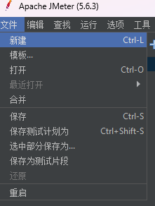

2、添加线程组

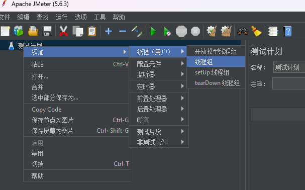

3、添加取样器HTTP请求

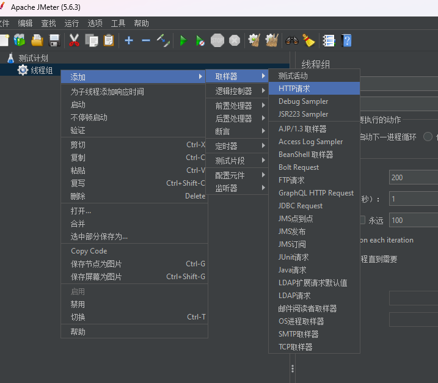

4、添加监听器查看结果树

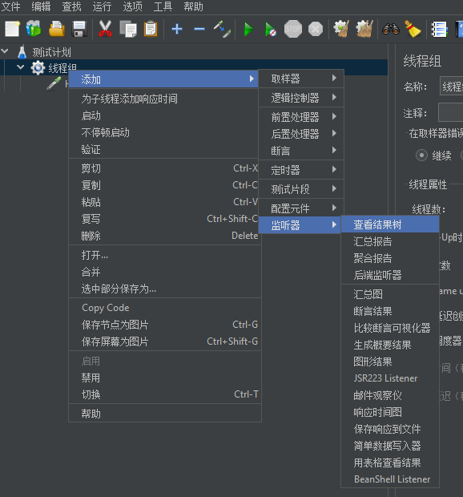

5、添加监听器汇总报告

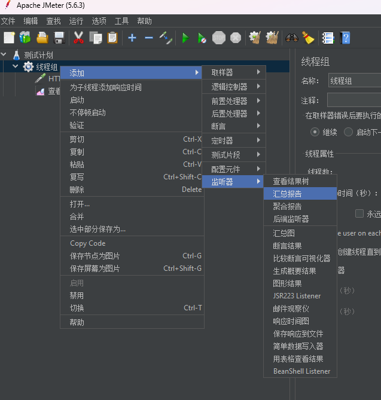

6、添加监听器聚合报告

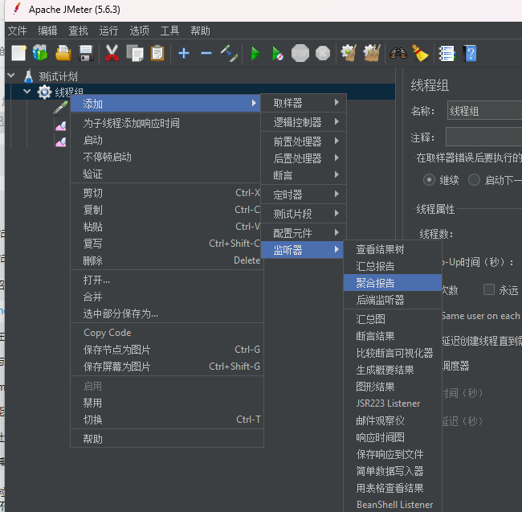

7、添加监听器汇总图（额外）

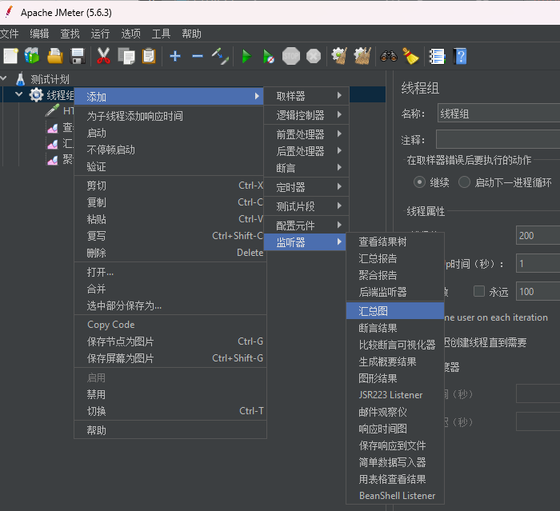


## 9、一个Window下我并未出现的问题

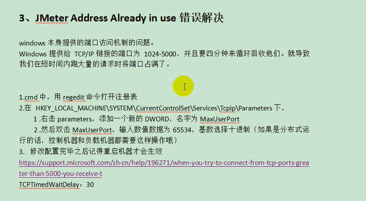

# 六、分布式事务

## 1、CAP定理与BASE理论

### 1.1、CAP定理

CAP原则又称为CAP定理，指的是在一个分布式系统重

- 一致性（Consistency）：
  - 在分布式系统重的所有数据备份，在同一时刻是否同样的值。（等同于所有节点访问同一份最新的数据副本）
- 可用性（Availability）：
  - 在集群中一部分节点故障后，集群整体是否还能响应客户端的读写请求。（对数据更新具备高可用性）
- 分区容错性（Partition tolerance）
  - 大多数分布式系统都分布在多个子网络。每个子网络就叫做一个区（partition）。分区容错的意思是，区间通信可能失败。比如，一台服务器放在中国，另一台服务器放在美国，这就是两个区，它们之间可能无法通信。

CAP原则指的是，这三个要素最多只能同时实现两点，<span style="color:red;font-weight:bold;">不可能三者兼顾</span>

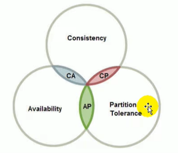

```
分布式系统：在互相隔离的空间中，提供数据服务的系统。
CAP抽象：不同空间的数据，在同一时间，状态一致。

C：一致性，代表状态一致
A：可用性，代表同一时间
P：分区容错性，代表不同空间
CP:不同空间中的数据，如果要求他们所有状态一致，则必然不在同一时间。【可落地】
AP:不同空间中，如果要求同一时间都可以从任意的空间拿到数据，则必然数据的状态不一致。【可落地】
CA:不同空间的数据，如果要求任意时间都可以从任意空间拿到状态一致的数据，则空间数必然为1.【保证P>1时，不可落地】
```

分布式系统中实现一致性的raft算法：

http://thesecretlivesofdata.com/raft/

https://raft.github.io/

[Paxos和Raft](https://blog.csdn.net/Shockang/article/details/129231484)

### 1.2、面临的问题

对于多数大型互联网应用的场景，主机众多、部署分散，而且现在的集群规模越来越大，所以节点故障、网络故障是常态，而且要保证服务可用性达到99.99999%（N个9），即保证P和A，舍弃C。

### 1.3、BASE理论

是对CAP理论的延伸，思想是即使无法做到强一致性（CAP的一致性就是强一致性），但可以采用适当的采取弱一致性，即<span style="color:red;font-weight:bold;">最终一致性</span>。

BASE是指：

- 基本可用（Basically Available）
  - 基本可用是指分布式系统在出现故障的时候，允许损失部分可用性（例如响应时间、功能上的可用性），允许损失部分可用性。需要注意的是，基本可用绝不等价于系统不可用。
    - 响应时间上的损失：正常情况下搜索引擎需要在0.5秒之内返回给用户相应的查询结果，但由于出现故障（比如系统部分机房发生断电或断网故障），查询结果的响应时间增加到了1~2秒。
    - 功能上的损失：购物网站在购物高峰（如双十一）时，为了保护系统的稳定性，部分消费者可能会被引导到一个降级页面。
- 软状态（Soft State）
  - 软状态是指允许系统存在中间状态，而该中间状态不会影响系统整体可用性。分布式存储中一般一份数据会有多个副本，允许不同副本同步的延时就是软状态的体现。mysql replication的异步复制也是一种体现。
- 最终一致性（Eventual Consistency）
  - 最终一致性是指系统中的所有数据副本经过一定时间后，最终能够达到一致的状态。弱一致性和强一致性相反，最终一致性是弱一致性的一种特殊情况。

### 1.4、强一致性、弱一致性、最终一致性

从客户端角度，多进程并发访问时，更新过的数据在不同进程如何获取的不同策略，决定了不同的一致性。

对于关系型数据库，要求更新过的数据能被后续的访问都能看到，这是<span style="color:red;font-weight:bold;">强一致性</span>。

如果能容忍后续的部分或全部访问不到，则是<span style="color:red;font-weight:bold;">弱一致性</span>。

如果经过一段时间后要求能访问到更新后的数据，则是<span style="color:red;font-weight:bold;">最终一致性</span>。

## 2、分布式事务几种方案

### 2.1、2PC模式

数据库支持的2PC（2 phase commit 二阶提交】，又叫做XA Transactions。

MySQL从5.5版本开始支持，SQL Server 2005开始支持，Oracle 7开始支持。

其中，XA是一个两阶段提交协议，该协议分为以下两个阶段：

第一阶段：事务协调器（Coordinator）要求每个涉及到事务的数据库预提交（precommit）此操作，并反映是否可以提交。

第二阶段：事务协调器要求每个数据库提交数据。

其中，如果有任何一个数据库否决此次提交，那么所有数据库都会被要求回滚它们在此事务中的那部分信息。

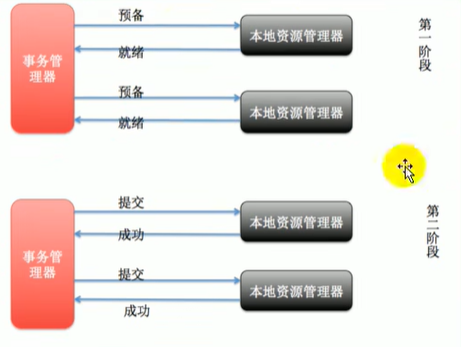

说明：

- XA协议比较简单，而且一旦商业数据库实现了XA协议，使用分布式事务的成本也比较低。
- XA性能不理想，特别是在交易下单链路，往往并发量很高，XA无法满足高并发场景。
- XA目前在商业数据库支持的比较理想，<span style="color:red;font-weight:bold;">在mysql数据库中支持的不太理想</span>，mysql的XA实现，没有记录prepare阶段日志，主备切换会导致主库与备库数据不一致。
- 许多nosql也没有支持XA，这让XA的应用场景变得非常狭隘。
- 也有3PC，引入了超时机制（无论协调者还是参与者，在向对方发送请求后，若长时间未收到回应则做出相应处理）。

### 2.2、柔性事务-TCC事务补偿型方案

刚性事务：遵循ACID原则，强一致性。

柔性事务：遵循BASE理论，最终一致性。

与刚性事务不同，柔性事务允许一定时间内，不同节点的数据不一致，但要求最终一致。

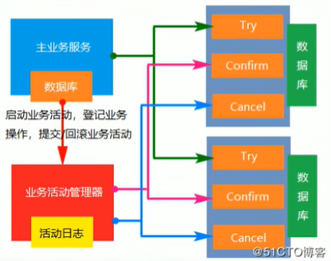

 一阶段prepare行为：调用自定义的prepare逻辑。

二阶段commit行为：调用自定义的commit逻辑。

二阶段rollback行为：调用自定义的rollback逻辑。

所谓TCC模式，是指支持把自定义的分支事务纳入到全局事务的管理中。

### 2.3、柔性事务-最大努力通知方案

按规律进行通知，<span style="color:red;font-weight:bold;">不保证数据一定能通知成功，但会提供可查询操作接口进行核对。</span>这种方案主要用在与第三方系统通讯时，比如：调用微信或支付宝支付后的支付结果通知。这种方案也是结合MQ进行实现，例如：通过MQ发送http请求，设置最大通知次数。达到通知次数后即不再通知。

案例：银行通知、商户通知等（各大交易业务平台间的商户通知：多次通知、查询校对、对账文件），支付宝的支付成功异步回调。

### 2.4、柔性事务-可靠消息投递+最终一致性方案（异步确保型）

实现：业务处理服务在业务事务提交之前，向实时消息服务请求发送消息，实时消息服务只记录消息数据，而不是真正的发送。业务处理服务在业务事务提交之后，向实时消息服务确认发送。只有在得道确认发送指令后，实时消息服务才会真正发送。

# 七、熔断降级限流

## 1、什么是熔断

​	A 服务调用 B 服务的某个功能，由于网络不稳定问题，或者 B 服务卡机，导致功能时间超长。如果这样子的次数太多，我们就可以直接将B断路了（A不再请求B接口），凡是调用B的直接返回降级数据，不必等待 B 的超长执行。这样 B 的故障问题，就不会蔓延到A服务。

## 2、什么是降级

​	整个网站处于流量高峰期，服务器压力剧增，根据当前业务情况及流量，对一些服务和页面进行有策略的降级[停止服务，所有的调用直接返回降级数据]。以此缓解服务器资源的压力，以保证核心业务的正常运行，同时也保持了客户和大部分客户得到正确的响应。

## 异同

相同点：

1. 为了保证集群大部分服务的可用性和可靠性，防止崩溃，牺牲小我。
2. 用户最终都是体验到某个功能不可用。

不同点：

1. 熔断是被调用方故障，出发的系统主动规则。
2. 降级是基于全局考虑，停止一些正常服务，释放资源。

## 3、什么是限流

​	对打入服务的请求流量进行控制，使服务能够承担不超过自己能力的流量压力。

## 4、Sentinel

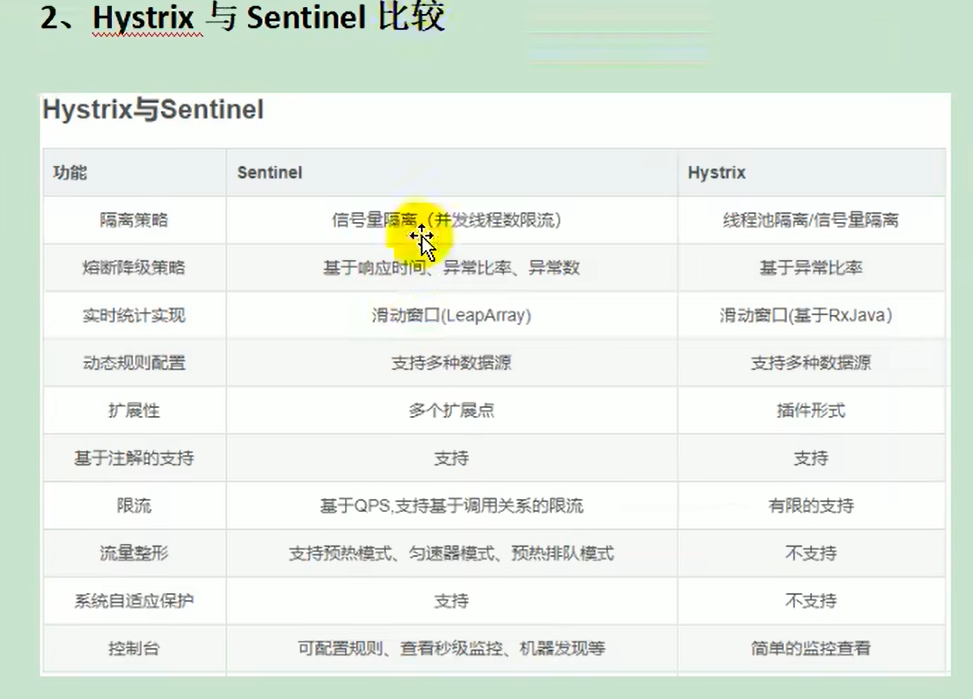


