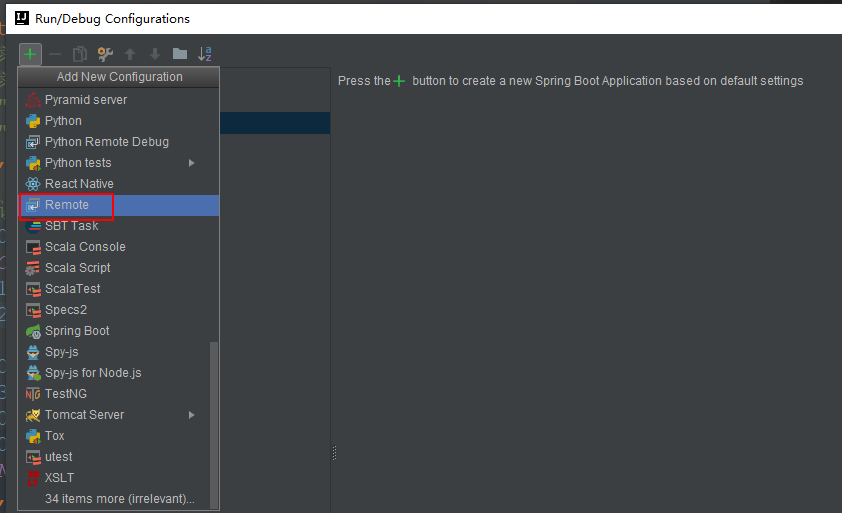
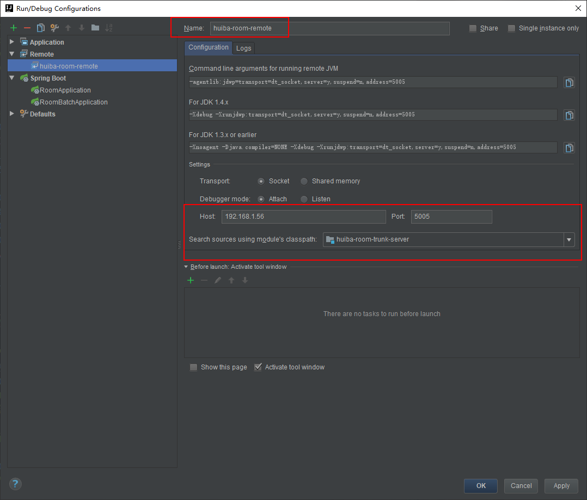

# Java

[返回列表](https://github.com/EmonCodingBackEnd/backend-tutorial)

[TOC]

# 一、Java项目小贴士

## 1、Java启动参数

```bash
java -jar -Xmx512m -Xms512m -Xmn256m -Xss228k -XX:MetaspaceSize=256m -Djasypt.encryptor.password=EbfYMpI8l2puY2mFmiPUyOPDoaxZTDK8 -Dspring.profiles.active=test -javaagent:/home/saas/huiba/room/huiba-room-server/agent/skywalking-agent.jar -Xdebug -Xrunjdwp:transport=dt_socket,server=y,suspend=n,address=5005 /home/saas/huiba/room/huiba-room-server/huiba-room-provider.jar
```

**说明：**

- `-Xmx512m` 设置最大堆内存；
- `-Xms512m` 设置最小堆内存;
- `-Xmn256m` 设置年轻代（含Eden和Survivor）堆内存大小;
- `-Xss228k` 设置每个线程的堆栈大小;
- `-XX:MetaspaceSize=256m` 针对JDK8及以上版本，设置方法区（永久代）最小内存；防止项目启动触发FGC;
- `-Djasypt.encryptor.password` 系统中加密的秘钥串;
- `-Dspring.profiles.active` SpringBoot激活的环境;
- `-javaagent` SkyWalking的代理配置;
- `-Xdebug -Xrunjdwp:transport=dt_socket,server=y,suspend=n,address=5005` 项目打开远程调试，IDEA可远程访问;


## 2、IDEA远程调试

### 2.1、远程项目启动加入参数

```bash
-agentlib:jdwp=transport=dt_socket,server=y,suspend=n,address=5005
```

### 2.2、本地IDEA配置


【菜单】->【RUN】->【Edit Configurations...】 或者右上角 

可打开项目启动类的窗口：




选择【Remote】，修改红色框框中的部分，并配置如下：



点击【OK】后选择并启动`huiba-room-remote`


# 二、Java项目线上问题排查

## 1、jps命令

### 1.1、命令介绍

**jps**（Java Virtual Machine Process Status Tool)是java提供的一个显示当前所有java进程pid的命令，适合在linux/unix平台上简单查看当前java进程的一些简单情况。

```bash
[emon@emon ~]$ jps -help
usage: jps [-help]
       jps [-q] [-mlvV] [<hostid>]

Definitions:
    <hostid>:      <hostname>[:<port>]
```

### 1.2、查看java进程和启动类

```bash
# 带参数 -l 可以查询时输出应用程序 main class 的完整 package 名称或者应用程序的 jar 文件完整路径名
[emon@emon ~]$ jps -l
46592 sun.tools.jps.Jps
10913 com.install4j.runtime.launcher.UnixLauncher
111842 service-config-provider.jar
61572 org.elasticsearch.bootstrap.Elasticsearch
111228 service-eureka-provider.jar
```

## 2、jinfo命令

### 2.1、命令介绍

**jinfo**是jdk自带的命令，可以用来查看正在运行的java应用程序的扩展参数，包括Java System属性和JVM命令行参数；也可以动态的修改正在运行的JVM一些参数。当系统崩溃时，jinfo可以从core文件里面知道崩溃的Java应用程序的配置信息。

```bash
[emon@emon ~]$ jinfo
Usage:
    jinfo [option] <pid>
        (to connect to running process)
    jinfo [option] <executable <core>
        (to connect to a core file)
    jinfo [option] [server_id@]<remote server IP or hostname>
        (to connect to remote debug server)

where <option> is one of:
    -flag <name>         to print the value of the named VM flag
    -flag [+|-]<name>    to enable or disable the named VM flag
    -flag <name>=<value> to set the named VM flag to the given value
    -flags               to print VM flags
    -sysprops            to print Java system properties
    <no option>          to print both of the above
    -h | -help           to print this help message
```

- `[option]`的说明
  - `-flag <name>`输出对应名称的参数
  - `-flag [+|-]<name>`开启或关闭对应名称的参数
  - `-flag <name>=<value>` 设定对应名称的参数
  - `-flags`输出全部的参数
  - `-sysprops`输出系统属性

### 2.2、输出当前jvm进程的全部参数和系统属性

```bash
[emon@emon ~]$ jinfo 61572
```

### 2.3、输出对应名称的参数

```bash
[emon@emon ~]$ jinfo -flag MaxHeapSize 61572
-XX:MaxHeapSize=268435456
```

## 3、jstack命令

### 3.1、命令介绍

```bash
[emon@emon ~]$ jstack -h
Usage:
    jstack [-l] <pid>
        (to connect to running process)
    jstack -F [-m] [-l] <pid>
        (to connect to a hung process)
    jstack [-m] [-l] <executable> <core>
        (to connect to a core file)
    jstack [-m] [-l] [server_id@]<remote server IP or hostname>
        (to connect to a remote debug server)

Options:
    -F  to force a thread dump. Use when jstack <pid> does not respond (process is hung)
    -m  to print both java and native frames (mixed mode)
    -l  long listing. Prints additional information about locks
    -h or -help to print this help message
```

### 3.2、统计线程数

```bash
[emon@emon ~]$ jstack -l 61572 | grep "java.lang.Thread.State" | wc -l
168
```

### 3.3、查看线程详情

```bash
[emon@emon ~]$ jstack -l 61572 > 61572.log
```


## 4、jmap命令

### 4.1、命令介绍

```bash
[emon@emon ~]$ jmap -h
Usage:
    jmap [option] <pid>
        (to connect to running process)
    jmap [option] <executable <core>
        (to connect to a core file)
    jmap [option] [server_id@]<remote server IP or hostname>
        (to connect to remote debug server)

where <option> is one of:
    <none>               to print same info as Solaris pmap
    -heap                to print java heap summary
    -histo[:live]        to print histogram of java object heap; if the "live"
                         suboption is specified, only count live objects
    -clstats             to print class loader statistics
    -finalizerinfo       to print information on objects awaiting finalization
    -dump:<dump-options> to dump java heap in hprof binary format
                         dump-options:
                           live         dump only live objects; if not specified,
                                        all objects in the heap are dumped.
                           format=b     binary format
                           file=<file>  dump heap to <file>
                         Example: jmap -dump:live,format=b,file=heap.bin <pid>
    -F                   force. Use with -dump:<dump-options> <pid> or -histo
                         to force a heap dump or histogram when <pid> does not
                         respond. The "live" suboption is not supported
                         in this mode.
    -h | -help           to print this help message
    -J<flag>             to pass <flag> directly to the runtime system
```

- `[option]`的说明
  - `-heap`显示Java堆详细信息
  - `-histo[:live]`显示堆中对象的统计信息
  - `-clstats`打印类加载器信息
  - `-finalizerinfo`显示在F-Queue队列等待Finalize线程执行finalizer方法的对象
  - `-dump:<dump-options>`生成堆转储快照
  - `-F`当使用-dump或者-histo参数没有响应时，使用该参数强制执行；对参数下的 live 子项不支持。
  - `-J<flag>` 指定传递给运行jmap的JVM的参数

### 4.2、查看进程的内存映像信息

```bash
[emon@emon ~]$ jmap 61572
Attaching to process ID 61572, please wait...
Debugger attached successfully.
Server compiler detected.
JVM version is 25.251-b08
0x000056388f640000	8K	/usr/local/Java/jdk1.8.0_251/bin/java
0x00007f2170f78000	50K	/usr/local/Java/jdk1.8.0_251/jre/lib/amd64/libmanagement.so
0x00007f2171382000	86K	/usr/lib64/libgcc_s-4.8.5-20150702.so.1
0x00007f2171598000	276K	/usr/local/Java/jdk1.8.0_251/jre/lib/amd64/libsunec.so
0x00007f21882b9000	110K	/usr/local/Java/jdk1.8.0_251/jre/lib/amd64/libnet.so
0x00007f21884d0000	91K	/usr/local/Java/jdk1.8.0_251/jre/lib/amd64/libnio.so
0x00007f21ac154000	124K	/usr/local/Java/jdk1.8.0_251/jre/lib/amd64/libzip.so
0x00007f21ac370000	60K	/usr/lib64/libnss_files-2.17.so
0x00007f21ac583000	226K	/usr/local/Java/jdk1.8.0_251/jre/lib/amd64/libjava.so
0x00007f21ac7b2000	64K	/usr/local/Java/jdk1.8.0_251/jre/lib/amd64/libverify.so
0x00007f21ac9c1000	42K	/usr/lib64/librt-2.17.so
0x00007f21acbc9000	1110K	/usr/lib64/libm-2.17.so
0x00007f21acecb000	16679K	/usr/local/Java/jdk1.8.0_251/jre/lib/amd64/server/libjvm.so
0x00007f21adebc000	2105K	/usr/lib64/libc-2.17.so
0x00007f21ae28a000	18K	/usr/lib64/libdl-2.17.so
0x00007f21ae48e000	106K	/usr/local/Java/jdk1.8.0_251/lib/amd64/jli/libjli.so
0x00007f21ae6a6000	138K	/usr/lib64/libpthread-2.17.so
0x00007f21ae8c2000	159K	/usr/lib64/ld-2.17.so
```

### 4.3、显示Java堆详细信息

```bash
[emon@emon ~]$ jmap -heap 61572
Attaching to process ID 61572, please wait...
Debugger attached successfully.
Server compiler detected.
JVM version is 25.251-b08

using parallel threads in the new generation.
using thread-local object allocation.
Concurrent Mark-Sweep GC

Heap Configuration:
   MinHeapFreeRatio         = 40
   MaxHeapFreeRatio         = 70
   MaxHeapSize              = 268435456 (256.0MB)
   NewSize                  = 89456640 (85.3125MB)
   MaxNewSize               = 89456640 (85.3125MB)
   OldSize                  = 178978816 (170.6875MB)
   NewRatio                 = 2
   SurvivorRatio            = 8
   MetaspaceSize            = 21807104 (20.796875MB)
   CompressedClassSpaceSize = 1073741824 (1024.0MB)
   MaxMetaspaceSize         = 17592186044415 MB
   G1HeapRegionSize         = 0 (0.0MB)

Heap Usage:
New Generation (Eden + 1 Survivor Space):
   capacity = 80543744 (76.8125MB)
   used     = 70528104 (67.2608413696289MB)
   free     = 10015640 (9.551658630371094MB)
   87.5649684226251% used
Eden Space:
   capacity = 71630848 (68.3125MB)
   used     = 70160536 (66.9103012084961MB)
   free     = 1470312 (1.4021987915039062MB)
   97.94737596852127% used
From Space:
   capacity = 8912896 (8.5MB)
   used     = 367568 (0.3505401611328125MB)
   free     = 8545328 (8.149459838867188MB)
   4.124001895680147% used
To Space:
   capacity = 8912896 (8.5MB)
   used     = 0 (0.0MB)
   free     = 8912896 (8.5MB)
   0.0% used
concurrent mark-sweep generation:
   capacity = 178978816 (170.6875MB)
   used     = 131186184 (125.10889434814453MB)
   free     = 47792632 (45.57860565185547MB)
   73.29704538888% used

37904 interned Strings occupying 4638792 bytes.
```

- 扩展知识：
  - -XX:NewRatio
    - 新生代(eden+2*survivor)和老年代（不包含永久区/元数据区）的比值
    - 2 表示`新生代`:`老年代`=1:2，即年轻代占堆的1/3
  - -XX:SurvivorRatio
    - 设置两个Survivor区和eden的比
    - 8表示`from`:`to`:`eden`=1:1:8，即一个Survivor占年轻代的1/10
  - JVM每次只会使用Eden和其中的一块Survivor区域来为对象服务，所以无论什么时候，总是有一块Survivor区域是空闲着的（1/3*1/10=1/30)。

### 4.4、显示堆中对象的统计信息

```bash
[emon@emon ~]$ jmap -histo:live 61572 > 61572.log
```

**拓展：**

```bash
# 统计实例最多的类，前10位；其中-n表示按照数字大小排序；-r表示相反排序；-k表示指定用来排序的列；-t指定列分隔符
jmap -histo 61572 | sort -n -r -k 2 | head -10
# 统计合计容量前10的类
jmap -histo 61572 | sort -n -r -k 3 | head -10
```

### 4.5、生成堆转存快照

```bash
[emon@emon ~]$ jmap -dump:live,format=b,file=61572.hprof 61572
```

**说明：**以hprof二进制格式转储Java堆到指定的filename文件中。live子选项是可选的。如果指定了live子选项，堆中只有活动的对象会被转储。想要浏览heap dump，可以使用`jpofile`工具读取分析。

**强调：**该命令执行，JVM会将整个heap的信息dump写入到一个文件，heap如果比较大，会耗时久；并且执行的过程中为了保证dump的信息是可靠的，所以会暂停应用。**线上系统慎用**。

### 4.6、打印类加载器信息【比较耗费时间的一个命令】

```bash
[emon@emon ~]$ jmap -clstats 61572
Attaching to process ID 61572, please wait...
Debugger attached successfully.
Server compiler detected.
JVM version is 25.251-b08
finding class loader instances ..done.
computing per loader stat ..done.
please wait.. computing liveness.liveness analysis may be inaccurate ...
class_loader	classes	bytes	parent_loader	alive?	type

<bootstrap>	2457	4273909	  null  	live	<internal>
```

### 4.7、打印等待终结的对象信息

```bash
[emon@emon ~]$ jmap -finalizerinfo 61572
Attaching to process ID 61572, please wait...
Debugger attached successfully.
Server compiler detected.
JVM version is 25.251-b08
Number of objects pending for finalization: 0
```

**说明：**最后一行的`Number of objects pending for finalization: 0`说明当前F-QUEUE队列中并没有等待Finalize线程执行finalizer方法的对象。


## 5、jstat命令

### 5.1、命令介绍

```bash
[emon@emon ~]$ jstat -h
-h requires an integer argument
Usage: jstat -help|-options
       jstat -<option> [-t] [-h<lines>] <vmid> [<interval> [<count>]]

Definitions:
  <option>      An option reported by the -options option
  <vmid>        Virtual Machine Identifier. A vmid takes the following form:
                     <lvmid>[@<hostname>[:<port>]]
                Where <lvmid> is the local vm identifier for the target
                Java virtual machine, typically a process id; <hostname> is
                the name of the host running the target Java virtual machine;
                and <port> is the port number for the rmiregistry on the
                target host. See the jvmstat documentation for a more complete
                description of the Virtual Machine Identifier.
  <lines>       Number of samples between header lines.
  <interval>    Sampling interval. The following forms are allowed:
                    <n>["ms"|"s"]
                Where <n> is an integer and the suffix specifies the units as 
                milliseconds("ms") or seconds("s"). The default units are "ms".
  <count>       Number of samples to take before terminating.
  -J<flag>      Pass <flag> directly to the runtime system.
```

- `option`参数选项

```bash
[emon@emon ~]$ jstat -options
-class					显示ClassLoad的相关信息；
-compiler				显示JIT编译的相关信息；
-gc						显示和gc相关的堆信息；
-gccapacity				显示各个代的容量以及使用情况；
-gccause				显示垃圾回收的相关信息（通过-gcutil），同时显示最后一次或者当前正在发生的垃圾回收的诱因；
-gcmetacapacity			显示metaspace的大小
-gcnew					显示新生代信息；
-gcnewcapacity			显示新生代大小和使用情况；
-gcold					显示老年代和永久代信息；
-gcoldcapacity			显示老年代的大小和使用情况；
-gcutil					显示垃圾收集信息；
-printcompilation		输出JIT编译的方法信息；
```

- `其他参数`
  - `-t`可以在打印的列加上Timestamp列，用于显示系统运行的时间
  - `-h`可以在周期性输出数据的时候，在指定输出多少行以后输出一次表头
  - `vmid`Virtual Machine ID（进程的pid）
  - `interval`执行每次的时间间隔，默认单位为秒(s)，可以指定为毫秒(ms)
  - `count`用于指定输出多少次记录，缺省则会一直打印

### 5.2、显示加载class的数量，以及所占用空间等信息

```bash
[emon@emon ~]$ jstat -class 61572
Loaded  Bytes  Unloaded  Bytes     Time   
 19017 33150.0       89    98.6       6.20
```

- 说明：
  - `Loaded`已经装载的类的数量
  - `Bytes`已经装载的类的字节数
  - `Unloaded`已经卸载的类的数量
  - `Bytes`已经卸载的类的字节数
  - `Time`装载和卸载类所花费的时间

### 5.3、显示VM实时编译（JIT）的数量等信息

```bash
[emon@emon ~]$ jstat -compiler 61572
Compiled Failed Invalid   Time   FailedType FailedMethod
   27068      0       0   151.97          0  
```

- 说明：
  - `Compiled`编译任务执行数量
  - `Failed`编译任务执行失败数量
  - `Invalid`编译任务执行失效数量
  - `Time`编译任务消耗时间
  - `FailedType`最后一个编译失败任务的类型
  - `FailedMethod`最后一个编译失败任务所在的类及方法

### 5.4、显示gc相关的堆信息，查看gc的次数和时间

```bash
[emon@emon ~]$ jstat -gc 61572
 S0C    S1C    S0U    S1U      EC       EU        OC         OU       MC     MU    CCSC   CCSU   YGC     YGCT    FGC    FGCT     GCT   
8704.0 8704.0  0.0   442.5  69952.0  55167.5   174784.0   112815.7  104408.0 94483.6 15100.0 12222.2   8427   51.535 57645 1527.104 1578.638
```

- 说明：
  - `S0C`年轻代中第一个survivor（幸存区）的容量（KB）
  - `S1C`年轻代中第二个survivor（幸存区）的容量（KB）
  - `S0U`年轻代中第一个survivor（幸存区）目前已使用空间（KB）
  - `S1U`年轻代中第二个survivor（幸存区）目前已使用空间（KB）
  - `EC`年轻代中Eden（伊甸园）的容量（KB）
  - `EU`年轻但中Eden（伊甸园）目前已使用空间（KB）
  - `OC`Old代的容量（KB）
  - `OU`Old代目前已使用空间（KB）
  - `MC`metaspace（元空间）的容量（KB）
  - `MU`metaspace（元空间）目前已使用空间（KB）
  - `CCSC`压缩类空间大小
  - `CCSU`压缩类空间使用大小
  - `YGC`新生代中gc次数
  - `YGCT`新生代中gc所用时间（秒）
  - `FGC`老年代全gc次数
  - `FGCT`从应用程序启动到采样时old代全gc所用时间（秒：s）
  - `FGCT`老年代全gc用的总时间（秒）
  - `GCT`垃圾回收总消耗时间（秒）

### 5.5、显示VM内存中三代（young、old、perm）对象的使用和占用大小

```bash
[emon@emon ~]$ jstat -gccapacity 61572
 NGCMN    NGCMX     NGC     S0C   S1C       EC      OGCMN      OGCMX       OGC         OC       MCMN     MCMX      MC     CCSMN    CCSMX     CCSC    YGC    FGC 
 87360.0  87360.0  87360.0 8704.0 8704.0  69952.0   174784.0   174784.0   174784.0   174784.0      0.0 1138688.0 104408.0      0.0 1048576.0  15100.0   8431 57645
```

- 说明：

  - `NGCMN`新生代最小容量（KB）
  - `NGCMX`新生代最大容量（KB）
  - `NGC`当前新生代容量（KB）
  - `S0C`第一个幸存区大小（KB）
  - `S1C`第二个幸存区大小（KB）
  - `EC`伊甸园区的容量大小（KB）

  - `OGCMN`老年代最小容量（KB）
  - `OGCMX`老年代最大容量（KB）
  - `OGC`当前老年代大小（KB）
  - `OC`当前老年代大小（KB）
  - `MCMN`最小元数据容量（KB）

  - `MCMX`最大元数据容量（KB）
  - `MC`当前元数据空间大小（KB）
  - `CCSMN`最小压缩类空间大小
  - `CCSMX`最大压缩类空间大小
  - `CCSC`当前压缩类空间大小
  - `YGC`新生代GC次数
  - `FGC`老年代全GC次数

### 5.6、metaspace中对象的信息及其占用量

### 5.6、metaspace中对象的信息及其占用量

```bash
[emon@emon ~]$ jstat -gcmetacapacity 61572
   MCMN       MCMX        MC       CCSMN      CCSMX       CCSC     YGC   FGC    FGCT     GCT   
       0.0  1138688.0   104408.0        0.0  1048576.0    15100.0  8437 57645 1527.104 1578.671
```

- 说明：

  - `MCMN`最小元数据容量
  - `MCMX`最大元数据容量
  - `MC`当前元数据空间大小

  - `CCSMN`最小压缩类空间大小
  - `CCSMX`最大压缩类空间大小
  - `CCSC`当前压缩类空间大小
  - `YGC`从应用程序启动到采样时年轻代中gc次数
  - `FGC`从应用程序启动带采样时old代全gc次数
  - `FGCT`从应用程序启动到采样时old代全gc所用时间（秒：s）
  - `GCT`从应用程序启动到采样时gc用的总时间（秒：s）


### 5.7、年轻代对象的信息

```bash
[emon@emon ~]$ jstat -gcnew 61572
 S0C    S1C    S0U    S1U   TT MTT  DSS      EC       EU     YGC     YGCT  
8704.0 8704.0  240.8    0.0  6   6 4352.0  69952.0  24754.6   8438   51.570
```

- 说明：

  - `S0C`年轻代中第一个survivor（幸存区）的容量（KB）
  - `S1C`年轻代中第二个survivor（幸存区）的容量（KB）
  - `S0U`年轻代中第一个survivor（幸存区）目前已使用空间（KB）
  - `S1U`年轻代中第二个survivor（幸存区）目前已使用空间（KB）
  - `TT`持有次数限制
  - `MIT`最大持有次数限制
  - `DSS`期望的幸存区大小

  - `EC`年轻代中Eden（伊甸园）的容量（KB）
  - `EU`年轻但中Eden（伊甸园）目前已使用空间（KB）

  - `YGC`从应用程序启动到采样时年轻代中gc次数
  - `YGCT`从应用程序启动到采样时年轻代中gc所用时间（秒：s）


### 5.8、年轻代对象的信息及其占用量

```bash
[emon@emon ~]$ jstat -gcnewcapacity 61572
  NGCMN      NGCMX       NGC      S0CMX     S0C     S1CMX     S1C       ECMX        EC      YGC   FGC 
   87360.0    87360.0    87360.0   8704.0   8704.0   8704.0   8704.0    69952.0    69952.0  8439 57645
```

- 说明：

  - `NGCMN`年轻代（young）中初始化（最小）的大小（KB）
  - `NGCMX`年轻代（young）的最大容量（KB）

  - `NGC`年轻代（young）中当前GC后产生的容量（KB）
  - `S0CMX`年轻代中第一个survivor（幸存区）的最大容量（KB）
  - `S0C`年轻代中第一个survivor（幸存区）的容量（KB）
  - `S1CMX`年轻代中第二个survivor（幸存区）的最大容量（KB）
  - `S1C`年轻代第二个survivor（幸存区）的容量（KB）

  - `ECMX`年轻代中Eden（伊甸园）的最大容量 (KB)

  - `EC`年轻代中Eden（伊甸园）的容量 (KB)

  - `YGC`从应用程序启动到采样时年轻代中gc次数

  - `FGC`从应用程序启动到采样时old代(全gc)gc次数

### 5.9、old代对象的信息

```bash
[emon@emon ~]$ jstat -gcold 61572
   MC       MU      CCSC     CCSU       OC          OU       YGC    FGC    FGCT     GCT   
104408.0  94483.6  15100.0  12222.2    174784.0    112822.2   8440 57645 1527.104 1578.678
```

- 说明：

  - `MC`metaspace(元空间)的容量 (KB)

  - `MU`metaspace(元空间)目前已使用空间 (KB)

  - `CCSC`压缩类空间大小

  - `CCSU`压缩类空间使用大小

  - `OC`Old代的容量 (KB)

  - `OU`Old代目前已使用空间 (KB)

  - `YGC`从应用程序启动到采样时年轻代中gc次数

  - `FGC`从应用程序启动到采样时old代(全gc)gc次数

  - `FGCT`从应用程序启动到采样时old代(全gc)gc所用时间(s)

  - `GCT`从应用程序启动到采样时gc用的总时间(s)

### 5.10、old代对象的信息及其占用量

```bash
[emon@emon ~]$ jstat -gcoldcapacity 61572
   OGCMN       OGCMX        OGC         OC       YGC   FGC    FGCT     GCT   
   174784.0    174784.0    174784.0    174784.0  8448 57645 1527.104 1578.703
```

- 说明：

  - `OGCMN`Old代中初始化(最小)的大小 (KB)

  - `OGCMX`Old代的最大容量(KB)

  - `OGC`Old代当前新生成的容量 (KB)
  - `OC`Old代的容量 (KB)

  - `YGC`从应用程序启动到采样时年轻代中gc次数

  - `FGC`从应用程序启动到采样时Old代(全gc)gc次数

  - `FGCT`从应用程序启动到采样时Old代(全gc)gc所用时间(s)

  - `GCT`从应用程序启动到采样时gc用的总时间(s)

### 5.10 统计gc信息

```bash
[emon@emon ~]$ jstat -gcutil 61572
  S0     S1     E      O      M     CCS    YGC     YGCT    FGC    FGCT     GCT   
  0.00   3.35  71.82  64.55  90.49  80.94   8441   51.578 57645 1527.104 1578.681
```

- 说明：

  - `S0`年轻代中第一个survivor（幸存区）已使用的占当前容量百分比
  - `S1`年轻代中第二个survivor（幸存区）已使用的占当前容量百分比
  - `E`年轻代中Eden（伊甸园）已使用的占当前容量百分比
  - `O`old代已使用的占当前容量百分比
  - `M`perm代已使用的占当前容量百分比
  - `YGC`从应用程序启动到采样时年轻代中gc次数
  - `YGCT`从应用程序启动到采样时年轻代中gc所用时间(s)
  - `FGC`从应用程序启动到采样时old代(全gc)gc次数
  - `FGCT`从应用程序启动到采样时old代(全gc)gc所用时间(s)
  - `GCT`从应用程序启动到采样时gc用的总时间(s)

  

### 5.11、显示垃圾回收的相关信息(-gcutil)

同时显示最后一次或当前正在发生的垃圾回收的诱因。

```bash
[emon@emon ~]$ jstat -gccause 61572
  S0     S1     E      O      M     CCS    YGC     YGCT    FGC    FGCT     GCT    LGCC                 GCC                 
  4.45   0.00  65.30  64.55  90.49  80.94   8442   51.583 57645 1527.104 1578.687 Allocation Failure   No GC
```

- 说明：
  - `LGCC`最后一次GC原因
  - `GCC`当前GC原因（No GC为当前没有执行GC)

### 5.12、当前VM执行的信息

```bash
[emon@emon ~]$ jstat -printcompilation 61572
Compiled  Size  Type Method
   27069    298    1 java/util/concurrent/ThreadPoolExecutor processWorkerExit
```

- 说明：
  - `Compiled`编译任务的数目
  - `Site`方法生成的字节码的大小
  - `Type`编译类型
  - `Method`类名和方法名用来标识编译的方法。类名使用/作为一个命名空间分隔符。方法名是给定类中的方法。上述格式是由`-XX:+PrintComplation`选项进行设置的。

