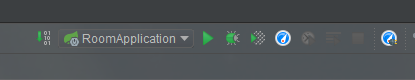

# Java

[返回列表](https://github.com/EmonCodingBackEnd/backend-tutorial)

[TOC]

# 一、Java项目小贴士

## 1、Java启动参数

```bash
java -jar -Xmx512m -Xms512m -Xmn256m -Xss228k -XX:MetaspaceSize=256m -Djasypt.encryptor.password=EbfYMpI8l2puY2mFmiPUyOPDoaxZTDK8 -Dspring.profiles.active=test -javaagent:/home/saas/huiba/room/huiba-room-server/agent/skywalking-agent.jar -Xdebug -Xrunjdwp:transport=dt_socket,server=y,suspend=n,address=5005 /home/saas/huiba/room/huiba-room-server/huiba-room-provider.jar
```

**说明：**

- `-Xmx512m` 设置最大堆内存；
- `-Xms512m` 设置最小堆内存;
- `-Xmn256m` 设置年轻代（含Eden和Survivor）堆内存大小;
- `-Xss228k` 设置每个线程的堆栈大小;
- `-XX:MetaspaceSize=256m` 针对JDK8及以上版本，设置方法区（永久代）最小内存；防止项目启动触发FGC;
- `-Djasypt.encryptor.password` 系统中加密的秘钥串;
- `-Dspring.profiles.active` SpringBoot激活的环境;
- `-javaagent` SkyWalking的代理配置;
- `-Xdebug -Xrunjdwp:transport=dt_socket,server=y,suspend=n,address=5005` 项目打开远程调试，IDEA可远程访问;


## 2、IDEA远程调试

### 2.1、远程项目启动加入参数

```bash
-agentlib:jdwp=transport=dt_socket,server=y,suspend=n,address=5005
```

### 2.2、本地IDEA配置


【菜单】->【RUN】->【Edit Configurations...】 或者右上角 

可打开项目启动类的窗口：


选择【Remote】，修改红色框框中的部分，并配置如下：


点击【OK】后选择并启动`huiba-room-remote`