# Kafka实战

[返回列表](https://github.com/EmonCodingBackEnd/backend-tutorial)

[TOC]

# 一、安装

官网地址：http://kafka.apache.org/

下载地址：http://kafka.apache.org/downloads


[安装Kafka（外部ZK）](https://github.com/EmonCodingBackEnd/backend-tutorial/blob/master/tutorials/BigData/BigDataInAction.md#2%E5%AE%89%E8%A3%85kafka%E5%A4%96%E9%83%A8zk)


## 2.1、Kafka与ZooKeeper版本对应关系

| Kafka                                             | ZooKeeper                     |
| ------------------------------------------------- | ----------------------------- |
| Kafka_2.12-2.5.1                                  | ZooKeeper3.5.8                |
| Kafka_2.12-2.6.3                                  | ZooKeeper3.5.9                |
| Kafka_2.12-2.7.2                                  | ZooKeeper3.5.9                |
| Kafka_2.12-2.8.2，开始尝试从服务架构去掉ZooKeeper | ZooKeeper3.5.9                |
| Kafka_2.12-3.1.2                                  | ZooKeeper3.6.3                |
| Kafka_2.12-3.0.2，基本完成从服务架构去掉ZooKeeper | ZooKeeper3.6.3                |
| Kafka_2.12-3.2.3                                  | ZooKeeper3.6.3                |
| Kafka_2.12-3.3.2                                  | ZooKeeper3.6.3/ZooKeeper3.7.1 |
| Kafka_2.12-3.4.0                                  | ZooKeeper3.6.3/ZooKeeper3.7.1 |

# 二、常用命令

- 创建

```bash
# --zookeeper emon:2181 可以替换为 --bootstrap-server emon:9092；若是多个可以 emon:9092,emon2:9092,emon3:9092
[emon@emon ~]$ kafka-topics.sh --create --zookeeper emon:2181 --replication-factor 1 --partitions 1 --topic test
```

- 查看topic列表

```bash
# --zookeeper emon:2181 可以替换为 --bootstrap-server emon:9092；若是多个可以 emon:9092,emon2:9092,emon3:9092
[emon@emon ~]$ kafka-topics.sh --list --zookeeper emon:2181
```

- 查看单个topic详情

```bash
# --zookeeper emon:2181 可以替换为 --bootstrap-server emon:9092；若是多个可以 emon:9092,emon2:9092,emon3:9092
[emon@emon ~]$ kafka-topics.sh --describe --zookeeper emon:2181 --topic test
```

- 删除

```bash
# --zookeeper emon:2181 可以替换为 --bootstrap-server emon:9092；若是多个可以 emon:9092,emon2:9092,emon3:9092
[emon@emon ~]$ kafka-topics.sh --delete --zookeeper emon:2181 --topic ssstopic
```

- 生产者

```bash
# 打开生产者命令行模式
[emon@emon ~]$ kafka-console-producer.sh --bootstrap-server emon:9092 --topic test
```

- 消费者

```bash
# 打开消费者命令模式
[emon@emon ~]$ kafka-console-consumer.sh --bootstrap-server emon:9092 --topic test --from-beginning
```

- 查看topic的偏移量

```bash
[emon@emon ~]$ kafka-run-class.sh kafka.tools.GetOffsetShell --broker-list emon:9092 --topic test
# 命令执行结果
test:0:59134
```

# 三、初识Kafka

## 3.1、什么是消息队列

消息队列（Message Queue）：可以简称为MQ。

> 例如：Java中的Queue队列，也可以认为是一个消息队列。

消息队列：顾名思义，消息+队列，其实就是保存消息的队列，属于消息传输过程中的容器。

消息队列主要提供生产、消费接口供外部调用，做数据的存储和读取。

## 3.2、消息队列分类

消息队列大致可以分为两种：点对点（P2P），发布订阅（Pub/Sub）。

- 共同点：

针对数据的处理流程是一样的。

消息生产者生产消息发送到queue中，然后消息消费者从queue中读取并且消费消息。

- 不同点：

点对点（P2P）模型包含：消息队列（Queue）、发送者（Sender）、接收者（Receiver）

一个生产者生产的消息只有一个消费者（Consumer）（消息一旦被消费，就不在消息队列中）消费。

例如QQ中的私聊，我发给你的消息只有你能看到，别人是看不到的。

发布订阅（Pub/Sub）模型包含：消息队列（Queue）、主体（Topic）、发布者（Publisher）、订阅者（Subscriber）。

每个消息可以有多个消费者，彼此互不影响。比如我发布一个微博：关注我的人都能够看到，或者QQ中的群聊，我在群里面发一条消息，群里面所有人都能看到。

这就是这两种消息队列的区别。

我们接下来要学习的Kafka这个消息队列是属于发布订阅模型的。

## 3.3、什么是Kafka

Kafka是一个高吞吐量的、持久性的、分布式发布订阅消息系统。

> 另外一种描述更贴切：Kafka是一个高吞吐量可持久化的、支持分区的（partition）、多副本的（replica）、基于zookeeper协调的分布式发布订阅消息系统。

- 高吞吐量：可以满足每秒百万级别消息的生产和消费。

为什么这么快？

难道Kafka的数据是放在内存里面的吗？

不是的，Kafka的数据还是放在磁盘里面的。

主要是Kafka利用了磁盘顺序读写速度超过内存随机读写速度这个特性。

所以说它的吞吐量才这么高。

- 持久性：有一套完善的消息存储机制，确保数据高效安全的持久化。
- 分布式：它是基于分布式的扩展、和容错机制；Kafka的数据都会复制到几台服务器上。当某一台机器故障失效时，生产者和消费者切换使用其他的机器。

> Kafka的数据是存储在磁盘中的，为什么可以满足每秒百万级别消息的生产和消费？
>
> 这是一个面试题，其实就是我们刚才针对高吞吐量的解释：Kafka利用了磁盘顺序读写速度超过内存随机读写速度这个特性。

Kafka主要应用在实时计算领域，可以和Flume、Spark、Flink等框架结合在一块使用。

> 例如：我们使用Flume采集网站产生的日志数据，将数据写入到Kafka中，然后通过Spark或者Flink从Kafka中消费数据进行计算，这其实是一个典型的实时计算案例的架构。

## 3.4、Kafka组件介绍

如图：

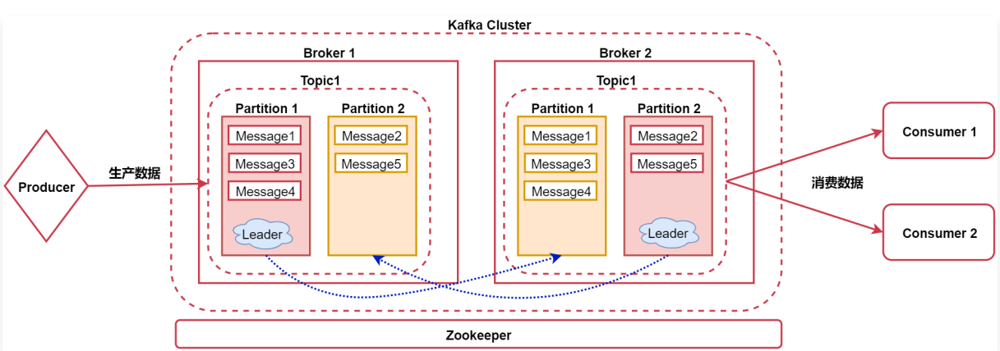

先看中间的Kafka Cluster，这个Kafka集群内有两个节点，这些节点在这里我们称之为Broker。

### 3.4.1、Broker

Broker：消息的代理，Kaka集群中的一个节点称为一个broker。

### 3.4.2、Topic

在Kafka中有Topic的概念

Topic：称为主题，Kafka处理的消息的不同分类（是一个逻辑概念）。

如果把Kafka认为是一个数据库的话，那么Kafka中的Topic就可以认为是一张表。不同的Topic中存储不同业务类型的数据，方便使用。

### 3.4.3、Partition

在Topic内部有partition的概念，每个分区都有一个Leader以及0个或者多个Follower，在创建Topic时，**Kafka会将不同分区的Leader均匀的分配在每个Broker上。**

Partition：是Topic物理上的分组，一个Topic会被分为1个或者多个partition（分区），分区个数是在创建topic的时候指定。每个topic都是有分区的，至少1个。

注意：这里面针对partition其实还有副本的概念，主要是为了提供数据的容错性，我们可以在创建Topic的时候指定partition的副本因子是几个。

在这里面副本因子其实就是2了，其中一个是Leader，另一个是真正的副本。

- Leader

Leader：用于处理消息的接收和消费等请求。

Leader中的这个partition负责接收用户的读写请求，副本partition负责从Leader里面的partition中同步数据，这样的话，如果后期Leader对应的节点宕机了，副本可以切换为Leader顶上来。

- Follower

Follower：主要用于备份消息数据。

汇总：**Kafka中的Leader负责处理读写操作**，而Follower只负责副本数据的同步；如果Leader出现故障，其他Follower会被重新选举为Leader。Follower像一个Consumer一样，拉取Leader对应分区的数据，并保存到日志数据文件中。

### 3.4.4、Message

在Partition内部还有一个message的概念

Message：我们称之为消息，代表的就是一条数据，它是通信的基本单位，每个消息都属于partition。


在这里总结一下：
Broker > Topic > Partition > Message


接下来还有两个组件，看图中的最左边和最右边。

Producer：消息和数据的生产者，向Kafka的topic生产数据。

Consumer：消息和数据的消费者，从Kafka的topic中消费数据。

这里的消费者可以有多个，每个消费者可以消费到相同的数据。


最后还有一个Zookeeper服务，Kafka的运行是需要依赖于Zookeeper的，Zookeeper负责协调Kafka集群的正常运行。


另一个参考图：

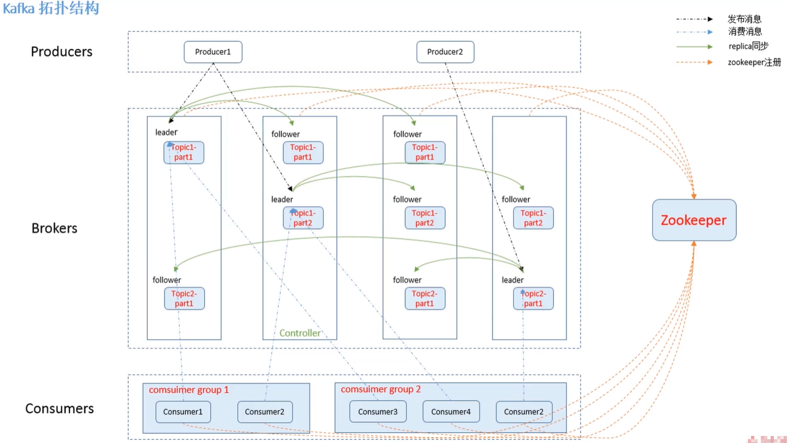


# 四、Kafka基础与进阶

## 4.1、Kafka中Topic的操作

### 4.1.1、新增Topic

注意：副本数不能大于集群中Broker的数量。

因为每个partition的副本必须保存在不同的broker，否则没有意义，如果partition的副本都保存在同一个broker，那么这个broker挂了，则partition数据依然会丢失。

- 新增Topic

```bash
# 指定2个分区，2个副本，副本数不能大于集群中的Broker的数量；对于zookeeper集群，也可以英文逗号分隔
# --bootstrap-server emon:9092 与 --zookeeper emon:2181 等价
# --broker-list emon:9092 和  --bootstrap-server emon:9092 等价
[emon@emon ~]$ kafka-topics.sh --bootstrap-server emon:9092 --create --partitions 2 --replication-factor 2 --topic hello
# 命令行输出结果
Created topic hello.
```


### 4.1.2、查询Topic

- 查询Topic列表

```bash
[emon@emon ~]$ kafka-topics.sh --bootstrap-server emon:9092 --list
# 命令行输出结果
hello
```

- 查询topic的偏移量（最小值）

```bash
[emon@emon ~]$ kafka-run-class.sh kafka.tools.GetOffsetShell --broker-list emon:9092 --topic test
# 命令执行结果
test:0:0
test:1:0
```

- 查询topic的最小offset和最大offset

```bash
# 最小值
$ kafka-run-class.sh kafka.tools.GetOffsetShell --broker-list emon:9092 --topic test --time -2
# 命令执行结果
test:0:0
test:1:0
# 最大值
$ kafka-run-class.sh kafka.tools.GetOffsetShell --broker-list emon:9092 --topic test --time -1
# 命令执行结果
test:0:57
test:1:83
```


- 查看指定topic的详细信息

```bash
[emon@emon ~]$ kafka-topics.sh --bootstrap-server emon:9092 --describe --topic hello
Topic: hello	PartitionCount: 2	ReplicationFactor: 2	Configs: 
	Topic: hello	Partition: 0	Leader: 1	Replicas: 1,2	Isr: 1,2
	Topic: hello	Partition: 1	Leader: 2	Replicas: 2,0	Isr: 2,0
```

第一行显示指定topic所有partitions的一个总结。

PartitionCount：表示这个Topic一共有多少个partition；

ReplicationFactor：表示这个Topic中partition的副本因子是几；

Configs：这个表示创建Topic时动态指定的配置信息，在这我们没有额外指定配置信息；


下面每一行给出的是一个partition的信息，如果只有一个partition，则只显示一行。

Topic：显示当前的Topic名称；

Partition：显示当前Topic的partition编号；

Leader：Leader partition所在的节点编号，这个编号其实就是`broker.id`的值；

看图：

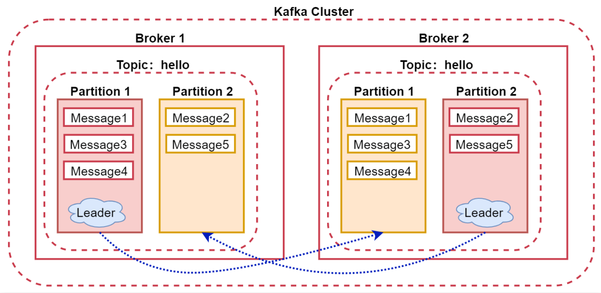

这个图里面的hello这个topic有两个partition，其中partition1的Leader所在的节点是broker1，partition2的Leader所在的节点是broker2。

Replicas：当前partition所有副本所在的节点编号【包含Leader所在的节点】，如果设置多个副本的话，这里会显示多个，不管该节点是否是Leader以及是否存活。

Isr：当前partition处于同步状态的所有节点，这里显示的所有节点都是存活状态的，并且跟Leader同步的（包含Leader所在的节点）。

所以说Replicas和Isr的区别就是：

如果某个partition的副本所在的节点宕机了，在Replicas中还是会显示那个节点，但是在Isr中就不会显示了，Isr中显示的都是出于正常状态的节点。

### 4.1.3、修改Topic

- 修改Topic的partition数量，只能增加

为什么partition只能增加？

因为数据是存储在partition中的，如果可以减少partition的话，那么partition中的数据就丢了。

```bash
[emon@emon ~]$ kafka-topics.sh --bootstrap-server emon:9092 --alter --partitions 5 --topic hello
# 命令行输出结果
WARNING: If partitions are increased for a topic that has a key, the partition logic or ordering of the messages will be affected
Adding partitions succeeded!
```

### 4.1.4、删除Topic

删除Kafka中的指定Topic，删除操作是不可逆的。

> 注意：Kafka从1.0.0开始默认开启了删除操作，之前的版本只会把Topic标记为删除状态，需要设置`delete.topic.enable`为true才可以真正删除。

如果不想开启删除功能，可以设置`delete.topic.enable`为false，这样删除topic的时候只会把它标记为删除状态，此时这个topic依然可以正常使用。

`delete.topic.enable`可以配置在`server.properties`文件中。

```bash
[emon@emon ~]$ kafka-topics.sh --bootstrap-server emon:9092 --delete --topic hello
# 命令行输出结果
Topic hello is marked for deletion.
Note: This will have no impact if delete.topic.enable is not set to true.
```

### 4.1.5、查看group

- 查看group列表

```bash
$ kafka-consumer-groups.sh --bootstrap-server emon:9092 --list
```

- 查看指定group详情

```bash
$ kafka-consumer-groups.sh --bootstrap-server emon:9092 --describe --group con-1
# 命令行输出结果
Consumer group 'con-1' has no active members.

GROUP           TOPIC           PARTITION  CURRENT-OFFSET  LOG-END-OFFSET  LAG             CONSUMER-ID     HOST            CLIENT-ID
con-1           hello           4          0               0               0               -               -               -
con-1           hello           2          0               0               0               -               -               -
con-1           hello           3          2               2               0               -               -               -
con-1           hello           0          0               0               0               -               -               -
con-1           hello           1          2               2               0               -               -               -
```

GROUP：当前消费者组，通过group.id指定的值；

TOPIC：当前消费的topic；

PARTITION：消费的分区；

CURRENT-OFFSET：该分区当前消费组内，已经消费到的offset。（比如：分区1的值为2，表示偏移量是0-1的消息被消费，下一条是偏移量为2的消息）

LOG-END-OFFSET：该分区中数据的最大offset。（比如：分区1的值为2，表示已有2条数据，或下一个最大offset的值）

LAG：当前分区未消费数据量；

CONSUMER-ID：消费者ID；

HOST：主机；

CLIENT-ID：客户端ID。

- 在topic上offset某个group

```bash
# 注意，to-offset 的参数，不能大于 LOG-END-OFFSET；to-offset可以替换为to-earliest或to-latest
$ kafka-consumer-groups.sh --bootstrap-server emon:9092 --group con-1 --topic hello --execute --reset-offsets --to-offset 0
```

- 删除某个group

```bash
$ kafka-consumer-groups.sh --bootstrap-server emon:9092 --delete --group con-1
```


### 4.1.6、Kafka中的生产者和消费者

Kafka默认提供了基于控制台的生产者和消费者，方便测试使用。

- 生产者：`kafka-console-producer.sh`
- 消费者：`kafka-console-consumer.sh`

#### 4.1.6.1、如何生产数据

直接使用Kafka提供的基于控制台的生产者。

先创建一个Topic【5个分区，2个副本】：

```bash
[emon@emon ~]$ kafka-topics.sh --bootstrap-server emon:9092 --create --partitions 5 --replication-factor 2 --topic hello
```

向这个Topic中生产数据：

```bash
[emon@emon ~]$ kafka-console-producer.sh --bootstrap-server emon:9092 --topic hello
# 进入kafka生产者命令行
>
```

命令说明：

- broker-list：Kafka的服务地址[多个用英文逗号隔开]
- topic：Topic名称

#### 4.1.6.2、如何消费数据

再创建一个消费者消费Topic中的消息：

```bash
[emon@emon ~]$ kafka-console-consumer.sh --bootstrap-server emon:9092 --topic hello --group g --from-beginning
```

命令说明：

- bootstrap-server：Kafka的服务地址[多个用英文逗号隔开]
- topic：具体的Topic
- group：消费者组
- from-beginning：表示从头消费，如果不指定，默认消费最新生产的数据

### 4.1.7、案例：QQ群聊天

通过Kafka可以模拟QQ群聊天的功能，我们来看一下。

首先在Kafka中创建一个新的topic，可以认为是我们在QQ里面创建了一个群，群号是88888888

```bash
[emon@emon ~]$ kafka-topics.sh --bootstrap-server emon:9092 --create --partitions 5 --replication-factor 2 --topic 88888888
```

打开生产者：

```bash
[emon@emon ~]$ kafka-console-producer.sh --bootstrap-server emon:9092 --topic 88888888
```

打开2个新在终端，消费消息：

```bash
[emon@emon2 ~]$ kafka-console-consumer.sh --bootstrap-server emon:9092 --topic 88888888 --from-beginning
[emon@emon3 ~]$ kafka-console-consumer.sh --bootstrap-server emon:9092 --topic 88888888 --from-beginning
```

## 4.2、Kafka核心扩展内容

### 4.2.1、Broker扩展

Broker的参数可以配置在`server.properties`这个配置文件中，Broker中支持的完整参数在官方文档中有提现：

https://kafka.apache.org/documentation/#brokerconfigs

针对Broker的参数，我们主要分析两块：

1：Log Flush Policy：设置数据flush到磁盘的时机。

为了减少磁盘写入的次数，broker会将消息暂时缓存起来，当消息的个数达到一定阈值或者过了一定的时间间隔后，再flush到磁盘，这样可以减少磁盘IO调用的次数。

这块主要通过两个参数控制：

- `log.flush.interval.messages`：一个分区的消息数阈值，达到该阈值则将该分区的数据flush到磁盘，注意这里是针对分区，因为topic是一个逻辑概念，分区是真实存在的，每个分区会在磁盘上产生一个目录。

  这个参数的默认值为`9223372036854775807`，long的最大值。默认值太大了，所以建议修改，可以使用`server.properties`中针对这个参数指定的值10000，需要去掉注释之后这个参数才生效。

- `log.flush.interval.ms`：间隔指定时间。

  默认间隔指定的时间将内存中缓存的数据flush到磁盘中，由文档可知，这个参数的默认值为null，此时会使用`log.flush.scheduler.interval.ms`参数的值，`log.flush.scheduler.interval.ms`参数的值默认是`9223372036854775807`，long的最大值。

  所以这个值也建议修改，可以使用`server.properties`中针对这个参数指定的值1000，单位是毫秒，表示每1秒写一次磁盘，这个参数也需要去掉注释之后才生效。


2：Log Retention Policy：设置数据保存周期，默认7天。

Kafka中的数据默认会保存7天，如果Kafka每天接收的数据量过大，这样是很占磁盘空间的，建议修改数据保存周期，我们之前在实际工作中是将数据保存周期改为了1天。

数据保存周期主要通过这几个参数控制。

- `log.retention.hours`：这个参数默认值为168，单位是小时，就是7天，可以在这调整数据保存的时间，超过这个时间数据会被自动删除。
- `log.retention.bytes`：这个参数表示当分区的文件达到一定大小的时候会删除它，如果设置了按照指定周期删除数据文件，这个参数不设置也可以，这个参数默认是没有开启的。
- `log.retention.check.interval.ms`：这个参数表示检测的间隔时间，单位是毫秒，默认值是300000，就是5分钟，表示每5分钟检测一次文件看是否满足删除的时机。

### 4.2.2、Producer扩展

Producer默认是随机将数据发送到topic的不同分区中，也可以根据用户设置的算法来根据消息的key来计算输入到哪个partition里面。

此时需要通过partitioner来控制，这个知道就行了，因为在实际工作中一般在向Kafka中生产数据的都是不带key的，只有数据内容，所以一般都是使用随机的方式发送数据。

在这里有一个需要注意的内容就是：

> 针对producer的数据通讯方式：同步发送和异步发送。

同步是指：生产者发出数据后，等接收方发回相应以后再发送下个数据的通讯方式。

异步是指：生产者发出数据后，不等接收方发回相应，接着发送下一个数据的通讯方式。

具体的数据通讯策略是由acks参数控制的。

- acks默认为1，表示需要Leader节点回复收到消息，这样生产者才会发送下一条数据。【默认】

- acks：all，表示需要所有Leader+副本节点回复收到消息（acks=-1），这样生产者才会发送下一条数据。

- acks：0，表示不需要任何节点回复，生产者会继续发送下一条数据。

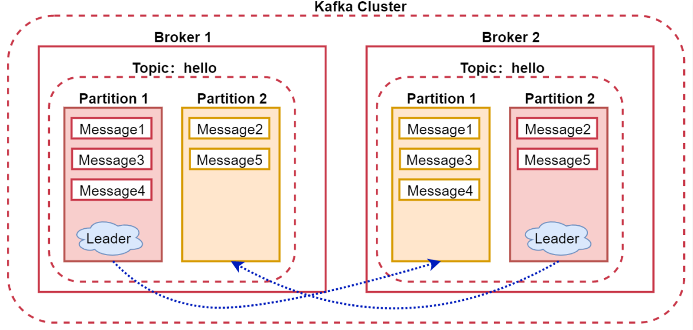

我们在向hello这个topic生产数据的时候，可以在生产者中设置acks参数，acks设置为1，表示我们在向hello这个topic的partition1这个分区写数据的时候，只需要让Leader所在的broker1这个节点回复确认收到的消息就可以了，这样生产者就可以发送下一条数据了。

如果acks设置为all，则需要partition1的这两个副本所在的节点（包含Leader）都回复收到消息，生产者才会发送下一条数据。

如果acks设置为0,，表示生产者不会等待任何partition所在节点的回复，它只管发送数据，不管你有没有收到，所以这种情况丢失数据的概率比较高。

> 针对这块在面试的时候会有一个面试题：Kafka如何保证数据不丢？

其实就是通过acks机制保证的，如果设置acks为all，则可以保证数据不丢，因为此时把数据发送给Kafka之后，会等待对应partition所在的所有Leader和副本节点都确认收到消息之后才会认为数据发送成功了，所以在这种策略下，只要把数据发送给Kafka之后就不会丢了。

如果acks设置为1，则当我们把数据发送给partition之后，partition的Leader节点也确认收到了，但是Leader回复完确认消息之后，Leader对应的节点就宕机了，副本partition还没来得及将数据同步过去，所以会存在丢失的可能性。

不过如果宕机的是副本partition所在的节点，则数据是不会丢的。

如果acks设置为0的话就表示是顺其自然了，只管发送，不管Kafka有没有收到，这种情况表示对数据丢失都无所谓了。

### 4.2.3、Consumer扩展

在消费者中还有一个消费者组的概念。

每个consumer属于一个消费者组，通过group.id指定消费者组。

那组内消费和组间消费有什么区别吗？

- 组内：消费者组内的所有消费者消费同一份数据；

注意：在同一个消费者组中，一个partition同时只能有一个消费者消费数据。

如果消费者的个数小于分区的个数，一个消费者会消费多个分区的数据。

如果消费者的个数大于分区的个数，则多余的消费者不消费数据。

所以，对于一个topic，同一个消费者组中推荐不能有多于分区个数的消费者，否则将意味着某些消费者将无法获得消息。

- 组间：多个消费者组消费相同的数据，互不影响。

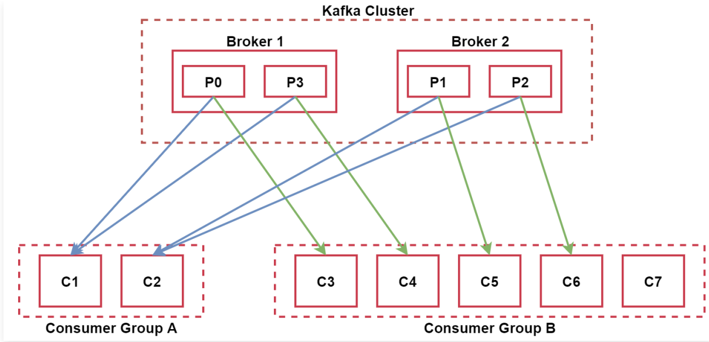

Kafka集群有两个节点，Broker1和Broker2.

集群内有一个topic，这个topic有4个分区，P0，P1，P2，P3

下面有两个消费者组：

Consumer Group A和Consumer Group B

其中Consumer Group A中有两个消费者C1和C2，由于这个topic有4个分区，所以，C1负责消费两个分区的数据，C2负责消费两个分区的数据，这个属于组内消费。

Consumer Group B有5个消费者，C3~C7，其中C3，C4，C5，C6分别消费一个分区的数据，而C7就是多余出来的了，因为现在这个消费者组内的消费者的数量比对应的topic的分区数量还多，但是一个分区同时只能被一个消费者消费，所以就会有一个消费者处于空闲状态。

这个也属于组内消费。

Consumer Group A和Consumer Group B这两个消费者组属于组间消费，互不影响。

### 4.2.4、Topic、Partition扩展

每个partition在存储层面是append log文件。

新消息都会被直接追加到log文件的尾部，每条消息在log文件中的位置成为offset（偏移量）。

越多partitions可以容纳更多的consumer，有效提升并发消费的能力。

> 具体什么时候增加topic的数量？什么时候增加partition的数量呢？

业务类型增加需要增加topic、数据量大需要增加partition。

### 4.2.5、Message扩展

每条Message包含了以下三个属性：

1. offset对应类型：long表示此消息在一个partition中的起始的位置。可以认为offset是partition中Message的id，自增的。
2. MessageSize对应类型：int32此消息的字节大小。
3. data是message的具体内容。

看这个图，加深对Topic、Partition、Message的理解。

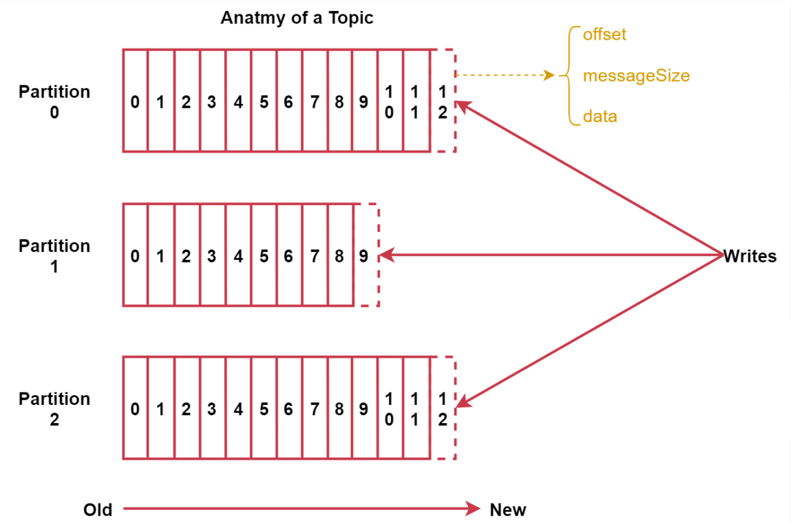

## 4.3、Kafka核心值存储和容错机制

### 4.3.1、存储策略

在Kafka中每个topic包含1到多个partition，每个partition存储一部分Message。每条Message包含三个属性，其中有一个是offset。

> 问题来了：offset相当于partition中这个message的唯一id，那么如何通过id高效的找到message。

两大法宝：分段+索引

Kafka中数据的存储方式是这样的：

1. 每个partition由多个segment【片段】组成，每个segment中存储多条消息。
2. 每个partition在内存中对应一个index，记录每个segment中的第一条消息偏移量。
3. 每个partition会将消息添加到最后一个segment上
4. 当segment达到一定阈值会flush到磁盘上
5. segment文件分为两个部分：index和data（*.log文件）

Kafka中数据的存储流程是这样的：
生产者生产的消息会被发送到topic的多个partition上，topic收到消息后往对应partition的最后一个segment上添加该消息，segment达到一定的大小后会创建新的segment。

来看这个图，可以认为是针对topic中某个partition的描述。

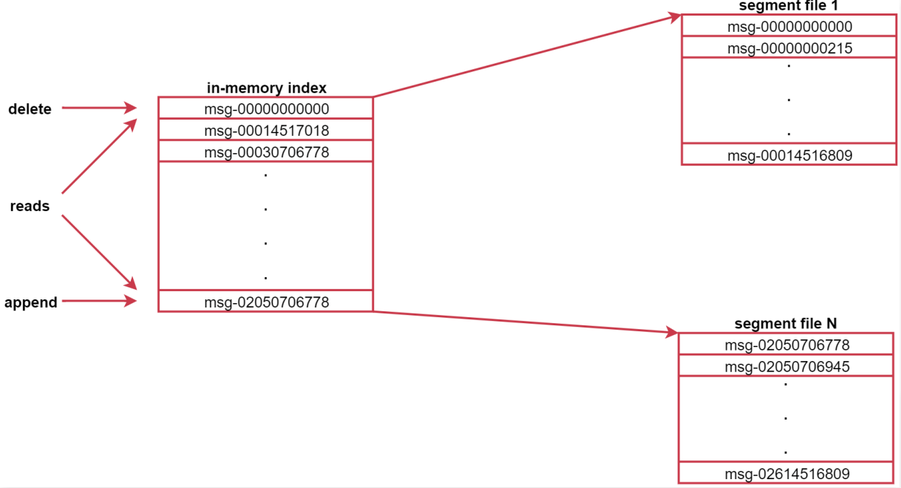

图中左侧就是索引，右边是segment文件，左边的索引里面会存储每个segment文件中第一条消息的偏移量，由于消息的偏移量都是递增的，这样后期查找起来就方便了，先到索引中判断数据在哪一个segment文件中，然后就可以直接定位到具体的segment文件了，这样再查找具体的一条数据就很快了，因为都是有序的。

### 4.3.2、容错机制

> 当Kafka集群中的一个Broker节点宕机，会出现什么现象？

下面来演示一下：

使用`kill -9`杀掉emon中的broker进程测试。

```bash
[emon@emon ~]$ jps
82512 Jps
82011 QuorumPeerMain
82383 Kafka
[emon@emon ~]$ kill 82383
```

我们可以先通过zookeeper来查看一下，因为当Kafka集群中的broker节点启动之后，会自动向zookeeper中进行注册，保存当前节点信息。

```bash
[emon@emon ~]$ zkCli.sh 
......
[zk: localhost:2181(CONNECTED) 0] ls /brokers
[ids, seqid, topics]
[zk: localhost:2181(CONNECTED) 1] ls /brokers/ids
[1, 2]
```

此时发现zookeeper的`/brokers/ids`下面只有2个节点信息。

可以通过get命令查看节点信息，这里面会显示对应的主机名和端口号。

```bash
[zk: localhost:2181(CONNECTED) 2] get /brokers/ids/1
{"listener_security_protocol_map":{"PLAINTEXT":"PLAINTEXT"},"endpoints":["PLAINTEXT://emon2:9092"],"jmx_port":-1,"host":"emon2","timestamp":"1645766294919","port":9092,"version":4}
```

然后再使用describe查询topic的详细信息，会发现此时的分区的Leader全部变成了目前存活的另外两个节点。

```bash
[emon@emon ~]$ kafka-topics.sh --bootstrap-server emon:9092 --describe --topic hello
Topic: hello	PartitionCount: 5	ReplicationFactor: 2	Configs: 
	Topic: hello	Partition: 0	Leader: 1	Replicas: 1,2	Isr: 1,2
	Topic: hello	Partition: 1	Leader: 2	Replicas: 2,0	Isr: 2
	Topic: hello	Partition: 2	Leader: 1	Replicas: 0,1	Isr: 1
	Topic: hello	Partition: 3	Leader: 1	Replicas: 1,0	Isr: 1
	Topic: hello	Partition: 4	Leader: 1	Replicas: 2,1	Isr: 1,2
```

此时可以发现Isr中的内容和Replicas中的不一样了，因为Isr中显示的是目前正常运行的节点。

所以当Kafka集群中的一个Broker节点宕机之后，对整个集群而言没有什么特别大的影响，此时集群会给partition重新选出来一些新的Leader节点。

> 当Kafka集群中新增一个Broker节点，会出现什么现象？

新加入一个broker几点，zookeeper会自动识别并在适当的机会选择此节点提供服务。

再次启动emon几点中的broker进行测试。

```bash
[emon@emon ~]$ /usr/local/kafka/kafkaStart.sh 
```

此时到zookeeper中查看一下：

```bash
[emon@emon ~]$ zkCli.sh 
......
[zk: localhost:2181(CONNECTED) 0] ls /brokers
[ids, seqid, topics]
[zk: localhost:2181(CONNECTED) 1] ls /brokers/ids
[0, 1, 2]
```

发现broker.id为0的这个节点信息也有了。

中通过describe查看topic的描述信息，Isr中的信息和Replicas中的内容是一样的了。

```bash
[emon@emon ~]$ kafka-topics.sh --describe --zookeeper emon:2181 --topic hello
Topic: hello	PartitionCount: 5	ReplicationFactor: 2	Configs: 
	Topic: hello	Partition: 0	Leader: 1	Replicas: 1,2	Isr: 1,2
	Topic: hello	Partition: 1	Leader: 2	Replicas: 2,0	Isr: 2,0
	Topic: hello	Partition: 2	Leader: 0	Replicas: 0,1	Isr: 1,0
	Topic: hello	Partition: 3	Leader: 1	Replicas: 1,0	Isr: 1,0
	Topic: hello	Partition: 4	Leader: 1	Replicas: 2,1	Isr: 1,2
```

>  但是启动后有个问题：如果发现新启动的这个节点不会是任何分区的Leader？怎么重新均匀分配呢？
>
> 备注：我实际重启后，partition编号2的分区，Leader是0。

1、Broker中的自动均衡策略（默认已经有）

```bash
auto.leader.rebalance.enable=true
leader.imbalance.check.interval.seconds 默认值：300
```

2、手动执行：

```bash
[emon@emon ~]$ kafka-leader-election.sh --bootstrap-server emon:9092 --election-type preferred --all-topic-partitions
# 命令行输出结果
Successfully completed leader election (PREFERRED) for partitions 88888888-4, hello-4, hello-3, 88888888-2, hello-1
```

执行后的效果如下，这样就实现了均匀分配。

```bash
[emon@emon ~]$ kafka-topics.sh --describe --zookeeper emon:2181 --topic hello
Topic: hello	PartitionCount: 5	ReplicationFactor: 2	Configs: 
	Topic: hello	Partition: 0	Leader: 1	Replicas: 1,2	Isr: 1,2
	Topic: hello	Partition: 1	Leader: 2	Replicas: 2,0	Isr: 0,2
	Topic: hello	Partition: 2	Leader: 0	Replicas: 0,1	Isr: 0,1
	Topic: hello	Partition: 3	Leader: 1	Replicas: 1,0	Isr: 0,1
	Topic: hello	Partition: 4	Leader: 2	Replicas: 2,1	Isr: 1,2
```

## 4.4、Kafka生产消费者实战

### 4.4.1、Consumer消费offset查询

Kafka0.9版本以前，消费者的offset信息保存在zookeeper中。

从Kafka0.9开始，使用了新的消费API，消费者的信息会保存在Kafka里面的`__consumer_offsets`这个topic中。

因为频繁操作zookeeper性能不高，所以Kafka在自己的topic中负责维护消费者的offset信息。

> 如何查询保存在Kafka中的Consumer的offset信息呢？

使用`kafka-consumer-groups.sh`这个脚本可以查看。

- 查看目前所有的consumer group。

```bash
[emon@emon ~]$ kafka-consumer-groups.sh --list --bootstrap-server emon:9092
# 命令行输出结果
con-2
con-1
```

- 查看某一个具体consumer group的信息

```bash
[emon@emon ~]$ kafka-consumer-groups.sh --describe --bootstrap-server emon:9092 --group con-1
# 命令行输出结果
Consumer group 'con-1' has no active members.

GROUP           TOPIC           PARTITION  CURRENT-OFFSET  LOG-END-OFFSET  LAG             CONSUMER-ID     HOST            CLIENT-ID
con-1           hello           4          0               0               0               -               -               -
con-1           hello           2          0               0               0               -               -               -
con-1           hello           3          2               2               0               -               -               -
con-1           hello           0          0               0               0               -               -               -
con-1           hello           1          2               2               0               -               -               -
```

GROUP：当前消费者组，通过group.id指定的值；

TOPIC：当前消费的topic；

PARTITION：消费的分区；

CURRENT-OFFSET：消费者消费到这个分区的offset；

LOG-END-OFFSET：当前分区中数据的最大offset；

LAG：当前分区未消费数据量；

CONSUMER-ID：消费者ID；

HOST：主机；

CLIENT-ID：客户端ID。

### 4.4.2、Consumer消费顺序

当一个消费者消费一个partition时候，消费的数据顺序和此partition数据的生产顺序是一致的；

当一个消费者消费多个partition时候，消费者按照partition的顺序，首先消费一个partition，当消费完一个partition最新的数据后再消费其它partition中的数据。

> 总之：如果一个消费者消费多个partition，只能保证消费的数据顺序在一个partition内是有序的。

也就是说消费Kafka中的数据只能保证消费partition内的数据是有序的，多个partition之间是无序的。

### 4.4.3、Kafka的三种语义

Kafka可以实现以下三种语义，这三种语义是针对消费者而言的：

- 至少一次：at-least-once

这种语义有可能会对数据重复处理。

实现至少一次消费语义的消费者也很简单。

1：设置`enable.auto.commit`为false，禁用自动提交offset。

2：消息处理完之后手动调用`consumer.commitSync()`提交offset

这种方式是在消费数据之后，手动调用函数`consumer.commitSync()`同步提交offset。

有可能处理多次的场景是消费者的消息处理完成并输出到结果库，但是offset还没有提交，这个时候消费者挂掉了，再重启的时候会重新消费并处理消息，所以至少会处理一次。

- 至多一次：at-most-once【默认】

这种语义有可能会丢失数据。

至多一次消费语义是Kafka消费者的默认实现。配置这种消费者最简单的方式是：

1：enable.auto.commit设置为true。

2：auto.commit.interval.ms设置为一个较低的时间范围。

由于上面的配置，此时Kafka会有一个独立的线程负责按照指定时间间隔提交offset。

消费者的offset已经提交，但是消息还在处理中（还没有处理完），这个时候程序挂了，导致数据没有被成功处理，再重启的时候会从上次提交的offset处理消费，导致上次没有被成功处理的消息就丢失了。

- 仅一次：exactly-once

这种语义可以保证数据只被消费处理一次。

1：将enable.auto.commit设置为false，禁用自动提交offset。

2：使用consumer.seek(topicPartition, offset)来指定offset；

3：在处理消息的时候，要同时保存住每个消息的offset。以原子事务的方式保存offset和处理的消息结果，这个时候相当于自己保存offset信息了，把offset和具体的数据绑定到一块，数据真正处理成功的时候才会保存offset信息。

这样就可以保证数据仅被处理一次了。


## 4.99、其他

### 1、Kafka节点故障

- Kafka与ZooKeeper心跳未保持视为节点故障。
- Follower消息落后Leader太多也视为节点故障。
- Kafka会对故障节点进行移除。

### 2、Kafka节点故障处理

- Kafka基本不会因为节点故障而丢失数据。
- Kafka的语义担保（acks=all）也很大程度上避免数据丢失。
- Kafka会对消息进行集群内平衡，减少消息在某些节点热度过高。

# 五、Kafka技巧篇

## 5.1、Kafka集群参数调优

### 5.1.1、JVM参数调优

默认启动的Broker进程只会使用1G内存，在实际使用中会导致进程频繁GC，影响Kafka集群的性能和稳定性。

通过`jstat -gcutil <pid> 1000`查看到Kafka进程GC的情况，主要看YGC、YGCT、FGC、FGCT这几个参数，如果这几个值不是很大，就没什么问题。

```bash
[emon@emon ~]$ jps
# 命令行输出结果
94074 QuorumPeerMain
97789 Jps
94447 Kafka
[emon@emon ~]$ jstat -gcutil 94447 1000
# 命令行输出结果
  S0     S1     E      O      M     CCS    YGC     YGCT    FGC    FGCT     GCT   
  0.00 100.00  30.58  23.44  92.17  92.87     16    0.359     0    0.000    0.359
  0.00 100.00  30.58  23.44  92.17  92.87     16    0.359     0    0.000    0.359
  0.00 100.00  30.58  23.44  92.17  92.87     16    0.359     0    0.000    0.359
  0.00 100.00  30.58  23.44  92.17  92.87     16    0.359     0    0.000    0.359
```

YGC：young gc发生的次数；

YGCT：young gc消耗的时间；

FGC：full gc发生的次数；

FGCT：full gc消耗的时间。

如果你发现YGC很频繁，或者FGC很频繁，就说明内存分配的少了。此时需要修改`kafka-server-start.sh`中的KAFKA_HEAP_OPTS：

```bash
[emon@emon ~]$ vim /usr/local/kafka/bin/kafka-server-start.sh 
```

```bash
# 在脚本使用KAFKA_HEAP_OPTS之前设置该变量值
export KAFKA_HEAP_OPTS="-Xmx10G -Xms10G -XX:metaspaceSize=96m -XX:+UseG1GC -XX:MaxGCPauseMillis=20 -XX:InitiatingHeapOccupancyPercent=35 -XX:G1HeapRegionSize=16M -XX:MinMetaspaceFreeRatio=50 -XX:MaxMetaspaceFreeRatio=80"
```

这个配置表示给Kafka分配了10G内存，在服务器4核16G内存情况下。

### 5.1.2、Replication参数调优

- replica.socket.timeout.ms=60000

这个参数的默认值是30秒，它是控制partition副本之间socket通信的超时时间，如果设置的太小，有可能会犹豫网络原因导致造成误判，认为某一个partition副本连不上了。

- replica.lag.time.max.ms=50000

如果一个副本在指定的时间内没有向Leader节点发送任何请求，或者在指定的时间内没有同步完Leader中的数据，则Leader会将这个节点从ISR列表中移除。

如果网络不好，或者Kafka压力较大，建议调大该值，否则可能会频繁出现副本丢失，进而导致集群需要频繁复制副本，导致集群压力更大，会陷入一个恶性循环。

### 5.1.3、Log参数调优

这块是针对Kafka中数据文件的删除时机进行设置，不是对Kafka本身的日志参数配置。

- log.retention.hours=24

这个参数默认值为168，单位是小时，就是7天，默认对数据保存7天，可以在这调整数据保存的时间，我们在实际工作中改为了只保存1天，因为Kafka中的数据我们会在hdfs中进行备份，保存一份，所以就没有必要在Kafka中保留太长时间了。

在Kafka中保留只是为了能够让你在指定的时间内恢复数据，或者重新消费数据，如果没有这种需求，那么就没必要设置太长时间。

> 注意：这里分析的Replication的参数和Log参数都是在`server.properties`文件中进行配置。


## 5.2、Kafka Topic命名小技巧

针对Kafka中Topic命名的小技巧。

建议在给topic命名的时候在后面跟上r2p10之类的内容：

r2：表示Partition的弗恩因子是2

p10：表示这个Topic的分区数是10

这样的好处是后期我们如果要写消费者消费指定topic的数据，通过topic的名称我们就知道应该设置多少个消费者消费数据效率最高。

因为一个partition同时只能被一个消费者消费，所以效率最高的情况就是消费者的数据和topic的分区数量保持一致。

在这里通过topic的名称就可以直接看到，一目了然。

但是也有一个缺点，就是后期如果我们动态调整了topic的partition，那么这个topic名称上的partition数量就不准确了，针对这个topic，建议大家一开始的时候就提前预估一下，可以多设置一些partition，我们在工作中的时候针对一些数据量比较大的topic一般会设置4050个partition，数据量少的topic一般设置510个partition，这样后期调整topic partition数量的场景就比较少了。


## 5.3、Kafka集群监控管理工具

- Kafka只能依靠Kafka-run-class.sh等命令来进行管理。
- Kafka Manager是目前比较常见的监控工具。也即是：CMAK。

现在我们操作Kafka都是在命令行界面中通过脚本操作的，后面需要传很多参数，用起来还是比较麻烦的，那么Kafka没有提供web界面的支持吗？

很遗憾的告诉你，Apache官方并没有提供，不过好消息是有一个由雅虎开源的一个工具，目前用起来还不错。

它之前的名字叫KafkaManager，后来改名字了，叫[CMAK](https://github.com/yahoo/CMAK)。

CMAK是目前最受欢迎的Kafka集群管理工具，最早由雅虎开源，用户可以在Web界面上操作Kafka集群，可以轻松检查集群状态（Topic、Consumer、Offset、Brokers、Replica、Partition）。

下载地址：https://github.com/yahoo/CMAK/tags

```bash
[emon@emon ~]$ wget -cP /usr/local/src/ https://github.com/yahoo/CMAK/releases/download/3.0.0.6/cmak-3.0.0.6.zip
```

> 注意：由于cmak-3.0.0.6.zip版本是在java11这个版本下编译的，所以在运行的时候也需要使用java11这个版本，我们目前服务器上使用的是java8这个版本。

我们为什么不使用java11版本呢？因为自2019年1月1日起，java8之后的更新版本在商业用途的时候就需要收费授权了。

在针对cmak-3.0.0.6.zip这个版本，如果我们想要使用的话有两种解决办法：

1：下载cmak的源码，使用jdk8编译

2：额外安装一个java11

如果想要编译的话需要安装sbt这个工具对源码进行编译，sbt是Scala的构建工具，类似于Java中的Maven。由于我们在这个使用不属于商业用途，所以使用java11是没问题的，那就不用重新编译了。

下载JDK11：

下面的下载地址，可以通过ORACLE官网下载页，登录后获取：

官网下载页地址： http://www.oracle.com/technetwork/java/javase/downloads/index.html

```bash
[emon@emon ~]$ wget -cP /usr/local/src/ https://download.oracle.com/otn/java/jdk/11.0.14+8/7e5bbbfffe8b45e59d52a96aacab2f04/jdk-11.0.14_linux-x64_bin.tar.gz?AuthParam=1645937638_93d909234b0b472bdf015454d7da3b2c
```

### 5.3.1、安装JDK11

- 解压安装

```bash
[emon@emon ~]$ tar -zxvf /usr/local/src/jdk-11.0.7_linux-x64_bin.tar.gz -C /usr/local/Java
```

### 5.3.2、安装cmak

- 创建安装目录

```bash
[emon@emon ~]$ mkdir /usr/local/Cmak
```

- 解压

```bash
[emon@emon ~]$ unzip /usr/local/src/cmak-3.0.0.6.zip -d /usr/local/Cmak/
```

- 修改JDK版本

```bash
[emon@emon ~]$ vim /usr/local/Cmak/cmak-3.0.0.6/bin/cmak
```

```bash
# 在die()函数之前添加一行：
JAVA_HOME=/usr/local/Java/jdk-11.0.7/
```

- 修改conf

```bash
[emon@emon ~]$ vim /usr/local/Cmak/cmak-3.0.0.6/conf/application.conf 
```

```bash
# 找到cmak.zkhosts=${?ZK_HOSTS}，在其后追加：
cmak.zkhosts="emon:2181"
```

注意：如果是zk的集群，可以类似`cmak.zkhosts="emon:2181,emon2:2181,emon3:2181"`

同时，**该zookeeper只是被cmak使用的，是否是kafka所使用的zk集群，么得关系**。

- 调整Kafka配合cmak

1： 先停止Kafka集群；

2：在启动脚本之前添加JMX_PORT配置

```bash
[emon@emon ~]$ vim /usr/local/kafka/kafkaStart.sh 
```

```bash
# 启动kafka
JMX_PORT=9988 /usr/local/kafka/bin/kafka-server-start.sh -daemon /usr/local/kafka/config/server.properties
```

3：同步该启动脚本到其他节点

```bash
[emon@emon ~]$ scp -rq /usr/local/kafka/kafkaStart.sh emon@emon2:/usr/local/kafka/
[emon@emon ~]$ scp -rq /usr/local/kafka/kafkaStart.sh emon@emon3:/usr/local/kafka/
```

- 启动cmak的脚本

```bash
# 默认9000端口，可以通过-Dhttp.port调整
[emon@emon ~]$ /usr/local/Cmak/cmak-3.0.0.6/bin/cmak -Dconfig.file=/usr/local/Cmak/cmak-3.0.0.6/conf/application.conf -Dhttp.port=9000
```

- 访问

http://emon:9000/

添加一个Cluster，重点参数配置如下：

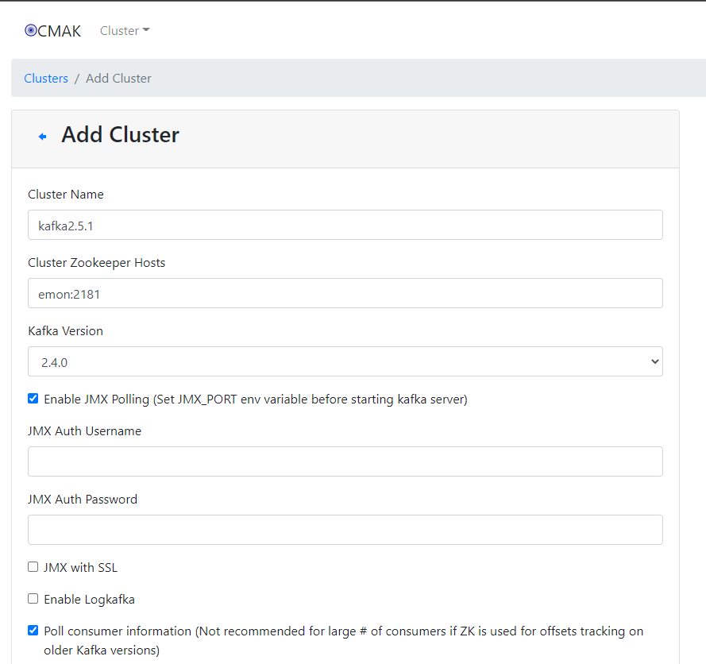

点击`Save`后跳转的界面上，点击`Go to cluster view.`查看。


## 5.4、Kafka安全

- Kafka的安全措施
  - Kafka提供了SSL或SASL机制（听说SSL降低Kafka20%的性能）
  - Kafka提供了Broker到ZooKeeper链接的安全机制
  - Kafka支持Client的读写验证

### 5.4.0、keytool和openssl命令

#### 0、前提

说明：默认密码都是123456

#### 1、keytool命令

##### 1.1、keytool子命令列表

```bash
$ keytool -help
```

| 命令            | 描述                              |
| --------------- | --------------------------------- |
| -certreq        | 生成证书请求                      |
| -changealias    | 更改条目的别名                    |
| -delete         | 删除条目                          |
| -exportcert     | 导出证书                          |
| -genkeypair     | 与 `-genkey` 等效，生成密钥对     |
| -genseckey      | 生成密钥                          |
| -gencert        | 根据证书请求生成证书              |
| -importcert     | 与`-import`等效，导入证书或证书链 |
| -importpass     | 导入口令                          |
| -importkeystore | 从其他密钥库导入一个或所有条目    |
| -keypasswd      | 更改条目的密钥口令                |
| -list           | 列出密钥库中的条目                |
| -printcert      | 打印证书内容                      |
| -printcertreq   | 打印证书请求的内容                |
| -printcrl       | 打印 CRL 文件的内容               |
| -storepasswd    | 更改密钥库的存储口令              |

- 命令示例

```bash
```

##### 1.2、`keytool -genkeypair`

说明：生成秘钥对

- 命令帮助

```bash
$ keytool -genkeypair -help
```

```bash
-alias <alias>                  要处理的条目的别名
-keyalg <keyalg>                密钥算法名称
-keysize <keysize>              密钥位大小
-sigalg <sigalg>                签名算法名称
-destalias <destalias>          目标别名
-dname <dname>                  唯一判别名
-startdate <startdate>          证书有效期开始日期/时间
-ext <value>                    X.509 扩展
-validity <valDays>             有效天数（默认90天）
-keypass <arg>                  密钥口令
-keystore <keystore>            密钥库名称
-storepass <arg>                密钥库口令
-storetype <storetype>          密钥库类型
-providername <providername>    提供方名称
-providerclass <providerclass>  提供方类名
-providerarg <arg>              提供方参数
-providerpath <pathlist>        提供方类路径
-v                              详细输出
-protected                      通过受保护的机制的口令
```

- 命令示例

  - 生成密钥库

  ```bash
  $ keytool -genkey -keystore server.keystore.jks -alias emonkafka -validity 3650 -keyalg RSA
  ```

##### 1.3、`keytool -exportcert`

说明：导出证书

- 命令帮助

```bash
$ keytool -exportcert -help
```

```bash
 -rfc                            以 RFC 样式输出
 -alias <alias>                  要处理的条目的别名
 -file <filename>                输出文件名
 -keystore <keystore>            密钥库名称
 -storepass <arg>                密钥库口令
 -storetype <storetype>          密钥库类型
 -providername <providername>    提供方名称
 -providerclass <providerclass>  提供方类名
 -providerarg <arg>              提供方参数
 -providerpath <pathlist>        提供方类路径
 -v                              详细输出
 -protected                      通过受保护的机制的口令
```

- 命令示例

```bash
```

##### 1.4、`keytool -importcert`

说明：导入证书或证书链

- 命令帮助

```bash
$ keytool -importcert -help
```

```bash
 -noprompt                       不提示
 -trustcacerts                   信任来自 cacerts 的证书
 -protected                      通过受保护的机制的口令
 -alias <alias>                  要处理的条目的别名
 -file <filename>                输入文件名
 -keypass <arg>                  密钥口令
 -keystore <keystore>            密钥库名称
 -storepass <arg>                密钥库口令
 -storetype <storetype>          密钥库类型
 -providername <providername>    提供方名称
 -providerclass <providerclass>  提供方类名
 -providerarg <arg>              提供方参数
 -providerpath <pathlist>        提供方类路径
 -v                              详细输出
```

- 命令示例

```bash
```

##### 1.5、`keytool -certreq`

说明：生成证书请求

- 命令帮助

```bash
$ keytool -certreq -help
```

```bash
 -alias <alias>                  要处理的条目的别名
 -sigalg <sigalg>                签名算法名称
 -file <filename>                输出文件名
 -keypass <arg>                  密钥口令
 -keystore <keystore>            密钥库名称
 -dname <dname>                  唯一判别名
 -storepass <arg>                密钥库口令
 -storetype <storetype>          密钥库类型
 -providername <providername>    提供方名称
 -providerclass <providerclass>  提供方类名
 -providerarg <arg>              提供方参数
 -providerpath <pathlist>        提供方类路径
 -v                              详细输出
 -protected                      通过受保护的机制的口令
```

- 命令示例

```bash

```

##### 1.6、`keytool -gencert`

说明：根据证书请求生成证书

- 命令帮助

```bash
$ keytool -gencert help
```

```bash
 -rfc                            以 RFC 样式输出
 -infile <filename>              输入文件名
 -outfile <filename>             输出文件名
 -alias <alias>                  要处理的条目的别名
 -sigalg <sigalg>                签名算法名称
 -dname <dname>                  唯一判别名
 -startdate <startdate>          证书有效期开始日期/时间
 -ext <value>                    X.509 扩展
 -validity <valDays>             有效天数
 -keypass <arg>                  密钥口令
 -keystore <keystore>            密钥库名称
 -storepass <arg>                密钥库口令
 -storetype <storetype>          密钥库类型
 -providername <providername>    提供方名称
 -providerclass <providerclass>  提供方类名
 -providerarg <arg>              提供方参数
 -providerpath <pathlist>        提供方类路径
 -v                              详细输出
 -protected                      通过受保护的机制的口令
```

- 命令示例

```bash
```

##### 1.7、`keytool -list`

说明：列出密钥库中的条目

- 命令帮助

```bash
$ keytool -list -help
```

```bash
 -rfc                            以 RFC 样式输出
 -alias <alias>                  要处理的条目的别名
 -keystore <keystore>            密钥库名称
 -storepass <arg>                密钥库口令
 -storetype <storetype>          密钥库类型
 -providername <providername>    提供方名称
 -providerclass <providerclass>  提供方类名
 -providerarg <arg>              提供方参数
 -providerpath <pathlist>        提供方类路径
 -v                              详细输出
 -protected                      通过受保护的机制的口令
```

- 命令示例

  - 查看密钥库

  ```bash
  $ keytool -list -keystore server.keystore.jks -storepass 123456
  ```

  - 以rfc查看

  ```bash
  $ keytool -list -rfc -keystore server.keystore.jks -storepass 123456
  ```

  - 从密钥库中，解析出公钥

  ```bash
  $ keytool -list -rfc -keystore server.keystore.jks -storepass 123456 | openssl x509 -inform pem -pubkey
  ```

  

  

##### 1.8、`keytool -printcertreq`

说明：打印证书请求的内容

- 命令帮助

```bash
$ keytool -printcertreq -help
```

```bash
 -file <filename>  输入文件名
 -v                详细输出
```

- 命令示例

```bash
```

##### 1.9、`keytool -printcert`

说明：打印证书内容

- 命令帮助

```bash
$ keytool -printcert -help
```

```bash
 -rfc                        以 RFC 样式输出
 -file <filename>            输入文件名
 -sslserver <server[:port]>  SSL 服务器主机和端口
 -jarfile <filename>         已签名的 jar 文件
 -v                          详细输出
```

- 命令示例

```bash
```

#### 2、openssl命令

[OpenSSL命令行咋用？英文版](https://www.madboa.com/geek/openssl/)

https://www.cnblogs.com/yangxiaolan/p/6256838.html

##### 2.1、子命令列表

- 如何进入命令行操作？

```bash
# 进入openssl命令行
$ openssl
# 查看可用命令：虽然提示无效命令，但是能输出可用命令，很好用，推荐！
OpenSSL> help
# 退出 exit / quit
OpenSSL> exit
# 查看版本
OpenSSL> version
OpenSSL 1.0.2k-fips  26 Jan 2017
```

- 子命令列表

```bash
Standard commands
asn1parse         ca                ciphers           cms               
crl               crl2pkcs7         dgst              dh                
dhparam           dsa               dsaparam          ec                
ecparam           enc               engine            errstr            
gendh             gendsa            genpkey           genrsa            
nseq              ocsp              passwd            pkcs12            
pkcs7             pkcs8             pkey              pkeyparam         
pkeyutl           prime             rand              req               
rsa               rsautl            s_client          s_server          
s_time            sess_id           smime             speed             
spkac             ts                verify            version           
x509              

Message Digest commands (see the `dgst' command for more details)
md2               md4               md5               rmd160            
sha               sha1              

Cipher commands (see the `enc' command for more details)
aes-128-cbc       aes-128-ecb       aes-192-cbc       aes-192-ecb       
aes-256-cbc       aes-256-ecb       base64            bf                
bf-cbc            bf-cfb            bf-ecb            bf-ofb            
camellia-128-cbc  camellia-128-ecb  camellia-192-cbc  camellia-192-ecb  
camellia-256-cbc  camellia-256-ecb  cast              cast-cbc          
cast5-cbc         cast5-cfb         cast5-ecb         cast5-ofb         
des               des-cbc           des-cfb           des-ecb           
des-ede           des-ede-cbc       des-ede-cfb       des-ede-ofb       
des-ede3          des-ede3-cbc      des-ede3-cfb      des-ede3-ofb      
des-ofb           des3              desx              idea              
idea-cbc          idea-cfb          idea-ecb          idea-ofb          
rc2               rc2-40-cbc        rc2-64-cbc        rc2-cbc           
rc2-cfb           rc2-ecb           rc2-ofb           rc4               
rc4-40            rc5               rc5-cbc           rc5-cfb           
rc5-ecb           rc5-ofb           seed              seed-cbc          
seed-cfb          seed-ecb          seed-ofb          zlib 
```

##### 2.2、基本命令

- 查看版本基本信息

```bash
$ openssl version
```

- 查看版本详细信息

```bash
$ openssl version -a
```

- 查看可用命令

```bash
# 因为是通过无效命令查询可用命令，所以 help / -help / -h 等等任何一个不可用的命令，都是可以的
$ openssl help
```

- 列出所有可用的ciphers

```bash
$ openssl ciphers -v
```

- 列出TLSv1 ciphers

```bash
$ openssl ciphers -v -tls1
```

- 列出high encryption ciphers（keys larger than 128 bits）

```bash
$ openssl ciphers -v 'HIGH'
```

- 列出high encryption ciphers using the AES algorithm

```bash
$ openssl ciphers -v 'HIGH+AES'
```

##### 2.3、`openssl speed`

说明：测试各种加密算法的性能

- 命令帮助

```bash
$ openssl speed help
```

```bash
Available values:
md2      md4      md5      hmac     sha1     sha256   sha512   whirlpoolrmd160
idea-cbc seed-cbc rc2-cbc  rc5-cbc  bf-cbc
des-cbc  des-ede3 aes-128-cbc aes-192-cbc aes-256-cbc aes-128-ige aes-192-ige aes-256-ige 
camellia-128-cbc camellia-192-cbc camellia-256-cbc rc4
rsa512   rsa1024  rsa2048  rsa4096
dsa512   dsa1024  dsa2048
ecdsap256 ecdsap384 ecdsap521
ecdsa
ecdhp256  ecdhp384  ecdhp521
ecdh
idea     seed     rc2      des      aes      camellia rsa      blowfish

Available options:
-elapsed        measure time in real time instead of CPU user time.
-engine e       use engine e, possibly a hardware device.
-evp e          use EVP e.
-decrypt        time decryption instead of encryption (only EVP).
-mr             produce machine readable output.
-multi n        run n benchmarks in parallel.
```

- 命令示例

  - 测试所有加密算法的性能

  ```bash
  $ openssl speed
  ```

  - 测试rsa

  ```bash
  $ openssl speed rsa
  ```

  - 测试rsa1024

  ```bash
  $ openssl speed rsa1024
  ```

  - 并行运行5个基准测试

  ```bash
  $ openssl speed rsa1024 -multi 5
  ```

##### 2.4、`openssl req`

说明：生成证书请求文件、查看验证证书请求文件、生成自签名证书

证书请求需要什么？

申请者需要将自己的信息及其公钥放入证书请求中。但在实际操作过程中，所需要提供的是私钥而非公钥。因为私钥可以提取出公钥。另外，还需要将提供的数据进行数字签名（使用单向加密），保证该证书请求文件的完整性和一致性，防止他人盗取后进行篡改。

- 命令帮助

```bash
req [options] <infile >outfile
where options  are
 -inform arg    input format - DER or PEM
 				输入格式：DER或PEM
 -outform arg   output format - DER or PEM
 				输出格式：DER或PEM
 -in arg        input file
 -out arg       output file
				证书请求或者自签署证书的输出文件，也可以是其他内容的输出文件，不指定时默认stdout
 -text          text form of request
 				以文本格式打印证书请求
 -pubkey        output public key
 				输出证书请求文件中的公钥
 -noout         do not output REQ
 				不输出部分信息
 -verify        verify signature on REQ
 -modulus       RSA modulus
 -nodes         don't encrypt the output key
 				如果指定`-newkey`自动生成密钥，那么`-nodes`选项说明生成的密钥不需要加密，即不需要输入passphase
 -engine e      use engine e, possibly a hardware device
 -subject       output the request's subject
 				输出证书请求文件中的subject（如果指定了x509，则打印证书中的subject）
 -passin        private key password source
 				传递解密密码
 -key file      use the private key contained in file
 				仅与`-new`配合，指定私钥的输入文件，创建证书时需要
 -keyform arg   key file format
 -keyout arg    file to send the key to
 				指定自动创建私钥时私钥的存储位置，若未指定，则使用配置文件中default_keyfile指定的值，默认该值为privkey.pem。
 -rand file:file:...
                load the file (or the files in the directory) into
                the random number generator
 -newkey rsa:bits generate a new RSA key of 'bits' in size
 -newkey dsa:file generate a new DSA key, parameters taken from CA in 'file'
 -newkey ec:file generate a new EC key, parameters taken from CA in 'file'
 				`-newkey`与`-key`互斥，`-newkey`是指在生成证书请求或者自签名证书的时候，自动生成密钥，然后生成的密钥文件名称由`-keyout`参数指定。当指定`-newkey`选项时，后面指定 rsa:bits 说明产生rsa密钥，位数由bits指定。如果没有指定选项`-key`和`-newkey`，默认自动生成密钥。
 -[digest]      Digest to sign with (see openssl dgst -h for list)
 				指定对创建请求时提供的申请者信息进行数字签名时的单向加密算法，如-md5/-sha1/-sha512等，若未指定则默认使用配置文件中default_md指定的值 -verify ：对证书请求文件进行数字签名验证
 -config file   request template file.
 				默认参数在ununtu上未/etc/ssl/openssl.cnf，可以使用-config指定特殊路径的配置文件
 -subj arg      set or modify request subject
 -multivalue-rdn enable support for multivalued RDNs
 -new           new request.
 				生成证书请求文件，会交互式提醒输入一些信息，这些交互选项以及交互选项信息的长度值，以及其他一些扩展属性在配置文件（默认为 openssl.cnf，还有些辅助配置文件）中指定了默认值。如果没有指定`-key`选项，则会自动生成一个RSA私钥，该私钥的生成位置也在openssl.cnf中指定了。
 -batch         do not ask anything during request generation
 				指定非交互模式，直接读取config文件的配置参数，或者使用默认参数值
 -x509          output a x509 structure instead of a cert. req.
 				生成自签名证书：输出x509结构，而不是cert.req
 -days          number of days a certificate generated by -x509 is valid for.
 				`默认30天`
 -set_serial    serial number to use for a certificate generated by -x509.
 -newhdr        output "NEW" in the header lines
 -asn1-kludge   Output the 'request' in a format that is wrong but some CA's
                have been reported as requiring
 -extensions .. specify certificate extension section (override value in config file)
 -reqexts ..    specify request extension section (override value in config file)
 -utf8          input characters are UTF8 (default ASCII)
 -nameopt arg    - various certificate name options
 -reqopt arg    - various request text options
```

- 命令示例

  - 生成CA自签名证书，证书名：`ca-cert`，密钥文件名称：`ca-key`【推荐】

  ```bash
  $ openssl req -new -x509 -keyout ca-key -out ca-cert -days 3650
  ```

  - 生成自签名证书，证书名：`ca-cert`，采用自动生成密钥的方式，指定密钥长度为1024且加密，密钥文件名称：`ca-key`

  ```bash
  $ openssl req -new -x509 -newkey rsa:1024 -keyout ca-key -out ca-cert -days 3650
  ```

  - 生成自签名证书，证书名：`ca-cert`，指定密钥文件，密钥文件为`rsa_private_key.pem`。

  ```bash
  # 生成rsa私钥
  $ openssl genrsa -out rsa_private_key.pem 1024
  $ openssl req -new -x509 -key  ./rsa_private_key.pem  -out ca-cert -nodes -batch
  ```

  - 生成证书请求文件，文件名：`req.csr`，指定密钥文件，秘钥文件为：`rsa_private_key.pem`

  ```bash
  $ openssl req -new -key  ./rsa_private_key.pem  -out req.csr
  ```

  - 使用req命令，以文本方式查看刚生成的证书请求文件

  ```bash
  $ openssl req -in req.csr -text
  ```

  - 查看证书请求文件的公钥，这个公钥就是从`rsa_private_key.pem`私钥文件导出的公钥

  ```bash
  $ openssl req -in req.csr -noout -pubkey
  ```

##### 2.5、`openssl x509`

说明：

- 命令帮助

```bash
$ openssl x509 help
```

```bash
usage: x509 args
 -inform arg     - input format - default PEM (one of DER, NET or PEM)
 				证书的输入格式，如果存在其他选项（例如-req），则可能会更改。DER格式是证书的DER编码，PEM是DER编码的base64编码，添加了页眉和页脚。默认格式：PEM。
 -outform arg    - output format - default PEM (one of DER, NET or PEM)
 				证书的输出格式
 -keyform arg    - private key format - default PEM
 -CAform arg     - CA format - default PEM
 -CAkeyform arg  - CA key format - default PEM
 -in arg         - input file - default stdin
 -out arg        - output file - default stdout
 -passin arg     - private key password source
 -serial         - print serial number value
 -subject_hash   - print subject hash value
 -subject_hash_old   - print old-style (MD5) subject hash value
 -issuer_hash    - print issuer hash value
 -issuer_hash_old    - print old-style (MD5) issuer hash value
 -hash           - synonym for -subject_hash
 -subject        - print subject DN
 -issuer         - print issuer DN
 -email          - print email address(es)
 -startdate      - notBefore field
 -enddate        - notAfter field
 -purpose        - print out certificate purposes
 -dates          - both Before and After dates
 -modulus        - print the RSA key modulus
 -pubkey         - output the public key
 -fingerprint    - print the certificate fingerprint
 -alias          - output certificate alias
 -noout          - no certificate output
 -ocspid         - print OCSP hash values for the subject name and public key
 -ocsp_uri       - print OCSP Responder URL(s)
 -trustout       - output a "trusted" certificate
 -clrtrust       - clear all trusted purposes
 -clrreject      - clear all rejected purposes
 -addtrust arg   - trust certificate for a given purpose
 -addreject arg  - reject certificate for a given purpose
 -setalias arg   - set certificate alias
 -days arg       - How long till expiry of a signed certificate - def 30 days
 -checkend arg   - check whether the cert expires in the next arg seconds
                   exit 1 if so, 0 if not
 -signkey arg    - self sign cert with arg
 -x509toreq      - output a certification request object
 -req            - input is a certificate request, sign and output.
 				输入一个证书请求文件，然后签名并输出
 -CA arg         - set the CA certificate, must be PEM format.
 -CAkey arg      - set the CA key, must be PEM format
                   missing, it is assumed to be in the CA file.
 -CAcreateserial - create serial number file if it does not exist
 -CAserial arg   - serial file
 -set_serial     - serial number to use
 -text           - print the certificate in text form
 -C              - print out C code forms
 -<dgst>         - digest to use, see openssl dgst -h output for list
 -extfile        - configuration file with X509V3 extensions to add
 -extensions     - section from config file with X509V3 extensions to add
 -clrext         - delete extensions before signing and input certificate
 -nameopt arg    - various certificate name options
 -engine e       - use engine e, possibly a hardware device.
 -certopt arg    - various certificate text options
 -checkhost host - check certificate matches "host"
 -checkemail email - check certificate matches "email"
 -checkip ipaddr - check certificate matches "ipaddr"
```

- 命令示例

  - 使用自签名证书签名

  ```bash
  $ openssl x509 -req -CA ca-cert -CAkey ca-key -in cert-file -out cert-signed -days 3650 -CAcreateserial -passin pass:123456
  ```

##### 2.6、`openssl genrsa`

说明：用于生成RSA私钥，不会生成公钥，因为公钥提取自私钥。

- 命令帮助

```bash
$ openssl genrsa help
```

```bash
usage: genrsa [args] [numbits]
 -des            encrypt the generated key with DES in cbc mode
 -des3           encrypt the generated key with DES in ede cbc mode (168 bit key)
 -idea           encrypt the generated key with IDEA in cbc mode
 				以上三者（-des/-des3/-idea）指定加密私钥文件用的算法，这样每次使用私钥文件都将输入密码，太麻烦所以很少使用。
 -seed
                 encrypt PEM output with cbc seed
 -aes128, -aes192, -aes256
                 encrypt PEM output with cbc aes
 -camellia128, -camellia192, -camellia256
                 encrypt PEM output with cbc camellia
 -out file       output the key to 'file
 				将生成的私钥保存至指定文件，若未指定输出文件则为标准输出。
 -passout arg    output file pass phrase source
 				加密私钥文件时，传递密码。如果不给定密码格式，将提示从终端输入。
 				格式一：pass:password		表示传递的明文密码
 				格式二：env:var				从环境变量var获取密码值
 				格式三：file:filename		从filename文件第一行获取密码（若-passin和-passout都指定了filename，这第一行为-passin的值，第二行为-passout的值）
 				格式四：stdin				从标准输入中获取要传递的密码
 -f4             use F4 (0x10001) for the E value
 -3              use 3 for the E value
 -engine e       use engine e, possibly a hardware device.
 -rand file:file:...
                 load the file (or the files in the directory) into
                 the random number generator
```

注意：numbits 表示私钥长度，默认1024，必须为最后一个参数

- 命令示例

  - 生成1024位RSA私钥【推荐】

  ```bash
  $ openssl genrsa -out rsa_private_key.pem 1024
  ```

  - 生成1024位RSA私钥，使用-des3算法加密私钥文件

  ```bash
  $ openssl genrsa -out rsa_private_key.pem -des3 -passout pass:123456 1024
  ```

  

##### 2.7、`openssl rsa`

说明：查看或生成RSA公钥。

- 命令帮助

```bash
$ openssl rsa help
```

```bash
rsa [options] <infile >outfile
where options are
 -inform arg     input format - one of DER NET PEM
 -outform arg    output format - one of DER NET PEM
 -in arg         input file
 -sgckey         Use IIS SGC key format
 -passin arg     input file pass phrase source
 -out arg        output file
 -passout arg    output file pass phrase source
 -des            encrypt PEM output with cbc des
 -des3           encrypt PEM output with ede cbc des using 168 bit key
 -idea           encrypt PEM output with cbc idea
 -seed           encrypt PEM output with cbc seed
 -aes128, -aes192, -aes256
                 encrypt PEM output with cbc aes
 -camellia128, -camellia192, -camellia256
                 encrypt PEM output with cbc camellia
 -text           print the key in text
 -noout          don't print key out
 -modulus        print the RSA key modulus
 -check          verify key consistency
 -pubin          expect a public key in input file
 -pubout         output a public key
 -engine e       use engine e, possibly a hardware device.
```

- 命令示例

  - 提取公钥【推荐】

  ```bash
  $ openssl rsa -in rsa_private_key.pem -pubout -out rsa_public_key.pem
  ```


##### 2.8、`openssl rsautl`

说明：加密解密

- 命令帮助

```bash
$ openssl rsautl help
```

```bash
Usage: rsautl [options]
-in file        input file
-out file       output file
-inkey file     input key
-keyform arg    private key format - default PEM
-pubin          input is an RSA public
-certin         input is a certificate carrying an RSA public key
-ssl            use SSL v2 padding
-raw            use no padding
-pkcs           use PKCS#1 v1.5 padding (default)
-oaep           use PKCS#1 OAEP
-sign           sign with private key
-verify         verify with public key
-encrypt        encrypt with public key
-decrypt        decrypt with private key
-hexdump        hex dump output
-engine e       use engine e, possibly a hardware device.
-passin arg    pass phrase source
```

- 命令示例

  - 公钥加密

  ```bash
  $ echo "hello openssl" > hello.txt
  $ openssl rsautl -encrypt -in hello.txt -inkey rsa_public_key.pem -pubin -out hello.en
  ```

  - 私钥解密

  ```bash
  $ openssl rsautl -decrypt -in hello.en -inkey rsa_private_key.pem -out hello.de
  ```


##### 2.9、`openssl pkcs8`

说明：pkcs8格式的私钥转换工具

- 命令帮助

```bash
$ openssl pkcs8 help
```

```bash
Usage pkcs8 [options]
where options are
-in file        input file
				输入的密钥文件，默认为标准输入。如果密钥被加密，会提示输入一个密钥口令。
-inform X       input format (DER or PEM)
				输入文件格式：DER或者PEM。DER格式采用ASN1的DER标准格式。一般用的多的都是PEM格式，就是base64编码格式。
-passin arg     input file pass phrase source
				输入文件口令保护来源。
-outform X      output format (DER or PEM)
				输出文件格式：DER或者PEM格式。
-out file       output file
				输出文件，默认为标准输出。如果任何加密操作已经执行，会提示输入一个密钥值。输出的文件名字不能和输入的文件名字一样。
-passout arg    output file pass phrase source
				输出文件口令保护来源。
-topk8          output PKCS8 file
				通常的是输入一个pkcs8文件和传统的格式私钥文件将会被写出。设置了此选项后，位置转换过来：输入一个传统格式的私钥文件，输出一个PKCS#8格式的文件。
-nooct          use (nonstandard) no octet format
				RSA私钥文件是一个坏的格式，一些软件将会使用。特别的是，私钥文件必须附上一个八位组字符串，但是一些软件仅仅包含本身的结构体没有使八位组字符串所环绕。不采用八位组表示私钥。
-embed          use (nonstandard) embedded DSA parameters format
				这个选项产生的RSA私钥文件是一个坏的格式。在私钥结构体中采用嵌入式DSA参数格式。在这个表单中，八位组字符串包含了ASN1 SEQUENCE中的两种结构：一个SEQUENCE包含了密钥参数，一个ASN1 INTEGER包含私钥值。
-nsdb           use (nonstandard) DSA Netscape DB format
				这个选项产生的RSA私钥文件是一个坏的格式并兼容了Netscape私钥文件数据库。采用 Netscape DB的DSA格式
-noiter         use 1 as iteration count
				MAC保护计算次数为1
-nocrypt        use or expect unencrypted private key
				`PKCS#8密钥产生或者输入一般用一个适当地密钥来加密PKCS#8 EncryptedPrivateKeyInfo结构`。设置了此选项后，一个不加密的PrivateKeyInfo结构将会被输出。这个选项一直不加密私钥文件，在绝对必要的时候才能够使用。某些软件例如一些Java代码签名软件使用不加密的私钥文件。
-v2 alg         use PKCS#5 v2.0 and cipher "alg"
-v1 obj         use PKCS#5 v1.5 and cipher "alg"
 -engine e       use engine e, possibly a hardware device.
```

- 命令示例

  - 转换一个普通私钥文件到不加密的pkcs8私钥文件【推荐】

  ```bash
  $ openssl pkcs8 -topk8 -inform PEM -in rsa_private_key.pem -outform PEM -out pkcs8_rsa_private_key.pem -nocrypt
  ```

  

  

##### 2.99、常规应用

- 生成私钥、公钥

```bash
# openssl_private_public.sh
openssl genrsa -out rsa_private_key.pem 2048
openssl rsa -in rsa_private_key.pem -pubout -out rsa_public_key.pem
openssl pkcs8 -topk8 -inform PEM -in rsa_private_key.pem -outform PEM -out pkcs8_rsa_private_key.pem -nocrypt
```

- 生成CA自签名证书

```bash
$ openssl req -new -x509 -keyout ca-key -out ca-cert -days 3650
```

- 签名

```bash
$ openssl x509 -req -CA ca-cert -CAkey ca-key -in cert-file -out cert-signed -days 3650 -CAcreateserial -passin pass:123456
```

- 从密钥库中解析出公钥

```bash
$ keytool -list -rfc -keystore server.keystore.jks -storepass 123456 | openssl x509 -inform pem -pubkey
```

### 5.4.1、SSL（简单版）

#### 1、切换到证书存储目录

```bash
$ mkdir /usr/local/kafka/ssl && cd /usr/local/kafka/ssl
```

#### 2、生成秘钥证书

##### 2.1、生成服务端密钥库文件

```bash
$ keytool -genkey -keystore server.keystore.jks -alias server -validity 3650 -keyalg RSA
```

> 【命令执行概述】
>
> ```bash
>输入密钥库口令: 123456
> 再次输入新口令: 123456
> 您的名字与姓氏是什么?
> [Unknown]: [忽略]
> 您的组织单位名称是什么?
>[Unknown]: [忽略]
> 您的组织名称是什么?
>  [Unknown]: [忽略]
> 您所在的城市或区域名称是什么?
>   [Unknown]: [忽略]
> 您所在的省/市/自治区名称是什么?
>   [Unknown]: [忽略]
>   该单位的双字母国家/地区代码是什么?
>   [Unknown]: [忽略]
>   CN=Unknown, OU=Unknown, O=Unknown, L=Unknown, ST=Unknown, C=Unknown是否正确?
>   [否]:  y
>   
>   输入 <emonkafka> 的密钥口令
>   	(如果和密钥库口令相同, 按回车): [回车]
>   ```
>   
> 【命令执行输出】
>   
> -rw-r--r-- 1 root root 1985 12月  4 21:52 server.keystore.jks
>   
> 【验证证书】
> 
> ```bash
> $ keytool -list -v -keystore server.keystore.jks
>```

##### 2.2、创建CA自签名证书并添加到信任库

- 创建CA自签名证书

```bash
$ openssl req -new -x509 -keyout ca-key -out ca-cert -days 3650
```

> 【命令执行概述】
>
> ```bash
> Generating a 2048 bit RSA private key
> .+++
> ....................................................+++
> writing new private key to 'ca-key'
> Enter PEM pass phrase: 123456
> Verifying - Enter PEM pass phrase: 132456
> -----
> You are about to be asked to enter information that will be incorporated
> into your certificate request.
> What you are about to enter is what is called a Distinguished Name or a DN.
> There are quite a few fields but you can leave some blank
> For some fields there will be a default value,
> If you enter '.', the field will be left blank.
> -----
> Country Name (2 letter code) [XX]: [忽略]
> State or Province Name (full name) []: [忽略]
> Locality Name (eg, city) [Default City]: [忽略]
> Organization Name (eg, company) [Default Company Ltd]: [忽略]
> Organizational Unit Name (eg, section) []: [忽略]
> Common Name (eg, your name or your server's hostname) []: [忽略]
> Email Address []: [忽略]
> ```
>
> 【命令执行输出】
>
> -rw-r--r-- 1 root root 1834 12月  4 21:53 ca-key
> -rw-r--r-- 1 root root 1220 12月  4 21:53 ca-cert

- 将CA自签名证书添加到客户信任库（truststore）

```bash
$ keytool -import -keystore server.truststore.jks -alias CARoot -file ca-cert
# 命令行输出：为broker提供信任库以及所有客户端签名了密钥的CA证书
-rw-r--r-- 1 root root  922 12月  4 21:55 server.truststore.jks

$ keytool -import -keystore client.truststore.jks -alias CARoot -file ca-cert
# 命令行输出：【重要】客户端通过SSL访问Kafka服务时，需要使用
-rw-r--r-- 1 root root  922 12月  4 21:55 client.truststore.jks
```

##### 2.3、生成服务端证书请求文件，并用CA签名

- 生成服务端证书请求文件

```bash
$ keytool -certreq -keystore server.keystore.jks -alias server -file server.csr
```

> 【命令执行输出】
>
> -rw-r--r-- 1 root root 1579 12月  4 21:56 server.csr

- 用CA自签名证书来签名证书请求文件

```bash
$ openssl x509 -req -CA ca-cert -CAkey ca-key -in server.csr -out server.crt -days 3650 -CAcreateserial -passin pass:123456
```

> 【命令执行概述】
>
> ```bash
> Signature ok
> subject=/C=cn/ST=zhejiangsheng/L=hangzhou/O=emon/OU=emon/CN=ml
> Getting CA Private Key
> ```
>
> 【命令执行输出】
>
> -rw-r--r-- 1 root root   17 12月  4 21:56 ca-cert.srl
> -rw-r--r-- 1 root root 1895 12月  4 21:56 server.crt

##### 2.4、导入CA和已签名的证书到密钥仓库

```bash
$ keytool -import -keystore server.keystore.jks -alias CARoot -file ca-cert
$ keytool -import -keystore server.keystore.jks -alias server -file server.crt
```

> 【命令执行输出】执行上述命令，会变更如下的文件
>
> -rw-r--r-- 1 root root 3864 12月  4 21:57 server.keystore.jks

#### 3、broker配置

**内网使用9092端口明文，外网使用8989端口SSL**

- 配置

```bash
$ vim /usr/local/kafka/config/server.properties 
```

```bash
# [修改]
listeners=PLAINTEXT://emon:9092,SSL://emon:8989
# [修改]
advertised.listeners=PLAINTEXT://emon:9092,SSL://emon:8989
# [新增]在advertised.listeners后面追加ssl配置
ssl.keystore.location=/usr/local/kafka/ssl/server.keystore.jks
ssl.keystore.password=123456
ssl.key.password=123456
ssl.truststore.location=/usr/local/kafka/ssl/server.truststore.jks
ssl.truststore.password=123456
# 设置空可以使得证书的主机名与kafka的主机名不用保持一致
ssl.endpoint.identification.algorithm=
# [修改]
log.dirs=/tmp/kafka-logs => log.dirs=/usr/local/kafka/logs
# [修改]
zookeeper.connect=localhost:2181=>zookeeper.connect=emon:2181
```

- 启动

- 测试

```bash
# 测试SSL是否成功
$ openssl s_client -debug -connect emon:8989 -tls1
```

#### 4、客户端配置

- 将上面生成的客户信任库client.truststore.jks复制到到java项目`根目录`中，以便client可以信任这个CA

- 代码参考

```java
@Test
public void testAsyncSendWithSSL() throws Exception {
    Properties properties = new Properties();
    properties.setProperty(ProducerConfig.BOOTSTRAP_SERVERS_CONFIG, "emon:8989");
    properties.setProperty(ProducerConfig.ACKS_CONFIG, "all");
    properties.setProperty(ProducerConfig.RETRIES_CONFIG, "0");
    properties.setProperty(ProducerConfig.BATCH_SIZE_CONFIG, "16348");
    properties.setProperty(ProducerConfig.LINGER_MS_CONFIG, "1");
    properties.setProperty(ProducerConfig.BUFFER_MEMORY_CONFIG, "33554432");
    properties.setProperty(ProducerConfig.KEY_SERIALIZER_CLASS_CONFIG,
                           "org.apache.kafka.common.serialization.StringSerializer");
    properties.setProperty(ProducerConfig.VALUE_SERIALIZER_CLASS_CONFIG,
                           "org.apache.kafka.common.serialization.StringSerializer");

    properties.setProperty(CommonClientConfigs.SECURITY_PROTOCOL_CONFIG, "SSL");
    properties.setProperty(SslConfigs.SSL_TRUSTSTORE_LOCATION_CONFIG, "client.truststore.jks");
    properties.setProperty(SslConfigs.SSL_TRUSTSTORE_PASSWORD_CONFIG, "123456");
    properties.setProperty(SslConfigs.SSL_ENDPOINT_IDENTIFICATION_ALGORITHM_CONFIG, "");

    // Producer的主对象
    KafkaProducer<String, String> kafkaProducer = new KafkaProducer<>(properties);

    // 消息对象 - ProducerRecord
    for (int i = 0; i < 10; i++) {
        String key = "key-" + i;
        String value = "value-" + i;
        ProducerRecord<String, String> record = new ProducerRecord<>(TOPIC_NAME, key, value);
        kafkaProducer.send(record);
    }

    // 所有的通道打开都需要关闭
    kafkaProducer.close();
}
```

### 5.4.2、SSL（含客户端证书版）

#### 1、准备

##### 1.1、密码配置

- CA证书密码

```bash
CA_PWD=123456
```

- 服务端证书密码

```bash
SERVER_PWD=567890
```

- 客户端证书密码

```bash
CLIENT_PWD=123890
```


##### 1.2、切换到证书存储目录

```bash
$ mkdir /usr/local/kafka/ssl && cd /usr/local/kafka/ssl
```


#### 2、自签名CA证书

##### 2.1、生成CA证书密钥库文件

```bash
$ keytool -genkeypair -keystore ca.keystore.jks -storepass ${CA_PWD} -alias ca -keypass ${CA_PWD} -validity 3650 -keyalg RSA -dname CN=ca,C=cn -ext bc:c
```

> 【输出】
>
> -rw-r--r-- 1 root root 2091 12月  8 08:50 ca.keystore.jks

##### 2.2、导出条目为自签名证书

```bash
$ keytool -exportcert -keystore ca.keystore.jks -storepass ${CA_PWD} -alias ca -rfc -file ca.cer
```

> 【输出】
>
> -rw-r--r-- 1 root root 1077 12月  8 08:50 ca.cer

##### 2.3、查看自签名证书

```bash
# 查看密钥库
$ keytool -list -keystore ca.keystore.jks -storepass ${CA_PWD}
 
# 打印证书
$ keytool -printcert -file ca.cer
```

#### 3、服务器证书

##### 3.1、生成服务端密钥库文件

```bash
$ keytool -genkeypair -keystore server.keystore.jks -storepass ${SERVER_PWD} -alias server -keypass ${SERVER_PWD} -validity 365 -keyalg RSA -dname CN=127.0.0.1,C=cn
```

> 【输出】
>
> -rw-r--r-- 1 root root 2092 12月  8 08:53 server.keystore.jks

##### 3.2、生成服务端证书请求文件

```bash
$ keytool -certreq -keystore server.keystore.jks -storepass ${SERVER_PWD} -alias server -keypass ${SERVER_PWD} -file server.csr
```

>【输出】
>
>-rw-r--r-- 1 root root  993 12月  8 08:53 server.csr


##### 3.3、CA签名服务端证书请求文件

```bash
$ keytool -gencert -keystore ca.keystore.jks -storepass ${CA_PWD} -alias ca -keypass ${CA_PWD} -validity 365 -infile server.csr -outfile server.crt
```

>【输出】
>
>-rw-r--r-- 1 root root  767 12月  8 08:59 server.crt


##### 3.4、查看服务端证书

```bash
# 查看证书请求文件
$ keytool -printcertreq -v -file server.csr
# 查看证书
$ keytool -printcert -v -file server.crt
# 查看密钥库
$ keytool -list -keystore server.keystore.jks -storepass ${SERVER_PWD}
```


##### 3.5、导入CA证书，生成服务端truststore

```bash
$ keytool -importcert -keystore server.truststore.jks -storepass ${SERVER_PWD} -alias ca -keypass ${CA_PWD} -file ca.cer
```

> 【输出】
>
> -rw-r--r-- 1 root root  803 12月  8 09:01 server.truststore.jks


##### 3.6、导入CA证书，添加到服务端密钥库

```bash
$ keytool -importcert -keystore server.keystore.jks -storepass ${SERVER_PWD} -alias ca -keypass ${CA_PWD} -file ca.cer
```

> 【输出】更改了server.keystore.jks
>
> -rw-r--r-- 1 root root 2863 12月  8 09:02 server.keystore.jks


##### 3.7、导入服务端证书，添加到服务器密钥库

```bash
$ keytool -importcert -keystore server.keystore.jks -storepass ${SERVER_PWD} -alias server -keypass ${SERVER_PWD} -file server.crt
```

> 【输出】更改了server.keystore.jks
>
> -rw-r--r-- 1 root root 2863 12月  8 09:02 server.keystore.jks

#### 4、客户端证书

##### 4.1、生成客户端密钥库文件

```bash
$ keytool -genkeypair -keystore client1.keystore.jks -storepass ${CLIENT_PWD} -alias client1 -keypass ${CLIENT_PWD} -validity 365 -keyalg RSA -dname CN=client1,C=cn
```

> 【输出】
>
> -rw-r--r-- 1 root root 2091 12月  8 09:04 client1.keystore.jks

##### 4.2、生成客户端证书请求文件

```bash
$ keytool -certreq -keystore client1.keystore.jks -storepass ${CLIENT_PWD} -alias client1 -keypass ${CLIENT_PWD} -file client1.csr
```

> -rw-r--r-- 1 root root  993 12月  8 09:04 client1.csr

##### 4.3、CA签名客户端证书请求文件

```bash
$ keytool -gencert -keystore ca.keystore.jks -storepass ${CA_PWD} -alias ca -keypass ${CA_PWD} -validity 365 -infile client1.csr -outfile client1.crt
```

> -rw-r--r-- 1 root root  765 12月  8 09:05 client1.crt

##### 4.4、查看客户端证书

```bash
# 查看证书请求文件
$ keytool -printcertreq -v -file client1.csr
# 查看证书
$ keytool -printcert -v -file client1.crt
# 查看密钥库
$ keytool -list -keystore client1.keystore.jks -storepass ${CLIENT_PWD}
```

##### 4.5、导入CA证书，生成客户端truststore

```bash
$ keytool -importcert -keystore client1.truststore.jks -storepass ${CLIENT_PWD} -alias ca -keypass ${CA_PWD} -file ca.cer
```

> 【输出】
>
> -rw-r--r-- 1 root root  803 12月  8 09:06 client1.truststore.jks

##### 4.6、导入CA证书，添加到客户端密钥库

```bash
$ keytool -importcert -keystore client1.keystore.jks -storepass ${CLIENT_PWD} -alias ca -keypass ${CA_PWD} -file ca.cer
```

> 【输出】更改了client1.keystore.jks
>
> -rw-r--r-- 1 root root 2862 12月  8 09:07 client1.keystore.jks

##### 4.7、导入客户端证书，到客户端密钥库

```bash
$ keytool -importcert -keystore client1.keystore.jks -storepass ${CLIENT_PWD} -alias client1 -keypass ${CLIENT_PWD} -file client1.crt
```

> 【输出】更改了client1.keystore.jks
>
> -rw-r--r-- 1 root root 3645 12月  8 09:08 client1.keystore.jks

#### 5、broker配置

**内网使用9092端口明文，外网使用8989端口SSL**

```bash
# [修改]
listeners=PLAINTEXT://emon:9092,SSL://emon:8989
# [修改]
advertised.listeners=PLAINTEXT://emon:9092,SSL://emon:8989
# [新增]在advertised.listeners后面追加ssl配置
ssl.keystore.location=/usr/local/kafka/ssl/server.keystore.jks
ssl.keystore.password=${SERVER_PWD}
ssl.key.password=${SERVER_PWD}
ssl.truststore.location=/usr/local/kafka/ssl/server.truststore.jks
ssl.truststore.password=${SERVER_PWD}
# 如果配置了该项，客户端必须要有客户端证书[ssl.keystore.location,ssl.keystore.password,ssl.key.password]
ssl.client.auth=required
# 设置空可以使得证书的主机名与kafka的主机名不用保持一致
ssl.endpoint.identification.algorithm=
# [修改]
log.dirs=/tmp/kafka-logs => log.dirs=/usr/local/kafka/logs
# [修改]
zookeeper.connect=localhost:2181=>zookeeper.connect=emon:2181
```

#### 6、客户端配置

- 将上面生成的客户信任库client.truststore.jks复制到到java项目`根目录`中，以便client可以信任这个CA

- 代码参考

```java
@Order(6)
@Test
public void testAsyncSendWithSSL() throws Exception {
    Properties properties = new Properties();
    properties.setProperty(ProducerConfig.BOOTSTRAP_SERVERS_CONFIG, "emon:8989");
    properties.setProperty(ProducerConfig.ACKS_CONFIG, "all");
    properties.setProperty(ProducerConfig.RETRIES_CONFIG, "0");
    properties.setProperty(ProducerConfig.BATCH_SIZE_CONFIG, "16348");
    properties.setProperty(ProducerConfig.LINGER_MS_CONFIG, "1");
    properties.setProperty(ProducerConfig.BUFFER_MEMORY_CONFIG, "33554432");
    properties.setProperty(ProducerConfig.KEY_SERIALIZER_CLASS_CONFIG,
                           "org.apache.kafka.common.serialization.StringSerializer");
    properties.setProperty(ProducerConfig.VALUE_SERIALIZER_CLASS_CONFIG,
                           "org.apache.kafka.common.serialization.StringSerializer");

    properties.setProperty(CommonClientConfigs.SECURITY_PROTOCOL_CONFIG, "SSL");
    properties.setProperty(SslConfigs.SSL_PROTOCOL_CONFIG, "SSL");
    properties.setProperty(SslConfigs.SSL_KEYSTORE_LOCATION_CONFIG, "client1.keystore.jks");
    properties.setProperty(SslConfigs.SSL_KEYSTORE_PASSWORD_CONFIG, ${CLIENT_PWD});
    properties.setProperty(SslConfigs.SSL_KEY_PASSWORD_CONFIG, ${CLIENT_PWD});
    properties.setProperty(SslConfigs.SSL_TRUSTSTORE_LOCATION_CONFIG, "client1.truststore.jks");
    properties.setProperty(SslConfigs.SSL_TRUSTSTORE_PASSWORD_CONFIG, ${CLIENT_PWD});
    properties.setProperty(SslConfigs.SSL_ENDPOINT_IDENTIFICATION_ALGORITHM_CONFIG, "");

    // Producer的主对象
    KafkaProducer<String, String> kafkaProducer = new KafkaProducer<>(properties);

    // 消息对象 - ProducerRecord
    for (int i = 0; i < 10; i++) {
        String key = "key-" + i;
        String value = "value-" + i;
        ProducerRecord<String, String> record = new ProducerRecord<>(TOPIC_NAME, key, value);
        Future<RecordMetadata> send = kafkaProducer.send(record);
        send.get();
    }

    // 所有的通道打开都需要关闭
    kafkaProducer.close();
}
```

### 5.4.3、SASL_PLAINTEXT


### 5.4.4、SASL_SSL


# 六、实战：Kafka集群平滑升级

之前我们在使用Kafka 0.9.0.0 版本的时候，遇到一个比较诡异的问题：

针对消费者组增加消费者的时候可能会导致rebalance，进而导致部分consumer不能再消费分区数据。

意思就是之前针对这个topic的5个分区只有2个消费者消费数据，后期我们动态的把消费者调整到了5个，这样可能会导致部分消费者无法消费分区中的数据。

针对这个bug这里有一份详细描述：

https://issues.apache.org/jira/browse/KAFKA-2978

此bug官方在0.9.0.1版本中进行了修复。

当时我们的线上集群使用的就是0.9.0.0的版本。

所以我们需要对线上集群在不影响线上业务的情况下进行升级，称为平滑升级，也就是升级的时候不影响线上的正常业务运行。

接下来我们就查看了官网文档，上面有针对集群平滑升级的一些信息：

http://kafka.apache.org/090/documentation.html#upgrade

在验证这个升级流程的时候我们是在测试环境下，先模拟线上的集群环境，进行充分测试，可千万不能简单测试一下就直接搞到测试环境去做，这样是很危险的。

由于当时这个Kafka集群我们还没有移交给运维负责，并且运维当时对这个框架也不是很熟悉，所以才由我们开发人员来进行平滑升级，否则这种框架升级的事情肯定是交给运维去做的。

那接下来看一下具体的平滑升级步骤：

小版本之间集群升级不需要额外修改集群的配置文件。只需要按照下面步骤去执行即可。

假设Kafka0.9.0.0集群在三胎服务器上，需要把这三台服务器上的Kafka集群升级到0.9.0.1版本。

> 注意：提前在集群的三台机器上 把0.9.0.1的安装包，解压、配置好。

主要是log.dirs这个参数，0.9.0.1中的这个参数和0.9.0.0的这个参数一定要保持一致，这样新版本的Kafka才可以识别之前的Kafka中的数据。

在集群升级过程中建议通过CMAK查看集群的状态信息，比较方便。

1：先stop掉0.9.0.0集群中的第一个节点，然后去CMAK上查看集群的broker信息，确认节点已经停掉。并且再看一下，节点的副本下线状态。确认集群是否识别到副本下线状态。

然后在当前节点把Kafka0.9.0.1启动起来。再回到CMAK中查看broker信息，确认刚启动的节点是否已经正确显示，并且还要确认这个节点是否可以正常接收和发送数据。

2：按照第一步的流程去依次操作剩余节点即可，就是先把0.9.0.0版本的Kafka停掉，再把0.9.0.1版本的Kafka启动即可。

> 注意：每操作一个节点，需要稍等一下，确认这个节点可以正常接收和发送数据之后，再处理下一个节点。


# 十、Kafka客户端API

## 10.1、Producer

### 10.1.1、Producer特性

- Producer是线程安全的【重点】
- 每次send并不会立即执行，而是批量执行的
- 发送到某一个partition是由客户端决定的

### 10.1.2、send的时序图

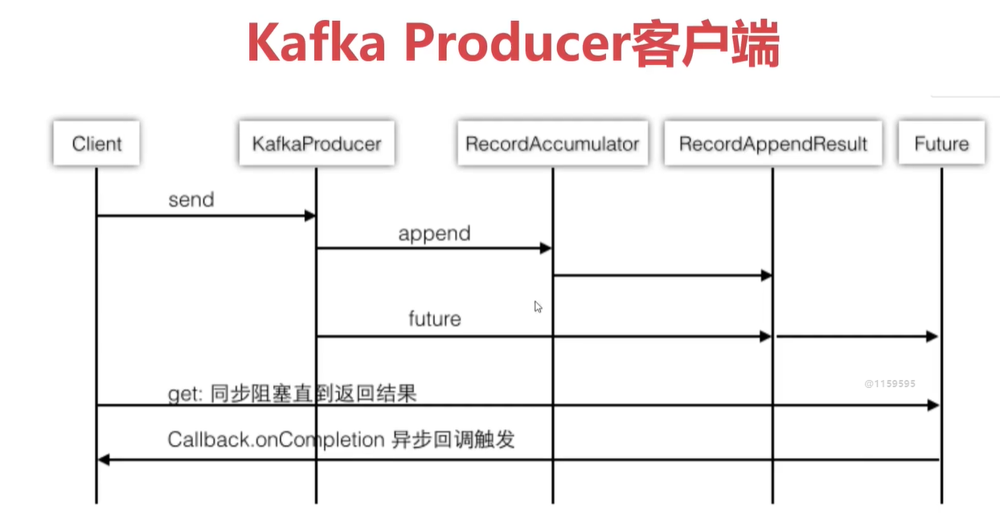

### 10.1.3、send业务流程图

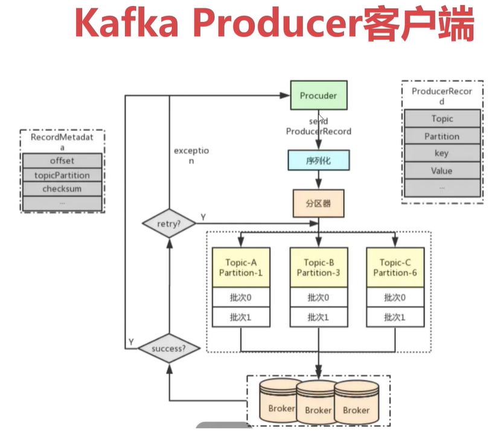

## 10.2、Consumer

- 单个分区的消息只能由ConsumerGroup中的某个Consumer消费。
- Consumer从Partition中消费消息是顺序，默认从开头开始消费。
- 单个ConsumerGroup会消费所有Partition中的消息。
- 非线程安全的【重点】


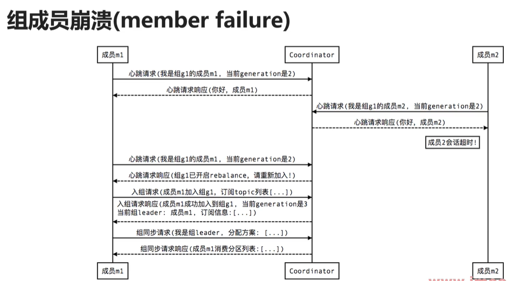

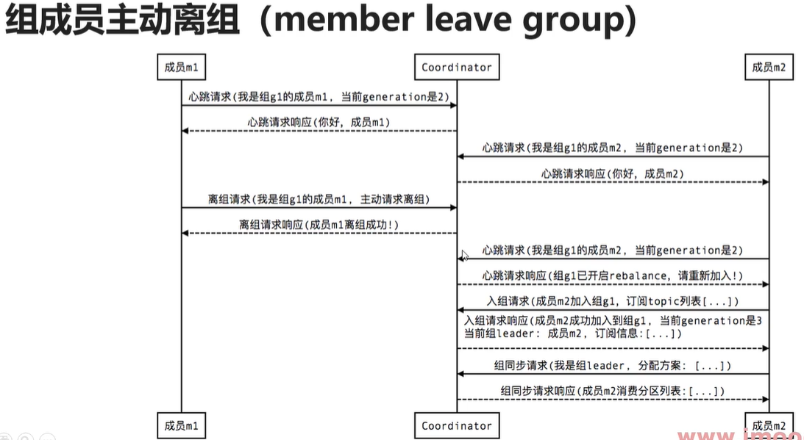

## 10.3、Stream

- Kafka Stream是处理分析存储在Kafka中的数据的客户端程序库
- Kafka Stream通过state store可以实现高效状态操作
- 支持原语Processor和高层抽象DSL

### 10.3.1、Kafka Stream关键词

- 流及流处理器
- 流处理拓扑
- 源处理器及Sink处理器

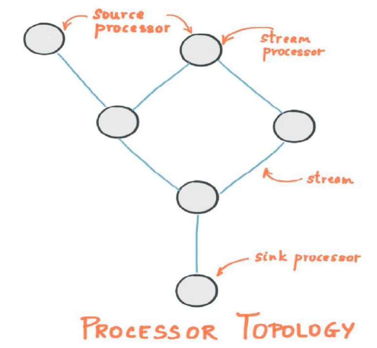


## 10.4、Connect

[Kafka连接器](https://www.confluent.io/hub/)

- Kafka Connect是Kafka流式计算的一部分
- Kafka Connect主要用来与其他中间件建立流式通道
- Kafka Connect支持流式和批量处理集成

如何配置一个kafka-connector？

第一步：下载连接器，https://www.confluent.io/hub/confluentinc/kafka-connect-jdbc

confluentinc-kafka-connect-jdbc-10.6.0.zip

第二步：准备MySQL的驱动包（5.x和8.x）

第三步：以上三者，上传到Kafka服务器，创建一个plugins目录`/usr/local/kafka/plugins`，用来存放

第四步：解压连接器，并把驱动包移动到连接器的解压目录`lib`下，当前：`/usr/local/kafka/plugins//usr/local/kafka/plugins/confluentinc-kafka-connect-jdbc-10.6.0`

第五步：修改Kafka配置`connect-distributed.properties`

```bash
# [修改]
bootstrap.servers=localhost:9092 ==> bootstrap.servers=emon:9092
# [新增]
rest.port=8083
# [新增]
plugin.path=/usr/local/kafka/plugins
```

第六步：启动

```bash
## connect启动命令
bin/connect-distributed.sh -daemon config/connect-distributed.properties
bin/connect-distributed.sh config/connect-distributed.properties
```

启动成功后，可以访问：

http://emon:8083/connector-plugins

查看任务：

http://emon:8083/connectors

创建任务：从mysql到kafka

```bash
curl -X POST -H 'Content-Type: application/json' -i 'http://emon:8083/connectors' \
--data \
'{"name":"emon-upload-mysql","config":{
"connector.class":"io.confluent.connect.jdbc.JdbcSourceConnector",
"connection.url":"jdbc:mysql://emon:3306/kafkadb?user=root&password=root123",
"table.whitelist":"users",
"incrementing.column.name": "id",
"mode":"incrementing",
"topic.prefix": "emon-mysql-"}}'
```

说明：

- `table.whitelist` 表名白名单，哪些表需要被加载
- `incrementing.column.name` 用于判断是否不断新增的列名字
- `mode`: 迭代模式，不断迭代的模式
- `topic.prefix` 主题前缀，生成kafka的topic时会用 topic.prefix + tableName 作为topicName；比如这里是`emon-mysql-users`

消费topic：

```bash
$ kafka-console-consumer.sh --bootstrap-server emon:9092 --topic emon-mysql-users --from-beginning
```


创建任务：从kafka到mysql

```bash
curl -X POST -H 'Content-Type: application/json' -i 'http://emon:8083/connectors' \
--data \
'{"name":"emon-download-mysql","config":{
"connector.class":"io.confluent.connect.jdbc.JdbcSinkConnector",
"connection.url":"jdbc:mysql://emon:3306/kafkadb?user=root&password=root123",
"topics":"emon-mysql-users",
"auto.create":"false",
"insert.mode": "upsert",
"pk.mode":"record_value",
"pk.fields":"id",
"table.name.format": "users_bak"}}'
```

说明：

- `auto.crete` 自动创建表


删除任务：

```bash
curl -X DELETE -i 'http://emon:8083/connectors/emon-download-mysql'
```

# 八十、Kafka最佳实践

## 80.1、配置推荐

### 80.1.1、服务端必要参数

| 参数              | 可选性 | 描述                                    |
| ----------------- | ------ | --------------------------------------- |
| zookeeper.connect | 必须   | 建议在kafka集群的每台机器都配置所有zk   |
| broker.id         | 必须   | 集群节点的标识符，不得重复，取值范围0~n |
| log.dirs          | 必须   | 不要使用默认的`/tmp/kafka-logs`         |

### 80.1.2、服务端推荐参数

| 参数                           | 描述                                                         |
| ------------------------------ | ------------------------------------------------------------ |
| advertised.host.name           | 注册到zk供用户使用的主机名，内网环境通常需要配置             |
| advertised.port                | 注册到zk供用户使用的服务端口                                 |
| num.partitions                 | 创建topic时默认的partition数量。默认值：1                    |
| default.replication.factor     | 自动创建topic的默认副本数量，建议至少修改为2。默认值：1      |
| min.insync.replicas            | 也即是ISR，提交生产者请求的最小副本数，建议至少2~3个。默认值：1 |
| unclean.leader.election.enable | 是否允许不具备ISR资格的replicas被选举为leader，建议false。默认值：false |
| controlled.shutdown.enable     | 在kafka收到stop命令或者异常终止时，允许自动同步数据，建议开启。默认值：true |

### 80.1.3、动态调整参数

| 参数                           | 描述                                                         |
| ------------------------------ | ------------------------------------------------------------ |
| unclean.leader.election.enable | 不严格的leader选举，有助于集群健壮，但是存在数据丢失风险。   |
| min.insync.replicas            | 如果同步状态的副本小于该值，服务器将不再接受 request.required.acks 为-1 或者 all的写入请求。 |
| max.message.bytes              | 单条消息的最大长度。如果修改了该值，那么 replica.fetch.max.bytes 和消费者的 max.partition.fetch.bytes 也要跟着修改。<br />另外，如果使用了 kafka-mirror-maker.sh 则生产者的 max.request.size 也要跟着同步修改 |
| cleanup.policy                 | 生命周期终结数据的处理。默认值：delete。                     |
| flush.messages                 | 强制刷新写入的最大缓存消息数。默认值：Long.MaxValue          |
| flush.ms                       | 强制刷新写入的最大等待时长。默认值：Long.MaxValue            |

### 80.1.4、客户端配置

Producer：ack、压缩、同步生产vs 异步生产、批处理大小（异步生产）

Consumer方面主要考虑：partition数量及获取消息的大小

### 80.1.5、记录同步/消费大尺寸消息的配置

- brokers端

```properties
message.max.bytes=15728640
replica.fetch.max.bytes=15728640
# 其他配置
log.flush.interval.messages=10000
log.flush.interval.ms=1000
log.retention.hours=24
log.retention.check.interval.ms=300000
```

- 消费者

```properties
fetch.max.bytes=2097152
fetch.max.wait.ms=1000
max.partition.fetch.bytes=15728640
```

- 生产者

```properties
max.request.size=15728640
partitioner.class=org.apache.kafka.clients.producer.RoundRobinPartitioner
```


## 80.2、服务器最佳实践

### 80.2.1、JVM参数建议

- 使用JVM的G1垃圾回收器

  ```bash
  # 查看Java垃圾回收器
  $ java -XX:+PrintCommandLineFlags -version
  # 命令输出
  -XX:InitialHeapSize=264990016 -XX:MaxHeapSize=4239840256 -XX:+PrintCommandLineFlags -XX:+UseCompressedClassPointers -XX:+UseCompressedOops -XX:-UseLargePagesIndividualAllocation -XX:+UseParallelGC
  java version "1.8.0_91"
  Java(TM) SE Runtime Environment (build 1.8.0_91-b15)
  Java HotSpot(TM) 64-Bit Server VM (build 25.91-b15, mixed mode)
  ```

- Java启动参数配置示例（24GB内存的四核英特尔至强处理器，8x7200转的SATA硬盘）

```bash
-Xmx6g -Xms6g -XX:MetaspaceSize=96m -XX:+UseG1GC-XX:MaxGCPauseMillis=20 -XX:InitiatingHeapOccupancyPercent=35 -XX:G1HeapRegionSize=16M -XX:MinMetaspaceFreeRatio=50 -XX:MaxMetaspaceFreeRatio=80
```

- 操作系统调优（以CentOS或Redhat为例）

1. 内存：建议使用64G内存的机器
2. CPU：尽量选择更多核，将会获得多核带来的更好的并发处理性能
3. 磁盘：RAID是优先推荐的，SSD也可以考虑
4. 网络：最好是万兆网络，千兆也可
5. 文件系统：ext4是最佳选择
6. 操作系统：任何Unix系统上运行良好，并且已经在Linux和Solaris上进行了测试


### 80.2.3、核心参数调整建议

- 文件描述符数量调整：(number_of_partitions) * (partition_size/segment_size)，建议100000以上

  > number_of_partitions ==> topic的分区数量
  >
  > partition_size ==> 
  >
  > segment_size ==> log.segment.bytes ==> 默认1G

- 最大套接字缓冲区大小

- pagecache：尽量分配与大多数日志的激活日志段大小一致

- 禁用swap

- 设计broker的数量：单broker上分区数<2000；分区大小，不要超过25G

- 设计partition数量

  - 至少和最大的消费者组中consumer的数量一致

  - 分区不要太大，小于25G

# 九十、Kafka Interview Guide

## 90.1、Kafka常见应用场景

类似问题：Kafka与其他消息中间件异同点

- Kafka概念及优劣势分析

  - Kafka概念：分布式流处理平台

  - Kafka特性一：提供发布订阅及Topic支持

  - Kafka特性二：吞吐量高但不保证消息有序（同一个partition有序，多个之间无序）

- Kafka常见应用场景

  - 日志收集或流式系统
  - 消息系统（如果对消息顺序不作要求）
  - 用户活动跟踪或运营指标监控

## 90.2、Kafka吞吐量为什么大？

类似问题：Kafka速度为什么快？

- Kafka面试题分析
  - 日志顺序读写和快速检索
  - Partition机制
  - 批量发送接收及数据压缩机制
  - 通过sendfile实现零拷贝原则

## 90.3、Kafka底层原理之日志

- Kafka的日志是以Partition为单位进行保存
- 日志目录格式为Topic名称+数字
  - 比如：`test-0`,`test-1`，表示test有2个分区，对应2个目录

- 日志文件格式是一个“日志条目”序列

  ```bash
  00000000000000000000.index
  00000000000000000000.log
  00000000000000000000.timeindex
  leader-epoch-checkpoint
  ```

- 每条日志消息由4字节整形与N字节消息组成

  ```bash
  message length : 4 bytes (value: 1+4+n) // 消息长度
  "magic" value  : 1 byte                 // 版本号
  crc            : 4 bytes                // CRC校验码
  payload        : n bytes	            // 具体的消息
  ```

- 日志分段
  - 每个Partition的日志会分为N个大小相等的segment
  - 每个segment中消息数量不一定相等
  - 每个Partition只支持顺序读写（磁盘的顺序读写，比内存的随机读写，快！）

## 90.4、Kafka零拷贝原理

零拷贝：所谓零拷贝，就是把两次多余的拷贝（2和3）忽略掉，应用程序可以直接把磁盘中的数据，从内核中直接传输到socket，而不需要再次经过应用程序所在的用户空间。

Linux系统中，零拷贝依赖于底层的sendfile()方法实现的。

- 四次拷贝

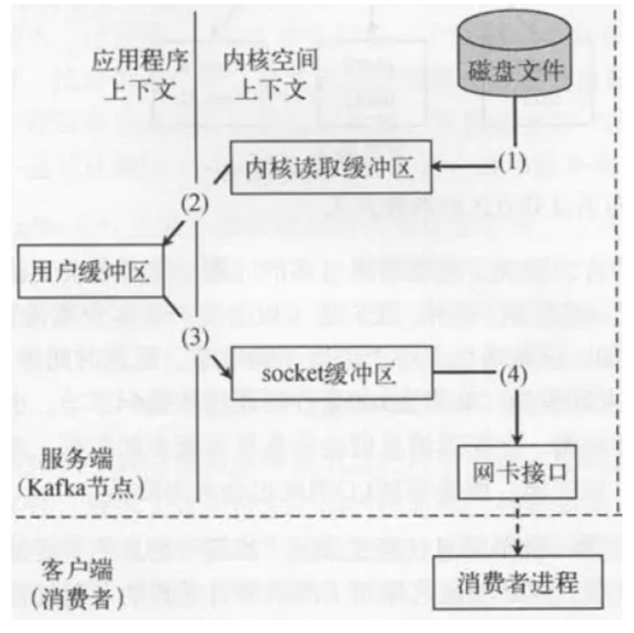

- 两次拷贝

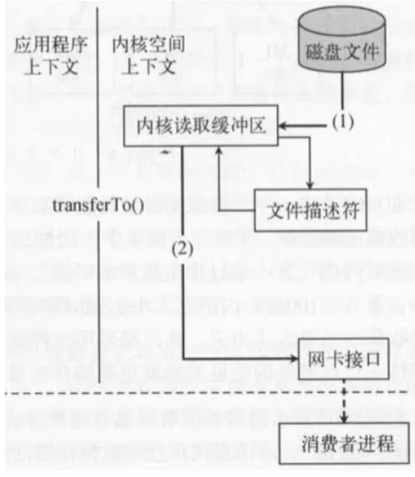

## 90.5、Kafka消费者组与消费者

- Kafka消费者组是Kafka消费的单位
- 单个Partition只能由消费者组中某个消费者消费
- 消费者组中的单个消费者可以消费多个Partition

## 90.6、Kafka生产者客户端

[Kafka Producer介绍](https://www.cnblogs.com/huxi2b/p/6364613.html)

- ProducerRecord

一个ProducerRecord表示一条待发送的消息记录，主要由5个字段构成：

| 字段      | 含义      |
| --------- | --------- |
| topic     | 所属topic |
| partition | 所属分区  |
| key       | 键值      |
| value     | 消息体    |
| timestamp | 时间戳    |

ProducerRecord允许用户在创建消息对象的时候就直接指定要发送的分区，这样producer后续发送该消息时可以直接发送到指定分区，而不用再通过Partitioner计算目标分区了。

另外，我们还可以直接指定消息的时间戳——但一定要慎重使用这个功能，因为它有可能会令时间戳索引机制失效。

- RecordMetadata

该类表示Kafka服务器端，返回给客户端的消息的元数据信息，包含以下内容：

| 字段                | 描述                   |
| ------------------- | ---------------------- |
| offset              | 该条消息的位移         |
| timestamp           | 消息时间戳             |
| topic+partition     | 所属topic的分区        |
| checksum            | 消息CRC32码            |
| serializedKeySize   | 序列化后的消息键字节数 |
| serializedValueSize | 序列化后的消息体字节数 |

上面 元数据信息前3项比较重要，producer端可以使用这些信息做一些消息发送成功之后的处理，比如写入日志等。

- 基本设计特点

结合源代码，Producer从设计上来讲有以下几个特点（或者说是优势）：

1. 总共创建两个线程：执行KafkaProducer.send逻辑的线程——我们称之为“用户主线程”；执行发送逻辑的IO线程——我们称之为“sender线程”。
2. 不同于Scala老版本的producer，新版本producer完全异步发送消息，并提供了回调机制（callback）供用户判断消息是否发送成功。
3. batching机制——“分批发送”机制。每个批次（batch）中包含了若干个PRODUCE请求，因此具有更高的吞吐量。
4. 跟家合理的默认分区策略：对于无key消息而言，Scala版本分区策略是一段时间内（默认是10分钟）将消息发往固定的目标分区，这容易造成消息分布的不均匀，而新版本的Producer采用轮询的方式均匀地将消息分发到不同的Partition。
5. 底层统一使用基于Selector的网络客户端实现，结合Java提供的Future实现完整地提供了更加健壮和优雅的生命周期管理。

- Kafka Producer客户端时序图

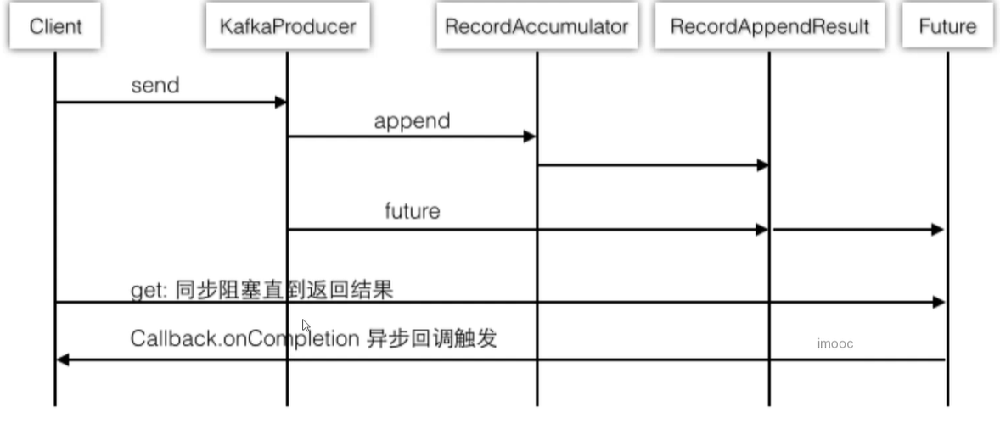

- Kafka Producer客户端流程图

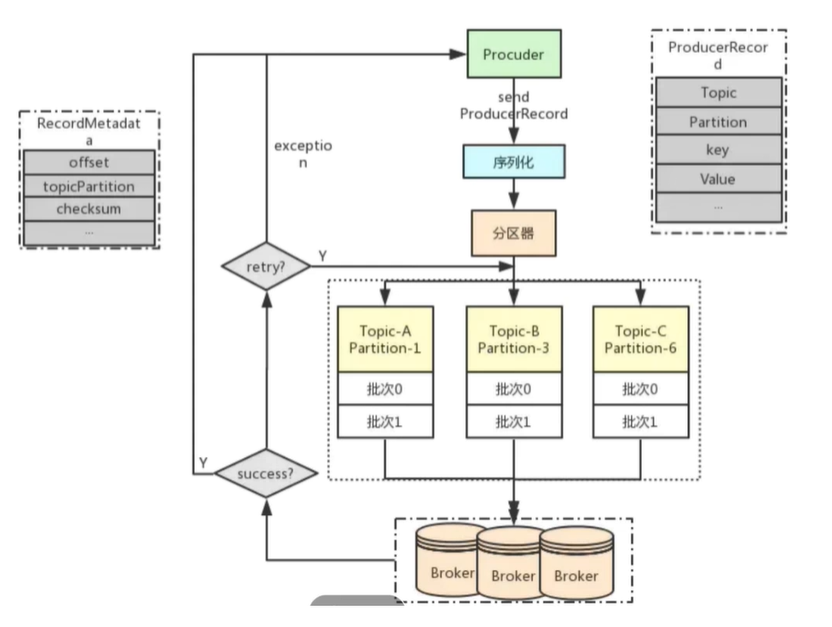

## 90.7、Kafka消息有序性处理

- Kafka的特性只支持Partition有序

- 使用Kafka Key + offset可以做到业务有序

## 90.8、Kafka Topic删除背后的故事

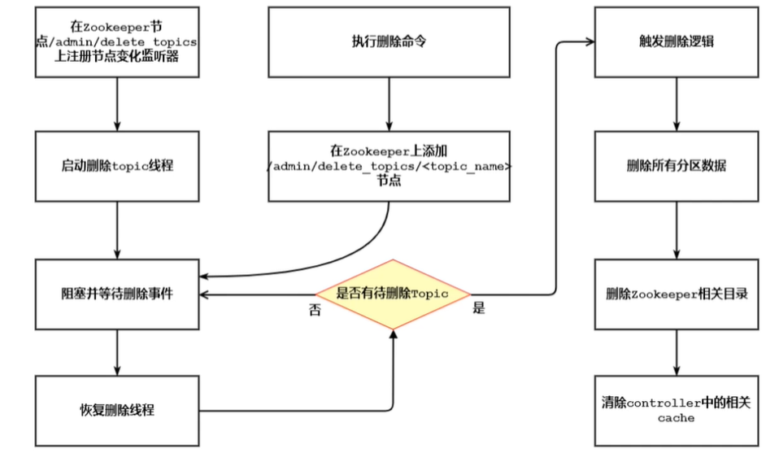

Kafka的Topic删除存在的问题会比较多，

建议设置`auto.create.topics.enable=false`

建议设置delete.topic.enable=true

建议先停掉流量，再执行删除！

## 90.9、Kafka消息重复消费和漏消费原理分析

本质上是offset控制出现了问题。

- 重复消费常见场景

  - 人为原因，尤其是在Consumer的使用上

  - 程序处理原因，尤其是单次消费超时的情况

  - Kafka机制：消费者重平衡时offset未控制好

## 90.10、Kafka消费者线程安全性分析

- Kafka的Consumer不是线程安全的
- Kafka的Consumer并发消费的两种方式
  - 多Consumer多线程【推荐】
  - 单Consumer多线程

## 90.11、Kafka Leader选举分析

### 90.11.1、选举分析

- Kafka并没有采用多数投票来选举Leader（ZK、ES、Redis采用多数投票方式选举）

  - 原因1：防止选举时，选举到了数据不全的broker；比如有三个节点，其中2个有10000条数据，另外1个只有9000条数据，如果采取多数投票选到了9000条的节点，就会导致丢失1000条数据。**也即，新的Leader必须要尽量包含所有消息，即消息完整性**。
  - 原因2：当选举没有通过一轮就产生时（比如平票、弃票），需要额外的第二轮、第三轮甚至更多次，比较耗费时间。**也即，不能产生过多的冗余导致过多的磁盘IO**。

- Kafka为了保证数据一致性，使用了ISR机制

  - 首先我们知道Kafka的数据是多副本的，某个topic的replication-factor为N，且N大于1时，每个Partition都会有N个副本（Replica）。Kafka的Replica包含Leader与Follower。每个topic下的每个分区下都有一个Leader和（N-1）个Follower。
  - 每个Follower的数据都是同步Leader的，这里需要注意，**是Follower主动拉取Leader的数据**。
  - Replical的个数小于等于Broker的个数，也就是说，对于每个Partition而言，每个Broker上最多只会有一个Replica，因此可以使用Broker id指定Partition的Replica。

- Kafka会动态维护一组Leader数据的同步副本ISR(In-Sync Replicas)

  - 条件1：（0.9x开始启用）根据副本和Leader的交互时间差，如果大于某个时间差，就认定这个副本不行了，从ISR剔除。

  > 时间差参数：
  > replica.lag.time.max.ms=10000
  > 也就是默认10s，isr中的follow没有向isr发送心跳包就会被移除

  - 条件2：（0.9x开始已废弃）根据Leader和副本的信息条数差值决定是否从ISR中剔除此副本，此信息条数差值根据配置参数

  > replica.lag.max.messages=4000
  >
  > 也就是默认消息差值大于4000会被移除
  >
  > 【已废弃】避免极端情况下，producer一次性发来1万条消息，会大于4000，而导致同步副本被剔除

### 90.11.2、选举原理

​	早起Kafka的版本是直接用Zookeeper来完成选举的。利用了Zookeeper的Watch机制；节点不允许重复写入以及临时节点这些特性。这样实现比较简单，省事。但是也会有一定的弊端，比如分区和副本数量过多，所有的副本都直接参与选举的话，一旦某个出现节点的增减，就会造成大量的Watch事件被触发，ZooKeeper的就会负载过重，不堪重负。

​	新版本的Kafka中换了一种实现方式。不是所有的Repalica都参与Leader选举，而是由其中的一个Broker统一来指挥，这个Broker的角色就叫做Controller控制器。

​	Kafka要先从所有Broker中选出唯一的一个Controller。所有的Broker会尝试在ZooKeeper中创建临时节点`/controller`，谁先创建成功，谁就是Controller。一旦创建成功，其他节点继续watch。那如果Controller挂掉或者网络出现问题，ZooKeeper上的临时节点就会消失。其他的Broker通过Watch监听到Controller下线后，继续按照先到先得的原则竞争Controller。这个Controller就相当于选举委员会的主席。

当一个节点成为Controller之后，他就会承担以下职责：

监听Broker变化、监听Topic变化、监听Partition变化、获取和管理Broker、Topic、Partition的信息、管理Partition的主从信息。

### 90.11.3、选举规则

​	Controller确定以后，就可以开始做分区选主的事情。接下来就是找候选人。显然，每个Replica都想推荐自己，但不是所有的Replica都有竞选资格。只有在ISR（In-Sync Replicas）保持心跳同步的副本才有资格参与竞选。就好比是皇帝每天着急皇子们开早会，只有每天来打开的皇子才能加入ISR。

​	接下来，就是Leader选举，就相当于要在众多皇子中选出太子。在分布式选举中，有非常多的选举协议，比如ZAB、Raft等，他们的思想归纳起来就是：先到先得，少数服从多数。但是Kafka没有用这些方法，而是用了一种自己实现的算法。

​	提到Kafka官方的解释是，它的选举算法和微软的PacificA算法最相近。大致意思就是，默认是让ISR中的第一个Replica变成Leader。比如ISR是1、5、9，优先让1成为Leader。这个跟中国古代皇帝船尾是一样的，优先传给皇长子。

​	假设，我们创建一个4个分区2个副本的Topic，它的Leader分布是这样的，如图所示：

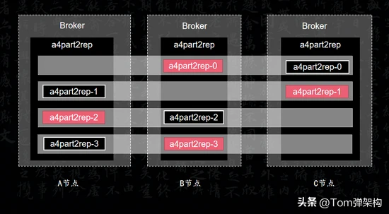

​	第1个分区的副本Leader，落在B节点上。第2个分区的副本Leader落在C节点上，第3个分区的副本Leader落在A节点上，第4个分区的副本Leader落在B节点上。如果有更多副本，就以此类推。我们发现Leader的选举的规则相当于蛇形走位。

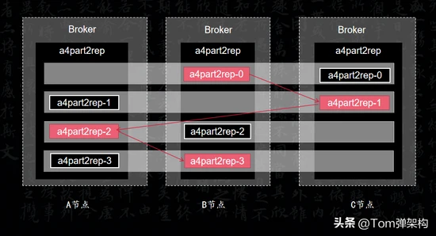

​	这样设计的好处是可以提高数据副本的容灾能力。将Leader和副本完全错开，从而不至于一挂全挂。

- Kafka之Partition选举

所有Partition的Leader选举都由Controller决定。Controller会将Leader的改变直接通过RPC的方式通知需为此作为响应的Broker。Partition的选举过程主要为从Zookeeper中读取当前分区的所有ISR集合，调用配置的分区选择算法选择分区的Leader。

- Leader选举配置建议
  - ISR中副本全部宕机，会启用Unclean Leader（也即在ISR之外找一个Follower作为Leader）选举。生产上应该禁用Unclean Leader。手动指定最小的ISR（`min.insync.replicas`默认值1）。
  - `unclean.leader.election.enable`的默认值是false，指示是否在万不得已的情况下**也不启用**不在ISR集中的副本作为领导者，避免导致数据丢失。

## 90.12、Kafka幂等性源码分析

- 什么是幂等性

如果服务器收到接口的重试，能被认为是同一个请求处理，就是幂等性。

- Kafka为什么会产生幂等性问题

Producer设置acks=-1会期望所有ISR（同步replicas）都收到数据的确认，如果有一个没有确认会导致重发。

- Kafka有哪些幂等性问题
  - 单体幂等性依赖pid（ProducerId)和sequenceNumber（批次）
  - 单体幂等性相关配置：ProducerConfig级别的`enable.idempotence=true`，该属性默认值：false
  - 全局性幂等性依赖事务保证

## 90.13、Kafka事务支持实现及原理分析

- 什么是事务

事务提供的安全性保障是经典的 ACID，

即**原子性（Atomicity）、一致性 (Consistency)**、**隔离性 (Isolation)** 和**持久性 (Durability)**。

- Kafka隔离级别

**已提交读（read committed）隔离级别**

所谓的 read committed，指的是当读取数据库时，只能看到已提交的数据，即无脏读。

同时，当写入数据库时，只能覆盖掉已提交的数据，即无脏写。

**目前kafka是已提交读（read committed）隔离级别**,

能保证多条消息原子性地写入到目标分区，同时也能保证 Consumer 只能看到事务成功提交的消息。

- 事务型Producer

事务型 Producer 能够保证将**消息原子性地写入到多个分区中**。这批消息要么**全部写入成功，要么全部失败**。另外，事务型 Producer 也不惧进程的重启。Producer 重启回来后，Kafka 依然保证它们发送消息的精确一次处理。

- Kafka事务实现方式

  - 添加`transactional_id`配置和`retries`配置

    ```bash
    # 要求retries必须大于0
    retries=2
    transactional.id=emon-trans-id
    ```

  - 完成事务的初始化和开启

    ```bash
    # 初始化事务
    kafkaProducer.initTransactions();
    # 事务开启
    kafkaProducer.beginTransaction();
    ```

  - 事务完成记得Commit或者abort

    ```bash
    # 事务提交
    kafkaProducer.commitTransaction();
    # 事务回滚
    kafkaProducer.abortTransaction()
    ```

  - 事务实现的核心是Coordinator

示例代码：

```java
// 其他配置
// ......
// 1、事务支持配置
properties.put(ProducerConfig.RETRIES_CONFIG, "2"); // 不为0即可
properties.put(ProducerConfig.TRANSACTIONAL_ID_CONFIG, "emon-trans-id");

// Producer的主对象
KafkaProducer<String, String> kafkaProducer = new KafkaProducer<>(properties);

// 2、初始化事务
kafkaProducer.initTransactions();
try {
    // 3、事务开启
    kafkaProducer.beginTransaction();
    // 消息对象 - ProducerRecord
    for (int i = 0; i < 10; i++) {
        String key = "key-" + i;
        String value = "value-" + i;
        ProducerRecord<String, String> record = new ProducerRecord<>(TOPIC_NAME, key, value);
        kafkaProducer.send(record);
        if (i == 8) {
            throw new Exception();
        }
    }
    // 4-1、事务提交
    kafkaProducer.commitTransaction();
} catch (Exception e) {
    e.printStackTrace();
    // 4-2、事务回滚
    kafkaProducer.abortTransaction();
} finally {
    // 所有的通道打开都需要关闭
    kafkaProducer.close();
}
```

## 90.14、ZooKeeper在Kafka中的作用

​	Kafka集群是指Broker集群，Producer和Consumer对Kafka来讲都只是客户端。ZooKeeper只管理Broker、Consumer，他们在ZooKeeper上都真实存在具体数据；Producer端直接连接Broker，不在ZooKeeper上存放任何数据，只注册监听，监听Broker和Topic信息。只有在ZooKeeper节点上存放了数据才算被ZooKeeper管理，只注册监听的不算被ZooKeeper管理。

### 90.14.1、ZooKeeper有哪些常见的作用？

- 分布式组件间的数据通信
- 集中式的元数据管理
- 服务发现/注册中心
- HA自动选主
- 分布式锁

### 90.14.2、Kafka使用到了哪些ZooKeeper功能

- 分布式组件间的数据通信：ISR更新过程中的数据通信
- 集中式的元数据管理：元数据分层管理
- HA自动选主：Controller的自动选主

### 90.14.3、ISR的更新过程中ZooKeeper起到的作用

​	ISR更新过程中，先是更新了ISR的元数据信息，然后把更新动作写到了notification节点上，最后由controller节点感知到notification节点的变化后，开始进行集群内的元数据更新。这便是由【Node节点数据存储 + Watcher回调机制】实现的一个经典的组件之间数据通信的使用案例。

### 90.14.4、元数据管理时ZooKeeper起到的作用

​	Kafka的元数据管理，是进行分层管理的，也就是大体上分为cluster->broker->topic->partition->state->isr...

​	那么，ZooKeeper的树形数据结构，就天然适用于这种形式的数据保存。同时，ZooKeeper还可以保障元数据的顺序一致性，以及数据的持久性，这都得益于ZooKeeper原本的机制。

​	而且，由于ZooKeeper的Watcher回调机制，还可以很快的感知到元数据信息的变化，从而快速的去更新集群内的元数据，让各个broker快速更新最新的元数据。

​	但是ZooKeeper的这种机制也会导致大量的并发写操作，因此ZooKeeper只能适用于中小集群的元数据管理，这也是为什么Kafka要去ZooKeeper的原因之一。

### 90.14.5、Controller的HA中ZooKeeper的作用

​	broker 启动的时候，都会去尝试创建 /controller 这么一个临时节点，由于 zk 的本身机制，哪怕是并发的情况下，也只会有一个broker 能够创建成功。

​	因此创建成功的那个就会成为 controller，而其余的 broker 都会对这 controller 节点加上一个 Watcher，一旦原有的 controller 出问题，临时节点被删除，那么其他 broker 都会感知到从而进行新一轮的竞争，谁先创建那么谁就是新的 controller。

​	当然，在这个重新选举的过程中，有一些需要 controller 参与的动作就无法进行，例如元数据更新等等。需要等到 controller 竞争成功并且就绪后才能继续进行，所以 controller 出问题对 kafka 集群的影响是不小的。

# 九十九、Kafka配置全解析

Kafka中提供了`listeners`和`advertised.listeners`两个配置项，两个配置项的具体含义和作用是什么？有什么区别，以及应该如何进行配置呢？

【概念理解】

要搞清楚这些问题，首先得搞清楚两个逻辑概念：一个是Kafka的侦听ip，一个是Kafka的`broker ip`。

所谓Kafka的侦听ip，顾名思义，就是tcp的侦听ip。可以在某个固定的ip上侦听，也可以是全网段进行侦听（0.0.0.0）。如果是在某个固定ip上侦听，例如`127.0.0.1`，那么只有与该ip正确连接的客户端能够成功连接到Kafka；而如果是全网段侦听，那么可以与Kafka所在机器的任意ip进行连接并访问Kafka。

但是，与Kafka连接成功后，并不意味着就能成功进行生产和消费。

成功连接Kafka的侦听ip，意味着tcp的三次握手已经成功了，在这之后会进行Kafka层面的协议交互，例如用户登录认证，元数据信息获取，向topic生产和消费等等。其中最重要的就是元数据信息的获取。

Kafka的元数据信息包括topic名称，topic的分区（partition），每个分区的Leader所在的broker的id，以及每个broker的ip地址等。

由于向topic的分区进行生产消费，最终都需要与分区的Leader进行交互。因此，获取到元数据信息后，客户端（生产者或者消费者）会和topic分区的Leader所在的broker建立新的tcp连接以进行后续的生产消费。这就是Kafka的broker ip的作用，也即真正用于生产消费的ip地址。

## 99.1、[Broker Configs](https://kafka.apache.org/25/documentation.html#brokerconfigs)

必须的配置项：

- `broker.id`
- `log.dirs`
- `zookeeper.connect`

主题级的配置和默认值如下：

| 属性                                                        | 默认值                        | 描述                                                         |
| ----------------------------------------------------------- | ----------------------------- | ------------------------------------------------------------ |
| zookeeper.connect                                           |                               | ZooKeeper连接字符串的格式为：`hostname:port`，此处hostname和port分别是ZooKeeper集群中某个节点的host和port；为了当某个host当掉之后你能通过其他ZooKeeper节点进行连接，你可以按照以下方式指定多个主机：`hostname1:port1,hostname2:port2,hostname2:port3`。<br />ZooKeeper允许你增加一个“chroot”路径，将集群中所有Kafka数据存放在特定的路径下。当多个Kafka集群或者其他应用使用相同ZooKeeper集群时，可以使用这个方式设置数据存放路径。这种方式的实现可以通过这样设置连接字符串格式，如下所示：`hostname1:port1,hostname2:port2,hostname3:port3/chroot/path` 这样设置就将所有Kafka集群数据存放在`/chroot/path`路径下。注意，在你启动broker之前，你必须创建这个路径，并且consumers必须使用相同的连接格式。 |
| advertised.host.name                                        | null                          | 【已废弃】，仅当`advertised.listeners`或`listeners`未设置时启用；目前已使用`advertised.listeners`替代。发布到ZooKeeper以供客户端使用的Hostname。在IaaS环境下，该值可能需要与broker绑定的接口不同。该值未设置情况下，如果`host.name`配置了，则使用`host.name`；否则，将使用`java.net.InetAddress.getCanonicalHostName()`返回的值。 |
| advertised.listeners                                        | null                          | 给客户端用的发布至ZooKeeper的监听，broker会上送此地址到ZooKeeper，ZooKeeper会将此地址提供给消费者，消费者根据此地址获取消息。如果和`listeners`不同，则以此为准，在IaaS环境，此配置项可能和broker绑定的接口主机名不同，如果此配置项没有配置则以`listeners`为准。 |
| advertised.port                                             | null                          | 【已废弃】，仅当`advertised.listeners`或`listeners`未设置时启用；目前已使用`advertised.listeners`替代。发布到ZooKeeper以供客户端使用的端口号。在IaaS环境下，该值可能需要与broker绑定的接口不同。如果该值未设置，则发布的端口与broker绑定的端口相同。 |
| auto.create.topics.enable                                   | true                          | 启用服务端自动创建topic。                                    |
| auto.leader.rebalance.enable                                | true                          | 是否允许定期进行leader选举。                                 |
| background.threads                                          | 10                            | 用于各种后台处理任务的线程数。                               |
| broker.id                                                   | -1                            | 服务端的broker id。如果未设置，一个唯一的broker id将生成。为了避免ZooKeeper生成的broker id和用户配置的broker id之间产生冲突，生成的broker id从`reserved.broker.max.id`+1开始。 |
| compression.type                                            | producer                      | 对给定的topic指定压缩类型。可接受的值有('gzip','snappy','lz4','zstd')。另外，还可以接收`uncompressed`表示不压缩，以及`producer`表示保留生产者的原始压缩编解码器。 |
| control.plane.listener.name                                 | null                          | 用于Controller和Broker之间通信的监听器名称，Broker将会使用该配置来定位监听列表中的EndPoint。如果未设置，则默认使用`inter.broker.listener.name`来通信，没有专门的链接。 |
| delete.topic.enable                                         | true                          | 启用删除topic。如果关闭此配置项，通过管理工具删除主题将无效。 |
| host.name                                                   | ""                            | 【已弃用】仅在listeners未设置时使用。使用listeners替代了。broker的hostname，如果设置了，将绑定到该地址上。如果未设置，绑定到所有网卡上。 |
| leader.imbalance.check.interval.seconds                     | 300                           | 默认300s，也即5分钟扫描一次，控制器触发分区再平衡检查的频率。 |
| leader.imbalance.per.broker.percentage                      | 10                            | 每个broker所能允许的leader失衡比率。如果超过该百分比，控制器将触发leader重新平衡。 |
| listeners                                                   | null                          | 监听列表，broker对外提供服务时绑定的ip和端口。多个之间逗号分隔，如果监听器名称不是一个安全的协议，`listener.security.protocol.map`必须设置。主机名设置为0.0.0.0表示绑定所有接口，主机名为空这绑定默认的接口。例如：`PLAINTEXT://myhost:9092,SSL://:9091`<br />`CLIENT://0.0.0.0:9092,REPLICATION://localhost:9093` |
| log.dir                                                     | /tmp/kafka-logs               | 日志数据的存储目录，对`log.dirs`的补充。                     |
| log.dirs                                                    | null                          | 日志数据的存放目录，如果未设置，将使用`log.dir`。            |
| log.flush.interval.messages                                 | Long.MaxValue                 | 消息刷新到磁盘之前，日志分区上积累的消息数量。               |
| log.flush.interval.ms                                       | null                          | 消息刷新到磁盘之前，日志在内存中停留的最大毫秒数。如果未设置，将使用`log.flush.scheduler.interval.ms`。 |
| log.flush.offset.checkpoint.interval.ms                     | 60000                         | 用于更新日志恢复点持久记录的频率。                           |
| log.flush.scheduler.interval.ms                             | Long.MaxValue                 | 检测日志是否需要刷新到磁盘的频率，单位毫秒                   |
| log.flush.start.offset.checkpoint.interval.ms               | 60000                         | 更新日志持久化日志记录的开始偏移量的频率                     |
| log.retention.bytes                                         | -1                            | 日志被删除之前的最大尺寸，即日志保留的最大大小               |
| log.retention.hours                                         | 168                           | 日志文件删除之前保留的时间，单位小时                         |
| log.retention.minutes                                       | null                          | 日志文件删除之前保留的时间，单位分钟；未设置默认使用`log.retention.hours` |
| log.retention.ms                                            | null                          | 日志文件删除之前保留的时间，单位毫秒；未设置默认使用`log.retention.minutes`，-1表示永久 |
| log.roll.hours                                              | 168                           | 在新日志segment展开之前的最大时间，单位：小时                |
| log.roll.ms                                                 | null                          | 新日志segment展开之前的最大时间，单位：毫秒；如果未设置，`log.roll.hours`将被使用。 |
| log.roll.jitter.hours                                       | 0                             | 指定日志切分段的小时数，避免日志切分时造成惊群               |
| log.roll.jitter.ms                                          | null                          | 指定日志切分段的毫秒数，如果不设置，默认使用log.roll.jitter.hours |
| log.segment.bytes                                           | 1073741824（1G）              | 单个日志文件的最大尺寸                                       |
| log.segment.delete.delay.ms                                 | 60000                         | 日志文件被真正删除之前保留的时间                             |
| message.max.bytes                                           | 1048588（约1M）               | 最大记录批大小                                               |
| min.insync.replicas                                         | 1                             | 当生产者acks为-1(all)时，该值指定了最小副本数量，这些副本必须确认写操作，才能认为写操作成功。如果不能满足这个最小值，那么生产者将抛出异常。 |
| num.io.threads                                              | 8                             | 服务器用于处理请求的线程数，其中可能包括磁盘I/O。            |
| num.network.threads                                         | 3                             |                                                              |
| num.recovery.threads.per.data.dir                           | 1                             |                                                              |
| num.replica.alter.log.dirs.threads                          | null                          |                                                              |
| num.replica.fetchers                                        | 1                             |                                                              |
| offset.metadata.max.bytes                                   | 4096                          |                                                              |
| offsets.commit.required.acks                                | -1                            |                                                              |
| offsets.commit.timeout.ms                                   | 5000                          |                                                              |
| offsets.load.buffer.size                                    | 5242880（5M）                 |                                                              |
| offsets.retention.check.interval.ms                         | 600000                        |                                                              |
| offsets.retention.minutes                                   | 10080                         |                                                              |
| offsets.topic.compression.codec                             | 0                             |                                                              |
| offsets.topic.num.partitions                                | 50                            |                                                              |
| offsets.topic.replication.factor                            | 3                             |                                                              |
| offsets.topic.segment.bytes                                 | 104857600（100M）             |                                                              |
| port                                                        | 9092                          |                                                              |
| queued.max.requests                                         | 500                           |                                                              |
| quota.consumer.default                                      | Long.MaxValue                 |                                                              |
| quota.producer.default                                      | Long.MaxValue                 |                                                              |
| replica.fetch.min.bytes                                     | 1                             |                                                              |
| replica.fetch.max.bytes                                     | 1048576                       |                                                              |
| replica.high.watermark.checkpoint.interval.ms               | 5000                          |                                                              |
| replica.lag.time.max.ms                                     | 30000                         |                                                              |
| replica.socket.receive.buffer.bytes                         | 65536                         |                                                              |
| replica.socket.timeout.ms                                   | 30000                         |                                                              |
| rerquest.timeout.ms                                         | 30000                         |                                                              |
| socket.receive.buffer.bytes                                 | 102400                        |                                                              |
| socket.request.max.bytes                                    | 104857600                     |                                                              |
| socket.send.buffer.bytes                                    | 102400                        |                                                              |
| transaction.max.timeout.ms                                  | 900000                        |                                                              |
| transaction.state.log.load.buffer.size                      | 5242880                       |                                                              |
| transaction.state.log.min.isr                               | 2                             |                                                              |
| transaction.state.log.num.partitions                        | 50                            |                                                              |
| transaction.state.log.replication.factor                    | 3                             |                                                              |
| transaction.state.log.segment.bytes                         | 104857600                     |                                                              |
| transaction.id.expiration.ms                                | 604800000                     |                                                              |
| unclean.leader.election.enable                              | false                         | 指示是否在万不得已的情况下启用不在ISR集中的副本作为领导者，即使这样做可能会导致数据丢失。 |
| zookeeper.connection.timeout.ms                             | null                          |                                                              |
| zookeeper.max.in.flight.requests                            | 10                            |                                                              |
| zookeeper.session.timeout.ms                                | 18000                         |                                                              |
| zookeeper.set.acl                                           | false                         |                                                              |
| broker.id.generation.enable                                 | true                          |                                                              |
| broker.rack                                                 | null                          |                                                              |
| connections.max.idle.ms                                     | 600000                        |                                                              |
| connections.max.reauth.ms                                   | 0                             |                                                              |
| controlled.shutdown.enable                                  | true                          |                                                              |
| controlled.shutdown.max.retries                             | 3                             |                                                              |
| controlled.shutdown.retry.backoff.ms                        | 5000                          |                                                              |
| controller.socket.timeout.ms                                | 30000                         |                                                              |
| default.replication.factor                                  | 1                             |                                                              |
| delegation.token.expiry.time.ms                             | 86400000                      |                                                              |
| delegation.token.master.key                                 | null                          |                                                              |
| delegation.token.max.lifetime.ms                            | 604800000                     |                                                              |
| delete.records.purgatory.purge.interval.requests            | medium                        |                                                              |
| fetch.max.bytes                                             | 57671680                      |                                                              |
| fetch.purgatory.purge.interval.requests                     | 1000                          |                                                              |
| group.initial.rebalance.delay.ms                            | 3000                          |                                                              |
| group.max.session.timeout.ms                                | 1800000                       | 注册消费者允许的`session.timeout.ms`的最大值。更长的超时时间让消费者有更多的时间在心跳之间处理消息，但代价是检测失败的时间更长。 |
| group.max.size                                              | Long.MaxValue                 |                                                              |
| group.min.session.timeout.ms                                | 6000                          | 注册消费者允许的`session.timeout.ms`的最小值。更短的超时时间会导致更快的故障检测，代价是更频繁的消费者心跳，这可能会压垮代理资源。 |
| inter.broker.listener.name                                  | null                          |                                                              |
| inter.broker.protocol.version                               | 2.5-IV0                       |                                                              |
| log.cleaner.backoff.ms                                      | 15000                         |                                                              |
| log.cleaner.dedupe.buffer.size                              | 134217728                     |                                                              |
| log.cleaner.delete.retention.ms                             | 86400000                      |                                                              |
| log.cleaner.enable                                          | true                          |                                                              |
| log.cleaner.io.buffer.load.factor                           | 0.9                           |                                                              |
| log.cleaner.io.buffer.size                                  | 524288                        |                                                              |
| log.cleaner.io.max.bytes.per.second                         | Double.MaxValue               |                                                              |
| log.cleaner.max.compaction.lag.ms                           | Long.MaxValue                 |                                                              |
| log.cleaner.min.cleanable.ratio                             | 0.5                           |                                                              |
| log.cleaner.min.compaction.log.ms                           | 0                             |                                                              |
| log.cleaner.threads                                         | 1                             |                                                              |
| log.cleanup.policy                                          | delete                        |                                                              |
| log.index.interval.bytes                                    | 4096                          |                                                              |
| log.index.size.max.bytes                                    | 10485760                      |                                                              |
| log.message.format.version                                  | 2.5-IV0                       |                                                              |
| log.message.timestamp.difference.max.ms                     | Long.MaxValue                 |                                                              |
| log.message.timestamp.type                                  | CreateTime                    |                                                              |
| log.preallocate                                             | false                         |                                                              |
| log.retention.check.interval.ms                             | 300000                        |                                                              |
| max.connections                                             | Log.MaxValue                  |                                                              |
| max.connections.per.ip                                      | Log.MaxValue                  |                                                              |
| max.connections.per.ip.overrides                            | ""                            |                                                              |
| max.incremental.fetch.session.cache.slots                   | 1000                          |                                                              |
| num.partitions                                              | 1                             |                                                              |
| password.encoder.old.secret                                 | null                          |                                                              |
| password.encoder.secret                                     | null                          |                                                              |
| principal.builder.class                                     | null                          |                                                              |
| producer.purgatory.purge.interval.requests                  | 1000                          |                                                              |
| queued.max.request.bytes                                    | -1                            |                                                              |
| replica.fetch.backoff.ms                                    | 1000                          |                                                              |
| replica.fetch.max.bytes                                     | 1048576                       |                                                              |
| replica.fetch.response.max.bytes                            | 10485760                      |                                                              |
| replica.selector.class                                      | null                          |                                                              |
| reserved.broker.max.id                                      | 1000                          |                                                              |
| sasl.client.callback.handler.class                          | null                          |                                                              |
| sasl.enabled.mechanisms                                     | GSSAPI                        |                                                              |
| sasl.jaas.config                                            | null                          |                                                              |
| sasl.kerberos.kinit.cmd                                     | /usr/bin/kinit                |                                                              |
| sasl.kerberos.min.time.before.relogin                       | 60000                         |                                                              |
| sasl.kerberos.principal.to.local.rules                      | DEFAULT                       |                                                              |
| sasl.kerberos.service.name                                  | null                          |                                                              |
| sasl.kerberos.ticket.renew.jitter                           | 0.05                          |                                                              |
| sasl.kerberos.ticket.renew.window.factor                    | 0.8                           |                                                              |
| sasl.login.callback.handler.class                           | null                          |                                                              |
| sasl.login.class                                            | null                          |                                                              |
| sasl.login.refresh.buffer.seconds                           | 300                           |                                                              |
| sasl.login.refresh.min.period.seconds                       | 60                            |                                                              |
| sasl.login.refresh.window.factor                            | 0.8                           |                                                              |
| sasl.login.refresh.window.jitter                            | 0.05                          |                                                              |
| sasl.mechanism.inter.broker.protocol                        | GSSAPI                        |                                                              |
| sasl.server.callback.handler.class                          | null                          |                                                              |
| security.inter.broker.protocol                              | PLAINTEXT                     |                                                              |
| ssl.cipher.suites                                           | ""                            |                                                              |
| ssl.client.auth                                             | none                          |                                                              |
| ssl.enabled.protocols                                       | TLSv1.2                       |                                                              |
| ssl.key.password                                            | null                          |                                                              |
| ssl.keymanager.algorithm                                    | SunX509                       |                                                              |
| ssl.keystore.location                                       | null                          |                                                              |
| ssl.keystore.password                                       | null                          |                                                              |
| ssl.keystore.type                                           | JKS                           |                                                              |
| ssl.protocol                                                | TLSv1.2                       |                                                              |
| ssl.provider                                                | null                          |                                                              |
| ssl.trustmanager.algorithm                                  | PKIX                          |                                                              |
| ssl.truststore.location                                     | null                          |                                                              |
| ssl.truststore.password                                     | null                          |                                                              |
| ssl.truststore.type                                         | JKS                           |                                                              |
| zookeeper.clientCnxnSocket                                  | null                          |                                                              |
| zookeeper.ssl.client.enable                                 | false                         |                                                              |
| zookeeper.ssl.keystore.location                             | null                          |                                                              |
| zookeeper.ssl.keystore.password                             | null                          |                                                              |
| zookeeper.ssl.keystore.type                                 | null                          |                                                              |
| zookeeper.ssl.truststore.location                           | null                          |                                                              |
| zookeeper.ssl.truststore.password                           | null                          |                                                              |
| zookeeper.ssl.truststore.type                               | null                          |                                                              |
| alter.config.policy.class.name                              | null                          |                                                              |
| alter.log.dirs.replication.quota.window.num                 | 11                            |                                                              |
| alter.log.dirs.replication.quota.window.size.seconds        | 1                             |                                                              |
| authorizer.class.name                                       | ""                            |                                                              |
| client.quota.callback.class                                 | null                          |                                                              |
| connection.failed.authentication.delay.ms                   | 100                           |                                                              |
| create.topic.policy.class.name                              | null                          |                                                              |
| delegation.token.expiry.check.interval.ms                   | 3600000                       |                                                              |
| kafka.metrics.polling.interval.secs                         | 10                            |                                                              |
| kafka.metrics.reporters                                     | ""                            |                                                              |
| listener.security.protocol.map                              | SSL:SSL,SASL_SSL:SASL_SSL,... |                                                              |
| log.message.downconversion.enable                           | true                          |                                                              |
| metric.reporters                                            | ""                            |                                                              |
| metrics.num.samples                                         | 2                             |                                                              |
| metrics.recording.level                                     | INFO                          |                                                              |
| metrics.sample.window.ms                                    | 30000                         |                                                              |
| password.encoder.cipher.algorithm                           | AES/CBC/PKCS5Padding          |                                                              |
| password.encoder.iterations                                 | 4096                          |                                                              |
| password.encoder.key.length                                 | 128                           |                                                              |
| password.encoder.keyfactory.algorithm                       | null                          |                                                              |
| quota.window.num                                            | 11                            |                                                              |
| quota.window.size.seconds                                   | 1                             |                                                              |
| replication.quota.window.num                                | 11                            |                                                              |
| replication.quota.window.size.seconds                       | 1                             |                                                              |
| security.providers                                          | null                          |                                                              |
| ssl.endpoint.identification.algorithm                       | https                         |                                                              |
| ssl.principal.mapping.rules                                 | DEFAULT                       |                                                              |
| ssl.secure.random.implementation                            | null                          |                                                              |
| transaction.abort.timed.out.transaction.cleanup.interval.ms | 10000                         |                                                              |
| transaction.remove.expired.transaction.cleanup.interval.ms  | 3600000                       |                                                              |
| zookeeper.ssl.cipher.suites                                 | null                          |                                                              |
| zookeeper.ssl.crl.enable                                    | false                         |                                                              |
| zookeeper.ssl.enabled.protocols                             | null                          |                                                              |
| zookeeper.ssl.endpoint.identification.algorithm             | HTTPS                         |                                                              |
| zookeeper.ssl.ocsp.enable                                   | false                         |                                                              |
| zookeeper.ssl.protocol                                      | TLSv1.2                       |                                                              |
| zookeeper.sync.time.ms                                      | 2000                          |                                                              |

### 99.1.1、[Updating Broker Configs](https://kafka.apache.org/25/documentation.html#dynamicbrokerconfigs)

## 99.2、[Topic Configs](https://kafka.apache.org/25/documentation.html#topicconfigs)

| 属性                                    | 默认值          | 描述                                                         |
| --------------------------------------- | --------------- | ------------------------------------------------------------ |
| cleanup.policy                          | delete          | 可选值[compact,delete]；要么是 delete 要么是 compact ；这个字符串指明了针对旧日志部分的利用方式；默认方式（ delete ）将会丢失旧的部分当他们的回收时间或者尺寸限制到达时。 compact 将会进行日志压缩。 |
| compression.type                        | producer        |                                                              |
| delete.retention.ms                     | 86400000（1天） | 对于压缩日志保留的最长时间，也是客户端消费消息的最长时间，与log.retention.minutes（未压缩数据）的区别在于一个控制未压缩数据，一个控制压缩后的数据。此选项可以在topic创建覆盖。【可覆盖】 |
| file.delete.delay.ms                    | 60000           |                                                              |
| flush.messages                          | Long.MaxValue   | 此项配置指定时间间隔：强制进行 fsync日志。例如，如果这个选项设置为1，那么每条消息之后都需要进行 fsync ，如果设置为5，则每5条消息就需要进行一次fsync 。一般来说，建议你不要设置这个值。此参数的设置，需要在“数据可靠性”与“性能”之间做好必要的权衡。如果此值过大，会导致每次 fsync 的时间较长（IO阻塞），如果此值过小，将会导致 fsync的次数较多，这也意味着整体的client请求有一定的延迟。物理server故障，将会导致没有 fsync 的消息丢失。 |
| flush.ms                                | Long.MaxValue   |                                                              |
| follower.replication.throttled.replicas | ""              |                                                              |
| index.interval.bytes                    | 4096            |                                                              |
| leader.replication.throttled.replicas   | ""              |                                                              |
| max.compaction.lag.ms                   | Long.MaxValue   |                                                              |
| max.message.bytes                       | 1048588         |                                                              |
| message.format.version                  | 2.5-IV0         |                                                              |
| message.timestamp.difference.max.ms     | Long.MaxValue   |                                                              |
| message.timestamp.type                  | CreateTime      |                                                              |
| min.cleanable.dirty.ratio               | 0.5             |                                                              |
| min.compaction.lag.ms                   | 0               |                                                              |
| min.insync.replicas                     | 1               | 当生产者acks为-1(all)时，该值指定了最小副本数量，这些副本必须确认写操作，才能认为写操作成功。如果不能满足这个最小值，那么生产者将抛出异常。 |
| preallocate                             | false           |                                                              |
| retention.bytes                         | -1              |                                                              |
| retention.ms                            | 604800000       |                                                              |
| segment.bytes                           | 1073741824      |                                                              |
| segment.index.bytes                     | 10485760        |                                                              |
| segment.jitter.ms                       | 0               |                                                              |
| segment.ms                              | 604800000       |                                                              |
| unclean.leader.election.enable          | false           | 指示是否将不在ISR集合中的副本选为领导者作为最后的手段，即使这样做可能会导致数据丢失。 |
| message.downconversion.enable           | true            |                                                              |

## 99.3、[Producer Configs](https://kafka.apache.org/25/documentation.html#producerconfigs)

- 关键参数

  - batch.size
  - acks
  - linger.ms
  - compression.type
  - max.in.flight.requests.per.connection
  - retries

  

- 全量参数

| 属性                                     | 默认值                                                       | 描述                |
| ---------------------------------------- | ------------------------------------------------------------ | ------------------- |
| key.serializer                           |                                                              |                     |
| value.serializer                         |                                                              |                     |
| acks                                     | 默认值1；可选值[all,-1,0,1]                                  |                     |
| bootstrap.servers                        | ""                                                           |                     |
| buffer.memory                            | 33554432                                                     |                     |
| compression.type                         | none                                                         |                     |
| retries                                  | Integer.MaxValue                                             |                     |
| ssl.key.password                         | null                                                         |                     |
| ssl.keystore.location                    | null                                                         |                     |
| ssl.keystore.password                    | null                                                         |                     |
| ssl.truststore.location                  | null                                                         |                     |
| ssl.truststore.password                  | null                                                         |                     |
| batch.size                               | 16384（16K）                                                 | 控制一个batch的大小 |
| client.dns.lookup                        | default                                                      |                     |
| client.id                                | ""                                                           |                     |
| connections.max.idle.ms                  | 540000                                                       |                     |
| delivery.timeout.ms                      | 120000                                                       |                     |
| linger.ms                                | 0                                                            |                     |
| max.block.ms                             | 60000                                                        |                     |
| max.request.size                         | 1048576                                                      |                     |
| partitioner.class                        | org.apache.kafka.clients.producer.internals.DefaultPartitione |                     |
| receive.buffer.bytes                     | 32768                                                        |                     |
| request.timeout.ms                       | 30000                                                        |                     |
| sasl.client.callback.handler.class       | null                                                         |                     |
| sasl.jaas.config                         | null                                                         |                     |
| sasl.kerberos.service.name               | null                                                         |                     |
| sasl.login.callback.handler.class        | null                                                         |                     |
| sasl.login.class                         | null                                                         |                     |
| sasl.mechanism                           | GSSAPI                                                       |                     |
| security.protocol                        | PLAINTEXT                                                    |                     |
| send.buffer.bytes                        | 131072                                                       |                     |
| ssl.enabled.protocols                    | TLSv1.2                                                      |                     |
| ssl.keystore.type                        | JKS                                                          |                     |
| ssl.protocol                             | TLSv1.2                                                      |                     |
| ssl.provider                             | null                                                         |                     |
| ssl.truststore.type                      | JKS                                                          |                     |
| enable.idempotence                       | false                                                        |                     |
| interceptor.classes                      | ""                                                           |                     |
| max.in.flight.requests.per.connection    | 5                                                            |                     |
| metadata.max.age.ms                      | 300000                                                       |                     |
| metadata.max.idle.ms                     | 300000                                                       |                     |
| metric.reporters                         | ""                                                           |                     |
| metrics.num.samples                      | 2                                                            |                     |
| metrics.recording.level                  | INFO                                                         |                     |
| metrics.sample.window.ms                 | 30000                                                        |                     |
| reconnect.backoff.max.ms                 | 1000                                                         |                     |
| retry.backoff.ms                         | 100                                                          |                     |
| sasl.kerberos.kinit.cmd                  | /usr/bin/kinit                                               |                     |
| sasl.kerberos.min.time.before.relogin    | 60000                                                        |                     |
| sasl.kerberos.ticket.renew.jitter        | 0.05                                                         |                     |
| sasl.kerberos.ticket.renew.window.factor | 0.8                                                          |                     |
| sasl.login.refresh.buffer.seconds        | 300                                                          |                     |
| sasl.login.refresh.min.period.seconds    | 60                                                           |                     |
| sasl.login.refresh.window.factor         | 0.8                                                          |                     |
| sasl.login.refresh.window.jitter         | 0.05                                                         |                     |
| security.providers                       | null                                                         |                     |
| ssl.cipher.suites                        | null                                                         |                     |
| ssl.endpoint.identification.algorithm    | https                                                        |                     |
| ssl.keymanager.algorithm                 | SunX509                                                      |                     |
| ssl.secure.random.implementation         | null                                                         |                     |
| ssl.trustmanager.algorithm               | PKIX                                                         |                     |
| transaction.timeout.ms                   | 60000                                                        |                     |
| transactional.id                         | null                                                         |                     |
|                                          |                                                              |                     |
|                                          |                                                              |                     |
| worker.sync.timeout.ms                   | 3000                                                         |                     |
| worker.unsync.backoff.ms                 | 300000                                                       |                     |
| access.control.allow.methods             | ""                                                           |                     |
| access.control.allow.origin              | ""                                                           |                     |
| admin.listeners                          | null                                                         |                     |
| client.id                                | ""                                                           |                     |
| config.providers                         | ""                                                           |                     |
| config.storage.replication.factor        | 3                                                            |                     |
| connect.protocol                         | sessioned                                                    |                     |
| header.converter                         | org.apache.kafka.connect.storage.SimpleHeaderConverter       |                     |
| inter.worker.key.generation.algorithm    | HmacSHA256                                                   |                     |
| inter.worker.key.size                    | null                                                         |                     |
| inter.worker.key.ttl.ms                  | 3600000                                                      |                     |
| inter.worker.signature.algorithm         | HmacSHA256                                                   |                     |
| inter.worker.verification.algorithms     | HmacSHA256                                                   |                     |
| internal.key.converter                   | org.apache.kafka.connect.json.JsonConverter                  |                     |
| internal.value.converter                 | org.apache.kafka.connect.json.JsonConverter                  |                     |
| listeners                                | null                                                         |                     |
| metadata.max.age.ms                      | 300000                                                       |                     |
| metric.reporters                         | ""                                                           |                     |

## 99.4、[Consumer Configs](https://kafka.apache.org/25/documentation.html#consumerconfigs)

| 属性                                     | 默认值                                                | 描述                                                         |
| ---------------------------------------- | ----------------------------------------------------- | ------------------------------------------------------------ |
| key.deserializer                         |                                                       | 实现了`org.apache.kafka.common.serialization.Deserializer`接口的反序列化类，用于key的反序列化。 |
| value.deserializer                       |                                                       | 实现了`org.apache.kafka.common.serialization.Deserializer`接口的反序列化类，用于value的反序列化。 |
| bootstrap.servers                        | ""                                                    | 用于建立到Kafka集群的初始连接的主机/端口对列表。客户机将使用所有服务器，此列表只影响用于发现完整服务器集的初始主机。该列表应该以host1:port1,host2:port2，由于这些服务器仅用于初始连接，以发现完整的集群成员关系(可能会动态更改)，因此此列表不需要包含完整的服务器集，为了避免连接的服务器宕机，因此需要指定多个服务器。 |
| fetch.min.bytes                          | 1                                                     |                                                              |
| group.id                                 | null                                                  |                                                              |
| heartbeat.interval.ms                    | 3000                                                  |                                                              |
| max.partition.fetch.bytes                | 1048576（1M）                                         |                                                              |
| session.timeout.ms                       | 10000                                                 | 使用Kafka的组管理工具时用于检测客户端故障的超时时间，默认10000毫秒。客户端定期向broker发送心跳来表示其活动。如果在此会话超时过期之前broker没有收到心跳，则broker将从组中删除此客户端并启动重新平衡。注意，该值必须在broker配置中配置的`group.min.session.timeout.ms`和`group.max.session.timeout.ms`允许范围内。 |
| ssl.key.password                         | null                                                  |                                                              |
| ssl.keystore.location                    | null                                                  |                                                              |
| ssl.keystore.password                    | null                                                  |                                                              |
| ssl.truststore.location                  | null                                                  |                                                              |
| ssl.truststore.password                  | null                                                  |                                                              |
| allow.auto.create.topics                 | true                                                  |                                                              |
| auto.offset.reset                        | latest                                                |                                                              |
| client.dns.lookup                        | default                                               |                                                              |
| connections.max.idle.ms                  | 540000                                                |                                                              |
| default.api.timeout.ms                   | 60000                                                 |                                                              |
| enable.auto.commit                       | true                                                  |                                                              |
| exclude.internal.topics                  | true                                                  |                                                              |
| fetch.max.bytes                          | 52428800（50M）                                       |                                                              |
| group.instance.id                        | null                                                  |                                                              |
| isolation.level                          | read_uncommitted                                      | 可选值[read_committed,read_uncommitted]                      |
| max.poll.interval.ms                     | 300000                                                |                                                              |
| max.poll.records                         | 500                                                   |                                                              |
| partition.assignment.strategy            | class org.apache.kafka.clients.consumer.RangeAssignor |                                                              |
| receive.buffer.bytes                     | 65536                                                 |                                                              |
| request.timeout.ms                       | 30000                                                 |                                                              |
| sasl.client.callback.handler.class       | null                                                  |                                                              |
| sasl.jaas.config                         | null                                                  |                                                              |
| sasl.kerberos.service.name               | null                                                  |                                                              |
| sasl.login.callback.handler.class        | null                                                  |                                                              |
| sasl.login.class                         | null                                                  |                                                              |
| sasl.mechanism                           | GSSAPI                                                |                                                              |
| security.protocol                        | PLAINTEXT                                             |                                                              |
| send.buffer.bytes                        | 131072（128K）                                        |                                                              |
| ssl.enabled.protocols                    | TLSv1.2                                               |                                                              |
| ssl.keystore.type                        | JKS                                                   |                                                              |
| ssl.protocol                             | TLSv1.2                                               |                                                              |
| ssl.provider                             | null                                                  |                                                              |
| ssl.truststore.type                      | JKS                                                   |                                                              |
| auto.commit.interval.ms                  | 5000                                                  |                                                              |
| check.crcs                               | true                                                  |                                                              |
| client.id                                | ""                                                    |                                                              |
| client.rack                              | ""                                                    |                                                              |
| fetch.max.wait.ms                        | 500                                                   |                                                              |
| interceptor.classes                      | ""                                                    |                                                              |
| metadata.max.age.ms                      | 300000                                                |                                                              |
| metric.reporters                         | ""                                                    |                                                              |
| metrics.num.samples                      | 2                                                     |                                                              |
| metrics.recording.level                  | INFO                                                  |                                                              |
| metrics.sample.window.ms                 | 30000                                                 |                                                              |
| reconnect.backoff.max.ms                 | 1000                                                  |                                                              |
| reconnect.backoff.ms                     | 50                                                    |                                                              |
| retry.backoff.ms                         | 100                                                   |                                                              |
| sasl.kerberos.kinit.cmd                  | /usr/bin/kinit                                        |                                                              |
| sasl.kerberos.min.time.before.relogin    | 60000                                                 |                                                              |
| sasl.kerberos.ticket.renew.jitter        | 0.05                                                  |                                                              |
| sasl.kerberos.ticket.renew.window.factor | 0.8                                                   |                                                              |
| sasl.login.refresh.buffer.seconds        | 300                                                   |                                                              |
| sasl.login.refresh.min.period.seconds    | 60                                                    |                                                              |
| sasl.login.refresh.window.factor         | 0.8                                                   |                                                              |
| sasl.login.refresh.window.jitter         | 0.05                                                  |                                                              |
| security.providers                       | null                                                  |                                                              |
| ssl.cipher.suites                        | null                                                  |                                                              |
| ssl.endpoint.identification.algorithm    | https                                                 |                                                              |
| ssl.keymanager.algorithm                 | SunX509                                               |                                                              |
| ssl.secure.random.implementatiion        | null                                                  |                                                              |
| ssl.trustmanager.algorithm               | PKIX                                                  |                                                              |


## 99.5、[Kafka Connect Configs](https://kafka.apache.org/25/documentation.html#connectconfigs)

| 属性                  | 默认           | 描述 |
| --------------------- | -------------- | ---- |
| config.storage.topic  |                |      |
| group.id              |                |      |
| key.converter         |                |      |
| offset.storage.topic  |                |      |
| status.storage.topic  |                |      |
| value.converter       |                |      |
| bootstrap.servers     | localhost:9092 |      |
| heartbeat.interval.ms | 3000           |      |
|                       |                |      |


## 99.6、[Kafka Streams Configs](https://kafka.apache.org/25/documentation.html#streamsconfigs)

## 99.7、[AdminClient Configs](https://kafka.apache.org/25/documentation.html#adminclientconfigs)

| 属性                                          | 默认值                                                       | 描述                                                         |
| --------------------------------------------- | ------------------------------------------------------------ | ------------------------------------------------------------ |
| broker.id                                     |                                                              | 每个broker都可以用一个唯一的非负整数id进行标识；这个id可以作为broker的“名字”，并且它的存在使得broker无序混淆consumers就可以迁移到不用的host/port上。你可以选择任意你喜欢的数字作为id，只要id是唯一的即可。 |
| log.dirs                                      | /tmp/kafka-logs                                              | Kafka存放数据的路径。这个路径并不是唯一的，可以是多个，路径之间只需要使用逗号分隔即可；每当创建新partition时，都会选择在包含最少partitions的路径下进行。 |
| port                                          | 9092                                                         | server接受客户端连接的端口。                                 |
| zookeeper.connect                             | localhost:2181                                               | ZooKeeper连接字符串的格式为：hostname:port，此处hostname和port分别是ZooKeeper集群中某个节点的host和port；为了当某个host当掉之后你能通过其他ZooKeeper节点进行连接，你可以按照以下方式制定多个hosts：<br />`hostname1:port1,hostname2:port2,hostname2:port3`<br />ZooKeeper允许你增加一个“chroot”路径，将集群中所有Kafka数据存放在特定的路径下。当多个Kafka集群或者其他应用使用相同ZooKeeper集群时，可以使用这个方式设置数据存放路径。这种方式的实现可以通过这样设置连接字符串格式，如下所示：<br />`hostname1:port1,hostname2:port2,hostname3:port3/chroot/path` 这样设置就将所有Kafka集群数据存放在`/chroot/path`路径下。注意，在你启动broker之前，你必须创建这个路径，并且consumers必须使用相同的连接格式。 |
| message.max.bytes                             | 1000000                                                      | server可以接收的消息最大尺寸。重要的是，consumer和producer有关这个属性的设置必须同步，否则producer发布的消息对consumer来说太大。 |
| num.network.threads                           | 3                                                            | server用来处理网络请求的网络线程数目；一般你不需要更改这个属性。 |
| num.io.threads                                | 8                                                            | server用来处理请求的I/O线程的数目；这个线程数目至少要等于硬盘的个数。 |
| background.threads                            | 4                                                            | 用于后台处理的线程数目，例如文件删除；你不需要更改这个属性。 |
| queued.max.requests                           | 500                                                          | 在网络线程停止读取新请求之前，可以排队等待I/O线程处理的最大请求个数。 |
| host.name                                     | null                                                         | broker的hostname；如果hostname已经设置的话，borker将只会绑定到这个地址上；如果没有设置，它将绑定到所有接口，并发布一份到ZooKeeper。 |
| advertised.host.name                          | null                                                         | 如果设置，则就作为broker的hostname发往producer、consumer以及其他brokers |
| advertised.port                               | null                                                         | 此端口将给与producers、consumers以及其他brokers，它会在建立连接时用到；它仅在实际端口和server需要绑定的端口不一样时才需要设置。 |
| socket.send.buffer.bytes                      | 100*1024（100KB）                                            | SO_SNDBUFF缓存大小，server进行socket连接时所用。             |
| socket.receive.buffer.bytes                   | 100*1024（100KB）                                            | SO_RCVBUFF缓存大小啊，server进行socket连接时所用。           |
| socket.request.max.bytes                      | 100\*1024\*1024（100M）                                      | server允许的最大请求尺寸；这将避免server溢出，它应该小于java heap size。 |
| num.partitions                                | 1                                                            | 如果创建topic时没有给出划分partitions个数，这个数字将是topic下partitions数目的默认数值。 |
| log.segment.bytes                             | 1024\*1024\*1024（1GB）                                      | topic partition的日志存放在某个目录下诸多文件中，这些文件将partition的日志切分成一段一段的；这个属性就是每个文件的最大尺寸；当尺寸达到这个数值时，就会创建新文件。此设置可以由每个topic基础设置时进行覆盖。【可覆盖】 |
| log.roll.hours                                | 24*7（7天）                                                  | 即使文件没有达到`log.segment.bytes`，只要文件创建时间到达此属性，就会创建新文件。这个设置也可以有topic层面的设置进行覆盖。【可覆盖】 |
| log.cleanup.policy                            | delete                                                       |                                                              |
| log.retention.hours                           | 24*7（7天）                                                  | 每个日志文件删除之前保存的时间。默认数据保存时间对所有topic都一样。log.retention.minutes和log.retention.bytes都是用来设置删除日志文件的，无论哪个属性已经溢出。这个属性设置可以在topic基本设置时进行覆盖。【可覆盖】 |
| log.retention.ms                              | null                                                         | 仅单位不同，作用同上。                                       |
| log.retention.minutes                         | null                                                         | 仅单位不同，作用同上。                                       |
| log.retention.bytes                           | -1                                                           | 注意，这是每个partitions的上限，因此这个数值乘以partitions的个数就是每个topic保存的数据总量。同时注意：如果`log.retention.hours`和`log.retention.bytes`都设置了，则超过了任何一个限制都会造成删除一个段文件。注意，这项设置可以由每个topic设置时进行覆盖。【可覆盖】 |
| log.retention.check.interval.ms               | 300000（5分钟）                                              | 检查日志分段文件的间隔时间，以确定是否文件属性是否到达删除要求。 |
| log.cleaner.enable                            | false                                                        | 当这个属性设置为false时，一旦日志的保存时间或者大小达到上限时，就会进行`log compaction`。 |
| log.cleaner.threads                           | 1                                                            | 进行日志压缩的线程数。                                       |
| log.cleaner.io.max.bytes.per.second           | None                                                         | 进行`log compaction`时，log cleaner可以拥有的最大I/O数目。这项设置限制了cleaner，以避免干扰活动的请求服务。 |
| log.cleaner.io.buffer.size                    | 512\*1024（512K）                                            | log cleaner清除过程中针对日志进行索引化以及精简化所用到的缓存大小。最好设置大点，以提供充足的内存。 |
| log.cleaner.io.buffer.load.factor             | 0.9                                                          | log cleaning中所使用的hash表的负载因子；你不需要更改这个选项。 |
| log.cleaner.backoff.ms                        | 15000                                                        | 进行日志是否清理检查的时间间隔                               |
| log.cleaner.min.cleanable.ratio               | 0.5                                                          | 这项配置控制log compactor试图清理日志的频率（假定log compaction是打开的）。默认避免清理压缩超过50%的日志。这个比率绑定了备份日志所消耗的最大空间（50%的日志备份时压缩率为50%）。更高的比率则意味着浪费消耗更少，也就可以更有效的清理更多的空间。这项设置在每个topic设置中可以覆盖。【可覆盖】 |
| log.cleaner.delete.retention.ms               | 86400000（1day）                                             | 保存时间；保存压缩日志的最长时间；也是客户端消费消息的最长时间，与`log.retention.minutes`的区别在于一个控制未压缩数据，一个控制压缩后的数据；会被topic创建时的指定时间覆盖。【可覆盖】 |
| log.index.size.max.bytes                      | 10\*1024\*1024（个数）                                       | 每个log segment中offset的最大索引值。注意，如果log的offset达到这个数值，即时尺寸没有超过`log.segment.bytes`限制，也需要产生新的log segment。 |
| log.index.interval.bytes                      | 4096（4KB）                                                  | 当执行一次fetch后，需要一定的空间扫描最近的offset，设置的越大越好，一般使用默认值就可以。 |
| log.flush.interval.messages                   | Long.MaxValue                                                | log文件`fsync`到磁盘之前积累的消息条数。因为磁盘IO操作是一个慢操作，但又是一个“数据可靠性”的必要手段，所以触发同步之前积累的消息条数，需要在“数据可靠性”与“性能”之间做必要的权衡，如果此值过大，将会导致每次`fsync`的时间过长（IO阻塞），如果此值过小，将会导致`fsync`的次数较多，这也就意味着整体的client请求有一定的延迟，物理server故障，将会导致没有`fsync`的消息丢失。 |
| log.flush.scheduler.interval.ms               | Long.MaxValue                                                | 检查是否需要`fsync`的时间间隔。                              |
| log.flush.interval.ms                         | Long.MaxValue（如果未设置默认使用`log.flush.scheduler.interval.ms`的值） | 仅仅通过interval来控制消息的磁盘写入时机，是不足的，这个数用来控制`fsync`的时间间隔，如果消息量始终没有达到固化到磁盘的消息数，但是离上次磁盘同步的时间间隔达到阈值，也将触发磁盘同步。 |
| log.delete.delay.ms                           | 60000                                                        | 文件在索引中清除后的保留时间，一般不需要修改。               |
| auto.create.topics.enable                     | true                                                         | 是否允许自动创建topic。如果是真的，则produce或者fetch不存在的topic时，会自动创建这个topic。否则需要使用命令行创建topic。 |
| controller.socket.timeout.ms                  | 30000                                                        | partition管理控制器进行备份时，socket的超时时间。            |
| controller.message.queue.size                 | Inte.MaxValue                                                | `controller-to-broker-channels` 的buffer尺寸                 |
| default.replication.factor                    | 1                                                            | 默认备份份数，仅指自动创建的topics。                         |
| replica.lag.time.max.ms                       | 10000                                                        | 如果一个follower在这个时间内没有发送fetch请求，leader将从ISR中移除这个follower，并认为这个follower已经挂了。 |
| replica.lag.max.messages                      | 4000                                                         | 如果一个replica没有备份的条数超过这个数值，则leader将移除这个follower，并认为这个follower已经挂了。 |
| replica.socket.timeout.ms                     | 30*1000                                                      | leader备份数据时的socket网络请求的超时时间                   |
| replica.socket.receive.buffer.bytes           | 64*1024                                                      | 备份时向leader发送网络请求时的socket receive buffer          |
| replica.fetch.max.bytes                       | 1024*1024（1MB）                                             | 备份时每次fetch的最大值                                      |
| replica.fetch.min.bytes                       | 1                                                            | 备份时每次fetch的最小值                                      |
| replica.fetch.wait.max.ms                     | 500（毫秒）                                                  | leader发出备份请求时，数据到达leader的最长等待时间           |
| num.replica.fetchers                          | 1                                                            | 从leader备份数据的线程数                                     |
| replica.high.watermark.checkpoint.interval.ms | 5000                                                         | 每个replica检查是否将最高水位进行固化的频率                  |
| fetch.purgatory.purge.interval.requests       | 1000（请求数）                                               | fetch请求清除时的清除间隔                                    |
| producer.purgatory.purge.interval.requests    | 1000（请求数）                                               | producer请求清除时的清除间隔                                 |
| zookeeper.session.timeout.ms                  | 6000                                                         | ZooKeeper 会话超时时间                                       |
| zookeeper.connection.timeout.ms               | 6000                                                         | 客户端等待和zookeeper建立连接的最大时间                      |
| zookeeper.sync.time.ms                        | 2000                                                         | ZooKeeper follower落后于ZooKeeper Leader的最长时间           |
| controlled.shutdown.enable                    | true                                                         | 是否能够控制broker的关闭。如果能够，broker将可以移动所有leaders到其他的broker上，在关闭之前。这减少了不可用性在关机过程中。 |
| controlled.shutdown.max.retries               | 3                                                            | 在执行不彻底的关机之前，可以成功执行关机的命令数。           |
| controlled.shutdown.retry.backoff.ms          | 5000                                                         | 在关机之间的backoff时间                                      |
| auto.leader.rebalance.enable                  | true                                                         | 如果是true，控制者将会自动平衡brokers对于partitions的leadership。 |
| leader.imbalance.per.broker.percentage        | 10                                                           | 每个broker所允许的leader最大不平衡比率                       |
| leader.imbalance.check.interval.seconds       | 300                                                          | 检查leader不平衡的频率                                       |
| offset.metadata.max.bytes                     | 4096                                                         | 允许客户端保存他们offsets的最大个数                          |
| max.connections.per.ip                        | Int.MaxValue                                                 | 每个ip地址上每个broker可以被连接的最大数目                   |
| max.connections.per.ip.overrides              | ""                                                           | 每个ip或者hostname默认的连接的最大覆盖，多个之间英文逗号分隔，比如：`hostname:100,127.0.0.1:200` |
| connections.max.idle.ms                       | 600000                                                       | 空连接的超时限制                                             |
| log.roll.jitter.hours                         | 0                                                            | 从logRollTimeMillis抽离的jitter最大数目                      |
| log.roll.jitter.ms                            | null                                                         | 同上，如果未设置会采用`log.roll.jitter.hours`                |
| num.recovery.threads.per.data.dir             | 1                                                            | 每个数据目录用来日志恢复的线程数目                           |
| delete.topic.enable                           | true                                                         | 启用删除主题。如果关闭此配置，通过管理工具删除主题将无效     |
| offsets.topic.num.partitions                  | 50                                                           | 存储主题消费偏移量的主题(`__consumer_offsets`)的分区数（部署后不应更改） |
| offsets.topic.retention.minutes               | 1440（1天）                                                  | 存在时间超过这个时间限制的offsets都将被标记为待删除。        |
| offsets.retention.check.interval.ms           | 600000                                                       | offset管理器检查陈旧offsets的频率                            |
| offsets.topic.replication.factor              | 3                                                            | topic的offset的备份份数。建议设置更高的数字保证更高的可用性。 |
| offsets.topic.segment.bytes                   | 104857600（100GB）                                           | 偏移主题段字节应保持相对较小，以便于更快的日志压缩和缓存加载 |
| offsets.load.buffer.size                      | 5242880（5MB）                                               | 用于在读取offset信息到内存cache时，用于读取缓冲区的大小      |
| offsets.commit.required.acks                  | -1                                                           | 可以接受提交之前所需的确认。通常，不应重写默认值（-1）       |
|                                               |                                                              |                                                              |


## 99.2、Topic级别的配置

| 属性                                    | 默认值             | 服务器默认属性                          | 描述                                                         |
| --------------------------------------- | ------------------ | --------------------------------------- | ------------------------------------------------------------ |
| cleanup.policy                          | delete             | log.cleanup.policy                      | 要么是`delete`要么是`compact`；这个字符串指明了针对旧日志部分的利用方式；默认方式（`delete`）将会丢失旧的部分当他们的回收时间或者尺寸限制到达时。`compact`将会进行日志压缩。 |
| compression.type                        | producer           | compression.type                        |                                                              |
| delete.retention.ms                     | 86400000（24小时） | log.cleaner.delete.retention.ms         | 对于压缩日志保留的最长时间，也是客户端消费消息的最长时间，与`log.retention.minutes`（未压缩数据）的区别在于一个控制未压缩数据，一个控制压缩后的数据。此选项可以在topic创建覆盖。【可覆盖】 |
| file.delete.delay.ms                    | 60000              | log.segment.delete.delay.ms             |                                                              |
| flush.messages                          | Long.MaxValue      | log.flush.interval.messages             | 此项配置指定时间间隔：强制进行`fsync`日志。例如，如果这个选项设置为1，那么每条消息之后都需要进行`fsync`，如果设置为5，则每5条消息就需要进行一次`fsync`。一般来说，建议你不要设置这个值。此参数的设置，需要在“数据可靠性”与“性能”之间做好必要的权衡。如果此值过大，会导致每次`fsync`的时间较长（IO阻塞），如果此值过小，将会导致`fsync`的次数较多，这也意味着整体的client请求有一定的延迟。物理server故障，将会导致没有`fsync`的消息丢失。 |
| flush.ms                                | Long.MaxValue      | log.flush.interval.ms                   | 此选项配置用来设置强制进行`fsync`日志到磁盘的时间间隔；例如，如果设置1000，那么每1000ms就需要进行一次`fsync`。一般不建议使用这个选项。 |
| follower.replication.throttled.replicas | ""                 | follower.replication.throttled.replicas |                                                              |
| index.interval.bytes                    | 4096               | log.index.interval.bytes                | 默认设置保证了我们每4096个字节就对消息添加一个索引，更多的索引使得阅读的消息更加靠近，但索引规模却会由此增大；一般不需要改变这个选项。 |
| leader.replication.throttled.replicas   | ""                 | leader.replication.throttled.replicas   |                                                              |
| max.compaction.lag.ms                   | Long.MaxValue      | log.cleaner.max.compaction.lag.ms       |                                                              |
| max.message.bytes                       | 1000000            | message.max.bytes                       | Kafka追加消息的最大尺寸。注意如果你增大这个尺寸，你也必须增大你consumer的fetch尺寸，这样consumer才能fetch到这些最大尺寸的消息。 |
| message.format.version                  | 2.5-IV0            | log.message.format.version              |                                                              |
| message.timestamp.difference.max.ms     | Long.MaxValue      | log.message.timestamp.difference.max.ms |                                                              |
| message.timestamp.type                  | CreateTime         | log.message.timestamp.type              |                                                              |
| min.cleanable.dirty.ratio               | 0.5                | log.clean.min.cleanable.ratio           | 此项配置控制log压缩器试图进行清除日志的频率。默认情况下，将避免清除压缩率超过50%的日志。这个比率避免了最大的空间的浪费。 |
| min.compaction.lag.ms                   | 0                  | log.cleaner.min.compaction.lag.ms       |                                                              |
| preallocate                             | false              | log.preallocate                         |                                                              |
| retention.bytes                         | -1                 | log.retention.bytes                     | 如果使用`delete`的策略，这项配置就是指删除日志前日志所能达到的最大尺寸。默认情况下，没有尺寸限制而只有时间限制。 |
| retention.ms                            | 604800000（7天）   | log.retention.ms                        | 如果使用`delete`的策略，这项配置就是指删除日志前日志保存的时间。 |
| segment.bytes                           | 1073741824（1GB）  | log.segment.bytes                       | Kafka中log日志是分成一块块存储的，此配置是指log日志划分成块的大小。 |
| segment.index.bytes                     | 10485760(10MB)     | log.index.size.max.bytes                | 决定了index文件大小达到多大之后进行切分，默认大小是10M。通常不需要更改此设置。 |
| segment.jitter.ms                       | 0                  | log.roll.jitter.ms                      | 从计划的分段滚动时间中减去最大随机抖动，以避免分段滚动的集中爆发 |
| segment.ms                              | 604800000（7天）   | log.roll.ms                             | 即时log的分块文件没有达到需要删除、压缩的大小，一旦log的时间达到这个上限，就会强制新建一个log分块文件 |
| message.downconversion.enable           | true               | log.message.downconversion.enable       |                                                              |
|                                         |                    |                                         |                                                              |


## 99.3、

| 属性                  | 默认值 | 描述                                                         |
| --------------------- | ------ | ------------------------------------------------------------ |
| metadata.broker.list  |        | 服务于bootstrapping。producer仅用来获取metadata（topics，partitions，replicas）。发送实际数据的socket连接将基于返回的metadata数据信息而建立。格式是：<br />`host1:port1,host2:port2`<br />这个列表可以是brokers的子列表或者是一个指向brokers的VIP。 |
| request.required.acks | 0      | 此配置是表明当一次produce请求被认为完成时的确认值。特别是，多少个其他brokers必须已经提交了数据到他们的log并且向他们的leader确认了这些信息。典型的值包括：<br />0：表示producer从来不等待来自broker的确认信息。这个选择提供了最小的时延但同时风险最大（因为server宕机时，数据将会丢失）。<br />1：表示获得leader replica已经接收了数据的确认信息。这个选择时延较小同时确保了server确认接收成功。<br />-1：producer会获得所有同步replicas都收到数据的确认。同时时延最大，然而，这种方式并没有完全消除丢失消息的风险，因为同步replicas的数量可能是1。如果你想确保某些replicas接收到数据，那么你应该在topic-level设置中选项min.insync.replicas设置一下。 |
| request.timeout.ms    | 10000  | broker尽力实现request.required.acks需求时的等待时间，否则会发送错误到客户端。 |
|                       |        |                                                              |

