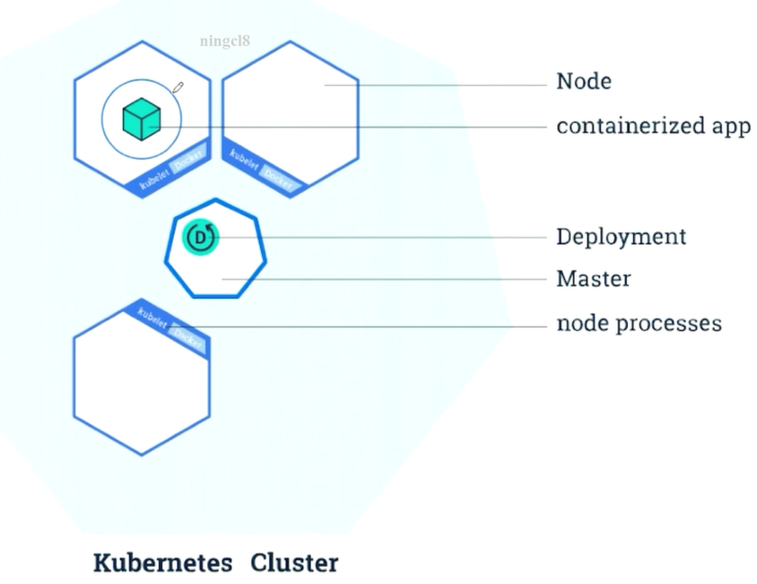
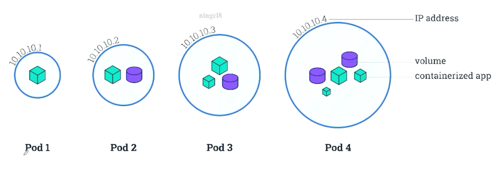
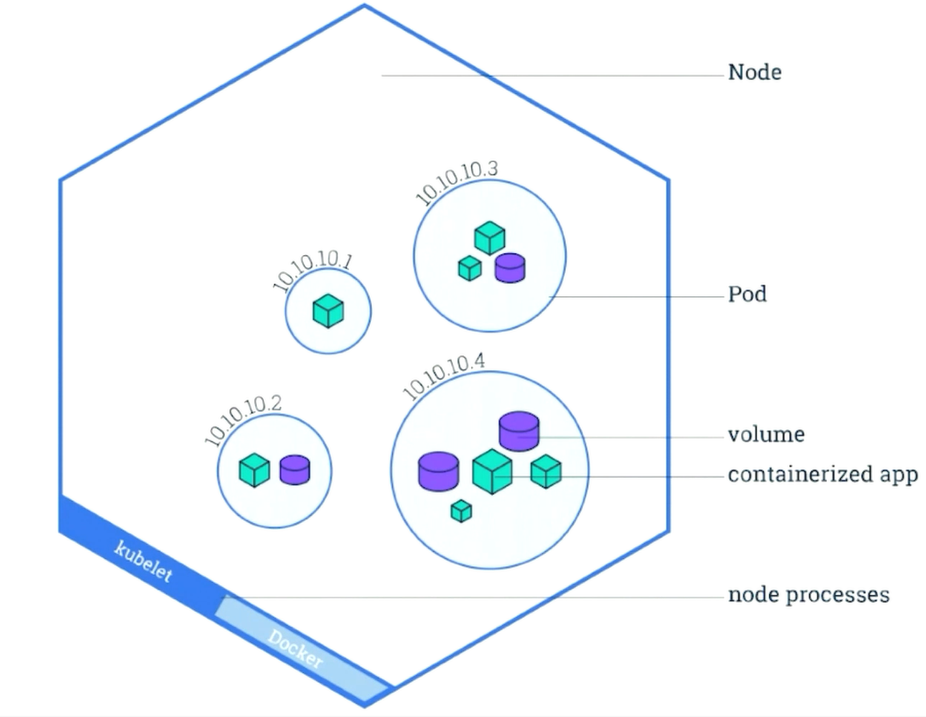
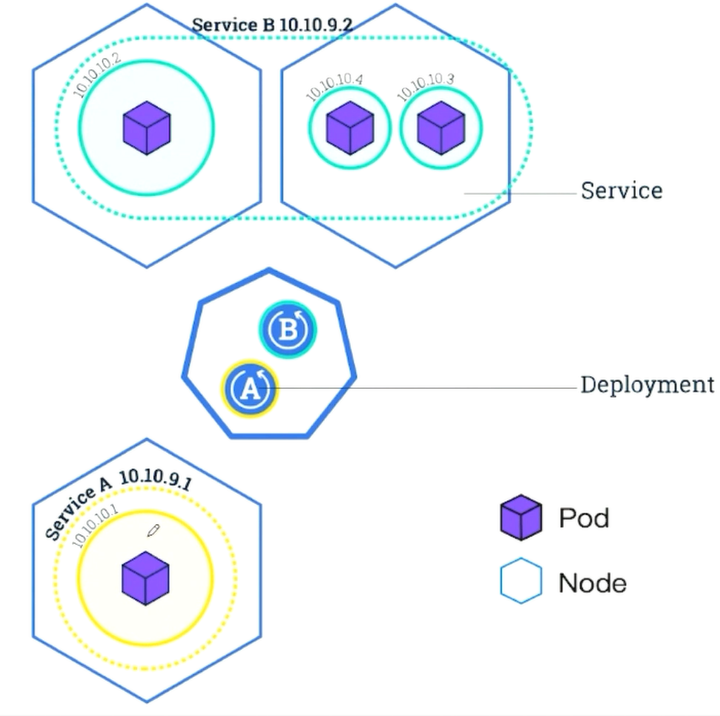
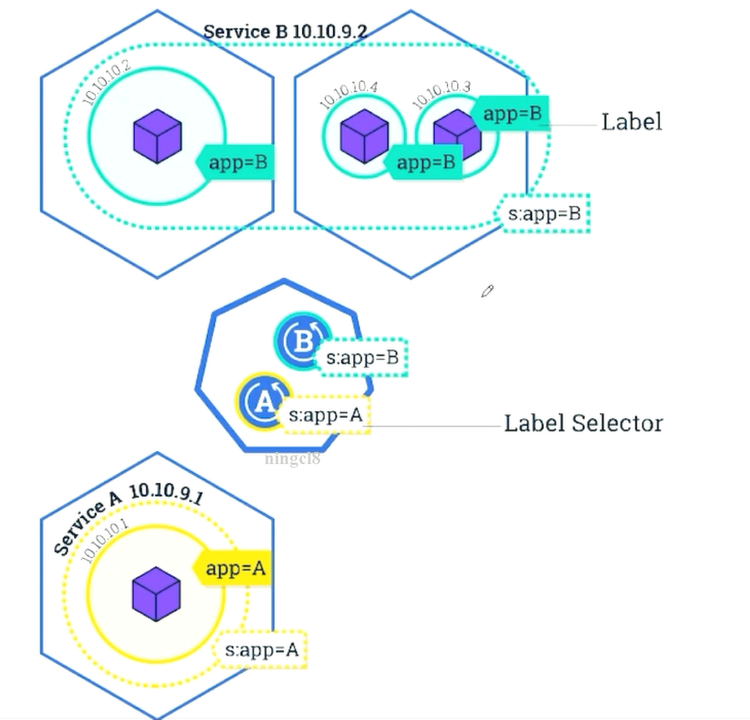
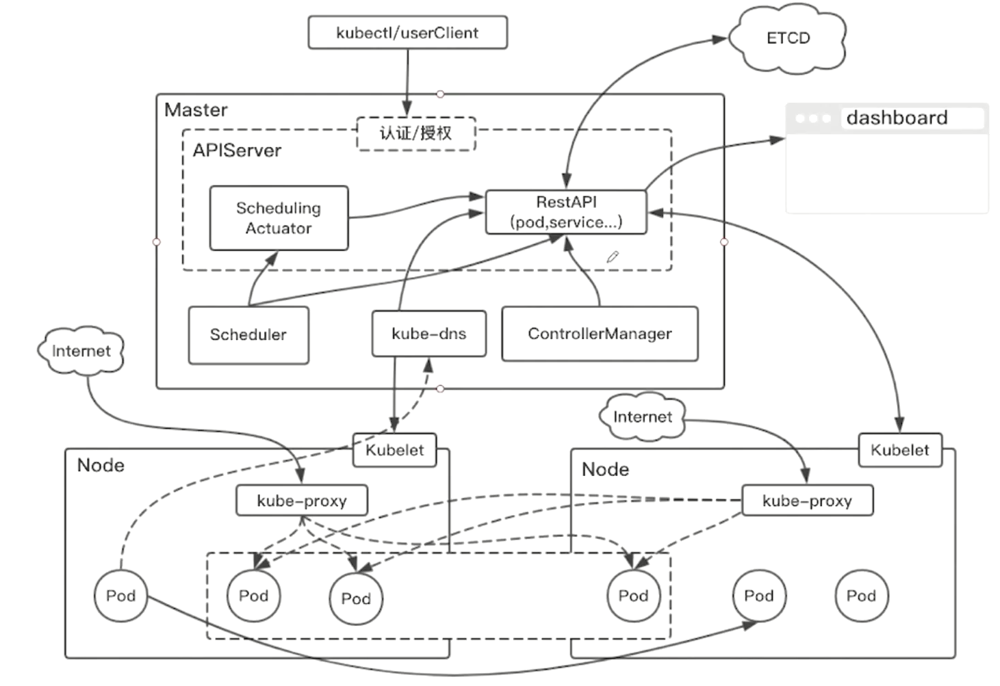

# Kubernetes实践

[返回列表](https://github.com/EmonCodingBackEnd/backend-tutorial)

[TOC]

# 一、Kubernetes基础概念


















# 二、预先准备环境

## 1、准备服务器

| 机器名 | 系统类型 | IP1-家庭      | IP2-公司   | 内存 | 部署内容 |
| ------ | -------- | ------------- | ---------- | ---- | -------- |
| emon   | CentOS7  | 192.168.1.116 | 10.0.0.116 | >=2G | master   |
| emon2  | CentOS7  | 192.168.1.117 | 10.0.0.117 | >=2G | worker   |
| emon3  | CentOS7  | 192.168.1.118 | 10.0.0.118 | >=2G | worker   |

## 2、安装docker（所有节点）

### 2.1、安装文档

[Docker安装](https://github.com/EmonCodingBackEnd/backend-tutorial/blob/master/tutorials/Docker/DockerInAction.md#%E4%B8%80docker%E7%9A%84%E5%AE%89%E8%A3%85%E4%B8%8E%E9%85%8D%E7%BD%AE)

### 2.2、docker启动配置

- 接受所有ip的数据包转发

```bash
[emon@emon ~]$ sudo vim /lib/systemd/system/docker.service 
```

```bash
# 新增：在ExecStart=XXX上面添加一行，内容如下：（k8s的网络需要）
ExecStartPost=/sbin/iptables -I FORWARD -s 0.0.0.0/0 -j ACCEPT
```

- 镜像私服

```bash
[emon@emon ~]$ sudo vim /lib/systemd/system/docker.service 
```

```bash
# 新增：如果有必要，可在ExecStart后面追加一行私服地址的配置【如果没有http协议的镜像私服，可无需配置】
EnvironmentFile=-/etc/docker/daemon.json
```

对文件 `/etc/docker/daemon.json` 追加 `insecure-registries`内容：

```bash
[emon@emon ~]$ sudo vim /etc/docker/daemon.json
```

```bash
{
  "registry-mirrors": ["https://pyk8pf3k.mirror.aliyuncs.com"],
  "insecure-registries": ["emon:5080"]
}
```

### 2.3、启动服务

```bash
[emon@emon ~]$ sudo systemctl daemon-reload
[emon@emon ~]$ sudo systemctl restart docker
```

## 3、系统设置（所有节点）

### 3.1、关闭、禁用防火墙（让所有机器之间都可以通过任意端口建立连接）

```bash
[emon@emon ~]$ sudo systemctl stop firewalld
[emon@emon ~]$ sudo systemctl disable firewalld
[emon@emon ~]$ sudo setenforce 0
```

### 3.2、设置系统参数 - 允许路由转发，不对bridge的数据进行处理

```bash
#写入配置文件
$ cat <<EOF > /etc/sysctl.d/k8s.conf
net.ipv4.ip_forward = 1
net.bridge.bridge-nf-call-ip6tables = 1
net.bridge.bridge-nf-call-iptables = 1
EOF
 
#生效配置文件
$ sysctl -p /etc/sysctl.d/k8s.conf
```


### 3.3、配置host文件

编辑`/etc/hosts`文件，添加如下片段，注意IP地址调整为自己实际情况。

```bash
192.168.1.116 emon
192.168.1.117 emon2
192.168.1.118 emon3
```


## 4、准备二进制文件（所有节点）

kubernetes的安装有几种方式，不管是kube-admin还是社区贡献的部署方案都离不开这几种方式：

- **使用现成的二进制文件**

> 直接从官方或其他第三方下载，就是kubernetes各个组件的可执行文件。拿来就可以直接运行了。不管是centos，ubuntu还是其他的linux发行版本，只要gcc编译环境没有太大的区别就可以直接运行的。使用较新的系统一般不会有什么跨平台的问题。

- **使用源码编译安装**

> 编译结果也是各个组件的二进制文件，所以如果能直接下载到需要的二进制文件基本没有什么编译的必要性了。

- **使用镜像的方式运行**

> 同样一个功能使用二进制文件提供的服务，也可以选择使用镜像的方式。就像nginx，像mysql，我们可以使用安装版，搞一个可执行文件运行起来，也可以使用它们的镜像运行起来，提供同样的服务。kubernetes也是一样的道理，二进制文件提供的服务镜像也一样可以提供。

从上面的三种方式中其实使用镜像是比较优雅的方案，容器的好处自然不用多说。但从初学者的角度来说容器的方案会显得有些复杂，不那么纯粹，会有很多容器的配置文件以及关于类似二进制文件提供的服务如何在容器中提供的问题，容易跑偏。 所以我们这里使用二进制的方式来部署。二进制文件已经这里备好，大家可以打包下载，把下载好的文件放到每个节点上，放在哪个目录随你喜欢，**放好后最好设置一下环境变量$PATH**，方便后面可以直接使用命令。(科学上网的同学也可以自己去官网找找)

[下载地址（kubernetes 1.9.0版本）](https://pan.baidu.com/s/1bMnqWY)

官网下载地址：https://github.com/kubernetes/kubernetes/releases

这里先使用1.9.0版本！！！


# 三、基础集群部署 - kubernetes-simple


# 四、完整集群部署 - kubernetes-with-ca


# 五、在kubernetes上部署我们的微服务


