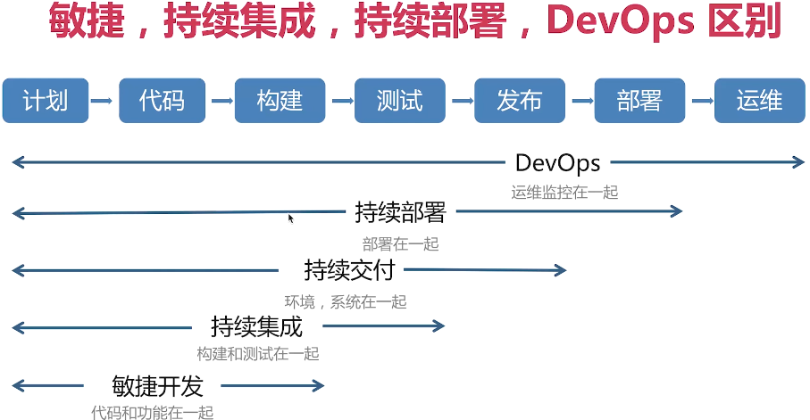
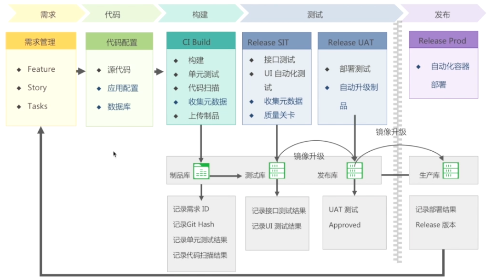
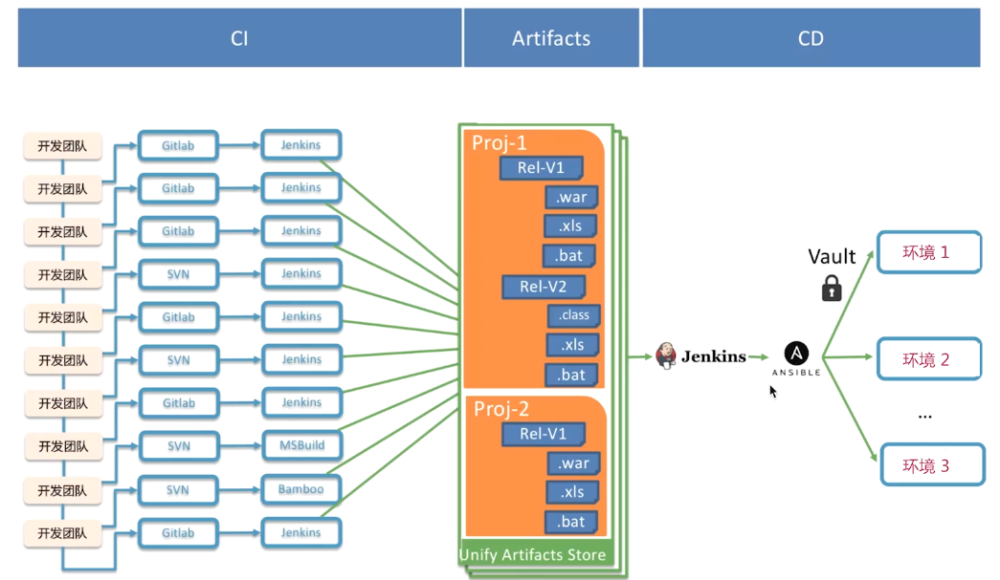
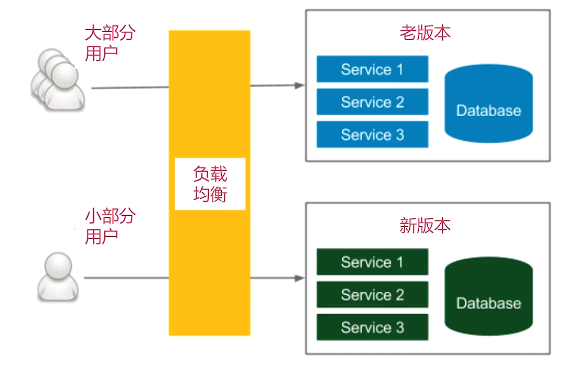
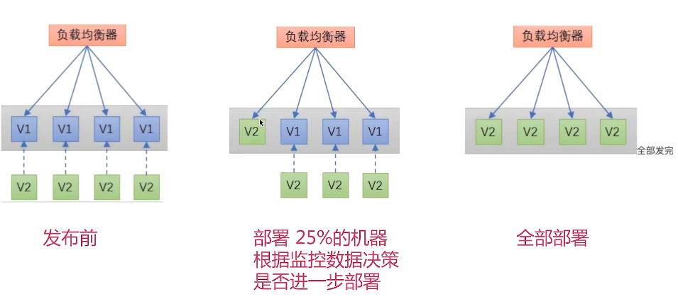
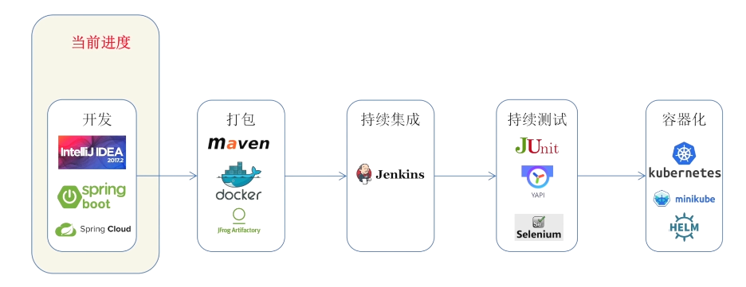
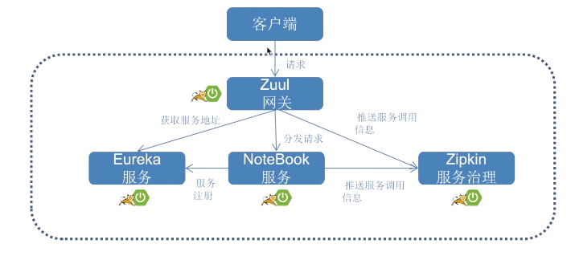

# Kubernetes实践

[返回列表](https://github.com/EmonCodingBackEnd/backend-tutorial)

[TOC]

# 序一、DevOps

DevOps：Development和Operations的组合词

CI/CD：持续集成/持续交付（或持续部署）




## 1、互利网公司如何进行持续集成



## 2、互联网公司如何进行持续部署

### 2.1、常见自动化部署方法



### 2.2、如何测试部署的效果

- 蓝绿发布



- 金丝雀发布



- 功能开关

### 2.3、进度示例




## 3、敏捷项目管理架构

工具Jira：https://www.atlassian.com/software/jira

- Release：发布，单位为月
  - Sprint：冲刺，单位为周
    - Issue：问题
      - Epic：史诗：比如，我们在双十一要上一个促销活动！
      - Story：用户故事：产品经理
      - Task：任务：开发
      - Bug：故障：测试


每日站会：

- Scrum Master主持
- 建议每日早上举行
- 每人回答3个问题
  - 昨天做了什么
  - 今天要做什么
  - 有什么问题，需要什么帮助

## 4、在开发工具里集成Jira插件

- IDEA插件：Jira Integration


## 5、Gitflow VS 主干开发分支模型

### 5.1、什么是Gitflow以及特性

Gitflow是一种分支开发模型，来源于Vincent Driessen的文章：“A successful Git branching model"

- Master
- Develop
- Release
- Feature
- Hotfix

Gitflow适用场景

- 软件本身对稳定性要求高
- 团队少量资深研发，多数初，中级研发
- 开源项目

### 5.2、什么是主干开发模式以及特性

功能开关适用于主干开发：

```java
if (FeatureManager.isFeatureEnabled("NewLoginForm")) {
    openNewLoginForm();
} else {
    openOldLoginForm();
}
```

主干开发分支模型适用场景：

- 软件本身迭代较快
- 团队中级，资深研发较多，初级研发较少
- 互联网产品


# 一、开发一个Spring Boot应用

## 1、项目整体架构图




