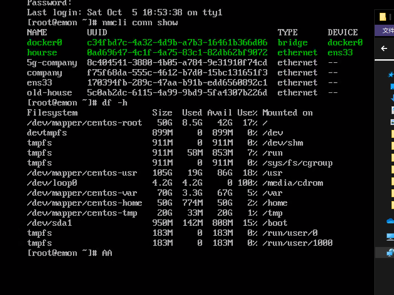

# Linux实战

[返回列表](https://github.com/EmonCodingBackEnd/backend-tutorial)

[TOC]

# 一、系统安装

## 1、 系统安装

本文基于CentOS7最小化安装，主机名`emon`。

### 1.1、分区规划

由于安装目的是学习演练，可能会安装很多软件，保存很多安装包，所以分配300G用来使用（我试过100G不够用的情况），如果是一般性系统安装，分配50G也就够了。分区格式RHEL7开始采用`XSF`格式。

| 挂载点 | 说明                                     |
| ------ | ---------------------------------------- |
| /boot  | 主分区，推荐大小200M足够，分配1G         |
| /      | 逻辑分区，分配50G                        |
| /home  | 逻辑分区，分配50G                        |
| /swap  | 逻辑分区，虚拟内存，分区格式swap，分配5G |
| /var   | 逻辑分区，分配70G                        |
| /tmp   | 逻辑分区，分配20G                        |
| /usr   | 逻辑分区，剩下全部空间（大约105G左右）   |



如果觉得300G太多，这里按照100G分配一下：

| 挂载点 | 说明                                     |
| ------ | ---------------------------------------- |
| /boot  | 主分区，推荐大小200M足够，分配1G         |
| /      | 逻辑分区，分配20G                        |
| /home  | 逻辑分区，分配5G                         |
| /swap  | 逻辑分区，虚拟内存，分区格式swap，分配5G |
| /var   | 逻辑分区，分配10G                        |
| /tmp   | 逻辑分区，分配5G                         |
| /usr   | 逻辑分区，剩下全部空间（大约50G左右）    |

其中`swap`分区的大小说明如下：

| 物理内存 | 交换分区（swap）          |
| -------- | ------------------------- |
| <=4G     | 至少4G，或者物理内存的2倍 |
| 4~16G    | 至少8G，或者物理内存的1倍 |
| 16~64G   | 至少16G                   |
| 64~256G  | 至少32G                   |

### 1.2、分区效果

```bash
[root@emon ~]# df -h
文件系统                 容量  已用  可用 已用% 挂载点
/dev/mapper/centos-root   50G   64M   50G    1% /
devtmpfs                 899M     0  899M    0% /dev
tmpfs                    911M     0  911M    0% /dev/shm
tmpfs                    911M  9.6M  902M    2% /run
tmpfs                    911M     0  911M    0% /sys/fs/cgroup
/dev/mapper/centos-usr   105G  5.2G   99G    5% /usr
/dev/mapper/centos-home   50G   33M   50G    1% /home
/dev/mapper/centos-var    70G  278M   70G    1% /var
/dev/mapper/centos-tmp    20G   33M   20G    1% /tmp
/dev/sda1                950M  142M  808M   15% /boot
tmpfs                    183M     0  183M    0% /run/user/0
[root@emon ~]# free -h
              total        used        free      shared  buff/cache   available
Mem:           1.8G        149M        1.4G        9.5M        204M        1.5G
Swap:          5.0G          0B        5.0G
```


## 2、基础配置

### 2.1、配置网络

1. 查看网卡会话

```bash
[root@emon ~]# nmcli conn show
```

2. 配置公司网卡会话

```bash
[root@emon ~]# nmcli connection add con-name company ifname ens33 autoconnect no type ethernet ip4 10.0.0.116/24 gw4 10.0.0.1
[root@emon ~]# nmcli con modify company +ipv4.dns 223.6.6.6
```

3. 配置家庭网卡会话

```bash
[root@emon ~]# nmcli connection add con-name house ifname ens33 type ethernet ip4 192.168.1.116/24 gw4 192.168.1.1
[root@emon ~]# nmcli con modify house +ipv4.dns 211.140.188.188
```

### 2.2、使用系统镜像文件配置本地yum源

如果本地安装了Git Bash，或者可以使用scp命令，使用scp传输到系统的`/usr/local/src`目录即可。

如果本地没有安装Git Bash，或者无法使用scp命令，可以使用xftp传输到系统的`/usr/local/src`目录。

1. 创建挂载点并挂载

```bash
[root@emon ~]# mkdir /media/cdrom
[root@emon ~]# mount -t iso9660 -o loop /usr/local/src/CentOS-7-x86_64-DVD-1804.iso /media/cdrom/
```

2. 设置开机自动挂载系统镜像文件

打开文件后，在最后一行追加如下内容：

```bash
[root@emon ~]# vi /etc/fstab
# 个人配置
/usr/local/src/CentOS-7-x86_64-DVD-1804.iso /media/cdrom        iso9660         defaults,ro,loop 0 0
```

3. 配置本地yum

```bash
[root@emon ~]# vi /etc/yum.repos.d/CentOS-7.5.repo
# 如下内容为编辑的文件内容
[CentOS7.5]
name=CentOS7.5
baseurl=file:///media/cdrom
enabled=1
gpgcheck=1
gpgkey=file:///media/cdrom/RPM-GPG-KEY-CentOS-7
```

4. 查看可用的yum

```bash
[root@emon ~]# yum repolist all
```

5. 缓存服务器包信息，之后配合`yum -C search xxx`可用不用联网即可检索软件信息

```bash
[root@emon ~]# yum makecache
```

### 2.3、安装常用命令

安装之前，请先使用`whereis <cmd>`命令或者`yum list <cmd>`命令进行检查，是否已经安装。

1. vim

```bash
[root@emon ~]# yum install -y vim*
```

2. wget

```bash
[root@emon ~]# yum install -y wget
```

3. tree

```bash
[root@emon ~]# yum install -y tree
```

4. netstat和ifconfig

```bash
[root@emon ~]# yum install -y net-tools
```

5. unzip

```bash
[root@emon ~]# yum install -y unzip
```

6. lsof

```bash
[root@emon ~]# yum install -y lsof
```

7. semanage

CentOS8默认没安装semanage命令，安装如下：

```bash
[emon@emon ~]$ sudo yum install -y policycoreutils-python-utils
```


### 2.4、更换yum源配置为阿里云源配置

1. 备份

```bash
[root@emon ~]# mv /etc/yum.repos.d/CentOS-Base.repo /etc/yum.repos.d/CentOS-Base.repo.bak
```

2. 下载新的CentOS-Base.repo到/etc/yum.repos.d/目录

```bash
[root@emon ~]# wget -O /etc/yum.repos.d/CentOS-Base.repo http://mirrors.aliyun.com/repo/Centos-7.repo
```

【备注】如果提示无法解析`mirrors.aliyun.com`，应该是当前会话的DNS属于内网IP，只需要再增加`8.8.8.8`这个DNS即可。

3. 生成缓存

```bash
[root@emon ~]# yum makecache
```

### 2.5、创建具有sudo权限的普通用户

1. 创建普通用户

```bash
[root@emon ~]# useradd -c "Web Site User" emon
```

2. 修改密码

```bash
[root@emon ~]# passwd emon
```

3. 赋权sudo

root用户以`visudo`命令打开文件，找到`## Allow root to run any commands anywhere`，在之后追加：

```bash
## Allow root to run any commands anywhere
root    ALL=(ALL)       ALL
emon    ALL=(ALL)       ALL
```

### 2.6、修改vim的缩进为4个空格

打开文件后，在最后一行追加如下内容：

```bash
[root@emon ~]# vim /etc/vimrc 
" 个人配置
set tabstop=4
set softtabstop=4
set shiftwidth=4
set expandtab
" 如下设置，在vim的插入模式下，点击F9可以进入“插入(粘贴)”模式，再执行粘贴时不会混乱格式；再次点击F9退出“插入(粘贴)”模式。
set pastetoggle=<F9>
```

### 2.7、配置本地DNS解析

打开文件后，在最后一行追加如下内容：

```bash
[root@emon ~]# vim /etc/hosts
127.0.0.1   emon
```

## 3、一些说明

关于软件端口访问，如果防火墙开启(`systemctl start firewalld`)，且需要外部环境访问，那么可以开放端口(`firewalld-cmd`命令)，如果不需要外部访问，只需要在本机内访问，通过`127.0.0.1`方式访问即可。如果防火墙关闭(`systemctl stop firewalld`)，那么外部与本机都可以直接通过IP地址访问。

在本文以下的安装中，默认是防火墙开启状态，且需要外部通过IP地址访问的，所以需要开放端口的软件，会开放端口。比如vsftpd的21端口，Nginx的80端口等等。

# 二、软件安装

---

由于下面采用emon进行安装，安装目录在`/usr/local/`，这里先修改目录的属主。

```bash
[emon@emon ~]$ sudo chown -R emon /usr/local/
[emon@emon ~]$ ll -d /usr/local/
drwxr-xr-x. 13 emon root 4096 Feb 24  2017 /usr/local/
```

下面安装时，如非必要，默认在emon用户的宿主目录执行命令。

---


## 1、安装JDK

1. 检查是否已安装

```bash
[emon@emon ~]$ rpm -qa|grep jdk
```

2. 下载

下面的下载地址，可以通过ORACLE官网下载页，登录后获取：

官网下载页地址： http://www.oracle.com/technetwork/java/javase/downloads/index.html

```bash
[emon@emon ~]$ wget -cP /usr/local/src/ http://111.1.50.18/files/3104000006BC77D6/download.oracle.com/otn-pub/java/jdk/8u171-b11/512cd62ec5174c3487ac17c61aaa89e8/jdk-8u171-linux-x64.tar.gz
```

3. 创建安装目录

```bash
[emon@emon ~]$ mkdir /usr/local/Java
```

4. 解压安装

```bash
[emon@emon ~]$ tar -zxvf /usr/local/src/jdk-8u171-linux-x64.tar.gz -C /usr/local/Java/
```

5. 创建软连接

```bash
[emon@emon ~]$ ln -s /usr/local/Java/jdk1.8.0_171/ /usr/local/java
```

6. 配置环境变量

在`/etc/profile.d`目录创建`jdk.sh`文件：

```bash
[emon@emon ~]$ sudo vim /etc/profile.d/jdk.sh
export JAVA_HOME=/usr/local/java
export CLASSPATH=.:$JAVA_HOME/jre/lib/rt.jar:$JAVA_HOME/lib/dt.jar:$JAVA_HOME/lib/tools.jar
export PATH=$JAVA_HOME/bin:$PATH
```

使之生效：

```bash
[emon@emon ~]$ source /etc/profile
```

7. 校验

```bash
[emon@emon ~]$ java -version
java version "1.8.0_171"
Java(TM) SE Runtime Environment (build 1.8.0_171-b11)
Java HotSpot(TM) 64-Bit Server VM (build 25.171-b11, mixed mode)
```

## 2、安装Tomcat

1. 下载

下载地址获取页面： https://tomcat.apache.org/whichversion.html

```bash
[emon@emon ~]$ wget -cP /usr/local/src/ https://mirror.bit.edu.cn/apache/tomcat/tomcat-9/v9.0.34/bin/apache-tomcat-9.0.34.tar.gz
```

2. 创建安装目录

```bash
[emon@emon ~]$ mkdir /usr/local/Tomcat
```

3. 解压安装

```bash
[emon@emon ~]$ tar -zxvf /usr/local/src/apache-tomcat-9.0.34.tar.gz -C /usr/local/Tomcat/
```

4. 创建软连接

```bash
[emon@emon ~]$ ln -s /usr/local/Tomcat/apache-tomcat-9.0.34/ /usr/local/tomcat
```

5. 配置UTF-8字符集

打开文件`/usr/local/tomcat/conf/server.xml ` 找到8080默认端口的配置位置，在xml节点末尾增加`URIEncoding="UTF-8"` ，修改后的内容如下：

```bash
 [emon@emon ~]$ vim /usr/local/tomcat/conf/server.xml 
     <Connector port="8080" protocol="HTTP/1.1"
               connectionTimeout="20000"
               redirectPort="8443" URIEncoding="UTF-8"/>
```

6. 校验

```bash
[emon@emon ~]$ /usr/local/tomcat/bin/catalina.sh version
```

## 3、安装Maven

1. 下载

下载地址获取页面： https://maven.apache.org/download.cgi

```bash
[emon@emon ~]$ wget -cP /usr/local/src/ http://mirrors.hust.edu.cn/apache/maven/maven-3/3.5.3/binaries/apache-maven-3.5.3-bin.tar.gz
```

2. 创建安装目录

```bash
[emon@emon ~]$ mkdir /usr/local/Maven
```

3. 解压安装

```bash
[emon@emon ~]$ tar -zxvf /usr/local/src/apache-maven-3.5.3-bin.tar.gz -C /usr/local/Maven/
```

4. 创建软连接

```bash
[emon@emon ~]$ ln -s /usr/local/Maven/apache-maven-3.5.3/ /usr/local/maven
```

5. 配置环境变量

在`/etc/profile.d`目录创建`mvn.sh`文件：

```bash
[emon@emon ~]$ sudo vim /etc/profile.d/mvn.sh
export MAVEN_HOME=/usr/local/maven
export PATH=$MAVEN_HOME/bin:$PATH
```

使之生效：

```bash
[emon@emon ~]$ source /etc/profile
```

6. 校验

```bash
[emon@emon ~]$ mvn -v
```

## 4、安装vsftpd

1. 检查是否安装

```bash
[emon@emon ~]$ rpm -qa|grep vsftpd
```

2. 使用yum安装

```bash
[emon@emon ~]$ sudo yum -y install vsftpd
```

3. 备份`vsftpd.conf`配置文件

```bash
[emon@emon ~]$ sudo cp /etc/vsftpd/vsftpd.conf /etc/vsftpd/vsftpd.conf.bak
```

4. 创建文件服务器根目录`/fileserver`

首先，`fileserver` 并非ftp专享的目录，而是ftp、ftps、sftp这三种文件服务器共享的根目录。

```bash
[emon@emon ~]$ sudo mkdir /fileserver
```

5. 创建ftp本地用户

```bash
[emon@emon ~]$ sudo useradd -d /fileserver/ftproot -s /sbin/nologin -c "Ftp User" ftpuser
```

创建用户后，自动创建了`/fileserver/ftproot/`目录，但是该目录权限为700，需要修改为755

```bash
[emon@emon ~]$ sudo chmod -R 755 /fileserver/ftproot/
```

为了创建本地用户模式+虚拟用户模式，都可以登录ftp服务器，这里设置ftpuser用户的密码

```bash
[emon@emon ~]$ sudo passwd ftpuser
```

6. 虚拟用户模式需要如下准备

   1. 配置虚拟用户

   ```bash
   [emon@emon ~]$ sudo vim /etc/vsftpd/virtual_user_list
   ftp
   ftp123
   extra
   extra123
   ```

   文件内容说明：奇数行是虚拟用户名，偶数行是前一行用户名对应的密码。

   2. 根据配置的虚拟用户，生成虚拟用户数据库文件

   ```bash
   [emon@emon ~]$ sudo db_load -T -t hash -f /etc/vsftpd/virtual_user_list /etc/vsftpd/virtual_user_list.db
   [emon@emon ~]$ file /etc/vsftpd/virtual_user_list.db
   /etc/vsftpd/virtual_user_list.db: Berkeley DB (Hash, version 9, native byte-order)
   ```

   3. 配置支持虚拟用户的PAM认证文件，引用生成的虚拟用户数据库文件（默认带`.db`后缀，无需指定）

   ```bash
   [emon@emon ~]$ sudo vim /etc/pam.d/vsftpd 
   ```

   打开文件，在文件头非注释行开始，插入如下内容（插入的内容必须第一行开始）：

   ```bash
   auth sufficient pam_userdb.so db=/etc/vsftpd/virtual_user_list
   account sufficient pam_userdb.so db=/etc/vsftpd/virtual_user_list
   
   # CentOS7.6及以上版本，本地用户ftpuser无法登陆，报错“530 Login incorrect.”，注释掉如下一行即可：
   # auth       required   pam_shells.so
   ```

7. 配置`vsftpd.conf`

```bash
[emon@emon ~]$ sudo vim /etc/vsftpd/vsftpd.conf
```

```bash
# 不允许匿名用户登录【修改】
anonymous_enable=NO
# 允许本地用户登录
local_enable=YES
# 本地用户可以在自己家目录中进行读写操作
write_enable=YES
# 本地用户新增档案时的umask值
local_umask=022
# 如果启动这个选项，那么使用者第一次进入一个目录时，会检查该目录下是否有.message这个档案，如果有，则会出现此档案的内容，通常这个档案会放置欢迎话语，或是对该目录的说明。默认值为开启
dirmessage_enable=YES
# 是否启用上传/下载日志记录。如果启用，则上传与下载的信息将被完整纪录在xferlog_file 所定义的档案中。预设为开启。
xferlog_enable=YES
# 指定FTP使用20端口进行数据传输，默认值为YES
connect_from_port_20=YES
# 如果启用，则日志文件将会写成xferlog的标准格式
xferlog_std_format=YES
# 这里用来定义欢迎话语的字符串【新增】
ftpd_banner=Welcome to emon FTP service.
# 用于指定用户列表文件中的用户是否允许切换到上级的目录【新增】
chroot_local_user=NO
# 用于设置是否启用chroot_list_file配置项指定的用户列表文件【新增】
chroot_list_enable=YES
# 用于指定用户列表文件【新增】
chroot_list_file=/etc/vsftpd/chroot_list
listen=NO
listen_ipv6=YES

# 设置PAM使用的名称，默认值为/etc/pam.d/vsftpd
pam_service_name=vsftpd
# 是否启用vsftpd.user_list文件，黑名单，白名单都可以的
userlist_enable=YES
tcp_wrappers=YES

# 虚拟用户创建文档的umask值【新增】
anon_umask=022
# 是否启用虚拟用户，默认值为NO。【新增】
guest_enable=YES
# 这里用来映射虚拟用户，默认为ftp。【新增】
guest_username=ftpuser
# 当不允许本地用户+虚拟用户切换到主目录上级时，对于虚拟用户而言，可以登录；对于本地用户而言，会报错： 500 OOPS: vsftpd: refusing to run with writable root inside chroot()
# 两种做法，第一种是去掉用户主目录的写权限，第二种是增加如下属性
allow_writeable_chroot=YES
# 默认是GMT时间，改成使用本机系统时间【新增】
use_localtime=YES
# 为虚拟用户设置独立的权限【新增】
user_config_dir=/etc/vsftpd/virtual_user_dir

# 被动模式及其使用的端口范围【新增】
pasv_enable=YES
pasv_min_port=61001
pasv_max_port=62000
```

8. 创建配置属性`chroot_list_file` 和`user_config_dir` 所需要的目录和文件，并创建ftp服务器根目录`/fileserver/ftproot/`下一个index.html文件

   1. `chroot_list_file`所需

   ```bash
   [emon@emon ~]$ sudo vim /etc/vsftpd/chroot_list
   ```

   文件内容：

   ```bash
   ftp
   extra
   ```

   2. `user_config_dir`所需

   首先，`user_config_dir`属性指定的值是一个目录，在该目录下需要为虚拟用户创建同名的权限文件，比如虚拟用户`ftp`的权限文件，命名为`ftp`。

   创建指定目录：

   ```bash
   [emon@emon ~]$ sudo mkdir /etc/vsftpd/virtual_user_dir
   ```

   为虚拟用户`ftp` 和`extra` 创建权限控制文件：

   ```bash
   [emon@emon ~]$ sudo vim /etc/vsftpd/virtual_user_dir/ftp
   ```

   文件内容：

   ```bash
   anon_upload_enable=YES
   anon_mkdir_write_enable=YES
   anon_other_write_enable=YES
   ```

   ```bash
   [emon@emon ~]$ sudo vim /etc/vsftpd/virtual_user_dir/extra
   ```

   文件内容：

   ```bash
   # 先不填写，预留。
   ```

   3. 创建`index.html`文件

   ```bash
   [emon@emon ~]$ sudo vim /fileserver/ftproot/index.html
   ```

   **由于sudo创建的，属于root用户，最好修改为ftpuser用户所有**

   > [emon@emon ~]$ sudo chown ftpuser:ftpuser /fileserver/ftproot/index.html 

   ```html
   <html>
       <head>
           <meta http-equiv="Content-Type" content="text/html; charset=utf-8" />
           <link href="https://cdn.bootcss.com/bootstrap/4.0.0/css/bootstrap.min.css" rel="stylesheet">
   		<script>
   			function jump(port) {
   				var baseHref = window.location.href;
   				var index = baseHref.lastIndexOf("/");
   				var baseUrl = baseHref.substring(0, index);
   				var url = baseUrl + ":" + port;
   				window.location.href = url;
   			}
   		</script>
       </head>
       <body>
           <h1>
           </h1>
           <div class="container">
               <div class="row clearfix">
                   <div class="col-md-12 column">
                       <div class="jumbotron">
                           <h1>
                               Welcome to emon FTP service.
                           </h1>
                           <p>
                               <h3>
                                   为了可以预见的忘却，为了想要进阶的自己。
                               </h3>
                               <h3>
                                   种一棵树最好的时间是十年前，其次是现在。
                               </h3>
                           </p>
                       </div>
                   </div>
                   <div class="col-md-12 column">
   					<table class="table table-bordered">
   						<thead>
   							<tr><th>服务</th><th>端口</th><th>url</th></tr>
   						</thead>
   						<tbody>
   							<tr>
   								<td>supervisor</td><td>9001</td>
   								<td><a href="#" target="_blank" onclick="jump(9001)">supervisor</a></td>
   							</tr>
   							<tr>
   								<td>nexus</td><td>8081</td>
   								<td><a href="#" target="_blank" onclick="jump(8089)">nexus</a></td>
   							</tr>
   							<tr>
   								<td>jenkins</td><td>8088</td>
   								<td><a href="#" target="_blank" onclick="jump(8088)">jenkins</a></td>
   							</tr>
   							<tr>
   								<td>eureka</td><td>8761</td>
   								<td><a href="#" target="_blank" onclick="jump(8761)">eureka</a></td>
   							</tr>
   							<tr>
   								<td>RabbitMQ</td><td>5672/15672</td>
   								<td><a href="#" target="_blank" onclick="jump(15672)">RabbitMQ</a></td>
   							</tr>
   						</tbody>
   					</table>
                   </div>
               </div>
           </div>
       </body>
   </html>
   
   ```

9. 配置SELinux对ftp服务器目录`/fileserver/ftproot/` 的限制

查看限制情况：

```bash
[emon@emon ~]$ getsebool -a|grep ftp
ftpd_anon_write --> off
ftpd_connect_all_unreserved --> off
ftpd_connect_db --> off
ftpd_full_access --> off
ftpd_use_cifs --> off
ftpd_use_fusefs --> off
ftpd_use_nfs --> off
ftpd_use_passive_mode --> off
httpd_can_connect_ftp --> off
httpd_enable_ftp_server --> off
tftp_anon_write --> off
tftp_home_dir --> off
```

放开限制：

```bash
[emon@emon ~]$ sudo setsebool -P ftpd_full_access=on
```

10. 校验

    1. 启动vsftpd

    ```bash
    [emon@emon ~]$ sudo systemctl start vsftpd
    ```

    为了ftp登录，需要安装ftp客户端：

    ```bash
    [emon@emon ~]$ yum list ftp|tail -n 2
    可安装的软件包
    ftp.x86_64                         0.17-67.el7                         CentOS7.5
    [emon@emon ~]$ sudo yum install -y ftp
    ```

    2. 登录ftp验证

    ```bash
    [emon@emon ~]$ ftp 127.0.0.1
    Connected to 127.0.0.1 (127.0.0.1).
    220 Welcome to emon FTP service
    Name (127.0.0.1:emon): ftp
    331 Please specify the password.
    Password:
    230 Login successful.
    Remote system type is UNIX.
    Using binary mode to transfer files.
    ftp> ls
    227 Entering Passive Mode (127,0,0,1,239,67).
    150 Here comes the directory listing.
    -rw-r--r--    1 1001     1001         1006 May 27 15:44 index.html
    226 Directory send OK.
    ftp> mkdir test
    257 "/test" created
    ftp> ls
    227 Entering Passive Mode (127,0,0,1,238,221).
    150 Here comes the directory listing.
    -rw-r--r--    1 1001     1001         1006 May 27 15:44 index.html
    drwxr-xr-x    2 1001     1001            6 May 27 15:53 test
    226 Directory send OK.
    ftp> exit
    221 Goodbye.
    ```

11. 开放端口

```bash
[emon@emon ~]$ sudo firewall-cmd --permanent --zone=public --add-port=20-21/tcp
success
[emon@emon ~]$ sudo firewall-cmd --permanent --zone=public --add-port=61001-62000/tcp
success
[emon@emon ~]$ sudo firewall-cmd --reload
success
[emon@emon ~]$ sudo firewall-cmd --permanent --zone=public --list-ports
20-21/tcp 61001-62000/tcp
```

## 5、安装ftps服务器

**ftps=ftps+ssl**

- 为ftp添加ssl功能的方式
  - 使用自签名证书
  - 使用私有CA签名证书
  - 使用公信CA签名证书

**openssl安装检查**

由于要使用到openssl，这里先检查openssl安装情况。

```bash
[emon@emon ~]$ yum list openssl|tail -n 2
已安装的软件包
openssl.x86_64                     1:1.0.2k-12.el7                     @anaconda
```

### 5.1、方式一：使用自签名证书

1. 切换目录

```bash
[emon@emon ~]$ cd /etc/ssl/certs/
[emon@emon certs]$ ls
ca-bundle.crt  ca-bundle.trust.crt  make-dummy-cert  Makefile  renew-dummy-cert
```

2. 生成RSA私钥和自签名证书

```bash
[emon@emon certs]$ sudo openssl req -newkey rsa:2048 -nodes -keyout rsa_private.key -x509 -days 365 -out cert.crt
[sudo] emon 的密码：
Generating a 2048 bit RSA private key
..................+++
..........................+++
writing new private key to 'rsa_private.key'
-----
You are about to be asked to enter information that will be incorporated
into your certificate request.
What you are about to enter is what is called a Distinguished Name or a DN.
There are quite a few fields but you can leave some blank
For some fields there will be a default value,
If you enter '.', the field will be left blank.
-----
Country Name (2 letter code) [XX]:CN
State or Province Name (full name) []:ZheJiang
Locality Name (eg, city) [Default City]:HangZhou
Organization Name (eg, company) [Default Company Ltd]:HangZhou emon Technologies,Inc.
Organizational Unit Name (eg, section) []:IT emon
Common Name (eg, your name or your server's hostname) []:*.emon.vip
Email Address []:
```

3. 查看生成的RSA私钥和自签名证书

```bash
[emon@emon certs]$ ls
ca-bundle.crt  ca-bundle.trust.crt  cert.crt  make-dummy-cert  Makefile  renew-dummy-cert  rsa_private.key
```

4. 配置`vsftpd.conf`

```bash
[emon@emon certs]$ sudo vim /etc/vsftpd/vsftpd.conf
```

```bash
# ssl config
# 是否使用ssl
ssl_enable=YES
# 是否允许匿名用户使用ssl
allow_anon_ssl=NO
# 强制本地用户登录使用ssl
force_local_logins_ssl=YES
# 强制本地用户数据使用ssl传输
force_local_data_ssl=YES
# 强制匿名/虚拟用户登录使用ssl
force_anon_logins_ssl=YES
# 强制匿名/虚拟用户数据使用ssl传输
force_anon_data_ssl=YES
# 允许 TLS v1 协议连接
ssl_tlsv1=YES
# 允许 SSL v2 协议连接
ssl_sslv2=YES
# 开启sslv3
ssl_sslv3=YES

# 是否启用隐式SSL功能，不建议开启，而且默认是关闭的
implicit_ssl=NO
# 隐式ftp端口设置，如果不设置，默认还是21，但是当客户端以隐式SSL连接时，默认会使用990端口，导致连接失败！！！
# listen_port=990
# 输出SSL相关的日志信息
# debug_ssl=YES
# Disable SSL session reuse(required by WinSCP)
require_ssl_reuse=NO
# Select which SSL ciphers vsftpd will allow for encrypted SSL connections（required by FileZilla）
ssl_ciphers=HIGH
# 自签证书：证书文件
rsa_cert_file=/etc/ssl/certs/cert.crt
# 自签证书：RSA私钥文件
rsa_private_key_file=/etc/ssl/certs/rsa_private.key
```

ssl有显式`explicit`和隐式`implicit`之分：

- 显式配置

```bash
implicit_ssl=NO
```

- 隐式配置

```bash
implicit_ssl=YES
listen_port=990
```

5. 重启vsftpd服务

```bash
[emon@emon certs]$ sudo systemctl restart vsftpd
```

6. 校验

对于ftps的校验，无法使用ftp命令校验了：

```bash
[emon@emon certs]$ sudo systemctl restart vsftpd
[sudo] emon 的密码：
[emon@emon certs]$ ftp 127.0.0.1
Connected to 127.0.0.1 (127.0.0.1).
220 Welcome to emon FTP service
Name (127.0.0.1:emon): ftp
530 Anonymous sessions must use encryption.
Login failed.
421 Service not available, remote server has closed connection
ftp> 
```

**需要安装lftp校验**

如果是显式`explicit` 的ftps，还可以使用lftp测试：

- 安装lftp

```bash
[emon@emon certs]$ sudo yum install -y lftp
[emon@emon certs]$ lftp ftp@127.0.0.1:21
口令: 
lftp ftp@127.0.0.1:~> ls            
ls: 严重错误: Certificate verification: Not trusted
lftp ftp@127.0.0.1:~> 
```

- 编辑`/etc/lftp.conf`

打开文件后，在最后一行追加如下内容： 

```bash
[emon@emon certs]$ sudo vim /etc/lftp.conf 
# 个人配置
set ssl:verify-certificate no
```

再次校验：

```bash
[emon@emon certs]$ lftp ftp@127.0.0.1:21
口令: 
lftp ftp@127.0.0.1:~> ls            
-rw-r--r--    1 1001     1001         1006 May 27 15:44 index.html
drwxr-xr-x    2 1001     1001            6 May 27 15:53 test
lftp ftp@127.0.0.1:/> 
```

如果是隐式的ftps，lftp就无法校验了，除非lftp是` compiled with OpenSSL (configure --with-openssl)`：

```bash
[emon@emon certs]$ lftp ftp@127.0.0.1:990
Password: 
lftp ftp@127.0.0.1:~> ls
`ls' at 0 [FEAT negotiation...]
```

怎么办呢？ **推荐使用Windows操作系统的FlashFXP软件验证。**


---

#### 5.1.1、安装lftp【源码安装】

命令`yum install -y lftp`安装的lftp，可以测试显式的ftps，但无法测试隐式的ftps，这里采用源码编译安装。

1. 下载

下载地址获取页面： http://lftp.yar.ru/get.html

```bash
[emon@emon certs]$ wget -cP /usr/local/src/ http://lftp.yar.ru/ftp/lftp-4.8.3.tar.gz
```

2. 依赖安装

```bash
[emon@emon certs]$ sudo yum install -y gcc* *md5* openssl* ncurses* readline-devel
```

3. 创建解压目录

```bash
[emon@emon certs]$ mkdir /usr/local/LFTP
```

4. 解压

```bash
[emon@emon certs]$ tar -zxvf /usr/local/src/lftp-4.8.3.tar.gz -C /usr/local/LFTP/
```

5. 执行配置脚本，并编译安装

- 切换目录并执行配置脚本生成Makefile

```bash
[emon@emon certs]$ cd /usr/local/LFTP/lftp-4.8.3/
[emon@emon lftp-4.8.3]$ ./configure --prefix=/usr/local/LFTP/lftp4.8.3 --with-openssl
```

- 编译

```bash
[emon@emon lftp-4.8.3]$ make
```

- 安装

```bash
[emon@emon lftp-4.8.3]$ make install
[emon@emon lftp-4.8.3]$ cd /etc/ssl/certs/
```

6. 创建软连接

```bash
[emon@emon certs]$ ln -s /usr/local/LFTP/lftp4.8.3/ /usr/local/lftp
```

7. 配置环境变量

在`/etc/profile.d`目录创建`.sh`文件： 

```bash
[emon@emon certs]$ sudo vim /etc/profile.d/lftp.sh
export PATH=/usr/local/lftp/bin:$PATH
```

使之生效：

```bash
[emon@emon certs]$ source /etc/profile
```

8. 配置`lftp.conf`

打开文件后，在最后一行追加如下内容： 

```bash
[emon@emon certs]$ vim /usr/local/lftp/etc/lftp.conf
# 个人配置
set ssl:verify-certificate no
```

**紧接上面的校验，这里使用lftp命令：**

```bash
[emon@emon certs]$ lftp ftp@127.0.0.1:21
口令: 
lftp ftp@127.0.0.1:~> ls                        
-rw-r--r--    1 1001     1001         1006 May 27 15:44 index.html
drwxr-xr-x    2 1001     1001            6 May 27 15:53 test
lftp ftp@127.0.0.1:/> exit
```

**如果ftps是隐式，发现还是无法连接**

---

### 5.2、方式二：使用私有CA签名证书

私有CA签名证书的使用与自签名证书一样的，这里不再赘述，主要讲解如何生成私有CA签名证书。

#### 相关知识点

> - 证书签发机构CA
>
>   - 公共信任CA
>
>     大范围维护大量证书企业使用OpenCA（对openssl进行了二次封装，更加方便使用）
>
>   - 私有CA
>
>     小范围测试使用openssl
>
> - openssl配置文件
>
>   > /etc/pki/tls/openssl.cnf

#### 5.2.1、创建私有证书签发机构CA步骤

在确定配置为CA的服务器主机上生成一个自签证书，并为CA提供所需要的目录及文件。在真正的通信过程中CA服务器主机不需要网络参与，只需要参与到签名中，不需要提供服务。

1. 生成私钥

因为在默认配置文件中CA自己的私钥配置在`/etc/pki/CA/private/cakey.pem`，所以指定目录和文件名要和配置文件一致。

```bash
[emon@emon certs]$ sudo bash -c "umask 077;openssl genrsa -out /etc/pki/CA/private/cakey.pem 4096"
[sudo] emon 的密码：
Generating RSA private key, 4096 bit long modulus
......................................................................................................++
.........................++
e is 65537 (0x10001)
[emon@emon certs]$ sudo ls -l /etc/pki/CA/private/cakey.pem
-rw-------. 1 root root 3243 5月  27 19:13 /etc/pki/CA/private/cakey.pem
```

2. 生成CA自签证书

```bash
[emon@emon certs]$ sudo openssl req -new -x509 -key /etc/pki/CA/private/cakey.pem -out /etc/pki/CA/cacert.pem -days 3655
You are about to be asked to enter information that will be incorporated
into your certificate request.
What you are about to enter is what is called a Distinguished Name or a DN.
There are quite a few fields but you can leave some blank
For some fields there will be a default value,
If you enter '.', the field will be left blank.
-----
Country Name (2 letter code) [XX]:CN
State or Province Name (full name) []:ZheJiang
Locality Name (eg, city) [Default City]:HangZhou
Organization Name (eg, company) [Default Company Ltd]:HangZhou emon Technologies,Inc.
Organizational Unit Name (eg, section) []:IT emon
Common Name (eg, your name or your server's hostname) []:*.emon.vip
Email Address []:
```

命令解释：

- `/etc/pki/CA/cacert.pem` : CA自签证书默认位置
- `-new` : 生成新证书签署请求
- `-x509` ： 生成自签格式证书，专用于创建私有CA时
- `-key` ： 生成请求时用到的私有文件路径
- `-out` ： 生成的请求文件路径，如果自签操作将直接生成签署过的证书
- `-days` ： 证书的有效时长，单位是day

注意：

- `-key /etc/pki/CA/private/cakey.pem` 指明的是私钥的位置，只是因为此处会自动抽取出私钥中的公钥。
- req只能发起签署请求，需要加-x509参数实现自己发出请求，自己签署。非自签无需此参数。

3. 为CA提供所需的目录及文件

当不存在时需要创建签发证书、吊销证书、新证书目录

```bash
[emon@emon certs]$ sudo mkdir -pv /etc/pki/CA/{certs,crl,newcerts}
```

创建证书序列号文件、证书索引文件

```bash
[emon@emon certs]$ sudo touch /etc/pki/CA/{serial,index.txt}
```

第一次创建的时候需要给予证书序列号

```bash
[emon@emon certs]$ echo 01 | sudo tee /etc/pki/CA/serial
01
```

#### 5.2.2、OpenSSL：服务申请证书签署实现SSL安全通信

要用到证书进行安全通信的服务器，需要向CA请求签署证书，需要签署的服务无需和CA证书签署机构主机在同一台服务器上。

1. 用到证书的服务器生成私钥

生成vsftpd服务的私钥创建时候无需在`/etc/pki/CA/private`目录创建，该目录仅在创建CA主机时需要的。

```bash
[emon@emon certs]$ sudo mkdir /etc/vsftpd/ssl
[emon@emon certs]$ cd /etc/vsftpd/ssl/
[emon@emon ssl]$ sudo bash -c "umask 077; openssl genrsa -out /etc/vsftpd/ssl/vsftpd.key 2048"
Generating RSA private key, 2048 bit long modulus
..+++
................+++
e is 65537 (0x10001)
[emon@emon ssl]$ ll
总用量 4
-rw-------. 1 root root 1675 5月  27 19:22 vsftpd.key
```

2. 生成证书签署请求

```bash
[emon@emon ssl]$ sudo openssl req -new -key /etc/vsftpd/ssl/vsftpd.key -out /etc/vsftpd/ssl/vsftpd.csr -days 365
You are about to be asked to enter information that will be incorporated
into your certificate request.
What you are about to enter is what is called a Distinguished Name or a DN.
There are quite a few fields but you can leave some blank
For some fields there will be a default value,
If you enter '.', the field will be left blank.
-----
Country Name (2 letter code) [XX]:CN
State or Province Name (full name) []:ZheJiang
Locality Name (eg, city) [Default City]:HangZhou
Organization Name (eg, company) [Default Company Ltd]:HangZhou emon Technologies,Inc.
Organizational Unit Name (eg, section) []:IT emon
Common Name (eg, your name or your server's hostname) []:*.emon.vip
Email Address []:

Please enter the following 'extra' attributes
to be sent with your certificate request
A challenge password []:
An optional company name []:
```

命令解释：

- `*.csr` ： 表示证书签署请求文件
- 要保证和签署机构CA签署机构信息一致

生成签名请求时，有两项额外的信息需要填写：

| 字段                     | 说明           | 示例     |
| ------------------------ | -------------- | -------- |
| A challenge password     | 高强度的密码   | 无需填写 |
| An optional company name | 可选的公司名称 | 无需填写 |

3. 将请求通过可靠方式发送给CA主机

```bash
[emon@emon ssl]$ sudo scp /etc/vsftpd/ssl/vsftpd.csr root@127.0.0.1:/tmp/
The authenticity of host '127.0.0.1 (127.0.0.1)' can't be established.
ECDSA key fingerprint is SHA256:Z9evxGkdmtBGu8pEB1oRNAiy3N32cEbJUL9uK71UTMo.
ECDSA key fingerprint is MD5:f0:62:1e:0b:64:61:31:df:f5:46:79:2a🇩🇪45:47:b2.
Are you sure you want to continue connecting (yes/no)? yes
Warning: Permanently added '127.0.0.1' (ECDSA) to the list of known hosts.
root@127.0.0.1's password: 
vsftpd.csr                                                                                           100% 1045   829.5KB/s   00:00    
```

4. 在CA主机上签署证书

```bash
[root@emon ~]# cd /tmp/
[root@emon tmp]# openssl ca -in /tmp/vsftpd.csr -out /etc/pki/CA/certs/vsftpd.crt -days 365
Using configuration from /etc/pki/tls/openssl.cnf
Check that the request matches the signature
Signature ok
Certificate Details:
        Serial Number: 1 (0x1)
        Validity
            Not Before: May 27 11:31:44 2018 GMT
            Not After : May 27 11:31:44 2019 GMT
        Subject:
            countryName               = CN
            stateOrProvinceName       = ZheJiang
            organizationName          = HangZhou emon Technologies,Inc.
            organizationalUnitName    = IT emon
            commonName                = *.emon.vip
        X509v3 extensions:
            X509v3 Basic Constraints: 
                CA:FALSE
            Netscape Comment: 
                OpenSSL Generated Certificate
            X509v3 Subject Key Identifier: 
                C6:1E:78:65:26:2E:24:A0:7D:A1:52:40:A6:2E:5D:34:AD:77:F9:E6
            X509v3 Authority Key Identifier: 
                keyid:35:E2:12:FF:1F:4B:5B:80:45:E1:95:5D:60:F5:E6:BD:F0:BF:8E:43

Certificate is to be certified until May 27 11:31:44 2019 GMT (365 days)
Sign the certificate? [y/n]:y


1 out of 1 certificate requests certified, commit? [y/n]y
Write out database with 1 new entries
Data Base Updated
```

5. 查看所签署的证书信息

- 方法一

```bash
[root@emon tmp]# cat /etc/pki/CA/index.txt
V	190527113144Z		01	unknown	/C=CN/ST=ZheJiang/O=HangZhou emon Technologies,Inc./OU=IT emon/CN=*.emon.vip
```

`V` ： 表示已经签署的

`01` ： 表示证书序列号

`/C=CN/ST=ZheJiang/O=......`： 表示主题信息

- 方法二

```bash
[root@emon tmp]# openssl x509 -in /etc/pki/CA/certs/vsftpd.crt -noout -serial -subject
serial=01
subject= /C=CN/ST=ZheJiang/O=HangZhou emon Technologies,Inc./OU=IT emon/CN=*.emon.vip
```

`serial`： 序列号

`subject` ： 主题信息

6. 将CA签署机构的.crt证书发送给服务器

```bash
[root@emon tmp]# scp /etc/pki/CA/certs/vsftpd.crt root@127.0.0.1:/etc/vsftpd/ssl/
root@127.0.0.1's password: 
vsftpd.crt                                                                                           100% 5843     2.5MB/s   00:00    
```

7. 删除服务器和CA主机上签署前的`*.csr`文件，确保安全

CA主机： 

```bash
[root@emon tmp]# rm -rf /tmp/vsftpd.csr
```

vsftpd主机：

```bash
[emon@emon ssl]$ sudo rm -rf /etc/vsftpd/ssl/vsftpd.csr
```

8. 配置`vsftpd.conf`

```bash
# 私有CA证书:证书文件
rsa_cert_file=/etc/vsftpd/ssl/vsftpd.crt
# 私有CA证书:RSA私钥文件
rsa_private_key_file=/etc/vsftpd/ssl/vsftpd.key
```

### 5.3、方式三：使用公信CA签名证书

其实，方式二已经讲解了如何向CA申请证书，只不过那个是私有CA而已。

步骤如下：

1. 用到证书的服务器生成私钥
2. 生成证书签署请求
3. 将请求通过可靠方式发送给CA主机

## 6、 安装sftp服务器

sftp是Secure File Transfer Protocol的缩写，安全文件传输协议。sftp没有单独的守护进程，它必须使用sshd守护进程（默认端口号是22）来完成相应的连接和答复操作。

1. sftp用户和sftp用户组的规划

| 用户      | 所属分组   | 宿主目录                                   |
| --------- | ---------- | ------------------------------------------ |
| sftpadmin | sftpadmin  | /fileserver/sftproot/sftpadmin/sftpadmin   |
| sftpuser1 | sftpnormal | /fileserver/sftproot/sftpnormal/sftpuser1  |
| sftpuser2 | sftpnormal | /fileserver/sftproot/sftpnormal//sftpuser2 |

- 敲黑板，划重点：
  - `/sftpadmin`和/`sftpnormal`及上级目录的属主必须是root，否则Chroot会拒绝连接。
  - `/sftpadmin` 目录规划了高级组的用户组目录；属主是root，属组是root。
  - `/sftpnormal` 目录规划了普通组的用户组目录；属主是root，属组是root。
  - `/sftpadmin`的子目录对应sftp高级组用户的宿主目录，属主是具体用户，属组是`sftpadmin`
  - `/sftpnormal`的子目录对应sftp普通组用户的宿主目录，属主是具体用户，属组是`sftpnormal`

2. 创建用户组

```bash
[emon@emon ~]$ sudo groupadd sftpadmin
[emon@emon ~]$ sudo groupadd sftpnormal
```

3. 创建用户

创建用户所需目录：

```bash
[emon@emon ~]$ sudo mkdir -p /fileserver/sftproot/{sftpadmin,sftpnormal}
```

创建sftp用户：

```bash
[emon@emon ~]$ sudo useradd -g sftpadmin -d /fileserver/sftproot/sftpadmin/sftpadmin -s /sbin/nologin -c "Sftp User" sftpadmin
[emon@emon ~]$ sudo useradd -g sftpnormal -d /fileserver/sftproot/sftpnormal/sftpuser1 -s /sbin/nologin -c "Sftp User" sftpuser1
[emon@emon ~]$ sudo useradd -g sftpnormal -d /fileserver/sftproot/sftpnormal/sftpuser2 -s /sbin/nologin -c "Sftp User" sftpuser2
```

设置密码：

```bash
[emon@emon ~]$ sudo passwd sftpadmin
[emon@emon ~]$ sudo passwd sftpuser1
[emon@emon ~]$ sudo passwd sftpuser2
```

查看权限：

```bash
[emon@emon ~]$ ll /fileserver/sftproot/
总用量 0
drwxr-xr-x. 3 root root 23 5月  27 20:01 sftpadmin
drwxr-xr-x. 4 root root 40 5月  27 20:02 sftpnormal
[emon@emon ~]$ ll /fileserver/sftproot/sftpadmin/
总用量 0
drwx------. 2 sftpadmin sftpadmin 62 5月  27 20:01 sftpadmin
[emon@emon ~]$ ll /fileserver/sftproot/sftpnormal/
总用量 0
drwx------. 2 sftpuser1 sftpnormal 62 5月  27 20:02 sftpuser1
drwx------. 2 sftpuser2 sftpnormal 62 5月  27 20:02 sftpuser2
```

可以看到，用户目录`sftpadmin`、 `sftpuser1`、`sftpuser2` 的权限是700，它们的上级目录权限是755。

4. 配置`sshd_config`

```bash
[emon@emon ~]$ sudo vim /etc/ssh/sshd_config 
```

注释掉下面这一行：

```
# Subsystem   sftp    /usr/libexec/openssh/sftp-server
```

在文件末尾追加sftp的配置

```
# 个人配置
Subsystem   sftp    internal-sftp
Match Group sftpadmin
       ForceCommand internal-sftp
       ChrootDirectory /fileserver/sftproot/sftpadmin
Match Group sftpnormal
       X11Forwarding no
       AllowTcpForwarding no
       ForceCommand internal-sftp
       ChrootDirectory /fileserver/sftproot/sftpnormal
```

5. 重启`sshd`

```bash
[emon@emon ~]$ sudo systemctl restart sshd
```

6. 校验

```bash
[emon@emon ~]$ sftp sftpadmin@127.0.0.1
sftpadmin@127.0.0.1's password: 
Connected to 127.0.0.1.
sftp> ls
sftpadmin  
sftp> cd sftpadmin/
sftp> pwd
Remote working directory: /sftpadmin
sftp> mkdir test
sftp> ls
test  
sftp> 
```

## 7、安装Nginx

1. 下载

下载页：  http://nginx.org/en/download.html

```bash
[emon@emon ~]$ wget -cP /usr/local/src/ http://nginx.org/download/nginx-1.18.0.tar.gz
```

2. 依赖检查与安装

```bash
[emon@emon ~]$ yum list gcc gcc-c++ automake pcre pcre-devel zlib zlib-devel open openssl-devel
[emon@emon ~]$ sudo yum -y install gcc gcc-c++ automake pcre pcre-devel zlib zlib-devel open openssl-devel
```

3. 创建解压目录

```bash
[emon@emon ~]$ mkdir /usr/local/Nginx
```

4. 解压

```bash
[emon@emon ~]$ tar -zxvf /usr/local/src/nginx-1.18.0.tar.gz -C /usr/local/Nginx/
```

5. 执行配置脚本，并编译安装

- 切换目录并执行配置脚本生成Makefile

```bash
[emon@emon ~]$ cd /usr/local/Nginx/nginx-1.18.0/
[emon@emon nginx-1.18.0]$ ./configure --prefix=/usr/local/Nginx/nginx1.18.0 --with-http_ssl_module
```

命令解释： `--with-http_ssl_module`指定编译时支持ssl，为Nginx代理时https准备。

- 编译

```bash
[emon@emon nginx-1.18.0]$ make
```

- 安装

```bash
[emon@emon nginx-1.18.0]$ make install
[emon@emon nginx-1.18.0]$ cd
[emon@emon ~]$ ls /usr/local/Nginx/nginx1.14.0/
conf  html  logs  sbin
```

6. 备份主配置文件`nginx.conf`

```bash
[emon@emon ~]$ cp -a /usr/local/Nginx/nginx1.18.0/conf/nginx.conf /usr/local/Nginx/nginx1.18.0/conf/nginx.conf.bak
```

7. 创建软连接

```bash
[emon@emon ~]$ ln -s /usr/local/Nginx/nginx1.18.0/ /usr/local/nginx
```

8. 配置环境变量【特殊】

 由于nginx启动的是1024以下的端口，需要root权限，而sudo又不能引用`/etc/profile`和`~/.bash_rc`配置

的环境变量，就会导致`sudo: nginx: command not found`。

所以，采用软连接的方式：

```bash
[emon@emon ~]$ sudo ln -s /usr/local/nginx/sbin/nginx /usr/sbin/nginx
```

9. 校验

```bash
[emon@emon ~]$ nginx -V
nginx version: nginx/1.18.0
built by gcc 8.3.1 20190507 (Red Hat 8.3.1-4) (GCC) 
built with OpenSSL 1.1.1c FIPS  28 May 2019
TLS SNI support enabled
configure arguments: --prefix=/usr/local/Nginx/nginx1.18.0 --with-http_ssl_module
[emon@emon ~]$ nginx -v
nginx version: nginx/1.18.0
```

10. 配置`nginx.conf`

```bash
[emon@emon ~]$ vim /usr/local/nginx/conf/nginx.conf
```

打开文件，找到`HTTPS server`上一行，大约95行，添加如下内容：

```bash
    include vhost/*.conf;
```

创建文件夹`vhost` ：

```bash
[emon@emon ~]$ mkdir /usr/local/nginx/conf/vhost
```

创建一个虚拟主机，映射到ftp服务器目录（与ftp提供的服务无关，是Nginx代理的访问方式）：

```bash
[emon@emon ~]$ vim /usr/local/nginx/conf/vhost/file.emon.vip.conf
```

```nginx
server {
    listen 80;
    autoindex on;
    server_name 192.168.1.116 10.0.0.116;
    access_log /usr/local/nginx/logs/access.log combined;
    index index.html index.htm index.jsp index.php;
    #error_page 404 /404.html;
    if ( $query_string ~* ".*[\;'\<\>].*" ){
        return 404;
    }

    location / {
        root /fileserver/ftproot;
        add_header Access-Control-Allow-Origin *;
    }
}
```

11. 测试、启动、重新加载、停止

- 测试

`-t` Nginx服务器配置文件是否有语法错误，可以与`-c`一起使用，使输出内容更详细，这对查找配置文件中错误语法很有帮助。

```bash
[emon@emon ~]$ sudo nginx -t -c /usr/local/nginx/conf/nginx.conf
[sudo] emon 的密码：
nginx: the configuration file /usr/local/nginx/conf/nginx.conf syntax is ok
nginx: configuration file /usr/local/nginx/conf/nginx.conf test is successful
```

- 启动

```bash
[emon@emon ~]$ sudo nginx
```

- 重新加载

```bash
[emon@emon ~]$ sudo nginx -s reload
```

- 停止

```bash
[emon@emon ~]$ sudo nginx -s quit
```

12. 开放端口

```bash
[emon@emon ~]$ sudo firewall-cmd --permanent --zone=public --add-port=80/tcp
success
[emon@emon ~]$ sudo firewall-cmd --reload
success
[emon@emon ~]$ sudo firewall-cmd --permanent --zone=public --list-ports
20-21/tcp 61001-62000/tcp 80/tcp
```

13. 访问

http://192.168.1.116/

## 8、安装MySQL

### 8.1、安装MySQL5.7版本

1. 检查是否安装

```bash
[emon@emon ~]$ rpm -qa|grep mysql
```

2. 下载

下载页地址： https://dev.mysql.com/downloads/mysql/

```bash
[emon@emon ~]$ wget -cP /usr/local/src/ https://cdn.mysql.com//Downloads/MySQL-5.7/mysql-5.7.30-linux-glibc2.12-x86_64.tar.gz
```

3. 创建安装目录

```bash
[emon@emon ~]$ mkdir /usr/local/MySQL
```

4. 解压安装

```bash
[emon@emon ~]$ tar -zxvf /usr/local/src/mysql-5.7.30-linux-glibc2.12-x86_64.tar.gz -C /usr/local/MySQL/
```

5. 创建软连接

```bash
[emon@emon ~]$ ln -s /usr/local/MySQL/mysql-5.7.30-linux-glibc2.12-x86_64/ /usr/local/mysql
```

6. 配置环境变量

在`/etc/profile.d`目录创建`mysql.sh`文件： 

```bash
[emon@emon ~]$ sudo vim /etc/profile.d/mysql.sh
```

```bash
export PATH=/usr/local/mysql/bin:$PATH
```

使之生效：

```bash
[emon@emon ~]$ source /etc/profile
```

7. 数据库目录规划

```bash
# 多版本安装
[emon@emon ~]$ sudo mkdir -p /data/MySQL/mysql5.7.30
[emon@emon ~]$ sudo ln -s /data/MySQL/mysql5.7.30/ /data/mysql
```

| 文件说明                      | 软连接位置                                | 实际存储位置                  |
| ----------------------------- | ----------------------------------------- | ----------------------------- |
| 数据datadir                   | /usr/local/mysql/data                     | /data/mysql/data              |
| 二进制日志log-bin             | /usr/local/mysql/binlogs/mysql-bin        | /data/mysql/binlogs/mysql-bin |
| 错误日志log-error             | /usr/local/mysql/log/mysql_error.log      | /data/mysql/log               |
| 慢查询日志slow_query_log_file | /usr/local/mysql/log/mysql_slow_query.log | /data/mysql/log               |
| 参考文件my.cnf                | /usr/local/mysql/etc/my.cnf               | /data/mysql/etc               |
| 套接字socket文件              | /usr/local/mysql/run/mysql.sock           | /data/mysql/run               |
| pid文件                       | /usr/local/mysql/run/mysql.pid            | /data/mysql/run               |

备注：考虑到数据和二进制日志比较大，需要软链接：

```bash
[emon@emon ~]$ sudo mkdir -p /data/mysql/{data,binlogs,log,etc,run}
[emon@emon ~]$ sudo ln -s /data/mysql/data /usr/local/mysql/data
[emon@emon ~]$ sudo ln -s /data/mysql/binlogs /usr/local/mysql/binlogs
[emon@emon ~]$ sudo ln -s /data/mysql/log /usr/local/mysql/log
[emon@emon ~]$ sudo ln -s /data/mysql/etc /usr/local/mysql/etc
[emon@emon ~]$ sudo ln -s /data/mysql/run /usr/local/mysql/run
```

创建mysql用户，为`/data/mysql`和`/usr/local/mysql/{data,binlogs,log,etc,run}`赋权：

```bash
[emon@emon ~]$ sudo useradd -s /sbin/nologin -M -c "MySQL User" mysql
[emon@emon ~]$ sudo chown -R mysql.mysql /data/mysql/
[emon@emon ~]$ sudo chown -R mysql.mysql /usr/local/mysql/{data,binlogs,log,etc,run}
```

8. 配置`my.cnf`

备份移除系统自带的my.cnf文件：

```bash
# 在CentOS8不需要处理了，默认不存在
[emon@emon ~]$ sudo mv /etc/my.cnf /etc/my.cnf.bak
```

在`/usr/local/mysql/etc/`下创建`my.cnf`文件并配置如下：

```bash
[emon@emon ~]$ sudo vim /usr/local/mysql/etc/my.cnf
```

```bash
[client]
port = 3306
socket = /usr/local/mysql/run/mysql.sock

[mysqld]
port = 3306
socket = /usr/local/mysql/run/mysql.sock
pid_file = /usr/local/mysql/run/mysql.pid
basedir = /usr/local/mysql
datadir = /usr/local/mysql/data
default_storage_engine = InnoDB
max_allowed_packet = 512M
max_connections = 2048
open_files_limit = 65535

skip-name-resolve
lower_case_table_names=1

character-set-server = utf8mb4
collation-server = utf8mb4_unicode_ci
init_connect='SET NAMES utf8mb4'

innodb_buffer_pool_size = 1024M
innodb_log_file_size = 2048M
innodb_file_per_table = 1
innodb_flush_log_at_trx_commit = 0

key_buffer_size = 64M

log-error = /usr/local/mysql/log/mysql_error.log
slow_query_log = 1
slow_query_log_file = /usr/local/mysql/log/mysql_slow_query.log
long_query_time = 5

tmp_table_size = 32M
max_heap_table_size = 32M
query_cache_type = 0
query_cache_size = 0

explicit_defaults_for_timestamp=true

log-bin = /usr/local/mysql/binlogs/mysql-bin
binlog_format = mixed
server-id=1
```

9. 初始化数据库

```bash
[emon@emon ~]$ sudo /usr/local/mysql/bin/mysqld --defaults-file=/usr/local/mysql/etc/my.cnf --initialize --user=mysql
```

在日志文件里会提示一个临时密码，记录这个密码：

```bash
[emon@emon ~]$ sudo grep 'temporary password' /usr/local/mysql/log/mysql_error.log 
2020-05-02T09:28:34.098958Z 1 [Note] A temporary password is generated for root@localhost: gQpHosqS+1h(
```

10. 生成SSL

```bash
# mysql5.7.30执行命令时已经不再会输出生成日志了
[emon@emon ~]$ sudo /usr/local/mysql/bin/mysql_ssl_rsa_setup --defaults-file=/usr/local/mysql/etc/my.cnf
Generating a 2048 bit RSA private key
..................+++
................................................................+++
writing new private key to 'ca-key.pem'
-----
Generating a 2048 bit RSA private key
.......................+++
..+++
writing new private key to 'server-key.pem'
-----
Generating a 2048 bit RSA private key
.....+++
........+++
writing new private key to 'client-key.pem'
-----
```

11. 设置启动项

```bash
[emon@emon ~]$ sudo vim /usr/lib/systemd/system/mysqld.service
```

```bash
# Copyright (c) 2015, 2016, Oracle and/or its affiliates. All rights reserved.
#
# This program is free software; you can redistribute it and/or modify
# it under the terms of the GNU General Public License as published by
# the Free Software Foundation; version 2 of the License.
#
# This program is distributed in the hope that it will be useful,
# but WITHOUT ANY WARRANTY; without even the implied warranty of
# MERCHANTABILITY or FITNESS FOR A PARTICULAR PURPOSE.  See the
# GNU General Public License for more details.
#
# You should have received a copy of the GNU General Public License
# along with this program; if not, write to the Free Software
# Foundation, Inc., 51 Franklin St, Fifth Floor, Boston, MA  02110-1301 USA
#
# systemd service file for MySQL forking server
#

[Unit]
Description=MySQL Server
Documentation=man:mysqld(8)
Documentation=http://dev.mysql.com/doc/refman/en/using-systemd.html
After=network.target
After=syslog.target

[Install]
WantedBy=multi-user.target

[Service]
User=mysql
Group=mysql

Type=forking

PIDFile=/usr/local/mysql/run/mysqld.pid

# Disable service start and stop timeout logic of systemd for mysqld service.
TimeoutSec=0

# Execute pre and post scripts as root
PermissionsStartOnly=true

# Needed to create system tables
#ExecStartPre=/usr/bin/mysqld_pre_systemd

# Start main service
# ExecStart=/usr/local/mysql/bin/mysqld --daemonize --pid-file=/usr/local/mysql/run/mysqld.pid $MYSQLD_OPTS
ExecStart=/usr/local/mysql/bin/mysqld --defaults-file=/usr/local/mysql/etc/my.cnf --daemonize --pid-file=/usr/local/mysql/run/mysqld.pid $MYSQLD_OPTS

# Use this to switch malloc implementation
EnvironmentFile=-/etc/sysconfig/mysql

# Sets open_files_limit
LimitNOFILE = 65535

Restart=on-failure

RestartPreventExitStatus=1

PrivateTmp=false
```

加载启动项：

```bash
[emon@emon ~]$ sudo systemctl daemon-reload
```

12. 启动mysql

```bash
[emon@emon ~]$ sudo systemctl start mysqld.service
```

启动时发现命令卡住了，查看如下：

```bash
[emon@emon ~]$ sudo systemctl status mysqld
● mysqld.service - MySQL Server
   Loaded: loaded (/usr/lib/systemd/system/mysqld.service; disabled; vendor preset: disabled)
   Active: activating (start) since Sat 2020-05-02 18:39:10 CST; 1min 1s ago
     Docs: man:mysqld(8)
           http://dev.mysql.com/doc/refman/en/using-systemd.html
  Process: 58921 ExecStart=/usr/local/mysql/bin/mysqld --defaults-file=/usr/local/mysql/etc/my.cnf --daemonize --pid-file=/usr/local/mysql/run/mysqld.pid $MYSQLD_OPTS (cod>
    Tasks: 30 (limit: 30278)
   Memory: 265.4M
   CGroup: /system.slice/mysqld.service
           └─58923 /usr/local/mysql/bin/mysqld --defaults-file=/usr/local/mysql/etc/my.cnf --daemonize --pid-file=/usr/local/mysql/run/mysqld.pid

5月 02 18:39:10 emon systemd[1]: Starting MySQL Server...
5月 02 18:39:10 emon systemd[1]: mysqld.service: Can't open PID file /usr/local/mysql/run/mysqld.pid (yet?) after start: Permission denied
```

这是`selinux`安全策略导致的错误，有两种方式处理：

- 方式一：【不推荐】

```bash
[emon@emon ~]$ sudo setenforece 0
```

- 方式二：【推荐】

```bash
# 查询
[emon@emon ~]$ sudo semanage fcontext -l|grep mysqld_db
/var/lib/mysql(-files|-keyring)?(/.*)?             all files          system_u:object_r:mysqld_db_t:s0 
```

```bash
# 设置
[emon@emon ~]$ sudo semanage fcontext -a -t mysqld_db_t "/usr/local/mysql(/.*)?"
# estorecon命令用来恢复SELinux文件属性即恢复文件的安全上下文
[emon@emon ~]$ sudo restorecon -Rv /usr/local/mysql
Relabeled /usr/local/mysql from unconfined_u:object_r:usr_t:s0 to unconfined_u:object_r:mysqld_db_t:s0
```

```bash
# 查询
[emon@emon ~]$ sudo semanage fcontext -l|grep mysqld_db
/usr/local/mysql(/.*)?                             all files          system_u:object_r:mysqld_db_t:s0 
/var/lib/mysql(-files|-keyring)?(/.*)?             all files          system_u:object_r:mysqld_db_t:s0
```


13. 初始化mysql服务程序

```bash
[emon@emon ~]$ mysql_secure_installation --defaults-file=/usr/local/mysql/etc/my.cnf

Securing the MySQL server deployment.

Enter password for user root: `[输入mysqld --initialize时生成的临时密码]`

The existing password for the user account root has expired. Please set a new password.

New password: `[设置新密码]`

Re-enter new password: `[确认新密码]`

VALIDATE PASSWORD PLUGIN can be used to test passwords
and improve security. It checks the strength of password
and allows the users to set only those passwords which are
secure enough. Would you like to setup VALIDATE PASSWORD plugin?

Press y|Y for Yes, any other key for No: y`[设置密码强度校验]`

There are three levels of password validation policy:

LOW    Length >= 8
MEDIUM Length >= 8, numeric, mixed case, and special characters
STRONG Length >= 8, numeric, mixed case, special characters and dictionary                  file

Please enter 0 = LOW, 1 = MEDIUM and 2 = STRONG: 2`[使用最强密码校验]`
Using existing password for root.

Estimated strength of the password: 100 
Change the password for root ? ((Press y|Y for Yes, any other key for No) : n`[是否修改root用户密码]`

 ... skipping.
By default, a MySQL installation has an anonymous user,
allowing anyone to log into MySQL without having to have
a user account created for them. This is intended only for
testing, and to make the installation go a bit smoother.
You should remove them before moving into a production
environment.

Remove anonymous users? (Press y|Y for Yes, any other key for No) : y`[是否移除匿名账户]`
Success.


Normally, root should only be allowed to connect from
'localhost'. This ensures that someone cannot guess at
the root password from the network.

Disallow root login remotely? (Press y|Y for Yes, any other key for No) : y`[是否禁止root用户的远程登录]`
Success.

By default, MySQL comes with a database named 'test' that
anyone can access. This is also intended only for testing,
and should be removed before moving into a production
environment.


Remove test database and access to it? (Press y|Y for Yes, any other key for No) : y`[是否移除测试数据库]`
 - Dropping test database...
Success.

 - Removing privileges on test database...
Success.

Reloading the privilege tables will ensure that all changes
made so far will take effect immediately.

Reload privilege tables now? (Press y|Y for Yes, any other key for No) : y`[是否刷新权限表]`
Success.

All done! 
```

14. 测试

```bash
[emon@emon ~]$ mysqladmin version -uroot -p [(-S|--socket=)/usr/local/mysql/run/mysql.sock]
```

查看变量：

```bash
[emon@emon ~]$ mysqladmin variables -uroot -p [(-S|--socket=)/usr/local/mysql/run/mysql.sock]|wc -l
514
```

登录：

```bash
[emon@emon ~]$ mysql -uroot -p [(-S|--socket=)/usr/local/mysql/run/mysql.sock]
mysql> select user,host from mysql.user;
+---------------+-----------+
| user          | host      |
+---------------+-----------+
| mysql.session | localhost |
| mysql.sys     | localhost |
| root          | localhost |
+---------------+-----------+
3 rows in set (0.00 sec)
```

**说明**

如果发现错误：

```bash
# CentOS8报错如下
[emon@emon ~]$ mysql -uroot -p
mysql: error while loading shared libraries: libncurses.so.5: cannot open shared object file: No such file or directory
```

请安装：

```bash
# 特别说明：yum list libncurses* 匹配不到，但是可以安装成功
[emon@emon ~]$ sudo yum install -y libncurses*
```

停止：

```bash
[emon@emon ~]$ sudo systemctl stop mysqld
```

15. 开放端口

```bash
[emon@emon ~]$ sudo firewall-cmd --permanent --zone=public --add-port=3306/tcp
success
[emon@emon ~]$ sudo firewall-cmd --reload
success
[emon@emon ~]$ sudo firewall-cmd --permanent --zone=public --list-ports
20-21/tcp 61001-62000/tcp 80/tcp 3306/tcp
```


### 8.2、安装MySQL8.0版本

	MySQL8.0版本基于MySQL5.7版本的安装，且与MySQL5.7不同时使用，所以：

- 目录`/usr/local/MySQL`已存在【共享】
- `mysql`用户已存在【共享】
- 软连接`/usr/local/mysql`调整【修改】
- 软连接`/data/mysql`调整【修改】
- 环境变量【共享】
- 数据目录规划【共享】
- 开机启动【共享】
- 端口`3306`以开放【共享】


1. 下载

下载页地址： <https://dev.mysql.com/downloads/mysql/> 

```bash
[emon@emon ~]$ wget -cP /usr/local/src/ https://cdn.mysql.com//Downloads/MySQL-8.0/mysql-8.0.20-linux-glibc2.12-x86_64.tar.xz
```

2. 解压安装

```bash
[emon@emon ~]$ tar -Jxvf /usr/local/src/mysql-8.0.20-linux-glibc2.12-x86_64.tar.xz -C /usr/local/MySQL/
```

3. 修改软件连接

删除软连接：

```bash
# 注意，删除软连接时，软连接名称后面不要跟 / ，否则就是删除软连接对应的文件目录了
[emon@emon ~]$ rm -rf /usr/local/mysql
```

创建软连接：

```baash
[emon@emon ~]$ ln -s /usr/local/MySQL/mysql-8.0.20-linux-glibc2.12-x86_64/ /usr/local/mysql
```

4. 修改数据库目录规划所用的软连接

```bash
[emon@emon ~]$ sudo rm -rf /data/mysql
[emon@emon ~]$ sudo mkdir -p /data/MySQL/mysql8.0.20
[emon@emon ~]$ sudo ln -s /data/MySQL/mysql8.0.20/ /data/mysql
```

备注：考虑到数据和二进制日志比较大，需要软链接： 

```bash
[emon@emon ~]$ sudo mkdir -p /data/mysql/{data,binlogs,log,etc,run}
[emon@emon ~]$ sudo ln -s /data/mysql/data /usr/local/mysql/data
[emon@emon ~]$ sudo ln -s /data/mysql/binlogs /usr/local/mysql/binlogs
[emon@emon ~]$ sudo ln -s /data/mysql/log /usr/local/mysql/log
[emon@emon ~]$ sudo ln -s /data/mysql/etc /usr/local/mysql/etc
[emon@emon ~]$ sudo ln -s /data/mysql/run /usr/local/mysql/run
```

为`/data/mysql`和`/usr/local/mysql/{data,binlogs,log,etc,run}`赋权： 

```bash
[emon@emon ~]$ sudo chown -R mysql.mysql /data/mysql/
[emon@emon ~]$ sudo chown -R mysql.mysql /usr/local/mysql/{data,binlogs,log,etc,run}
```

5. 配置

在`/usr/local/mysql/etc/`下创建`my.cnf`文件并配置如下： 

```bash
[emon@emon ~]$ sudo vim /usr/local/mysql/etc/my.cnf
```

```bash
[client]
port = 3306
socket = /usr/local/mysql/run/mysql.sock

[mysqld]
port = 3306
socket = /usr/local/mysql/run/mysql.sock
pid_file = /usr/local/mysql/run/mysql.pid
basedir = /usr/local/mysql
datadir = /usr/local/mysql/data
default_storage_engine = InnoDB
max_allowed_packet = 512M
max_connections = 2048
open_files_limit = 65535

skip-name-resolve
lower_case_table_names=1

character-set-server = utf8mb4
collation-server = utf8mb4_unicode_ci
init_connect='SET NAMES utf8mb4'

innodb_buffer_pool_size = 1024M
innodb_log_file_size = 2048M
innodb_file_per_table = 1
innodb_flush_log_at_trx_commit = 0

key_buffer_size = 64M

log-error = /usr/local/mysql/log/mysql_error.log
slow_query_log = 1
slow_query_log_file = /usr/local/mysql/log/mysql_slow_query.log
long_query_time = 5

tmp_table_size = 32M
max_heap_table_size = 32M
# 考虑到MySQL8移除了Query cache “Query cache was deprecated in MySQL 5.7 and removed in MySQL 8.0 (and later).”，这里注释掉关于Query cache的配置
# query_cache_type = 0
# query_cache_size = 0

explicit_defaults_for_timestamp=true

log-bin = /usr/local/mysql/binlogs/mysql-bin
binlog_format = mixed
server-id=1
```

6. 初始化数据库

```bash
[emon@emon ~]$ sudo /usr/local/mysql/bin/mysqld --defaults-file=/usr/local/mysql/etc/my.cnf --initialize --user=mysql
```

在日志文件里会提示一个临时密码，记录这个密码： 

```bash
[emon@emon ~]$ sudo grep 'temporary password' /usr/local/mysql/log/mysql_error.log 
2020-05-02T13:12:48.974545Z 6 [Note] [MY-010454] [Server] A temporary password is generated for root@localhost: =3w5d=karZtj
```

7. 生成SSL【未提示输出信息，记录】

```bash
[emon@emon ~]$ sudo /usr/local/mysql/bin/mysql_ssl_rsa_setup --defaults-file=/usr/local/mysql/etc/my.cnf
```

8. 启动mysql

```bash
[emon@emon ~]$ sudo systemctl start mysqld.service
```

9. 初始化mysql服务程序

```bash
[emon@emon ~]$ mysql_secure_installation --defaults-file=/usr/local/mysql/etc/my.cnf

Securing the MySQL server deployment.

Enter password for user root: 

The existing password for the user account root has expired. Please set a new password.

New password: 

Re-enter new password: 

VALIDATE PASSWORD PLUGIN can be used to test passwords
and improve security. It checks the strength of password
and allows the users to set only those passwords which are
secure enough. Would you like to setup VALIDATE PASSWORD plugin?

Press y|Y for Yes, any other key for No: y

There are three levels of password validation policy:

LOW    Length >= 8
MEDIUM Length >= 8, numeric, mixed case, and special characters
STRONG Length >= 8, numeric, mixed case, special characters and dictionary                  file

Please enter 0 = LOW, 1 = MEDIUM and 2 = STRONG: 2
Using existing password for root.

Estimated strength of the password: 100 
Change the password for root ? ((Press y|Y for Yes, any other key for No) : n

 ... skipping.
By default, a MySQL installation has an anonymous user,
allowing anyone to log into MySQL without having to have
a user account created for them. This is intended only for
testing, and to make the installation go a bit smoother.
You should remove them before moving into a production
environment.

Remove anonymous users? (Press y|Y for Yes, any other key for No) : y
Success.


Normally, root should only be allowed to connect from
'localhost'. This ensures that someone cannot guess at
the root password from the network.

Disallow root login remotely? (Press y|Y for Yes, any other key for No) : y
Success.

By default, MySQL comes with a database named 'test' that
anyone can access. This is also intended only for testing,
and should be removed before moving into a production
environment.


Remove test database and access to it? (Press y|Y for Yes, any other key for No) : y
 - Dropping test database...
Success.

 - Removing privileges on test database...
Success.

Reloading the privilege tables will ensure that all changes
made so far will take effect immediately.

Reload privilege tables now? (Press y|Y for Yes, any other key for No) : y
Success.

All done! 
```

10. 测试

```bash
[emon@emon ~]$ mysqladmin version -uroot -p [(-S|--socket=)/usr/local/mysql/run/mysql.sock]
mysqladmin  Ver 8.0.11 for linux-glibc2.12 on x86_64 (MySQL Community Server - GPL)
Copyright (c) 2000, 2018, Oracle and/or its affiliates. All rights reserved.

Oracle is a registered trademark of Oracle Corporation and/or its
affiliates. Other names may be trademarks of their respective
owners.

Server version		8.0.11
Protocol version	10
Connection		Localhost via UNIX socket
UNIX socket		/usr/local/mysql/run/mysql.sock
Uptime:			4 min 18 sec

Threads: 2  Questions: 14  Slow queries: 0  Opens: 139  Flush tables: 2  Open tables: 115  Queries per second avg: 0.054
```

查看变量： 

```bash
[emon@emon ~]$ mysqladmin variables -uroot -p [(-S|--socket=)/usr/local/mysql/run/mysql.sock]|wc -l
578
```

登录：

```bash
[emon@emon ~]$ mysql -uroot -p [(-S|--socket=)/usr/local/mysql/run/mysql.sock]
mysql> select user,host from mysql.user;
+------------------+-----------+
| user             | host      |
+------------------+-----------+
| mysql.infoschema | localhost |
| mysql.session    | localhost |
| mysql.sys        | localhost |
| root             | localhost |
+------------------+-----------+
4 rows in set (0.00 sec)
```

停止： 

```bash
[emon@emon ~]$ sudo systemctl stop mysqld
```

**目前还是使用MySQL5.7，如下切换**

```bash
# 如果服务器启动中，先停止
[emon@emon ~]$ sudo systemctl stop mysqld
# 再执行如下
[emon@emon ~]$ rm -rf /usr/local/mysql
[emon@emon ~]$ ln -s /usr/local/MySQL/mysql-5.7.30-linux-glibc2.12-x86_64/ /usr/local/mysql
[emon@emon ~]$ sudo rm -rf /data/mysql
[emon@emon ~]$ sudo ln -s /data/MySQL/mysql5.7.30/ /data/mysql
[emon@emon ~]$ sudo systemctl start mysqld
```

**若需要切换到MySQL8.0，如下切换**

```bash
# 如果服务器启动中，先停止
[emon@emon ~]$ sudo systemctl stop mysqld
# 再执行如下
[emon@emon ~]$ rm -rf /usr/local/mysql
[emon@emon ~]$ ln -s /usr/local/MySQL/mysql-8.0.20-linux-glibc2.12-x86_64/ /usr/local/mysql
[emon@emon ~]$ sudo rm -rf /data/mysql
[emon@emon ~]$ sudo ln -s /data/MySQL/mysql8.0.20/ /data/mysql
[emon@emon ~]$ sudo systemctl start mysqld
```

## 9、安装Git

1. 检查安装情况

```bash
[emon@emon ~]$ yum list git|tail -n 2
可安装的软件包
git.x86_64                       1.8.3.1-13.el7                        CentOS7.5
```

2. 下载

下载地址：  https://www.kernel.org/pub/software/scm/git/

```bash
[emon@emon ~]$ wget -cP /usr/local/src/ https://mirrors.edge.kernel.org/pub/software/scm/git/git-2.26.2.tar.gz
```

3. 依赖检查与安装

```bash
[emon@emon ~]$ yum list gettext-devel openssl-devel perl-CPAN perl-devel zlib-devel gcc gcc-c+ curl-devel expat-devel perl-ExtUtils-MakeMaker perl-ExtUtils-CBuilder cpio
[emon@emon ~]$ sudo yum install -y gettext-devel openssl-devel perl-CPAN perl-devel zlib-devel gcc gcc-c+ curl-devel expat-devel perl-ExtUtils-MakeMaker perl-ExtUtils-CBuilder cpio
```

4. 创建解压目录

```bash
[emon@emon ~]$ mkdir /usr/local/Git
```

5. 解压

```bash
[emon@emon ~]$ tar -zxvf /usr/local/src/git-2.26.2.tar.gz -C /usr/local/Git/
```

6. 执行配置脚本，并编译安装

- 切换目录并执行脚本

```bash
[emon@emon ~]$ cd /usr/local/Git/git-2.26.2/
[emon@emon git-2.26.2]$ ./configure --prefix=/usr/local/Git/git2.26.2
```

- 编译

```bash
[emon@emon git-2.26.2]$ make
```

- 安装

```bash
[emon@emon git-2.26.2]$ make install
[emon@emon git-2.26.2]$ cd
[emon@emon ~]$ ls /usr/local/Git/git2.26.2/
bin  libexec  share
```

7. 创建软连接

```bash
[emon@emon ~]$ ln -s /usr/local/Git/git2.26.2/ /usr/local/git
```

8. 配置环境变量

```bash
[emon@emon ~]$ sudo vim /etc/profile.d/git.sh
```

```bash
export GIT_HOME=/usr/local/git
export GIT_EDITOR=vim
export PATH=$GIT_HOME/bin:$PATH
```

使之生效：

```bash
[emon@emon ~]$ source /etc/profile
```

9. 设置账户信息

```bash
[emon@emon ~]$ git config --global user.name "emon"
[emon@emon ~]$ git config --global user.email "[邮箱]"
```

10. 配置SSH信息

- 检查SSH keys是否存在：

```bas
[emon@emon ~]$ ls -a ~/.ssh/
.  ..  known_hosts
```

- 如果不存在，生成SSH keys：

```bash
[emon@emon ~]$ ssh-keygen -t rsa -b 4096 -C "[邮箱]"
Generating public/private rsa key pair.
Enter file in which to save the key (/home/emon/.ssh/id_rsa): `[默认]`
Enter passphrase (empty for no passphrase): `[输入口令，其他用户切换到emon会提示输入]`
Enter same passphrase again: `[确认口令]`
Your identification has been saved in /home/emon/.ssh/id_rsa.
Your public key has been saved in /home/emon/.ssh/id_rsa.pub.
The key fingerprint is:
SHA256:+hdO9yUj/Cm0IAaJcUqkPgXNY50lXZFIkdKZH7LhKIs liming20110711@163.com
The key's randomart image is:
+---[RSA 4096]----+
|  .+...*+Boo     |
|   oB =.X o      |
|  .o.* = = .     |
| . .+ + o .      |
|  o. o .S  .     |
|  E..  .o + = o .|
|      .. + = = = |
|       .  o o +  |
|        ..   .   |
+----[SHA256]-----+
```

- 配置自动加载ssh-agent：

把下面的内容放入`~/.bashrc`或`~/.bash_profile` 即可。

```bash
[emon@emon ~]$ vim ~/.bash_profile 
```

以下是关于SSH keys中私钥加载到ssh-agent的自动配置，无需每次登陆配置。

```bash
#以下是关于SSH keys中私钥加载到ssh-agent的自动配置，无需每次登陆配置
env=~/.ssh/agent.env

agent_load_env () { test -f "$env" && . "$env" >| /dev/null ; }

agent_start () {
    (umask 077; ssh-agent >| "$env")
    . "$env" >| /dev/null ; 
}

agent_load_env

# agent_run_state: 0=agent running w/ key; 1=agent w/o key; 2= agent not running
agent_run_state=$(ssh-add -l >| /dev/null 2>&1; echo $?)

if [ ! "$SSH_AUTH_SOCK" ] || [ $agent_run_state = 2 ]; then
    agent_start
    ssh-add
elif [ "$SSH_AUTH_SOCK" ] && [ $agent_run_state = 1 ]; then
    ssh-add
fi

unset env
```

- 拷贝公钥到GitHub上【需要有GitHub账户才可以配置】

```bash
[emon@emon ~]$ cat ~/.ssh/id_rsa.pub
```

拷贝了公钥，打开GitHub配置SSH keys的页面： https://github.com/settings/keys 【Settings->SSH and GPG keys->New SSH key->写入Title，粘贴Key】

| Title           | Key                |
| --------------- | ------------------ |
| centos-emon-rsa | 【刚才拷贝的公钥】 |

点击Add SSH key，确定添加。

- 验证SSH连接

```bash
[emon@emon ~]$ ssh -T git@github.com
The authenticity of host 'github.com (13.250.177.223)' can't be established.
RSA key fingerprint is SHA256:nThbg6kXUpJWGl7E1IGOCspRomTxdCARLviKw6E5SY8.
RSA key fingerprint is MD5:16:27:ac:a5:76:28:2d:36:63:1b:56:4d:eb:df:a6:48.
Are you sure you want to continue connecting (yes/no)? yes
Warning: Permanently added 'github.com,13.250.177.223' (RSA) to the list of known hosts.
Enter passphrase for key '/home/emon/.ssh/id_rsa': `[生成SSH keys时设置的口令]`
Hi Rushing0711! You've successfully authenticated, but GitHub does not provide shell access.
[emon@emon ~]$ ls -a ~/.ssh/
.  ..  id_rsa  id_rsa.pub  known_hosts
```

11. 校验

```bash
[emon@emon ~]$ git --version
git version 2.26.2
```

## 10、安装Python

### 10.1、安装Python2.7版本【废弃】

1. 检查是否安装

```bash
[emon@emon ~]$ yum list python|tail -n 2
已安装的软件包
python.x86_64                       2.7.5-68.el7                       @anaconda
```

2. 下载

下载页地址： https://www.python.org/ftp/python/

```bash
[emon@emon ~]$ wget -cP /usr/local/src/ https://www.python.org/ftp/python/2.7.15/Python-2.7.15.tar.xz
```

3. 创建解压目录

```bash
[emon@emon ~]$ mkdir /usr/local/Python
```

4. 解压

```bash
[emon@emon ~]$ tar -Jxvf /usr/local/src/Python-2.7.15.tar.xz -C /usr/local/Python/
```

5. 执行配置脚本，并编译安装

- 切换目录并执行配置脚本生成Makefile

```bash
[emon@emon ~]$ cd /usr/local/Python/Python-2.7.15/
[emon@emon Python-2.7.15]$ ./configure --enable-optimizations --prefix=/usr/local/Python/Python2.7.15
```

命令解释：`--enable-optimizations`：启用优化安装，建议使用。

- 编译

```bash
[emon@emon Python-2.7.15]$ make
```

- 安装

```bash
[emon@emon Python-2.7.15]$ make install
[emon@emon Python-2.7.15]$ cd
[emon@emon ~]$ ls /usr/local/Python/Python2.7.15/
bin  include  lib  share
```

6. 创建软连接

```bash
[emon@emon ~]$ ln -s /usr/local/Python/Python2.7.15/ /usr/local/python
```

7. 配置环境变量

```bash
[emon@emon ~]$ sudo vim /etc/profile.d/python.sh
```

```bash
export PYTHON_HOME=/usr/local/python
export PATH=$PYTHON_HOME/bin:$PATH
```

使之生效：  

```bash
[emon@emon ~]$ source /etc/profile
```

8. 校验

```bash
[emon@emon ~]$ python -V
Python 2.7.15
```

### 10.2、安装Python3.7版本

Python3.7和Python2.7安装类似，同一时刻环境变量只会指向一个版本。

1. 依赖安装

```bash
# 3.7版本需要一个新的包 libffi-devel，否则make install报错： ModuleNotFoundError: No module named '_ctypes'
[emon@emon ~]$ sudo yum install -y libffi-devel
```

2. 下载

下载页地址： <https://www.python.org/ftp/python/> 

```bash
[emon@emon ~]$ wget -cP /usr/local/src/ https://www.python.org/ftp/python/3.7.7/Python-3.7.7.tar.xz
```

3. 创建解压目录

```bash
[emon@emon ~]$ mkdir /usr/local/Python
```

4. 解压

```bash
[emon@emon ~]$ tar -Jxvf /usr/local/src/Python-3.7.7.tar.xz -C /usr/local/Python/
```

5. 执行配置脚本，并编译安装

- 切换目录并执行配置脚本生成Makefile

```bash
[emon@emon ~]$ cd /usr/local/Python/Python-3.7.7/
[emon@emon Python-3.7.7]$ ./configure --enable-optimizations --prefix=/usr/local/Python/Python3.7.7
```

命令解释：`--enable-optimizations`：启用优化安装。

- 编译

```bash
[emon@emon Python-3.7.7]$ make
```

- 安装

```bash
[emon@emon Python-3.7.7]$ make install
[emon@emon Python-3.7.7]$ cd
[emon@emon ~]$ ls /usr/local/Python/Python3.7.7/
bin  include  lib  share
```

6. 修改软连接

```bash
[emon@emon ~]$ ln -s /usr/local/Python/Python3.7.7/ /usr/local/python3
```

7. 配置环境变量

```bash
[emon@emon ~]$ sudo vim /etc/profile.d/python3.sh
```

```bash
export PYTHON_HOME=/usr/local/python3
export PATH=$PYTHON_HOME/bin:$PATH
```

使之生效：

```
[emon@emon ~]$ source /etc/profile
```

8. 校验

```bash
[emon@emon ~]$ python3 -V
Python 3.7.7
```

### 10.3、Python工具

`easy_install`和`pip`都是Python的安装工具，其中`pip`是`easy_install`的改进版，提供更好的提示信息，删除package等的功能。老版本python中只有`easy_install`，没有`pip`。

> 创建PyPI(Python Package Index)的安装目录：
>
> [emon@emon ~]$ mkdir /usr/local/PythonPyPI

#### 10.3.1、安装setuptools模块

在安装其他模块之前，首先要安装setuptools模块，否则会报错：`ImportError: No module named setuptools`

1. 下载并安装

下载页地址： https://pypi.org/project/setuptools/

```bash
[emon@emon ~]$ wget -cP /usr/local/src/ https://files.pythonhosted.org/packages/b5/96/af1686ea8c1e503f4a81223d4a3410e7587fd52df03083de24161d0df7d4/setuptools-46.1.3.zip
[emon@emon ~]$ unzip /usr/local/src/setuptools-46.1.3.zip -d /usr/local/PythonPyPI/
[emon@emon ~]$ cd /usr/local/PythonPyPI/setuptools-46.1.3/
[emon@emon setuptools-46.1.3]$ python3 setup.py install
[emon@emon setuptools-46.1.3]$ cd
```

#### 10.3.2、安装easy_install

1. 下载并安装

下载页地址： https://pypi.org/project/ez_setup

```bash
[emon@emon ~]$ wget -cP /usr/local/src/ https://files.pythonhosted.org/packages/ba/2c/743df41bd6b3298706dfe91b0c7ecdc47f2dc1a3104abeb6e9aa4a45fa5d/ez_setup-0.9.tar.gz
[emon@emon ~]$ tar -zxvf /usr/local/src/ez_setup-0.9.tar.gz -C /usr/local/PythonPyPI/
[emon@emon ~]$ cd /usr/local/PythonPyPI/ez_setup-0.9/
[emon@emon ez_setup-0.9]$ python3 setup.py install
[emon@emon ez_setup-0.9]$ cd
```

2. easy_install命令

| 命令                           | 说明     |
| ------------------------------ | -------- |
| easy_install <package name>    | 安装套件 |
| easy_install -U <package name> | 更新套件 |
| easy_install -m <package name> | 卸载套件 |
| easy_install --help            | 显示说明 |

#### 10.3.3、安装pip

1. 下载并安装

下载页地址：https://pypi.org/project/pip/

```bash
[emon@emon ~]$ wget -cP /usr/local/src/ https://files.pythonhosted.org/packages/d1/05/059c78cd5d740d2299266ffa15514dad6692d4694df571bf168e2cdd98fb/pip-20.1.tar.gz
[emon@emon ~]$ tar -zxvf /usr/local/src/pip-20.1.tar.gz -C /usr/local/PythonPyPI/
[emon@emon ~]$ cd /usr/local/PythonPyPI/pip-20.1/
[emon@emon pip-20.1]$ python3 setup.py install
[emon@emon pip-20.1]$ cd
[emon@emon ~]$ pip -V
pip 20.1 from /usr/local/Python/Python3.7.7/lib/python3.7/site-packages/pip-20.1-py3.7.egg/pip (python 3.7)
```

2. pip命令

| 命令                          | 说明     |
| ----------------------------- | -------- |
| pip install <package name>    | 安装套件 |
| pip install -U <package name> | 更新套件 |
| pip uninstall <package name>  | 搜索套件 |
| pip search <package name>     | 搜索套件 |
| pip help                      | 显示说明 |

3. pip3命令

| 命令                                  | 说明         |
| ------------------------------------- | ------------ |
| pip3 install <package name>           | 安装套件     |
| pip3 install -U <package name>        | 更新套件     |
| pip3 install --upgrade <package name> | 更新套件     |
| pip3 uninstall <package name>         | 搜索套件     |
| pip3 search <package name>            | 搜索套件     |
| pip3 help                             | 显示说明     |
| pip3 show <package name>              | 显示套件详情 |


#### 10.3.4、安装Supervisor

1. 安装

```bash
[emon@emon ~]$ pip install supervisor
```

2. 创建配置文件

```bash
[emon@emon ~]$ sudo mkdir /etc/supervisor
[emon@emon ~]$ echo_supervisord_conf | sudo tee /etc/supervisor/supervisord.conf 
```

3. 调整配置文件

打开配置文件：

````bash
[emon@emon ~]$ sudo vim /etc/supervisor/supervisord.conf 
````

- 增加Web管理界面

找到`;[inet_http_server]`

```bash
;[inet_http_server]         ; inet (TCP) server disabled by default
;port=127.0.0.1:9001        ; ip_address:port specifier, *:port for all iface
;username=user              ; default is no username (open server)
;password=123               ; default is no password (open server)
```

内容追加：

```bash
[inet_http_server]         	; inet (TCP) server disabled by default
port=0.0.0.0:9001        	; ip_address:port specifier, *:port for all iface
username=spvr              	; default is no username (open server)
password=spvr123            ; default is no password (open server)
```

- 修改`supervisord.pid`、`supervisor.sock`和`supervisord.log`位置

默认这几个文件是放在/tmp目录下，但是/tmp目录是存放临时文件的，里面的文件会被Linux系统删除的，一旦这些文件丢失，就无法再通过supervisorctl来执行restart和stop命令了。而是会得到 `unix:///tmp/supervisor.sock` 不存在的错误。

创建目录：

```bash
[emon@emon ~]$ sudo mkdir /var/run/supervisor
[emon@emon ~]$ sudo mkdir /var/log/supervisor
```

配置修改规划：

| 位置               | 原配置                                | 新配置                                               |
| ------------------ | ------------------------------------- | ---------------------------------------------------- |
| [unix_http_server] | file=/tmp/supervisor.sock             | file=/var/run/supervisor/supervisor.sock             |
| [supervisord]      | logfile=/tmp/supervisord.log          | logfile=/var/log/supervisor/supervisord.log          |
| [supervisord]      | pidfile=/tmp/supervisord.pid          | pidfile=/var/run/supervisor/supervisord.pid          |
| [supervisorctl]    | serverurl=unix:///tmp/supervisor.sock | serverurl=unix:///var/run/supervisor/supervisor.sock |

默认情况下，进程的日志文件达到50MB时，将进行分割，最多保留10个文件，当然这些配置也可以对每个进程单独配置。

- 使用include

在配置文件最后，有一个[include]的配置项，跟Nginx一样，可以include某个文件夹下的所有配置文件，这样我们就可以为每一个进程或者相关的几个进程的配置单独创建一个文件。

创建目录：

```bash
[emon@emon ~]$ sudo mkdir /etc/supervisor/supervisor.d
[emon@emon ~]$ mkdir /home/emon/supervisor.d
```

修改配置：

````bash
;[include]
;files = relative/directory/*.ini
````

追加：

```bash
[include]
files = /etc/supervisor/supervisor.d/*.ini /home/emon/supervisor.d/*.ini
```

注意： /etc/supervisor/supervisor.d/*.ini用来存放系统软件的启动配置，/home/emon/supervisor.d/*.ini用来存放用户项目的启动配置。

4. 实战配置

- 配置tomcat

```bash
[emon@emon ~]$ sudo vim /etc/supervisor/supervisor.d/tomcat.ini
```

```ini
[program:tomcat]
command=/usr/local/tomcat/bin/catalina.sh run ; command=/usr/local/tomcat/bin/startup.sh 默认的startup.sh是后台运行，而supervisor要求前台运行
autostart=false                 ; 在supervisord启动的时候也自动启动
startsecs=10                    ; 启动10秒后没有异常退出，就表示进程正常启动了，默认为1秒
autorestart=true                ; 程序退出后自动重启,可选值：[unexpected,true,false]，默认为unexpected，表示进程意外杀死后才重启
startretries=3                  ; 启动失败自动重试次数，默认是3
user=root                       ; 用哪个用户启动进程，默认是root
priority=70                     ; 进程启动优先级，默认999，值小的优先启动
redirect_stderr=true            ; 把stderr重定向到stdout，默认false
stdout_logfile_maxbytes=20MB    ; stdout 日志文件大小，默认50MB
stdout_logfile_backups = 20     ; stdout 日志文件备份数，默认是10
environment=JAVA_HOME="/usr/local/java"
stdout_logfile=/etc/supervisor/supervisor.d/tomcat.log ; stdout 日志文件，需要注意当指定目录不存在时无法正常启动，所以需要手动创建目录（supervisord 会自动创建日志文件）
stopasgroup=true                ;默认为false,进程被杀死时，是否向这个进程组发送stop信号，包括子进程
killasgroup=true                ;默认为false，向进程组发送kill信号，包括子进程
```

备注：需要开放8080端口

- 配置spring-boot-demo（一个SpringBoot的演示项目）

```bash
# 创建所需目录，并通过scp命令上传到/home/emon/spring-boot-demo目录
[emon@emon ~]$ mkdir -p /home/emon/spring-boot-demo/logs
[emon@emon ~]$ vim supervisor.d/sbd.ini
```

```ini
[program:sbd]
command=/usr/local/java/bin/java -jar -Xmx512m -Xms512m -Xmn256m -Xss228k -Dspring.profiles.active=test spring-boot-demo.jar
; SkyWalking版
; command=/usr/local/java/bin/java -jar -Xmx512m -Xms512m -Xmn256m -Xss228k -javaagent:/home/emon/spring-boot-demo/agent/skywalking-agent.jar -DSW_AGENT_NAME=huiba-site-provider -DSW_AGENT_COLLECTOR_BACKEND_SERVICES=127.0.0.1:11800 -Dspring.profiles.active=test spring-boot-demo.jar
directory=/home/emon/spring-boot-demo
autostart=false                 ; 在supervisord启动的时候也自动启动
startsecs=10                    ; 启动10秒后没有异常退出，就表示进程正常启动了，默认为1秒
autorestart=true                ; 程序退出后自动重启,可选值：[unexpected,true,false]，默认为unexpected，表示进程意外杀死后才重启
startretries=3                  ; 启动失败自动重试次数，默认是3
user=emon                       ; 用哪个用户启动进程，默认是root
priority=70                     ; 进程启动优先级，默认999，值小的优先启动
redirect_stderr=true            ; 把stderr重定向到stdout，默认false
stdout_logfile_maxbytes=20MB    ; stdout 日志文件大小，默认50MB
stdout_logfile_backups = 20     ; stdout 日志文件备份数，默认是10
stdout_logfile=/home/emon/spring-boot-demo/logs/sbd.log     ; stdout 日志文件，需要注意当指定目录不存在时无法正常启动，所以需要手动创建目录（supervisord 会自动创建日志文件）
stopasgroup=true                ;默认为false,进程被杀死时，是否向这个进程组发送stop信号，包括子进程
killasgroup=true                ;默认为false，向进程组发送kill信号，包括子进程
```

备注：需要开放8090端口

```bash
# 开放一个系列的端口（生产环境按需开放，安全第一）
# 开放8080-8090端口，供Web服务器使用。
[emon@emon ~]$ sudo firewall-cmd --permanent --zone=public --add-port=8080-8090/tcp
success
[emon@emon ~]$ sudo firewall-cmd --reload
success
[emon@emon ~]$ sudo firewall-cmd --permanent --zone=public --list-ports
20-21/tcp 61001-62000/tcp 80/tcp 3306/tcp 8080-8090/tcp
```

5. 启动

执行supervisord命令，将会启动supervisord进程，同时我们在配置文件中设置的进程也会相应启动。

> ##### 使用默认的配置文件启动 /etc/supervisor/supervisord.conf
>
> supervisord
> ##### 明确指定配置文件
>
> supervisord -c /etc/supervisor/supervisord.conf
> ##### 使用user用户启动supervisord
>
> supervisord -u user

```bash
# 提升到root权限
[emon@emon ~]$ sudo -s
# 明确指定配置文件
[root@emon emon]# supervisord -c /etc/supervisor/supervisord.conf
[root@emon emon]# supervisorctl status
tomcat                           STOPPED   Not started
sbd                              STOPPED   Not started
# 启动
[root@emon emon]# supervisorctl start tomcat
# 降级到emon权限
[root@emon emon]# exit
exit
```

**为了能直接使用sudo supervisord或者sudo supervisorctl而不报错`sudo: supervisord：找不到命令`或者`sudo: supervisorctl：找不到命令`，做如下操作：**

具体原因参见Nginx中关于`配置环境变量【特殊】`的描述。

```bash
[emon@emon ~]$ sudo ln -s /usr/local/python3/bin/supervisord /usr/sbin/supervisord
[emon@emon ~]$ sudo ln -s /usr/local/python3/bin/supervisorctl /usr/sbin/supervisorctl
```

接下来可以直接使用sudo+命令模式了：

```bash
[emon@emon ~]$ sudo supervisorctl status
tomcat                           STOPPED   Not started
sbd                              STOPPED   Not started
```

6. 开放端口

```bash
[emon@emon ~]$ sudo firewall-cmd --permanent --zone=public --add-port=9001/tcp
[emon@emon ~]$ sudo firewall-cmd --reload
success
[emon@emon ~]$ sudo firewall-cmd --permanent --zone=public --list-ports
20-21/tcp 61001-62000/tcp 80/tcp 3306/tcp 8080-8090/tcp 9001/tcp
```

此时，可以访问Web界面了： http://192.168.1.116:9001

7. supervisorctl常用命令

| 命令                                             | 说明                                                         |
| ------------------------------------------------ | ------------------------------------------------------------ |
| supervisord -c /etc/supervisor/supervisord.conf  | 启动supervisor服务                                           |
| supervisorctl start <program_name>               | 启动某个进程                                                 |
| supervisorctl stop <program_name>                | 停止某一个进程，program_name为[program:x]里的x               |
| supervisorctl restart <program_name>             | 重启某个进程                                                 |
| supervisorctl start <groupworker:>               | 启动一组进程                                                 |
| supervisorctl start <groupworker:program_name>   | 启动一组进程中的一个                                         |
| supervisorctl stop <groupworker:>                | 结束一组进程                                                 |
| supervisorctl stop <groupworker:program_name>    | 结束一组进程中的一个                                         |
| supervisorctl restart <groupworker:>             | 重启一组进程                                                 |
| supervisorctl restart <groupworker:program_name> | 重启一组进程中的一个                                         |
| supervisorctl start all                          | 启动全部进程                                                 |
| supervisorctl stop all                           | 停止全部进程，注：start,restart,stop都不会载入最新的配置文件 |
| supervisorctl reread                             | 重新read配置文件                                             |
| supervisorctl reload                             | 载入最新的配置文件，停止原来进程并按新的配置启动，管理所有进程【重点：如果没有配置*.ini的autostart=true，只会停止；否则，会启动所有配置了true的】 |
| supervisorctl update                             | 根据最新的配置文件，启动新配置或者有改动的配置，配置没有改动的进程不会受影响【重点：如果没有配置*.ini的autostart=true，只会停止；否则，会启动那些配置了true的且更新了配置文件的】 |
| supervisorctl shutdown                           | 关闭supervisor服务                                           |
| supervisorctl help                               | 命令帮助                                                     |

8. 添加自启动脚本

```bash
[emon@emon ~]$ sudo vim /usr/lib/systemd/system/supervisord.service
```

```bash
[Unit]
Description=Supervisor daemon

[Service]
Type=forking
ExecStart=/usr/local/python3/bin/supervisord -c /etc/supervisor/supervisord.conf
ExecStop=/usr/local/python3/bin/supervisorctl shutdown
ExecReload=/usr/local/python3/bin/supervisorctl reload
KillMode=process
Restart=on-failure
RestartSec=50s

[Install]
WantedBy=multi-user.target
```

- 加载

```bash
[emon@emon ~]$ sudo systemctl daemon-reload
```

- 启动

```bash
[emon@emon ~]$ sudo systemctl start supervisord.service 
```

- 查看

```bash
[emon@emon ~]$ sudo systemctl status supervisord.service
```

- 停止

```bash
[emon@emon ~]$ sudo systemctl stop supervisord.service 
```

## 11、安装NVM

NVM管理不同版本的node与npm：

	nvm是NodeJS的多版本管理工具，有点类似管理Ruby的rvm，如果是需要管理Windows下的node，官方推荐是使用nvmw或nvm-windows。

卸载已经安装的全局node/npm：

	在官网下载的node安装包，运行后会自动安装在全局目录，其中node命令在`/usr/bin/node`，npm命令在全局`node_modules`目录中，具体路径为`/usr/[lib|lib64]/node_modules/npm。

安装nvm之后最好先删除已安装的node和全局node模块。

### 11.1、安装NVM

下载页地址：https://github.com/creationix/nvm

1. 安装

```bash
[emon@emon ~]$ curl -o- https://raw.githubusercontent.com/creationix/nvm/v0.33.11/install.sh | bash
  % Total    % Received % Xferd  Average Speed   Time    Time     Time  Current
                                 Dload  Upload   Total   Spent    Left  Speed
100 12819  100 12819    0     0  13128      0 --:--:-- --:--:-- --:--:-- 13134
=> Downloading nvm from git to '/home/emon/.nvm'
=> 正克隆到 '/home/emon/.nvm'...
remote: Counting objects: 267, done.
remote: Compressing objects: 100% (242/242), done.
remote: Total 267 (delta 31), reused 86 (delta 15), pack-reused 0
接收对象中: 100% (267/267), 119.46 KiB | 229.00 KiB/s, 完成.
处理 delta 中: 100% (31/31), 完成.
=> Compressing and cleaning up git repository

=> Appending nvm source string to /home/emon/.bashrc
=> Appending bash_completion source string to /home/emon/.bashrc
=> Close and reopen your terminal to start using nvm or run the following to use it now:

export NVM_DIR="$HOME/.nvm"
[ -s "$NVM_DIR/nvm.sh" ] && \. "$NVM_DIR/nvm.sh"  # This loads nvm
[ -s "$NVM_DIR/bash_completion" ] && \. "$NVM_DIR/bash_completion"  # This loads nvm bash_completion
```

2. 验证

【需要重新开启shell加载，或者`source ~/.bashrc`使之生效，否则命令无法生效，因为配置到了用户根目录下的`.bashrc`文件中】

```bash
[emon@emon ~]$ command -v nvm
nvm
[emon@emon ~]$ nvm --version
0.33.11
[emon@emon ~]$ nvm --help
```

3. 安装 node/npm 并切换版本

查看远程可安装的node版本：

```bash
[emon@emon ~]$ nvm ls-remote
```

选择并安装：最新的(Latest LTS: XXX)或者(LTS: XXX)版本，如下，安装两个版本：

```bash
[emon@emon ~]$ nvm install v6.14.2
Downloading and installing node v6.14.2...
Downloading https://nodejs.org/dist/v6.14.2/node-v6.14.2-linux-x64.tar.xz...
######################################################################## 100.0%
Computing checksum with sha256sum
Checksums matched!
Now using node v6.14.2 (npm v3.10.10)
Creating default alias: default -> v6.14.2
[emon@emon ~]$ nvm install v8.11.2
Downloading and installing node v8.11.2...
Downloading https://nodejs.org/dist/v8.11.2/node-v8.11.2-linux-x64.tar.xz...
######################################################################## 100.0%
Computing checksum with sha256sum
Checksums matched!
Now using node v8.11.2 (npm v5.6.0)
```

4. nvm常用命令

| 命令                           | 说明                                 | 示例                      |
| ------------------------------ | ------------------------------------ | ------------------------- |
| nvm ls                         | 本地查看                             |                           |
| nvm use [--silent] \<version\> | 切换版本，支持模糊匹配               | nvm use 6                 |
| nvm current                    | 查看当前版本                         |                           |
| npm list -g --depth 0          | 查看安装过的全局软件，其中-g表示全局 |                           |
| nvm ls-remote                  | 查看远程版本                         |                           |
| nvm alias default \<version\>  | 设置NodeJS默认版本                   | nvm alias default v8.11.2 |

### 11.2、安装PM2

	PM2是node进程管理工具，可以利用它来简化很多node应用管理的繁琐任务，如性能监控、自动重启、负载均衡等等，而且使用非常的简单。

官网： http://pm2.keymetrics.io/

1. 依赖检查

想要安装PM2，需要有node环境，且可以使用npm命令。

```bash
[emon@emon ~]$ node --version
v8.11.2
[emon@emon ~]$ npm --version
5.6.0
```

2. 安装

```bash
[emon@emon ~]$ npm install pm2 -g
```

3. pm2常用命令

| 命令                                | 说明                                                   | 示例 |
| ----------------------------------- | ------------------------------------------------------ | ---- |
| pm2 start app.js                    | 启动                                                   |      |
| pm2 start ./bin/www [--name <name>] | 启动并命名【推荐】                                     |      |
| pm2 stop <name\|pid>                | 停止指定的进程                                         |      |
| pm2 restart <name\|pid>             | 重启指定的进程                                         |      |
| pm2 delete <name\|pid>              | 删除指定的进程                                         |      |
| pm2 monit                           | 监视所有进程                                           |      |
| pm2 list                            | 显示所有进程状态                                       |      |
| pm2 logs                            | 显示所有进程日志                                       |      |
| pm2 startup                         | 生成init脚本，保持进程活着                             |      |
| pm2 web                             | 运行健壮的computer API endpoint(http://localhost:9615) |      |
| pm2 stop all                        | 停止所有进程                                           |      |
| pm2 restart all                     | 重启所有进程                                           |      |
| pm2 delete all                      | 删除所有进程                                           |      |
| pm2 reload all                      | 0秒停机重载进程（用于NETWORKER进程）                   |      |
| pm2 save                            |                                                        |      |
| pm2 update                          |                                                        |      |
| pm2 --help                          | 查看帮助文档                                           |      |
| pm2 -V                              | 查看版本信息                                           |      |

### 11.3、安装ThinkJS

ThinkJS是一款面向未来开发的Node.js框架，整合了大量的项目最佳实践，让企业级开发变得如此简单、高效。从3.0开始，框架底层基于Koa2.x实现，兼容Koad所有功能。

1. 安装

```bash
[emon@emon ~]$ npm install -g think-cli
```

安装完成后，系统中会有thinkjs命令（可以通过`thinkjs -V`查看think-cli的版本号，此版本号非thinkjs的版本号）。如果找不到这个命令，请确认环境变量是否正确。

查看版本：

```bash
[emon@emon ~]$ thinkjs -V
2.2.3
```

如果是从2.x升级，需要将之前的命令删除，然后重新安装。

卸载旧版本命令：

```bash
[emon@emon ~]$ npm uninstall -g thinkjs
```

2. 创建项目

执行`thinkjs new <project_name>`来创建项目，如：

```bash
[emon@emon ~]$ cd saas/
[emon@emon saas]$ thinkjs new demo
[emon@emon saas]$ cd demo/
[emon@emon demo]$ npm install
[emon@emon demo]$ npm start
```

项目结构：

```bash
# 刚创建的项目，在npm install之前的目录结构如下：
[emon@emon saas]$ tree demo/
demo/
├── development.js                      // 开发环境下的入口文件
├── nginx.conf                          // nginx配置文件
├── package.json
├── pm2.json                            // pm2配置文件
├── production.js                       // 生产环境下的入口文件
├── README.md
├── src
│   ├── bootstrap                       // 启动自动执行目录
│   │   ├── master.js                   // Master进程下自动执行
│   │   └── worker.js                   // Worker进程下自动执行
│   ├── config                          // 配置文件目录
│   │   ├── adapter.js                  // adapter配置文件
│   │   ├── config.js                   // 默认配置文件
│   │   ├── config.production.js        // 生产环境下的默认配置文件，和config.js合并
│   │   ├── extend.js                   // extend配置文件
│   │   ├── middleware.js               // middleware配置文件
│   │   └── router.js                   // 自定义路由配置文件
│   ├── controller                      // 控制器目录
│   │   ├── base.js
│   │   └── index.js
│   ├── logic                           // logic目录
│   │   └── index.js
│   └── model                           // 模型目录
│       └── index.js
├── test
│   └── index.js
├── view                                // 模板目录
│   └── index_index.html
└── www
    └── static
        ├── css
        ├── image
        └── js

13 directories, 20 files
```

3. 开放端口

```bash
# 开放一个系列的端口（生产环境按需开放，安全第一）
# 开放8360-8370端口，供Web服务器使用。
[emon@emon ~]$ sudo firewall-cmd --permanent --zone=public --add-port=8360-8370/tcp
success
[emon@emon ~]$ sudo firewall-cmd --reload
success
[emon@emon ~]$ sudo firewall-cmd --permanent --zone=public --list-ports
20-21/tcp 61001-62000/tcp 80/tcp 3306/tcp 9001/tcp 8080-8090/tcp 8360-8370/tcp
```

打开浏览器访问：http://192.168.1.116:8360

4. 通过PM2启动

```bash
[emon@emon demo]$ pm2 start pm2.json 
[PM2][WARN] Applications demo not running, starting...
[PM2] App [demo] launched (1 instances)
┌──────────┬────┬──────┬───────┬────────┬─────────┬────────┬─────┬───────────┬──────┬──────────┐
│ App name │ id │ mode │ pid   │ status │ restart │ uptime │ cpu │ mem       │ user │ watching │
├──────────┼────┼──────┼───────┼────────┼─────────┼────────┼─────┼───────────┼──────┼──────────┤
│ demo     │ 0  │ fork │ 79723 │ online │ 0       │ 0s     │ 9%  │ 17.4 MB   │ emon │ disabled │
└──────────┴────┴──────┴───────┴────────┴─────────┴────────┴─────┴───────────┴──────┴──────────┘
 Use `pm2 show <id|name>` to get more details about an app
```

【注意】：这样的启动，是无法通过上面的地址访问的，待续……

### 11.4、安装GraphicsMagick

	ImageMagick是一个免费的创建、编辑、合成图片的软件。它可以读取、转换、写入多种格式的图片。图片切割、颜色替换、各种效果的应用，图片的旋转、组合，文本，直线，多边形，椭圆，曲线，附加到图片伸展旋转。其全部源码开放，可以自由使用，复制，修改，发布。它遵守GPL许可协议。它可以运行于大多数的操作系统。最为重要的是，ImageMagick的大多数功能的使用都来源于命令行工具。
	
	GraphicsMagick是从 ImageMagick 5.5.2 分支出来的，但是现在他变得更稳定和优秀，GM更小更容易安装、GM更有效率、GM的手册非常丰富GraphicsMagick的命令与ImageMagick基本是一样的。

1. 依赖检查与安装

```bash
[emon@emon ~]$ yum list gcc libpng libjpeg libpng-devel libjpeg-devel ghostscript libtiff libtiff-devel freetype freetype-devel
[emon@emon ~]$ sudo yum install -y gcc libpng libjpeg libpng-devel libjpeg-devel ghostscript libtiff libtiff-devel freetype freetype-devel
```

2. 下载

官网： http://www.graphicsmagick.org/index.html

下载页地址：ftp://ftp.graphicsmagick.org/pub/GraphicsMagick

```bash
[emon@emon ~]$ wget -cP /usr/local/src/ ftp://ftp.graphicsmagick.org/pub/GraphicsMagick/1.3/GraphicsMagick-1.3.35.tar.gz
```

3. 创建解压目录

```bash
[emon@emon ~]$ mkdir /usr/local/GraphicsMagick
```

4. 解压

```bash
[emon@emon ~]$ tar -zxvf /usr/local/src/GraphicsMagick-1.3.35.tar.gz -C /usr/local/GraphicsMagick/
```

5. 执行配置脚本，并编译安装

- 切换目录并执行配置脚本生成Makefile

```bash
[emon@emon ~]$ cd /usr/local/GraphicsMagick/GraphicsMagick-1.3.35/
[emon@emon GraphicsMagick-1.3.35]$ ./configure --prefix=/usr/local/GraphicsMagick/GraphicsMagick1.3.35 --enable-shared
```

- 编译

```bash
[emon@emon GraphicsMagick-1.3.35]$ make
```

- 安装

```bash
[emon@emon GraphicsMagick-1.3.35]$ make install
[emon@emon GraphicsMagick-1.3.35]$ cd
[emon@emon ~]$ ls /usr/local/GraphicsMagick/GraphicsMagick1.3.29/
bin  include  lib  share
```

6. 创建软连接

```bash
[emon@emon ~]$ ln -s /usr/local/GraphicsMagick/GraphicsMagick1.3.35/ /usr/local/graphicsMagick
```

7. 配置环境变量

在`/etc/profile.d`目录创建`.sh`文件： 

```bash
[emon@emon ~]$ sudo vim /etc/profile.d/graphicksMagick.sh
export GraphicsMagick_HOME=/usr/local/graphicsMagick
export PATH=$GraphicsMagick_HOME/bin:$PATH
```

使之生效： 

```bash
[emon@emon ~]$ source /etc/profile
```

8. 测试

```bash
[emon@emon ~]$ gm version
```

### 11.5、安装ImageMagick

1. 依赖检查与安装

```bash
[emon@emon ~]$ yum list libjpeg* libpng* freetype* gd*
[emon@emon ~]$ sudo yum install -y libjpeg* libpng* freetype* gd*
```

2. 下载

官网：http://www.imagemagick.org/script/index.php

下载页地址：http://www.imagemagick.org/script/download.php

```bash
[emon@emon ~]$ wget -cP /usr/local/src/ https://www.imagemagick.org/download/ImageMagick.tar.gz
```

3. 创建解压目录

```bash
[emon@emon ~]$ mkdir /usr/local/ImageMagick
```

4. 解压

```bash
[emon@emon ~]$ tar -zxvf /usr/local/src/ImageMagick.tar.gz -C /usr/local/ImageMagick/
```

5. 执行配置脚本，并编译安装

- 切换目录并执行配置脚本生成Makefile

```bash
[emon@emon ~]$ cd /usr/local/ImageMagick/ImageMagick-7.0.10-10/
[emon@emon ImageMagick-7.0.10-10]$ ./configure --prefix=/usr/local/ImageMagick/ImageMagick7.0.10-10 --enable-shared
```

- 编译

```bash
[emon@emon ImageMagick-7.0.10-10]$ make
```

- 安装

```bash
[emon@emon ImageMagick-7.0.10-10]$ make install
[emon@emon ImageMagick-7.0.10-10]$ cd
[emon@emon ~]$ ls /usr/local/ImageMagick/ImageMagick7.0.10-10/
bin  etc  include  lib  share
```

6. 创建软连接

```bash
[emon@emon ~]$ ln -s /usr/local/ImageMagick/ImageMagick7.0.10-10/ /usr/local/imageMagick
```

7. 配置环境变量

在`/etc/profile.d`目录创建`.sh`文件： 

```bash
[emon@emon ~]$ sudo vim /etc/profile.d/imageMagick.sh
export ImageMagick_HOME=/usr/local/imageMagick
export PATH=$ImageMagick_HOME/bin:$PATH
```

使之生效： 

```bash
[emon@emon ~]$ source /etc/profile
```

8. 测试

```bash
[emon@emon ~]$ convert --version
```

### 11.6、部署图片服务器

1. 上传并解压安装

一个基于GraphicsMagick开发的NodeJS项目，作为图片服务器。

从本地上传到`/usr/local/src`目录即可。

```bash
[emon@emon ~]$ tar -zxvf /usr/local/src/gimg.tar.gz -C /home/emon/saas/
[emon@emon ~]$ cd /home/emon/saas/gimg/
[emon@emon gimg]$ npm install
```

2. 创建图片保存目录

```bash
[emon@emon ~]$ sudo mkdir /data/gimg
[emon@emon ~]$ sudo chown -R emon.emon /data/gimg/
```

3. 编辑gimg项目配置

```bash
[emon@emon ~]$ vim /home/emon/saas/gimg/config.js 
```

```bash
exports.imgroot='/data/gimg'; //图片存储目录

exports.port=8361;
exports.appname='gimg';
exports.maxFileSize=1024*1024;//1024kb 1mb
exports.maxSide=1920; //最大截图边长
exports.minSide=10; //最小截图边长


exports.coverage=1;     //覆盖已存在文件     0 不覆盖 1 覆盖
exports.createnew=1;    //创建新文件        0 不创建 1 创建
exports.waterMarkerPath="/data/gimg/water.png";
// exports.baseUrl="https://img.tamizoo.cn/";
exports.baseUrl="http://192.168.1.116:8361/";

exports.imgtypes={
        "gif": "image/gif",
        "jpeg": "image/jpeg",
        "jpg": "image/jpeg",
        "png": "image/png",
        "webp": "image/webp"
};
```

4. 启动和停止

启动：

```bash
[emon@emon ~]$ pm2 start /home/emon/saas/gimg/bin/www --name ImageServer
```

停止：

```bash
[emon@emon ~]$ pm2 stop ImageServer
```

重启：

```bash
[emon@emon ~]$ pm2 restart ImageServer
```

5. 访问地址

浏览器访问地址： http://192.168.1.116:8361

上传了测试图片： http://192.168.1.116:8361/img/c541949d3b02cadc977ba66cc853c2f1


## 12、安装Redis

1. 依赖检查与安装

```bash
[emon@emon ~]$ yum list gcc gcc-c++ tcl
[emon@emon ~]$ sudo yum install -y gcc gcc-c++ tcl
```

2. 下载

下载页地址： https://redis.io/download

```bash
[emon@emon ~]$ wget -cP /usr/local/src/ http://download.redis.io/releases/redis-5.0.8.tar.gz
```

3. 创建解压目录

```bash
[emon@emon ~]$ mkdir /usr/local/Redis
```

4. 解压

```bash
[emon@emon ~]$ tar -zxvf /usr/local/src/redis-5.0.8.tar.gz -C /usr/local/Redis/
```

5. 切换目录并执行编译

```bash
[emon@emon ~]$ cd /usr/local/Redis/redis-5.0.8/
# 默认的是jemalloc分配器，如果不存在，需要设置malloc分配器才可以
[emon@emon redis-5.0.8]$ make MALLOC=libc
cd src && make all
make[1]: 进入目录“/usr/local/Redis/redis-4.0.9/src”
    CC Makefile.dep
......`[省略输出]`
Hint: It's a good idea to run 'make test' ;)

make[1]: 离开目录“/usr/local/Redis/redis-5.0.8/src”
```

注意：make命令执行完成编译后，会在src目录下生成7个可执行文件，分别是：

- redis-server
- redis-sentinel
- redis-cli
- redis-benchmark
- redis-check-rdb
- redis-check-aof 
- redis-trib.rb

6. 编译测试

```bash
[emon@emon redis-5.0.8]$ make test
cd src && make test
make[1]: 进入目录“/usr/local/Redis/redis-5.0.8/src”
    CC Makefile.dep
Cleanup: may take some time... OK
Starting test server at port 11111
......`[省略输出]`
\o/ All tests passed without errors!

Cleanup: may take some time... OK
make[1]: 离开目录“/usr/local/Redis/redis-5.0.8/src”
[emon@emon redis-5.0.8]$ cd
```

### 12.1、【一主二从三哨兵】

#### 12.1.1、配置化安装

严格意义上，只是把一些文件归集到一个目录，作为安装内容，所以叫做`配置化安装`。

- 创建安装目录

```bash
[emon@emon ~]$ mkdir /usr/local/Redis/redis5.0.8
```

- 复制`/usr/local/Redis/redis-5.0.8/src`目录下的可执行文件，到安装目录

```bash
[emon@emon ~]$ cp /usr/local/Redis/redis-5.0.8/src/{redis-server,redis-sentinel,redis-cli,redis-benchmark,redis-check-rdb,redis-check-aof,redis-trib.rb} /usr/local/Redis/redis5.0.8/
```

- 复制`redis.config`与`sentinel.conf`到安装目录

```bash
[emon@emon ~]$ cp /usr/local/Redis/redis-5.0.8/{redis.conf,sentinel.conf} /usr/local/Redis/redis5.0.8/
```

- 在内置目录创建RDB文件目录与log日志文件

```bash
[emon@emon ~]$ mkdir /usr/local/Redis/redis5.0.8/redis_rdb
[emon@emon ~]$ touch /usr/local/Redis/redis5.0.8/redis_rdb/{redis.log,redis-slave.log,redis-slave2.log,sentinel.log,sentinel-slave.log,sentinel-slave2.log}
```

- 创建软连接

```bash
[emon@emon ~]$ ln -s /usr/local/Redis/redis5.0.8/ /usr/local/redis
```

- 配置环境变量

在`/etc/profile.d`目录创建`.sh`文件： 

```bash
[emon@emon ~]$ sudo vim /etc/profile.d/redis.sh
export REDIS_HOME=/usr/local/redis
export PATH=$REDIS_HOME:$PATH
```

使之生效： 

```bash
[emon@emon ~]$ source /etc/profile
```

#### 12.1.2、配置【一主】

配置`redis.conf`和`sentinel.conf`文件，**并衍生出从数据库与哨兵的配置**

1. 配置【一主】的配置文件

```bash
[emon@emon ~]$ vim /usr/local/redis/redis.conf 
```

```bash
# 守护进程方式运行
daemonize no
# 这个文件不需要创建，在启动后自动生成
pidfile /var/run/redis_6379.pid
# 数据库监听的IP地址，如果是生产库，请使用具体IP地址；考虑到虚拟机IP地址变动，这里使用本机所有【修改】
bind 0.0.0.0
# 端口
port 6379
# 这个文件需要手动提前创建好，表示日志文件【修改】
logfile "/usr/local/redis/redis_rdb/redis.log"
# 数据文件
dbfilename dump.rdb
# RDB文件目录【修改】
dir /usr/local/redis/redis_rdb/
# 最大内存200M【新增】
maxmemory 200M
# 设置Redis连接密码，客户端在链接Redis时需要通过auth <password>命令提供密码，默认关闭。【新增】
requirepass `[密码]`
```

2. 如何配置启动？有三种启动方式，如下：

- 直接命令`/usr/local/redis/redis-server /usr/local/redis/redis.conf `
- 增加开机服务systemctl

```bash
[emon@emon ~]$ sudo vim /usr/lib/systemd/system/redisd.service
```

```bash
[Unit]
Description=The redis-server Process Manager
After=syslog.target network.target remote-fs.target nss-lookup.target

[Service]
Type=forking
PIDFile=/var/run/redis_6379.pid
ExecStart=/usr/local/redis/redis-server /usr/local/redis/redis.conf
PrivateTmp=true

[Install]
WantedBy=multi-user.target
```

```bash
[emon@emon ~]$ sudo systemctl daemon-reload
[emon@emon ~]$ sudo systemctl start redisd
```

- 使用supervisor（或者类似的工具）【推荐】

```bash
[emon@emon ~]$ sudo vim /etc/supervisor/supervisor.d/redis.ini
```

```ini
[program:redis]
command=/usr/local/redis/redis-server /usr/local/redis/redis.conf
autostart=false                 ; 在supervisord启动的时候也自动启动
startsecs=10                    ; 启动10秒后没有异常退出，就表示进程正常启动了，默认为1秒
autorestart=true                ; 程序退出后自动重启,可选值：[unexpected,true,false]，默认为unexpected，表示进程意外杀死后才重启
startretries=3                  ; 启动失败自动重试次数，默认是3
user=root                       ; 用哪个用户启动进程，默认是root
priority=70                     ; 进程启动优先级，默认999，值小的优先启动
redirect_stderr=true            ; 把stderr重定向到stdout，默认false
stdout_logfile_maxbytes=20MB    ; stdout 日志文件大小，默认50MB
stdout_logfile_backups = 20     ; stdout 日志文件备份数，默认是10
stdout_logfile=/etc/supervisor/supervisor.d/redis.log ; stdout 日志文件，需要注意当指定目录不存在时无法正常启动，所以需要手动创建目录（supervisord 会自动创建日志文件）
stopasgroup=true                ;默认为false,进程被杀死时，是否向这个进程组发送stop信号，包括子进程
killasgroup=true                ;默认为false，向进程组发送kill信号，包括子进程
```

```bash
[emon@emon ~]$ sudo supervisorctl update
[emon@emon ~]$ sudo supervisorctl start redis
```

**关于警告：**(启动后有三个警告)

- 第一个警告

`WARNING: The TCP backlog setting of 511 cannot be enforced because /proc/sys/net/core/somaxconn is set to the lower value of 128`

```bash
# 打开文件追加
[emon@emon ~]$ sudo vim /etc/sysctl.conf 
net.core.somaxconn=1024
# 使配置生效
[emon@emon ~]$ sudo sysctl -p
```

- 第二个警告

`WARNING overcommit_memory is set to 0! Background save may fail under low memory condition`

```bash
# 打开文件追加
[emon@emon ~]$ sudo vim /etc/sysctl.conf 
vm.overcommit_memory=1
# 使配置生效
[emon@emon ~]$ sudo sysctl -p
```

- 第三个警告

`WARNING you have Transparent Huge Pages (THP) support enabled in your kernel`，意思是你使用的是透明大页，可能导致redis延迟和内层使用问题。

解决方法：将其写入`/etc/rc.local`文件中。

```bash
[emon@emon ~]$ sudo vim /etc/rc.local
if test -f /sys/kernel/mm/transparent_hugepage/enabled; then
echo never > /sys/kernel/mm/transparent_hugepage/enabled
fi
# 使配置生效
[emon@emon ~]$ sudo bash -c "source /etc/rc.local"
```


3. 校验

在Redis启动情况下：

```bash
[emon@emon ~]$ redis-cli -h 192.168.1.116 -p 6379
192.168.1.116:6379> auth `[密码]`
OK
192.168.1.116:6379> set name emon
OK
192.168.1.116:6379> get name
"emon"
192.168.1.116:6379> exit
```

#### 12.1.3、配置【二从】

拷贝`redis.conf`，复制出2份，文件名分别为`redis-slave.conf`和`redis-slave2.conf`，并配置如下：

##### 12.1.3.1、【二从】之一

1. 配置【二从】的配置文件

```bash
[emon@emon ~]$ cp /usr/local/redis/redis.conf /usr/local/redis/redis-slave.conf
[emon@emon ~]$ vim /usr/local/redis/redis-slave.conf
```

```bash
# 守护进程方式运行
daemonize no
# 这个文件不需要创建，在启动后自动生成【修改】
pidfile /var/run/redis_6389.pid
# 数据库监听的IP地址，如果是生产库，请使用具体IP地址；考虑到虚拟机IP地址变动，这里使用本机所有【修改】
bind 0.0.0.0
# 端口【修改】
port 6389
# 这个文件需要手动提前创建好，表示日志文件【修改】
logfile "/usr/local/redis/redis_rdb/redis-slave.log"
# 数据文件【修改】
dbfilename dump-slave.rdb
# RDB文件目录【修改】
dir /usr/local/redis/redis_rdb/
# 最大内存200M【新增】
maxmemory 200M
# 设置Redis连接密码，客户端在链接Redis时需要通过auth <password>命令提供密码，默认关闭。【新增】
requirepass `[密码]`
# 【新增】
slaveof 0.0.0.0 6379
# 【新增】
masterauth `[密码]`
```

2. 配置启动

```bash
[emon@emon ~]$ sudo vim /etc/supervisor/supervisor.d/redis-slave.ini
```

```ini
[program:redis-slave]
command=/usr/local/redis/redis-server /usr/local/redis/redis-slave.conf
autostart=false                 ; 在supervisord启动的时候也自动启动
startsecs=10                    ; 启动10秒后没有异常退出，就表示进程正常启动了，默认为1秒
autorestart=true                ; 程序退出后自动重启,可选值：[unexpected,true,false]，默认为unexpected，表示进程意外杀死后才重启
startretries=3                  ; 启动失败自动重试次数，默认是3
user=root                       ; 用哪个用户启动进程，默认是root
priority=70                     ; 进程启动优先级，默认999，值小的优先启动
redirect_stderr=true            ; 把stderr重定向到stdout，默认false
stdout_logfile_maxbytes=20MB    ; stdout 日志文件大小，默认50MB
stdout_logfile_backups = 20     ; stdout 日志文件备份数，默认是10
stdout_logfile=/etc/supervisor/supervisor.d/redis-slave.log ; stdout 日志文件，需要注意当指定目录不存在时无法正常启动，所以需要手动创建目录（supervisord 会自动创建日志文件）
stopasgroup=true                ;默认为false,进程被杀死时，是否向这个进程组发送stop信号，包括子进程
killasgroup=true                ;默认为false，向进程组发送kill信号，包括子进程
```

```bash
[emon@emon ~]$ sudo supervisorctl update
[emon@emon ~]$ sudo supervisorctl start redis-slave
```

3. 校验

```bash
[emon@emon ~]$ redis-cli -h 192.168.1.116 -p 6389
192.168.1.116:6389> auth `[密码]`
OK
192.168.1.116:6389> get name
"emon"
192.168.1.116:6389> exit
```

##### 12.1.3.2、【二从】之二

1. 配置【二从】的配置文件

```bash
[emon@emon ~]$ cp /usr/local/redis/redis.conf /usr/local/redis/redis-slave2.conf
[emon@emon ~]$ vim /usr/local/redis/redis-slave2.conf
```

```bash
# 守护进程方式运行
daemonize no
# 这个文件不需要创建，在启动后自动生成【修改】
pidfile /var/run/redis_6399.pid
# 数据库监听的IP地址，如果是生产库，请使用具体IP地址；考虑到虚拟机IP地址变动，这里使用本机所有【修改】
bind 0.0.0.0
# 端口【修改】
port 6399
# 这个文件需要手动提前创建好，表示日志文件【修改】
logfile "/usr/local/redis/redis_rdb/redis-slave2.log"
# 数据文件【修改】
dbfilename dump-slave2.rdb
# RDB文件目录【修改】
dir /usr/local/redis/redis_rdb/
# 最大内存200M【新增】
maxmemory 200M
# 设置Redis连接密码，客户端在链接Redis时需要通过auth <password>命令提供密码，默认关闭。【新增】
requirepass `[密码]`
# 【新增】
slaveof 0.0.0.0 6379
# 【新增】
masterauth `[密码]`
```

2. 配置启动

```bash
[emon@emon ~]$ sudo vim /etc/supervisor/supervisor.d/redis-slave2.ini
```

```ini
[program:redis-slave2]
command=/usr/local/redis/redis-server /usr/local/redis/redis-slave2.conf
autostart=false                 ; 在supervisord启动的时候也自动启动
startsecs=10                    ; 启动10秒后没有异常退出，就表示进程正常启动了，默认为1秒
autorestart=true                ; 程序退出后自动重启,可选值：[unexpected,true,false]，默认为unexpected，表示进程意外杀死后才重启
startretries=3                  ; 启动失败自动重试次数，默认是3
user=root                       ; 用哪个用户启动进程，默认是root
priority=70                     ; 进程启动优先级，默认999，值小的优先启动
redirect_stderr=true            ; 把stderr重定向到stdout，默认false
stdout_logfile_maxbytes=20MB    ; stdout 日志文件大小，默认50MB
stdout_logfile_backups = 20     ; stdout 日志文件备份数，默认是10
stdout_logfile=/etc/supervisor/supervisor.d/redis-slave2.log ; stdout 日志文件，需要注意当指定目录不存在时无法正常启动，所以需要手动创建目录（supervisord 会自动创建日志文件）
stopasgroup=true                ;默认为false,进程被杀死时，是否向这个进程组发送stop信号，包括子进程
killasgroup=true                ;默认为false，向进程组发送kill信号，包括子进程
```

```bash
[emon@emon ~]$ sudo supervisorctl update
[emon@emon ~]$ sudo supervisorctl start redis-slave2
```

3. 校验

```bash
[emon@emon ~]$ redis-cli -h 192.168.1.116 -p 6399
192.168.1.116:6399> auth `[密码]`
OK
192.168.1.116:6399> get name
"emon"
192.168.1.116:6399> exit
```

##### 12.1.3.3、【一主二从】校验

```bash
[emon@emon ~]$ redis-cli -h 192.168.1.116 -p 6379
192.168.1.116:6379> auth `[密码]`
OK
192.168.1.116:6379> info replication
# Replication
role:master
connected_slaves:2
slave0:ip=127.0.0.1,port=6389,state=online,offset=33521,lag=0
slave1:ip=127.0.0.1,port=6399,state=online,offset=33521,lag=0
master_replid:ab040df4810461223932f58e30b06382ace009a9
master_replid2:0000000000000000000000000000000000000000
master_repl_offset:33521
second_repl_offset:-1
repl_backlog_active:1
repl_backlog_size:1048576
repl_backlog_first_byte_offset:1
repl_backlog_histlen:33521
192.168.1.116:6379> exit
```

#### 12.1.4、配置【三哨兵】

##### 12.1.4.1、【三哨兵】之一

1. 配置【三哨兵】的配置文件

```bash
[emon@emon ~]$ vim /usr/local/redis/sentinel.conf 
```

```bash
# 【新增】
bind 0.0.0.0
# 端口
port 26379
# 工作目录【修改】
dir /usr/local/redis/redis_rdb
# 哨兵监控的主数据库，名称可以自定义，地址与端口注意【修改】
sentinel monitor mymaster 192.168.3.116 6379 2
# 【新增】
sentinel auth-pass mymaster `[密码]`
# 【新增】
logfile "/usr/local/redis/redis_rdb/sentinel.log"
```

2. 配置启动

```bash
[emon@emon ~]$ sudo vim /etc/supervisor/supervisor.d/redis-sentinel.ini
```

```ini
[program:redis-sentinel]
command=/usr/local/redis/redis-sentinel /usr/local/redis/sentinel.conf
autostart=false                 ; 在supervisord启动的时候也自动启动
startsecs=10                    ; 启动10秒后没有异常退出，就表示进程正常启动了，默认为1秒
autorestart=true                ; 程序退出后自动重启,可选值：[unexpected,true,false]，默认为unexpected，表示进程意外杀死后才重启
startretries=3                  ; 启动失败自动重试次数，默认是3
user=root                       ; 用哪个用户启动进程，默认是root
priority=70                     ; 进程启动优先级，默认999，值小的优先启动
redirect_stderr=true            ; 把stderr重定向到stdout，默认false
stdout_logfile_maxbytes=20MB    ; stdout 日志文件大小，默认50MB
stdout_logfile_backups = 20     ; stdout 日志文件备份数，默认是10
stdout_logfile=/etc/supervisor/supervisor.d/redis-sentinel.log ; stdout 日志文件，需要注意当指定目录不存在时无法正常启动，所以需要手动创建目录（supervisord 会自动创建日志文件）
stopasgroup=true                ;默认为false,进程被杀死时，是否向这个进程组发送stop信号，包括子进程
killasgroup=true                ;默认为false，向进程组发送kill信号，包括子进程
```

```bash
[emon@emon ~]$ sudo supervisorctl update
[emon@emon ~]$ sudo supervisorctl start redis-sentinel
```

【警告】

```
# 启动日志碰到警告
WARNING: The TCP backlog setting of 511 cannot be enforced because /proc/sys/net/core/somaxconn is set to the lower value of 128.
```

【解决】

```shell
# 第一步：打开`/etc/sysctl.conf`文件
[emon@emon ~]$ sudo vim /etc/sysctl.conf 
# 第二步：追加如下内容
net.core.somaxconn=1024
# 第三步：使之生效
[emon@emon ~]$ sudo sysctl -p
```


【拷贝`sentinel.conf`，复制出2份，文件名分别为`sentinel-slave.conf`和`sentinel-slave2.conf`，并配置如下：】

##### 12.1.4.2、【三哨兵】之二

1. 配置【三哨兵】的配置文件

```bash
[emon@emon ~]$ cp /usr/local/redis/sentinel.conf /usr/local/redis/sentinel-slave.conf 
[emon@emon ~]$ vim /usr/local/redis/sentinel-slave.conf
```

```bash
# 【新增】
bind 0.0.0.0
# 端口【修改】
port 26389
# 工作目录【修改】
dir /usr/local/redis/redis_rdb
# 哨兵监控的主数据库，名称可以自定义，地址与端口注意【修改】
sentinel monitor mymaster 192.168.3.116 6379 2
# 【新增】
sentinel auth-pass mymaster `[密码]`
# 【新增】
logfile "/usr/local/redis/redis_rdb/sentinel-slave.log"
```

2. 配置启动

```bash
[emon@emon ~]$ sudo vim /etc/supervisor/supervisor.d/redis-sentinel-slave.ini
```

```ini
[program:redis-sentinel-slave]
command=/usr/local/redis/redis-sentinel /usr/local/redis/sentinel-slave.conf
autostart=false                 ; 在supervisord启动的时候也自动启动
startsecs=10                    ; 启动10秒后没有异常退出，就表示进程正常启动了，默认为1秒
autorestart=true                ; 程序退出后自动重启,可选值：[unexpected,true,false]，默认为unexpected，表示进程意外杀死后才重启
startretries=3                  ; 启动失败自动重试次数，默认是3
user=root                       ; 用哪个用户启动进程，默认是root
priority=70                     ; 进程启动优先级，默认999，值小的优先启动
redirect_stderr=true            ; 把stderr重定向到stdout，默认false
stdout_logfile_maxbytes=20MB    ; stdout 日志文件大小，默认50MB
stdout_logfile_backups = 20     ; stdout 日志文件备份数，默认是10
stdout_logfile=/etc/supervisor/supervisor.d/redis-sentinel-slave.log ; stdout 日志文件，需要注意当指定目录不存在时无法正常启动，所以需要手动创建目录（supervisord 会自动创建日志文件）
stopasgroup=true                ;默认为false,进程被杀死时，是否向这个进程组发送stop信号，包括子进程
killasgroup=true                ;默认为false，向进程组发送kill信号，包括子进程
```

```bash
[emon@emon ~]$ sudo supervisorctl update
[emon@emon ~]$ sudo supervisorctl start redis-sentinel-slave
```

##### 112.1.4.3、【三哨兵】之三

1. 配置【三哨兵】的配置文件

```bash
[emon@emon ~]$ cp /usr/local/redis/sentinel.conf /usr/local/redis/sentinel-slave2.conf 
[emon@emon ~]$ vim /usr/local/redis/sentinel-slave2.conf
```

```bash
# 【新增】
bind 0.0.0.0
# 端口【修改】
port 26399
# 工作目录【修改】
dir /usr/local/redis/redis_rdb
# 哨兵监控的主数据库，名称可以自定义，地址与端口注意【修改】
sentinel monitor mymaster 192.168.3.116 6379 2
# 【新增】
sentinel auth-pass mymaster `[密码]`
# 【新增】
logfile "/usr/local/redis/redis_rdb/sentinel-slave2.log"
```

2. 配置启动

```bash
[emon@emon ~]$ sudo vim /etc/supervisor/supervisor.d/redis-sentinel-slave2.ini
```

```ini
[program:redis-sentinel-slave2]
command=/usr/local/redis/redis-sentinel /usr/local/redis/sentinel-slave2.conf
autostart=false                 ; 在supervisord启动的时候也自动启动
startsecs=10                    ; 启动10秒后没有异常退出，就表示进程正常启动了，默认为1秒
autorestart=true                ; 程序退出后自动重启,可选值：[unexpected,true,false]，默认为unexpected，表示进程意外杀死后才重启
startretries=3                  ; 启动失败自动重试次数，默认是3
user=root                       ; 用哪个用户启动进程，默认是root
priority=70                     ; 进程启动优先级，默认999，值小的优先启动
redirect_stderr=true            ; 把stderr重定向到stdout，默认false
stdout_logfile_maxbytes=20MB    ; stdout 日志文件大小，默认50MB
stdout_logfile_backups = 20     ; stdout 日志文件备份数，默认是10
stdout_logfile=/etc/supervisor/supervisor.d/redis-sentinel-slave2.log ; stdout 日志文件，需要注意当指定目录不存在时无法正常启动，所以>需要手动创建目录（supervisord 会自动创建日志文件）
stopasgroup=true                ;默认为false,进程被杀死时，是否向这个进程组发送stop信号，包括子进程
killasgroup=true                ;默认为false，向进程组发送kill信号，包括子进程
```

```bash
[emon@emon ~]$ sudo supervisorctl update
[emon@emon ~]$ sudo supervisorctl start redis-sentinel-slave2
```

#### 12.1.5、配置redis启动组

```bash
[emon@emon ~]$ sudo vim /etc/supervisor/supervisor.d/redis-group.ini
```

```bash
[group:redis-group]
programs=redis,redis-slave,redis-slave2,redis-sentinel,redis-sentinel-slave,redis-sentinel-slave2
priority=999
```

```bash
[emon@emon ~]$ sudo supervisorctl update
[emon@emon ~]$ sudo supervisorctl restart redis-group:
```

#### 12.1.6、开放端口

```bash
[emon@emon ~]$ sudo firewall-cmd --permanent --zone=public --add-port=6379/tcp
success
[emon@emon ~]$ sudo firewall-cmd --permanent --zone=public --add-port=26379/tcp
success
[emon@emon ~]$ sudo firewall-cmd --permanent --zone=public --add-port=6389/tcp
success
[emon@emon ~]$ sudo firewall-cmd --permanent --zone=public --add-port=26389/tcp
success
[emon@emon ~]$ sudo firewall-cmd --permanent --zone=public --add-port=6399/tcp
success
[emon@emon ~]$ sudo firewall-cmd --permanent --zone=public --add-port=26399/tcp
success
[emon@emon ~]$ sudo firewall-cmd --reload
success
[emon@emon ~]$ sudo firewall-cmd --permanent --zone=public --list-ports
20-21/tcp 61001-62000/tcp 80/tcp 3306/tcp 9001/tcp 8080-8090/tcp 8360-8370/tcp 6379/tcp 26379/tcp 6389/tcp 26389/tcp 6399/tcp 26399/tcp
```

## 13、安装Jenkins

### 13.1、基本安装

1. 下载

下载地址获取页面： https://jenkins.io/download/

下载地址专项页面(rpm)： https://pkg.jenkins.io/redhat-stable/

下载地址专项页面(war)： http://mirrors.jenkins.io/war-stable/

```bash
[emon@emon ~]$ wget -cP /usr/local/src/ https://pkg.jenkins.io/redhat-stable/jenkins-2.222.3-1.1.noarch.rpm
```

2. 安装

```bash
[emon@emon ~]$ sudo rpm -ivh /usr/local/src/jenkins-2.222.3-1.1.noarch.rpm
```

3. 修改默认服务端口

```bash
[emon@emon ~]$ sudo vim /etc/sysconfig/jenkins 
```

```bash
# 默认的8080端口，与tomcat冲突
JENKINS_PORT="8088"
```

4. 检测依赖环境

- 检测JDK：

```bash
[emon@emon ~]$ java -version
```

- 检测jenkins是否配置JDK，在candidates后面加上自己的jdk路径，如下：

```bash
[emon@emon ~]$ sudo vim /etc/rc.d/init.d/jenkins

candidates="
/etc/alternatives/java
/usr/lib/jvm/java-1.8.0/bin/java
/usr/lib/jvm/jre-1.8.0/bin/java
/usr/lib/jvm/java-1.7.0/bin/java
/usr/lib/jvm/jre-1.7.0/bin/java
/usr/bin/java
/usr/local/java/bin/java
"
```

5. 开放端口

此处使用了之前开通的8080-8090端口的8088端口，无需再次开通。

6. 启动

```bash
加载服务：
[emon@emon ~]$ sudo systemctl daemon-reload
启动服务：
[emon@emon ~]$ sudo systemctl start jenkins.service
```

7. 访问

http://192.168.1.116:8088

首次进入页面需要输入初始密码，该密码在`/var/lib/jenkins/secrets/initialAdminPassword`文件里面，复制密码，粘贴登录。

```bash
[emon@emon ~]$ sudo cat /var/lib/jenkins/secrets/initialAdminPassword
```

8. 自定义Jenkins

安装推荐的插件。

创建用户（通过【Manage Jenkins】->【Manage Users】）。

重点安装一个`Misc(localization)->Locale`插件，可以在【Manage Jenkins】->【Manage Plugins】->【Available】中过滤`Localization`看到。

备注：安装后部分内容变为中文，并不是全部汉化。

9. Jenkins URL

http://192.168.1.116:8088/

### 13.2、插件安装

【系统管理】->【管理插件】->【可选插件】：

1. 安装`Publish over SSH`插件

配置插件：【系统管理】->【系统设置】，在配置页面找到`Publish over SSH`

- Publish over  SSH
  - Jenkins SSH Key
    - Passphrase： 私钥口令（SSH）/用户密码（用户名方式）
    - Path to key： 私钥文件路径
    - Key： 私钥文件内容
  - SSH Servers
    - SSH Servers
      - Name： 192.168.1.116-SSH
      - Hostname： 192.168.1.116
      - Username： emon
      - Remote Directory： /home/emon/saas
      - Use password authentication,or use a different key[勾选]
        - Passphrase / Password： `[密码]`
  - 使用插件：在构建Job时，Post Steps可以勾选Send files or execute commands over SSH了。

2. 安装`Maven Integration`


### 13.3、Jenkins配置

```bash
一些目录：
-----------------------------------------------------------------------------------------
/usr/lib/jenkins/jenkins.war                        jenkins的war包
-----------------------------------------------------------------------------------------
/etc/sysconfig/jenkins                              配置文件
-----------------------------------------------------------------------------------------
/etc/rc.d/init.d/jenkins                            辅助配置文件
-----------------------------------------------------------------------------------------
ls /var/lib/jenkins/workspace/                      git项目clone位置
-----------------------------------------------------------------------------------------
ls /var/lib/jenkins/users                           用户的存放位置
-----------------------------------------------------------------------------------------
/var/log/jenkins/jenkins.log                        日志文件位置
-----------------------------------------------------------------------------------------
```

### 13.4、常规配置

1. 全局工具配置：

【系统管理】->【全局工具配置】：

- JDK配置
  - JDK->JDK安装->输入本地安装的
- Maven配置
  - Maven->Maven安装->输入本地安装的

2. Credentials 证书管理

首先，生成Jenkins用户的SSH keys：

检查是否存在SSH keys

```bash
[emon@emon ~]$ ls /var/lib/jenkins/.ssh
```

如果不存在，则生成SSH keys

```bash
[emon@emon ~]$ sudo mkdir /var/lib/jenkins/.ssh
[emon@emon ~]$ sudo chown jenkins.jenkins /var/lib/jenkins/.ssh/
[emon@emon ~]$ sudo ssh-keygen -t rsa -b 4096 -C "liming20110711@163.com"
Generating public/private rsa key pair.
Enter file in which to save the key (/root/.ssh/id_rsa): /var/lib/jenkins/.ssh/id_rsa
Enter passphrase (empty for no passphrase): 
Enter same passphrase again: 
Your identification has been saved in /var/lib/jenkins/.ssh/id_rsa.
Your public key has been saved in /var/lib/jenkins/.ssh/id_rsa.pub.
The key fingerprint is:
SHA256:/uMBzdRX85mBDk63HoowigltmqsAb0lasWAKjjKav3Q liming20110711@163.com
The key's randomart image is:
+---[RSA 4096]----+
|              .o.|
|           + o .*|
|o.o       + = oo.|
|*o =   o + . =   |
|*.O o . S + o .  |
|+X + . . o . .   |
|= * E   . .      |
|.= .     ...     |
|o o.     .o.     |
+----[SHA256]-----+
[emon@emon ~]$ sudo chown -R jenkins.jenkins /var/lib/jenkins/.ssh/
```

在GitHub的SSH keys加入jenkins用户公钥

```bash
Title: centos-jenkins-rsa
Key `上面生成的公钥id_rsa.pub的内容`
```

- SSH认证：创建持续集成项目配置地址时，使用SSH/HTTPS地址

  - 方法一：公钥方法
    - 拷贝公钥到github服务器即可。
  - 方法二：私钥方法

  ```bash
  在jenkins界面，依次点击：【Credentials】->【System】->【Add domain】
  Domain Name：填写你git服务器的地址，比如：github.com
  Description：随便的描述，比如：GitHub的认证
  点击【OK】跳转到认证界面，点击链接： adding credentials
  在弹出的界面中，选择：
  Kind: SSH Username with private key
  Username: SSH所属用户的名称，这里是：jenkins
  Private Key：执行如下命令，并拷贝私钥到这里
  [emon@emon ~]$ sudo cat /var/lib/jenkins/.ssh/id_rsa
  Passphrase: 如果你在创建 ssh key 的时候输入了 Passphrase 那就填写相应的Passphrase，为空就不填写 
  ID: 空，保存后会自动生成
  Description： 空
  ```


- 用户名密码认证：创建持续集成项目配置地址时，使用HTTPS地址

```
在上一步创建的domain中，添加认证。
Kind：Username with password
Username： Git用户
Password： Git用户密码
ID：空，保存后会自动生成
Description：Username with password
```

3. 权限控制

【系统管理】->【全局安全配置】

```
启用安全[勾选]
安全域[勾选]
Jenkins专有用户数据库[勾选]
允许用户注册[勾选]
授权策略
安全矩阵[勾选]
-- Overall                      (全局）
-- Administer               管理员，拥有该权限可以做任何事情
-- Read                     阅读
-- RunScripts               运行脚本
-- UploadPlugins            升级插件
-- ConfigureUpdateCenter    配置升级中心
-- Credentials                  （凭证）
-- Create                   创建
-- Delete                   删除   
-- ManageDomains            管理域
-- Update                   更新
-- View                     查看
-- Agent                        （代理）
-- Build                    构建
-- Configure                配置
-- Connect                  连接
-- Create                   创建
-- Delete                   删除
-- Disconnect               断开连接
-- Job                          （任务）
-- Build                    构建                                【受限用户】
-- Cancel                   取消构建                            【受限用户】
-- Configure                配置
-- Create                   创建
-- Delete                   删除
-- Discover                 重定向
-- Move                     移动                                【受限用户】
-- Read                     阅读                                【受限用户】
-- Release                  发布                                【受限用户】
-- Workspace                查看工作区                          【受限用户】
-- Run                          （运行）
-- Delete                   删除
-- Replay                   重新部署
-- Update                   更新
-- View                         （视图）
-- Configure                配置
-- Create                   创建
-- Delete                   删除
-- Read                     阅读
-- SCM                          （版本控制）
-- Tag                      打包
用户/组
Anonymous User      推荐，Overall->Read 权限
Authenticated Users 推荐，Overall->Read 权限

通过【添加用户/组】输入框加入的用户，根据需要配置权限，比如这里2个用户：
jenkins             Overall->Administer
test                Overall->Read,Run->Replay
```

### 13.5、项目配置

```bash
1、创建一个Maven项目
【新建任务】->输入一个任务名称，比如 spring-boot-demo->选择构建一个maven项目->点击确定
2、配置页面
	-- General
		-- 项目名称：			自动填写了
		-- 丢弃旧的构建
			-- Strategy		Log Rotation
				-- 保持构建的天数：	7
				-- 保持构建的最大个数： 30
	-- 源码管理
		-- Git
			-- Repositories
				-- Repository URL： git@github.com:EmonCodingBackEnd/spring-boot-demo.git
				-- Credentials： 上面创建的认证方式
			-- Branches to build
				-- Branch Specifier(blank for 'any')：*/master
	-- Build
		-- Root POM: pom.xml
		-- Goals and opotions: clean package -Dmaven.test.skip=true
	-- Post Steps
		Run only if build succeeds or is unstable[勾选]
		-- Send files or execute commands over SSH
		-- SSH Publishers
			-- SSH Server
				-- Name： 选择上面的配置
				-- Transfers
					-- Transfer Set
						-- Source files: target/*.jar
						-- Remove prefix: target
						-- Remote directory: spring-boot-demo
						-- Exec command: /home/emon/bin/start.sh sbd
```

start.sh是什么？

```bash
[emon@emon ~]$ mkdir bin
[emon@emon ~]$ vim /home/emon/bin/start.sh 
#!/bin/bash
MODULE=$1
echo 'emon123' | sudo -S supervisorctl restart $MODULE
[emon@emon ~]$ chmod u+x /home/emon/bin/start.sh 
```


# 九十九、用户信息

## 1、 系统用户

| 用户名 | 密码    |
| ------ | ------- |
| root   | root123 |
| emon   | emon123 |
|        |         |

## 2、ftp/ftps用户

| 用户名  | 密码       | 类型     |
| ------- | ---------- | -------- |
| ftpuser | ftpuser123 | 实体用户 |
| ftp     | ftp123     | 虚拟用户 |
| extra   | extra123   | 虚拟用户 |

## 3、sftp用户

| 用户名    | 密码         |
| --------- | ------------ |
| sftpadmin | sftpadmin123 |
| sftpuser1 | sftpuser1123 |
| sftpuser2 | sftpuser2123 |

## 4、MySQL用户

| 用户名     | 密码           |
| ---------- | -------------- |
| root       | root123        |
| springboot | SpringBoot@123 |
|            |                |

## 5、Git用户

| 用户名            | 密码   |
| ----------------- | ------ |
| SSH切换到emon用户 | coding |

## 6、Supervisor用户

| 用户名 | 密码    |
| ------ | ------- |
| spvr   | spvr123 |

## 7、Redis用户

| 用户名                  | 密码     |
| ----------------------- | -------- |
| 连接Redis数据库时的密码 | redis123 |

## 8、Jenkins用户

| 用户名  | 密码       |
| ------- | ---------- |
| jenkins | jenkins123 |
| test    | test123    |
|         |            |


