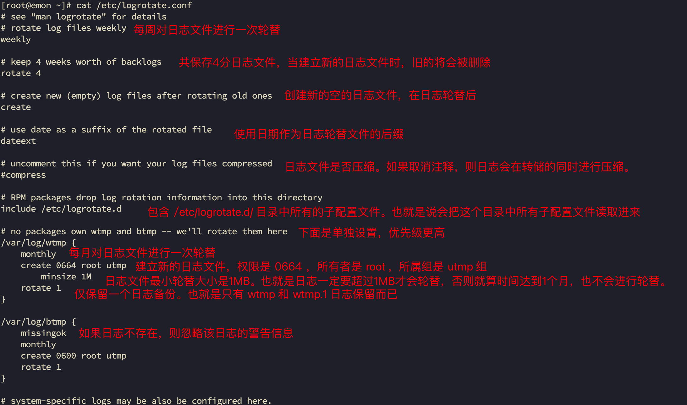

#  Linux学习

[[返回列表](https://github.com/EmonCodingBackEnd/backend-tutorial)](https://github.com/EmonCodingBackEnd/backend-tutorial)

[TOC]

Linux教程视频地址

https://www.bilibili.com/video/BV1Sv411r7vd?spm_id_from=333.788.player.switch&vd_source=b850b3a29a70c8eb888ce7dff776a5d1&p=126

# 第1章 安装

主机名： wenqiu

# 第4章 Linux基础篇-目录结构

## 1.1 Linux目录结构

### 1.1.1 基本介绍

​	linux的文件系统是采用级层式的树状目录结构，在此结构中的最上层是根目录“/”，然后在此目录下再创建其他目录。

​	记住一句经典的话：<span style="color:red;font-weight:bold;">在Linux世界里，一切皆文件</span>

### 1.1.2 具体的目录结构

- /bin

  [<span style="color:red;font-weight:bold;">常用</span>]  (/usr/bin、/usr/local/bin)，是Binary的缩写，这个目录存放着最经常使用的命令。

- /sbin

   (/usr/sbin、/usr/local/sbin)，s就是Super User的意思，这里存放的是系统管理员使用的系统程序。

- /home

  [<span style="color:red;font-weight:bold;">常用</span>]存放普通用户的主目录，在Linux中每个用户都有一个自己的目录，一般该目录名是以用户的账号命名。

- /root

  [<span style="color:red;font-weight:bold;">常用</span>]该目录为系统管理员，也称作超级权限者的用户主目录

- /lib

  系统开机所需要最基本的动态连接共享库，其作用类似于Windows里的DLL文件。几乎所有的应用程序都需要用到这些共享库。

- /lost+found

  这个目录一般情况下是空的，当系统非法关机后，这里就存放了一些文件。

- /etc

  [<span style="color:red;font-weight:bold;">常用</span>]所有的系统管理所需要的配置文件和子目录，比如：安装mysql数据库 my.conf

- /usr

  [<span style="color:red;font-weight:bold;">常用</span>]这是一个非常重要的目录，用户的很多应用程序和文件都放在这个目录下，类似于windows下的program files目录

- /boot

  [<span style="color:red;font-weight:bold;">常用</span>]存放的是启动Linux时使用的一些核心文件，包括一些连接文件以及镜像文件。

- /proc 

  [<span style="color:red;font-weight:bold;">不能动</span>]这个目录是一个虚拟的目录，它是系统内存的映射，访问这个目录来获取系统信息。

- /srv

  [<span style="color:red;font-weight:bold;">不能动</span>]service缩写，该目录存放一些服务启动之后需要提取的数据。

- sys

  [<span style="color:red;font-weight:bold;">不能动</span>]这是linux2.6内核的一个很大的变化。该目录下安装了2.6内核中新出现的一个文件系统sysfs。

- /tmp

  这个目录是用来存放一些临时文件的。

- /dev

  类似于windows的设备管理器，把所有的硬件用文件的形式存储。

- /media

  [<span style="color:red;font-weight:bold;">常用</span>]linux系统会自动识别一些设备，例如U盘、光驱等等，当识别后，linux会把识别的设备挂载到这个目录下。

- /mnt

  [<span style="color:red;font-weight:bold;">常用</span>]系统提供该目录是为了让用户临时挂载别的文件系统的，我们可以将外部的存储挂载在/mnt/上，然后进入该目录就可以查看里面的内容了。

- /opt

  这是给<span style="color:#32CD32;font-weight:bold;">主机额外安装软件所存放的目录（安装包资源）</span>。如安装ORACLE数据库就可以放到该目录下。默认为空。

- /usr/local

  [<span style="color:red;font-weight:bold;">常用</span>]这是另一个给<span style="color:#32CD32;font-weight:bold;">主机额外安装软件所安装的目录（安装目录）</span>。一般是通过编译源码方式安装的程序。

- /var

  [<span style="color:red;font-weight:bold;">常用</span>]这个目录中存放着在不断扩充着的东西，习惯将经常被修改的目录放在这个目录下。包括各种日志文件。

- /selinux [security-enhanced linux]

  SELinux是一种安全子系统，它能控制程序只能访问特定文件，有三种工作模式，可以自行设置。


# 第5章 Linux实操篇-远程登录

# 第6章 Linux实操篇-Vim

<div style="text-align:center;font-weight:bold;">Vim键盘图</div>


# 第7章 Linux实操篇-开机、重启和用户注销

## 7.1 关机&重启命令

- 基本介绍

| 命令            | 作用                    |
| --------------- | ----------------------- |
| shutdown -h now | 立即关机                |
| shutdown -h 1   | “Hello,1分钟后会关机了” |
| shutdown -r now | 现在重启计算机          |
| halt            | 关机，作用和上面一样    |
| reboot          | 现在重新启动计算机      |
| sync            | 把内存的数据同步到磁盘  |

- 使用细节

1. 不管是重启系统还是关闭系统，首先要运行sync命令，把内存中的数据写到磁盘中。
2. 目前的 shutdown/reboot/halt 等命令均已经在关机前进行了sync。<span style="color:red;font-weight:bold;">小心驶得万年船，还是建议关机重启前执行sync</span>

 ## 7.2 用户登录和注销

- 基本介绍

1. 登录时尽量少用root账号登录，因为它是系统管理员，最大的权限，避免操作失误。可以利用普通用户登录，登录后再用“su - 用户名”命令来切换成系统管理员身份。用完后通过exit/logout退出回到之前用户。
2. 在提示符下输入 logout 即可注销用户

- 使用细节

1. logout 注销指令在图形运行级别无效，在运行级别 3 下有效。
2. 运行级别这个概念，<span style="color:blue;font-weight:bold;">参考9.1章节</span>。

# 第8章 Linux实操篇-实用指令

## 8.1 基本介绍

​	Linux系统是一个多用户多任务的操作系统，任何一个要使用系统资源的用户，都必须首先向系统管理员申请一个账号，然后以这个账号的身份进入系统。

## 8.2 添加用户

- 基本语法

```bash
% useradd 用户名
```

- 细节说明

1. 当创建用户成功后，会自动的创建和用户同名的家目录
2. 也可以通过 `useradd -d 指定目录 新的用户名`，给新创建的用户指定家目录

- 选项说明

| 选项        | 功能                                               |
| ----------- | -------------------------------------------------- |
| -c 备注     | 加上备注文字。备注文字会保存在passwd的备注栏位中； |
| -d 登入目录 | 指定用户登入时的起始目录；                         |
| -e 有效期   | 指定账户的有效期限；                               |
| -f 缓冲天数 | 指定在密码过期后多少天即关闭该账号；               |
| -g 群组     | 指定用户所属的群组；                               |
| -G 群组     | 指定用户所属的附加群组；                           |
| -m          | 自动建立用户的登入目录；                           |
| -M          | 不要自动建立用户的登入目录；                       |
| -n          | 取消建立以用户名称为名的群组；                     |
| -r          | 建立系统账号；                                     |
| -s shell    | 指定用户登入后所使用的shell；                      |
| -u uid      | 指定用户id。                                       |


## 8.3  修改用户密码

- 基本语法

```bash
% passwd 用户名
```

## 8.4 删除用户

- 基本语法

```bash
# 默认保留家目录 
% userdel 用户名
# 删除用户及其家目录
% userdel -r 用户名
```

## 8.5 查询用户信息指令

- 基本语法

```bash
% id 用户名
```

- 细节说明

​	当用户不存在时，返回无此用户。

## 8.6 切换用户

- 介绍

​	在操作Linux中，如果当前用户的权限不够，可以通过 `su - 指令`，切换到高权限用户，比如：root。

- 基本语法

```bash
% su - 切换用户名
```

- 细节说明

1. 从权限高的用户切换到权低的用户，不需要输入密码，反之需要。
2. 当需要返回到原来用户时，使用 exit/logout 指令

## 8.7 查看当前用户/登录用户

- 基本语法

```bash
# 查询当前是什么用户身份
% whoami 
# 查询是什么用户身份登录的，以及登录时间
% who am i
# 查看当前登录中的用户有哪些
% who
```

## 8.8 用户组

- 介绍

​	类似于角色，系统可以对有共性的多个用户进行统一的管理。

- 新增组

```bash
% groupadd 组名
```

- 删除组

```bash
% groupdel 组名
```

- 增加用户时直接加上组

```bash
% useradd -g 用户组 用户名
```

- 修改用户的组

```bash
% usermod -g 用户组 用户名 
```

## 8.9 用户和组相关文件

- /etc/passwd 文件

用户（user）的配置文件，记录用户的各种信息。

每行的含义：<span style="color:#1E90FF;">用户名:口令:用户标识号:组标识号:注释性描述:主目录:登录Shell</span>

- /etc/shadow 文件

口令的配置文件

每行的含义：<span style="color:#1E90FF;">登录名:加密口令:最后一次修改时间:最小时间间隔:最大时间间隔:警告时间:不活动时间:失效时间:标志
</span>

- /etc/group 文件

组（group）的配置文件，记录Linux包含的组的信息

每行含义：<span style="color:#1E90FF;">组名:口令:组标识号:组内用户列表
</span>

# 第9章 Linux实操篇-实用指令

## 9.1 指定运行级别

- 基本介绍

运行级别说明：

0 ：关机

1 ：单用户（<span style="color:red;font-weight:bold;">找回丢失密码</span>）

2 ：多用户状态没有网络服务

3 ：多用户状态有网络服务

4 ：系统未使用保留给用户

5 ：图形界面

6 ：系统重启

常用运行级别是3和5，也可以指定默认运行级别，<span style="color:blue;font-weight:bold;">参考14.5.3章节</span>。

```bash
% init 3
```

- 应用实例

命令 ：init[0123456]

应用案例 ：通过init来切换不同的运行级别。比如，从5到3，然后关机。

```bash
# 图形界面，打开终端，执行切换
% init 3
# 多用户状态有网络服务模式下，执行切换
% init 5
```

## 9.2 如何找回root密码

1. 首先，启动系统，进入开机界面，在界面中按“e”进入编辑界面。（可以先上下箭头选择内核，阻止倒计时，然后从容输入 e 进入编辑界面）。


2. 进入编辑界面，使用键盘上的上下键把光标往下移动，找到如下图所示的行，在行的最后面输入： `init=/bin/sh`


3. 接着，输入完成后，直接按快捷键：Ctrl+x进入单用户模式。
4. 接着，在光标闪烁的位置中输入：`mount -o remount,rw /`（注意：各个单词之间有空格），完成后按键盘的回车键（Enter）。如下图。


5. 在新的一行最后面输入：passwd，完成后按键盘的回车键（Enter）。输入密码，然后再次确认密码即可），密码修改成功后，会显示 passwd 的字样，说明密码修改成功。


6. 接着，在鼠标闪烁的位置中（最后一行中）输入：`touch /.autorelabel`（注意：touch与 、 之间有一个空格），完成后按键盘的回车键（Enter）。


7. 继续在光标闪烁的位置中，输入：`exec /sbin/init`（注意：exec 与 / 之间有一个空格），完成后按键盘的回车键（Enter），等待系统自动修改密码（<span style="color:red;font-weight:bold;">这个过程时间可能有点长，耐心等待，不要以为死机了。</span>），完成后，系统会自动重启，新的密码生效了。


## 9.3 帮助指令

### 9.3.1 man 获得帮助信息

基本语法：man [命令或配置文件] (功能描述：获得帮助信息)

案例：查看 ls 命令的帮助信息

```bash
% man ls
```

### 9.3.2 Help 指令

基本语法：help 命令 （功能描述：获得shell内置命令的帮助信息）

```bash
% help cd
```

## 9.4 文件目录类

### 9.4.1 pwd 指令

基本语法：pwd （功能描述：显示当前工作目录的绝对路径）

### 9.4.2 ls 指令

基本语法：ls [选项] [目录或文件]

常用选项：

-l ：以列表的方式显示信息。

-a ：显示当前目录所有的文件和目录，包括隐藏的。

-h ：以人类宜读的方式显示大小尺寸。

-R ：递归处理。

### 9.4.3 cd 指令

基本语法：cd [参赛] (功能描述：切换到指定目录)

理解：绝对路径和相对路径。

```bash
# 回到自己的家目录
% cd ~ 或 cd
# 回到当前目录的上级目录
% cd ..
```

### 9.4.4 mkdir 指令

基本语法：mkdir [选项] 要创建的目录

常用选项：-p 创建多级目录。

```bash
% mkdir /home/dog
% mkdir -p /home/animal/tiger
% mkdir /home/animal/{lion,leopard}
```

### 9.4.5 rmdir 指令

基本语法：rmdir [选项] 要删除的空目录。

使用细节：rmdir 删除的是空目录，如果目录下有内容时无法删除。若要删除非空目录，需要 rm -rf 要删除的目录。

```bash
% rmdir /home/dog
% rm -rf /home/animal
```

### 9.4.6 touch 指令

基本语法：touch 文件名称

```bash
% touch /home/ hello.txt
```

### 9.4.7 cp 指令

基本语法：cp [选项] source dest

常用选项：-r 递归复制整个文件夹

```bash
% cp /home/hello.txt /home/bbb
# 递归复制
% cp -r /home/bbb /opt
# 递归复制，遇到同名直接覆盖不用提示
% \cp -r /home/bbb /opt
```

### 9.4.8 rm指令

说明：rm指令移除文件或目录。

- 基本语法：

rm [选项] 要删除的文件或目录

- 常用选项：

-r ：递归删除整个文件夹

-f ：强制删除不提示

```bash
% rm /home/hello.txt 
% rm -rf /opt/bbb/
```

### 9.4.9 mv 指令

说明：mv指令移动文件与目录或重命名

- 基本语法

```bash
# 重命名
% mv oldNameFile newNameFile
# 移动文件
% mv /temp/movefile /targetFolder
```

### 9.4.10 cat 指令

cat 查看文件内容。

- 基本语法

cat [选项] 要查看的文件

- 常用选项

-n ：显示行号

- 使用细节

cat 只能浏览文件，而不能修改文件，为了浏览方便，一般会带上管道命令 | more

```bash
% cat -n /etc/profile | more
```

### 9.4.11 more 指令

more 指令是一个基于VI编辑器的文本过滤器，它以全屏幕的方式按页显示文本文件的内容。more指令中内置了若干快捷键，详见操作说明：

- 基本语法

more 要查看的文件

- 操作说明

| 操作          | 功能说明                             |
| ------------- | ------------------------------------ |
| 空白键(space) | 代表向下翻一页                       |
| Enter         | 代表向下翻【一行】                   |
| q             | 代表立刻离开more，不再显示该文件内容 |
| Ctrl+F        | 向下滚动一屏                         |
| Ctrl+B        | 返回上一屏                           |
| =             | 输出当前行的行号                     |
| :f            | 输出文件名和当前行的行号             |

- 应用案例

案例：采用 more 查看文件 /etc/profile

### 9.4.12 less 指令

less 指令用来分屏查看文件内容，它的功能与more命令类似，但是比more指令更加强大，支持各种显示终端。less指令在显式文件内容时，并不是一次将整个文件加载之后才显示，而是根据显示需要加载内容，对于显示大型文件具有较高的效率。

- 基本语法

```bash
% less 要查看的文件
```

- 操作说明

| 操作       | 功能说明                                          |
| ---------- | ------------------------------------------------- |
| 空白键     | 向下翻动一页                                      |
| [pagedown] | 向下翻动一页                                      |
| [pageup]   | 向上翻动一页                                      |
| /子串      | 向下搜寻【字典】的功能；n：向下查看；N：向上查找  |
| ?子串      | 向上搜寻【字典】的功能；n : 向上查找；N：向下查找 |
| q          | 离开less这个程序                                  |

### 9.4.13 echo 指令

echo输出内容到控制台。

- 基本语法

echo [选项] [输出内容]

```bash
% echo $PATH
% echo hello,world!
% echo "hello,world\!"
```

### 9.4.14 head 指令

head用于显示文件的开头部分内容，默认情况下head指令显示文件的前10行内容。

- 基本语法

  - `head 文件` （功能描述：查看文件头10行内容）

  - `head -n 5 文件` （功能描述：查看文件头5行内容，5可以是任意行数）

```bash
% head -n 5 /etc/profile
```

### 9.4.15 tail 指令

tail用于输出文件中尾部的内容，默认情况下tail指令显示文件的前10行内容。

- 基本语法

  - `tail 文件` （功能描述：查看文件尾10行内容）

  - `tail -n 5 文件` （功能描述：查看文件尾5行内容，5可以是任意行数）

  - `tail -f 文件` （功能描述：实时追踪该文件的所有更新）

```bash
% tail -n 5 /etc/profile
```

### 9.4.16 > 指令 和 >> 指令

`>` 输出重定向

`>>` 追加

- 基本语法

  - `ls -l > 文件` （功能描述：列表的内容写入文件a.txt中（覆盖写））

  - `ls -la >> 文件` （功能描述：列表的内容追加到文件aa.txt的末尾）

  - `cat 文件1 > 文件2` （功能描述：将文件1的内容覆盖到文件2）

  - `echo "内容" >> 文件` （功能描述：将“内容”追加到文件）

### 9.4.17 ln 指令

软连接也称为符号链接，类似于windows里的快捷方式，主要存放了链接其他文件的路径。

- 基本语法

`ln -s [原文件或目录] [软连接名] `（功能描述：给原文件创建一个软连接）

```bash
% ln -s /root/ myroot
```

### 9.4.18 history 指令

history 查看已经执行过的历史命令，也可以执行历史命令

- 基本语法

history （功能描述：查看已经执行过的历史命令）

```bash
% history
# 显示最近使用过的10个指令
% history 10
# 执行历史编号为5的指令
% !5
```

## 9.5 时间日期类

### 9.5.1 date指令

- 基本语法

1. `date` （功能描述：显示当前日期）
2. `date +%Y` （功能描述：显示当前年份）
3. `date +%m` （功能描述：显示当前月份）
4. `date +%d`（功能描述：显示当前是哪一天）
5. `date "+%Y-%m-%d %H:%M:%S"` （功能描述：显示年月日时分秒）

6. `date -s 字符串时间` （功能描述：设置系统当前时间，比如：2024-12-27 12:42:50）

### 9.5.2 cal 指令

查看日历指令。

- 基本语法

cal [选项] （功能描述：不加选项，显示本月日历）

 ```bash
 % cal
 % cal 2020
 ```

### 9.5.3 timedatectl 指令

（1）查看当前时间。

- 基本语法

```bash
% timedatectl
               Local time: 三 2025-03-05 13:27:39 CST
           Universal time: 三 2025-03-05 05:27:39 UTC
                 RTC time: 三 2025-03-05 05:27:40
                Time zone: Asia/Shanghai (CST, +0800)
System clock synchronized: yes
              NTP service: active
          RTC in local TZ: no
```

- **输出关键信息**：
  - `Local time`：本地时间
  - `Universal time`：UTC 时间
  - `Time zone`：时区（如 `Asia/Shanghai`）
  - `System clock synchronized`：是否已同步（`yes` 或 `no`）
  - `NTP service`：NTP 服务状态（`active` 或 `inactive`）

（2）修正时区（如不正确）

```bash
# 列出所有可用时区
% timedatectl list-timezones | grep -i shanghai

# 设置时区（例如 Asia/Shanghai）
% sudo timedatectl set-timezone Asia/Shanghai
```

### 9.5.4 时间同步服务

Rocky Linux 9 默认使用 `chrony` 作为 NTP 客户端。

（1）安装并启动 Chrony （如未安装）

```bash
sudo dnf install chrony -y
sudo systemctl enable --now chronyd
```

（2）检查 Chrony 状态

```bash
systemctl status chronyd
```

- 确保服务状态为 `active (running)`。

（3）编辑 Chrony 配置文件

```bash
sudo vi /etc/chrony.conf
```

- **添加或修改 NTP 服务器**（选择国内服务器）

```bash
server ntp.aliyun.com iburst
server cn.pool.ntp.org iburst
```

- 保存并退出。

（4） 重启 Chrony 并强制同步

```bash
sudo systemctl restart chronyd
sudo chronyc -a makestep
```

（5）验证同步状态

```bash
chronyc sources -v
```

- 输出中检查源服务器的状态是否为 `^*`（表示已同步）。

### 9.5.5 查看硬件时钟时间

```bash
# 查看硬件时钟时间
sudo hwclock --show
```


## 9.6 查找类

### 9.6.1 find 指令

find指令将从指定目录向下递归地遍历其各个子目录，将满足条件的文件或者目录显示在终端。

- 基本语法

find [搜索范围] [选项]

- 选项说明

| 选项             | 功能                                            |
| ---------------- | ----------------------------------------------- |
| -name <查询方式> | 按照指定的文件名查找模式查找文件                |
| -user <用户名>   | 查找属于指定用户名所有文件                      |
| -size <文件大小> | 按照指定的文件大小查找文件，+n大于 -n小于 n等于 |

- 应用实例

```bash
% find /home -name hello.txt 
% find /opt -user nobody
% find / -size +200M
```

### 9.6.2 locate 指令

​	locate指令可以快速定位文件路径。locate指令利用事先建立的系统中所有文件名称及路径的locate数据库实现快速定位给定的文件。locate指令无需遍历整个文件系统，查询速度较快。为了保证查询结果的准确度，管理员必须定期更新locate时刻。

**基本语法**

 locate 搜索文件

**特别说明**

由于locate指令基于数据库进行查询，所以第一次运行前，必须使用 updatedb 指令创建 locate 数据库。

**应用实例**

- 案例1：请使用locate指令快速定位 hello.txt 文件所在目录。

```bash
% locate hello.txt
```

### 9.6.3 which 指令

which 查看指令所在的位置。 

```bash
% which ls
```

### 9.6.4 whereis 指令

### 9.6.5 grep 指令和管道符号 |

grep 过滤查找，管道符 `|` 表示将前一个命令的处理结果输出传递给后面的命令处理。

**基本语法**

grep [选项] 查找内容 源文件

**常用选项**

| 选项 | 功能               |
| ---- | ------------------ |
| -n   | 显示匹配行及行号。 |
| -i   | 忽略字母大小写。   |

**应用实例**

- 案例1：请在hello.txt文件中，查找 ”yes“ 所在行，并显示行号。

```bash
% grep -n yes hello.txt
```

## 9.7 压缩和解压类

### 9.7.1 gzip/gunzip 指令

​	gzip 用于压缩文件， gunzip 用于解压文件。

**基本语法**

gzip 文件 （功能描述：压缩文件，只能将文件压缩为*.gz文件）

gunzip 文件.gz （功能描述：解压缩文件）

**应用实例**

- 案例1：gzip压缩，将/home下的hello.txt文件进行压缩。

```bash
% gzip hello.txt
```

- 案例2：gunzip解压缩，将 /hom下的hello.txt.gz 文件进行解压缩。

```bash
% gunzip hello.txt.gz 
```

### 9.7.2 zip/unzip指令

zip用于压缩文件，unzip用于解压缩，这个在项目打包发布中很有用。

**基本语法**

`zip [选项] xxx.zip 将要压缩的内容` （功能描述：压缩文件和目录的命令）

`unzip [选项] xxx.zip` （功能描述：解压缩文件）

**zip常用选项**

-r ：递归压缩，即压缩目录。

**unzip常用选项**

-d <目录> ：指定解压后文件的存放目录。

**应用实例**

- 案例1：将 /home 下的所有文件进行压缩成 myhome.zip

```bash
# 压缩/home目录及其下的内容
% zip -r myhome.zip /home/
```

- 案例2：将 myhome.zip 解压到 /opt/tmp 目录下

```bash
% unzip -d /opt/tmp myhome.zip
```

### 9.7.3 tar指令

tar指令是打包指令，最后打包后的文件是.tar.gz的文件

**基本语法**

`tar [选项] xxx.tar.gz 打包的内容` （功能描述：打包目录，压缩后的文件格式.tar.gz）

**选项说明**

| 选项 | 功能               |
| ---- | ------------------ |
| -c   | 产生.tar打包文件   |
| -v   | 显示详细信息       |
| -f   | 指定压缩后的文件名 |
| -z   | 打包同时压缩       |
| -x   | 解包.tar文件       |
| -C   | 指定解压目录       |

**应用实例**

- 案例1：压缩多个文件，将 /home/pig.txt 和 /home/cat.txt 压缩成 pc.tar.gz

```bash
% tar -zcvf pc.tar.gz /home/pig.txt /home/cat.txt
```

- 案例2：将 /home 的文件夹压缩成 myhome.tar.gz

```bash
% tar -zcvf myhome.tar.gz /home
```

- 案例3：将 pc.tar.gz 解压到当前目录

```bash
% tar -zxvf pc.tar.gz
```

- 案例4：将 myhome.tar.gz 解压到 /opt/tmp2 目录下

```bash
% tar -zxvf myhome.tar.gz -C /opt/tmp2
```

# 第10章 Linux实操篇-组管理和权限管理

 ## 10.1 Linxu组基本介绍

在linux中的每个用户必须属于一个组，不能独立于组外。在linux中每个文件有所有者、所在组、其它组的概念。
## 10.2 文件/目录 所有者

一般为文件的创建者，谁创建了该文件，就自然的成为该文件的所有者。

- 查看文件的所有者

```bash
% ls -lah
```


- 修改文件所有者

`chown 用户名 文件名`

```bash
% chown tom apple.txt 
```

## 10.3 文件/目录 所在组

当某个用户创建了一个文件后，这个文件的所在组就是该用户所在的组。

- 查看文件/目录所在组

```bash
% ls -lah
```

 

- 修改文件所在的组

`chgrp 组名 文件名`

```bash
% chgrp tom apple.txt
```

## 10.3 文件/目录 其他组

除文件的所有者和所在组的用户外，系统的其它用户都是文件的其它组。

**如何改变用户所在组？**

在添加用户时，可以指定该用户添加到哪一个组，同样的用root的管理权限可以改变某个用户所在的组。

- 改变用户所在组  

1. usermod -g 组名 用户名

- 应用实例

将zwj这个用户从原来所在组，修改到wudang组。

```bash
% usermod -g wudang zwj
```

## 10.4 权限的基本介绍

ls -l 中显示的内容如下：

```bash
-rw-------. 1 root root 1606 12月 22 19:46 anaconda-ks.cfg
```

0-9位说明：

- 第0位确定文件类型（d,-,l,c,b）
  - l是链接，相当于windows的快捷方式。
  - d是目录，相当于windows的文件夹。
  - c是字符设备文件，鼠标，键盘。
  - b是块设备，比如硬盘。
- 第1-3位确定所有者（该文件的所有者）拥有该文件的权限。--user
- 第4-6位确定所属组（同用户组的）拥有该文件的权限。--group
- 第7-9位确定其他用户拥有该文件的权限。--other

 ## 10.5 rwx权限详解

- rwx作用到文件
  1. r 代表可读：可以读取、查看
  2. w 代表可写：可以修改，但是不代表可以删除该文件，删除一个文件的前提条件是对该文件所在的目录有写权限，才能删除该文件。
  3. x 代表可执行：可以被执行。
- rwx作用到目录
  1. r 代表可读：可以读取，ls查看目录内容。
  2. w 代表可写：可以修改，对目录内创建+删除+重命名目录。
  3. x 代表可执行：可以进入该目录。

## 10.6 文件及目录权限实际案例

- ls -l中显示的内容如下

```bash
-rwxrw-r--. 1 root root   80 12月 28 01:28 abc
```

1. 10个字符确定不同用户能对文件干什么。

第一个字符代表文件类型：- l d c b

其余字符每3个一组（rwx）读（r）写（w）执行（x）

第一组rwx：文件拥有者的权限是读、写和执行。

第二组rw-：与文件拥有者同一组的用户的权限是读、写但不能执行。

第三组r--：不与文件拥有者同组的其它用户的权限是读，不能写和执行。

2. 可用数字表示为：r=4,w=2,x=1 因此rwx=4+2+1=7
3. 其他说明

1				文件：硬链接数 或目录：子目录数

root		  	用户

root		  	组

80		     	文件大小（字节），如果是文件夹，显示4096字节

12月 28 01:28	最后修改日期

abc			  文件名

## 10.7 修改权限-chmod

- 基本说明：

通过chmod指令，可以修改文件或者目录的权限。

**第一种方式：+、-、=变更权限**

u:所有者 g:所有组 o:其他人 a:所有人（u、g、o的总和）

1）chmod u=rwx,g=rx,o=x 文件/目录名

2）chmod o+w 文件/目录名

3）chmod a-x 文件/目录名

- 案例演示

1. 给abc文件的所有者读写执行的权限，给所在组读执行权限，给其他组读执行权限。

```bash
% chmod u=rwx,g=rx,o=rx abc
```

2. 给abc文件的所有者除去执行的权限，增加组写的权限。

```bash
% chmod u-x,g+w abc
```

3. 给abc文件的所有用户添加读的权限

```bash
% chmod a+r abc
```

**第二种方式：通过数字变更权限**

r=4,w=2,x=1 因此rwx=4+2+1=7

chmod u=rwx,g=rx,o=x 文件目录名

相当于 chmod 751 文件目录名

- 案例演示

1. 要求：将 /home/abc.txt 文件的权限修改成 rwxr-xr-x，使用数字方式实现。

```bash
% chmod 755 /home/abc.txt 
```

## 10.8 修改文件所有者-chown

- 基本介绍

`chown newowner 文件/目录 改变所有者`

`chown newowner:newgroup 文件/目录 改变所有者和所在组`

-R 如果是目录，则使其下所有子文件或目录递归生效。

- 案例演示

1. 请将 /home/abc.txt 文件的所有者修改成 tom

```bash
% chown tom /home/abc.txt
```

2. 请将 /home/kkk 目录下所有的文件和目录的所有者都修改成tom

```bash
% chown -R tom /home/kkk
```

## 10.9 修改文件/目录所在组-chgrp

- 基本介绍

`chgrp newgroup 文件/目录` 改变所在组

- 案例演示

1. 请将 /home/abc.txt 文件的所在组修改成 shaolin（少林）

```bash
% chgrp shaolin /home/abc.txt
```

2. 请将 /home/kkk 目录下所有的文件和目录的所在组都修改成 shaolin（少林）

```bash
% chgrp -R shaolin /home/kkk
```

## 10.10 最佳实践-警察和土匪游戏

police, bandit

jack,jerry:警察

xh,xq:土匪

1. 创建组

```bash
% groupadd police
% groupadd bandit
```

2. 创建用户

```bash
% useradd -g police jack
% useradd -g police jerry
% useradd -g bandit xh
% useradd -g bandit xq
```

3. jack创建一个文件，自己可以读写，本组人可以读，其它组没任何权限。

```bash
% jack登录
% vim jack.txt 
% chmod 640 jack.txt
```

4. jack修改该文件，让其它组人可以读，本小组人可以读写。

```bash
% chmod g+rw,o+r jack.txt
```

5. xh投靠警察，看看是否可以读写。

```bash
% usermod -g police xh
```

# 第11章 Linux实操篇-定时任务调度

## 11.1 crond 任务调度

crontab 进行定时任务的设置

- 概述

任务调度：是指系统在某个时间执行的特定的命令或程序。

任务调度分类：1.系统工作；有些重要的工作必须周而复始地执行。如病毒扫描等。

个别用户工作：个别用户可能希望执行某些程序，比如对mysql数据库的备份。

- 基本语法

`crontab [选项]`

- 常用选项

| 选项 | 功能                          |
| ---- | ----------------------------- |
| -e   | 编辑crontab定时任务           |
| -l   | 查询crontab任务               |
| -r   | 删除当前用户所有的crontab任务 |

- 快速入门

设置任务调度文件：/etc/crontab

设置个人任务调度。执行`crontab -e`命令。

接着输入任务到调度文件，如：

```bash
*/1 * * * * ls -l /etc/ > /tmp/to.txt
*/1 * * * * /home/time.sh
```

- 参数细节说明

5个占位符的说明。

| 项目       | 含义                 | 范围                    |
| ---------- | -------------------- | ----------------------- |
| 第一个 "*" | 一小时当中的第几分钟 | 0-59                    |
| 第二个 "*" | 一天当中的第几小时   | 0-23                    |
| 第三个 "*" | 一个月当中的第几天   | 1-31                    |
| 第四个 "*" | 一年当中的第几月     | 1-12                    |
| 第五个 "*" | 一周当中的星期几     | 0-7（0和7都代表星期日） |

- 特殊符号的说明

| 特殊符号 | 含义                                                         |
| -------- | ------------------------------------------------------------ |
| *        | 代表任何时间。比如第一个 "*" 就代表一小时中每分钟都执行一次的意思。 |
| ,        | 代表不连续的时间。比如 "0 8,12,16 * * * 命令"，就代表在每天的8点0分、12点0分、16点0分都执行一次命令 |
| -        | 代表连续的时间范围，比如"0 5 * * 1-6 命令"，代表在周一到周六的凌晨5点0分执行命令。 |
| */n      | 代表每隔多久执行一次。比如 "*/10 * * * * 命令",代表每隔10分钟就执行一遍命令。 |

- 重启任务调度

```bash
% service crond restart
```

## 11.2 at定时任务

- 基本介绍

1. at命令是一次性定时计划任务，at的守护进程atd会以后台模式运行，检查作业队列来运行。
2. 默认情况下，atd守护进程每60秒检查作业队列，有作业时，会检查作业运行时间，如果时间与当前时间匹配，则运行此作业。
3. at命令是一次性定时计划任务，执行完一个任务后不再执行此任务了。

4. 在使用at命令的时候，一定要保证atd进程的启动，可以使用相关指令来查看。

```bash
% ps -ef|grep atd
root      1548     1  0 12月28 ?      00:00:00 /usr/sbin/atd -f
root     14306 11352  0 22:55 pts/1    00:00:00 grep --color=auto atd
```

- at命令格式

`at [选项] [时间]`

执行2次 `Ctrl + D` 结束at命令的输入。

- at命令选项

| 选项          | 含义                                                       |
| ------------- | ---------------------------------------------------------- |
| -m            | 当指定的任务被完成后，将给用户发送邮件，即使没有标准输出。 |
| -l            | 小写字母L，atq的别名。                                     |
| -d            | atrm的别名。                                               |
| -v            | 显示任务将被执行的时间。                                   |
| -c            | 打印任务的内容到标准输出。                                 |
| -V            | 显示版本信息。                                             |
| -q <队列>     | 使用指定的队列.                                            |
| -f <文件>     | 从指定文件读入任务而不是从标准输入读入。                   |
| -t <时间参赛> | 以时间参赛的形式提交要运行的任务。                         |

- at时间定义

at指定时间的方法：

1. 接受在当天的hh:mm （小时:分钟) 式的时间指定。假如该时间已经过去，那么就放在第二天执行。例如：04:00
2. 使用midnight（深夜），noon（中午），teatime（饮茶时间，一般是下午4点）等比较模糊的词语来指定时间。
3. 采用12小时计时制，即在时间后面加上AM（上午）或PM（下午）来说明是上午还是下午。例如：12pm
4. 指定命令执行的具体日期，指定格式为month day（月日）或mm/dd/yy（月/日/年）或dd.mm.yy（日.月.年），指定的日期必须跟在指定时间的后面。例如：04:00 2021-03-1

5. 使用相对计时法。指定格式为：now + count time-units，now就是当前时间，time-units是时间单位，这里能够是minutes（分钟）、hours（小时）、days（天）、weeks（星期）。count是时间的数量，几天，几小时。例如：now + 5 minutes
6. 直接使用today（今天）、tomorrow（明天）来指定完成命令的时间。

- 应用实例

1. 案例1：2天后的下午5点执行 /bin/ls /home

```bash
# 编写完成后，输入2次Ctrl+D（在/home后面，输入2次Ctrl+D后得到<EOT>）
% at 5pm + 2 days
at> /bin/ls /home<EOT>
job 1 at Tue Dec 31 17:00:00 2024 
```

2. 案例2：`atq`命令来检查系统中没有执行的工作任务

```bash
% atq
1       Tue Dec 31 17:00:00 2024 a root
% at -l
1       Tue Dec 31 17:00:00 2024 a root
```

3. 案例3：明天17点钟，输出时间到指定文件内，比如 /root/date100.log


4. 案例4:2分钟后，输出时间到指定文件内，比如 /root/date200.log

```bash
% at now + 2 minutes
at> date > /root/date200.log<EOT>
job 3 at Sun Dec 29 23:36:00 2024
```

5. 案例5：删除已经设置的任务，`atrm 编号`

```bash
% atrm 2
% at -d 1
```

# 第12章 Linux实操篇-Linux磁盘分区、挂载

## 12.1 lsblk查看Linux分区

- 原理介绍

1. Linux来说无论有几个分区，分给哪一个目录使用，它归根结底就只有一个目录，一个独立且唯一的文件结构，Linux中每个分区都是用来组成整个文件系统的一部分。
2. Linux采用了一种叫做”载入“的处理方法，它的整个文件系统中包含了一整套的文件和目录，且将一个分区和一个目录联系起来。这时要载入的一个分区将使它的存储空间在一个目录下获得。

- 查看所有设备挂载情况

命令：`lsblk`或`lsblk -f`


- 硬盘说明

1. Linux硬盘分IDE硬盘和SCSI硬盘，目前基本上是SCSI硬盘。
2. 对于IDE硬盘，驱动器标识符为”hdx~“，其中”hd“表明分区所在设备的类型，这里是指IDE硬盘了。”x“为盘号（a为基本盘，b为基本从属盘，c为辅助主盘，d为辅助从属盘），”~“代表分区，前四个分区用数字1到4表示，它们是主分区或扩展分区，从5开始就是逻辑分区。例，hda3表示为第一个IDE硬盘上的第三个主分区或扩展分区，hdb2表示为第二个IDE硬盘上的第二个主分区或扩展分区。
3. 对于SCSI硬盘则标识为”sdx~“，SCSI硬盘是用”sd“来表示分区所在设备的类型的，其余则和IDE硬盘的表示方法一样。
4. NVMe 硬盘，nvme0n1 这个磁盘名是 NVMe Disk 0 Namespace 1 的缩写，意思是第一个 NVMe 硬盘的第一个命名空间1。每个 NVMe 硬盘上的分区通过在磁盘名后面加上一个 p 和一个十进制数字表示，例如 nvme0n1p1 和 nvme0n1p2 表示系统中第一个 NVMe 硬盘的第一个命名空间的第一个和第二个分区。

## 12.2 fdisk挂载的经典案例

- 说明

下面我们以增加一块硬盘为例来熟悉下磁盘的相关指令和深入理解磁盘分区、挂载、卸载的概念。

**如何增加一块硬盘**

1. 虚拟机添加硬盘

   1. 关闭虚拟机
   2. 在【虚拟机】菜单中，选择【设置】，然后设备列表里添加硬盘，然后一路【下一步】，中间只有选择硬盘大小的地方需要修改，直到完成。然后<span style="color:red;font-weight:bold;">重启系统</span>（才能识别）！

   

   

   

   

2. 分区

   1. 查看挂载的硬盘

   

   2. 分区命令

   ```bash
   % fdisk /dev/nvme0n2
   ```

   

   3. 查看挂载信息

   

3. 格式化

格式化磁盘

```bash
# xfs是分区类型
% mkfs -t xfs /dev/nvme0n2p1
meta-data=/dev/nvme0n2p1         isize=512    agcount=4, agsize=65472 blks
         =                       sectsz=512   attr=2, projid32bit=1
         =                       crc=1        finobt=0, sparse=0
data     =                       bsize=4096   blocks=261888, imaxpct=25
         =                       sunit=0      swidth=0 blks
naming   =version 2              bsize=4096   ascii-ci=0 ftype=1
log      =internal log           bsize=4096   blocks=855, version=2
         =                       sectsz=512   sunit=0 blks, lazy-count=1
realtime =none                   extsz=4096   blocks=0, rtextents=0
```

4. 挂载

挂载：将一个分区和一个目录联系起来。

```bash
[root@emon ~]# mkdir /newdisk
[root@emon ~]# mount /dev/nvme0n2p1 /newdisk/
[root@emon ~]# lsblk
NAME               MAJ:MIN RM  SIZE RO TYPE MOUNTPOINT
nvme0n1            259:0    0   64G  0 disk 
├─nvme0n1p3        259:3    0 62.5G  0 part 
│ ├─cl_fedora-swap 253:1    0    8G  0 lvm  [SWAP]
│ └─cl_fedora-root 253:0    0 54.5G  0 lvm  /
├─nvme0n1p1        259:1    0  500M  0 part /boot/efi
└─nvme0n1p2        259:2    0    1G  0 part /boot
sr0                 11:0    1  7.6G  0 rom  
nvme0n2            259:4    0    1G  0 disk 
└─nvme0n2p1        259:5    0 1023M  0 part /newdisk
```

 说明：如何卸载？

```bash
# 卸载方式一
% umount /dev/nvme0n2p1
# 卸载方式二
% unmount /newdisk
```

<span style="color:red;font-weight:bold;">注意：用命令行挂载重启后会失效！</span>

5. 设置虚拟机启动后自动挂载

通过修改 /etc/fstab 实现自动挂载。添加完成后，执行 mount -a 即刻生效。

```bash
% vim /etc/fstab
# 个人配置
/dev/nvme0n2p1          /newdisk                xfs     defaults        0 0
```

## 12.3 df磁盘情况查询

- 查询系统整体磁盘使用情况

```bash
% df -Th
```

- 查询指定目录磁盘占用情况

```bash
% du -sh
```

查询指定目录的磁盘占用情况，默认为当前目录。

| 选项          | 含义                       |
| ------------- | -------------------------- |
| -s            | 指定目录占用大小汇总       |
| -h            | 带计量单位                 |
| -a            | 含文件                     |
| --max-depth=1 | 子目录深度（与-s互斥）     |
| -c            | 列出明细的同时，增加汇总值 |

- 应用实例

```bash
% du -h --max-depth=1 /home
```

## 12.4 磁盘情况-工作实用指令

**统计/opt文件夹下文件的个数**

```bash
% ls -l /root/ | grep "^-" | wc -l
```

**统计/opt文件夹下目录的个数**

```bash
% ls -l /root/ | grep "^d" | wc -l
```

**统计/opt文件夹下文件的个数，包括子文件夹里的**

```bash
% ls -lR /root/ | grep "^-" | wc -l
```

**统计/opt文件夹下目录的个数，包括子文件夹里的**

```bash
% ls -lR /root/ | grep "^d" | wc -l
```

**以树状显示目录结构**

```bash
# 若没有tree命令，则 yum install -y --nogpgcheck tree 安装即可
% tree /root
% tree -L 1 /root
```

# 第13章 Linux实操篇-网络配置

## 13.1 Linux网络环境配置

- Mac下查看虚拟机的子网IP和子网掩码


### 13.1.1 CentOS7网卡配置

- 虚拟机修改网卡配置文件


- 虚拟机修改内容如下


注意：

1. DNS1 表示域名解析器，值也可以是192.168.200.2

2. BOOTPROTO 表示IP的配置方法[none|static|bootp|dhcp]（引导时不使用协议|静态分配IP|BOOTP协议|DHCP协议）

3. TYPE=Ethernet 表示网络类型
4. DEVICE=ens160 表示接口名（设备，网卡）
5. ONBOOT=yes 表示系统启动的时候网络接口是否有效

- 重启网络

```bash
% systemctl restart network
# 或者
% service network restart
# 或者
% reboot
```

### 13.1.2 Rocky9网卡配置

```bash
% vim /etc/NetworkManager/system-connections/ens160.nmconnection
```


| 命令                                                        | 说明                                                         |
| ----------------------------------------------------------- | ------------------------------------------------------------ |
| nmcli n                                                     | 查看NM托管状态，<br />如果是disabled会导致无法nmcli conn up XX成功 |
| nmcli n on                                                  | 开启NM托管状态                                               |
| nmcli conn show                                             | 查询网卡的配置信息                                           |
| nmcli device status                                         | 查询网卡的连接状态                                           |
| nmcli device disconnect ens160                              | 断开设备连接                                                 |
| nmcli device connect ens160                                 | 打开连接                                                     |
| nmcli                                                       | 查询所有网卡信息                                             |
| nmcli device show ens160                                    | 查看ens160网卡信息                                           |
| nmcli conn show ens160                                      | 查看ens160网卡配置                                           |
| nmcli conn modify ens160 ipv4.method manual                 | 设置IP地址为手动指定                                         |
| nmcli conn modify ens160 connection.autoconnect yes         | 设置网卡开机自启动                                           |
| nmcli conn modify ens160 ipv4.addreses '192.168.200.116/24' | 设置网卡IP                                                   |
| nmcli conn modify ens160 ipv4.gateway '192.168.200.2'       | 设置网关                                                     |
| nmcli conn modify ens160 ipv4.dns '192.168.200.2'           | 设置DNS                                                      |

<span style="color:red;font-weight:bold;">注意：DNS还可以是`nmcli conn modify ens160 ipv4.dns '192.168.200.2,223.5.5.5,8.8.8.8,114.114.114.114'`</span>

- 重新加载配置文件

```bash
% nmcli conn reload
```

- 不重启系统，让网卡生效

```bash
% nmcli conn up ens160
```

## 13.2 设置主机名和hosts映射

### 13.2.1 设置主机名

为了方便记忆，可以给linux系统设置主机名，也可以根据需要修改主机名

- 第一步

```bash
[root@emon ~]# hostnamectl set-hostname emon
```

- 第二步：验证

```bash
[root@emon ~]# cat /etc/hostname
emon
[root@emon ~]# hostname
emon
```

- 第三步：配置

```bash
[root@emon ~]# vim /etc/hosts
```

```bash
# 这里也可以是某个具体的IP地址
127.0.0.1   emon
```

- 第四部：退出Shell，重新登录即可

### 13.2.2 设置hosts映射

DNS解析过程分析   ：用户在浏览器输入了www.baidu.com

Hosts是什么？一个文本文件，用来记录IP和Hostname（主机名）的映射关系。

DNS是什么？就是Domain Name System的缩写，翻译过来就是域名系统，是互联网上作为域名和IP地址相互映射的一个分布式数据库。

1. 浏览器先检查浏览器缓存中有没有该域名解析IP地址，有就先调用这个IP完成解析；如果没有，就检查DNS解析器缓存，如果有直接返回IP完成解析。这两个缓存，可以理解为本地解析器缓存。
2. 一般来说，当电脑第一次成功访问某一网站后在一定时间内，浏览器或操作系统会缓存他的IP地址（DNS解析记录）。如在cmd窗口中输入。

ipconfig /displaydns 	// DNS域名解析缓存

ipconfig /flushdns 	    // 手动清理DNS缓存 

3. 如果本地解析器缓存没有找到对应映射，检查系统中hosts文件中有没有配置对应的域名IP映射，如果有，则完成解析并返回。
4. 如果本地DNS解析器缓存和hosts文件中均没有找到对应的IP，则到域名服务DNS进行解析域。


- 使用SwitchHosts软件配置本地Mac的hosts。


- 编辑 /etc/hosts 修改虚拟机的hosts

```bash
vim /etc/hosts
```

```bash
# 添加下面一行
192.168.200.1 wenqiu
```

# 第14章 Linux实操篇-进程管理

## 14.1 基本介绍

1. 在Linux中，每个执行的程序都成为一个进程。每一个进程都分配一个ID号（pid，进程号）。
2. 每个进程都可能以两种方式存在的。前台与后台，所谓前台进程就是用户目前的屏幕上可以进行操作的。后台进程则是实际在操作，但由于屏幕上无法看到的进程，通常使用后台方式执行。
3. 一般系统的服务都是以后台进程的方式存在，而且都会常驻在系统中。直到关机才结束。

## 14.2 ps显示系统执行的进程

**基本介绍**

ps命令是用来查看目前系统中，有哪些正在执行，以及它们执行的状况。可以不加任何参数。

ps显示的信息选项：

| 字段 | 说明                   |
| ---- | ---------------------- |
| PID  | 进程识别号             |
| TTY  | 终端机号               |
| TIME | 此进程所消耗CPU时间    |
| CMD  | 正在执行的命令或进程名 |

```bash
% ps
  PID TTY          TIME CMD
 4811 pts/1    00:00:00 bash
 5073 pts/1    00:00:00 ps
```

| 命令     | 含义                                             |
| -------- | ------------------------------------------------ |
| ps -a    | 显示当前终端的所有进程信息                       |
| ps -u    | 显示与指定用户相关的进程信息                     |
| ps -x    | 显示后台进程运行的参数                           |
| ps -aux  | 显示所有进程信息，包括所有用户的进程和无终端进程 |
| -A 或 -e | 显示所有进程信息                                 |
| ps -ef   | 显示所有进程的完整信息，包括命令行参数           |

**ps -aux命令的输出内容解释 **


**ps -ef命令的输出内容解释**


## 14.3 终止进程kill和killall

- 介绍：

若是某个进程执行一半需要停止时，或是已消耗了很大的系统资源时，此时可以考虑停止该进程。使用kill命令来完成此项任务。

- 基本语法

`kill [选项] 进程号` （功能描述：通过进程号杀死进程）

`killall 进程名称` （功能描述：通过进程名称杀死进程，也支持通配符，这在系统因负载过大而变得很慢）

- 常用选项

-9 ：表示强迫进程立即停止

- 最佳实践

1. 案例1：踢掉某个非法登录用户

```bash
# 查找 emon 用户的登录进程ID
% ps -aux | grep sshd
% kill 6070
```

2. 案例2：终止远程登录服务sshd，在适当时候再次重启sshd服务。

```bash
# 查找 /usr/sbin/sshd 的进程ID
% ps -aux | grep sshd
# 杀掉之后，新的用户无法登入了，但已经登录的用户还可以使用
% kill 1268
% systemctl start sshd
```

3.  案例3：终止多个gedit

```bash
% killall gedit
```

4. 案例4：强制杀掉一个终端

```bash
% ps -aux | grep bash
% kill -9 ps -aux | grep bash
```

## 14.4 查看进程树pstree

- 基本语法

`pstree [选项]` 可以更加直观的来看进程信息

- 常用选项

-p ：显示进程的PID

-u ：显示进程的所属用户

- 应用实例

1. 案例1：请以树状的形式显示进程的pid

```bash
% pstree -p
```

2. 案例2：请以树状的形式进程的用户

```bash
% pstree -u
```

## 14.5 服务（service）管理

### 14.5.1 service管理指令

- 介绍

服务（service）本质就是进程，但是是运行在后台的，通常都会监听某个端口，等待其他程序的请求，比如（mysql、sshd防火墙等），因此我们又称为守护进程，是Linux中非常重要的知识点。

- service管理指令

1. service 服务名 [start | stop | restart | reload | status]

2. 在CentOS7.0后，<span style="color:red;font-weight:bold;">很多服务不再使用service，而是systemctl代替</span>。
3. service指令管理的服务在 /etc/init.d 查看

```bash
% ls -l /etc/init.d/
总用量 40
-rw-r--r--. 1 root root 18281 5月  22 2020 functions
-rwxr-xr-x. 1 root root  4569 5月  22 2020 netconsole
-rwxr-xr-x. 1 root root  7928 5月  22 2020 network
-rw-r--r--. 1 root root  1160 10月  2 2020 README
```

- service管理指令案例

请使用service指令，查看、关闭、启动 network 【注意：在虚拟系统演示，因为网络连接会关闭】

### 14.5.2 setup查看服务名

- 查看服务名

方式1：使用 setup -> 系统服务 就可以看到全部。

```bash
% setup
```

说明：服务名前面带有星号[*]表示开机启动。

方式2：/etc/init.d 看到service指令管理的服务。

```bash
% ls -l /etc/init.d/
总用量 40
-rw-r--r--. 1 root root 18281 5月  22 2020 functions
-rwxr-xr-x. 1 root root  4569 5月  22 2020 netconsole
-rwxr-xr-x. 1 root root  7928 5月  22 2020 network
-rw-r--r--. 1 root root  1160 10月  2 2020 README
```

### 14.5.3 服务的运行级别（runlevel）

- 服务的运行级别（runlevel）

Linux系统有7种运行级别（runlevel），常用的是级别3和5。

运行级别0：系统停机状态，系统默认运行级别不能设为0，否则不能正常启动。

运行级别1：单用户工作状态，root权限，用于系统维护，禁止远程登录。

运行级别2：多用户工作状态（没有NFS），不支持网络。

运行级别3：完全的多用户状态（有NFS），登录后进入控制台命令行模式。

运行级别4：系统未使用，保留。

运行级别5：X11控制台，登录后进入图形GUI模式。

运行级别6：系统正常关闭并重启，默认运行级别不能设为6，否则不能正常启动。

开机的流程说明：

开机=>BIOS=>/boot=>systemd进程=>运行级别=>运行级对应的服务。

- CentOS7之前如何指定运行级别？

在CentOS7之前，在 /etc/inittab 文件中。

- CentOS7及之后如何指定运行级别？

  - 默认级别说明
    - <span style="color:blue;">multi-user.target</span> : analogous to runlevel 3
    - <span style="color:blue;">graphical.target</span> : analogous to runlevel 5

  

  - 查看默认级别

  ```bash
  % systemctl get-default
  ```

  - 设置默认级别为 3

  ```bash
  % systemctl set-default multi-user.target
  ```

### 14.5.4 chkconfig指令

- 介绍

1. 通过chkconfig命令可以给服务的各个运行级别设置自启动/关闭。
2. chkconfig指令管理的服务在 /etc/init.d 查看。
3. 注意：CentOS7.0后，很多服务<span style="color:red;font-weight:bold;">使用 systemctl</span>管理。

- chkconfig基本语法

```bash
# 查看服务
% chkconfig --list
% chkconfig network --list
```

```bash
# 设置服务在5级别下自启动/关闭，这种设置需要重启生效
% chkconfig --level 5 network on/off 
```

### 14.5.5 systemctl管理指令

- 管理指令基本语法

1. 基本语法

```bash
% systemctl [start | stop | restart | status] 服务名
```

2. systemctl指令管理的服务在 `/usr/lib/systemd/system` 查看

```bash
% ls -l /usr/lib/systemd/system
```

- systemctl设置服务的自启动状态

1. `systemctl list-unit-files [| grep 服务名]`（查看服务开机启动状态，grep可以进行过滤）

   ```bash
   % systemctl list-unit-files  --type=service
   ```
2. `systemctl enable 服务名` （设置服务开机启动）
3. `systemctl disable 服务名` （关闭服务开机启动）
4. `systemctl is-enabled 服务名` （查看某个服务是否自启动的）

- 应用案例

1. 查看当前防火墙的状况，关闭防火墙和重启防火墙。

```bash
# 这种方式只是临时生效，当重启系统后，还是回归以前对服务的设置。
% systemctl stop firewalld
# 永久生效命令
% systemctl disable firewalld
```

### 14.5.6 firewall-cmd打开或者关闭指定端口

在真正的生产环境，往往需要将防火墙打开，但问题来了，如果我们把防火墙打开，那么外部请求数据包就不能跟服务器监听端口通讯。这时，需要打开制定的端口。比如80、22、8080等，这个又怎么做呢？

- firewall指令

打开端口：`firewall-cmd --permanent --add-port=端口号/协议`

关闭端口：`firewall-cmd --permanent --remove-port=端口号/协议`

重新载入，才能生效：`firewall-cmd --reload`

查询端口是否开放：`firewall-cmd --query-port=端口/协议`

- 应用案例

1. 启用防火墙，测试111端口是否能telnet

```bash
% telnet 192.168.200.116 111
```

2. 开放111端口

```bash
% firewall-cmd --permanent --add-port=111/tcp
% firewall-cmd --reload
```

此时，telnet能通：

```bash
% telnet emon 111
Trying 192.168.200.116...
Connected to emon.
Escape character is '^]'.
^]
telnet> quit
Connection closed.
```

3. 再次关闭111端口

```bash
# 特殊说明：关闭的操作，在reload之前已经生效了
% firewall-cmd --permanent --remove-port=111/tcp
% firewall-cmd --reload
```

## 14.6 动态监控进程

### 14.6.1 top命令详解

- 介绍

top与ps命令很相似。它们都用来显示正在执行的进程。top与ps最大的不同之处，在于top在执行一段时间可以更新正在运行的进程。

- 基本语法

```bash
% top [选项]
```

- 选项说明

| 选项    | 功能                                               |
| ------- | -------------------------------------------------- |
| -d 秒数 | 指定top命令每隔几秒更新。默认是3秒。比如：top -d 5 |
| -i      | 使top不显示任何闲置或者僵死进程。                  |
| -p      | 通过指定监控进程ID来仅仅监控某个进程的状态。       |

- top命令输出结果解释

默认top命令进入时是按照CPU占用来排序的。


<span style="color:#1E90FF;font-weight:bold;">第一行：</span>

```bash
top - 02:36:46 up 1 day,  3:52,  3 users,  load average: 0.00, 0.00, 0.00
```

当前时间		02:36:46

系统运行时间	up 1 day,  3:52

用户数量		3 users

CPU负载情况	load average: 0.00, 0.00, 0.00	3个值累加除以3，若小于0.7表示压力不大。

<span style="color:#1E90FF;font-weight:bold;">第二行</span>

```bash
Tasks: 232 total,   1 running, 131 sleeping,   0 stopped,   0 zombie
```

任务数量		Tasks: 232 total

运行数量		1 running

睡眠数量		131 sleeping

停止数量		0 stopped

僵死数量		0 zombie

<span style="color:#1E90FF;font-weight:bold;">第三行：</span>

```bash
%Cpu(s):  0.0 us,  0.0 sy,  0.0 ni,100.0 id,  0.0 wa,  0.0 hi,  0.0 si,  0.0 st
```

用户空间占用CPU百分比	0.0 us

内核空间占用CPU百分比	0.0 sy

用户进程空间内改变过优先级的进程占用CPU百分比	0.0 ni

空闲CPU百分比	100.0 id

等待输入输出的CPU时间百分比	0.0 wa

硬中断（Hardware IRQ）占用CPU的百分比	0.0 hi

软中断（Software Interrupts）占用CPU的百分比	0.0 si

用于有虚拟cpu的情况，用来指示被虚拟机偷掉的cpu时间	0.0 st

<span style="color:#1E90FF;font-weight:bold;">第四行：</span>

```bash
KiB Mem :  8123820 total,  7631400 free,   247432 used,   244988 buff/cache
```

物理总内存	8123820 total

物理空闲内存	7631400 free

物理使用内存	247432 used

缓存内存		244988 buff/cache

<span style="color:#1E90FF;font-weight:bold;">第五行：</span>

```bash
KiB Swap:  8388604 total,  8388604 free,        0 used.  7684272 avail Mem 
```

Swap总内存	8388604 total

Swap空闲内存	8388604 free

Swap使用内存	0 used

swap可用内存	7684272 avail Mem

<span style="color:#1E90FF;font-weight:bold;">进程结果解释</span>

```bash
  PID USER      PR  NI    VIRT    RES    SHR S  %CPU %MEM     TIME+ COMMAND                                   
    1 root      20   0  158440   8248   5272 S   0.0  0.1   0:03.10 systemd                                   
    2 root      20   0       0      0      0 S   0.0  0.0   0:00.08 kthreadd  
```

| 列名    | 含义                                                         |
| ------- | ------------------------------------------------------------ |
| PID     | 进程ID                                                       |
| USER    | 进程拥有者的用户名                                           |
| PR      | 进程优先级                                                   |
| NI      | 进程优先级值。正常为0， 负值表示优先级越高，正值表示优先级越低 |
| VIRT    | 进程使用的虚拟内存总量，单位KB。                             |
| RES     | 进程使用的物理内存大小，单位KB。                             |
| SHR     | 进程使用的共享内存大小，单位KB。                             |
| S       | 进程的状态，通常是'S'-休眠、'R'-运行中、'Z'-僵尸、'N'-低优先级任务 |
| %CPU    | 进程使用的CPU时间百分比。                                    |
| %MEM    | 进程使用的物理内存百分比。                                   |
| TIME+   | 进程运行的总CPU时间。                                        |
| COMMAND | 启动进程的命令名称                                           |

### 14.6.2 top命令交互

- 交互操作说明

| 操作 | 功能                          |
| ---- | ----------------------------- |
| P    | 以CPU使用率排序，默认就是此项 |
| M    | 以内存的使用率排序            |
| N    | 以PID排序                     |
| q    | 退出top                       |

- 应用实例

案例1.监视特定用户

top ：输入此命令，按回车键，查看执行的进程。

u ：然后输入“u”回车，再输入用户名即可。


案例2.终止指定的进程。

top ：输入此命令，按回车键，查看执行的进程。

k ：然后输入“k”按回车，再输入要结束的进程ID号。


案例3.指定系统状态更新的时间（每隔10秒自动更新）

top -d 10

## 14.7 监控网络状态

### 14.7.1 查看系统网络情况netstat

- 基本语法

`netstat [选项]`

- 选项说明

| 选项  | 功能                                                         |
| ----- | ------------------------------------------------------------ |
| -t    | 仅显示TCP连接                                                |
| -u    | 进现实UDP连接                                                |
| -a    | 显示所有连线中的Socket，包括监听的。                         |
| -n    | 直接使用IP地址，不通过域名服务器。                           |
| -o    | 显示socket定时器（比如保活定时器）的信息                     |
| -p    | 显示正在使用Socket的程序识别码和程序名称。                   |
| -anop | 以数字形式显示所有连接和监听端口、保活定时器信息及其对应的进行信息。 |
| -l    | 显示处于监听状态的服务端口                                   |
| -c    | 每隔1s输出一次                                               |
| -tnlp | 以数字形式显示所有TCP监听端口及其对应的进程信息‌。            |
| -tnop | 以数字形式显示所有TCP监听端口及其对应的进程信息‌。（仅显示keepalive的数据） |

- 应用案例

请查看服务名尾sshd的服务的信息。

```bash
% netstat -anop | grep -v unix
```


### 14.7.2 检测主机连接命令ping

ping是一种网络检测工具，它主要是用于检测远程主机是否正常，或是两部主机间的网线或网卡故障。

如：ping对方ip地址

```bash
% ping 192.168.200.1
```

# 第15章 Linux实操篇-RPM于YUM

## 15.1 rpm包的管理

### 15.1.1 查询rpm包

- 介绍

​	rpm用于互联网下载包的打包及安装工具，它包含在某些Linux分发版中。它生成具有`.rpm`扩展名的文件。rpm是RedHat Package Manager（RedHat软件包管理工具）的缩写，类似windows的setup.exe，这一文件格式名称虽然打上了RedHat的标志，但理念是通用的。

​	Linux的分发版本都有采用（suse、redhat、centos等等），可以算是公认的行业标准了。

- rpm包的简单查询指令

查询已安装的rpm列表：`rpm -qa|grep xx`

```bash
# 看看当前系统是否安装了firefox
% rpm -qa|grep firefox
firefox-68.10.0-1.el7.centos.aarch64
```

- rpm包名基本格式

一个rpm包名：firefox-60.2.2-1.el7.centos.x86_64

名称：firefox

版本号：60.2.2-1

适用操作系统：el7.centos.x86_64

表示centos7.x的64位操作系统

如果是i686、i368表示32位系统，noarch表示通用。

- rpm包的其它查询指令

  - `rpm -qa` 查询所安装的所有rpm软件包

  ```bash
  % rpm -qa | more
  % rpm -qa | grep firefox
  ```

  - `rpm -q 软件包名` 查询软件包是否安装

  如果软件包已经安装，该命令会输出软件包的版本信息；如果未安装，则会输出“package <package_name> is not installed”

  ```bash
  % rpm -q firefox
  firefox-68.10.0-1.el7.centos.aarch64
  # 如果命令的输出为空，则说明所有列出的软件包都已安装；如果输出包含“not installed”，则说明至少有一个软件包未安装。
  % rpm -q wget curl git | grep "not installed"
  ```

  - `rpm -qi 软件包名` 查询软件包信息

  ```bash
  % rpm -qi firefox
  Name        : firefox
  Version     : 68.10.0
  Release     : 1.el7.centos
  Architecture: aarch64
  Install Date: 2024年12月22日 星期日 19时44分25秒
  Group       : Unspecified
  Size        : 225389870
  License     : MPLv1.1 or GPLv2+ or LGPLv2+
  Signature   : RSA/SHA256, 2020年07月09日 星期四 00时26分19秒, Key ID 6c7cb6ef305d49d6
  Source RPM  : firefox-68.10.0-1.el7.centos.src.rpm
  Build Date  : 2020年07月08日 星期三 07时21分07秒
  Build Host  : aarch64-02.bsys.centos.org
  Relocations : (not relocatable)
  Packager    : CentOS BuildSystem <http://bugs.centos.org>
  Vendor      : CentOS
  URL         : https://www.mozilla.org/firefox/
  Summary     : Mozilla Firefox Web browser
  Description :
  Mozilla Firefox is an open-source web browser, designed for standards
  compliance, performance and portability.
  ```

  - `rpm -ql 软件包名` 查询软件包中的文件

  ```bash
  % rpm -ql firefox
  /etc/firefox
  /etc/firefox/pref
  /usr/bin/firefox
  ......
  ```

  - `rpm -qf 文件全路径名` 查询文件所属的软件包

  ```bash
  % rpm -qf /etc/passwd
  setup-2.8.71-11.el7.noarch
  % rpm -qf /root/install.log
  错误：文件 /root/install.log：没有那个文件或目录
  % rpm -qf /root/anaconda-ks.cfg 
  文件 /root/anaconda-ks.cfg 不属于任何软件包
  ```

  - `rpm -qc 软件包名` 显示已安装的指定软件的配置文件

  ```bash
  % rpm -qc wget
  /etc/wgetrc
  % rpm -qc yum
  /etc/logrotate.d/yum
  /etc/yum.conf
  /etc/yum/version-groups.conf
  ```

  - `rpm -qd 软件包名` 显示已安装的指定软件的软件包文档所在位置

  ```bash
  % rpm -qd yum
  /usr/share/doc/yum-3.4.3/AUTHORS
  /usr/share/doc/yum-3.4.3/COPYING
  /usr/share/doc/yum-3.4.3/ChangeLog
  /usr/share/doc/yum-3.4.3/INSTALL
  /usr/share/doc/yum-3.4.3/PLUGINS
  /usr/share/doc/yum-3.4.3/README
  /usr/share/doc/yum-3.4.3/TODO
  /usr/share/doc/yum-3.4.3/comps.rng
  /usr/share/man/man5/yum.conf.5
  /usr/share/man/man8/yum-shell.8
  /usr/share/man/man8/yum.8
  ```

  - `rpm -qR 软件包名` 显示已安装的指定软件的依赖的软件包及文件

  ```bash
  % rpm -qR yum
  /usr/bin/python
  config(yum) = 3.4.3-168.el7.centos
  cpio
  diffutils
  pygpgme
  pyliblzma
  python >= 2.4
  python(abi) = 2.7
  python-iniparse
  python-sqlite
  python-urlgrabber >= 3.10-8
  pyxattr
  rpm >= 0:4.11.3-22
  rpm-python
  rpmlib(CompressedFileNames) <= 3.0.4-1
  rpmlib(FileDigests) <= 4.6.0-1
  rpmlib(PayloadFilesHavePrefix) <= 4.0-1
  yum-metadata-parser >= 1.1.0
  yum-plugin-fastestmirror
  rpmlib(PayloadIsXz) <= 5.2-1
  ```

### 15.1.2 卸载rpm包

- 基本语法

`rpm -e RPM包的名称`

- 应用案例

1. 案例1：删除firefox软件包

```bash
% rpm -e firefox
```

- 细节讨论

1. 如果其他软件包依赖于你要卸载的软件包，卸载时会产生错误信息。

```bash
% rpm -e cpio
错误：依赖检测失败：
        cpio 被 (已安裝) yum-3.4.3-168.el7.centos.noarch 需要
        cpio 被 (已安裝) dracut-033-572.el7.aarch64 需要
        cpio 被 (已安裝) initscripts-9.49.53-1.el7.aarch64 需要
        cpio 被 (已安裝) plymouth-scripts-0.8.9-0.34.20140113.el7.centos.aarch64 需要
        cpio 被 (已安裝) abrt-addon-ccpp-2.1.11-60.el7.centos.aarch64 需要
        cpio 被 (已安裝) rpm-build-4.11.3-45.el7.aarch64 需要
        /usr/bin/cpio 被 (已安裝) kmod-20-28.el7.aarch64 需要
        /usr/bin/cpio 被 (已安裝) file-roller-3.28.1-2.el7.aarch64 需要
```

2. 如果我们就是要删除 cpio 这个rpm包，可以增加参数 -nodeps ，就可以强制删除，但是一般不推荐这样做，因为依赖于该软件包的程序可能无法运行。

比如：`rpm -e --nodeps cpio`

### 15.1.3 安装rpm包

- 基本语法

`rpm -ivh RPM包全路径名称`

- 参数说明

| 参数      | 功能   |
| --------- | ------ |
| i=install | 安装   |
| v=verbose | 提示   |
| h=hash    | 进度条 |

- 应用实例

1. 案例1：演示卸载和安装firefox浏览器


## 15.2 yum

### 15.2.1 基本用法

- 介绍

yum是一个shell前端软件包管理器。基于RPM包管理，能够从指定的服务器自动下载RPM包并且安装，可以自动处理依赖性关系，并且一次安装所有依赖的软件包。

- yum的基本指令

查询yum服务器是否有需要安装的软件

`yum list | grep xxx`

安装指定的yum包

`yum install xxx`

- 应用实例

案例1：请使用yum的方式来安装firefox

```bash
% rpm -e firefox
% yum list firefox
% yum install -y firefox
```


# 第16章 Linux之大数据定制篇-Shell编程

## 16.1 基本介绍

- 为什么要学习Shell编程

1. Linux运维工程师在进行服务器集群管理时，需要编写Shell程序来进行服务器管理。
2. 对于JavaEE和Python程序员来说，工作的需要，你的老大会要求你编写一些Shell脚本进行程序或者是服务器的维护，比如编写一个定时备份数据库的脚本。
3. 对于大数据程序员来说，需要编写Shell程序来管理集群。

- Shell是什么

​	Shell是一个命令行解释器，它为用户提供了一个向Linux内核发送请求以便运行程序的界面系统级程序，用户可以用Shell来启动、挂起、停止甚至是编写一些程序。

## 16.2 Shell脚本的执行方式

- 脚本格式要求

1. 脚本以`#!/bin/bash`开头
2. 脚本需要有可执行权限

- 编写第一个Shell脚本

需求说明：创建一个Shell脚本，输出hello world！

```bash
% vim hello.sh
```

```bash
#!/bin/bash
echo "hello world!"
```

- 脚本的常用执行方式

1. 方式1（输入脚本的绝对路径或相对路径）

说明：首先要赋予helloworld.sh脚本的+x权限，再执行脚本。

```bash
% chmod u+x hello.sh
% ./hello.sh
```

2. 方式2（sh+脚本）

说明：不用赋予脚本+x权限，直接执行即可。

```bash
% sh hello.sh
```

## 16.3 Shell的变量

- Shell变量介绍

1. Linux Shell中的变量分为，系统变量和用户自定义变量。
2. 系统变量：$HOME、$PWD、$SHELL、$USER等等，比如： echo $HOME 等等。
3. 显示当前shell中所有变量：set

```bash
% set | more
```

- Shell变量的定义

1. 定义变量：`变量名=值`
2. 撤销变量：`unset 变量`
3. 声明静态变量（readonly变量），注意：不能 unset
4. 变量名的规则
   1. 变量名可以由字母、数字和下划线组成，但是不能以数字开头。
   2. 等号两侧不能有空格。
   3. 变量名称一般习惯为大写，这时一个规范，我们遵守即可。
5. 将指令的返回值赋值给变量
   1. A=\`date\` 反引号，运行里面的命令，并把结果返回给变量A
   2. A=$(date) 等价于反引号
6. 读取变量值
   1. ${变量}
   2. $变量


- 应用实例

```bash
% vim var.sh
```

```bash
#!/bin/bash
# 案例1:定义变量A
A=100
# 输出变量A
echo A=$A
echo "A=$A"
# 案例2:撤销变量A
unset A
echo "A=$A"
# 案例3:声明静态的变量B=2,不能unset
readonly B=2
echo "B=$B"
# 对B执行unset会报错:"unset: B: 无法反设定: 只读 variable"
# unset B
# 将指令返回的结果赋值给变量
C=`date`
D=$(date)
echo "C=$C"
echo "D=$D"
```

## 16.3 设置环境变量

- 基本语法

1. `export 变量名=变量值` （功能描述：将shell变量输出为环境变量/全局变量）
2. `source 配置文件` （功能描述：让修改后的配置信息立即生效）
3. `echo $变量名` （功能描述：查询环境变量的值）

- 快速入门

1. 在 /etc/profile 文件中定义 TOMCAT_HOME 环境变量

```bash
% vim /etc/profile
```

```bash
# 定义一个环境变量
export TOMCAT_HOME=/usr/local/tomcat
```

```bash
% source /etc/profile
```

2. 查看环境变量 TOMCAT_HOME 的值

```bash
% echo $TOMCAT_HOME
```

- Shell脚本的多行注释

`:<<! `

`内容 `

`!`

示例：

```bash
:<<!
C=`date`
D=$(date)
echo "C=$C"
echo "D=$D"
!
```

## 16.4 位置参数变量

- 介绍

当我们执行一个shell脚本时，如果希望获取到命令行的参赛信息，就可以使用到位置参数变量。

比如：`./myshell.sh 100 200`，这个就是一个执行shell的命令行，可以在myshell.sh脚本中获取到参数信息。

```bash
% vim myshell.sh
```

```bahs
#!/bin/bash
echo "0=$0 1=$1 2=$2"
echo "所有的参数 $*"
echo "所有的参数 $@"
echo "参数的个数 $#"
```

```bash
% sh myshell.sh 100 200
0=myshell.sh 1=100 2=200
所有的参数 100 200
所有的参数 100 200
参数的个数 2
```

- 基本语法

`$n` （功能描述：n为数字，$0代表命令本身，$1-$9代表第一到第九个参数，十以上的参数，需要用大括号包含，${10}）

`$*` （功能描述：这个变量代表命令行中所有的参数，$*把所有的参数看成一个整体）

`$@` （功能描述：这个变量也代表命令行中的所有参数，不过$@把每个参数区分对待）

`$#` （功能描述：这个变量代表命令行中所有参数的个数）


 ## 16.5 预定义变量

- 基本介绍

就是shell设计者事先已经定义好的变量，可以直接在shell脚本中使用。

- 基本语法

`$$` （功能描述：当前进程的进程号（PID））

`$!` （功能描述：后台运行的最后一个进程的进程号（PID））

`$?` （功能描述：最后一次执行的命令的返回状态。如果这个变量的值为0，证明上一个命令正确执行；如果这个变量的值为非0（具体是哪个数，由命令自己来决定）。则证明上一个命令执行不正确了。）

- 应用实例

在一个shell脚本中简单使用一下预定义变量。

```bash
% vim preVar.sh
```

```bash
#!/bin/bash
echo "当前执行的进程id=$$"
# 以后台的方式运行一个脚本,并获取他的进程号
sh /root/shcode/myshell.sh &
echo "最后一个后台方式运行的进程id=$!"
echo "执行的结果是result=$?"
```

## 16.6 运算符

- 基本介绍

学习如何在shell中进行各种运算操作。

- 基本语法

1. `"$((运算式))"` 或 `"$[运算式]"` 或者 `expr m + n`
2. 注意 `expr` 运算符间要有空格，如果希望将expr表达式的结果赋值给变量，那么需要对expr表达式，使用反引号\`expr\`包裹在内。
3. `expr m - n`
4. `expr \*,/,%` 乘，除，取舍

- 应用实例

案例1：计算（2+3）✖️ 4 的值

案例2：请求出命令行的两个参数[整数]的和

```bash
% vim oper.sh
```

```bash
#!/bin/bash
# 案例1：计算（2+3）✖️ 4 的值
# 使用第一种方式
RES1=$(((2+3)*4))
echo "res1=$RES1"
# 使用第二种方式,推荐使用
RES2=$[(2+3)*4]
echo "res2=$RES2"
# 使用第三种方式
TEMP=`expr 2 + 3`
RES3=`expr $TEMP \* 4`
echo "res3=$RES3"
# 案例2：请求出命令行的两个参数[整数]的和
SUM=$[$1+$2]
echo "SUM=$SUM"
```

## 16.7 条件判断

- 基本语法

`[ condition ]` （注意condition前后要有空格）

非空返回true，可使用`$?`验证（0为true，>1为false）

- 应用实例

`[ wenqiu ]` 结果为：true

`[ ]` 结果为：false

`[ condition ] && echo OK || echo notok` 

- 常用判断条件

| 操作符               | 含义                                                 |
| -------------------- | ---------------------------------------------------- |
| 字符串比较           |                                                      |
| =                    | 比较字符串内容是否相同。                             |
| !=                   | 比较字符串内容是否不同。                             |
| -n                   | 判断字符串是否为空，非空时为真。                     |
| -z                   | 判断字符串内容是否为空，空时为真。                   |
| =~                   | 判断字符串内容是否包含。用法，[[ $VAR =~ "string" ]] |
| 两个整数的比较       |                                                      |
| -lt                  | 小于                                                 |
| -le                  | 小于等于                                             |
| -eq                  | 等于                                                 |
| -gt                  | 大于                                                 |
| -ge                  | 大于等于                                             |
| -ne                  | 不等于                                               |
| 按照文件权限进行判断 |                                                      |
| -r                   | 有读的权限                                           |
| -w                   | 有写的权限                                           |
| -x                   | 有执行的权限                                         |
| 按照文件类型进行判断 |                                                      |
| -f                   | 文件存在并且是一个常规的文件                         |
| -e                   | 文件存在                                             |
| -d                   | 文件存在并是一个目录                                 |

- 应用案例

案例1 ："ok"是否等于"ok"

案例2 ：23是否大于等于22

案例3 ：/root/shcode/aaa.txt 目录中的文件是否存在

```bash
% vim ifdemo.sh
```

```bash
#!/bin/bash
# 案例1 ："ok"是否等于"ok"
if [ "ok" = "ok" ]
then
        echo "相等"
else
        echo "不等"
fi
# 案例2 ：23是否大于等于22
if [ 23 -ge 22 ]
then
        echo "大于"
fi
# 案例3 ：/root/shcode/aaa.txt 目录中的文件是否存在
if [ -f /root/shcode/aaa.txt ]
then
        echo "文件存在,是普通文件"
else
        echo "文件根本不存在"
fi
# 其他案例
if [ ]
then
        echo "为真"
else
        echo "为假"
fi

if [ wenqiu ]
then
        echo "为真的"
fi
```

## 16.8 流程控制

### 16.8.1 if判断

- 基本语法

```bash
if [条件判断式]
then
代码
fi
```

或者多分支

```bash
if [条件判断式]
then
代码
elif [条件判断式]
then
代码
fi
```

注意事项：`[ 条件判断式 ]`，中括号和条件判断式之间必须有空格。

- 案例：

案例1：请编写一个shell程序，如果输入的参数，大于等于60，则输出”及格了“，如果小于60，则输出”不及格“。

```bash
% vim ifcase.sh
```

```bash
#!/bin/bash
# 案例1：请编写一个shell程序，如果输入的参数，大于等于60，则输出”及格了“，如果小于60，则输出”不及格“。
if [ $1 -ge 60 ]
then
        echo "及格了"
elif [ $1 -lt 60 ]
then
        echo "不及格"
fi
```

### 16.8.2 case语句

- 基本语法

```bash
case $变量名 in
"值1")
如果变量的值等于值1，则执行程序1
;;
"值2")
如果变量的值等于值2，则执行程序2
;;
...省略其他分支...
*)
如果变量的值都不是以上的值，则执行此程序
;;
esac
```

- 应用实例

案例1：当命令行参数是 1 时，输出 ”周一“，是 2 时，就输出”周二“，其他情况输出”other“

```bash
% vim testcase.sh
```

```bash
#!/bin/bash
# 案例1：当命令行参数是 1 时，输出 ”周一“，是 2 时，就输出”周二“，其他情况输出”other“
case $1 in
"1")
        echo "周一"
;;
"2")
        echo "周二"
;;
* )
        echo "other"
esac
```

### 16.8.3 for循环

- 基本语法

```bash
for 变量 in 值1 值2 值3...
do
程序
done
```

或者

```bash
# 注意，括号(后和)前的空格
for (( 初始值;循环控制条件;变量变化 ))
do
程序
done
```

- 应用实例

案例1：打印命令行输入的参数（这里可以看出 $* 和 $@ 的区别）

```bash
% vim testfor1.sh
```

```bash
#!/bin/bash
# 案例1：打印命令行输入的参数（这里可以看出 $* 和 $@ 的区别）
# $*把所有的参数看成一个整体
# $@把每个参数区分对待
for i in "$*"
do
        echo "num is $i"
done

for i in "$@"
do
        echo "num is $i"
done
```

```bash
sh fortest1.sh 1 2 3
num is 1 2 3
num is 1
num is 2
num is 3
```

案例2：从1加到100的值输出显示

```bash
% vim testfor2.sh
```

```bash
#!/bin/bash
# 案例2：从1加到100的值输出显示
SUM=0
for (( i=0;i<=100;i++ ))
do
        SUM=$[$SUM+$i]
done
echo "SUM=$SUM"
```

### 16.8.4 while循环

- 基本语法

```bash
# 注意，括号[后和]前的空格
while [ 条件判断式 ]
do
程序
done
```

- 应用实例

案例1：从命令行输入一个数n，统计从 1+...+n 的值是多少？

```bash
% vim testwhile.sh
```

```bash
#!/bin/bash
# 案例1：从命令行输入一个数n，统计从 1+...+n 的值是多少？
SUM=0
i=0
while [ $i -le $1 ]
do
        SUM=$[$SUM+$i]
        i=$[$i+1]
done
echo "SUM=$SUM"
```

### 16.8.5 read读取控制台输入

- 基本语法

`read (选项) (参数)`

选项：

-p ：指定读取值时的提示符；

-t ：指定读取值时等待的时间（秒），如果没有在指定的时间内输入，就不再等待了。

参数：

变量 ：指定读取值的变量名

- 应用实例

案例1：读取控制台输入一个num值

案例2：读取控制台输入一个num值，在10秒内输入。

```bash
% vim testread.sh
```

```bash
#!/bin/bash
# 案例1：读取控制台输入一个num值
read -p "请输入一个数NUM1=" NUM1
echo "你输入的NUM1=$NUM1"
# 案例2：读取控制台输入一个num值，在10秒内输入。
read -p "请输入一个数NUM2=" -t 10  NUM2
echo "你输入的NUM2=$NUM2"
```

## 16.9 函数

### 16.9.1 系统函数basename

- 函数介绍

shell编程和其他编程语言一样，有系统函数，也可以自定义函数。系统函数中，我们这里就介绍两个。

- 功能：返回完整路径最后 / 的后面的部分，常用于获取文件名

- 基本语法：（功能描述：basename命令会删掉所有的前缀，包括最后一个 '/' 字符，然后将字符串显示出来。）

`basename [pathname] [suffix]`

`basename [string] [suffix]` 

选项：

suffix为后缀，如果suffix被指定了，basename会将pathname或string中的suffix去掉。

- 应用实例

案例1：请返回 /home/aaa/test.txt 的”test.txt“部分。

```bash
% basename /home/aaa/test.txt
```

### 16.9.2 dirname函数

- 功能：返回完整路径最后 / 的前面的部分，常用于返回路径部分

- 基本语法

`dirname 文件绝对路径` （功能描述：从给定的包含绝对路径的文件名中去除文件名（非目录的部分），然后返回剩下的路径（目录的部分））

- 应用实例

案例1：请返回 /home/aaa/test.txt 的 /home/aaa

```bash
% dirname /home/aaa/test.txt
```

### 16.9.3 自定义函数

- 基本语法

```bash
[function] funname[()]
{
	Action;
	[return int;]
}
```

调用直接写函数名：`funname [值]`

- 应用实例

案例1：计算输入两个参数的和（动态的获取）

```bash
% vim testfun.sh
```

```bash
#!/bin/bash
# 案例1：计算输入两个参数的和（动态的获取）
# 自定义函数
function getSum() {
        SUM=$[$n1+$n2]
        echo "求和结果是SUM=$SUM"
        return  $SUM
}

# 调用自定义函数
read -p "请输入一个数n1=" n1
read -p "请输入一个数n2=" n2
getSum $n1 $n2
```

## 16.10 shell编程综合案例

- 需求分析

1. 每天凌晨 2:30 备份数据库 testdb 到 /data/backup/db
2. 备份开始和备份结束能够给出相应的提示信息
3. 备份后的文件要求以备份时间为文件名，并打包成 .tar.gz 的形式，比如：2021-03-12_230201.tar.gz
4. 在备份的同时，检查是否有10天前备份的数据库文件，如果有就将其删除。

第一步：创建脚本

```bash
% vim /usr/local/sbin/mysql_db_backup.sh
```

```bash
#!/bin/bash
# 备份目录
BACKUP=/data/backup/db
# 当前时间
DATETIME=`date +%Y-%m-%d-%M%H%S`
echo $DATETIME
# 数据库的地址
HOST=localhost
# 数据库用户名
DB_USER=root
# 数据库密码
DB_PWD=root123
# 备份的数据库名
DATABASE=testdb

# 创建备份目录,如果不存在则创建
[ ! -d "${BACKUP}/$DATETIME" ] && mkdir -p "$BACKUP/$DATETIME"

# 备份数据库
mysqldump -u$DB_USER -p$DB_PWD --host=$HOST -q -R --databases $DATABASE | gzip > "$BACKUP/$DATETIME/$DATETIME.sql.gz"

# 将文件处理成tar.gz格式
cd $BACKUP
tar -zcvf $DATETIME.tar.gz $DATETIME

# 删除对应的备份目录
rm -rf $BACKUP/$DATETIME

# 删除10天之前备份的文件
find $BACKUP -atime +10 -name "*.tar.gz" -exec rm -rf {} \;
echo "备份数据库 $DATABASE 成功"
```

第二步：配置定时任务

```bash
% crontab -l
30 2 * * * sh /usr/local/sbin/mysql_db_backup.sh
```


# 第17章 Ubuntu安装

## 17.1 安装

[Ubuntu安装参考](https://www.bilibili.com/video/BV1V4421D7Gt/?spm_id_from=333.337.search-card.all.click&vd_source=b850b3a29a70c8eb888ce7dff776a5d1)

- 手动配置网络


说明：

Search domains也可以是`192.168.200.2,8.8.8.8`

- 创建一个用户


- 注意，安装OpenSSH服务。

- 安装ifconfig命令

```bash
% sudo apt install -y net-tools
```

- 更新

```bash
% sudo apt update
```

- 安装图形界面

```bash
% sudo apt install -y ubuntu-desktop
```

- 问题：安装图形界面启动时，会提示：


ubuntu不连接网线的情况下，开机后卡在网络等待界面，预计会等待3-5分钟，一直显示

`Job system-networkd-wait-online.service/start runnning (31s /no limint)`

解决办法：

先登录，然后配置网络如下：

```bash
% sudo vim /etc/systemd/system/network-online.target.wants/systemd-networkd-wait-online.service
```


然后，重启。

```bash
% shutdown -r now
```

## 17.2 中文支持

默认安装的Ubuntu中只有英文语言，因此是不能显示汉字的。要正确显示汉字，需要安装中文语言包。

安装中文支持步骤：

1. 单击左侧图标栏打开 Language Support 菜单，点击打开 Language Support（语言支持）选项卡。
2. 点击 Install/Remove Languages，在弹出的选项卡种下拉找到 Chinese(Simplified)，即中文简体，在后面的选项框中打勾。然后点击Apply Changes提交，系统会自动联网下载中文语言包。（保证Ubuntu是联网的）。
3. 这时”汉语（中国）“在最后一位因为当前第一位是”English“，所以默认显示都是英文。我们如果希望默认显示中文，则应该将”汉语（中国）“设置为第一位。设置方法是拖动，鼠标单击”汉语（中国）”，当底色变化（表示选中了）后，按住鼠标左键不松手，向上拖动放置到第一位。
4. 设置后不会立即生效，需要下次登录时才会生效。

## 17.3 Ubuntu的root用户

安装Ubuntu成功后，都是普通用户权限，并没有最高root权限。

虽然命令前面加上 sudo 可以使用root权限，但如果每次都这样也比较麻烦。

可以给root初始密码，然后su切换到root更方便。

```bash
% sudo passwd
```

## 17.4 Ubuntu软件操作命令apt

apt是Advanced Packaging Tool的简称，是一卷安装包管理工具。在Ubuntu下，我们可以使用apt命令进行软件包的安装、删除、清理等，类似于Windows中的软件管理工具。

Ubuntu软件管理的原理示意图：

Ubuntu下的apt源在哪里？

```bash
% cat /etc/apt/sources.list.d/ubuntu.sources
Types: deb
URIs: http://ports.ubuntu.com/ubuntu-ports/
Suites: noble noble-updates noble-backports
Components: main restricted universe multiverse
Signed-By: /usr/share/keyrings/ubuntu-archive-keyring.gpg

Types: deb
URIs: http://ports.ubuntu.com/ubuntu-ports/
Suites: noble-security
Components: main restricted universe multiverse
Signed-By: /usr/share/keyrings/ubuntu-archive-keyring.gpg
```

命令如下：

| 命令                                                         | 作用                                   |
| ------------------------------------------------------------ | -------------------------------------- |
| <span style="color:red;font-weight:bold;">sudo apt update</span> | 更新源                                 |
| <span style="color:red;font-weight:bold;">sudo apt install package</span> | 安装包                                 |
| <span style="color:red;font-weight:bold;">sudo apt remove package</span> | 删除包                                 |
| sudo apt search package                                      | 搜索软件包                             |
| <span style="color:red;font-weight:bold;">sudo apt show package</span> | 获取包的相关信息，如说明、大小、版本等 |
| sudo apt install package --reinstall                         | 重新安装包                             |
| sudo apt -f install                                          | 修复安装                               |
| sudo apt remove package --purge                              | 删除包，包括配置文件等                 |
| sudo apt build-dep package                                   | 安装相关的编译环境                     |
| sudo apt upgrade                                             | 更新已安装的包                         |
| sudo apt dist-upgrade                                        | 升级系统                               |
| sudo apt depends package                                     | 了解使用该包依赖哪些包                 |
| sudo apt rdepends package                                    | 查看该包被哪些包依赖                   |
| <span style="color:red;font-weight:bold;">sudo apt source package</span> | 下载该包的源代码                       |
| sudo apt list                                                | 查看已安装软件                         |
|                                                              |                                        |

## 17.5 如何切换apt源？【24版不需要】

参考：https://mirrors.tuna.tsinghua.edu.cn/help/ubuntu/

# 第18章 Linux高级篇-日志管理

- 基本介绍

1. 日志文件是重要的系统信息文件，其中记录了<span style="color:red;font-weight:bold;">重要的系统事件</span>，包括用户的登录信息、系统的启动信息、系统的安全信息、邮箱相关信息、各种服务相关信息等。
2. 日志对于<span style="color:red;font-weight:bold;">安全来说也很重要</span>，它记录了系统每天发生的各种事情，通过日志来检查错误发生的原因或者受到攻击时攻击者留下的痕迹。
3. 可以这样理解，日志是用来记录重大事件的工具。

## 18.1 系统常用的日志

`/var/log`目录就是系统日志文件的保存位置，如下图：

```bash
% ls /var/log/
```


- 系统常用的日志

| 日志文件                                                     | 说明                                                         |
| ------------------------------------------------------------ | ------------------------------------------------------------ |
| <span style="color:red;font-weight:bold;">/var/log/boot.log</span> | 系统启动日志                                                 |
| <span style="color:red;font-weight:bold;">/var/log/corn</span> | 记录与系统定时任务相关的日志                                 |
| /var/log/cups/                                               | 记录打印信息的日志                                           |
| /var/log/dmesg                                               | 记录了系统在开机时内核自检的信息。也可以使用dmesg命令直接查看内核自检信息。 |
| /var/log/btmp                                                | 记录错误登录的日志。这个文件是二进制文件，不能直接用vi查看，而要使用`lsatb`命令查看。 |
| <span style="color:red;font-weight:bold;">/var/log/lasllog</span> | 记录系统中所有用户最后一次的登录时间的日志。这个文件也是二进制文件，要使用`lastlog`命令查看。 |
| <span style="color:red;font-weight:bold;">/var/log/mailog</span> | 记录邮件信息的日志。                                         |
| <span style="color:red;font-weight:bold;">/var/log/message</span> | 记录系统重要消息的日志，这个日志文件中会记录Linux系统的绝大多数重要信息。如果系统出现问题，首先要检查的应该就是这个日志文件。 |
| <span style="color:red;font-weight:bold;">/var/log/secure</span> | 记录验证和授权方面的信息，只要涉及账户和密码的程序都会记录，比如系统的登录、ssh的登录、su切换账户、sudo授权，甚至添加用户和修改用户密码都会记录在这个日志文件中。 |
| /var/log/wtmp                                                | 永久记录所有用户的登录、注销信息，同时记录系统的启动、重启、关机事件。是二进制文件，需要使用`last`命令查看。 |
| <span style="color:red;font-weight:bold;">/var/log/ulmp</span> | 记录当前已经登录的用户的信息。这个文件会随着用户的登录和注销二不断变化，只记录当前登录用户的信息。这个文件不能用vi查看，而是要使用w、who、users等命令查看。 |

## 18.2 日志管理服务 rsyslogd

CentOS7.6日志服务是 rsyslogd，CentOS6.x日志服务是 syslogd。rsyslogd功能更强大。

rsyslogd的使用、日志文件的格式和syslogd服务兼容的。

- 查询Linux中的rsyslogd服务是否启动

```bash
% ps aux | grep "rsyslog" | grep -v "grep"
```

- 查询rsyslogd服务的自启动状态

```bash
% systemctl list-unit-files | grep rsyslog
```

- rsyslogd服务的配置文件

```bash
% cat /etc/rsyslog.conf | more
```

- 配置文件：/etc/rsyslog.conf

编辑文件时的格式为：`*.*` 存放日志文件

其中第一个`*`代表日志类型，第二个`*`代表日志级别。

1. 日志类型分为：

| 日志类型             | 说明                                |
| -------------------- | ----------------------------------- |
| auth                 | pam产生的日志                       |
| authpriv             | ssh、ftp等登录信息的验证信息        |
| corn                 | 时间任务相关                        |
| kern                 | 内核                                |
| lpr                  | 打印                                |
| mail                 | 邮件                                |
| mark(syslog)-rsyslog | 服务内部的信息，时间标识            |
| news                 | 新闻组                              |
| user                 | 用户程序产生的相关信息              |
| uucp                 | unix to nuix copy主机之间相关的通信 |
| local 1-7            | 自定义的日志设备                    |

2. 日志级别分为

| 日志级别 | 说明                                                 |
| -------- | ---------------------------------------------------- |
| debug    | 有调试信息的，日志通信最多                           |
| info     | 一般日志信息，最常用                                 |
| notice   | 最具有重要性的普通条件的信息                         |
| warning  | 警告级别                                             |
| err      | 错误级别，阻止某个功能或者模块不能正常工作的信息     |
| crit     | 严重级别，阻止整个系统或者整个软件不能正常工作的信息 |
| alert    | 需要立刻修改的信息                                   |
| emerg    | 内核崩溃等重要信息                                   |
| none     | 什么都不记录                                         |

注意：从上到下，级别从低到高，记录信息越来越少。

- 日志文件格式

由日志服务rsyslogd记录的日志文件，日志文件的格式包含以下4列。

1. 事件产生的时间

2. 产生时间的服务的主机名

3. 产生时间的服务名或程序名

4. 事件的具体信息

日志如何查看实例？

查看一下 `/var/log/secure` 日志，这个日志中记录的是用户验证和授权方面的信息，来分析如何查看。

## 18.3 自定义日志服务

在 /etc/rsyslog.conf 中添加一个日志文件 /var/log/wenqiu.log，当有事件发送时（比如sshd服务相关事件），该文件会接收到信息并保存。

```bash
% vim /etc/rsyslog.conf
```


重启系统，然后观察日志文件。

```bash
% reboot
```


## 18.4 自定义日志轮替

- 基本介绍

日志轮替就是把旧的日志文件移动并改名，同时建立新的空日志文件，当旧日志文件超出保存的范围之后，就会进行删除。

- 日志轮替文件命名

1. centos7使用logrotate进行日志轮替管理，要想改变日志轮替文件名字，通过 /etc/logrotate.conf 配置文件中“dateext”参数。
2. 如果配置文件中有“dateext”参数，那么日志会用<span style="color:red;font-weight:bold;">日期</span>来作为日志文件的后缀，例如：“secure-20201010“。这样日志文件名不会重叠，也就不需要日志文件的改名，只需要指定保存日志个数，删除多余的日志文件即可。
3. 如果配置文件中没有”dateext“参数，日志文件就需要进行改名了。当第一次进行日志轮替时，<span style="color:red;font-weight:bold;">当前的”secure“日志会自动改名为”scure.1“，然后新建”secure“日志，用来保存新的日志。</span>当第二次进行日志轮替时，”secure.1“会自动改名为”secure.2“，当前的”secure“日志会自动改名为”secure.1“，然后也会新建”secure“日志，用来保存新的日志，以此类推。



- 日志轮替参数说明

| 参数                    | 参数说明                                                     |
| ----------------------- | ------------------------------------------------------------ |
| daily                   | 日志的轮替周期是每天                                         |
| weekly                  | 日志的轮替周期是每周                                         |
| monthly                 | 日志的轮替周期是每月                                         |
| copytruncate            | 用于还在打开中的日志文件，把当前日志备份并截断；是先拷贝再清空的方式，拷贝和清空之间有一个时间差，可能会丢失部分日志数据。 |
| nocopytruncate          | 备份日志文件不过不截断                                       |
| rotate 数字             | 保留的日志文件的个数。0指没有备份                            |
| compress                | 日志轮替时，旧的日志进行压缩；通过gzip 压缩转储以后的日志    |
| nocompress              | 不做gzip压缩处理                                             |
| delaycompress           | 和compress 一起使用时，转储的日志文件到下一次转储时才压缩    |
| nodelaycompress         | 覆盖 delaycompress 选项，转储同时压缩。                      |
| create mode owner group | 建立新日志，同时指定新日志的权限与所有者和所属组             |
| mail address            | 当日志轮替时，输出内容通过邮件发送到指定的邮件地址           |
| nomail                  | 转储时不发送日志文件                                         |
| olddir directory        | 转储后的日志文件放入指定的目录，必须和当前日志文件在同一个文件系统 |
| noolddir                | 转储后的日志文件和当前日志文件放在同一个目录下               |
| missingok               | 如果日志不存在，则忽略该日志的警告信息                       |
| ifempty                 | 即使日志文件为空文件也做轮转，这个是logrotate的缺省选项。    |
| notifempty              | 当日志文件为空时，不进行轮转                                 |
| minsize 大小            | 日志轮替的最小值。也就是日志一定要达到这个最小值才会轮替，否则就算时间达到也不轮替 |
| size 大小               | 日志只有大于指定大小才进行日志轮替，而不是按照时间轮替。     |
| dateext                 | 使用日期作为日志轮替文件的后缀。                             |
| dateformat .%s          | 配合dateext使用，紧跟在下一行出现，定义文件切割后的文件名，必须配合dateext使用，只支持 %Y %m %d %s 这四个参数 |
| sharedscripts           | 运行postrotate脚本，作用是在所有日志都轮转后统一执行一次脚本。如果没有配置这个，那么每个日志轮转后都会执行一次脚本 |
| prerotate/endscript     | 在日志轮替之前执行脚本命令。                                 |
| postrotate/endscript    | 在日志轮替之后执行脚本命令。                                 |

- 把自己的日志加入日志轮替

第一种方法：直接在 /etc/logrotate.conf 配置文件中写入该日志的轮替策略。

第二种方法：在 /etc/logrotate.d/ 目录中新建立该日志的轮替文件，在该轮替文件中写入正确的轮替策略，因为该目录中的文件都会被”include“到主配置文件中，所以也可以把日志加入轮替。

推荐使用第二种方法，因为系统中需要轮替的日志非常多，如果全部直接写入 /etc/logrotate.conf 配置文件，那么这个文件的可管理性就会非常差，不利于此文件的维护。

```bash
% cat /etc/logrotate.d/wenqiulog 
```

```bash
/var/log/wenqiu.log
{
    missingok
    daily
    copytruncate
    rotate 7
    notifempty
}
```

## 18.5 日志轮替机制原理

日志轮替之所以可以在指定的时间备份日志，是依赖系统定时任务。在 /etc/cron.daily/目录 ，就会发现这个目录中是有 logrotate 文件（可执行），logrotate通过这个文件依赖定时任务执行的。

```bash
% ls -l /etc/cron.daily/
总用量 12
-rwx------. 1 root root 219 4月   1 2020 logrotate
-rwxr-xr-x. 1 root root 618 10月 30 2018 man-db.cron
-rwx------. 1 root root 208 4月  11 2018 mlocate
```

## 18.6 查看内存日志

- journalctl 可以查看内存日志，这里我们看看常用的指令

| 命令                                      | 说明                                     |
| ----------------------------------------- | ---------------------------------------- |
| journalctl                                | 查看全部                                 |
| journalctl -n 3                           | 查看最新3条                              |
| journalctl --since 19:00 --until 19:10:10 | 查看起始时间到结束时间的日志             |
| journalctl -p err                         | 报错日志                                 |
| journalctl -o verbose                     | 日志详细内容                             |
| journalctl _PID=1245 _COMM=sshd           | 查看包含这些参数的日志（在详细日志查看） |
| journalctl \| grep sshd                   | 同上                                     |

<span style="color:red;font-weight:bold;">注意：journalctl 查看的是内存日志，重启清空。</span>


# 第19章 Linux高级篇-定制自己的Linux系统


# 九十九、常用总结

## 1.1、扩展root分区

1. 查看根分区大小

```bash
df -h
```

2. 在虚拟中添加一块物理的磁盘，重启虚拟机
3. 查看磁盘编号

```bash
[root@localhost ~]# ls /dev/sd*
/dev/sda  /dev/sda1  /dev/sda2  /dev/sdb
# /dev/sdb 是新的虚拟磁盘
```

4. 创建pv

```bash
[root@localhost ~]# pvcreate /dev/sdb
  Physical volume "/dev/sdb" successfully created.
```

5. 把pv加入vg中，相当于扩充vg的大小

- 先使用vgs查看vg组

```bash
[root@localhost ~]# vgs
  VG     #PV #LV #SN Attr   VSize   VFree
  centos   1   6   0 wz--n- <49.00g    0 
```

- 扩展vg，使用vgextend命令

```bash
[root@localhost ~]# vgextend centos /dev/sdb
  Volume group "centos" successfully extended
```

- 我们成功把vg卷扩展了，再用vgs查看一下

```bash
vgs
```

6. 扩充lv的大小

- 查看lv

```bash
[root@localhost ~]# lvs
  LV   VG     Attr       LSize  Pool Origin Data%  Meta%  Move Log Cpy%Sync Convert
  home centos -wi-ao---- <5.00g                                                    
  root centos -wi-ao---- <5.00g                                                    
  swap centos -wi-ao----  5.00g                                                    
  tmp  centos -wi-ao----  2.00g                                                    
  usr  centos -wi-ao---- 30.00g                                                    
  var  centos -wi-ao----  2.00g 
```

- 扩展lv，使用lvextend命令

```bash
[root@localhost ~]# lvextend -L +20G /dev/mapper/centos-root
  Insufficient free space: 5120 extents needed, but only 5119 available
# 发现错误，修改为+19G
[root@localhost ~]# lvextend -L +19G /dev/mapper/centos-root
  Size of logical volume centos/root changed from <5.00 GiB (1279 extents) to <24.00 GiB (6143 extents).
  Logical volume centos/root successfully resized.
```

7. 命令使系统重新读取大小

```bash
[root@localhost ~]# xfs_growfs /dev/mapper/centos-root 
meta-data=/dev/mapper/centos-root isize=512    agcount=4, agsize=327424 blks
         =                       sectsz=512   attr=2, projid32bit=1
         =                       crc=1        finobt=0 spinodes=0
data     =                       bsize=4096   blocks=1309696, imaxpct=25
         =                       sunit=0      swidth=0 blks
naming   =version 2              bsize=4096   ascii-ci=0 ftype=1
log      =internal               bsize=4096   blocks=2560, version=2
         =                       sectsz=512   sunit=0 blks, lazy-count=1
realtime =none                   extsz=4096   blocks=0, rtextents=0
data blocks changed from 1309696 to 6290432
```

8. 最后查看根分区大小

```bash
df -h
```

## 1.2、centos7配置用户打开文件数和进程数

- 查看用户最大文件打开数和最大可用进程数

```bash
# 注意，查看具体用户的信息，需要以相应用户执行命令；root用户查看的，只是root用户的。
[root@emon ~]# ulimit -a
core file size          (blocks, -c) 0
data seg size           (kbytes, -d) unlimited
scheduling priority             (-e) 0
file size               (blocks, -f) unlimited
pending signals                 (-i) 160002
max locked memory       (kbytes, -l) 64
max memory size         (kbytes, -m) unlimited
open files                      (-n) 800000
pipe size            (512 bytes, -p) 8
POSIX message queues     (bytes, -q) 819200
real-time priority              (-r) 0
stack size              (kbytes, -s) 8192
cpu time               (seconds, -t) unlimited
max user processes              (-u) 655360
virtual memory          (kbytes, -v) unlimited
file locks                      (-x) unlimited
```

- 查看用户最大文件打开数

```bash
[root@emon ~]# ulimit -n
800000
# 查看软限制
[root@emon ~]# ulimit -Sn
800000
# 查看硬限制
[root@emon ~]# ulimit -Hn
800000
```

- 查看用户最大可用进程数

```bash
[root@emon ~]# ulimit -u
655360
# 查看软限制
[root@emon ~]# ulimit -Su
655360
# 查看硬限制
[root@emon ~]# ulimit -Hu
655360
```

- 配置位置之`/etc/security/limits.conf`和`/etc/security/limits.d/`目录下的配置
  - 如果`/etc/security/limits.d/`存在，则`/etc/security/limits.conf`无效
  - 在`/etc/security/limits.d/`目录下，可用配置：
    - `/etc/security/limits.d/20-nproc.conf`
    - `/etc/security/limits.d/20-nofile.conf`
- 系统级别最大用户可用进程

```bash
cat /proc/sys/kernel/threads-max
```

- 查看全局的pid_max方法

```bash
cat /proc/sys/kernel/pid_max
```

- 系统级别最大用户可打开文件数

```bash
cat /proc/sys/fs/file-max
```

- 查询某个进程最大可打开文件数和进程数

```bash
cat /proc/45602/limits
```

- 查看某个进程当前打开的文件数

```bash
lsof -p 45602|wc -l
```

