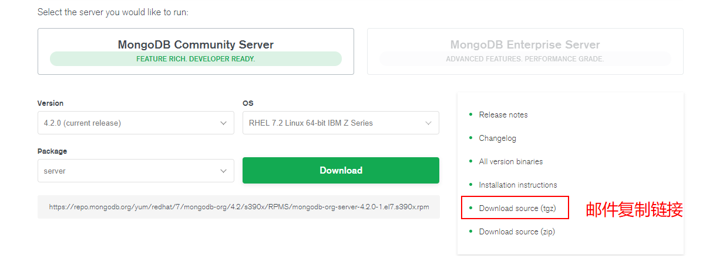

# MongoDB实战

[返回列表](https://github.com/EmonCodingFrontEnd/frontend-tutorial)

[TOC]

# 一、安装

## 1、下载

下载地址： <https://www.mongodb.com/download-center/community>




```bash
[emon@emon ~]$ wget -cP /usr/local/src/ https://fastdl.mongodb.org/src/mongodb-src-r4.2.0.tar.gz
```

```bash
[emon@emon ~]$ wget -cP /usr/local/src/ https://fastdl.mongodb.org/linux/mongodb-linux-x86_64-rhel70-4.2.0.tgz
```


