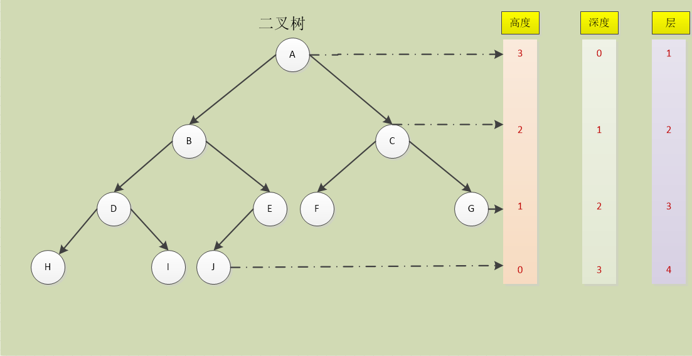
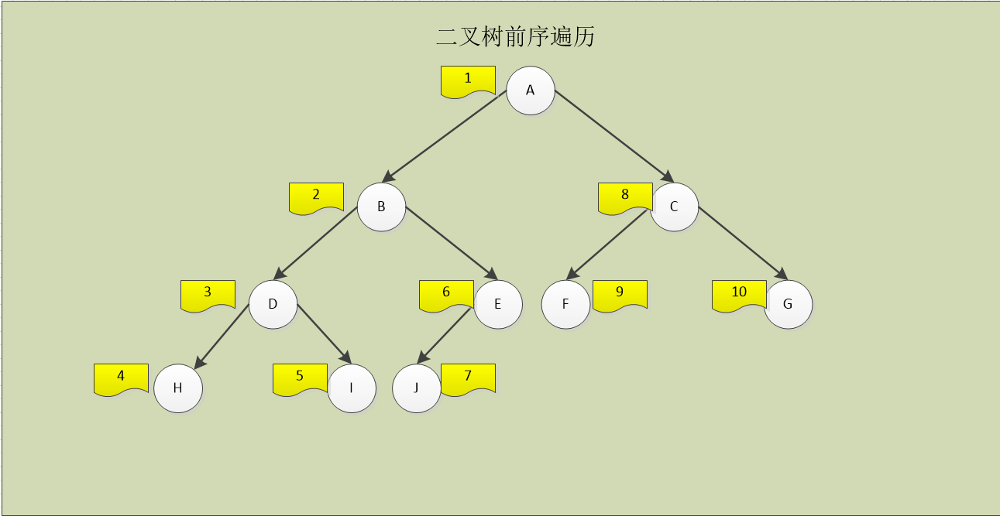
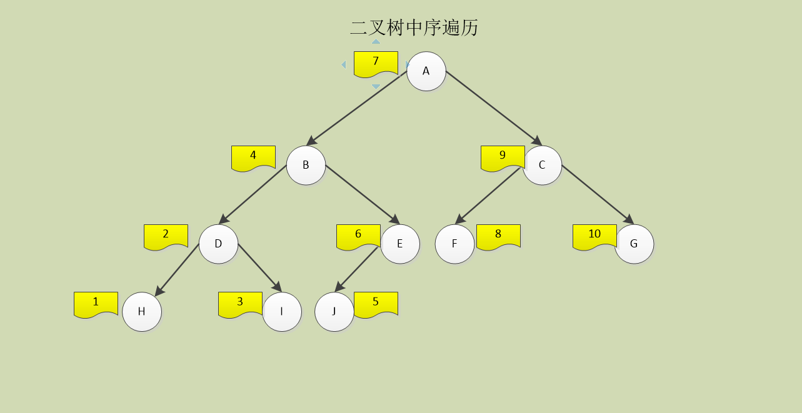
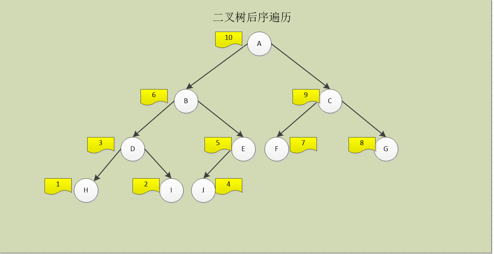

# 深入理解MySQL

[返回列表](https://github.com/EmonCodingBackEnd/backend-tutorial)

[TOC]

# 一、索引

[参考1](http://www.zuidaima.com/blog/4221720819125248.htm)

[参考2](https://segmentfault.com/a/1190000003072424)

[学习1](https://www.jianshu.com/p/bf73c8d50dc2)

[学习2](https://www.jianshu.com/p/41583e87c061)

背景： 基于`MySQL5.7.22/InnoDB`存储引擎

## 1、二叉树

### 1.1、几个核心概念

- 高度

节点到叶子节点的最长路径（边数）。

- 深度

根节点到这个节点所经历的边的个数。

- 树的高度

根节点的高度

- 度

节点拥有的直接子树的数目。

- 层数

节点的深度+1。

- 二叉树

二叉树是每个节点最多有2个分支的树。

- 满二叉树

叶子节点全部在最底层，除了叶子节点外，每个节点都有左右两个子节点，这种树就叫做满二叉树。

- 完全二叉树

叶子节点都在最底下两层，最后一层的叶子节点都靠左排列，除了最后一层，其他层的节点个数都达到最大。

### 1.2、遍历

- 前序遍历

前序遍历就是从二叉树的根节点出发，当第一次到达节点时就输出节点数据，按照先向左再向右的方向访问。

- 中序遍历

中序遍历就是从二叉树的根节点出发，当第二次到达节点时就输出节点数据，按照先向左再向右的方向访问。

- 后序遍历

后序遍历就是从二叉树的根节点出发，当第三次到达节点时就输出节点数据，按照先向左再向右的方向访问。

