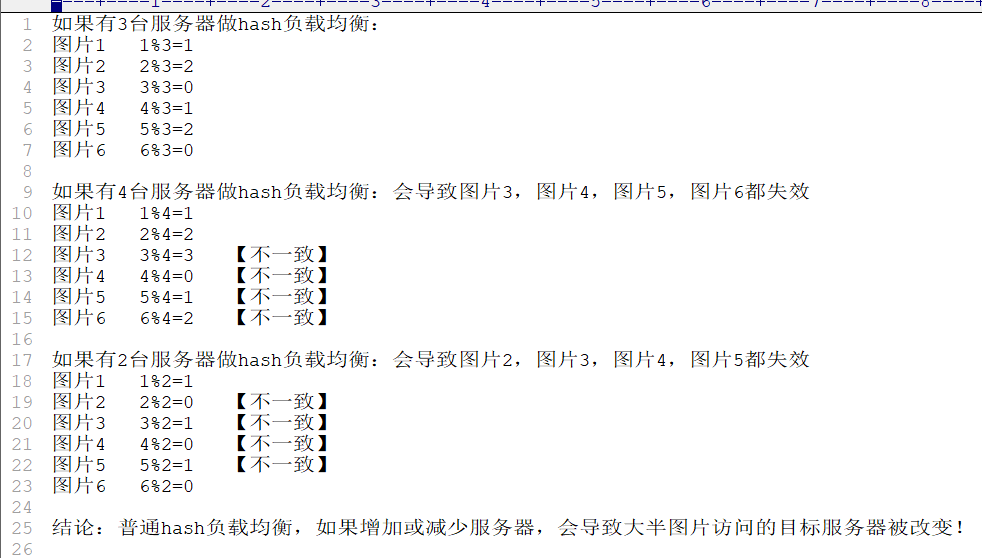

# Nginx实战

[返回列表](https://github.com/EmonCodingBackEnd/backend-tutorial)

[TOC]

# 一、常规配置

## 1.1、 Nginx配置WebSocket

```nginx
location / {
    proxy_pass http://IP:Port;
    proxy_read_timeout 600s;
    proxy_set_header Upgrade $http_upgrade;
    proxy_set_header Connection "upgrade";
}
```


## 1.2、参考实现

```nginx
server {
  listen 8808;
  server_name 192.168.1.66;
  access_log  logs/scrm.access.log  main;

  location ^~ /h5/ {
      rewrite ^/(.*)$  /index.html last;
  }

  location / {
    #root html/dist;
    root /home/saas/huiba/scrm/huiba-scrm-h5/webroot/h5;
    index index.html index.htm;
  }

  location ^~ /api/ {
    proxy_set_header X-Forwarded-For $proxy_add_x_forwarded_for;
    proxy_set_header X-Forwarded-Proto  $scheme;
    proxy_set_header Host $host;
    proxy_set_header X-Real-IP $remote_addr;
    proxy_pass http://192.168.1.66:28781;
  }

  location ^~ /mgr/ {
      #rewrite ^/(.*)$  /index.html last;
      root /home/saas/huiba/scrm/huiba-scrm-web/webroot/;
      index index.html index.htm;
      add_header Access-Control-Allow-Origin *;
  }
}
```


```nginx
server {
    listen       80;
    listen       443 ssl;
    server_name  edeninterface.ishanshan.com;
    ssl_certificate      /usr/local/openresty/nginx/conf/https/_.ishanshan.com_bundle.crt;
    ssl_certificate_key  /usr/local/openresty/nginx/conf/https/_.ishanshan.com.key;
    ssl_session_cache    shared:SSL:1m;
    ssl_session_timeout  5m;
    ssl_ciphers  HIGH:!aNULL:!MD5;
    ssl_prefer_server_ciphers  on;
    ssl_protocols SSLv3 TLSv1 TLSv1.1 TLSv1.2;
    #charset koi8-r;

    #access_log  logs/host.access.log  main;

    location / {
        rewrite ^/website/introduction$  /eden-server/website/introduction last;
    }

    location ^~ /eden-server/website/introduction {
        #location ^~ /website/introduction {
        proxy_set_header Host $host;
        proxy_set_header X-Real-IP $remote_addr;
        #proxy_set_header x-rule "offline";
        proxy_pass http://edeninterface;
        proxy_read_timeout 600s;
        proxy_set_header Upgrade $http_upgrade;
        proxy_set_header Connection "upgrade";
    }
    #error_page  404              /404.html;

    # redirect server error pages to the static page /50x.html
    error_page   500 502 503 504  /50x.html;
    location = /50x.html {
        root   html;
    }
    error_page  404              /404.html;

    location = /404.html {
        root   html;
    }

}
```


```nginx
server {
    listen 80;
    autoindex off;
    server_name interface.tamizoo.cn;
    # HTTPS ?.疆寮€濮
    #if ($server_port = 80) {
    #   rewrite ^http://$host https://$host permanent;
    #   rewrite ^(.*)$ https://$host$1 permanent;
    #}
    listen 443;
    ssl on;
    ssl_certificate      cert/interface.tamizoo.cn/214688233200754.pem;
    ssl_certificate_key  cert/interface.tamizoo.cn/214688233200754.key;
    ssl_session_timeout 5m;
    ssl_ciphers ECDHE-RSA-AES128-GCM-SHA256:ECDHE:ECDH:AES:HIGH:!NULL:!aNULL:!MD5:!ADH:!RC4;
    ssl_protocols TLSv1 TLSv1.1 TLSv1.2;
    ssl_prefer_server_ciphers on;
    # HTTPS ?.疆缁..
    access_log /usr/local/nginx/logs/access.log combined;
    index index.html index.htm index.jsp index.php;
    #error_page 404 /404.html;
    if ( $query_string ~* ".*[\;'\<\>].*" ){
        return 404;
    }

    location / {
        proxy_pass http://127.0.0.1:8080;
        proxy_read_timeout 600s;
        proxy_set_header Upgrade $http_upgrade;
        proxy_set_header Connection "upgrade";
    }
}
```

# 二、基本规则

## 2.1、root与alias

加入服务器路径为：`/home/emon/files/img/face.png`

- root路径完全匹配访问

配置的时候为：

```bash
location /emon {
	root /home
}
```

用户访问的时候请求路径为：`url:port/emon/files/img/face.png`

- alias可以为你的路径做一个别名，对用户透明

配置的时候为：

```bash
location /hello {
	alias /home/emon
}
```

用户访问的时候请求路径为：`url:port/hello/files/img/face.png`，如此相当于为目录`emon`做一个自定义的别名。

## 2.2、location的匹配规则

- `空格`：默认匹配，普通匹配

```bash
location / {
	root /home;
}
```

- `=`：精确匹配

```bash
location = /emon/img/face1.png {
	root /home;
}
```

- `~*`：匹配正则表达式，不区分大小写

```bash
# 符合图片的显示
location ~* .(GIF|jpg|png|jpeg) {
	root /home;
}
```

- `~`：匹配正则表达式，区分大小写

```bash
#GIF必须大写才能匹配到
location ~ .(GIF|jpg|png|jpeg) {
	root /home;
}	
```

- `^~`：以某个字符路径开头

```bash
location ^~ /emon/img {
	root /home;
}
```

## 2.3、Nginx跨域配置支持

```bash
#允许跨域请求的域，*代表所有
add_header 'Access-Control-Allow-Origin' *;
#允许带上cookie请求
add_header 'Access-Control-Allow-Credentials' 'true';
#允许请求的方法，比如 GET/POST/PUT/DELETE
add_header 'Access-Control-Allow-Methods' *;
#允许请求的header
add_header 'Access-Control-Allow-Headers' *;
```

## 2.4、Nginx防盗链配置支持

```bash
#对源站点验证
valid_referers *.emon.vip;
#非法引入会进入下方判断
if ($invalid_referer) {
	return 404;
}
```

## 2.5、upstream

### 2.5.1、3台tomcat演示upstream

- 配置Nginx的vhost

```bash
[emon@emon ~]$ vim /usr/local/nginx/conf/vhost/tomcates_upstream.conf 
```

```bash
#配置上游服务器，weight=1是默认值，越大权重越高
upstream tomcats {
    server 127.0.0.1:8080;
    server 127.0.0.1:8080 weight=2;
    server 127.0.0.1:8080 weight=5;
}

server {
    listen 80;
    server_name www.tomcats.com;

    location / {
        proxy_pass http://tomcats;
    }
}
```

- 加载Nginx配置

```bash
[emon@emon ~]$ sudo nginx -s reload
```

- 配置本地DNS

```bash
10.0.0.116		www.tomcats.com
```

其中，10.0.0.116是Nginx所在服务器的ip地址。

- 在浏览器访问

http://www.tomcats.com/


### 2.5.2、upstream指令参数

指令参数包含：

- max_conns

  - 限制每台server的连接数，用于保护避免过载，可起到限流作用。
  - 默认值0，不限制

  ```bash
  upstream tomcats {
  	server 192.168.1.66:8080 max_conns=2;
      server 127.0.0.1:8080 max_conns=2;
      server 127.0.0.1:8080 max_conns=5;
  }
  ```

- slow_start

  - 注意：仅商业版付费可用；

  - 默认值0，表示关闭！在指定的时间里，逐步提高服务的权重，到配置的权重值。
  - 该参数不能使用`hash`和`random load balancing`中。
  - 如果在upstream中只有一台server，则该参数失效。

  ```bash
  #至少配置2个及以上的服务，才可用，普通版报错： nginx: [emerg] invalid parameter "slow_start=60s"
  upstream tomcats {
      server 192.168.1.66:8080 weight=6 slow_start=60s;
      server 127.0.0.1:8080 weight=2;
      server 127.0.0.1:8080 weight=2;
  }
  ```

- down

  - 用于标记服务节点不可用；

  ```bash
  upstream tomcats {
      server 192.168.1.66:8080 down;
      server 127.0.0.1:8080 weight=2;
      server 127.0.0.1:8080 weight=2;
  }
  ```

- backup

  - 表示当前服务器节点是备用机，只有在其他的服务器都宕机以后，自己才会加入到集群中，被用户访问到。

  - 该参数不能使用`hash`和`random load balancing`中。

  ```bash
  upstream tomcats {
      server 192.168.1.66:8080 backup;
      server 127.0.0.1:8080 weight=2;
      server 127.0.0.1:8080 weight=2;
  }
  ```

- max_fails 和 fail_timeout

  - max_fails：表示失败几次，则标记server已宕机，剔除上游服务。

  - fail_timeout：表示失败的重试时间。

    - 比如`max_fails=2 fail_timeout=15s`

    则代表在15秒内请求某一个server失败达到2次以后，则认为该server已经挂了或者宕机了，随后再过15秒，这15秒内不会有新的请求到达该服务，而是会请求到正常运作的server，15秒后会再有新请求尝试连接到挂掉的server，如果还是失败，重复上一个过程，直到恢复。

    也可描述为：限定时间内满足了最大失败次数，会断开为该服务提供请求；时间过后会再次派发请求，如果在新的限定时间内还是达到最大失败次数，会再次断开为该服务提供请求；如此循环往复！

  ```bash
  upstream tomcats {
      server 192.168.1.66:8080 max_fails=2 fail_timeout=1s;
      server 127.0.0.1:8080 weight=2;
      server 127.0.0.1:8080 weight=2;
  }
  ```


### 2.5.3、Keepalived提高吞吐量

`keepalived`：设置长连接处理的数量

`proxy_http_version`：设置长连接http版本为1.1

`proxy_set_header`：清除connection header信息

```bash
upstream tomcats {
    server 127.0.0.1:8080;

    keepalive 32;
}

server {
    listen 80;
    server_name www.tomcats.com;

    location / {
        proxy_pass http://tomcats;

        proxy_http_version 1.1;
        proxy_set_header Connection "";
    }
}
```


### 2.5.4、负载均衡 ip_hash

**负载均衡ip_hash**

`ip_hash`可以保证用户访问可以请求到上游服务中的固定的服务器，前提是用户ip没有发生更改。

使用`ip_hash`的注意点：不能把后台服务器直接移除，只能标记 `down`。

```bash
upstream tomcats {
    ip_hash;

    server 127.0.0.1:8080;
    server 127.0.0.1:8080 down;
    server 127.0.0.1:8080;
}
```

普通hash负载均衡是有弊端的：



为了避免普通hash的缺点，可以采用一致性哈希算法。

### 2.5.5、一致性哈希算法

如果把对服务器的数量取模，变成对2^32取模，就可以避免由于服务器数量的变化，带来的影响了。

[一致性哈希算法的基本概念](https://www.zsythink.net/archives/1182)

### 2.5.6、负载均衡 url_hash

根据每次请求的url地址，hash后访问到固定的服务器节点。

```bash
upstream tomcats {
	# url hash
    hash $request_uri;

    server 127.0.0.1:8080;
    server 127.0.0.1:8080 down;
    server 127.0.0.1:8080;
}
```


### 2.5.7、负载均衡least_conn

least_conn会路由到当前最小链接的服务上。

```bash
upstream tomcats {
	# 最少连接数
	least_conn
	
    server 127.0.0.1:8080;
    server 127.0.0.1:8080 down;
    server 127.0.0.1:8080;
}
```


## 2.6、Nginx的缓存

1. 浏览器缓存：

- 加速用户访问，提升单个用户（浏览器访问者）体验，缓存在本地。

2. Nginx缓存

 - 缓存在Nginx端，提升所有访问到Nginx这一段的用户
 - 提升访问上游（upstream）服务器的速度
 - 用户访问仍然会产生请求流量

3. 控制浏览器缓存

- 编辑一个测试缓存的html文件

```bash
[emon@emon ~]$ vim /usr/local/nginx/html/cache.html 
```

```html
<!DOCTYPE html>
<html>
<head>
<title>Welcome to nginx!</title>
<style>
    body {
        width: 35em;
        margin: 0 auto;
        font-family: Tahoma, Verdana, Arial, sans-serif;
    }
</style>
</head>
<body>
<h1>Welcome to imooc!</h1>
</body>
</html>
```

- 配置反向代理

```bash
[emon@emon ~]$ vim /usr/local/nginx/conf/vhost/tomcates_upstream.conf 
```

```bash
#配置上游服务器，weight=1是默认值，越大权重越高
upstream tomcats {
    server 127.0.0.1:8080;
}

server {
    listen 80;
    server_name www.tomcats.com 10.0.0.116;

    location / {
        proxy_pass http://tomcats;
    }

    location /static {
        alias /usr/local/nginx/html;
        #expires 30s; #表示30秒之后过期
        #expires @22h30m; #表示到晚上22点30分过期
        #expires -1h; #提前过期，表示距离访问时间1小时之前已失效
        #expires epoch; #表示不设置缓存
        #expires off; #默认值，关闭Nginx端缓存属性返回，并不影响浏览器端缓存，只是不在返回Cache-Control等属性
        expires max; #永不过期，会设置一个很长的缓存时间
    }
}
```

```bash
[emon@emon ~]$ sudo nginx -s reload
```

- 访问

注意，如果要观察到304状态码，在浏览器回车访问即可，通过右键重新加载或者Ctrl+R是忽略缓存重新请求的。

http://www.tomcats.com/static/cache.html


## 2.7、Nginx的反向代理缓存

1. 上传图片资源

上传几张图片到`/usr/local/nginx/html/img`目录。

2. 配置

```bash
#配置上游服务器，weight=1是默认值，越大权重越高
upstream tomcats {
    server 127.0.0.1:8080;
}

# proxy_cache_path 设置缓存保存的目录
# keys_zone 设置共享内存以及空间大小
# max_size 设置缓存大小
# inactive 超过此时间，则缓存自动清理
# use_temp_path 关闭临时目录
proxy_cache_path /usr/local/nginx/upstream_cache keys_zone=mycache:5m max_size=1g inactive=30s use_temp_path=off;

server {
    listen 80;
    server_name www.tomcats.com 10.0.0.116;

    # 开启并且使用缓存
    proxy_cache mycache;
    # 针对200和304状态码的缓存设置过期时间
    proxy_cache_valid 200 304 8h;

    location / {
        proxy_pass http://tomcats;
    }

    location /static {
        alias /usr/local/nginx/html;
    }
}
```

```bash
[emon@emon ~]$ sudo nginx -s reload
```

3. 访问图片并查看`/usr/local/nginx/upstream_cache`目录

http://www.tomcats.com/static/img/zx.jpg


