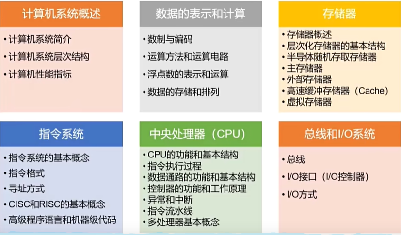

# Principles of Computer Organization

[TOC]

[计算机组成原理]

https://www.bilibili.com/video/BV1vt421L7oc/?p=3&spm_id_from=pageDriver&vd_source=b850b3a29a70c8eb888ce7dff776a5d1

# 零、大纲概述

​	全国硕士研究生计算机学科专业基础综合（408）考试，包含数据结构、计算机组成原理、操作系统和计算机网络4大专业基础课程，满分150分。其中，计算机组成原理45分，占比30%。

# 一、计算机系统概述

## 1、计算机系统简介

## 2、计算机系统层次结构

## 3、计算机性能指标

# 二、数据的表示和计算

## 1、数制与编码

# 三、存储器

# 四、指令系统

# 五、中央处理器（CPU）

# 六、总线和I/O系统