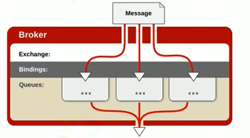
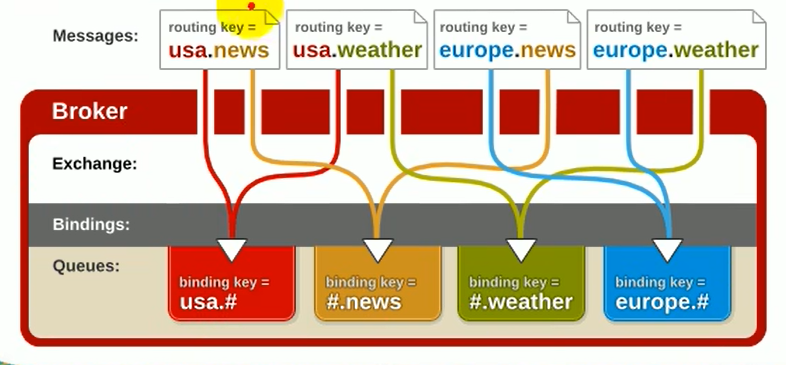
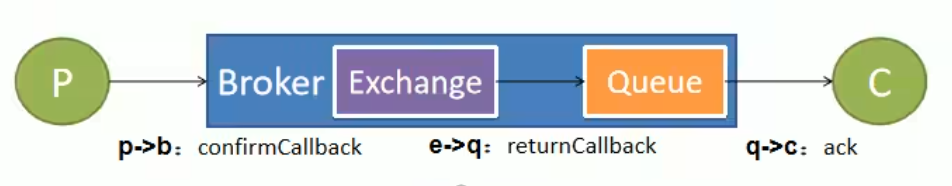
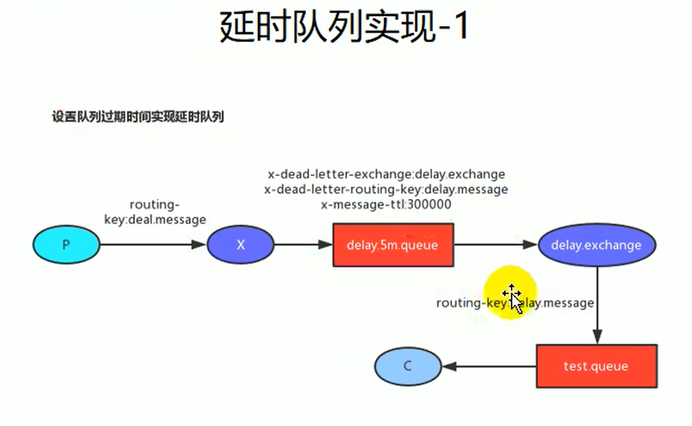
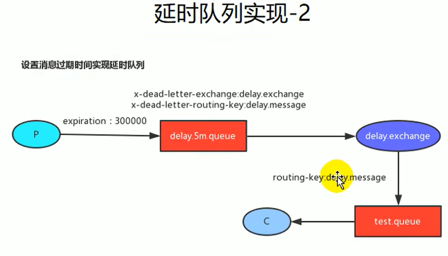

# RabbitMQ实战

[返回列表](https://github.com/EmonCodingBackEnd/backend-tutorial)

[TOC]

# 一、Docker版本安装

## 1、下载

下载地址获取页面： http://www.rabbitmq.com/download.html

docker镜像页面： https://hub.docker.com/_/rabbitmq/

## 2、安装

- 安装镜像

```bash
# 如果找不到镜像，下载并启动
[emon@emon ~]$ docker run -itd --name rabbitmq -p 5672:5672 -p 15672:15672 rabbitmq:3.8.3-management
```

- 验证

http://IP:15672


# 二、普通版本安装

## 1、安装Erlang

1. 下载安装包

下载地址获取页面： http://www.erlang.org/downloads

选择 OTP 21.3 Source File

```bash
[emon@emon ~]$ wget -cP /usr/local/src/ http://erlang.org/download/otp_src_21.3.tar.gz
```

2. 依赖检查与安装

```bash
[emon@emon ~]$ yum list make gcc gcc-c++ kernel-devel m4 ncurses-devel openssl-devel unixODBC-devel
[emon@emon ~]$ sudo yum -y install make gcc gcc-c++ kernel-devel m4 ncurses-devel openssl-devel unixODBC-devel
```

3. 创建安装目录

```bash
[emon@emon ~]$ mkdir /usr/local/Erlang
```

4. 解压

```bash
[emon@emon ~]$ tar -zxvf /usr/local/src/otp_src_21.3.tar.gz -C /usr/local/Erlang/
```

5. 执行配置脚本，并编译安装

- 切换目录并执行配置脚本生成Makefile

```bash
[emon@emon ~]$ cd /usr/local/Erlang/otp_src_21.3/
[emon@emon otp_src_21.3]$ ./configure --prefix=/usr/local/Erlang/erlang21.3 --disable-javac
```

注意：看到如下提示，不会影响编译。

```bash
*********************************************************************
**********************  APPLICATIONS INFORMATION  *******************
*********************************************************************

wx             : wxWidgets not found, wx will NOT be usable

*********************************************************************
*********************************************************************
**********************  DOCUMENTATION INFORMATION  ******************
*********************************************************************

documentation  : 
                 fop is missing.
                 Using fakefop to generate placeholder PDF files.

*********************************************************************
```

- 编译

```bash
[emon@emon otp_src_21.3]$ make
```

- 安装

```bash
[emon@emon otp_src_21.3]$ make install
[emon@emon otp_src_21.3]$ cd
[emon@emon ~]$ ls /usr/local/Erlang/erlang21.3/
bin  lib
```

6. 创建软连接

```bash
[emon@emon ~]$ ln -s /usr/local/Erlang/erlang21.3/ /usr/local/erl
```

7. 配置环境变量

在`/etc/profile.d`目录创建`erl.sh`文件：

```bash
[emon@emon ~]$ sudo vim /etc/profile.d/erl.sh
export ERLANG_HOME=/usr/local/erl
export PATH=$ERLANG_HOME/bin:$PATH
```

使之生效：

```bash
[emon@emon ~]$ source /etc/profile
```

8. 校验

```bash
[emon@emon ~]$ erl
Erlang/OTP 21 [erts-10.3] [source] [64-bit] [smp:1:1] [ds:1:1:10] [async-threads:1] [hipe]

Eshell V10.3  (abort with ^G)
1> halt().
```

## 2、安装RabbitMQ

1. 下载

下载地址获取页面：https://www.rabbitmq.com/download.html

下载地址列表：https://www.rabbitmq.com/releases/rabbitmq-server/

```bash
[emon@emon ~]$ wget -cP /usr/local/src/ https://github.com/rabbitmq/rabbitmq-server/releases/download/v3.7.14/rabbitmq-server-generic-unix-3.7.14.tar.xz
```

2. 创建安装目录

```bash
[emon@emon ~]$ mkdir /usr/local/RabbitMQ
```

3. 解压安装

```bash
# 其中，tar -Jxvf 可以分为两步执行， xz -d *.tar.xz 然后 tar -xvf *.tar
[emon@emon ~]$ tar -Jxvf /usr/local/src/rabbitmq-server-generic-unix-3.7.14.tar.xz -C /usr/local/RabbitMQ/
```

4. 创建软连接

```bash
[emon@emon ~]$ ln -s /usr/local/RabbitMQ/rabbitmq_server-3.7.14 /usr/local/rabbitmq
```

如果创建软连接时，`rabbitmq_server-3.7.14`后面带有TAB键补全的`/`，会导致错误：

```bash
[emon@emon ~]$ rabbitmqctl status
escript: exception error: undefined function rabbitmqctl_escript:main/1
  in function  escript:run/2 (escript.erl, line 758)
  in call from escript:start/1 (escript.erl, line 277)
  in call from init:start_em/1 
  in call from init:do_boot/3 
```

5. 配置环境变量

在`/etc/profile.d`目录创建`rabbit.sh`文件：

```bash
[emon@emon ~]$ sudo vim /etc/profile.d/rabbitmq.sh
export RABBITMQ_HOME=/usr/local/rabbitmq
export PATH=$RABBITMQ_HOME/sbin:$PATH
```

使之生效：

```bash
[emon@emon ~]$ source /etc/profile
```

6. 校验

- 启动服务

```bash
# 启动 rabbitmq, -detached 代表后台守护进程方式启动。
[emon@emon ~]$ rabbitmq-server -detached

# 后台启动的另一种方式【推荐】
[emon@emon ~]$ rabbitmq-server start &
```

- 查看启动状态

```bash
[emon@emon ~]$ rabbitmqctl status
```

- 关闭服务

```bash
[emon@emon ~]$ rabbitmqctl stop
```

- 列出角色

```bash
[emon@emon ~]$ rabbitmqctl list_users
Listing users ...
user	tags
guest	[administrator]
```

- 查看插件列表

```bash
[emon@emon ~]$ rabbitmq-plugins list
```

- 启动网页插件(15672端口)

```bash
[emon@emon ~]$ rabbitmq-plugins enable rabbitmq_management
```

7. 开放防火墙端口

```bash
# 配置Linux端口15672网页管理，5672 AMQP端口
[emon@emon ~]$ sudo firewall-cmd --permanent --zone=public --add-port=5672/tcp
[emon@emon ~]$ sudo firewall-cmd --permanent --zone=public --add-port=15672/tcp
[emon@emon ~]$ sudo firewall-cmd --reload
[emon@emon ~]$ sudo firewall-cmd --permanent --zone=public --list-ports
```

8. 访问网页

http://192.168.1.116:15672

错误提示：User can only log in via localhost 

因为RabbitMQ从3.3.0开始禁止使用guest/guest权限通过除localhost外的访问。

如果想使用guest/guest通过远程机器访问，需要调整如下：

```bash
[emon@emon ~]$ vim /usr/local/rabbitmq/ebin/rabbit.app 
```

找到`loopback_users`并调整内容：

`{loopback_users, [<<"guest">>]},` -> `{loopback_users, []},`

然后重启即可。


# 三、入门

## 1、RabbitMQ的命令行与管控台

### 1.1、基础操作

- 添加用户

```bash
rabbitmqctl add_user username password
```

- 赋予其administrator角色

```bash
rabbitmqctl set_user_tags username administrator
```

- 列出用户

```bash
rabbitmqctl list_users
```

- 删除用户

```bash
rabbitmqctl delete_user username
```

- 清除用户权限

```bash
rabbitmqctl clear_permissions -p vhostpath username
```

- 列出用户权限

```bash
rabbitmqctl list_user_permissions username
```

- 修改密码

```bash
rabbitmqctl change_password username newpassword
```

- 设置用户权限

```bash
rabbitmqctl set_permissions -p vhostpath username '.*' '.*' '.*'
```

- 创建虚拟主机

```bash
rabbitmqctl add_vhost vhostpath
```

- 列出所有虚拟主机

```bash
rabbitmqctl list_vhosts
```

- 列出虚拟主机上所有权限

```bash
rabbitmqctl list_permissions -p vhostpath
```

- 删除虚拟主机

```bash
rabbitmqctl delete_vhost vhostpath
```

- 查看所有队列信息

```bash
rabbitmqctl list_queues
```

- 清除队列里的消息

```bash
rabbitmqctl - p vhostpath purge_queue blue
```

### 1.3、高级操作

- 移除所有数据，要在rabbitmqctl stop之后使用

```bash
rabbitmqctl reset
```

- 组成集群命令

```bash
rabbitmqctl join_cluster <clusternode> [--ram]
```

- 查看集群状态

```bash
rabbitmqctl cluster_status
```

- 修改集群节点的存储形式

```bash
rabbitmqctl change_cluster_node_type disc|ram
```

- 忘记节点（摘除节点）

```bash
rabbitmqctl forget_cluster_node [--offline]
```

- 修改节点名称

```bash
rabbitmqctl rename_cluster_node oldnode1 newnode1 [oldnode2] [newnode2] ...
```

# 四、MQ概述

1. 大多应用中，可通过消息服务中间件来提升系统异步通信、扩展解耦能力。

2. 消息服务中两个重要概念：

   <span style="color:red;font-weight:bold;">消息代理（message broker）</span>和<span style="color:red;font-weight:bold;">目的地（destination）</span>

当消息发送者发送消息以后，将由消息代理接管，消息代理保证消息传递到指定目的地。

3. 消息队列主要有两种形式的目的地

   1. <span style="color:red;font-weight:bold;">队列（queue）</span>：点对点消息通信（point-to-point）

   2. <span style="color:red;font-weight:bold;">主题（topic）</span>：发布（publish）/订阅（subscribe）消息通信
4. 点对点式：
   1. 消息发送者发送消息，消息代理将其放入一个队列中，消息接收者从队列中获取消息内容，消息读取后被移出队列。
   2. 消息只有唯一的发送者和接收者，但并不是说只能有一个接收者。哪一个接收者收取了，其他接收者就不能得到了。

5. 发布订阅式：
   1. 发送者（发布者）发送消息到主题，多个接收者（订阅者）监听（订阅）这个主题，那么就会在消息到达时同时收到消息。

6. JMS（Java Message Service）Java消息服务：
   1. 基于JVM消息代理的规范。ActiveMQ、HornetMQ是JMS实现。

7. AMQP（Advanced Message Queuing Protocol）
   1. 高级消息队列协议，也是一个消息代理的规范，兼容JMS
   2. RabbitMQ是AMQP的实现


|              | JMS（Java Message Service）                                  | AMQP（Advanced Message Queuing Protocol）                    |
| ------------ | ------------------------------------------------------------ | ------------------------------------------------------------ |
| 定义         | Java api                                                     | 网络线级协议                                                 |
| 跨语言       | 否                                                           | 是                                                           |
| 跨平台       | 否                                                           | 是                                                           |
| Model        | 提供两种消息模型：<br />（1）、Peer-2-Peer<br />（2）、Pub/sub | 提供了五种消息模型：<br />（1）、direct exchange<br />（2）、fanout exchange<br />（3）、topic change<br />（4）、headers exchange<br />（5）、system exchange<br />本质来讲，后四种和JMS的pub/sub模型没有太大差别，仅是在路由机制上做了更详细的划分； |
| 支持消息类型 | 多种消息类型：<br />TextMessage<br />MapMessage<br />BytesMessage<br />StreamMessage<br />ObjectMessage<br />Message（只有消息头和属性） | byte[] 当实际应用时，有复杂的消息，可以将消息序列化后发送。  |
| 综合评价     | JMS定义了Java API层面的标准；在java体系中，多个client均可以通过JMS进行交互，不需要应用修改代码，但是其对跨平台的支持较差； | AMQP定义了wire-level层的协议标准；天然具有跨平台、跨语言特性。 |

8. Spring支持
   1. spring-jms提供了对JMS的支持
   2. spring-rabbit提供了对AMQP的支持
   3. 需要ConnectionFactory的实现来连接消息代理
   4. 提供JmsTemplate、RabbitTemplate来发送消息
   5. @JmsListener（JSM）、@RabbitListener（AMQP）注解在方法上监听消息代理发布的消息
   6. @EnableJms、@EnableRabbit开启支持
9. SpringBoot自动配置
   1. JmsAutoConfiguration
   2. RabbitAutoConfiguration
10. 市面上的MQ产品
    1. ActiveMQ
    2. RabbitMQ
    3. RocketMQ
    4. Kafka

# 五、RabbitMQ概念

## 1、RabbitMQ简介：

RabbitMQ是一个由erlang开发的AMQP（Advanved Message Queue Protocol）的开源实现。

## 2、核心概念

Message

消息，消息是不具名的，它由消息头和消息体组成。消息体时不透明的，而消息头则由一系列的可选属性组成，这些属性包括routing-key（路由键）、priority（相对于其他消息的优先权）、delivery-mode（指出该消息可能需要持久性存储）等等。

## 3、Publisher

消息的生产者，也是一个向交换器发布消息的客户端应用程序。

## 4、Exchange

交换器，用来接收生产者发送的消息并将这些消息路由给服务器中的队列。

Exchange有4种类型：direct（默认）、fanout、topic以及headers，不同类型的Exchange转发消息的策略有所不同。

### 4.1、direct

消息中的路由键（routing key）如果和Binding中的binding key一致，交换器就将消息发送到对应的队列中。路由键与队列名完全匹配，如果一个队列绑定到交换机要求路由键为“dog”，则只转发routing key标记为“dog”的消息，不会转发“dog.puppy”，也不会转发“dog.guard”等等。它是完全匹配、单播的模式。

### 4.2、fanout

每个发送到fanout类型交换器的消息都会分到所有绑定的队列上去。fanout交换器不处理路由键，只是简单的将队列绑定到交换器上，每个发送到交换器的消息都会被转发到与该交换器绑定的所有队列上。很像子网广播，每台子网内的主机都获得了一份复制的消息。fanout类型转发消息是最快的。



### 4.3、topic

topic交换器通过模式匹配分配消息的路由键属性，将路由键和某个模式进行匹配，此时队列需要绑定到一个模式上。它将路由键和绑定键的字符串切分成单词，这些单词之间用点`.`隔开。它同样也会识别两个通配符：符号`#`和符号`*`。

`#`匹配0个或多个单词，`*`匹配一个单词。



### 4.4、headers

headers匹配AMQP消息的header而不是路由键，headers交换器和direct交换器完全一致，但性能差很多，目前几乎用不到了。

## 5、Queue

消息队列，用来保存消息直到发送给消费者。它是消息的容器，也是消息的终点。一个消息可投入一个或多个队列。消息一直在队列里面，等待消费者连接到这个队列将其取走。

## 6、Binding

绑定，用于消息队列和交换器之间的关联。一个绑定就是基于路由键将交换器和消息队列连接起来的路由规则，所以可以将交换器理解成一个由绑定构成的路由表。

Exchange和Queue的绑定可以是多对多的关系。

## 7、Connection

网络连接，比如一个TCP连接。

## 8、Channel

信道，多路复用连接中的一条独立的双向数据流通道。信道是建立在真实的TCP连接内的虚拟连接，AMQP命令都是通过信道发出去的，不管是发布消息、订阅队列还是接收消息，这些动作都是通过信道完成。因为对于操作系统来说建立和销毁TCP都是非常昂贵的开销，所以引入了信道的概念，以复用一条TCP连接。

## 9、Consumer

消息的消费者，表示一个从消息队列中取得消息的客户端应用程序。

## 10、Virtual Host

虚拟主机，表示一批交换器、消息队列和相关对象。虚拟主机是共享相同的身份认证和加密环境的独立服务器域。每个vhost本质上就是一个mini版本的RabbitMQ服务器，拥有自己的队列、交换器、绑定和权限机制。vhost是AMQP概念的基础，必须在连接时指定，RabbitMQ默认的vhost是`/`。

## 11、Broker

表示消息队列服务器实体。


# 六、RabbitMQ消息确认机制-可靠抵达

- 保证消息不丢失，可靠抵达，可以使用事务消息，性能下降250倍，为此引入确认机制。
- publisher confirmCallback 确认模式
- publisher returnCallback 未投递到queue退回模式
- consumer ack机制



## 1、消息抵达交换器（成功/失败）-confirmCallback

- spring.rabbitmq.publisher-confirms=true
  - 在创建connectionFactory的时候设置PublisherConfirms(true)选项，开启ConfirmCallback。
  - CorrelationData：用来表示当前消息唯一性。
  - 消息只要被broker接收到就会执行ConfirmCallback，如果是cluster模式，需要所有broker接收到才会调用ConfirmCallback。
  - 被broker接收到只能表示message已经到达服务器，并不能保证消息一定会被投递到目标queue里。所以需要用到接下来的returnCallback。

## 2、消息抵达队列（失败） -returnCallback

- spring.rabbitmq.publisher-returns=true
- spring.rabbitmq.template.mandatory=true
  - confirm 模式只能保证消息到达broker，不能保证消息准确投递到目标queue里。在有些业务场景下，我们需要保证消息一定要投递到目标queue里，此时就需要用到return退回模式。
  - 这样如果未能投递到目标queue里将调用returnCallback，可以记录下详细的投递数据，定期的巡检或者自动纠错都需要这些数据。

## 3、消息抵达消费者-Ack消息确认机制

- 消费者获取到消息，成功处理，可以回复Ack给Broker
  - basic.ack 用于肯定确认；broker将移除此消息，可以批量
  - basic.nack用于否定确定；可以指定broker是否丢弃此消息，可以批量
  - basic.reject用于否定确定；同上，但是不能批量
- 默认，消息被消费者收到，就会从broker的queue中移除
- queue无消费者，默认依然会被存储，直到消费者消费
- 消费者收到消息，默认会自动ack。但是如果无法确定此消息是否被处理完成，或者成功处理。我们可以开启手动ack模式。
  - 消息处理成功，ack()，接受下一个消息，此消息broker就会移除
  - 消息处理失败，nack()/reject()，重新发送给其他人进行处理，或者容错处理后ack
  - 消息一直没有调用ack/nack方法，broker认为此消息正在被处理（状态Unacked），不会投递给别人，此时客户端断开，消息不会被broker移除（状态Ready），会投递给别人。

## 4、如何保证消息可靠性——消息丢失

### 4.1、消息丢失场景

- 消息发送出去，由于网络问题没有抵达服务器
  - 做好容错方法（try-catch），发送消息可能会网络失败，失败后要有重试机制，可记录到数据库，采用定期扫描重发的方式。
  - 做好日志记录，每个消息状态是否都被服务器收到都应该被记录。
  - 做好定期重发，如果消息没有发送成功，定期去数据库扫描未成功的消息进行重发。
- 消息抵达Broker，Broker要将消息写入磁盘（持久化）才算成功。此时Broker尚未持久化完成，宕机。
  - publisher也必须加入确认回调机制，确认成功的消息，修改数据库消息状态。
- 自动ACK的状态下。消费者收到消息，但没来得及消费，宕机。
  - 一定开启手动ACK，消费成功才移除，失败或者没来得及处理就noAck并重新入队。

## 5、如何保证消息可靠性——消息重复

### 5.1、消息重复场景

- 消息消费成功，事务已经提交，ack时，机器宕机。导致没有ack成功。Broker的消息重新由unack变为ready，并发送给其他消费者。
  - 消费者的业务消费接口应该涉及为<span style="color:red;font-weight:bold;">幂等性</span>的比如扣库存有工作单的状态标志。【推荐】
  - 使用防重表（redis/mysql），发送消息每一个都有业务的唯一标识，处理过就不用处理。
  - rabbitMQ的每一个消息都有redelivered字段，可以获取是否是被重新投递过来的，而不是第一次投递过来的。【不推荐】
- 消息消费失败，由于重试机制，自动又将消息发送出去。

## 6、如何保证消息可靠性——消息积压

### 6.1、消息积压场景

- 消费者宕机积压
- 消费者消费能力不足积压
- 发送者发送流量太大
  - 上线更多的消费者，进行正常消费。上线专门的队列消费服务，将消息先批量取出来，记录数据库、离线慢慢处理。

# 七、RabbitMQ延时队列（实现定时任务）

## 1、场景：

比如未付款订单，超过一定时间后，系统自动取消订单并释放占有物品。

**常用解决方案**：

spring的schedule定时任务轮训数据库

**缺点**：

消耗系统内存、增加了数据库压力、存在较大的时间误差。

**解决**：rabbitmq的消息TTL和死信Exchange结合。

## 2、消息的TTL（Time To Live）

- 消息的TTL就是消息的<span style="color:red;font-weight:bold;">存活时间</span>。
- RabbitMQ可以对<span style="color:red;font-weight:bold;">队列</span>和<span style="color:red;font-weight:bold;">消息</span>分别设置TTL。
  - 对队列设置就是队列没有消费者连着的保留时间，<span style="color:red;font-weight:bold;">也可以对每一个单独的消息做单独的设置。超过了这个时间，我们认为这个消息就死了，称之为死信。</span>
  - 如果队列设置了，消息也设置了，那么会<span style="color:red;font-weight:bold;">取小的</span>。所以一个消息如果被路由到不同的队列中，这个消息死亡的时间有可能不一样（不同的队列设置）。这里单讲单个消息的TTL，因为它才是实现延迟任务的关键。可以通过<span style="color:red;font-weight:bold;">设置消息的expiration字段或者队列的x-message-ttl属性来设置时间，</span>两者是一样的效果。

## 3、Dead Letter Exchanges（DLX）

- 一个消息在满足如下条件下，会进入<span style="color:red;font-weight:bold;">死信路由</span>，记住这里是路由而不是队列，一个路由可以对应很多队列。（什么是死信）
  - 一个消息被Consumer拒收了，并且reject方法的参数里requeue是false。也就是说不会被再次放在队列里，被其他消费者使用。（basic.reject/basic.nack）requeue=false
  - 上面的消息的TTL到了，消息过期了。
  - 队列的长度限制满了。排在前面的消息会被丢弃或者扔到死信路由上。
- Dead Letter Exchange其实就是一种普通的exchange，和创建其他exchange没啥两样。只是在某一个设置Dead Letter Exchange的队列中有消息过期了，会自动触发消息的转发，发送到Dead Letter Exchange中去。
- 我们既可以控制消息在一段时间后变成死信，又可以控制变成死信的消息被路由到某一个指定的交换机，结合二者，其实就可以实现一个延时队列。



<span style="color:red;font-weight:bold;">推荐队列过期时间</span>



# 八、MQ应用场景

## 1、异步任务

## 2、应用解耦

## 3、流量控制、流量削峰


# 九十九、用户信息

| 用户名 | 密码      |
| ------ | --------- |
| guest  | guest     |
| rabbit | rabbit123 |
|        |           |

