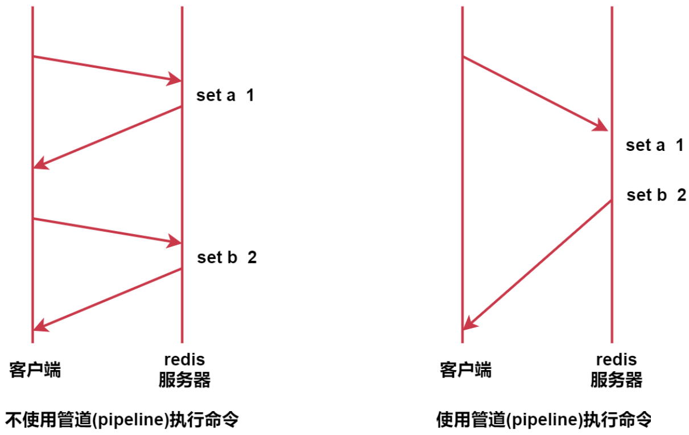
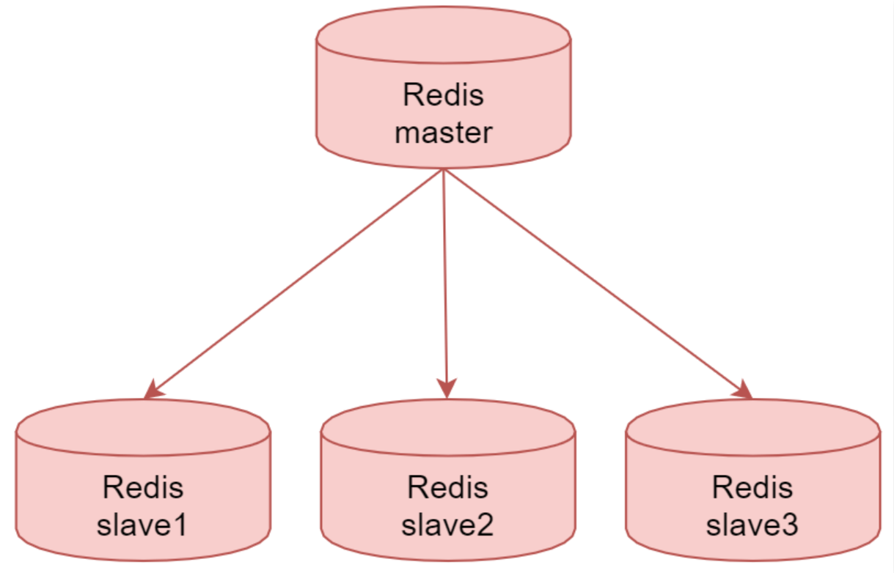
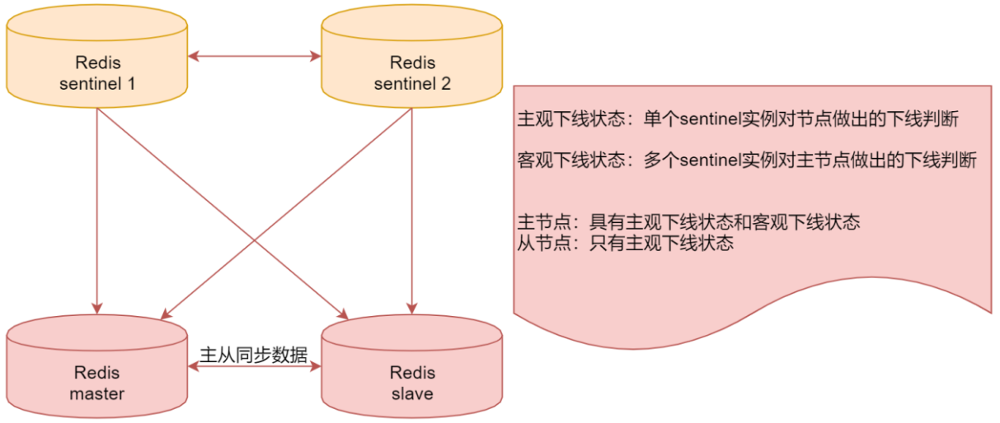
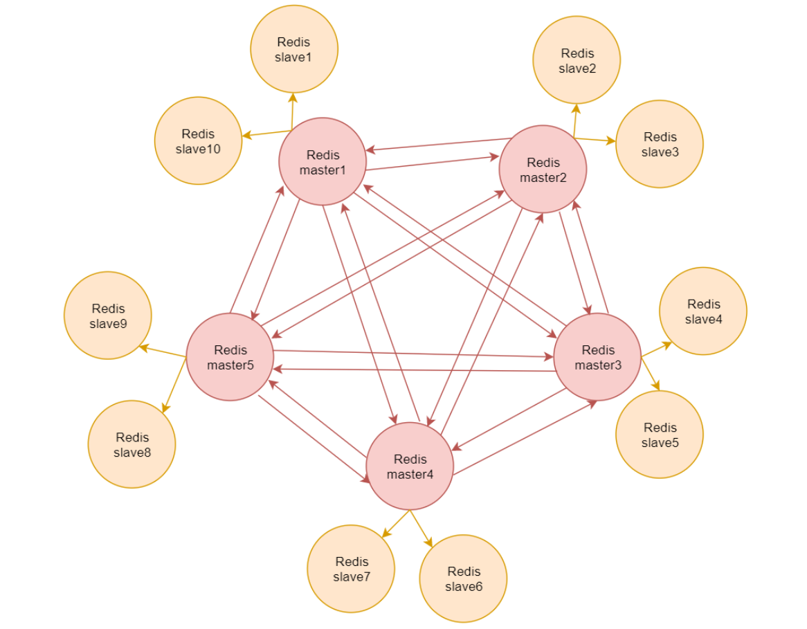

#  Redis实战

[返回列表](https://github.com/EmonCodingBackEnd/backend-tutorial)

[toc]

# 一、安装

[安装redis](https://github.com/EmonCodingBackEnd/backend-tutorial/blob/master/tutorials/Linux/LinuxInAction.md#12%E5%AE%89%E8%A3%85redis)

# 二、常用命令

## 1.1、Redis的命令行客户端

- 关闭redis

```bash
redis-cli -a password shutdown
```

- 进入到redis客户端

```bash
# 默认登录本机服务
[emon@emon ~]$ redis-cli
# 指定ip和端口
[emon@emon ~]$ redis-cli -h localhost -p 6379
```

- 输入密码

```bash
emon:6379> auth `[密码]`
```

- 切换数据库，总共默认16个

```bash
# index的值在[0, 15]之间
emon:6379> select index
```

- 删除当前数据库中的数据

```bash
emon:6379> flushdb [ASYNC]
```

- 删除所有db中的数据

```bash
emon:6379> flushall
```

- 清屏

```bash
emon:6379> clear
```

- 帮助

```bash
# string类型命令操作帮助
emon:6379> help @string
# ttl命令帮助
emon:6379> help ttl
```

- 查看当前连接数

```bash
emon:6379> info clients
```

- 查看最大连接数

```bash
 emon:6379> config get maxclients
```

## 1.2、Redis的数据类型

### 1.2.1、string 字符串

string：最简单的字符串类型键值对缓存，也是最基本的。

- 查看所有的key（不建议在生产上使用，有性能影响）

```bash
emon:6379> keys * 
```

- 游标查询

```bash
emon:6379> scan cursor [MATCH pattern] [COUNT count]
# 第一次迭代传0
emon:6379> scan 0
# 指定返回2条
emon:6379> scan 0 count 2
# 指定match
emon:6379> scan 0 match day* count 3
```

- 查看key的类型

```bash
emon:6379> type key
```

- 设置以及存档的key，会覆盖已有同名key的值

```bash
emon:6379> set key value
OK
```

- 设置以及存档在key，不会覆盖

```bash
# 结果0表示未设置成功，1表示设置成功
emon:6379> setnx key value
(integer) 0
```

- 设置带过期时间的数据

```bash
# 设置秒为单位过期的数据
emon:6379> set key value ex time
# 设置毫秒为单位过期的数据
emon:6379> set key value px time
```

- 设置过期时间

```bash
# 结果0表示设置失败，比如key已不存在，1表示设置成功
emon:6379> expire key time
(integer) 0
```

- 查看剩余时间

```bash
# 结果-1表示永不过期，-2已过期
emon:6379> ttl key
(integer) -2
```

- 合并字符串

```bash
emon:6379> append key value
```

- 字符串长度

```bash
emon:6379> strlen key
```

- 累加1

```bash
# 仅能对integer类型的字符串数据操作，返回的结果表示累加1后的值
emon:6379> incr key
```

- 累减1

```bash
# 仅能对integer类型的字符串数据操作，返回的结果表示累加1后的值
emon:6379> decr key
```

- 累加给定数值

```bash
# 仅能对integer类型的字符串数据操作，返回的结果表示累加num后的值
emon:6379> incrby key num
```

- 累减给定数值

```bash
# 仅能对integer类型的字符串数据操作，返回的结果表示累减num后的值
emon:6379> decrby key num
```

- 截取数据，end=-1代表到最后

```bash
# 仅能对string类型的字符串数据操作
emon:6379> getrange key start end
```

- 从start位置开始替换数据

```bash
# 仅能对string类型的字符串数据操作
emon:6379> setrange key start newdata
```

- 连续设置

```bash
emon:6379> mset key value [key value ...]
```

- 连续取值

```bash
emon:6379> mget key [key ...]
```

- 连续设置，如果存在则不设置

```bash
# 特殊：如连续设置的key，有任何一个已经存在，则整体都会被忽略！0-表示全部被忽略，1-表示全部成功！
emon:6379> msetnx key value [key value ...]
(integer) 1
```

- 是否存在

```bash
# 存在返回1，否则返回0
emon:6379> exists key
```


### 1.2.2、hash

hash：类似map，存储结构化数据结构，比如存储一个对象（不能有嵌套对象）。

- 设置hash

```bash
emon:6379> hset key field value
```

- 获取hash

```bash
emon:6379> hget key field
```

- 获取hash某个对象的全部属性

```bash
emon:6379> hkeys key
```

- 获取hash某个对象的全部值

```bash
emon:6379> hvals key
```

- 累加给定数值

```bash
# 注意，increment 可正可负可小数
emon:6379> hincrby key field increment
```

- 判断hash对象的属性是否存在

```bash
emon:6379> hexists key field
```

- 删除hash对象的属性

```bash
emon:6379> hdel key field [field ...]
```

- 获取hash对象

```bash
emon:6379> hgetall key 
```

- 连续设置hash

```bash
emon:6379> hmset key field value [field value ...]
```

- 连续获取

```bash
emon:6379> hmget key field [field ...]
```

### 1.2.3、list

list:列表，[a,b,c,d...]

- 构建一个list，从左边开始存入数据

```bash
# 返回列表最新数据量
emon:6379> lpush key value [value ...]
```

- 查看list数据，-1表示到结尾

```bash
# 返回列表最新数据量
emon:6379> lrange key start stop
```

- 从右边存入数据

```bash
emon:6379> rpush key value [value ...]
```

- 从左侧开始拿出一个数据

```bash
# 返回被拿到的值，并从列表中剔除
emon:6379> lpop key
```

- 从右侧开始拿出一个数据

```bash
# 返回被拿到的值，并从列表中剔除
emon:6379> rpop key
```

- 查看list长度

```bash
emon:6379> llen key
```

- 获取list下标的值

```bash
emon:6379> lindex key index
```

- 把某个下标的值替换

```bash
# 成功返回OK
emon:6379> lset key index value
```

- 插入一个新的值

```bash
# pivot指代某个列表元素值，返回插入新值后元素的个数
emon:6379> linsert key before/after pivot value
```

- 删除几个相同数据

```bash
# 返回实际产出的数量
emon:6379> lrem key num value
```

- 截取值，替换原来的list，-1表示到结尾

```bash
# 截取后，原list被改变
emon:6379> ltrim key start end
```

### 1.2.4、set

- 添加数据

```bash
# 返回去重后的元素数量
emon:6379> sadd key member [member ...]
```

- 查看set元素，返回列表

```bash
emon:6379> smembers key
```

- 查看set元素数量

```bash
emon:6379> scard key
```

- 查看元素是否set成员

```bash
# 如果返回1表示存在，0表示不存在
emon:6379> sismember key member
```

- 删除set元素

```bash
# 如果删除成功返回1，否则返回0
emon:6379> srem key member [member ...]
```

- 随机从set移除一定量元素，默认1个，会改变set

```bash
emon:6379> spop key [count]
```

- 随机从set获取一定量元素，默认1个，不会改变set

```bash
emon:6379> srandmemberkey [count]
```

- 从一个set移除指定元素，并放入另外一个set中，会修改两个set的元素

```bash
emon:6379> smove source destination member
```

- set的差集

```bash
# 返回存在于第一个key，但不存在于第二个key的元素
emon:6379> sdiff key [key ...]
```

- set的交集

```bash
# 返回存在于第一个key，且存在于第二个key的元素
emon:6379> sinter key [key ...]
```

- set的并集

```bash
# 返回存在于第一个key，或者存在于第二个key的元素
emon:6379> sunion key [key ...]
```

### 1.2.5、zset

zet也称为sorted set：

sorted set：排序的set，可以去重可以排序，比如可以根据用户积分做排名，积分作为set的一个数值，根据数值可以做排序。set中的每一个member都带有一个分数。

- 添加zset元素

```bash
emon:6379> zadd key [NX|XX] [CH] [INCR] score member [score member ...]
```

- 查看zset元素

```bash
emon:6379> zrange key start stop [WITHSCORES]
```

- 获取zset指定元素的下标

```bash
emon:6379> zrank key member
```

- 获取zset指定元素的分数

```bash
emon:6379> zscore key member
```

- 查看zset元素数量

```bash
emon:6379> zcard key
```

- 统计分数区间内的元素数量

```bash
emon:6379> zcount key min max
```

- 统计分数区间内的元素，以列表显示元素

```bash
# 获取min<=x<=max的元素，如果不想要等于，可以使用 (min 和 (max，比如 zrangebyscore key (20 (40 表示大于20且小于40
emon:6379> zrangebyscore key min max [WITHSCORES] [LIMIT offset count]
```

- 删除zset元素，返回删除的元素数量

```bash
emon:6379> zrem key member [member ...]
```

- 正无穷和负无穷

```bash
# 添加最大得分元素
emon:6379> zadd zset1 +inf m
(integer) 1
# 添加最小
emon:6379> zadd zset1 -inf n
(integer) 1
emon:6379> zcard zset1
(integer) 2
emon:6379> zrange zset1 0 -1
1) "n"
2) "m"
```


## 1.3、Redis的发布（pub）与订阅（sub）

- 订阅

```bash
emon:6379> subscribe channel [channel ...]
```

- 发布

```bash
emon:6379> publish channel message
```

- 批量订阅

```bash
emon:6379> psubscribe pattern [pattern ...]
```

# 三、快速了解Redis

## 3.1、什么是Redis

Redis是一种面向“Key-Value”数据类型的内存数据库，可以满足我们对海量数据的快速读写需求。

注意：首先Redis是一种内存数据库，它的数据都是放在内存里面的；

然后Redis中存储的数据都是Key-Value类型的；

其中Redis中的Key只能是字符串，Value支持多种数据类型。

常见的有`string`、`hash`、`list`、`set`、`sortedset`等。

1. 字符串string
2. 哈希hash，类似于java中的hashmap
3. 字符串列表list
4. 字符串集合set不重复，无序
5. 有序集合sorted set，不重复，有序


## 3.2、Redis的特点

接下来看一下Redis的一些特点：

- 高性能：Redis读的速度是11W次/s，写的速度是8.1W次/s
- 原子性：保证数据的准确性
- 持久存储：支持两种方式的持久化，RDB和AOF，可以把内存中的数据持久化到磁盘中
- 支持主从：master-slave架构，可以实现负载均衡、高可用
- 支持集群：从3.0版本开始支持

> 注意：Redis是一个单线程的服务，作者之所以这么设计，主要是为了保证redis的快速，高效，如果涉及了多线程，就需要使用锁机制来解决并发问题，这样执行效率反而会打折扣。

> 注意：Redis是一个NoSQL数据库，NoSQL的全称是not only sql，不仅仅是SQL，泛指菲关系数据库，这种类型的数据库不支持SQL语法。


## 3.3、Redis的应用场景

主要应用在高并发和实时请求的场景，例如：新浪微博。

hash：关注列表、粉丝列表

string：微博数，粉丝数（避免使用select count(*) from xxx)


# 四、Redis高级特性

## 4.1、expire生存时间

Redis中可以使用expire命令设置一个键的生存时间，到时间后Redis会自动删除它。

> 它的一个典型应用场景时：手机验证码。

我们平时在登录或者注册的时候，手机会收到一个验证码，上面会提示验证码的过期时间，过了这个时间之后这个验证码就不能用了。

expire支持以下操作：

| 命令     | 格式                   | 解释                          |
| -------- | ---------------------- | ----------------------------- |
| expire   | expire key seconds     | 设置key的过期时间（单位：秒） |
| ttl      | ttl key                | 获取key的剩余有效时间         |
| persist  | persist key            | 取消key的过期时间             |
| expireat | expireat key timestamp | 设置UNIX时间戳的过期时间      |


## 4.2、pipeline管道

针对批量操作数据或者批量初始化数据的时候使用，效率高。

Redis的pipeline功能在命令行中没有实现，在Java客户端（jedis）中是可以使用的。

它的原理是这样的：



不使用管道的时候，我们每次执行一条命令都需要和redis服务器交互一次。

使用管道之后，可以实现一次提交一批命令，这一批命令只需要和redis服务器交互一次，所以就提高了性能。

这个功能就类似于MySQL中的batch批处理。

## 4.3、info命令

这里面参数比较多，在这我们主要关注几个重点的参数。

```bash
# Server
# Redis服务器版本
redis_version:5.0.8
redis_git_sha1:00000000
redis_git_dirty:0
redis_build_id:c09b553745bda413
redis_mode:standalone
os:Linux 3.10.0-1062.el7.x86_64 x86_64
arch_bits:64
multiplexing_api:epoll
atomicvar_api:atomic-builtin
gcc_version:4.8.5
process_id:105372
run_id:5fe51dddd038c4f5751c313e8f0a44c7de28fb28
tcp_port:6379
uptime_in_seconds:214752
uptime_in_days:2
hz:10
configured_hz:10
lru_clock:2017930
executable:/usr/local/redis/redis-server
# 启动Redis时使用的配置文件路径
config_file:/usr/local/redis/redis.conf

# Clients
# 已连接客户端的数量
connected_clients:2
client_recent_max_input_buffer:2
client_recent_max_output_buffer:0
blocked_clients:0

# Memory
used_memory:20605040
# Redis目前存储数据使用的内容
used_memory_human:19.65M
used_memory_rss:27955200
used_memory_rss_human:26.66M
used_memory_peak:20719048
used_memory_peak_human:19.76M
used_memory_peak_perc:99.45%
used_memory_overhead:11025256
used_memory_startup:861344
used_memory_dataset:9579784
used_memory_dataset_perc:48.52%
allocator_allocated:20571232
allocator_active:27917312
allocator_resident:27917312
total_system_memory:6124597248
# Redis可以使用的内存总量，和服务器的内存有关
total_system_memory_human:5.70G
used_memory_lua:37888
used_memory_lua_human:37.00K
used_memory_scripts:0
used_memory_scripts_human:0B
number_of_cached_scripts:0
maxmemory:200000000
maxmemory_human:190.73M
maxmemory_policy:noeviction
allocator_frag_ratio:1.36
allocator_frag_bytes:7346080
allocator_rss_ratio:1.00
allocator_rss_bytes:0
rss_overhead_ratio:1.00
rss_overhead_bytes:37888
mem_fragmentation_ratio:1.36
mem_fragmentation_bytes:7383968
mem_not_counted_for_evict:0
mem_replication_backlog:0
mem_clients_slaves:0
mem_clients_normal:66616
mem_aof_buffer:0
mem_allocator:libc
active_defrag_running:0
lazyfree_pending_objects:0

# Persistence
loading:0
rdb_changes_since_last_save:0
rdb_bgsave_in_progress:0
rdb_last_save_time:1646185019
rdb_last_bgsave_status:ok
rdb_last_bgsave_time_sec:0
rdb_current_bgsave_time_sec:-1
rdb_last_cow_size:360448
aof_enabled:0
aof_rewrite_in_progress:0
aof_rewrite_scheduled:0
aof_last_rewrite_time_sec:-1
aof_current_rewrite_time_sec:-1
aof_last_bgrewrite_status:ok
aof_last_write_status:ok
aof_last_cow_size:0

# Stats
total_connections_received:14
total_commands_processed:400239
instantaneous_ops_per_sec:0
total_net_input_bytes:14722884
total_net_output_bytes:15807481
instantaneous_input_kbps:0.00
instantaneous_output_kbps:0.00
rejected_connections:0
sync_full:0
sync_partial_ok:0
sync_partial_err:0
expired_keys:0
expired_stale_perc:0.00
expired_time_cap_reached_count:0
evicted_keys:0
keyspace_hits:11
keyspace_misses:1
pubsub_channels:0
pubsub_patterns:0
latest_fork_usec:528
migrate_cached_sockets:0
slave_expires_tracked_keys:0
active_defrag_hits:0
active_defrag_misses:0
active_defrag_key_hits:0
active_defrag_key_misses:0

# Replication
role:master
connected_slaves:0
master_replid:fbcd950f8c060c2ac9ca8731ec1fd883505c793a
master_replid2:0000000000000000000000000000000000000000
master_repl_offset:0
second_repl_offset:-1
repl_backlog_active:0
repl_backlog_size:1048576
repl_backlog_first_byte_offset:0
repl_backlog_histlen:0

# CPU
used_cpu_sys:68.496385
used_cpu_user:32.703689
used_cpu_sys_children:0.295049
used_cpu_user_children:0.065101

# Cluster
cluster_enabled:0

# Keyspace
# db0表示0号数据库，keys：表示0号数据库的key总量，expires：表示0号数据库失效被删除的数量。
db0:keys=200000,expires=0,avg_ttl=0
db1:keys=2,expires=0,avg_ttl=0
```


## 4.4、Redis的持久化

Redis持久化简单理解就是把内存中的数据持久化到磁盘中，可以保证Redis重启之后还能恢复之前的数据。

Redis支持两种持久化，可以单独使用或者组合使用。

RDB和AOF。


### 4.4.1、RDB是Redis默认的持久化机制。

RDB持久化是通过快照完成的，当符合一定条件时，Redis会自动将内存中的所有数据执行快照操作并存储到硬盘上，默认存储在dump.rdb文件中。

> Redis什么时候会执行快照？

Redis执行快照的时机是由以下参数控制的，这些参数是在redis.conf文件中的。

打开`redis.conf`文件：

```bash
save 900 1
save 300 10
save 60 10000
```

save 900 1 表示900秒内至少一个key被更改则进行快照。

这里面的三个时机哪个先满足都会执行快照操作。

RDB的优点：由于存储的有数据快照文件，恢复数据很方便。

RDB的缺点：会丢失最后一次快照以后更改的所有数据，因为两次快照之间是由一个时间差的，这期间之内修改的数据可能会丢失。


### 4.4.2、Redis持久化之AOF（Append Only File）

AOF重做日志在执行之后，MySQL重做日志在提交事务之前。

AOF持久化是通过日志文件的方式，默认情况下没有开启，可以通过appendonly参数开启。

打开`redis.conf`文件：

```bash
appendonly yes
appendfilename "appendonly.aof"
```

AOF日志文件的保存位置和RDB文件相同，都是dir参数设置的，默认的文件名是`appendonly.aof`。

> 注意：dir参数的值为.表示当前目录，也就是说我们在哪一个目录下启动redis，rdb快照文件和aof日志就产生在哪一个目录。

AOF方式只会记录用户的写命令，添加、修改、删除之类的命令，查询命令不会记录，因为查询命令不会影响数据内容。


那redis什么时候会把用户的写命令同步到aof文件中呢？

打开`redis.conf`文件：

```bash
# appendfsync always
appendfsync everysec
# appendfsync no
```

默认是每秒钟执行一次同步操作。`appendfsync everysec`。

也可以实现每执行一次写操作就执行一次同步操作，`appendfsync always`，但是这样效率会有点低。

或者使用`appendfsync no`，表示不主动进行同步，由操作系统来做，30秒执行一次。


如果大家对数据的丢失确实是0容忍的话，可以使用always。

不过一般情况下，redis中存储的都是一些缓存数据，就算丢了也没关系，程序还会继续往里面写新数据，不会造成多大影响。


## 4.5、Redis的安全策略

### 4.5.1、设置数据库密码

默认情况下访问redis只要网络能通就可以直接访问，这样其实是有一些不安全的，不过我们一般会限制只能在内网访问，这样其实问题也不大。

redis针对这个问题，也支持给数据库设置密码，在`redis.conf`中配置。

```bash
requirepass `[密码]`
```

设置后重启即可。

### 4.5.2、命令重命名

咱们前面讲过一个命令是flushall，这个命令是很危险的，它可以把redis中的所有数据全部清空，所以在实际工作中一般需要将这个命令给禁用掉，防止误操作。

在`redis.conf`配置文件中进行设置：

```bash
rename-command flushall ""
```

修改后重启服务。


## 4.6、一个Redis实例最多能存放多少key？

> 一个Redis实例最多能存放多少key？
>
> 有没有限制？

Redis本身是不会限制存储多少key的，但是Redis是基于内存的，它的存储极限是系统中的可用内存值，如果内存存满了，那就无法再存储key了。


## 4.7、Redis监控命令-monitor

这个monitor命令是一把双刃剑。

在实际工作中要慎用。

演示：

```bash
# 打开监控
127.0.0.1:6379> monitor
OK
# 以下内容是执行Java代码RedisSingle存放和获取key=name时生成的信息
1646192727.039401 [0 10.0.0.139:14597] "AUTH" "redis123"
1646192727.040123 [0 10.0.0.139:14597] "AUTH" "redis123"
1646192727.040460 [0 10.0.0.139:14597] "SET" "name" "lm"
1646192727.040713 [0 10.0.0.139:14597] "GET" "name"
```

monitor可以监控我们对redis的所有操作，如果在线上的服务器上打开了这个功能，这里面就会频繁打印出来我们对redis数据库的所有操作，这样会影响redis的性能，所以说要慎用。


但是在某些特殊的场景下面它是很有用的。

查找某个key的添加删除情况，比如查看某个key为啥莫名其妙消失：

```bash
[emon@emon ~]$ redis-cli -a `[密码]`  monitor | grep "name"
Warning: Using a password with '-a' or '-u' option on the command line interface may not be safe.
1646193234.573779 [0 10.0.0.139:11146] "SET" "name" "lm"
1646193234.574205 [0 10.0.0.139:11146] "GET" "name"
```


# 五、Redis架构演进

## 5.1、单机

现在我们使用的Redis是单机的，单机的Redis存在单点故障的问题，所以Redis提供了主从复制的方案。

## 5.2、主从复制

Redis的复制功能支持多个数据库之间的数据同步；

通过Redis的复制功能可以很好的实现数据库的读写分离，提高服务器的负载能力；

主数据库（Master）主要进行写操作，而从数据库（Slave）负责读操作；

一个主数据库可以有多个从数据库，而一个从数据库只能有一个主数据库。

如下图：



这个就是Redis的主从复制架构：

master节点，是主数据库，负责写操作，下面的3个slave节点是从数据库，负责读操作。

当我们把数据写入到master节点只会，master节点会把数据同步给下面的3个从节点。

这就是Redis的主从复制架构。

这种架构其实存在一个问题，如果主节点挂了，从节点是无法自动切换为主节点的。所以这个时候只能读数据，不能写数据。这样肯定还是存在单点故障的。

所以redis在这个架构的基础上又提供了sentinel哨兵机制。

## 5.3、sentinel

这个sentinel哨兵机制提供了三个功能：

1. 监控：sentinel实时监控主服务器和从服务器运行状态
2. 提醒：当贝监控的某个Redis服务器出现问题时，sentinel可以向系统管理员发送通知，也可以通过API向其他程序发送通知
3. 自动故障转移：当一个主服务器不能正常工作时，sentinel可以将一个从服务器升级为主服务器，并对其他从服务器进行配置，让它们使用新的主服务器。

看下面这个图：



上面这两个sentinel1和sentinel2就是使用Redis启动的哨兵服务。

它们两个可以监控下面的这个主从架构的redis，当发现master宕机之后，会把slave切换为，master。

这里面涉及两个概念，大家需要注意下：

一个是主观下线状态，一个是客观下线状态。

主观下线状态表示是单个sentinel实例对节点做出的下线判断；

客观下线状态表示是多个sentinel实例对主节点做出的下线判断。

注意：针对主节点，它具有主观下线状态和客观下线状态，在这个架构里面，如果sentinel1认为master节点挂了，那么会给它标记为主观下线状态，此时，并不会进行故障转移，有可能是sentinel1误判了，当sentinel2也认为master节点挂了，那么此时会给master标记为客观下线状态，因为这个时候不是一个人认为它挂了，当被标记为客观下线状态之后，此时就会进行故障转移了，slave节点就会变成master节点了。

针对从节点而言，只有主观下线状态，就算是误判也没有什么影响。

这就是Redis中的sentinel哨兵机制。


sentinel哨兵机制虽然解决了主从节点故障自动转移的问题，但是还存在一个问题，针对这种架构，不管你使用多少台机器，redis的最终存储能力还是和单台机器有关的。

如果我们想存储海量数据的话，这种架构理论上是实现不了的。

基于此，Redis提供了集群这种架构。


## 5.4、集群

Redis集群是一个无中心的分布式Redis存储架构，可以在多个节点之间数据共享，解决了Redis高可用、可扩展等问题。

一个Redis集群包含16384个哈希槽（hash slot），数据库中的每个数据都属于这16384个哈希槽中的一个。

集群使用公式CRC16(key)%16384来计算键key属于哪个槽，集群中的每一个节点负责维护一部分哈希槽。

集群中的每个节点都有1个至N个复制品，其中一个是主节点其余的是从节点，如果主节点下线了，集群就会把这个主节点的一个从节点设置为新的主节点，继续工作。

> 注意：如果某一个主节点和它所有的从节点都下线的话，集群就会停止工作了。

看这个图：




里面红色的表示是5个master节点，此时redis集群的存储能力就是5个master节点内存的总和。

针对每一个master节点，外面都有两个从节点，master节点宕机之后，对应的slave节点会自动切换为master节点，保证集群的稳定性和可用性。

如果master1和slave1、slave10这三个节点都宕机了，那么此时集群就无法使用了。


针对Redis集群而言，它是一个无中心节点的分布式存储架构。

我们在操作集群的时候，可以连接到集群的任意一个节点去操作，都是可以的，在使用的时候不用管数据到底存储在哪个节点上面，这个是Redis底层去处理的，我们只需要连接到任意一台机器去操作即可。


集群架构里面已经包含了主从架构和sentinel的功能，不需要单独配置了。


# 六、缓存问题

## 1、高并发下缓存失效问题

### 1.1、缓存穿透

- 概念

指查询一个一定不存在的数据，由于缓存未命中，将去查询数据库，但是数据库也查无此记录，我们并没有将这次查询的null写入缓存，这将导致这个不存在的数据每次请求都要存储层去查询数据库，失去了缓存的意义。

- 风险：

利用不存在的数据进行攻击，数据库瞬时压力增大，最终导致崩溃。

- 解决：

null结果缓存，并加入短暂过期时间。

### 1.2、缓存雪崩

- 概念

缓存雪崩是指在我们设置缓存时key采用了相同的过期时间，导致缓存在某一时刻同时失效，请求全部转发到DB，DB瞬时压力过重雪崩。

- 解决

原有的失效时间基础上增加一个随机值，比如1-5分钟随机，这样每个缓存的过期时间的重复率就会降低，就很难引发集体失效的事件。

### 1.3、缓存击穿

- 概念

  - 对于一些设置了过期时间的key，如果这些key可能会在某些时间点被超高并发地访问，是一种非常“热点”的数据。

  特指某一个key是热点，但失效了，同时碰到了大批量访问。

  - 如果这个key在大量请求同时进来之前正好失效，那么所有对这个key的数据查询都落到db，我们称之为缓存击穿。

- 解决

加锁。大量并发只让一个去查，其他人等待，查到以后释放锁，其他人获取到锁，先查缓存，就会有数据，不用去db。

