#  Spark实战

[返回列表](https://github.com/EmonCodingBackEnd/backend-tutorial)

[TOC]

# 一、安装

[安装Spark](https://github.com/EmonCodingBackEnd/backend-tutorial/blob/master/tutorials/BigData/BigDataInAction.md#4%E5%AE%89%E8%A3%85spark)


# 二、Spark工作与架构原理

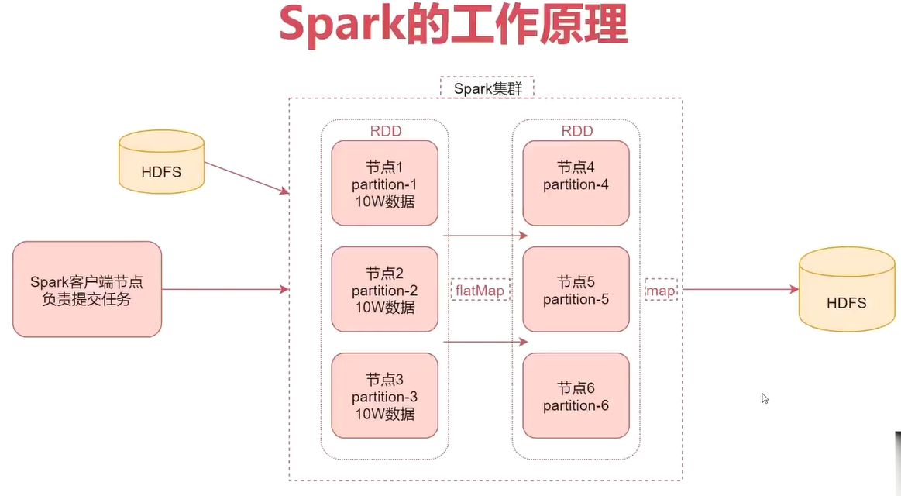


## 2.1、什么是RDD

RDD通常通过Hadoop上的文件，即HDFS文件进行创建，也可以通过程序中的集合来创建。

RDD是Spark提供的核心抽象，全称为 Resillient Distributed Dataset，即弹性分布式数据集。

### 2.1.1、DD的特点

- 弹性：RDD数据默认情况下存放在内存中，但是在内存资源不足时，Spark也会自动将RDD数据写入磁盘。
- 分布式：RDD在抽象上来说是一种元素数据的集合，它是被分区的，每个分区分布在集群中的不同节点上，从而让RDD中的数据可以被并行操作。
- 容错性：RDD最重要的特性就是提供了容错性，可以自动从节点失败中恢复过来。

如果某个节点上的RDD partition，因为节点故障，导致数据丢了，那么RDD会自动通过自己的数据来源，重新计算该partition的数据。


## 2.2、Spark架构相关进程

注意：在这里是以Spark的standalone集群为例进行分析。

- Driver：

我们编写的Spark程序就在Driver（进程）上，由Driver进程负责执行。

Driver进程所在的节点可以是Spark集群的某一个节点或者就是我们提交Spark程序的客户端节点。具体Driver进程在哪个节点上启动是由我们提交任务时指定的参数决定的，这个后面我们会详细分析。

- Master：

集群的主节点中启动的进程。

主要负责集群资源的管理和分配，还有集群的监控等。

- Worker：

集群的从节点中启动的进程。

主要负责启动其他进程来执行具体数据的处理和计算任务。

- Executor：

此进程由Worker负责启动，主要为了执行数据处理和计算。

- Task：

由Executor负责启动的线程，它是真正干活的。


## 2.3、架构原理

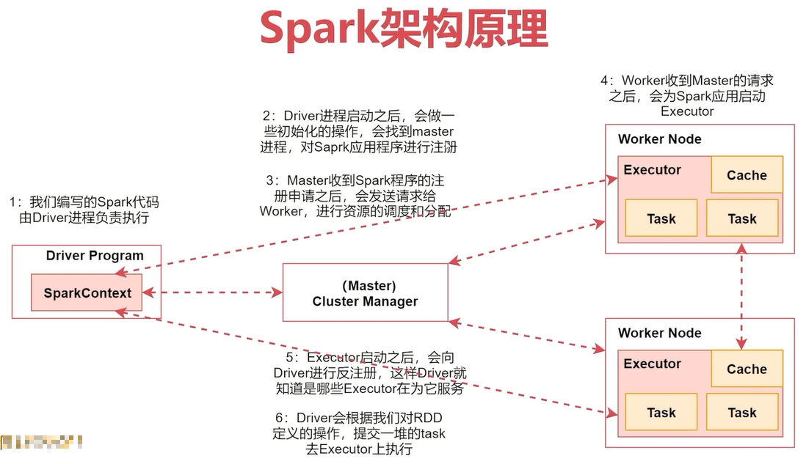


## 2.4、Spark任务日志

### 2.4.1、在yarn的web界面查看日志

使用on yarn模式提交Spark任务时，在任务执行中，点击对应任务的Tracking UI列的ApplicationMaster，可以打开Spark界面。

操作路径：在yarn的web界面([http://emon:8088](http://emon:8088/)) ==> 点击对应任务的ApplicationMaster链接（任务执行完成后只能看到history链接）==>点击查看。

如果是history链接，点击进去查看logs链接日志时，会提示`Failed redirect for container_xxx_xxx_xxx_xxx`。

如何解决？开启 Spark HistoryServer 进程。

任意选择一个服务器开启spark的historyserver进程都可以，选择集群内的节点，或者选择spark的客户端节点都可以。

下面我们就在这个spark的客户端节点上启动spark的historyserver进程。

**说明**：该配置基于Hadoop的MapReduce任务日志配置，请先确保MapReduce的任务日志配置OK！

需要修改`spark-defaults.conf`和`spark-env.sh`。

- `spark-defaults.conf`

如果目前尚不存在`spark-defaults.conf`文件，可以从`spark-defaults.conf.template`复制一份重命名为`spark-defaults.conf`。

```bash
[emon@emon ~]$ cp /usr/local/spark/conf/spark-defaults.conf.template /usr/local/spark/conf/spark-defaults.conf
[emon@emon ~]$ vim /usr/local/spark/conf/spark-defaults.conf
```

```properties
# [新增]
spark.eventLog.enabled=true
# [新增]
spark.eventLog.compress=true
# [新增]
spark.eventLog.dir=hdfs://emon:8020/tmp/logs/spark-events
# [新增]
spark.history.fs.logDirectory=hdfs://emon:8020/tmp/logs/spark-events
# [新增]
spark.yarn.historyServer.address=http://emon:18080
# [新增]
spark.yarn.historyServer.allowTracking=true
```

注意：在哪个节点上启动spark的historyserver进程，`spark.yarn.historyServer.address`的值里面就指定哪个节点的主机名信息。

- `spark-env.sh`

```bash
[emon@emon ~]$ vim /usr/local/spark/conf/spark-env.sh
```

```properties
# [新增]
export SPARK_HISTORY_OPTS="-Dspark.history.ui.port=18080 -Dspark.history.fs.logDirectory=hdfs://emon:8020/tmp/logs/spark-events"
```

- 确保日志目录存在

```bash
# 如果日志目录不存在，启动时会报错
[emon@emon ~]$ hdfs dfs -mkdir -p hdfs://emon:8020/tmp/logs/spark-events
```

- 启动

```bash
[emon@emon ~]$ /usr/local/spark/sbin/start-history-server.sh 
```

- 验证

```bash
# 其他进程忽略显示，看到如下进程表示Spark的HistoryServer启动成功
[emon@emon ~]$ jps
17287 HistoryServer
```

可访问如下地址：

http://emon:18080

- 停止

```bash
[emon@emon ~]$ /usr/local/spark/sbin/stop-history-server.sh 
```


## 2.5、RDD持久化与共享变量

### 2.5.1、RDD持久化

- RDD持久化原理

Spark中有一个非常重要的功能就是可以对RDD进行持久化。

当对RDD执行持久化操作时，每个节点都会讲自己操作的RDD的partition数据持久化到内存中，并且在之后对该RDD的反复使用中，直接使用内存中缓存的partition数据。

这样的话，针对一个RDD反复执行多个操作的场景，就只需要对RDD计算一次即可，后面直接使用该RDD，而不需要反复计算多次该RDD。

正常情况下RDD的数据使用过后是不会一直保存的，巧妙使用RDD持久化，在某些场景下，对Spark应用程序的性能有很大提升。特别是对于迭代式算法和快速交互式应用来说，RDD持久化，是非常重要的。

要持久化一个RDD，只需要调用它的 cache() 或者 persist() 方法就可以了。

在该RDD第一次被计算出来时，就会直接缓存在每个节点中。而且Spark的持久化机制还是自动容错的，如果持久化的RDD的任何partition数据丢失了，那么Spark会自动通过其源RDD，使用transformation算子重新计算该partition的数据。

cache()和persist()的区别在于：
cache()是persist()的一种简化方式:  cache() = persist() = persist(StorageLevel.MEMORY_ONLY)

- RDD持久化策略

| 策略                             | 介绍                                                         |
| -------------------------------- | ------------------------------------------------------------ |
| MEMORY_ONLY                      | 以非序列化的方式持久化在JVM内存中                            |
| MEMORY_AND_DISK                  | 同上，但是当某些partition无法存储在内存中时，会持久化到磁盘中 |
| MEMORY_ONLY_SER                  | 同MEMORY_ONLY，但是会序列化                                  |
| MEMORY_AND_DISK_SET              | 同MEMORY_AND_DISK，但是会序列化                              |
| DISK_ONLY                        | 以非序列化的方式完全存储到磁盘上                             |
| MEMORY_ONLY_2、MEMORY_AND_DISK_2 | 尾部加了2的持久化级别，表示会将持久化数据复制一份，保存到其他节点，从而在数据丢失时，不需要重新计算，只需要使用备份数据即可。 |

- 如何选择RDD持久化策略

Spark提供了多种持久化级别，主要是为了在CPU和内存消耗之间进行取舍。

下面是一些通用的持久化级别的选择建议：

1. 优先使用MEMORY_ONLY，纯内存速度最快，而且没有序列号不需要消耗CPU进行反序列化操作，缺点就是比较耗内存。
2. MEMORY_ONLY_SER，将数据进行序列化存储，纯内存操作还是非常快，只是在使用的时候需要消耗CPU进行反序列化。

> 注意：
>
> 如果需要进行数据的快速失败恢复，那么就选择带有后缀为_2的策略，进行数据的备份，这样在失败时，就不需要重新计算了。
>
> 能不使用DISK相关的策略，就不要使用，因为有的时候，从磁盘读取数据，还不如重新计算一次。

### 2.5.2、共享变量

- 共享变量的工作原理

Spark还有一个非常重要的特性就是共享变量。

默认情况下，如果在一个算子函数中使用到了某个外部的变量，那么这个变量的值会被拷贝到每个task中。此时每个task只能操作自己的那份变量数据。如果多个task想要共享某个变量，那么这种方式是做不到的。

- Spark提供了两种共享变量

一种是Broadcast Variable（广播变量）

另一种是Accumulator（累加变量）

#### 2.5.2.1、Broadcast Variable

Broadcast Variable会将使用到的变量，仅仅为每个节点拷贝一份，而不会为每个task都拷贝一份副本，因此其最大的作用，就是减少变量到各个节点的网络传输消耗，以及在各个节点上的内存消耗。

通过调用SparkContext的broadcast()方法，针对某个变量创建广播变量。

**注意：广播变量，是只读的。**

然后在算子函数内，使用到广播变量时，每个节点只会拷贝一份副本。可以使用广播变量的value()方法获取值。

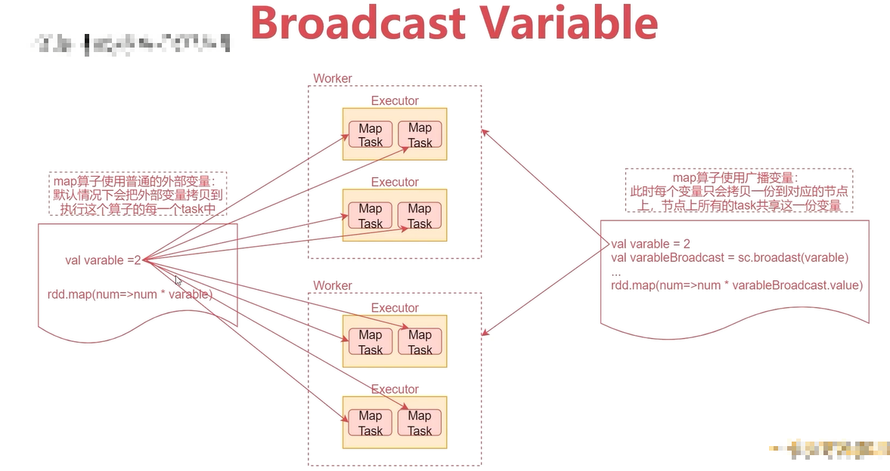


## 2.6、sortByKey如何实现全局排序


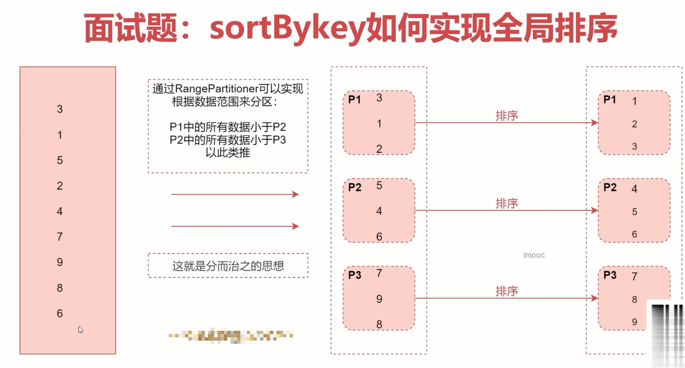


# 三、Spark性能优化的道与术

## 3.1、宽依赖和窄依赖

- 窄依赖（Narrow Dependency）：指父RDD的每个分区只被子RDD的一个分区所使用，例如map、filter等这些算子。一个RDD，对它的父RDD只有简单的一对一的关系，也就是说，RDD的每个partition仅仅依赖于父RDD中的一个partition，父RDD和子RDD的partition之间的对应关系，是一对一的。
- 宽依赖（Shuffle Dependency）：父RDD的每个分区都可能被子RDD的多个分区使用，例如groupByKey、reduceByKey、sortByKey等算子，这些算子其实都会产生shuffle操作。也就是说，每一个父RDD的partition中的数据都可能会传输一部分到下一个RDD的每个partition中。此时就会出现，父RDD和子RDD的partition之间，具有错综复杂的关系，那么，这种情况就叫做两个RDD之间是宽依赖，同时，他们之间会发生shuffe操作。

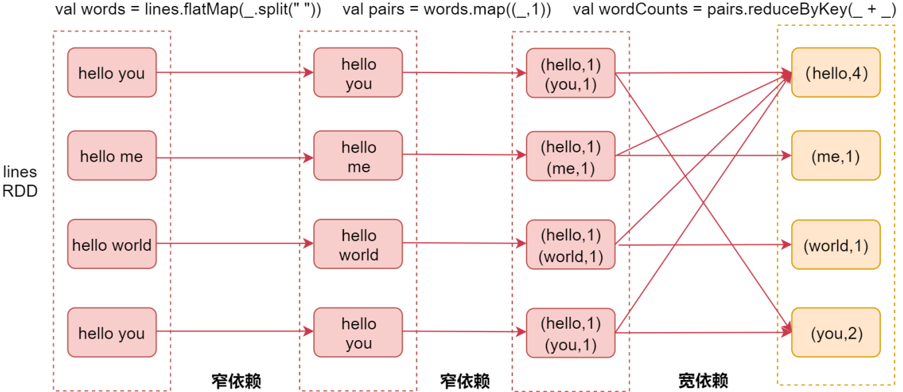


也就是说，产生了shuffle就是宽依赖，否则是窄依赖！

这就是宽窄依赖的区别，那么我们在这区分宽窄依赖有什么意义吗？

### 3.1.1、Stage

Spark Job是根据action算子触发的，遇到action算子就会起一个job。

> 注意：stage的划分依据就是看是否产生了shuffle（即宽依赖），遇到一个shuffle操作就划分为前后两个stage。
>
> stage是由一组并行的task组成，stage会将一批task用TaskSet来封装，提交给TaskScheduler进行分配，最后发送到Executor执行。


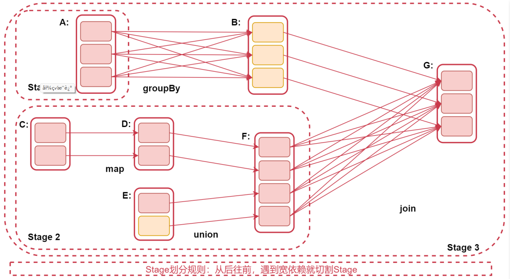


## 3.2、Spark Job的三种提交模式

- standalone模式：基于Spark自己的standalone集群。

```bash
spark-submit --master spark://emon:7077
```

- yarn的client模式

```bash
spark-submit --master yarn --deploy-mode client
```

> 这种方式主要用于测试，查看日志方便一些，部分日志会直接打印到控制台上面，因为driver进程运行在本地客户端，就是提交Spark任务的那个客户端机器，driver负责调度job，会与yarn集群产生大量的通信。一般情况下Spark客户端机器和Hadoop集群机器无法通过内网通信，只能通过外网，这样在大量通信的情况下会影响通信效率，并且当我们执行一些action操作的时候数据也会返回给driver端，driver端机器的配置一般都不高，可能会导致内存溢出等问题。

- yarn的cluster模式【推荐】

```bash
spark-submit --master yarn --deploy-mode cluster
```

> 这种方式driver进程运行的集群中的某一台机器上，这样集群内部节点之间通信是可以通过内网通信的，并且集群内的机器的配置也会比普通的客户机器配置高，所以就不存在yarn-client模式的一些问题了，只不过这个时候查看日志只能到集群上面看了，这倒也不算啥影响。

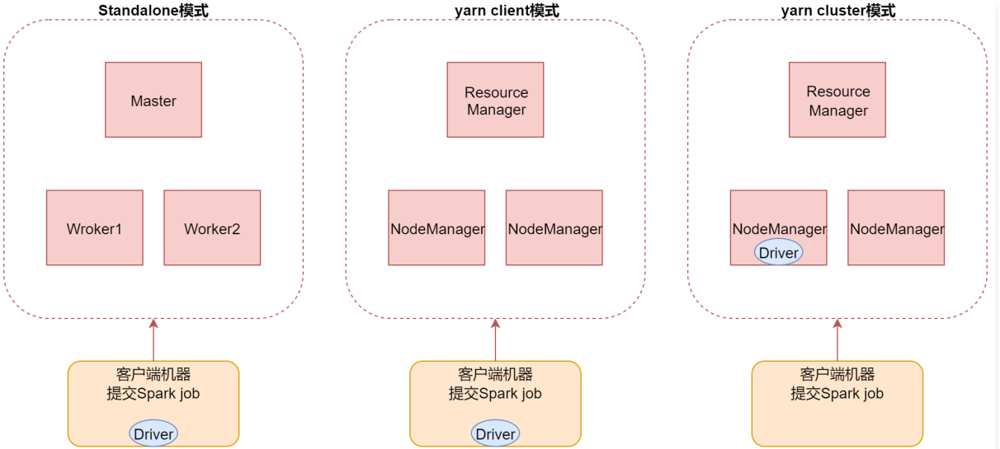


## 3.3、Shuffle机制分析

在MapReduce框架中，Shuffle是连接Map和Reduce之间的桥梁，Map阶段通过Shuffle读取数据并输出到对应的Reduce；而Reduce阶段负责从Map端拉取数据并进行计算。在整个Shuffle过程中，往往伴随着大量的磁盘和网络I/O。所以Shuffle性能的高低也直接决定了整个程序的性能高低。Spark也会有自己的Shuffle实现过程。

在Spark中，什么情况下，会发生Shuffle呢？

reduceByKey、groupByKey、sortByKey、countByKey、join等操作都会产生Shuffle。

Spark Shuffle的迭代历程：

1. Spark 0.8及以前，使用未优化的Hash Based Shuffle
2. Spark 0.8.1，优化后的Hash Based Shuffle
3. Spark1.6之后，使用Sort-Based Shuffle

### 3.3.1、未优化的Hash Based Shuffle

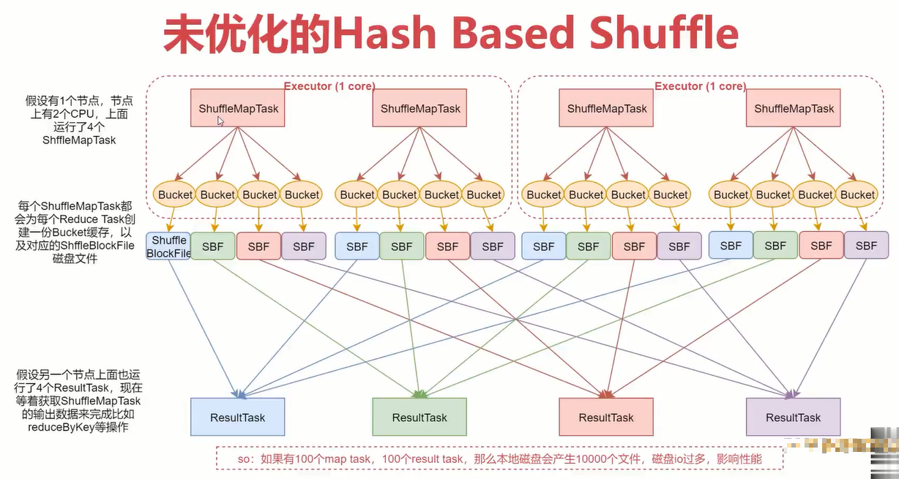


注意：那个bucket缓存是非常重要的，ShuffleMapTask会把所有的数据都写入Bucket缓存之后，才会刷写到对应的磁盘文件中，但是这就有一个问题，如果map端数据过多，那么很容易造成内存溢出，所以Spark在优化后的Hash Based Shuffle中对这个问题进行了优化，默认这个内存缓存是100kb，当Bucket中的数据达到了阈值之后，就会将数据一点点地刷写到对应的ShuffleBlockFile磁盘中了。

这种操作的优点，是不容易发生内存溢出。缺点在于，如果内存缓存过小的话，那么可能发生过多的磁盘IO操作。所以，这里的内存缓存大小，是可以根据实际的业务情况进行优化的。

### 3.3.2、优化后的Hash Based Shuffle

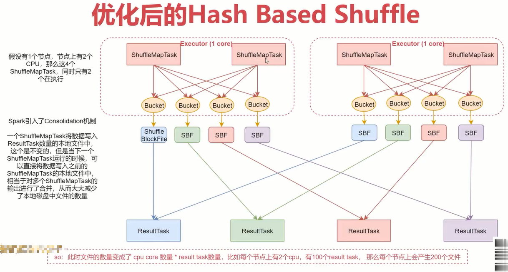


此时文件的数量变成了CPU core数量 * ResultTask数量，比如每个节点上有2个CPU，有100个ResultTask，那么每个节点上会产生200个文件，这时候文件数量就变得少多了。

但是如果ResultTask端的并行任务过多的话，则CPU core * ResultTask依旧过大，也会产生很多小文件。


### 3.3.3、Sort-Based Shuffle

引入Consolidation机制虽然在一定程度上减少了磁盘文件数量，但是不足以有效提高Shuffle的性能，这种情况只适合中小型数据规模的数据处理。

为了让Spark能在更大规模的集群上高性能处理大规模的数据，因此Spark引入了Sort-Based Shuffle。

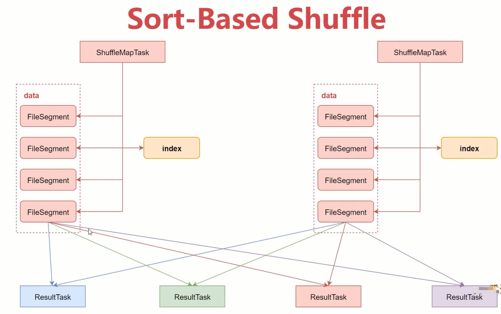


该机制针对每一个ShufleMapTask都只创建一个文件，将所有的ShuffleMapTask的数据都写入同一个文件，并且对应生成一个索引文件。

以前的数据是放在内存中，等到数据写完了再刷写到磁盘，现在为了减少内存的使用，在内存不够用的时候，可以将内存中的数据溢写到磁盘，结束的时候，再讲这些溢写的文件联合内存中的数据一起进行归并，从而减少内存的使用量。一方面文件数量显著减少，另一方面减少缓存所占用的内存大小，而且同时避免GC的风险和频率。


## 3.4、Spark之checkpoint

### 3.4.1、checkpoint概述

- 针对Spark Job，如果我们担心某些关键的，在后面会反复使用的RDD，因为节点故障导致数据丢失，那么可以针对该RDD启动checkpoint机制，实现容错和高可用。
- 首先调用SparkContext的setCheckpointDir()方法，设置一个容错的文件系统目录（HDFS），然后对RDD调用checkpoint()方法。
- 最后，在RDD所在的job运行结束之后，会启动一个单独的job，将checkpoint设置过的RDD的数据写入之前设置的文件系统中。

### 3.4.2、RDD之checkpoint流程

- 第一步：SparkContext设置checkpoint目录，用于存放checkpoint的数据

对RDD调用checkpoint方法，然后它就会被RDDCheckpointData对象进行管理，此时这个RDD的checkpoint状态会被设置为`Initialized`。

- 第二步：待RDD所在的Job运行结束，会调用Job中最后一个RDD的doCheckpoint方法，该方法沿着RDD的血缘关系向上查找被checkpoint方法标记过的RDD，并将其checkpoint状态从`Initialized`设置为`CheckpointingInProgress`。
- 第三步：启动一个单独的Job，来将血缘关系中标记为`CheckpointInProgress`的RDD执行checkpoint操作，也就是将其数据写入checkpoint目录。
- 第四步：将RDD数据写入checkpoint目录之后，会将RDD状态改变为`Checkpointed`

并且还会改变RDD的血缘关系，即会清除掉RDD所有依赖的RDD，最后还会设置其父RDD为新创建的`CheckpointRDD`。

### 3.4.3、checkpoint与持久化的区别

- lineage是否发生变化

lineage（血缘关系）说的就是RDD之间的依赖关系。

持久化，只是将数据保存在内存中或者本地磁盘文件中，RDD的lineage（血缘关系）是不变的；Checkpoint执行之后，RDD就没有依赖的RDD了，也就是它的lineage改变了。

- 丢失数据的可能性

持久化的数据丢失的可能性较大，如果采用persist把数据存在内存中的话，虽然速度最快但是也是最不可靠的，就算放在磁盘上也不是完全可靠的，因为磁盘也会损坏。

checkpoint的数据通常是保存在高可用文件系统中（HDFS），丢失的可能性很低。

> 建议：对需要checkpoint的RDD，先执行persist（StorageLevel.DISK_ONLY)

为什么呢？

因为默认情况下，如果某个RDD没有持久化，但是设置了checkpoint，那么这个时候，本来Spark任务以及执行结束了，但是由于中间的RDD没有持久化，在进行checkpoint的时候想要将这个RDD的数据写入外部存储系统的话，就需要重新计算这个RDD的数据，再将其checkpoint到外部存储系统中。

如果对需要checkpoint的RDD进行了基于磁盘的持久化，那么后面进行checkpoint操作时，就会直接从磁盘上读取RDD的数据了，就不需要重新再计算一次了，这样效率就搞了。


## 3.5、JVM垃圾回收调优

- 如果内存设置不合理会导致大部分时间都消耗在垃圾回收上
- 默认情况下，Spark使用每个executor 60%的内存空间来缓存RDD，那么只有40%的内存空间来存放算子执行期间创建的对象
- 如果垃圾回收频繁发生，就需要对这个比例进行调优，通过参数`spark.storage.memoryFraction`来修改比例
- Java堆空间被划分成了两块空间：年轻代和老年代
- 年轻代存放短时间存活的对象，老年代存放长时间存活的对象
- 年轻代又被划分了三块空间：Ecen、Survivor1、Survivor2

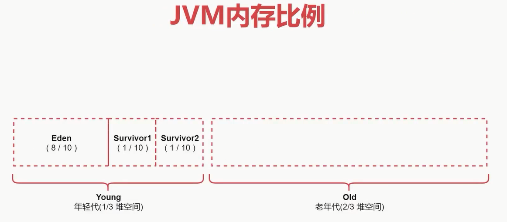


## 3.6、Spark程序性能优化

### 3.6.1、性能优化方案

- 高性能序列化类库
- 持久化或者checkpoint
- JVM垃圾回收调优
- 提高并行度
- 数据本地化
- 算子优化

### 3.6.2、JVM垃圾回收调优

- 如果内存设置不合理会导致大部分时间都消耗在垃圾回收上
- 默认情况下，Spark使用每个executor 60%的内存空间来缓存RDD，那么只有40%的内存空间来存放算子执行期间创建的对象
- 如果垃圾回收频繁发生，就需要对这个比例进行调优，通过参数`spark.storage.memoryFraction`来修改比例
- Java堆空间被划分成了两块空间：年轻代和老年代
- 年轻代存放短时间存活的对象，老年代存放长时间存活的对象
- 年轻代又被划分了三块空间：Ecen、Survivor1、Survivor2


### 3.6.3、提高并行度

- spark-submit脚本常用配置参数

  - `--name mySparkJobName`：指定任务名称
  - `--class com.xxx`：指定入口类
  - `--master yarn`：指定集群地址，on yarn模式指定 yarn
  - `--deploy-mode cluster`：client代表yarn-client，cluster代表yarn-cluster
  - `--executor-memory 1G`：executor进程的内存大小，实际工作中可以设置2~4G即可
  - `--num-executors 2`：分配多少个executor进程
  - `--executor-cores 2`：一个executor进程分配多少个cpu
  - `--driver-cores 1`：driver进程分配多少core，默认为1
  - `--driver-memory 1G`：driver进程的内存，如果需要使用类似于collect之类的action算子向driver端拉取数据，则这里可以设置大一些
  - `--jars jarpath,jar2path`：在这里可以设置job依赖的第三方jar包，支持本地路径或hdfs路径
  - `--packages groupId:artifactId:version,groupId:artifactId:version`：设置job依赖的jar包，通过maven下载
  - `--files filePath,file2Path`：设置job依赖的外援资源文件

### 3.6.4、数据本地化

数据本地化对于Spark Job性能有着巨大的影响。如果数据以及要计算它的代码是在一起的，那么性能当然会非常高。但是，如果数据和计算它的代码是分开的，那么其中之一必须到另外一方的机器上。通常来说，移动代码到其他节点，会比移动数据到代码所在节点，速度要高得多，因为代码比较小。Spark也正是基于这个数据本地化的原则来构建task调度算法的。

数据本地化是指数据离计算它的代码有多近。基于数据距离代码的距离，有几种数据本地化级别：

- PROCESS_LOCAL：进程本地化，性能最好。数据和计算它的代码在同一个JVM进程中。
- NODE_LOCAL：节点本地化，数据和计算它的代码在一个节点上，但是不在一个JVM进程。
- NO_PREF：数据从哪里过来，性能都是一样的。
- RACK_LOCAL：数据和计算它的代码在一个机架上，数据需要通过网络在节点之间进行传输。
- ANY：数据可能在任意地方，比如其他网络环境内，或者其他机架上，性能最差。

Spark倾向使用最好的本地化级别调度task，但这是不现实的。

如果目前我们要处理的数据所在的executor上目前没有空闲的CPU，那么Spark就会降低本地化级别。这是有两个选择：

第一：等待，直到executor上的cpu释放出来，那么就分配task过去。

第二：立即在任意一个其他executor上启动一个task。

Spark默认会等待指定时间，期望task要处理的数据所在的节点上的executor空闲出一个cpu，从而将task分配过去，只要超过了时间，那么Spark就会将task分配到其他任意一个空闲的executor上。

可以设置参数：`spark.locality`系列参数，来调节Spark等待task可以进行数据本地化的时间。

> spark.locality.wait：默认等待3秒，针对所有级别。
>
> spark.locality.wait.proces：:等待指定的时间看能否达到数据和计算它的代码在同一个JVM。
>
> spark.locality.wait.node：等待指定的实际看能否达到数据和计算它的代码在一个节点上执行。
>
> spark.locality.wait.rack：等待指定的时间看能否达到数据和计算它的代码在一个机架上。

### 3.6.5、算子优化

- map vs mapPartitions
  - map操作：对RDD中的每个元素进行操作，一次处理一条数据。
  - mapPartitions操作：对RDD中的每个partition进行操作，一次处理一个分区的数据。

所以，map操作：执行1次map算子只处理1个元素，如果partition中的元素较多，假设当前已经处理了1000个元素，在内存不足的情况下，Spark可以通过GC等方法回收内存（比如将已经处理掉的1000个元素从内存中回收）。因此，map操作通常不会导致OOM异常。

mapPartitions操作：执行1次map算子需要接收该partition中的所有元素，因此一旦元素很多而内存不足，就容易导致OOM的异常，也不是说一定就会产生OOM异常，只是和map算子对比的话，相对来说容易产生OOM异常。

不过一般情况下，mapPartitions的性能更高；初始化操作、数据库链接等操作适合使用mapPartitions操作。

这是因为：假设需要将RDD中的每个元素写入数据库中，这时候就应该把创建数据库链接的操作放置在mapPartitions中，创建数据库链接这个操作本身就是一个比较耗时的操作，如果该操作放在map中执行，将会频繁执行，比较耗时且影响数据库的稳定性。

- foreach vs foreachPartitions
  - foreach：一次处理一条数据
  - foreachPartitions：一次处理一个分区的数据

foreachPartitions和mapPartitions的特性是一样的，唯一的区别就是mapPartitions是transformation操作（不会立即执行），foreachPartitions是action操作（会立即执行）。

- repartition的使用

对RDD进行重新分区，repartition主要有两个应用场景：

1. 可以调整RDD的并行度

针对个别RDD，如果感觉分区数量不合适，想要调整，可以通过repartition进行调整，分区调整了之后，对应的并行度也就可以调整了。

2. 可以解决RDD中数据倾斜的问题

如果RDD中不同分区之间的数据出现了数据倾斜，可以通过repartition实现数据重新分发，可以分发到不同分区中。

- reduceByKey和groupByKey的区别

在实现分组聚合功能时这两个算子有什么区别？

看这两行代码：

```scala
val counts = wordCountRDD.reduceByKey(_ + _)
val count = wordCountRDD.groupByKey().map(wc => (wc._1, wc._2.sum))
```

这两行代码的最终效果是一样的，都是对wordCountRDD中每个单词出现的次数进行聚合统计，那这两种方式在原理层面有什么区别吗？

首先这两个算子在执行的时候都会产生shuffle。

但是：

1. 当采用reduceByKey时，数据在进行shuffle之前会先进行局部聚合。
2. 当使用groupByKey时，数据在shuffle之前不会进行局部聚合，会原样进行shuffle。

这样的话reduceByKey就减少了shuffle的数据传送，所以效率会高一些。

如果能用reduceByKey，那就用reduceByKey，因为它会在map端，先进行本地combine，可以大大减少要传输到reduce端的数据量，减小网络传输的开销。

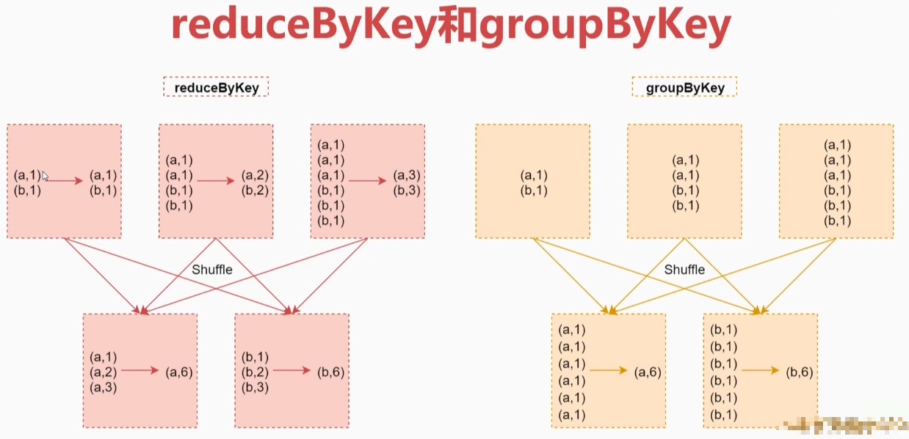


# 四、Spark SQL

## 4.1、DataFrame

- Spark SQL是Spark的一个模块，主要用于进行结构化数据的处理，它提供的最核心的编程抽象，就是`DataFrame`。
- `DataFrame=RDD+Schema`，它其实和关系型数据库中的表非常类似，DataFrame可以通过很多来源进行构建。它其实和关系型数据库中的表非常类似，RDD可以认为是表中的数据，Schema是表结构信息。DataFrame可以通过很多来源进行构建，包括：结构化的数据文件，Hive中的表，外部的关系型数据库以及RDD。

Spark1.3出现的`DataFrame`，Spark1.6出现了`DataSet`，在Spark2.0中两者统一，`DataFrame`等于`DataSet[Row]`。

- 由于DataFrame等于DataSet[Row],所以可以互相转换。

## 4.2、SparkSession

要使用Spark SQL，首先需要创建一个SparkSession对象。

SparkSession中包含了SparkContext和SqlContext。所以说，想通过SparkSession来操作RDD的话需要先通过它来获取SparkContext。这个SqlContext是使用SparkSQL操作hive的时候会用到的。


# 五、数据仓库

## 数据仓库分层设计

- APP数据应用层：为统计报表提供数据
- DWS数据汇总层：对数据进行轻度汇总（宽表）
- DWD明细数据层：清洗之后的数据
- ODS原始数据层：存放原始数据

## 典型的数据仓库系统架构

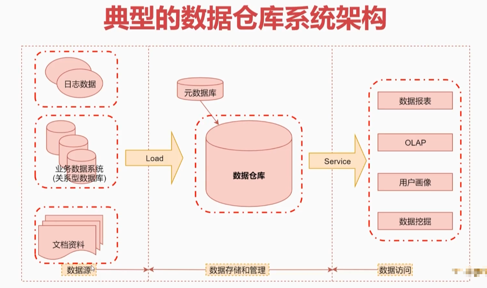


## 项目需求分析

想要开发一个完整的数据仓库系统，至少需要以下这几个功能模块：

- 数据采集平台，这个模块主要负责采集各种数据源的数据
- 数据仓库，这个模块负责数据仓库和管理
- 数据报表，这个模块其实就是数据可视化展示了

通过这三个模块可以实现数据采集，构建数据仓库，最后基于数据仓库中的数据实现上层应用，体现数据仓库的价值。

## 数据选项

- 数据采集：Flume【推荐】、Logstash、FileBeat、Sqoop【推荐】
  - Flume：日志采集
  - Sqoop：关系型数据库采集
- 数据存储：HDFS【推荐】、MySQL
- 数据计算：Hive【优先】、Spark
- 数据可视化：Hue、Zeppelin【推荐】、Echarts（开发数据接口）

## 整体架构设计

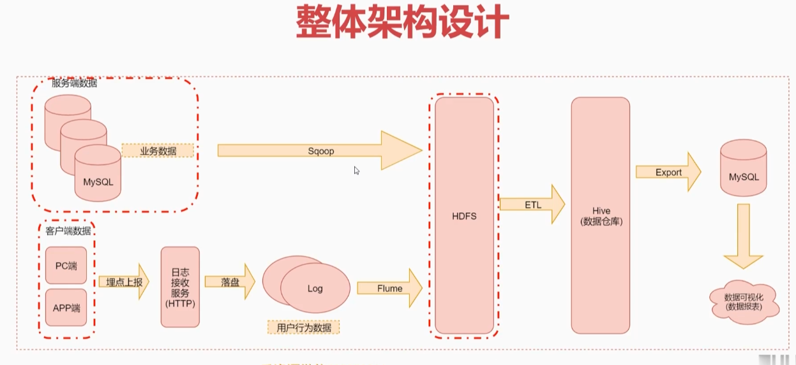


## 服务器资源规划-测试环境

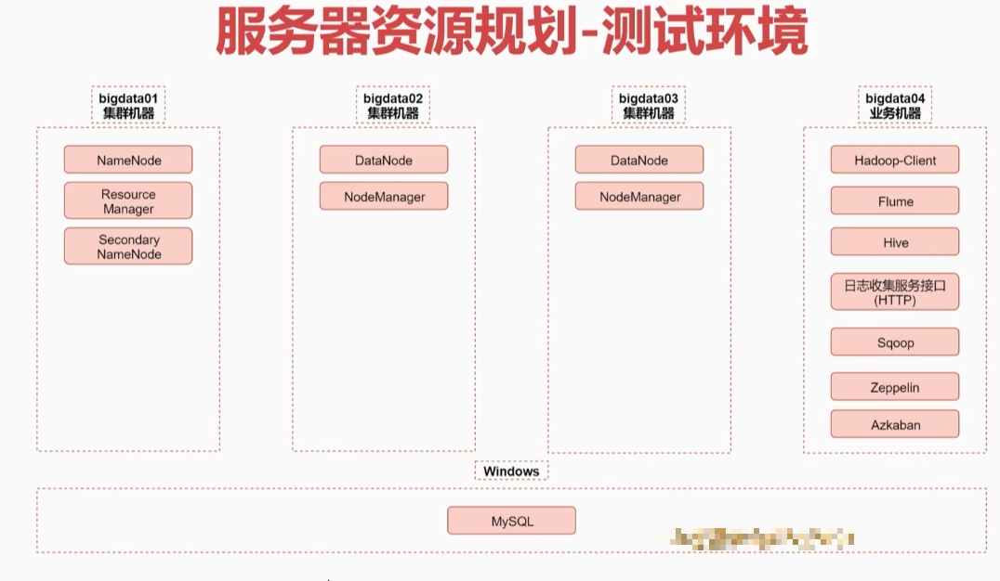


## 服务器资源规划-生产环境


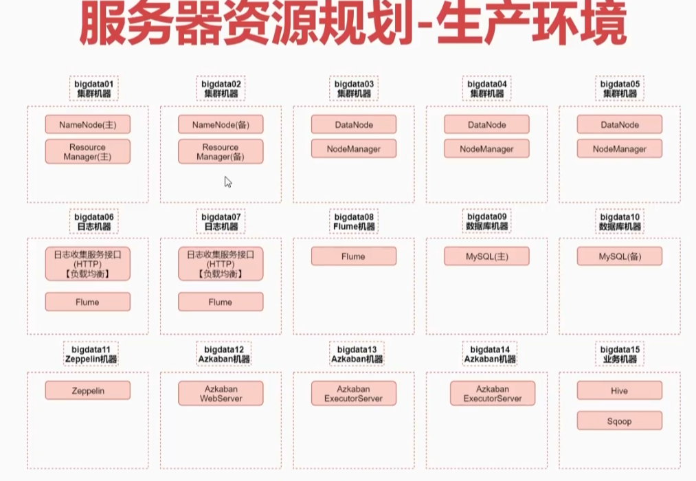


