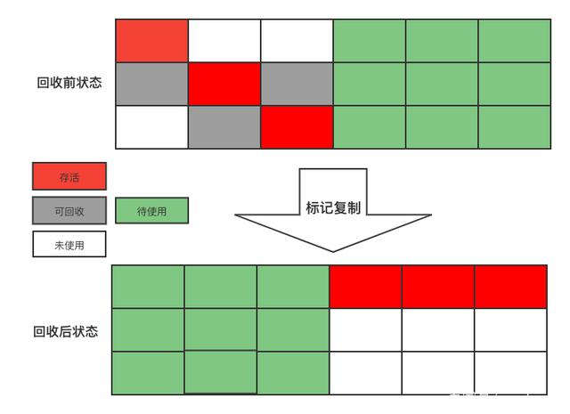
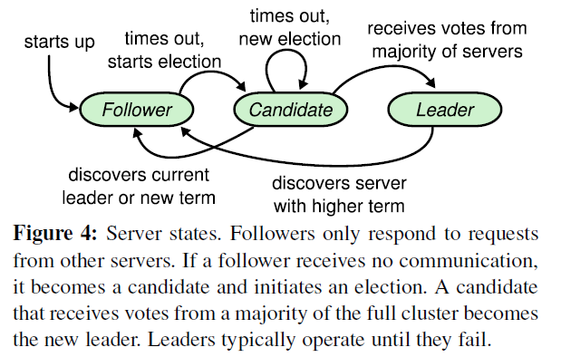
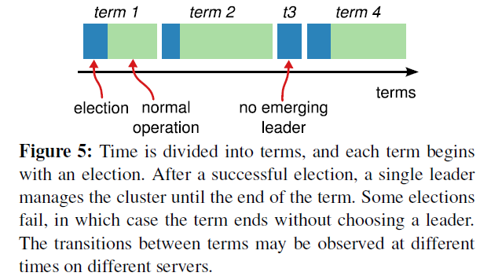

# 剑指Java

[TOC]

# 工具流程

蓝湖

禅道/Jira/PingCode

EoLink/APIFox/Swagger

Jenkins

K8s/Rancher

# 面试知识点

## JVM

1、请你谈谈对JVM的理解？Java8虚拟机和之前的变化更新？

2、什么是OOM，什么是栈溢出StackOverFlowError？怎么分析？

3、JVM的常用调优参数有哪些？

4、内存快照如何抓取，怎么分析Dump文件？知道吗？

5、谈谈JVM中，类加载器你的认识？


1：JVM的位置

硬件体系（Intel等）==>操作系统（Win、Linux、Mac）==>JRE-JVM==>App

2：JVM的内存结构和分区


了解jvm吗，说一下成员变量在jvm的存储


3：类加载器

作用：加载Class文件

虚拟机自带的加载器

启动类（根）加载器：Bootstrap ClassLoader：主要负责加载核心的类库（java.lang.*等），构造ExtClassLoader和AppClassLoader。

扩展类加载器：ExtClassLoader：主要负责加载jre/lib/ext目录下的一些扩展的jar。

应用程序加载器：AppClassLoader：主要负责加载应用程序的主函数类


4：双亲委派机制

作用：保证安全


为什么要设计这种机制：

这种设计有个好处是，如果有人想替换系统级别的类：String.java。篡改它的实现，在这种机制下这些系统的类已经被Bootstrap classLoader加载过了（为什么？因为当一个类需要加载的时候，最先去尝试加载的就是BootstrapClassLoader），所以其他类加载器并没有机会再去加载，从一定程度上防止了危险代码的植入。


5：沙箱安全机制

6：Native

Native Method Stack

它的具体做法是Native Method Stack中等级native方法，在（Execution Engine）执行引擎执行时加载Native Libraries。【本地库】


7：PC寄存器：线程私有

程序计数器：Program Counter Register

每个线程都有一个程序计数器，是线程私有的，就是一个指针，指向方法区中的方法字节码（用来存储指向一条指令的地址，也即将要指向的指令代码），在执行引擎读取下一条指令，是一个非常小的内存空间，几乎可以忽略不计！


8：方法区（Java8的元数据区）：线程共享

Method Area方法区

方法区是被所有线程共享，所有字段和方法字节码，以及一些特殊方法，如构造函数，接口代码也在此定义，简单说所有定义的方法的信息都保存在该区域，此区域属于共享空间！

<font color='red'>静态变量、常量、类信息（构造方法、接口定义、普通方法）、运行时的常量池存在方法区中，但是实例变量存储在堆内存中，和方法区无关。</font>

static/final/class/常量池


9：栈（数据结构）：线程私有

程序=数据结构+算法（不是框架+业务逻辑）

栈：先进后出、后进先出

队列：先进先出（FIFO：First Input First Output）

==喝多了吐就是栈，吃多了拉就是队列==

栈：8大基本类型+对象引用+实例方法

栈是运行时的单位：即程序如何执行，或者说如何处理数据。

栈是线程私有，不存在垃圾的回收。虚拟机栈的生命周期同线程一致。

栈帧：Java中的方法被扔进虚拟机的栈空间后就成为“栈帧”，比如main方法，程序入口；被压栈之后就成为栈帧。


10：三种JVM

- HotSpot（Oracle）
- BEA `JRockit`
- IBM `J9VM`


11：堆：线程共享

堆：先进新出、后进后出

堆是存储的单位：堆解决的是数据存储问题，即数据如何存放，放哪里！

Heap，一个JVM只有一个堆内存；堆内存的大小是可以调节的。

新生区：

- 类 诞生 和 成长的地方，甚至是消亡
- 伊甸园 所有的对象都是在 eden 区 new 出来的
- 幸存区

真理：经过研究，99%的对象都是临时对象！

老年区：

永久区：

这个区域常驻内存，用来存放JDK自身携带的Class对象。Interface元数据，存储的是Java运行时的一些环境或类信息~，这个区域不存在垃圾回收！关闭VM虚拟机就会释放这个区域的内存~

​	元空间的OOM：逻辑上存在，物理上不存在；又说元数据不占用JVM堆，但占用物理内存

​	一个启动类，加载了大量第三方jar包。Tomcat部署了太多的应用。大量动态生成的反射类，不断被加载。直到内存慢了，就会OOM。

- JDK1.6之前：永久代，常量池是在方法区
- JDK1.7：永久代，但是慢慢退化了，`去永久代`，常量池在堆中
- JDK1.8之后：无永久代，常量池在元空间


12：新生代和老年代

13、永久代

14、堆内存调优

使用JProfiler。

15、GC

主要针对堆内存和元空间。

GC两种类型：轻GC（普通GC，Minor GC），重GC（全GC，Full GC）

GC题目：

- JVM的内存模型和分区——详细到每个区放什么？

- 堆里面的分区有哪些？Eden、from、to、老年区，说说他们的特点！

- GC的算法有哪些？

  - 标记清除法

    - 分为标记和清除两阶段。1）标记存活的Java对象；2）回收未被标记的Java对象。
    - 缺点1：执行效率会随着堆的增加而降低，原因是标记需要遍历整个堆。且如果有大量java对象都需要被回收，清除的效率也会很低。
    - 缺点2：产生空间碎片。大量的空间碎片会导致在分配大java对象时没有足够的内存空间，进而提前引发一次垃圾回收。

    

  - 标记整理法

    - 根据老年代的特点，有人对“标记 - 清除”进行改进，提出了“标记 - 整理”算法。“标记 - 整理”算法的标记过程与“标记 - 清除”算法相同，但后续步骤不是直接对可回收对象进行清理，而是让所有存活的对象都向一端移动，然后直接清理掉端边界以外的内存。

    

    

  - 标记复制法

    - 为了解决标记清楚算法对大量可回收Java对象执行效率低的问题。
    - 标记复制算法将内存分为大小相等的两块，每次只使用其中一块。假设这两块区域一块是A，一块是B。先使用A区域分配Java对象，当A用完后，标记A区域的Java对象，将A区域还存活的对象复制到B区域，然后将A区域内存一次性的清理掉。
      - 情况1：A区域多数Java对象是存活的：这时进行复制会产生很大的复制开销。
      - 情况2：A区域少数Java对象存活，复制效率比较高。
    - 缺点1：太费内存，如果是平分内存区域，内存使用率一下降低一半。因为只有一半内存可以使用。

    

    我们知道绝大所多数java对象都是朝生夕死，特别是在新生代区域，98%的java对象熬不过第一轮收集。因此可以对标记复制算法在特定的场景下进行优化。如：Serial、ParNew等收集器在新生代就是采用这种策略。

  - 引用计数法：最大弱点，无法回收循环引用的对象。

    - 给Java对象添加一个引用计数器，每当一个地方引用它时，计数器加一；当引用失效时，计数器减一；当计数器值为0时，说明这个Java对象不再被使用，将被回收掉。
    - 优点1：【实时性】无需等到内存不够的时候，才开始回收，运行时根据对象的计数器是否为0，就可以直接回收。
    - 优点2：【应用无需挂起】在垃圾回收过程中，应用无需挂起。如果申请内存时，内存不足，则立刻报outofmember 错误。
    - 优点3：【区域性】更新对象的计数器时，只是影响到该对象，不会扫描全部对象

    - 缺点1：浪费cpu，即使内存够用，仍然在运行时进行计数器的统计
    - 缺点2：每次对象被引用时，都需要去更新计数器，有一点时间开销。另外无法解决循环引用问题。

总结：

内存效率：复制算法>标记清除算法->标记整理清除（时间复杂度）

内存整齐度：复制算法=标记整理算法>标记清除算法

内存利用率：标记整理清除=标记清除算法>复制算法

思考一个问题：难道没有最优算法嘛？

答案：没有，没有最好的算法，只有合适的算法-->GC：分代收集算法


年轻代：

- 存活率低
- 复制算法！

老年代：

- 区域大，存活率高
- 标记清除算法+标记整理清除算法


16：垃圾收集器

- 串行收集器Serial：Serial、Serial Old
- 并行收集器Parallel：Parallel Scavenge、Parallel Old，吞吐量优先【默认】
- 并发收集器Concurrent：CMS、G1，停顿时间优先
  - CMS: `-XX:+UseConcMarkSweepGC -XX:+UseParNewGC`
  - G1:`-XX:+UseG1GC`【JDK8推荐G1，性能高】

停顿时间VS吞吐量：

**停顿时间**：垃圾收集器做垃圾回收中断应用执行的时间。-XX:MaxGCPauseMillis

该参数应谨慎使用。太小的值将导致系统花费过多的时间进行垃圾回收。原因是为满足最大暂停时间，VM将设置更小的堆，以存储相对少量的对象，来提升回收速率，会导致更高频率的GC。

**吞吐量**：花在垃圾收集的时间和花在应用时间的占比。-XX:GCTimeRatio

举个官方的例子，参数设置为19，那么GC最大花费时间的比率=1/(1+19)=5%，程序每运行100分钟，允许GC停顿共5分钟，其吞吐量=1-GC最大花费时间比率=95%

默认情况下，VM设置此值为99，运行用户代码时间是GC停顿时间的99倍，即GC最大花费时间比率为1%

选择此参数应对server端程序是很适合的，设置过大会使堆变大，直至接近最大堆设置的值。


*连线部分，表示可以联合使用。*


GC日志分析神器：

https://gceasy.io/


## JMM

- Java Memory Model（Java内存模型），围绕着在并发过程中如何处理可见性、有序性、原子性这三个特性而建立的模型。

内存模型可以理解为在特定的操作协议下，对特定的内存或者高速缓存读写访问的过程抽象描述，不同架构下的物理机拥有不一样的内存模型，Java虚拟机是一个实现了跨平台的虚拟系统，因此它也有自己的内存模型，即Java内存模型。

因此它不是对物理内存的规范，而是在虚拟机基础上进行的规范，从而实现平台一致性，以达到Java程序能够“一次编写，到处运行”。

- JMM结构规范：

JMM规定了所有的变量都存储在主内存（Main Memory）中。每个线程还有自己的工作内存（Working Memory），线程的工作内存中保存了该线程使用到的变量的主内存副本拷贝，线程对变量的所有操作（读取、赋值等）都必须在工作内存中进行，而不能直接读写主内存中的变量（volatile变量仍然有工作内存的拷贝，但是由于它特殊的操作顺序性规定，所以看起来如同直接在主内存中读写访问一般）。不同的线程之间也无法直接访问对方工作内存的变量，线程之间值的传递都需要通过主内存来完成。

在Java中，所有实例域，静态域和数组元素存储在堆内存中，堆内存在线程之间共享（本文使用“共享变量”这个术语代指实例域，静态域和数组元素）。局部变量（Local variables），方法定义参数（Java预约规范称之为 formal method parameters）和异常处理器参数（exception handler parameters）不会在线程之间共享，它们不会有内存可见性问题，也不受内存模型的影响。

- 主内存和本地内存结构

从抽象的角度来看，JMM定义了线程和主内存之间的抽象关系：线程之间的共享变量存储在主内存（main memory）中，每个线程都有一个私有的本地内存（local memory），本地内存中存储了该线程以读/写共享变量的副本。本地内存是JMM的一个抽象概念，并不真实存在。本地内存它涵盖了缓存，写缓冲区，寄存器以及其他的硬件和编译器优化之后的一个数据存放位置。

参考：

https://blog.csdn.net/gd_yuzhe/article/details/119031820


## Java并发编程

## Java数据结构与算法

## Java网络编程

## HTTP协议

## 分布式

### CAP

分布式系统CAP解释：

```
分布式系统：在互相隔离的空间中，提供数据服务的系统。
CAP抽象：不同空间的数据，在同一时间，状态一致。

C：一致性，代表状态一致
A：可用性，代表同一时间
P：分区容错性，代表不同空间
CP:不同空间中的数据，如果要求他们所有状态一致，则必然不在同一时间。比如：ZooKeeper
AP:不同空间中，如果要求同一时间都可以从任意的空间拿到数据，则必然数据的状态不一致。比如：一般业务系统，追求AP
CA:不同空间的数据，如果要求任意时间都可以从任意空间拿到状态一致的数据，则空间数必然为1.
```

### BASE理论

BASE 是基本可用（Basically Available）、软状态（Soft State）和最终一致性（Eventually Consistent）三个短语的缩写。

**BASE 理论是对 CAP 中一致性和可用性权衡的结果**，它的核心思想是：即使无法做到强一致性，但每个应用都可以根据自身业务特点，采用适当的方式来使系统达到最终一致性。

### 分布式一致性协议

- Paxos[ˈpæksoʊs] 分布式一致性算法：帕克索斯
- Raft[rɑːft]分布式一致性算法：木筏
  - etcd
  - es
  - consul

- Gossip [ˈɡɒsɪp]分布式一致性算法：流言蜚语
  - Redis Cluster（虚拟槽分区，是哈希的一种，但不是一致性哈希）

- ZAB协议（Zookeeper Atomic Broadcast：ZK原子广播协议）
  - ZooKeeper


### Raft算法（2014年论文）

  raft是工程上使用较为广泛的强一致性、去中心化、高可用的分布式协议。在这里强调了是在工程上，因为在学术理论界，最耀眼的还是大名鼎鼎的Paxos。但Paxos是：少数真正理解的人觉得简单，尚未理解的人觉得很难，大多数人都是一知半解。本人也花了很多时间、看了很多材料也没有真正理解。直到看到raft的论文，两位研究者也提到，他们也花了很长的时间来理解Paxos，他们也觉得很难理解，于是研究出了raft算法。

   raft协议中，一个节点任一时刻处于以下三个状态之一：

- leader - 领导人

- follower - 追随者

- candidate - 候选人

  

  通信协议-RPC：

- RequestVote 请求投票
- AppendEntries - 追加日志


相比于Paxos，Raft最大的特性就是易于理解（Understandable）。为了达到这个目标，Raft主要做了两方面的事情：

- 1.问题分解

把共识算法分为三个子问题，分别是领导者选举（leader election）、日志复制（log replication）、安全性(safety)

- 2.状态简化

对算法做出一些限制，减少状态数量和可能产生的变动。


#### 1.复制状态机

复制状态机（Replicated state machine)：相同的初始状态 + 相同的输入 = 相同的结束状态

#### 2.状态简化

- 在任何时刻，每一个服务器节点都处于leader，follower或candidate这三个状态其中之一。
- 相比Paxos，这一点就极大简化了算法的实现，因为Raft只需要考虑状态的切换，而不用像Paxos那样考虑状态之间的共存和互相影响。


可以看出所有节点启动时都是follower状态；在一段时间内如果没有收到来自leader的心跳，从follower切换到candidate，发起选举；如果收到majority的造成票（含自己的一票）则切换到leader状态；如果发现其他节点比自己更新，则主动切换到follower。

 总之，系统中最多只有一个leader，如果在一段时间里发现没有leader，则大家通过选举-投票选出leader。leader会不停的给follower发心跳消息，表明自己的存活状态。如果leader故障，那么follower会转换成candidate，重新选出leader。


 term（任期）以选举（election）开始，然后就是一段或长或短的稳定工作期（normal Operation）。从上图可以看到，任期是递增的，这就充当了逻辑时钟的作用；另外，term 3展示了一种情况，就是说没有选举出leader就结束了，然后会发起新的选举，后面会解释这种*split vote*的情况。

- Raft算法中服务器节点之间使用RPC进行通信，并且Raft中只有两种主要的RPC
  - RequestVote RPC（请求投票）：由candidate在选举期间发起。
  - AppendEntries RPC（追加条目）：由leader发起，用来复制日志和提供一种心跳机制。
- Raft在PRC上附加了很多功能
  - 服务器之间通信的时候会**交换当前任期号**；如果一个服务器上的当前任期号比其他的小，该服务器会将自己的任期号更新为较大的那个值。
  - 如果一个candidate或者leader发现自己的任期号过期了，它会立即回到follower状态。
  - 如果一个节点接收到一个包含过期的任期号请求，它会直接拒绝这个请求

#### 3.领导者选举

- Raft内部有一种心跳机制，如果存在leader，那么它就会周期性地向所有follower发送心跳，来维持自己的地位。如果follower一段时间没有收到心跳，那么他就会认为系统中没有可用的leader了，然后开始进行选举。
- 开始一个选举过程后，follower先增加自己的当前任期号，并转换到candidate状态。然后投票给自己，并且并行地向集群中的其他服务器节点发送投票请求（RequestVote RPC）。

对于以上请求过程，会有三种结果：

1. 它获得**超过半数选票**赢得了选举 ==> 成为leader并开始发送心跳。
2. 其他节点赢得了选举 ==> 收到**新leader的心跳**后，如果**新leader的任期号不小于自己当前的任期号**，那么就说从candidate回到follower状态。
3. 一段时间之后没有任何获胜者 ==> 每个candidate都在一个自己的**随机选举超时时间**后增加任期号开始新一轮投票。

为什么会没有获胜者？比如有多个follower同时成为candidate，得票太过分散，没有任何一个candidate得票超过半数。

论文中给出的随机选举超时时间为150-300ms。

```c
// 请求投票RPC Request
type RequestVoteRequest struct {
    term int, // 自己当前的任期号
    candidateId int, // 自己的ID
    lastLogIndex int, // 自己最后一个日志号
    lastLogTerm int // 自己最后一个日志的任期
}
```

```c
// 请求投票RPC Response
type RequestVoteResponse struct {
    term int, // 自己当前的任期号
    voteGranted bool // 自己会不会投票给这个candidate
}
```

- 对于没有成为candidate的follower节点，对于同一个任期，会按照**先来先得**的原则透出自己的选票。
  - term比自己的大嘛？
  - 请求放的最后一个日志和日志任期号，作为安全校验满足嘛？
- 为什么RequestVote RPC中要有candidate最后一个日志的信息呢？安全性子问题中会给出进一步的说明。

#### 4.日志复制

- leader被选举出来后，开始为客户端请求提供服务。客户端怎么知道新leader是哪个节点呢？

  - 第一种情况：碰巧发送到leader
  - 第二种情况：发送到follower，该follower通过心跳得知leader的ID，然后可以告知client谁时leader。
  - 第三种情况：发送到的节点宕机了，client只能再次发送！

- leader接收到客户端的指令后，会把指令作为一个新的条目追加到日志中去。一条日志中需要具有三个信息：

  - 状态机指令

  - leader的任期号

  - 日志号（日志索引）


- leader并行发送AppendEntries RPC给follower，让它们复制该条目。该条目被超过半数的follower复制后，leader就可以在本地执行该命令并把结果返回给客户端。
- 我们把本地执行指令，也就是leader应用日志与状态机这一步，成为提交！

如何让落后的follower追上leader，并保证所有的日志都是完整且顺序一致的呢？

在此过程中，leader或follower随时都有崩溃或者缓慢的可能性，Raft必须要在有宕机的情况下继续支持日志复制，并且保证每个副本日志顺序一致（以保证复制状态机的实现）。具体有三种可能：

1. 如果有follower因为某些原因没有给leader相应，那么leader会不断地重发追加条目请求（AppendEntries RPC），哪怕leader已经回复了客户端。

2. 如果有follower崩溃后恢复，这时Raft追加条目的一致性检查生效，保证follower能按顺序恢复崩溃后的缺失的日志。

   Raft的一致性检查：leader在每一个发往follower的追加条目RPC中，会放入**前一个日志条目的索引位置和任期号**，如果follower在它的日志中找不到前一个日志，那么它就会拒绝此日志，leader收到follower的拒绝后，会发送前一个日志条目，从而逐渐向前定位到follower第一个缺失的日志。

3. 如果leader崩溃，那么崩溃的leader可能已经复制了日志到部分follower但还没有提交，而被选出的新leader又可能不具备这些日志，这样就有部分follower中的日志和新leader的日志不相同。

4. Raft在这种情况下，leader通过强制follower复制他的日志来解决不一致的问题，这意味着follower中跟leader冲突的日志条目会被新leader的日志条目覆盖（因为没有提交，所以不违背外部一致性）。


```c
// 请求日志RPC Request
type AppendEntriesRequest struct {
    term int, // 自己当前的任期号
    leaderId int, // leader（也就是自己）的ID
    prevLogIndex int, // 前一个日志号
    prevLogTerm int, // 前一个日志的任期
    entries[] byte, // 当前日志体
    leaderCommit int // leader的已提交日志号
}
```

```c
// 追加日志RPC Response
type AppendEntriesResponse struct {
    term int, // 自己当前任期号
    success bool // 如果follower包括前一个日志，这返回true
}
```

Raft Scope演示：https://raft.github.io/raftscope/index.html

#### 5.安全性

#### 6. 集群成员变更

#### 7. 总结与性能测试

#### 8.拓展：ParallelRaft




可以看出所有节点启动时都是follower状态；在一段时间内如果没有收到来自leader的心跳，从follower切换到candidate，发起选举；如果收到majority的造成票（含自己的一票）则切换到leader状态；如果发现其他节点比自己更新，则主动切换到follower。

   总之，系统中最多只有一个leader，如果在一段时间里发现没有leader，则大家通过选举-投票选出leader。leader会不停的给follower发心跳消息，表明自己的存活状态。如果leader故障，那么follower会转换成candidate，重新选出leader。



   term（任期）以选举（election）开始，然后就是一段或长或短的稳定工作期（normal Operation）。从上图可以看到，任期是递增的，这就充当了逻辑时钟的作用；另外，term 3展示了一种情况，就是说没有选举出leader就结束了，然后会发起新的选举，后面会解释这种*split vote*的情况。

### 分布式ID

### 分布式缓存

### 分布式事务

### 分库分表

## BIO/AIO/NIO

## Netty

## Java设计模式

### 1、常用设计模式

工厂方法模式

抽象工厂模式

建造者模式

单例模式

外观模式

装饰者模式

适配器模式

享元模式

桥接模式

代理模式

模板方法模式

策略模式

责任链模式

## Eureka

### 1、Eureka心跳机制
1.服务器启动成功，等待客户（服务）端注册，在启动过程中如果我们配置了集群，集群之间会同步注册表，每一个Eureka serve都会存在这个集群完整的服务注册表信息
2.Eureka client 启动时根据配置信息，去注册到指定的注册中心
3.Eureka client会每30秒向Eureka server 发送一次心跳请求，证明该客户端服务正常
4.当Eureka server90s内没有接受客户端服务正常，注册中心会认为该节点失效，会注销该实列 （从注册表中删除注册信息）
5.单位时间内如果服务端统计到大量客户端没有发送心跳，则认为网络异常，进去自我保护机制，不在剔除没有发送心跳的客户端
6.当客户端恢复正常之后，服务端就会退出自我保护模式
7.客户端定时全量或增量从注册中心获取服务注册表，并且会缓存到本地
8.服务调用时，客户端会先从本地缓存找到调用服务，如果调取不到 先从注册中心刷新注册表，在同步到本地
9.客户端获取不到目标服务器信息发起服务调用
10.客户端程序关闭时向服务端发送取消请求，服务器将实例从注册表中删除

## Spring

### 1、BeanFactory与FactoryBean

BeanFactory:负责生产和管理Bean的一个工厂接口，提供一个Spring Ioc容器规范,

FactoryBean: 一种Bean创建的一种方式，对Bean的一种扩展。对于复杂的Bean对象初始化创建使用其可封装对象的创建细节。

### 2、SpringMVC加载过程


## SpringBoot

### 1、SpringBoot四大核心组件

- starter
- autoconfigure
- cli
- actuator


## SpringCloud

### 1、SpringCloud的5大组件

- Eureka-注册中心
- Ribbon-软件负载均衡算法
- Hystrix-断路器，保护系统，控制故障范围
- Zuul和Gateway-网关，路由，负载均衡多种作用
- Config-配置中心

### 2、熔断与降级

降级与熔断

1.1、降级

降级也就是服务降级，当我们的服务器压力剧增，为了保证核心功能的可用性，可以选择性的降低一些功能的可用性，或者直接关闭该功能。典型的弃车保帅！ 就比如贴吧类型的网站，当服务器吃不消的时候，可以选择把发帖功能关闭，注册功能关闭，改密码，改头像这些都关了，为了确保登录和浏览帖子这种核心的功能。

1.2、熔断

降级一般而言是我们自身的系统出现了故障而降级。而熔断一般是指依赖的外部接口出现故障，断绝和外部接口之间的关联。

例如你的A服务里面的一个功能依赖B服务，这时候B服务出问题了，返回的很慢。这种情况可能会因为这么一个功能而拖慢了A服务里面的所有功能，因此我们这时候就需要熔断！即当发现A要调用这B时就直接返回错误(或者返回其他默认值啊啥的)，就不去请求B了。


## MySQL

### 1、InnoDB引擎的表数据组织形式：B+树

InnoDB以「页」为基本单位，将一条条记录存储在一个个单独的页中，页内的记录按照主键排序并形成单向链表，页与页之间通过在File Header里记录上一个和下一个页的页号来形成双向链表。


一张表的记录往往是很多的，可能上千万甚至上亿条记录。可即便如此，哪怕上亿条记录的表，我们通过主键或索引检索数据时，速度依然很快，InnoDB是怎么做到的呢？这就是我们今天要介绍的B+树索引。

## Redis

## MongoDB

## RabbitMQ/Kafka

## Zookeeper

## ES

## Java异常调优

## K8S

## 算法

### 1、二叉树

二叉树是n个有限元素的[集合](https://baike.baidu.com/item/集合/2908117)，该集合或者为空、或者由一个称为根（root）的元素及两个不相交的、被分别称为左子树和右子树的二叉树组成，是有序树。当集合为空时，称该二叉树为空二叉树。在二叉树中，一个元素也称作一个节点。

二叉树：


前序遍历A-B-D-F-G-H-I-E-C

中序遍历F-D-H-G-I-B-E-A-C

后序遍历F-H-I-G-D-E-B-C-A

前序(根左右)，中序(左根右)，后序(左右根)


# 面试题

> 


